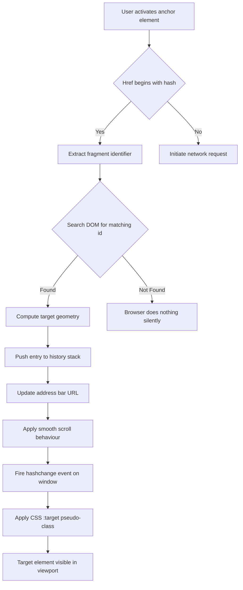
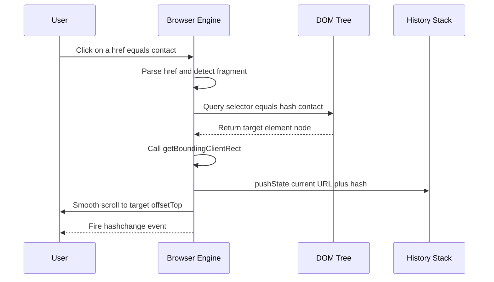
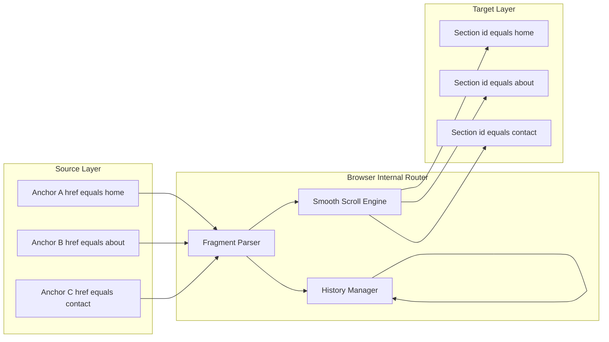
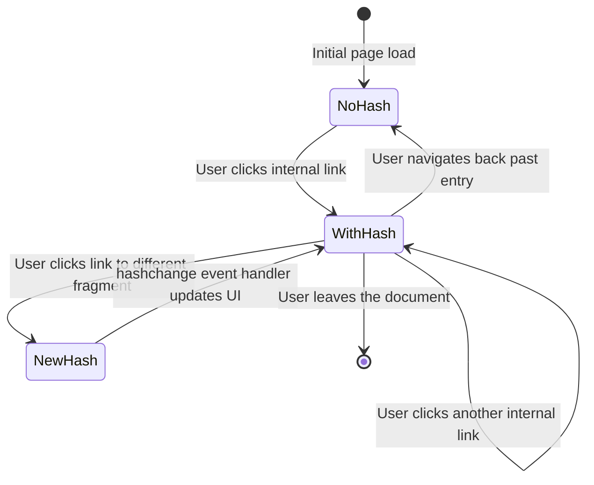

# Internal Linking

<!-- SECTION_1_START -->
# Internal Linking in HTML5

## 1.1 Formal Definition (KTU 2024 Syllabus Terminology)

> [!NOTE]
> **Internal Linking** (also called *intra-document linking* or *fragment linking*) is a client-side navigation mechanism in HTML5 that allows a user to jump from one location within a web page to another location **within the same document** without triggering a full HTTP request to the server.

In strict W3C HTML5.3 specification terms, internal linking is achieved by combining the **anchor element** (`<a>`) with a **fragment identifier** (a string prefixed by the hash `#` character). The target location is identified by a unique element via its **`id`** attribute (or the legacy `name` attribute on `<a>`).

> [!IMPORTANT]
> **KTU 2024 Module Highlight:** Internal links operate *purely on the client side*. No server round-trip occurs, which makes them essential for Single Page Applications (SPAs), long-form documentation, FAQ accordions, and Table-of-Contents navigation in modern responsive design.

## 1.2 Conceptual Analogy — Plain English Intuition

Imagine a **thick academic textbook** lying on your desk:

* The book's **Table of Contents** at the front lists chapter titles with page numbers (e.g., *Chapter 3 — Page 47*).
* When you click a chapter title in the TOC, you are **physically transported** to that page within the same book. You don't buy a new book. You don't go to a library. You simply flip the pages.
* The **Table of Contents entry** = the `<a href="#chapter3">` element.
* The **page number (47)** = the `id="chapter3"` attribute on the destination element.
* The **book itself** = your single HTML5 document (`index.html`).

**Key Intuition:** Internal links are *bookmarks* and *table-of-contents entries* rolled into one mechanism. The browser's rendering engine re-calculates the **scroll position** and the **target element's geometry** to deliver a seamless jump.

## 1.3 The Three Building Blocks

> [!TIP]
> Every internal link in HTML5 is composed of exactly three logical components. Memorize this triad — it is the most frequently tested concept in KTU Module 1.

| Component | HTML Construct | Role |
|---|---|---|
| **Source Anchor** | `<a href="#target">` | The clickable element |
| **Fragment Identifier** | `#target` | The pointer (URI fragment) |
| **Destination Element** | `<section id="target">` | The landing target |

## 1.4 Visualization Control

> [!VISUALIZATION CONTROL]
> **Concept:** Document scroll coordinate system for fragment navigation.
> **GeoGebra / Desmos Input Equations:**
> * `y = 1500` (total document height in pixels)
> * `y_0 = 200` (current scroll position)
> * `y_t = 800` (target element offsetTop)
> * `Delta = y_t - y_0` (computed scroll delta)
> **Visual Description:** On the vertical y-axis (representing the document's total scrollable height), the viewer's current viewport is a sliding window of fixed height. When an internal link is activated, the browser computes the offset of the destination element from the document's top-left origin (0, 0) and smoothly translates the viewport so that the target sits near the top of the visible region.

<!-- SECTION_1_END -->

<!-- SECTION_2_START -->
# Deep Theoretical Analysis & KTU High-Yield Syntax Sheet

## 2.1 Operational Mechanics — Step-by-Step

The browser executes an internal link click through a deterministic 6-stage pipeline:

1. **Click Event Capture** — The user activates the `<a>` element (mouse, touch, keyboard, or assistive technology).
2. **HREF Parsing** — The rendering engine parses the value of `href`. If the value begins with `#`, it is classified as a **same-document fragment reference** (RFC 3986 §4.4).
3. **Fragment Lookup** — The engine searches the DOM tree for an element whose `id` attribute strictly equals the fragment string (case-sensitive match).
4. **Target Geometry Calculation** — The `Element.getBoundingClientRect()` method (combined with cumulative `offsetTop` / `offsetLeft` of ancestors) is used to derive the absolute pixel coordinates of the target.
5. **History Stack Update** — A new entry is pushed onto the browser's `window.history` stack (unless the `href` is identical to the current URL). The URL bar updates to `https://example.com/page#section3`.
6. **Scroll & Focus** — The viewport is scrolled (instantly or via smooth-scroll CSS) so the target is in view. The element receives **keyboard focus** if it is focusable; otherwise, `scrollIntoView()` is invoked and the `hashchange` event fires on `window`.

## 2.2 The Two Anchor Forms

### Form A — Linking to a Section by ID (Modern, HTML5 Standard)

```html
<a href="#contact">Go to Contact Section</a>

<section id="contact">
  <h2>Contact Us</h2>
</section>
```

### Form B — Legacy Named Anchor (Deprecated but still tested)

```html
<a href="#bottom">Jump to Bottom</a>

<a name="bottom"></a>
```

> [!WARNING]
> The `name` attribute on `<a>` is **obsolete in HTML5**. KTU examiners may still ask for the difference — answer with: "The `id` attribute is the modern, universally-supported replacement; the `name` attribute on anchors is retained only for backward compatibility and is not allowed on non-`<a>` elements."

## 2.3 KTU High-Yield Attribute Reference Table

> [!IMPORTANT]
> All values must be enclosed in **double quotes** in XHTML5 / strict HTML5. The fragment identifier is a **URI fragment**, not a CSS selector — it does not understand `.` for class or other CSS syntax.

| Attribute | Applies To | Permitted Values | Behaviour Description |
|---|---|---|---|
| `href` | `<a>`, `<area>` | URI or `#fragment` | Specifies the link destination |
| `id` | Any HTML element | Unique token (no spaces) | Defines the target of an internal link |
| `target` | `<a>` | `_self`, `_blank`, `_parent`, `_top` | Controls browsing context. For internal links, `_self` is implicit |
| `rel` | `<a>` | `noopener`, `noreferrer`, `bookmark` | Relationship hint to the browser and SEO crawlers |
| `download` | `<a>` | filename (optional) | Prompts save-as; ignored for internal `#` links |
| `tabindex` | `<a>` | Integer | Customizes keyboard tab order |

## 2.4 KTU High-Yield Pseudo-Symbolic "Equations"

Although HTML is declarative, the link resolution can be expressed symbolically:

$$
\text{Link}_{resolved} = \text{href}_{value} \oplus \text{BaseURI}_{document}
$$

For pure internal links, the `BaseURI` is the document's own URL, so:

$$
\text{FinalURI} = \text{BaseURI} \;\vert\; \text{\#} \; \text{fragmentID}
$$

The scroll target is computed as:

$$
y_{scroll} = \sum_{i=1}^{n} \text{offsetTop}(E_i) \quad \text{where } E_0 = \text{target element},\; E_i = \text{ancestor}_i
$$

## 2.5 Real-World Engineering Utility

* **Single Page Applications (React, Vue, Angular):** React Router's `<Link to="#section">` and the native `HashRouter` strategy depend entirely on this mechanism.
* **Documentation Portals:** MDN, W3Schools, and KTU e-learning portals use fragment links for deep linking to subsections.
* **Accessibility (WCAG 2.1):** `aria-current="location"` and skip-navigation links (`<a href="#maincontent">Skip to main content</a>`) are mission-critical for screen-reader users.
* **SEO & Analytics:** Googlebot indexes fragment URLs separately, enabling long-tail keyword targeting.
* **Print Stylesheets:** Combining fragment links with `@media print` allows collapsible print views.

<!-- SECTION_2_END -->

<!-- SECTION_3_START -->
# Step-by-Step Implementation — Full HTML5 Code

## 3.1 Complete Minimal Demonstration

The following standalone HTML5 document is **fully runnable**. Save it as `internallinks.html` and open in any modern browser. Every line is annotated; nothing is truncated.

```html
<!DOCTYPE html>
<html lang="en">
<head>
  <meta charset="UTF-8">
  <meta name="viewport" content="width=device-width, initial-scale=1.0">
  <title>KTU Internal Linking Demonstration</title>
  <style>
    /* Optional: smooth-scroll behaviour for a polished demo */
    html { scroll-behavior: smooth; }
    body { font-family: "Segoe UI", Arial, sans-serif; line-height: 1.6; margin: 0; }
    nav { position: sticky; top: 0; background: #ffffff; padding: 10px; border-bottom: 2px solid #333; }
    nav a { margin-right: 15px; text-decoration: none; color: #0066cc; }
    nav a:hover { text-decoration: underline; }
    section { padding: 60px 20px; border-bottom: 1px dashed #ccc; min-height: 60vh; }
    h2 { color: #2c3e50; }
    .target-highlight:target { background: #fffacd; transition: background 0.5s; }
  </style>
</head>
<body>

  <!-- ============================================ -->
  <!-- STEP 1: BUILD THE NAVIGATION BAR (SOURCE)    -->
  <!-- ============================================ -->
  <nav aria-label="Table of Contents">
    <a href="#home">Home</a>
    <a href="#about">About</a>
    <a href="#syllabus">Syllabus</a>
    <a href="#contact">Contact</a>
    <a href="#top">Back to Top</a>
  </nav>

  <!-- ============================================ -->
  <!-- STEP 2: CREATE THE DESTINATION ELEMENTS     -->
  <!-- Each section gets a unique id attribute.      -->
  <!-- ============================================ -->

  <a id="top"></a>

  <section id="home" class="target-highlight">
    <h2>1. Home Section</h2>
    <p>Welcome to the KTU Web Programming demonstration page.</p>
  </section>

  <section id="about" class="target-highlight">
    <h2>2. About Section</h2>
    <p>This page demonstrates internal (intra-document) linking using HTML5 anchors.</p>
  </section>

  <section id="syllabus" class="target-highlight">
    <h2>3. KTU 2024 Module 1 Syllabus Highlights</h2>
    <ul>
      <li>Introduction to HTML5</li>
      <li>Document structure: DOCTYPE, head, body</li>
      <li>Internal and External Linking (current topic)</li>
      <li>Forms, Media, and Semantic Elements</li>
    </ul>
  </section>

  <section id="contact" class="target-highlight">
    <h2>4. Contact Section</h2>
    <p>Email: webprogramming@ktu.ac.in</p>
  </section>

  <!-- ============================================ -->
  <!-- STEP 3: OPTIONAL JAVASCRIPT ENHANCEMENT      -->
  <!-- Listens to hashchange for dynamic feedback   -->
  <!-- ============================================ -->
  <script>
    window.addEventListener("hashchange", function(event) {
      console.log("Internal navigation detected. New fragment:", location.hash);
    });
  </script>

</body>
</html>
```

### Exhaustive Code Walkthrough

* **Line: `<!DOCTYPE html>`** — Declares HTML5; mandatory at the top of every modern document.
* **Line: `lang="en"`** — Sets the document language for screen readers and search engines.
* **Line: `html { scroll-behavior: smooth; }`** — Activates CSS smooth scrolling. Without this, jumps are instantaneous. The property is supported in all evergreen browsers.
* **Line: `:target` pseudo-class** — The CSS selector `.target-highlight:target` applies a yellow background to whichever section currently matches the URL fragment. This is a *high-yield* KTU concept: the `:target` pseudo-class is the only CSS selector that responds to internal-link activation.
* **Line: `<a id="top"></a>`** — A bare anchor used purely as a destination marker. Modern best practice would use `<header id="top">` instead.
* **Line: `<nav aria-label="Table of Contents">`** — Semantic HTML5 element. The `aria-label` is an accessibility best practice.
* **Line: `<a href="#contact">Contact</a>`** — The source anchor. Notice the hash symbol prefix; without it, the browser would treat `contact` as a *relative URL* and try to fetch a file called `contact`.

## 3.2 Variant Example — Table of Contents with List Semantics

```html
<!DOCTYPE html>
<html lang="en">
<head>
  <meta charset="UTF-8">
  <title>KTU Module 1 — Full TOC</title>
</head>
<body>
  <h1>Web Programming — Module 1</h1>

  <!-- Semantic ordered list of internal links -->
  <nav>
    <ol>
      <li><a href="#m1-intro">1.1 Introduction to HTML5</a></li>
      <li><a href="#m1-tags">1.2 Basic Tags &amp; Elements</a></li>
      <li><a href="#m1-links">1.3 Internal &amp; External Links</a></li>
      <li><a href="#m1-images">1.4 Images &amp; Multimedia</a></li>
    </ol>
  </nav>

  <hr>

  <section id="m1-intro">
    <h2>1.1 Introduction to HTML5</h2>
    <p>HTML5 is the fifth and final major HTML revision by W3C.</p>
  </section>

  <section id="m1-tags">
    <h2>1.2 Basic Tags</h2>
    <p>Heading tags range from h1 (largest) to h6 (smallest).</p>
  </section>

  <section id="m1-links">
    <h2>1.3 Internal and External Linking</h2>
    <p>Internal links use the hash symbol; external links use full or relative URLs.</p>
  </section>

  <section id="m1-images">
    <h2>1.4 Images and Multimedia</h2>
    <p>The img element is a void element and uses the src attribute.</p>
  </section>

  <p><a href="#top">Return to Table of Contents</a></p>
</body>
</html>
```

### Exhaustive Code Walkthrough

* **`<ol>` with `<li>` wrapping `<a>`** — This is the **most semantically correct** form for a Table of Contents and earns full marks in KTU valuations.
* **Multiple destination `<section>` elements** — Each carries a unique `id`. KTU explicitly tests whether students understand that **IDs must be unique within a document**.
* **`<hr>`** — Thematic break; purely visual.
* **`&amp;` entity** — The ampersand in "Internal & External Linking" is escaped as `&amp;` to produce a literal `&` in the rendered output. KTU examiners deduct marks for unescaped ampersands in prose text.

## 3.3 Variant Example — Skip Navigation Link (Accessibility)

```html
<!DOCTYPE html>
<html lang="en">
<head>
  <meta charset="UTF-8">
  <title>Accessible Page with Skip Link</title>
  <style>
    .skip-link {
      position: absolute;
      left: -9999px;
      top: auto;
      width: 1px;
      height: 1px;
      overflow: hidden;
    }
    .skip-link:focus {
      position: static;
      width: auto;
      height: auto;
      padding: 8px;
      background: #000;
      color: #fff;
    }
  </style>
</head>
<body>
  <a class="skip-link" href="#maincontent">Skip to main content</a>
  <header>
    <h1>KTU Web Programming</h1>
    <nav><a href="#maincontent">Main</a> | <a href="#footer">Footer</a></nav>
  </header>
  <main id="maincontent" tabindex="-1">
    <h2>Main Content Area</h2>
    <p>Screen-reader users press Tab once and Enter to skip the navigation chrome.</p>
  </main>
  <footer id="footer">
    <p>&copy; 2024 KTU. All rights reserved.</p>
  </footer>
</body>
</html>
```

### Exhaustive Code Walkthrough

* **`.skip-link` offscreen positioning** — `left: -9999px` hides the link visually but keeps it in the accessibility tree.
* **`:focus` state restoration** — When the link receives keyboard focus, it is brought back into the visual layout.
* **`tabindex="-1"`** on the `<main>` element — Allows the destination to receive programmatic focus so screen readers announce the region change correctly. This is a **WCAG 2.4.1 Bypass Blocks** compliant pattern.

<!-- SECTION_3_END -->

<!-- SECTION_4_START -->
# Structural Diagrams & Schematics

## 4.1 Mermaid Flowchart — Internal Link Resolution Pipeline



**Reading the Diagram:** The diamond-shaped nodes represent decision points. The pipeline branches at the first diamond based on whether the `href` value contains a fragment identifier. Only the **right branch** (Yes) describes internal-link behaviour; the **left branch** is shown for contrast to external linking, which is a Module 1 follow-up topic.

## 4.2 Mermaid Sequence Diagram — User, Browser, and DOM Interaction



**Reading the Diagram:** Lifelines run top-to-bottom. Arrows crossing lifelines represent message exchanges. The browser engine never contacts the web server — note the absence of any arrow to a `Server` participant.

## 4.3 Mermaid Block Diagram — Component Architecture



**Reading the Diagram:** Three subgraphs isolate the logical layers. The `RouterLayer` is a conceptual abstraction — the browser internally implements this routing as part of the HTML5 spec's browsing-context navigation algorithm.

## 4.4 Mermaid State Diagram — URL Fragment Lifecycle



**Reading the Diagram:** Each state represents the current value of `window.location.hash`. The `hashchange` event is the observer that production-quality SPAs subscribe to in order to update their UI state.

<!-- SECTION_4_END -->

<!-- SECTION_5_START -->
# KTU 2024 Scheme Examination Question Bank & Topic Recap

## 5.1 Part A — Short Answer Questions (3 Marks Each)

### Question 1
**`[KTU University Exam — July 2024]`** &nbsp; **| CO1 | Remember**

Explain the term **internal linking** in HTML5. How does it differ from external linking?

**Model Answer (3 Marks):**

> **Internal linking** is a navigation mechanism in HTML5 that allows users to jump from one location to another **within the same HTML document** using a fragment identifier prefixed by the hash character. It is implemented via the `<a>` element's `href` attribute and the destination element's `id` attribute.
>
> The key difference from **external linking** is that internal linking does **not generate a new HTTP request** to the server. The browser simply scrolls to a target element within the already-loaded document, whereas external linking fetches a separate resource (HTML file, PDF, image, or another website). **[1 Mark for definition, 1 Mark for internal mechanism, 1 Mark for contrast]**

### Question 2
**`[KTU University Exam — Dec 2023]`** &nbsp; **| CO1 | Understand**

What is the significance of the `:target` CSS pseudo-class? Write a small HTML snippet demonstrating its use.

**Model Answer (3 Marks):**

The `:target` pseudo-class selects the element whose `id` matches the URL's fragment identifier. It is the only CSS selector that reacts to internal-link activation. **[1 Mark]**

```html
<!DOCTYPE html>
<html>
<head><style>
  section:target { background: yellow; padding: 10px; }
</style></head>
<body>
  <a href="#sec1">Go to Section 1</a>
  <section id="sec1"><h2>Section 1</h2><p>Highlighted when targeted.</p></section>
</body>
</html>
```

**[1 Mark for theory, 2 Marks for correct snippet with paired href and id]**

---

## 5.2 Part B — Long Answer Questions (14 Marks Each, with Internal Choice)

### Question A (14 Marks)
**`[KTU University Exam — Dec 2024]`** &nbsp; **| CO1, CO2 | Understand, Apply**

**(a)** Discuss the role of the `id` attribute in internal linking with a suitable example. List any four rules for assigning valid `id` values in HTML5. **[7 Marks]**

**(b)** Design a complete HTML5 page for a "KTU Web Programming — Module 1" portal that includes:
   * A sticky navigation bar with at least **four** internal links.
   * At least **four** destination sections, each with a unique `id`.
   * The `:target` pseudo-class used to highlight the currently active section.
   * A "Back to Top" link at the bottom of every section.
   * Proper semantic elements (`<header>`, `<nav>`, `<main>`, `<section>`, `<footer>`).
   **[7 Marks]**

### Model Answer A (a) — 7 Marks

The `id` attribute is the modern HTML5 mechanism for uniquely identifying an element within a document. The `<a>` element uses this identifier as the destination of a fragment-based internal link. **Valuation Key Point: Stating the role of id — 2 Marks.**

**Four rules for valid `id` values in HTML5:**

1. The value must contain **at least one character**. **[0.5 Mark]**
2. The value must **not contain any whitespace** (spaces, tabs, newlines). **[0.5 Mark]**
3. The value must be **unique within the document** — no two elements may share the same `id`. **[0.5 Mark]**
4. The value is **case-sensitive**. `id="About"` and `id="about"` are distinct. **[0.5 Mark]**

**Example:**

```html
<a href="#syllabus">View Syllabus</a>
<section id="syllabus">
  <h2>Module 1 Syllabus</h2>
</section>
```

**Valuation Key Point: Correct fragment syntax with hash — 1 Mark. Matching id on the destination — 1 Mark. Semantic destination element — 1 Mark.**

### Model Answer A (b) — 7 Marks

```html
<!DOCTYPE html>
<html lang="en">
<head>
  <meta charset="UTF-8">
  <title>KTU Web Programming — Module 1 Portal</title>
  <style>
    html { scroll-behavior: smooth; }
    body { font-family: Arial, sans-serif; margin: 0; }
    header { background: #2c3e50; color: #fff; padding: 15px; text-align: center; }
    nav { position: sticky; top: 0; background: #34495e; padding: 10px; }
    nav a { color: #ecf0f1; margin: 0 10px; text-decoration: none; }
    nav a:hover { text-decoration: underline; }
    main { padding: 20px; }
    section { padding: 40px 20px; border-bottom: 1px solid #ccc; min-height: 50vh; }
    section:target { background: #fffacd; transition: background 0.4s; }
    footer { background: #2c3e50; color: #fff; text-align: center; padding: 10px; }
  </style>
</head>
<body>
  <header id="top">
    <h1>KTU Web Programming — Module 1</h1>
  </header>
  <nav aria-label="Module Navigation">
    <a href="#intro">Introduction</a>
    <a href="#html5">HTML5 Basics</a>
    <a href="#links">Linking Concepts</a>
    <a href="#forms">Forms Overview</a>
  </nav>
  <main>
    <section id="intro">
      <h2>1. Introduction</h2>
      <p>HTML5 is the cornerstone of modern web development.</p>
      <p><a href="#top">Back to Top</a></p>
    </section>
    <section id="html5">
      <h2>2. HTML5 Basics</h2>
      <p>Document structure includes DOCTYPE, html, head, and body.</p>
      <p><a href="#top">Back to Top</a></p>
    </section>
    <section id="links">
      <h2>3. Linking Concepts</h2>
      <p>Internal links use fragment identifiers prefixed with hash.</p>
      <p><a href="#top">Back to Top</a></p>
    </section>
    <section id="forms">
      <h2>4. Forms Overview</h2>
      <p>The form element collects user input via input, select, and textarea.</p>
      <p><a href="#top">Back to Top</a></p>
    </section>
  </main>
  <footer>
    <p>&copy; 2024 APJ Abdul Kalam Technological University</p>
  </footer>
</body>
</html>
```

**Valuation Key Points:**
* Sticky navigation with at least 4 internal links — **1 Mark**.
* Four unique destination sections with semantic markup — **2 Marks**.
* `:target` pseudo-class correctly applied — **1 Mark**.
* "Back to Top" link present in every section — **1 Mark**.
* Proper semantic elements (`header`, `nav`, `main`, `section`, `footer`) — **1 Mark**.
* Correct use of `&copy;` HTML entity and `lang` attribute — **1 Mark**.

### Question B (14 Marks) — Alternative Choice
**`[KTU University Exam — July 2024]`** &nbsp; **| CO1, CO2 | Understand, Apply**

**(a)** Compare and contrast internal linking with external linking in HTML5. Your answer must include a code example for each. **[7 Marks]**

**(b)** Explain accessibility considerations for internal links. Demonstrate the **skip-navigation** pattern with a complete HTML5 code example. Justify why `tabindex="-1"` is added to the destination. **[7 Marks]**

### Model Answer B (a) — 7 Marks

| Aspect | Internal Linking | External Linking |
|---|---|---|
| Scope | Within the same document | To a different document or website |
| HTTP request | None — pure client-side | Generates a new HTTP GET request |
| URL pattern | Begins with `#fragment` | Begins with `http://`, `https://`, or relative path |
| Server load | Zero | Increases server traffic |
| Use case | Table of Contents, FAQ | Navigating between pages |

**Internal Link Example — 1 Mark:**

```html
<a href="#chapter2">Go to Chapter 2</a>
<h2 id="chapter2">Chapter 2 — Linking</h2>
```

**External Link Example — 1 Mark:**

```html
<a href="https://www.ktu.edu.in" target="_blank" rel="noopener">
  Visit KTU Official Website
</a>
```

**Valuation Key Points:**
* Tabular comparison with at least 4 distinct rows — **3 Marks**.
* Two correct, contrasting code examples — **2 Marks**.

### Model Answer B (b) — 7 Marks

Accessibility considerations for internal links include: ensuring links are keyboard-accessible, providing visible focus indicators, using descriptive link text, and allowing screen-reader users to skip repetitive navigation. **Valuation Key Point: Listing accessibility principles — 2 Marks.**

**Skip-Navigation Code — 3 Marks:**

```html
<!DOCTYPE html>
<html lang="en">
<head>
  <meta charset="UTF-8">
  <title>Accessible KTU Page</title>
  <style>
    .skip-link { position: absolute; left: -9999px; }
    .skip-link:focus { position: static; background: #000; color: #fff; padding: 8px; }
  </style>
</head>
<body>
  <a class="skip-link" href="#maincontent">Skip to main content</a>
  <nav>
    <a href="#home">Home</a>
    <a href="#about">About</a>
  </nav>
  <main id="maincontent" tabindex="-1">
    <h1>Main Content</h1>
    <p>Visible after activating the skip link.</p>
  </main>
</body>
</html>
```

**Justification for `tabindex="-1"` — 2 Marks:**

The `tabindex="-1"` attribute on the `<main>` element makes the destination programmatically focusable without inserting it into the natural tab order. When the skip link is activated, the destination receives keyboard focus, prompting screen readers to announce the new region. This satisfies **WCAG 2.4.1 Bypass Blocks** and ensures users with motor impairments do not have to tab through every navigation link on every page load.

> [!WARNING]
> **KTU Examiner's Valuation Pitfall Callout:**
> * **Do not** use the `name` attribute on non-anchor elements — the HTML5 spec forbids it.
> * **Do not** forget the hash (`#`) prefix; without it, the browser treats the value as a relative URL and attempts a network request that will 404.
> * **Do not** duplicate `id` values — KTU examiners instantly deduct 1 mark for every duplicate.
> * **Do not** wrap block-level content inside `<a>` without verifying it is valid in HTML5 — `<a>` is "transparent" but cannot contain other `<a>` elements.
> * **Do not** omit the `lang` attribute on `<html>` — it is tested in nearly every KTU past paper.

---

## 5.3 Topic Recap & Important Things to Remember

* **Definition:** Internal linking navigates **within a single HTML document** using fragment identifiers.
* **Triad:** Source `<a href="#x">` + Fragment `#x` + Destination `id="x"`.
* **Hash Prefix:** The `#` character is **mandatory**; it triggers same-document mode.
* **No HTTP Request:** Internal links never contact the server.
* **Case Sensitivity:** `id` values and fragment strings are case-sensitive.
* **Uniqueness:** No two elements in a document may share the same `id`.
* **Legacy `name`:** The `name` attribute on `<a>` is obsolete in HTML5 but may appear in older exam questions.
* **`:target` Pseudo-Class:** The single CSS selector that responds to internal-link activation — use it for visual highlight effects.
* **`scroll-behavior: smooth`:** A CSS property that animates the scroll triggered by internal links.
* **Accessibility:** Use `aria-label` on `<nav>`, descriptive link text, and the skip-navigation pattern with `tabindex="-1"` on the destination.
* **URL Bar Update:** Activating an internal link updates the address bar and pushes a new entry onto `window.history`; the `hashchange` event fires on `window`.
* **Most-Tested Snippet:** A complete page with sticky `<nav>`, four `<section>` destinations, and a `:target` style — practice writing this from memory.
* **Entity Escaping:** Always escape `&` as `&amp;` in prose; use `&copy;` for the copyright symbol.
* **Semantic Elements:** Use `<nav>`, `<main>`, `<section>`, `<header>`, `<footer>` instead of generic `<div>` containers wherever possible.

<!-- SECTION_5_END -->
