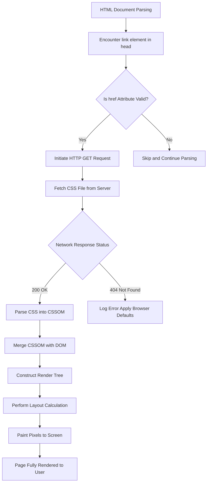
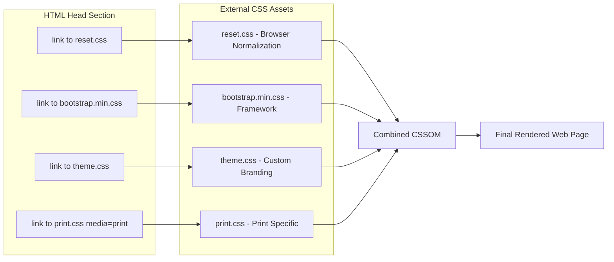
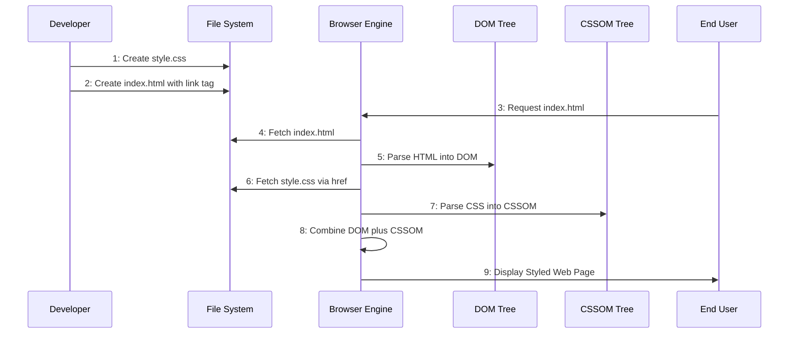

# Linking External Style Sheets

<!-- SECTION_1_START -->
# Linking External Style Sheets

## Formal Academic Definition (KTU 2024 Syllabus Terminology)

An **External Style Sheet** is a separate Cascading Style Sheets (CSS) file with the `.css` extension that contains standalone styling rules, which can be linked to one or more HTML documents using the `<link>` element placed inside the `<head>` section of the HTML page. This mechanism enables **separation of presentation from content**, a foundational principle of modern web engineering that allows developers to maintain a unified visual identity across multiple web pages from a single source file.

> [!IMPORTANT]
> **KTU 2024 Highlight:** The `<link>` element is a **void element** (self-closing) and must use the `rel="stylesheet"` attribute to be semantically recognized as a CSS source by the browser's rendering engine.

## Conceptual Analogy / Intuition

Imagine you are the **manager of a chain of 50 restaurants** (your web pages). Instead of telling each chef (each HTML file) individually how to plate the food, you create **one master recipe book** (the external `.css` file) and place a copy in every kitchen. Now, if you want to change the plating style for all restaurants, you only update **one book**, and all kitchens follow it instantly.

- The **HTML file** = The kitchen (content/structure).
- The **External CSS file** = The master recipe book (presentation rules).
- The **`<link>` tag** = The instruction to "use this recipe book."

> [!NOTE]
> **Core Definition:** The process of associating an external `.css` file with an HTML document is called **"Linking"** or **"Attaching"** an external style sheet. The browser performs a synchronous HTTP GET request to fetch this file before rendering the page.

## Standard Metrics & Constants

- **Default MIME Type** for CSS files: **`text/css`**
- **Recommended File Extension**: **`.css`**
- **Browser Rendering Standard**: The browser **blocks rendering** until the external CSS file is fetched and parsed (render-blocking resource).
- **HTML5 Standard Attribute Order** for `<link>`: `rel`, `href`, `type`, `media`, `crossorigin`, `integrity`.

> [!VISUALIZATION CONTROL]
> **Concept:** Browser Fetching Sequence for Linked CSS
> **GeoGebra / Desmos Input Equations:**
> * Point A = `(0, 1)` labeled "HTML Parsing Begins"
> * Point B = `(2, 1)` labeled "`<link>` Encountered in `<head>`"
> * Point C = `(4, 1)` labeled "HTTP GET Request to styles.css"
> * Point D = `(6, 1)` labeled "CSS Parsed and Applied"
> * Point E = `(8, 1)` labeled "Page Rendered to User"
> **Visual Description:** A horizontal sequence showing how the browser pauses HTML parsing to fetch and apply the linked external CSS before continuing the render pipeline.
<!-- SECTION_1_END -->

<!-- SECTION_2_START -->
# Deep Theoretical Analysis & KTU High-Yield Formula Sheet

## Operational Breakdown of the Linking Mechanism

The process of linking an external style sheet follows a precise, browser-engineered sequence:

1. **HTML Parser Initiation**: The browser begins parsing the HTML document from the top of the `<!DOCTYPE html>` declaration.
2. **Head Section Encounter**: The parser reaches the `<head>` block where the `<link>` element resides.
3. **Attribute Resolution**: The browser reads the attributes — `rel` confirms the relationship type (`stylesheet`), `href` provides the resource path, and `type` validates the MIME format.
4. **Network Request Dispatch**: A separate HTTP request is sent to fetch the file specified in `href`.
5. **CSSOM Construction**: The fetched CSS is parsed into the **CSS Object Model (CSSOM)**, a tree-like data structure.
6. **Render Tree Assembly**: The CSSOM is merged with the **DOM (Document Object Model)** to create the Render Tree.
7. **Layout & Paint**: The browser computes geometry and paints pixels to the screen.

> [!NOTE]
> **Why `<link>` Goes in `<head>` and Not `<body>`:** Placing `<link>` in `<body>` causes a **Flash of Unstyled Content (FOUC)**, where the page briefly displays without styling. KTU examiners frequently test this conceptual pitfall.

## Attributes of the `<link>` Element for CSS

- **`rel="stylesheet"`**: Declares the relationship. Without this, the browser ignores the link.
- **`href="path/to/file.css"`**: Specifies the URL — can be relative, absolute, or a CDN URL.
- **`type="text/css"`**: Optional in HTML5, but considered best practice for legacy compatibility.
- **`media="screen"`** or **`media="print"`**: Applies the stylesheet only to specific media types.
- **`media="(max-width: 600px)"`**: Used for responsive design via media queries.
- **`crossorigin="anonymous"`**: Used when loading CSS from a different origin (CORS requirement).
- **`integrity="sha384-..."`**: Subresource Integrity (SRI) hash for security validation of CDN-hosted files.
- **`disabled`**: Boolean attribute that can dynamically disable the linked stylesheet via JavaScript.

## KTU Formula Sheet / Cheat Sheet

| **Attribute / Concept** | **Syntax Pattern** | **Purpose** | **Best Practice** |
|-------------------------|--------------------|-------------|------------------|
| Basic Link | `<link rel="stylesheet" href="style.css">` | Links a local CSS file | Place inside `<head>` |
| MIME Type Declaration | `type="text/css"` | Specifies file format | Optional in HTML5 |
| Media Targeting | `media="screen and (min-width: 768px)"` | Responsive styling | Combine multiple with commas |
| Preload Hint | `<link rel="preload" href="style.css" as="style">` | Reduces render-blocking | Use for critical CSS |
| Alternate Stylesheet | `rel="alternate stylesheet"` | User-selectable themes | Combine with `title` attribute |
| SRI Security | `integrity="sha384-hash"` `crossorigin="anonymous"` | CDN tamper protection | Always use with third-party CSS |
| Disabled State | `disabled` attribute present | Temporarily inactive sheet | Toggle via JS |

## Engineering Real-World Utility

In production engineering, external style sheets power **Design Systems** like Google's Material Design, Mozilla's MDN Web Docs, and frameworks like **Bootstrap** and **Tailwind CSS**. When a Fortune 500 company deploys a website with thousands of pages, a single bug fix in the external CSS cascades across every page automatically — this is the engineering scalability that internal (inline) styles cannot achieve. **CDN-hosted CSS** (e.g., loading Bootstrap from `cdn.jsdelivr.net`) is the industry standard for performance optimization.

<!-- SECTION_2_END -->

<!-- SECTION_3_START -->
# Step-by-Step Implementation & Code Walkthrough

## Exhaustive Step-by-Step Walkthrough

### Step 1: Create the External CSS File

Create a new file named **`style.css`** in the same directory as your HTML file. This file contains **only** CSS rules — no HTML tags.

```css
/* style.css - External Stylesheet */
body {
    background-color: #f4f6f9;
    font-family: 'Segoe UI', Tahoma, sans-serif;
    margin: 0;
    padding: 0;
    color: #2c3e50;
}

header {
    background-color: #1a73e8;
    color: #ffffff;
    padding: 20px;
    text-align: center;
}

h1 {
    font-size: 2.5em;
    margin: 0;
}

.content {
    max-width: 900px;
    margin: 30px auto;
    padding: 25px;
    background-color: #ffffff;
    border-radius: 8px;
    box-shadow: 0 2px 8px rgba(0, 0, 0, 0.1);
}

button {
    background-color: #1a73e8;
    color: #ffffff;
    border: none;
    padding: 12px 24px;
    cursor: pointer;
    border-radius: 4px;
}
```

### Step 2: Create the HTML File

Create **`index.html`** and link the external CSS using the `<link>` element inside `<head>`.

```html
<!DOCTYPE html>
<html lang="en">
<head>
    <meta charset="UTF-8">
    <meta name="viewport" content="width=device-width, initial-scale=1.0">
    <title>External CSS Demo</title>

    <!-- Step 2a: The Link Element -->
    <link rel="stylesheet" href="style.css" type="text/css">

    <!-- Step 2b: Optional Preload for Performance -->
    <link rel="preload" href="style.css" as="style">
</head>
<body>
    <header>
        <h1>Welcome to KTU Web Programming</h1>
    </header>

    <div class="content">
        <h2>Module 1: HTML5 Fundamentals</h2>
        <p>
            This page is styled using an <strong>external style sheet</strong>.
            Open <code>style.css</code> to see the rules.
        </p>
        <button onclick="alert('Hello from KTU!')">Click Me</button>
    </div>
</body>
</html>
```

### Step 3: Apply Responsive Media Query Enhancement

Extend **`style.css`** with media-specific rules for mobile responsiveness.

```css
/* Tablet and below */
@media screen and (max-width: 768px) {
    h1 {
        font-size: 1.8em;
    }
    .content {
        margin: 15px;
        padding: 18px;
    }
}

/* Mobile devices */
@media screen and (max-width: 480px) {
    header {
        padding: 12px;
    }
    button {
        width: 100%;
    }
}
```

### Step 4: Multiple Stylesheet Linking (Advanced Pattern)

```html
<head>
    <!-- Base reset stylesheet -->
    <link rel="stylesheet" href="css/reset.css">
    <!-- Framework stylesheet -->
    <link rel="stylesheet" href="css/bootstrap.min.css">
    <!-- Custom theme -->
    <link rel="stylesheet" href="css/theme.css">
    <!-- Print-specific stylesheet -->
    <link rel="stylesheet" href="css/print.css" media="print">
</head>
```

> [!NOTE]
> **Cascade Order Rule:** When multiple external stylesheets are linked, the **last one linked wins** for conflicting selectors (assuming equal specificity). This is the "L" in the **L**ast-**C**omes-**F**irst-Served cascade rule.

## Multiple Linking Strategies — Tabular Comparison

| **Strategy** | **Syntax** | **Scope** | **Use Case** |
|--------------|------------|-----------|--------------|
| Single Local File | `<link rel="stylesheet" href="style.css">` | Current site | Small projects |
| CDN-Hosted | `<link rel="stylesheet" href="https://cdn.example.com/lib.css">` | Global | Frameworks (Bootstrap, Tailwind) |
| Media-Specific | `<link rel="stylesheet" href="print.css" media="print">` | Print preview | Printable invoices, reports |
| Alternate Theme | `<link rel="alternate stylesheet" title="Dark Mode" href="dark.css">` | User-selected | Accessibility themes |
| Preload + Apply | `<link rel="preload" href="style.css" as="style" onload="this.rel='stylesheet'">` | Critical CSS | Performance optimization |

<!-- SECTION_3_END -->

<!-- SECTION_4_START -->
# Structural Diagrams & Schematics

## Mermaid Flow Diagram: Browser CSS Loading Pipeline



## Mermaid Block Diagram: Multi-Stylesheet Architecture



## Mermaid Sequence Diagram: Developer-to-Browser CSS Flow



<!-- SECTION_4_END -->

<!-- SECTION_5_START -->
# KTU 2024 Scheme Examination Question Bank

---

## Part A Questions (3 Marks Each)

### Question 1: `[KTU University Exam - July 2024]`
**Q: List any three attributes of the `<link>` element used to attach an external style sheet, and state why `rel="stylesheet"` is mandatory.** `[CO1 - Remember]`

**Model Answer:**

1. **`href`**: Specifies the URL/path of the external CSS file.
2. **`type`**: Declares the MIME type, conventionally `text/css`.
3. **`media`**: Restricts the stylesheet to specific devices (e.g., `screen`, `print`).

**Why `rel="stylesheet"` is mandatory:** The `rel` attribute defines the relationship between the current HTML document and the linked resource. The browser uses this value to determine **how to process** the fetched file. Without `rel="stylesheet"`, the browser does not interpret the linked file as CSS and will not apply its rules to the page. It is the semantic flag that activates the cascade engine.

---

### Question 2: `[KTU University Exam - Dec 2023]`
**Q: Differentiate between an internal style sheet and an external style sheet with respect to the HTML element used and the scope of reusability.** `[CO1 - Understand]`

**Model Answer:**

| **Parameter** | **Internal Style Sheet** | **External Style Sheet** |
|---------------|--------------------------|---------------------------|
| HTML Element Used | `<style>` block inside `<head>` | `<link>` element inside `<head>` |
| File Storage | Embedded within the HTML file | Separate `.css` file |
| Reusability Scope | Limited to the single HTML page | Reusable across multiple HTML pages |
| Maintenance Effort | High (edit every page individually) | Low (edit one file, affects all pages) |
| Best Use Case | Page-specific overrides | Site-wide consistent styling |

---

## Part B Questions (14 Marks with Internal Choice)

---

### Question A: `[KTU University Exam - July 2024]`

**Sub-part (a) [7 Marks]: Explain the `<link>` element syntax for attaching an external CSS file. Discuss the `media` attribute with two real-world examples. `[CO2 - Understand]`**

**Model Solution:**

The `<link>` element is a void HTML element that establishes a relationship between the current document and an external resource. When used with `rel="stylesheet"`, it instructs the browser to fetch and apply a CSS file.

**Basic Syntax:**

```html
<link rel="stylesheet" href="path/to/stylesheet.css">
```

The `media` attribute is an optional but powerful feature that **conditionally applies** a stylesheet based on the device or viewport characteristics.

**Example 1 — Print-Only Stylesheet:**

```html
<link rel="stylesheet" href="print.css" media="print">
```

This CSS is applied **only** when the user prints the page or uses the browser's print preview. It is commonly used to hide navigation menus, adjust font sizes, and remove background colors to save printer ink.

**Example 2 — Mobile-Responsive Stylesheet:**

```html
<link rel="stylesheet" href="mobile.css" media="screen and (max-width: 600px)">
```

This CSS activates **only** when the viewport width is 600 pixels or less — typically smartphones in portrait mode. It enables developers to deliver mobile-optimized layouts without media query logic inside the CSS itself.

**Valuation Key Points:**
- `[Correct link syntax: 2 Marks]`
- `[Explanation of rel attribute: 1 Mark]`
- `[Print example with correct media value: 2 Marks]`
- `[Mobile example with media query: 2 Marks]`

**Sub-part (b) [7 Marks]: Write a complete HTML5 program that links an external style sheet named `mystyle.css` and demonstrates three CSS rules applied to a header, paragraph, and button. Show the expected browser output structure. `[CO3 - Apply]`**

**Model Solution:**

**File 1: `mystyle.css`**

```css
header {
    background-color: navy;
    color: white;
    padding: 15px;
    text-align: center;
}

p {
    font-size: 18px;
    line-height: 1.6;
    color: #333;
}

button {
    background-color: green;
    color: white;
    border: 2px solid darkgreen;
    padding: 10px 20px;
    cursor: pointer;
}
```

**File 2: `index.html`**

```html
<!DOCTYPE html>
<html>
<head>
    <title>External CSS Demonstration</title>
    <link rel="stylesheet" href="mystyle.css" type="text/css">
</head>
<body>
    <header>
        <h1>KTU Web Programming</h1>
    </header>
    <p>This paragraph inherits styles from mystyle.css.</p>
    <button>Submit</button>
</body>
</html>
```

**Expected Output Structure:**
- A navy blue header with white centered text reading "KTU Web Programming".
- A dark gray paragraph with 18px font and 1.6 line-height.
- A green button with white text and a dark green border.

**Valuation Key Points:**
- `[Valid HTML5 boilerplate: 1 Mark]`
- `[Correct link tag with rel, href, type: 2 Marks]`
- `[Three distinct CSS rules: 3 Marks]`
- `[Correct HTML elements matching the selectors: 1 Mark]`

---

### Question B: `[KTU University Exam - Dec 2023]`

**Sub-part (a) [7 Marks]: Compare internal, external, and inline styles in HTML. State one advantage and one disadvantage for each type. `[CO2 - Understand]`**

**Model Solution:**

| **Style Type** | **Definition** | **Advantage** | **Disadvantage** |
|----------------|----------------|---------------|------------------|
| **Internal** | Defined within `<style>` tag in `<head>` | No extra HTTP request needed | Cannot be reused across pages |
| **External** | Defined in a separate `.css` file linked via `<link>` | Maximum reusability and cacheability | Extra HTTP request, blocks initial render |
| **Inline** | Defined using `style` attribute on an HTML element | Highest specificity, immediate override | Mixes content with presentation, not reusable |

**Cacheability Explanation:** External CSS files are downloaded once and **cached by the browser**. When the user navigates to a second page that uses the same external CSS, the browser reuses the cached file, resulting in **faster page loads**. Internal and inline styles cannot be cached independently because they are embedded within the HTML payload.

**Valuation Key Points:**
- `[Table with three style types: 3 Marks]`
- `[One advantage and one disadvantage per type: 3 Marks]`
- `[Cacheability explanation: 1 Mark]`

**Sub-part (b) [7 Marks]: Write the HTML5 code to link three different external stylesheets — one for screen, one for print, and one for a high-resolution display. Explain how the browser prioritizes them. `[CO3 - Apply]`**

**Model Solution:**

```html
<!DOCTYPE html>
<html lang="en">
<head>
    <meta charset="UTF-8">
    <title>Multi-Media Stylesheet Demo</title>

    <!-- Stylesheet 1: Standard Screens -->
    <link rel="stylesheet" href="screen.css" media="screen">

    <!-- Stylesheet 2: Print Output -->
    <link rel="stylesheet" href="print.css" media="print">

    <!-- Stylesheet 3: High-Resolution Displays (Retina) -->
    <link rel="stylesheet" href="hires.css"
          media="screen and (min-resolution: 192dpi)">
</head>
<body>
    <h1>Responsive Multi-Media Page</h1>
    <p>The browser selects the appropriate stylesheet based on device capability.</p>
</body>
</html>
```

**Browser Prioritization Logic:**

1. The browser evaluates the `media` attribute of each `<link>` element against the **current device profile**.
2. Only stylesheets whose `media` query matches the device are loaded and applied.
3. If a device matches **multiple** media queries (e.g., a Retina laptop), the browser applies **all matching stylesheets** in the order they appear in the HTML.
4. The **last matching stylesheet wins** in case of conflicting selectors, following the standard cascade rule.

**Valuation Key Points:**
- `[Three link tags with distinct media attributes: 4 Marks]`
- `[Correct media query syntax for high-resolution: 2 Marks]`
- `[Explanation of browser prioritization: 1 Mark]`

---

## KTU Examiner's Valuation Warning / Pitfall Callout

> [!WARNING]
> **Common Mark-Deduction Pitfalls in This Topic:**
> 1. **Forgetting `rel="stylesheet"`** — Students often write `<link href="style.css">` without the `rel` attribute. The browser will **silently ignore** the file. This costs 1–2 marks immediately.
> 2. **Placing `<link>` inside `<body>`** — This is technically valid in HTML5 but causes a **Flash of Unstyled Content (FOUC)**. Examiners will deduct marks for not placing it in `<head>`.
> 3. **Incorrect relative path** — Writing `href="style.css"` when the CSS is in a subfolder (e.g., `css/style.css`) without updating the path. Always double-check the directory structure.
> 4. **Using `type="css"` instead of `type="text/css"`** — The MIME type is strictly `text/css`. Writing just `css` is a common typo that loses marks.
> 5. **Confusing `media="all"` with `media="screen"`** — `media="all"` is the default and applies to every device including printers. Use `media="screen"` to restrict to displays only.

---

## Topic Recap & Important Things to Remember

- **External Style Sheet Definition**: A standalone `.css` file linked to HTML via the `<link rel="stylesheet" href="...">` element inside `<head>`.
- **Mandatory Attribute**: `rel="stylesheet"` is required; without it, the browser ignores the linked file.
- **Optional Attributes**: `type="text/css"`, `media="screen|print|all"`, `integrity`, `crossorigin`.
- **Engineering Benefit**: Enables **separation of concerns** — content (HTML) is decoupled from presentation (CSS), supporting the **DRY (Don't Repeat Yourself)** principle.
- **Performance Impact**: External CSS is a **render-blocking resource**. Use `<link rel="preload">` for critical CSS to optimize First Contentful Paint.
- **Cascade Rule**: When multiple stylesheets are linked, the **last one** with matching specificity wins.
- **Common File Location Convention**: CSS files are typically stored in a `css/` or `styles/` subdirectory.
- **Cacheability**: External CSS files are cached by the browser, improving performance on subsequent page navigations.
- **Media Queries**: The `media` attribute supports responsive design by conditionally applying stylesheets based on device characteristics.
- **Security Best Practice**: Always use `integrity` and `crossorigin` attributes when loading CSS from third-party CDNs.
- **Void Element**: The `<link>` element is self-closing and has no closing tag in HTML5.
- **File Extension**: External CSS files must use the `.css` extension for proper MIME type recognition.
- **MIME Type**: The official IANA-registered MIME type for CSS is `text/css`.
- **Location Mandate**: Place the `<link>` element inside `<head>`, not `<body>`, to prevent FOUC.
- **KTU Exam Frequency**: This topic appears in **Module 1** questions worth 3–14 marks; expect at least one Part A question per exam cycle.
<!-- SECTION_5_END -->
