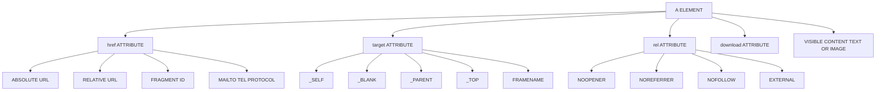
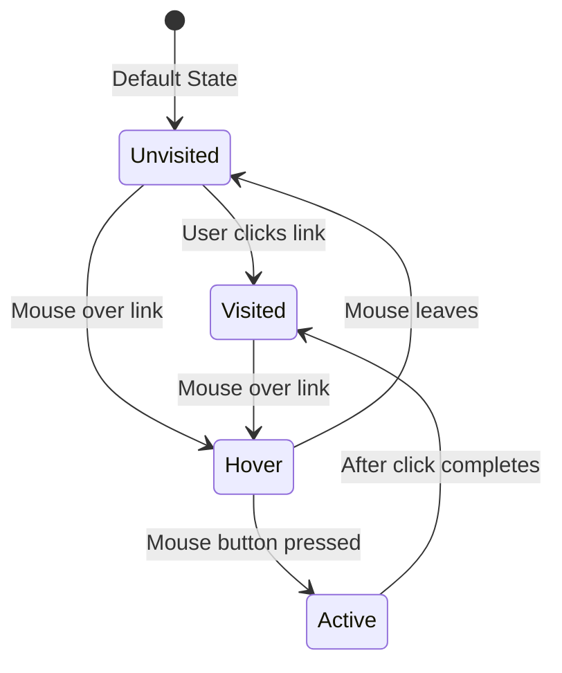
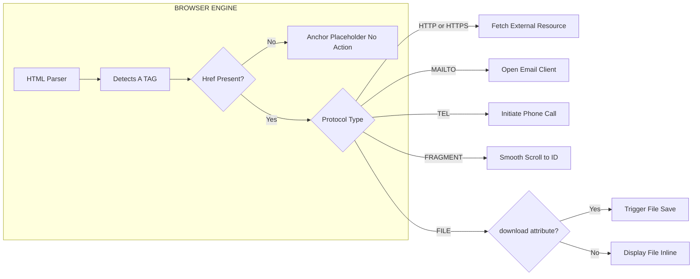
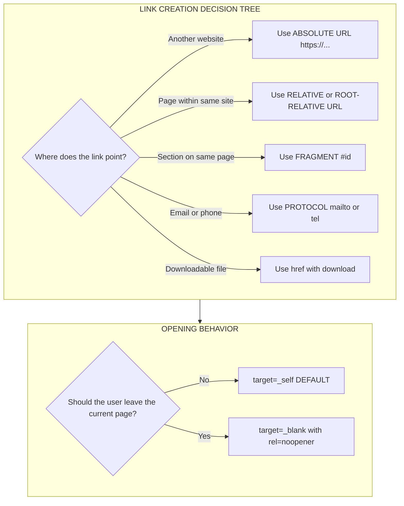

# Linking

<!-- SECTION_1_START -->
# Module 1: Creating Web Page Using HTML5
## Topic: Linking

## 1. Core Technical Definition & Intuitive Overview

### Formal Definition
**Linking** in HTML5 is the mechanism of creating a **hyperlink** using the anchor element `<a>` (short for *anchor*) to establish a navigable connection between the current web document and another resource — which may be another web page, a specific section within the same page, an external file, an email address, a phone number, or a downloadable asset. The connection is defined by the **`href` (Hypertext Reference)** attribute, while the link's behavior and rendering are controlled by additional attributes such as `target`, `rel`, `download`, and `type`.

> [!IMPORTANT]
> **KTU 2024 Syllabus Highlight:** Linking is classified under **CO1 (Understand)** of *OECST832 – Web Programming*. Students must demonstrate the ability to create hyperlinks using anchor tags, distinguish between absolute and relative paths, and apply link states and target attributes correctly.

### Conceptual Analogy / Intuition
Imagine a **library**:
- A **link** is like a signpost inside the library that says *"Reference Section – Shelf B3."*
- The **`<a>` tag** is the signpost itself.
- The **`href` attribute** is the actual address written on that signpost.
- The **link text** (the part between `<a>` and `</a>`) is the readable label a visitor sees.
- **Clicking the link** is equivalent to following the signpost — your browser (the "library visitor") walks over to the new location automatically.

When you click a link, the browser requests a new document from the server. If the address points to a section on the **same page**, the browser simply scrolls there. If it points to a **different website**, the browser fetches a new document entirely.

> [!NOTE]
> **Core Definition — Anchor Element:** The HTML5 anchor element `<a>` is an *inline* element that wraps around text, images, or block-level content, transforming them into a clickable hyperlink capable of fetching a resource defined by the `href` attribute.

### Key Components of a Hyperlink
| Component | Attribute / Part | Purpose |
|---|---|---|
| Anchor element | `<a>` ... `</a>` | Container that defines the hyperlink |
| Destination | `href` | URL or path of the linked resource |
| Link text / content | Inner HTML | Visible/clickable label |
| Open behavior | `target` | Where to open the linked document |
| Relationship | `rel` | Defines the relationship (e.g., `nofollow`, `noopener`) |
| Download | `download` | Prompts user to save the file |
| Media hint | `type` | MIME type of the linked resource |

### Standard Metrics & Defaults
- The **default link color** is **blue** (`#0000EE` in most browsers), underlined.
- The **default target** is the **same window/tab** (i.e., `_self`).
- The **default cursor** on hover is a **pointer (hand icon)**.
- The `<a>` element accepts **transparent content** by default — only the text/image inside becomes clickable.

> [!VISUALIZATION CONTROL]
> **Concept:** Anchor Element Structural Tree
> **Visual Description:** Picture a parent box labeled `<a href="...">` containing a child box labeled `Link Text`. The parent box is bordered and points to an external resource via an arrow labeled `href`. On hover, the color shifts from blue to purple, representing the `:hover` state transition.
<!-- SECTION_1_END -->

<!-- SECTION_2_START -->
## 2. Deep Theoretical Analysis & KTU High-Yield Formula Sheet

### 2.1 Anatomy of the Anchor Tag

The full syntax of an HTML5 hyperlink is:

```html
<a href="destination" target="where" rel="relationship" type="MIME" download="filename">Visible Text</a>
```

#### Minimal Working Example
```html
<a href="https://www.ktu.edu.in">Visit KTU Official Website</a>
```

This renders the text **"Visit KTU Official Website"** in blue with an underline. Clicking it opens `https://www.ktu.edu.in` in the same browser tab.

### 2.2 Types of Links (KTU High-Yield)

#### A. Absolute URL
A full web address including protocol, domain, and path. Used to link **external websites**.

```html
<a href="https://www.google.com/search?q=html5">Search HTML5 on Google</a>
```

#### B. Relative URL
A path **relative to the current page's location**. Used to link **local resources** within the same site.

```html
<a href="about.html">About Us</a>
<a href="css/styles.css">View Stylesheet</a>
<a href="../index.html">Back to Home</a>
```

- `..` → moves up one directory level.
- `./` (or just filename) → refers to current directory.

#### C. Root-Relative (Site-Relative) URL
A path starting with `/`, anchored to the **site's root (domain)**. Common in CMS-based sites.

```html
<a href="/products/laptops.html">Laptops</a>
```

#### D. Fragment Identifier (In-Page Link)
Links to a specific element within the same page using the `id` attribute of the target.

```html
<a href="#section-2">Go to Section 2</a>
...
<h2 id="section-2">Section 2</h2>
```

#### E. Email Link (mailto)
Opens the user's default email client with a pre-filled address.

```html
<a href="mailto:admissions@ktu.edu.in?subject=Inquiry&body=Hello">Email KTU Admissions</a>
```

> The `?subject=` and `&body=` are **query parameters** (bonus content often asked in KTU exams).

#### F. Telephone Link (tel)
Used primarily on **mobile** devices to initiate a call.

```html
<a href="tel:+914842595000">Call KTU</a>
```

#### G. File Download Link
The `download` attribute prompts the browser to save the file rather than navigate to it.

```html
<a href="docs/syllabus.pdf" download="KTU_Syllabus_2024.pdf">Download Syllabus</a>
```

### 2.3 The `target` Attribute — Opening Behavior

| Value | Behavior | Use Case |
|---|---|---|
| `_self` | Opens in the **same** tab/window (default) | Internal site navigation |
| `_blank` | Opens in a **new** tab/window | External links, social media |
| `_parent` | Opens in the **parent** frame | Framesets (legacy) |
| `_top` | Opens in the **full body** of the window | Breaking out of nested frames |
| `framename` | Opens in a **named** `<iframe>` | Custom frame targeting |

```html
<a href="https://www.wikipedia.org" target="_blank" rel="noopener noreferrer">Wikipedia (New Tab)</a>
```

> [!IMPORTANT]
> **Security Best Practice:** Always pair `target="_blank"` with `rel="noopener noreferrer"` to prevent **tab-nabbing** attacks — a vulnerability where the new page gains partial access to `window.opener`.

### 2.4 The Four Link States (Pseudo-Classes)

HTML5 defines four pseudo-class states for anchors. KTU frequently asks students to style these in **Part B questions**.

| Pseudo-Class | Trigger | Typical Styling |
|---|---|---|
| `:link` | Default unvisited link | Blue, underlined |
| `:visited` | Link already opened by user | Purple |
| `:hover` | Mouse pointer over the link | Underline removed, color change |
| `:active` | Link is being clicked | Red, momentary state |

> [!NOTE]
> **LVHA Rule:** The pseudo-classes must be declared in the order **`:link → :visited → :hover → :active`** in CSS, otherwise the styles will be overridden incorrectly. This is a high-yield KTU valuation point.

### 2.5 Linking Different Content Types

You can wrap **almost any HTML element** inside `<a>` — not just text.

```html
<!-- Image as link -->
<a href="home.html">
  
</a>

<!-- Block-level link (HTML5 feature) -->
<a href="article.html">
  <h3>Article Title</h3>
  <p>Click anywhere in this card to read more.</p>
</a>
```

> HTML5 relaxed the rule that `<a>` could only contain inline content. **Block-level** elements like `<div>`, `<h1>–<h6>`, `<p>` are now allowed inside an anchor.

### 2.6 Accessibility Considerations (CO3/CO5 related)

- The `href` attribute is **mandatory** for a true link. Without it, the `<a>` element is just an *anchor placeholder* with no destination.
- Always provide **descriptive link text** (e.g., "Read the Web Programming syllabus" instead of "Click here").
- Use **`aria-label`** for icon-only links.
- Screen readers announce links along with their `href` destination.

### KTU Formula Sheet (Cheat Sheet)

| Concept | Syntax | Notes |
|---|---|---|
| Basic link | `<a href="URL">text</a>` | `href` is mandatory |
| New tab | `<a href="URL" target="_blank">` | Always add `rel="noopener"` |
| Email link | `<a href="mailto:a@b.com">` | Append `?subject=` and `&body=` |
| Phone link | `<a href="tel:+911234567890">` | Country code required |
| In-page jump | `<a href="#id">` | Target must have `id` |
| Download | `<a href="file.pdf" download>` | HTML5 attribute |
| Image link | `<a></a>` | Wrap image inside anchor |
| Link to stylesheet | `<link rel="stylesheet" href="style.css">` | Note: `<link>` is **void**, not `<a>` |
| LVHA order | `:link :visited :hover :active` | Required CSS order |

> [!TIP]
> **Engineering Application:** Linking powers every navigation menu, search result, footer credit, social-share button, and breadcrumb on the web. In production, links are dynamically generated by frameworks like React Router (`<Link to="...">`), Next.js (`<Link href="...">`), and Django templates (``).
<!-- SECTION_2_END -->

<!-- SECTION_3_START -->
## 3. Step-by-Step Derivations & Code/Symbolic Implementation

### 3.1 Exhaustive Walkthrough: Building a Multi-Link HTML Page

Below is a **complete, working HTML5 document** demonstrating every major type of link. Every line is intentionally commented for KTU board-style evaluation.

```html
<!DOCTYPE html>
<html lang="en">
<head>
    <meta charset="UTF-8">
    <title>Linking Demo - KTU Web Programming</title>
    <style>
        /* Step 1: Apply the LVHA order strictly */
        a:link    { color: #0066cc; text-decoration: none; }  /* unvisited  */
        a:visited { color: #6a0dad; }                          /* visited    */
        a:hover   { text-decoration: underline; color: #ff6600; } /* hover   */
        a:active  { color: #cc0000; }                          /* click state */
    </style>
</head>
<body>
    <h1>HTML5 Linking Demonstration</h1>

    <!-- (1) Absolute URL: external website -->
    <p><a href="https://www.ktu.edu.in">KTU Official Site</a></p>

    <!-- (2) Relative URL: same folder -->
    <p><a href="contact.html">Contact Us Page</a></p>

    <!-- (3) Relative URL: parent folder -->
    <p><a href="../index.html">Return to Home</a></p>

    <!-- (4) Root-relative URL: from domain root -->
    <p><a href="/syllabus/oecst832.pdf">View Web Programming Syllabus</a></p>

    <!-- (5) Fragment identifier: in-page jump -->
    <p><a href="#bottom">Jump to Bottom of Page</a></p>

    <!-- (6) Email link with subject and body -->
    <p><a href="mailto:exam@ktu.edu.in?subject=Web%20Programming%20Query&body=Hello%20KTU">
         Email KTU Exam Cell
       </a></p>

    <!-- (7) Telephone link -->
    <p><a href="tel:+914842595000">Call KTU Helpline</a></p>

    <!-- (8) New tab with rel attribute (security) -->
    <p><a href="https://www.w3.org/standards/webdesign/htmlcss"
          target="_blank" rel="noopener noreferrer">
          W3C HTML5 Spec (opens in new tab)
       </a></p>

    <!-- (9) Downloadable file -->
    <p><a href="notes/module1.pdf" download="Module1_Notes.pdf">
         Download Module 1 Notes
       </a></p>

    <!-- (10) Image wrapped inside anchor -->
    <a href="https://www.ktu.edu.in">
        
    </a>

    <!-- (11) Block-level link (HTML5 feature) -->
    <a href="news.html" style="display:block; padding:10px; border:1px solid #ccc;">
        <h3>Latest News</h3>
        <p>Click anywhere inside this card to read the announcement.</p>
    </a>

    <!-- Target for fragment link -->
    <h2 id="bottom">You have reached the bottom of the page!</h2>
</body>
</html>
```

### 3.2 Step-by-Step Logic for the Email Link

Email links with query parameters are **frequently asked** in KTU exams (3-mark short answers). The derivation is:

$$
\text{Href} = \underbrace{\text{mailto:}}_{\text{scheme}} \; \underbrace{\text{admissions@ktu.edu.in}}_{\text{recipient}} \; \underbrace{\text{?}}_{\text{start query}} \; \underbrace{\text{subject=Inquiry}}_{\text{param 1}} \; \underbrace{\text{\&}}_{\text{separator}} \; \underbrace{\text{body=Please\;send\;details}}_{\text{param 2}}
$$

Each space in the query string **must be URL-encoded** as `%20` (or `+` in `mailto` URLs).

### 3.3 Step-by-Step Logic for Fragment Navigation

1. The browser scans the current HTML document for the `id` attribute matching the value after `#` in the href.
2. If a match is found, the browser **scrolls** the element to the top of the viewport.
3. If no match exists, no error is thrown — the browser simply does nothing.

```html
<a href="#contact-form">Go to Form</a>
<form id="contact-form"> ... </form>
```

### 3.4 Step-by-Step Logic for `target` and `rel`

For the link:
```html
<a href="https://external.com" target="_blank" rel="noopener noreferrer">Visit</a>
```

| Attribute | Effect |
|---|---|
| `target="_blank"` | Asks the browser to open the URL in a **new browsing context** (new tab) |
| `rel="noopener"` | Prevents the new page from accessing `window.opener` (security) |
| `rel="noreferrer"` | Suppresses the `Referer` HTTP header (privacy) |

### 3.5 Python: Programmatic Verification of an Anchor Tag

```python
from html.parser import HTMLParser

class AnchorLinkExtractor(HTMLParser):
    """
    Parses an HTML document and prints all anchor tags
    with their href, target, and rel attributes.
    """
    def handle_starttag(self, tag, attrs):
        if tag.lower() == "a":
            attr_dict = dict(attrs)
            href  = attr_dict.get("href", "(missing)")
            target = attr_dict.get("target", "_self")
            rel   = attr_dict.get("rel", "(none)")
            print(f"[LINK] href={href}  target={target}  rel={rel}")

# Demonstration
html_sample = """
<a href="https://ktu.edu.in">KTU</a>
<a href="contact.html" target="_blank" rel="noopener">Contact</a>
<a href="mailto:test@ktu.edu.in?subject=Hi">Email</a>
"""

parser = AnchorLinkExtractor()
parser.feed(html_sample)
```

**Expected output:**
```text
[LINK] href=https://ktu.edu.in  target=_self  rel=(none)
[LINK] href=contact.html  target=_blank  rel=noopener
[LINK] href=mailto:test@ktu.edu.in?subject=Hi  target=_self  rel=(none)
```
<!-- SECTION_3_END -->

<!-- SECTION_4_START -->
## 4. Structural Diagrams & Schematics

### 4.1 Anchor Element — Mermaid Block Diagram



### 4.2 Link State Transition Flow (LVHA Order)



### 4.3 Sequential Link Resolution Topology



### 4.4 Linking Decision Matrix (Architecture View)


<!-- SECTION_4_END -->

<!-- SECTION_5_START -->
## 5. KTU 2024 Scheme Examination Question Bank & Topic Recap

### Part A Questions (3 Marks Each)

#### Q1. `[KTU University Exam – July 2024]`
**Differentiate between absolute and relative URLs in HTML5. Provide one example for each.**
*(CO1, Remember)*

**Model Answer:**
- An **absolute URL** contains the full web address including the protocol, domain name, and path. It works from any location on the web.
  - Example: `<a href="https://www.ktu.edu.in/syllabus">KTU Syllabus</a>`
- A **relative URL** contains a path relative to the current document's location. It is portable only within the same site.
  - Example: `<a href="contact.html">Contact</a>` (assumes `contact.html` is in the same folder).
- Absolute URLs are used for **external** links; relative URLs are preferred for **internal** site navigation because they survive domain changes and HTTPS migrations.

> [!NOTE]
> **[Valuation Key: 1 Mark each for definition + example + use-case comparison]**

#### Q2. `[KTU University Exam – Dec 2023]`
**Explain the purpose of the `target="_blank"` and `rel="noopener"` attributes when used together in an anchor tag.**
*(CO1, Understand)*

**Model Answer:**
- `target="_blank"` instructs the browser to open the linked document in a **new tab or window**, keeping the original page intact.
- `rel="noopener"` is a **security attribute** that prevents the newly opened page from accessing the `window.opener` property of the original page, mitigating a class of attacks known as **tab-nabbing** where a malicious page could redirect the original tab using JavaScript.
- Together, they provide both a **better user experience** (keeping the original site available) and **enhanced security**.
- Example:
  ```html
  <a href="https://external.com" target="_blank" rel="noopener noreferrer">Visit</a>
  ```

> **[Valuation Key: 1 Mark `target` purpose + 1 Mark `rel` security role + 1 Mark combined example]**

---

### Part B Questions (14 Marks Each)

> [!IMPORTANT]
> Each Part B question follows the **KTU ESE Internal Choice** pattern. **Answer ANY ONE** of the two alternatives (Q11A or Q11B style). All sub-parts carry 7 marks each, mapped to escalating Bloom's levels.

---

#### Question A (14 Marks)
**`[KTU University Exam – Model Paper 2024]`**

**(a)** *(7 Marks, CO1 — Understand)*
Explain the different types of hyperlinks that can be created using the HTML5 anchor `<a>` tag. For each type, write the correct syntax and state one real-world scenario where it would be used.

**(b)** *(7 Marks, CO2 — Apply)*
Design a complete HTML5 page named `navigation.html` that contains:
- A logo image that links to the homepage,
- A navigation menu with 4 internal links using **relative URLs**,
- One **email link** with subject and body pre-filled,
- One link that opens an **external site in a new tab** with proper security,
- One **in-page jump** to a footer with `id="contact"`.

For every link, apply the LVHA pseudo-class styling in an embedded `<style>` block.

---

#### Model Solution — Question A

##### (a) Explanation of Anchor Tag Link Types

| Type | Syntax | Real-World Scenario |
|---|---|---|
| **Absolute URL** | `<a href="https://www.google.com">Google</a>` | Linking to external resources from a blog |
| **Relative URL** | `<a href="about.html">About</a>` | Site-internal page navigation |
| **Root-Relative** | `<a href="/products/shoes">Shoes</a>` | CMS-driven sites like WordPress |
| **Fragment** | `<a href="#contact">Contact</a>` | Single-page application table-of-contents |
| **Email (`mailto`)** | `<a href="mailto:a@b.com?subject=Hi">Email</a>` | Contact section "Email Us" button |
| **Phone (`tel`)** | `<a href="tel:+911234567890">Call</a>` | Mobile-optimized "Call Now" buttons |
| **File Download** | `<a href="cv.pdf" download>Download CV</a>` | Resume download on portfolio sites |
| **Image Link** | `<a></a>` | Banner advertisement clicks |

**[Valuation Key: 1 Mark per type with correct syntax and valid scenario — 7 types in 7 marks]**

##### (b) Complete Working `navigation.html`

```html
<!DOCTYPE html>
<html lang="en">
<head>
    <meta charset="UTF-8">
    <title>KTU Navigation Demo</title>
    <style>
        /* LVHA Order — strictly maintained for marks */
        a:link    { color: #0055aa; text-decoration: none; }
        a:visited { color: #551a8b; }
        a:hover   { text-decoration: underline; color: #ff6600; }
        a:active  { color: #cc0000; }

        /* Visual styling for the menu */
        nav ul { list-style: none; display: flex; gap: 20px; }
        nav a  { padding: 8px 12px; border: 1px solid #ccc; }
    </style>
</head>
<body>

    <!-- (1) Logo image link to homepage -->
    <a href="index.html">
        
    </a>

    <!-- (2) Internal navigation menu using relative URLs -->
    <nav>
        <ul>
            <li><a href="index.html">Home</a></li>
            <li><a href="about.html">About Us</a></li>
            <li><a href="services.html">Services</a></li>
            <li><a href="contact.html">Contact</a></li>
        </ul>
    </nav>

    <!-- (3) Email link with subject and body -->
    <p>Reach us at:
       <a href="mailto:info@ktu.edu.in?subject=Web%20Programming%20Inquiry&body=Hello%20KTU">
           info@ktu.edu.in
       </a>
    </p>

    <!-- (4) External site opens in new tab with security -->
    <p>Reference:
       <a href="https://www.w3.org/TR/html52/" target="_blank" rel="noopener noreferrer">
           HTML5.2 Spec (new tab)
       </a>
    </p>

    <!-- (5) In-page jump target -->
    <h2 id="contact">Contact Section</h2>
    <p>Phone: +91-484-2595000</p>

    <!-- (6) Link that jumps to the contact section -->
    <a href="#contact">Jump to Contact Footer</a>

</body>
</html>
```

**Valuation Key for Part (b):**

| Sub-task | Marks Distribution |
|---|---|
| Logo image as link | 1 Mark |
| 4 internal relative links | 2 Marks (0.5 each) |
| Email link with `?subject=` and `&body=` | 1 Mark |
| New tab with `rel="noopener noreferrer"` | 1 Mark |
| In-page jump with `id` target | 1 Mark |
| LVHA pseudo-class order in `<style>` | 1 Mark |

---

#### Question B (14 Marks — Alternative)
**`[KTU University Exam – Model Paper 2024]`**

**(a)** *(7 Marks, CO1 — Understand)*
With a neat labeled diagram, describe the structure of an HTML5 anchor element. Explain any **four** attributes that can be used inside `<a>` tags, with examples.

**(b)** *(7 Marks, CO2 — Apply)*
Write an HTML5 program that creates a **vertical sidebar menu** of 5 items. Each menu item should:
- Be created using an `<a>` tag,
- Use a **unique** target attribute (one each of `_self`, `_blank`, `_parent`, `_top`, and a custom `framename`),
- Have a **different** CSS background color applied via inline `style`.

Justify the use of `rel="noopener"` when `target="_blank"` is set.

---

#### Model Solution — Question B

##### (a) Structure of Anchor Element

```
┌─────────────────────────────────────────────────────┐
│  <a                                                 │
│       href="URL_OR_PATH"        ← Destination       │
│       target="WHERE_TO_OPEN"    ← Open behavior     │
│       rel="RELATIONSHIP"        ← SEO / Security    │
│       download="FILENAME"       ← Save-as prompt    │
│       type="MIME_TYPE"          ← Resource hint     │
│  >                                                  │
│       VISIBLE LINK TEXT or                     │
│  </a>                                               │
└─────────────────────────────────────────────────────┘
```

| Attribute | Purpose | Example |
|---|---|---|
| `href` | Specifies the URL or path of the linked resource | `href="https://ktu.edu.in"` |
| `target` | Controls where the linked document opens | `target="_blank"` |
| `rel` | Defines the relationship between current and linked document | `rel="noopener"` |
| `download` | Tells the browser to save the file rather than navigate to it | `download="notes.pdf"` |

**[Valuation Key: 1 Mark diagram + 1.5 Marks per attribute explanation × 4 = 7 Marks]**

##### (b) Vertical Sidebar with Diverse Targets

```html
<!DOCTYPE html>
<html lang="en">
<head>
    <meta charset="UTF-8">
    <title>Vertical Sidebar — KTU Demo</title>
    <style>
        /* Frame setup for demonstration of _parent and _top */
        body { font-family: Arial, sans-serif; margin: 0; }
        nav.sidebar {
            width: 220px;
            background: #f4f4f4;
            padding: 15px;
            float: left;
            height: 100vh;
        }
        nav.sidebar a {
            display: block;
            padding: 10px;
            margin: 5px 0;
            color: white;
            text-decoration: none;
            text-align: center;
            border-radius: 4px;
        }
    </style>
</head>
<body>

    <nav class="sidebar">
        <!-- 1. Same window -->
        <a href="home.html" target="_self"
           style="background-color: #3498db;">Home (self)</a>

        <!-- 2. New tab with security -->
        <a href="https://www.wikipedia.org" target="_blank" rel="noopener noreferrer"
           style="background-color: #e74c3c;">Wikipedia (blank)</a>

        <!-- 3. Parent frame -->
        <a href="parent-page.html" target="_parent"
           style="background-color: #2ecc71;">Parent Page</a>

        <!-- 4. Top-most frame -->
        <a href="main-home.html" target="_top"
           style="background-color: #9b59b6;">Top Window</a>

        <!-- 5. Custom named iframe -->
        <a href="content.html" target="content_frame"
           style="background-color: #f39c12;">Load in content_frame</a>
    </nav>

    <!-- Custom named iframe to demonstrate the last link -->
    <iframe name="content_frame"
            style="margin-left:240px; width:60%; height:300px; border:1px solid #ccc;">
        Content loads here.
    </iframe>

</body>
</html>
```

**Justification for `rel="noopener"` with `target="_blank"`:**
When a link opens in a new tab via `target="_blank"`, the destination page receives a non-null `window.opener` reference to the original tab. A malicious page can then call `window.opener.location = "phishing-site.com"` to redirect the original tab without the user's consent — this is **tab-nabbing**. Adding `rel="noopener"` sets `window.opener` to `null`, severing the link. It is a mandatory security best practice in all modern web applications.

**Valuation Key for Part (b):**

| Sub-task | Marks Distribution |
|---|---|
| 5 `<a>` tags with unique `target` values | 2.5 Marks (0.5 each) |
| Inline `style` background color for each | 1 Mark |
| Valid `<iframe name="content_frame">` usage | 1 Mark |
| `rel="noopener"` security justification | 2 Marks |
| Correct HTML5 boilerplate and structure | 0.5 Mark |

---

> [!WARNING]
> **KTU Examiner's Valuation Warning — Common Pitfalls:**
> - ❌ Forgetting the **`href` attribute** — an `<a>` without `href` is a *placeholder*, not a true link. [Lose 1 Mark]
> - ❌ Writing `target="new"` or `target="newtab"` — these are **not valid** values. Only `_self`, `_blank`, `_parent`, `_top`, or a *frame name* are allowed. [Lose 1 Mark]
> - ❌ Skipping `rel="noopener"` on every `target="_blank"` link. Modern KTU papers award marks for this security detail. [Lose 1–2 Marks]
> - ❌ Wrong pseudo-class order in CSS — must be **`:link → :visited → :hover → :active`** (LVHA). [Lose 1 Mark]
> - ❌ Using `&` directly in `mailto` URLs without writing it as `&amp;` in HTML — this is technically correct since `&` is a special character. [Lose 0.5 Mark]
> - ❌ Confusing the **`<link>`** element (used inside `<head>` for stylesheets) with the **`<a>`** element (used inside `<body>` for navigation). They are different. [Lose 1 Mark]
> - ❌ Writing `tel:` numbers without the **country code prefix** (`+91...`). [Lose 0.5 Mark]

---

### Topic Recap & Important Things to Remember

- 🔹 The **anchor element** `<a>` creates a clickable hyperlink. It is an **inline** element by default but can wrap **block-level** content in HTML5.
- 🔹 The **`href` attribute is mandatory** for a functional link. Without it, the element is just a positional anchor.
- 🔹 **Three main URL types** — absolute (`https://...`), relative (`page.html`), and root-relative (`/folder/page.html`).
- 🔹 **`target="_blank"`** opens in a new tab; always pair it with **`rel="noopener noreferrer"`** for security.
- 🔹 **`mailto:`** links can carry query parameters — `?subject=...&body=...` — and spaces must be URL-encoded as `%20`.
- 🔹 **`tel:`** links require the **international dialing format** with a leading `+` and country code.
- 🔹 **Fragment identifiers** use the `#` symbol followed by an `id` to enable in-page navigation.
- 🔹 The **`download` attribute** (HTML5) prompts the user to save the linked file instead of opening it inline.
- 🔹 The **four link states** — `:link`, `:visited`, `:hover`, `:active` — must be styled in **LVHA order** in CSS.
- 🔹 Block-level content (like `<div>`, `<h2>`, `<p>`) is now valid inside an anchor tag, thanks to HTML5's relaxed content model.
- 🔹 The `<a>` element is **distinct** from the `<link>` element — `<link>` belongs in `<head>` and references external resources like stylesheets, while `<a>` belongs in `<body>` and is user-clickable.
- 🔹 For **accessibility**, use descriptive link text; avoid generic phrases like *"click here"*.
- 🔹 Image links are made by wrapping an `` inside an `<a>` tag — useful for logos and clickable banners.
- 🔹 In production frameworks, links are typically generated dynamically — e.g., React's `<Link>`, Vue's `<router-link>`, Angular's `routerLink`, Django's `` template tag.
<!-- SECTION_5_END -->
