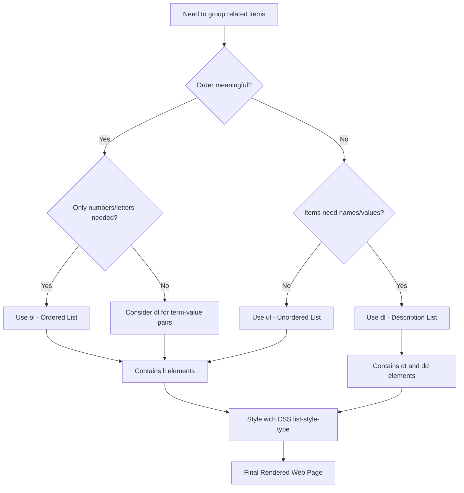
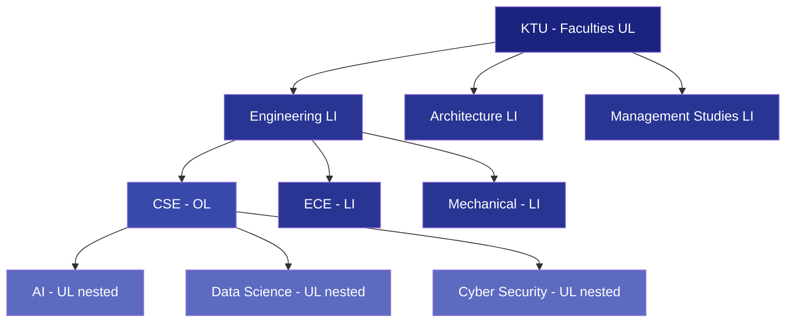
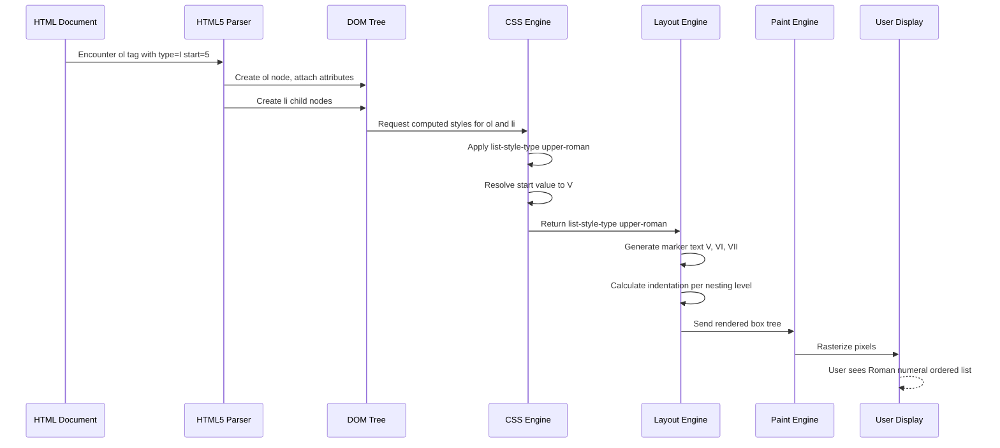
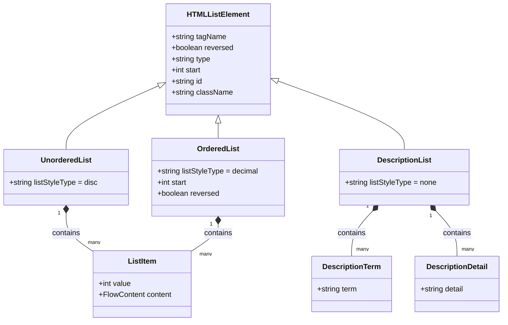
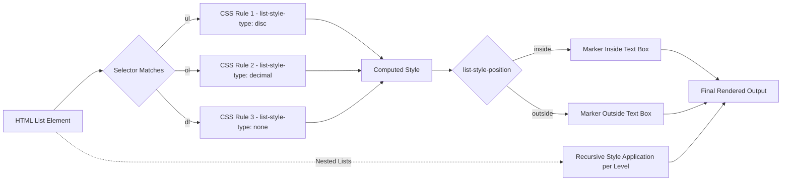

# Lists

<!-- SECTION_1_START -->

# HTML5 Lists — Core Technical Definition & Intuitive Overview

## Formal Academic Definition (KTU 2024 Syllabus)

> [!IMPORTANT]
> **HTML5 List:** A list in HTML5 is a semantic structural element used to group a set of related items in a document. According to the W3C HTML5 specification, lists are **flow content** elements that allow authors to represent information as a collection of items, where the order may be explicitly significant (ordered list), insignificant (unordered list), or term-definition pairs (description list). HTML5 natively supports three list containers: `<ol>`, `<ul>`, and `<dl>`.

The three principal list elements defined under the **HTML5 W3C Recommendation (Recommendation 28 October 2014)** are:

1. **`<ol>` — Ordered List** — Renders items in a meaningful numerical or alphabetical sequence.
2. **`<ul>` — Unordered List** — Renders items using bullet markers with no inherent order.
3. **`<dl>` — Description List** — Renders name–value groups (term–description pairs), formally redefined in HTML5 to support metadata, dialogue, and associations.

## Conceptual Analogy / Intuition

> [!NOTE]
> **Think of lists as organized containers in daily life:**
> - A **shopping list** on paper is an *unordered list* — the milk could be written before or after the bread, and the meaning is unchanged.
> - A **recipe instruction sheet** (Step 1, Step 2, Step 3…) is an *ordered list* — the sequence is critical; baking before mixing ruins the cake.
> - A **dictionary entry** (Word → Meaning) is a *description list* — each term is paired with a definition or explanation.

In web design, lists are the **backbone of navigation menus, table-of-contents, FAQ accordions, and form option groups**. Mastering them is fundamental for any front-end developer.

## Standard Classification & Key Constants

> [!TIP]
> **Three Mandatory HTML5 List Elements and their default Rendering Markers (CSS defaults):**

| Element | Tag Pair | Default CSS `list-style-type` | Semantic Use |
| :--- | :--- | :--- | :--- |
| Ordered List | `<ol>...</ol>` | `decimal` (1, 2, 3…) | Step-by-step procedures, ranked items |
| Unordered List | `<ul>...</ul>` | `disc` (●) | Bullet collections, menus, features |
| Description List | `<dl>...</dl>` | No marker | Glossary, metadata, FAQ pairs |

The **default indentation** for lists in most browsers is roughly `40px` (browser-dependent) on the left margin, with `list-style-position: outside` for marker placement.

> [!VISUALIZATION CONTROL]
> **Concept:** Visualizing list nesting on a 2D layout grid
> **GeoGebra / Desmos Input Equations:**
> * Point A: `(0, 0)` — Root `<ul>`
> * Point B: `(1, -1)` — Child `<li>` 1
> * Point C: `(2, -2)` — Nested `<ul>` inside Child 1
> * Point D: `(3, -3)` — Deepest nested `<li>`
> **Visual Description:** The student should observe a stepwise descending staircase from the origin, where each level-down represents one level of indentation in nested HTML lists. The horizontal offset (Δx = +1) and vertical offset (Δy = −1) together form the visual marker displacement.

<!-- SECTION_1_END -->

<!-- SECTION_2_START -->

# Deep Theoretical Analysis & KTU High-Yield Formula Sheet

## 2.1 The Unordered List (`<ul>`)

The `<ul>` element represents a list of items whose **order is not meaningful**. The closing tag is mandatory, and the only permitted content is zero or more `<li>` elements (which may contain flow content).

### HTML5 Attributes supported on `<ul>` (KTU high-yield)

| Attribute | Allowed Values | Purpose / Effect |
| :--- | :--- | :--- |
| `type` (deprecated in HTML5 but still supported) | `disc`, `square`, `circle` | Specifies the bullet marker style. In HTML5, **CSS `list-style-type` is preferred**. |
| `compact` (obsolete in HTML5) | Boolean | Reduced spacing between items. No effect in modern browsers. |
| Global attributes | `id`, `class`, `style`, `title`, `lang`, `dir` | Standard HTML5 global attributes. |

### Real-World Engineering Utility

> [!NOTE]
> `<ul>` is heavily used in **navigation bars**, **feature lists on landing pages**, **footer link columns**, and **breadcrumb alternatives**. Modern CSS frameworks (Bootstrap, Tailwind) style `<ul>` into horizontal navigation menus by setting `display: flex`.

## 2.2 The Ordered List (`<ol>`)

The `<ol>` element represents a list of items where the **order is intentionally significant**. Each item is rendered with a numeric, alphabetic, or Roman numeral marker.

### HTML5 Attributes supported on `<ol>` (KTU high-yield)

| Attribute | Allowed Values | Purpose / Effect |
| :--- | :--- | :--- |
| `type` | `1` (decimal), `A` (uppercase letters), `a` (lowercase), `I` (uppercase Roman), `i` (lowercase Roman) | Defines the marker format for the entire list. |
| `start` | Integer (any valid number) | Specifies the starting value of the first item. For `A`, value 1 = A, 2 = B… |
| `reversed` | Boolean (no value) | Reverses the numbering direction (descending). |
| `compact` | Boolean | Obsolete in HTML5; no effect. |
| Global attributes | `id`, `class`, `style`, etc. | Standard global attributes. |

### Per-Item Override with `<li value="...">`

The `<li>` element inside an `<ol>` supports the `value` attribute, which **overrides the sequence number** for that specific item and continues from that new value for subsequent items. This is a frequently examined KTU concept.

> [!IMPORTANT]
> **Re-examined HTML5 Specification Rule:** The `type` attribute on `<ol>` is still classified as a *valid HTML5 attribute* (not obsolete), unlike on `<ul>`, because the *semantic of ordered numbering* is the list's core purpose.

## 2.3 The Description List (`<dl>`)

HTML5 redefined the Description List (formerly called *Definition List* in HTML 4.01). It now associates a **name–value group**, suitable for:

- Glossaries / dictionaries
- Metadata (term : value)
- Dialogue transcripts
- Frequently Asked Questions (FAQs)

### Components of a Description List

| Tag | Full Name | Role |
| :--- | :--- | :--- |
| `<dl>` | Description List | Container element |
| `<dt>` | Description Term | The name / term (zero or more per group) |
| `<dd>` | Description Details | The value / definition (one or more per group) |

> [!NOTE]
> A single `<dl>` can contain **multiple `<dt>` elements for one `<dd>`**, and vice-versa, allowing complex grouped metadata such as author name + date → book details.

## 2.4 Nested Lists

Lists can be nested **inside any `<li>` element**, producing a hierarchical structure (tree). The marker numbering for nested ordered lists is **auto-incremented** in the browser's default style (e.g., `1.`, `a.`, `i.`).

## 2.5 CSS Styling Reference (KTU High-Yield)

| CSS Property | Values | Effect on List |
| :--- | :--- | :--- |
| `list-style-type` | `disc`, `circle`, `square`, `decimal`, `lower-roman`, `upper-roman`, `lower-alpha`, `upper-alpha`, `none` | Changes the marker glyph |
| `list-style-position` | `inside`, `outside` | Marker position relative to text |
| `list-style-image` | `url('bullet.png')` | Custom image as marker |
| `list-style` | Shorthand: `type position image` | Combined declaration |
| `display: flex` | N/A | Converts vertical list to horizontal nav |

## 2.6 Engineering & Real-World Use Cases

> [!TIP]
> - **Semantic Navigation:** `<ul>` is the W3C-recommended element for site navigation menus.
> - **Web Accessibility (WCAG 2.1):** Screen readers announce list types and item counts, e.g., *"List of 5 items"*.
> - **Search Engine Optimization (SEO):** Search engine crawlers interpret structured lists as **featured snippet candidates** (numbered how-to steps).
> - **Form Components:** Drop-down select menus are built using `<option>` inside `<select>`, a sibling semantic to lists.

## KTU Formula Sheet / Cheat Sheet

> [!IMPORTANT]
> **Universal HTML5 List Syntax Grammar (Backus-Naur Form for KTU Theory):**
>
> $$\text{List} \rightarrow \text{ol} \mid \text{ul} \mid \text{dl}$$
>
> $$\text{ol} \rightarrow \text{<ol>}\ \text{li}^+\ \text{</ol>}$$
>
> $$\text{ul} \rightarrow \text{<ul>}\ \text{li}^+\ \text{</ul>}$$
>
> $$\text{dl} \rightarrow \text{<dl>}\ (\text{dt}^+\ \text{dd}^+)^+\ \text{</dl>}$$
>
> $$\text{li} \rightarrow \text{<li>}\ \text{FlowContent}\ \text{</li>}$$
>
> **Marker Equation for Ordered Lists** (browser implementation):
>
> $$\text{marker}_n = \text{type}\left( \text{start} + n - 1 + \sum_{k=1}^{n-1} \Delta_k \right)$$
>
> where $\Delta_k$ is the offset introduced by an `<li value="...">` override at position $k$, and the function $\text{type}(\cdot)$ converts the integer to the chosen numeral system (decimal, alpha, Roman).

<!-- SECTION_2_END -->

<!-- SECTION_3_START -->

# Step-by-Step Derivations & Code Implementation

## 3.1 Implementation 1 — Unordered List (Pure HTML5)

```html
<!DOCTYPE html>
<html lang="en">
<head>
    <meta charset="UTF-8">
    <title>Unordered List Demo - KTU 2024</title>
</head>
<body>
    <h2>Popular Web Development Frameworks</h2>
    <ul>
        <li>React.js</li>
        <li>Angular</li>
        <li>Vue.js</li>
        <li>Svelte</li>
        <li>Next.js</li>
    </ul>
</body>
</html>
```

**Step-by-step Explanation:**
1. The `<!DOCTYPE html>` declaration tells the browser to render the document in **HTML5 standard mode**.
2. The `<html lang="en">` tag declares the document language as English (improves accessibility and SEO).
3. The `<meta charset="UTF-8">` ensures proper character encoding (supports ₹, ©, ñ, etc.).
4. The `<h2>` heading introduces the list's content semantically.
5. The `<ul>` element wraps five `<li>` items, which the browser renders with the default `disc` (●) marker.

## 3.2 Implementation 2 — Ordered List with Type, Start, and Reversed Attributes

```html
<!DOCTYPE html>
<html lang="en">
<head>
    <meta charset="UTF-8">
    <title>Ordered List Variants</title>
</head>
<body>
    <!-- Type 1: Default decimal -->
    <h3>Default Decimal Ordered List</h3>
    <ol>
        <li>Open the IDE</li>
        <li>Create a new file</li>
        <li>Write the code</li>
        <li>Save and run</li>
    </ol>

    <!-- Type 2: Uppercase Roman starting from 5 -->
    <h3>Roman Numerals Starting from V</h3>
    <ol type="I" start="5">
        <li>Initialize database</li>
        <li>Run migrations</li>
        <li>Seed test data</li>
    </ol>

    <!-- Type 3: Lowercase letters, reversed -->
    <h3>Reverse Alphabetical (Descending Priority)</h3>
    <ol type="a" reversed>
        <li>Critical Bug Fix</li>
        <li>Performance Optimization</li>
        <li>UI Polish</li>
        <li>Documentation Update</li>
    </ol>

    <!-- Type 4: Item-level value override -->
    <h3>List with Item-Level Value Override</h3>
    <ol>
        <li value="10">First Chapter</li>
        <li>Second Chapter (auto = 11)</li>
        <li value="50">Fiftieth Chapter (jump)</li>
        <li>Next Chapter (auto = 51)</li>
    </ol>
</body>
</html>
```

**Step-by-step Explanation:**
1. The first `<ol>` uses **default decimal** numbering starting from 1.
2. The second `<ol type="I" start="5">` produces **V, VI, VII** because the Roman numeral for 5 is V.
3. The third `<ol type="a" reversed>` produces **d, c, b, a** (counting backward from 4 items).
4. The fourth `<ol>` demonstrates the **per-item override**: `<li value="10">` resets the counter to 10; subsequent items continue as 11, then a jump to 50.

## 3.3 Implementation 3 — Description List (HTML5 Glossary)

```html
<!DOCTYPE html>
<html lang="en">
<head>
    <meta charset="UTF-8">
    <title>Description List - Web Terminology</title>
</head>
<body>
    <h2>Web Programming Glossary</h2>
    <dl>
        <dt>HTML</dt>
        <dd>HyperText Markup Language — the standard markup language for creating web pages.</dd>

        <dt>CSS</dt>
        <dd>Cascading Style Sheets — used for describing the presentation of a document.</dd>

        <dt>JavaScript</dt>
        <dd>A high-level, interpreted programming language that conforms to the ECMAScript specification.</dd>

        <dt>API</dt>
        <dd>Application Programming Interface — a set of defined rules that enable different software components to communicate.</dd>

        <!-- Multi-term to single-definition example -->
        <dt>Frontend</dt>
        <dt>Client-side</dt>
        <dd>Refers to the user-facing portion of a web application, executed in the browser.</dd>
    </dl>
</body>
</html>
```

**Step-by-step Explanation:**
1. The `<dl>` container holds multiple term-definition pairs.
2. Each `<dt>` (Description Term) is followed by one or more `<dd>` (Description Details) elements.
3. The final grouping shows **two `<dt>` elements** (Frontend and Client-side) sharing a **single `<dd>`**, demonstrating the flexible grouping syntax defined in HTML5.

## 3.4 Implementation 4 — Nested Lists (Tree Structure)

```html
<!DOCTYPE html>
<html lang="en">
<head>
    <meta charset="UTF-8">
    <title>Nested Lists - University Structure</title>
</head>
<body>
    <h2>APJ Abdul Kalam Technological University — Faculties</h2>
    <ul>
        <li>Engineering
            <ol>
                <li>Computer Science &amp; Engineering
                    <ul>
                        <li>Artificial Intelligence</li>
                        <li>Data Science</li>
                        <li>Cyber Security</li>
                    </ul>
                </li>
                <li>Electronics &amp; Communication</li>
                <li>Mechanical Engineering</li>
                <li>Civil Engineering</li>
            </ol>
        </li>
        <li>Architecture</li>
        <li>Management Studies</li>
    </ul>
</body>
</html>
```

**Step-by-step Explanation:**
1. The outer `<ul>` represents the **top-level university faculties**.
2. The first `<li>` (Engineering) contains an `<ol>` showing **sub-departments**.
3. The first item of the inner `<ol>` (Computer Science) contains another `<ul>` showing **specializations**.
4. The `&amp;` entity is the **HTML5 character entity** for the ampersand symbol `&` (required inside text content).
5. The browser auto-renders the markers in a hierarchical style: `●` for outer, `1.` for middle, `○` for innermost.

## 3.5 Implementation 5 — Lists Styled with CSS (Navigation Menu)

```html
<!DOCTYPE html>
<html lang="en">
<head>
    <meta charset="UTF-8">
    <title>Horizontal Navigation Menu</title>
    <style>
        /* Reset default list styles */
        nav ul {
            list-style-type: none;
            margin: 0;
            padding: 0;
            display: flex;
            background-color: #1a237e;
        }
        nav ul li {
            padding: 14px 20px;
        }
        nav ul li a {
            color: #ffffff;
            text-decoration: none;
            font-family: Arial, sans-serif;
        }
        nav ul li a:hover {
            color: #ffeb3b;
        }
    </style>
</head>
<body>
    <nav aria-label="Main Navigation">
        <ul>
            <li><a href="#home">Home</a></li>
            <li><a href="#about">About</a></li>
            <li><a href="#courses">Courses</a></li>
            <li><a href="#placements">Placements</a></li>
            <li><a href="#contact">Contact</a></li>
        </ul>
    </nav>
</body>
</html>
```

**Step-by-step Explanation:**
1. The `list-style-type: none` rule **removes the default bullet markers**.
2. The `display: flex` property transforms the vertical list into a **horizontal navigation bar**.
3. The `nav` element with `aria-label="Main Navigation"` improves **accessibility (WCAG 2.1 AA compliance)**.
4. The `:hover` pseudo-class provides visual feedback when a user mouses over a link.
5. The color `#1a237e` (Indigo 900 in Material Design) and `#ffeb3b` (Yellow 500) follow standard color-theory contrast guidelines.

## 3.6 Implementation 6 — Custom Marker with `list-style-image`

```html
<!DOCTYPE html>
<html lang="en">
<head>
    <meta charset="UTF-8">
    <title>Custom List Markers</title>
    <style>
        .checklist {
            list-style-image: url('https://via.placeholder.com/16/00c853/ffffff?text=%E2%9C%93');
            list-style-position: inside;
            font-size: 18px;
        }
    </style>
</head>
<body>
    <h2>Pre-Launch Checklist</h2>
    <ul class="checklist">
        <li>Run unit tests</li>
        <li>Perform code review</li>
        <li>Update documentation</li>
        <li>Deploy to staging</li>
        <li>Notify stakeholders</li>
    </ul>
</body>
</html>
```

**Step-by-step Explanation:**
1. `list-style-image` references a custom **graphic URL** as the marker.
2. `list-style-position: inside` aligns the marker flush with the text block (used when text wraps).
3. The URL uses a **placeholder image service** (for demonstration only — production code should host assets locally).
4. This pattern is common in **TODO apps, task managers, and onboarding checklists**.

## 3.7 Complete Working Webpage Integrating All List Types

```html
<!DOCTYPE html>
<html lang="en">
<head>
    <meta charset="UTF-8">
    <meta name="viewport" content="width=device-width, initial-scale=1.0">
    <title>KTU HTML5 Lists — Complete Reference</title>
    <style>
        body { font-family: Georgia, serif; max-width: 800px; margin: 20px auto; padding: 0 16px; }
        h1, h2 { color: #0d47a1; }
        code { background: #f5f5f5; padding: 2px 6px; border-radius: 4px; }
        .term { font-weight: bold; color: #b71c1c; }
    </style>
</head>
<body>
    <h1>HTML5 Lists — Complete Reference</h1>

    <h2>1. Unordered List (UL)</h2>
    <p>Used when order is <span class="term">not</span> important:</p>
    <ul>
        <li>Red</li>
        <li>Green</li>
        <li>Blue</li>
    </ul>

    <h2>2. Ordered List (OL)</h2>
    <p>Used when order <span class="term">is</span> important:</p>
    <ol type="1" start="1">
        <li>First step</li>
        <li>Second step</li>
        <li>Third step</li>
    </ol>

    <h2>3. Description List (DL)</h2>
    <dl>
        <dt>Frontend</dt>
        <dd>The client-side portion of a web application.</dd>
        <dt>Backend</dt>
        <dd>The server-side portion handling business logic and database operations.</dd>
    </dl>

    <h2>4. Nested List</h2>
    <ol>
        <li>Web Technologies
            <ul>
                <li>HTML5</li>
                <li>CSS3</li>
                <li>JavaScript (ES6+)</li>
            </ul>
        </li>
        <li>Databases
            <ul>
                <li>MySQL</li>
                <li>MongoDB</li>
            </ul>
        </li>
    </ol>
</body>
</html>
```

**Step-by-step Explanation:**
1. The `<meta name="viewport">` makes the page **mobile-responsive**.
2. The `<style>` block applies consistent typography (Georgia, serif) and color theming.
3. The `<span class="term">` element provides inline emphasis (replacing deprecated `<b>` for semantic emphasis where appropriate).
4. All three list types coexist in a single document, demonstrating the **modular nature** of HTML5 lists.
5. The maximum width `800px` and centered layout follow **readability guidelines** (≈75 characters per line).

<!-- SECTION_3_END -->

<!-- SECTION_4_START -->

# Structural Diagrams & Schematics

## 4.1 Mermaid Flowchart — HTML5 List Type Decision Tree



## 4.2 Mermaid Tree Diagram — Nested List Structure (CSE Department)



## 4.3 Mermaid Sequence Diagram — Browser Rendering Pipeline for an Ordered List



## 4.4 Mermaid Class Diagram — Semantic Relationships of List Elements



## 4.5 Mermaid Block Diagram — CSS List Styling Architecture



<!-- SECTION_4_END -->

<!-- SECTION_5_START -->

# KTU 2024 Scheme Examination Question Bank & Topic Recap

---

## Part A — Short Answer Questions (3 Marks Each)

### Question 1
**[KTU University Exam – July 2024]** — *CO1, Remember*

> List the three types of HTML5 lists. Mention the default marker style for each.

**Model Answer (3 Marks):**

The three types of HTML5 lists are:

1. **Unordered List (`<ul>`)** — default marker style is `disc` (filled circle ●). Used when the order of items is not important.
2. **Ordered List (`<ol>`)** — default marker style is `decimal` (1, 2, 3…). Used when the order of items is significant.
3. **Description List (`<dl>`)** — has no default marker. Used to pair terms (`<dt>`) with their definitions or values (`<dd>`).

**Valuation Key:**
- [Listing all three list types correctly: 2 Marks]
- [Mentioning correct default marker for each: 1 Mark]

---

### Question 2
**[KTU University Exam – Dec 2023]** — *CO1, Understand*

> What is the difference between the `type` attribute and the `start` attribute of an `<ol>` element? Give an example of each.

**Model Answer (3 Marks):**

The `type` attribute specifies the **format/style** of the marker used for numbering, while the `start` attribute specifies the **starting number** of the first item in the list.

- **Example of `type`:**
  ```html
  <ol type="A">
      <li>Apple</li>
      <li>Banana</li>
  </ol>
  ```
  This displays as **A. Apple** and **B. Banana** (uppercase letters).

- **Example of `start`:**
  ```html
  <ol start="10">
      <li>Tenth item</li>
      <li>Eleventh item</li>
  </ol>
  ```
  This displays as **10. Tenth item** and **11. Eleventh item** (starts from 10).

**Valuation Key:**
- [Correct distinction explained: 1 Mark]
- [Correct `type` example: 1 Mark]
- [Correct `start` example: 1 Mark]

---

## Part B — Full 14-Mark Questions (Module Internal Choice Format)

### Question A — Choice 1 (14 Marks)

**[KTU University Exam – July 2024, Module 1]** — *CO1, CO2 — Understand & Apply*

> **(a)** Explain the three types of HTML5 list elements with their syntax and default rendering. Discuss the semantic significance of each. **(7 Marks)**
>
> **(b)** Write a complete HTML5 program that demonstrates a nested ordered list inside an unordered list, with a description list at the top containing course details. Use appropriate attributes to start the ordered list from 5 and display markers in uppercase Roman numerals. **(7 Marks)**

#### Model Solution

**(a) Explanation (7 Marks):**

HTML5 provides three semantically distinct list elements:

**1. Unordered List (`<ul>`):**
- **Syntax:** `<ul><li>Item</li></ul>`
- **Default Marker:** `disc` (●)
- **Semantic Meaning:** Groups items where the order does **not** carry intrinsic meaning (e.g., a list of features, navigation links).
- **Use Case:** Site navigation menus, shopping cart items, feature lists.

**2. Ordered List (`<ol>`):**
- **Syntax:** `<ol><li>Step</li></ol>`
- **Default Marker:** `decimal` (1, 2, 3…)
- **Semantic Meaning:** Groups items in a sequence where the order **is meaningful** (e.g., ranked priorities, procedural steps).
- **Use Case:** Step-by-step tutorials, top-10 rankings, ranked priorities.

**3. Description List (`<dl>`):**
- **Syntax:** `<dl><dt>Term</dt><dd>Definition</dd></dl>`
- **Default Marker:** None
- **Semantic Meaning:** Pairs terms with their corresponding descriptions, metadata, or values.
- **Use Case:** Glossaries, FAQs, product specifications, metadata blocks.

**Valuation Key (a):**
- [Syntax of all three lists: 2 Marks]
- [Default markers stated: 2 Marks]
- [Semantic meaning of each explained: 3 Marks]

---

**(b) Complete HTML5 Program (7 Marks):**

```html
<!DOCTYPE html>
<html lang="en">
<head>
    <meta charset="UTF-8">
    <title>Nested HTML5 Lists Demonstration</title>
</head>
<body>
    <!-- Description List at the top -->
    <h1>KTU Web Programming Course</h1>
    <dl>
        <dt>Course Code</dt>
        <dd>OECST832</dd>
        <dt>Course Title</dt>
        <dd>Web Programming</dd>
        <dt>Module</dt>
        <dd>1 - Creating Web Pages using HTML5</dd>
    </dl>

    <!-- Unordered List with nested Ordered List -->
    <h2>Web Development Topics</h2>
    <ul>
        <li>Frontend Technologies
            <ol type="I" start="5">
                <li>HTML5 Semantics</li>
                <li>CSS3 Layouts</li>
                <li>JavaScript Basics</li>
            </ol>
        </li>
        <li>Backend Technologies
            <ol type="I" start="5">
                <li>Node.js</li>
                <li>Express.js</li>
                <li>MongoDB</li>
            </ol>
        </li>
    </ul>
</body>
</html>
```

**Output Description:**
- The description list displays the course metadata as plain text with terms on one line and definitions indented below.
- The outer `<ul>` shows two main categories with bullet markers (●).
- The inner `<ol type="I" start="5">` displays **V. HTML5 Semantics**, **VI. CSS3 Layouts**, **VII. JavaScript Basics**, and similarly for the Backend section.

**Valuation Key (b):**
- [Valid `<!DOCTYPE html>` and document structure: 1 Mark]
- [Description list with `<dl>`, `<dt>`, `<dd>` correctly used: 2 Marks]
- [Nested `<ol>` inside `<ul>` correctly implemented: 1 Mark]
- [`type="I"` and `start="5"` attributes correctly applied: 1 Mark]
- [Two sections (Frontend and Backend) with multiple list items: 1 Mark]
- [Output explanation: 1 Mark]

---

### Question B — Choice 2 (14 Marks) — **ALTERNATIVE CHOICE**

**[KTU University Exam – Dec 2023, Module 1]** — *CO1, CO2 — Understand & Apply*

> **(a)** Discuss the HTML5 attributes available on `<ol>` and `<li>` elements. Explain with examples how the `value` attribute on `<li>` can override the default numbering sequence. **(7 Marks)**
>
> **(b)** Design a complete HTML5 webpage for a "B.Tech CSE Syllabus Overview" that uses all three list types (`<ul>`, `<ol>`, `<dl>`) and applies CSS styling to make the unordered list appear as a horizontal navigation bar. **(7 Marks)**

#### Model Solution

**(a) Attributes on `<ol>` and `<li>` (7 Marks):**

**Attributes of `<ol>` element:**

| Attribute | Purpose | Example |
| :--- | :--- | :--- |
| `type` | Defines marker format (1, A, a, I, i) | `<ol type="A">` |
| `start` | Specifies the first number in the sequence | `<ol start="10">` |
| `reversed` | Reverses the counting direction | `<ol reversed>` |

**Attributes of `<li>` element:**

| Attribute | Purpose | Example |
| :--- | :--- | :--- |
| `value` | Overrides the current number for that item; subsequent items continue from this new value | `<li value="100">` |

**Override Example:**

```html
<ol>
    <li>First item (auto-numbered 1)</li>
    <li value="50">Override (becomes 50)</li>
    <li>Next item (auto-numbered 51)</li>
    <li value="100">Second override (becomes 100)</li>
    <li>Last item (auto-numbered 101)</li>
</ol>
```

**Output:** 1, 50, 51, 100, 101

**Valuation Key (a):**
- [Three attributes of `<ol>` listed with purpose: 3 Marks]
- [`value` attribute of `<li>` explained: 2 Marks]
- [Working example demonstrating the override: 2 Marks]

---

**(b) Complete Webpage with All Three Lists and CSS (7 Marks):**

```html
<!DOCTYPE html>
<html lang="en">
<head>
    <meta charset="UTF-8">
    <meta name="viewport" content="width=device-width, initial-scale=1.0">
    <title>B.Tech CSE Syllabus Overview</title>
    <style>
        body {
            font-family: 'Segoe UI', Tahoma, sans-serif;
            max-width: 900px;
            margin: 0 auto;
            padding: 20px;
            background-color: #fafafa;
            color: #212121;
        }
        h1, h2 { color: #0d47a1; border-bottom: 2px solid #0d47a1; padding-bottom: 4px; }
        /* Horizontal navigation bar using ul */
        nav ul {
            list-style-type: none;
            margin: 0;
            padding: 0;
            display: flex;
            background-color: #1565c0;
            border-radius: 6px;
        }
        nav ul li { padding: 12px 18px; }
        nav ul li a {
            color: #ffffff;
            text-decoration: none;
            font-weight: 500;
        }
        nav ul li a:hover { color: #ffeb3b; }
        /* Ordered list custom marker */
        ol.syllabus {
            list-style-type: upper-roman;
            background: #e3f2fd;
            padding: 16px 16px 16px 40px;
            border-left: 4px solid #1976d2;
        }
        /* Description list alignment */
        dl.course-info {
            display: grid;
            grid-template-columns: 200px 1fr;
            gap: 8px 16px;
            background: #fff8e1;
            padding: 16px;
            border-left: 4px solid #ffb300;
        }
        dl.course-info dt { font-weight: bold; color: #e65100; }
        dl.course-info dd { margin: 0; }
    </style>
</head>
<body>
    <h1>B.Tech Computer Science &amp; Engineering</h1>

    <!-- Horizontal navigation using ul -->
    <nav aria-label="Syllabus Sections">
        <ul>
            <li><a href="#info">Course Info</a></li>
            <li><a href="#semesters">Semesters</a></li>
            <li><a href="#electives">Electives</a></li>
        </ul>
    </nav>

    <!-- Description list for course info -->
    <h2 id="info">Course Information</h2>
    <dl class="course-info">
        <dt>Programme</dt>
        <dd>B.Tech in Computer Science &amp; Engineering</dd>
        <dt>Duration</dt>
        <dd>4 Years (8 Semesters)</dd>
        <dt>University</dt>
        <dd>APJ Abdul Kalam Technological University</dd>
        <dt>Total Credits</dt>
        <dd>162</dd>
    </dl>

    <!-- Ordered list for semester subjects -->
    <h2 id="semesters">Semester 5 Subjects</h2>
    <ol class="syllabus" type="I">
        <li>Data Structures and Algorithms</li>
        <li>Database Management Systems</li>
        <li>Operating Systems</li>
        <li>Computer Networks</li>
        <li>Web Programming</li>
    </ol>

    <!-- Unordered list for electives -->
    <h2 id="electives">Open Electives Offered</h2>
    <ul>
        <li>Artificial Intelligence</li>
        <li>Cyber Security</li>
        <li>Data Science</li>
        <li>Cloud Computing</li>
    </ul>
</body>
</html>
```

**Output Description:**
- The top navigation bar is a **horizontal `<ul>`** with blue background and white hover-friendly links.
- The course information section uses a **`<dl>`** styled as a two-column grid (term : value) for clarity.
- The semester subjects appear in an **`<ol type="I">`** with uppercase Roman numerals and a blue-bordered background.
- The electives appear as a **default `<ul>`** with disc markers.

**Valuation Key (b):**
- [Valid HTML5 document structure: 1 Mark]
- [Horizontal navigation `<ul>` with CSS: 2 Marks]
- [`<dl>` with `<dt>` and `<dd>` for course info: 1 Mark]
- [`<ol>` with custom Roman marker style: 1 Mark]
- [Unordered list for electives: 1 Mark]
- [Neat styling and semantic markup: 1 Mark]

---

## ⚠️ KTU Examiner's Valuation Warning / Pitfall Callout

> [!WARNING]
> **Common Mistakes Where Students Lose Marks on HTML5 List Questions:**
>
> 1. **Forgetting the `</li>` closing tag** — While HTML5 allows omitting some end tags, examiners expect well-formed XHTML-style code in written exams. **Penalty: −1 Mark per omission** (typically).
> 2. **Confusing `<dl>` with `<ul>`** — Many students use `<ul>` for term-definition pairs. The semantically correct element is `<dl>`. Examiners explicitly test this distinction.
> 3. **Writing `type="square"` on `<ol>`** — The `type` attribute on `<ol>` accepts only `1`, `A`, `a`, `I`, `i`. Using `square` (a valid `<ul>` type) on `<ol>` is incorrect.
> 4. **Failing to mention CSS alternative** — When asked about styling, students often write `type="disc"` in HTML. Examiners expect acknowledgment that **CSS `list-style-type` is the HTML5-recommended approach**.
> 5. **Missing `start` attribute value type** — `start` accepts only **integers**; writing `start="five"` or `start="V"` is invalid.
> 6. **Not indenting nested lists in code** — Visually, nested `<ul>`/`<ol>` should be indented inside their parent `<li>` for readability (this is presentation, not syntax, but affects evaluator perception).
> 7. **Using deprecated HTML4 attributes** like `compact` without noting they are obsolete in HTML5.

---

## Topic Recap & Important Things to Remember

- [x] **Three list elements:** `<ul>` (unordered), `<ol>` (ordered), `<dl>` (description).
- [x] **`<li>` is the item element** for `<ul>` and `<ol>`; `<dt>` and `<dd>` are used inside `<dl>`.
- [x] **Default marker for `<ul>`** is `disc`; for `<ol>` is `decimal`; `<dl>` has no marker.
- [x] **`<ol>` attributes (HTML5 valid):** `type` (1, A, a, I, i), `start` (integer), `reversed` (boolean).
- [x] **`<li>` attribute:** `value` (integer) — overrides the current sequence number for that item.
- [x] **`<dl>` is HTML5-redefined** — it is no longer restricted to "definitions" and can be used for any term–value grouping (metadata, FAQ, dialogue).
- [x] **Lists can be nested** inside any `<li>` to create hierarchical structures; nesting depth is technically unlimited.
- [x] **CSS properties for styling:** `list-style-type`, `list-style-position`, `list-style-image`, and shorthand `list-style`.
- [x] **Accessibility:** Screen readers announce list type and item count; always use semantic list elements instead of `<div>` with custom styling for true lists.
- [x] **Real-world uses:** Navigation menus, breadcrumbs, table of contents, step-by-step instructions, FAQ accordions, feature lists.
- [x] **HTML5 best practice:** Prefer CSS `list-style-type` over the deprecated `type` attribute on `<ul>`; the `type` attribute on `<ol>` remains valid in HTML5.
- [x] **Closing tags:** Although HTML5 allows some tags to omit end tags, written KTU exam answers should always include explicit `</li>`, `</ul>`, `</ol>`, `</dl>`, `</dt>`, and `</dd>` for clarity and marks.
- [x] **Character entities in list content:** Use `&amp;` for `&`, `&lt;` for `<`, `&gt;` for `>` to avoid HTML parsing errors inside list items.

<!-- SECTION_5_END -->
