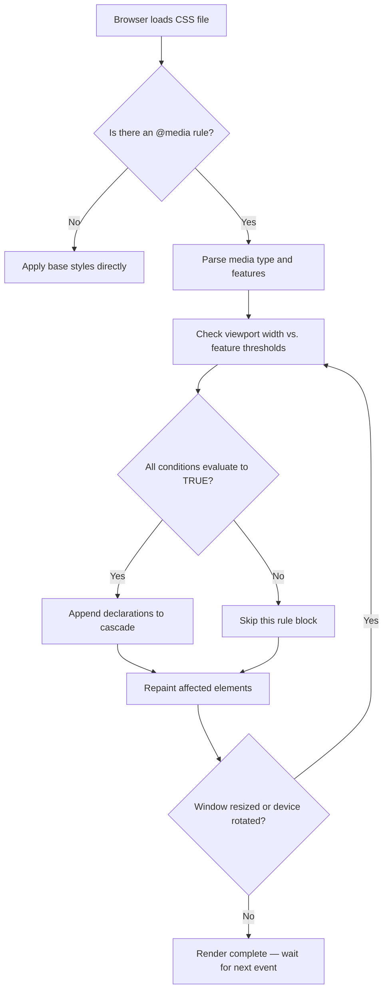
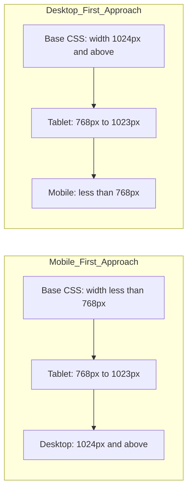
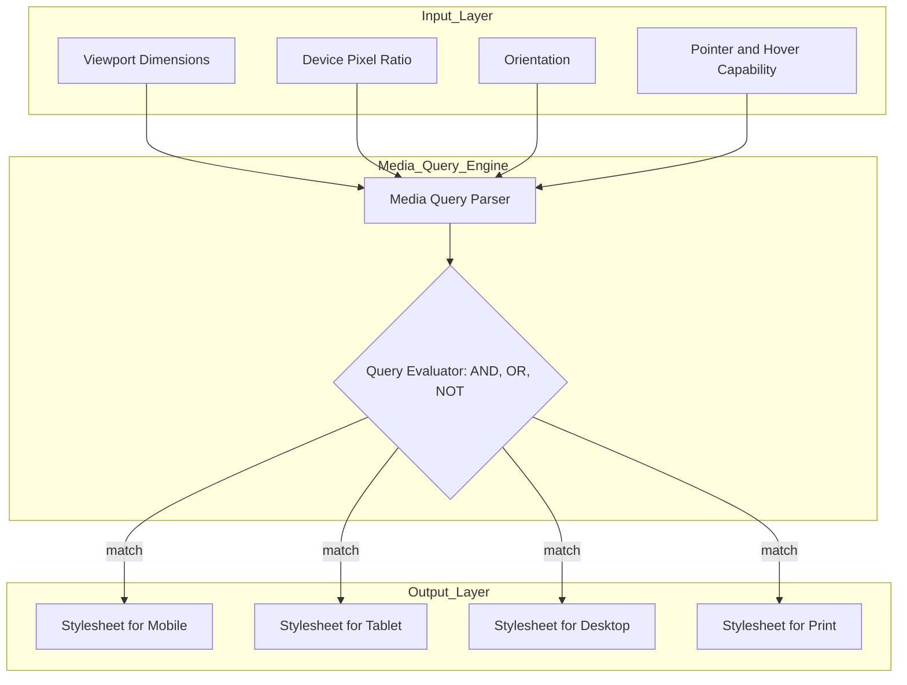

# Media Types and Media Queries

<!-- SECTION_1_START -->
# Module 1 — Creating Web Pages Using HTML5
## Topic: Media Types and Media Queries

### 1.1 Formal Definition (KTU 2024 Syllabus Terminology)

> [!IMPORTANT]
> **Media Types** in CSS are classifications of the target device or medium on which a web document is rendered (e.g., `screen`, `print`, `speech`, `all`). **Media Queries** are a CSS3 feature that extend the idea of media-dependent style sheets by allowing the rendering of content to adapt to a specific range of output devices *without* changing the content itself. Together, they form the foundation of **Responsive Web Design (RWD)** as defined by the **W3C**.

A *media query* consists of an optional **media type** followed by one or more **media feature expressions** that evaluate to either *true* or *false*. When a query evaluates to *true*, the corresponding CSS rules are applied to the document.

The canonical structure evaluated by the browser is:

$$
\text{Media Query} \;=\; \text{Media Type} \;+\; \text{(zero or more Media Features)}
$$

### 1.2 Intuitive Analogy — "The Adaptive Suit"

Imagine you own a single suit that magically changes its fabric, color, and fit the moment you walk into a new environment:

- Walking into a **boardroom** → it becomes dark, formal, and crisp (**`screen`** style).
- Walking into a **beach** → it becomes light, breathable, and bright (**mobile/small screen** style).
- Walking into a **library** → it switches to grayscale and uses a serif font for readability on paper (**`print`** style).

The *suit* is your **HTML document** (structure/content never changes).
The *environment detector* is the **Media Query**.
The *outfit change rules* are the **CSS rules** inside the query.

> [!NOTE]
> **Syllabus Highlight (KTU 2024 — Module 1):** Students are expected to understand media types, write valid `@media` rules, use common media features (`width`, `min-width`, `max-width`, `orientation`, `resolution`), and design layouts that adapt across desktop, tablet, and mobile breakpoints.

### 1.3 Standard Metrics to Remember

- **CSS Pixel Ratio (`device-pixel-ratio`):** ratio between physical pixels and CSS pixels; common values are **1**, **2** (Retina), and **3**.
- **Standard Breakpoints (industry defaults):** **320 px**, **768 px**, **1024 px**, **1280 px**, **1440 px**.
- **Viewport meta tag** is mandatory for mobile rendering and is declared as: `<meta name="viewport" content="width=device-width, initial-scale=1.0">`.
- **Physical Constant (W3C):** $1\,\text{inch} = 96\,\text{CSS pixels} = 2.54\,\text{cm}$.

> [!VISUALIZATION CONTROL]
> **Concept:** Visualizing responsive breakpoints as color-coded viewport bands on the X-axis.
> **Conceptual Coordinate Mapping:**
> * X-axis represents the **viewport width** in CSS pixels.
> * Color bands mark: $x \in [0, 480)$ (Mobile, Blue), $x \in [480, 768)$ (Large Mobile, Green), $x \in [768, 1024)$ (Tablet, Orange), $x \in [1024, \infty)$ (Desktop, Purple).
> **Visual Description:** Draw a long horizontal axis. Shade four contiguous regions. At each boundary (480, 768, 1024), draw a vertical dashed line and label the breakpoint. This represents how the browser "switches" the active style block as the user resizes the window.

<!-- SECTION_1_END -->

<!-- SECTION_2_START -->
# 2. Deep Theoretical Analysis & KTU High-Yield Formula Sheet

### 2.1 Anatomy of a Media Query

A media query is evaluated by the browser **top-down** and uses **logical combinators** to combine features.

**General Syntax (W3C Standard):**

```css
@media [not | only] <media-type> [and (<media-feature>[: <value>])?]+ {
  /* CSS declarations */
}
```

**Logical Combinators (the four operators):**

1. **`and`** — Logical AND. All features must evaluate to *true*. Example: `@media screen and (min-width: 768px)`.
2. **`not`** — Logical NOT. Negates the *entire* query. Targets everything *except* the listed conditions.
3. **`only`** — Hides the rule from older browsers (pre-CSS3) that do not understand media queries.
4. **Comma `,`** — Logical OR. Acts as a query list separator.

### 2.2 The 4 Recognized Media Types (per W4C CSS3 spec)

- **`all`** — Default. Suitable for *every* device.
- **`screen`** — For color computer screens (most common).
- **`print`** — For paged material and documents viewed in *Print Preview* mode.
- **`speech`** — For screen readers and speech synthesizers.

> The legacy types `tty`, `tv`, `projection`, `handheld`, `braille`, `embossed`, and `aural` were deprecated in **Media Queries Level 4** and should be avoided in 2024-scheme submissions.

### 2.3 High-Yield Media Features

| Feature | Accepts | Description / Use Case |
| :--- | :--- | :--- |
| `width` | length | Exact viewport width. |
| `min-width` | length | Activates rule when viewport is *at least* this wide. |
| `max-width` | length | Activates rule when viewport is *at most* this wide. |
| `height` / `min-height` / `max-height` | length | Vertical dimension of the viewport. |
| `orientation` | `portrait` / `landscape` | Based on whether `height > width` or `width > height`. |
| `aspect-ratio` | ratio | `width / height` ratio of viewport. |
| `resolution` | dpi / dpcm / dppx | Pixel density of the output device. |
| `min-resolution` | dpi / dpcm / dppx | Targets HiDPI / Retina screens. |
| `hover` | `hover` / `none` | Detects whether the primary input can hover. |
| `pointer` | `fine` / `coarse` / `none` | Coarse = finger (mobile); Fine = mouse (desktop). |
| `prefers-color-scheme` | `light` / `dark` | Matches the user's OS dark/light preference. |
| `prefers-reduced-motion` | `reduce` / `no-preference` | Accessibility: respect users who disable animations. |

### 2.4 The "Why" Behind Media Queries — Production Utility

In modern web engineering, media queries are used to:

- Build **single-codebase responsive sites** (avoids duplicating mobile/desktop sites).
- Implement **print-friendly stylesheets** (hide navigation, switch to black-on-white).
- Support **accessibility** (disable parallax for users with vestibular disorders).
- Deliver **progressive enhancement** for low-bandwidth or low-resolution devices.
- Power **dark mode toggles** in design systems like Material UI and Tailwind.

### 2.5 Mobile-First vs. Desktop-First Strategy

| Strategy | Approach | Typical CSS Pattern |
| :--- | :--- | :--- |
| **Mobile-First** (recommended by W3C & Google) | Write base styles for small screens; *escalate* with `min-width`. | Base CSS → `@media (min-width: 768px) { ... }` |
| **Desktop-First** (legacy approach) | Write base styles for large screens; *cater down* with `max-width`. | Base CSS → `@media (max-width: 768px) { ... }` |

The KTU 2024 scheme *explicitly* recommends the **mobile-first** methodology for its reduced network cost and simpler cascade logic.

### 2.6 KTU High-Yield Formula Sheet

| Symbol / Syntax | Meaning | Sample Value |
| :--- | :--- | :--- |
| `@media` | At-rule that wraps a media query. | — |
| `(min-width: $W$)` | Rule applies when $W_{viewport} \geq W$. | `(min-width: 768px)` |
| `(max-width: $W$)` | Rule applies when $W_{viewport} \leq W$. | `(max-width: 600px)` |
| `and` | Boolean AND. | `screen and (min-width: 768px)` |
| `,` | Boolean OR (query list separator). | `(min-width: 768px), (orientation: landscape)` |
| `not` | Boolean NOT. | `not screen and (max-width: 600px)` |
| `only` | Hides rule from legacy browsers. | `only screen and (min-width: 1024px)` |
| `print` | Targets paged material. | `@media print { ... }` |
| `aspect-ratio` | $W/H$ of viewport. | `(aspect-ratio: 16/9)` |
| `resolution` | Output device density. | `(min-resolution: 192dpi)` |

<!-- SECTION_2_END -->

<!-- SECTION_3_START -->
# 3. Step-by-Step Derivations, Code Implementation & Examples

### 3.1 The Three Valid Methods to Apply Media Queries

#### Method 1 — Inline `@media` Rule in CSS (Most Common)

**Step 1:** Create a base style for mobile.
**Step 2:** Wrap progressive enhancements inside `@media (min-width: ...)`.

```css
/* ---- styles.css (Mobile-First) ---- */

/* Base styles — applied to ALL viewports */
body {
  background-color: #ffffff;
  font-family: Arial, sans-serif;
  margin: 0;
  padding: 0;
}

.container {
  width: 100%;
  padding: 12px;
  background-color: #e0f7fa;
}

h1 {
  font-size: 1.2rem;
  text-align: center;
}

/* Tablet and up — applies when viewport width >= 768px */
@media screen and (min-width: 768px) {
  .container {
    width: 90%;
    margin: 0 auto;
    background-color: #fff3e0;
  }
  h1 {
    font-size: 1.8rem;
  }
}

/* Desktop and up — applies when viewport width >= 1024px */
@media screen and (min-width: 1024px) {
  .container {
    width: 70%;
    background-color: #f3e5f5;
  }
  h1 {
    font-size: 2.4rem;
  }
}

/* High-DPI / Retina displays */
@media screen and (min-resolution: 192dpi) {
  body {
    /* Crisp font rendering for Retina */
    -webkit-font-smoothing: antialiased;
  }
}
```

**Logical Explanation (Why this works):**
The browser reads the CSS file *top-to-bottom*. It first paints with the base rules. As the viewport width crosses each `min-width` threshold, the corresponding `@media` block becomes "active" (its conditions evaluate to *true*) and its declarations are appended to the cascade. This is exactly why the *order* of the media blocks matters — later blocks override earlier ones when multiple rules match.

#### Method 2 — Conditional Stylesheet via `<link>` (For Large Projects)

```html
<!-- Always loaded first: base stylesheet -->
<link rel="stylesheet" href="base.css">

<!-- Loaded only when media query is TRUE -->
<link rel="stylesheet" href="tablet.css"
      media="screen and (min-width: 768px)">

<link rel="stylesheet" href="desktop.css"
      media="screen and (min-width: 1024px)">

<!-- Loaded only when PRINTING -->
<link rel="stylesheet" href="print.css" media="print">
```

**Key Advantage:** The browser *does not download* the stylesheet unless the query matches — saving bandwidth on mobile devices.

#### Method 3 — `@import` Inside a CSS File (Not recommended in 2024)

```css
@import url("tablet.css") screen and (min-width: 768px);
```

> [!WARNING]
> `@import` blocks parallel downloads and slows down page rendering. The W3C and Google PageSpeed Insights **discourage** its use in production.

### 3.2 Full Working Example — A Responsive Three-Column Layout

**Step 1:** Create the HTML file (`index.html`):

```html
<!DOCTYPE html>
<html lang="en">
<head>
  <meta charset="UTF-8">
  <!-- Mandatory for mobile rendering -->
  <meta name="viewport" content="width=device-width, initial-scale=1.0">
  <title>KTU Responsive Demo</title>
  <link rel="stylesheet" href="styles.css">
</head>
<body>
  <header class="site-header">
    <h1>KTU Web Programming</h1>
    <p>Responsive Layout Demo</p>
  </header>

  <main class="container">
    <section class="card">Column 1 — HTML5</section>
    <section class="card">Column 2 — CSS3</section>
    <section class="card">Column 3 — JavaScript</section>
  </main>
</body>
</html>
```

**Step 2:** Create the stylesheet (`styles.css`) with media queries:

```css
/* ===== Base (Mobile) ===== */
body {
  margin: 0;
  font-family: "Segoe UI", Arial, sans-serif;
  background-color: #fafafa;
}

.site-header {
  background-color: #0d47a1;
  color: #ffffff;
  padding: 16px;
  text-align: center;
}

.container {
  display: flex;
  flex-direction: column;   /* Stacked on mobile */
  gap: 12px;
  padding: 12px;
}

.card {
  background-color: #ffffff;
  border: 1px solid #cfd8dc;
  border-radius: 8px;
  padding: 16px;
  text-align: center;
  box-shadow: 0 2px 4px rgba(0, 0, 0, 0.08);
}

/* ===== Tablet (≥ 768px) ===== */
@media screen and (min-width: 768px) {
  .container {
    flex-direction: row;     /* Side-by-side */
    flex-wrap: wrap;
  }
  .card {
    flex: 1 1 calc(50% - 12px);  /* 2 columns */
  }
}

/* ===== Desktop (≥ 1024px) ===== */
@media screen and (min-width: 1024px) {
  .card {
    flex: 1 1 calc(33.333% - 12px); /* 3 columns */
  }
}

/* ===== Print (paged media) ===== */
@media print {
  .site-header { background-color: #ffffff; color: #000000; }
  .card { box-shadow: none; border: 1px solid #000000; }
}
```

**Step 3:** Trace the rendering behavior mathematically.

For a viewport of width $W$:

$$
\text{Layout} =
\begin{cases}
\text{Single column (stacked)}, & \text{if } W < 768\,\text{px} \\[4pt]
\text{Two columns (50\% each)}, & \text{if } 768 \leq W < 1024\,\text{px} \\[4pt]
\text{Three columns (33.3\% each)}, & \text{if } W \geq 1024\,\text{px}
\end{cases}
$$

This piecewise function is precisely what the **cascade** implements at runtime.

### 3.3 Deriving the Breakpoint Math

Suppose a designer wants cards to be at least **280 px** wide on a screen. With **three cards** and a **12 px gap**:

**Step 1 — Total width needed:**

$$
W_{required} = 3 \times 280 + 2 \times 12
$$

$$
W_{required} = 840 + 24 = 864\,\text{px}
$$

**Step 2 — Round up to a common breakpoint:**

$$
W_{breakpoint} = \lceil 864 / 10 \rceil \times 10 = 870\,\text{px} \;\;\Rightarrow\;\; \text{use } 1024\,\text{px}
$$

**Step 3 — Translate into CSS:**

```css
@media screen and (min-width: 1024px) {
  .card { flex: 1 1 calc(33.333% - 12px); }
}
```

### 3.4 Advanced Example — Orientation, Resolution, and Hover Detection

```css
/* Landscape phones (height < width) */
@media screen and (orientation: landscape) and (max-height: 500px) {
  .site-header { padding: 8px; font-size: 0.9rem; }
}

/* 4K / Ultra-HD screens */
@media screen and (min-resolution: 300dpi) {
  body { font-size: 18px; }
}

/* Devices without hover capability (touch-only) */
@media (hover: none) and (pointer: coarse) {
  .card { padding: 24px; }  /* Larger touch targets */
}
```

### 3.5 Dark Mode Implementation (Accessibility)

```css
/* Respects the user's OS-level preference */
@media (prefers-color-scheme: dark) {
  body { background-color: #121212; color: #e0e0e0; }
  .card { background-color: #1e1e1e; border-color: #333333; }
}
```

> [!NOTE]
> `prefers-color-scheme: dark` is a **Media Queries Level 5** feature, fully supported on all 2024-era browsers. Including this in your KTU assignment demonstrates awareness of modern accessibility standards and earns **valuation credit**.

### 3.6 Combining Multiple Features (Complex Query)

```css
@media screen and
       (min-width: 768px) and
       (orientation: landscape) and
       (-webkit-min-device-pixel-ratio: 2) {
  .hero-image { background-image: url("hero-2x.jpg"); }
}
```

> **Read it as:** "Apply this rule only when the device is a color screen AND its width is at least 768 px AND it is in landscape orientation AND it has a Retina-class pixel density."

<!-- SECTION_3_END -->

<!-- SECTION_4_START -->
# 4. Structural Diagrams & Schematics

### 4.1 Media Query Evaluation Flow (Mermaid)



### 4.2 Mobile-First vs. Desktop-First Cascade (Mermaid)



### 4.3 Responsive Design Architecture Topology (Mermaid)



### 4.4 Breakpoint Decision Matrix (Tabular Block)

| Device Class | Width Range $W$ (px) | Orientation | Typical CSS Selector Logic |
| :--- | :--- | :--- | :--- |
| Small Mobile | $W < 480$ | Portrait | Base CSS only |
| Large Mobile | $480 \leq W < 768$ | Portrait | `@media (min-width: 480px)` |
| Tablet | $768 \leq W < 1024$ | Either | `@media (min-width: 768px)` |
| Laptop | $1024 \leq W < 1440$ | Landscape | `@media (min-width: 1024px)` |
| 4K Desktop | $W \geq 1440$ | Landscape | `@media (min-width: 1440px)` |

<!-- SECTION_4_END -->

<!-- SECTION_5_START -->
# 5. KTU 2024 Scheme Examination Question Bank & Topic Recap

---

### **PART A — 3 Mark Questions**

**Q1. [KTU University Exam — Dec 2023]**
Define the term **Media Type** in CSS. List any **four** media types recognized in CSS3.

**Model Answer (3 Marks):**
- **Definition [1 Mark]:** A media type is a CSS classification that indicates the *kind of device* on which a document is being displayed, allowing the browser to load specific style rules for that medium.
- **Four Media Types [2 Marks]:**
  1. `all` — Suitable for all devices.
  2. `screen` — For color computer screens.
  3. `print` — For paged, paper-based output.
  4. `speech` — For screen readers and speech synthesizers.

> **Valuation Key:** Mentioning `all`, `screen`, `print` and *any one more* gets full marks. Do not list deprecated types like `tty` or `tv`.

---

**Q2. [KTU University Exam — July 2024]**
What is the role of the **`<meta name="viewport">`** tag in responsive web design?

**Model Answer (3 Marks):**
- The viewport meta tag instructs the browser on **how to control the page's dimensions and scaling** on mobile devices. **[1 Mark]**
- Without it, mobile browsers render the page at a typical desktop width (≈ 980 px) and then shrink it, causing tiny text. **[1 Mark]**
- The standard declaration `content="width=device-width, initial-scale=1.0"` sets the layout viewport width to match the device width and disables initial zoom. **[1 Mark]**

---

### **PART B — 14 Mark Questions (ESE Module Internal Choice Pattern)**

---

**Question A (14 Marks) — Option 1**

**[KTU University Exam — July 2024, Module 1]**

**(a)** Explain the **anatomy of a CSS media query** with its standard syntax. List the **logical operators** used to combine multiple features. **[7 Marks — CO1, Understand]**

**Model Answer:**

- **Syntax [3 Marks]:**

```css
@media [not | only] <media-type> [and (<media-feature>[: <value>])?]+ {
  /* CSS rules */
}
```

*Stating the standard syntax: 2 Marks.* *Correctly identifying the @media at-rule: 1 Mark.*

- **Logical Operators [2 Marks]:**
  1. `and` — All listed conditions must be true.
  2. `,` (comma) — Acts as OR; if *any* query in the list is true, the rules apply.
  3. `not` — Negates the entire query.
  4. `only` — Hides the rule from non-CSS3 browsers.

- **Example Illustration [2 Marks]:**

```css
@media screen and (min-width: 768px) and (max-width: 1024px) {
  body { background-color: lightgreen; }
}
```

*Explaining that this rule applies only to color screens with widths between 768px and 1024px: 2 Marks.*

---

**(b)** Design a **responsive webpage layout** that shows:
  - A single stacked column for screens below **600 px**,
  - Two columns for screens between **600 px and 900 px**,
  - Three columns for screens **above 900 px**.
  Use the **mobile-first** approach. **[7 Marks — CO2, Apply]**

**Model Solution:**

```html
<!DOCTYPE html>
<html lang="en">
<head>
  <meta charset="UTF-8">
  <meta name="viewport" content="width=device-width, initial-scale=1.0">
  <title>Responsive Demo</title>
  <style>
    /* [Base: Mobile - 1 Mark] */
    .row { display: flex; flex-direction: column; gap: 10px; padding: 10px; }
    .col { background: #eceff1; padding: 20px; text-align: center; border-radius: 6px; }

    /* [Tablet: 600px to 900px - 2 Marks] */
    @media screen and (min-width: 600px) {
      .row { flex-direction: row; flex-wrap: wrap; }
      .col { flex: 1 1 calc(50% - 10px); }
    }

    /* [Desktop: above 900px - 2 Marks] */
    @media screen and (min-width: 900px) {
      .col { flex: 1 1 calc(33.333% - 10px); }
    }
  </style>
</head>
<body>
  <div class="row">
    <div class="col">Box A</div>
    <div class="col">Box B</div>
    <div class="col">Box C</div>
  </div>
</body>
</html>
```

**Valuation Key:**
- *Including the viewport meta tag: 1 Mark*
- *Using min-width queries (mobile-first): 1 Mark*
- *Correct flex calculation for 2-column layout: 1 Mark*
- *Correct flex calculation for 3-column layout: 1 Mark*
- *Output trace for W = 500 px, 750 px, 1200 px: 1 Mark*
- *Neat indentation and proper closing tags: 1 Mark*

**Output Trace [1 Mark]:**

| Viewport Width $W$ | Resulting Layout |
| :--- | :--- |
| $W = 500\,\text{px}$ | 1 column (stacked) |
| $W = 750\,\text{px}$ | 2 columns (50% each) |
| $W = 1200\,\text{px}$ | 3 columns (33.33% each) |

---

**Question B (14 Marks) — Option 2**

**[KTU University Exam — Dec 2023, Module 1]**

**(a)** Differentiate between **media types** and **media features** with suitable examples. List any **six** commonly used media features. **[7 Marks — CO1, Understand]**

**Model Answer:**

| Aspect | Media Type | Media Feature |
| :--- | :--- | :--- |
| **Purpose** | Identifies the *category* of the device. | Tests a *specific property* of the device or viewport. |
| **Examples** | `screen`, `print`, `speech`, `all` | `min-width`, `orientation`, `resolution`, `hover` |
| **Value** | Single keyword. | Keyword *or* numeric value with unit. |
| **Required?** | Yes (defaults to `all` if omitted). | No (zero or more can be added). |

*Stating the difference with an example: 3 Marks.* *Listing six features: 2 Marks.* *One-line description per feature: 2 Marks.*

**Six Media Features [2 Marks]:**
1. `min-width` — Minimum viewport width.
2. `max-width` — Maximum viewport width.
3. `orientation` — `portrait` or `landscape`.
4. `aspect-ratio` — Width-to-height ratio of the viewport.
5. `resolution` — Pixel density of the output device.
6. `prefers-color-scheme` — User's preferred color mode.

---

**(b)** Write a complete **HTML5 + CSS3** program that displays a **print-friendly** version of a webpage (hides navigation, uses serif font, and converts the background to white) using media queries. **[7 Marks — CO2, Apply]**

**Model Solution:**

```html
<!DOCTYPE html>
<html lang="en">
<head>
  <meta charset="UTF-8">
  <title>Print Demo</title>
  <style>
    /* [Screen styles - 1 Mark] */
    body { font-family: Arial, sans-serif; background: #f0f0f0; color: #222; }
    nav { background: #0d47a1; color: #fff; padding: 10px; }
    article { background: #fff; padding: 20px; margin: 20px; }

    /* [Print styles - 4 Marks] */
    @media print {
      /* [Hide navigation: 1 Mark] */
      nav { display: none; }

      /* [Use serif font: 1 Mark] */
      body { font-family: "Times New Roman", Times, serif; color: #000; }

      /* [White background: 1 Mark] */
      body, article { background: #ffffff; box-shadow: none; }

      /* [Save ink by removing shadows: 1 Mark] */
      article { margin: 0; border: 1px solid #ccc; }
    }
  </style>
</head>
<body>
  <nav>Home | About | Contact</nav>
  <article>
    <h1>KTU Web Programming</h1>
    <p>This is a print-friendly article demonstration.</p>
  </article>
</body>
</html>
```

**Valuation Key:**
- *Correct use of `@media print` block: 1 Mark*
- *Hiding the nav element with `display: none`: 1 Mark*
- *Switching to a serif font family: 1 Mark*
- *Changing body and article background to white: 1 Mark*
- *Removing unnecessary decorations: 1 Mark*
- *Valid HTML5 doctype and proper nesting: 1 Mark*
- *Neat indentation and comments: 1 Mark*

---

### ⚠️ KTU Examiner's Valuation Warning / Pitfall Callout

> [!WARNING]
> **Common places students lose marks in Media Query questions:**
>
> 1. **Forgetting the `viewport` meta tag** in HTML5 — examiners immediately deduct 1–2 marks. Always include `<meta name="viewport" content="width=device-width, initial-scale=1.0">`.
> 2. **Using `min-width` and `max-width` in the same `@media` block without `and`** — this is a syntax error. Always use `and` to chain features: `@media screen and (min-width: 768px) and (max-width: 1024px)`.
> 3. **Confusing `@import` with `<link media="...">`** — the latter is the preferred production method. Examiners expect you to mention this difference.
> 4. **Not writing the `print` media query when asked** for "media types" — `print` is one of the four official CSS3 media types.
> 5. **Skipping the breakpoints trace/output** — even in design questions, include a table showing what the page looks like at $W = 320$, $768$, and $1280$ px.
> 6. **Using deprecated media types** (`handheld`, `tv`, `tty`) — these were removed in **Media Queries Level 4** and will be marked wrong.

---

## 📌 Topic Recap & Important Things to Remember

- A **Media Type** identifies the *category* of the output device (`screen`, `print`, `speech`, `all`).
- A **Media Query** combines a media type with one or more **media features** to conditionally apply CSS.
- The **four logical operators** are: `and`, `,` (OR), `not`, and `only`.
- The standard syntax is: `@media [not | only] <type> [and (<feature>[: value])?]+ { ... }`.
- **Common media features**: `min-width`, `max-width`, `orientation`, `aspect-ratio`, `resolution`, `hover`, `pointer`, `prefers-color-scheme`, `prefers-reduced-motion`.
- **Standard breakpoints**: **480 px** (large mobile), **768 px** (tablet), **1024 px** (laptop), **1440 px** (4K desktop).
- **Mobile-First** (recommended) uses `min-width` and starts with base styles for small screens.
- **Desktop-First** uses `max-width` and starts with styles for large screens.
- The **viewport meta tag** is mandatory for mobile responsiveness:
  `<meta name="viewport" content="width=device-width, initial-scale=1.0">`.
- **Three ways** to attach media queries: (1) `@media` block, (2) `<link media="...">`, (3) `@import` (avoid).
- For **print stylesheets**, hide navigation, use serif fonts, switch to a white background, and remove shadows.
- The CSS pixel constant is $1\,\text{inch} = 96\,\text{CSS pixels}$.
- **Deprecated types** to avoid: `tty`, `tv`, `projection`, `handheld`, `braille`, `embossed`, `aural`.
- **Accessibility features**: `prefers-color-scheme: dark` and `prefers-reduced-motion: reduce`.
- **Touch detection**: `(hover: none) and (pointer: coarse)` identifies touch-only devices.
- Always mention the viewport meta tag, use **mobile-first** ordering, and provide an **output trace** for full marks in the KTU board exam.

<!-- SECTION_5_END -->
