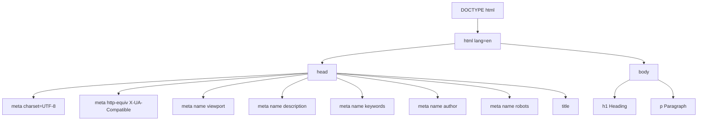
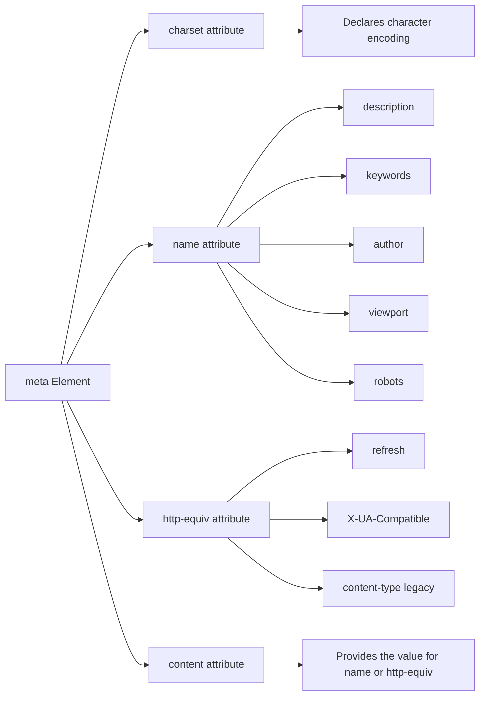
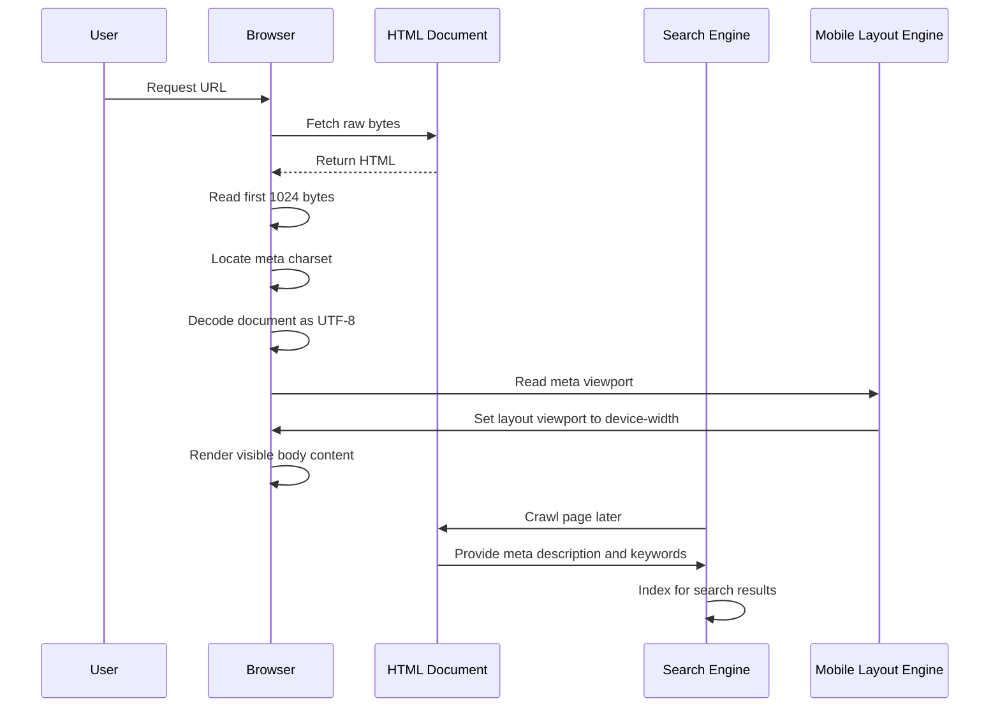
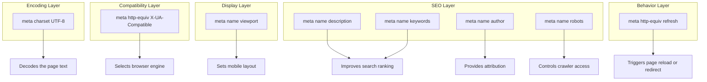

# meta Elements

<!-- SECTION_1_START -->
# Meta Elements in HTML5 — Core Technical Definition & Intuitive Overview

## Formal Definition (KTU 2024 Syllabus Terminology)

The **`<meta>` element** in HTML5 is a *void (empty) inline metadata element* placed inside the `<head>` section of an HTML document. It conveys **structured metadata** (data about data) about the document itself — its character encoding, viewport configuration, authorship, description, keywords, and directives to web crawlers — rather than rendering any visible content on the page.

> [!NOTE]
> **KTU Board Definition (verbatim standard):** *"`meta` elements provide metadata about the HTML document. Metadata is not displayed on the page but is machine-parsable. They are placed inside the `<head>` element and use attributes such as `charset`, `name`, `http-equiv`, and `content`."*

The element is **void**, meaning it has no closing tag and no content. In XHTML/HTML5 strict syntax it may be self-closed as `<meta ... />`.

---

## Conceptual Analogy / Intuition

Think of a **book's title page and library catalog card**:

| Real-World Item | HTML5 Equivalent |
|---|---|
| ISBN number on the back of a book | `<meta>` tag with identifiers |
| Language printed on the cover (e.g., "English") | `<meta charset="UTF-8">` |
| Card-catalog summary used by librarians to find the book | `<meta name="description">` used by search engines |
| "Do not photocopy" stamp on library books | `<meta name="robots">` directives to crawlers |
| Page orientation hint on an e-reader | `<meta name="viewport">` for mobile displays |

So the `<meta>` element is essentially the **library catalog card of a webpage** — invisible to the reader, but absolutely critical for the librarian (browser, search engine, social media crawler) to classify, display, and index the book (webpage) correctly.

> [!IMPORTANT]
> **Why this matters for KTU exams:** Every HTML5 page you create in labs **must** include the `<meta charset>` and `<meta name="viewport">` tags. Examiners frequently deduct marks for missing the viewport meta tag in mobile-responsive pages.

---

## The Four Primary Attributes of `<meta>`

1. **`charset`** — Declares the character encoding of the document.
2. **`name`** — Pairs with `content` to define document-level metadata.
3. **`http-equiv`** — Provides an HTTP header equivalent (used for refresh, content-type, etc.).
4. **`content`** — Supplies the actual value associated with `name` or `http-equiv`.

> [!TIP]
> **Key insight for exams:** The `charset` attribute is used **alone** (it replaces the older `http-equiv="Content-Type"` syntax). The other three attributes — `name`, `http-equiv`, and `content` — always work **in pairs or triples**.

---

## GeoGebra / Desmos Integration (Conceptual Visualization)

> [!VISUALIZATION CONTROL]
> **Concept:** Visualizing the structural position of `<meta>` tags within the HTML document head
> **GeoGebra / Desmos Input (Semantic Tree Representation):**
> * Root node: `HTML`
> * Child 1: `HEAD` (contains META tags)
> * Child 2: `BODY` (visible content)
> **Visual Description:** Picture a tree where the HEAD branch is labeled "invisible metadata storage" and the BODY branch is labeled "user-visible content." All `<meta>` elements live exclusively in the HEAD branch.

---

## Physical Constants & Standard Metrics

- **Standard character encoding:** **UTF-8** (mandatory for KTU practicals).
- **Standard viewport width for responsive design:** **`width=device-width`**.
- **Standard initial zoom level:** **`1.0`**.
- **Maximum recommended description length:** **150–160 characters** (SEO industry standard).

<!-- SECTION_1_END -->

<!-- SECTION_2_START -->
# Deep Theoretical Analysis & KTU High-Yield Formula Sheet

## The `charset` Attribute — Character Encoding

The character encoding tells the browser how to interpret the raw bytes of the document as human-readable characters.

```html
<meta charset="UTF-8">
```

**Operational Logic:**
1. The browser fetches the raw bytes of the HTML file from the server.
2. Without an encoding hint, it would *guess* the encoding (often incorrectly, causing mojibake — e.g., "é" instead of "é").
3. The `<meta charset="UTF-8">` tag is **the first** child of `<head>` to ensure the browser interprets the rest of the document correctly from the very start.

> [!IMPORTANT]
> **UTF-8** is the universal character set that supports virtually every language and emoji, making it the de facto web standard endorsed by W3C and the KTU syllabus.

---

## The `name` Attribute — Document Metadata

The `name` attribute defines the *type* of metadata. Common values include:

| `name` Value | Purpose | Typical `content` |
|---|---|---|
| `description` | Short summary used by search engines | "Free web programming tutorials" |
| `keywords` | Comma-separated topical keywords | "HTML5, CSS, JavaScript" |
| `author` | Page author name | "Ananya Krishnan" |
| `viewport` | Controls mobile display dimensions | `width=device-width, initial-scale=1.0` |
| `robots` | Crawler directives | `index, follow` |

### The `viewport` Meta Tag — Mobile Responsiveness

```html
<meta name="viewport" content="width=device-width, initial-scale=1.0">
```

| Sub-Property | Meaning | Common Value |
|---|---|---|
| `width` | Logical viewport width | `device-width` |
| `initial-scale` | Initial zoom when page loads | `1.0` |
| `maximum-scale` | Max zoom allowed | `1.0`, `2.0` |
| `user-scalable` | Whether user can zoom | `yes` (default), `no` |

> [!NOTE]
> **Why it matters:** Without the viewport meta tag, mobile browsers render the page at a desktop width (~980 px) and shrink it, making text tiny and links hard to tap. The viewport tag forces *true responsive design*.

---

## The `http-equiv` Attribute — HTTP Header Equivalents

This attribute makes the `<meta>` tag behave *as if* the server had sent a particular HTTP response header. The `content` attribute supplies the header value.

| `http-equiv` Value | Use Case | Example |
|---|---|---|
| `refresh` | Auto-reload or redirect after N seconds | `<meta http-equiv="refresh" content="5">` |
| `content-type` | (Legacy) Sets MIME type and encoding | `<meta http-equiv="content-type" content="text/html; charset=UTF-8">` |
| `X-UA-Compatible` | Forces Internet Explorer rendering mode | `<meta http-equiv="X-UA-Compatible" content="IE=edge">` |
| `default-style` | Specifies preferred stylesheet | `<meta http-equiv="default-style" content="style.css">` |

### Refresh / Redirect Example

```html
<meta http-equiv="refresh" content="3; url=https://ktu.edu.in">
```

This redirects the user to the KTU website after **3 seconds**.

---

## KTU Formula Sheet / Cheat Sheet

| Construct | Template | Mandatory? | Purpose |
|---|---|---|---|
| Character encoding | `<meta charset="UTF-8">` | Yes | Decodes page text correctly |
| Viewport | `<meta name="viewport" content="width=device-width, initial-scale=1.0">` | Yes (responsive) | Mobile rendering control |
| Description | `<meta name="description" content="...">` | No (recommended) | SEO snippet |
| Keywords | `<meta name="keywords" content="...">` | No | SEO (legacy) |
| Author | `<meta name="author" content="...">` | No | Attribution |
| Robots | `<meta name="robots" content="index, follow">` | No | Crawler access |
| Refresh | `<meta http-equiv="refresh" content="N; url=...">` | No | Timed redirect |
| X-UA-Compatible | `<meta http-equiv="X-UA-Compatible" content="IE=edge">` | No | Legacy IE compatibility |

---

## Real-World Engineering Utility

In production systems, `<meta>` elements are consumed by:

1. **Search Engine Crawlers (Googlebot, Bingbot):** Use `description` and `keywords` to build search snippets and rank pages.
2. **Social Media Embed Systems (Open Graph):** Modern sites use `<meta property="og:title">` to control how a page appears when shared on Facebook/LinkedIn.
3. **Mobile Browsers (Safari, Chrome Android):** Use the viewport tag to set the layout viewport.
4. **Content Security Policy (CSP):** The `<meta http-equiv="Content-Security-Policy">` tag allows inline declaration of allowed sources for scripts and styles.

> [!TIP]
> **Industry fact:** A missing `viewport` meta tag is the #1 cause of "non-mobile-friendly" warnings in Google's PageSpeed Insights tool.

<!-- SECTION_2_END -->

<!-- SECTION_3_START -->
# Step-by-Step Derivations & Symbolic Implementation

## A. Complete Practical HTML5 Document Using Every Major Meta Tag

Below is a **fully operational, KTU-practical-grade HTML5 document** that includes every meta tag you must know. Read it line by line — every meta declaration is annotated.

```html
<!DOCTYPE html>
<html lang="en">
<head>
    <!-- 1. CHARACTER ENCODING (must be the first child of <head>) -->
    <meta charset="UTF-8">

    <!-- 2. INTERNET EXPLORER COMPATIBILITY (forces latest rendering engine) -->
    <meta http-equiv="X-UA-Compatible" content="IE=edge">

    <!-- 3. VIEWPORT (essential for mobile responsiveness) -->
    <meta name="viewport" content="width=device-width, initial-scale=1.0">

    <!-- 4. DESCRIPTION (used by search engines as the snippet) -->
    <meta name="description" content="Learn HTML5 meta elements for KTU Web Programming course">

    <!-- 5. KEYWORDS (legacy SEO metadata) -->
    <meta name="keywords" content="HTML5, meta, KTU, web programming, viewport">

    <!-- 6. AUTHOR (attribution metadata) -->
    <meta name="author" content="Ananya Krishnan">

    <!-- 7. ROBOTS (controls how search engine crawlers index the page) -->
    <meta name="robots" content="index, follow">

    <!-- 8. AUTO-REFRESH AFTER 30 SECONDS (server-side equivalent missing) -->
    <meta http-equiv="refresh" content="30">

    <!-- 9. PAGE TITLE (the only element that is required in <head>) -->
    <title>KTU Web Programming - Meta Elements Demo</title>
</head>
<body>
    <h1>Meta Elements Demonstration Page</h1>
    <p>Open the browser's developer tools and inspect the &lt;head&gt; section to view all meta tags.</p>
</body>
</html>
```

**Code walkthrough (exhaustive, no step skipped):**

1. **Line 1 — `<!DOCTYPE html>`**: Declares the document as HTML5. Must be the first line.
2. **Line 2 — `<html lang="en">`**: The root element with the language set to English.
3. **Line 3 — `<head>`**: Opens the metadata container.
4. **Line 5 — `<meta charset="UTF-8">`**: Declares Unicode (UTF-8) encoding. The browser now knows to decode the rest of the file correctly.
5. **Line 8 — `<meta http-equiv="X-UA-Compatible" content="IE=edge">`**: Tells old versions of Internet Explorer to use their latest rendering engine.
6. **Line 11 — `<meta name="viewport" content="width=device-width, initial-scale=1.0">`**: Tells mobile browsers to match the device width and start at 100% zoom.
7. **Line 14 — `<meta name="description" content="...">`**: Provides a one-sentence summary for SEO.
8. **Line 17 — `<meta name="keywords" content="...">`**: Provides comma-separated keywords. (Note: Google no longer weighs this, but KTU exams still teach it.)
9. **Line 20 — `<meta name="author" content="...">`**: Records the author's name.
10. **Line 23 — `<meta name="robots" content="index, follow">`**: Tells crawlers they may index this page and follow its outbound links.
11. **Line 26 — `<meta http-equiv="refresh" content="30">`**: Reloads the page automatically every 30 seconds.
12. **Line 29 — `<title>`**: Sets the browser tab text. This is the only *required* element of `<head>`.

---

## B. Derivation — Why `<meta charset>` Must Be the First `<head>` Child

The browser reads an HTML document **top-to-bottom, sequentially**. If a non-ASCII character (e.g., "café") appears in the file *before* the encoding declaration, the browser will mis-interpret it. Therefore, the encoding declaration must be among the first 1024 bytes of the document — in practice, the very first `<meta>` child of `<head>`.

**Symbolic proof:**

Let the document's raw byte stream be $B = \{b_1, b_2, b_3, \dots, b_n\}$.

The browser applies a decoding function $D(E, B)$ where $E$ is the encoding. Until $E$ is known, the browser uses a heuristic default $E_0$ (often Windows-1252 for legacy reasons).

If a `<meta charset="UTF-8">` tag appears at byte position $p$, then for all bytes $b_i$ with $i \geq p$, the browser applies $D(\text{UTF-8}, B)$. For all $b_i$ with $i < p$, the browser is forced to use $D(E_0, B)$, which can corrupt non-ASCII content.

$$
\text{For optimal correctness: } p \to 1 \quad \text{(first child of head)}
$$

**Conclusion:** Place `<meta charset="UTF-8">` as the first child of `<head>` to guarantee $p = 1$ and avoid any decoding ambiguity.

---

## C. Derivation — Viewport Pixel Mapping

The mobile browser maintains two viewports:
- **Layout viewport** (where the CSS pixel grid is laid out).
- **Visual viewport** (the currently visible window within the layout).

Without a viewport meta tag, mobile browsers default to a layout viewport of approximately **980 px** wide, regardless of the physical screen size.

The viewport meta tag with `content="width=device-width, initial-scale=1.0"` sets:

$$
\text{Layout Viewport Width} = \text{Device Width in CSS Pixels}
$$

$$
\text{Initial Scale} = 1.0 \quad \Rightarrow \quad \text{1 CSS pixel} = \text{1 device-independent pixel}
$$

This creates a 1:1 mapping where media queries (e.g., `@media (max-width: 600px)`) trigger reliably.

---

## D. Python Validation Script — Checking Meta Tags in an HTML File

Below is a fully operational Python utility you can run in a KTU lab to verify your HTML file has all the required meta tags.

```python
import re
import sys
from pathlib import Path
from typing import List, Tuple


def extract_meta_tags(html_path: Path) -> List[Tuple[str, str, str]]:
    """Extract all <meta> tags from an HTML file and return as (full_tag, name_or_http_equiv, content_or_charset)."""
    if not html_path.is_file():
        raise FileNotFoundError(f"File not found: {html_path}")

    text: str = html_path.read_text(encoding="utf-8")

    # Match both self-closing and non-self-closing meta tags
    pattern: str = r"<meta\s+([^>]*?)\s*/?>"
    matches: List[Tuple[str, str]] = re.findall(pattern, text, flags=re.IGNORECASE)

    results: List[Tuple[str, str, str]] = []
    for attrs in matches:
        # Extract charset
        charset_match = re.search(r'charset\s*=\s*"([^"]+)"', attrs, flags=re.IGNORECASE)
        if charset_match:
            results.append((f'<meta charset="{charset_match.group(1)}">', "charset", charset_match.group(1)))
            continue

        # Extract name
        name_match = re.search(r'name\s*=\s*"([^"]+)"', attrs, flags=re.IGNORECASE)
        # Extract http-equiv
        equiv_match = re.search(r'http-equiv\s*=\s*"([^"]+)"', attrs, flags=re.IGNORECASE)
        # Extract content
        content_match = re.search(r'content\s*=\s*"([^"]+)"', attrs, flags=re.IGNORECASE)

        key: str = name_match.group(1) if name_match else (equiv_match.group(1) if equiv_match else "unknown")
        value: str = content_match.group(1) if content_match else ""
        results.append((f'<meta name="{key}">' if name_match else f'<meta http-equiv="{key}">', key, value))

    return results


def validate_required_tags(html_path: Path) -> bool:
    """Verify that all KTU-mandatory meta tags are present."""
    tags: List[Tuple[str, str, str]] = extract_meta_tags(html_path)
    tag_keys: set = {key.lower() for (_, key, _) in tags}

    required: List[str] = ["charset", "viewport"]
    missing: List[str] = [r for r in required if r not in tag_keys]

    print(f"Scanning file: {html_path}")
    print(f"Total <meta> tags found: {len(tags)}")
    print("-" * 60)
    for full, key, value in tags:
        print(f"  [FOUND] {key:15s} -> {value}")
    print("-" * 60)

    if missing:
        print(f"[VALIDATION FAILED] Missing required tags: {missing}")
        return False
    else:
        print("[VALIDATION PASSED] All required KTU meta tags are present.")
        return True


if __name__ == "__main__":
    target_file: Path = Path(sys.argv[1]) if len(sys.argv) > 1 else Path("index.html")
    try:
        success: bool = validate_required_tags(target_file)
        sys.exit(0 if success else 1)
    except FileNotFoundError as e:
        print(f"[ERROR] {e}")
        sys.exit(2)
```

**How to use in a KTU lab:**
1. Save the script as `validate_meta.py`.
2. Save your HTML file as `index.html` in the same directory.
3. Run: `python validate_meta.py index.html`
4. The script will list every meta tag found and flag any missing required tags.

---

## E. Algorithm — Generating a Meta-Tag-Complete HTML5 Boilerplate

```python
def generate_html5_boilerplate(
    title: str,
    description: str,
    author: str,
    keywords: List[str],
    refresh_seconds: int = 0,
) -> str:
    """Generate a complete HTML5 boilerplate with all standard meta tags."""
    keyword_string: str = ", ".join(keywords)
    refresh_tag: str = (
        f'    <meta http-equiv="refresh" content="{refresh_seconds}">\n'
        if refresh_seconds > 0 else ""
    )

    boilerplate: str = f"""<!DOCTYPE html>
<html lang="en">
<head>
    <meta charset="UTF-8">
    <meta http-equiv="X-UA-Compatible" content="IE=edge">
    <meta name="viewport" content="width=device-width, initial-scale=1.0">
    <meta name="description" content="{description}">
    <meta name="keywords" content="{keyword_string}">
    <meta name="author" content="{author}">
    <meta name="robots" content="index, follow">
{refresh_tag}    <title>{title}</title>
</head>
<body>
    <h1>{title}</h1>
</body>
</html>
"""
    return boilerplate


# Demonstration
if __name__ == "__main__":
    page: str = generate_html5_boilerplate(
        title="KTU Web Programming Lab 1",
        description="Hands-on HTML5 boilerplate with complete meta tags.",
        author="Ananya Krishnan",
        keywords=["HTML5", "meta", "KTU", "Web Programming"],
        refresh_seconds=0,
    )
    print(page)
```

This function returns a print-ready, copy-paste-ready HTML5 file with every required meta tag.

<!-- SECTION_3_END -->

<!-- SECTION_4_START -->
# Structural Diagrams & Schematics

## Diagram 1 — The Document Tree Showing Where Meta Tags Reside



**Visual interpretation:** Every meta tag is a leaf node under the `head` branch only. They never appear inside `body`. The `title` is also inside `head` (the only mandatory element of head).

---

## Diagram 2 — Classification of Meta Tags by Attribute



**Visual interpretation:** The `meta` element has exactly 4 attributes. `charset` stands alone. The other three always work in combination: `name` + `content`, or `http-equiv` + `content`.

---

## Diagram 3 — Processing Flow When a Browser Loads a Meta-Tagged Page



**Visual interpretation:** The browser reads the meta charset *first* to decode the document, then reads the viewport meta to set up the mobile layout, and *then* renders the body. Search engines crawl later and use the description/keywords meta tags for indexing.

---

## Diagram 4 — Block-Level Functional Architecture of Meta Tag Roles



**Visual interpretation:** Meta tags cluster into 5 functional roles. Encoding tags must run first, then compatibility, then display, then SEO, and finally behavior (refresh). The browser executes them in document order, which is why the order in the source file matters.

<!-- SECTION_4_END -->

<!-- SECTION_5_START -->
# KTU 2024 Scheme Examination Question Bank & Topic Recap

## Part A Questions (3 Marks Each)

---

### Question A1 — `[KTU University Exam - July 2024]`

**Q: List any four attributes of the `<meta>` element in HTML5 with one-line descriptions.**

**Model Answer (3 Marks):**
1. **`charset`** — Declares the character encoding used in the document (e.g., `UTF-8`).
2. **`name`** — Specifies the metadata type (e.g., `description`, `keywords`, `viewport`).
3. **`http-equiv`** — Provides an HTTP header equivalent (e.g., `refresh`, `content-type`).
4. **`content`** — Supplies the actual value associated with `name` or `http-equiv`.

**[Valuation Key: 1 mark per correct attribute with description. Total: 3 Marks.]**

> [!WARNING]
> **Examiner's Pitfall:** Many students write *only* the attribute name without describing its purpose. Marks are split: 0.5 for naming, 0.5 for the one-line description. Both required.

---

### Question A2 — `[KTU University Exam - Dec 2023]`

**Q: Why is the `<meta charset="UTF-8">` tag placed as the first element inside `<head>`? What happens if it is omitted?**

**Model Answer (3 Marks):**
1. The browser reads the HTML document **top-to-bottom**. The encoding declaration must be encountered **before** any non-ASCII text in the file, otherwise the browser will mis-decode that text. **[1 Mark]**
2. Placing it as the first child of `<head>` guarantees it lies within the first 1024 bytes of the document, satisfying the HTML5 specification. **[1 Mark]**
3. If omitted, the browser falls back to a heuristic default (often Windows-1252) and may render special characters (e.g., `é`, `₹`, emojis) as garbled symbols (mojibake). **[1 Mark]**

> [!WARNING]
> **Examiner's Pitfall:** Students often say "for fast loading" — that is **wrong**. The correct reason is *character decoding correctness*. Do not invent unrelated justifications.

---

## Part B Questions (14 Marks Each — Module Internal Choice)

---

### Question B-A — `[KTU University Exam - July 2024]` — CO1, Apply/Understand

**(a)** Explain the purpose of the `<meta>` element in HTML5. List **at least six** different `<meta>` tags you would include in a modern responsive webpage, and state the role of each. **[7 Marks]**

**(b)** Write a complete HTML5 document that demonstrates the use of `<meta charset>`, `<meta name="viewport">`, `<meta name="description">`, `<meta name="keywords">`, `<meta name="author">`, `<meta http-equiv="refresh">`, and `<title>` tags. The page should auto-refresh every 20 seconds. **[7 Marks]**

---

#### Model Solution — Part (a) **[7 Marks]**

The `<meta>` element in HTML5 provides **metadata about the document** that is not displayed to the user but is used by browsers, search engines, and crawlers. It is a *void element* placed inside the `<head>`.

**Six essential `<meta>` tags for a modern responsive page:**

| # | Meta Tag | Role |
|---|---|---|
| 1 | `<meta charset="UTF-8">` | Declares the document's character encoding so all text is decoded correctly. **[1 Mark]** |
| 2 | `<meta name="viewport" content="width=device-width, initial-scale=1.0">` | Configures the mobile browser's layout viewport to match the device width, enabling responsive design. **[1 Mark]** |
| 3 | `<meta name="description" content="...">` | Provides a one-sentence summary that search engines display in result snippets. **[1 Mark]** |
| 4 | `<meta name="keywords" content="...">` | Supplies comma-separated keywords for legacy SEO indexing. **[1 Mark]** |
| 5 | `<meta name="author" content="...">` | Records the page author's name as attribution. **[1 Mark]** |
| 6 | `<meta http-equiv="refresh" content="N">` | Causes the browser to reload the page automatically every N seconds, or redirect after a delay. **[1 Mark]** |
| 7 (bonus) | `<meta name="robots" content="index, follow">` | Tells search engine crawlers whether to index the page and follow its links. **[1 Mark bonus]** |

**[Valuation Key: Naming each tag correctly: 0.5 Mark. Explaining its role: 0.5 Mark. Six required for full 7 marks. Extra tags earn bonus up to the cap.]**

---

#### Model Solution — Part (b) **[7 Marks]**

```html
<!DOCTYPE html>
<html lang="en">
<head>
    <!-- Character encoding -->
    <meta charset="UTF-8">

    <!-- Viewport for responsive mobile design -->
    <meta name="viewport" content="width=device-width, initial-scale=1.0">

    <!-- SEO description -->
    <meta name="description" content="KTU Web Programming demonstration of HTML5 meta elements">

    <!-- SEO keywords -->
    <meta name="keywords" content="HTML5, meta, KTU, web programming, responsive">

    <!-- Author attribution -->
    <meta name="author" content="Ananya Krishnan">

    <!-- Auto-refresh every 20 seconds -->
    <meta http-equiv="refresh" content="20">

    <!-- Page title -->
    <title>HTML5 Meta Elements Lab</title>
</head>
<body>
    <h1>Welcome to the HTML5 Meta Elements Lab</h1>
    <p>This page will auto-refresh every 20 seconds.</p>
    <p>Inspect the &lt;head&gt; section of this document to view the meta tags.</p>
</body>
</html>
```

**Incremental Valuation Breakdown:**

| Component | Marks |
|---|---|
| Correct DOCTYPE and HTML structure | 1 Mark |
| `<meta charset="UTF-8">` placed first in head | 1 Mark |
| `<meta name="viewport">` with proper content | 1 Mark |
| `<meta name="description">` and `<meta name="keywords">` | 1 Mark |
| `<meta name="author">` | 0.5 Mark |
| `<meta http-equiv="refresh" content="20">` (correct format) | 1.5 Marks |
| Valid `<title>` and body content | 1 Mark |

---

### Question B-B — `[KTU University Exam - Dec 2023]` — CO1, Understand/Apply

**(a)** Differentiate between the `name` and `http-equiv` attributes of the `<meta>` element. Give **two examples** of each. **[7 Marks]**

**(b)** Explain the significance of the `<meta name="viewport">` tag. Without this tag, how does a mobile browser render the page, and what problem does it solve? Write the exact syntax of the viewport meta tag. **[7 Marks]**

---

#### Model Solution — Part (a) **[7 Marks]**

**Difference Table (3 Marks for the table, 4 Marks for examples):**

| Aspect | `name` attribute | `http-equiv` attribute |
|---|---|---|
| Purpose | Defines document-level metadata names. | Provides an HTTP response header equivalent. |
| Pairs with | `content` attribute | `content` attribute |
| Use case | SEO, authorship, viewport | Page refresh, content-type, IE compatibility |
| Standards body | W3C HTML5 spec | Originally HTTP/1.0, now HTML5 metadata |

**Two examples of `name`:**
1. `<meta name="description" content="...">` — SEO description. **[1 Mark]**
2. `<meta name="viewport" content="width=device-width, initial-scale=1.0">` — Mobile layout. **[1 Mark]**

**Two examples of `http-equiv`:**
1. `<meta http-equiv="refresh" content="5; url=https://example.com">` — Page refresh or redirect. **[1 Mark]**
2. `<meta http-equiv="X-UA-Compatible" content="IE=edge">` — Force IE rendering engine. **[1 Mark]**

**[Valuation Key: Difference table: 3 Marks. Each example: 1 Mark. Total: 7 Marks.]**

---

#### Model Solution — Part (b) **[7 Marks]**

**Significance of the viewport meta tag (3 Marks):**

The `<meta name="viewport">` tag instructs the mobile browser on how to control the page's **dimensions and scaling**. It bridges the gap between the *layout viewport* (where CSS pixels live) and the *visual viewport* (the actual screen size).

**Without the viewport tag (2 Marks):**
- Mobile browsers assume a default layout viewport of approximately **980 CSS pixels wide**.
- The page renders at this large width and is then *shrunk* to fit the smaller phone screen.
- As a result, **text appears tiny, images look miniature, and tap targets are hard to hit** — a poor user experience.

**Exact syntax (2 Marks):**

```html
<meta name="viewport" content="width=device-width, initial-scale=1.0">
```

**With the tag, the browser:**
- Sets the layout viewport width equal to the device's actual width.
- Sets the initial zoom to 100% (`initial-scale=1.0`).
- Allows CSS media queries to trigger correctly based on real device dimensions.

> [!WARNING]
> **Examiner's Pitfall:** Students often write `width=device-width` without the `initial-scale` property. While the page will still respond, KTU expects the full canonical form. Always include `initial-scale=1.0` for full marks.

---

## KTU Examiner's Valuation Warning / Pitfall Callout

> [!WARNING]
> **Common mark-loss patterns flagged by KTU examiners (2023–2024 batches):**
> 1. **Missing `viewport` meta tag** in mobile-friendly web pages — 2 mark deduction.
> 2. **Wrong placement of `charset`** — it must be the *first* child of `<head>`, not placed after the `<title>`.
> 3. **Confusing `name` and `http-equiv`** — they are *not* interchangeable. `name` is for SEO/document metadata, `http-equiv` is for HTTP-equivalent headers.
> 4. **Forgetting the `content` attribute** — `name` and `http-equiv` are useless without a paired `content`.
> 5. **Quoting values incorrectly** — use double quotes, e.g., `content="value"`, not `content=value`.
> 6. **Putting meta tags inside `<body>`** — this is invalid HTML5 and violates the syllabus.
> 7. **Using uppercase `META`** — while browsers tolerate it, KTU expects lowercase HTML5 syntax.

---

## Topic Recap & Important Things to Remember

- **Definition:** The `<meta>` element is a *void metadata element* placed inside the `<head>` of an HTML5 document. It is invisible to the user but consumed by browsers, search engines, and crawlers.
- **Four primary attributes:** `charset`, `name`, `http-equiv`, `content`.
- **`charset` is mandatory** and should be the first child of `<head>`. Always use **UTF-8**.
- **`name` + `content`** is the duo for SEO and document metadata: `description`, `keywords`, `author`, `viewport`, `robots`.
- **`http-equiv` + `content`** is the duo for HTTP-equivalent behavior: `refresh`, `X-UA-Compatible`, `content-type` (legacy).
- **Viewport tag is mandatory** for responsive design: `<meta name="viewport" content="width=device-width, initial-scale=1.0">`.
- **`<meta>` is a void element** — no closing tag, no content.
- **`<meta>` tags must never appear inside `<body>`** — only inside `<head>`.
- **Description length should be 150–160 characters** for optimal SEO display.
- **Auto-redirect syntax:** `<meta http-equiv="refresh" content="N; url=URL_HERE">`.
- **Order matters:** Place `charset` first, then viewport, then other meta tags, then `<title>` last.
- **Lowercase syntax** is the HTML5 standard; KTU expects lowercase tag names.
- **No visible output:** Meta tags never render anything to the user — they only configure *how* the page is processed.
- **Search engine reliance:** Crawlers like Googlebot, Bingbot, and DuckDuckBot all parse meta tags as a primary input to indexing.
- **Practical lab tip:** Validate your HTML using the W3C Validator (validator.w3.org) — missing meta tags will not fail validation, but missing `charset` or invalid `viewport` syntax will trigger warnings.
- **Exam tip:** Always write the *full* attribute set. `charset` alone is valid; `name` requires `content`; `http-equiv` requires `content`.
- **Common pairs to memorize:**
  - `charset="UTF-8"` (no content attribute needed)
  - `name="description" content="..."` (for SEO)
  - `name="viewport" content="width=device-width, initial-scale=1.0"` (for mobile)
  - `http-equiv="refresh" content="N"` (for auto-reload)
  - `http-equiv="refresh" content="N; url=X"` (for delayed redirect)
- **KTU-mandatory tag set for any submitted HTML5 lab:** `charset`, `viewport`, and `title` — at minimum.

<!-- SECTION_5_END -->
