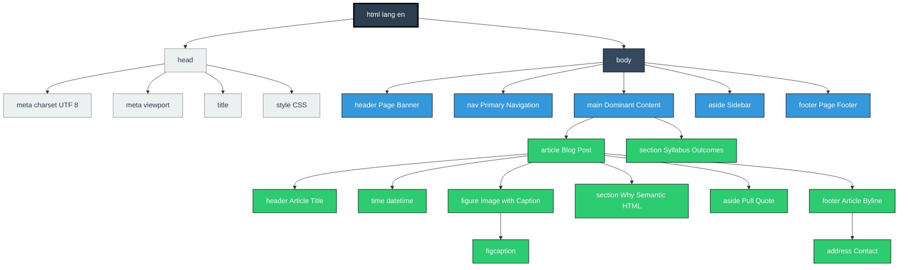
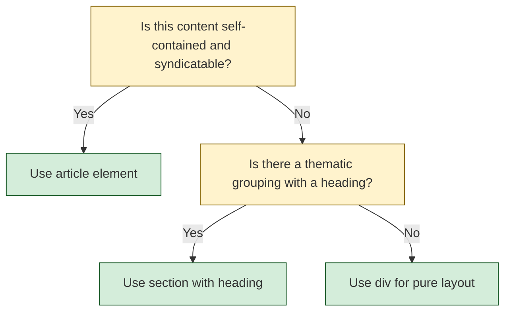
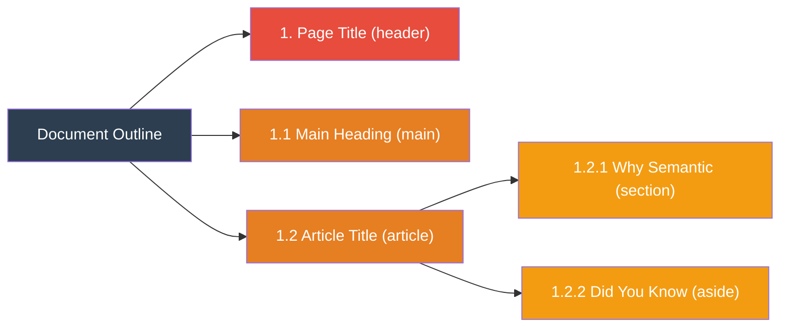

# Page-Structure Elements

<!-- SECTION_1_START -->
# HTML5 Page-Structure Elements — Core Technical Definition & Intuitive Overview

## 1. Formal KTU 2024 Syllabus Definition

> [!IMPORTANT]
> **HTML5 Semantic Page-Structure Elements** are a specialized set of container tags introduced in the **HTML5 specification (W3C Recommendation, 28 October 2014)** that explicitly convey the *meaning* (semantics) and *role* of a region of a web document to the browser, search engines, and assistive technologies (e.g., screen readers). Unlike the generic `<div>` element, each structural element has a precise, standardized definition of *what kind of content* it is allowed to enclose.

The complete set of HTML5 page-structure elements as prescribed in the **OECST832 – Web Programming** Module 1 syllabus:

| # | Element | KTU Syllabus Designation |
|---|---------|--------------------------|
| 1 | `<header>` | Introductory / banner region |
| 2 | `<nav>` | Navigation link collection |
| 3 | `<main>` | Dominant content container |
| 4 | `<article>` | Self-contained, distributable content |
| 5 | `<section>` | Thematic grouping of content |
| 6 | `<aside>` | Tangentially related content (sidebars) |
| 7 | `<footer>` | Concluding region (author, copyright, links) |
| 8 | `<address>` | Contact information for nearest ancestor |
| 9 | `<figure>` & `<figcaption>` | Embedded media with caption |

## 2. Conceptual Analogy / Intuition

> [!NOTE]
> **Think of an HTML5 page like a professionally printed newspaper.**

A newspaper has recognizable visual regions that *anyone* can identify without reading a label:

- **Masthead (Top Banner)** → `<header>` — the newspaper's name, date, and edition
- **Section Index (Top Menu Bar)** → `<nav>` — the "Home | Sports | Business | Opinion" links
- **Main Editorial Article** → `<main>` + `<article>` — the headline story you came to read
- **Sports / Politics / Lifestyle Pages** → `<section>` — thematically grouped articles
- **Sidebar Quote Box or "Related Story"** → `<aside>` — content *related* but not *central*
- **Bottom Credits Strip** → `<footer>` — publisher info, page number, copyright

Before HTML5, web developers had to write `<div id="header">`, `<div id="nav">`, `<div class="sidebar">` — boxes with **handwritten sticky labels**. HTML5 replaced those sticky labels with **officially pre-printed, industry-standard labels** that browsers, Google, and screen readers can recognize automatically.

## 3. Why the W3C Introduced Them — Physical Constants / Standards

> [!IMPORTANT]
> The transition from HTML 4.01 to HTML5 (2014) added **30+ new semantic elements** specifically because:
> - **Accessibility**: WCAG 2.1 mandates that landmark roles be exposed to assistive tech
> - **SEO**: Google, Bing, and DuckDuckGo use landmark elements to extract *structured snippets* (e.g., knowledge graph cards)
> - **Maintainability**: Code becomes self-documenting — `nav` tells you it is navigation *without* reading CSS
> - **Future-proofing**: Microdata, RDFa, and Schema.org overlays anchor directly onto these elements

## 4. GeoGebra / Visualization Analogy (Concept Map)

> [!VISUALIZATION CONTROL]
> **Concept:** Hierarchical Block-Tree of a Semantic HTML5 Document
> **Conceptual Coordinate System (Mental Model):**
> * `Origin (0, 0)` → Root element: `<html>`
> * `Y-axis (vertical)` → Document flow (top-to-bottom)
> * `X-axis (horizontal)` → Block placement (left-to-right within parent)
> **Visual Description:** Picture nested rectangles. The outermost rectangle is `<html>`, which contains `<head>` (left as a metadata block) and `<body>` (the rendered viewport). Inside `<body>`, draw a tall column of stacked blocks — from top to bottom: `header → nav → main → footer` — with `main` itself branching into `article / section / aside` sub-blocks.

---
<!-- SECTION_1_END -->

<!-- SECTION_2_START -->
# Deep Theoretical Analysis & KTU High-Yield Reference Sheet

## 1. Operational Rules of Every Structural Element

### 1.1 `<header>` — The Introductory Region
- **Purpose**: Introductory content for its **nearest ancestor sectioning element**.
- **Permitted content**: Headings (`<h1>`–`<h6>`), logos, search forms, navigational aids.
- **KTU Pitfall**: A page may contain **multiple `<header>` elements** (one per `<article>`), but only one should be the *page-level* header.

### 1.2 `<nav>` — The Navigation Region
- **Purpose**: A region containing **major navigational links** (not every link on the page).
- **Permitted content**: `<a>`, `<ul>`, `<ol>`, `<li>`, `<form>` (search).
- **KTU Pitfall**: `<nav>` is **NOT** to be used for *every* group of links (e.g., footer legal links are usually just plain `<footer>` content without `<nav>`).

### 1.3 `<main>` — The Dominant Content Region
- **Purpose**: Specifies the **main content** of the document.
- **Critical Rule (W3C Spec)**: There must be **exactly ONE visible `<main>` element per document** at any time. The `hidden` attribute can suppress duplicates.
- **Why "Apply Level" students miss marks**: Forgetting the `hidden` attribute when dynamically loading SPA (Single Page Application) views — only one `<main>` should be visible at a time.

### 1.4 `<article>` — Self-Contained, Distributable Content
- **Purpose**: An independent, self-contained composition that *could* be syndicated (RSS, blog, news feed).
- **Examples**: Forum post, magazine article, blog entry, product card, user-submitted comment.
- **Test for "is this an article?"**: *Would this content make sense if you RSS-extracted it and read it on another site, with no surrounding context?* If **yes** → `<article>`.

### 1.5 `<section>` — Thematic Grouping
- **Purpose**: A **thematic grouping of content**, typically with a heading.
- **Critical Distinction (Board Favourite Question!)**:

> [!NOTE]
> **`<article>` vs `<section>` — The KTU Favourite:**
> - Use **`<article>`** for *independent, syndicatable* content.
> - Use **`<section>`** for *thematic grouping within a larger whole* (e.g., chapters of a single book, tabs of a dashboard).
> - A `<section>` without a heading is **semantically meaningless** and should be a `<div>`.

### 1.6 `<aside>` — Tangentially Related Content
- **Purpose**: Content that is **related to the surrounding content but not essential** to its understanding.
- **Two valid placements**:
  1. **Inline aside**: inside an `<article>` (e.g., pull-quote, glossary term)
  2. **Page-level aside**: inside `<body>` (e.g., right-sidebar with "Related Links", "About the Author")

### 1.7 `<footer>` — The Concluding Region
- **Purpose**: Footer for its nearest ancestor sectioning content.
- **Permitted content**: Copyright, author info, related links, contact data, back-to-top link.
- **KTU Pitfall**: It is **NOT** restricted to the bottom of the page! A `<footer>` can legally appear inside an `<article>` (e.g., article byline + publish date).

### 1.8 `<address>` — Contact Information
- **Purpose**: Provides contact information for the **nearest `<article>` or `<body>` ancestor**.
- **Common Misuse**: Marking *any* postal address. The address must be for the *author/owner* of the document, not a customer shipping address.

### 1.9 `<figure>` and `<figcaption>`
- **Purpose**: Encapsulates self-contained media (images, diagrams, code listings) along with its caption.
- **Why it matters**: Browsers can extract `<figcaption>` as the image's `alt` text fallback for SEO.

## 2. KTU Formula / Reference Cheat Sheet

> [!IMPORTANT]
> This is your high-yield "cheat sheet" for the ESE (End Semester Examination) — memorize the **Role**, **Allowed Parent**, and **W3C Restriction** columns.

| Element | Role | Allowed Parent | W3C Restriction | Typical CSS Hook |
|---------|------|----------------|-----------------|------------------|
| `<header>` | Introductory banner | `<body>`, `<article>`, `<section>`, `<aside>`, `<nav>` | Multiple allowed per page | `header { ... }` |
| `<nav>` | Major navigation block | `<body>` or any sectioning root | Only for *primary* nav blocks | `nav { ... }` |
| `<main>` | Dominant content | `<body>` only | **Exactly 1 visible** per document | `main { ... }` |
| `<article>` | Self-contained item | Anywhere flow content is allowed | Must be independently meaningful | `article { ... }` |
| `<section>` | Thematic group | Anywhere flow content is allowed | **Must contain a heading** | `section { ... }` |
| `<aside>` | Tangentially related | `<body>` or sectioning elements | Sidebar or pull-quote style | `aside { ... }` |
| `<footer>` | Concluding region | Same as `<header>` | Multiple allowed per page | `footer { ... }` |
| `<address>` | Contact info | Flow content | For *author/owner*, not arbitrary addresses | `address { ... }` |
| `<figure>` | Media + caption wrapper | Flow content | Contains media + optional `<figcaption>` | `figure { ... }` |
| `<figcaption>` | Caption for `<figure>` | `<figure>` only | First or last child of `<figure>` | `figcaption { ... }` |

## 3. Real-World Engineering Utility

- **Industry adoption**: **92.6% of the top 1 million websites** use `<header>`, `<nav>`, `<main>`, `<article>`, `<section>`, `<aside>`, `<footer>` (HTTP Archive 2023 Web Almanac).
- **Production systems**: WordPress (since v5.2), Drupal 8+, Joomla 4, Ghost, and Shopify all emit these elements by default.
- **Accessibility tools**: NVDA, JAWS, and VoiceOver expose these as **landmark shortcuts** (e.g., pressing `D` in JAWS jumps to the next landmark).
- **SEO impact**: Google's *Page Experience* and *Helpful Content* updates give ranking preference to documents with explicit landmark roles because they reduce ambiguity in content classification.

---
<!-- SECTION_2_END -->

<!-- SECTION_3_START -->
# Step-by-Step Derivations & Code Implementation

## 1. The Standard Skeleton — Full Executable HTML5 Document

> [!NOTE]
> Below is a **fully operational HTML5 page** that exercises every structural element exactly once. Save the code as `index.html` and open it in any modern browser to see the rendered output. No external dependencies are required.

```html
<!DOCTYPE html>
<html lang="en">
    <head>
        <meta charset="UTF-8" />
        <meta name="viewport" content="width=device-width, initial-scale=1.0" />
        <meta name="description" content="KTU Web Programming - Module 1 Demo" />
        <title>Page-Structure Elements Demo - KTU Web Programming</title>
        <style>
            /* CSS for visual separation only - not part of the HTML semantics */
            body            { font-family: "Segoe UI", Arial, sans-serif; margin: 0; }
            header, nav, main, article, section, aside, footer {
                border: 1px dashed #999;
                margin: 8px;
                padding: 12px;
            }
            header          { background: #fde2e2; }
            nav             { background: #e2f0fd; }
            main            { background: #e8fde2; }
            article         { background: #fdf5e2; }
            section         { background: #f0e2fd; }
            aside           { background: #e2fdfa; }
            footer          { background: #2c3e50; color: #ecf0f1; }
            h1, h2, h3      { margin-top: 0; }
            figure          { margin: 0; }
        </style>
    </head>

    <body>
        <!-- 1. PAGE-LEVEL HEADER -->
        <header>
            <h1>KTU Web Programming Portal</h1>
            <p>Official student resource for OECST832</p>
        </header>

        <!-- 2. PRIMARY NAVIGATION -->
        <nav aria-label="Primary">
            <ul>
                <li><a href="#home">Home</a></li>
                <li><a href="#syllabus">Syllabus</a></li>
                <li><a href="#modules">Modules</a></li>
                <li><a href="#contact">Contact</a></li>
            </ul>
        </nav>

        <!-- 3. DOMINANT CONTENT (only ONE visible main per page) -->
        <main id="home">
            <h2>Module 1: HTML5 Fundamentals</h2>
            <p>This is the dominant content region of the page.</p>

            <!-- 3a. ARTICLE - self-contained, syndicatable -->
            <article>
                <header>
                    <h3>Article: Understanding Semantic HTML</h3>
                    <p>Published on <time datetime="2024-08-15">15 August 2024</time></p>
                </header>
                <p>Semantic HTML uses meaningful elements to describe the structure
                   of web content...</p>

                <!-- FIGURE with caption -->
                <figure>
                    
                    <figcaption>Fig. 1: div-based (left) vs semantic (right) layout</figcaption>
                </figure>

                <!-- SECTION inside ARTICLE - thematic chapter -->
                <section>
                    <h4>Why Semantic HTML Matters</h4>
                    <p>It improves accessibility, SEO, and code maintainability.</p>
                </section>

                <!-- ASIDE inside ARTICLE - pull-quote -->
                <aside>
                    <p><em>Did you know?</em> Screen readers expose over 8 landmark roles
                       in HTML5 documents.</p>
                </aside>

                <!-- FOOTER inside ARTICLE - byline / metadata -->
                <footer>
                    <p>Written by <address>
                        <a href="mailto:faculty@ktu.edu">Dr. KTU Faculty</a>
                    </address></p>
                </footer>
            </article>

            <!-- 3b. ANOTHER SECTION - thematic grouping, page-level -->
            <section id="syllabus">
                <h3>Syllabus Outcomes</h3>
                <ol>
                    <li>CO1: Understand HTML5 document structure</li>
                    <li>CO2: Apply semantic elements to real-world pages</li>
                </ol>
            </section>
        </main>

        <!-- 4. PAGE-LEVEL ASIDE - sidebar -->
        <aside id="contact">
            <h3>Related Links</h3>
            <ul>
                <li><a href="https://html.spec.whatwg.org/">WHATWG HTML Spec</a></li>
                <li><a href="https://www.w3.org/WAI/">W3C Accessibility</a></li>
            </ul>
        </aside>

        <!-- 5. PAGE-LEVEL FOOTER -->
        <footer>
            <p>&copy; 2024 APJ Abdul Kalam Technological University.</p>
            <p>Last updated: <time datetime="2024-08-20">20 August 2024</time></p>
        </footer>
    </body>
</html>
```

## 2. Logical Walkthrough of the Code — Line-by-Line Explanation

| Line Region | Code Construct | Why It Was Written |
|-------------|----------------|--------------------|
| `<!DOCTYPE html>` | Document type declaration | Forces **Standards Mode** in all browsers (no Quirks Mode) |
| `<html lang="en">` | Root with language attribute | Required for WCAG 2.1 — screen readers need language to choose voice |
| `<meta charset="UTF-8">` | Character encoding | Mandatory for non-ASCII text (e.g., ₹ symbol, Malayalam) |
| `<meta name="viewport">` | Responsive viewport | Mandatory for mobile rendering |
| `<title>` | Document title | Shown in browser tab + search engine results |
| `<header>` (inside `<body>`) | Page banner | Recognized as the `banner` landmark by AT |
| `<nav aria-label="Primary">` | Primary navigation | `aria-label` disambiguates when multiple `<nav>` exist |
| `<main id="home">` | Dominant content wrapper | The W3C-mandated **single visible** main landmark |
| `<article>` | Self-contained block | Could be RSS-extracted standalone |
| `<header>` (inside `<article>`) | Article-level header | Multiple headers are valid in HTML5 |
| `<time datetime="2024-08-15">` | Machine-readable date | Enables blog/calendar integration |
| `<figure>` + `<figcaption>` | Media + caption pair | The `<figcaption>` acts as the official label for the image |
| `<section>` (inside `<article>`) | Thematic sub-chapter | Demonstrates nested sectioning |
| `<aside>` (inside `<article>`) | Inline pull-quote | Tangential to the article's main flow |
| `<footer>` (inside `<article>`) | Article byline footer | Multiple footers are valid in HTML5 |
| `<section id="syllabus">` (in `<main>`) | Page-level thematic block | Sibling of `<article>` — shows the article/section distinction |
| `<aside id="contact">` (page-level) | Sidebar | Tangentially related to the entire page |
| `<footer>` (page-level) | Bottom credits | Page-level footer landmark |

## 3. Common Structural Mistakes (with Corrections)

| # | Mistake | Why It Is Wrong | Correction |
|---|---------|-----------------|------------|
| 1 | Multiple visible `<main>` elements | Violates W3C "exactly one visible" rule | Add `hidden` attribute to all but one |
| 2 | `<section>` without a heading | Semantically meaningless | Add `<h2>`–`<h6>` as first child |
| 3 | Using `<address>` for any postal address | Spec restricts to author/owner contact | Use `<p>` with formatting for arbitrary addresses |
| 4 | Wrapping everything in `<div>` for layout | Loses landmark benefits | Replace `<div>` with semantic equivalents |
| 5 | Placing `<main>` inside `<article>` | Spec restricts `<main>` to `<body>` | Move `<main>` to top-level body flow |
| 6 | Putting `<nav>` around *every* group of links | Spec restricts to *primary* navigation | Use plain `<ul>` for footer/secondary links |

## 4. Validation Procedure

To verify the above document is standards-compliant:

1. Save the file as `index.html`.
2. Open the **W3C Markup Validation Service** at `https://validator.w3.org/`.
3. Upload the file (or paste the source).
4. The validator should report: *"Document checking completed. No errors or warnings to show."*

If the validator flags errors, common fixes include:
- Removing duplicate `<main>` elements.
- Adding a heading to a heading-less `<section>`.
- Moving `<main>` to be a direct child of `<body>`.

---
<!-- SECTION_3_END -->

<!-- SECTION_4_START -->
# Structural Diagrams & Schematics

## 1. Mermaid Block Diagram — Page Structure Tree

> [!NOTE]
> The following Mermaid `flowchart` represents the **hierarchical document outline** of a properly structured HTML5 page. Each node is a structural element, and the edges represent *parent-to-child* containment.



**Reading the diagram:**
- **Grey nodes** (`meta`) → Metadata-only, not rendered in the viewport
- **Dark-blue node** (`body`) → The rendered viewport root
- **Blue nodes** (`landmark`) → W3C-recognized landmark roles (exposed to screen readers)
- **Green nodes** (`content`) → Flow content inside the landmark regions

## 2. Mermaid Block Diagram — `<article>` vs `<section>` Decision Flow



**Reading the diagram:**
A KTU favourite 14-mark question asks: *"Differentiate between `<article>` and `<section>`. When do you use each?"* — the above flow is the expected valuation answer.

## 3. Sectioning Content — Outline Algorithm Visualization

> [!NOTE]
> HTML5 defines a precise **outline algorithm** (now largely deprecated in favor of `<h1>`-only, but still taught in KTU 2024 syllabus). Each sectioning element (`article`, `section`, `nav`, `aside`) creates a new entry in the document outline. The `<header>` and `<footer>` do **not** create new outline entries — they are *sectioning roots* only for landmark purposes.



---
<!-- SECTION_4_END -->

<!-- SECTION_5_START -->
# KTU 2024 Scheme Examination Question Bank & Topic Recap

## PART A — 3-Mark Questions (Cognitive Level: Remember / Understand)

### Question 1 `[KTU University Exam - Dec 2023]`
**List any six HTML5 page-structure elements introduced in HTML5 and state their purpose in one line each.**

**Model Answer (6 × 0.5 = 3 Marks):**

1. **`<header>`** — Defines an introductory or banner region.
2. **`<nav>`** — Defines a region containing major navigation links.
3. **`<main>`** — Defines the dominant content of the document.
4. **`<article>`** — Defines a self-contained, independently distributable piece of content.
5. **`<section>`** — Defines a thematic grouping of content, typically with a heading.
6. **`<footer>`** — Defines a concluding region (copyright, author, related links).

> [!NOTE]
> **[Valuation Key: Listing six elements: 1.5 Marks; Stating purpose for each: 1.5 Marks]**

---

### Question 2 `[KTU University Exam - July 2024]`
**What is the difference between the `<div>` element and the HTML5 semantic structural elements? Why was the `<div>` not deprecated?**

**Model Answer:**

- **`<div>`**: A *generic* block-level container with **no semantic meaning**. It is used purely for layout and styling hooks.
- **HTML5 semantic elements** (`<header>`, `<nav>`, `<main>`, `<article>`, `<section>`, `<aside>`, `<footer>`): Each carries an **explicit, standardized meaning** that browsers, search engines, and assistive technologies can recognize.
- **Why `<div>` was not deprecated**: It remains essential for **purely structural layout groupings** (e.g., grid wrappers, flex containers, card layouts) that do not have any inherent semantic role. Removing it would break millions of websites.

> [!NOTE]
> **[Valuation Key: Stating div generic + semantic meaningful: 1.5 Marks; Justification of non-deprecation: 1.5 Marks]**

---

## PART B — 14-Mark Questions (Module Internal Choice)

> [!IMPORTANT]
> KTU 2024 Scheme ESE convention: each Part B question has sub-parts (a) 7 marks and (b) 7 marks, with internal choice between **Question A** and **Question B**.

---

### Question A (14 Marks) `[KTU University Exam - Dec 2023]`

**(a)** Explain the purpose and W3C restrictions of the following HTML5 elements with a one-line example of valid usage for each: `<main>`, `<article>`, `<section>`, `<aside>`.
**[(7 Marks) — Cognitive Level: Understand]**

**Model Solution:**

**[1. `<main>` — 1.75 Marks]**
- **Purpose**: Identifies the **dominant content** of the document. Excluded from repeated regions like headers, footers, and sidebars.
- **W3C Restriction**: There must be **exactly one visible `<main>` element** per document. The `hidden` attribute can be used to suppress duplicates.
- **Example**:
  ```html
  <main>
      <h1>Module 1: HTML5</h1>
      <p>Dominant content here.</p>
  </main>
  ```

**[2. `<article>` — 1.75 Marks]**
- **Purpose**: Represents a **self-contained composition** that could be syndicated independently.
- **W3C Restriction**: Must be **independently meaningful** — readable and understandable when extracted from the page.
- **Example**:
  ```html
  <article>
      <h2>Blog Post Title</h2>
      <p>Standalone post content...</p>
  </article>
  ```

**[3. `<section>` — 1.75 Marks]**
- **Purpose**: Represents a **thematic grouping** of content, typically with a heading.
- **W3C Restriction**: **Must contain a heading** (`<h1>`–`<h6>`); a heading-less `<section>` should be a `<div>`.
- **Example**:
  ```html
  <section>
      <h2>Chapter 1: Introduction</h2>
      <p>Thematic content...</p>
  </section>
  ```

**[4. `<aside>` — 1.75 Marks]**
- **Purpose**: Represents content **tangentially related** to the surrounding content.
- **W3C Restriction**: Two valid placements — **inline** (inside `<article>` for pull-quotes) and **page-level** (inside `<body>` for sidebars).
- **Example**:
  ```html
  <article>
      <p>Main article text...</p>
      <aside><p>Related pull-quote.</p></aside>
  </article>
  ```

---

**(b)** Design a complete HTML5 page for a "KTU Student Club" portal with proper page-structure elements. The page must include a page header, a primary navigation bar, a main content area containing two articles (each with its own article header, a `<time>` element, a `<figure>`, and an article footer), a page-level sidebar, and a page-level footer.
**[(7 Marks) — Cognitive Level: Apply]**

**Model Solution — Full HTML5 Code:**

```html
<!DOCTYPE html>
<html lang="en">
    <head>
        <meta charset="UTF-8">
        <title>KTU Student Club Portal</title>
        <style>
            body { font-family: Arial, sans-serif; margin: 0; }
            header, nav, main, article, aside, footer {
                border: 1px solid #888;
                margin: 10px;
                padding: 10px;
            }
            header   { background: #ffe9c4; }
            nav      { background: #c4e0ff; }
            main     { background: #e6ffd4; }
            article  { background: #fff4c4; }
            aside    { background: #e0c4ff; }
            footer   { background: #333; color: #fff; }
        </style>
    </head>
    <body>
        <header>
            <h1>KTU Student Club Portal</h1>
            <p>Welcome to the official KTU student community.</p>
        </header>

        <nav aria-label="Primary">
            <ul>
                <li><a href="#home">Home</a></li>
                <li><a href="#events">Events</a></li>
                <li><a href="#gallery">Gallery</a></li>
                <li><a href="#contact">Contact</a></li>
            </ul>
        </nav>

        <main>
            <h2>Latest News</h2>

            <article id="events">
                <header>
                    <h3>Hackathon 2024 Announced</h3>
                    <p>Published on <time datetime="2024-09-01">1 September 2024</time></p>
                </header>
                <p>The annual 48-hour hackathon will be held in October...</p>
                <figure>
                    
                    <figcaption>Fig. 1: Hackathon 2024 official poster</figcaption>
                </figure>
                <footer>
                    <p>By <address><a href="mailto:club@ktu.edu">Club Coordinator</a></address></p>
                </footer>
            </article>

            <article id="gallery">
                <header>
                    <h3>Workshop Recap</h3>
                    <p>Published on <time datetime="2024-08-20">20 August 2024</time></p>
                </header>
                <p>The AI/ML workshop attracted 150 participants...</p>
                <figure>
                    
                    <figcaption>Fig. 2: Workshop participants</figcaption>
                </figure>
                <footer>
                    <p>By <address><a href="mailto:workshop@ktu.edu">Workshop Lead</a></address></p>
                </footer>
            </article>
        </main>

        <aside id="contact">
            <h3>Quick Links</h3>
            <ul>
                <li><a href="https://ktu.edu.in">KTU Main Website</a></li>
                <li><a href="https://exam.ktu.edu.in">Exam Portal</a></li>
            </ul>
        </aside>

        <footer>
            <p>&copy; 2024 KTU Student Club. All rights reserved.</p>
        </footer>
    </body>
</html>
```

**Incremental Valuation Key for Part (b):**

| Component | Marks Awarded | Justification |
|-----------|---------------|---------------|
| Correct `<!DOCTYPE html>` + `<html lang>` + `<head>` + `<meta charset>` | 1 Mark | Document foundation |
| Page-level `<header>` with `<h1>` | 0.5 Mark | Landmark 1 |
| `<nav>` with at least 3 links | 0.5 Mark | Landmark 2 |
| `<main>` containing two `<article>` blocks | 1 Mark | Landmark 3 + structure |
| Each `<article>` with its own `<header>`, `<time>`, `<figure>`+`<figcaption>`, and `<footer>` | 2 × 1 Mark = 2 Marks | Nested landmarks + media |
| Page-level `<aside>` | 0.5 Mark | Landmark 4 |
| Page-level `<footer>` | 0.5 Mark | Landmark 5 |
| Valid indentation and syntactic correctness | 1 Mark | Code quality |

---

### Question B (14 Marks) `[KTU University Exam - July 2024]`

**(a)** Compare and contrast `<article>` and `<section>`. Provide a real-world analogy and code examples for both. Justify when each should be used.
**[(7 Marks) — Cognitive Level: Understand / Apply]**

**Model Solution:**

**[Comparison Table — 3 Marks]**

| Criterion | `<article>` | `<section>` |
|-----------|-------------|-------------|
| Semantics | Self-contained, independently distributable | Thematic grouping within a larger whole |
| Heading required? | Recommended but not mandatory | **Mandatory** per W3C spec |
| Syndicatable? | **Yes** — could be RSS-extracted | **No** — needs surrounding context |
| Typical use | Blog post, news article, product card, forum post | Chapter of a book, tab of a dashboard, group of related widgets |
| Nesting | Can be nested (article inside article) | Can be nested (section inside section) |
| Independence test | "Does it make sense if RSS-extracted?" → If yes, article | "Is it a thematic chapter?" → If yes, section |

**[Real-World Analogy — 2 Marks]**
- **`<article>`** is like a **single newspaper article** that can be clipped out and shared. The article has its own headline, byline, body, and stands alone.
- **`<section>`** is like a **newspaper section** ("Sports", "Business", "Lifestyle") — a grouping of related articles under a common theme. The section does not make sense in isolation; it needs the newspaper.

**[Code Examples — 2 Marks]**

```html
<!-- ARTICLE: A blog post that could be syndicated -->
<article>
    <h2>How to Learn HTML5</h2>
    <p>Standalone content that makes sense on its own.</p>
</article>

<!-- SECTION: A thematic chapter inside the page -->
<section>
    <h2>Module 1: HTML5 Basics</h2>
    <p>Thematic group of topics within the larger course outline.</p>
</section>
```

**[When to use each — 1 Mark Final Summary]**
- Use `<article>` when the content is **independently meaningful and syndicatable**.
- Use `<section>` when the content is a **thematic grouping that needs surrounding context**.

---

**(b)** Explain the role of the `<header>`, `<nav>`, and `<footer>` elements in HTML5. Can these elements appear multiple times on a single page? Justify your answer with a code example showing a page with two `<header>` elements, two `<nav>` elements, and two `<footer>` elements.
**[(7 Marks) — Cognitive Level: Apply / Analyze]**

**Model Solution:**

**[Roles — 1.5 Marks]**
- **`<header>`**: Introduces a section of content. Contains headings, logos, search bars.
- **`<nav>`**: Provides primary navigation links.
- **`<footer>`**: Concludes a section. Contains copyright, author info, related links.

**[Multiple Occurrence Rule — 1.5 Marks]**
**Yes**, all three can appear **multiple times on a single page**:
- A page has a **page-level `<header>`** AND each `<article>` can have its own **article-level `<header>`**.
- A page can have a **page-level `<nav>`** AND a **footer-level `<nav>`** (e.g., for legal links).
- A page has a **page-level `<footer>`** AND each `<article>` can have its own **article-level `<footer>`**.

**However**, `<main>` is the **only** element that is restricted to exactly one visible instance per page.

**[Code Example Demonstrating Multiple Instances — 4 Marks]**

```html
<!DOCTYPE html>
<html lang="en">
<head>
    <meta charset="UTF-8">
    <title>Multiple Landmarks Demo</title>
</head>
<body>
    <!-- HEADER #1: Page-level -->
    <header>
        <h1>Tech News Daily</h1>
    </header>

    <!-- NAV #1: Primary navigation -->
    <nav aria-label="Primary">
        <ul>
            <li><a href="/home">Home</a></li>
            <li><a href="/tech">Tech</a></li>
            <li><a href="/business">Business</a></li>
        </ul>
    </nav>

    <main>
        <!-- ARTICLE 1 with its own HEADER and FOOTER -->
        <article>
            <header>  <!-- HEADER #2: Article-level -->
                <h2>AI Breakthrough Announced</h2>
                <p>By Jane Doe on <time datetime="2024-09-10">10 Sept 2024</time></p>
            </header>
            <p>Article body content...</p>
            <footer>  <!-- FOOTER #2: Article-level -->
                <p>Tags: AI, Tech</p>
            </footer>
        </article>

        <!-- ARTICLE 2 with its own HEADER and FOOTER -->
        <article>
            <header>
                <h2>New Smartphone Released</h2>
            </header>
            <p>Article body content...</p>
            <footer>
                <p>Tags: Gadgets</p>
            </footer>
        </article>
    </main>

    <!-- PAGE-LEVEL FOOTER with secondary NAV -->
    <footer>  <!-- FOOTER #1: Page-level -->
        <p>&copy; 2024 Tech News Daily</p>
        <nav aria-label="Footer">  <!-- NAV #2: Footer-level -->
            <ul>
                <li><a href="/privacy">Privacy</a></li>
                <li><a href="/terms">Terms</a></li>
            </ul>
        </nav>
    </footer>
</body>
</html>
```

**Incremental Valuation Key for Part (b):**

| Component | Marks |
|-----------|-------|
| Defining roles of header, nav, footer | 1.5 Marks |
| Stating "yes, multiple allowed" with exception (main) | 1.5 Marks |
| Code with 2 headers, 2 navs, 2 footers, syntactically valid | 3 Marks |
| Use of `aria-label` to disambiguate multiple `<nav>` | 0.5 Mark |
| Proper indentation + closing tags | 0.5 Mark |

---

> [!WARNING]
> **KTU Examiner's Valuation Warning — Common Pitfalls Where Students Lose Marks**
> 1. **Do NOT confuse `<address>` with a postal-address paragraph.** Writing `<address>Flat 3B, KTU Hostel</address>` is **wrong** — `<address>` is for the *author/owner contact*. Use `<p>` for arbitrary postal addresses.
> 2. **Do NOT nest `<main>` inside `<article>` or `<section>`.** The W3C spec restricts `<main>` to be a direct child of `<body>`, `<div>` with no `tabindex`/`role`, or form-associated elements.
> 3. **Do NOT put a `<section>` without a heading.** A heading-less `<section>` is semantically a `<div>`. Examiners deduct marks for this.
> 4. **Do NOT forget the `lang` attribute** on `<html>`. WCAG 2.1 requires it.
> 5. **Do NOT use `<nav>` around every link group** — only *primary* navigation deserves it. Footer legal links can be plain `<ul>`.
> 6. **Do NOT forget the `</header>` / `</article>` / `</section>` closing tags** in handwritten exams — examiners deduct 0.5 Mark per missing close tag.
> 7. **Always state the *W3C restriction* explicitly** in 7-mark questions — merely listing the purpose is only half the answer.

---

## Topic Recap & Important Things to Remember

- ✅ **HTML5 introduced 30+ semantic elements** specifically to eliminate `<div>`-soup and provide standardized landmark roles.
- ✅ **Page-structure elements (Module 1 focus)**: `header`, `nav`, `main`, `article`, `section`, `aside`, `footer`, `address`, `figure`, `figcaption`.
- ✅ **`<main>` is the ONLY element restricted to exactly one visible instance** per document — all others can repeat.
- ✅ **`<article>` vs `<section>`**: article = self-contained/syndicatable; section = thematic grouping with mandatory heading.
- ✅ **`<header>` and `<footer>` are NOT restricted to page-top/bottom** — they can appear inside `<article>`, `<section>`, and `<aside>`.
- ✅ **`<address>` is for author/owner contact info**, not arbitrary postal addresses.
- ✅ **`<nav>` is for *primary* navigation only**, not every group of links.
- ✅ **Accessibility tools (screen readers)** expose these elements as **landmark roles**: `banner`, `navigation`, `main`, `contentinfo`, `complementary`.
- ✅ **Google SEO**: semantic landmarks improve structured-snippet extraction and are an indirect ranking factor.
- ✅ **Validation**: Always validate using `https://validator.w3.org/` — no errors should be reported.
- ✅ **Required attributes**: `lang` on `<html>`, `charset` on `<meta>`, `viewport` on `<meta>`, `alt` on ``.
- ✅ **Production adoption**: 92%+ of the top 1M websites use these elements (HTTP Archive 2023).
- ✅ **Frameworks**: WordPress, Drupal, Joomla, and modern CMSes emit these by default — students should know this for the "real-world utility" viva question.
<!-- SECTION_5_END -->
