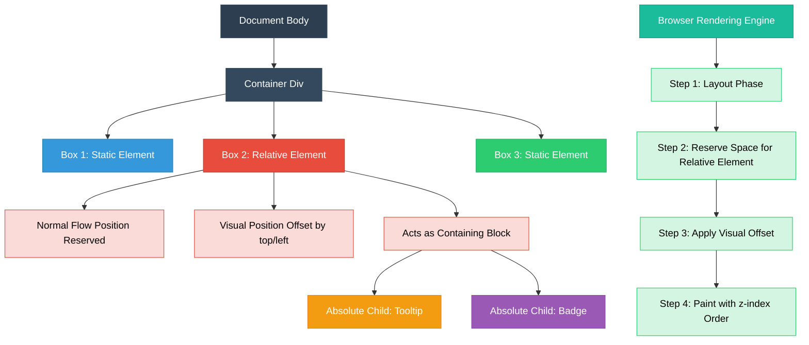

# Positioning Elements: Relative Positioning

<!-- SECTION_1_START -->

# Positioning Elements: Relative Positioning

## 1.1 Formal Academic Definition

In CSS (Cascading Style Sheets), **Relative Positioning** is a positioning scheme where an element is positioned relative to its **normal flow position** (its default static location in the document). When the `position` property is set to `relative`, the element can be offset from its original position using the four offset properties: `top`, `right`, `bottom`, and `left`, while **still occupying its original space** in the document flow.

> [!IMPORTANT]
> **KTU 2024 Syllabus Definition:** Relative positioning removes the element from the visual rendering context for offset purposes only, but the **original space** allocated to it in the document flow is **preserved**. The element acts as a positioning **context/anchor** for any absolutely positioned descendants.

The element's final rendered position is computed using the formula:

$$
\text{Visual Position} = \text{Normal Flow Position} + \text{Offset(top, right, bottom, left)}
$$

> [!NOTE]
> **Critical Distinction:** Unlike `position: absolute` (which removes the element from the flow entirely), relative positioning **does not collapse** the original space. The element is visually shifted, but the layout "hole" remains in its original position.

---

## 1.2 Conceptual Analogy / Intuition

Imagine you have a **printed photograph pinned to a corkboard**. The photo is part of the corkboard's layout — it occupies its specific spot. Now, imagine sliding the photo **2 inches to the right and 1 inch down** using a small adhesive strip on its back.

- The **photo has moved** visually to a new location.
- The **original spot on the corkboard still has a "ghost outline"** — that space is still reserved; other photos cannot occupy it.
- The photo now serves as a **new reference point** for any smaller items pinned on top of it (like a sticky note attached to the photo).

This is exactly how **CSS relative positioning** behaves:

| Real-World Analogy | CSS Concept |
|---|---|
| Corkboard layout | Document normal flow |
| Sliding the photo via adhesive | `top`, `right`, `bottom`, `left` offsets |
| Ghost outline remaining | Original space reserved in flow |
| Sticky note on the photo | Absolutely positioned child using relative parent as anchor |

> [!TIP]
> **Memory Hook:** "**R**elative = **R**eserves space + **R**eference point for children."

---

## 1.3 Physical Constants & Standard Metrics

- The default browser coordinate system uses the **top-left corner** of the element's containing block as the origin $(0, 0)$.
- The X-axis increases towards the **right** and the Y-axis increases towards the **bottom**.
- Negative offset values are **valid and frequently used** (e.g., `top: -10px` moves the element upward by **10 pixels**).
- Offset values can be specified in **px**, **em**, **rem**, **%**, **vw**, **vh**, or any valid CSS length unit.

> [!WARNING]
> **Common Misconception:** Students often confuse `position: relative` with `position: static` (the default). Both retain the element in normal flow, but only `relative` accepts offset properties. Also, `relative` does **not** behave like `absolute` — the original space is **never collapsed**.

---

## 1.4 GeoGebra / Desmos Visualization Concept

> [!VISUALIZATION CONTROL]
> **Concept:** Visualizing how a relatively positioned element shifts from its normal flow origin to its new visual position.
>
> **GeoGebra / Desmos Input Equations:**
> * Define original box: rectangle from $(x_1, y_1) = (2, 2)$ to $(x_2, y_2) = (6, 5)$
> * Apply offset: `offset_x = 3`, `offset_y = 2`
> * New visual position: rectangle from $(x_1 + 3, y_1 + 2) = (5, 4)$ to $(x_2 + 3, y_2 + 2) = (9, 7)$
> * Ghost outline: dashed rectangle at original position $(2, 2)$ to $(6, 5)$
>
> **Visual Description:** The student should observe the original (dashed/ghost) rectangle and the shifted solid rectangle. The shifted rectangle represents the element's **visual render position**, while the ghost rectangle represents the **reserved space in the document flow**.

<!-- SECTION_1_END -->

<!-- SECTION_2_START -->

# Deep Theoretical Analysis & KTU High-Yield Formula Sheet

## 2.1 Operational Mechanics — The Five-Step Logic

When `position: relative` is applied to an element, the following sequence of events occurs in the browser's rendering engine:

1. **Initial Layout Calculation:** The browser places the element at its **normal flow position**, as if `position: static` were applied. The element contributes to the height/width of its parent container.

2. **Offset Application:** The browser reads the `top`, `right`, `bottom`, and `left` property values. These offsets are applied as **visual translations** relative to the element's normal flow position.

3. **Stacking Context Creation:** A new **stacking context** is established. The element can now control its own `z-index`, allowing it to appear above or below sibling elements.

4. **Positioning Anchor for Descendants:** The element becomes the **containing block** for any descendant with `position: absolute`. The descendant will be positioned relative to this relatively positioned parent.

5. **Space Reservation:** Critically, the element's **original spatial footprint is preserved**. The layout engine treats this footprint as occupied when calculating the positions of subsequent sibling elements.

---

## 2.2 The KTU Formula Sheet / Cheat Sheet

| Property | Default Value | Possible Values | Effect on Relative Element |
|---|---|---|---|
| `position` | `static` | `relative` | Enables relative positioning scheme |
| `top` | `auto` | length, %, `auto` | Shifts element **downward** by the specified amount |
| `right` | `auto` | length, %, `auto` | Shifts element **leftward** by the specified amount |
| `bottom` | `auto` | length, %, `auto` | Shifts element **upward** by the specified amount |
| `left` | `auto` | length, %, `auto` | Shifts element **rightward** by the specified amount |
| `z-index` | `auto` | integer, `auto` | Controls stacking order when overlapping occurs |
| `offset-parent` | (computed) | read-only | The nearest ancestor with non-static position (used by `absolute` children) |

### 2.2.1 Offset Direction Reference Table

| Property Specified | Negative Value Direction | Positive Value Direction |
|---|---|---|
| `top: 20px` | Moves element **up** | Moves element **down** |
| `bottom: 20px` | Moves element **down** | Moves element **up** |
| `left: 20px` | Moves element **left** | Moves element **right** |
| `right: 20px` | Moves element **right** | Moves element **left** |

> [!NOTE]
> **Key Insight:** `top` and `left` are the most commonly used. The browser resolves conflicting `top/bottom` pairs by giving priority to `top` if both are set (and similarly, `left` wins over `right` in LTR layouts).

### 2.2.2 The Computed Visual Position Formula

$$
\begin{aligned}
\text{Visual Top Edge} &= \text{Normal Flow Top} + \text{top offset} - \text{bottom offset} \\[4pt]
\text{Visual Left Edge} &= \text{Normal Flow Left} + \text{left offset} - \text{right offset}
\end{aligned}
$$

---

## 2.3 Real-World Engineering Utility

Relative positioning is foundational in **production-grade web development** for the following use cases:

- **Pattern 1 — Tooltip Anchoring:** A tooltip is created with `position: absolute` and a parent trigger element uses `position: relative`. This ensures the tooltip is positioned correctly relative to its trigger, regardless of where the trigger sits on the page.

- **Pattern 2 — Custom Badge/Notification Dots:** The notification "dot" (e.g., a red circle showing "3 new messages") is absolutely positioned inside a relatively positioned icon container, allowing pixel-perfect placement at the top-right corner of the icon.

- **Pattern 3 — Modal/Dropdown Containers:** Dropdown menus often use a relatively positioned parent (the menu trigger) and absolutely positioned child (the dropdown list) to ensure the dropdown renders directly below the trigger.

- **Pattern 4 — Subtle Design Tweaks:** Designers use small relative offsets (e.g., `top: 2px`) to nudge icons, badges, or text labels for visual alignment without disrupting the overall page layout.

> [!IMPORTANT]
> **Industry Standard:** According to MDN Web Docs and modern CSS frameworks like Bootstrap and Tailwind CSS, `position: relative` is the **most frequently used** non-static positioning value, primarily because of its role as a positioning anchor for absolutely positioned children.

---

## 2.4 Comparative Analysis: Relative vs. Other Positioning Schemes

| Feature | `static` (default) | `relative` | `absolute` | `fixed` |
|---|---|---|---|---|
| Accepts offset properties | No | Yes | Yes | Yes |
| Removed from document flow | No | No (space reserved) | Yes (space collapsed) | Yes (space collapsed) |
| Acts as positioning context for children | No | Yes | Yes | Yes |
| Anchored to viewport | N/A | N/A | No (anchored to nearest positioned ancestor) | Yes |
| Scrolls with page | Yes | Yes | Yes (usually) | No |

<!-- SECTION_2_END -->

<!-- SECTION_3_START -->

# Step-by-Step Derivations & Code/Symbolic Implementation

## 3.1 Fundamental Syntax — The Minimal Working Example

Below is the **complete, production-ready HTML5 + CSS3 code** demonstrating basic relative positioning:

```html
<!DOCTYPE html>
<html lang="en">
<head>
    <meta charset="UTF-8">
    <meta name="viewport" content="width=device-width, initial-scale=1.0">
    <title>Relative Positioning Demo</title>
    <style>
        body {
            font-family: 'Segoe UI', Tahoma, sans-serif;
            margin: 20px;
            background-color: #f4f6f9;
        }

        /* The parent container demonstrating normal flow */
        .container {
            width: 600px;
            margin: 0 auto;
            border: 2px solid #2c3e50;
            padding: 15px;
            background-color: #ffffff;
        }

        /* A normal block element in standard flow */
        .box-normal {
            width: 200px;
            height: 80px;
            background-color: #3498db;
            color: white;
            text-align: center;
            line-height: 80px;
            margin-bottom: 10px;
            border-radius: 6px;
        }

        /* The relatively positioned element */
        .box-relative {
            position: relative;       /* Enable relative positioning */
            top: 20px;                /* Shift 20px DOWN from normal position */
            left: 40px;               /* Shift 40px RIGHT from normal position */
            width: 200px;
            height: 80px;
            background-color: #e74c3c;
            color: white;
            text-align: center;
            line-height: 80px;
            margin-bottom: 10px;
            border-radius: 6px;
        }

        /* Another normal element to show space reservation */
        .box-after {
            width: 200px;
            height: 80px;
            background-color: #2ecc71;
            color: white;
            text-align: center;
            line-height: 80px;
            margin-bottom: 10px;
            border-radius: 6px;
        }
    </style>
</head>
<body>
    <div class="container">
        <div class="box-normal">Box 1 (Normal Flow)</div>
        <div class="box-relative">Box 2 (Relative)</div>
        <div class="box-after">Box 3 (Normal Flow)</div>
    </div>
</body>
</html>
```

### 3.1.1 Step-by-Step Walkthrough

1. **Box 1 (Blue)** is placed at the top of the container in normal flow at coordinates $(15, 15)$ (after container padding).

2. **Box 2 (Red)** is calculated to be at coordinates $(15, 105)$ in normal flow (right below Box 1 with margin). However, due to `top: 20px; left: 40px;`, it is **visually rendered** at coordinates $(55, 125)$.

3. The **original space** at $(15, 105)$ is **preserved**. This is why Box 3 does not move up to fill the gap.

4. **Box 3 (Green)** is placed at coordinates $(15, 195)$ — exactly where it would have been if Box 2 had not moved visually.

> [!IMPORTANT]
> **Observe the key behavior:** Box 3 does **not** move up. The reserved space at $(15, 105)$ acts as a "ghost placeholder" in the document flow.

---

## 3.2 Advanced Example — Using Relative Parent as Anchor for Absolute Child

This is the **most important production pattern** for relative positioning:

```html
<!DOCTYPE html>
<html lang="en">
<head>
    <meta charset="UTF-8">
    <meta name="viewport" content="width=device-width, initial-scale=1.0">
    <title>Relative Parent + Absolute Child Pattern</title>
    <style>
        body {
            font-family: Arial, sans-serif;
            margin: 40px;
            background-color: #ecf0f1;
        }

        /* RELATIVE PARENT — serves as the anchor */
        .card {
            position: relative;            /* Critical: this is the anchor */
            width: 300px;
            height: 180px;
            background-color: #ffffff;
            border: 1px solid #bdc3c7;
            border-radius: 8px;
            padding: 20px;
            box-shadow: 0 2px 6px rgba(0, 0, 0, 0.1);
            margin-bottom: 30px;
        }

        /* ABSOLUTE CHILD — positioned relative to .card */
        .badge {
            position: absolute;            /* Removes from flow */
            top: -10px;                    /* 10px ABOVE the card's top edge */
            right: -10px;                  /* 10px RIGHT of the card's right edge */
            width: 40px;
            height: 40px;
            background-color: #e74c3c;
            color: white;
            text-align: center;
            line-height: 40px;
            border-radius: 50%;            /* Circle shape */
            font-weight: bold;
            font-size: 14px;
            box-shadow: 0 2px 4px rgba(0, 0, 0, 0.2);
        }

        .card-title {
            font-size: 20px;
            font-weight: bold;
            color: #2c3e50;
            margin: 0 0 10px 0;
        }

        .card-content {
            font-size: 14px;
            color: #7f8c8d;
            line-height: 1.5;
        }
    </style>
</head>
<body>
    <div class="card">
        <div class="badge">3</div>
        <h2 class="card-title">Inbox</h2>
        <p class="card-content">You have 3 new unread messages in your inbox.</p>
    </div>
</body>
</html>
```

### 3.2.1 Step-by-Step Walkthrough

1. The `.card` div has `position: relative`. This makes it the **containing block** for any absolutely positioned descendants.

2. The `.badge` div has `position: absolute` with `top: -10px; right: -10px;`.

3. **Computation logic:**
   - The badge's containing block is the `.card` element (because `.card` is the nearest positioned ancestor).
   - `top: -10px` means the badge's top edge sits **10px above** the card's top edge.
   - `right: -10px` means the badge's right edge sits **10px to the right** of the card's right edge.

4. The result is a **classic notification badge** that overlaps the top-right corner of the card — a UI pattern used by Gmail, Facebook, and most notification systems.

> [!TIP]
> **Best Practice:** Whenever you use `position: absolute` on a child element, **always** ensure its parent has `position: relative` (or `absolute`, `fixed`). Otherwise, the child will anchor to the viewport or a distant ancestor, breaking your layout.

---

## 3.3 Using z-index with Relative Positioning

By default, relatively positioned elements with positive `top`/`left` offsets render **on top of** static elements that come later in the HTML (because they appear later in the painting order). To control stacking explicitly, use `z-index`:

```html
<!DOCTYPE html>
<html lang="en">
<head>
    <meta charset="UTF-8">
    <title>Z-Index with Relative Positioning</title>
    <style>
        body {
            font-family: Arial, sans-serif;
            margin: 40px;
        }

        .layer {
            position: relative;       /* Required for z-index to take effect */
            width: 200px;
            height: 120px;
            color: white;
            text-align: center;
            line-height: 120px;
            font-size: 18px;
            font-weight: bold;
            border: 2px solid #2c3e50;
            border-radius: 8px;
        }

        .layer-1 {
            background-color: #e74c3c;    /* Red */
            top: 30px;
            left: 30px;
            z-index: 1;                   /* Lowest in the stack */
        }

        .layer-2 {
            background-color: #3498db;    /* Blue */
            top: -30px;
            left: 80px;
            z-index: 2;                   /* Middle layer */
        }

        .layer-3 {
            background-color: #2ecc71;    /* Green */
            top: -90px;
            left: 130px;
            z-index: 3;                   /* Topmost layer */
        }
    </style>
</head>
<body>
    <div class="layer layer-1">Layer 1 (z=1)</div>
    <div class="layer layer-2">Layer 2 (z=2)</div>
    <div class="layer layer-3">Layer 3 (z=3)</div>
</body>
</html>
```

### 3.3.1 Step-by-Step Walkthrough

1. `position: relative` is **mandatory** for `z-index` to take effect. Without it, `z-index` is ignored.

2. `z-index` only accepts **integer values** (positive, negative, or zero). Higher values render on top.

3. The three layers overlap in a staircase pattern. Green (z=3) appears on top, then Blue (z=2), then Red (z=1) at the bottom.

> [!WARNING]
> **Common Pitfall:** A common mistake is setting `z-index: 9999` on a `position: static` element. This does **nothing** — the browser ignores `z-index` on non-positioned elements. Always pair `z-index` with a `position` value other than `static`.

---

## 3.4 Full Reference: All Four Offset Properties in Action

```html
<!DOCTYPE html>
<html lang="en">
<head>
    <meta charset="UTF-8">
    <title>All Four Offset Properties</title>
    <style>
        body {
            font-family: Arial, sans-serif;
            margin: 40px;
            background-color: #fafafa;
        }

        .reference-box {
            width: 250px;
            height: 100px;
            background-color: #ecf0f1;
            border: 2px dashed #95a5a6;
            margin: 50px;
            text-align: center;
            line-height: 100px;
            color: #7f8c8d;
        }

        /* Use the SAME base styles for all 4 demo boxes */
        .demo {
            position: relative;
            width: 250px;
            height: 100px;
            background-color: #9b59b6;
            color: white;
            text-align: center;
            line-height: 100px;
            border-radius: 6px;
        }

        .demo-top    { top: 30px;       }              /* Moves DOWN by 30px */
        .demo-right  { right: 30px;     }              /* Moves LEFT by 30px */
        .demo-bottom { bottom: 30px;    }              /* Moves UP by 30px */
        .demo-left   { left: 30px;      }              /* Moves RIGHT by 30px */

        .demo-negative {
            top: -20px;
            left: -20px;
            background-color: #e67e22;
        }
    </style>
</head>
<body>
    <h2>All Four Offset Directions</h2>

    <div class="reference-box">Reference Position</div>
    <div class="demo demo-top">top: 30px (down)</div>
    <br>

    <div class="reference-box">Reference Position</div>
    <div class="demo demo-right">right: 30px (left)</div>
    <br>

    <div class="reference-box">Reference Position</div>
    <div class="demo demo-bottom">bottom: 30px (up)</div>
    <br>

    <div class="reference-box">Reference Position</div>
    <div class="demo demo-left">left: 30px (right)</div>
    <br>

    <h2>Negative Offset (Up and Left)</h2>
    <div class="reference-box">Reference Position</div>
    <div class="demo demo-negative">top: -20px, left: -20px</div>
</body>
</html>
```

### 3.4.1 Derivation of Visual Position for `.demo-top`

Let the normal flow position's top-left corner be $(x_0, y_0)$.

$$
\begin{aligned}
\text{Visual Left Edge} &= x_0 + \text{left offset} = x_0 + 0 = x_0 \\[4pt]
\text{Visual Top Edge} &= y_0 + \text{top offset} = y_0 + 30 \text{ px}
\end{aligned}
$$

**Result:** The element appears exactly **30 pixels below** its original top position, while keeping the same horizontal placement.

---

## 3.5 Position Context Inheritance — The Containing Block Logic

When a child has `position: absolute`, the browser walks up the DOM tree to find the nearest ancestor with a non-static `position`. This is called the **containing block** resolution.

```html
<!DOCTYPE html>
<html lang="en">
<head>
    <meta charset="UTF-8">
    <title>Containing Block Resolution</title>
    <style>
        .grandparent {
            position: relative;        /* Will NOT be the anchor */
            width: 500px;
            height: 300px;
            background-color: #f1c40f;
            padding: 20px;
        }

        .parent {
            position: relative;        /* This IS the anchor (nearest positioned) */
            width: 300px;
            height: 200px;
            background-color: #16a085;
            margin: 20px;
        }

        .child {
            position: absolute;        /* Anchored to .parent, not .grandparent */
            top: 0;
            right: 0;
            width: 80px;
            height: 80px;
            background-color: #e74c3c;
            color: white;
            text-align: center;
            line-height: 80px;
        }
    </style>
</head>
<body>
    <div class="grandparent">
        Grandparent (relative)
        <div class="parent">
            Parent (relative) — the anchor
            <div class="child">TOP-RIGHT</div>
        </div>
    </div>
</body>
</html>
```

### 3.5.1 Step-by-Step Walkthrough

1. The `.child` element has `position: absolute` with `top: 0; right: 0;`.

2. The browser searches for the **nearest positioned ancestor**:
   - The parent (`.parent`) has `position: relative` → it is the **containing block**.

3. **Result:** The red `.child` box is placed at the top-right corner of the **green `.parent`**, not the yellow `.grandparent`.

> [!NOTE]
> **Algorithm Summary:** The containing block for an absolutely positioned element is the **nearest ancestor** with a `position` value other than `static`. If no such ancestor exists, the containing block is the **initial containing block** (the viewport).

<!-- SECTION_3_END -->

<!-- SECTION_4_START -->

# Structural Diagrams & Schematics

## 4.1 Document Flow Architecture with Relative Positioning

The following Mermaid diagram illustrates how a relatively positioned element interacts with the document flow, its siblings, and its absolutely positioned children.



## 4.2 Sequential Processing Topology — Browser Rendering Pipeline

```mermaid
flowchart LR
    subgraph S1["Phase 1: Parse HTML and CSS"]
        P1[HTML Parser] --> P2[DOM Tree]
        P3[CSS Parser] --> P4[CSSOM Tree]
        P2 --> P5[Render Tree]
        P4 --> P5
    end
    
    subgraph S2["Phase 2: Layout Calculation"]
        P5 --> Q1[Calculate Normal Flow Position]
        Q1 --> Q2{Is position relative?}
        Q2 -->|No| Q3[Use Normal Position]
        Q2 -->|Yes| Q4[Reserve Original Space]
        Q4 --> Q5[Compute Visual Offset]
        Q3 --> Q6[Final Layout]
        Q5 --> Q6
    end
    
    subgraph S3["Phase 3: Paint and Composite"]
        Q6 --> R1[Apply z-index Order]
        R1 --> R2[Paint Layers]
        R2 --> R3[Composite to Screen]
    end
    
    style P1 fill:#3498db,stroke:#2980b9,color:#ffffff
    style P2 fill:#3498db,stroke:#2980b9,color:#ffffff
    style P3 fill:#3498db,stroke:#2980b9,color:#ffffff
    style P4 fill:#3498db,stroke:#2980b9,color:#ffffff
    style P5 fill:#e74c3c,stroke:#c0392b,color:#ffffff
    style Q1 fill:#2ecc71,stroke:#27ae60,color:#ffffff
    style Q2 fill:#f39c12,stroke:#e67e22,color:#000000
    style Q3 fill:#2ecc71,stroke:#27ae60,color:#ffffff
    style Q4 fill:#e74c3c,stroke:#c0392b,color:#ffffff
    style Q5 fill:#e74c3c,stroke:#c0392b,color:#ffffff
    style Q6 fill:#2ecc71,stroke:#27ae60,color:#ffffff
    style R1 fill:#9b59b6,stroke:#8e44ad,color:#ffffff
    style R2 fill:#9b59b6,stroke:#8e44ad,color:#ffffff
    style R3 fill:#9b59b6,stroke:#8e44ad,color:#ffffff
```



## 4.3 Block-Level Functional Architecture — Offset Direction Matrix

```mermaid
flowchart TD
    O[Position Relative Element] --> OF[Offset Properties]
    
    OF --> OT[top: N px]
    OF --> OR[right: N px]
    OF --> OB[bottom: N px]
    OF --> OL[left: N px]
    
    OT --> OT1[Positive Value: Move DOWN]
    OT --> OT2[Negative Value: Move UP]
    
    OR --> OR1[Positive Value: Move LEFT]
    OR --> OR2[Negative Value: Move RIGHT]
    
    OB --> OB1[Positive Value: Move UP]
    OB --> OB2[Negative Value: Move DOWN]
    
    OL --> OL1[Positive Value: Move RIGHT]
    OL --> OL2[Negative Value: Move LEFT]
    
    OF --> OZ[z-index: integer]
    OZ --> OZ1[Controls Stacking Order]
    OZ --> OZ2[Requires position other than static]
    
    style O fill:#2c3e50,stroke:#34495e,color:#ffffff
    style OF fill:#34495e,stroke:#2c3e50,color:#ffffff
    style OT fill:#e74c3c,stroke:#c0392b,color:#ffffff
    style OR fill:#3498db,stroke:#2980b9,color:#ffffff
    style OB fill:#2ecc71,stroke:#27ae60,color:#ffffff
    style OL fill:#f39c12,stroke:#e67e22,color:#ffffff
    style OZ fill:#9b59b6,stroke:#8e44ad,color:#ffffff
    style OT1 fill:#fadbd8,stroke:#e74c3c,color:#000000
    style OT2 fill:#fadbd8,stroke:#e74c3c,color:#000000
    style OR1 fill:#d6eaf8,stroke:#3498db,color:#000000
    style OR2 fill:#d6eaf8,stroke:#3498db,color:#000000
    style OB1 fill:#d5f5e3,stroke:#2ecc71,color:#000000
    style OB2 fill:#d5f5e3,stroke:#2ecc71,color:#000000
    style OL1 fill:#fdebd0,stroke:#f39c12,color:#000000
    style OL2 fill:#fdebd0,stroke:#f39c12,color:#000000
    style OZ1 fill:#e8daef,stroke:#9b59b6,color:#000000
    style OZ2 fill:#e8daef,stroke:#9b59b6,color:#000000
```



<!-- SECTION_4_END -->

<!-- SECTION_5_START -->

# KTU 2024 Scheme Examination Question Bank & Topic Recap

## Part A: Short Answer Questions (3 Marks Each)

---

### Question 1: `[KTU University Exam - July 2024]`
**Define CSS Relative Positioning. Explain how it differs from Absolute Positioning.** `[CO1, Understand]`

**Model Answer:**

CSS Relative Positioning is a positioning scheme activated by setting the `position` property to `relative`. In this scheme, an element is first placed in its **normal document flow position**, and then visually shifted from that position using the offset properties (`top`, `right`, `bottom`, `left`). The critical characteristic is that the element's **original space in the document flow is preserved** — the layout "hole" remains reserved.

**Difference from Absolute Positioning:**

| Aspect | Relative Positioning | Absolute Positioning |
|---|---|---|
| **Space in flow** | Original space is **reserved** | Original space is **collapsed** (removed) |
| **Anchor point** | Relative to its own **normal flow position** | Relative to the **nearest positioned ancestor** or viewport |
| **Effect on siblings** | Subsequent elements are **not affected** visually | Subsequent elements **shift up** to fill the gap |
| **Use case** | Nudging elements, creating anchor points for absolute children | Tooltips, modals, dropdowns positioned anywhere on the page |

`[Defining relative positioning and its key feature: 1 Mark]`
`[Explaining space preservation behavior: 1 Mark]`
`[Tabular comparison highlighting 2-3 key differences: 1 Mark]`

---

### Question 2: `[KTU University Exam - Dec 2023]`
**Explain the role of `position: relative` as a containing block for absolutely positioned child elements. Provide a suitable example.** `[CO1, Understand]`

**Model Answer:**

When an element has `position: relative`, it becomes a **containing block** (also called an *offset parent*) for any descendant element with `position: absolute`. This means that the absolute child's `top`, `right`, `bottom`, and `left` properties are measured **relative to the relatively positioned parent's edges**, not the viewport.

**Example:**

```html
<style>
    .parent {
        position: relative;   /* Acts as the anchor */
        width: 200px;
        height: 100px;
        background: lightblue;
    }
    .child {
        position: absolute;   /* Anchored to .parent */
        top: 0;
        right: 0;
        width: 30px;
        height: 30px;
        background: red;
    }
</style>
<div class="parent">
    <div class="child"></div>
</div>
```

In this example, the red `.child` box is positioned at the **top-right corner of the blue `.parent`**, because `.parent` is the nearest positioned ancestor.

`[Stating the role as containing block: 1 Mark]`
`[Explaining measurement relative to parent: 1 Mark]`
`[Providing working example with explanation: 1 Mark]`

---

## Part B: Long Answer Questions (14 Marks Each) — Module Internal Choice

---

### Question A: `[KTU University Exam - July 2024]`
**a)** Explain the four offset properties (`top`, `right`, `bottom`, `left`) used in CSS Relative Positioning with suitable diagrams. Describe how positive and negative values affect the element's position. **[7 Marks, CO1, Understand]**

**b)** Design an HTML5 page with CSS that demonstrates a **notification card** with a red circular badge in the top-right corner. The badge must be anchored to the card using relative positioning. Provide the complete code and explain the positioning logic. **[7 Marks, CO2, Apply]**

---

#### Solution to Question A:

**Part (a) — Four Offset Properties Explanation**

In CSS relative positioning, the four offset properties determine **how far** the element is shifted from its normal flow position. The directions are as follows:

| Property | Positive Value | Negative Value |
|---|---|---|
| `top` | Moves element **down** | Moves element **up** |
| `right` | Moves element **left** | Moves element **right** |
| `bottom` | Moves element **up** | Moves element **down** |
| `left` | Moves element **right** | Moves element **left** |

**Diagram (textual representation):**

```
Normal Flow Position of Element (dashed outline)
+----------------------+
| (0,0)                |
|     [Element Box]    |
|                      |
+----------------------+

After applying top: 20px and left: 40px:
                          +----------------------+
                          |     [Element Box]    |  ← Visually shifted
                          |                      |     20px down, 40px right
                          +----------------------+
```

`[Listing four properties with directions: 2 Marks]`
`[Diagrammatic representation: 2 Marks]`
`[Explanation of positive vs negative values: 2 Marks]`
`[Summary formula or consolidated table: 1 Mark]`

---

**Part (b) — Notification Card Design**

**Complete HTML5 + CSS Code:**

```html
<!DOCTYPE html>
<html lang="en">
<head>
    <meta charset="UTF-8">
    <meta name="viewport" content="width=device-width, initial-scale=1.0">
    <title>Notification Card with Badge</title>
    <style>
        body {
            font-family: 'Segoe UI', Arial, sans-serif;
            background-color: #f0f2f5;
            padding: 50px;
            margin: 0;
        }

        /* The notification card acts as the anchor */
        .notification-card {
            position: relative;        /* CRITICAL: makes it a containing block */
            width: 320px;
            min-height: 100px;
            background-color: #ffffff;
            border: 1px solid #dcdfe6;
            border-radius: 10px;
            padding: 20px 20px 20px 60px;
            box-shadow: 0 4px 12px rgba(0, 0, 0, 0.08);
        }

        /* Icon area inside the card */
        .icon-container {
            position: absolute;        /* Anchored to .notification-card */
            top: 20px;
            left: 20px;
            width: 30px;
            height: 30px;
            background-color: #3498db;
            border-radius: 50%;
            color: white;
            text-align: center;
            line-height: 30px;
            font-weight: bold;
        }

        /* The notification badge */
        .badge {
            position: absolute;        /* Anchored to .notification-card */
            top: -10px;                /* 10px above the card's top edge */
            right: -10px;              /* 10px to the right of card's right edge */
            min-width: 28px;
            height: 28px;
            padding: 0 6px;
            background-color: #e74c3c;
            color: white;
            text-align: center;
            line-height: 28px;
            border-radius: 14px;       /* Pill shape */
            font-size: 13px;
            font-weight: bold;
            box-shadow: 0 2px 4px rgba(0, 0, 0, 0.2);
        }

        .card-title {
            margin: 0 0 6px 0;
            font-size: 16px;
            color: #2c3e50;
        }

        .card-message {
            margin: 0;
            font-size: 14px;
            color: #7f8c8d;
            line-height: 1.4;
        }
    </style>
</head>
<body>
    <div class="notification-card">
        <div class="icon-container">!</div>
        <div class="badge">3</div>
        <h3 class="card-title">New Messages</h3>
        <p class="card-message">You have 3 unread messages in your inbox.</p>
    </div>
</body>
</html>
```

**Positioning Logic Explanation:**

1. **The `.notification-card` div** uses `position: relative`. This single declaration has two purposes:
   - It allows the card itself to be offset (though we set no offset here, keeping it in its natural location).
   - It establishes a **containing block** for any absolutely positioned descendants.

2. **The `.badge` div** uses `position: absolute` with `top: -10px` and `right: -10px`:
   - `top: -10px` means the badge's top edge is positioned **10 pixels above** the top edge of `.notification-card`.
   - `right: -10px` means the badge's right edge is positioned **10 pixels to the right** of the right edge of `.notification-card`.
   - The **negative values** push the badge partially outside the card, creating the "sticker on the corner" visual effect.

3. **Result:** A red pill-shaped badge appears overlapping the top-right corner of the white card, mimicking the notification badges seen in Gmail, WhatsApp, and other modern applications.

`[Writing complete valid HTML5 structure: 2 Marks]`
`[Correctly applying position: relative to parent: 2 Marks]`
`[Correctly applying position: absolute to badge with offsets: 1 Mark]`
`[Explaining the positioning logic clearly: 1 Mark]`
`[Valid CSS styling and final visual outcome: 1 Mark]`

---

### Question B: `[KTU University Exam - Dec 2023]`
**a)** Compare and contrast **Static**, **Relative**, **Absolute**, and **Fixed** positioning schemes in CSS using a suitable comparison table. Explain when each should be used. **[7 Marks, CO1, Understand]**

**b)** Create a complete HTML5 page demonstrating **three overlapping cards** arranged in a staircase pattern, where each card is offset using relative positioning. Use `z-index` to control the stacking order so that the third card appears on top. **[7 Marks, CO2, Apply]**

---

#### Solution to Question B:

**Part (a) — Comparison of Four Positioning Schemes**

| Feature | `static` | `relative` | `absolute` | `fixed` |
|---|---|---|---|---|
| **Default value** | Yes | No | No | No |
| **In normal flow** | Yes | Yes (space reserved) | No (removed) | No (removed) |
| **Accepts offsets** | No | Yes | Yes | Yes |
| **Anchor reference** | N/A | Own normal position | Nearest positioned ancestor | Viewport |
| **Scrolls with page** | Yes | Yes | Yes | No |
| **Acts as containing block** | No | Yes | Yes | Yes |
| **Typical use case** | Default layout | Anchors, small nudges | Tooltips, modals | Sticky headers, chat widgets |

**When to use each:**
- **Static:** Default for most elements. Use when no special positioning is needed.
- **Relative:** Use as a positioning context for absolutely positioned children, or for small visual nudges without breaking layout.
- **Absolute:** Use for elements that need to be precisely placed relative to a specific parent (tooltips, dropdowns, custom overlays).
- **Fixed:** Use for elements that must stay in the same position during scrolling (sticky navigation bars, "back to top" buttons, cookie consent banners).

`[Creating comparison table with all 4 schemes: 2 Marks]`
`[Explaining containing block and anchor behavior: 2 Marks]`
`[Listing appropriate use cases: 2 Marks]`
`[Concluding summary or example: 1 Mark]`

---

**Part (b) — Three Overlapping Staircase Cards**

**Complete HTML5 + CSS Code:**

```html
<!DOCTYPE html>
<html lang="en">
<head>
    <meta charset="UTF-8">
    <meta name="viewport" content="width=device-width, initial-scale=1.0">
    <title>Staircase Cards Demo</title>
    <style>
        body {
            font-family: 'Segoe UI', Tahoma, sans-serif;
            background-color: #f5f7fa;
            margin: 0;
            padding: 60px;
        }

        .staircase-container {
            position: relative;          /* Provides containing block for cards */
            width: 600px;
            min-height: 380px;
            margin: 0 auto;
        }

        /* Base card style */
        .card {
            position: relative;          /* Enables offset + z-index */
            width: 280px;
            height: 160px;
            border-radius: 10px;
            padding: 20px;
            color: #ffffff;
            box-shadow: 0 6px 14px rgba(0, 0, 0, 0.15);
            box-sizing: border-box;
        }

        .card-1 {
            background: linear-gradient(135deg, #e74c3c, #c0392b);
            top: 0;
            left: 0;
            z-index: 1;                 /* Bottom layer */
        }

        .card-2 {
            background: linear-gradient(135deg, #3498db, #2980b9);
            top: -40px;                 /* Pulled UP by 40px */
            left: 100px;                /* Shifted RIGHT by 100px */
            z-index: 2;                 /* Middle layer */
        }

        .card-3 {
            background: linear-gradient(135deg, #2ecc71, #27ae60);
            top: -80px;                 /* Pulled UP by 80px */
            left: 200px;                /* Shifted RIGHT by 200px */
            z-index: 3;                 /* Topmost layer */
        }

        .card h3 {
            margin: 0 0 8px 0;
            font-size: 20px;
        }

        .card p {
            margin: 0;
            font-size: 14px;
            line-height: 1.4;
            opacity: 0.95;
        }
    </style>
</head>
<body>
    <div class="staircase-container">
        <div class="card card-1">
            <h3>Card One</h3>
            <p>Base layer with z-index 1. This card sits at the bottom of the stack.</p>
        </div>
        <div class="card card-2">
            <h3>Card Two</h3>
            <p>Middle layer with z-index 2. Offset 40px up and 100px right.</p>
        </div>
        <div class="card card-3">
            <h3>Card Three</h3>
            <p>Top layer with z-index 3. Offset 80px up and 200px right.</p>
        </div>
    </div>
</body>
</html>
```

**Step-by-Step Construction Logic:**

1. **Container Setup:** The `.staircase-container` is a relatively positioned wrapper that defines the coordinate system and provides a containing block.

2. **Card 1 (Red):** Positioned at the top-left corner with `z-index: 1`. This is the **bottommost** card in the stack.

3. **Card 2 (Blue):** Uses `top: -40px` to pull itself **40px upward** from its normal flow position (which would have been directly below Card 1) and `left: 100px` to shift it **100px to the right**. This creates the diagonal staircase effect. `z-index: 2` places it above Card 1.

4. **Card 3 (Green):** Uses `top: -80px` to pull **80px upward** and `left: 200px` to shift **200px to the right**. `z-index: 3` makes it the **topmost** card.

5. **Stacking Order:** Because of the increasing `z-index` values (1 → 2 → 3), when the cards overlap, the green card appears on top, blue in the middle, and red at the bottom.

`[Writing valid HTML5 structure: 1 Mark]`
`[Applying position: relative to all cards: 1 Mark]`
`[Correct offset values to create staircase pattern: 2 Marks]`
`[Correct z-index assignment in ascending order: 2 Marks]`
`[Visual styling and clean code: 1 Mark]`

---

> [!WARNING]
> **KTU Examiner's Valuation Warning / Pitfall Callout:**
> 1. **Forgetting `position: relative` on the parent** is the most common error when working with `position: absolute` children. The absolute child will then anchor to the viewport, breaking the layout. Always check that the intended anchor parent has `position: relative`.
> 2. **Forgetting that `position: relative` reserves space**: Many students think relative positioning removes the element from the flow (like absolute). This is **wrong** — the original space is **preserved**, which is why subsequent siblings do not move up.
> 3. **Using `z-index` without a non-static `position` value**: `z-index` has **no effect** on elements with `position: static`. The browser silently ignores it.
> 4. **Confusing `top` vs `bottom` directions**: Positive `top` moves the element **down** (toward the bottom of the page), not up. This trips up many students.
> 5. **Omitting the `DOCTYPE` declaration**: Always start HTML5 documents with `<!DOCTYPE html>` for standards-compliant rendering.
> 6. **Not specifying units for offset values**: Writing `top: 20` instead of `top: 20px` will cause the CSS to be **invalid** and the property will be ignored.

---

## Topic Recap & Important Things to Remember

> [!IMPORTANT]
> **High-Yield Revision Checklist for KTU 2024 Exams:**

- ✅ **Definition:** `position: relative` positions an element relative to its **normal flow position** while **preserving its original space** in the document layout.

- ✅ **Key Property:** The `position` property accepts the values `static`, `relative`, `absolute`, `fixed`, and `sticky`. The default is `static`.

- ✅ **Four Offset Properties:** `top`, `right`, `bottom`, `left` — all accept length values (px, em, rem, %, etc.) and can be **negative**.

- ✅ **Offset Direction Cheat Sheet:**
  - Positive `top` = move **down**
  - Positive `right` = move **left**
  - Positive `bottom` = move **up**
  - Positive `left` = move **right**

- ✅ **Space Preservation:** Relatively positioned elements **do not collapse** their original layout space. This is the **defining difference** from `position: absolute`.

- ✅ **Containing Block Role:** A relatively positioned element becomes the **containing block** (offset parent) for any absolutely positioned descendants. The browser uses this ancestor's edges as the reference for the absolute child's offsets.

- ✅ **z-index Requirement:** The `z-index` property **only works** when the element has a `position` value other than `static`. Without it, `z-index` is ignored.

- ✅ **Stacking Context:** `position: relative` creates a new **stacking context**, allowing `z-index` to control painting order among siblings.

- ✅ **Negative Offsets:** Valid and commonly used. `top: -10px` moves the element **upward** by 10 pixels, useful for badges and overlapping effects.

- ✅ **Most Common Production Pattern:** A relatively positioned **parent** + absolutely positioned **child** is the **industry standard** for tooltips, dropdowns, notification badges, and popovers.

- ✅ **Syntax Reminder:** Always include units in offset values (e.g., `top: 20px`, not `top: 20`).

- ✅ **Browser Compatibility:** `position: relative` is supported in **all browsers** (Chrome, Firefox, Safari, Edge, Opera) — no vendor prefixes required.

- ✅ **Exam Tip:** When answering KTU questions, always include: (1) the formal definition, (2) a comparison with at least one other positioning scheme, (3) a working code example, and (4) an explanation of the positioning logic. This covers the typical 14-mark question pattern.

<!-- SECTION_5_END -->
