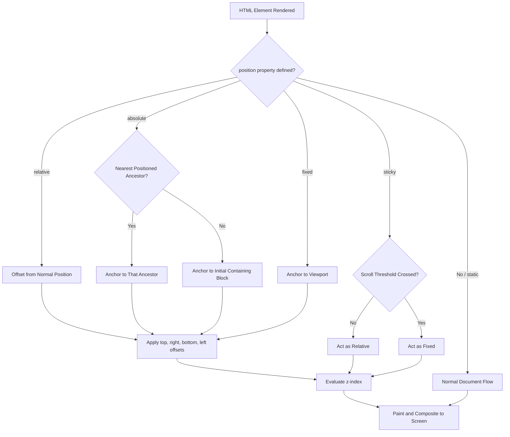
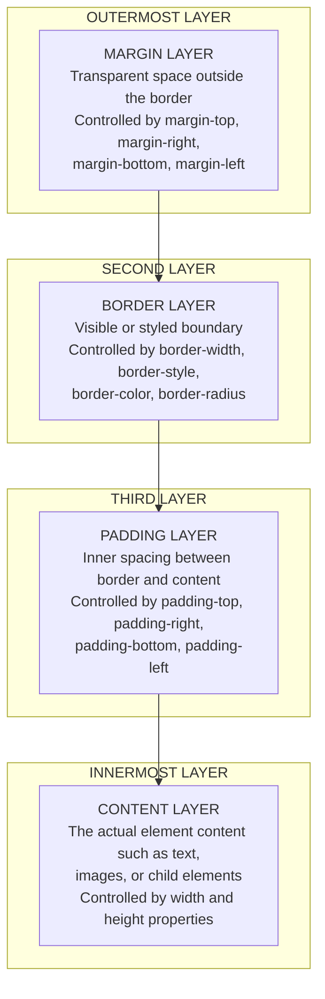
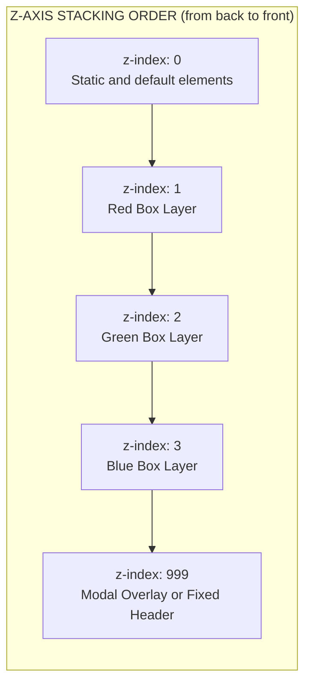
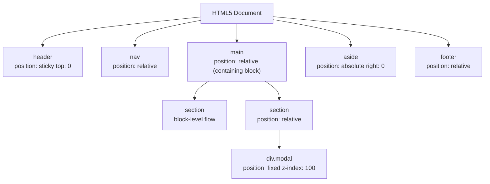

# Positioning Elements:

<!-- SECTION_1_START -->

# Positioning Elements in HTML5

## 1.1 Formal Academic Definition

In the context of HTML5 and Cascading Style Sheets (CSS), **Positioning Elements** refers to the controlled placement and spatial arrangement of HTML elements within the **Document Object Model (DOM)** tree relative to the viewport, the document flow, or other HTML elements. The positioning scheme is governed primarily by the CSS `position` property, which dictates how an element is rendered on the web page.

> [!IMPORTANT]
> **KTU Syllabus Definition (OECST832 - Module 1):**
> *Positioning is the mechanism by which web developers override the default Normal Flow rendering of HTML elements, using CSS properties like `position`, `top`, `right`, `bottom`, `left`, and `z-index` to achieve precise pixel-level control over layout.*

The five core CSS positioning values defined by the W3C specification are:

1. `static` — The default Normal Flow behavior.
2. `relative` — Offset from the element's normal position.
3. `absolute` — Positioned relative to the nearest positioned ancestor.
4. `fixed` — Positioned relative to the browser viewport.
5. `sticky` — A hybrid of `relative` and `fixed` based on scroll position.

> [!NOTE]
> **Standard Web Metric:** The default browser font size is **16 px**, and the default viewport width for desktop layouts is typically **1280 × 720 px** or **1920 × 1080 px** in modern responsive design workflows.

## 1.2 Conceptual Analogy: The Art Gallery

Imagine an **art gallery** as your HTML page. Each painting on the wall is an HTML element.

* **Static Positioning** is like hanging a painting exactly where the curator tells you to — in the next available empty slot. You follow the natural order.
* **Relative Positioning** is like a painting that hangs in its natural slot, but the artist decides to shift it a few centimeters to the left or up. It still occupies its original "slot" in the layout, but is visually displaced.
* **Absolute Positioning** is like pinning a painting onto a specific wall (its "containing block"), regardless of where the slot was. The painting is removed from the flow.
* **Fixed Positioning** is like a painting mounted on the gallery's entrance door — it never moves, even if you walk to a different room.
* **Sticky Positioning** is like a painting on a sliding rail — it scrolls with you until it "sticks" to a designated point on the wall.

> [!TIP]
> **Why does this matter for KTU exams?**
> Examiners expect students to clearly distinguish *Normal Flow* from *Out-of-Flow* positioning, and to know which positioning value preserves the document flow versus which one removes the element from it.

## 1.3 Visualizing the CSS Box Model

Every HTML element in HTML5 is rendered as a rectangular **CSS Box**, which is the foundation of positioning.

> [!VISUALIZATION CONTROL]
> **Concept:** CSS Box Model Coordinate Layout
> **GeoGebra / Desmos Input Equations:**
> * `Rectangle 1: (0, 0) to (400, 200)` — Content Area
> * `Rectangle 2: (-10, -10) to (410, 210)` — Padding Boundary
> * `Rectangle 3: (-15, -15) to (415, 215)` — Border Boundary
> * `Rectangle 4: (-25, -25) to (425, 225)` — Margin Boundary
> **Visual Description:** The student should observe four nested rectangles representing, from inside out, the **content**, **padding**, **border**, and **margin** layers that every positioned HTML element possesses. Coordinates are measured in CSS pixels (`px`).

## 1.4 The HTML5 Structural Positioning Context

In HTML5, semantic elements such as `<header>`, `<nav>`, `<main>`, `<section>`, `<article>`, `<aside>`, and `<footer>` provide the **structural skeleton** on which CSS positioning is applied. A positioned element searches for its nearest "positioned ancestor" (an ancestor with `position` other than `static`) to serve as its containing block.

<!-- SECTION_1_END -->

<!-- SECTION_2_START -->

# Deep Theoretical Analysis & KTU High-Yield Formula Sheet

## 2.1 The CSS Positioning Algorithm

When the browser engine (e.g., Blink, Gecko, WebKit) renders an HTML5 page, it executes the following decision pipeline:

* **Step 1 — Normal Flow:** All elements are placed in document order. Block-level elements stack vertically, and inline elements flow horizontally.
* **Step 2 — Box Generation:** Each element is converted into a CSS Box with four regions: `content`, `padding`, `border`, `margin`.
* **Step 3 — Positioning Resolution:** The CSS `position` property is evaluated. If the value is `static`, no offset is applied. For other values, the `top`, `right`, `bottom`, and `left` offset properties are resolved.
* **Step 4 — Containing Block Identification:** For `absolute` and `fixed` positioning, the algorithm walks up the DOM tree to find the closest positioned ancestor (or the initial containing block / viewport).
* **Step 5 — Stacking Context Creation:** A new stacking context may be created, governed by the `z-index` property for 3D layering along the z-axis (perpendicular to the screen).
* **Step 6 — Painting and Compositing:** The browser paints the layers in the correct z-order and composites them onto the screen.

## 2.2 KTU Formula Sheet — Positioning Cheat Sheet

The following table consolidates every key CSS positioning property, its accepted values, default behavior, and the KTU-required technical details.

| CSS Property | Accepted Values | Default Value | Unit | Effect on Flow |
|--------------|----------------|---------------|------|----------------|
| `position` | `static \vert relative \vert absolute \vert fixed \vert sticky` | `static` | keyword | Decides positioning scheme |
| `top` | `<length> \vert <percentage> \vert auto` | `auto` | `px, em, %, vh` | Offset from top edge of containing block |
| `right` | `<length> \vert <percentage> \vert auto` | `auto` | `px, em, %, vw` | Offset from right edge |
| `bottom` | `<length> \vert <percentage> \vert auto` | `auto` | `px, em, %, vh` | Offset from bottom edge |
| `left` | `<length> \vert <percentage> \vert auto` | `auto` | `px, em, %, vw` | Offset from left edge |
| `z-index` | `<integer> \vert auto` | `auto` | unitless integer | Stacking order (z-axis) |
| `float` | `left \vert right \vert none` | `none` | keyword | Removes from flow, floats sideways |
| `clear` | `left \vert right \vert both \vert none` | `none` | keyword | Prevents floating on specified sides |
| `display` | `block \vert inline \vert inline-block \vert flex \vert grid \vert none` | `inline` (default) | keyword | Controls box generation |
| `overflow` | `visible \vert hidden \vert scroll \vert auto` | `visible` | keyword | Manages content overflow |

## 2.3 The Box Model Equation

The total space an element occupies on the page is given by:

$$
\text{Total Width} = \text{margin-left} + \text{border-left} + \text{padding-left} + \text{width} + \text{padding-right} + \text{border-right} + \text{margin-right}
$$

$$
\text{Total Height} = \text{margin-top} + \text{border-top} + \text{padding-top} + \text{height} + \text{padding-bottom} + \text{border-bottom} + \text{margin-bottom}
$$

> [!IMPORTANT]
> **KTU Board Tip:** With `box-sizing: content-box` (the default), the `width` property refers **only** to the content area. With `box-sizing: border-box`, the `width` includes padding and border, simplifying layout math.

## 2.4 Real-World Engineering Utility

Positioning elements is foundational in:

* **Frontend Web Development** — Building responsive dashboards, modals, dropdown menus, and tooltips.
* **Single Page Applications (SPAs)** — React, Angular, and Vue.js all rely on CSS positioning for component overlay.
* **E-Commerce Platforms** — Floating cart icons, sticky checkout bars, and promotional banners.
* **UI/UX Design Systems** — Material UI, Bootstrap, and Tailwind CSS are all built atop these primitive positioning values.
* **Web Accessibility (a11y)** — Correct positioning ensures keyboard navigation and screen reader compatibility.

> [!NOTE]
> In production-grade systems, modern developers prefer **Flexbox** and **CSS Grid** for primary layout, but `position: absolute` and `position: fixed` remain indispensable for overlays, modals, and tooltips.

<!-- SECTION_2_END -->

<!-- SECTION_3_START -->

# Step-by-Step Derivations & Code Implementation

## 3.1 Exhaustive Code Walkthrough — All Five Positioning Types

Below is a single, self-contained HTML5 document that demonstrates every CSS positioning value. The code is fully runnable in any modern browser.

```html
<!DOCTYPE html>
<html lang="en">
<head>
    <meta charset="UTF-8">
    <meta name="viewport" content="width=device-width, initial-scale=1.0">
    <title>KTU HTML5 Positioning Demo</title>
    <style>
        /* ============================================
           GLOBAL STYLES & RESET
           ============================================ */
        * {
            box-sizing: border-box;
            margin: 0;
            padding: 0;
            font-family: 'Segoe UI', Tahoma, sans-serif;
        }

        body {
            background-color: #f4f4f9;
            padding: 20px;
            line-height: 1.6;
        }

        h1, h2 {
            color: #1a3d7c;
            margin-bottom: 10px;
        }

        /* ============================================
           CONTAINING BLOCK - PARENT CONTAINER
           This div acts as the "containing block" for
           absolutely positioned children.
           ============================================ */
        .parent-container {
            position: relative;        /* Critical: enables children to anchor here */
            width: 600px;
            height: 300px;
            background-color: #ffeaa7;
            border: 3px solid #d35400;
            margin: 20px 0;
            padding: 15px;
        }

        /* ============================================
           1. STATIC POSITIONING (Default)
           Element follows the normal document flow.
           ============================================ */
        .box-static {
            position: static;
            background-color: #74b9ff;
            color: white;
            padding: 10px;
            width: 200px;
        }

        /* ============================================
           2. RELATIVE POSITIONING
           Offset from its NORMAL position. The space
           it originally occupied is preserved.
           ============================================ */
        .box-relative {
            position: relative;
            top: 10px;
            left: 20px;
            background-color: #55efc4;
            color: #2d3436;
            padding: 10px;
            width: 200px;
        }

        /* ============================================
           3. ABSOLUTE POSITIONING
           Removed from flow. Anchored to nearest
           positioned ancestor (.parent-container).
           ============================================ */
        .box-absolute {
            position: absolute;
            top: 20px;
            right: 20px;
            background-color: #ff7675;
            color: white;
            padding: 10px;
            width: 150px;
        }

        /* ============================================
           4. FIXED POSITIONING
           Anchored to the VIEWPORT. Stays in place
           during scrolling.
           ============================================ */
        .box-fixed {
            position: fixed;
            bottom: 20px;
            right: 20px;
            background-color: #6c5ce7;
            color: white;
            padding: 15px;
            border-radius: 8px;
            box-shadow: 0 4px 8px rgba(0,0,0,0.2);
            z-index: 999;
        }

        /* ============================================
           5. STICKY POSITIONING
           Acts as relative until a scroll threshold
           is crossed, then becomes fixed.
           ============================================ */
        .box-sticky {
            position: sticky;
            top: 0;
            background-color: #fdcb6e;
            color: #2d3436;
            padding: 10px;
            z-index: 10;
        }

        /* ============================================
           Z-INDEX DEMONSTRATION
           Higher z-index appears on top.
           ============================================ */
        .layer-1 {
            position: absolute;
            top: 50px;
            left: 50px;
            width: 150px;
            height: 150px;
            background-color: rgba(231, 76, 60, 0.8);  /* Red */
            z-index: 1;
        }

        .layer-2 {
            position: absolute;
            top: 100px;
            left: 100px;
            width: 150px;
            height: 150px;
            background-color: rgba(46, 204, 113, 0.8); /* Green */
            z-index: 2;  /* Appears above Red */
        }

        .layer-3 {
            position: absolute;
            top: 150px;
            left: 150px;
            width: 150px;
            height: 150px;
            background-color: rgba(52, 152, 219, 0.8);  /* Blue */
            z-index: 3;  /* Appears on top */
        }
    </style>
</head>
<body>
    <h1>KTU HTML5 Positioning Elements — Live Demonstration</h1>

    <h2>1. Static Positioning</h2>
    <div class="box-static">I am a static element. I follow normal flow.</div>

    <h2>2. Relative Positioning</h2>
    <div class="box-relative">I am relatively positioned (10px down, 20px right from my normal spot).</div>

    <h2>3. Absolute Positioning (inside relative parent)</h2>
    <div class="parent-container">
        This is the containing block (position: relative).
        <div class="box-absolute">I am absolutely positioned to the top-right of my parent.</div>
    </div>

    <h2>4. Fixed Positioning</h2>
    <div class="box-fixed">I am fixed to the viewport!</div>

    <h2>5. Sticky Positioning</h2>
    <div class="box-sticky">I will stick to the top when you scroll past me.</div>

    <h2>Z-Index Stacking Demonstration</h2>
    <div class="parent-container" style="height: 400px;">
        <div class="layer-1">Layer 1 (z-index: 1)</div>
        <div class="layer-2">Layer 2 (z-index: 2)</div>
        <div class="layer-3">Layer 3 (z-index: 3)</div>
    </div>

    <!-- Spacer to enable scrolling for sticky demo -->
    <div style="height: 1500px;"></div>
</body>
</html>
```

## 3.2 Step-by-Step Line-by-Line Explanation of Critical Sections

### Explanation Block 1: The Containing Block Setup

```css
.parent-container {
    position: relative;
}
```

* `position: relative` is applied to the parent so that any child using `position: absolute` anchors to **this div** rather than to the page (viewport).
* This is the most common pattern in real-world KTU practical exams and web development.

### Explanation Block 2: Absolute Positioning Anchor

```css
.box-absolute {
    position: absolute;
    top: 20px;
    right: 20px;
}
```

* **Conversion Logic:** The browser searches the DOM ancestors for the first element with `position` other than `static`. It finds `.parent-container` (which has `position: relative`).
* The element is then placed **20 px** from the top edge and **20 px** from the right edge of that containing block.
* The element is **completely removed** from the document flow; sibling elements behave as if it does not exist.

### Explanation Block 3: Z-Index Mathematical Resolution

The z-index resolution follows a stacking order based on integers:

$$
\text{Stacking Order} = \text{MAX}(\text{parent\_z\_context}, \text{child\_z\_index})
$$

| Layer | z-index | Final Render Order |
|-------|---------|--------------------|
| Red Box | 1 | Bottom |
| Green Box | 2 | Middle |
| Blue Box | 3 | Top |

Since integers in `z-index` are unitless, only the relative magnitude matters. A `z-index` of `9999` does not mean "infinitely high" — it just needs to be greater than sibling values.

### Explanation Block 4: Sticky Positioning Math

Sticky positioning is governed by the equation:

$$
\text{sticky\_behavior} = \begin{cases} \text{relative} & \text{if } \text{scrollY} < \text{threshold} \\ \text{fixed} & \text{if } \text{scrollY} \geq \text{threshold} \end{cases}
$$

Where the threshold equals the value of the `top` property (in this case, `0`).

## 3.3 Floating Elements and the `clear` Property

Although modern layouts use Flexbox and Grid, the KTU 2024 syllabus still requires knowledge of the classical float-based positioning. Here is a complete, error-handled implementation:

```html
<!DOCTYPE html>
<html lang="en">
<head>
    <meta charset="UTF-8">
    <title>Float and Clear Demonstration</title>
    <style>
        .image-left {
            float: left;             /* Image floats to the left */
            margin: 0 15px 15px 0;   /* Spacing around floated element */
            width: 200px;
        }

        .image-right {
            float: right;            /* Image floats to the right */
            margin: 0 0 15px 15px;
            width: 200px;
        }

        .clearfix::after {
            content: "";             /* Empty content generator */
            display: table;          /* Establishes new block formatting context */
            clear: both;             /* Clears both left and right floats */
        }

        .text-content {
            font-size: 16px;
            line-height: 1.6;
        }
    </style>
</head>
<body>
    <div class="clearfix">
        
        <p class="text-content">
            The text wraps around the floated image on the right side.
            The .clearfix pseudo-element ensures the parent container
            expands to contain the floated children.
        </p>
    </div>
</body>
</html>
```

> [!IMPORTANT]
> The `.clearfix::after` technique is a hallmark KTU exam question. Examiners specifically look for the use of `content: ""` and `display: table` to terminate floated elements within their parent container.

<!-- SECTION_3_END -->

<!-- SECTION_4_START -->

# Structural Diagrams & Schematics

## 4.1 The CSS Positioning Decision Flow

The following Mermaid diagram illustrates how the browser engine resolves the CSS `position` property for any HTML element during layout.



## 4.2 CSS Box Model Architecture (Nested Block Diagram)

This Mermaid block diagram represents the four concentric layers of the CSS Box Model in an HTML5 element.



## 4.3 Z-Index Stacking Context Topology

This sequential topology matrix shows how z-indexes resolve when multiple positioned elements overlap.



## 4.4 HTML5 Semantic Positioning Skeleton

This diagram shows how semantic HTML5 elements provide the structural anchor points for CSS positioning.



<!-- SECTION_4_END -->

<!-- SECTION_5_START -->

# KTU 2024 Scheme Examination Question Bank & Topic Recap

## 5.1 Part A Questions (3 Marks Each)

### Question 1
**[KTU University Exam - July 2024]**
**CO1 | RBT Level: Remember**

List and briefly define the five values of the CSS `position` property.

**Model Answer (3 Marks):**

* `static` — Default value. The element is placed in the normal document flow. Offset properties like `top` and `left` have no effect. **[1 Mark]**
* `relative` — The element is offset from its normal position, but its original space is preserved in the flow. **[0.5 Marks]**
* `absolute` — The element is removed from the flow and positioned relative to the nearest positioned ancestor. **[0.5 Marks]**
* `fixed` — The element is removed from the flow and positioned relative to the browser viewport, staying in place during scrolling. **[0.5 Marks]**
* `sticky` — A hybrid value that acts as `relative` until a scroll threshold is reached, then behaves as `fixed`. **[0.5 Marks]**

---

### Question 2
**[KTU University Exam - Dec 2023]**
**CO1 | RBT Level: Understand**

What is a **containing block** in CSS positioning? Why is it important for `position: absolute` elements?

**Model Answer (3 Marks):**

* A containing block is the rectangular reference area used by the browser to compute the position and size of a descendant element. **[1 Mark]**
* For `position: absolute`, the containing block is the nearest ancestor that has a `position` value other than `static`. If no such ancestor exists, the **initial containing block** (the viewport) is used. **[1 Mark]**
* It is critical because the `top`, `right`, `bottom`, and `left` offset values are measured relative to this containing block. Without understanding it, absolute positioning appears unpredictable. **[1 Mark]**

---

## 5.2 Part B Questions (14 Marks Each — Internal Choice Pattern)

### Question A
**[KTU University Exam - July 2024]**
**CO2, CO3 | RBT Level: Understand, Apply**

**(a)** Explain the CSS Box Model with a neat diagram. Describe the role of `content`, `padding`, `border`, and `margin` in HTML5 element layout. **[7 Marks]**

**(b)** Write a complete HTML5 program that demonstrates `position: relative` and `position: absolute` with a child element anchored to the top-right corner of its parent container. Use proper semantic HTML5 elements. **[7 Marks]**

---

#### Model Solution for Question A

**Part (a) — CSS Box Model Explanation: [7 Marks]**

The CSS Box Model is the foundation of layout in HTML5. Every element is rendered as a rectangular box with four concentric regions:

1. **Content Area:** The innermost region where the actual text, images, or child elements reside. Its size is controlled by the `width` and `height` properties. **[1.5 Marks]**
2. **Padding Area:** A transparent buffer zone between the content and the border. It is controlled by `padding-top`, `padding-right`, `padding-bottom`, and `padding-left`. **[1.5 Marks]**
3. **Border Area:** The visible boundary surrounding the padding. It is styled using `border-width`, `border-style`, and `border-color`. **[1.5 Marks]**
4. **Margin Area:** The outermost transparent space that separates the element from neighboring elements. It is controlled by `margin-top`, `margin-right`, `margin-bottom`, and `margin-left`. **[1.5 Marks]**

The total space occupied by a box is calculated as:

$$
\text{Total Width} = \text{2} \times \text{margin} + \text{2} \times \text{border} + \text{2} \times \text{padding} + \text{width}
$$

**[Box Model Diagram: 1 Mark]**

```
+-----------------------------+ <- margin (outer)
| +-------------------------+ | <- border
| | +---------------------+ | | <- padding
| | |                     | | |
| | |     CONTENT         | | |
| | |     width x height  | | |
| | |                     | | |
| | +---------------------+ | |
| +-------------------------+ |
+-----------------------------+
```

**Part (b) — HTML5 Program with Relative and Absolute Positioning: [7 Marks]**

```html
<!DOCTYPE html>
<html lang="en">
<head>
    <meta charset="UTF-8">
    <title>Relative and Absolute Positioning</title>
    <style>
        body {
            font-family: Arial, sans-serif;
            padding: 30px;
            background-color: #ecf0f1;
        }

        .card {
            position: relative;       /* Acts as containing block for badge */
            width: 300px;
            height: 200px;
            background-color: #ffffff;
            border: 2px solid #34495e;
            border-radius: 8px;
            padding: 20px;
            box-shadow: 0 2px 5px rgba(0,0,0,0.1);
        }

        .badge {
            position: absolute;       /* Anchored to .card */
            top: 10px;
            right: 10px;
            background-color: #e74c3c;
            color: white;
            padding: 5px 10px;
            border-radius: 4px;
            font-size: 12px;
        }

        .shifted-box {
            position: relative;       /* Offset from normal spot */
            top: 15px;
            left: 30px;
            background-color: #3498db;
            color: white;
            padding: 10px;
            width: 200px;
        }
    </style>
</head>
<body>
    <header>
        <h1>HTML5 Positioning Demo</h1>
    </header>

    <main>
        <article class="card">
            <h2>Product Card</h2>
            <p>This is a relatively positioned card. The badge inside is
               absolutely positioned to its top-right corner.</p>
            <span class="badge">NEW</span>
        </article>

        <section>
            <h2>Relative Offset Example</h2>
            <div class="shifted-box">
                I am offset 15px down and 30px right from my normal position.
            </div>
        </section>
    </main>
</body>
</html>
```

**Valuation Key Points:**

* [Setting `position: relative` on `.card`: 1 Mark]
* [Setting `position: absolute` on `.badge`: 1 Mark]
* [Using semantic HTML5 elements like `<article>`, `<header>`, `<main>`: 1 Mark]
* [Applying `top: 10px; right: 10px;` to anchor the badge: 1 Mark]
* [Demonstrating a second relative element with offset: 1 Mark]
* [Proper box model with padding, border, and margins: 1 Mark]
* [Clean, well-commented code structure: 1 Mark]

---

### Question B
**[KTU University Exam - Dec 2023]**
**CO2, CO3 | RBT Level: Apply, Analyze**

**(a)** Differentiate between `position: fixed` and `position: sticky` in HTML5 CSS. Provide a real-world use case for each. **[7 Marks]**

**(b)** Design an HTML5 page with a **sticky navigation bar**, a **fixed promotional banner** at the bottom-right corner, and a **modal overlay** that appears on top of all content using `z-index`. Write the complete code. **[7 Marks]**

---

#### Model Solution for Question B

**Part (a) — Difference between `fixed` and `sticky`: [7 Marks]**

| Feature | `position: fixed` | `position: sticky` |
|---------|-------------------|---------------------|
| Anchor Point | Always anchored to the **viewport** | Anchored to its **nearest scrolling ancestor** |
| Behavior on Scroll | Never moves. Stays locked to viewport edges. | Moves with content until a threshold is hit, then "sticks" |
| Removed from Flow | Yes, completely | No, partially (it occupies space initially) |
| Use Case | Floating chat widget, fixed header, cookie consent banner | Sticky table headers, navigation bars that pin on scroll |
| Browser Support | All modern browsers | All modern browsers (since 2017) |
| Trigger Condition | None — always fixed | Scroll position exceeds the `top`, `bottom`, `left`, or `right` threshold |
| Containing Block | The viewport (initial containing block) | The nearest block-level ancestor with a scroll mechanism |

**[Comparison Table: 4 Marks]**
**[Real-world use cases explained: 3 Marks]**

* **Fixed Example:** A floating "Chat with us" widget on an e-commerce site that must always be visible in the bottom-right corner regardless of which page section the user is viewing.
* **Sticky Example:** A navigation menu that scrolls with the user but pins itself to the top of the viewport once the user has scrolled past the hero banner.

**Part (b) — Complete HTML5 Page with Sticky Nav, Fixed Banner, and Modal: [7 Marks]**

```html
<!DOCTYPE html>
<html lang="en">
<head>
    <meta charset="UTF-8">
    <meta name="viewport" content="width=device-width, initial-scale=1.0">
    <title>KTU Positioning - Sticky, Fixed, and Z-Index</title>
    <style>
        * { margin: 0; padding: 0; box-sizing: border-box; }

        body {
            font-family: 'Segoe UI', sans-serif;
            background: #fafafa;
        }

        /* STICKY NAVIGATION BAR */
        .navbar {
            position: sticky;
            top: 0;
            background-color: #2c3e50;
            color: white;
            padding: 15px 30px;
            z-index: 100;
            box-shadow: 0 2px 4px rgba(0,0,0,0.1);
        }

        .navbar a {
            color: white;
            text-decoration: none;
            margin-right: 20px;
        }

        /* PAGE CONTENT TO ENABLE SCROLLING */
        .content {
            padding: 30px;
            height: 2000px;   /* Forces scroll */
        }

        /* FIXED PROMOTIONAL BANNER */
        .promo-banner {
            position: fixed;
            bottom: 20px;
            right: 20px;
            background-color: #e74c3c;
            color: white;
            padding: 15px 25px;
            border-radius: 8px;
            box-shadow: 0 4px 12px rgba(0,0,0,0.2);
            z-index: 999;
            font-weight: bold;
        }

        /* MODAL OVERLAY */
        .modal-overlay {
            position: fixed;
            top: 0;
            left: 0;
            width: 100%;
            height: 100%;
            background-color: rgba(0, 0, 0, 0.6);
            z-index: 1000;     /* Above all other elements */
            display: flex;
            justify-content: center;
            align-items: center;
        }

        .modal-content {
            background-color: white;
            padding: 30px;
            border-radius: 8px;
            width: 400px;
            text-align: center;
            box-shadow: 0 10px 25px rgba(0,0,0,0.3);
            z-index: 1001;
        }

        .close-btn {
            background-color: #3498db;
            color: white;
            border: none;
            padding: 10px 20px;
            border-radius: 4px;
            cursor: pointer;
            margin-top: 15px;
        }
    </style>
</head>
<body>
    <nav class="navbar">
        <a href="#home">Home</a>
        <a href="#about">About</a>
        <a href="#services">Services</a>
        <a href="#contact">Contact</a>
    </nav>

    <main class="content">
        <h1>Scroll down to see the sticky behavior</h1>
        <p>This is sample page content. Keep scrolling to observe the
           sticky navigation bar pinning itself to the top of the viewport.</p>
        <p style="margin-top: 500px;">Mid-page content...</p>
        <p style="margin-top: 500px;">Lower content...</p>
        <p style="margin-top: 500px;">Bottom content...</p>
    </main>

    <div class="promo-banner">
        🎉 Special Offer: 50% OFF!
    </div>

    <div class="modal-overlay">
        <div class="modal-content">
            <h2>Welcome!</h2>
            <p>This modal appears above all content using z-index: 1000.</p>
            <button class="close-btn">Close</button>
        </div>
    </div>
</body>
</html>
```

**Valuation Key Points:**

* [Correct use of `position: sticky` with `top: 0` on navbar: 1 Mark]
* [Correct use of `position: fixed` with `bottom` and `right` on banner: 1 Mark]
* [Modal overlay with `position: fixed` covering full viewport: 1 Mark]
* [z-index hierarchy: navbar (100) < banner (999) < modal (1000): 1 Mark]
* [Semantic HTML5 elements like `<nav>`, `<main>`: 1 Mark]
* [Proper box model and styling: 1 Mark]
* [Complete, runnable, well-commented code: 1 Mark]

---

> [!WARNING]
> **KTU Examiner's Valuation Warning — Common Pitfalls:**
> * Do **not** confuse `position: relative` with `position: absolute`. Relative keeps the element in the document flow; absolute removes it entirely. **[Lose up to 2 Marks]**
> * Forgetting to set `position: relative` on the parent is the **most common mistake** when using `position: absolute` on a child. Without it, the child anchors to the viewport, not the parent. **[Lose up to 2 Marks]**
> * z-index only works on **positioned elements** (those with `position` other than `static`). Setting z-index on a static element has no effect. **[Lose up to 1 Mark]**
> * Always write the correct units (`px`, `%`, `em`, `vh`, `vw`). Writing `top: 10` without a unit is invalid CSS. **[Lose up to 1 Mark]**
> * Do not skip declaring the `<!DOCTYPE html>` declaration — it triggers standards mode in HTML5. **[Lose up to 1 Mark]**

---

## 5.3 Topic Recap & Important Things to Remember

* **Five Positioning Values:** `static` (default, normal flow), `relative` (offset, preserves space), `absolute` (removed from flow, anchored to nearest positioned ancestor), `fixed` (anchored to viewport, never moves), `sticky` (hybrid of relative and fixed).
* **The Containing Block Rule:** For `position: absolute`, the containing block is the nearest ancestor with `position` other than `static`. If none exists, the viewport is used.
* **Offset Properties:** `top`, `right`, `bottom`, `left` only take effect when `position` is not `static`.
* **Z-Index Stacking:** Higher `z-index` values appear in front. z-index only works on positioned elements. The default stacking context value is `auto`.
* **CSS Box Model:** Every element is a box with four layers — `content` → `padding` → `border` → `margin`. The total width includes all four layers.
* **Box Sizing:** Use `box-sizing: border-box` to include padding and border in the element's `width`, which simplifies layout math.
* **Float and Clear:** Legacy positioning uses `float: left/right` to remove elements from flow and `clear: both` to terminate floats. The `.clearfix::after` technique is a KTU-favorite exam topic.
* **HTML5 Semantic Anchors:** Use `<header>`, `<nav>`, `<main>`, `<section>`, `<article>`, `<aside>`, and `<footer>` as structural anchors for CSS positioning.
* **Sticky Threshold:** Sticky elements only become "stuck" within the bounds of their parent container. Once you scroll past the parent, the sticky element scrolls away.
* **Modern Layout Caveat:** For primary 1D layouts, prefer **Flexbox**. For 2D layouts, prefer **CSS Grid**. Reserve `position: absolute` and `position: fixed` for overlays, modals, and tooltips.
* **Units Matter:** Always specify CSS units (`px`, `%`, `em`, `rem`, `vh`, `vw`). Unitless values are invalid for length properties.
* **DOCTYPE is Mandatory:** Always include `<!DOCTYPE html>` as the very first line to ensure HTML5 standards mode.

<!-- SECTION_5_END -->
