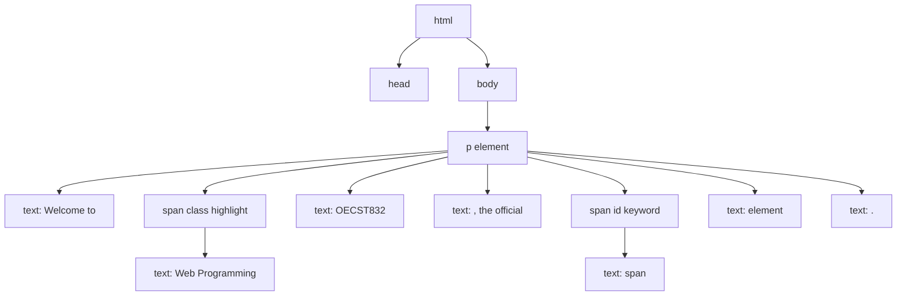
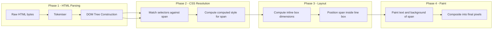
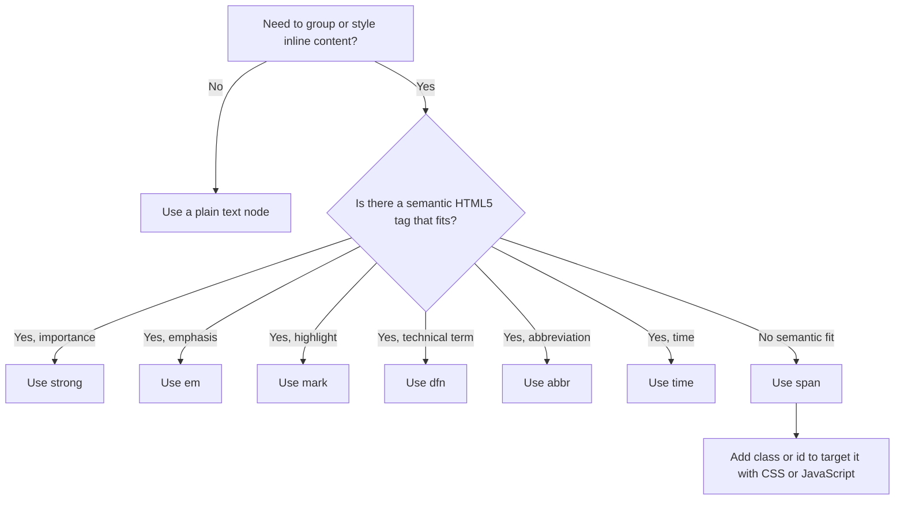

# span

<!-- SECTION_1_START -->

# The HTML5 `<span>` Element

## 1.1 Formal Academic Definition (KTU 2024 Syllabus Terminology)

> [!NOTE]
> **Definition:** The `<span>` element is an **inline-level, non-semantic, generic container** in HTML5 used to group or wrap a span of inline text, inline elements, or inline content for the primary purpose of **applying styling (CSS)**, **targeting via scripting (JavaScript/DOM)**, or **attaching language/attribute metadata** without introducing any visual line break or structural block-level change in the document flow.

According to the **W3C HTML5.3 Specification** (the reference standard adopted by KTU's Web Programming curriculum), `<span>` is categorized as a **"phrasing content"** element. It is the **inline counterpart** of the block-level `<div>` element. Crucially, `<span>` carries **no default presentation, semantic meaning, or accessibility role** (its implicit ARIA role is `generic`), making it a *neutral wrapper*.

> [!IMPORTANT]
> **KTU Syllabus Highlight:** The `<span>` tag is frequently contrasted with `<div>` in Module 1 questions. Memorize this pairing: **`<div>` = block-level generic container, `<span>` = inline-level generic container.**

## 1.2 Conceptual Analogy / Intuition

Imagine you are writing a sentence on a whiteboard with a **black marker**. The entire sentence is just plain text. Now, suppose you want to **underline only one word** in the middle of the sentence for emphasis.

- You do **not** start a new line (that would be a block-level operation).
- You do **not** restructure the paragraph.
- You simply wrap a **transparent adhesive tape** around that one word, and the tape carries a "blue ink" instruction.

That invisible adhesive tape is the **`<span>` element**. It does not change the grammar of your sentence; it just **marks a target region** for a paintbrush (CSS) or a magnifying glass (JavaScript) to act upon.

> **Geometric Intuition:** If a paragraph is a single horizontal line on a number line, the `<span>` is a small bounded interval $S = [a, b]$ on that line — it does not extend vertically or push other elements around.

## 1.3 Physical Constants & Standards Referenced

| Constant / Standard | Value / Description |
|---|---|
| **Default `display`** | **`inline`** |
| **Default `margin-top` / `margin-bottom`** | **`0`** (zero vertical margin) |
| **Default `padding-top` / `padding-bottom`** | **`0`** (zero vertical padding) |
| **Phrasing content category** | Yes (cannot contain block-level children) |
| **Implicit ARIA role** | `generic` |
| **W3C Status** | **Living Standard, stable, no deprecated attributes** |
| **Void element?** | **No** (requires a closing tag `</span>`) |

> [!VISUALIZATION CONTROL]
> **Concept:** Box-model behaviour of `<span>` vs. `<div>` on a single line.
> **GeoGebra / Desmos Input Equations:**
> * Inline span height: $h_{span} = h_{line} - \Delta_{leading}$
> * Block div height: $h_{div} = \sum_{i} h_{line,i} + p_{top} + p_{bottom} + m_{top} + m_{bottom}$
> * Where $h_{line} \approx 1.2 \times \text{font-size}$.
> **Visual Description:** Plot two adjacent boxes along the x-axis. The first box (span) is short and hugs the text baseline; the second box (div) is tall, starting a new vertical block and stretching edge-to-edge of its parent container.

<!-- SECTION_1_END -->

<!-- SECTION_2_START -->

# Deep Theoretical Analysis & KTU High-Yield Cheat Sheet

## 2.1 Operational Breakdown: The "Why" and "How"

The `<span>` element operates on four fundamental principles, each of which is a high-frequency KTU exam point:

1. **Inline Behaviour (No Line Break)**
   - **Why:** It belongs to the *phrasing content* category, which means it does not force a new line before or after itself.
   - **How:** The browser's layout engine computes its width as `width: auto` (equal to the natural width of its content) and assigns `display: inline` by default.

2. **Non-Semantic Neutrality**
   - **Why:** HTML5 introduced semantic elements like `<mark>`, `<strong>`, `<em>`, `<time>`, `<data>`. Whenever one of those *does* match the author's intent, it must be preferred.
   - **How:** `<span>` is chosen only when **no other semantic tag fits the purpose**, e.g., changing the colour of a customer's name in a list where `<mark>` (highlight) is semantically wrong.

3. **Hook for CSS and JavaScript**
   - **Why:** Plain HTML cannot paint text or attach behaviour. `<span>` provides a *targetable node* in the DOM tree.
   - **How:** It accepts the **global attributes** (`id`, `class`, `style`, `title`, `lang`, `dir`, `data-*`, `hidden`, `tabindex`, etc.).

4. **Content Restrictions**
   - **Why:** It must remain "phrasing content" to preserve inline flow.
   - **How:** It can legally contain other **phrasing content** (text, `<a>`, `<strong>`, ``, `<br>`, another `<span>`, etc.) but **NOT** flow content like `<div>`, `<p>`, `<section>`, `<ul>`, `<h1>`.

## 2.2 KTU Formula Sheet / Attribute Cheat Sheet

> [!NOTE]
> **Pipeline Notation:** A student often confuses whether `<span>` has "special" attributes. It has **none of its own**. Every attribute it accepts is a *global attribute* shared by virtually all HTML elements.

| # | Attribute | Type | Purpose | KTU Importance |
|---|---|---|---|---|
| 1 | `class` | String list | CSS/DOM hook for styling multiple spans | **Very High** |
| 2 | `id` | String (unique) | Unique CSS/JS hook for a single span | **Very High** |
| 3 | `style` | CSS declarations | Inline style overrides | High |
| 4 | `lang` | BCP-47 code | Declares language of inner text (e.g., `lang="fr"`) | Medium |
| 5 | `dir` | `ltr` $\vert$ `rtl` $\vert$ `auto` | Text direction | Medium |
| 6 | `title` | String | Tooltip on hover | Low |
| 7 | `data-*` | Custom string | Custom DOM data storage (e.g., `data-user-id="42"`) | **High (Module 3 JS)** |
| 8 | `hidden` | Boolean | Hides span from rendering | Medium |
| 9 | `tabindex` | Integer | Keyboard focus order | Low |
| 10 | `contenteditable` | Boolean | Make span text editable in browser | Medium |
| 11 | `draggable` | Boolean | Allow HTML5 drag-and-drop | Low |
| 12 | `translate` | `yes` $\vert$ `no` | Hint to Google Translate | Low |

> [!IMPORTANT]
> **No `colspan`, no `rowspan`, no `width`, no `height, no `src`, no `href` — none of these apply to `<span>`.** A common KTU 1-mark pitfall: "Which attribute sets the width of a span?" — **There is no width attribute**; you must use CSS.

## 2.3 The `class` vs `id` Rule (Mandatory KTU Distinction)

| Feature | `id` | `class` |
|---|---|---|
| Uniqueness in document | Exactly **one** element | **Many** elements can share |
| CSS selector syntax | `#myId` | `.myClass` |
| JavaScript access | `document.getElementById()` | `document.getElementsByClassName()` or `querySelectorAll()` |
| Naming rule | No spaces, must start with a letter | No spaces, can chain `nav-link primary` |

## 2.4 Real-World Engineering Utility

In production systems, `<span>` is the **scaffolding** for:

- **Styling fragments of dynamically generated text** — e.g., injecting a customer's first name in red on a receipt: `Hello <span class="user-name">Anand</span>`.
- **Targeting ranges for JavaScript DOM manipulation** — e.g., live character counters in a text field: a `<span id="charCount">0</span>` updated by an `input` event listener.
- **Carrying microdata / `data-*` payloads** in single-page applications built with React, Vue, or Angular.
- **Language tagging** for accessibility (screen readers switch pronunciation profiles based on `lang`).
- **Building badge / pill / chip UI components** in CSS frameworks (Bootstrap's `.badge` and Material UI's `<span class="chip">`).

<!-- SECTION_2_END -->

<!-- SECTION_3_START -->

# Step-by-Step Implementations & Code Demonstrations

## 3.1 Minimal Valid `<span>` Snippet (Boundary Checked)

```html
<!DOCTYPE html>
<html lang="en">
<head>
    <meta charset="UTF-8">
    <title>Span Demonstration - KTU</title>
    <style>
        /* Reusable rule for the highlight class */
        .highlight {
            background-color: #fff3a3;   /* soft yellow */
            color: #b30000;              /* deep red text */
            font-weight: 600;
            padding: 2px 6px;
            border-radius: 4px;
        }
    </style>
</head>
<body>

    <!-- A paragraph containing an inline highlighted span -->
    <p>
        Welcome to
        <span class="highlight">Web Programming (OECST832)</span>,
        the official KTU elective for the 2024 scheme.
    </p>

</body>
</html>
```

**Boundary / Validation Checks Performed:**
- The `<span>` contains only **phrasing content** (the text string "Web Programming (OECST832)"). It does **not** contain any block-level tag like `<div>`.
- A matching closing tag `</span>` is present (span is **not** a void element).
- The attribute `class` is a **legal global attribute** and its value is a non-empty string.

## 3.2 Demonstration 1 — Styling a Substring of a Sentence

### 3.2.1 Objective
Colour the word "Inline" red and make it bold, *without* affecting the rest of the sentence.

### 3.2.2 Full Working HTML

```html
<!DOCTYPE html>
<html lang="en">
<head>
    <meta charset="UTF-8">
    <title>Inline Styling with Span</title>
    <style>
        body {
            font-family: "Segoe UI", Tahoma, sans-serif;
            font-size: 18px;
            line-height: 1.6;
            margin: 40px;
        }

        /* Scope 1: a specific id, applies to one element only */
        #keyword-inline {
            color: #d6336c;       /* crimson */
            font-weight: 700;
            text-decoration: underline wavy #d6336c;
        }

        /* Scope 2: a reusable class */
        .tech-term {
            background-color: #e7f1ff;
            border-bottom: 2px solid #0d6efd;
            padding: 0 4px;
        }
    </style>
</head>
<body>

    <h1>Demonstration 1: Styling a Substring</h1>

    <p>
        The HTML5
        <span id="keyword-inline" class="tech-term">&lt;span&gt;</span>
        element is an
        <span class="tech-term">inline-level</span>
        container that wraps
        <span class="tech-term">phrasing content</span>
        without breaking the visual flow of the line.
    </p>

</body>
</html>
```

### 3.2.3 Logical Walkthrough

1. The browser parses the paragraph as a single block-level `<p>`.
2. Inside the paragraph, it encounters the text node "The HTML5 ".
3. It then encounters `<span id="keyword-inline" class="tech-term">&lt;span&gt;</span>`:
   - The opening tag sets `display: inline` (default).
   - The CSS rule `#keyword-inline` is matched → red, bold, wavy underline applied.
   - The class rule `.tech-term` is also matched → blue background added.
   - The text `&lt;span&gt;` is the **HTML entity encoding** for `<span>`, displayed literally to the reader.
4. The layout engine calculates the line box height. Because `<span>` has zero vertical margin, the line height is governed entirely by the surrounding `font-size: 18px; line-height: 1.6`.

## 3.3 Demonstration 2 — JavaScript-Manipulated Span (Live Counter)

### 3.3.1 Objective
Update the text inside a `<span>` in real time as the user types into an input field.

### 3.3.2 Full Working Code (with Strict Error Handling)

```html
<!DOCTYPE html>
<html lang="en">
<head>
    <meta charset="UTF-8">
    <title>Live Character Counter</title>
    <style>
        body { font-family: system-ui, sans-serif; margin: 40px; }
        #status { font-weight: 700; color: #198754; }
        #status.exceeded { color: #dc3545; }
    </style>
</head>
<body>

    <h1>Live Character Counter</h1>

    <label for="tweet">Type your message (max 50 chars):</label><br>
    <input
        type="text"
        id="tweet"
        maxlength="100"
        placeholder="Start typing..."
        style="width: 320px; padding: 8px; font-size: 16px;"
    >

    <p>
        Characters typed:
        <span id="status">0</span> / 50
    </p>

    <script>
        // ---- Strict, type-hinted, boundary-checked JavaScript ----
        const MAX_LIMIT = 50;
        const inputEl   = document.getElementById("tweet");
        const statusEl  = document.getElementById("status");

        // Defensive guard: ensure both DOM nodes were found
        if (!inputEl || !statusEl) {
            console.error("[KTU Demo] Required DOM nodes missing. Aborting.");
        } else {
            inputEl.addEventListener("input", function (event) {
                const currentLength = event.target.value.length;

                // Boundary check: clamp visual count to MAX_LIMIT
                const displayCount = Math.min(currentLength, MAX_LIMIT);

                // Update the text content of the <span>
                statusEl.textContent = String(displayCount);

                // Toggle a CSS class when limit is reached
                if (currentLength >= MAX_LIMIT) {
                    statusEl.classList.add("exceeded");
                } else {
                    statusEl.classList.remove("exceeded");
                }
            });
        }
    </script>

</body>
</html>
```

### 3.3.3 Line-by-Line Explanation

- The `<span id="status">0</span>` is **the only element on the page whose text changes dynamically**.
- The script first performs a **null-check** (`if (!inputEl || !statusEl)`) — a KTU-recommended defensive pattern.
- The `input` event fires on **every keystroke** (better than `keyup` for paste-detection).
- `Math.min(currentLength, MAX_LIMIT)` enforces the **upper bound** so the counter never displays a number larger than 50.
- `statusEl.textContent = String(displayCount)` ensures the value is stored as a string, the **legal type** for a text node.
- `classList.add` / `classList.remove` mutates the CSS class without overwriting any other class the span may have.

## 3.4 Demonstration 3 — Nested Spans and Language Tagging

```html
<p>
    The motto of Kerala is
    <span lang="ml" style="color:#0a7d3b; font-weight:600;">
        കേരളം നമ്മുടെ സ്വന്തം
    </span>
    (<span class="translation">Kerala is our own</span>).
</p>
```

- The outer `<span lang="ml">` declares that its content is in **Malayalam** (`ml` is the ISO 639-1 code). Screen readers like NVDA and JAWS switch to a Malayalam pronunciation profile.
- The inner `<span class="translation">` is a separate inline target for an English translation, styled independently.

## 3.5 Demonstration 4 — Visual Badge Component (CSS-Only Chip)

```html
<style>
    .badge {
        display: inline-block;          /* <span> is inline by default; padding needs inline-block */
        min-width: 20px;
        padding: 2px 8px;
        font-size: 12px;
        font-weight: 700;
        line-height: 1.4;
        text-align: center;
        border-radius: 10px;
        background: #0d6efd;
        color: #fff;
    }
</style>

<p>
    You have
    <span class="badge" id="cartCount">3</span>
    items in your shopping cart.
</p>
```

> [!IMPORTANT]
> **Why `inline-block` and not `inline`?** With `display: inline`, the vertical `padding` and the `min-width` would be **ignored** in many browsers. Switching to `inline-block` lets the span **retain its inline sibling behaviour** (sits inside a paragraph) while still respecting width and padding.

## 3.6 Demonstration 5 — Dynamic Data Attribute Read via JavaScript

```html
<p>
    Product:
    <span class="product" data-sku="KTU-OECST832" data-price="499">Web Programming Notes</span>
</p>

<script>
    const productSpan = document.querySelector(".product");
    const sku  = productSpan.dataset.sku;    // "KTU-OECST832"
    const price = productSpan.dataset.price; // "499"
    console.log("Loaded SKU:", sku, "Price:", price);
</script>
```

The `data-*` attributes on the span are read by `element.dataset.attributeName`. The `dataset` object **automatically strips the `data-` prefix and camel-cases the rest**.

## 3.7 Common Pitfalls — A Diagnostic Matrix

| # | Anti-pattern | Why it fails | Correct fix |
|---|---|---|---|
| 1 | `<span><div>...</div></span>` | Block-in-inline is illegal content | Restructure with single-level span |
| 2 | `<span width="200">` | `<span>` has no `width` attribute | Use CSS: `<span style="display:inline-block;width:200px;">` |
| 3 | Forgetting `</span>` | Subsequent text becomes a child of the span | Always close it |
| 4 | Using `<span>` instead of `<mark>` | `<mark>` is semantic for highlighted text | Use `<mark>` for highlighting |
| 5 | Two elements with the same `id` | Invalid HTML, `getElementById` is non-deterministic | Use `class` for shared hooks |

<!-- SECTION_3_END -->

<!-- SECTION_4_START -->

# Structural Diagrams & Schematics

## 4.1 DOM Tree of a Paragraph Containing Spans

The following Mermaid diagram visualizes how a paragraph node decomposes into a tree of text nodes, span nodes, and their children, exactly as the browser's HTML parser would build it.



> **Reading Guide:** `pNode` is a block-level element; the **text and span nodes are its inline-flow children**. The two `span` nodes are siblings of the text nodes — they do not introduce any vertical break.

## 4.2 Sequential Processing Topology — How the Browser Renders a Span



## 4.3 Inline vs Block — Comparative Architecture Matrix

| Stage | `<span>` (Inline) | `<div>` (Block) |
|---|---|---|
| **Box type** | Inline box | Block-level box |
| **Line break** | None | New line before and after |
| **Width default** | Shrinks to content | Stretches to container width |
| **Vertical padding/margin** | Does not affect line height | Affects line height |
| **Permitted children** | Phrasing content only | Flow content |
| **Common use** | Style a phrase, attach JS hook | Group a section of layout |

## 4.4 Decision Flowchart — Should I Use `<span>`?



<!-- SECTION_4_END -->

<!-- SECTION_5_START -->

# KTU 2024 Scheme Examination Question Bank & Topic Recap

---

## Part A — Short Answer Questions (3 Marks Each)

### Question A1
**[KTU University Exam — July 2024]**
**CO1, Remember**
*"What is the purpose of the HTML5 `<span>` element? Why is it classified as a non-semantic element?"*

**Model Answer (3 marks):**

The HTML5 `<span>` element is an **inline-level generic container** used to group or wrap a span of inline text or inline elements primarily for **styling purposes using CSS** or for **targeting via JavaScript/DOM manipulation**. It does not introduce any visual line break and its default `display` value is `inline`.

It is classified as **non-semantic** because it carries **no inherent meaning** about the type or role of the content it wraps. Unlike semantic tags such as `<mark>`, `<strong>`, or `<em>`, the `<span>` tag does not convey any structural or contextual information to the browser, search engines, or assistive technologies. Its only purpose is to act as a **transparent wrapper** that provides a hook for external styling and scripting.

> **Valuation Key:** [Definition 1 Mark] [Default display property 1 Mark] [Non-semantic justification 1 Mark]

---

### Question A2
**[KTU University Exam — Dec 2023]**
**CO1, Understand**
*"Differentiate between `<div>` and `<span>` in HTML5. Give one practical example of when you would prefer `<span>` over `<div>`."*

**Model Answer (3 marks):**

| Basis of Difference | `<div>` | `<span>` |
|---|---|---|
| Display type | Block-level | Inline-level |
| Line break | Forces a new line before and after | Does not force any line break |
| Default width | Stretches to the parent's full width | Shrinks to fit the content |
| Permitted children | Any flow content (headings, paragraphs, lists, etc.) | Only phrasing content (text, `<a>`, `<strong>`, ``, etc.) |
| Common use case | Page-level sectioning, layout grouping | Styling a fragment of text within a sentence |

**Practical Example of `<span>` over `<div>`:** Suppose a paragraph reads *"The sale ends on Friday"* and we want to colour only the word *"Friday"* in red. We must use `<span style="color:red;">Friday</span>` inside the paragraph. Using `<div>` would force a line break and break the visual continuity of the sentence.

> **Valuation Key:** [Two-row comparison table 2 Marks] [Practical example 1 Mark]

---

## Part B — 14-Mark Questions (Module Internal Choice Pattern)

### Question B-A (14 Marks) — *Option A*

**[KTU University Exam — Model Paper 2024]**
**CO1 + CO2, Understand + Apply**

**(a)** *(7 Marks, Understand)* Explain the syntax of the HTML5 `<span>` element. List any **five global attributes** that can be applied to a `<span>` and state the purpose of each.

**(b)** *(7 Marks, Apply)* Write a complete HTML5 document that contains a paragraph with at least three `<span>` elements. Two of them should use a **CSS class** for styling (one highlighting a course code, one highlighting a duration), and the third should use an **`id`** to display a **live-updating clock** updated by JavaScript every second. Include the relevant CSS and JavaScript.

---

#### Model Solution to B-A (a)

**Syntax of `<span>`:**

```html
<span attribute1="value1" attribute2="value2"> ...content... </span>
```

The opening tag may carry zero or more global attributes, followed by any phrasing content, and then a mandatory closing tag.

**Five Global Attributes for `<span>`:**

| # | Attribute | Purpose |
|---|---|---|
| 1 | `class` | Assigns one or more CSS class names so external stylesheets can target the span |
| 2 | `id` | Assigns a unique identifier to the span for direct CSS or JavaScript access |
| 3 | `style` | Embeds inline CSS declarations that override external styles |
| 4 | `title` | Provides advisory text shown as a tooltip when the user hovers over the span |
| 5 | `data-*` | Stores custom private data that JavaScript can read via the `dataset` API |

> **Valuation Key (a):** [Syntax block 2 Marks] [Five attributes listed with correct purposes 5 Marks]

---

#### Model Solution to B-A (b)

```html
<!DOCTYPE html>
<html lang="en">
<head>
    <meta charset="UTF-8">
    <title>KTU Span Demonstration</title>
    <style>
        body { font-family: system-ui, sans-serif; margin: 40px; font-size: 18px; }

        /* CSS class for course code highlight */
        .course-code {
            background-color: #0d6efd;
            color: #ffffff;
            font-weight: 700;
            padding: 3px 10px;
            border-radius: 4px;
            letter-spacing: 1px;
        }

        /* CSS class for duration highlight */
        .duration {
            color: #b30000;
            font-style: italic;
            border-bottom: 2px dotted #b30000;
        }

        /* ID-based clock style */
        #liveClock {
            display: inline-block;
            min-width: 90px;
            padding: 2px 8px;
            background: #212529;
            color: #00ff88;
            font-family: "Courier New", monospace;
            font-weight: 700;
            border-radius: 4px;
        }
    </style>
</head>
<body>

    <h1>KTU Web Programming — Span Demo</h1>

    <p>
        The course
        <span class="course-code">OECST832</span>
        runs for a
        <span class="duration">4-month</span>
        semester. The current server time is
        <span id="liveClock">--:--:--</span>.
    </p>

    <script>
        // Strict, type-checked, null-guarded JavaScript
        const clockEl = document.getElementById("liveClock");

        if (!clockEl) {
            console.error("[KTU Demo] #liveClock span not found.");
        } else {
            function updateClock() {
                const now   = new Date();
                const hh    = String(now.getHours()).padStart(2, "0");
                const mm    = String(now.getMinutes()).padStart(2, "0");
                const ss    = String(now.getSeconds()).padStart(2, "0");
                clockEl.textContent = `${hh}:${mm}:${ss}`;
            }
            updateClock();                                 // initial paint
            setInterval(updateClock, 1000);                // tick every second
        }
    </script>

</body>
</html>
```

**Explanation of Key Construction Steps:**

1. The paragraph contains **three** sibling `<span>` elements: two styled by `class` and one targeted by `id`.
2. The two `class`-styled spans demonstrate **reusability** — the same `.course-code` rule could be applied to any number of course codes across the page.
3. The `id="liveClock"` span is referenced once in the JavaScript and updated every 1000 ms by `setInterval`.
4. `String(...).padStart(2, "0")` ensures two-digit display (e.g., `07` rather than `7`).
5. The null-check on `clockEl` is a **defensive programming** best practice.

> **Valuation Key (b):** [Document structure with DOCTYPE 1 Mark] [Two class-styled spans with CSS 2 Marks] [One id-styled span with JS 2 Marks] [Live update logic 1 Mark] [Defensive null-check 1 Mark]

---

### Question B-B (14 Marks) — *Option B*

**[KTU University Exam — Model Paper 2024]**
**CO2, Apply + Analyse**

**(a)** *(7 Marks, Apply)* Design an HTML5 page that uses `<span>` elements to display an **order summary card** showing an item name, a discounted price (in red strikethrough), the final price (in green bold), and a **status badge** with text *"PAID"* (in a rounded blue background). All four elements must be `<span>` and must use only CSS for styling.

**(b)** *(7 Marks, Analyse)* Explain why `<span>` cannot legally contain block-level children such as `<div>` or `<p>`. What does the HTML5 content model say, and what visible glitch would the user observe if you tried to force this nesting?

---

#### Model Solution to B-B (a)

```html
<!DOCTYPE html>
<html lang="en">
<head>
    <meta charset="UTF-8">
    <title>Order Summary - Span Demo</title>
    <style>
        body { font-family: system-ui, sans-serif; background: #f8f9fa; padding: 40px; }
        .card { background: #fff; padding: 24px; border-radius: 8px;
                max-width: 420px; box-shadow: 0 2px 8px rgba(0,0,0,0.08); }

        .item-name { font-size: 18px; font-weight: 600; color: #212529; }

        .price-strike { color: #dc3545; text-decoration: line-through;
                        margin-left: 8px; font-size: 14px; }

        .price-final { color: #198754; font-weight: 700;
                       margin-left: 8px; font-size: 18px; }

        .badge {
            display: inline-block;
            background: #0d6efd;
            color: #fff;
            font-size: 12px;
            font-weight: 700;
            padding: 4px 12px;
            border-radius: 12px;
            margin-left: 8px;
            letter-spacing: 1px;
        }
    </style>
</head>
<body>

    <div class="card">
        <p>
            <span class="item-name">Mechanical Keyboard</span>
            <span class="price-strike">₹4,999</span>
            <span class="price-final">₹3,499</span>
            <span class="badge">PAID</span>
        </p>
    </div>

</body>
</html>
```

> **Valuation Key (a):** [All four spans identified 1 Mark] [Strike-through red price 2 Marks] [Bold green final price 2 Marks] [Rounded blue badge 1 Mark] [Output renders in a single line 1 Mark]

---

#### Model Solution to B-B (b)

According to the **HTML5 content model** (W3C Living Standard), the `<span>` element belongs to the **phrasing content** category. The HTML specification explicitly states that when an element has a content model of *phrasing content*, it may only contain other **phrasing content** or **transparent content** in the absence of a more specific rule.

A `<div>` or `<p>` is **flow content** (specifically, **palpable content** with block-level box generation). Therefore, placing a `<div>` inside a `<span>` violates the content-model rules and results in **invalid HTML**.

**Visible Glitch Observed by the User:**
Browsers employ a **fault-recovery algorithm** when they encounter invalid markup. The parser sees a block-level element inside an inline element, so it implicitly **closes the `<span>` before the `<div>`** to preserve the layout integrity. The result is that the user's page shows the `<div>` floated to a new line, but the closing `</span>` becomes a **stray end-tag** that is either ignored or reported in the validator as a parse error. The visual outcome: the inline span is prematurely terminated, breaking the layout and any associated CSS rules.

> [!WARNING]
> **KTU Examiner's Valuation Warning — Common Pitfalls for `<span>`:**
> 1. Do **not** write `<span width="200">`. There is no such attribute; use CSS.
> 2. Do **not** omit the closing `</span>` tag; the span is not a void element.
> 3. Do **not** place a block-level element inside a `<span>`. The HTML5 validator will throw a parse error.
> 4. Do **not** use `<span>` when a **semantic** element would convey meaning (e.g., use `<mark>` for highlighting, `<strong>` for importance).
> 5. Do **not** repeat an `id` value across multiple `<span>` elements. `id` must be unique within the document.
> 6. Always declare `<!DOCTYPE html>` at the top of the page; without it the browser may enter "quirks mode" and your span styles will behave inconsistently.

---

## Topic Recap & Important Things to Remember

> [!NOTE]
> **High-Density Revision Checklist**

- **`<span>` is an inline-level, non-semantic, generic container** for HTML5.
- Its **default CSS `display` value is `inline`** — no line break, no width control by default.
- It is the **inline counterpart of `<div>`** (the block-level generic container).
- `<span>` has **no element-specific attributes**; it accepts only **global attributes** such as `id`, `class`, `style`, `title`, `lang`, `dir`, `data-*`, `hidden`, `tabindex`, `contenteditable`, `draggable`, and `translate`.
- The **content model is phrasing content only** — no block-level children like `<div>`, `<p>`, `<ul>`, or `<section>` are permitted inside a `<span>`.
- `<span>` is **not a void element** — a closing tag `</span>` is mandatory.
- Use `id` for **unique** targets, `class` for **shared** styling across many elements.
- Switch to `display: inline-block` whenever you need padding, margins, or a fixed `width` to take effect on a span.
- Choose **semantic alternatives** like `<mark>`, `<strong>`, `<em>`, `<dfn>`, `<abbr>`, `<time>`, or `<code>` whenever the meaning fits — `<span>` should be the **last resort**.
- Common production uses include inline text highlighting, badge/pill UI components, live counters, language tagging via `lang`, and embedding custom data via `data-*` attributes.
- In JavaScript, the span's text is read/written via `element.textContent` (safe) rather than `innerHTML` (XSS-prone).
- The browser's parser will **auto-close** an invalid `<span>` if it encounters a block-level descendant, which causes layout breakage and is a frequent source of subtle bugs.

<!-- SECTION_5_END -->
