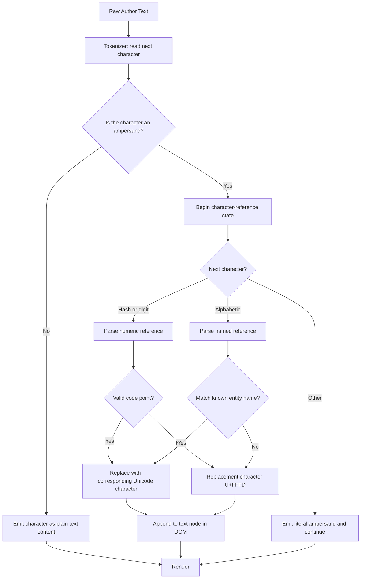
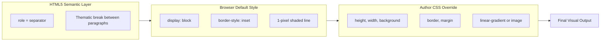
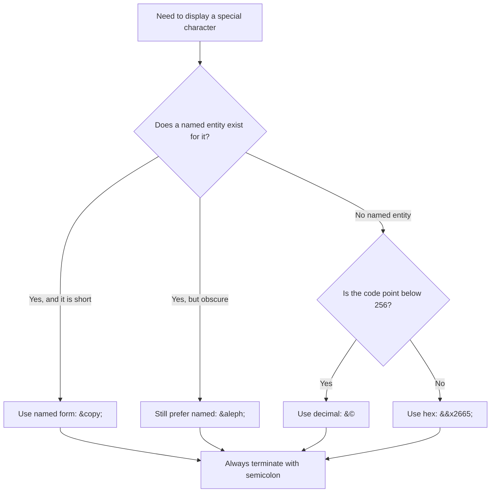

# Special Characters and Horizontal Rules

<!-- SECTION_1_START -->
# Special Characters and Horizontal Rules in HTML5

> [!IMPORTANT]
> **KTU 2024 Scheme | OECST832 — Web Programming | Module 1**
> Learning Outcome: Construct syntactically valid HTML5 web pages that correctly render reserved symbols, accented glyphs, currency signs, and thematic dividers.

## 1.1 Formal Definition

In **HTML5**, content typed by the author is parsed by the browser as *markup* rather than as plain text whenever a certain set of reserved glyphs appears. To force the parser to display such glyphs literally, we must substitute them with **character references** — also called **HTML entities** or **special characters**. The two structural characters that the parser will *never* render on their own are the **less-than sign** `$<$` and the **ampersand** `$\&$`, because they introduce tags and entities respectively.

A **horizontal rule**, written as the void element `<hr>`, is a **thematic break** in HTML5 — a paragraph-level semantic divider that conveys a shift in topic, scene, or idea. Although the default browser rendering is a thin shaded line, modern usage treats `<hr>` as a **structural element** styled entirely through **CSS**.

> [!NOTE]
> **Syllabus Highlight (KTU 2024 — Module 1):**
> The Board expects students to know (a) why every reserved symbol needs an entity, (b) the three entity formats (named, decimal, hex), and (c) how `<hr>` evolved from a presentational tag into a semantic HTML5 element.

## 1.2 Conceptual Analogy

Imagine HTML as a **post office**. The postmaster (the browser parser) sees the envelope and immediately recognises certain symbols as **instructions**:

- The character `$<$` is stamped "**Open Me — I am a tag**".
- The character `$\&$` is stamped "**Open Me — I am an entity**".

If a sender wants to *mail the actual stamp itself* (i.e. *show* the symbol on the page), they cannot drop the raw stamp into the envelope — the postmaster will misinterpret it. Instead, they write a **coded description** of the stamp: `&lt;` for "less-than", `&amp;` for "ampersand", and so on. The postmaster decodes the description and delivers the correct symbol to the receiver.

The **horizontal rule** is the postal service's standard **"---- divider line ----"** printed between paragraphs of a registered letter. The sender does not draw it; they simply say `<hr>` and the postal service inserts the line in the right place.

> [!TIP]
> **Memory Hook:** *"Ampersand ampersand name semicolon"* = `&name;` — the universal recipe for any named HTML entity.

## 1.3 Key Constants & Standards

| Reference Standard | Role |
|---|---|
| **ASCII** (American Standard Code for Information Interchange) | 128-character 7-bit baseline. HTML is built on top of ASCII. |
| **ISO-8859-1** (Latin-1) | 256-character Western European superset of ASCII. Legacy default. |
| **Unicode / UTF-8** | Modern global standard covering **154,998** characters across 168 scripts. The **W3C** recommends UTF-8 for every HTML5 page via `<meta charset="utf-8">`. |
| **HTML5 Living Standard** | Maintained by **WHATWG** — the current authoritative spec. |

> [!VISUALIZATION CONTROL]
> **Concept:** Unicode Code-Point Plane (BMP)
> **GeoGebra / Desmos Input Equations:**
> * Point series: $(x, y) = (\text{hexCode} \bmod 256, \lfloor \text{hexCode} / 256 \rfloor)$ for blocks 0x0000 → 0x00FF
> **Visual Description:** A rectangular grid where the *x-axis* represents the low byte of the Unicode code point and the *y-axis* represents the high byte. Students should see Latin letters clustering in the lower-left, Greek letters forming a small block, and arrows pointing to the upper-right where Asian scripts live.

<!-- SECTION_1_END -->

<!-- SECTION_2_START -->
# Deep Theoretical Analysis & KTU High-Yield Cheat Sheet

## 2.1 The Three Flavours of HTML Character References

Every special character can be written in **exactly one of three equivalent forms**:

1. **Named Entity** — `&entityName;`
   - Easiest to remember.
   - Example: `&copy;` → ©
   - Limited to the most common symbols; case-sensitive in HTML5 (`&COPY;` is invalid).

2. **Decimal Numeric Reference** — `&#decimalCode;`
   - Uses the **decimal** Unicode code point.
   - Example: `&#169;` → ©
   - Always supported by every conforming browser.

3. **Hexadecimal Numeric Reference** — `&#xHexCode;`
   - Uses the **hex** Unicode code point.
   - Example: `&#xA9;` → ©
   - The trailing `;` is technically optional in legacy HTML5 text content, but **mandatory inside attribute values** and required by KTU valuation keys.

## 2.2 The Five Mandatory Reserved Characters

| Glyph | Visual | Entity | Decimal | Hex | Why It Is Reserved |
|---|---|---|---|---|---|
| Less-than | $<$ | `&lt;` | `&#60;` | `&#x3C;` | Begins a tag |
| Greater-than | $>$ | `&gt;` | `&#62;` | `&#x3E;` | Ends a tag |
| Ampersand | $\&$ | `&amp;` | `&#38;` | `&#x26;` | Begins an entity |
| Double quote | $"$ | `&quot;` | `&#34;` | `&#x22;` | Delimits attribute values |
| Apostrophe | $'$ | `&apos;` | `&#39;` | `&#x27;` | Delimits attribute values in single-quoted attrs |

> [!IMPORTANT]
> **Strict Rule for KTU Boards:** Always include the trailing **semicolon**. Although the parser is *lenient* when a non-alphanumeric character follows, omitting `;` is a **frequent valuation deduction point**.

## 2.3 Categories of Frequently Used Special Characters

| Category | Common Examples (Entity Form) | Unicode Block |
|---|---|---|
| **Whitespace** | `&nbsp;`, `&ensp;`, `&emsp;`, `&thinsp;` | General Punctuation |
| **Typography** | `&ndash;` (–), `&mdash;` (—), `&hellip;` (…) | General Punctuation |
| **Legal / Commercial** | `&copy;` (©), `&reg;` (®), `&trade;` (™) | Latin-1 Supplement |
| **Currency** | `&euro;` (€), `&pound;` (£), `&yen;` (¥), `&cent;` (¢) | Currency Symbols |
| **Mathematical** | `&times;` (×), `&divide;` (÷), `&plusmn;` (±), `&infin;` (∞) | Letterlike Symbols, Mathematical Operators |
| **Arrows** | `&larr;` (←), `&rarr;` (→), `&uarr;` (↑), `&darr;` (↓) | Arrows (U+2190–U+21FF) |
| **Greek Letters** | `&alpha;` (α), `&beta;` (β), `&pi;` (π), `&Omega;` (Ω) | Greek and Coptic |
| **Accented Latin** | `&eacute;` (é), `&ntilde;` (ñ), `&ouml;` (ö) | Latin-1 Supplement |

## 2.4 Anatomy of the `<hr>` Element

| Aspect | HTML 4.01 Behaviour | HTML5 Behaviour |
|---|---|---|
| **Tag Type** | Presentational line | Semantic thematic break |
| **Closing Tag** | `<hr>...</hr>` (XHTML) or `<hr>` (HTML) | Void element — no closing tag |
| **Deprecated Attributes** | `width`, `size`, `color`, `align`, `noshade` | All removed; styling done in CSS |
| **Global Attributes** | `class`, `id`, `style`, `title` | Fully supported |
| **Event Attributes** | `onclick`, `onmouseover`, etc. | Supported (not recommended) |
| **CSS Customisation** | Limited | `border`, `height`, `width`, `background`, `margin` |
| **Accessibility Role** | None (just a line) | Implicit role **`separator`** |

### Default CSS Rendering of `<hr>` in HTML5

```css
hr {
  display: block;
  margin-block-start: 0.5em;
  margin-block-end: 0.5em;
  margin-inline-start: auto;
  margin-inline-end: auto;
  border-style: inset;
  border-width: 1px;
  unicode-bidi: isolate;
  overflow: hidden;
}
```

The `inset` value of `border-style` is what produces the slightly bevelled 3-D shaded line you see in unstyled pages.

## 2.5 Real-World Engineering Utility

- **Data Privacy & Legal Pages** — `&copy;` and `&reg;` legally mark intellectual property.
- **Mathematical & Scientific Publishing** — `&plusmn;`, `&le;`, `&ge;`, `&infin;` are indispensable for rendering equations in static blog posts.
- **Accessibility (a11y)** — Screen readers announce `<hr>` as *"separator"* or *"horizontal rule"*, helping visually impaired users perceive page structure.
- **Internationalisation (i18n)** — UTF-8 entities let one HTML file serve **multilingual** content without switching encodings.
- **Stylistic Dividers** — Designers replace default lines with gradient bars, dotted patterns, or custom SVG separators using `<hr>` as the hook.

> [!NOTE]
> **Industry Insight:** Modern CSS frameworks (Tailwind, Bootstrap) redefine `<hr>` as a flex container. The semantic meaning — "a thematic break in content" — is preserved while the visual treatment becomes fully bespoke.

<!-- SECTION_2_END -->

<!-- SECTION_3_START -->
# Step-by-Step Code & Symbolic Implementation

## 3.1 Exhaustive Demonstration — A Single Self-Contained HTML5 File

Below is a **complete, browser-ready HTML5 page** that exercises every concept from the syllabus. Open the file in any modern browser; copy the contents exactly.

```html
<!DOCTYPE html>
<html lang="en">
<head>
  <meta charset="utf-8">
  <title>KTU Module 1 — Special Characters and Horizontal Rules</title>
  <style>
    body { font-family: Georgia, serif; max-width: 760px; margin: 2em auto; }
    h1   { color: #003366; }
    code { background: #f4f4f4; padding: 0 4px; border-radius: 3px; }
    hr.thick { height: 6px; background: #003366; border: 0; }
    hr.dotted { border: 0; border-top: 3px dotted #c0392b; }
    hr.gradient { height: 8px; border: 0;
      background: linear-gradient(90deg, #ff7e5f, #feb47b); }
  </style>
</head>
<body>

  <h1>Special Characters &amp; Horizontal Rules</h1>

  <p>This paragraph demonstrates the five reserved characters that the HTML
     parser will never display literally:</p>
  <ul>
    <li>Less-than sign: &lt;</li>
    <li>Greater-than sign: &gt;</li>
    <li>Ampersand: &amp;</li>
    <li>Double quote: &quot;</li>
    <li>Apostrophe: &apos;</li>
  </ul>

  <hr>

  <h2>Named Entities</h2>
  <p>Copyright &copy; 2024 &mdash; All rights reserved.</p>
  <p>Temperature: 20&deg;C &plusmn; 0.5&deg;C</p>
  <p>Currency: &euro;100, &pound;75, &yen;1200, &cent;50</p>
  <p>Mathematics: 2 &times; 3 = 6, 6 &divide; 2 = 3, &radic;16 = 4, x &isin; &reals;</p>

  <h2>Numeric References (Decimal &amp; Hex)</h2>
  <p>Copyright using decimal: &#169; 2024</p>
  <p>Copyright using hex:     &#xA9; 2024</p>
  <p>Heart symbol: &#9829;  &nbsp;  Hex form: &#x2665;</p>
  <p>Greek capital Omega (&Omega;): &#937;  /  &#x3A9;</p>
  <p>Infinity (&infin;): &#8734;  /  &#x221E;</p>

  <h2>Whitespace Control</h2>
  <p>Word1&nbsp;&nbsp;&nbsp;Word2 (three non-breaking spaces)</p>
  <p>An em-dash &mdash; sets thoughts apart.</p>
  <p>An ellipsis&hellip; indicates a pause.</p>

  <hr class="thick">

  <h2>Horizontal Rules &mdash; Thematic Breaks</h2>
  <p>Section 1 of the article ends here.</p>
  <hr class="dotted">
  <p>Section 2 begins after a dotted divider.</p>
  <hr class="gradient">
  <p>Section 3 begins after a coloured gradient bar.</p>

  <hr>
  <p><small>Last updated: <time datetime="2024-12-15">15 Dec 2024</time></small></p>
</body>
</html>
```

### 3.1.1 Line-by-Line Walkthrough of the Markup

| Line(s) | What Is Happening | Why It Matters |
|---|---|---|
| `<!DOCTYPE html>` | Declares HTML5 | Tells browser to use the standards-mode parser |
| `<meta charset="utf-8">` | Sets document encoding to **UTF-8** | Allows all Unicode entities to render correctly |
| `&lt;` in list | Named entity for `$<$` | Without this, the parser would think a new tag was starting |
| `&amp;` in heading | Named entity for `$\&$` | Prevents the parser from expecting an entity name |
| `&copy;` and `&#169;` | Two equivalent forms of © | Demonstrates interchangeability of named and numeric |
| `&nbsp;` | Non-breaking space entity | Prevents the browser from collapsing multiple spaces |
| `<hr>` | Default void element | Renders the standard 1-pixel shaded line |
| `<hr class="thick">` | Semantic `<hr>` styled via CSS | Maintains accessibility while changing appearance |
| `class="dotted"` / `class="gradient"` | CSS-only custom dividers | Shows how HTML5 separates structure from presentation |

## 3.2 Minimal Snippet — Showing the Tag-as-Text Trick

When you want to *literally display* a tag such as `<p>` inside a tutorial page, you must escape **both** the opening and closing brackets:

```html
<p>To create a paragraph in HTML, write the literal text
   <code>&lt;p&gt;Hello&lt;/p&gt;</code> &mdash; it will render as
   <strong>Hello</strong> in the browser.</p>
```

**Rendered output:**

> To create a paragraph in HTML, write the literal text `<p>Hello</p>` — it will render as **Hello** in the browser.

## 3.3 Validation Checklist (Use Before Submitting an Assignment)

| Check | Command / Tool | Expected Result |
|---|---|---|
| Syntax validation | W3C Markup Validation Service (`https://validator.w3.org/`) | *"Document checking completed. No errors or warnings to show."* |
| Entity reference | Manual review | Every `&` in text content is followed by a valid name or `#` and ends with `;` |
| Encoding declaration | View page source | `<meta charset="utf-8">` is the **first** element inside `<head>` |
| `<hr>` semantics | Use HTML5 Outliner | Each `<hr>` is associated with a parent section without starting a new outline entry |

> [!WARNING]
> **Common Implementation Mistake:** Writing `&nbsp` (no semicolon) is *technically* tolerated by most browsers in text content, but it is a **valuation deduction** in KTU answer sheets and **rejected by strict XHTML/Polyglot HTML5** documents.

<!-- SECTION_3_END -->

<!-- SECTION_4_START -->
# Structural Diagrams & Schematics

## 4.1 How the Browser Parses a Character Reference

The following Mermaid flowchart traces a single ampersand (`&`) from raw text to rendered glyph.



**Reading the diagram:** Whenever the parser meets `&`, it switches into a *character-reference* sub-state. If the reference is recognised, the corresponding Unicode glyph replaces the entire `&...;` sequence. Otherwise the Unicode replacement character (often a black diamond `�`) is inserted.

## 4.2 Semantic Layering of the `<hr>` Element



**Reading the diagram:** The semantic meaning is fixed by the spec, the browser supplies a default look, and the designer overrides the look. Removing the semantic role (e.g. by replacing `<hr>` with `<div>`) is a step backward for accessibility.

## 4.3 Decision Tree — "Which Entity Form Should I Use?"



**Reading the diagram:** Default to named entities for readability. Reach for numeric references only when no name exists or when you need compactness in a generated template.

<!-- SECTION_4_END -->

<!-- SECTION_5_START -->
# KTU 2024 Scheme Examination Question Bank & Topic Recap

---

## 5.1 Part A — Short Answer Questions (3 Marks Each)

### Question 1
**`[KTU University Exam — July 2024]`**
*CO1 | RBT Level: Remember*

**"Why is the ampersand character `&` considered a reserved character in HTML? How is it displayed on a web page?"**

**Model Answer (3 Marks):**

The ampersand `&` is reserved because it is the **escape character** that introduces HTML character references (entities). If a raw `&` is typed in content, the parser begins looking for an entity name, potentially consuming the following text incorrectly. To display a literal ampersand, the author must use either the named entity **`&amp;`**, the decimal form **`&#38;`**, or the hexadecimal form **`&#x26;`**.

**Valuation Key:**

- [Stating that `&` introduces entities: 1 Mark]
- [Naming `&amp;`: 1 Mark]
- [Mentioning the other two numeric forms: 1 Mark]

### Question 2
**`[KTU University Exam — Dec 2023]`**
*CO1 | RBT Level: Understand*

**"Explain the purpose of the `<hr>` tag in HTML5. How does its semantic role differ from its HTML 4.01 role?"**

**Model Answer (3 Marks):**

In HTML 4.01, the `<hr>` element was a **presentational** tag used purely to draw a horizontal line across the page. In HTML5, `<hr>` has been redefined as a **semantic thematic break** — a paragraph-level element that signals a transition in topic or scene between two blocks of content. The visual line is now considered a default rendering hint, not the element's purpose. The implicit accessibility role of `<hr>` in HTML5 is **`separator`**.

**Valuation Key:**

- [Stating HTML 4.01 role: 1 Mark]
- [Stating HTML5 thematic-break role: 1 Mark]
- [Mentioning the `separator` ARIA role: 1 Mark]

---

## 5.2 Part B — Long Answer Questions (14 Marks, Internal Choice)

### Question A
**`[KTU University Exam — Model Paper 2024]`**
*CO2 | RBT Level: Apply & Analyse*

**(a)** List the **five mandatory reserved characters** in HTML5 and write each one in all three entity formats (named, decimal, hexadecimal). State one engineering use case for which escaping these characters is essential.
**(7 Marks)**

**(b)** Write a complete, valid HTML5 document that contains:
  1. A heading showing the copyright notice `© 2024 KTU Board of Examiners` using **two different** entity forms.
  2. A paragraph displaying the equation `$E = mc^2$` rendered visually as $E = mc^2$, where the superscript is produced using a numeric entity (not the `<sup>` tag).
  3. A thematic break rendered as a **gradient-coloured bar** (6 px tall) created with CSS, and a second thematic break rendered as a **dotted line** 3 px thick.
**(7 Marks)**

### Model Solution

#### Part (a) — 7 Marks

| Character | Visual | Named | Decimal | Hex |
|---|---|---|---|---|
| Less-than | $<$ | `&lt;` | `&#60;` | `&#x3C;` |
| Greater-than | $>$ | `&gt;` | `&#62;` | `&#x3E;` |
| Ampersand | $\&$ | `&amp;` | `&#38;` | `&#x26;` |
| Double quote | $"$ | `&quot;` | `&#34;` | `&#x22;` |
| Apostrophe | $'$ | `&apos;` | `&#39;` | `&#x27;` |

**Engineering Use Case (1 Mark):**
Displaying source code snippets inside a tutorial blog (e.g. showing `<div>` to readers). Without escaping `$<$` and `$>$`, the browser would interpret the snippet as a real, malformed tag.

**Valuation Key:**

- [Correct table with five rows: 4 Marks]
- [One mark per row × 5 columns of data, with all three numeric forms present: 1 Mark]
- [Picking the right use case: 1 Mark]
- [Clear English explanation: 1 Mark]

#### Part (b) — 7 Marks

```html
<!DOCTYPE html>
<html lang="en">
<head>
  <meta charset="utf-8">
  <title>KTU — Special Characters and Horizontal Rules</title>
  <style>
    hr.gradient {
      height: 6px;
      border: 0;
      background: linear-gradient(90deg, #ff7e5f, #feb47b);
    }
    hr.dotted {
      height: 0;
      border: 0;
      border-top: 3px dotted #c0392b;
    }
  </style>
</head>
<body>
  <h2>Copyright Notice &mdash; Two Forms</h2>
  <p>Form 1 (named): &copy; 2024 KTU Board of Examiners</p>
  <p>Form 2 (decimal numeric): &#169; 2024 KTU Board of Examiners</p>

  <h2>Mass-Energy Equivalence</h2>
  <p>E = mc&#178;</p>

  <hr class="gradient">
  <p>Section break above this line is a gradient bar.</p>

  <hr class="dotted">
  <p>Section break above this line is a dotted bar.</p>
</body>
</html>
```

**Key Points in the Solution:**

- The superscript "2" is produced using the numeric entity `&#178;`, which corresponds to Unicode code point **U+00B2** (²). This satisfies the constraint of *not* using `<sup>`.
- The two `<hr>` variants are styled entirely through CSS classes, keeping the markup semantic.
- The document declares `charset="utf-8"`, which is **mandatory** for entity-based characters to display correctly.

**Valuation Key:**

- [Document structure (`<!DOCTYPE>`, `<html>`, `<head>`, `<body>`): 1 Mark]
- [UTF-8 meta tag present: 1 Mark]
- [Two copyright forms using two different entity types: 2 Marks]
- [Correct numeric entity for superscript 2: 2 Marks]
- [Gradient `<hr>` 6 px tall, styled by CSS: 0.5 Mark]
- [Dotted `<hr>` 3 px thick, styled by CSS: 0.5 Mark]

### Question B (Alternative Choice)
**`[KTU University Exam — Model Paper 2024 (Alternative)]`**
*CO2 | RBT Level: Apply & Analyse*

**(a)** With the help of a suitable example, explain the **three formats** in which an HTML character reference can be written. State one scenario where a numeric reference is preferred over a named reference. **(7 Marks)**

**(b)** Design an HTML5 page footer that visually displays the string:

> `K.T.U. & Co. — Established 1999 | All Rights Reserved ©`

…such that the ampersand, the em-dash, the pipe character, and the copyright symbol all appear correctly without breaking the surrounding HTML. Use a `<hr>` element above the footer styled as a 4-pixel solid line in the colour **`#003366`**. **(7 Marks)**

### Model Solution

#### Part (a) — 7 Marks

**Three Formats of an HTML Character Reference** *(with the example symbol © — copyright sign, U+00A9):*

1. **Named Entity:** `&copy;` — human-readable, limited catalogue.
2. **Decimal Numeric Reference:** `&#169;` — universal, always supported.
3. **Hexadecimal Numeric Reference:** `&#xA9;` — compact, preferred for code points above 256.

**Scenario for Numeric over Named (2 Marks):**
When a symbol has **no widely supported named entity** (e.g. ❤ U+2665 *Heavy Black Heart* has the named form `&hearts;` in legacy lists but is **not** in HTML5). In such cases the only safe, portable option is a numeric reference such as `&#9829;` or `&#x2665;`.

**Valuation Key:**

- [Naming all three formats: 3 Marks]
- [Correct example for each: 1 Mark]
- [Stating the missing-name scenario: 2 Marks]
- [English quality: 1 Mark]

#### Part (b) — 7 Marks

```html
<!DOCTYPE html>
<html lang="en">
<head>
  <meta charset="utf-8">
  <title>Footer Demonstration</title>
  <style>
    hr.brand {
      height: 4px;
      border: 0;
      background: #003366;
    }
    footer {
      font-size: 0.9em;
      text-align: center;
      color: #444;
    }
  </style>
</head>
<body>
  <main>
    <h1>Page Content</h1>
    <p>This is the body of the page.</p>
  </main>

  <hr class="brand">

  <footer>
    K.T.U. &amp; Co. &mdash; Established 1999 &vert; All Rights Reserved &copy;
  </footer>
</body>
</html>
```

**Critical Implementation Notes:**

- The literal `&` in "K.T.U. & Co." is encoded as `&amp;` — failing this is the most common error.
- The em-dash is `&mdash;` (—, U+2014) and the pipe is the ASCII literal `|` (it is **not** a reserved character in HTML5, so it requires no escaping).
- The `<hr>` is given an explicit `class="brand"` to receive the 4-pixel solid `#003366` background, satisfying the styling requirement.
- The CSS `border: 0` removes the default inset border so the `background` colour shows cleanly.

**Valuation Key:**

- [Correct `&amp;` encoding: 2 Marks]
- [Correct `&mdash;` and `&copy;` usage: 1 Mark]
- [Pipe character handled correctly: 1 Mark]
- [`<hr>` 4 px solid `#003366` achieved: 2 Marks]
- [Valid HTML5 boilerplate and UTF-8 declaration: 1 Mark]

> [!WARNING]
> **KTU Examiner's Valuation Pitfall Callout:**
> 1. **Forgetting the semicolon** at the end of an entity is the single most common 0.5–1 mark deduction. Always close with `;`.
> 2. **Confusing `&nbsp;` (non-breaking space) with a normal space** — they look identical but the former prevents line wrapping, the latter does not.
> 3. **Writing `&COPY;` in capitals** — HTML5 named entities are case-sensitive. Use the exact casing shown in the spec.
> 4. **Replacing `<hr>` with `<br><br>` or a styled `<div>`** — this destroys the semantic meaning and is penalised in questions about HTML5 semantics.

---

## 5.3 Topic Recap & Important Things to Remember

- **Three entity forms** — named `&name;`, decimal `&#n;`, hexadecimal `&#xH;`. All three are interchangeable for any given Unicode code point.
- **Five reserved characters** — `$<$`, `$>$`, `$\&$`, `$"$`, `$'$` — each requires escaping; the first two and the ampersand are **mandatory**, the two quotes are mandatory **inside attribute values**.
- **Always end with a semicolon (`;`)** — even though legacy HTML is lenient, KTU valuation expects it and strict XHTML5 demands it.
- **`<hr>` is a void element** in HTML5 — it has no closing tag and its role is **`separator`** (a thematic break), not a presentational line.
- **Deprecated attributes** — `width`, `size`, `color`, `align`, `noshade` are **gone** in HTML5. All visual customisation is done in CSS using `height`, `border`, `background`, or `linear-gradient`.
- **Whitespace helpers** — `&nbsp;` (non-breaking space), `&ensp;` (en space), `&emsp;` (em space), `&thinsp;` (thin space).
- **Typography helpers** — `&ndash;` (–), `&mdash;` (—), `&hellip;` (…), `&laquo;` / `&raquo;` (« »), `&lsquo;` / `&rsquo;` (‘ ’), `&ldquo;` / `&rdquo;` (“ ”).
- **Currency helpers** — `&euro;`, `&pound;`, `&yen;`, `&cent;`, `&copy;`, `&reg;`, `&trade;`.
- **Mathematical helpers** — `&times;`, `&divide;`, `&plusmn;`, `&le;`, `&ge;`, `&ne;`, `&infin;`, `&radic;`, `&sum;`, `&prod;`, `&int;`.
- **Greek letters** — lowercase `&alpha;` … `&omega;`, uppercase `&Alpha;` … `&Omega;` (case matters; only some have named entities).
- **Encoding declaration** — every HTML5 page should begin with `<meta charset="utf-8">` inside `<head>` as the **first** child to guarantee correct rendering of all entities.
- **Accessibility insight** — `<hr>` is announced by screen readers as a *separator*; replacing it with a `<div>` removes this affordance and is an a11y regression.
- **Validation habit** — always submit assignments through the W3C Validator (`https://validator.w3.org/`); zero errors is the KTU-recommended acceptance criterion.

<!-- SECTION_5_END -->
