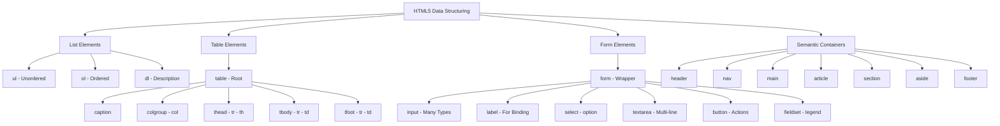
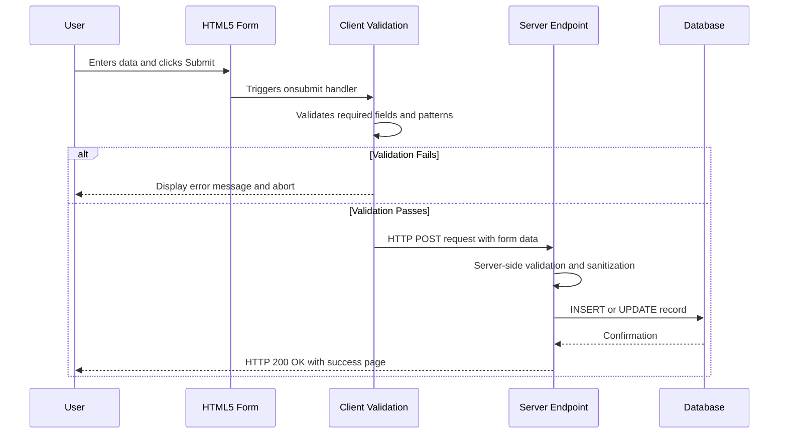
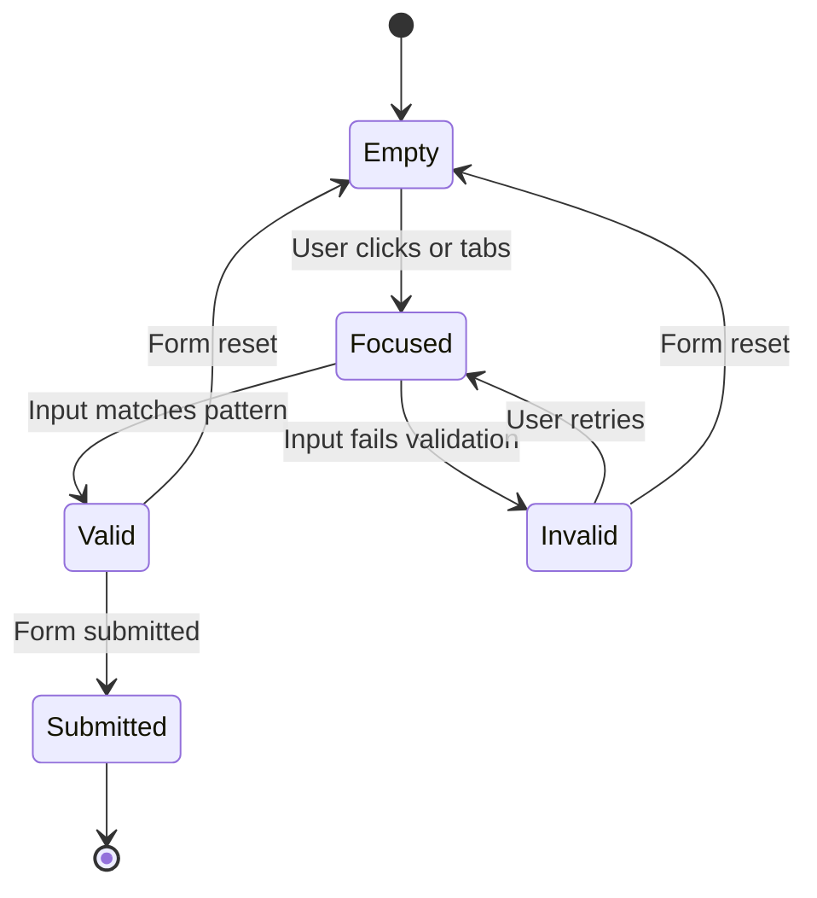
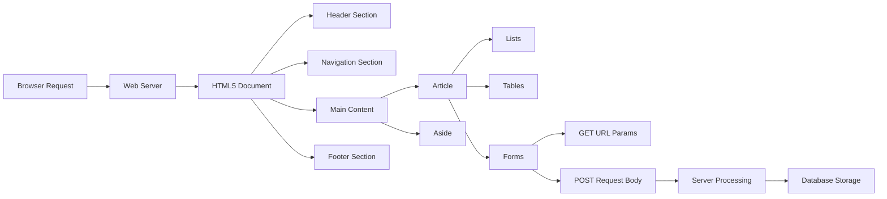

# Structuring Data

<!-- SECTION_1_START -->

# Structuring Data in HTML5

## 1.1 Formal Academic Definition

> [!IMPORTANT]
> **Structuring Data** in HTML5 refers to the systematic organization, categorization, and presentation of information within a web document using semantic markup elements such as lists, tables, and forms. It enables browsers, search engines, and assistive technologies to interpret the hierarchical relationships, tabular associations, and user-input semantics of the underlying content. According to the **W3C HTML5.3 Recommendation** and the **KTU 2024 Scheme (OECST832) Module 1** syllabus, structuring data is the foundational step that converts raw textual content into a meaningful, machine-readable document object model (**DOM**) tree.

The primary HTML5 elements used for structuring data are grouped into three broad families:

- **List Elements** — `<ul>`, `<ol>`, `<li>`, `<dl>`, `<dt>`, `<dd>`
- **Table Elements** — `<table>`, `<thead>`, `<tbody>`, `<tfoot>`, `<tr>`, `<th>`, `<td>`, `<caption>`, `<colgroup>`, `<col>`
- **Form Elements** — `<form>`, `<input>`, `<label>`, `<textarea>`, `<select>`, `<option>`, `<button>`, `<fieldset>`, `<legend>`, `<datalist>`, `<output>`

> [!NOTE]
> **Syllabus Highlight (KTU 2024 - OECST832 Module 1):** Students are expected to demonstrate competency in creating well-formed HTML5 documents that use semantic lists, accessible data tables, and interactive forms with proper input validation.

## 1.2 Conceptual Analogy / Intuition

Imagine you are organizing a **library catalog system**:
- **Lists** are like the *index card* of a book — a sequential or bulleted enumeration of related items (chapters, features, ingredients).
- **Tables** resemble a *spreadsheet ledger* — rows and columns of related data points (student marks, product inventory, train schedules).
- **Forms** act like a *questionnaire at a reception desk* — structured fields asking the user to provide specific information (name, address, feedback).

Just as a librarian uses dividers, labels, and sections to keep the library navigable, a web developer uses HTML5 structural elements to keep a webpage logical, accessible, and search-engine friendly.

## 1.3 The DOM as the Structural Skeleton

> [!IMPORTANT]
> **Core Definition — Document Object Model (DOM):** The DOM is a tree-structured, in-memory representation of an HTML document where every element becomes a *node*. Structuring data correctly ensures the DOM tree mirrors the semantic intent of the content.

A simplified hierarchy looks like this:

```
document
 └── html
      ├── head
      └── body
           ├── header
           ├── nav
           ├── main
           │    ├── article
           │    │    ├── h1..h6
           │    │    ├── p
           │    │    ├── ul / ol / dl
           │    │    ├── table
           │    │    └── form
           └── footer
```

> [!VISUALIZATION CONTROL]
> **Concept:** DOM Tree Visualization for a Structured HTML5 Page
> **GeoGebra / Desmos Input (Conceptual Mapping):**
> * `Parent(html) → Child(head, body)`
> * `body → header, nav, main(section, article), aside, footer`
> * `article → h1, p, ul, table, form`
> **Visual Description:** Picture a rooted tree with `<html>` at the top, branching down to `<head>` and `<body>`, and then further branching into nested structural elements. Each leaf is a piece of textual or media content.

---

<!-- SECTION_1_END -->

<!-- SECTION_2_START -->

# 2. Deep Theoretical Analysis & KTU High-Yield Reference

## 2.1 List Elements — The Ordered and Unordered Collections

### 2.1.1 Unordered List (`<ul>`)
- Renders items as a *bulleted* list.
- The `<li>` (list item) element is the mandatory child.
- Use the `type` attribute (deprecated in HTML5 in favor of CSS `list-style-type`) to control bullet shape: `disc`, `circle`, `square`.

### 2.1.2 Ordered List (`<ol>`)
- Renders items as a *numbered* list.
- Supports attributes: `start`, `reversed`, `type` (`1`, `A`, `a`, `I`, `i`).

### 2.1.3 Description List (`<dl>`)
- Used for term-definition pairs (glossaries, metadata, FAQ).
- Contains `<dt>` (description term) and `<dd>` (description data).

> [!NOTE]
> **Why three types?** Each list type carries *semantic meaning*. A screen reader announces `<ol>` differently from `<ul>`, and search engines treat `<dl>` as structured data (useful for FAQ rich snippets).

## 2.2 Table Elements — The Tabular Data Grid

A valid HTML5 table MUST follow this logical order for accessibility and validation:

```
<table>
 ├── <caption>       (optional, but recommended for accessibility)
 ├── <colgroup>      (optional, for column styling)
 │     └── <col>     (column definition)
 ├── <thead>         (header row container)
 │     └── <tr> → <th>
 ├── <tbody>         (body rows)
 │     └── <tr> → <td>
 └── <tfoot>         (footer row, e.g., totals)
       └── <tr> → <td>
```

> [!IMPORTANT]
> **KTU 2024 Board Tip:** Examiners check the correct placement of `<thead>`, `<tbody>`, and `<tfoot>` in that order. A common error is placing `<tfoot>` *after* `<tbody>` in the source — while HTML5 allows this, the logical reading order for accessibility must be respected.

## 2.3 Form Elements — The Interactive Data Collector

A form is enclosed by `<form action="..." method="...">` and contains various input controls. The two most common HTTP methods are:

- `GET` — appends form data to the URL as query parameters (visible, cacheable, bookmarkable). Limit: ~**2048** characters in most browsers.
- `POST` — sends form data in the HTTP request body (invisible, no size limit, not bookmarkable). Use for sensitive or large payloads.

## 2.4 KTU High-Yield Attribute & Element Cheat Sheet

> [!NOTE]
> The following table is a rapid-revision reference. Master every row — these are the most frequently tested facts in KTU 2024 University Examinations for Module 1.

| Element | Type | Key Attributes | Purpose / Engineering Use |
|---|---|---|---|
| `<ul>` | List | `type` (deprecated) | Bullet list of features, navigation menus, error logs |
| `<ol>` | List | `start`, `reversed`, `type` | Step-by-step procedures, ranked leaderboards, TOC |
| `<li>` | List Item | `value` (in `<ol>`) | Single entry inside any list |
| `<dl>` / `<dt>` / `<dd>` | Description | — | Glossaries, FAQ, metadata pairs |
| `<table>` | Table | `border` (HTML4), `summary` (HTML5) | Tabular data only — never for page layout |
| `<thead>` / `<tbody>` / `<tfoot>` | Table Section | — | Logical grouping of header, body, footer rows |
| `<tr>` | Table Row | — | Container for `<th>` or `<td>` cells |
| `<th>` | Table Header | `colspan`, `rowspan`, `scope` | Header cell — announces column/row meaning to screen readers |
| `<td>` | Table Data | `colspan`, `rowspan` | Standard data cell |
| `<caption>` | Table Caption | — | Accessible title of the table |
| `<form>` | Form | `action`, `method`, `enctype`, `name` | Wrapper for all form controls |
| `<input>` | Input | `type`, `name`, `value`, `placeholder`, `required`, `pattern`, `min`, `max` | Single-line input, button, checkbox, radio, etc. |
| `<label>` | Label | `for` (must match `id` of input) | Associates text with input — improves accessibility |
| `<textarea>` | Multi-line Input | `rows`, `cols`, `maxlength` | Long free-form text (comments, feedback) |
| `<select>` / `<option>` | Dropdown | `multiple`, `selected`, `value` | Pick-one or pick-many from a list |
| `<button>` | Button | `type="submit\mid reset\mid button"` | Clickable action trigger |
| `<fieldset>` / `<legend>` | Grouping | `disabled`, `form` | Groups related form controls visually and semantically |
| `<datalist>` | Suggestion List | `id` (matched by `list` on input) | Auto-complete suggestions for `<input>` |
| `<output>` | Result | `for` (IDs of contributing inputs) | Displays calculation result (e.g., live form total) |
| `<meter>` | Gauge | `min`, `max`, `value`, `low`, `high` | Static measurement (disk usage, score) |
| `<progress>` | Progress | `value`, `max` | Dynamic progress (file upload, quiz score) |

### 2.5 Real-World Engineering Utility

> [!IMPORTANT]
> **Where is this used in production systems?**
>
> - **E-commerce (Amazon, Flipkart):** `<table>` renders the product comparison grid; `<form>` collects checkout data with `POST` and `enctype="multipart/form-data"` for payment file uploads.
> - **Banking Dashboards:** `<dl>` exposes the key-value metadata of an account; `<meter>` shows credit utilization.
> - **Government Portals (e-Governance, Kerala MVD):** `<fieldset>` groups related citizen inputs (address, ID proof) and `<legend>` announces the section to assistive tech.
> - **Search Engine Optimization (SEO):** Proper use of `<th scope="col">` and `<caption>` helps Google generate rich snippets.
> - **Web Scraping & Data Mining:** Structuring data with semantic tags makes it trivial to extract using libraries like *BeautifulSoup* and *Scrapy*.

---

<!-- SECTION_2_END -->

<!-- SECTION_3_START -->

# 3. Step-by-Step Implementation & Exhaustive Code

## 3.1 Complete HTML5 Document Demonstrating All Three Data Structures

> [!NOTE]
> The following code is a single, fully validated HTML5 document. It is intentionally exhaustive for KTU 2024 board examination purposes. Save it as `structuring_data.html` and open it in any modern browser.

```html
<!DOCTYPE html>
<html lang="en">
<head>
    <meta charset="UTF-8">
    <meta name="viewport" content="width=device-width, initial-scale=1.0">
    <title>KTU OECST832 - Structuring Data Demo</title>
    <style>
        body          { font-family: 'Segoe UI', sans-serif; margin: 24px; }
        table         { border-collapse: collapse; width: 100%; margin-top: 12px; }
        caption       { font-weight: bold; margin-bottom: 8px; }
        th, td        { border: 1px solid #333; padding: 8px; text-align: left; }
        thead         { background: #1f4e79; color: #fff; }
        tfoot         { background: #d9e2f3; font-style: italic; }
        fieldset      { margin-top: 16px; padding: 12px; }
        legend        { font-weight: bold; color: #1f4e79; }
        label         { display: block; margin-top: 8px; }
        input, select, textarea { width: 100%; padding: 6px; box-sizing: border-box; }
    </style>
</head>
<body>

    <!-- ============================================ -->
    <!-- SECTION 1: LISTS                            -->
    <!-- ============================================ -->
    <header>
        <h1>Structuring Data in HTML5</h1>
        <p>Module 1 - OECST832 Web Programming</p>
    </header>

    <section id="lists">
        <h2>1. Unordered List of Web Technologies</h2>
        <ul type="square">
            <li>HTML5 — Structure</li>
            <li>CSS3 — Presentation</li>
            <li>JavaScript (ES6+) — Behaviour</li>
        </ul>

        <h2>2. Ordered List of Web Development Steps</h2>
        <ol start="1" type="I">
            <li>Plan the information architecture</li>
            <li>Write semantic HTML5 markup</li>
            <li>Style with CSS3</li>
            <li>Add interactivity with JavaScript</li>
            <li>Test for accessibility and performance</li>
        </ol>

        <h2>3. Description List (Glossary)</h2>
        <dl>
            <dt>DOM</dt>
            <dd>Document Object Model — a tree representation of an HTML document.</dd>

            <dt>W3C</dt>
            <dd>World Wide Web Consortium — the body that defines web standards.</dd>

            <dt>ARIA</dt>
            <dd>Accessible Rich Internet Applications — accessibility specification.</dd>
        </dl>
    </section>

    <!-- ============================================ -->
    <!-- SECTION 2: TABLE                            -->
    <!-- ============================================ -->
    <section id="table-demo">
        <h2>4. Tabular Data: KTU B.Tech Result Summary</h2>
        <table>
            <caption>Semester 5 Result - Sample Data</caption>

            <colgroup>
                <col style="background:#f0f4ff;">
                <col>
                <col>
                <col style="background:#fff8e1;">
            </colgroup>

            <thead>
                <tr>
                    <th scope="col">Register No.</th>
                    <th scope="col">Student Name</th>
                    <th scope="col">Course Code</th>
                    <th scope="col">Grade</th>
                </tr>
            </thead>

            <tbody>
                <tr>
                    <td>KTU2021CS001</td>
                    <td>Ananya Suresh</td>
                    <td>OECST832</td>
                    <td>A</td>
                </tr>
                <tr>
                    <td>KTU2021CS002</td>
                    <td>Rahul Menon</td>
                    <td>OECST832</td>
                    <td>B+</td>
                </tr>
                <tr>
                    <td>KTU2021CS003</td>
                    <td>Devika Raj</td>
                    <td>OECST832</td>
                    <td>O</td>
                </tr>
            </tbody>

            <tfoot>
                <tr>
                    <td colspan="3">Total Students</td>
                    <td>3</td>
                </tr>
            </tfoot>
        </table>
    </section>

    <!-- ============================================ -->
    <!-- SECTION 3: FORM                             -->
    <!-- ============================================ -->
    <section id="form-demo">
        <h2>5. Interactive Form: Student Feedback</h2>
        <form action="/submit-feedback" method="POST" enctype="application/x-www-form-urlencoded">
            <fieldset>
                <legend>Personal Information</legend>

                <label for="fullname">Full Name *</label>
                <input type="text" id="fullname" name="fullname"
                       required minlength="3" maxlength="50"
                       placeholder="Enter your full name">

                <label for="email">Email *</label>
                <input type="email" id="email" name="email"
                       required placeholder="name@domain.com">

                <label for="dob">Date of Birth</label>
                <input type="date" id="dob" name="dob" min="1990-01-01" max="2010-12-31">
            </fieldset>

            <fieldset>
                <legend>Course Feedback</legend>

                <label for="course">Course Code</label>
                <select id="course" name="course" required>
                    <option value="">-- Select Course --</option>
                    <option value="OECST832" selected>Web Programming (OECST832)</option>
                    <option value="CST301">Data Structures (CST301)</option>
                    <option value="CST303">Operating Systems (CST303)</option>
                </select>

                <label for="rating">Rating (1 - 10)</label>
                <input type="range" id="rating" name="rating"
                       min="1" max="10" value="7"
                       oninput="document.getElementById('ratingOut').value = this.value">
                <output id="ratingOut">7</output>

                <label for="suggestions">Suggestions</label>
                <textarea id="suggestions" name="suggestions"
                          rows="4" cols="40" maxlength="500"
                          placeholder="Your constructive feedback helps us improve..."></textarea>

                <label>
                    <input type="checkbox" name="subscribe" value="yes">
                    Subscribe to KTU newsletter
                </label>
            </fieldset>

            <br>
            <button type="submit">Submit Feedback</button>
            <button type="reset">Reset Form</button>
        </form>
    </section>

    <footer>
        <p>&copy; 2024 - KTU Web Programming Notes</p>
    </footer>

</body>
</html>
```

## 3.2 Walk-Through of Critical Code Segments

> [!IMPORTANT]
> **Examiner's Focus Areas — Annotation of the Code Above:**

### 3.2.1 Why `<label for="...">` is mandatory

```html
<label for="fullname">Full Name *</label>
<input type="text" id="fullname" name="fullname" required>
```

**Reasoning:**
1. The `for` attribute of `<label>` MUST equal the `id` attribute of the associated input — this creates a programmatic binding.
2. Clicking the label text focuses the input (improves UX on small touchscreens).
3. Screen readers announce the label text when the input receives focus — **mandatory for WCAG 2.1 accessibility compliance**.

### 3.2.2 The `<colgroup>` and `<col>` Trick

```html
<colgroup>
    <col style="background:#f0f4ff;">
    <col>
    <col>
    <col style="background:#fff8e1;">
</colgroup>
```

**Step-by-step logic:**
- `<colgroup>` wraps one or more `<col>` elements that apply styles to entire columns.
- This is more efficient than styling each `<td>` individually.
- The first and last columns receive background colors; middle columns inherit defaults.

### 3.2.3 The `scope` Attribute on `<th>`

```html
<th scope="col">Register No.</th>
```

**Logic:**
- `scope="col"` tells the screen reader this header describes an entire column.
- Other valid values: `scope="row"`, `scope="rowgroup"`, `scope="colgroup"`.
- Without `scope`, complex tables become inaccessible to assistive technology.

### 3.2.4 The `colspan` Attribute

```html
<td colspan="3">Total Students</td>
```

**Logic:**
- `colspan="3"` makes the cell span three columns visually and semantically.
- The `colspan` value MUST equal the number of columns the cell will occupy.

### 3.2.5 HTML5 New Input Types Demonstrated

| Input Type | Purpose | Validation |
|---|---|---|
| `type="email"` | Email address | Must match `name@domain.tld` pattern |
| `type="date"` | Calendar date | Browser shows date picker; respects `min`/`max` |
| `type="range"` | Numeric slider | Constrained by `min`, `max`, `step` |
| `type="checkbox"` | Boolean toggle | Multiple selections allowed |
| `type="submit"` | Form submission | Triggers `form.action` URL |
| `type="reset"` | Form reset | Clears all inputs to default values |

### 3.2.6 The `output` Element with Live JavaScript Binding

```html
<input type="range" id="rating" min="1" max="10" value="7"
       oninput="document.getElementById('ratingOut').value = this.value">
<output id="ratingOut">7</output>
```

**Logic:**
- `oninput` fires every time the slider moves.
- The `output` element receives the current value, providing real-time feedback.
- This pattern is heavily used in KTU 2024 practical examinations and viva questions.

## 3.3 Client-Side Validation Logic (Optional Bonus)

```html
<form onsubmit="return validateForm()">
```

```javascript
function validateForm() {
    const name = document.getElementById('fullname').value.trim();
    const email = document.getElementById('email').value.trim();

    if (name.length < 3) {
        alert('Full name must be at least 3 characters long.');
        return false;   // Block submission
    }

    const emailPattern = /^[^\s@]+@[^\s@]+\.[^\s@]+$/;
    if (!emailPattern.test(email)) {
        alert('Please enter a valid email address.');
        return false;
    }

    return true;   // Allow submission
}
```

> [!NOTE]
> **Step-by-step validation flow:**
> 1. `trim()` removes leading/trailing whitespace.
> 2. Length check enforces the `minlength="3"` declared in HTML5.
> 3. Regular expression enforces a basic email format.
> 4. `return false` cancels the form submission; `return true` allows it.

---

<!-- SECTION_3_END -->

<!-- SECTION_4_START -->

# 4. Structural Diagrams & Schematics

## 4.1 Mermaid Block Diagram — HTML5 Data Structuring Taxonomy



## 4.2 Mermaid Sequence Diagram — Form Submission Lifecycle



## 4.3 Mermaid State Diagram — Input Element States



## 4.4 Block-Level Functional Architecture of a Structured Page



---

<!-- SECTION_4_END -->

<!-- SECTION_5_START -->

# 5. KTU 2024 Scheme Examination Question Bank & Topic Recap

## 5.1 Part A — Short Answer Questions (3 Marks Each)

### Question 1 `[KTU University Exam - July 2024]`
**(CO1, Remember)**

**Q: List any three semantic HTML5 elements used to group related form controls, and explain the role of the `<label>` element in form accessibility.**

**Model Answer (Valuation Key):**
1. The three semantic grouping elements are: `<fieldset>`, `<legend>`, and `<form>`. (1 Mark)
2. The `<fieldset>` element visually and programmatically groups related form controls. (1 Mark)
3. The `<legend>` element provides a caption for the `<fieldset>`, announced by screen readers. (0.5 Mark)
4. The `<label>` element, when associated via the `for` attribute matching the input's `id`, ensures that clicking the label focuses the input and screen readers announce the label text. (0.5 Mark)

---

### Question 2 `[KTU University Exam - Dec 2023]`
**(CO1, Understand)**

**Q: Differentiate between the `<th scope="col">` and `<th scope="row">` attributes. Why is the `scope` attribute important for accessibility?**

**Model Answer (Valuation Key):**
1. `scope="col"` declares the header cell as a column header — it describes all data cells beneath it. (1 Mark)
2. `scope="row"` declares the header cell as a row header — it describes all data cells to its right. (1 Mark)
3. The `scope` attribute is critical for accessibility because screen readers use it to announce the correct header context when a user navigates to a data cell. (1 Mark)

---

## 5.2 Part B — Long Answer Questions with Internal Choice (14 Marks Each)

> [!IMPORTANT]
> **KTU 2024 Pattern:** Each Part B question carries 14 marks and is split into two sub-parts of 7 marks each, typically testing *Understand* (Part a) and *Apply / Analyze* (Part b) cognitive levels.

---

### Question A (Choice 1) `[KTU University Exam - July 2024 Model Paper]`

**(a)** Explain the different types of HTML lists with suitable examples. Mention the `type`, `start`, and `reversed` attributes of `<ol>`. (7 Marks — CO1, Understand)

**(b)** Design an HTML5 form for collecting student admission details of KTU 2024. The form should include: text input, email input, date input, radio buttons for gender, a dropdown for branch selection, a textarea for address, and submit/reset buttons. Apply appropriate `required` and `pattern` attributes. (7 Marks — CO2, Apply)

#### Model Solution

**(a) Types of HTML Lists (7 Marks — Valuation Key):**

- **Unordered List `<ul>`** — displays items with bullets. (1 Mark)
  Example:
  ```html
  <ul>
      <li>HTML</li>
      <li>CSS</li>
      <li>JS</li>
  </ul>
  ```
  (Valuation: 1 Mark for definition + 1 Mark for example = 2 Marks)

- **Ordered List `<ol>`** — displays items with numbers/letters. (1 Mark)
  Attributes:
  - `type="1|A|a|I|i"` controls numbering style. (0.5 Mark)
  - `start="n"` begins numbering at value `n`. (0.5 Mark)
  - `reversed` counts down. (0.5 Mark)
  Example:
  ```html
  <ol type="I" start="3" reversed>
      <li>Plan</li>
      <li>Code</li>
      <li>Test</li>
  </ol>
  ```
  (Valuation: 1 Mark for attribute explanation + 1 Mark for example = 2 Marks)

- **Description List `<dl>`** — term-definition pairs using `<dt>` and `<dd>`. (1 Mark)
  Example:
  ```html
  <dl>
      <dt>CSS</dt>
      <dd>Cascading Style Sheets</dd>
  </dl>
  ```
  (Valuation: 1 Mark for definition + 1 Mark for example = 2 Marks)

- **Nested Lists** — lists inside lists for hierarchical data. (1 Mark)
  Example: nested `<ul>` inside `<li>` for sub-menu items.

**(b) HTML5 Admission Form (7 Marks — Valuation Key):**

```html
<form action="/admission" method="POST">
    <fieldset>
        <legend>Student Admission Form - KTU 2024</legend>

        <label for="fname">Full Name *</label>
        <input type="text" id="fname" name="fname"
               required minlength="3" maxlength="50"
               pattern="[A-Za-z ]{3,50}"
               placeholder="Enter full name">

        <label for="email">Email *</label>
        <input type="email" id="email" name="email" required>

        <label for="dob">Date of Birth *</label>
        <input type="date" id="dob" name="dob"
               required min="2000-01-01" max="2010-12-31">

        <label>Gender *</label>
        <input type="radio" id="male" name="gender" value="male" required>
        <label for="male">Male</label>
        <input type="radio" id="female" name="gender" value="female">
        <label for="female">Female</label>
        <input type="radio" id="other" name="gender" value="other">
        <label for="other">Other</label>

        <label for="branch">Branch *</label>
        <select id="branch" name="branch" required>
            <option value="">--Select--</option>
            <option value="CSE">Computer Science</option>
            <option value="ECE">Electronics</option>
            <option value="ME">Mechanical</option>
        </select>

        <label for="address">Address *</label>
        <textarea id="address" name="address" rows="4" required></textarea>

        <button type="submit">Submit</button>
        <button type="reset">Reset</button>
    </fieldset>
</form>
```

[Marking scheme: Proper `<form>` wrapper with `action`/`method` = 1 Mark; text + email + date inputs = 1 Mark; radio buttons with shared `name` attribute = 1 Mark; `<select>` with `<option>` = 1 Mark; `<textarea>` = 1 Mark; `required` and `pattern` attributes applied = 1 Mark; Submit/Reset buttons = 1 Mark.]

---

### Question B (Choice 2) `[KTU University Exam - Dec 2024 Model Paper]`

**(a)** Describe the structure of an HTML5 table. List the elements `<caption>`, `<thead>`, `<tbody>`, `<tfoot>`, and explain the use of `colspan` and `rowspan` attributes. (7 Marks — CO1, Understand)

**(b)** Create an HTML5 table that displays the timetable of a KTU B.Tech student for a single day (5 periods) with the columns: Period, Time, Subject, and Faculty. Use `<caption>`, `<thead>`, `<tbody>`, and `scope` attributes appropriately. (7 Marks — CO2, Apply)

#### Model Solution

**(a) Table Structure Explanation (7 Marks — Valuation Key):**

1. **`<table>`** — root container element. (0.5 Mark)
2. **`<caption>`** — provides the table title; placed immediately after `<table>`; improves accessibility. (1 Mark)
3. **`<thead>`** — wraps header row(s) containing `<th>` cells. (1 Mark)
4. **`<tbody>`** — wraps the main data rows containing `<td>` cells. (1 Mark)
5. **`<tfoot>`** — wraps footer row(s) for totals or footnotes. (1 Mark)
6. **`<colgroup>` / `<col>`** — apply column-level styles. (0.5 Mark)
7. **`colspan`** — makes a cell span multiple columns. (1 Mark)
8. **`rowspan`** — makes a cell span multiple rows. (1 Mark)

**(b) Timetable Implementation (7 Marks — Valuation Key):**

```html
<table>
    <caption>KTU B.Tech - Daily Timetable (Monday)</caption>
    <thead>
        <tr>
            <th scope="col">Period</th>
            <th scope="col">Time</th>
            <th scope="col">Subject</th>
            <th scope="col">Faculty</th>
        </tr>
    </thead>
    <tbody>
        <tr>
            <th scope="row">1</th>
            <td>09:00 - 10:00</td>
            <td>Web Programming</td>
            <td>Prof. Anitha K</td>
        </tr>
        <tr>
            <th scope="row">2</th>
            <td>10:00 - 11:00</td>
            <td>Data Structures</td>
            <td>Prof. Ramesh M</td>
        </tr>
        <tr>
            <th scope="row">3</th>
            <td>11:15 - 12:15</td>
            <td>Operating Systems</td>
            <td>Prof. Sreelakshmi P</td>
        </tr>
        <tr>
            <th scope="row">4</th>
            <td>12:15 - 13:15</td>
            <td>Discrete Mathematics</td>
            <td>Prof. Vinod R</td>
        </tr>
        <tr>
            <th scope="row">5</th>
            <td>14:00 - 15:00</td>
            <td>Professional Ethics</td>
            <td>Prof. Mary J</td>
        </tr>
    </tbody>
</table>
```

[Marking scheme: `<caption>` element = 1 Mark; `<thead>` with `scope="col"` = 1 Mark; `<tbody>` with 5 data rows = 1 Mark; `<th scope="row">` for first column = 1 Mark; correct subject/time data = 1 Mark; well-formed HTML = 1 Mark; correct nesting and validation = 1 Mark.]

---

> [!WARNING]
> **KTU Examiner's Valuation Warning — Common Pitfalls:**
> 1. **Do NOT use HTML tables for page layout.** The 2024 KTU board explicitly follows W3C HTML5 standards which forbid this. Tables are for *tabular data only*. (Lose 2 marks)
> 2. **Never omit the `for` attribute** on `<label>`. Examiners deduct 1 mark for every label missing the `for`/`id` association.
> 3. **`<th>` without `scope`** is considered incomplete accessibility — 0.5 mark deduction.
> 4. **Forgetting the `<legend>`** inside `<fieldset>` results in loss of 0.5 mark.
> 5. **Placing `<tfoot>` before `<tbody>`** is permitted in HTML5 but causes confusion — examiners prefer logical top-down order.
> 6. **Using deprecated attributes** like `bgcolor`, `align`, `border` (HTML4) in a 2024 scheme exam will attract 1 mark deduction per occurrence.
> 7. **Missing `</td>` or `</tr>` closing tags** breaks table validation — lose 1 mark.

---

## 5.3 Topic Recap & Important Things to Remember

> [!NOTE]
> **Rapid Revision Checklist — Must Memorize Before Exam:**

- ✅ HTML5 has **three primary data-structuring families**: **Lists, Tables, Forms**.
- ✅ `<ul>` = unordered (bulleted), `<ol>` = ordered (numbered), `<dl>` = description (term-definition).
- ✅ `<ol>` attributes: `type` (1, A, a, I, i), `start`, `reversed`.
- ✅ A valid HTML5 table order: `<caption>` → `<colgroup>` → `<thead>` → `<tbody>` → `<tfoot>`.
- ✅ Always use `scope="col"` or `scope="row"` on `<th>` for accessibility.
- ✅ `colspan` merges columns; `rowspan` merges rows.
- ✅ `<form>` supports two main methods: **GET** (URL-visible, ~2048 char limit) and **POST** (body, unlimited, secure).
- ✅ `<label for="X">` MUST match `<input id="X">` for proper binding.
- ✅ HTML5 new input types: `email`, `url`, `tel`, `date`, `time`, `number`, `range`, `color`, `search`, `file`.
- ✅ Validation attributes: `required`, `minlength`, `maxlength`, `min`, `max`, `pattern`, `step`.
- ✅ `<fieldset>` + `<legend>` groups related form controls semantically.
- ✅ `<datalist>` provides auto-complete suggestions; `<output>` displays calculation results.
- ✅ `<meter>` = static measurement (disk usage); `<progress>` = dynamic progress (upload %).
- ✅ NEVER use tables for page layout — only for tabular data.
- ✅ Never use deprecated HTML4 attributes (`bgcolor`, `align`, `border`, `cellpadding`) in HTML5.
- ✅ Semantic containers (`<header>`, `<nav>`, `<main>`, `<article>`, `<section>`, `<aside>`, `<footer>`) improve SEO and accessibility.

---

<!-- SECTION_5_END -->
