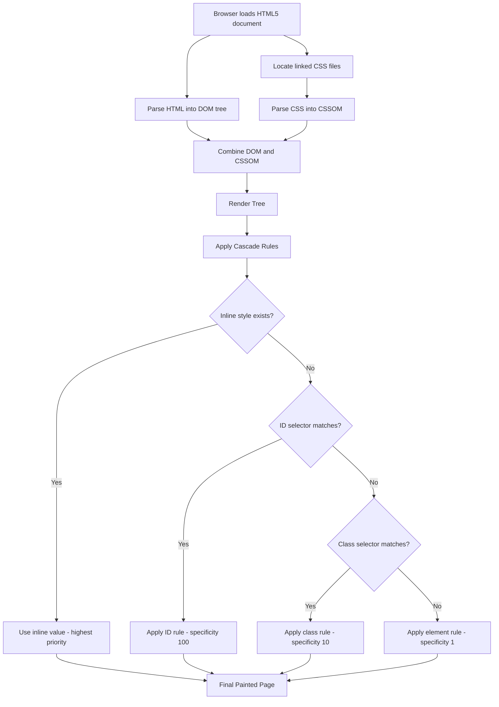
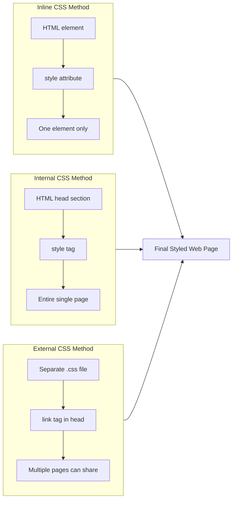
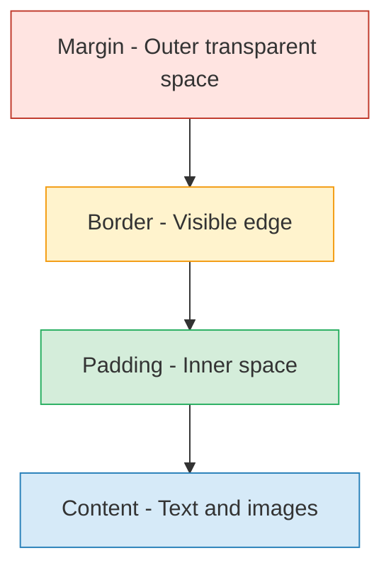
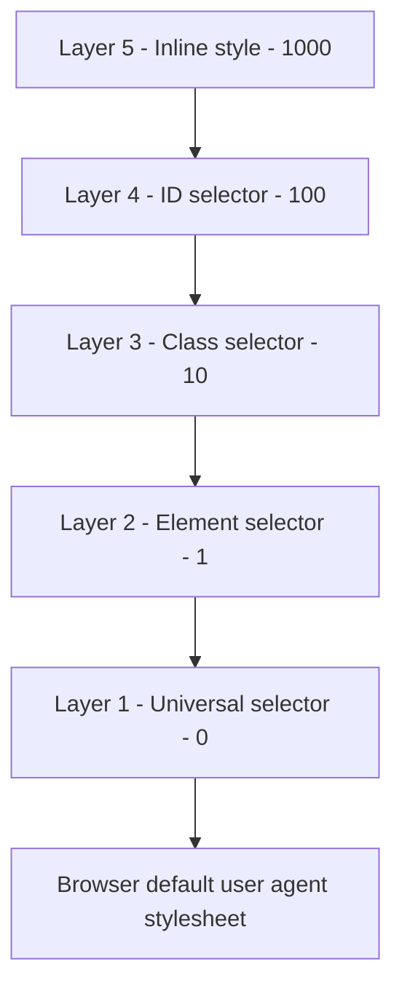

# Styling Web Page using CSS  - Introduction

<!-- SECTION_1_START -->

# 1. Core Technical Definition & Intuitive Overview

## 1.1 Formal Definition

**Cascading Style Sheets (CSS)** is a stylesheet language used to describe the **presentation** and **visual formatting** of a document written in a markup language such as **HTML5** or **XML (Extensible Markup Language)**. It is a **W3C (World Wide Web Consortium)** recommendation that separates the *content* of a web page (handled by HTML) from its *visual appearance* (handled by CSS).

In the **KTU 2024 Scheme (OECST832 – Web Programming)** syllabus under Module 1, CSS is introduced as the mechanism to control **layout, colors, fonts, spacing, animations, and responsive behavior** of HTML5 documents.

> [!IMPORTANT]
> **Syllabus Highlight (Module 1):** *Styling Web Page using CSS – Introduction, Syntax, Selectors, Types of CSS, and Common Properties.*

The term **"Cascading"** refers to the priority scheme (also called the **specificity and inheritance algorithm**) that determines which style rule applies when multiple rules target the same HTML element.

## 1.2 Intuitive Analogy

> [!NOTE]
> **The "House Analogy"**
> Imagine an HTML5 page as the **skeleton/structure of a house** — walls, doors, rooms, windows. Now think of CSS as the **interior designer and painter** — it decides the wall colors, furniture placement, lighting, flooring, and overall aesthetic. HTML defines **what** is on the page; CSS defines **how it looks**.

A second helpful analogy:

| Layer | Role | Analogy |
|---|---|---|
| **HTML5** | Content \& Structure | The raw text of a novel |
| **CSS** | Presentation \& Styling | The typography, fonts, margins, colors of the printed book |
| **JavaScript** | Behavior \& Interactivity | The animated e-book features (later modules) |

## 1.3 Why CSS is Mandatory in Modern Web Development

> [!IMPORTANT]
> Without CSS, every browser renders HTML using its **default user-agent stylesheet** — typically black Times New Roman text on a white background, with no spacing, no color, and no layout. CSS unlocks the **visual richness** required for any production-grade application.

## 1.4 Visualization Control (Conceptual)

> [!VISUALIZATION CONTROL]
> **Concept:** CSS Cascade Order Visualized
> **GeoGebra / Desmos Input Equations (representational):**
> * Layer 1: $P_1 = \text{Browser Default}$
> * Layer 2: $P_2 = \text{User Stylesheet}$
> * Layer 3: $P_3 = \text{External CSS}$
> * Layer 4: $P_4 = \text{Internal (Embedded) CSS}$
> * Layer 5: $P_5 = \text{Inline CSS}$
> **Visual Description:** Imagine a vertical stack of 5 transparent sheets layered on top of each other. The topmost sheet (Inline CSS) overrides the lower ones (External CSS at the bottom). This stacking effect is the **"Cascade"** in action.

<!-- SECTION_1_END -->

<!-- SECTION_2_START -->

# 2. Deep Theoretical Analysis & KTU High-Yield Formula Sheet

## 2.1 CSS Syntax — The Building Block

A **CSS rule-set** consists of two main parts:

1. **Selector** — points to the HTML element(s) you want to style.
2. **Declaration Block** — contains one or more *declarations* separated by semicolons.

Each declaration includes a **property name** and a **value**, separated by a colon.

$$
\underbrace{\text{selector}}_{\text{who}} \; \Big\{ \; \underbrace{\text{property}}_{\text{what}} \; : \; \underbrace{\text{value}}_{\text{how}} \; \Big\}
$$

**Example:**

```css
h1 {
    color: blue;
    font-size: 24px;
}
```

Here, `h1` is the **selector**, `color` and `font-size` are **properties**, and `blue` and `24px` are **values**.

> [!NOTE]
> Every property–value pair **must end with a semicolon** (`;`). The last declaration before the closing brace may omit it, but it is **best practice** to always include it for clarity and to avoid bugs.

## 2.2 Three Types / Methods of Applying CSS

### 2.2.1 Inline CSS
Written directly inside an HTML element using the `style` **attribute**. Highest specificity — overrides other styles for that single element.

```html
<p style="color: red; font-weight: bold;">This is inline CSS.</p>
```

**When to use:** Quick tests, dynamic styles set by JavaScript, email templates.

### 2.2.2 Internal (Embedded) CSS
Written inside a `<style>` element within the `<head>` section of the HTML document. Applies to the **entire single page**.

```html
<head>
    <style>
        body { background-color: #f0f0f0; }
        h2   { text-align: center; }
    </style>
</head>
```

**When to use:** Single-page websites, page-specific styles, prototyping.

### 2.2.3 External CSS
Written in a separate file with a `.css` extension and **linked** to the HTML document using the `<link>` tag.

**File: `styles.css`**
```css
h1 { color: navy; }
p  { line-height: 1.6; }
```

**File: `index.html`**
```html
<head>
    <link rel="stylesheet" href="styles.css">
</head>
```

**When to use:** Multi-page websites, large projects — this is the **industry standard** because it enables **separation of concerns** and **code reusability**.

## 2.3 CSS Selectors (High-Yield for KTU)

| Selector Type | Syntax | Targets | Example |
|---|---|---|---|
| **Element / Type** | `tagname` | All elements of that type | `p { color: green; }` |
| **Class** | `.classname` | Elements with `class="classname"` | `.btn { padding: 10px; }` |
| **ID** | `#idname` | The unique element with that `id` | `#header { background: black; }` |
| **Universal** | `*` | Every element on the page | `* { margin: 0; }` |
| **Grouping** | `A, B, C` | Multiple selectors share one rule | `h1, h2, h3 { font-family: Arial; }` |
| **Descendant** | `A B` | `B` nested anywhere inside `A` | `div p { font-size: 14px; }` |
| **Child** | `A > B` | Direct child `B` of `A` | `ul > li { list-style: none; }` |
| **Pseudo-class** | `A:state` | Element in a specific state | `a:hover { color: red; }` |

> [!IMPORTANT]
> **Class vs ID (Board Exam Favorite):**
> * `class` is **reusable** — multiple elements can share it.
> * `id` is **unique** — only one element per page should have a given id.
> * Specificity: `inline` > `id` > `class` > `element`.

## 2.4 KTU High-Yield CSS Formula Sheet

| Concept | Formula / Rule | Unit / Default | Notes |
|---|---|---|---|
| **Cascade Order** | $Inline > Internal > External > Browser$ | — | Last-read rule wins on tie |
| **Specificity Score** | $ID(100) > Class(10) > Element(1)$ | — | Used to break ties |
| **Color Value** | $C \in \{\text{name}, hex, rgb(), hsl()\}$ | — | `#FF0000` = red |
| **Length Units** | Absolute: `px`, `cm`, `in` $\vert$ Relative: `em`, `rem`, `\%`, `vw`, `vh` | px is the most-used absolute unit | `rem` is best for accessibility |
| **Box Model Width** | $W_{total} = W_{content} + 2 \cdot P + 2 \cdot B + 2 \cdot M$ | pixels | $P$=padding, $B$=border, $M$=margin |
| **Link to CSS** | `<link rel="stylesheet" href="file.css">` | — | Placed in `<head>` |
| **Comment** | `/* comment text */` | — | Multi-line allowed |

## 2.5 Real-World Engineering Utility

CSS is the backbone of **front-end engineering** and is used in:

* **Single Page Applications (SPAs)** built with React, Angular, Vue — all of which compile down to HTML + CSS.
* **Responsive Web Design (RWD)** — `@media` queries adapt layouts for mobile, tablet, desktop.
* **Design Systems** like **Google Material Design** and **Apple Human Interface Guidelines** are CSS frameworks.
* **Print Stylesheets** — special CSS rules that activate only when a page is printed.
* **Accessibility** — proper contrast ratios and `rem` units help visually impaired users.

> [!NOTE]
> Without CSS, the modern web as we know it (responsive design, animations, dark mode, themes) would not exist.

<!-- SECTION_2_END -->

<!-- SECTION_3_START -->

# 3. Step-by-Step Derivations & Code Implementation

## 3.1 Exhaustive Code Walkthrough — All Three CSS Types in One Project

Below is a **fully operational HTML5 + CSS** example demonstrating **Inline, Internal, and External** CSS — the three styles are intentionally placed in one document for teaching purposes.

### 3.1.1 Project File Structure

```
project/
├── index.html
└── style.css
```

### 3.1.2 File 1: `style.css` (External CSS)

```css
/* ===========================================
   EXTERNAL CSS — style.css
   Linked to index.html via <link> tag
   =========================================== */

/* Universal Selector — applies to every element */
* {
    margin: 0;
    padding: 0;
    box-sizing: border-box;
}

/* Element selector — styles all <body> elements */
body {
    font-family: "Segoe UI", Arial, sans-serif;
    background-color: #f4f4f9;
    color: #333;
    line-height: 1.6;
}

/* ID selector — applied to the unique header element */
#main-header {
    background-color: #2c3e50;
    color: #ecf0f1;
    text-align: center;
    padding: 20px;
}

/* Class selector — applied to any element with class="container" */
.container {
    width: 80%;
    margin: 20px auto;
    padding: 15px;
    background-color: #ffffff;
    border: 1px solid #ddd;
    border-radius: 8px;
}

/* Grouping selector — multiple selectors share these properties */
h1, h2, h3 {
    color: #2c3e50;
    margin-bottom: 10px;
}

/* Descendant selector — only <p> inside .container */
.container p {
    font-size: 16px;
    text-align: justify;
}

/* Pseudo-class — link color changes on hover */
a:hover {
    color: #e74c3c;
    text-decoration: underline;
}
```

### 3.1.3 File 2: `index.html` (Using All Three CSS Types)

```html
<!DOCTYPE html>
<html lang="en">
<head>
    <meta charset="UTF-8">
    <meta name="viewport" content="width=device-width, initial-scale=1.0">
    <title>CSS Introduction Demo</title>

    <!-- EXTERNAL CSS LINK -->
    <link rel="stylesheet" href="style.css">

    <!-- INTERNAL (EMBEDDED) CSS -->
    <style>
        /* These rules apply only to THIS page */
        .highlight {
            background-color: #fff3cd;
            padding: 5px;
            border-left: 4px solid #ffc107;
        }
        footer {
            text-align: center;
            padding: 10px;
            background-color: #34495e;
            color: white;
        }
    </style>
</head>
<body>

    <!-- ID selector target -->
    <header id="main-header">
        <h1>Welcome to CSS Demo</h1>
    </header>

    <!-- Class selector target -->
    <div class="container">
        <h2>About This Page</h2>

        <!-- INLINE CSS — overrides everything else for THIS paragraph -->
        <p style="color: darkblue; font-weight: bold; font-size: 18px;">
            This paragraph uses INLINE CSS. Notice that even though the
            external stylesheet says paragraphs are #333 color, this one
            is dark blue and bold.
        </p>

        <p>
            This paragraph uses the EXTERNAL stylesheet. It inherits the
            body font, the .container background, and the descendant
            selector rules. It is also a <a href="#">clickable link</a>
            that turns red when hovered.
        </p>

        <p class="highlight">
            This paragraph uses the INTERNAL stylesheet via the
            "highlight" class. It has a yellow background and a
            left border.
        </p>
    </div>

    <footer>
        &copy; 2025 KTU Web Programming Module 1
    </footer>

</body>
</html>
```

### 3.1.4 Step-by-Step Evaluation of the Cascade

Let us trace what color each paragraph ends up as — this is a classic KTU exam question.

**Paragraph 1 (Inline):**
$$
C_{final} = \text{Inline value} = \text{darkblue}
$$
*No calculation needed — inline wins.*

**Paragraph 2 (External only):**
$$
C_{final} = \text{body color rule in style.css} = \#333
$$
*No competing rule.*

**Paragraph 3 (`class="highlight"`, no inline):**
$$
C_{final} = \text{Internal rule for .highlight} = \text{(no color set, inherits body)} = \#333
$$
*Internal overrides external for this class because `.highlight` is more specific than the descendant `p` rule.*

**Hovering on `<a>` link:**
$$
C_{final} = a\text{:}hover = \text{\#e74c3c (red)}
$$
*Because the cursor state triggers the pseudo-class.*

## 3.2 The CSS Box Model — Mathematical Derivation

> [!NOTE]
> The **CSS Box Model** is a *high-priority KTU topic*. Every HTML element is treated as a rectangular box with four layers.

$$
\boxed{
W_{total} = W_{content} + 2 \cdot P_{horizontal} + 2 \cdot B_{horizontal} + 2 \cdot M_{horizontal}
}
$$

$$
\boxed{
H_{total} = H_{content} + 2 \cdot P_{vertical} + 2 \cdot B_{vertical} + 2 \cdot M_{vertical}
}
$$

**Worked Numerical Example:**

Suppose a `<div>` has the following CSS:

```css
div {
    width: 200px;
    height: 100px;
    padding: 10px;
    border: 5px solid black;
    margin: 20px;
    box-sizing: content-box;   /* default */
}
```

**Step 1 — Identify components:**

* $W_{content} = 200\text{px}$
* $P_{horizontal} = 10\text{px}$ (left) $+ \;10\text{px}$ (right) $= 20\text{px}$
* $B_{horizontal} = 5\text{px}$ (left) $+ \;5\text{px}$ (right) $= 10\text{px}$
* $M_{horizontal} = 20\text{px}$ (left) $+ \;20\text{px}$ (right) $= 40\text{px}$

**Step 2 — Apply horizontal formula:**

$$
\begin{aligned}
W_{total} &= W_{content} + 2P + 2B + 2M \\
W_{total} &= 200 + 20 + 10 + 40 \\
W_{total} &= 270\;\text{px}
\end{aligned}
$$

**Step 3 — Apply vertical formula (assuming vertical padding/border/margin = horizontal):**

$$
\begin{aligned}
H_{total} &= H_{content} + 2P + 2B + 2M \\
H_{total} &= 100 + 20 + 10 + 40 \\
H_{total} &= 170\;\text{px}
\end{aligned}
$$

> [!IMPORTANT]
> **Note:** Margins are *outside* the element and do **not** affect the element's painted area, only the space it occupies in the layout.

## 3.3 Common CSS Properties Quick Reference (Exam-Favorite)

| Property | Purpose | Example Value |
|---|---|---|
| `color` | Text color | `red`, `#ff0000`, `rgb(255,0,0)` |
| `background-color` | Background fill | `#f4f4f9` |
| `font-size` | Text size | `16px`, `1.2em` |
| `font-family` | Typeface stack | `"Arial", sans-serif` |
| `text-align` | Horizontal alignment | `center`, `left`, `right`, `justify` |
| `margin` | Outer spacing | `10px 20px` (vertical horizontal) |
| `padding` | Inner spacing | `15px` |
| `border` | Border style | `2px solid black` |
| `width` / `height` | Box dimensions | `300px`, `50%` |
| `display` | Layout mode | `block`, `inline`, `flex`, `grid` |

<!-- SECTION_3_END -->

<!-- SECTION_4_START -->

# 4. Structural Diagrams & Schematics

## 4.1 CSS Architecture Flow — How a Browser Applies Styles



## 4.2 Three Methods of Applying CSS — Comparison Topology



## 4.3 CSS Box Model — Layered Block Diagram



> [!NOTE]
> **Reading the diagram from outside-in:** Margin (outermost red layer) $\rightarrow$ Border (yellow edge) $\rightarrow$ Padding (green inner space) $\rightarrow$ Content (blue center where text lives). This nesting is the **CSS Box Model**.

## 4.4 Specificity Hierarchy — Priority Stack



<!-- SECTION_4_END -->

<!-- SECTION_5_START -->

# 5. KTU 2024 Scheme Examination Question Bank & Topic Recap

## 5.1 Part A — Short Answer Questions (3 Marks Each)

### Question 1: [KTU University Exam – July 2024]
**Define CSS. List the three methods of applying CSS to an HTML document.**

**Model Answer (Valuation Key):**

* **Definition (1 Mark):** CSS (Cascading Style Sheets) is a stylesheet language used to describe the **presentation** of an HTML/XML document, including layout, colors, fonts, and spacing.
* **Three methods (2 Marks):**
  1. **Inline CSS** — using the `style` attribute on an element.
  2. **Internal / Embedded CSS** — using a `<style>` block inside `<head>`.
  3. **External CSS** — using a separate `.css` file linked via `<link rel="stylesheet">`.

### Question 2: [KTU University Exam – Dec 2023]
**Differentiate between Class selector and ID selector in CSS.**

**Model Answer (Valuation Key):**

| Feature | Class Selector | ID Selector |
|---|---|---|
| Syntax | `.classname` | `#idname` |
| HTML attribute | `class=" "` | `id=" "` |
| Reusability | Can be applied to **multiple** elements | Should be applied to **only one** element per page |
| Specificity value | $10$ | $100$ |
| Use case | Styling groups of elements | Styling unique sections |

> [!WARNING]
> **Examiner's Pitfall:** Students often write *“class is for styling and id is for scripting.”* That is **partially correct** but does not earn full marks. You must mention **specificity**, **uniqueness**, and **HTML attribute syntax** to score 3/3.

---

## 5.2 Part B — Long Answer Questions (14 Marks with Internal Choice)

### **Question A (14 Marks)**

**[KTU University Exam – Model Question, Module 1]**

**(a)** Explain the three types of CSS with suitable examples. Discuss the advantages and disadvantages of each. **(7 Marks — Understand)**

**(b)** Design a complete HTML5 page that demonstrates:
* External CSS (in a separate file)
* Internal CSS (in `<style>` tag)
* Inline CSS (using `style` attribute)
* Use of class, id, and element selectors
* CSS Box Model with margin, padding, and border **(7 Marks — Apply)**

---

#### Model Solution for (a) — 7 Marks

**[Introduction: 1 Mark]**
CSS can be applied in three ways — **Inline**, **Internal (Embedded)**, and **External**.

**[Inline CSS Explanation: 2 Marks]**
* Written inside the HTML element's `style` attribute.
* **Example:** `<p style="color:red;">Hello</p>`
* **Advantages:** Highest specificity, useful for dynamic one-off changes.
* **Disadvantages:** Not reusable, mixes content with presentation, hard to maintain.

**[Internal CSS Explanation: 2 Marks]**
* Written inside a `<style>` element in the `<head>`.
* **Example:**
  ```html
  <head><style>p{color:blue;}</style></head>
  ```
* **Advantages:** Affects the entire page, keeps HTML cleaner than inline.
* **Disadvantages:** Cannot be shared across multiple pages.

**[External CSS Explanation: 2 Marks]**
* Written in a separate `.css` file and linked via `<link>`.
* **Example:** `<link rel="stylesheet" href="style.css">`
* **Advantages:** Reusable across pages, true separation of concerns, easier maintenance — **industry best practice**.
* **Disadvantages:** Extra HTTP request, may cause brief unstyled flash if not loaded early.

---

#### Model Solution for (b) — 7 Marks

**File: `style.css`**
```css
body { font-family: Arial; background: #eef; }
#title { color: navy; text-align: center; }
.note  { background: #fff3cd; padding: 10px; }
p      { font-size: 16px; }
```

**File: `index.html`**
```html
<!DOCTYPE html>
<html>
<head>
    <title>CSS Demo</title>
    <link rel="stylesheet" href="style.css">     <!-- External -->
    <style>
        .note { border-left: 4px solid orange; }  <!-- Internal -->
    </style>
</head>
<body>
    <h1 id="title">CSS Demonstration</h1>
    <p class="note" style="color: darkgreen;">   <!-- Inline -->
        This paragraph uses all three CSS methods.
    </p>
</body>
</html>
```

**Valuation Key Points:**

* `[Correct file structure shown: 1 Mark]`
* `[External CSS link tag written correctly: 2 Marks]`
* `[Internal CSS in style tag: 1 Mark]`
* `[Inline CSS in style attribute: 1 Mark]`
* `[Class, id, and element selectors used: 1 Mark]`
* `[Output / Explanation of cascade: 1 Mark]`

---

### **Question B (Alternative — 14 Marks)**

**[KTU University Exam – Model Question, Module 1]**

**(a)** What is the CSS Box Model? With a neat diagram, explain its components. **(7 Marks — Understand)**

**(b)** A `<div>` element has `width: 200px`, `padding: 15px`, `border: 5px solid`, and `margin: 25px`. Calculate the **total horizontal space** occupied by the box. Show all steps. **(7 Marks — Apply)**

---

#### Model Solution for (a) — 7 Marks

**[Definition: 1 Mark]**
The CSS Box Model describes the rectangular boxes generated for elements in the document tree. Each box has four layers.

**[Layers (with diagram): 4 Marks]**
* **Content** — The actual text, image, or media.
* **Padding** — Transparent space *inside* the border, around the content.
* **Border** — A visible line surrounding the padding and content.
* **Margin** — Transparent space *outside* the border, separating the element from others.

**[Box Model Diagram: 2 Marks]**

```
+-------------------------------+  ← Margin (outermost)
| +---------------------------+ |  ← Border
| | +-----------------------+ | |  ← Padding
| | |     CONTENT           | | |
| | |   (text / image)      | | |
| | +-----------------------+ | |
| +---------------------------+ |
+-------------------------------+
```

---

#### Model Solution for (b) — 7 Marks

**Given values:**
* $W_{content} = 200\text{px}$
* $P = 15\text{px}$ (per side)
* $B = 5\text{px}$ (per side)
* $M = 25\text{px}$ (per side)

**Step 1 — Recall the horizontal box model formula: 1 Mark**
$$
W_{total} = W_{content} + 2P + 2B + 2M
$$

**Step 2 — Substitute the values: 1 Mark**
$$
\begin{aligned}
W_{total} &= 200 + 2(15) + 2(5) + 2(25) \\
W_{total} &= 200 + 30 + 10 + 50
\end{aligned}
$$

**Step 3 — Final calculation: 1 Mark**
$$
W_{total} = 290\;\text{px}
$$

**Valuation Key Points:**

* `[Stating given values: 1 Mark]`
* `[Writing the correct formula: 2 Marks]`
* `[Substitution: 1 Mark]`
* `[Final answer 290px: 1 Mark]`
* `[Units mentioned: 1 Mark]`
* `[Explanation of margin vs padding distinction: 1 Mark]`

> [!WARNING]
> **Examiner's Valuation Warning — Common Mistakes:**
> 1. **Forgetting to multiply** padding/border/margin by **2** (left + right). The most common error. $\rightarrow$ **Lose 2 marks.**
> 2. **Including margin in the element's "size"** — margins are *outside* the element, but they still **occupy layout space**. State this clearly.
> 3. **Missing the unit `px`** in the final answer. Always write the unit.
> 4. **Wrong formula** — Some students write $W = \text{content} + P + B + M$ (forgetting the factor of 2). Memorize the **factor of 2** for both sides.

---

## 5.3 Topic Recap & Important Things to Remember

> [!NOTE]
> **Rapid-Revision Checklist for CSS Introduction (Module 1)**

* **CSS** = Cascading Style Sheets — a W3C-recommended language for **presentation** of HTML/XML.
* **CSS syntax** = `selector { property: value; }` — semicolon at the end of every declaration.
* **Three application methods:**
  * **Inline** → `style` attribute → highest priority → one element only.
  * **Internal** → `<style>` tag in `<head>` → applies to the whole page.
  * **External** → separate `.css` file linked via `<link rel="stylesheet">` → **industry best practice** for multi-page sites.
* **Selectors (must memorize):**
  * Element → `p { }`
  * Class → `.btn { }`
  * ID → `#header { }`
  * Universal → `* { }`
  * Grouping → `h1, h2, h3 { }`
  * Descendant → `div p { }`
  * Pseudo-class → `a:hover { }`
* **Specificity order (high → low):**
  $$
  Inline(1000) > ID(100) > Class(10) > Element(1) > Universal(0)
  $$
* **Cascade rule:** When two rules have equal specificity, the **later one wins**.
* **CSS Box Model (essential formula):**
  $$
  W_{total} = W_{content} + 2P + 2B + 2M
  $$
* **Common properties to know by heart:** `color`, `background-color`, `font-size`, `font-family`, `text-align`, `margin`, `padding`, `border`, `width`, `height`, `display`.
* **Comment syntax in CSS:** `/* multi-line comment */` — **not** `<!-- -->` (that is HTML).
* **External CSS requires the `<link>` tag inside `<head>`**, not `<body>`.
* **Class is reusable; ID is unique.** ID specificity (100) > Class specificity (10).
* **Units:** `px` (absolute), `em`, `rem`, `%`, `vw`, `vh` (relative). Use `rem` for accessibility.
* **Default `box-sizing` is `content-box`** — width applies to content only, not the padding/border.

<!-- SECTION_5_END -->
