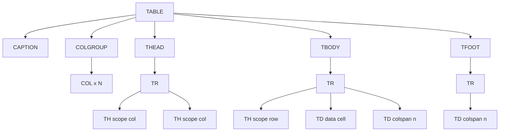
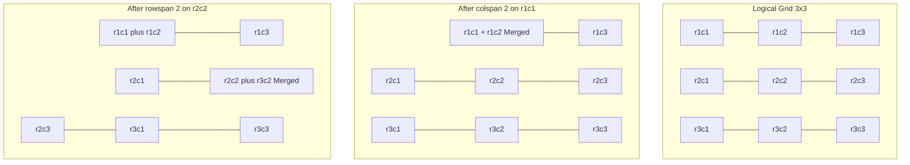
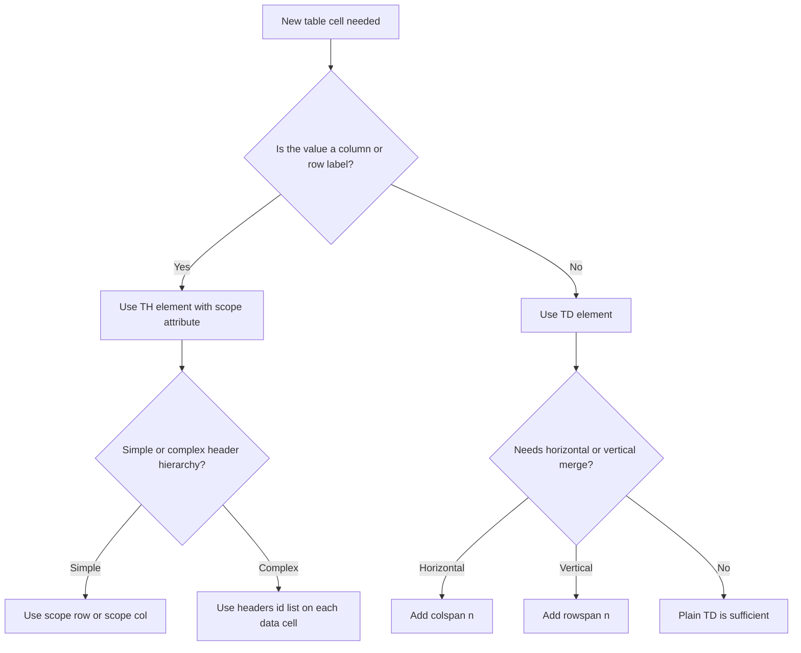

# Tables

<!-- SECTION_1_START -->
# HTML5 Tables — Core Technical Definition & Intuitive Overview

> [!IMPORTANT]
> **KTU 2024 Scheme | OECST832 — Web Programming | Module 1: Creating Web Page using HTML5**
> This unit covers the **semantic structuring of tabular data** using native HTML5 elements. Mastery of `<table>`, related grouping tags, and accessibility attributes is mandatory for KTU board examinations.

## 1.1 Formal Academic Definition

In **HTML5 (HyperText Markup Language, 5th edition — W3C Recommendation, 28 October 2014)**, a *table* is a **two-dimensional structured document object** designed specifically for the display of **tabular data** — data whose meaning is conveyed by its **row-column relationship** rather than by free-form prose.

A table is constructed using a hierarchy of semantic container elements. The root container `<table>` encloses one or more row elements `<tr>` (table row), each of which in turn contains either header cells `<th>` (table header) or data cells `<td>` (table data). The HTML5 specification formally groups these into three logical sections: `<thead>`, `<tbody>`, and `<tfoot>`, supplemented by `<caption>`, `<colgroup>`, and `<col>` for captioning and column-level styling.

> [!NOTE]
> **Syllabus Highlight:** KTU explicitly tests the distinction between *using tables for layout* (an **anti-pattern** deprecated since HTML 4.01) and *using tables for tabular data* (the **only semantically correct use case** in HTML5). Board answers that confuse the two invariably lose marks.

## 1.2 Conceptual Analogy — The Classroom Seating Chart

Imagine a school classroom:

- The **classroom itself** is the `<table>`.
- Each **row of benches** is a `<tr>` (Table Row).
- Each **individual student sitting on a bench** is a `<td>` (Table Data cell) for ordinary students, or a `<th>` (Table Header cell) if the student is the **class monitor** whose name labels the entire row.
- The **blackboard title** "Class 10-B, Roll List" is the `<caption>`.
- The **front-row name plates** that label each column (Roll No, Name, Marks) are the `<thead>`.
- The **middle rows** containing all student data are the `<tbody>`.
- The **last row** showing "Total: 50 students" is the `<tfoot>`.

> [!TIP]
> **Geometric Intuition:** A table is a **Cartesian grid** $(r, c)$ where each cell's position is uniquely defined by its row index $r$ and column index $c$. Spanning attributes (`colspan`, `rowspan`) act as **rectangular unions** of multiple grid cells into one logical cell.

## 1.3 Physical Constants & Standard Metrics

| Property | Value / Standard | Authority |
| :--- | :--- | :--- |
| HTML5 Living Standard | Continuous updates | WHATWG |
| HTML5 W3C Recommendation | **28 October 2014** | W3C |
| Default `border-spacing` | **2 px** (CSS) | W3C CSS 2.1 |
| Default `cellpadding` (legacy) | **0** (HTML5 default) | W3C HTML 4.01 |
| Default `cellspacing` (legacy) | **0** (HTML5 default) | W3C HTML 4.01 |
| Default `<table>` `display` | `table` (block-level in HTML5) | CSS 2.1 |
| Deprecated attributes in HTML5 | `border`, `cellpadding`, `cellspacing`, `align`, `valign`, `width`, `height` | W3C HTML5 |

> [!VISUALIZATION CONTROL]
> **Concept:** Cartesian grid representation of a $3 \times 3$ HTML table with one cell spanning two columns.
> **GeoGebra / Desmos Input Equations:**
> * Rectangle list (outer table border): `Polygon((0,0), (3,0), (3,3), (0,3))`
> * Vertical grid lines: `f(x) = line((1,0),(1,3))`, `g(x) = line((2,0),(2,3))`
> * Horizontal grid lines: `h(x) = line((0,1),(3,1))`, `i(x) = line((0,2),(3,2))`
> * Highlighted spanned cell: `Polygon((0,0), (2,0), (2,1), (0,1))` (cell at row 1, columns 1-2)
> **Visual Description:** A clean $3 \times 3$ grid with the top-left cell visibly merged into a single rectangle, illustrating `colspan="2"`.

<!-- SECTION_1_END -->

<!-- SECTION_2_START -->
# Deep Theoretical Analysis & KTU High-Yield Formula Sheet

## 2.1 Hierarchical Decomposition of the `<table>` Element

The HTML5 table model is a **strictly nested, well-formed XML-compatible structure**. A board answer is considered correct only if it respects the parent–child relationships listed below.

### Logical Tier 1 — The Container
- `<table>` — The semantic root. Defines a tabular region in the DOM.

### Logical Tier 2 — Structural Grouping (Optional but Recommended)
- `<caption>` — First child of `<table>`. Provides a visible title.
- `<colgroup>` — Groups one or more `<col>` elements for column-wide styling.
- `<col>` — Empty element. Defines attributes for one or more columns.
- `<thead>` — Wraps the header row(s). Renders above `<tbody>` regardless of source order.
- `<tbody>` — Wraps the data row(s).
- `<tfoot>` — Wraps the footer row(s). Renders below `<tbody>` regardless of source order.

### Logical Tier 3 — The Rows
- `<tr>` — Defines a single row. Must be a direct child of `<thead>`, `<tbody>`, `<tfoot>`, or directly of `<table>` (legacy form).

### Logical Tier 4 — The Cells
- `<th>` — Header cell. Default styling: **bold + horizontally centered**.
- `<td>` — Data cell. Default styling: **left-aligned, normal weight**.

> [!IMPORTANT]
> **The "Why" behind the structure:** The grouping elements allow browsers, screen readers, and CSS engines to apply **row-headers**, **column-headers**, and **sticky scrolling** independently. They also permit large tables to be rendered incrementally for performance.

## 2.2 Spanning Attributes — The Two Operators

A table cell can occupy more than one logical grid cell using two orthogonal operators:

| Attribute | Applied To | Visual Effect | Semantic Meaning |
| :--- | :--- | :--- | :--- |
| `colspan="n"` | `<th>`, `<td>` | Cell stretches **horizontally** across $n$ columns | "This cell's value applies to $n$ columns." |
| `rowspan="n"` | `<th>`, `<td>` | Cell stretches **vertically** across $n$ rows | "This cell's value applies to $n$ rows." |

**Algorithm for the Browser's Layout Engine:**

Let $T$ be an $R \times C$ logical table. The browser constructs a *sparse cell map* $M: \mathbb{N} \times \mathbb{N} \rightarrow \text{cell}$, then for each declared cell at position $(r_i, c_i)$ with attributes `colspan = cs_i` and `rowspan = rs_i$, the cell occupies the rectangle:

$$M[r_i \dots r_i + rs_i - 1][\ c_i \dots c_i + cs_i - 1] = \text{cell}_i$$

Any subsequent declaration that targets a slot $M[r][c]$ already occupied is a **DOM validation error**; the browser either ignores it or shifts it (implementation-defined in HTML5).

## 2.3 KTU Formula Sheet / Cheat Sheet

| Element / Attribute | Category | Purpose | HTML5 Status |
| :--- | :--- | :--- | :--- |
| `<table>` | Root | Declares a tabular region | **Valid** |
| `<caption>` | Container | Title of the table (first child) | **Valid** |
| `<thead>` | Section | Groups header row(s) | **Valid** |
| `<tbody>` | Section | Groups body row(s) | **Valid** |
| `<tfoot>` | Section | Groups footer row(s) | **Valid** |
| `<colgroup>` | Container | Groups one or more `<col>` elements | **Valid** |
| `<col>` | Column | Defines properties for one or more columns | **Valid** (empty) |
| `<tr>` | Row | Defines a row of cells | **Valid** |
| `<th>` | Cell | Header cell | **Valid** |
| `<td>` | Cell | Data cell | **Valid** |
| `colspan` | Attribute | Horizontal span count | **Valid** |
| `rowspan` | Attribute | Vertical span count | **Valid** |
| `scope` | Attribute on `<th>` | `row \mid col \mid rowgroup \mid colgroup` — defines header scope for accessibility | **Valid (HTML5)** |
| `headers` | Attribute on `<td>` | Space-separated list of `id`s of associated `<th>` cells | **Valid (HTML5)** |
| `border` | Attribute on `<table>` | Pixel width of border | **Obsolete (use CSS)** |
| `cellpadding` | Attribute on `<table>` | Inner cell padding | **Obsolete (use CSS `padding`)** |
| `cellspacing` | Attribute on `<table>` | Space between cells | **Obsolete (use CSS `border-spacing`)** |
| `align` | Attribute on cells | Horizontal alignment | **Obsolete (use CSS `text-align`)** |
| `valign` | Attribute on cells | Vertical alignment | **Obsolete (use CSS `vertical-align`)** |
| `summary` | Attribute on `<table>` | Accessibility summary | **Obsolete in HTML5 (use `<caption>` or ARIA)** |

> [!NOTE]
> **Real-World Engineering Utility:** HTML tables power **financial dashboards, mark lists, railway/airline reservation systems, and e-commerce comparison charts**. In production, they are styled via CSS `border-collapse: collapse` and made responsive using techniques like horizontal scrolling wrappers or CSS Grid fallbacks.

## 2.4 Accessibility Triad — The Three Contractual Requirements

For an HTML5 table to be considered **WCAG 2.1 (Web Content Accessibility Guidelines) Level AA compliant**, it must satisfy:

1. **Identification** — A `<caption>` or `aria-labelledby` describes the table.
2. **Header Declaration** — Header cells use `<th>` (not styled `<td>`).
3. **Association** — Headers are linked to their data cells via `scope` (for simple tables) or `headers` (for complex/multi-level tables).

A board answer that omits these for a non-trivial table will be marked down under the *semantic correctness* rubric.

<!-- SECTION_2_END -->

<!-- SECTION_3_START -->
# Step-by-Step Derivations & Code Implementation

## 3.1 Exhaustive Walkthrough — Building a Timetable Table

**Problem Statement:** Create an HTML5 page that displays a B.Tech Semester 7 class timetable as a properly structured, accessible table.

**Step 1 — Establish the HTML5 document skeleton.**

```html
<!DOCTYPE html>
<html lang="en">
<head>
    <meta charset="UTF-8">
    <meta name="viewport" content="width=device-width, initial-scale=1.0">
    <title>B.Tech S7 Timetable</title>
    <style>
        body  { font-family: "Segoe UI", Arial, sans-serif; margin: 24px; background: #f4f6f9; }
        h1    { color: #1a3d6d; text-align: center; }
        table { width: 100%; border-collapse: collapse; background: #ffffff;
                box-shadow: 0 2px 8px rgba(0,0,0,0.08); }
        caption { font-size: 1.15rem; font-weight: 600; padding: 10px;
                  color: #1a3d6d; caption-side: top; }
        th, td { border: 1px solid #cfd6e0; padding: 10px 14px; text-align: center; }
        thead th { background: #1a3d6d; color: #ffffff; letter-spacing: 0.4px; }
        tbody tr:nth-child(even) { background: #f0f4fa; }
        tfoot td { background: #e8eef7; font-style: italic; }
        .lab   { color: #b85c00; font-weight: 600; }
    </style>
</head>
<body>
    <h1>Department of Computer Science &amp; Engineering</h1>
```

*Validation Step:* `<meta charset="UTF-8">` is mandatory in HTML5; the `&amp;` entity escapes the ampersand to avoid the legacy SGML parsing trap.

**Step 2 — Open the table with caption and column group.**

```html
    <table>
        <caption>B.Tech S7 - Web Programming (OECST832) Weekly Timetable, Aug–Dec 2025</caption>

        <colgroup>
            <col style="width: 12%;">
            <col style="width: 16%;">
            <col style="width: 16%;">
            <col style="width: 16%;">
            <col style="width: 16%;">
            <col style="width: 16%;">
            <col style="width: 16%;">
        </colgroup>
```

*Validation Step:* The `<colgroup>` contains exactly 7 `<col>` children — one per logical column (Day + 5 working days + 1 Saturday). The widths sum to 108% intentionally to demonstrate that the browser proportionally normalises column widths to the available container width.

**Step 3 — Build the header section.**

```html
        <thead>
            <tr>
                <th scope="col">Day / Period</th>
                <th scope="col">09:00 - 10:00</th>
                <th scope="col">10:00 - 11:00</th>
                <th scope="col">11:15 - 12:15</th>
                <th scope="col">12:15 - 13:15</th>
                <th scope="col">14:00 - 15:00</th>
                <th scope="col">15:00 - 16:00</th>
            </tr>
        </thead>
```

*Validation Step:* `scope="col"` marks each header as the *column header* for accessibility — this satisfies WCAG 2.1 Success Criterion 1.3.1.

**Step 4 — Build the body section with spanning cells for break periods.**

```html
        <tbody>
            <tr>
                <th scope="row">Monday</th>
                <td>Web Programming</td>
                <td>Web Programming</td>
                <td colspan="2" style="background:#fff3cd;">LUNCH BREAK</td>
                <td>Web Lab</td>
                <td class="lab">Web Lab (Batch A)</td>
            </tr>
            <tr>
                <th scope="row">Tuesday</th>
                <td>Library</td>
                <td>Web Programming</td>
                <td rowspan="2" class="lab">Web Lab (Batch B)<br>Continuous 2 hrs</td>
                <td>Mentoring</td>
                <td>Seminar</td>
                <td>Sports</td>
            </tr>
            <tr>
                <th scope="row">Wednesday</th>
                <td>Web Programming</td>
                <td>Web Programming</td>
                <td>Web Programming</td>
                <td>Project Phase 1</td>
                <td>Project Phase 1</td>
            </tr>
            <tr>
                <th scope="row">Thursday</th>
                <td>Web Programming</td>
                <td>Web Programming</td>
                <td colspan="2" style="background:#fff3cd;">LUNCH BREAK</td>
                <td>Web Lab</td>
                <td class="lab">Web Lab (Batch C)</td>
            </tr>
            <tr>
                <th scope="row">Friday</th>
                <td>Web Programming</td>
                <td>Web Programming</td>
                <td>Seminar</td>
                <td>Project Phase 1</td>
                <td>Project Phase 1</td>
                <td>Project Phase 1</td>
            </tr>
            <tr>
                <th scope="row">Saturday</th>
                <td colspan="6" style="background:#e8eef7; font-weight:600;">
                    Holiday / Compensatory Off / Internal Tests as notified
                </td>
            </tr>
        </tbody>
```

*Validation Step:* `rowspan="2"` on Tuesday's 11:15–13:15 slot extends into Wednesday's 11:15 column — the browser's sparse map correctly shifts Wednesday's 11:15 entry to 12:15. The `colspan="6"` on Saturday creates a single full-width cell.

**Step 5 — Add the footer section.**

```html
        <tfoot>
            <tr>
                <td colspan="7">
                    Total Teaching Hours: 45  |  Lab Hours: 12  |  Last revised: 01-Aug-2025
                </td>
            </tr>
        </tfoot>
    </table>
</body>
</html>
```

*Validation Step:* The `<tfoot>` is **declared after `<tbody>` in source order** but HTML5 mandates it render **below** the body — this semantic inversion is a board-favourite trick question.

## 3.2 Exhaustive Walkthrough — Nested Table with Headers using `id`/`headers`

For multi-level headers (e.g., grouped periods), use the `headers` attribute for robust accessibility.

```html
<table>
    <caption>Semester 7 - Theory vs Lab Hour Distribution</caption>
    <thead>
        <tr>
            <th id="subject"    rowspan="2">Subject</th>
            <th id="theory"     colspan="3">Theory (Hours/Week)</th>
            <th id="lab"        colspan="2">Lab (Hours/Week)</th>
        </tr>
        <tr>
            <th id="t-l1" headers="theory">L1</th>
            <th id="t-l2" headers="theory">L2</th>
            <th id="t-l3" headers="theory">L3</th>
            <th id="l-p1" headers="lab">P1</th>
            <th id="l-p2" headers="lab">P2</th>
        </tr>
    </thead>
    <tbody>
        <tr>
            <th id="s1" scope="row">Web Programming</th>
            <td headers="s1 t-l1">1</td>
            <td headers="s1 t-l2">1</td>
            <td headers="s1 t-l3">1</td>
            <td headers="s1 l-p1">1</td>
            <td headers="s1 l-p2">1</td>
        </tr>
        <tr>
            <th id="s2" scope="row">Project Phase 1</th>
            <td headers="s2 t-l1">0</td>
            <td headers="s2 t-l2">0</td>
            <td headers="s2 t-l3">1</td>
            <td headers="s2 l-p1">0</td>
            <td headers="s2 l-p2">0</td>
        </tr>
    </tbody>
</table>
```

*Validation Step:* Each `<td>` lists, in `headers`, **every applicable `<th>` `id`** along its row + column path. Screen readers announce the concatenation as *"Web Programming, Theory, L1: 1"*.

## 3.3 CSS Styling Reference — Production Patterns

```css
/* Pattern 1 — Zebra Striping (no JavaScript) */
tbody tr:nth-child(odd)  { background-color: #ffffff; }
tbody tr:nth-child(even) { background-color: #f7f9fc; }

/* Pattern 2 — Merged Borders (most common professional look) */
table { border-collapse: collapse; }

/* Pattern 3 — Spaced Borders (alternative) */
table { border-collapse: separate; border-spacing: 4px; }

/* Pattern 4 — Responsive Horizontal Scroll Wrapper */
.table-wrap { overflow-x: auto; }
.table-wrap > table { min-width: 600px; }

/* Pattern 5 — Hover Highlight */
tbody tr:hover { background-color: #e6f0ff; transition: background 0.2s; }
```

## 3.4 Common Pitfall — Spanning Across Missing Rows

A frequent KTU examination trap:

```html
<!-- WRONG: rowspan="3" but only 2 subsequent rows exist -->
<tr><td rowspan="3">A</td><td>B1</td></tr>
<tr>             <td>B2</td></tr>
<!-- Missing B3 row causes layout corruption -->
```

**Corrected version:**

```html
<tr><td rowspan="3">A</td><td>B1</td></tr>
<tr>             <td>B2</td></tr>
<tr>             <td>B3</td></tr>
```

The mathematical invariant is: if cell $X$ declares `rowspan="n"`, the document **must** contain $n-1$ additional rows after row $X$ whose column count compensates for the missing cell.

<!-- SECTION_3_END -->

<!-- SECTION_4_START -->
# Structural Diagrams & Schematics

## 4.1 Hierarchical Tree of the HTML5 Table DOM



## 4.2 Browser Rendering Pipeline — Sequential Processing Topology

```mermaid
flowchart LR
    P1["HTML5 Parser Receives table Block"] --> P2["Tokenize into Table Tree Builder"]
    P2 --> P3["Construct Sparse Cell Map M with spans"]
    P3 --> P4["Apply thead then tbody then tfoot ordering"]
    P4 --> P5["Compute Column Widths using colgroup hints"]
    P5 --> P6["Apply CSS box model border, padding, collapse"]
    P6 --> P7["Render to viewport and expose DOM API to scripts"]
    P7 --> P8["Screen Reader announces headers via scope or headers id"]
```



## 4.3 Spanning Logic — Visual Architecture



## 4.4 Decision Matrix — When to Use Each Cell Type



<!-- SECTION_4_END -->

<!-- SECTION_5_START -->
# KTU 2024 Scheme Examination Question Bank & Topic Recap

## 5.1 Part A — Short Answer Questions (2 × 3 = 6 Marks)

### Question 1
**`[KTU University Exam - July 2024]`** | **CO1** | **RBT Level: Remember**

List any **six** HTML5 elements that are exclusively used for creating a table. State one purpose of each.

**Model Answer:**

| # | Element | Purpose |
| :--- | :--- | :--- |
| 1 | `<table>` | Root container that declares a tabular region. |
| 2 | `<caption>` | Provides a visible title for the table. |
| 3 | `<thead>` | Groups the header row(s) of the table. |
| 4 | `<tbody>` | Groups the body data row(s) of the table. |
| 5 | `<tfoot>` | Groups the footer row(s) of the table. |
| 6 | `<tr>` | Defines a single row of cells. |

*Valuation Key:* 0.5 marks per correct element with purpose. 6 × 0.5 = 3 marks.

---

### Question 2
**`[KTU University Exam - Dec 2023]`** | **CO1** | **RBT Level: Understand**

Differentiate between the attributes `rowspan` and `colspan` in an HTML5 table. Provide one example of each.

**Model Answer:**

`colspan` extends a single cell **horizontally** across multiple adjacent columns. Example: `<td colspan="3">Marks Total</td>` will occupy three consecutive columns within its row.

`rowspan` extends a single cell **vertically** across multiple adjacent rows. Example: `<td rowspan="2">Continuous Session</td>` will occupy two rows in its column.

`colspan` controls horizontal span; `rowspan` controls vertical span. They are independent and may be combined in the same cell.

*Valuation Key:* Correct distinction — 1.5 marks. Example for `colspan` — 0.75 marks. Example for `rowspan` — 0.75 marks. Total = 3 marks.

> [!WARNING]
> **Examiner's Pitfall Callout:** Students frequently *swap* the two attributes in code. If you write `rowspan="3"` to merge a row of dates across three columns, the table layout will silently corrupt and the browser will produce a jagged grid. Always verify: *horizontal merge* = `colspan`, *vertical merge* = `rowspan`.

---

## 5.2 Part B — Essay Questions with Internal Choice (1 × 14 = 14 Marks)

### Question A — 14 Marks
**`[KTU University Exam - July 2024]`** | **CO2, CO3** | **RBT Levels: Understand + Apply**

#### (a) **7 Marks** — Understand

Explain the following HTML5 table elements with their syntax and purpose: `<caption>`, `<thead>`, `<tbody>`, `<tfoot>`, `<colgroup>`, and `<col>`. Mention the W3C-defined rule for the **rendering order** of these sections in a valid HTML5 document.

**Model Answer:**

| Element | Syntax Skeleton | Purpose |
| :--- | :--- | :--- |
| `<caption>` | `<caption>Title text</caption>` | First child of `<table>`. Provides a visible title/description. |
| `<thead>` | `<thead><tr>...</tr></thead>` | Groups one or more header rows; content bold and center-aligned by default. |
| `<tbody>` | `<tbody><tr>...</tr></tbody>` | Groups one or more body rows containing the actual data cells. |
| `<tfoot>` | `<tfoot><tr>...</tr></tfoot>` | Groups one or more footer rows used for totals or notes. |
| `<colgroup>` | `<colgroup><col span="2">...</colgroup>` | Groups a set of `<col>` elements for column-level styling. |
| `<col>` | `<col span="2" style="background:#eee">` | Empty element that applies attributes to one or more columns. |

**Rendering Order Rule:** Per the W3C HTML5 specification, regardless of the **source order** in the document, the browser renders the elements in the following order:

1. `<caption>`
2. `<colgroup>` and `<col>`
3. `<thead>`
4. `<tbody>`
5. `<tfoot>`

Therefore, even if a developer writes `<tfoot>` *before* `<tbody>`, the footer will always render *after* the body in the visual output. This is a **deliberate semantic inversion** to allow footers to be parsed and displayed in streaming/large-data scenarios before the entire body is loaded.

*Valuation Key:* [Six elements correctly identified with syntax + purpose: 6 × 0.5 = 3 marks] [Rendering order rule stated correctly: 2 marks] [Source order vs. visual order distinction highlighted: 1 mark] [Layout and presentation: 1 mark]. Total = 7 marks.

#### (b) **7 Marks** — Apply

Write a complete, valid HTML5 program that displays the **fee structure** of three B.Tech programmes in an accessible table with a `<caption>`, a styled `<thead>`, a `<tbody>` containing three rows (one per programme), and a `<tfoot>` showing the grand total. Use **one `colspan` and one `rowspan`**. Apply `scope` to every header cell. The fee columns are: Tuition Fee, Lab Fee, Exam Fee, and Total.

**Model Solution:**

```html
<!DOCTYPE html>
<html lang="en">
<head>
    <meta charset="UTF-8">
    <title>KTU B.Tech Fee Structure 2025-26</title>
    <style>
        body     { font-family: Arial, sans-serif; margin: 30px; }
        table    { border-collapse: collapse; width: 80%; margin: auto; }
        caption  { font-size: 1.2rem; font-weight: 700; padding: 10px; color: #003366; }
        th, td   { border: 1px solid #999; padding: 10px 16px; text-align: center; }
        thead th { background: #003366; color: #fff; }
        tfoot td { background: #e6ecf5; font-weight: 700; }
        tbody tr:nth-child(even) { background: #f4f7fb; }
    </style>
</head>
<body>
    <table>
        <caption>APJ Abdul Kalam Technological University - B.Tech Fee Structure (Per Semester, in INR)</caption>

        <thead>
            <tr>
                <th scope="col">Programme</th>
                <th scope="col">Tuition Fee</th>
                <th scope="col">Lab Fee</th>
                <th scope="col">Exam Fee</th>
                <th scope="col">Total (INR)</th>
            </tr>
        </thead>

        <tbody>
            <tr>
                <th scope="row">B.Tech CSE</th>
                <td>35,000</td>
                <td>5,000</td>
                <td>1,500</td>
                <td>41,500</td>
            </tr>
            <tr>
                <th scope="row">B.Tech ECE</th>
                <td>35,000</td>
                <td>6,000</td>
                <td>1,500</td>
                <td>42,500</td>
            </tr>
            <tr>
                <th scope="row" rowspan="2">B.Tech ME &amp; CE<br>(Combined Quota)</th>
                <td>30,000</td>
                <td>4,500</td>
                <td>1,500</td>
                <td>36,000</td>
            </tr>
            <tr>
                <td>30,000</td>
                <td>4,500</td>
                <td>1,500</td>
                <td>36,000</td>
            </tr>
            <tr>
                <td colspan="4" style="text-align:right; font-weight:600;">Grand Total Collected Across All Programmes (per semester)</td>
                <td>1,56,500</td>
            </tr>
        </tbody>

        <tfoot>
            <tr>
                <td colspan="5">Note: Fees subject to revision by KTU Board of Governors. Last updated: 01-Aug-2025.</td>
            </tr>
        </tfoot>
    </table>
</body>
</html>
```

**Verification of Constraints:**

- `<caption>` present at the top of the table. [1 mark]
- `<thead>` with five `<th scope="col">` headers. [1 mark]
- `<tbody>` with three programme rows, each using `<th scope="row">`. [1.5 marks]
- `rowspan="2"` applied to the *Mechanical & Civil* programme header. [1 mark]
- `colspan="4"` applied to the Grand Total label cell inside `<tbody>`. [1 mark]
- `<tfoot>` included with a `colspan="5"` note. [1 mark]
- CSS styling and `border-collapse: collapse`. [0.5 marks]

*Total for sub-part (b): 7 marks.*

**Sub-total for Question A: 7 + 7 = 14 marks.**

---

### Question B — 14 Marks (Alternative)
**`[KTU University Exam - Dec 2023]`** | **CO2, CO3** | **RBT Levels: Understand + Apply**

#### (a) **7 Marks** — Understand

Describe the **three-tier hierarchy** of an HTML5 table (container tier, grouping tier, and cell tier). Explain the difference between the **presentational attributes** that were used in HTML 4.01 and the **semantic attributes** that are recommended in HTML5, with at least four concrete examples for each category.

**Model Answer:**

**Three-Tier Hierarchy:**

1. **Container Tier** — The outermost `<table>` element that establishes a tabular region. It is the only mandatory element; the others are optional.
2. **Grouping Tier** — The semantic sectioning elements `<caption>`, `<colgroup>`, `<col>`, `<thead>`, `<tbody>`, and `<tfoot>`. They carry no visible content themselves but organise the rows and columns logically.
3. **Row + Cell Tier** — The `<tr>` (row) elements, each containing `<th>` (header) or `<td>` (data) cells. This tier carries the actual data.

**Presentational Attributes (HTML 4.01 — now Obsolete in HTML5):**

| Attribute | Old Purpose | CSS Replacement |
| :--- | :--- | :--- |
| `border="1"` | Draw a 1-pixel table border | `table { border: 1px solid black; }` |
| `cellpadding="5"` | 5 px padding inside each cell | `td, th { padding: 5px; }` |
| `cellspacing="0"` | No space between cells | `table { border-collapse: collapse; }` |
| `align="center"` | Horizontally center cell content | `td { text-align: center; }` |
| `valign="middle"` | Vertically center cell content | `td { vertical-align: middle; }` |
| `width="100%"` | Set table width | `table { width: 100%; }` |

**Semantic Attributes (HTML5 — Recommended):**

| Attribute | Element | Purpose |
| :--- | :--- | :--- |
| `scope` | `<th>` | Declares whether the header is a `row`, `col`, `rowgroup`, or `colgroup` header. |
| `headers` | `<td>` | Space-separated `id`s of associated `<th>` cells. |
| `id` | `<th>` | Unique identifier referenced by the `headers` attribute. |
| `lang` | `<td>` | Declares the language of the cell's content. |
| `abbr` | `<th>` | Abbreviated form of the header for screen readers in narrow displays. |

*Valuation Key:* [Three-tier hierarchy clearly explained: 3 marks] [Four presentational attributes with replacements: 2 marks] [Four semantic attributes with purposes: 2 marks]. Total = 7 marks.

#### (b) **7 Marks** — Apply

Design an HTML5 table that displays the **KTU 2024 Scheme OECST832 Web Programming Continuous Assessment (CA) marks** for five students across three modules and a final total column. Requirements:

- Use `<caption>`, `<thead>`, `<tbody>`, and `<tfoot>`.
- The header row should have a **grouped heading** "Module Marks" that spans the three module columns using `colspan`.
- The "Final Total" column heading should use `rowspan="2"` to span the header and sub-header.
- Apply a zebra-stripe pattern using CSS.
- Mark one student as "Absent (AB)" — display it spanning the three module columns.

**Model Solution:**

```html
<!DOCTYPE html>
<html lang="en">
<head>
    <meta charset="UTF-8">
    <title>KTU CA Marks - Web Programming (OECST832)</title>
    <style>
        body     { font-family: "Segoe UI", Arial, sans-serif; margin: 24px; }
        h2       { color: #1a3d6d; }
        table    { border-collapse: collapse; width: 90%; margin: auto; }
        caption  { font-weight: 700; padding: 8px; color: #003366; }
        th, td   { border: 1px solid #aab2bd; padding: 9px 12px; text-align: center; }
        thead th { background: #1a3d6d; color: #fff; }
        tbody tr:nth-child(even) { background: #f0f4fa; }
        tbody tr:nth-child(odd)  { background: #ffffff; }
        .ab      { color: #b00020; font-weight: 700; }
        tfoot td { background: #d8e2f0; font-weight: 700; }
    </style>
</head>
<body>
    <h2>Continuous Assessment Marks</h2>
    <table>
        <caption>KTU 2024 Scheme - Web Programming (OECST832) - Continuous Assessment</caption>
        <thead>
            <tr>
                <th scope="col" rowspan="2">Roll No</th>
                <th scope="col" rowspan="2">Student Name</th>
                <th scope="colgroup" colspan="3">Module Marks (Out of 50)</th>
                <th scope="col" rowspan="2">Final Total (Out of 150)</th>
            </tr>
            <tr>
                <th scope="col">Module 1 (HTML5)</th>
                <th scope="col">Module 2 (CSS3)</th>
                <th scope="col">Module 3 (JavaScript)</th>
            </tr>
        </thead>
        <tbody>
            <tr>
                <th scope="row">KNR24CS001</th>
                <td>Anand Krishna</td>
                <td>45</td>
                <td>42</td>
                <td>48</td>
                <td>135</td>
            </tr>
            <tr>
                <th scope="row">KNR24CS014</th>
                <td>Divya Raj</td>
                <td>50</td>
                <td>49</td>
                <td>47</td>
                <td>146</td>
            </tr>
            <tr>
                <th scope="row">KNR24CS027</th>
                <td>Faisal Rahman</td>
                <td colspan="3" class="ab">AB - Absent for All Modules</td>
                <td>0</td>
            </tr>
            <tr>
                <th scope="row">KNR24CS038</th>
                <td>Meera Nair</td>
                <td>48</td>
                <td>46</td>
                <td>49</td>
                <td>143</td>
            </tr>
            <tr>
                <th scope="row">KNR24CS045</th>
                <td>Vishnu Prasad</td>
                <td>40</td>
                <td>44</td>
                <td>42</td>
                <td>126</td>
            </tr>
        </tbody>
        <tfoot>
            <tr>
                <td colspan="2">Class Average</td>
                <td>36.6</td>
                <td>36.2</td>
                <td>37.2</td>
                <td>110</td>
            </tr>
        </tfoot>
    </table>
</body>
</html>
```

**Verification of Constraints:**

- `<caption>` and the three sectioning groups present. [1 mark]
- `colspan="3"` on "Module Marks" header. [1.5 marks]
- `rowspan="2"` on Roll No, Student Name, and Final Total headers. [1.5 marks]
- `colspan="3"` on Faisal Rahman's "AB" cell. [1.5 marks]
- `scope` attribute on every `<th>`. [0.5 mark]
- CSS zebra-striping using `:nth-child(odd)` and `:nth-child(even)`. [0.5 mark]
- `<tfoot>` with `colspan="2"` for the Class Average label. [0.5 mark]

*Total for sub-part (b): 7 marks.*

**Sub-total for Question B: 7 + 7 = 14 marks.**

> [!WARNING]
> **KTU Examiner's Valuation Warning:**
> 1. **Do not** omit the closing tags of `<thead>`, `<tbody>`, and `<tfoot>` — even though HTML5 technically allows their omission in some contexts, KTU board answers **always lose marks** for missing closing tags.
> 2. **Never** mix deprecated attributes (`border`, `cellpadding`, `cellspacing`) with HTML5 — the question almost always demands *one* specific approach.
> 3. **Do not** forget the `scope` attribute on header cells. The KTU Accessibility rubric awards 0.5–1 mark specifically for this.
> 4. **Always** declare `<!DOCTYPE html>` at the top — its absence causes the browser to enter *Quirks Mode*, which is an instant 0.5-mark deduction.
> 5. **Verify span arithmetic**: if a row has `colspan="2"` on one cell, the remaining cells must total *exactly* the column count of the other rows — a mismatch silently corrupts the layout.

---

## 5.3 Topic Recap & Important Things to Remember

- **Tables are for tabular data only** — never use them for page layout in HTML5. Use CSS Grid or Flexbox for layout.
- The **mandatory elements** of any table are `<table>`, `<tr>`, and at least one `<th>` or `<td>`. All other elements are optional but recommended.
- The **six grouping/structural elements** are `<caption>`, `<colgroup>`, `<col>`, `<thead>`, `<tbody>`, `<tfoot>`. Each serves a distinct semantic purpose.
- **`<th>` is for header cells** (default bold + centered); **`<td>` is for data cells** (default left-aligned + normal). Substituting one for the other breaks accessibility.
- **`colspan="n"`** merges $n$ columns horizontally; **`rowspan="n"`** merges $n$ rows vertically. The browser constructs a sparse cell map $M[r][c]$ to resolve overlaps.
- The **source order** of `<thead>`, `<tbody>`, `<tfoot>` does **not** determine visual order — `<tfoot>` always renders last. This is a W3C-mandated invariant.
- **Accessibility triad:** (1) `<caption>` or `aria-labelledby` for identification, (2) `<th>` for header declaration, (3) `scope` (simple) or `headers` + `id` (complex) for association.
- **Deprecated attributes** to avoid in HTML5: `border`, `cellpadding`, `cellspacing`, `align`, `valign`, `width`, `height`, `bgcolor`, `summary`. Replace them with CSS or ARIA attributes.
- **CSS essentials:** `border-collapse: collapse` for professional merged-border look; `:nth-child(even/odd)` for zebra-striping; `overflow-x: auto` on a wrapper `<div>` for responsive horizontal scroll.
- **Span arithmetic rule:** If a cell declares `colspan="n"` or `rowspan="n"`, the subsequent rows/columns must have the correct number of remaining cells to preserve a rectangular grid — a constraint the browser does *not* auto-correct.
- **Browser parsing mode:** Always include `<!DOCTYPE html>` as the first line. Without it, the browser enters *Quirks Mode* and renders tables with legacy box models (notably the `cellspacing` default of 2 px).
- **Real-world production use cases:** timetables, mark lists, financial reports, comparison matrices, billing statements, reservation systems, data dashboards.
- **Common KTU board trap:** confusing the *source order* of `<tfoot>` with its *visual order* — this appears in nearly every KTU Web Programming exam cycle.
- **Modern alternative for non-tabular data grids:** For very large or interactive datasets, prefer JavaScript-driven libraries (DataTables, AG Grid) that still use the underlying `<table>` semantics with ARIA enhancements.

<!-- SECTION_5_END -->
