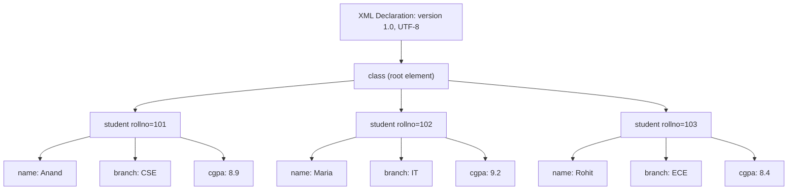
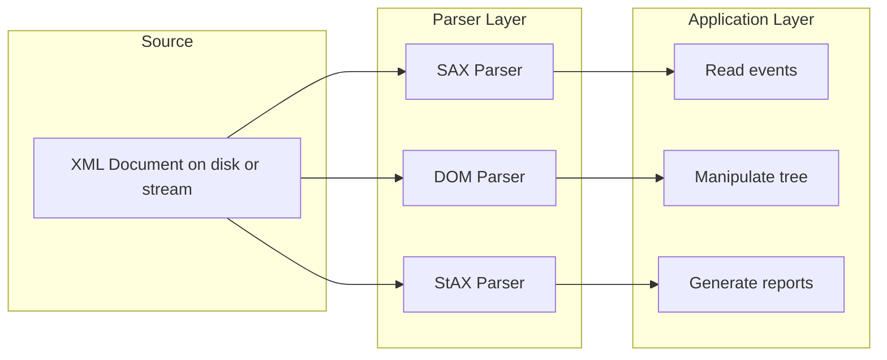
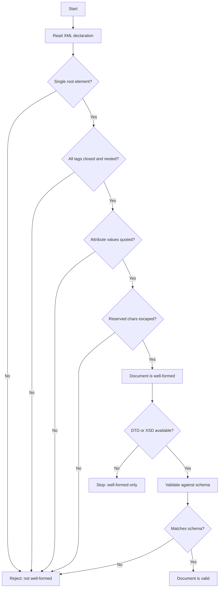
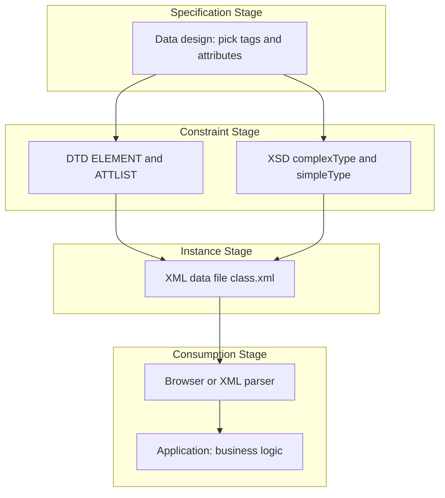

# XML Basics

<!-- SECTION_1_START -->
# XML Basics — Core Technical Definition & Intuitive Overview

## 1.1 Formal Definition (KTU 2024 Syllabus Terminology)

**XML (eXtensible Markup Language)** is a W3C-recommended, text-based, platform-independent data-interchange format that allows the designer to define custom tags (markup) to structure, store, and transport data in a self-describing manner. Unlike HTML, which uses *predefined* tags, XML is a *metalanguage* — its primary purpose is to hold data, not to display it.

> [!IMPORTANT]
> **Syllabus Highlight (OECST832 — Module 1):**
> XML is studied as the **data backbone** of modern web services (SOAP, RSS, SVG, XHTML) and as the foundation of structured data exchange. KTU examiners expect students to know XML syntax, DTD, XML Schema, namespaces, and parsing techniques (DOM/SAX).

### Formal W3C Definition
> *"The Extensible Markup Language (XML) is a simple text-based format for representing structured information: documents, data, configuration, books, transactions, invoices, and much more."* — W3C Recommendation

## 1.2 Conceptual Analogy / Intuition

Imagine you are running a **library** and want to send a list of books to another library. You could write it on paper with no structure (just paragraphs), or you could use HTML (where tags like `<h1>` mean "big heading"). But what if you want the receiving library's computer to *automatically understand* that "James" is the author and "450" is the price? HTML cannot do that — its tags are about *display*.

**XML is like a custom-built label maker.** You invent your own labels (`<author>`, `<price>`, `<isbn>`) and stick them on your data. The labels are self-describing, so any computer that reads them immediately knows what each piece of data means.

| Real-world Object | XML Representation |
|-------------------|--------------------|
| A library book's metadata | `<book><title>...</title><author>...</author></book>` |
| A student record | `<student><name>...</name><cgpa>...</cgpa></student>` |
| A product invoice | `<invoice><item><name>...</name><price>...</price></item></invoice>` |

> [!NOTE]
> **Key insight:** XML separates **data** (what it is) from **presentation** (how it looks). Display is handled by other technologies (XSLT, CSS, HTML). This is the philosophical core of XML.

## 1.3 Why XML Was Created — The Design Goals

| Goal | Meaning |
|------|---------|
| **Simplicity** | Easy to read, write, and parse |
| **Self-describing** | Tags describe the nature of the data |
| **Platform independence** | Pure text — works on any OS |
| **Vendor independence** | Not owned by any single company |
| **Internet-friendly** | Uses the same HTTP infrastructure as HTML |
| **Support internationalization** | Native **Unicode** support |
| **Extensibility** | You can create new tags whenever needed |

## 1.4 XML vs HTML — The Critical Distinction

| Feature | HTML | XML |
|---------|------|-----|
| Purpose | **Display** data | **Store & transport** data |
| Tag set | Predefined (fixed) | User-defined (extensible) |
| Case sensitivity | Case-insensitive | **Case-sensitive** |
| Closing tags | Optional in HTML5 | **Mandatory** in XML |
| Attribute values | Quotes optional | **Quotes mandatory** |
| Nesting rules | Forgiving | **Strict (no overlap)** |
| Errors | Browser forgives them | **Parser must reject malformed XML** |
| Output | Renders in browser | Must be transformed/parsed |

> [!TIP]
> **Memory trick for exams:** HTML = "**H**ow to show it"; XML = "**X**actly what it is."

## 1.5 Where XML Is Used in Real Engineering Systems

- **Web services:** SOAP, WSDL, REST-with-XML payloads
- **Configuration files:** `pom.xml` (Maven), `web.xml` (Java EE), `build.gradle.xml`, Android manifests
- **Data interchange:** Bank-to-bank transfers (FIXML, SWIFT MX)
- **Document formats:** Microsoft Office `.docx`, `.xlsx` (they are ZIPs of XML)
- **RSS / Atom feeds:** News syndication
- **SVG:** Vector graphics
- **XHTML:** HTML rewritten as strict XML

> [!VISUALIZATION CONTROL]
> **Concept:** XML Document Tree Structure
> **Conceptual Coordinates (XPath-style mental map):**
> * `root → /library`  *(the document root)*
> * `level-1 → /library/book[1]`, `/library/book[2]`
> * `level-2 → /library/book[1]/title`, `/library/book[1]/author`, `/library/book[1]/price`
>
> **Visual Description:** Picture a family tree. The `<?xml ?>` declaration sits *above* the tree. The root node (`<library>`) is the trunk. Each `<book>` is a main branch. Each book's `<title>`, `<author>`, `<price>` is a leaf. The entire tree is balanced — no branch ever overlaps another.

<!-- SECTION_1_END -->

<!-- SECTION_2_START -->
# Deep Theoretical Analysis & KTU High-Yield Formula Sheet

## 2.1 Anatomy of an XML Document — The Five Building Blocks

An XML document is composed of **five logical pieces**. Every KTU exam question on XML anatomy expects you to name and recognize all five.

```
<?xml version="1.0" encoding="UTF-8"?>     ← 1. XML Declaration
<library>                                  ← 2. Root Element
   <book id="101">                         ← 3. Child Element with Attribute
      <title>Web Programming</title>       ← 4. Element with Text Content
      <!-- A catalogue entry -->            ← 5. Comment
   </book>
</library>
```

### 2.1.1 The XML Declaration
Every well-formed XML document **must begin** with the processing instruction:
```
<?xml version="1.0" encoding="UTF-8" standalone="yes"?>
```
- `version` — required, currently `1.0` or `1.1`
- `encoding` — optional but recommended; default is **UTF-8**
- `standalone` — `yes` means no external DTD/schema is referenced

### 2.1.2 Elements
Elements are the **containers** of XML data. Rules:
1. Must contain an **opening tag**, content, and a **closing tag** (or be self-closing like `<br/>`).
2. Tag names may contain letters, digits, hyphens, underscores, and periods; they must start with a letter or underscore.
3. Tag names **cannot** contain spaces.
4. Tag names **cannot** start with the reserved string `xml` (in any case combination).
5. Tags are **case-sensitive**: `<Title>` ≠ `<title>`.

### 2.1.3 Attributes
Attributes are **name-value pairs** placed *inside* the opening tag. They describe **metadata** about the element, not the data itself.
```xml
<book id="101" lang="en" edition="3">
```
- Values **must** be enclosed in quotes (single or double).
- An element can have multiple attributes, but attribute names must be unique within that element.

### 2.1.4 Text Content
The actual data sits between the opening and closing tags:
```xml
<price currency="INR">450</price>
```
Here `450` is the **text content** of the `<price>` element.

### 2.1.5 Comments and Special Sections
```xml
<!-- This is a comment -->
<![CDATA[ This text is not parsed: <tag> is treated as literal ]]>
```
- **Comments** are ignored by parsers.
- **CDATA sections** allow raw text containing `<`, `>`, `&` without escaping — useful for embedding code or HTML inside XML.

## 2.2 The Five Predefined XML Entities (KTU Favourite)

To embed reserved characters in element content, you *must* use **entity references** — typing `<` directly in XML text is an error.

| Character | Entity Reference | Meaning |
|-----------|------------------|---------|
| `<` | `&lt;` | less-than |
| `>` | `&gt;` | greater-than |
| `&` | `&amp;` | ampersand |
| `'` | `&apos;` | apostrophe (single quote) |
| `"` | `&quot;` | quotation mark (double quote) |

> [!WARNING]
> Common student error: writing `&nbsp;` (HTML entity) inside XML text. XML does **not** recognize HTML entities — only the five above.

## 2.3 The Eight Golden Syntax Rules of XML

These are tested *every year* in KTU Part A questions.

| # | Rule | Bad Example | Good Example |
|---|------|-------------|--------------|
| 1 | Must have exactly **one root element** | Two top-level `<book>` | One `<library>` containing all `<book>` |
| 2 | Every start tag needs an end tag | `<title>Web` | `<title>Web</title>` |
| 3 | Tags are **case-sensitive** | `<Title>` ... `</title>` | `<title>` ... `</title>` |
| 4 | Attribute values must be quoted | `id=101` | `id="101"` |
| 5 | Elements must be **properly nested** | `<b><i>text</b></i>` | `<b><i>text</i></b>` |
| 6 | Reserved characters must be escaped | `if a < b` | `if a &lt; b` |
| 7 | Comments cannot contain `--` | `<!-- -- bad -->` | `<!-- valid comment -->` |
| 8 | XML declaration must be on **line 1** | whitespace first | `<?xml version="1.0"?>` first |

## 2.4 Well-Formed vs Valid XML (High-Yield Distinction)

| Term | Definition | How Achieved |
|------|------------|--------------|
| **Well-formed** | Follows all XML syntax rules (the 8 rules above) | Any XML parser will accept it |
| **Valid** | Well-formed **and** conforms to a DTD or XML Schema | A validating parser checks it |

> [!NOTE]
> **For exams:** *All valid XML is well-formed, but not all well-formed XML is valid.*

## 2.5 DTD — Document Type Definition (Older Standard)

DTD defines the **structure** of an XML document: which elements can appear, in what order, how many times, and with which attributes.

### 2.5.1 Internal DTD Example
```xml
<?xml version="1.0"?>
<!DOCTYPE library [
   <!ELEMENT library (book+)>
   <!ELEMENT book (title, author, price)>
   <!ELEMENT title (#PCDATA)>
   <!ELEMENT author (#PCDATA)>
   <!ELEMENT price (#PCDATA)>
   <!ATTLIST book id CDATA #REQUIRED>
]>
<library>
   <book id="101">
      <title>Web Programming</title>
      <author>James</author>
      <price>450</price>
   </book>
</library>
```

### 2.5.2 DTD Content Model Symbols (MUST memorize)
| Symbol | Meaning |
|--------|---------|
| `#PCDATA` | Parsed Character Data (text only) |
| `(a, b, c)` | Sequence — a, then b, then c |
| `(a \| b)` | Either a or b |
| `a?` | Zero or one occurrence |
| `a*` | Zero or more occurrences |
| `a+` | One or more occurrences |
| `EMPTY` | No content |
| `ANY` | Any content allowed |

### 2.5.3 External DTD
```xml
<!DOCTYPE library SYSTEM "library.dtd">
```
The structure lives in a separate file `library.dtd` — useful for sharing across many documents.

## 2.6 XML Schema (XSD) — Modern Standard

XSD is the **W3C-recommended successor to DTD**. It is itself written in XML, supports data types, namespaces, and inheritance.

### 2.6.1 XSD Example
```xml
<?xml version="1.0"?>
<xs:schema xmlns:xs="http://www.w3.org/2001/XMLSchema">
   <xs:element name="library">
      <xs:complexType>
         <xs:sequence>
            <xs:element name="book" maxOccurs="unbounded">
               <xs:complexType>
                  <xs:sequence>
                     <xs:element name="title" type="xs:string"/>
                     <xs:element name="author" type="xs:string"/>
                     <xs:element name="price" type="xs:decimal"/>
                  </xs:sequence>
                  <xs:attribute name="id" type="xs:integer" use="required"/>
               </xs:complexType>
            </xs:element>
         </xs:sequence>
      </xs:complexType>
   </xs:element>
</xs:schema>
```

### 2.6.2 DTD vs XSD — The Comparison Table
| Feature | DTD | XSD (XML Schema) |
|---------|-----|-------------------|
| Written in | Custom DTD syntax | **XML** itself |
| Data types | Only `#PCDATA`, `CDATA`, enumerated | Rich: `int`, `decimal`, `date`, `string`, custom |
| Namespace support | No | **Yes** |
| Inheritance | No | **Yes** (via `type` and `base`) |
| Cardinality | Limited | Precise (`minOccurs`, `maxOccurs`) |
| Default values | Yes | Yes |
| Tool support | Declining | Excellent in IDEs |

## 2.7 XML Namespaces

When two XML vocabularies are combined (e.g., XHTML + MathML), tag-name collisions occur. Namespaces solve this via **URIs** that act as unique identifiers.

```xml
<root xmlns:h="http://www.w3.org/TR/html4/"
      xmlns:m="http://www.w3.org/1998/Math/MathML">
   <h:table>
      <h:tr><h:td>Cell</h:td></h:tr>
   </h:table>
   <m:math><m:mi>x</m:mi></m:math>
</root>
```
- The `xmlns` attribute declares a namespace.
- The URI is just an identifier — the parser does **not** fetch it.
- The prefix (`h:`, `m:`) is local; the URI is global.

## 2.8 XML Parsing — DOM vs SAX

A parser is a program that reads XML and exposes its data to an application. KTU consistently tests the contrast between the two main approaches.

| Aspect | DOM (Document Object Model) | SAX (Simple API for XML) |
|--------|------------------------------|--------------------------|
| **Model** | Loads the **entire** document into memory as a tree | Reads **sequentially**, event by event |
| **Memory** | High (proportional to document size) | **Low** (constant) |
| **Speed** | Slower for huge files | Faster for huge files |
| **Random access** | Yes (any node by index) | No (forward only) |
| **Modifying XML** | Yes (tree is editable) | No (read-only) |
| **Use case** | Small to medium XML, needs editing | Streaming, very large XML, log files |
| **API style** | Object-oriented tree | Event-driven callbacks |

## 2.9 KTU High-Yield Formula Sheet (Quick Revision)

| Concept | One-line Definition |
|---------|---------------------|
| XML | Text-based, self-describing data format |
| Root element | The single top-level element that contains all others |
| PCDATA | Parsed character data (text that gets checked for entities) |
| CDATA | Unparsed character data (raw text block) |
| DTD | Defines structure using ELEMENT, ATTLIST, ENTITY declarations |
| XSD | XML-based schema with data types and namespaces |
| Namespace | A URI used to uniquely qualify element/attribute names |
| DOM parser | Builds a tree in memory; supports read/write |
| SAX parser | Event-driven, sequential, memory-efficient |
| Well-formed XML | Obeys all XML syntax rules |
| Valid XML | Well-formed + conforms to DTD/XSD |
| Entity reference | `&name;` syntax used to insert reserved chars or content |
| XML declaration | `<?xml version="1.0"?>` — first line of every XML doc |

<!-- SECTION_2_END -->

<!-- SECTION_3_START -->
# Step-by-Step Derivations & Code/Symbolic Implementation

## 3.1 Worked Example 1 — Building a Complete XML Document

**Problem (KTU-style):** Construct a well-formed XML document for storing information about three students in a class, where each student has `rollno` (attribute), `name`, `branch`, and `cgpa`.

### Step 1 — Decide the vocabulary
The vocabulary is *user-defined*. We choose tags that match the problem domain: `class`, `student`, `name`, `branch`, `cgpa`.

### Step 2 — Write the XML declaration
```xml
<?xml version="1.0" encoding="UTF-8"?>
```

### Step 3 — Identify the root element
A class contains students → root is `class`.
```xml
<class>
</class>
```

### Step 4 — Add child elements with required structure
We need to allow *one or more* `student` children:
```xml
<?xml version="1.0" encoding="UTF-8"?>
<class>
   <student rollno="101">
      <name>Anand Krishnan</name>
      <branch>CSE</branch>
      <cgpa>8.9</cgpa>
   </student>
   <student rollno="102">
      <name>Maria Joseph</name>
      <branch>IT</branch>
      <cgpa>9.2</cgpa>
   </student>
   <student rollno="103">
      <name>Rohit Menon</name>
      <branch>ECE</branch>
      <cgpa>8.4</cgpa>
   </student>
</class>
```

### Step 5 — Validate the eight rules
1. ✅ Single root: `<class>`
2. ✅ Every tag closed
3. ✅ Consistent case
4. ✅ Attribute quoted
5. ✅ Properly nested
6. ✅ No reserved chars
7. ✅ No `--` in comments
8. ✅ Declaration on line 1

## 3.2 Worked Example 2 — Writing a DTD for the Above Document

### Step 1 — Declare the DOCTYPE
We will use an **internal DTD** placed inside the XML.
```xml
<?xml version="1.0" encoding="UTF-8"?>
<!DOCTYPE class [
   <!ELEMENT class (student+)>
   <!ELEMENT student (name, branch, cgpa)>
   <!ELEMENT name (#PCDATA)>
   <!ELEMENT branch (#PCDATA)>
   <!ELEMENT cgpa (#PCDATA)>
   <!ATTLIST student rollno CDATA #REQUIRED>
]>
```

### Step 2 — Justify every declaration
- `class (student+)` — the root class contains *one or more* students.
- `student (name, branch, cgpa)` — the three elements must appear **in this exact order**.
- `name, branch, cgpa` are simple text elements → `#PCDATA`.
- `rollno` is a required text attribute → `CDATA #REQUIRED`.

### Step 3 — Optional external DTD split
Save the bracketed part as `class.dtd` and reference it:
```xml
<!DOCTYPE class SYSTEM "class.dtd">
```

## 3.3 Worked Example 3 — Writing the Equivalent XML Schema (XSD)

```xml
<?xml version="1.0" encoding="UTF-8"?>
<xs:schema xmlns:xs="http://www.w3.org/2001/XMLSchema">

   <xs:element name="class">
      <xs:complexType>
         <xs:sequence>
            <xs:element name="student" maxOccurs="unbounded">
               <xs:complexType>
                  <xs:sequence>
                     <xs:element name="name"   type="xs:string"/>
                     <xs:element name="branch" type="xs:string"/>
                     <xs:element name="cgpa"   type="xs:decimal"/>
                  </xs:sequence>
                  <xs:attribute name="rollno" type="xs:integer" use="required"/>
               </xs:complexType>
            </xs:element>
         </xs:sequence>
      </xs:complexType>
   </xs:element>

</xs:schema>
```

Link it to the XML instance via `xsi:noNamespaceSchemaLocation`:
```xml
<class xmlns:xsi="http://www.w3.org/2001/XMLSchema-instance"
       xsi:noNamespaceSchemaLocation="class.xsd">
   ...
</class>
```

## 3.4 Worked Example 4 — Using CDATA and Entity References

### Bad XML (will fail to parse)
```xml
<note>if x < 10 & y > 5 then print "Hello"</note>
```
**Reason:** The parser sees `<` and tries to start a new tag.

### Good XML — Option A: Entity references
```xml
<note>if x &lt; 10 &amp; y &gt; 5 then print &quot;Hello&quot;</note>
```

### Good XML — Option B: CDATA section
```xml
<note><![CDATA[if x < 10 & y > 5 then print "Hello"]]></note>
```

Inside `<![CDATA[ ... ]]>`, **everything is literal** — entities, tags, and quotes are ignored.

## 3.5 Worked Example 5 — XML with Namespaces

```xml
<?xml version="1.0" encoding="UTF-8"?>
<bookstore xmlns:bk="http://example.com/books"
           xmlns:pub="http://example.com/publishers">
   <bk:book>
      <bk:title>Web Programming</bk:title>
      <pub:publisher>KTU Press</pub:publisher>
   </bk:book>
</bookstore>
```
- `bk:` and `pub:` are prefixes.
- The URIs are unique strings that disambiguate `title` and `publisher` from any other vocabulary.
- The parser treats `bk:title` and `pub:title` as **different** elements.

## 3.6 Worked Example 6 — Parsing XML with Python (DOM)

```python
# pip install lxml  (or use built-in xml.dom.minidom)
import xml.dom.minidom

# Step 1 — Load the XML file
doc = xml.dom.minidom.parse("class.xml")

# Step 2 — Pretty-print to verify well-formedness
print(doc.toprettyxml(indent="  "))

# Step 3 — Access root and iterate over students
root = doc.documentElement                     # <class>
students = root.getElementsByTagName("student")

for stu in students:
    rollno = stu.getAttribute("rollno")         # read attribute
    name   = stu.getElementsByTagName("name")[0].firstChild.nodeValue
    cgpa   = stu.getElementsByTagName("cgpa")[0].firstChild.nodeValue
    print(f"Roll {rollno} | {name} | CGPA {cgpa}")

# Step 4 — Modify the tree in memory
new_stu = doc.createElement("student")
new_stu.setAttribute("rollno", "104")
new_name = doc.createElement("name")
new_name.appendChild(doc.createTextNode("Sneha Pillai"))
new_stu.appendChild(new_name)
root.appendChild(new_stu)

# Step 5 — Save back
with open("class_updated.xml", "w") as f:
    f.write(doc.toxml())
```

**Why DOM?** Because the task needs (a) random access to any student, (b) modification of the tree, (c) re-saving. All three are strengths of the DOM model.

## 3.7 Worked Example 7 — Parsing XML with Python (SAX)

```python
import xml.sax

class StudentHandler(xml.sax.ContentHandler):
    def __init__(self):
        self.current_tag = ""
        self.data = {}

    def startElement(self, name, attrs):
        self.current_tag = name
        if name == "student":
            self.data[attrs["rollno"]] = {}

    def characters(self, content):
        tag = self.current_tag
        # the last key in self.data is the current student
        if self.data and tag in ("name", "branch", "cgpa"):
            rollno = list(self.data.keys())[-1]
            self.data[rollno][tag] = content.strip()

    def endElement(self, name):
        self.current_tag = ""

parser = xml.sax.make_parser()
parser.setContentHandler(StudentHandler())
parser.parse("class.xml")
print(StudentHandler().data)   # populated dictionary
```

**Why SAX here?** Suitable for a 10 GB log file where you cannot afford to load the entire tree — SAX fires `startElement` / `characters` / `endElement` as the file is streamed.

## 3.8 Worked Example 8 — XPath to Query XML

XPath is the W3C language for selecting nodes from an XML document.

```python
from lxml import etree

tree = etree.parse("class.xml")
root = tree.getroot()

# All CGPA values
print(root.xpath("//cgpa/text()"))         # ['8.9', '9.2', '8.4']

# Students with cgpa > 9
print(root.xpath("//student[cgpa>9]/name/text()"))  # ['Maria Joseph']

# Attribute-based filter
print(root.xpath("//student[@rollno='102']/name/text()"))  # ['Maria Joseph']
```

| XPath Expression | Meaning |
|------------------|---------|
| `/class/student` | All student children of root |
| `//name` | Every `<name>` element anywhere |
| `//student[1]` | The first student |
| `//student[@rollno='101']` | Student whose rollno is 101 |
| `//cgpa[text() > 9]` | CGPA elements with text > 9 |

<!-- SECTION_3_END -->

<!-- SECTION_4_START -->
# Structural Diagrams & Schematics

## 4.1 XML Document Tree (Mermaid)



## 4.2 XML Processing Pipeline (Mermaid)



## 4.3 Well-Formedness Validation Flow (Mermaid)



## 4.4 Sequential Processing Topology — DTD vs XSD vs Application



<!-- SECTION_4_END -->

<!-- SECTION_5_START -->
# KTU 2024 Scheme Examination Question Bank & Topic Recap

## PART A — 3-Mark Short Answer Questions

### Question 1 `[KTU University Exam – July 2023]`
**Differentiate between well-formed and valid XML documents.**

**Model Answer (3 marks):**
- **Well-formed XML:** An XML document that follows all the syntax rules of XML — single root element, properly nested tags, case-sensitive tags, quoted attribute values, escaped reserved characters, and a correct XML declaration.
- **Valid XML:** A well-formed XML document that *additionally* conforms to a Document Type Definition (DTD) or XML Schema (XSD) defining its structure, element order, and data types.
- **Key relationship:** Every valid XML document is well-formed, but a well-formed document may fail validation. Validation requires a separate schema/DTD reference and a validating parser.

> [!NOTE]
> **[Valuation key — 3 marks]** Well-formed definition: 1 mark. Valid definition: 1 mark. Relationship between them: 1 mark.

---

### Question 2 `[KTU University Exam – Dec 2022]`
**List any five XML syntax rules that must be followed for a document to be well-formed.**

**Model Answer (any five, 3 marks):**
1. The document must contain exactly **one root element** that encloses all other elements.
2. Every start tag must have a matching end tag (or be self-closing).
3. XML tags are **case-sensitive**; `<Title>` and `<title>` are different.
4. All **attribute values** must be enclosed in either single or double quotes.
5. Elements must be **properly nested**; overlapping is not allowed.
6. The five reserved characters (`<`, `>`, `&`, `'`, `"`) must be escaped using entity references when used as content.
7. The XML declaration `<?xml version="1.0"?>` must be the very first line of the document.
8. Comments cannot contain the string `--` within them.

> [!NOTE]
> **[Valuation key — 3 marks]** 1 mark for listing each correctly stated rule, maximum 3 marks (i.e., 3 of the 5 needed, but stating 5 shows depth).

---

## PART B — 14-Mark Questions (Module Internal Choice Pattern)

### Question A (Choice 1) `[KTU University Exam – July 2024]`

**(a) Explain the structure of an XML document with a suitable example. Also list the five predefined XML entities. (7 marks)**

**Model Solution:**

**Part (a)(i) — Structure of an XML document (5 marks):**

An XML document is composed of the following parts:

1. **XML Declaration:** The first line that specifies the XML version and character encoding.
   ```
   <?xml version="1.0" encoding="UTF-8"?>
   ```

2. **Root Element:** Exactly one element that contains all other elements (the document tree's root).

3. **Child Elements:** Nested elements that store the actual data.

4. **Attributes:** Name-value pairs providing metadata about elements.

5. **Text Content:** The character data inside elements.

6. **Comments:** Ignored by parsers; written as `<!-- ... -->`.

7. **Processing Instructions and CDATA Sections:** Optional advanced features.

**Example:**
```xml
<?xml version="1.0" encoding="UTF-8"?>
<library>
   <book id="201" lang="en">
      <title>Web Programming</title>
      <author>R. KTU</author>
      <price currency="INR">599</price>
      <description><![CDATA[ Covers HTML5, CSS, JS & XML ]]></description>
   </book>
</library>
```

**Part (a)(ii) — Five predefined XML entities (2 marks):**

| Character | Entity |
|-----------|--------|
| `<` | `&lt;` |
| `>` | `&gt;` |
| `&` | `&amp;` |
| `'` | `&apos;` |
| `"` | `&quot;` |

> [!NOTE]
> **[Valuation key]** XML structure explanation: 3 marks. Example: 2 marks. Five entities: 2 marks.

---

**(b) Write the internal DTD and equivalent XML Schema (XSD) for the following XML document. (7 marks)**
```xml
<class>
   <student rollno="1">
      <name>Arun</name>
      <branch>CSE</branch>
      <cgpa>8.5</cgpa>
   </student>
</class>
```

**Model Solution:**

**Part (b)(i) — Internal DTD (3 marks):**
```xml
<?xml version="1.0" encoding="UTF-8"?>
<!DOCTYPE class [
   <!ELEMENT class (student+)>
   <!ELEMENT student (name, branch, cgpa)>
   <!ELEMENT name (#PCDATA)>
   <!ELEMENT branch (#PCDATA)>
   <!ELEMENT cgpa (#PCDATA)>
   <!ATTLIST student rollno CDATA #REQUIRED>
]>
<class>
   <student rollno="1">
      <name>Arun</name>
      <branch>CSE</branch>
      <cgpa>8.5</cgpa>
   </student>
</class>
```

**Part (b)(ii) — XML Schema (4 marks):**
```xml
<?xml version="1.0" encoding="UTF-8"?>
<xs:schema xmlns:xs="http://www.w3.org/2001/XMLSchema">
   <xs:element name="class">
      <xs:complexType>
         <xs:sequence>
            <xs:element name="student" maxOccurs="unbounded">
               <xs:complexType>
                  <xs:sequence>
                     <xs:element name="name"   type="xs:string"/>
                     <xs:element name="branch" type="xs:string"/>
                     <xs:element name="cgpa"   type="xs:decimal"/>
                  </xs:sequence>
                  <xs:attribute name="rollno" type="xs:integer" use="required"/>
               </xs:complexType>
            </xs:element>
         </xs:sequence>
      </xs:complexType>
   </xs:element>
</xs:schema>
```

> [!NOTE]
> **[Valuation key]** DTD syntax: 1.5 marks. DTD logic (sequence/required): 1.5 marks. XSD structure: 2 marks. Data type usage: 2 marks.

---

### Question B (Choice 2) `[KTU University Exam – Dec 2023]`

**(a) Compare DOM and SAX parsers. Which one would you choose for a 5 GB XML log file and why? (7 marks)**

**Model Solution:**

**Part (a)(i) — Comparison table (5 marks):**

| Aspect | DOM (Document Object Model) | SAX (Simple API for XML) |
|--------|----------------------------|--------------------------|
| Loading strategy | Loads **entire** document into memory as a tree | Reads **sequentially**, event by event |
| Memory usage | High — proportional to file size | Low — constant |
| Speed for large files | Slow | Fast |
| Random access | Yes — any node reachable | No — forward only |
| Mutability | Tree can be edited | Read-only |
| API style | Object-oriented | Event-driven (callbacks) |
| Use case | Small/medium XML needing editing | Large streaming XML, logs |

**Part (a)(ii) — Choice for 5 GB log file (2 marks):**

**SAX** is the correct choice because:
1. A 5 GB file cannot be loaded entirely into RAM by the DOM parser — it would cause an `OutOfMemoryError`.
2. SAX is **event-driven and streaming** — it reads the file chunk by chunk with constant memory.
3. Log files are typically read once to extract data (no need to edit the tree).

> [!NOTE]
> **[Valuation key]** Comparison table covering 5+ points: 5 marks. Justification of SAX with two valid reasons: 2 marks.

---

**(b) Explain XML namespaces with an example. Why are they needed? (7 marks)**

**Model Solution:**

**Part (b)(i) — Need for namespaces (3 marks):**

When an XML document combines elements from two or more vocabularies (e.g., XHTML + MathML + a custom corporate vocabulary), there is a risk of **name collisions** — two different elements sharing the same tag name. For example, `<table>` in HTML means a layout table, but `<table>` in a furniture catalogue means a piece of furniture. Namespaces solve this by adding a **uniquely identifying URI** to each tag, turning `<table>` into `<html:table>` and `<furn:table>`. The parser then treats them as different elements.

**Part (b)(ii) — Syntax and example (4 marks):**

```xml
<?xml version="1.0" encoding="UTF-8"?>
<document
    xmlns:html="http://www.w3.org/1999/xhtml"
    xmlns:math="http://www.w3.org/1998/Math/MathML">

   <html:body>
      <html:p>
         Equation:
         <math:math>
            <math:mi>x</math:mi>
            <math:mo>+</math:mo>
            <math:mn>5</math:mn>
         </math:math>
      </html:p>
   </html:body>
</document>
```

- The `xmlns:html` and `xmlns:math` attributes declare the prefixes.
- The URIs are **identifiers only** — the parser does not access them.
- `html:body` and `math:math` are now distinct elements, even though both are written using angle brackets.

> [!NOTE]
> **[Valuation key]** Stating the collision problem: 2 marks. Introducing URI as unique identifier: 1 mark. Correct `xmlns` syntax in example: 2 marks. Showing real element use: 2 marks.

---

> [!WARNING]
> **KTU Examiner's Valuation Pitfalls (Common Mark Losers):**
> 1. Writing `<?xml version='1.0'?>` on the same line as the root element — the declaration **must be on line 1** with no preceding whitespace.
> 2. Forgetting that XML is **case-sensitive** — students often write `<Title>` in the DTD and `<title>` in the instance.
> 3. Using HTML entities like `&nbsp;` inside XML text — XML only recognises the five predefined entities.
> 4. In DTD, writing `<!ELEMENT student name, branch, cgpa>` — the parentheses are **mandatory** for a sequence.
> 5. Conflating **well-formed** with **valid** — these are two different checks.
> 6. In XSD, forgetting to include the namespace declaration `xmlns:xs="..."` on the `<xs:schema>` root.
> 7. Using **overlapping** tags like `<b><i>text</b></i>` — overlapping is illegal in XML.

---

## Topic Recap & Important Things to Remember

- **XML** stands for *eXtensible Markup Language*; it stores and transports data, **not** display.
- **Self-describing**: tag names describe the nature of the data inside them.
- **User-defined tags**: unlike HTML, you invent your own vocabulary.
- **Case-sensitive** tags and **mandatory** closing tags — strict parser rules.
- **Five reserved characters** must be escaped: `<`, `>`, `&`, `'`, `"` → use `&lt;`, `&gt;`, `&amp;`, `&apos;`, `&quot;`.
- **CDATA sections** (`<![CDATA[...]]>`) let you write raw text containing reserved chars without escaping.
- **Comments** use `<!-- ... -->` and must not contain `--` inside.
- **Well-formed** = obeys syntax rules; **valid** = well-formed + matches a DTD/XSD.
- **DTD** uses `<!ELEMENT>`, `<!ATTLIST>`, `<!ENTITY>`; supports `#PCDATA`, sequences, and cardinality symbols `?`, `*`, `+`.
- **XSD** is written in XML, supports data types (`xs:string`, `xs:integer`, `xs:decimal`, `xs:date`), and uses `minOccurs` / `maxOccurs`.
- **Namespaces** (`xmlns:prefix="URI"`) prevent name collisions when combining vocabularies.
- **DOM parser** = entire tree in memory, supports editing — best for small/medium XML.
- **SAX parser** = event-driven, streaming, constant memory — best for huge XML/log files.
- **XPath** (`//student[@rollno='1']/name`) is the W3C query language for selecting nodes.
- **Real-world use**: configuration files (`pom.xml`, `web.xml`), Office documents, web services (SOAP/REST), RSS, SVG.
- **Default namespace**: declare once with `xmlns="URI"` to apply to all unprefixed child elements.
- **XML declaration** must be on **line 1**, no whitespace before it.

<!-- SECTION_5_END -->
