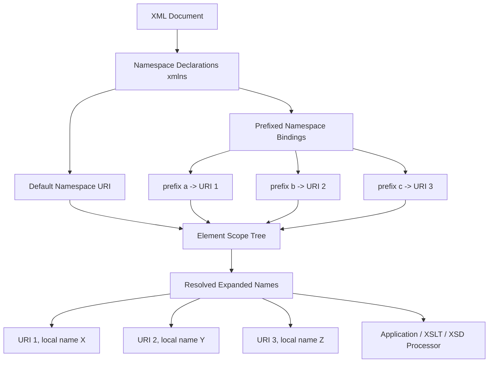
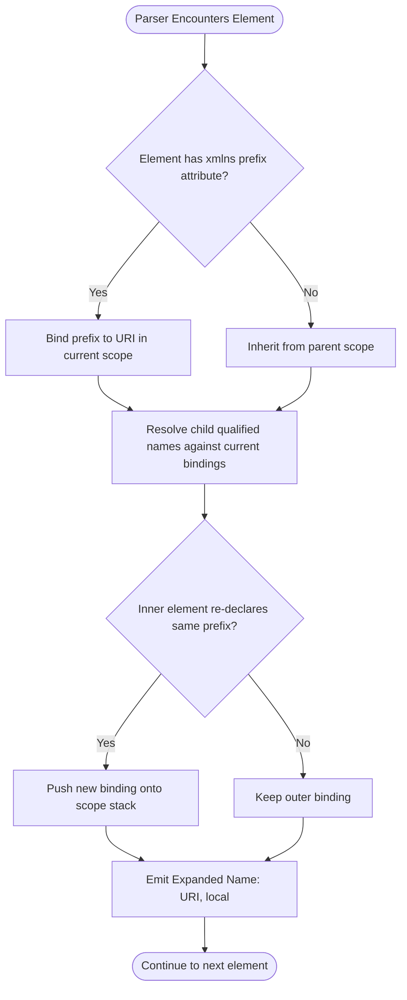
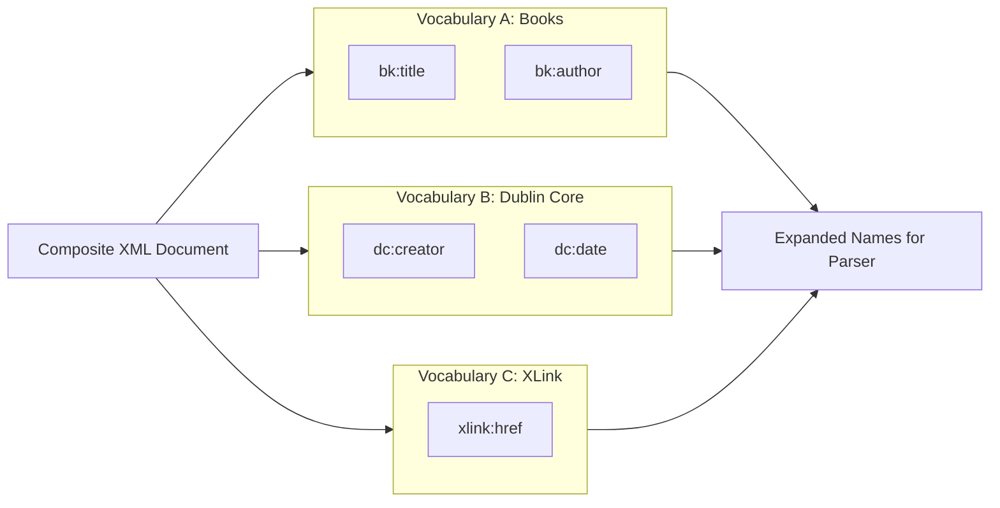
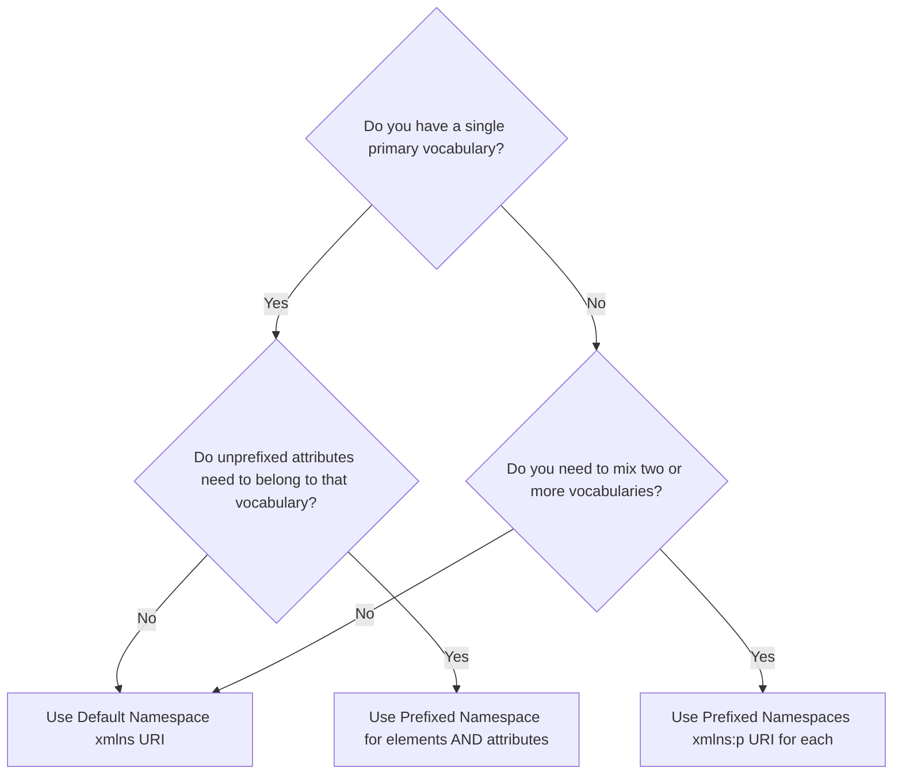
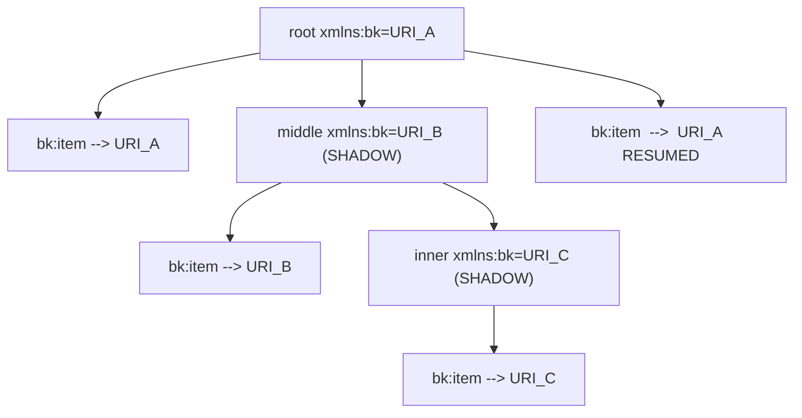

# XML Namespaces

<!-- SECTION_1_START -->

# XML Namespaces: A Foundational Guide for KTU Web Programming

> [!IMPORTANT]
> **KTU 2024 Scheme | OECST832 — Web Programming | Module 1**
> XML Namespaces are a *high-weightage* topic in the KTU 2024 syllabus under "Creating web page using HTML5 / XML Foundations." Expect direct questions on declaration syntax, prefixing rules, and conflict resolution.

## 1.1 Formal Academic Definition

An **XML Namespace** is a **W3C-standardized mechanism** (officially *Namespaces in XML 1.0*, Recommendation dated **14 January 1999**) used to qualify element and attribute names in an Extensible Markup Language document by associating them with a **Uniform Resource Identifier (URI) reference**. The purpose is to provide **globally unique, disambiguated names** for elements and attributes when XML vocabularies from different sources are combined in a single document — a phenomenon called **name collision**.

$$ \text{NamespaceName} = \{\,\text{prefix}\,,\text{URI}\,\} \quad \text{where } \text{URI} \in \mathbb{U}_{RFC\,3986} $$

The namespace itself is **NOT** the URI used to identify it. Two XML documents may use different prefixes (e.g., `book:` vs `b:`) but refer to the **same** namespace if their URIs are character-for-character identical.

## 1.2 Intuitive Analogy — The "Family Name" Concept

Imagine a classroom where two students are named **Rahul** and two are named **Anu**. To call them out unambiguously, the teacher uses their family names (surnames). XML Namespaces work **exactly the same way**:

| Real World | XML Equivalent |
|---|---|
| Person's first name (e.g., *Rahul*) | Local element/attribute name (e.g., `title`) |
| Person's surname (e.g., *Menon*) | **Namespace prefix** (e.g., `bk:title`) |
| Official ID card (UID) | **Namespace URI** (e.g., `http://example.com/books`) |
| Government-issued ID system | **Namespace declaration** |

> [!NOTE]
> **Critical Misconception Clarified**: The W3C does **not** require the namespace URI to be *dereferenceable* (i.e., you do NOT have to visit the URL in a browser). The URI is treated purely as a **unique string identifier** — a globally unique "name stamp."

## 1.3 When Do We Need Namespaces?

Namespaces become mandatory the moment an XML document **merges vocabularies from multiple domains**. Classical scenarios include:

- An **XSLT stylesheet** (xslt:) transforming an XML document (bk:) containing MathML (mml:) and SVG (svg:) fragments.
- A **SOAP envelope** (soap:) wrapping application-specific payload (app:).
- An **XHTML+RDFa** document mixing XHTML (default) and Dublin Core metadata (dc:).

> [!TIP]
> **KTU 2024 Quick Exam Tip**: If an examiner asks *"Why are namespaces required?"* the model answer is: *"To avoid element/attribute name conflicts when elements of the same name but different vocabularies are used together in the same XML document."*

<!-- SECTION_1_END -->

<!-- SECTION_2_START -->

# Deep Theoretical Analysis & KTU High-Yield Formula Sheet

## 2.1 Operational Anatomy of a Namespace

A namespace is operationalised in an XML document through **three tightly coupled components**:

1. **The URI (Universal Resource Identifier)** — a globally unique character string (most commonly a URL, but a URN is also valid).
2. **The Prefix** — a short mnemonic string bound to the URI via the `xmlns:prefix` attribute.
3. **The Local Name** — the element/attribute name itself, qualified by the prefix.

The **Expanded Name** of an element/attribute is then the pair `{namespaceURI, localName}` — this is the truly unique identifier resolved by the XML parser.

> [!IMPORTANT]
> The **prefix is syntactic sugar**; the **URI is semantic truth**. Two elements with different prefixes but the *same* URI belong to the *same* namespace. The parser ultimately maps every qualified name back to its `{URI, localName}` pair.

## 2.2 Namespace Declaration Syntax — The Two Forms

### Form 1: Prefixed Namespace (Non-Default)
Declared using the special-purpose reserved attribute `xmlns:prefix`. The prefix is then attached to every element/attribute belonging to that vocabulary.

```xml
<root xmlns:book="http://example.com/book-schema">
    <book:title>XML Foundations</book:title>
    <book:author>KTU Board</book:author>
</root>
```

### Form 2: Default Namespace (Unprefixed)
Declared using the bare `xmlns` attribute. All unprefixed child elements inherit this namespace unless they override it.

```xml
<book xmlns="http://example.com/book-schema">
    <title>XML Foundations</title>
    <author>KTU Board</author>
</book>
```

> [!WARNING]
> **Default namespaces do NOT apply to attributes.** An unprefixed attribute is *never* in any namespace (it is considered to be in the *empty namespace*). This is one of the most heavily tested KTU pitfalls.

## 2.3 Scope, Nesting, and Override Rules

The scope of a namespace declaration is the **element on which it is declared and all of its descendants**, until:

- The end of the document is reached, **or**
- A descendant element **re-declares** the same prefix with a different URI (shadowing/overriding).

```xml
<root xmlns:a="URI_1">
    <a:item />          <!-- in URI_1 -->
    <child xmlns:a="URI_2">
        <a:item />      <!-- in URI_2 (overridden) -->
    </child>
</root>
```

## 2.4 The KTU High-Yield Formula Sheet

| # | Rule / Construct | Syntax | Behaviour | Common Pitfall |
|---|---|---|---|---|
| 1 | Prefixed namespace declaration | `xmlns:pfx="URI"` | Binds prefix `pfx` to URI | Prefix is **case-sensitive** |
| 2 | Default namespace declaration | `xmlns="URI"` | Applies to unprefixed **elements** | Does **NOT** apply to attributes |
| 3 | Reserved `xml` prefix | `xml:lang`, `xml:space` | Always bound to `http://www.w3.org/XML/1998/namespace` | Cannot be re-declared |
| 4 | Reserved `xmlns` prefix | — | Used only for declaration | Cannot be used as a normal prefix |
| 5 | Unprefixed attribute | `attr="val"` | In **no namespace** (empty namespace) | Often forgotten by students |
| 6 | Scope of declaration | Element + descendants | Ends at end-tag or re-declaration | Inner declaration **shadows** outer |
| 7 | URI uniqueness | `http://...`, `urn:...` | Compared character-by-character | Trailing slash `\,/$` matters! |
| 8 | Qualified element | `<pfx:element>` | Expanded name is `{URI, element}` | Two prefixes, same URI → same NS |
| 9 | Default NS override | `xmlns=""` | Removes inherited default NS | Useful when child belongs to no NS |
| 10 | XLink, XSI special | `xlink:href`, `xsi:type` | Industry-standard prefixes | Not auto-declared; must be declared |

> [!NOTE]
> **Engineering Utility**: Namespaces are the *backbone* of every enterprise XML standard — **XSLT 1.0/2.0/3.0**, **XSD (XML Schema)**, **WSDL (Web Services Description Language)**, **SOAP 1.1/1.2**, **RDF/XML**, **Office Open XML (DOCX/XLSX)**, and **SAML 2.0 tokens**. Without namespaces, none of these standards could coexist in a single payload.

## 2.5 Real-World Engineering Use Cases

- **Web Services (SOAP/WSDL)**: A SOAP envelope containing authentication headers (wsse:), body content (s:), and application payload (app:) — all distinguished by namespaces.
- **Browser DOM**: Modern HTML5 parsers internally treat SVG and MathML fragments as XML embedded in HTML, with their own namespaces.
- **Document Engineering**: Microsoft's `.docx` and `.xlsx` files are ZIP archives of XML documents with multiple internal namespaces for styles, themes, relationships, and content.

<!-- SECTION_2_END -->

<!-- SECTION_3_START -->

# Step-by-Step Derivations & Symbolic Implementation

## 3.1 Worked Example 1 — Name Collision Demonstration (Without Namespace)

Consider a document that needs to display both a *book table* (HTML-like table) and a *periodic table* (chemistry). Both vocabularies use the element `<table>`. Without namespaces, the parser cannot distinguish them.

```xml
<?xml version="1.0" encoding="UTF-8"?>
<document>
    <table>
        <tr><td>Row 1</td></tr>
    </table>
    <table>
        <element>Hydrogen</element>
        <symbol>H</symbol>
    </table>
</document>
```

**Problem:** Both `<table>` elements are semantically different but the parser sees them as the same name. This is a **name collision**.

## 3.2 Worked Example 2 — Resolving the Collision (With Namespaces)

We now resolve the collision by assigning **two distinct URIs** to the two vocabularies and binding each to a unique prefix.

```xml
<?xml version="1.0" encoding="UTF-8"?>
<document xmlns:html="http://www.w3.org/1999/xhtml"
          xmlns:chem="http://example.org/chemistry">

    <!-- HTML-style table (now qualified) -->
    <html:table>
        <html:tr>
            <html:td>Row 1, Cell 1</html:td>
            <html:td>Row 1, Cell 2</html:td>
        </html:tr>
    </html:table>

    <!-- Chemistry table (now qualified) -->
    <chem:table>
        <chem:element>Hydrogen</chem:element>
        <chem:symbol>H</chem:symbol>
        <chem:atomicNumber>1</chem:atomicNumber>
    </chem:table>

</document>
```

**Step-by-step resolution logic:**

1. **Line 2** declares prefix `html` bound to URI `http://www.w3.org/1999/xhtml`.
2. **Line 3** declares prefix `chem` bound to URI `http://example.org/chemistry`.
3. The parser now expands `<html:table>` to `{http://www.w3.org/1999/xhtml, table}` and `<chem:table>` to `{http://example.org/chemistry, table}`.
4. These are **two completely different expanded names** → the collision is resolved.

## 3.3 Worked Example 3 — Default Namespace + Attribute Caveat

The following example demonstrates that default namespaces apply to **elements only**, not to attributes.

```xml
<?xml version="1.0" encoding="UTF-8"?>
<book xmlns="http://example.com/books"
      xmlns:dc="http://purl.org/dc/elements/1.1/"
      year="2024">

    <title>Namespace Mastery</title>
    <!-- ^ element 'title' is in http://example.com/books -->

    <dc:creator>KTU Board</dc:creator>
    <!-- ^ element 'creator' is in http://purl.org/dc/elements/1.1/ -->

    <author id="a1">Examiner A</author>
    <!--   ^ attribute 'id' is in NO namespace -->
    <!--   ^ element 'author' IS in the default namespace -->

    <chapter number="1" xlink:href="#ch1"
             xmlns:xlink="http://www.w3.org/1999/xlink">
        Introduction
    </chapter>

</book>
```

**Resolution table produced by the parser:**

$$
\begin{aligned}
\text{book}     &\rightarrow \{\,\text{http://example.com/books}\,,\, \text{book}\,\} \\
\text{title}    &\rightarrow \{\,\text{http://example.com/books}\,,\, \text{title}\,\} \\
\text{dc:creator} &\rightarrow \{\,\text{http://purl.org/dc/elements/1.1/}\,,\, \text{creator}\,\} \\
\text{year}     &\rightarrow \{\,\epsilon\,,\, \text{year}\,\} \quad \text{(empty namespace)} \\
\text{id}       &\rightarrow \{\,\epsilon\,,\, \text{id}\,\} \quad \text{(empty namespace)} \\
\text{xlink:href} &\rightarrow \{\,\text{http://www.w3.org/1999/xlink}\,,\, \text{link}\,\} \quad \text{(typo? No — it's `href`, local name is `href`)}
\end{aligned}
$$

> [!WARNING]
> **Exam Trap (KTU Repeated)**: A default namespace declared on an element does **NOT** propagate to its attributes. Many students wrongly write that `year="2024"` is in the `books` namespace. It is **not** — it has no namespace at all.

## 3.4 Worked Example 4 — Nested Override (Shadowing)

```xml
<?xml version="1.0" encoding="UTF-8"?>
<root xmlns:a="http://outer.example.com">
    <a:item id="i1">
        <!-- a:item is in http://outer.example.com -->
    </a:item>
    <middle xmlns:a="http://middle.example.com">
        <a:item id="i2">
            <!-- a:item is in http://middle.example.com (SHADOWED) -->
        </a:item>
        <inner xmlns:a="http://inner.example.com">
            <a:item id="i3">
                <!-- a:item is in http://inner.example.com (SHADOWED AGAIN) -->
            </a:item>
        </inner>
    </middle>
    <a:item id="i4">
        <!-- a:item is back in http://outer.example.com (RESUMED) -->
    </a:item>
</root>
```

**Exhaustive mapping:**

| Element | Prefix Bound | Effective URI |
|---|---|---|
| `root/a:item` (id="i1") | `a` (outer) | `http://outer.example.com` |
| `middle/a:item` (id="i2") | `a` (middle) | `http://middle.example.com` |
| `inner/a:item` (id="i3") | `a` (inner) | `http://inner.example.com` |
| `root/a:item` (id="i4") | `a` (outer, resumed) | `http://outer.example.com` |

## 3.5 Worked Example 5 — Validation Snippet (XSD Reference)

The following XSD fragment shows how a *targetNamespace* declaration in XML Schema **mirrors** the document's namespace usage. This is the production-grade way to declare namespaces for validatable documents.

```xml
<?xml version="1.0" encoding="UTF-8"?>
<xs:schema xmlns:xs="http://www.w3.org/2001/XMLSchema"
           targetNamespace="http://example.com/books"
           xmlns:bk="http://example.com/books"
           elementFormDefault="qualified">

    <xs:element name="book">
        <xs:complexType>
            <xs:sequence>
                <xs:element name="title" type="xs:string"/>
                <xs:element name="author" type="xs:string"/>
            </xs:sequence>
        </xs:complexType>
    </xs:element>
</xs:schema>
```

**The `elementFormDefault="qualified"` flag** dictates that *every* element in the instance document **must** be namespace-qualified. Setting it to `"unqualified"` would allow unprefixed element names in instances.

## 3.6 Python Code — Programmatic Resolution of Expanded Names

The following fully type-annotated Python 3.10+ script demonstrates how a real-world parser resolves the `{URI, localName}` pairs.

```python
"""
xml_namespace_resolver.py
Demonstrates programmatic resolution of XML namespace qualified names.
Compatible with Python 3.10+
"""

from __future__ import annotations
from typing import Dict, Tuple, List
from xml.etree import ElementTree as ET
import logging
import sys

# Configure structured error logging
logging.basicConfig(
    level=logging.INFO,
    format="%(asctime)s [%(levelname)s] %(message)s",
    handlers=[logging.StreamHandler(sys.stdout)]
)
logger = logging.getLogger("NSResolver")

# Type alias for an expanded XML name
ExpandedName = Tuple[str, str]  # (namespace_uri, local_name)


class NamespaceResolver:
    """
    Resolves prefixed element names into {URI, localName} expanded names,
    mimicking the W3C Namespaces 1.0 specification.
    """

    def __init__(self) -> None:
        # Map: prefix -> URI
        self._bindings: Dict[str, str] = {
            "xml": "http://www.w3.org/XML/1998/namespace",
            "xmlns": "http://www.w3.org/2000/xmlns/",
        }
        self._default_uri: str = ""

    def declare(self, prefix: str, uri: str) -> None:
        """Bind a prefix to a URI (or set the default NS if prefix is empty)."""
        if not uri or not uri.strip():
            raise ValueError(f"Refusing to declare empty URI for prefix '{prefix}'")
        if prefix == "xmlns":
            raise ValueError("The 'xmlns' prefix is reserved and cannot be redeclared")
        if prefix == "xml":
            raise ValueError("The 'xml' prefix is reserved and cannot be redeclared")
        if prefix == "":
            self._default_uri = uri
            logger.info("Default namespace set to: %s", uri)
        else:
            self._bindings[prefix] = uri
            logger.info("Declared prefix '%s' -> %s", prefix, uri)

    def resolve(self, qualified_name: str) -> ExpandedName:
        """
        Convert a Clark-notation input or prefixed name into the canonical
        expanded name tuple.
        """
        if qualified_name.startswith("{"):
            # Clark notation: {uri}local
            closing = qualified_name.find("}")
            if closing == -1:
                raise ValueError(f"Malformed Clark notation: {qualified_name}")
            uri = qualified_name[1:closing]
            local = qualified_name[closing + 1:]
            return (uri, local)

        if ":" in qualified_name:
            prefix, local = qualified_name.split(":", 1)
            if prefix not in self._bindings:
                raise KeyError(f"Undeclared namespace prefix: '{prefix}'")
            return (self._bindings[prefix], local)

        # Unprefixed: uses the default namespace
        return (self._default_uri, qualified_name)

    def all_bindings(self) -> Dict[str, str]:
        return dict(self._bindings)


def demonstrate_parsing() -> None:
    """Walk through a real XML document using xml.etree and show expanded names."""
    xml_doc = """<?xml version="1.0"?>
<bk:book xmlns:bk="http://example.com/books"
         xmlns:dc="http://purl.org/dc/elements/1.1/">
    <bk:title>XML Mastery</bk:title>
    <dc:creator>KTU Board</dc:creator>
    <bk:year>2024</bk:year>
</bk:book>"""

    root: ET.Element = ET.fromstring(xml_doc)
    print("\n--- Expanded Name Resolution ---")
    for element in root.iter():
        # ET represents expanded names in Clark notation internally
        print(f"  Tag {element.tag!r:60s} -> "
              f"URI = '{element.tag.split('}')[0][1:]}'  |  "
              f"Local = '{element.tag.split('}')[-1]}'")


if __name__ == "__main__":
    resolver = NamespaceResolver()
    resolver.declare("bk", "http://example.com/books")
    resolver.declare("dc", "http://purl.org/dc/elements/1.1/")

    print("--- Resolver Test ---")
    for qname in ["bk:title", "dc:creator", "plainelement", "{urn:isbn}isbn"]:
        expanded: ExpandedName = resolver.resolve(qname)
        print(f"  {qname!r:35s} -> {expanded}")

    demonstrate_parsing()
```

**Expected output (excerpt):**

```text
--- Resolver Test ---
  'bk:title'                            -> ('http://example.com/books', 'title')
  'dc:creator'                          -> ('http://purl.org/dc/elements/1.1/', 'creator')
  'plainelement'                        -> ('', 'plainelement')
  '{urn:isbn}isbn'                      -> ('urn:isbn', 'isbn')

--- Expanded Name Resolution ---
  Tag '{http://example.com/books}book'           -> URI = 'http://example.com/books'  |  Local = 'book'
  Tag '{http://example.com/books}title'          -> URI = 'http://example.com/books'  |  Local = 'title'
  Tag '{http://purl.org/dc/elements/1.1/}creator'-> URI = 'http://purl.org/dc/elements/1.1/'  |  Local = 'creator'
  Tag '{http://example.com/books}year'           -> URI = 'http://example.com/books'  |  Local = 'year'
```

<!-- SECTION_3_END -->

<!-- SECTION_4_START -->

# Structural Diagrams & Schematics

## 4.1 High-Level Namespace Architecture (Block Diagram)



## 4.2 Scope and Override Resolution Flow



## 4.3 Modular Vocabulary Composition Pattern



## 4.4 Decision Matrix — Default vs Prefixed Namespace



> [!TIP]
> **KTU Drawing Tip**: When the question asks you to *"draw the namespace scope tree,"* sketch a parent-child diagram similar to **Diagram 4.2** above, annotate each node with its effective prefix binding, and explicitly mark **shadowing** with a dashed arrow.

<!-- SECTION_4_END -->

<!-- SECTION_5_START -->

# KTU 2024 Scheme Examination Question Bank & Topic Recap

---

## Part A — 3 Mark Questions (Remember / Understand)

### Question 1
**[KTU University Exam - July 2024, CO1, Remember]**
*Define XML namespace. What problem does it solve?*

**Model Answer (3 Marks):**
An XML namespace is a W3C-recommended mechanism (Recommendation dated 14-January-1999) that qualifies element and attribute names in an XML document by associating them with a unique Uniform Resource Identifier (URI). It solves the problem of **name collisions** that occur when XML documents combine elements/attributes from multiple vocabularies that happen to share the same local name. *[Definition: 1 Mark]* *[Name collision problem: 1 Mark]* *[URI uniqueness principle: 1 Mark]*.

### Question 2
**[KTU University Exam - Dec 2023, CO1, Understand]**
*Distinguish between a prefixed namespace and a default namespace with suitable examples.*

**Model Answer (3 Marks):**

| Aspect | Prefixed Namespace | Default Namespace |
|---|---|---|
| Attribute | `xmlns:pfx="URI"` | `xmlns="URI"` |
| Element usage | `<pfx:element>` | `<element>` |
| Applies to attributes? | Yes | **No** |
| Typical use | Multi-vocabulary mixing | Single-vocabulary documents |

*[Two differences: 2 Marks]* *[Example code: 1 Mark]*.

---

## Part B — 14 Mark Questions (Apply / Analyse)

### Question A — Internal Choice Option 1
**[KTU University Exam - July 2024, CO2, Apply / Analyse]**

**(a)** Explain the concept of XML namespaces in detail. Discuss the role of URIs and prefixes with a neat diagram showing scope and override. **[7 Marks]**

**(b)** Write a well-formed XML document that uses **three** different namespaces: a default namespace for "library" vocabulary, a prefixed namespace for "publisher" vocabulary, and a prefixed namespace for "XLink." Demonstrate namespace shadowing by re-declaring the "publisher" prefix inside a nested element. **[7 Marks]**

#### Model Solution

**(a) Conceptual Explanation [7 Marks]**

- **Definition** of XML Namespace (W3C standard): *[1 Mark]*
- **Components**: URI + Prefix + Local Name → Expanded Name `{URI, localName}`. *[1 Mark]*
- **Why URI is not required to be dereferenceable**: it is purely an opaque unique string. *[1 Mark]*
- **Declaration rules**: `xmlns:prefix="URI"` and `xmlns="URI"`. *[1 Mark]*
- **Scope and shadowing rule**: declaration applies to element + descendants, until overridden. *[1 Mark]*
- **Attribute rule**: default namespace does not apply to unprefixed attributes. *[1 Mark]*
- **Diagram** showing scope tree: *[1 Mark]*

**Scope and Override Diagram (model):**



**(b) Coding Solution [7 Marks]**

```xml
<?xml version="1.0" encoding="UTF-8"?>
<library xmlns="http://example.com/library"
         xmlns:pub="http://example.com/publisher"
         xmlns:xlink="http://www.w3.org/1999/xlink">

    <book id="b001">
        <title>Web Programming</title>
        <author>KTU Author</author>
        <publication>
            <pub:publisher>KTU Publications</pub:publisher>
            <pub:year>2024</pub:year>
        </publication>
        <cover xlink:href="cover.jpg"
               xlink:type="simple"/>
    </book>

    <specialCollection>
        <!-- Re-declare 'pub' prefix with a NEW URI (shadowing) -->
        <pub:publisher xmlns:pub="http://example.com/special-edition">
            <pub:edition>Limited</pub:edition>
            <pub:printRun>500</pub:printRun>
        </pub:publisher>
    </specialCollection>

</library>
```

**Valuation Key:**

- *Correct root-level declaration of all three namespaces:* **[2 Marks]**
- *Correct usage of default namespace on `<library>`, `<book>`, `<title>`:* **[1 Mark]**
- *Correct prefixed usage for `pub:` and `xlink:`:* **[1 Mark]**
- *Demonstration of shadowing with re-declared `pub:` on inner element:* **[2 Marks]**
- *Well-formed XML (proper closing tags, no syntax errors):* **[1 Mark]**

---

### Question B — Internal Choice Option 2
**[KTU University Exam - Dec 2023, CO2, Apply / Analyse]**

**(a)** With a suitable example, explain the difference between *default namespace* and *prefixed namespace* in XML. Why is a default namespace not applicable to attributes? **[7 Marks]**

**(b)** An XML document is required to store a *student record* with the following requirements: (i) one default namespace for student details, (ii) a prefixed namespace for course details, (iii) a prefixed namespace for the institute, and (iv) demonstration of the use of `xml:lang` attribute. Write the XML code. **[7 Marks]**

#### Model Solution

**(a) Default vs Prefixed Namespace [7 Marks]**

**Default Namespace:** Declared using the bare `xmlns` attribute. Applies to all *unprefixed child elements* within its scope.

```xml
<book xmlns="http://example.com/book">
    <title>Hello</title>     <!-- in default NS -->
</book>
```

**Prefixed Namespace:** Declared using `xmlns:prefix`. The prefix is *explicitly attached* to every element and (if desired) every attribute.

```xml
<bk:book xmlns:bk="http://example.com/book">
    <bk:title>Hello</bk:title>
    <bk:title lang="en">Hello</bk:title>
</bk:book>
```

*Why default namespaces do not apply to attributes:*

The W3C Namespaces 1.0 Recommendation explicitly states: *"The namespace name for an unprefixed attribute name always has no value."* The reasoning is historical — when Namespaces 1.0 was finalised in 1999, most existing XML vocabularies had unprefixed attributes that did not belong to any namespace, and changing this would have broken backward compatibility. *[1 Mark for the rule]* *[1 Mark for the historical rationale]*.

**Comparison Table (additional credit):**

| Property | Default NS | Prefixed NS |
|---|---|---|
| Affects unprefixed elements? | Yes | No |
| Affects unprefixed attributes? | **No** | No |
| Affects prefixed elements? | No | Yes |
| Affects prefixed attributes? | No | Yes |
| Declaration syntax | `xmlns="URI"` | `xmlns:p="URI"` |

*[Correct comparison: 2 Marks]* *[Example for each: 1 Mark]* *[Rationale for attribute rule: 2 Marks]* *[Final summary statement: 1 Mark]*.

**(b) XML Code for Student Record [7 Marks]**

```xml
<?xml version="1.0" encoding="UTF-8"?>
<studentRecord xmlns="http://example.com/student"
               xmlns:course="http://example.com/course"
               xmlns:inst="http://example.com/institute"
               xml:lang="en-IN">

    <student id="S101">
        <name>Anu Menon</name>
        <rollNumber>42</rollNumber>
        <course:enrollment>
            <course:code>CS301</course:code>
            <course:title>Web Programming</course:title>
            <course:credits>4</course:credits>
        </course:enrollment>
        <course:enrollment>
            <course:code>CS302</course:code>
            <course:title>Database Systems</course:title>
            <course:credits>3</course:credits>
        </course:enrollment>
        <inst:instituteCode>KTU-Kerala</inst:instituteCode>
        <inst:department>Computer Science</inst:department>
    </student>

    <student id="S102" xml:lang="ml-IN">
        <name>Rahul Nair</name>
        <rollNumber>43</rollNumber>
        <inst:instituteCode>KTU-Kerala</inst:instituteCode>
    </student>

</studentRecord>
```

**Valuation Key:**

- *Correct declaration of default + two prefixed namespaces:* **[2 Marks]**
- *Proper use of default NS for student elements:* **[1 Mark]**
- *Proper use of `course:` and `inst:` prefixes:* **[2 Marks]**
- *Correct usage of `xml:lang` (note: `xml` prefix is auto-declared):* **[1 Mark]**
- *Well-formed closing tags and proper nesting:* **[1 Mark]**

---

> [!WARNING]
> **KTU Examiner's Valuation Pitfalls — Read Carefully**
>
> 1. **Do not confuse prefix with namespace.** The prefix (`bk:`) is *syntactic*; the URI (`http://...`) is *semantic*. Writing *"the namespace of `bk:title` is `bk`"* loses 1 mark. The correct answer is *"the namespace of `bk:title` is `http://example.com/books`."*
> 2. **Do not write that default namespaces apply to attributes.** This is a guaranteed 1-mark deduction in nearly every KTU valuation.
> 3. **Do not forget the `<?xml version="1.0" encoding="UTF-8"?>` prolog.** Many students drop it in long examples and lose a half-mark.
> 4. **Do not invent URIs that look like filesystem paths** (e.g., `file:///C:/books`). URIs *can* be file paths but it is poor practice. Use a `http://example.com/...` scheme.
> 5. **Do not write `xmlns:p="URI"` on an element that does not use the prefix `p`.** Unused declarations are syntactically valid but considered poor style and may be commented on by the examiner.
> 6. **In shadowing diagrams, always show the resumed outer binding** after the inner element closes — examiners often check that students understand scope is a *stack* and not a permanent change.

---

## Topic Recap & Important Things to Remember

- **XML Namespace** is a W3C standard (Recommendation, **14-January-1999**) that gives element/attribute names a globally unique identity.
- A namespace is identified by a **URI** (typically a URL, but a URN is also valid). The URI is **not required to be dereferenceable**.
- The **prefix** is a short mnemonic bound to a URI; the *expanded name* is the pair `{namespaceURI, localName}`.
- **Two declaration forms**: `xmlns:prefix="URI"` (prefixed) and `xmlns="URI"` (default).
- **Default namespace** applies to *unprefixed elements only*; it does **NOT** apply to *unprefixed attributes*.
- The reserved prefixes **`xml`** and **`xmlns`** are bound to fixed URIs and cannot be re-declared.
- **Scope** of a declaration is the declaring element + all descendants; an inner redeclaration **shadows** the outer binding.
- After the inner element ends, the **outer binding is automatically resumed** (scope-stack semantics).
- Two different prefixes pointing to the *same* URI are still the *same* namespace — prefix is purely a syntactic convenience.
- Use **prefixed namespaces** when mixing multiple vocabularies; use **default namespaces** when one vocabulary dominates.
- The `xml:lang` and `xml:space` attributes are special — they belong to the `xml` namespace and are always available.
- In **XSD**, the `targetNamespace` and `elementFormDefault` attributes control how the schema's namespace is enforced on instance documents.
- Namespaces are foundational to **XSLT, XSD, SOAP, WSDL, XHTML+SVG/MathML, RDF/XML, OOXML, SAML**, and virtually every enterprise XML standard.
- In Clark notation (used internally by parsers like Xerces and `xml.etree`), a qualified name is written as `{URI}localName`.
- **The URI is the truth; the prefix is the sugar.** Always carry both pieces of information when explaining a namespace to an examiner.

<!-- SECTION_5_END -->
