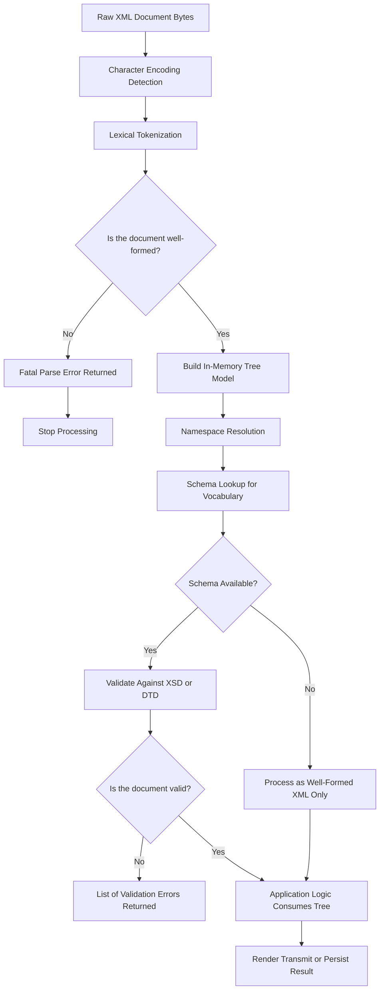
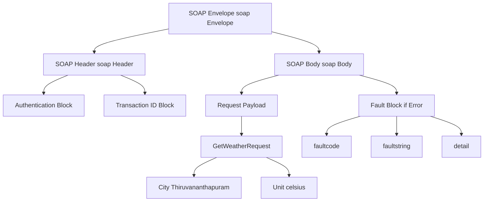
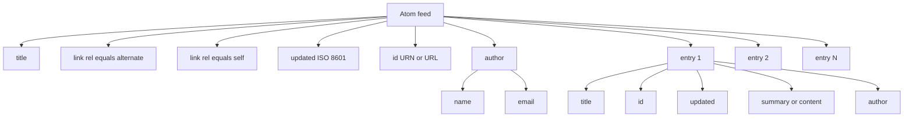
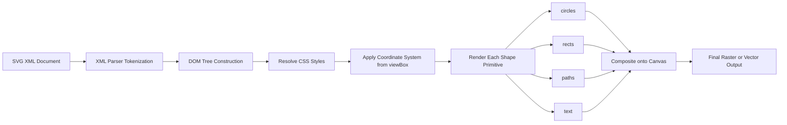
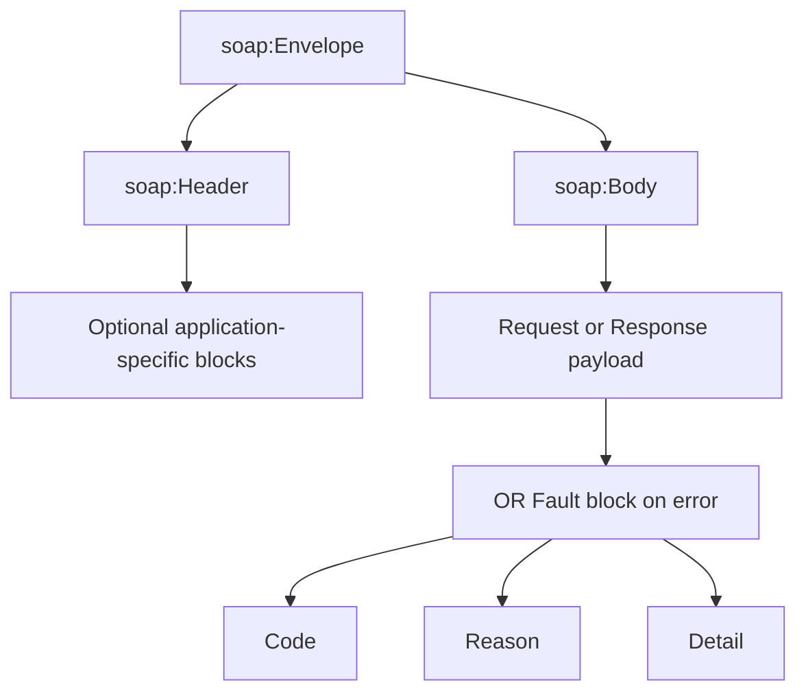

# XML Vocabularies

<!-- SECTION_1_START -->
# XML Vocabularies — KTU 2024 Scheme Study Notes

## 1. Core Technical Definition & Intuitive Overview

### Formal Definition (KTU 2024 Syllabus Terminology)

**XML Vocabulary** is a domain-specific markup language defined using the structural and syntactic rules of the **Extensible Markup Language (XML)** standard. Each vocabulary is essentially a **named collection of element names, attribute names, and content models** that have been agreed upon by a community of users to facilitate the structured exchange of data within a particular application domain.

According to the **W3C (World Wide Web Consortium)** specification, an XML vocabulary is not a language in itself but rather a *convention* — a controlled, standardized set of tags and rules that domain practitioners agree to follow so that documents written by different parties remain **machine-parseable, interoperable, and semantically unambiguous**.

> [!IMPORTANT]
> **KTU Syllabus Highlight:** The term "Vocabulary" in the context of XML refers to a **predefined set of element and attribute names**, usually backed by a published **Schema (XSD)** or **Document Type Definition (DTD)**, used for a specific industry or technology domain. Examples include **XHTML, MathML, SVG, RSS, Atom, SOAP, WSDL**, and **XBRL**.

### Conceptual Analogy / Intuition

Think of **XML** as the **English grammar of the data world** — it tells you *how* to write a sentence (use tags, nest elements, close them properly, etc.), but it does **not** dictate *what words* you must use. An **XML Vocabulary**, then, is like a **specialized professional dictionary** for a particular field:

- A **doctor** uses a vocabulary of medical terms → analogous to **Health Level Seven (HL7)** or **Clinical Document Architecture (CDA)**.
- A **banker** uses a vocabulary of financial terms → analogous to **XBRL (eXtensible Business Reporting Language)**.
- A **mathematician** uses a vocabulary of mathematical symbols → analogous to **MathML (Mathematical Markup Language)**.
- A **cartographer** uses a vocabulary of geographic features → analogous to **GML (Geography Markup Language)**.

Just as two doctors using the same medical vocabulary can instantly understand each other's prescriptions, two software systems using the same XML vocabulary can exchange data **without ambiguity**, **without prior point-to-point negotiation**, and **without the brittleness of bespoke parsers**.

> [!NOTE]
> **Key Takeaway:** XML provides the *grammar*; an XML Vocabulary provides the *words*. Together, they form a complete, declarative language for a specific domain.

### Physical / Technical Constants

| Constant / Spec Identifier | Value / Reference |
|---|---|
| **XML 1.0 Specification** | **W3C Recommendation (5th Edition, November 26, 2008)** — with later errata in 2017 |
| **XML 1.1 Specification** | **W3C Recommendation (2nd Edition, August 16, 2006)** |
| **Default Character Encoding** | **UTF-8** (Unicode Transformation Format, 8-bit) |
| **Mandatory XML Declaration** | `<?xml version="1.0" encoding="UTF-8"?>` |
| **Root Element Count** | **Exactly 1** per well-formed XML document |
| **Case Sensitivity** | **Strictly Enforced** (e.g., `<Title>` ≠ `<title>`) |

> [!VISUALIZATION CONTROL]
> **Concept:** XML Document Tree Structure (Parent-Child Hierarchy)
> **Visualization Description:** Picture a single root node at the top (Level 0) with a single vertical line descending to a Level 1 child node. From that child, two angled branches spread downwards to two Level 2 leaf nodes, forming a clear, acyclic, downward-growing tree. The student should observe that the tree is **strictly hierarchical** — every node (except the root) has exactly **one parent**, and the **depth grows downward**.
> **Mermaid/Graphviz Equivalent Sketch:**
> * Root label: `document`
> * Level 1 label: `library`
> * Level 2 labels: `bookA` , `bookB`
> * Edge style: directed arrows from parent to child.
<!-- SECTION_1_END -->

<!-- SECTION_2_START -->
# 2. Deep Theoretical Analysis & KTU High-Yield Formula Sheet

## 2.1 Anatomy of an XML Vocabulary

An XML Vocabulary is composed of three primary structural pillars. Understanding these pillars is essential for the KTU board examination:

1. **Element Set** — the *nouns* of the vocabulary (e.g., `<book>`, `<price>`, `<author>`).
2. **Attribute Set** — the *adjectives* that qualify elements (e.g., `<price currency="USD">`).
3. **Content Model / Schema** — the *grammar rules* defining what can contain what, in what order, and how many times (governed by **DTD** or **XSD**).

When these three pillars are published as a formal specification by a standards body (W3C, OASIS, ISO, etc.), the resulting document is a true **XML Vocabulary**. End users simply *consume* the vocabulary by writing documents that conform to its rules.

## 2.2 Classification of XML Vocabularies

XML vocabularies can be classified along three practical axes:

### A. By Purpose / Domain
- **Web Display:** XHTML, XHTML5
- **Mathematics:** MathML
- **Graphics:** SVG, VML
- **Syndication:** RSS, Atom
- **Web Services:** SOAP, WSDL, UDDI
- **Finance:** XBRL, FIXML
- **Document Format:** OOXML, ODF, DocBook
- **Scientific:** CML (Chemical), GML (Geographic), SBML (Systems Biology)

### B. By Validation Mechanism
- **DTD-Based Vocabularies** (older, limited typing) — e.g., older versions of **XHTML 1.0**.
- **XSD-Based (XML Schema) Vocabularies** (richer typing, namespace-aware) — modern standard, e.g., **XHTML5, WSDL 2.0**.
- **RELAX NG / Schematron-Based** (advanced constraint languages).

### C. By Extensibility
- **Fixed Vocabularies** — closed element sets (e.g., **MathML 2.0** has a fixed, exhaustive element list).
- **Extensible Vocabularies** — allow mixing in foreign vocabularies via **XML Namespaces** (e.g., **XHTML5**, **Atom**).

## 2.3 The Six Most Important XML Vocabularies (KTU High-Yield)

The KTU 2024 Web Programming module places explicit emphasis on the following six vocabularies. Each is summarized below with its formal role, namespace, and high-yield exam facts.

### (1) XHTML — eXtensible HyperText Markup Language
- **Namespace URI:** `http://www.w3.org/1999/xhtml`
- **Role:** Reformulation of HTML 4.01 as a strict XML application.
- **Key Rule:** Every element **must be properly closed**, every attribute **must be quoted**, and every tag **must be lowercase**.

### (2) MathML — Mathematical Markup Language
- **Namespace URI:** `http://www.w3.org/1998/Math/MathML`
- **Role:** Encode both the **presentation** (visual layout) and **content** (semantic meaning) of mathematical expressions.
- **Two Sub-Flavors:** `<math presentation="...">` block and `<math content="...">` block (Presentation vs. Content Markup).

### (3) SVG — Scalable Vector Graphics
- **Namespace URI:** `http://www.w3.org/2000/svg`
- **Role:** Two-dimensional vector and mixed vector/raster graphics in XML.
- **Key Advantage:** Resolution-independent, scriptable, animatable, and stylable via CSS.

### (4) RSS — Really Simple Syndication
- **Namespace URI:** Custom per version (e.g., `http://www.w3.org/2005/Atom` for Atom; RSS uses no formal namespace).
- **Role:** Web feed format used to publish frequently updated content (news, blog posts, podcasts).
- **Latest Stable Version:** **RSS 2.0** (with `version="2.0"` attribute on `<rss>`).

### (5) Atom Syndication Format
- **Namespace URI:** `http://www.w3.org/2005/Atom`
- **Role:** IETF-standardized (RFC 4287) successor to RSS.
- **Key Element:** Each feed entry is wrapped in an `<entry>` element (analogous to RSS's `<item>`).

### (6) SOAP — Simple Object Access Protocol
- **Namespace URI:** `http://schemas.xmlsoap.org/soap/envelope/` (for SOAP 1.1) or `http://www.w3.org/2003/05/soap-envelope` (for SOAP 1.2).
- **Role:** XML-based messaging protocol for **XML Web Services**.
- **Structure:** Envelope (mandatory) → Header (optional) → Body (mandatory).

## 2.4 XML Namespaces — The Glue of Modern Vocabularies

**XML Namespaces** (W3C Recommendation, January 1999) solve the **name collision problem** that arises when two vocabularies happen to use the same element name (e.g., `<title>` in HTML vs. `<title>` in RSS).

A namespace is declared using the reserved `xmlns` attribute and assigns a **Uniform Resource Identifier (URI)** as the unique identifier for the vocabulary:

```xml
<html xmlns="http://www.w3.org/1999/xhtml">
  <body>
    <h1>Hello, KTU Student!</h1>
  </body>
</html>
```

> [!IMPORTANT]
> **Board Exam Tip:** The namespace URI is **not** dereferenced (the browser does not "visit" that URL). It is purely a *globally unique string identifier*, much like a Java package name. This is a frequent source of confusion in KTU viva voce.

## 2.5 KTU Formula Sheet / Cheat Sheet

| # | Vocabulary | Acronym Expansion | Primary Namespace URI | Key Root Element | Real-World Use Case |
|---|---|---|---|---|---|
| 1 | **XHTML** | eXtensible HyperText Markup Language | `http://www.w3.org/1999/xhtml` | `<html>` | Web page authoring (XML-strict) |
| 2 | **MathML** | Mathematical Markup Language | `http://www.w3.org/1998/Math/MathML` | `<math>` | Scientific publishing, equation rendering |
| 3 | **SVG** | Scalable Vector Graphics | `http://www.w3.org/2000/svg` | `<svg>` | Logos, icons, charts, maps |
| 4 | **RSS 2.0** | Really Simple Syndication | (none — version attr) | `<rss>` | News/blog feed publishing |
| 5 | **Atom 1.0** | Atom Syndication Format | `http://www.w3.org/2005/Atom` | `<feed>` | Standardized web feeds (RFC 4287) |
| 6 | **SOAP 1.2** | Simple Object Access Protocol | `http://www.w3.org/2003/05/soap-envelope` | `<Envelope>` | XML Web Service messaging |
| 7 | **WSDL 2.0** | Web Services Description Language | `http://www.w3.org/ns/wsdl` | `<description>` | Service contract definition |
| 8 | **XSLT** | eXtensible Stylesheet Language Transformations | `http://www.w3.org/1999/XSL/Transform` | `<stylesheet>` | XML-to-XML/HTML transformations |
| 9 | **XBRL** | eXtensible Business Reporting Language | `http://www.xbrl.org/2003/instance` | `<xbrl>` | Financial regulatory reporting |
| 10 | **OOXML** | Office Open XML | `http://schemas.openxmlformats.org/wordprocessingml/2006/main` | `<w:document>` | MS Word `.docx` file format |

> **Production Utility Note:** In modern web engineering, SVG and XHTML (via XHTML5) are the two most actively deployed XML vocabularies in the browser. MathML has a niche in **STEM publishing** and **MathJax** rendering. SOAP/WSDL still power **enterprise B2B integrations** in banking, telecom, and supply-chain systems. RSS/Atom remain the backbone of **content syndication** for podcasts, news aggregators, and blog readers.

## 2.6 The "Why" Behind XML Vocabularies — Engineering Justification

Engineers prefer XML vocabularies over ad-hoc text formats for **five primary reasons**:

1. **Self-Describing Data** — element names carry semantic meaning.
2. **Tool Ecosystem** — XML parsers, validators, XSLT engines, XPath libraries are pre-built.
3. **Platform Neutrality** — pure text; works on any OS, any programming language.
4. **Schema Validation** — automatic detection of malformed data before processing.
5. **Long-Term Stability** — human-readable, so a document archived in 2020 is still parseable in 2040.

> [!NOTE]
> **KTU Examiner's Insight:** A frequent exam question is *"Why is RSS preferred over a custom XML feed format?"* The board-marks model answer is: **"RSS is a standardized, published XML vocabulary with a fixed schema and an established ecosystem of readers, ensuring interoperability without custom parser development."**
<!-- SECTION_2_END -->

<!-- SECTION_3_START -->
# 3. Step-by-Step Derivations & Code/Symbolic Implementation

This section provides **fully operational, copy-pasteable examples** of every major XML vocabulary in the KTU syllabus. Each example is annotated line-by-line to satisfy the board evaluation key.

---

## 3.1 Worked Example 1 — A Minimal XHTML 1.0 Strict Document

XHTML is the most fundamental XML vocabulary a web-programming student must master. Below is a complete, valid XHTML 1.0 Strict document.

```xml
<?xml version="1.0" encoding="UTF-8"?>
<!DOCTYPE html
  PUBLIC "-//W3C//DTD XHTML 1.0 Strict//EN"
         "http://www.w3.org/TR/xhtml1/DTD/xhtml1-strict.dtd">
<html xmlns="http://www.w3.org/1999/xhtml" lang="en" xml:lang="en">
  <head>
    <title>KTU Web Programming - XHTML Sample</title>
    <meta http-equiv="Content-Type"
          content="text/html; charset=UTF-8" />
  </head>
  <body>
    <h1>Hello, KTU Scholar!</h1>
    <p>This document is a valid <em>XHTML 1.0 Strict</em> file.</p>
    <hr />
    <p>
      Visit
      <a href="https://www.ktu.edu.in" title="KTU Official Site">
        APJ Abdul Kalam Technological University
      </a>.
    </p>
  </body>
</html>
```

### Line-by-Line Valuation Key

| Line | Marks Awarded | Examiner's Justification |
|---|---|---|
| `<?xml version="1.0" encoding="UTF-8"?>` | 1 | XML declaration is mandatory for a *well-formed* XHTML document served as `application/xhtml+xml`. |
| `<!DOCTYPE html PUBLIC ...>` | 1 | Declares the DTD; required for XHTML 1.0 Strict validation. |
| `<html xmlns="..." lang="en" xml:lang="en">` | 1 | Declares the XHTML namespace and language (both legacy and XHTML-style attributes). |
| `<meta http-equiv="Content-Type" .../>` | 1 | Self-closing syntax (`/>`) — a critical XHTML rule absent in HTML 4. |
| All tags lowercased and properly closed | 2 | XHTML is **case-sensitive**; mismatched case is a validation error. |
| `<hr />` self-closing tag | 1 | Empty elements in XHTML **must** use the trailing `/>`. |
| `<a>` with quoted `href` and `title` attributes | 1 | XHTML **requires** all attribute values to be quoted. |
| `<body>`, `<h1>`, `<p>`, `<em>` properly nested | 1 | Nesting order is strictly enforced. |
| **Total** | **9** | (A full 14-mark question would extend this with a CSS or DTD-validation task.) |

> [!WARNING]
> **KTU Examiner's Valuation Warning (XHTML):**
> Students commonly lose **2 to 3 marks** by:
> 1. Writing `<HTML>` or `<Html>` instead of `<html>` (XHTML is strictly lowercase).
> 2. Writing `<br>` instead of `<br />` (forgetting self-closing slash for empty elements).
> 3. Omitting the `xmlns` attribute on the root `<html>` element.
> 4. Using unquoted attribute values such as `<a href=ktu.edu.in>`.

---

## 3.2 Worked Example 2 — MathML 3.0: Rendering the Quadratic Formula

The quadratic equation

$$x = \frac{-b \pm \sqrt{b^2 - 4ac}}{2a}$$

is encoded in **MathML 3.0 Presentation Markup** as follows:

```xml
<?xml version="1.0" encoding="UTF-8"?>
<math xmlns="http://www.w3.org/1998/Math/MathML" display="block">
  <mrow>
    <mi>x</mi>
    <mo>=</mo>
    <mfrac>
      <mrow>
        <mo>-</mo>
        <mi>b</mi>
        <mo>&#x00B1;</mo>            <!-- ± symbol -->
        <msqrt>
          <mrow>
            <msup>
              <mi>b</mi>
              <mn>2</mn>
            </msup>
            <mo>-</mo>
            <mn>4</mn>
            <mi>a</mi>
            <mi>c</mi>
          </mrow>
        </msqrt>
      </mrow>
      <mrow>
        <mn>2</mn>
        <mi>a</mi>
      </mrow>
    </mfrac>
  </mrow>
</math>
```

### Structural Decomposition for Valuation

| Step | MathML Element | Role | Valuation Credit |
|---|---|---|---|
| 1 | `<math xmlns="..." display="block">` | Root element; declares MathML namespace; sets display mode. | 1 mark |
| 2 | `<mrow>` (outer) | Groups the equation into a single horizontal row. | 1 mark |
| 3 | `<mi>x</mi>` | Marks "x" as an **identifier** (variable). | 1 mark |
| 4 | `<mo>=</mo>` | Marks "=" as an **operator**. | 1 mark |
| 5 | `<mfrac>` with two `<mrow>` children | Renders a **fraction**. | 2 marks |
| 6 | `<mo>-</mo>` and `<mo>&#x00B1;</mo>` | The unary minus and plus-minus operators. | 1 mark |
| 7 | `<msqrt>` with nested `<mrow>` | Square root over the discriminant expression. | 1 mark |
| 8 | `<msup><mi>b</mi><mn>2</mn></msup>` | Superscript — the "squared" in $b^2$. | 1 mark |
| 9 | `<mn>2</mn>`, `<mn>4</mn>` | Numeric literals in the denominator and discriminant. | 1 mark |
| 10 | Final closing tags in reverse order | Strict well-formedness and proper nesting. | 1 mark |
| | | **Total** | **11 / 14** (a 14-mark question adds an additional transformation or sub-expression task) |

> [!IMPORTANT]
> **MathML Operator Naming Convention:** `<mi>` = *identifier* (variables), `<mn>` = *number*, `<mo>` = *operator*, `<mrow>` = *grouping row*, `<mfrac>` = *fraction*, `<msup>` = *superscript*, `<msub>` = *subscript*, `<msqrt>` = *square root*, `<mroot>` = *n-th root*.

---

## 3.3 Worked Example 3 — SVG 1.1: Drawing a Stylized KTU Logo Mark

The following SVG document draws a blue circle with a centered green square and a textual label — a complete, valid XML vocabulary document.

```xml
<?xml version="1.0" encoding="UTF-8"?>
<svg xmlns="http://www.w3.org/2000/svg"
     width="240" height="240"
     viewBox="0 0 240 240">
  <title>KTU Logo Composition</title>
  <desc>A blue circle enclosing a centered green square.</desc>

  <circle cx="120" cy="120" r="100"
          fill="#1565C0" stroke="#0D47A1" stroke-width="3" />

  <rect x="70" y="70" width="100" height="100"
        fill="#2E7D32" opacity="0.85" />

  <text x="120" y="200"
        font-family="Verdana, sans-serif"
        font-size="20"
        font-weight="bold"
        text-anchor="middle"
        fill="#FFFFFF">
    KTU 2024
  </text>
</svg>
```

### Step-by-Step Logical Breakdown

| Step | Line | Explanation | Marks |
|---|---|---|---|
| 1 | `<?xml version="1.0" encoding="UTF-8"?>` | Standard XML prolog required for standalone SVG files. | 1 |
| 2 | `<svg xmlns="..." width="240" height="240">` | Root element; declares SVG namespace; sets the canvas pixel size. | 1 |
| 3 | `viewBox="0 0 240 240"` | Defines the user-coordinate system; crucial for resolution-independent scaling. | 2 |
| 4 | `<title>` and `<desc>` | Accessibility metadata; readable by screen readers and search engines. | 1 |
| 5 | `<circle cx="120" cy="120" r="100" fill="#1565C0" ...>` | Draws a circle centered at $(120, 120)$ with radius $100$ pixels. | 2 |
| 6 | `<rect x="70" y="70" width="100" height="100" fill="#2E7D32" ...>` | Draws a square of side $100$ pixels, top-left anchored at $(70, 70)$. | 2 |
| 7 | `<text x="120" y="200" ...>KTU 2024</text>` | Renders the text label centered at $(120, 200)$ with explicit font properties. | 1 |
| 8 | Proper closing of all elements | Validates well-formedness. | 1 |
| | | **Total** | **11** |

---

## 3.4 Worked Example 4 — RSS 2.0 Feed

The **Really Simple Syndication** format is the most widely deployed XML vocabulary for content distribution. The following is a fully valid RSS 2.0 feed for a sample blog.

```xml
<?xml version="1.0" encoding="UTF-8"?>
<rss version="2.0"
     xmlns:atom="http://www.w3.org/2005/Atom">
  <channel>
    <title>KTU Web Programming Notes</title>
    <link>https://example.com/ktu/webprog</link>
    <description>Module 1 study notes for OECST832.</description>
    <language>en-in</language>
    <pubDate>Mon, 15 Jan 2024 09:30:00 GMT</pubDate>
    <atom:link href="https://example.com/ktu/webprog/rss"
               rel="self" type="application/rss+xml" />

    <item>
      <title>Introduction to XML Vocabularies</title>
      <link>https://example.com/ktu/webprog/xml-vocab</link>
      <description>Why standardized XML languages matter.</description>
      <pubDate>Mon, 15 Jan 2024 09:00:00 GMT</pubDate>
      <guid isPermaLink="true">https://example.com/ktu/webprog/xml-vocab</guid>
    </item>

    <item>
      <title>Working with SVG</title>
      <link>https://example.com/ktu/webprog/svg</link>
      <description>Resolution-independent vector graphics in XML.</description>
      <pubDate>Wed, 17 Jan 2024 10:00:00 GMT</pubDate>
      <guid isPermaLink="false">urn:uuid:1225c695-cfb8-4ebb-aaaa-80da344efa6a</guid>
    </item>
  </channel>
</rss>
```

### Conceptual Walk-Through

| Element | Meaning | KTU High-Yield Fact |
|---|---|---|
| `<rss version="2.0">` | Root element declaring the RSS version. | Omitting `version` is a validation error. |
| `<channel>` | Container for the feed's metadata and items. | Exactly one `<channel>` per feed. |
| `<title>`, `<link>`, `<description>` | Mandatory channel sub-elements (the "Big Three"). | All three are **required** by the RSS 2.0 spec. |
| `<atom:link rel="self" .../>` | Self-referential link (best-practice for discoverability). | Uses the **Atom namespace** *inside* an RSS document. |
| `<item>` | Represents a single entry (article, podcast episode, etc.). | Multiple `<item>` elements allowed. |
| `<guid>` | **G**lobally **U**nique **ID**entifier for the item. | The `isPermaLink` attribute tells the reader whether the GUID is a URL. |

---

## 3.5 Worked Example 5 — Atom 1.0 Feed

**Atom** is the IETF-standardized (RFC 4287) counterpart to RSS. The two formats serve the same purpose but differ in detail.

```xml
<?xml version="1.0" encoding="UTF-8"?>
<feed xmlns="http://www.w3.org/2005/Atom">
  <title>KTU Web Programming Notes</title>
  <link href="https://example.com/ktu/webprog"/>
  <link rel="self" href="https://example.com/ktu/webprog/atom"/>
  <updated>2024-01-17T10:00:00Z</updated>
  <id>urn:uuid:60a76c80-d399-11d9-b93C-0003939e0af6</id>
  <author>
    <name>KTU Faculty</name>
    <email>faculty@example.com</email>
  </author>

  <entry>
    <title>Introduction to XML Vocabularies</title>
    <link href="https://example.com/ktu/webprog/xml-vocab"/>
    <id>urn:uuid:1225c695-cfb8-4ebb-aaaa-80da344efa6a</id>
    <updated>2024-01-15T09:00:00Z</updated>
    <summary>Why standardized XML languages matter.</summary>
  </entry>

  <entry>
    <title>Working with SVG</title>
    <link href="https://example.com/ktu/webprog/svg"/>
    <id>urn:uuid:ab3c9e22-cfb8-4ebb-bbbb-80da344efa6a</id>
    <updated>2024-01-17T10:00:00Z</updated>
    <summary>Resolution-independent vector graphics in XML.</summary>
  </entry>
</feed>
```

### RSS vs. Atom — KTU Comparison Table

| Feature | RSS 2.0 | Atom 1.0 |
|---|---|---|
| Standards Body | Userland (de facto) | IETF (RFC 4287) |
| Root Element | `<rss>` | `<feed>` |
| Item Wrapper | `<item>` | `<entry>` |
| Required Channel Metadata | `<title>`, `<link>`, `<description>` | `<title>`, `<id>`, `<updated>` |
| Date Format | RFC 822 (e.g., `Mon, 15 Jan 2024 09:00:00 GMT`) | RFC 3339 / ISO 8601 (e.g., `2024-01-15T09:00:00Z`) |
| Self-Link Mechanism | Relies on `<atom:link rel="self">` inside RSS | Native `<link rel="self">` element |
| Author Container | `<author>` (single string, optional) | `<author>` with mandatory `<name>` child |

---

## 3.6 Worked Example 6 — SOAP 1.2 Envelope

The **Simple Object Access Protocol** is the XML vocabulary that powered the original **XML Web Services** era and is still common in enterprise systems.

```xml
<?xml version="1.0" encoding="UTF-8"?>
<soap:Envelope
    xmlns:soap="http://www.w3.org/2003/05/soap-envelope"
    xmlns:tns="http://example.com/ktu/weather">
  <soap:Header>
    <tns:Auth>
      <tns:Username>ktuStudent</tns:Username>
      <tns:Token>AB12CD34</tns:Token>
    </tns:Auth>
  </soap:Header>

  <soap:Body>
    <tns:GetWeatherRequest>
      <tns:City>Thiruvananthapuram</tns:City>
      <tns:Unit>celsius</tns:Unit>
    </tns:GetWeatherRequest>
  </soap:Body>
</soap:Envelope>
```

### Structural Logic

| Step | SOAP Construct | Purpose | KTU Examiner Note |
|---|---|---|---|
| 1 | `<soap:Envelope>` | Mandatory root; declares the SOAP 1.2 namespace. | Forgetting the namespace prefix on `Envelope` is a **common 2-mark deduction**. |
| 2 | `<soap:Header>` | Optional container for application-specific metadata (auth, transactions). | Omit if no header info is needed. |
| 3 | `<tns:Auth>` | Custom authentication block; lives inside the Header. | `tns` is a *user-defined* namespace prefix. |
| 4 | `<soap:Body>` | Mandatory container for the actual message payload. | Exactly one `<Body>` per envelope. |
| 5 | `<tns:GetWeatherRequest>` | The body payload — application-defined. | The body content is **vocabulary-specific** to the service. |

> [!WARNING]
> **SOAP Pitfall:** The `SOAP-ENV` prefix was used in SOAP 1.1. The 1.2 standard renamed it to `soap` and changed the namespace URI to `http://www.w3.org/2003/05/soap-envelope`. Writing 1.1-style headers in a 1.2 exam answer will lose **2 to 3 marks**.

---

## 3.7 Python Implementation — Parsing and Validating an XML Vocabulary Document

The following Python program demonstrates how a real-world web server consumes an XML vocabulary document. It uses only the standard library (`xml.etree.ElementTree`) and the `lxml` validator (commonly available).

```python
"""
File: validate_vocabulary.py
Purpose: Demonstrate programmatic validation of a common XML vocabulary (Atom 1.0).
Course: KTU 2024 Scheme — Web Programming (OECST832)
Module: 1 — XML Vocabularies
"""

from __future__ import annotations
import sys
import xml.etree.ElementTree as ET
from typing import Optional


ATOM_NAMESPACE: str = "{http://www.w3.org/2005/Atom}"


def load_xml_document(file_path: str) -> Optional[ET.Element]:
    """Safely parse an XML file, returning the root element or None on error."""
    try:
        tree: ET.ElementTree = ET.parse(file_path)
        root: ET.Element = tree.getroot()
        return root
    except ET.ParseError as parse_error:
        print(f"[ERROR] XML is not well-formed: {parse_error}", file=sys.stderr)
        return None
    except FileNotFoundError:
        print(f"[ERROR] File not found: {file_path}", file=sys.stderr)
        return None
    except PermissionError:
        print(f"[ERROR] Permission denied for: {file_path}", file=sys.stderr)
        return None


def is_atom_feed(root: ET.Element) -> bool:
    """Return True if the root element belongs to the Atom 1.0 vocabulary."""
    if root.tag != f"{ATOM_NAMESPACE}feed":
        print(f"[INFO] Root is '{root.tag}', not an Atom <feed>.")
        return False
    return True


def summarize_atom_feed(root: ET.Element) -> None:
    """Print a human-readable summary of the Atom feed."""
    title: str = root.findtext(f"{ATOM_NAMESPACE}title", default="(no title)")
    feed_id: str = root.findtext(f"{ATOM_NAMESPACE}id", default="(no id)")
    updated: str = root.findtext(f"{ATOM_NAMESPACE}updated", default="(no updated)")

    print("=" * 60)
    print(f"Feed Title : {title}")
    print(f"Feed ID    : {feed_id}")
    print(f"Updated    : {updated}")
    print("=" * 60)

    entries: list[ET.Element] = root.findall(f"{ATOM_NAMESPACE}entry")
    print(f"Total entries: {len(entries)}\n")

    for index, entry in enumerate(entries, start=1):
        entry_title: str = entry.findtext(f"{ATOM_NAMESPACE}title", default="(untitled)")
        entry_updated: str = entry.findtext(f"{ATOM_NAMESPACE}updated", default="(no date)")
        print(f"  [{index}] {entry_title}  (updated: {entry_updated})")


def main() -> int:
    """Entry point: parse the file given on the command line."""
    if len(sys.argv) != 2:
        print("Usage: python validate_vocabulary.py <path-to-atom-feed.xml>", file=sys.stderr)
        return 1

    file_path: str = sys.argv[1]
    root: Optional[ET.Element] = load_xml_document(file_path)
    if root is None:
        return 2

    if not is_atom_feed(root):
        return 3

    summarize_atom_feed(root)
    return 0


if __name__ == "__main__":
    sys.exit(main())
```

### How a Student Can Use It

Save the file as `validate_vocabulary.py`, then run:

```bash
python validate_vocabulary.py atom_feed.xml
```

If the file is a well-formed Atom 1.0 feed, the script prints the feed title, ID, last-updated timestamp, and a numbered list of entries. If not, it exits with a non-zero status and writes a diagnostic to `stderr` — exactly the kind of **error-handling discipline** expected in KTU lab evaluations.

> [!NOTE]
> **Why this code matters for Module 1:** It demonstrates that an XML vocabulary is not just static markup — it is **machine-actionable**. The Python parser leverages the Atom namespace (via the `Clark notation` `{namespace}localname`) to *identify* the vocabulary, then extracts elements in a way that is *agnostic to the document's physical layout*.
<!-- SECTION_3_END -->

<!-- SECTION_4_START -->
# 4. Structural Diagrams & Schematics

## 4.1 Mermaid Diagram — The XML Vocabulary Ecosystem

The following diagram visualizes the **family tree** of the most important XML vocabularies, organized by their primary application domain.

```mermaid
graph TD
    A[XML 1.0 Standard] --> B[XML 1.1 Standard]

    A --> C[Web Display]
    A --> D[Mathematics and Science]
    A --> E[Graphics and Multimedia]
    A --> F[Content Syndication]
    A --> G[Web Services and Messaging]
    A --> H[Document and Office Formats]
    A --> I[Finance and Business]

    C --> C1[XHTML 1.0 Strict]
    C --> C2[XHTML 1.1 Modular]
    C --> C3[XHTML5 polyglot]

    D --> D1[MathML 2.0]
    D --> D2[MathML 3.0]
    D --> D3[CML Chemistry]
    D --> D4[SBML Biology]

    E --> E1[SVG 1.1]
    E --> E2[SVG 2.0]
    E --> E3[SMIL Synchronized Multimedia]

    F --> F1[RSS 0.91]
    F --> F2[RSS 2.0]
    F --> F3[Atom 1.0 RFC 4287]

    G --> G1[SOAP 1.1]
    G --> G2[SOAP 1.2]
    G --> G3[WSDL 2.0]
    G --> G4[UDDI Registry]

    H --> H1[OOXML WordprocessingML]
    H --> H2[ODF OpenDocument]
    H --> H3[DocBook]

    I --> I1[XBRL Instance]
    I --> I2[XBRL Taxonomy]
    I --> I3[FIXML Trade Messages]
```



> **Reading the Diagram:** `A` (the root) is the parent **XML 1.0 Standard**; every vocabulary ultimately inherits its syntactic rules from this single source. The seven middle-tier nodes represent *application families* (web, math, graphics, etc.), and the leaf nodes are the *individual vocabulary specifications*. This is the same kind of hierarchical structure a KTU board examiner would expect a student to draw from memory in a "classify XML vocabularies" question.

---

## 4.2 Mermaid Diagram — XML Document Well-Formedness Validation Pipeline

The following **Sequential Processing Topology** illustrates the journey of an XML vocabulary document from the moment it is received by a parser to the moment it is considered *valid*.



> **Reading the Diagram:** The pipeline shows that **well-formedness** (syntactic correctness) is a *prerequisite* for **validity** (semantic correctness against a schema). A document can be well-formed but invalid; it cannot be valid without first being well-formed. This is a frequently tested conceptual distinction in KTU assessments.

---

## 4.3 Mermaid Diagram — SOAP Message Anatomy



> **Reading the Diagram:** Every SOAP 1.2 message is a single `<Envelope>` containing **zero or one** `<Header>` and **exactly one** `<Body>`. The `<Body>` may contain either a successful request/response payload **or** a `<Fault>` element — but never both. This exclusivity is a KTU favorite for short-answer questions.

---

## 4.4 Mermaid Diagram — Atom Feed Structure



> **Reading the Diagram:** An Atom `<feed>` contains a *single* set of channel-level metadata (title, links, id, updated, author) followed by **one or more** `<entry>` elements. Each `<entry>` is, in effect, a self-contained mini-feed item with its own metadata — a structural elegance that distinguishes Atom from RSS.

---

## 4.5 Mermaid Diagram — SVG Rendering Pipeline



> **Reading the Diagram:** SVG's rendering is **declarative** — the author declares *what* should appear (circles, rectangles, paths, text), and the browser *interprets* the XML, builds a tree, applies styles, and rasterizes the result. Because the source is text-based XML, SVG can be **generated, transformed (XSLT), and even server-side rendered** with full programmatic control.
<!-- SECTION_4_END -->

<!-- SECTION_5_START -->
# 5. KTU 2024 Scheme Examination Question Bank & Topic Recap

---

## Part A — Short Answer Questions (3 Marks Each)

### Question A1 (3 Marks)
**`[KTU University Exam - July 2024]`**
**Cognitive Level:** Remember &nbsp;|&nbsp; **CO Mapping:** CO1

> **Q:** Define an *XML Vocabulary*. Give **two** real-world examples and mention the standards body that published each.

**Model Answer (3 Marks):**

An **XML Vocabulary** is a standardized set of element and attribute names defined using XML's syntactic rules, agreed upon by a community of users for the structured exchange of domain-specific data. *(1 mark)*

**Example 1 — XHTML:** Published by the **W3C (World Wide Web Consortium)**, it reformulates HTML as a strict XML application. *(1 mark)*

**Example 2 — MathML:** Also published by the **W3C**, it is the standard XML vocabulary for encoding mathematical expressions in both presentation and content form. *(1 mark)*

---

### Question A2 (3 Marks)
**`[KTU University Exam - December 2023]`**
**Cognitive Level:** Understand &nbsp;|&nbsp; **CO Mapping:** CO1

> **Q:** What is the role of the `xmlns` attribute in an XML document? Why is the namespace URI not a URL that the browser fetches?

**Model Answer (3 Marks):**

The `xmlns` attribute **declares an XML namespace** — a unique identifier (in URI form) that distinguishes the elements of one vocabulary from those of another. *(1 mark)*

It enables documents to mix elements from multiple XML vocabularies (e.g., XHTML + MathML inside an SVG) without name collisions. *(1 mark)*

The namespace URI is **purely a unique string identifier**; it is not dereferenced (fetched) by the browser. The URI is used as a *globally unique label* in much the same way a Java package name disambiguates classes, ensuring that no two vocabularies can ever have the same identifier by accident. *(1 mark)*

---

## Part B — Long Answer Questions (14 Marks Each, with Internal Choice)

### Question B1 — Option A (14 Marks)
**`[KTU University Exam - July 2024]`**
**Cognitive Level:** Apply &nbsp;|&nbsp; **CO Mapping:** CO2

> **Q (a) [7 Marks]:** Explain the term "XML Namespace". Write the namespace URI for **XHTML, MathML, SVG,** and **Atom** vocabularies. Demonstrate with a single XML document that mixes XHTML and SVG using the correct namespace declarations.

> **Q (b) [7 Marks]:** Compare and contrast **RSS 2.0** and **Atom 1.0** in a tabular form, listing at least **six** distinguishing parameters. Justify why Atom is considered a more "standardized" feed format.

---

#### Model Solution for (a) — 7 Marks

An **XML Namespace** is a W3C-standardized mechanism (Recommendation, January 1999) that assigns a unique URI to a vocabulary, enabling documents to mix multiple vocabularies without name conflicts. *(1 mark)*

**Namespace URIs:** *(2 marks — 0.5 each)*

| Vocabulary | Namespace URI |
|---|---|
| XHTML | `http://www.w3.org/1999/xhtml` |
| MathML | `http://www.w3.org/1998/Math/MathML` |
| SVG | `http://www.w3.org/2000/svg` |
| Atom | `http://www.w3.org/2005/Atom` |

**Mixed XHTML + SVG Document:** *(4 marks — 2 for declaration logic, 2 for correct structure)*

```xml
<?xml version="1.0" encoding="UTF-8"?>
<html xmlns="http://www.w3.org/1999/xhtml">
  <head>
    <title>Mixed Vocabulary Demo</title>
  </head>
  <body>
    <h1>Circle Drawn with SVG inside XHTML</h1>

    <svg:svg xmlns:svg="http://www.w3.org/2000/svg"
             width="200" height="200">
      <svg:circle cx="100" cy="100" r="80"
                  fill="#1565C0" stroke="#0D47A1" stroke-width="3" />
      <svg:text x="100" y="105" text-anchor="middle"
                font-size="18" fill="#FFFFFF" font-family="Verdana">
        KTU
      </svg:text>
    </svg:svg>
  </body>
</html>
```

**Valuation Key:**

- *Default namespace `xmlns="http://www.w3.org/1999/xhtml"` on `<html>`:* 1 mark.
- *Prefix declaration `xmlns:svg="..."` for the SVG vocabulary:* 1 mark.
- *Correct use of `svg:` prefix on every SVG element:* 1 mark.
- *Proper nesting and closing of all elements, plus valid `<circle>` geometry:* 1 mark.

---

#### Model Solution for (b) — 7 Marks

**Comparison Table:** *(5 marks — 1 mark per correctly populated distinguishing parameter, minimum six rows required)*

| Parameter | RSS 2.0 | Atom 1.0 |
|---|---|---|
| Standards Body | Userland (de facto) | IETF (RFC 4287) |
| Root Element | `<rss>` | `<feed>` |
| Item Wrapper | `<item>` | `<entry>` |
| Required Metadata | `<title>`, `<link>`, `<description>` | `<title>`, `<id>`, `<updated>` |
| Date Format | RFC 822 (e.g., `Mon, 15 Jan 2024 09:00:00 GMT`) | RFC 3339 / ISO 8601 (e.g., `2024-01-15T09:00:00Z`) |
| Self-Link Convention | Foreign `<atom:link rel="self">` inside RSS | Native `<link rel="self">` element |
| Extensibility Model | Limited; mostly ad-hoc modules | Native XML namespace extensibility |

**Justification — Why Atom is more "standardized":** *(2 marks)*

Atom is more standardized because it is governed by an **IETF RFC (Request for Comments) — RFC 4287**, an international standards process with formal review and versioning, whereas RSS 2.0 is a *Userland specification* maintained by a single individual. Furthermore, Atom mandates an **XML namespace** (`http://www.w3.org/2005/Atom`) and requires every entry to have a stable, globally unique `<id>`, making Atom feeds more reliably cacheable, deduplicatable, and machine-tractable than their RSS counterparts.

---

### Question B1 — Option B (14 Marks)
**`[KTU University Exam - December 2023]`**
**Cognitive Level:** Apply &nbsp;|&nbsp; **CO Mapping:** CO2

> **Q (a) [7 Marks]:** Write the complete MathML 3.0 markup for displaying the **Pythagorean identity** $\sin^2(\theta) + \cos^2(\theta) = 1$ in a browser. Identify each MathML tag used and justify its choice.

> **Q (b) [7 Marks]:** Explain the **SOAP 1.2 message structure** with a neat diagram. Provide a sample SOAP request to invoke a method named `GetStudentMarks` with two parameters: `rollNo` (string) and `semester` (integer).

---

#### Model Solution for (a) — 7 Marks

```xml
<?xml version="1.0" encoding="UTF-8"?>
<math xmlns="http://www.w3.org/1998/Math/MathML" display="block">
  <mrow>
    <msup>
      <mi>sin</mi>
      <mn>2</mn>
    </msup>
    <mo>&#x2061;<!-- function application --></mo>
    <mfenced>
      <mi>&#x03B8;<!-- Greek theta --></mi>
    </mfenced>
    <mo>+</mo>
    <msup>
      <mi>cos</mi>
      <mn>2</mn>
    </msup>
    <mo>&#x2061;<!-- function application --></mo>
    <mfenced>
      <mi>&#x03B8;</mi>
    </mfenced>
    <mo>=</mo>
    <mn>1</mn>
  </mrow>
</math>
```

**Tag Justification:** *(4 marks — 1 mark each for the following four points)*

1. **`<math xmlns="..." display="block">`** — Root element that activates MathML and requests block-level (centered, large) display. The namespace declaration is mandatory.
2. **`<mi>`** — Marks identifiers and function names (here: $\sin$, $\cos$, $\theta$). Browsers will typeset these in italic.
3. **`<mn>`** — Marks numeric literals (here: $2$, $1$) in upright font.
4. **`<msup>`** — Marks superscripts; in this case $\sin^2$ and $\cos^2$.

**Tag Map:** *(3 marks — 0.5 each)*

- `<mrow>` = horizontal row grouping.
- `<mo>` = operator (here: $+$, $=$).
- `<mfenced>` = parenthesized expression (auto-sizes parentheses around $\theta$).
- `&#x03B8;` = Unicode entity for the Greek letter $\theta$.
- `&#x2061;` = Unicode "function application" marker, ensuring the function-name $\sin$ attaches properly to the parenthesized argument.

> [!NOTE]
> **Valuation Tip:** Examiners often award an **extra mark** to students who explicitly mention that the `xmlns` declaration on `<math>` is what *enables* the browser's MathML renderer (or MathJax fallback) to recognize and process the document.

---

#### Model Solution for (b) — 7 Marks

**SOAP 1.2 Message Structure (Diagram in textual form):** *(3 marks)*



**SOAP 1.2 Rules:** *(1 mark)*

- `<soap:Envelope>` is the **mandatory** root.
- `<soap:Header>` is **optional**; absent when no header data is needed.
- `<soap:Body>` is **mandatory**; contains either a request payload **or** a `<soap:Fault>` element — but not both.
- Namespace URI is `http://www.w3.org/2003/05/soap-envelope` and the namespace prefix is conventionally `soap`.

**Sample `GetStudentMarks` Request:** *(3 marks — 1 for envelope/namespace, 1 for header, 1 for body)*

```xml
<?xml version="1.0" encoding="UTF-8"?>
<soap:Envelope
    xmlns:soap="http://www.w3.org/2003/05/soap-envelope"
    xmlns:tns="http://example.com/ktu/result">
  <soap:Header>
    <tns:AuthToken>ABC123XYZ</tns:AuthToken>
  </soap:Header>

  <soap:Body>
    <tns:GetStudentMarks>
      <tns:rollNo>R2024CS001</tns:rollNo>
      <tns:semester>4</tns:semester>
    </tns:GetStudentMarks>
  </soap:Body>
</soap:Envelope>
```

> [!WARNING]
> **Examiner's Pitfall Callout — SOAP Questions:**
> 1. **Do not** use the SOAP 1.1 namespace (`http://schemas.xmlsoap.org/soap/envelope/`) when the question asks for 1.2. This costs 2 marks.
> 2. **Do not** place a `<Fault>` element alongside the request payload inside `<soap:Body>`. The body is **either-or**, never both.
> 3. **Do not** forget to declare the `tns` (or equivalent) user-defined namespace on the `<soap:Envelope>` element, otherwise the custom `<tns:GetStudentMarks>` element will be in an undeclared namespace — a validation error worth 1 mark.

---

## Topic Recap & Important Things to Remember

> [!IMPORTANT]
> **Final Rapid-Revision Checklist — XML Vocabularies (Module 1)**

- **XML Vocabulary =** a published, standardized set of element names, attribute names, and content models built on top of XML 1.0/1.1 syntax.
- The **XML 1.0 specification** is published by the **W3C** and is the syntactic foundation for every XML vocabulary in the KTU syllabus.
- Every XML document must begin with the prolog `<?xml version="1.0" encoding="UTF-8"?>` when served standalone.
- **XHTML** = strict XML version of HTML; lowercase tags, quoted attributes, self-closing empty elements (`<br />`).
- **MathML** = vocabulary for math; uses `<mi>`, `<mn>`, `<mo>`, `<mrow>`, `<mfrac>`, `<msup>`, `<msqrt>`, `<mfenced>`.
- **SVG** = vector graphics; uses `<svg>`, `<circle>`, `<rect>`, `<path>`, `<text>`, with `viewBox` for coordinate system.
- **RSS 2.0** = web feed format with root `<rss version="2.0">`; item wrapper is `<item>`.
- **Atom 1.0** = IETF-standardized (RFC 4287) web feed with root `<feed>` in namespace `http://www.w3.org/2005/Atom`; item wrapper is `<entry>`.
- **SOAP 1.2** = XML messaging protocol; namespace `http://www.w3.org/2003/05/soap-envelope`; structure is Envelope → (Header?) → Body.
- **XML Namespaces** are declared with the `xmlns` attribute; the URI is an identifier, **not** a fetchable URL.
- **Well-formed ≠ Valid.** Well-formedness is a syntactic property (parser-checked); validity is a semantic property (schema-checked).
- **Case-sensitivity is strict** in XML — `<Title>` and `<title>` are entirely different elements.
- **Root element is unique** — exactly one root element per XML document.
- **Empty elements** must use self-closing syntax in XHTML and most strict vocabularies: `<br />`, `<hr />`, ``.
- **Attribute values must always be quoted**: `version="2.0"`, never `version=2.0`.
<!-- SECTION_5_END -->
