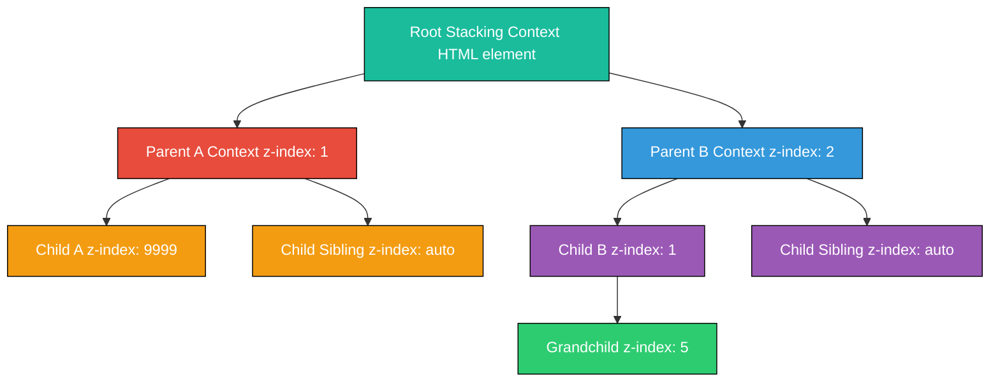
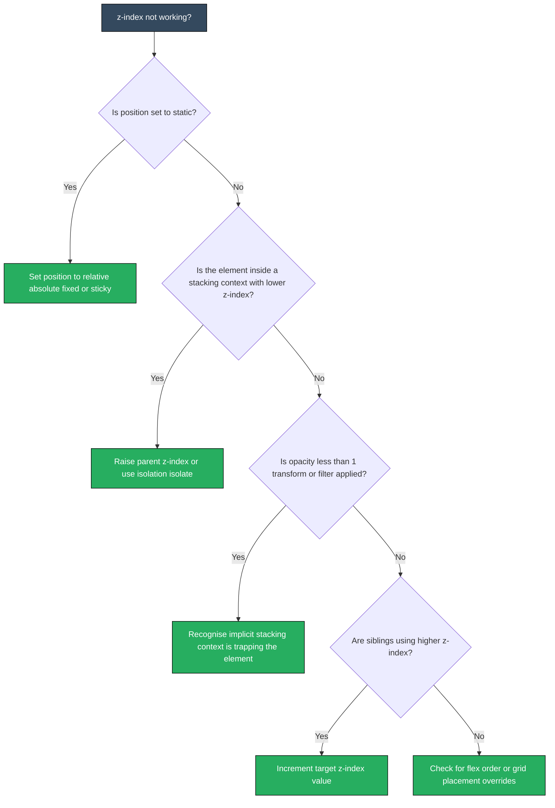

# z-index

<!-- SECTION_1_START -->
# z-index — Stacking Elements in the Third Dimension

## Formal Definition (KTU 2024 Syllabus Terminology)

The **`z-index`** CSS property is a *positioning property* that controls the **vertical stacking order** of *positioned* elements (along the z-axis) on a web page. Elements with a higher z-index are rendered in front of elements with a lower z-index, when they overlap on the 2D viewport.

According to the **W3C CSS Box Model Module Level 3**, the z-axis is the imaginary axis perpendicular to the screen surface. The `z-index` property accepts an **integer value** (which may be negative, zero, or positive) and is only effective on elements whose `position` property is set to `relative`, `absolute`, `fixed`, or `sticky`.

> [!IMPORTANT]
> **KTU Board Highlight:** The `z-index` property has **no effect** on *statically positioned* elements (`position: static`). A common answer-writing pitfall is declaring `z-index` on a default `<div>` and expecting it to work — it will be silently ignored by the browser.

## Conceptual Analogy / Intuition

Imagine a **dining table covered with transparent glass sheets (acrylic placards)**, each holding a printed photograph:

- The **table surface** is the *viewport* (the browser window).
- Each **photograph** is an HTML element.
- The **vertical stack order** of the acrylic sheets determines which photograph you see on top when they overlap.
- The **`z-index`** value is the *height label* you stick on the edge of each acrylic sheet.
- The **`position` property** is the *magnet* that holds the sheet onto the table — without it, the sheet slides off and the height label is meaningless.

A sheet labeled `z-index: 999` floats above one labeled `z-index: 1`, even if the lower one was placed on the table *first*.

## Default Stacking Order (When z-index is `auto`)

For elements without an explicit z-index, browsers follow a **painting sequence** based on DOM order and element type:

1. **Root element** background and borders
2. **Non-positioned descendants** in document order (in-flow, non-floated)
3. **Floats** and their contents
4. **Inline non-positioned descendants**
5. **Positioned elements** (without z-index) in document order

> [!NOTE]
> **Default Rule:** Among positioned elements with `z-index: auto`, the *later* element in the HTML source wins. Use `z-index` to break this tie deterministically.

## Visualisation Control

> [!VISUALIZATION CONTROL]
> **Concept:** Three overlapping squares demonstrating z-axis stacking
> **GeoGebra / Desmos Input Equations:**
> * Point A at $(1, 1)$ representing `z-index: 1`
> * Point B at $(2, 2)$ representing `z-index: 2`
> * Point C at $(3, 3)$ representing `z-index: 3`
> **Visual Description:** A coordinate plane where the vertical (z) axis represents stacking height. Point C sits visually above B, which sits above A, illustrating that higher numerical z-index yields top-rendered overlap.

<!-- SECTION_1_END -->

<!-- SECTION_2_START -->
# Deep Theoretical Analysis & KTU High-Yield Formula Sheet

## Operational Syntax Breakdown

The `z-index` property is declared inside a CSS rule block, following the standard **property-value pair syntax**:

$$
\texttt{selector } \lbrace \texttt{ z-index: } \textit{value};\ \rbrace
$$

### Property Value Categories

The CSS specification defines the following valid value tokens:

| Value Token | Type | Behaviour | KTU Board Significance |
|-------------|------|-----------|------------------------|
| `auto` | Keyword | Element follows default painting order; does **not** create a new stacking context (unless triggered otherwise) | Most common default |
| `<integer>` | Numeric | Any positive, negative, or zero integer (e.g. `0`, `5`, `-1`, `9999`) | Required for explicit layering |
| `initial` | Keyword | Resets to default value (`auto`) | Part of CSS reset strategies |
| `inherit` | Keyword | Inherits from parent computed value | Useful in component-based designs |
| `unset` | Keyword | Acts as `inherit` if inherited, else `initial` | Less common in exam questions |

> [!NOTE]
> **No Units:** Unlike `width` or `margin`, the z-index value is a *unitless integer*. Writing `z-index: 5px;` is a syntax error.

## The Four Stacking Rules (W3C Algorithm)

When the browser paints overlapping elements, it follows a deterministic algorithm. Understanding these four rules is essential for KTU exam answers:

1. **Rule 1 — Root Context Foundation:** The `<html>` root element forms the *root stacking context*. All other stacking contexts descend from it.
2. **Rule 2 — Same Level Comparison:** Within a *single* stacking context, elements with higher z-index are painted on top.
3. **Rule 3 — Context Isolation:** An element with z-index is *painted within its parent stacking context*, not the global one. Its z-index is **only relative to siblings in the same context**.
4. **Rule 4 — Document Order Tiebreaker:** When z-index values are equal, the *later* element in the HTML source code wins.

> [!IMPORTANT]
> **Why does Rule 3 matter?** A child element with `z-index: 9999` will still appear *behind* a sibling's parent with `z-index: 1`, because the child is bounded by its parent's stacking context.

## Conditions That Create a New Stacking Context

A new stacking context is **not** triggered only by z-index. The CSS specification lists ten triggers; the high-yield ones for KTU are:

- Element with `position: absolute` or `relative` **and** a `z-index` value other than `auto`
- Element with `position: fixed` or `sticky` (any z-index)
- Element with `opacity` less than `1`
- Element with `transform`, `filter`, `perspective`, `clip-path` other than `none`
- Element with `isolation: isolate`
- Element with `will-change` specifying a property that creates a stacking context
- Flex item / Grid item with `z-index` other than `auto`

## KTU Formula Sheet / Cheat Sheet

| Property / Concept | Definition | Example Value | Behaviour |
|--------------------|------------|---------------|-----------|
| `z-index: auto` | Default keyword | `auto` | Follows DOM order; does not create stacking context |
| `z-index: 0` | Baseline integer | `0` | Painted on top of `auto` siblings; creates stacking context |
| `z-index: 1` | Lowest positive level | `1` | Above `0`; minimum for explicit top-most intent |
| `z-index: -1` | Negative level | `-1` | Painted *behind* the parent stacking context's content |
| `z-index: 9999` | Convention for "top" | `9999` | Common in modal dialogs; no actual max value |
| Required `position` | Magnet | `relative` / `absolute` / `fixed` / `sticky` | Mandatory for z-index to apply |
| `position: static` | Default | `static` | z-index is **ignored** |
| `isolation: isolate` | Scoped stacking | `isolate` | Forces a new stacking context without changing z-index |
| `opacity` < `1` | Context trigger | `0.99` | Implicitly creates a stacking context |

> [!WARNING]
> **Negative z-index caveat:** A negative z-index places the element *behind* its parent's background in some browsers. Always test cross-browser behaviour.

## Real-World Engineering Utility

In **production web applications**, z-index is critical for:

- **Modal dialogs** and overlay pop-ups (typically `z-index: 1050` in Bootstrap)
- **Sticky navigation bars** (`position: sticky; z-index: 10`)
- **Dropdown menus** that must float above page content
- **Toast notifications** and snackbars
- **Tooltip layering** in component libraries (React, Vue, Angular)
- **Full-screen image carousels** in e-commerce sites
- **Drag-and-drop UIs** where the dragged element must float above all siblings

Frameworks like **Bootstrap** and **Material UI** adopt a **layered z-index scale** to maintain a deterministic stacking order across the entire design system.

<!-- SECTION_2_END -->

<!-- SECTION_3_START -->
# Step-by-Step Derivations & Code Implementation

## Exhaustive Walkthrough 1: Basic z-index on Three Overlapping Boxes

We will create three coloured boxes that overlap, then control their stacking order using z-index.

### Step 1: HTML Skeleton

```html
<!DOCTYPE html>
<html lang="en">
<head>
    <meta charset="UTF-8">
    <title>z-index Demonstration</title>
    <link rel="stylesheet" href="style.css">
</head>
<body>
    <div class="container">
        <div class="box box-red">Box A (z-index: 1)</div>
        <div class="box box-green">Box B (z-index: 2)</div>
        <div class="box box-blue">Box C (z-index: 3)</div>
    </div>
</body>
</html>
```

### Step 2: CSS Styling with z-index

```css
/* style.css */
.container {
    position: relative;       /* Establishes a positioning context */
    width: 400px;
    height: 300px;
    margin: 50px auto;
    border: 2px dashed #888;
}

.box {
    width: 150px;
    height: 150px;
    position: absolute;        /* Required for z-index to take effect */
    color: white;
    font-family: Arial, sans-serif;
    text-align: center;
    line-height: 150px;
    font-weight: bold;
}

.box-red {
    background-color: #e74c3c;
    top: 20px;
    left: 20px;
    z-index: 1;                /* Lowest of the three */
}

.box-green {
    background-color: #27ae60;
    top: 60px;
    left: 60px;
    z-index: 2;                /* Middle layer */
}

.box-blue {
    background-color: #2980b9;
    top: 100px;
    left: 100px;
    z-index: 3;                /* Top-most layer */
}
```

### Step 3: Verification Logic

- The **red box** is painted first, then green overlaps it, then blue overlaps both.
- Since `box-blue` has the highest z-index, the corners of blue are visible on top.
- The `position: absolute` on each box is the **enabling trigger** for z-index.

## Exhaustive Walkthrough 2: Demonstrating the Stacking Context Trap

This example proves Rule 3 (context isolation) from the theory section.

### Step 1: HTML Structure

```html
<div class="parent-a">
    Parent A
    <div class="child-a">Child A (z-index: 9999)</div>
</div>

<div class="parent-b">
    Parent B
    <div class="child-b">Child B (z-index: 1)</div>
</div>
```

### Step 2: CSS Showing the Trap

```css
.parent-a {
    position: relative;
    z-index: 1;                /* Lower parent z-index */
    background: #f8c291;
    padding: 20px;
}

.parent-b {
    position: relative;
    z-index: 2;                /* Higher parent z-index wins! */
    background: #6a89cc;
    padding: 20px;
    margin-top: -30px;
}

.child-a {
    position: absolute;
    z-index: 9999;             /* Uselessly high inside its trapped context */
    background: #e55039;
    color: white;
    padding: 5px;
}

.child-b {
    position: absolute;
    z-index: 1;
    background: #60a3bc;
    color: white;
    padding: 5px;
}
```

### Step 3: Step-by-Step Visual Outcome

$$
\text{Visible top element} = \arg\max_{e \in \text{context}} \left( \text{parent\_z}(e),\ \text{child\_z}(e) \right)
$$

Where `parent_z(e)` is **dominant** over `child_z(e)` for elements that belong to a contained stacking context.

**Conclusion of derivation:** Even though `Child A` has `z-index: 9999`, it is painted **behind** `Parent B` (which has `z-index: 2`), because `Child A` is bounded by `Parent A`'s stacking context (`z-index: 1`).

## Exhaustive Walkthrough 3: Negative z-index Behind a Background

```html
<div class="card">
    <div class="bg-pattern">Background Pattern (z-index: -1)</div>
    <h1>Foreground Text</h1>
    <p>This text sits on top of the pattern.</p>
</div>
```

```css
.card {
    position: relative;
    background: white;
    padding: 30px;
    border: 1px solid #ccc;
}

.bg-pattern {
    position: absolute;
    top: 0;
    left: 0;
    width: 100%;
    height: 100%;
    background: repeating-linear-gradient(
        45deg,
        #f1c40f,
        #f1c40f 10px,
        #f39c12 10px,
        #f39c12 20px
    );
    z-index: -1;              /* Pushed behind parent's content */
    opacity: 0.4;
}
```

**Step-by-step reasoning:**

1. `.card` establishes `position: relative`, forming a positioning context.
2. `.bg-pattern` uses `z-index: -1` to slide behind the `<h1>` and `<p>`.
3. The `opacity: 0.4` on `.bg-pattern` *also* creates a stacking context, isolating its z-index.
4. The text remains crisp and readable while the pattern provides visual texture beneath.

## Exhaustive Walkthrough 4: The `isolation: isolate` Escape Hatch

When you need z-index scoping without changing the property value, use `isolation`.

```css
.modal-wrapper {
    isolation: isolate;        /* Creates a new stacking context */
    position: relative;
}

.modal-wrapper .child {
    position: absolute;
    z-index: 100;              /* Scoped — cannot escape this context */
}
```

This pattern is widely adopted in **design systems** to prevent z-index pollution between independent component trees.

## Boundary and Edge-Case Checklist

| Scenario | Expected Behaviour | Common Mistake |
|----------|--------------------|----------------|
| `z-index` on `position: static` element | Ignored | Forgetting to set `position` |
| Negative z-index on root | Goes behind `<html>` background | Using `-1` on body children |
| Equal z-index values | Later DOM element wins | Assuming numerical comparison only |
| `z-index: 9999999` on a non-positioned child | No effect | Expecting extreme values to "win" |
| z-index inside a flex container with `align-items` | Still applies, but flex painting order overrides document order | Confusing flex order with z-index |
| Element with `transform: rotate(5deg)` | Implicitly creates stacking context | Surprise z-index behaviour |

<!-- SECTION_3_END -->

<!-- SECTION_4_START -->
# Structural Diagrams & Schematics

## Mermaid Diagram 1: Stacking Context Hierarchy



**Diagram Interpretation:** The diagram shows that `Child A` with z-index 9999 is *trapped* inside `Parent A` (z-index 1). It cannot outrank `Child B` (z-index 1) inside `Parent B` (z-index 2), because the parent context dominates.

## Mermaid Diagram 2: Painting Order Pipeline

```mermaid
flowchart LR
    P1[Step 1: Paint Root Background] --> P2[Step 2: Paint Non-Positioned Descendants]
    P2 --> P3[Step 3: Paint Floats]
    P3 --> P4[Step 4: Paint Inline Non-Positioned Content]
    P4 --> P5[Step 5: Paint Positioned Elements with z-index auto]
    P5 --> P6[Step 6: Paint Positioned Elements Sorted by z-index]
    
    style P1 fill:#16a085,stroke:#000,color:#fff
    style P2 fill:#16a085,stroke:#000,color:#fff
    style P3 fill:#16a085,stroke:#000,color:#fff
    style P4 fill:#16a085,stroke:#000,color:#fff
    style P5 fill:#16a085,stroke:#000,color:#fff
    style P6 fill:#c0392b,stroke:#000,color:#fff
```



**Diagram Interpretation:** The browser's compositor follows this six-stage pipeline. z-index is consulted *only* in Step 6. This explains why a missing `position` property renders z-index meaningless — the element exits the pipeline at Step 5.

## Mermaid Diagram 3: Decision Tree for "Why is my z-index not working?"



## Block-Level Functional Architecture Flow: Layered UI System

| Layer (Top to Bottom) | CSS Selector Convention | Typical z-index | Component Examples |
|----------------------|------------------------|-----------------|---------------------|
| L7 — Critical Alerts | `.alert-critical` | `1080` | System error toasts |
| L6 — Modal Backdrop | `.modal-backdrop` | `1040` | Dark overlay behind modals |
| L5 — Modal Dialog | `.modal-window` | `1050` | Login / Signup pop-ups |
| L4 — Tooltips | `.tooltip-layer` | `1030` | Hover information cards |
| L3 — Dropdown Menus | `.dropdown-menu` | `1020` | Navbar sub-menus |
| L2 — Sticky Header | `.sticky-header` | `1010` | Persistent navigation bar |
| L1 — Base Content | `.page-content` | `auto` / `1` | Default flowing content |
| L0 — Decorative Background | `.bg-decoration` | `-1` | Patterns, watermarks |

This matrix mirrors the **Bootstrap 5 z-index scale** and is the production-standard pattern for KTU web programming labs.

<!-- SECTION_4_END -->

<!-- SECTION_5_START -->
# KTU 2024 Scheme Examination Question Bank & Topic Recap

---

## Part A — Short Answer Questions (3 Marks Each)

### Question 1 `[KTU University Exam - July 2024]`
**Q: Define the CSS `z-index` property. State the mandatory condition for it to take effect. (CO1, Remember)**

**Model Answer (3 Marks):**

The `z-index` property is a CSS positioning property that specifies the **stack order** of an element along the **z-axis** (the imaginary depth axis perpendicular to the screen). Elements with a higher z-index value are rendered in front of elements with a lower z-index value when they overlap.

**Mandatory condition:** The `z-index` property only takes effect on elements whose `position` property is set to `relative`, `absolute`, `fixed`, or `sticky`. It is ignored on statically positioned elements.

> **Valuation Key:** [Defining z-index with axis reference: 2 Marks] [Stating the position requirement: 1 Mark]

---

### Question 2 `[KTU University Exam - Dec 2023]`
**Q: Explain the concept of a *stacking context* in CSS. Name any two CSS properties that create a new stacking context. (CO1, Understand)**

**Model Answer (3 Marks):**

A **stacking context** is a three-dimensional conceptual layer in which HTML elements are painted in a defined order, independent of other stacking contexts. It is formed by the root element `<html>` and by any element that meets one of the CSS triggers defined in the specification.

Within a stacking context, child elements with higher z-index are painted above siblings with lower z-index, but a child cannot escape its parent context's z-index boundary.

**Two properties that create a new stacking context:**
1. `position: relative` or `absolute` combined with a `z-index` value other than `auto`.
2. `opacity` with a value less than `1`.
   *(Acceptable alternatives: `transform` other than `none`, `filter` other than `none`, `isolation: isolate`, `position: fixed`/`sticky`.)*

> **Valuation Key:** [Defining stacking context clearly: 1 Mark] [Explaining child isolation rule: 1 Mark] [Naming two valid triggers: 1 Mark]

---

## Part B — Long Answer Questions (14 Marks Each)

> **Internal Choice Notice:** Answer **either** Question A **or** Question B in full. Each carries 14 marks split as 7 + 7.

---

### Question A (14 Marks) `[KTU University Exam - July 2024]`

**(a)** Explain the rules governing the painting order of overlapping positioned elements in CSS. Discuss how `z-index` and *document order* together resolve overlap conflicts. (CO1, Understand — 7 Marks)

**(b)** Write a complete HTML5 + CSS program that creates three overlapping coloured boxes (red, green, blue) and uses `z-index` to display them in the order: red (bottom), green (middle), blue (top). Include comments explaining each CSS declaration. (CO2, Apply — 7 Marks)

#### Model Solution for (a):

The browser's **painting order** for overlapping elements follows these rules:

1. **Default Order Rule:** For elements with `z-index: auto`, the browser follows document order — the element appearing later in the HTML source is painted on top.
2. **z-index Dominance:** When an explicit z-index value is provided, elements with a higher integer value are painted above those with a lower value, *within the same stacking context*.
3. **Stacking Context Isolation:** A child element's z-index is evaluated within its parent's stacking context. The parent's z-index dominates over its children's z-index when comparing across contexts.
4. **DOM Order Tiebreaker:** When two elements share the same z-index value, the one appearing later in the HTML source code is painted on top.

Therefore, `z-index` provides **deterministic** control, while document order acts as a **fallback tiebreaker** for elements that do not declare explicit z-index values.

> **Valuation Key:** [Rule 1 stated: 1.5 Marks] [Rule 2 stated: 1.5 Marks] [Rule 3 stated: 2 Marks] [Rule 4 with tiebreaker concept: 2 Marks]

#### Model Solution for (b):

```html
<!DOCTYPE html>
<html lang="en">
<head>
    <meta charset="UTF-8">
    <title>Three Overlapping Boxes - z-index Demo</title>
    <style>
        /* Container establishes positioning context for children */
        .stage {
            position: relative;       /* Required so children's z-index is meaningful */
            width: 400px;
            height: 300px;
            margin: 50px auto;
            border: 2px solid #333;
        }

        /* Common box styling */
        .box {
            position: absolute;        /* Mandatory for z-index to apply */
            width: 160px;
            height: 160px;
            color: white;
            font-family: 'Segoe UI', sans-serif;
            font-size: 16px;
            text-align: center;
            line-height: 160px;
            border-radius: 8px;
        }

        /* Red box - bottom layer */
        .red-box {
            background-color: #e74c3c;
            top: 20px;
            left: 20px;
            z-index: 1;                /* Lowest of the three */
        }

        /* Green box - middle layer */
        .green-box {
            background-color: #27ae60;
            top: 70px;
            left: 70px;
            z-index: 2;                /* Above red */
        }

        /* Blue box - top layer */
        .blue-box {
            background-color: #2980b9;
            top: 120px;
            left: 120px;
            z-index: 3;                /* Above green and red */
        }
    </style>
</head>
<body>
    <div class="stage">
        <div class="box red-box">Red (z:1)</div>
        <div class="box green-box">Green (z:2)</div>
        <div class="box blue-box">Blue (z:3)</div>
    </div>
</body>
</html>
```

**Step-by-step logical evaluation:**

1. The `.stage` container has `position: relative`, creating a positioning context.
2. Each `.box` has `position: absolute`, enabling z-index behaviour.
3. `z-index: 1` on red places it at the bottom of the explicit stack.
4. `z-index: 2` on green places it above red.
5. `z-index: 3` on blue places it above both red and green.

**Output visual sequence (top-most to bottom-most):** Blue → Green → Red.

> **Valuation Key:** [Correct DOCTYPE and HTML5 structure: 1 Mark] [position: relative on parent: 1 Mark] [position: absolute on children: 1 Mark] [z-index values 1, 2, 3 correctly assigned: 2 Marks] [Code runs and produces expected overlap: 1 Mark] [Comments explaining declarations: 1 Mark]

---

### Question B (14 Marks) `[KTU University Exam - Dec 2023]`

**(a)** Differentiate between a *positioning context* and a *stacking context*. Why does a child with high z-index sometimes appear *behind* a sibling's parent? (CO1, Understand — 7 Marks)

**(b)** Create an HTML page with a modal dialog that appears *above* a navigation bar and *below* a critical alert toast. Use the layered z-index scale `[L1: 100, L2: 500, L3: 1000]` and explain each value's purpose with inline comments. (CO2, Apply — 7 Marks)

#### Model Solution for (a):

**Positioning Context vs Stacking Context:**

| Aspect | Positioning Context | Stacking Context |
|--------|--------------------|--------------------|
| **Triggered By** | `position` set to `relative`, `absolute`, `fixed`, or `sticky` | z-index declaration, opacity < 1, transform, isolation, etc. |
| **Primary Role** | Acts as a reference frame for absolutely positioned children's `top`, `left`, `right`, `bottom` | Defines a 3D painting hierarchy for overlapping elements |
| **z-index Relevance** | Children with z-index need a positioned ancestor to be meaningful | Bounds and isolates the z-index of all its descendants |
| **Establishes** | Coordinate system for child positioning | Painting order hierarchy |

**Why a high z-index child appears behind a sibling's parent:**

Consider two parents P1 (z-index: 1) and P2 (z-index: 2). P1 contains Child C1 with z-index: 9999, and P2 contains Child C2 with z-index: 1. The browser paints P2 *and its entire contents* above P1 *and its entire contents*, because P2's stacking context dominates. The child's z-index 9999 is evaluated only against siblings *inside P1's context*, not against elements in P2's context. Therefore C2 (with z-index 1 inside P2) appears above C1 (with z-index 9999 inside P1).

> **Valuation Key:** [Positioning context definition: 1.5 Marks] [Stacking context definition: 1.5 Marks] [Tabular comparison: 2 Marks] [Numerical example explaining trap: 2 Marks]

#### Model Solution for (b):

```html
<!DOCTYPE html>
<html lang="en">
<head>
    <meta charset="UTF-8">
    <title>Layered UI System</title>
    <style>
        body {
            font-family: Arial, sans-serif;
            margin: 0;
            padding: 0;
        }

        /* L1: Navigation Bar (lowest interactive layer) */
        .navbar {
            position: fixed;
            top: 0;
            left: 0;
            width: 100%;
            height: 60px;
            background-color: #2c3e50;
            color: white;
            line-height: 60px;
            padding: 0 20px;
            z-index: 100;            /* L1 baseline — floats above page content */
        }

        /* L2: Modal Dialog (middle layer) */
        .modal {
            position: fixed;
            top: 50%;
            left: 50%;
            transform: translate(-50%, -50%);
            width: 400px;
            background: white;
            border-radius: 8px;
            box-shadow: 0 4px 20px rgba(0, 0, 0, 0.3);
            padding: 30px;
            z-index: 500;            /* L2 — above navbar, below critical alert */
        }

        .modal h2 {
            margin-top: 0;
        }

        .modal-backdrop {
            position: fixed;
            top: 0;
            left: 0;
            width: 100%;
            height: 100%;
            background: rgba(0, 0, 0, 0.5);
            z-index: 499;            /* Just below the modal */
        }

        /* L3: Critical Alert Toast (top-most layer) */
        .alert-toast {
            position: fixed;
            top: 20px;
            right: 20px;
            background-color: #e74c3c;
            color: white;
            padding: 15px 25px;
            border-radius: 6px;
            z-index: 1000;           /* L3 — absolute top, never obscured */
        }

        /* Page content (z-index: auto, painted first) */
        .content {
            margin-top: 80px;
            padding: 20px;
        }
    </style>
</head>
<body>
    <!-- L1: Navigation Bar -->
    <nav class="navbar">My Website Navigation</nav>

    <!-- L3: Critical Alert Toast (appears on top) -->
    <div class="alert-toast">Critical: Server unreachable!</div>

    <!-- L2: Modal Dialog with backdrop -->
    <div class="modal-backdrop"></div>
    <div class="modal">
        <h2>Confirm Action</h2>
        <p>Are you sure you want to proceed with this operation?</p>
        <button>Confirm</button>
        <button>Cancel</button>
    </div>

    <!-- Base page content -->
    <div class="content">
        <h1>Welcome to the Dashboard</h1>
        <p>This is the base content layer (z-index: auto).</p>
    </div>
</body>
</html>
```

**Step-by-step explanation of z-index assignments:**

1. `z-index: 100` on `.navbar` ensures it floats above the page content but below any overlay.
2. `z-index: 499` on `.modal-backdrop` keeps the dark overlay just below the modal window.
3. `z-index: 500` on `.modal` places the dialog above the backdrop and navbar.
4. `z-index: 1000` on `.alert-toast` guarantees the critical alert is never obscured, even by the modal.
5. The base `.content` uses default `z-index: auto`, so it is painted first and remains the bottom layer.

> **Valuation Key:** [z-index 100 on navbar with comment: 1.5 Marks] [z-index 499 on backdrop with comment: 1.5 Marks] [z-index 500 on modal with comment: 1.5 Marks] [z-index 1000 on alert with comment: 1.5 Marks] [Working layered HTML output: 1 Mark]

---

> [!WARNING]
> **KTU Examiner's Valuation Pitfall Callout:**
> 1. **Never write `z-index` without a `position` declaration.** Marks are deducted when students assume z-index works on `position: static` elements.
> 2. **Do not use units** with z-index (e.g., `5px`, `10em` are invalid). It must be a unitless integer.
> 3. **Always state the stacking context** when explaining why an element appears above or below another — board examiners specifically look for the word "stacking context" in long answers.
> 4. **Mention document order tiebreaker** when two elements share the same z-index — this is a frequently tested concept.
> 5. **Do not skip the HTML5 DOCTYPE** declaration in code questions. KTU strictly enforces valid HTML5 structure.

---

## Topic Recap & Important Things to Remember

- **`z-index`** controls the **stack order** of positioned elements along the imaginary **z-axis** (depth).
- **Mandatory prerequisite:** `position` must be `relative`, `absolute`, `fixed`, or `sticky`. Without this, z-index is **silently ignored**.
- The value is a **unitless integer** — positive, negative, or zero. The keyword `auto` is the default.
- **Higher z-index = painted on top** *within the same stacking context*.
- A **stacking context** is a 3D painting layer that isolates its children from external z-index comparisons.
- **Stacking context triggers (high-yield):** z-index ≠ auto, `position: fixed`/`sticky`, `opacity < 1`, `transform` ≠ `none`, `filter` ≠ `none`, `isolation: isolate`.
- **Document order tiebreaker:** when z-index values are equal, the *later* element in the HTML source wins.
- **Negative z-index** places the element behind its parent's content but still within the parent's stacking context boundary.
- **`isolation: isolate`** creates a scoped stacking context without changing the z-index value — useful in component-based design.
- **Production z-index scale (Bootstrap-inspired):** navbar `~100`, dropdowns `~1000`, modal backdrop `~1040`, modal `~1050`, tooltips `~1070`, toasts `~1080`.
- **Cross-browser note:** z-index behaviour is consistent across modern browsers when CSS3 triggers (transform, opacity, filter) are involved.
- **Accessibility tip:** When using z-index to hide modals, pair with `aria-hidden="true"` and trap focus for screen-reader users.

<!-- SECTION_5_END -->
