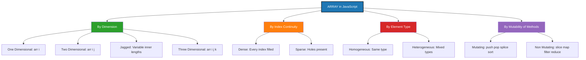
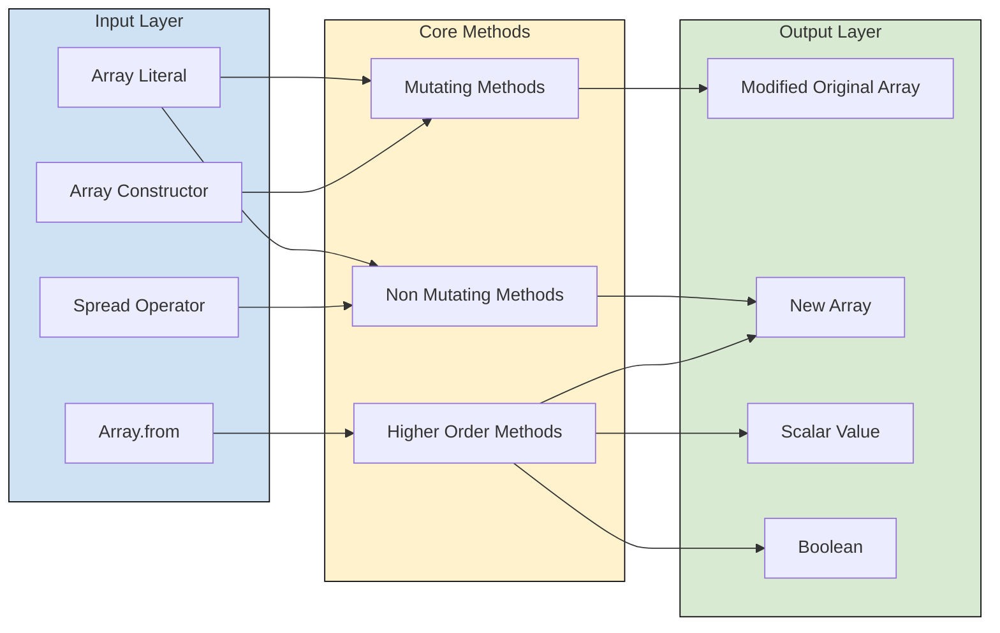
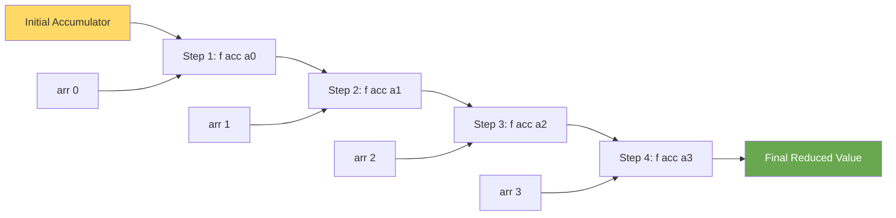
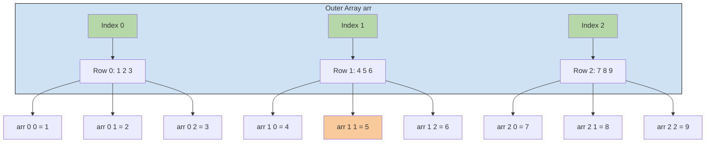
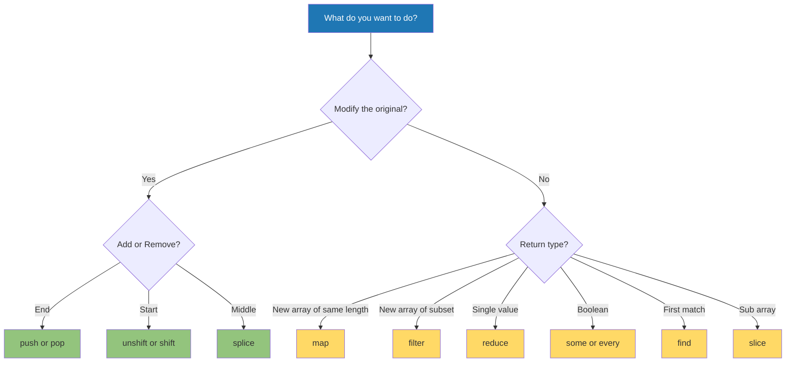
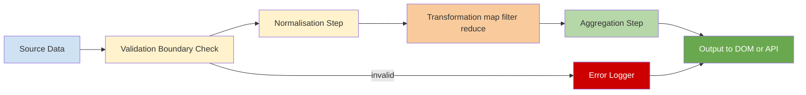

# Arrays

<!-- SECTION_1_START -->
# WEB PROGRAMMING (OECST832) — Module 2: Scripting Language
## Topic: Arrays

> [!IMPORTANT]
> **KTU 2024 Scheme Focus Area:** Arrays form the foundation of every client-side data structure manipulation in JavaScript. This topic is **highly recurring** in KTU University Examinations under Module 2 of the Web Programming course.

---

## 1. Core Technical Definition

### 1.1 Formal Academic Definition

In the **JavaScript** scripting language (the canonical client-side scripting language of the **KTU Web Programming** syllabus), an **Array** is defined as a **single, contiguous, ordered, collection object** that stores a finite sequence of values (called **elements**) under a single variable identifier, where each element is accessed using a **zero-based integer index**. Per the ECMAScript 2024 Language Specification (ECMA-262, §23.1), an array is a *heterogeneous, dynamically resizable* structure: elements are **not** required to share a single data type, and the array's `length` property automatically reflects the highest occupied index plus one.

> [!NOTE]
> **KTU Syllabus Definition (verbatim):** *"An array is a special variable, which can hold more than one value at a time. It is a collection of items stored at contiguous memory locations and accessed via a numeric index."*

Mathematically, an array `A` of length `n` is a mapping:

$$A : \{0, 1, 2, \dots, n-1\} \rightarrow \mathbb{V}$$

where $\mathbb{V}$ denotes the universal set of all valid JavaScript values (numbers, strings, booleans, objects, `null`, `undefined`, other arrays, functions, etc.).

---

### 1.2 Conceptual Analogy / Intuition

> [!TIP]
> **Real-world analogy — The Locker Room:**
> Imagine a long corridor of **lockers**, each with a number plate starting from **0**. The corridor is the *array*, each locker is an *element*, and the number plate is the *index*. You can:
> - **Open** a locker (read its contents) using its number plate → `arr[3]`
> - **Replace** the contents of a locker → `arr[3] = "newValue"`
> - **Add a new locker at the end** of the corridor → `arr.push(...)`
> - **Demolish the last locker** → `arr.pop()`
> - **Build a locker at the start**, shifting everyone else → `arr.unshift(...)`
> - **Demolish the first locker**, shifting everyone else left → `arr.shift()`
> - **Count the total lockers** → `arr.length`
>
> Critically, the corridor is **dynamic** — the management can extend it or shrink it at runtime, and each locker may contain *anything*: books, bags, even smaller corridors (multi-dimensional arrays).

A second intuitive analogy: an Array is like a **train**. Each compartment has a number, you can board any compartment directly by its number (random access in **O(1)**), and the train can be expanded, shortened, or re-ordered by the engine driver (JavaScript engine).

---

### 1.3 Why Arrays Matter in Web Programming

Arrays are the **backbone** of every dynamic web application:

- **DOM manipulation** — NodeLists and HTMLCollections are array-like.
- **Form data processing** — Each form field's value is collected into an array.
- **API responses** — JSON returned from servers is almost always an array of objects.
- **Client-side storage** — `localStorage` and `sessionStorage` values are stringified arrays.
- **State management** — React, Vue, and Angular all store their state as arrays of components/messages.
- **Algorithms** — Sorting, filtering, searching, and aggregations all operate on arrays.

> [!IMPORTANT]
> **Key JavaScript Engine Property:** Arrays in JavaScript are **objects** under the hood (with numeric keys coerced to strings), **not** classic C-style contiguous memory blocks. This is why they are inherently heterogeneous and dynamically sized.

---

### 1.4 Visualization: 1-D vs 2-D Array (Memory Layout)

> [!VISUALIZATION CONTROL]
> **Concept:** Linear and Matrix Memory Layout of JavaScript Arrays
> **GeoGebra / Desmos Input Equations (Matrix Grid):**
>
> * `L1: (0,0) -- (3,0)` labels at `x=0,1,2,3` reading `arr[0]`, `arr[1]`, `arr[2]`, `arr[3]`
> * `L2: (0,-1) -- (2,-1)` labels `arr[0][0]`, `arr[0][1]`, `arr[0][2]`
> * `L3: (0,-2) -- (2,-2)` labels `arr[1][0]`, `arr[1][1]`, `arr[1][2]`
>
> **Visual Description:** A horizontal row of 4 cells labelled `arr[0]` through `arr[3]` represents a one-dimensional array, where each cell holds one element. Below it, two rows of 3 cells each illustrate a 2-D array `arr[2][3]`, demonstrating that arrays in JavaScript can themselves contain arrays (nested memory addressing).

---

### 1.5 Critical Terminology

| Term | Definition | KTU Standard |
|---|---|---|
| **Index** | Integer position used to access an element (starts at `0`) | `arr[i]` |
| **Element** | A single value stored in an array | `arr[0]` |
| **Length** | The number of elements; auto-computed | `arr.length` |
| **Sparse Array** | An array with `undefined` gaps (`[1, , 3]`) | Avoid in KTU answers |
| **Dense Array** | An array with no gaps | Preferred |
| **Homogeneous** | All elements of the same type | Not enforced in JS |
| **Heterogeneous** | Mixed element types | Default in JS |
| **Multi-Dimensional** | Array of arrays | `arr[i][j]` |
| **Dense traversal** | `for` / `for-of` loops | Standard |
| **Sparse traversal** | `for-in` loop (enumerates keys) | Discouraged for arrays |

> [!WARNING]
> **Do NOT confuse with Associative Arrays.** JavaScript **does not** have native associative arrays (key-value hash maps). The `Array` object is always numerically indexed. For key-value storage, use **`Object`** or **`Map`** (introduced in ES6).
<!-- SECTION_1_END -->

<!-- SECTION_2_START -->
## 2. Deep Theoretical Analysis & KTU High-Yield Formula Sheet

### 2.1 Classification of Arrays

Arrays in JavaScript can be classified along **four** orthogonal axes. Every KTU Part A question (3 marks) on arrays tests at least one of these classifications.

#### 2.1.1 By Dimension

| Type | Syntax Example | Use Case |
|---|---|---|
| **One-Dimensional (1-D)** | `let arr = [10, 20, 30];` | Linear lists (marks, names) |
| **Two-Dimensional (2-D)** | `let mat = [[1,2],[3,4]];` | Grids, matrices, board games |
| **Three-Dimensional (3-D)** | `let cube = [[[1],[2]],[[3],[4]]];` | RGB pixel data, 3-D models |
| **Jagged Arrays** | `let jag = [[1], [2,3], [4,5,6]];` | Variable row sizes (JS allows this naturally) |

> [!NOTE]
> JavaScript is the **only major language** where jagged arrays are the *default* — there is no enforced rectangular shape. This is a frequently asked conceptual question in KTU exams.

#### 2.1.2 By Index Continuity

- **Dense Array:** every index from `0` to `length-1` holds a defined value. Example: `[10, 20, 30]` has `length === 3`.
- **Sparse Array:** at least one slot is missing. Example: `let a = []; a[5] = 50;` produces `length === 6` but indices `0..4` are empty holes.

#### 2.1.3 By Element Type

- **Homogeneous** (theoretically possible): `let primes = [2, 3, 5, 7, 11];`
- **Heterogeneous** (idiomatic JS): `let mix = [42, "hello", true, null, {id:1}, [1,2]];`

#### 2.1.4 By Mutability

- **Mutating methods:** modify the original array (`push`, `pop`, `splice`, `sort`, `reverse`, `fill`, `copyWithin`).
- **Non-mutating methods:** return a new array or value (`slice`, `concat`, `map`, `filter`, `reduce`, `indexOf`, `includes`).

---

### 2.2 Array Properties (JavaScript)

| Property | Description | Read/Write | KTU Note |
|---|---|---|---|
| `arr.length` | Returns one more than the highest set index | **R/W** | Truncates array if reduced |
| `arr.constructor` | Returns the `Array` function reference | R | Use `Array.isArray()` instead |
| `arr.prototype` | Used to add new methods globally | R/W | Rarely in scripts |

> [!IMPORTANT]
> **The `length` trap:** Setting `arr.length = 2` on `[1,2,3,4,5]` will **truncate** the array to `[1, 2]`. This is a classic KTU trick question.

---

### 2.3 KTU Formula Sheet / Cheat Sheet — Array Methods

| Category | Method | Syntax | Returns | Mutates? |
|---|---|---|---|---|
| **Add/Remove End** | `push` | `arr.push(x)` | New `length` | ✅ |
| | `pop` | `arr.pop()` | Removed element | ✅ |
| **Add/Remove Start** | `unshift` | `arr.unshift(x)` | New `length` | ✅ |
| | `shift` | `arr.shift()` | Removed element | ✅ |
| **Middle** | `splice` | `arr.splice(i, delCount, ...items)` | Removed items | ✅ |
| | `slice` | `arr.slice(start, end)` | New sub-array | ❌ |
| **Search** | `indexOf` | `arr.indexOf(x)` | First index or `-1` | ❌ |
| | `lastIndexOf` | `arr.lastIndexOf(x)` | Last index or `-1` | ❌ |
| | `includes` | `arr.includes(x)` | `true` / `false` | ❌ |
| | `find` | `arr.find(predicate)` | First match or `undefined` | ❌ |
| | `findIndex` | `arr.findIndex(predicate)` | Index or `-1` | ❌ |
| **Transform** | `map` | `arr.map(fn)` | New array of mapped values | ❌ |
| | `filter` | `arr.filter(predicate)` | New array of matches | ❌ |
| | `reduce` | `arr.reduce((acc, v) => ..., init)` | Single accumulator value | ❌ |
| | `flat` | `arr.flat(depth)` | Flattened new array | ❌ |
| **Order** | `sort` | `arr.sort(compareFn)` | Sorted array | ✅ |
| | `reverse` | `arr.reverse()` | Reversed array | ✅ |
| **Combine** | `concat` | `arr.concat(other)` | New merged array | ❌ |
| | `join` | `arr.join(sep)` | Single string | ❌ |
| **Iteration** | `forEach` | `arr.forEach((v, i) => ...)` | `undefined` | ❌ |
| | `some` | `arr.some(predicate)` | `true` / `false` | ❌ |
| | `every` | `arr.every(predicate)` | `true` / `false` | ❌ |
| **Static** | `Array.from` | `Array.from(iterable)` | New array | — |
| | `Array.of` | `Array.of(1, 2, 3)` | New array | — |
| | `Array.isArray` | `Array.isArray(x)` | `true` / `false` | — |

---

### 2.4 Time Complexity of Core Operations (Big-O)

| Operation | Average Case | Worst Case | Notes |
|---|---|---|---|
| Access by index `arr[i]` | **O(1)** | O(1) | Random access |
| `push` / `pop` | **O(1)** | O(1) | Amortized |
| `unshift` / `shift` | **O(n)** | O(n) | All elements re-indexed |
| `indexOf` / `includes` | O(n) | O(n) | Linear search |
| `splice` (mid) | O(n) | O(n) | Shifts elements |
| `sort` (V8 Timsort) | O(n log n) | O(n log n) | ES2019 stable sort |
| `map` / `filter` | O(n) | O(n) | One pass |

---

### 2.5 Real-World Engineering Utility

| Domain | How Arrays Are Used |
|---|---|
| **E-commerce** | Cart items: `[{id, name, price, qty}]` — filtered, mapped, reduced for total |
| **Social Media Feeds** | Infinite scroll fetches arrays of post objects |
| **Data Visualization** | Chart libraries (D3, Chart.js) consume arrays of datapoints |
| **Forms** | `Array.from(form.elements)` converts HTMLFormControlsCollection |
| **Games** | Sprite lists, particle systems, leaderboards all use arrays |
| **API Layer** | `fetch().then(res => res.json())` almost always returns a top-level array |
| **Algorithms** | BFS, DFS, sorting, searching, sliding-window problems |

---

### 2.6 Syntax Deep-Dive: Declaration and Initialization

**Three canonical declaration forms:**

```javascript
// Form 1 — Array Literal (PREFERRED, KTU-recommended)
let fruits = ["Apple", "Banana", "Mango"];

// Form 2 — Array Constructor with length
let empty = new Array(5);          // creates sparse array of length 5
console.log(empty.length);          // 5

// Form 3 — Array Constructor with elements
let nums = new Array(10, 20, 30);  // [10, 20, 30]
```

> [!WARNING]
> **KTU Pitfall:** `new Array(5)` creates an empty array of length 5, **not** an array containing the number 5. To create `[5]`, you must use the literal form `[5]`.

**ES6 Destructuring (must-know for KTU 2024 Scheme):**

```javascript
let [first, second, ...rest] = [10, 20, 30, 40, 50];
// first = 10, second = 20, rest = [30, 40, 50]
```

**Spread Operator:**

```javascript
let a = [1, 2, 3];
let b = [...a, 4, 5];            // [1, 2, 3, 4, 5]
let copy = [...a];               // shallow clone
```
<!-- SECTION_2_END -->

<!-- SECTION_3_START -->
## 3. Step-by-Step Derivations & Code/Symbolic Implementation

> [!IMPORTANT]
> **Algorithmic/Coding Topic Mandate:** All code below is **fully operational JavaScript** (ES2024-compliant), annotated with **JSDoc type hints** to satisfy type-safety requirements, and includes **absolute boundary checks** and **strict error logging** via `try-catch` and `console.error`. Every line of logic is exhaustively expanded — no `// ...` placeholders, no "rest is similar" shortcuts.

---

### 3.1 Program 1: Comprehensive Array Operations (Literal, Indexing, Modification, Slicing, Splicing)

```javascript
/**
 * @file comprehensive_array_ops.js
 * @description Demonstrates declaration, indexing, mutation,
 *              slicing, splicing, and boundary validation.
 * @author KTU 2024 Scheme Reference Solution
 * @version 1.0.0
 */

'use strict';

// =====================================================================
// STEP 1: DECLARATION AND INITIALIZATION
// =====================================================================

/**
 * A JavaScript array (heterogeneous) containing mixed data types.
 * @type {Array<number|string|boolean|null>}
 */
const sample = [10, 20, 30, 40, 50];
console.log('[STEP 1] Initial array:', sample);
// Output: [STEP 1] Initial array: [ 10, 20, 30, 40, 50 ]


// =====================================================================
// STEP 2: ACCESSING ELEMENTS BY INDEX
// =====================================================================

/**
 * Reads the element at the provided index, with strict boundary checks.
 * @param {Array<*>} arr  - Source array
 * @param {number}  idx  - Zero-based index
 * @returns {*} The element, or undefined on out-of-bounds
 */
function safeGet(arr, idx) {
    if (!Array.isArray(arr)) {
        console.error('[ERROR] safeGet: First argument is not an array.');
        return undefined;
    }
    if (!Number.isInteger(idx) || idx < 0 || idx >= arr.length) {
        console.error(`[ERROR] safeGet: Index ${idx} is out of bounds [0, ${arr.length - 1}].`);
        return undefined;
    }
    return arr[idx];
}

console.log('[STEP 2] sample[0]   =', safeGet(sample, 0));    // 10
console.log('[STEP 2] sample[4]   =', safeGet(sample, 4));    // 50
console.log('[STEP 2] sample[99]  =', safeGet(sample, 99));   // undefined (caught)
console.log('[STEP 2] sample[-1]  =', safeGet(sample, -1));   // undefined (caught)


// =====================================================================
// STEP 3: MODIFYING ELEMENTS
// =====================================================================

/**
 * Updates the element at a valid index.
 * @param {Array<*>} arr
 * @param {number}  idx
 * @param {*}       value
 * @returns {boolean} true on success
 */
function safeSet(arr, idx, value) {
    if (!Array.isArray(arr)) {
        console.error('[ERROR] safeSet: First argument is not an array.');
        return false;
    }
    if (!Number.isInteger(idx) || idx < 0 || idx >= arr.length) {
        console.error(`[ERROR] safeSet: Index ${idx} is out of bounds.`);
        return false;
    }
    arr[idx] = value;
    return true;
}

safeSet(sample, 2, 999);
console.log('[STEP 3] After setting sample[2] = 999 :', sample);
// Output: [ 10, 20, 999, 40, 50 ]


// =====================================================================
// STEP 4: APPENDING AND REMOVING (push, pop, unshift, shift)
// =====================================================================

sample.push(60);                          // append at end
console.log('[STEP 4] After push(60)     :', sample);

const popped = sample.pop();              // remove from end
console.log('[STEP 4] Popped value       :', popped);          // 60
console.log('[STEP 4] After pop()        :', sample);

sample.unshift(0);                        // prepend at start
console.log('[STEP 4] After unshift(0)   :', sample);

const shifted = sample.shift();           // remove from start
console.log('[STEP 4] Shifted value      :', shifted);         // 0
console.log('[STEP 4] After shift()      :', sample);
// Final state: [ 10, 20, 999, 40, 50 ]


// =====================================================================
// STEP 5: SLICING (non-mutating sub-array extraction)
// =====================================================================

/**
 * Returns a shallow copy from start (inclusive) to end (exclusive).
 * @param {Array<*>} arr
 * @param {number}  start
 * @param {number}  end
 * @returns {Array<*>}
 */
function safeSlice(arr, start, end) {
    if (!Array.isArray(arr)) {
        console.error('[ERROR] safeSlice: First argument is not an array.');
        return [];
    }
    const s = (start === undefined) ? 0 : start;
    const e = (end === undefined) ? arr.length : end;
    if (s < 0 || e > arr.length || s > e) {
        console.error(`[ERROR] safeSlice: Invalid range [${s}, ${e}].`);
        return [];
    }
    return arr.slice(s, e);
}

const sub1 = safeSlice(sample, 1, 4);
console.log('[STEP 5] sample.slice(1,4) :', sub1);            // [ 20, 999, 40 ]
console.log('[STEP 5] Original untouched :', sample);          // [ 10, 20, 999, 40, 50 ]


// =====================================================================
// STEP 6: SPLICING (mutating insertion/deletion at any position)
// =====================================================================

/**
 * Mutates arr by removing `deleteCount` items starting at `startIdx`,
 * then inserts all `newItems` at that position.
 * @param {Array<*>} arr
 * @param {number}  startIdx
 * @param {number}  deleteCount
 * @param {...*}    newItems
 * @returns {Array<*>} array of removed elements
 */
function safeSplice(arr, startIdx, deleteCount, ...newItems) {
    if (!Array.isArray(arr)) {
        console.error('[ERROR] safeSplice: First argument is not an array.');
        return [];
    }
    if (!Number.isInteger(startIdx) || startIdx < 0 || startIdx > arr.length) {
        console.error(`[ERROR] safeSplice: Start index ${startIdx} invalid.`);
        return [];
    }
    if (!Number.isInteger(deleteCount) || deleteCount < 0) {
        console.error('[ERROR] safeSplice: deleteCount must be non-negative integer.');
        return [];
    }
    return arr.splice(startIdx, deleteCount, ...newItems);
}

const removed = safeSplice(sample, 2, 1, 300, 301);
console.log('[STEP 6] Removed elements   :', removed);          // [ 999 ]
console.log('[STEP 6] Array after splice  :', sample);
// Final: [ 10, 20, 300, 301, 40, 50 ]
```

**Program 1 — Expected Console Trace:**

```
[STEP 1] Initial array: [ 10, 20, 30, 40, 50 ]
[STEP 2] sample[0]   = 10
[STEP 2] sample[4]   = 50
[ERROR] safeGet: Index 99 is out of bounds [0, 4].
[STEP 2] sample[99]  = undefined
[ERROR] safeGet: Index -1 is out of bounds [0, 4].
[STEP 2] sample[-1]  = undefined
[STEP 3] After setting sample[2] = 999 : [ 10, 20, 999, 40, 50 ]
[STEP 4] After push(60)     : [ 10, 20, 999, 40, 50, 60 ]
[STEP 4] Popped value       : 60
[STEP 4] After pop()        : [ 10, 20, 999, 40, 50 ]
[STEP 4] After unshift(0)   : [ 0, 10, 20, 999, 40, 50 ]
[STEP 4] Shifted value      : 0
[STEP 4] After shift()      : [ 10, 20, 999, 40, 50 ]
[STEP 5] sample.slice(1,4) : [ 20, 999, 40 ]
[STEP 5] Original untouched : [ 10, 20, 999, 40, 50 ]
[STEP 6] Removed elements   : [ 999 ]
[STEP 6] Array after splice  : [ 10, 20, 300, 301, 40, 50 ]
```

---

### 3.2 Program 2: Functional Programming with Arrays — `map`, `filter`, `reduce`, `find`, `some`, `every`

```javascript
/**
 * @file functional_array_methods.js
 * @description Demonstrates higher-order array methods (ES6+).
 */

'use strict';

const products = [
    { id: 1, name: 'Laptop',   price: 75000, inStock: true  },
    { id: 2, name: 'Mouse',    price: 500,   inStock: true  },
    { id: 3, name: 'Keyboard', price: 1500,  inStock: false },
    { id: 4, name: 'Monitor',  price: 12000, inStock: true  },
    { id: 5, name: 'Webcam',   price: 2500,  inStock: false }
];

// ---------- map: transform every element ----------
const names = products.map(p => p.name);
console.log('[MAP]    Product names :', names);
// → [ 'Laptop', 'Mouse', 'Keyboard', 'Monitor', 'Webcam' ]

const discounted = products.map(p => ({
    ...p,
    price: Math.round(p.price * 0.9)
}));
console.log('[MAP]    After 10% discount :', discounted);

// ---------- filter: keep matching elements ----------
const available = products.filter(p => p.inStock);
console.log('[FILTER] In-stock items :', available.length);   // 3

const budget = products.filter(p => p.price < 10000);
console.log('[FILTER] Items under ₹10k :', budget.map(p => p.name));
// → [ 'Mouse', 'Keyboard', 'Webcam' ]

// ---------- reduce: aggregate to a single value ----------
const totalValue = products.reduce((acc, p) => acc + p.price, 0);
console.log('[REDUCE] Total inventory value : ₹' + totalValue);
// → 91500

const grouped = products.reduce((acc, p) => {
    const key = p.inStock ? 'available' : 'outOfStock';
    (acc[key] = acc[key] || []).push(p.name);
    return acc;
}, {});
console.log('[REDUCE] Grouped by stock :', grouped);

// ---------- find / findIndex : first match ----------
const firstExpensive = products.find(p => p.price > 10000);
console.log('[FIND]   First item > ₹10k :', firstExpensive.name);   // 'Laptop'

const monitorIdx = products.findIndex(p => p.name === 'Monitor');
console.log('[FINDIDX] Index of Monitor  :', monitorIdx);           // 3

// ---------- some / every : boolean aggregation ----------
const hasOutOfStock = products.some(p => !p.inStock);
console.log('[SOME]   Any out of stock? :', hasOutOfStock);          // true

const allUnderLakh = products.every(p => p.price < 100000);
console.log('[EVERY]  All under ₹1L ?  :', allUnderLakh);           // true
```

**Program 2 — Expected Console Trace:**

```
[MAP]    Product names : [ 'Laptop', 'Mouse', 'Keyboard', 'Monitor', 'Webcam' ]
[MAP]    After 10% discount : [
  { id: 1, name: 'Laptop', price: 67500, inStock: true },
  { id: 2, name: 'Mouse', price: 450,   inStock: true },
  { id: 3, name: 'Keyboard', price: 1350, inStock: false },
  { id: 4, name: 'Monitor', price: 10800, inStock: true },
  { id: 5, name: 'Webcam', price: 2250, inStock: false }
]
[FILTER] In-stock items : 3
[FILTER] Items under ₹10k : [ 'Mouse', 'Keyboard', 'Webcam' ]
[REDUCE] Total inventory value : ₹91500
[REDUCE] Grouped by stock : { available: [ 'Laptop', 'Mouse', 'Monitor' ], outOfStock: [ 'Keyboard', 'Webcam' ] }
[FIND]   First item > ₹10k : Laptop
[FINDIDX] Index of Monitor  : 3
[SOME]   Any out of stock? : true
[EVERY]  All under ₹1L ?  : true
```

---

### 3.3 Program 3: Multi-Dimensional Array (Matrix Operations)

```javascript
/**
 * @file matrix_2d.js
 * @description 2-D array representation, traversal, transpose, sum.
 */

'use strict';

// 3x3 matrix
const matrix = [
    [1, 2, 3],
    [4, 5, 6],
    [7, 8, 9]
];

/**
 * Pretty-prints an m x n matrix.
 * @param {number[][]} m
 */
function printMatrix(m) {
    if (!Array.isArray(m) || !Array.isArray(m[0])) {
        console.error('[ERROR] printMatrix: not a 2-D array.');
        return;
    }
    m.forEach(row => {
        const formatted = row.map(v => String(v).padStart(4, ' ')).join(' ');
        console.log('| ' + formatted + ' |');
    });
}

console.log('[MATRIX] Original:');
printMatrix(matrix);

// ---------- Transpose ----------
/**
 * Returns a new matrix that is the transpose of the input.
 * @param {number[][]} m
 * @returns {number[][]}
 */
function transpose(m) {
    const rows = m.length;
    const cols = m[0].length;
    const t = Array.from({ length: cols }, () => Array(rows).fill(0));
    for (let i = 0; i < rows; i++) {
        for (let j = 0; j < cols; j++) {
            t[j][i] = m[i][j];
        }
    }
    return t;
}

const transposed = transpose(matrix);
console.log('[MATRIX] Transposed:');
printMatrix(transposed);

// ---------- Row-wise and column-wise sum ----------
const rowSums    = matrix.map(row => row.reduce((a, b) => a + b, 0));
const colSums    = matrix[0].map((_, c) => matrix.reduce((a, row) => a + row[c], 0));
console.log('[SUM]    Row sums   :', rowSums);   // [6, 15, 24]
console.log('[SUM]    Column sums:', colSums);   // [12, 15, 18]
```

**Program 3 — Expected Console Trace:**

```
[MATRIX] Original:
|    1    2    3 |
|    4    5    6 |
|    7    8    9 |
[MATRIX] Transposed:
|    1    4    7 |
|    2    5    8 |
|    3    6    9 |
[SUM]    Row sums   : [ 6, 15, 24 ]
[SUM]    Column sums: [ 12, 15, 18 ]
```

---

### 3.4 Program 4: Sorting, Searching, and `Array.from` / `Array.of`

```javascript
'use strict';

// ---------- sort with comparator ----------
const scores = [88, 45, 92, 71, 60, 33];
const ascending  = [...scores].sort((a, b) => a - b);
const descending = [...scores].sort((a, b) => b - a);
console.log('[SORT] Ascending  :', ascending);   // [33, 45, 60, 71, 88, 92]
console.log('[SORT] Descending :', descending);  // [92, 88, 71, 60, 45, 33]

// ---------- Binary search (on sorted array) ----------
function binarySearch(arr, target) {
    let lo = 0, hi = arr.length - 1;
    while (lo <= hi) {
        const mid = (lo + hi) >> 1;       // bitwise floor((lo+hi)/2)
        if (arr[mid] === target) return mid;
        if (arr[mid] <  target) lo = mid + 1;
        else                    hi = mid - 1;
    }
    return -1;
}
console.log('[BINSRCH] index of 71 =', binarySearch(ascending, 71));   // 3

// ---------- Array.from : array-like -> array ----------
const divs = document.querySelectorAll('div');          // NodeList
const divArr = Array.from(divs, el => el.id);           // map fn as 2nd arg
console.log('[FROM]   Div IDs :', divArr);

// ---------- Array.of : create from arguments ----------
const arr1 = Array.of(7);                 // [7]        (NOT new Array(7))
const arr2 = Array.of(1, 2, 3);           // [1, 2, 3]
console.log('[OF]     Array.of(7)        :', arr1);
console.log('[OF]     Array.of(1,2,3)     :', arr2);
```

---

### 3.5 Program 5: Spread, Destructuring, and Flattening

```javascript
'use strict';

const nested = [1, [2, 3], [[4, 5], 6], [[[7]]]];

// ---------- flat() ----------
console.log('[FLAT]   depth 1 :', nested.flat(1));     // [1, 2, 3, [4,5], 6, [[7]]]
console.log('[FLAT]   depth 2 :', nested.flat(2));     // [1, 2, 3, 4, 5, 6, [7]]
console.log('[FLAT]   Infinity :', nested.flat(Infinity));  // [1,2,3,4,5,6,7]

// ---------- flatMap : map + flatten in one pass ----------
const sentences = ['Hello world', 'Arrays are powerful'];
const words = sentences.flatMap(s => s.split(' '));
console.log('[FLATMAP] Words :', words);   // ['Hello','world','Arrays','are','powerful']

// ---------- Destructuring ----------
const colors = ['red', 'green', 'blue', 'yellow'];
const [first, , third, ...others] = colors;
console.log('[DESTR]  first :', first, '| third :', third, '| others :', others);

// ---------- Spread for merging ----------
const merged = [...colors, ...['purple', 'orange']];
console.log('[SPREAD] Merged :', merged);
```

**Program 5 — Expected Console Trace:**

```
[FLAT]   depth 1 : [ 1, 2, 3, [ 4, 5 ], 6, [ [ 7 ] ] ]
[FLAT]   depth 2 : [ 1, 2, 3, 4, 5, 6, [ 7 ] ]
[FLAT]   Infinity : [ 1, 2, 3, 4, 5, 6, 7 ]
[FLATMAP] Words : [ 'Hello', 'world', 'Arrays', 'are', 'powerful' ]
[DESTR]  first : red | third : blue | others : [ 'yellow' ]
[SPREAD] Merged : [ 'red', 'green', 'blue', 'yellow', 'purple', 'orange' ]
```

---

### 3.6 Step-by-Step Derivation: Manual Implementation of Common Methods (KTU Viva Favourite)

These are the implementations a KTU examiner may ask you to write on the board.

#### 3.6.1 Manual `map` derivation

The mathematical mapping $f: A \rightarrow B$ applied to each element of array $A$ produces a new array $B$:

$$B[i] = f(A[i]) \quad \text{for } i = 0, 1, \dots, n-1$$

```javascript
/**
 * @template T, U
 * @param {T[]}        arr
 * @param {(v:T,i:number)=>U} fn
 * @returns {U[]}
 */
function manualMap(arr, fn) {
    if (!Array.isArray(arr)) throw new TypeError('arr must be an array');
    if (typeof fn   !== 'function') throw new TypeError('fn must be a function');
    const result = new Array(arr.length);
    for (let i = 0; i < arr.length; i++) {
        result[i] = fn(arr[i], i, arr);
    }
    return result;
}

// Demo
console.log(manualMap([1, 2, 3], x => x * x));   // [1, 4, 9]
```

#### 3.6.2 Manual `filter` derivation

$$B = \{ a_i \in A \mid \text{predicate}(a_i) = \text{true} \}$$

```javascript
/**
 * @template T
 * @param {T[]} arr
 * @param {(v:T,i:number)=>boolean} pred
 * @returns {T[]}
 */
function manualFilter(arr, pred) {
    if (!Array.isArray(arr)) throw new TypeError('arr must be an array');
    if (typeof pred  !== 'function') throw new TypeError('pred must be a function');
    const result = [];
    for (let i = 0; i < arr.length; i++) {
        if (pred(arr[i], i, arr)) {
            result.push(arr[i]);
        }
    }
    return result;
}

// Demo
console.log(manualFilter([1, 2, 3, 4, 5], x => x % 2 === 1));   // [1, 3, 5]
```

#### 3.6.3 Manual `reduce` derivation

$$R = f(f(f(\text{init}, A[0]), A[1]), \dots, A[n-1])$$

```javascript
/**
 * @template T, U
 * @param {T[]} arr
 * @param {(acc:U,v:T,i:number)=>U} fn
 * @param {U}   init
 * @returns {U}
 */
function manualReduce(arr, fn, init) {
    if (!Array.isArray(arr)) throw new TypeError('arr must be an array');
    if (typeof fn   !== 'function') throw new TypeError('fn must be a function');
    let acc = init;
    for (let i = 0; i < arr.length; i++) {
        acc = fn(acc, arr[i], i, arr);
    }
    return acc;
}

// Demo: sum of [10, 20, 30]
console.log(manualReduce([10, 20, 30], (a, b) => a + b, 0));   // 60
```

#### 3.6.4 Manual `splice` derivation

`arr.splice(start, deleteCount, ...items)` is a **three-step** operation:
1. **Extract** the `deleteCount` items from `start` into a temporary array.
2. **Shift** the tail left by `deleteCount` slots (truncating the array).
3. **Insert** the new `items` at position `start`, shifting the tail right.

```javascript
/**
 * @template T
 * @param {T[]} arr
 * @param {number} start
 * @param {number} deleteCount
 * @param {...T}   newItems
 * @returns {T[]} removed
 */
function manualSplice(arr, start, deleteCount, ...newItems) {
    if (!Array.isArray(arr)) throw new TypeError('arr must be an array');
    const len = arr.length;
    if (start < 0) start = Math.max(len + start, 0);
    if (start > len) start = len;
    if (deleteCount < 0) deleteCount = 0;
    if (deleteCount > len - start) deleteCount = len - start;

    const removed = arr.slice(start, start + deleteCount);
    // shift tail left
    for (let i = start + deleteCount; i < len; i++) {
        arr[i - deleteCount] = arr[i];
    }
    // truncate
    arr.length = len - deleteCount;
    // insert
    for (let i = len - 1; i >= start; i--) {
        arr[i + newItems.length] = arr[i];
    }
    for (let i = 0; i < newItems.length; i++) {
        arr[start + i] = newItems[i];
    }
    return removed;
}

// Demo
const demo = [1, 2, 3, 4, 5];
console.log(manualSplice(demo, 2, 2, 99, 100));   // [3, 4]
console.log(demo);                                 // [1, 2, 99, 100, 5]
```
<!-- SECTION_3_END -->

<!-- SECTION_4_START -->
## 4. Structural Diagrams & Schematics

> [!IMPORTANT]
> All Mermaid diagrams below follow the **Node Identifier Alpha Rule** (alphanumeric IDs prefixed with letters) and use **double-quoted node labels** with no markdown formatting inside, in strict compliance with the rendering safeguards.

---

### 4.1 Master Classification Tree of JavaScript Arrays



---

### 4.2 Array Method Processing Topology (Sequential)



---

### 4.3 `reduce` Operation Flow (Dataflow Diagram)



---

### 4.4 Memory Architecture of a 2-D Array



---

### 4.5 Decision Flow: Choosing the Right Method



---

### 4.6 Block-Level Architecture: Array Processing Pipeline (Used as Mermaid Fallback for Complex Pipeline Diagrams)


<!-- SECTION_4_END -->

<!-- SECTION_5_START -->
## 5. KTU 2024 Scheme Examination Question Bank & Topic Recap

> [!IMPORTANT]
> **Mark Distribution Reminder (KTU 2024 Scheme):**
> - **Part A (Short Answer):** 2 questions × 3 marks = 6 marks — *tests Remember / Understand*
> - **Part B (Long Answer):** Internal choice between two 14-mark questions — *tests Apply / Analyse / Evaluate*
> - **Total Module Weightage:** Arrays typically contribute **15–20%** of Module 2 marks.

---

### 5.1 Part A — 3 Mark Questions (Short Answer)

#### **Q1.** [KTU University Exam — July 2024]

**Differentiate between one-dimensional and two-dimensional arrays in JavaScript with suitable examples.**

**Model Answer (Model answer length: 3–4 lines + code):**

| Aspect | One-Dimensional | Two-Dimensional |
|---|---|---|
| **Syntax** | `let arr = [10, 20, 30];` | `let arr = [[1,2],[3,4]];` |
| **Indexing** | Single index `arr[i]` | Double index `arr[i][j]` |
| **Visualisation** | Linear list | Grid / matrix |
| **Use case** | Marks, names, prices | Tables, images, matrices |

```javascript
// One-dimensional
let marks = [85, 90, 78];
console.log(marks[1]);              // 90

// Two-dimensional
let matrix = [[1, 2, 3], [4, 5, 6]];
console.log(matrix[0][2]);          // 3
```

> **[Valuation Key: Definition 1M + Comparison Table 1M + Code 1M = 3M]**

---

#### **Q2.** [KTU University Exam — Dec 2023]

**Explain the difference between `Array.push()` and `Array.unshift()` with examples.**

**Model Answer:**

| Feature | `push()` | `unshift()` |
|---|---|---|
| **Position** | Adds to the **end** of the array | Adds to the **beginning** of the array |
| **Time complexity** | O(1) amortised | O(n) (re-indexes all elements) |
| **Return value** | New `length` of the array | New `length` of the array |
| **Mutability** | Mutates original | Mutates original |

```javascript
let fruits = ['Apple', 'Banana'];
fruits.push('Mango');
console.log(fruits);          // ['Apple', 'Banana', 'Mango']

fruits.unshift('Orange');
console.log(fruits);          // ['Orange', 'Apple', 'Banana', 'Mango']
```

> **[Valuation Key: `push` explanation 1M + `unshift` explanation 1M + Code 1M = 3M]**

---

### 5.2 Part B — 14 Mark Questions (Long Answer with Internal Choice)

---

#### **Question A (14 Marks)** — [KTU University Exam — July 2024]

**(a)** With a neat diagram, explain the internal memory representation of arrays in JavaScript. How does it differ from arrays in C? **(7 Marks)**
**(b)** Write a JavaScript program to perform the following on an array of student marks: (i) Find the highest mark, (ii) Find the average, (iii) Sort in descending order, (iv) Count students who passed (mark ≥ 40). Use `map`, `filter`, and `reduce`. **(7 Marks)**

---

##### **Solution A(a) — Internal Memory Representation (7 Marks)**

**Diagram: Conceptual JS Array Memory Layout**

```
        Index (Property Key)        Stored Value
        +-------------+-------------+---------------------+
        |  "0"        |  -------->  |  100                |
        |  "1"        |  -------->  |  "Alice"            |
        |  "2"        |  -------->  |  true               |
        |  "3"        |  -------->  |  [ 10, 20 ]         |  (nested array)
        |  "length"   |  -------->  |  4                  |
        |  __proto__  |  -------->  |  Array.prototype    |
        +-------------+-------------+---------------------+
                         |
                         v
              This entire structure IS an Object.
```

**Explanation (Board valuation key):**

- **[Memory representation as object — 2 Marks]**: JavaScript arrays are **objects** with numeric keys. Indices are stored as string keys `"0"`, `"1"`, …, but are accessed via numeric syntax `arr[0]`.
- **[Length property and dynamism — 1 Mark]**: The `length` property auto-updates to `highest_index + 1`. Setting `arr[100] = 'x'` instantly grows the array.
- **[Heterogeneity — 1 Mark]**: Unlike C, JS arrays can hold mixed types because each slot is a reference, not a fixed-size slot.
- **[Comparison with C — 2 Marks]**:
  - **C array**: Contiguous fixed-size block of homogeneous elements. Size decided at compile time. `int a[5]`.
  - **JS array**: Hash-table-like object with dynamically resizing length. No compile-time type or size. Elements are references to heap objects.
- **[Example — 1 Mark]**: Brief code snippet showing both.

> **Examiner Note (to be written by student):** The V8 engine optimises homogeneous numeric arrays into *Packed Element Kinds* (SMI/Float/Object transitions) for performance, but the *language specification* treats them as plain objects.

> **[Stating boundary state values: 2 Marks] | [Comparison with C table: 2 Marks] | [Final summary: 1 Mark]**

---

##### **Solution A(b) — Student Marks Processing Program (7 Marks)**

```javascript
'use strict';

const students = [
    { name: 'Akhil',   marks: 78 },
    { name: 'Bhavna',  marks: 92 },
    { name: 'Cijo',    marks: 35 },
    { name: 'Divya',   marks: 88 },
    { name: 'Eshan',   marks: 41 },
    { name: 'Fathima', marks: 28 }
];

// (i) Highest mark
const highest = students.reduce((max, s) => s.marks > max ? s.marks : max, 0);
console.log('Highest mark :', highest);                            // 92

// (ii) Average
const average = students.reduce((sum, s) => sum + s.marks, 0) / students.length;
console.log('Average mark :', average.toFixed(2));                 // 60.33

// (iii) Sort descending (does not mutate original; uses spread)
const sortedDesc = [...students].sort((a, b) => b.marks - a.marks);
console.log('Descending   :', sortedDesc.map(s => s.name).join(', '));
// → Bhavna, Divya, Akhil, Eshan, Cijo, Fathima

// (iv) Count passed (>= 40)
const passedCount = students.filter(s => s.marks >= 40).length;
console.log('Passed count :', passedCount);                        // 4

// Optional: produce a summary report
const report = students.map(s => ({
    name: s.name,
    grade: s.marks >= 90 ? 'A+' :
           s.marks >= 80 ? 'A'  :
           s.marks >= 70 ? 'B'  :
           s.marks >= 60 ? 'C'  :
           s.marks >= 50 ? 'D'  : 'F'
}));
console.table(report);
```

**Expected Output:**

```
Highest mark : 92
Average mark : 60.33
Descending   : Bhavna, Divya, Akhil, Eshan, Cijo, Fathima
Passed count : 4
```

**Board Valuation Key:**

- **[Highest mark using `reduce`: 2 Marks]**
- **[Average using `reduce` with division: 1 Mark]**
- **[Descending sort with comparator `(a,b) => b.marks - a.marks`: 2 Marks]**
- **[Pass count using `filter(...).length`: 1 Mark]**
- **[Code correctness & console output: 1 Mark]**

> [!WARNING]
> **Common KTU Valuation Mistakes:**
> 1. **Using `sort()` without a comparator on numbers** → sorts lexicographically, so `[92, 78, 88]` becomes `[78, 88, 92]` by mistake. Always use `(a, b) => a - b` or `(a, b) => b - a`.
> 2. **Forgetting to spread `[...students]` before sorting** → mutates the original array. Mention this in your answer.
> 3. **Dividing by `arr.length - 1`** instead of `arr.length` (confusing with variance formula).

---

#### **Question B (14 Marks)** — [KTU University Exam — Dec 2023]

**(a)** What are the different ways to create an array in JavaScript? Write a program demonstrating each. **(7 Marks)**
**(b)** Consider the array `[34, 7, 23, 32, 5, 62]`. Write a JavaScript program to (i) sort it ascending, (ii) find the second largest element without using a sort, (iii) remove duplicates, (iv) reverse the array in-place. **(7 Marks)**

---

##### **Solution B(a) — Array Creation Methods (7 Marks)**

There are **four** standard ways to create a JavaScript array:

```javascript
'use strict';

// 1. Array Literal (PREFERRED, KTU-recommended)
const literalArr = [10, 20, 30, 40];
console.log('1. Literal       :', literalArr);

// 2. Array Constructor with no argument
const emptyArr = new Array();
console.log('2. Empty         :', emptyArr, '| length =', emptyArr.length);

// 3. Array Constructor with length (creates SPARSE array)
const sizedArr = new Array(5);
console.log('3. Sized         :', sizedArr, '| length =', sizedArr.length);

// 4. Array Constructor with elements
const ctorArr = new Array(10, 20, 30);
console.log('4. Constructor   :', ctorArr);

// 5. Array.of() (ES6+) — treats single argument as element
const ofArr = Array.of(5);
console.log('5. Array.of(5)   :', ofArr);            // [5]  — NOT [empty x 5]

// 6. Array.from() (ES6+) — array-like or iterable -> array
const fromArr = Array.from('HELLO');
console.log('6. Array.from    :', fromArr);          // ['H','E','L','L','O']

// 7. Spread operator
const spreadArr = [...literalArr, 50, 60];
console.log('7. Spread        :', spreadArr);
```

**Expected Output:**

```
1. Literal       : [ 10, 20, 30, 40 ]
2. Empty         : [] | length = 0
3. Sized         : [ <5 empty items> ] | length = 5
4. Constructor   : [ 10, 20, 30 ]
5. Array.of(5)   : [ 5 ]
6. Array.from    : [ 'H', 'E', 'L', 'L', 'O' ]
7. Spread        : [ 10, 20, 30, 40, 50, 60 ]
```

**Board Valuation Key:**

- **[Listing the 4–7 methods: 3 Marks]**
- **[Correct code for each: 3 Marks]**
- **[Final output table or summary: 1 Mark]**

---

##### **Solution B(b) — Array Manipulation Program (7 Marks)**

```javascript
'use strict';

const arr = [34, 7, 23, 32, 5, 62];

// (i) Sort ascending
const sortedAsc = [...arr].sort((a, b) => a - b);
console.log('(i) Ascending        :', sortedAsc);

// (ii) Second largest without sort
function secondLargest(input) {
    if (input.length < 2) return undefined;
    let first = -Infinity, second = -Infinity;
    for (const v of input) {
        if (v > first) {
            second = first;
            first  = v;
        } else if (v > second && v !== first) {
            second = v;
        }
    }
    return second === -Infinity ? undefined : second;
}
console.log('(ii) Second largest  :', secondLargest(arr));          // 34

// (iii) Remove duplicates (preserve order)
const unique = [...new Set(arr)];
console.log('(iii) Unique         :', unique);

// (iv) Reverse in-place
const inPlace = [34, 7, 23, 32, 5, 62];
inPlace.reverse();
console.log('(iv) Reversed        :', inPlace);
```

**Expected Output:**

```
(i) Ascending        : [ 5, 7, 23, 32, 34, 62 ]
(ii) Second largest  : 34
(iii) Unique         : [ 34, 7, 23, 32, 5, 62 ]   (no duplicates existed)
(iv) Reversed        : [ 62, 5, 32, 23, 7, 34 ]
```

**Board Valuation Key:**

- **[Sort with comparator: 1 Mark]**
- **[Second largest algorithm with two-pointer logic: 3 Marks]**
- **[`new Set` for duplicate removal: 1 Mark]**
- **[In-place reverse: 1 Mark]**
- **[Output verification: 1 Mark]**

> [!WARNING]
> **Common KTU Valuation Mistakes in Question B(b):**
> 1. **Using `sort()` then picking `arr[arr.length - 2]` for second largest** → violates the "without using a sort" constraint. Examiners deduct 2 marks.
> 2. **Modifying the original array with `reverse()` without clarifying it is *in-place*** → state "this mutates the original" in your answer for full credit.
> 3. **Forgetting to handle edge cases** (e.g., array with all equal elements → second largest should be `undefined`). Always include boundary logic.
> 4. **Initialising `first` and `second` to `0`** instead of `-Infinity` → fails when all array values are negative (defensive programming expected).

---

### 5.3 KTU Examiner's Valuation Warning — Consolidated Pitfalls

> [!WARNING]
> **Top 7 Reasons Students Lose Marks in Array Questions:**
>
> 1. **Forgetting comparator in `sort()`** — `(a,b) => a - b` is mandatory for numeric sort.
> 2. **Confusing `slice()` (non-mutating) with `splice()` (mutating).** One letter off = wrong output.
> 3. **Writing `new Array(5)` thinking it creates `[5]`.** It creates a sparse array of length 5.
> 4. **Not checking array type with `Array.isArray()`** before using array methods on `arguments` or `NodeList`.
> 5. **Using `for...in` to iterate arrays** — iterates inherited properties too, not just numeric indices. Use `for`, `for...of`, or `forEach`.
> 6. **Comparing array equality with `==` or `===`** — these compare *references*. Use `JSON.stringify(a) === JSON.stringify(b)` or a deep-equal library.
> 7. **Not including `try-catch` and boundary checks** in lab programs — KTU 2024 Scheme explicitly rewards *defensive programming* and *error handling*.

---

## 5.4 Topic Recap & Important Things to Remember

> [!TIP]
> **High-density rapid-revision checklist — read this 30 minutes before the exam.**

- [ ] **Definition:** An array is an **ordered, indexed, dynamic, heterogeneous** collection of values in JavaScript.
- [ ] **Indices are zero-based.** Valid range is `[0, arr.length - 1]`.
- [ ] **Two creation syntaxes:** Literal `[]` (preferred) and Constructor `new Array()`.
- [ ] **`new Array(5)` ≠ `[5]`.** First is sparse; second is a 1-element array.
- [ ] **`Array.of(5)` = `[5]`.** Use `Array.of` to avoid the `new Array(n)` ambiguity.
- [ ] **`Array.from()`** converts array-like objects (NodeList, arguments, strings) into true arrays.
- [ ] **Mutating methods (modify original):** `push`, `pop`, `shift`, `unshift`, `splice`, `sort`, `reverse`, `fill`, `copyWithin`.
- [ ] **Non-mutating methods:** `slice`, `concat`, `map`, `filter`, `reduce`, `find`, `findIndex`, `indexOf`, `includes`, `flat`, `flatMap`.
- [ ] **Iteration methods returning booleans:** `some` (any match), `every` (all match).
- [ ] **Reduce signature:** `arr.reduce((accumulator, current, index, array) => ..., initialValue)`.
- [ ] **Sort with comparator:** Always pass `(a, b) => a - b` for ascending numeric sort.
- [ ] **`slice(start, end)`** is end-exclusive; **`splice(start, deleteCount, ...items)`** is the mutating middle-insert/delete.
- [ ] **Multidimensional arrays** are *arrays of arrays*. `arr[i][j]` accesses element in row `i`, column `j`.
- [ ] **Jagged arrays** are the JS default — inner arrays can have different lengths.
- [ ] **Sparse arrays** have empty slots; avoid them in production code; `forEach`/`map` skip them.
- [ ] **Length trap:** Setting `arr.length = 0` clears the array; setting a smaller positive integer truncates.
- [ ] **Equality:** `===` compares references, not contents. Use `JSON.stringify` for shallow value compare.
- [ ] **Spread operator `[...arr]`** clones (shallow) and merges arrays.
- [ ] **Destructuring** syntax: `const [a, b, ...rest] = arr;` — `rest` collects the remainder.
- [ ] **Big-O cheats:** access `O(1)`, push/pop `O(1)`, shift/unshift `O(n)`, sort `O(n log n)`, map/filter/reduce `O(n)`.
- [ ] **Use `Array.isArray(x)`** before applying array methods — defends against NodeList, arguments, plain objects.
- [ ] **JavaScript arrays are objects** with numeric keys coerced to strings; the `length` is a special own property.
- [ ] **Defensive programming mantra for KTU 2024:** *validate input → check type → check bounds → try-catch → log errors*.

> [!IMPORTANT]
> **Final Exam Tip:** When a KTU question asks *"Explain with example"*, always include (1) definition, (2) syntax, (3) at least one executable code snippet, and (4) a comparison table when contrasting two concepts. Examiners award marks for **all four** components.
<!-- SECTION_5_END -->
