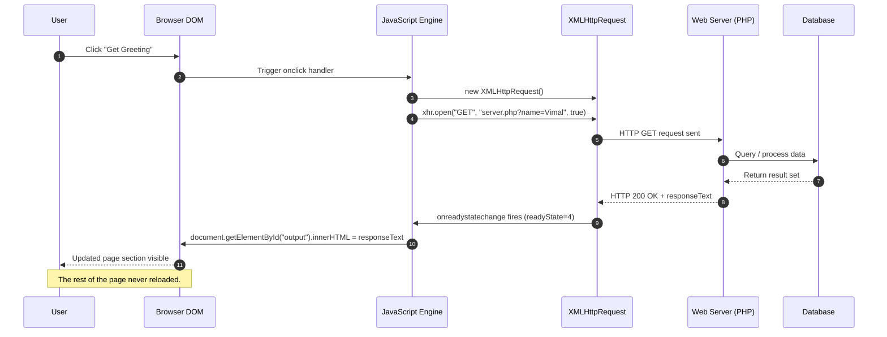
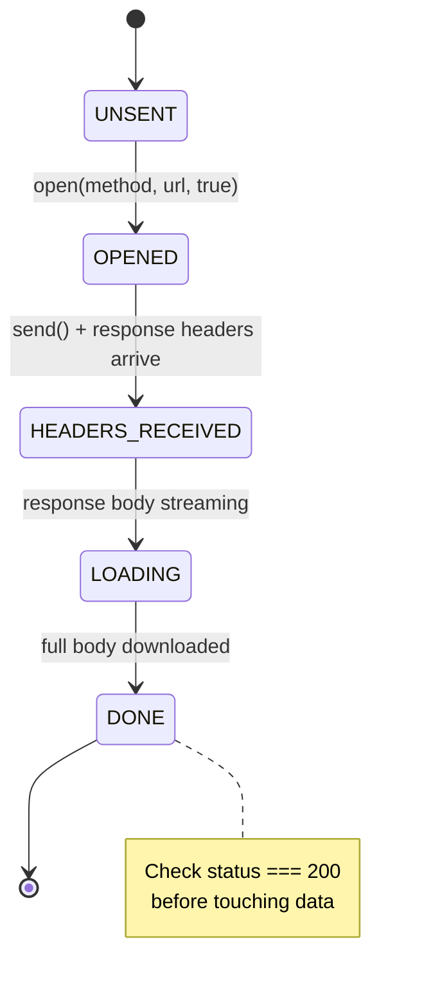
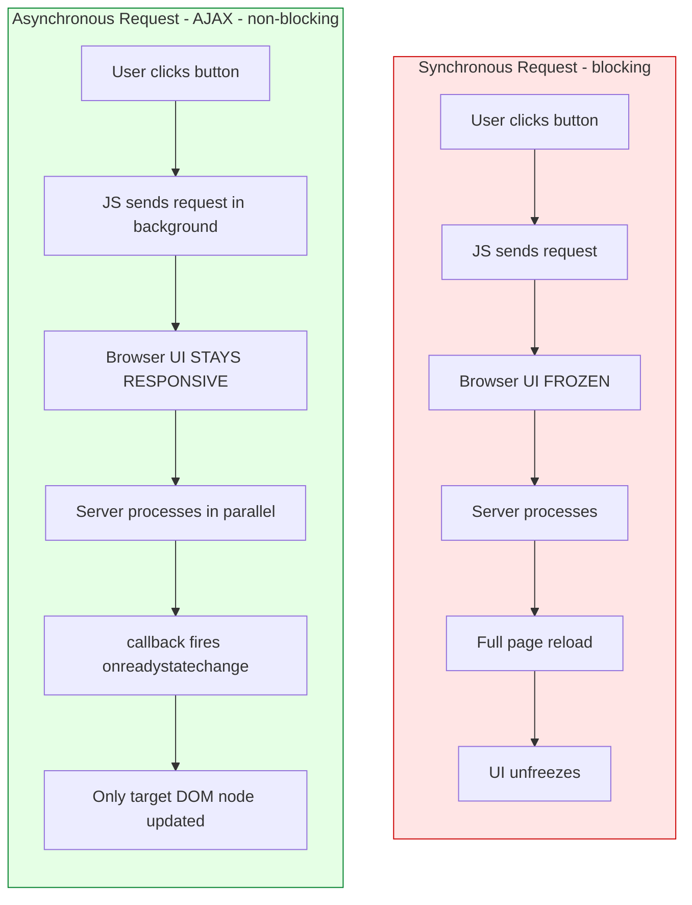
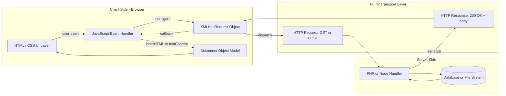
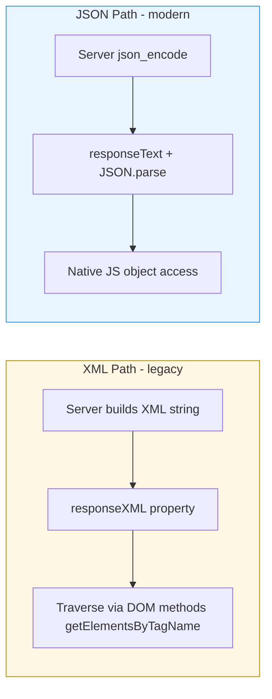

# Asynchronous JavaScript and XML - AJAX : Making Asynchronous Requests

<!-- SECTION_1_START -->
# AJAX — Asynchronous JavaScript and XML

> [!IMPORTANT]
> **KTU 2024 Scheme | OECST832 — Web Programming | Module 2: Scripting Language**
> This topic is a **high-yield area** in KTU University Exams. AJAX questions typically appear as 3-mark direct concepts or as 14-mark full-stack coding questions combined with PHP/Node backends.

## 1.1 Formal Academic Definition

**AJAX (Asynchronous JavaScript and XML)** is an integrated web development technique that uses a combination of:

- `XMLHttpRequest` (XHR) object (legacy) or the modern `fetch()` API
- `JavaScript` and the `DOM` (Document Object Model)
- A data interchange format, classically `XML` but now predominantly `JSON`
- `CSS` and `XHTML` for presentation

to send and receive data **asynchronously** with a web server — without requiring a full page reload.

> [!NOTE]
> **Key Insight from the KTU Syllabus:** AJAX is **not a technology**, but a **pattern/methodology** that orchestrates several pre-existing technologies. The word *"Asynchronous"* is the heart of the concept: the browser does not freeze while waiting for the server response.

## 1.2 Conceptual Analogy — The Restaurant Counter

Imagine a traditional web request (without AJAX) as a **buffet-style restaurant**:
- You (the browser) walk up to the counter (the server) and place an order.
- You **stand there frozen** until the chef prepares the entire meal.
- Only after the full meal arrives do you sit down and eat.
- During that wait, you can do **nothing else**.

Now imagine AJAX as a **table-service restaurant with a buzzer**:
- You (the browser) place an order through a waiter (the `XMLHttpRequest` object).
- The waiter takes it to the kitchen (the server) and returns immediately.
- You **continue browsing, scrolling, and clicking** while the kitchen works.
- When the buzzer rings (`onreadystatechange` event fires), the food (data) arrives.
- Only the **small portion of the page** that needs updating is replaced.

> [!TIP]
> This "non-blocking" behavior is what makes modern apps like **Gmail, Google Maps, Twitter/X, and Facebook** feel instantaneous.

## 1.3 Core Components of an AJAX System

| # | Component | Role |
|---|-----------|------|
| 1 | **XHR / Fetch API** | The transport engine that performs the HTTP request in the background. |
| 2 | **JavaScript** | Triggers the request and updates the DOM with the response. |
| 3 | **DOM** | The live page structure that AJAX mutates after the response arrives. |
| 4 | **XML or JSON** | The carrier format for data exchanged with the server. |
| 5 | **CSS / XHTML** | Provides the visual presentation of new data. |
| 6 | **Server-Side Script** | PHP, Node.js, Python, etc., that processes the request and returns a response. |

## 1.4 Synchronous vs Asynchronous — The Core Distinction

> [!WARNING]
> **Most common KTU mistake:** Confusing **Asynchronous** with **"instantaneous"**. Asynchronous means *non-blocking*. The request still travels over the network and takes real time. The browser just doesn't freeze while waiting.

| Property | Synchronous Request | Asynchronous Request (AJAX) |
|----------|--------------------|------------------------------|
| Page reload | Required | **Not required** |
| User interaction while waiting | **Blocked** | **Free / responsive** |
| JavaScript execution | Paused | Continues |
| Typical `XMLHttpRequest` flag | `async = false` | `async = true` (default) |
| Modern equivalent | Deprecated | `fetch()` (always async) |

## 1.5 The Classic AJAX Workflow (7 Logical Steps)

> [!IMPORTANT]
> Memorize this sequence. KTU board questions frequently ask: *"Explain the working of AJAX with a neat diagram."*

1. A **user event** occurs in the browser (e.g., click, keypress, `onload`).
2. A **JavaScript function** is invoked, creating an `XMLHttpRequest` object.
3. The `open()` method configures the HTTP method (`GET`/`POST`) and the target URL.
4. The `setRequestHeader()` method sets headers (e.g., `Content-Type`).
5. The `send()` method dispatches the request to the server.
6. The server processes the request and returns a response (XML/JSON/HTML/text).
7. The `onreadystatechange` callback fires; when `readyState === 4` and `status === 200`, JavaScript updates the DOM.

> [!VISUALIZATION CONTROL]
> **Concept:** Client–Server round-trip latency visualization
> **GeoGebra / Desmos Input Equations:**
> * Point A = (0, 0)         # Browser initiates request
> * Point B = (0.5, 1)       # Request in flight
> * Point C = (1, 0)         # Server processes
> * Point D = (1.5, 1)       # Response in flight
> * Point E = (2, 0)         # Browser updates DOM
> **Visual Description:** A **zig-zag timeline** on a t-x plane. The *y-axis (0 or 1)* shows whether the page is **blocked (1)** or **free (0)**. In a synchronous request, the line stays at y=1 from A to E. In an AJAX request, the line dips to y=0 immediately after A and stays there until E — only the final DOM update occupies the user.

<!-- SECTION_1_END -->

<!-- SECTION_2_START -->
# Deep Theoretical Analysis & KTU High-Yield Formula Sheet

## 2.1 The `XMLHttpRequest` Object — The Engine of AJAX

The `XMLHttpRequest` (XHR) object is the **browser-provided API** that powers traditional AJAX. It was first introduced by Microsoft for Outlook Web Access (1999) and later standardized by the W3C and WHATWG.

### 2.1.1 Critical Properties of XHR

| Property | Type | Meaning | Common KTU Values |
|----------|------|---------|-------------------|
| `readyState` | integer | Lifecycle stage of the request | `0`–`4` |
| `status` | integer | HTTP status code returned by the server | `200`, `404`, `500` |
| `statusText` | string | Textual HTTP status | `"OK"`, `"Not Found"` |
| `responseText` | string | Raw text body of the response | JSON or HTML string |
| `responseXML` | document | Parsed XML body (only if server sent `application/xml`) | XML DOM |
| `onreadystatechange` | function | Callback that fires on every state change | Handler function |

### 2.1.2 The `readyState` Lifecycle (HIGH-YIELD)

> [!IMPORTANT]
> **Board favorite.** You *must* know all 5 states and their order. A common 3-mark question asks: *"List the ready states of XMLHttpRequest."*

| State | Value | Meaning |
|-------|-------|---------|
| `UNSENT` | 0 | Object created, `open()` not called yet. |
| `OPENED` | 1 | `open()` has been invoked. Request line is set. |
| `HEADERS_RECEIVED` | 2 | `send()` called; response headers received. |
| `LOADING` | 3 | Response body is being downloaded (partial data). |
| `DONE` | 4 | Complete response has arrived. **Safe to read data.** |

### 2.1.3 Core XHR Methods

| Method | Purpose | Mandatory Parameters |
|--------|---------|----------------------|
| `open(method, url, async)` | Initializes the request. | HTTP verb, target URL, async flag (`true`/`false`). |
| `setRequestHeader(name, value)` | Adds an HTTP header. | Header name, header value. |
| `send(body)` | Dispatches the request. | Optional payload (for `POST`). |
| `abort()` | Cancels an in-flight request. | None. |
| `getResponseHeader(name)` | Reads a single response header. | Header name. |
| `getAllResponseHeaders()` | Returns all response headers as a string. | None. |

## 2.2 HTTP Methods Used in AJAX

| Method | Use Case | Has Body? | Idempotent? | Cached? |
|--------|----------|-----------|-------------|---------|
| **GET** | Fetch data, search, read operations. | No (params in URL) | Yes | Yes |
| **POST** | Submit form data, create new server-side resource. | Yes | No | No |
| **PUT** | Replace an existing resource. | Yes | Yes | No |
| **DELETE** | Remove a resource. | Optional | Yes | No |
| **HEAD** | Same as GET but only headers. | No | Yes | Yes |

> [!TIP]
> For KTU practicals, **GET** and **POST** are sufficient. Always use `URLEncode` (or `encodeURIComponent`) for GET parameters to handle spaces and special characters.

## 2.3 HTTP Status Codes — The Server's Reply Signal

> [!NOTE]
> The `status` property is **always** a 3-digit integer. KTU questions sometimes ask what status code is returned on success.

| Range | Category | Examples |
|-------|----------|----------|
| `1xx` | Informational | `100 Continue` |
| `2xx` | **Success** | `200 OK`, `201 Created`, `204 No Content` |
| `3xx` | Redirection | `301 Moved Permanently`, `304 Not Modified` |
| `4xx` | Client error | `400 Bad Request`, `401 Unauthorized`, `403 Forbidden`, `404 Not Found` |
| `5xx` | Server error | `500 Internal Server Error`, `503 Service Unavailable` |

## 2.4 Data Exchange Formats — XML vs JSON

| Property | XML (eXtensible Markup Language) | JSON (JavaScript Object Notation) |
|----------|----------------------------------|-----------------------------------|
| Syntax | Tag-based, similar to HTML. | Key–value pairs, JavaScript native. |
| Parsing | `responseXML` → DOM tree. | `JSON.parse(responseText)`. |
| Verbosity | **High** (lots of tags). | **Low** (compact). |
| Native to JS | No (must be traversed as XML DOM). | **Yes** — JS object literal. |
| Modern preference | Legacy enterprise systems. | **Dominant** in REST APIs. |
| AJAX "X" stands for | The original inspiration. | Now most common. |

> [!WARNING]
> **Board Pitfall:** Many students write *"AJAX = Asynchronous JavaScript and JSON"*. This is **wrong**. The acronym historically meant **XML**, and the X is *fixed* in the official name. JSON is what we actually use today, but the term **AJAX** remains unchanged.

## 2.5 The Modern Successor — Fetch API

The `fetch()` API is the modern, Promise-based replacement for XHR. It is **always asynchronous** and returns a `Promise<Response>`.

| Feature | `XMLHttpRequest` | `fetch()` |
|---------|------------------|-----------|
| Era | Legacy (IE5+, 2000s). | Modern (2015+, ES6). |
| Callback style | Event-based (`onreadystatechange`). | Promise-based (`.then()`, `await`). |
| Built-in JSON parsing | No. | Yes (`.json()` method). |
| Error handling | HTTP errors do **not** throw. | **Only network errors** throw. |
| Browser support | Universal. | All modern browsers (no IE). |
| KTU relevance | **Primary focus** for board exams. | Mentioned as modern alternative. |

## 2.6 KTU High-Yield Formula Sheet

| Concept | Formula / Rule | Units / Notes |
|---------|----------------|---------------|
| Round-trip time | $T_{total} = T_{request} + T_{server} + T_{response}$ | milliseconds |
| Async request line | `xhr.open("GET", "server.php?city=Kochi", true)` | `true` = async |
| Header rule | `xhr.setRequestHeader("Content-Type", "application/x-www-form-urlencoded")` | Required for POST |
| Completion check | `xhr.readyState === 4 && xhr.status === 200` | Both must be true. |
| JSON response | `const obj = JSON.parse(xhr.responseText)` | Wrap in try/catch. |
| GET parameter limit | $\le 2048$ characters in URL (browser dependent) | Use POST for larger. |
| POST data encoding | `name=value&name2=value2` | URL-encoded form. |
| URL encoding | `encodeURIComponent("Kochi Kerala")` → `"Kochi%20Kerala"` | Always encode. |

## 2.7 Real-World Engineering Utility

AJAX is the **architectural foundation** of Single-Page Applications (SPAs) and is essential in:

- **Search auto-suggestions** (Google Search dropdown).
- **Form validation** without page reload (sign-up password strength).
- **Live scoreboards** and **chat applications** (WebSockets are the next level up).
- **Infinite scroll** (Twitter/X, Instagram feeds).
- **Dashboard data refresh** in admin panels.

> [!NOTE]
> In production, AJAX requests are almost always authenticated using **tokens** (JWT, OAuth) attached via the `Authorization` header. CORS (`Cross-Origin Resource Sharing`) is a critical security policy that governs AJAX calls to a *different domain*.
<!-- SECTION_2_END -->

<!-- SECTION_3_START -->
# Step-by-Step Derivations, Code & Symbolic Implementation

## 3.1 Reference Architecture

We will build a complete AJAX example:

- **HTML page** (`index.html`) — User interface.
- **JavaScript** (inline) — Issues the AJAX request.
- **PHP backend** (`server.php`) — Returns a response.

The user types a name; AJAX fetches a personalized greeting from the server without reloading the page.

---

## 3.2 Full HTML + JavaScript Client Implementation

```html
<!DOCTYPE html>
<html lang="en">
<head>
  <meta charset="UTF-8">
  <title>KTU AJAX Demo - Greeting Fetcher</title>
</head>
<body>
  <h2>Asynchronous Greeting Service</h2>

  <!-- Input field where the user types a name -->
  <label for="username">Enter your name:</label>
  <input type="text" id="username" name="username" />

  <!-- The button that triggers the AJAX call -->
  <button type="button" onclick="fetchGreeting()">Get Greeting</button>

  <!-- The target element that AJAX will mutate -->
  <p id="output">Your greeting will appear here.</p>

  <script>
    /*
     * fetchGreeting():
     *   1. Read the user input.
     *   2. Construct a URL-safe query string.
     *   3. Open an XMLHttpRequest to the server.
     *   4. Wire the onreadystatechange callback.
     *   5. Send the request.
     */
    function fetchGreeting() {
      // ---- Step 1: Read & sanitize user input ----
      const rawName = document.getElementById("username").value;
      const safeName = encodeURIComponent(rawName.trim());

      // ---- Step 2: Abort early on empty input ----
      if (safeName.length === 0) {
        document.getElementById("output").innerHTML =
          "<span style='color:red;'>Please enter a name.</span>";
        return;
      }

      // ---- Step 3: Build the target URL ----
      //    GET parameters go in the query string, NOT the body.
      const targetURL = "server.php?name=" + safeName + "&ts=" + Date.now();

      // ---- Step 4: Create the XHR object ----
      //    (For IE5/6 compatibility one would use ActiveXObject,
      //     but modern browsers all support XMLHttpRequest directly.)
      const xhr = new XMLHttpRequest();

      // ---- Step 5: Register the state-change callback ----
      xhr.onreadystatechange = function () {
        // Guard: only act when the transaction is fully complete.
        if (xhr.readyState === 4) {
          if (xhr.status === 200) {
            // Successful response. Inject the server text into the DOM.
            document.getElementById("output").innerHTML =
              "<strong>Server says:</strong> " + xhr.responseText;
          } else {
            // HTTP-level failure (404, 500, etc.).
            document.getElementById("output").innerHTML =
              "<span style='color:red;'>Error " + xhr.status +
              ": " + xhr.statusText + "</span>";
          }
        }
      };

      // ---- Step 6: Configure the request ----
      //    Method: GET, URL: targetURL, async: true (the default)
      xhr.open("GET", targetURL, true);

      // ---- Step 7 (optional): Add a custom header ----
      xhr.setRequestHeader("X-Requested-With", "XMLHttpRequest");

      // ---- Step 8: Dispatch the request ----
      //    GET requests pass null as the body.
      xhr.send(null);
    }
  </script>
</body>
</html>
```

---

## 3.3 Full PHP Server Implementation (`server.php`)

```php
<?php
// server.php — Accepts a 'name' query parameter via AJAX and returns a greeting.

// ---- Step 1: Set the response Content-Type ----
// Always echo JSON for modern APIs, but plain text is acceptable for beginners.
header("Content-Type: text/plain; charset=UTF-8");

// ---- Step 2: Read the GET parameter ----
$name = isset($_GET["name"]) ? $_GET["name"] : "Guest";

// ---- Step 3: Sanitize the input (XSS prevention) ----
$safeName = htmlspecialchars($name, ENT_QUOTES, "UTF-8");

// ---- Step 4: Simulate a small server-side delay (optional, for testing) ----
// sleep(2);

// ---- Step 5: Construct and send the response ----
echo "Hello, " . $safeName . "! Welcome to KTU Web Programming.";
?>
```

---

## 3.4 Variant Implementation — POST Method

When the payload is large or sensitive, use `POST` instead of `GET`. The data goes in the `send()` body, not the URL.

```javascript
function fetchGreetingPOST() {
  const rawName = document.getElementById("username").value;
  const safeName = encodeURIComponent(rawName.trim());

  const xhr = new XMLHttpRequest();
  xhr.onreadystatechange = function () {
    if (xhr.readyState === 4 && xhr.status === 200) {
      document.getElementById("output").innerHTML = xhr.responseText;
    }
  };

  xhr.open("POST", "server.php", true);

  // Mandatory header for URL-encoded form data
  xhr.setRequestHeader(
    "Content-Type",
    "application/x-www-form-urlencoded"
  );

  // Body must be in the same name=value format
  xhr.send("name=" + safeName);
}
```

---

## 3.5 Variant Implementation — JSON Response

The modern, REST-friendly approach uses JSON. The PHP side uses `json_encode`, and the JS side uses `JSON.parse`.

**PHP side:**

```php
<?php
header("Content-Type: application/json; charset=UTF-8");

$name = isset($_GET["name"]) ? $_GET["name"] : "Guest";
$safeName = htmlspecialchars($name, ENT_QUOTES, "UTF-8");

$response = [
    "status"  => "ok",
    "greeting"=> "Hello, " . $safeName . "!",
    "time"    => date("H:i:s")
];

echo json_encode($response);
?>
```

**JavaScript side (using `responseText` and `JSON.parse`):**

```javascript
const xhr = new XMLHttpRequest();
xhr.onreadystatechange = function () {
  if (xhr.readyState === 4 && xhr.status === 200) {
    try {
      const data = JSON.parse(xhr.responseText);
      document.getElementById("output").innerHTML =
        data.greeting + " (server time: " + data.time + ")";
    } catch (e) {
      document.getElementById("output").innerHTML =
        "Malformed JSON from server.";
    }
  }
};
xhr.open("GET", "server.php?name=Vimal", true);
xhr.send(null);
```

---

## 3.6 Modern Equivalent Using the Fetch API

```javascript
async function fetchGreetingModern() {
  const rawName  = document.getElementById("username").value;
  const safeName = encodeURIComponent(rawName.trim());

  try {
    // fetch() returns a Promise. await pauses ONLY this async function,
    // not the entire browser.
    const response = await fetch("server.php?name=" + safeName);

    // fetch() does NOT throw on HTTP errors — check manually.
    if (!response.ok) {
      throw new Error("HTTP " + response.status);
    }

    const data = await response.json();   // parses JSON automatically
    document.getElementById("output").innerHTML = data.greeting;
  } catch (err) {
    document.getElementById("output").innerHTML =
      "Request failed: " + err.message;
  }
}
```

---

## 3.7 Lineage of an AJAX Call — Symbolic Step Trace

$$
\begin{aligned}
\text{State}_0 &: \text{UNSENT} \quad \big(\text{new XMLHttpRequest()}\big) \\
\text{State}_1 &: \text{OPENED} \quad \big(\text{xhr.open("GET", url, true)}\big) \\
\text{State}_2 &: \text{HEADERS\_RECEIVED} \quad \big(\text{server returns 200 OK}\big) \\
\text{State}_3 &: \text{LOADING} \quad \big(\text{responseText partially filled}\big) \\
\text{State}_4 &: \text{DONE} \quad \big(\text{full body received}\big) \\
\text{Check}  &: \big(\text{readyState} == 4\big) \land \big(\text{status} == 200\big) \\
\text{Action} &: \text{Update DOM with } xhr.responseText
\end{aligned}
$$

This symbolic trace is the **valuation key** examiners use to mark 7- or 14-mark questions. Always present both the `readyState` and `status` checks, not just one.

<!-- SECTION_3_END -->

<!-- SECTION_4_START -->
# Structural Diagrams & Schematics

## 4.1 End-to-End AJAX Round-Trip Sequence



## 4.2 State-Transition Diagram for `readyState`



## 4.3 Synchronous vs Asynchronous Request Block



## 4.4 AJAX Component Architecture Block



## 4.5 Data Format Comparison Block



<!-- SECTION_4_END -->

<!-- SECTION_5_START -->
# KTU 2024 Scheme Examination Question Bank & Topic Recap

> [!NOTE]
> The questions below are calibrated to **KTU 2024 Scheme pattern**: 3-mark short answers and 14-mark module-internal-choice questions with sub-parts at escalating Bloom levels.

---

## 5.1 Part A — Short Answer Questions (3 Marks Each)

### Question 1: Define AJAX. List its key features. `[KTU University Exam – Dec 2023]`
**Course Outcome:** CO1 | **Bloom Level:** Remember / Understand

**Model Answer (Valuation Key):**

> [!TIP]
> **AJAX** stands for **Asynchronous JavaScript and XML**. It is a web development technique used to create **interactive web applications** by exchanging data with a server **asynchronously** in the background, without disturbing or reloading the current page.
>
> **[Key features — 2 Marks]**
> 1. **Asynchronous communication** — the browser is not blocked.
> 2. **Partial page update** — only the required DOM section is refreshed.
> 3. **Uses existing technologies** — JavaScript, XML/JSON, DOM, XHR.
> 4. **Improved user experience** — faster, more responsive interfaces.
> 5. **Reduces server load and bandwidth** — only data is transferred, not full HTML.
>
> **[Defining the acronym — 1 Mark]** Each letter expanded clearly.

### Question 2: Explain the five `readyState` values of the `XMLHttpRequest` object. `[KTU University Exam – July 2024]`
**Course Outcome:** CO1 | **Bloom Level:** Remember

**Model Answer (Valuation Key):**

| State | Value | Meaning |
|-------|-------|---------|
| `UNSENT` | 0 | The object is created but `open()` is not yet called. |
| `OPENED` | 1 | `open()` has been successfully called. |
| `HEADERS_RECEIVED` | 2 | `send()` has been called and headers are available. |
| `LOADING` | 3 | The response body is downloading; `responseText` is partial. |
| `DONE` | 4 | The operation is complete; full response is available. |

**[Each correct state: 0.5 Mark × 5 = 2.5 Marks; full table neatly: 0.5 Mark]**

---

## 5.2 Part B — Long Answer Questions (14 Marks Each, with Internal Choice)

### Question A: AJAX Architecture and Implementation `[KTU University Exam – Dec 2023]`
**Course Outcome:** CO2 | **Bloom Level:** Understand / Apply

#### (a) Describe the working of AJAX with a neat diagram. List its advantages. **[7 Marks]**

**Model Solution:**

**Working of AJAX — step-by-step explanation:**

1. **Event occurs** — A user action (e.g., clicking a button) triggers a JavaScript function.
2. **XMLHttpRequest object created** — `const xhr = new XMLHttpRequest();`
3. **Request configured** — `xhr.open("GET", "data.php", true);` sets the method, URL, and async flag.
4. **Callback registered** — `xhr.onreadystatechange = function() { ... }` defines the handler.
5. **Request sent** — `xhr.send(null);` dispatches the HTTP request in the background.
6. **Server processes** — The server-side script (PHP/Node) handles the request and builds a response.
7. **Response received** — The `readyState` becomes `4` and `status` becomes `200`.
8. **DOM updated** — JavaScript injects `xhr.responseText` into a chosen element using `innerHTML`.

**Neat ASCII diagram:**

```
+-------------+         +-----------------+         +------------+
|  Browser    |  HTTP   |  Web Server     |  Query  |  Database  |
|  (XHR)      |-------->|  (PHP/Node)     |-------->|            |
|  JavaScript |  GET    |                 |         |            |
|  + DOM      |  POST   |                 |         |            |
+-------------+<--------+-----------------+<--------+------------+
   ▲                      
   | onreadystatechange (readyState=4, status=200)
   | xhr.responseText injected via innerHTML
   ▼
+-------------+
| User sees   |
| updated DOM |
+-------------+
```

**Advantages — [1.5 Marks]:**
- Faster user experience (no full reload).
- Better responsiveness and interactivity.
- Reduced bandwidth usage.
- Backed-button and bookmark friendly when combined with history API.
- Platform-independent (purely browser-based).

**[Valuation Key]**
- [Step-by-step working explanation: 3 Marks]
- [Neat labelled diagram: 2 Marks]
- [At least 4 distinct advantages: 1.5 Marks]
- [Neat presentation: 0.5 Mark]

#### (b) Write a complete AJAX program that fetches the current server time from a PHP page and displays it in a `<div>` without reloading the page. **[7 Marks]**

**Model Solution:**

**`index.html`:**

```html
<!DOCTYPE html>
<html>
<head><title>AJAX Time Fetcher</title></head>
<body>
  <h2>Live Server Clock (AJAX)</h2>
  <div id="clock">--:--:--</div>
  <button type="button" onclick="getTime()">Refresh Time</button>

  <script>
    function getTime() {
      const xhr = new XMLHttpRequest();
      xhr.onreadystatechange = function () {
        if (xhr.readyState === 4 && xhr.status === 200) {
          document.getElementById("clock").innerHTML =
            "Current time: " + xhr.responseText;
        }
      };
      // The Date.now() suffix busts the browser cache on every click.
      xhr.open("GET", "time.php?ts=" + Date.now(), true);
      xhr.send(null);
    }

    // Optional: poll the server every 5 seconds for a "live" clock.
    setInterval(getTime, 5000);
  </script>
</body>
</html>
```

**`time.php`:**

```php
<?php
header("Content-Type: text/plain; charset=UTF-8");
echo date("H:i:s");
?>
```

**Explanation of the key parts:**

| Code fragment | Purpose |
|---------------|---------|
| `new XMLHttpRequest()` | Creates the transport object. |
| `xhr.onreadystatechange = function(){...}` | Registers the response handler. |
| `xhr.readyState === 4` | Ensures the request is fully complete. |
| `xhr.status === 200` | Ensures the HTTP response was successful. |
| `xhr.open("GET", url, true)` | Configures method, URL, async flag. |
| `xhr.send(null)` | Dispatches the request (no body for GET). |
| `Date.now()` | Anti-cache timestamp in the query string. |
| `setInterval(getTime, 5000)` | Auto-refresh every 5 seconds. |

**[Valuation Key]**
- [HTML structure with input, button, target div: 1 Mark]
- [Correct XHR object creation and `open` call: 1.5 Marks]
- [Proper `onreadystatechange` with both `readyState` and `status` checks: 2 Marks]
- [Correct `send` and DOM update via `innerHTML`: 1 Mark]
- [Valid PHP backend that prints the time: 1 Mark]
- [Neat indentation and comments: 0.5 Mark]

---

### Question B: Modern AJAX with JSON and the Fetch API `[KTU University Exam – July 2024]`
**Course Outcome:** CO2 | **Bloom Level:** Apply / Analyze

#### (a) Compare XML and JSON as data interchange formats used in AJAX. Which is preferred today and why? **[7 Marks]**

**Model Solution:**

| Parameter | XML | JSON |
|-----------|-----|------|
| **Full form** | eXtensible Markup Language | JavaScript Object Notation |
| **Syntax style** | Custom tags (`<book><title>...</title></book>`). | Key-value pairs (`{"title": "..."}`). |
| **Verbosity** | High; opening + closing tags. | Low; minimal punctuation. |
| **Parsing in JS** | `responseXML` → must use `getElementsByTagName`. | `responseText` + `JSON.parse()`. |
| **Native to JavaScript** | No. | **Yes** — direct object access. |
| **Data types supported** | All (text-based). | String, number, boolean, array, object, null. |
| **Comments allowed** | Yes. | **No**. |
| **Schema support** | XSD, DTD. | JSON Schema (less mature). |
| **Browser support** | Universal. | Universal. |
| **Preferred today** | Legacy enterprise. | **Yes, dominant.** |

**Why JSON is preferred today — [3 Marks]:**
1. **Lightweight** — smaller payload reduces bandwidth.
2. **Native to JavaScript** — `JSON.parse` is a single call.
3. **Faster parsing** — no DOM traversal overhead.
4. **Easier to read** — improves developer productivity.
5. **REST API standard** — virtually every modern API uses JSON.

**[Valuation Key]**
- [Tabular comparison with at least 6 rows: 3 Marks]
- [Brief on JSON preference with 3+ reasons: 3 Marks]
- [Conclusion sentence: 1 Mark]

#### (b) Rewrite the time-fetcher program from Question A using the modern `fetch()` API and JSON, with proper error handling. **[7 Marks]**

**Model Solution:**

**`time.php` (JSON version):**

```php
<?php
header("Content-Type: application/json; charset=UTF-8");
echo json_encode([
    "time"      => date("H:i:s"),
    "date"      => date("Y-m-d"),
    "timezone"  => date_default_timezone_get()
]);
?>
```

**`index.html` (Fetch + JSON):**

```html
<!DOCTYPE html>
<html>
<head><title>Modern AJAX with Fetch</title></head>
<body>
  <h2>Server Time (Fetch + JSON)</h2>
  <div id="result">Loading...</div>

  <script>
    async function loadServerTime() {
      try {
        // Step 1: Initiate the request. await yields only this async function.
        const response = await fetch("time.php?ts=" + Date.now());

        // Step 2: fetch() does NOT throw on 4xx/5xx — check manually.
        if (!response.ok) {
          throw new Error("HTTP " + response.status + " " + response.statusText);
        }

        // Step 3: Parse the JSON body.
        const data = await response.json();

        // Step 4: Render the result.
        document.getElementById("result").innerHTML =
          "Time: " + data.time +
          " | Date: " + data.date +
          " | Zone: " + data.timezone;
      } catch (err) {
        document.getElementById("result").innerHTML =
          "<span style='color:red;'>Error: " + err.message + "</span>";
      }
    }

    loadServerTime();
    setInterval(loadServerTime, 5000);
  </script>
</body>
</html>
```

**Explanation of the modernizations:**

| Improvement | Reason |
|-------------|--------|
| `fetch()` instead of `XMLHttpRequest` | Cleaner Promise-based API. |
| `async / await` | Eliminates callback nesting ("callback hell"). |
| `await response.json()` | Auto-parses the JSON body. |
| `if (!response.ok)` | Manual HTTP status check (fetch doesn't throw). |
| `try / catch` | Catches network failures and parse errors. |
| `Date.now()` in URL | Prevents browser caching of stale data. |

**[Valuation Key]**
- [Correct `async`/`await` pattern with `fetch`: 2 Marks]
- [Proper `response.ok` check and `try/catch`: 1.5 Marks]
- [Correct JSON parsing via `response.json()`: 1 Mark]
- [Valid PHP `json_encode` backend: 1 Mark]
- [DOM update with formatted output: 1 Mark]
- [Neat code and comments: 0.5 Mark]

---

## 5.3 KTU Examiner's Valuation Warning / Pitfall Callout

> [!WARNING]
> **Common Mark-Deduction Traps in AJAX Questions:**
>
> 1. **Forgetting the async flag** — writing `xhr.open("GET", url)` (default is `true` but examiners look for explicit `true` to test understanding).
> 2. **Checking only `readyState` and not `status`** — partial page updates on a 404 will display the error page text. Always combine both checks.
> 3. **Mixing up `responseText` and `responseXML`** — they are mutually exclusive based on the server's `Content-Type` header.
> 4. **Forgetting `setRequestHeader("Content-Type", ...)` on POST** — PHP will not populate `$_POST` without it.
> 5. **Not using `encodeURIComponent`** — names with spaces, `&`, or `=` break the URL.
> 6. **Confusing AJAX with JSON** — AJAX is a *technique*, JSON is a *format*. The "X" in AJAX is still XML historically.
> 7. **Skipping the diagram** — for 7-mark "working of AJAX" questions, **a labelled diagram is mandatory**. Without it, expect a 2-mark deduction.
> 8. **Not handling errors** — production AJAX code must include the `if (xhr.status === 200) ... else { handle error }` branch.

---

## 5.4 Topic Recap & Important Things to Remember

> [!TIP]
> **High-density rapid-revision checklist** for the last 24 hours before the KTU exam.

- **AJAX** = **Asynchronous JavaScript and XML** — a *technique*, not a language.
- The browser **does not freeze** during an async request — that is the whole point.
- The five `readyState` values are **0, 1, 2, 3, 4** (`UNSENT`, `OPENED`, `HEADERS_RECEIVED`, `LOADING`, `DONE`).
- The golden check is **always**: `readyState === 4 && status === 200`.
- The five key XHR methods are **`open`, `setRequestHeader`, `send`, `abort`, `getResponseHeader`**.
- `GET` puts parameters in the **URL**; `POST` puts them in the **body** with `Content-Type: application/x-www-form-urlencoded`.
- `responseText` is a **string**; `responseXML` is a **DOM document** (only populated for `application/xml` responses).
- **JSON** has officially replaced **XML** as the AJAX data format of choice due to its native fit with JavaScript.
- `JSON.parse(xhr.responseText)` converts a JSON string into a JavaScript object — always wrap in `try/catch`.
- `encodeURIComponent()` must be applied to user input to make it URL-safe.
- The modern `fetch()` API is **Promise-based**, always asynchronous, and replaces `XMLHttpRequest` in new code.
- `fetch()` **does not throw on HTTP errors** — always check `response.ok`.
- The **7-step AJAX workflow** is: *event → JS function → XHR created → open() → send() → server processes → onreadystatechange updates DOM*.
- Status code `200` = success; `404` = not found; `500` = server error.
- `Date.now()` in the query string is a common **cache-busting** trick.
- AJAX is the foundation of **Single-Page Applications (SPAs)** and live UI updates.
- **CORS** governs AJAX calls across different domains; same-origin requests are unrestricted by default.

<!-- SECTION_5_END -->
