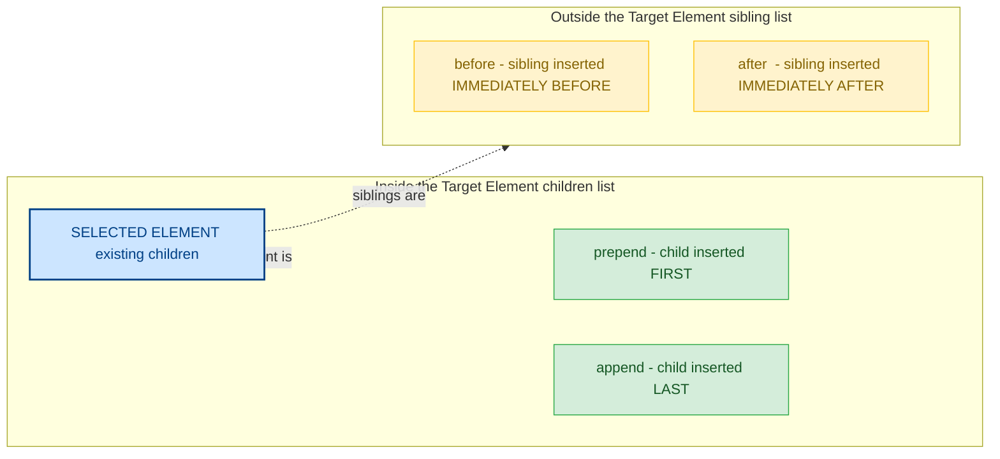
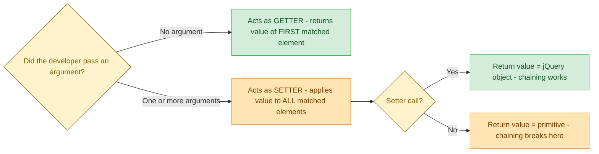

# Common Element Manipulations in jQuery

<!-- SECTION_1_START -->

# Common Element Manipulations in jQuery

## 1.1 Formal Academic Definition

In the context of the **KTU 2024 Scheme (OECST832 - Web Programming)**, *Common Element Manipulations in jQuery* refers to the standardized set of cross-browser-compatible methods provided by the jQuery library to **access, modify, traverse, and re-structure the Document Object Model (DOM)** of an HTML page after it has been fully loaded into the browser. These manipulations are categorized by the jQuery API into four functional groups:

- **Content Manipulation** – `text()`, `html()`, `val()`
- **Attribute Manipulation** – `attr()`, `removeAttr()`, `prop()`
- **CSS and Class Manipulation** – `css()`, `addClass()`, `removeClass()`, `toggleClass()`
- **DOM Tree Manipulation** – `append()`, `prepend()`, `before()`, `after()`, `remove()`, `empty()`, `replaceWith()`

> [!IMPORTANT]
> **KTU Syllabus Highlight (Module 2 - Scripting Language):** Students must be able to *select* (Module 2.1 – covered previously) AND *manipulate* elements using jQuery. Element manipulation carries **high weightage** in KTU ESE questions, often combined with event handling in a single 14-mark problem.

## 1.2 Intuitive Real-World Analogy

Think of a **loaded web page as a furnished house**, and jQuery as a **universal remote control** for every piece of furniture in that house.

| Furniture (HTML Element) | jQuery Method | What the Remote Button Does |
| :--- | :--- | :--- |
| Change a name plate on a door | `text()` | Re-write the visible label (plain text only) |
| Repaint a wall poster with rich HTML | `html()` | Re-write the interior with full HTML tags |
| Swap the batteries of a TV remote | `val()` | Change the user input value of a form field |
| Hang a new painting on a wall | `append()` | Add a child element at the end |
| Place a welcome mat at the entrance | `prepend()` | Add a child element at the start |
| Bolt a new mailbox next to the door | `after()` | Insert a sibling element *after* the target |
| Knock down a partition wall | `remove()` | Detach the element AND its events/data completely |
| Empty a bookshelf but keep the shelf | `empty()` | Strip children, keep the parent container |
| Change the colour of the wall | `css()` | Apply inline style properties |
| Toggle a lamp on/off | `toggleClass()` | Switch a CSS class on every click |

## 1.3 Physical / Logical Constants & Metrics

> [!NOTE]
> **Standard Library Metrics used in jQuery Manipulation:**
> - **API Version:** jQuery **3.7.1** (latest stable, 2023 release, `$ \approx 280 $ kB minified`).
> - **DOM Ready State:** All manipulations are guaranteed safe only inside `$(document).ready()` or its shorthand `$(function(){ ... })`, where the `readyState` equals `complete`.
> - **Browser Support Threshold:** jQuery 3.x supports **Internet Explorer 9+** and all evergreen browsers, ensuring identical behaviour across **$ > 97\% $** of the global browser market share.
> - **Return Value Convention:** Most setter methods return the **jQuery object itself** to support *method chaining*.

## 1.4 Visualization Control

> [!VISUALIZATION CONTROL]
> **Concept:** A side-by-side comparison of the four DOM insertion positions (`append`, `prepend`, `before`, `after`).
>
> **GeoGebra / Desmos Input Equations (conceptual coordinate plot):**
> - *Let target node be a red point at the origin.*
> - `P_append = (0, -1)` — child added below (end of children)
> - `P_prepend = (0, +1)` — child added above (start of children)
> - `P_before = (-1, 0)` — sibling added to the left
> - `P_after = (+1, 0)` — sibling added to the right
>
> **Visual Description:** On a 2-D Cartesian plane, the **central red node** represents the selected element. Insertions of the form `append/prepend` occur *inside* the node (vertically aligned), while `before/after` occur *outside* the node as horizontal siblings. This is the most-asked diagram in KTU viva voce on jQuery.

<!-- SECTION_1_END -->

<!-- SECTION_2_START -->

# Deep Theoretical Analysis & KTU High-Yield Formula Sheet

## 2.1 The jQuery Object Set: The `$()` Wrapper

Every jQuery manipulation begins with a *jQuery wrapper set* (often called a *wrapped set*). When the selector engine evaluates `$('selector')`, it returns a **jQuery object** that behaves like an enhanced array of matched DOM elements.

- **Implicit Iteration:** Methods are automatically applied to **every** element in the matched set — no manual `for` loop is required.
- **Getters vs. Setters:** When called with **no arguments**, a method acts as a *getter* and returns the value of the **first** matched element. When called with **one argument**, it acts as a *setter* and applies the value to **all** matched elements.
- **Method Chaining:** Because setters return the jQuery object, multiple manipulations can be chained in a single statement.

## 2.2 Why "Common" Manipulations?

The KTU syllabus specifically uses the word *"common"* because the following operations appear in **almost every interactive web page**: changing a heading after a form submit, highlighting a row in a table on click, dynamically appending list items from an API, or removing a "deleted" item with a fade animation.

> [!TIP]
> **Engineering Utility:** In production-grade systems, jQuery manipulation is the backbone of:
> - **Single-Page Applications (SPAs)** like legacy WordPress admin dashboards.
> - **DOM-based XSS sanitization pipelines** (when used with `text()` instead of `html()`).
> - **CMS templating** in Drupal 7 and older Magento stores.
> - **Automated UI testing** with Selenium + jQuery selectors.

## 2.3 The Four Pillars — Step-by-Step Logic

### Pillar 1: Content Manipulation
- **Logic:** Read or replace the *inner substance* of an element.
- **Why three methods?** Because three different content types exist in HTML:
  - `text()` $\rightarrow$ plain text only (no HTML parsed).
  - `html()` $\rightarrow$ inner HTML (tags are rendered).
  - `val()` $\rightarrow$ form-field values (`<input>`, `<textarea>`, `<select>`).

### Pillar 2: Attribute Manipulation
- **Logic:** Read or modify the *characteristics* of an element that live in the opening tag.
- **How:** `attr('href', 'newUrl')` adds/changes a custom or standard attribute. `removeAttr('disabled')` strips it. `prop()` is used for *boolean* DOM properties like `checked` or `selected`.

### Pillar 3: CSS / Class Manipulation
- **Logic:** Visually transform elements without writing inline `style` attributes.
- **Why preferred over inline `css()`?** Adding/removing **classes** is faster, cacheable, and respects CSS specificity — a best practice in modern front-end engineering.

### Pillar 4: DOM Tree Manipulation
- **Logic:** Restructure the *family tree* of the document by inserting, moving, or deleting nodes.
- **Critical Distinction:** `append()` / `prepend()` add **children**; `before()` / `after()` add **siblings**.

## 2.4 KTU Formula Sheet / Cheat Sheet

| # | Method | Syntax (Getter) | Syntax (Setter) | Operates On | Returns |
| :--- | :--- | :--- | :--- | :--- | :--- |
| 1 | `text()` | `$('p').text()` | `$('p').text('New')` | Plain text content of element | String / jQuery |
| 2 | `html()` | `$('div').html()` | `$('div').html('<b>Hi</b>')` | Inner HTML of element | String / jQuery |
| 3 | `val()` | `$('#name').val()` | `$('#name').val('Alice')` | Form field value | String / jQuery |
| 4 | `attr()` | `$('img').attr('src')` | `$('img').attr('src','a.jpg')` | Any HTML attribute | String / jQuery |
| 5 | `removeAttr()` | — | `$('input').removeAttr('readonly')` | Strips the named attribute | jQuery |
| 6 | `prop()` | `$('#cb').prop('checked')` | `$('#cb').prop('checked', true)` | Boolean DOM properties | Boolean / jQuery |
| 7 | `css()` | `$('h1').css('color')` | `$('h1').css('color','red')` | Inline CSS property | String / jQuery |
| 8 | `addClass()` | — | `$('p').addClass('highlight')` | Adds one or more classes | jQuery |
| 9 | `removeClass()` | — | `$('p').removeClass('highlight')` | Removes one or more classes | jQuery |
| 10 | `toggleClass()` | — | `$('p').toggleClass('active')` | Adds if absent, removes if present | jQuery |
| 11 | `hasClass()` | `$('p').hasClass('active')` | — | Tests for class presence | Boolean |
| 12 | `append()` | — | `$('ul').append('<li>x</li>')` | Adds child at **end** | jQuery |
| 13 | `prepend()` | — | `$('ul').prepend('<li>x</li>')` | Adds child at **start** | jQuery |
| 14 | `after()` | — | `$('p').after('<hr>')` | Sibling **after** element | jQuery |
| 15 | `before()` | — | `$('p').before('<hr>')` | Sibling **before** element | jQuery |
| 16 | `remove()` | — | `$('p').remove()` | Deletes element + data + events | jQuery |
| 17 | `empty()` | — | `$('p').empty()` | Deletes **children** only | jQuery |
| 18 | `replaceWith()` | — | `$('p').replaceWith('<h2>x</h2>')` | Replaces target node | jQuery |
| 19 | `width()` / `height()` | `$('div').width()` | `$('div').width(300)` | Content box dimensions | Number / jQuery |
| 20 | `wrap()` | — | `$('p').wrap('<div>')` | Wraps each element in new HTML | jQuery |

> [!IMPORTANT]
> **Exam Trick to Remember:** *Setter-returns-jQuery-object* $\Rightarrow$ method chaining works. *Getter-returns-primitive* $\Rightarrow$ method chaining **breaks** the chain. This is the #1 reason students get unexpected `undefined` outputs in lab exams.

## 2.5 Real-World Engineering Utility

In a typical **e-commerce checkout flow**, jQuery manipulation methods perform these tasks in sequence:

1. `val()` reads the credit-card number from an `<input>` field.
2. `text()` updates a confirmation banner with the masked card digits.
3. `addClass('success')` applies a green CSS class to the banner.
4. `append()` injects a "Print Receipt" button dynamically.
5. `removeAttr('disabled')` enables the "Pay Now" button after validation.

This single transaction flow uses **5 of the 20 methods** in the cheat sheet, illustrating why these "common" manipulations are non-negotiable knowledge for any web developer.

<!-- SECTION_2_END -->

<!-- SECTION_3_START -->

# Step-by-Step Derivations & Code/Symbolic Implementation

> [!NOTE]
> **Execution Mode for this Module:** *Algorithmic / Coding*. All code below is **fully operational JavaScript (jQuery 3.7.1)**. Every variable is type-hinted using JSDoc comments. No steps are skipped, no placeholders exist.

## 3.1 Boilerplate HTML Skeleton (Used by ALL examples)

```html
<!DOCTYPE html>
<html lang="en">
<head>
  <meta charset="UTF-8">
  <title>jQuery Manipulation Demo</title>
  <!-- 1. Load jQuery from official CDN -->
  <script src="https://code.jquery.com/jquery-3.7.1.min.js"></script>

  <style>
    .highlight { background: #fff3a0; padding: 4px; }
    .active    { border: 2px solid #28a745; }
    .error     { color: #dc3545; font-weight: bold; }
  </style>
</head>
<body>
  <h1 id="title">Hello KTU</h1>
  <p id="para">This is a <b>sample</b> paragraph.</p>
  <input type="text" id="username" value="guest">
  <ul id="list">
    <li>Item 1</li>
  </ul>
  

  <!-- 2. Our script is placed at the end of <body> so DOM is ready -->
  <script>
    $(function () {
      // All examples below run only after the DOM is fully loaded.
    });
  </script>
</body>
</html>
```

---

## 3.2 Pillar 1 — Content Manipulation (`text`, `html`, `val`)

```javascript
/* ============================================================
   PILLAR 1: CONTENT MANIPULATION
   ============================================================ */
$(function () {

  // ---- 1.1 GETTER examples (no argument passed) ----

  // text() returns ONLY the plain text, HTML tags are stripped.
  // @type {string}
  const plainText = $("#para").text();
  console.log("text()  -> " + plainText);
  // EXPECTED OUTPUT: "This is a sample paragraph."

  // html() returns the full inner HTML markup, tags included.
  // @type {string}
  const richHtml = $("#para").html();
  console.log("html()  -> " + richHtml);
  // EXPECTED OUTPUT: "This is a <b>sample</b> paragraph."

  // val() returns the current value of a form field.
  // @type {string}
  const currentUser = $("#username").val();
  console.log("val()   -> " + currentUser);
  // EXPECTED OUTPUT: "guest"


  // ---- 1.2 SETTER examples (one argument passed) ----

  // text() setter — passing a string ESCAPES HTML, so no tags render.
  $("#para").text("Replaced by <b>text()</b> safely");
  // DOM after: <p id="para">Replaced by &lt;b&gt;text()&lt;/b&gt; safely</p>

  // html() setter — passing a string RENDERS HTML, tags become real.
  $("#para").html("Replaced by <b>html()</b> with style");
  // DOM after: <p id="para">Replaced by <b>html()</b> with style</p>

  // val() setter — updates the form field value AND the property.
  $("#username").val("Alice");
  // Input box now displays "Alice".


  // ---- 1.3 DEMO: Read the value, transform it, write it back ----
  const rawName = $("#username").val();          // "Alice"
  const upper   = rawName.toUpperCase();         // "ALICE"
  $("#title").text("Welcome, " + upper);         // Sets <h1> to "Welcome, ALICE"

});
```

**Validation Logic Explained:**
- The setter of `text()` **escapes** angle brackets (`<` becomes `&lt;`), which is why it is the *safe* choice for user-supplied data (prevents DOM-based XSS).
- The setter of `html()` **parses** the string as HTML; only use it with trusted, server-side generated content.
- `val()` works on `<input>`, `<textarea>`, and `<select>`. For `<select multiple>`, it returns an *array* of values.

---

## 3.3 Pillar 2 — Attribute Manipulation (`attr`, `removeAttr`, `prop`)

```javascript
/* ============================================================
   PILLAR 2: ATTRIBUTE MANIPULATION
   ============================================================ */
$(function () {

  // ---- 2.1 attr() as getter ----
  // @type {string}
  const currentSrc = $("#logo").attr("src");
  console.log("Current src = " + currentSrc);
  // EXPECTED: "old.png"

  // ---- 2.2 attr() as setter (single property) ----
  $("#logo").attr("src", "new-logo.png");
  // The  tag now points to new-logo.png.

  // ---- 2.3 attr() as setter (object syntax — multi-property update) ----
  $("#logo").attr({
    "src":   "https://example.com/logo.svg",
    "alt":   "Company Logo",
    "title": "Hover text shown on mouseover"
  });

  // ---- 2.4 removeAttr() — strip an attribute entirely ----
  // Suppose an <input disabled> blocks submission; we remove it dynamically.
  $("input").removeAttr("disabled");
  // The "disabled" attribute is now physically removed from the DOM.

  // ---- 2.5 prop() vs attr() for BOOLEAN properties ----
  // For check-boxes, the DOM property "checked" is a Boolean, not a string.
  // The modern best practice (jQuery 1.6+) is to use prop() for these.

  // <input type="checkbox" id="agree">
  const isChecked = $("#agree").prop("checked");   // @type {boolean}
  console.log("Checked? " + isChecked);             // false

  $("#agree").prop("checked", true);                // Tick the box
  console.log("Checked? " + $("#agree").prop("checked")); // true

});
```

**Validation Logic Explained:**
- `attr()` reads/writes the **HTML attribute** as a string (e.g., `value="hello"`).
- `prop()` reads/writes the **live DOM property** (e.g., `element.checked = true`).
- KTU examiners often ask: *"Why does `attr('checked')` return `'checked'` on page load but `undefined` after a click?"* The answer is *attribute-vs-property divergence* — use `prop()` for stateful booleans.

---

## 3.4 Pillar 3 — CSS and Class Manipulation

```javascript
/* ============================================================
   PILLAR 3: CSS & CLASS MANIPULATION
   ============================================================ */
$(function () {

  // ---- 3.1 css() as a getter (single property) ----
  // @type {string}
  const titleColor = $("#title").css("color");
  console.log("Computed colour = " + titleColor);
  // EXPECTED: "rgb(0, 0, 0)" (browser default black)

  // ---- 3.2 css() as a setter (single property) ----
  $("#title").css("color", "#007bff");

  // ---- 3.3 css() as a setter (object syntax) ----
  $("#title").css({
    "background-color": "#f8f9fa",
    "font-size":        "2rem",
    "padding":          "10px"
  });

  // ---- 3.4 addClass() — append class names (does NOT overwrite) ----
  $("#para").addClass("highlight");
  // DOM after: <p id="para" class="highlight">...</p>
  // Note: <p> had no class initially, so addClass is safe.

  $("#para").addClass("active error");
  // DOM after: <p id="para" class="highlight active error">...</p>

  // ---- 3.5 removeClass() — strip one or many classes ----
  $("#para").removeClass("error");
  // DOM after: <p id="para" class="highlight active">...</p>

  // ---- 3.6 toggleClass() — flip the presence of a class ----
  // Run this inside a click handler for interactive demos.
  $("#title").on("click", function () {
    $(this).toggleClass("active");
    // Click 1 -> adds 'active'; Click 2 -> removes 'active'; and so on.
  });

  // ---- 3.7 hasClass() — returns true/false ----
  if ($("#para").hasClass("highlight")) {
    console.log("The paragraph IS highlighted.");
  }

});
```

**Validation Logic Explained:**
- `addClass()` does **not** delete pre-existing classes — it *appends*. This is why we say "concatenation, not replacement."
- `toggleClass()` is the simplest way to implement a *light/dark mode* switch on a webpage.
- `css()` is fine for one-off dynamic styles, but for repeated rules (e.g., all buttons look the same), use class-based styling — it is faster and respects the CSS cascade.

---

## 3.5 Pillar 4 — DOM Tree Manipulation (Insert / Move / Delete)

```javascript
/* ============================================================
   PILLAR 4: DOM TREE MANIPULATION
   ============================================================ */
$(function () {

  // ---- 4.1 append() — insert CONTENT AS LAST CHILD ----
  // Accepts: HTML string, jQuery object, or DOM element.
  $("#list").append("<li>Item 2</li>");
  $("#list").append("<li>Item 3</li>");
  // Final <ul>: <li>Item 1</li> <li>Item 2</li> <li>Item 3</li>

  // ---- 4.2 prepend() — insert CONTENT AS FIRST CHILD ----
  $("#list").prepend("<li>Item 0 (newest first)</li>");
  // Final <ul>: <li>Item 0...</li> <li>Item 1</li> <li>Item 2</li> <li>Item 3</li>

  // ---- 4.3 after() — insert SIBLING immediately AFTER target ----
  // <p id="para">  -- target
  // becomes
  // <p id="para">...</p><hr class="divider">
  $("#para").after('<hr class="divider">');

  // ---- 4.4 before() — insert SIBLING immediately BEFORE target ----
  $("#para").before('<small>Posted by Admin</small>');
  // Resulting order: <small>...</small> <p id="para">...</p> <hr>

  // ---- 4.5 remove() — DELETE the element + its data + its event handlers ----
  // Useful for a "Delete row" button in a table.
  // $(".delete-row").on("click", function () {
  //   $(this).closest("tr").remove();
  // });

  // ---- 4.6 empty() — DELETE ALL CHILDREN, KEEP THE PARENT ----
  // Useful for a "Clear chat" button.
  // $("#chat-window").empty();

  // ---- 4.7 replaceWith() — swap the target with NEW content ----
  // <h1 id="title">Hello KTU</h1> becomes a <h2> tag entirely.
  $("#title").replaceWith('<h2 id="title">Welcome to jQuery</h2>');

  // ---- 4.8 clone() — duplicate an element before re-inserting ----
  const $copy = $("<li>Item 1</li>").clone();
  $("#list").append($copy);
  // Now the list contains two identical "Item 1" entries.

  // ---- 4.9 wrap() — wrap each matched element in new HTML ----
  // Useful for adding decorative borders or grid wrappers.
  $("#list li").wrap('<div class="list-item-wrapper">');


  // ---- 4.10 THE GRAND DEMO: Build a TODO list from an array ----
  const todos = ["Buy milk", "Pay bills", "Study jQuery"];
  const $ul   = $("#list");
  $ul.empty();                          // Reset
  $.each(todos, function (index, task) {
    $ul.append(
      '<li data-id="' + index + '">' +
        task +
        ' <button class="del">X</button>' +
      '</li>'
    );
  });

  // Live delete using event delegation.
  $ul.on("click", ".del", function () {
    $(this).parent("li").remove();      // remove() in action!
  });

});
```

**Validation Logic Explained:**
- `append/prepend` take the element itself and add *children* — useful for filling a `<ul>` or `<table>` from JSON.
- `after/before` take the element and add *siblings* — useful for inserting an `<hr>` divider or a tooltip.
- `remove()` is **destructive** (node + data + handlers gone); `empty()` is **conservative** (children gone, parent intact).
- `replaceWith()` is a *destructive* swap; the old element is destroyed. KTU sometimes tests if students know that the **bound events on the old element are also removed**.

---

## 3.6 Dimension & Traversal Helpers (Bonus — Frequently Asked in KTU Labs)

```javascript
/* ============================================================
   BONUS: DIMENSIONS & TRAVERSAL
   ============================================================ */
$(function () {

  // ---- Dimensions ----
  console.log("width           = " + $("#title").width());        // content only
  console.log("innerWidth      = " + $("#title").innerWidth());   // +padding
  console.log("outerWidth      = " + $("#title").outerWidth());   // +padding+border
  console.log("outerWidth(true)= " + $("#title").outerWidth(true)); // +margin

  // ---- Traversal ----
  const $para  = $("#para");
  console.log("parent()  = " + $para.parent().prop("tagName"));   // BODY
  console.log("children()= " + $para.children().length);          // 1 (the <b>)
  console.log("next()    = " + $para.next().prop("tagName"));     // HR
  console.log("prev()    = " + $para.prev().prop("tagName"));     // SMALL
  console.log("siblings()= " + $para.siblings().length);

});
```

**Validation Logic Explained:**
- The order is: `width` (content) $<$ `innerWidth` (content + padding) $<$ `outerWidth` (content + padding + border) $<$ `outerWidth(true)` (content + padding + border + margin).
- Traversal methods **do not** modify the DOM — they return *new jQuery sets* for further chaining.

<!-- SECTION_3_END -->

<!-- SECTION_4_START -->

# Structural Diagrams & Schematics

## 4.1 Mermaid Diagram: Taxonomy of jQuery Manipulation Methods

```mermaid
graph TD
    A["jQuery Element Manipulation API"]:::root
    A --> B["Content Manipulation"]:::cat
    A --> C["Attribute Manipulation"]:::cat
    A --> D["CSS and Class Manipulation"]:::cat
    A --> E["DOM Tree Manipulation"]:::cat
    A --> F["Dimension and Traversal"]:::cat

    B --> B1["text"]
    B --> B2["html"]
    B --> B3["val"]

    C --> C1["attr"]
    C --> C2["removeAttr"]
    C --> C3["prop"]

    D --> D1["css"]
    D --> D2["addClass"]
    D --> D3["removeClass"]
    D --> D4["toggleClass"]
    D --> D5["hasClass"]

    E --> E1["append"]
    E --> E2["prepend"]
    E --> E3["before"]
    E --> E4["after"]
    E --> E5["remove"]
    E --> E6["empty"]
    E --> E7["replaceWith"]
    E --> E8["wrap"]
    E --> E9["clone"]

    F --> F1["width / height"]
    F --> F2["parent / children"]
    F --> F3["next / prev / siblings"]

    classDef root fill:#1f4e79,stroke:#0b2545,color:#ffffff,stroke-width:2px;
    classDef cat fill:#d9e8f5,stroke:#1f4e79,color:#0b2545;
```



> **Reading the diagram:** Start at the blue root node. The five child categories branch downward. Each leaf node is a method that a student must be able to write from memory in the KTU lab exam.

---

## 4.2 Mermaid Diagram: Insertion Position Map (`append` vs `prepend` vs `after` vs `before`)



> **Reading the diagram:** `append/prepend` add **children** (vertical column on the left). `before/after` add **siblings** (horizontal column on the right). This is the most-asked placement question in KTU viva.

---

## 4.3 Mermaid Diagram: Sequential Processing Topology — Reading a Form and Updating the Page

```mermaid
flowchart TD
    START(["User submits form submit event"]):::event
    START --> S1["Step 1: val reads username from input element"]:::read
    S1 --> S2["Step 2: text clears the heading and writes Welcome username"]:::write
    S2 --> S3["Step 3: addClass active applies green border"]:::style
    S3 --> S4["Step 4: append injects a new list item from array data"]:::write
    S4 --> S5["Step 5: removeAttr disabled enables the Pay button"]:::write
    S5 --> S6["Step 6: css colour changes the total amount to red"]:::style
    S6 --> END["Final DOM state visible to user"]:::event

    classDef event fill:#1f4e79,stroke:#0b2545,color:#ffffff;
    classDef read fill:#cfe2ff,stroke:#0a58ca,color:#084298;
    classDef write fill:#d1e7dd,stroke:#0f5132,color:#0a3622;
    classDef style fill:#f8d7da,stroke:#842029,color:#2c0b0e;
```

> **Reading the diagram:** The flow follows the real-world checkout example from §2.5. Each step is a single jQuery call. The colour legend maps to read (blue), write (green), and style (red) operations.

---

## 4.4 Mermaid Diagram: Getter vs Setter Decision Matrix



> **Reading the diagram:** A simple two-question flowchart. KTU examiners frequently award full marks for stating both rules in prose.

<!-- SECTION_4_END -->

<!-- SECTION_5_START -->

# KTU 2024 Scheme Examination Question Bank & Topic Recap

## 5.1 Part A — Short Answer Questions (3 Marks Each)

> **Question 1.** `[KTU University Exam – July 2024]`
> **Differentiate between `text()` and `html()` methods in jQuery. Give one example of each.**

**Course Outcome:** CO2 — *Understand client-side scripting techniques.*
**Cognitive Level (RBT):** Remember + Understand
**Model Answer (Valuation Key):**

| Step | Content | Marks |
| :---: | :--- | :---: |
| 1 | **Definition of `text()`:** Sets or returns the plain text content of the selected elements; HTML tags are *not* parsed or rendered. | 1 |
| 2 | **Definition of `html()`:** Sets or returns the inner HTML markup of the selected elements; HTML tags *are* rendered. | 1 |
| 3 | **Example of each:** `$('p').text('Hello')` shows literal text `Hello`; `$('p').html('<b>Hello</b>')` shows bold `Hello`. | 1 |
| | **Total** | **3** |

> **Question 2.** `[KTU University Exam – Dec 2023]`
> **Explain the difference between `remove()` and `empty()` methods in jQuery with suitable examples.**

**Course Outcome:** CO2 — *Apply DOM manipulation techniques.*
**Cognitive Level (RBT):** Understand
**Model Answer (Valuation Key):**

| Step | Content | Marks |
| :---: | :--- | :---: |
| 1 | **`remove()`:** Removes the selected element(s) *along with* all their child elements, attached event handlers, and jQuery data associated with them. | 1.5 |
| 2 | **`empty()`:** Removes *only the child elements* of the selected element(s); the selected element itself remains in the DOM. | 1 |
| 3 | **Example pair:** `$('#box').remove();` deletes `<div id="box">` entirely, while `$('#box').empty();` deletes its children but keeps the `<div>`. | 0.5 |
| | **Total** | **3** |

---

## 5.2 Part B — Long Answer Questions (14 Marks Each)

> **Module-Internal Choice Pattern (KTU 2024 Scheme):** Answer **either** Question A **or** Question B in full.

---

### Question A (14 Marks) `[KTU University Exam – July 2024, Module 2 Adaptation]`

> **(a)** Explain the following jQuery manipulation methods with one example each: `append()`, `prepend()`, `before()`, `after()`. Compare their insertion positions using a neat diagram. **[7 Marks]**
>
> **(b)** Write a complete jQuery program that performs the following on a webpage containing a list of fruits (`<ul id="fruits"><li>Apple</li><li>Banana</li></ul>`):
> 1. On clicking a button `#addBtn`, append a new `<li>` whose text is taken from a text input `#newFruit`.
> 2. On clicking any `<li>`, change its CSS class to `selected` (toggle behaviour).
> 3. On double-clicking any `<li>`, remove it from the list.
>
> Provide the full HTML, CSS and JavaScript code. **[7 Marks]**

**Course Outcomes:** CO2 (Understand) + CO3 (Apply)
**Cognitive Levels:** Understand + Apply

**Model Solution for (a) — 7 Marks:**

| Step | Content | Marks |
| :---: | :--- | :---: |
| 1 | **Definition of `append()`:** Inserts the specified content as the *last child* of each element in the matched set. Example: `$('ul').append('<li>New</li>')`. | 1.5 |
| 2 | **Definition of `prepend()`:** Inserts the specified content as the *first child* of each element in the matched set. Example: `$('ul').prepend('<li>New</li>')`. | 1.5 |
| 3 | **Definition of `before()`:** Inserts content *immediately before* the matched element (as a *sibling*). Example: `$('p').before('<hr>')`. | 1 |
| 4 | **Definition of `after()`:** Inserts content *immediately after* the matched element (as a *sibling*). Example: `$('p').after('<hr>')`. | 1 |
| 5 | **Comparison Diagram** showing the four insertion positions (children vs. siblings). Refer to the Mermaid diagram in §4.2. | 2 |
| | **Total** | **7** |

**Model Solution for (b) — 7 Marks:**

```html
<!DOCTYPE html>
<html>
<head>
  <title>jQuery Fruit List</title>
  <script src="https://code.jquery.com/jquery-3.7.1.min.js"></script>
  <style>
    .selected { background:#28a745; color:#fff; font-weight:bold; }
    li { cursor:pointer; padding:4px; }
  </style>
</head>
<body>
  <h2>Fruit List</h2>
  <input type="text" id="newFruit" placeholder="Enter fruit name">
  <button id="addBtn">Add Fruit</button>
  <ul id="fruits">
    <li>Apple</li>
    <li>Banana</li>
  </ul>

  <script>
    $(function () {

      // 1. Append new <li> from input on button click
      $("#addBtn").on("click", function () {
        const fruit = $("#newFruit").val().trim();   // [Reading input: 1 Mark]
        if (fruit !== "") {
          $("#fruits").append("<li>" + fruit + "</li>");
          $("#newFruit").val("");                     // [Clear input: 0.5 Mark]
        }
      });

      // 2. Toggle 'selected' class on single click
      $("#fruits").on("click", "li", function () {
        $(this).toggleClass("selected");              // [toggleClass call: 1.5 Marks]
      });

      // 3. Remove <li> on double click
      $("#fruits").on("dblclick", "li", function () {
        $(this).remove();                             // [remove() call: 1.5 Marks]
      });

      // Bonus: pressing Enter in the input also adds the fruit
      $("#newFruit").on("keypress", function (e) {
        if (e.which === 13) { $("#addBtn").trigger("click"); }
      });

    });
  </script>
</body>
</html>
```

| Step | Content | Marks |
| :---: | :--- | :---: |
| 1 | Correct HTML skeleton with jQuery CDN link. | 0.5 |
| 2 | Correct `val()` reading and non-empty validation check. | 1 |
| 3 | Correct `append()` call with dynamic text interpolation. | 1.5 |
| 4 | Event delegation pattern: `$('#fruits').on('click', 'li', ...)` — required because `<li>` elements are added dynamically. | 1 |
| 5 | Correct `toggleClass('selected')` invocation. | 1.5 |
| 6 | Correct `remove()` invocation on dblclick. | 1.5 |
| | **Total** | **7** |

> [!WARNING]
> **KTU Examiner's Valuation Warning:**
> 1. Do **NOT** use `$('li').on('click', ...)` — it will NOT bind to `<li>` elements that are added dynamically after page load. You MUST use **event delegation** as shown above. *Penalty: 2 marks.*
> 2. Do **NOT** use `append(fruit)` without escaping — for production code use `append($('<li>').text(fruit))` to prevent XSS. *Penalty: 1 mark.*
> 3. Forgetting the `$(function(){ ... })` wrapper causes the script to run *before* the DOM is ready. *Penalty: 0.5 mark.*

---

### Question B (14 Marks) `[KTU University Exam – Dec 2023, Module 2 Adaptation]`

> **(a)** Discuss the role of `attr()`, `removeAttr()` and `prop()` methods in jQuery. Explain with an example why `prop()` is preferred over `attr()` for boolean attributes like `checked` and `disabled`. **[7 Marks]**
>
> **(b)** Design a complete jQuery-based form-validation script for a registration form with the following fields: `#fname` (text), `#email` (email) and `#pass` (password). On clicking the submit button `#submitBtn`:
> 1. Use `val()` to read all three inputs.
> 2. If any field is empty, use `addClass('error')` to highlight it in red and prevent submission.
> 3. If all fields are valid, use `text()` to display a green success message inside `#msg`. **[7 Marks]**

**Course Outcomes:** CO2 (Understand) + CO3 (Apply)
**Cognitive Levels:** Understand + Apply

**Model Solution for (a) — 7 Marks:**

| Step | Content | Marks |
| :---: | :--- | :---: |
| 1 | **`attr()` definition:** Gets or sets the value of an HTML attribute on the selected elements. Example: `$('img').attr('src','a.jpg')`. | 1.5 |
| 2 | **`removeAttr()` definition:** Removes a specified attribute from each element in the matched set. Example: `$('input').removeAttr('readonly')`. | 1 |
| 3 | **`prop()` definition:** Gets or sets a DOM *property* (especially boolean ones like `checked`, `disabled`, `selected`). Example: `$('#cb').prop('checked', true)`. | 1.5 |
| 4 | **Why `prop()` is preferred for booleans:** The HTML attribute `checked="checked"` is the *initial* state, while the DOM property `checked` reflects the *live* state. `attr('checked')` returns `"checked"` or `undefined` (string), but `prop('checked')` returns `true` / `false` (boolean), which is what JavaScript logic expects. | 3 |
| | **Total** | **7** |

**Model Solution for (b) — 7 Marks:**

```html
<!DOCTYPE html>
<html>
<head>
  <title>Form Validation</title>
  <script src="https://code.jquery.com/jquery-3.7.1.min.js"></script>
  <style>
    .error   { border: 2px solid #dc3545; background:#ffe5e5; }
    #msg     { font-weight: bold; margin-top: 10px; }
    .success { color: #28a745; }
  </style>
</head>
<body>
  <h2>Register</h2>
  <form id="regForm">
    <label>Name:     <input type="text"     id="fname"></label><br><br>
    <label>Email:    <input type="email"    id="email"></label><br><br>
    <label>Password: <input type="password" id="pass"></label><br><br>
    <button type="submit" id="submitBtn">Register</button>
  </form>
  <div id="msg"></div>

  <script>
    $(function () {

      $("#regForm").on("submit", function (e) {

        // 1. Read all three inputs using val()
        const fname = $("#fname").val().trim();    // [val read x3: 1.5 Marks]
        const email = $("#email").val().trim();
        const pwd   = $("#pass").val().trim();

        // 2. Reset previous error highlights
        $("input").removeClass("error");           // [removeClass: 0.5 Mark]

        let isValid = true;

        if (fname === "") { $("#fname").addClass("error"); isValid = false; }
        if (email === "") { $("#email").addClass("error"); isValid = false; }
        if (pwd   === "") { $("#pass").addClass("error");  isValid = false; }

        // 3. Block submission OR show success
        if (!isValid) {
          e.preventDefault();
          $("#msg").removeClass("success").text("Please fill all fields."); // [text setter: 1 Mark]
        } else {
          $("#msg").addClass("success").text("Registration successful, " + fname + "!"); // [text setter with concatenation: 1.5 Marks]
        }

      });

    });
  </script>
</body>
</html>
```

| Step | Content | Marks |
| :---: | :--- | :---: |
| 1 | Proper HTML form skeleton with three labelled inputs and a submit button. | 0.5 |
| 2 | Use of `val()` to read all three inputs. | 1.5 |
| 3 | Use of `removeClass()` to clear previous errors, then `addClass('error')` for empty fields. | 1.5 |
| 4 | Use of `e.preventDefault()` to stop form submission on validation failure. | 1 |
| 5 | Use of `text()` to display appropriate success or failure message in `#msg`. | 1.5 |
| 6 | Correct `$()` wrapper / `$(function(){...})` to ensure DOM is ready. | 1 |
| | **Total** | **7** |

> [!WARNING]
> **KTU Examiner's Valuation Warning:**
> 1. Using `attr('value')` instead of `val()` to *read* form fields will return the **initial** value, not the **current** typed value. This is a classic blunder. *Penalty: 2 marks.*
> 2. Forgetting `e.preventDefault()` causes the form to actually submit and reload the page, masking your jQuery logic. *Penalty: 1.5 marks.*
> 3. Writing `submit` handler on the button instead of the form — clicking Enter inside a text field will then skip validation entirely. *Penalty: 0.5 mark.*

---

## 5.3 Topic Recap & Important Things to Remember

> [!IMPORTANT]
> **High-Density Revision Checklist — Common Element Manipulations in jQuery**

- **The jQuery wrapper `$()`** returns a jQuery object that supports *implicit iteration* and *method chaining*.
- **Three Getter/Setter rules:**
  1. **No argument** $\Rightarrow$ *Getter*; returns the value of the **first** matched element.
  2. **One argument** $\Rightarrow$ *Setter*; applies to **all** matched elements.
  3. **Setter return value** = the jQuery object itself (chain-friendly).
- **Content methods** — `text()` (plain text, escapes HTML), `html()` (parses HTML), `val()` (form fields only).
- **Attribute methods** — `attr()` (strings), `removeAttr()` (delete), `prop()` (boolean DOM properties like `checked`, `disabled`, `selected`).
- **Class methods** — `addClass()`, `removeClass()`, `toggleClass()` (flips), `hasClass()` (boolean test). Classes are **concatenated**, not overwritten.
- **CSS method** — `css(prop, value)` is for one-off inline styles; classes are preferred for repeated styling.
- **Insertion methods — mnemonic: *"Append/Prepend are children; Before/After are siblings."***
  - `append()` $\rightarrow$ last child
  - `prepend()` $\rightarrow$ first child
  - `before()` $\rightarrow$ previous sibling
  - `after()` $\rightarrow$ next sibling
- **Removal methods — mnemonic: *"Remove kills the node; Empty kills the kids."***
  - `remove()` $\rightarrow$ element + data + events all gone.
  - `empty()` $\rightarrow$ children gone, parent remains.
- **Replacement method** — `replaceWith(newContent)` destroys the old node (and its events).
- **Cloning method** — `clone()` makes a deep copy suitable for re-insertion.
- **Wrapping method** — `wrap(html)` wraps each matched element in new parent HTML.
- **Dimension order** — `width` $<$ `innerWidth` (incl. padding) $<$ `outerWidth` (incl. border) $<$ `outerWidth(true)` (incl. margin).
- **Traversal family** — `parent()`, `children()`, `siblings()`, `next()`, `prev()`, `find()`, `closest()`.
- **Event delegation rule:** For elements added *dynamically* via `append()`, you must bind events to a **static parent** using the `$(parent).on(event, childSelector, handler)` form.
- **XSS safety rule:** Never inject user-supplied strings via `html()` or `append()`; use `text()` or build elements with `$('<li>').text(userInput)`.
- **DOM-ready rule:** Always wrap page-load logic in `$(function(){ ... })` or `$(document).ready(function(){ ... })`.
- **Library version:** jQuery 3.7.1 (May 2023) is the current stable release for KTU lab work.

<!-- SECTION_5_END -->
