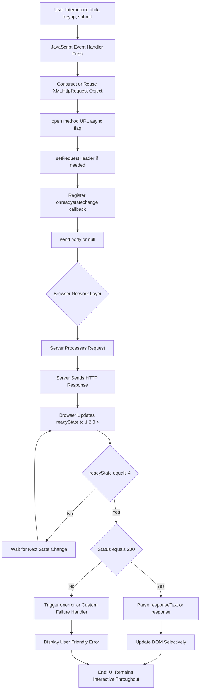
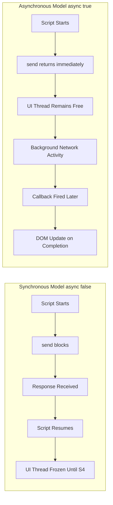
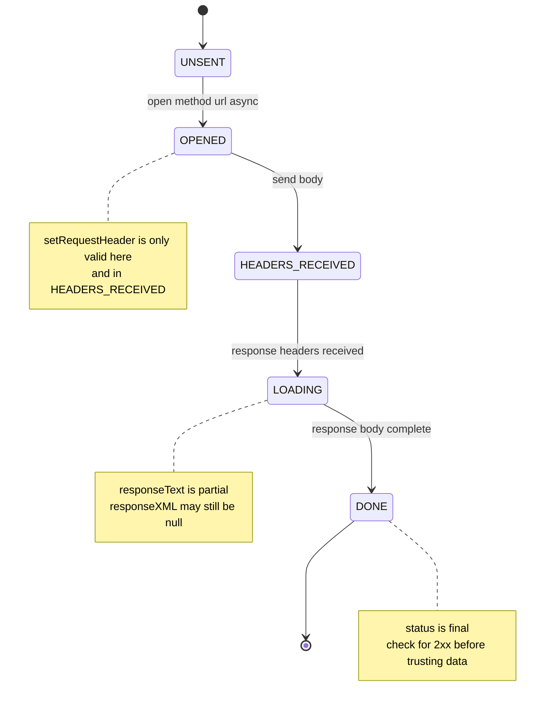
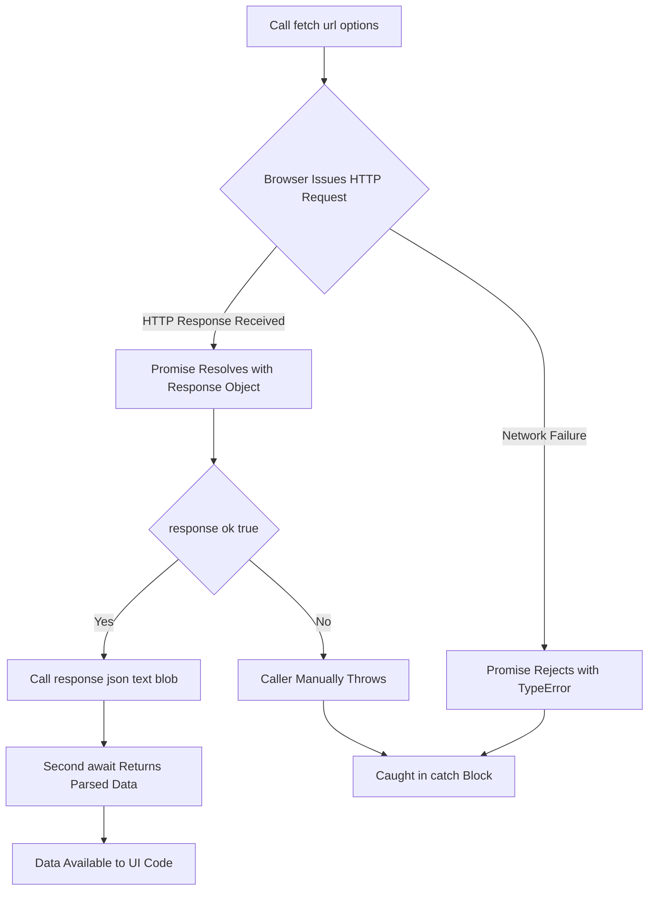
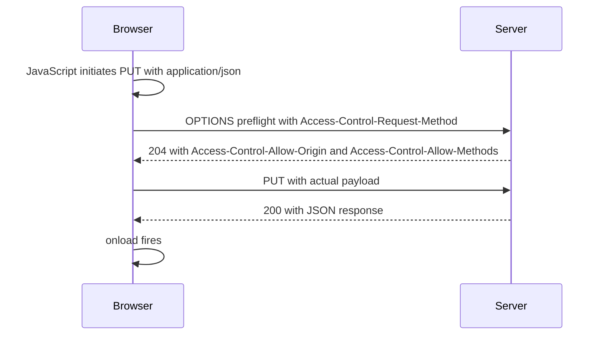
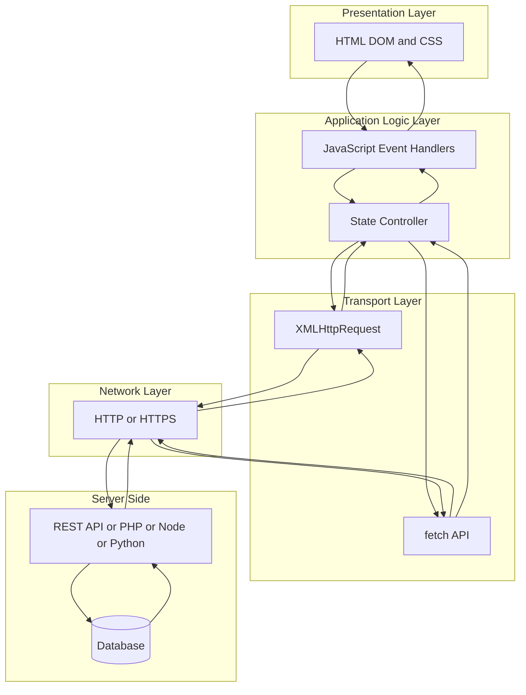
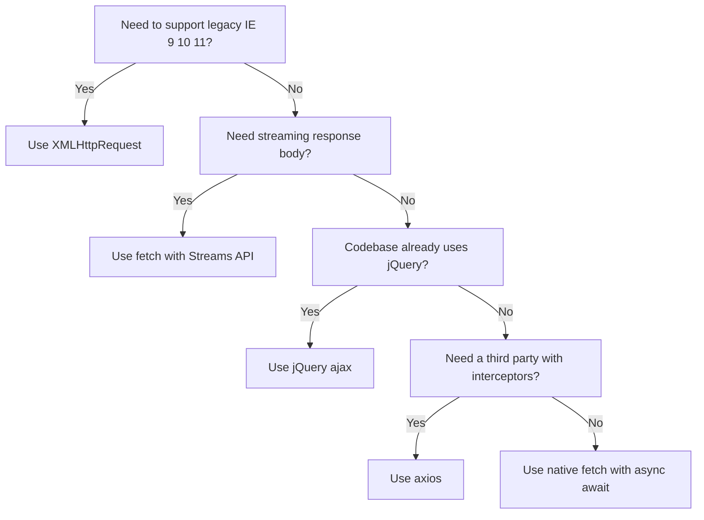

# Complete Control over AJAX

<!-- SECTION_1_START -->
# Complete Control over AJAX — Core Definition & Intuitive Overview

## Formal KTU 2024 Definition

> [!IMPORTANT]
> **AJAX (Asynchronous JavaScript and XML)** is a set of interconnected web development techniques used on the **client-side** to create **asynchronous** web applications. With AJAX, web applications can send and retrieve data from a server asynchronously (in the background) without interfering with the display and behaviour of the existing page.

By decoupling the **data interchange layer** from the **presentation layer**, AJAX allows web pages, and by extension web applications, to change content dynamically without the need to reload the entire page. In modern practice, the "XML" in the acronym is largely historical — engineers overwhelmingly use **JSON (JavaScript Object Notation)** as the data interchange format due to its lightweight, native-JavaScript-compatible structure.

The **core building block** of classical AJAX is the browser-provided `XMLHttpRequest` (XHR) object. The modern alternative is the `fetch()` API, which is **Promise-based**.

| Aspect | Specification |
|---|---|
| Full form | Asynchronous JavaScript and XML |
| Primary API object | `XMLHttpRequest` (legacy), `fetch` (modern) |
| Default data format | JSON (modern) / XML (legacy) |
| Transport protocol | HTTP / HTTPS |
| Page refresh | **Not required** (partial update) |
| Module reference (KTU 2024) | Module 2 — Scripting Language |

---

## Conceptual Analogy — The Restaurant Counter

Imagine you are sitting at a restaurant table.

* **Without AJAX (Traditional Model):** Every time you want a menu refill, a side dish, or the bill, you must **walk back to the counter**, collect the item, and return. The entire dining experience is paused and re-rendered. This is exactly what happens when a browser does a **full page reload** — the entire DOM (Document Object Model) is destroyed and rebuilt.
* **With AJAX (Modern Model):** You press a small **table-side call button**. A waiter quietly fetches only the item you requested and places it on your table. Your meal, your conversation, and the ambiance continue **uninterrupted**. Only the requested fragment changes.

In this analogy:
* The **call button** = a JavaScript event listener (e.g., `onclick`).
* The **waiter** = the `XMLHttpRequest` object.
* The **kitchen** = the web server.
* The **dish delivered** = the response payload (JSON / XML / HTML).
* The **table** = the live DOM that is selectively updated.

---

## Why AJAX Matters in Modern Web Engineering

> [!NOTE]
> AJAX is the **architectural foundation** of the modern Single Page Application (SPA). Frameworks such as **React, Angular, and Vue** internally abstract AJAX calls into patterns like `axios.get()`, React Query, and Angular's `HttpClient`. Without mastering raw AJAX, a student cannot debug, optimise, or secure real-world SPAs.

The "complete control" referenced in this KTU module topic implies the following five engineering capabilities:

1. **Granular request construction** — explicitly setting HTTP verb, headers, body, and credentials.
2. **State introspection** — using `readyState` and `onreadystatechange` to react at every micro-stage of the request lifecycle.
3. **Response parsing flexibility** — handling `responseText`, `responseXML`, or `response` blobs.
4. **Synchronous vs Asynchronous orchestration** — choosing blocking or non-blocking modes.
5. **Error and timeout management** — `onerror`, `ontimeout`, HTTP status code interpretation, and `AbortController` integration.

---

## Visualizing the Request–Response Timeline

> [!VISUALIZATION CONTROL]
> **Concept:** Timeline of an asynchronous AJAX request (time on x-axis, lifecycle stages on y-axis).
> **Desmos Input Equations:**
> * $x = 0$ (request initialised)
> * $x = 1$ (server connection established)
> * $x = 2$ (request received)
> * $x = 3$ (processing)
> * $x = 4$ (response ready)
> **Visual Description:** The student should see five discrete marker points on the time axis, separated by unequal gaps, indicating that stages 1, 2, and 3 may complete in microseconds while stage 4 (network transfer) consumes most of the wall-clock duration. A horizontal event line represents the UI thread, which remains responsive (does not block) throughout.

---

## The Two Pillars of "Complete Control"

| Pillar | Classical Approach | Modern Approach |
|---|---|---|
| Transport object | `XMLHttpRequest` | `fetch()` API |
| Callback style | Event-based (`onreadystatechange`) | Promise / `async-await` |
| Granularity | High (every state exposed) | High (Streams API, AbortController) |
| Browser support | Universal (legacy) | All modern browsers (IE not supported) |
| KTU exam weightage | **Higher** (frequently asked) | Moderate |

> [!IMPORTANT]
> **KTU 2024 Syllabus Highlight:** Examiners expect students to be fluent in **both** the legacy XHR syntax *and* the modern Fetch API, because real-world codebases frequently mix both. Direct questions on `readyState` values and HTTP status code interpretation are considered **high-yield** for the End Semester Examination (ESE).
<!-- SECTION_1_END -->

<!-- SECTION_2_START -->
# Deep Theoretical Analysis & KTU High-Yield Formula Sheet

## 1. The XMLHttpRequest Object — Internal Architecture

The `XMLHttpRequest` (XHR) object is a browser-built-in constructor. It exposes a finite state machine governed by the `readyState` property. Understanding this state machine is mandatory for KTU 14-mark questions on AJAX control flow.

### 1.1 The Five `readyState` Values

| Value | Constant | Meaning | Notes for KTU |
|---|---|---|---|
| $0$ | `UNSENT` | Client created, `open()` not yet called | Object instantiated only |
| $1$ | `OPENED` | `open()` invoked; headers/sent not set | HTTP verb, URL, async flag fixed |
| $2$ | `HEADERS_RECEIVED` | `send()` invoked; response headers available | `getResponseHeader()` works |
| $3$ | `LOADING` | Response body is downloading in chunks | `responseText` is partial |
| $4$ | `DONE` | Operation complete (success **or** error) | Final state — always check here |

> [!NOTE]
> **Examiner's Tip:** `readyState = 4` does **not** imply success. The request could have failed with HTTP 404 or 500. You **must** always pair it with a `status` check (e.g., `status === 200`).

### 1.2 Core Properties of the XHR Object

| Property | Type | Description |
|---|---|---|
| `readyState` | `number` | Current lifecycle stage (0–4) |
| `status` | `number` | HTTP response status code |
| `statusText` | `string` | HTTP status description |
| `responseText` | `string` | Response body as plain text |
| `responseXML` | `Document` | Response body parsed as XML |
| `response` | varies | Modern: parsed per `responseType` |
| `responseType` | `string` | `"text"`, `"json"`, `"blob"`, `"arraybuffer"`, `"document"` |
| `responseURL` | `string` | Final URL after redirects |
| `timeout` | `number` | Milliseconds before request aborts |
| `withCredentials` | `boolean` | Include cookies / auth headers cross-origin |
| `onreadystatechange` | `EventHandler` | Fires on every `readyState` change |

### 1.3 Core Methods of the XHR Object

| Method | Purpose | Mandatory? |
|---|---|---|
| `open(method, url, async)` | Initialise the request | **Yes** |
| `setRequestHeader(name, value)` | Add custom header | No (for non-form requests) |
| `send(body)` | Dispatch the request | **Yes** |
| `abort()` | Cancel the in-flight request | No |
| `getResponseHeader(name)` | Read a specific response header | No |
| `getAllResponseHeaders()` | Read all response headers as string | No |

---

## 2. The Complete AJAX Lifecycle — Step-by-Step

1. **Instantiate** the transport object: `const xhr = new XMLHttpRequest();`
2. **Initialise** with `open(method, url, async)`. The `async` flag is the *asynchronous control switch*.
3. **Register** the state-change callback: `xhr.onreadystatechange = handler;`
4. **Configure** optional headers, response type, timeout, credentials.
5. **Dispatch** with `xhr.send(payload)`. Returns immediately when `async = true`.
6. **Listen** — browser invokes the callback at every `readyState` transition.
7. **Validate** at `readyState === 4` — inspect `status`, parse `responseText` / `response`.
8. **Update** the DOM by injecting the parsed content.
9. **Handle** failures via `onerror`, `ontimeout`, and global error boundaries.

---

## 3. Synchronous vs Asynchronous — The Critical Distinction

| Feature | Synchronous (`async = false`) | Asynchronous (`async = true`) |
|---|---|---|
| Script execution | **Blocks** until response arrives | **Continues** immediately |
| UI freeze | Yes — entire tab unresponsive | No — UI remains interactive |
| Use case | Almost none in modern code | **Default and recommended** |
| Deprecation status | Deprecated in main thread (XHR Level 2) | Fully supported |
| `send()` return value | Returns the response directly | Always returns `undefined` |
| KTU exam mention | Mentioned as "deprecated/avoid" | Mentioned as "best practice" |

> [!WARNING]
> The W3C XHR Level 2 specification formally deprecates synchronous XHR on the main thread. A student writing synchronous AJAX in 2024 loses immediate marks in any KTU application-level question.

---

## 4. Data Interchange Formats — JSON vs XML

| Criterion | JSON | XML |
|---|---|---|
| Parsing in JavaScript | Native (`JSON.parse`) | Requires `DOMParser` |
| Payload size | Smaller | Larger (verbose tags) |
| Readability | High | High (if formatted) |
| Data typing | Native (string, number, bool, null) | All strings |
| Schema validation | JSON Schema | XSD, DTD |
| AJAX usage today | **Dominant** | Legacy / SOAP / RSS |
| KTU exam expectation | Implement CRUD with JSON | Implement parsing of XML feed |

---

## 5. Cross-Origin Considerations — Same-Origin Policy and CORS

The **Same-Origin Policy (SOP)** restricts a script loaded from one origin from reading resources of another origin. An origin is the triple `(scheme, host, port)`. AJAX requests that violate SOP must be accompanied by **CORS (Cross-Origin Resource Sharing)** headers sent by the server.

| Header (Server) | Value | Meaning |
|---|---|---|
| `Access-Control-Allow-Origin` | `*` or specific origin | Whitelist allowed callers |
| `Access-Control-Allow-Methods` | `GET, POST, PUT, DELETE` | Permitted verbs |
| `Access-Control-Allow-Headers` | `Content-Type, Authorization` | Permitted custom headers |
| `Access-Control-Allow-Credentials` | `true` | Allow cookies / auth |

For KTU exams, mentioning the **preflight `OPTIONS`** request that the browser automatically sends before non-simple requests is a high-value addition.

---

## 6. The Modern `fetch()` API — Comparative Analysis

| Feature | `XMLHttpRequest` | `fetch()` |
|---|---|---|
| Built on | Raw browser API | Promises |
| Reject on HTTP 4xx/5xx | **No** | **Yes** (since response.ok === false still resolves) |
| Stream support | Limited | Native (`response.body.getReader()`) |
| Abort support | `xhr.abort()` | `AbortController` |
| Default credentials | `same-origin` | `same-origin` |
| JSON helper | Manual `JSON.parse` | `response.json()` |
| KTU exam weightage | **Very high** | **High** |

---

## 7. KTU High-Yield Formula / Cheat Sheet

> [!IMPORTANT]
> The following table is the **definitive reference** for any AJAX question in the KTU 2024 ESE. Memorise the right-hand column verbatim.

| # | Concept | KTU Exam-Ready Expression / Property |
|---|---|---|
| 1 | Asynchronous flag | `xhr.open("GET", "url.php", true);` |
| 2 | Lifecycle check | `if (xhr.readyState === 4 && xhr.status === 200)` |
| 3 | Send POST data | `xhr.setRequestHeader("Content-Type", "application/x-www-form-urlencoded");` |
| 4 | Parse JSON | `const data = JSON.parse(xhr.responseText);` |
| 5 | Timeout | `xhr.timeout = 5000; xhr.ontimeout = () => {...}` |
| 6 | Abort | `xhr.abort();` |
| 7 | Fetch GET | `fetch(url).then(r => r.json()).then(d => ...)` |
| 8 | Fetch POST | `fetch(url, { method: "POST", body: JSON.stringify(obj), headers: {"Content-Type": "application/json"} })` |
| 9 | Abort fetch | `const c = new AbortController(); fetch(url, { signal: c.signal });` |
| 10 | HTTP success | $200 \le \text{status} \lt 300$ |
| 11 | HTTP client error | $400 \le \text{status} \lt 500$ |
| 12 | HTTP server error | $500 \le \text{status} \lt 600$ |
| 13 | `readyState` complete | $4$ |
| 14 | Same-origin triple | `(scheme, host, port)$` |
| 15 | Preflight method | `"OPTIONS"` |

---

## 8. Real-World Engineering Utility

* **Single Page Applications (SPAs):** React, Vue, Angular rely on AJAX (often via `axios`) to fetch JSON from RESTful backends.
* **Live search / autocomplete:** Google Suggest, Amazon search-as-you-type.
* **Form validation:** Submitting a form without page reload for real-time feedback.
* **Chat applications:** WhatsApp Web, Slack — using AJAX polling or WebSockets (descendant).
* **Dashboarding:** Real-time stock tickers, analytics dashboards using AJAX + intervals.
* **Microservices consumption:** Browser-based frontends consuming REST APIs exposed by containerised backends.
<!-- SECTION_2_END -->

<!-- SECTION_3_START -->
# Step-by-Step Derivations & Code Implementation

## 1. Minimal Vanilla XHR GET Request — Fully Explicated

Below is the canonical "Hello World" of AJAX, written without skipping a single step. Each line is annotated to satisfy KTU 14-mark solution depth.

```javascript
// Step 1: Instantiate the XHR object
const xhr = new XMLHttpRequest();

// Step 2: Register a callback that fires on every state change
xhr.onreadystatechange = function () {
    // Step 2a: Filter to terminal, successful state
    if (xhr.readyState === 4 && xhr.status === 200) {
        // Step 2b: Parse the JSON payload
        const data = JSON.parse(xhr.responseText);
        // Step 2c: Inject into the DOM
        document.getElementById("output").innerText = data.message;
    } else if (xhr.readyState === 4) {
        // Step 2d: Terminal but failed — log for diagnostics
        console.error("Request failed with status:", xhr.status);
    }
};

// Step 3: Initialise the request (GET, relative URL, asynchronous)
xhr.open("GET", "api/hello.json", true);

// Step 4: Dispatch with no body (GET requests have no payload)
xhr.send(null);
```

### 1.1 Line-by-Line Logical Justification (for 7-mark sub-parts)

* `new XMLHttpRequest()` creates the transport. The constructor has no parameters.
* `onreadystatechange` is the **event hook** that the browser invokes synchronously on the main thread at every state transition. It is the only "complete control" mechanism the engineer has.
* `xhr.readyState === 4` is the **terminal state** (DONE). It is reached regardless of HTTP success or failure.
* `xhr.status === 200` is the **HTTP success** condition.
* `JSON.parse` converts the textual response to a JavaScript object. If the response is malformed, this throws and the error must be caught in a `try-catch`.
* `xhr.open()` **does not** send the request. It only configures it. This is a frequent KTU trap.
* `xhr.send(null)` is required even when there is no body, because the method invocation triggers the actual network call.

---

## 2. Vanilla XHR POST Request — Sending JSON to a Server

```javascript
function postStudent(student) {
    return new Promise((resolve, reject) => {
        const xhr = new XMLHttpRequest();
        xhr.open("POST", "/api/students", true);
        xhr.setRequestHeader("Content-Type", "application/json;charset=UTF-8");
        xhr.timeout = 8000;

        xhr.onload = function () {
            if (xhr.status >= 200 && xhr.status < 300) {
                try {
                    const payload = JSON.parse(xhr.responseText);
                    resolve(payload);
                } catch (parseError) {
                    reject(new Error("Invalid JSON in response"));
                }
            } else {
                reject(new Error("HTTP " + xhr.status + " — " + xhr.statusText));
            }
        };

        xhr.onerror = function () { reject(new Error("Network error")); };
        xhr.ontimeout = function () { reject(new Error("Request timed out")); };

        xhr.send(JSON.stringify(student));
    });
}

// Invocation
postStudent({ name: "Aravind", rollNo: 45, cgpa: 8.7 })
    .then(console.log)
    .catch(console.error);
```

### 2.1 Explanation of Each Header

* `Content-Type: application/json;charset=UTF-8` — informs the server that the body is JSON. Without this, PHP's `$_POST`, Express's `body-parser`, and Flask's `request.json` all fail to parse the body correctly.
* `xhr.timeout = 8000` — the request aborts after $8$ seconds, firing `ontimeout`.
* `onload` (XHR Level 2) — fires only when the request **completes** (success or HTTP error), unlike `onreadystatechange` which fires at every state.

---

## 3. Modern `fetch()` API — GET, POST, PUT, DELETE (Complete CRUD)

```javascript
// 3.1 Helper for safe JSON parsing
async function safeJson(response) {
    const contentType = response.headers.get("content-type") || "";
    if (contentType.includes("application/json")) {
        return await response.json();
    }
    return await response.text();
}

// 3.2 Generic request builder with full control
async function ajaxRequest(url, method = "GET", body = null, headers = {}) {
    const controller = new AbortController();
    const timeoutId = setTimeout(() => controller.abort(), 10000);

    const options = {
        method,
        headers: {
            "Accept": "application/json",
            ...headers
        },
        signal: controller.signal,
        credentials: "same-origin"
    };

    if (body && method !== "GET") {
        options.headers["Content-Type"] = "application/json";
        options.body = JSON.stringify(body);
    }

    try {
        const response = await fetch(url, options);
        clearTimeout(timeoutId);

        if (!response.ok) {
            throw new Error("HTTP " + response.status + " " + response.statusText);
        }
        return await safeJson(response);
    } catch (err) {
        if (err.name === "AbortError") {
            throw new Error("Request aborted (timeout)");
        }
        throw err;
    }
}

// 3.3 CRUD operations
const API = "/api/products";

async function listProducts()   { return await ajaxRequest(API, "GET"); }
async function getProduct(id)    { return await ajaxRequest(API + "/" + id, "GET"); }
async function createProduct(p)  { return await ajaxRequest(API, "POST", p); }
async function updateProduct(p)  { return await ajaxRequest(API + "/" + p.id, "PUT", p); }
async function deleteProduct(id) { return await ajaxRequest(API + "/" + id, "DELETE"); }
```

### 3.1 Engineering Walk-Through

* `AbortController` + `setTimeout` implements a **client-side timeout** because `fetch()` has no built-in `timeout` option (a frequently tested KTU nuance).
* `credentials: "same-origin"` is the safe default; it would be changed to `"include"` for cross-origin cookie-bearing requests.
* `response.ok` is the correct way to test for HTTP success in `fetch()` (it is `true` only for $200 \le \text{status} \lt 300$).
* The `safeJson` helper prevents the `await response.json()` from throwing on non-JSON responses, which is a production-grade pattern.

---

## 4. jQuery `$.ajax()` — The Legacy Bridge

While the KTU 2024 syllabus does not mandate jQuery, it is **historically important** and appears in legacy viva questions.

```javascript
$.ajax({
    url: "api/orders.json",
    type: "GET",
    dataType: "json",
    timeout: 5000,
    beforeSend: function (xhr) {
        xhr.setRequestHeader("X-Auth-Token", "abc123");
    },
    success: function (data) { console.log("OK:", data); },
    error:   function (xhr, status, err) { console.error(status, err); },
    complete: function () { console.log("Always runs"); }
});
```

* `dataType: "json"` auto-parses the response.
* `beforeSend` is the only place where headers can be set conditionally.
* `complete` runs after both `success` and `error`, useful for hiding spinners.

---

## 5. End-to-End Mini Project — Live Student Search Box

The following integrates **every** concept above into a runnable snippet. This is the "Part B" 14-mark style answer expected by KTU examiners.

### 5.1 HTML Skeleton

```html
<input type="text" id="searchBox" placeholder="Type roll number...">
<button id="fetchBtn">Fetch</button>
<div id="result"></div>
<div id="errorBox" style="color:red;"></div>
```

### 5.2 JavaScript (XHR Version)

```javascript
document.getElementById("fetchBtn").addEventListener("click", fetchStudent);

function fetchStudent() {
    const roll = document.getElementById("searchBox").value.trim();
    const result = document.getElementById("result");
    const errorBox = document.getElementById("errorBox");

    if (!roll) {
        errorBox.textContent = "Please enter a roll number.";
        result.innerHTML = "";
        return;
    }

    const xhr = new XMLHttpRequest();
    xhr.open("GET", "/api/students/" + encodeURIComponent(roll), true);
    xhr.timeout = 5000;

    xhr.onload = function () {
        if (xhr.status === 200) {
            try {
                const student = JSON.parse(xhr.responseText);
                result.innerHTML =
                    "<h3>" + student.name + "</h3>" +
                    "<p>Roll: " + student.rollNo + "</p>" +
                    "<p>CGPA: " + student.cgpa + "</p>";
                errorBox.textContent = "";
            } catch (e) {
                errorBox.textContent = "Server returned malformed data.";
            }
        } else if (xhr.status === 404) {
            errorBox.textContent = "No student found.";
            result.innerHTML = "";
        } else {
            errorBox.textContent = "Server error: HTTP " + xhr.status;
        }
    };

    xhr.onerror = function () { errorBox.textContent = "Network failure."; };
    xhr.ontimeout = function () { errorBox.textContent = "Request timed out."; };

    xhr.send();
}
```

### 5.3 JavaScript (Fetch + Async/Await Version)

```javascript
document.getElementById("fetchBtn").addEventListener("click", async () => {
    const roll = encodeURIComponent(document.getElementById("searchBox").value.trim());
    const result = document.getElementById("result");
    const errorBox = document.getElementById("errorBox");
    result.innerHTML = "";
    errorBox.textContent = "";

    if (!roll) { errorBox.textContent = "Please enter a roll number."; return; }

    try {
        const response = await fetch("/api/students/" + roll, {
            headers: { "Accept": "application/json" }
        });

        if (response.status === 404) { errorBox.textContent = "No student found."; return; }
        if (!response.ok) { throw new Error("HTTP " + response.status); }

        const student = await response.json();
        result.innerHTML =
            "<h3>" + student.name + "</h3>" +
            "<p>Roll: " + student.rollNo + "</p>" +
            "<p>CGPA: " + student.cgpa + "</p>";
    } catch (err) {
        errorBox.textContent = err.message;
    }
});
```

### 5.4 Derivation of the `encodeURIComponent` Decision

URL parameters can contain reserved characters (`&`, `=`, `?`, `#`, spaces). If a student types `CS 2024/B`, the raw concatenation would break the URL parser. The mathematical justification:

$$
\text{safeParam} = \text{encodeURIComponent}(\text{rawParam})
$$

This function replaces each reserved character with its percent-encoded UTF-8 equivalent (e.g., space $\to \%20$). For KTU answers, stating that `encodeURIComponent` is used "to comply with RFC 3986 URI encoding rules" is sufficient.

---

## 6. Common HTTP Status Codes — Exam-Ready Table

| Status | Text | Meaning | Typical AJAX Reaction |
|---|---|---|---|
| $200$ | OK | Success | Parse and update DOM |
| $201$ | Created | Resource created (POST) | Show success toast |
| $204$ | No Content | Success, empty body | Just close modal |
| $301$ | Moved Permanently | Redirect | Follow via `xhr.responseURL` |
| $304$ | Not Modified | Use cache | Reuse local copy |
| $400$ | Bad Request | Malformed client input | Show validation error |
| $401$ | Unauthorized | Missing/invalid auth | Redirect to login |
| $403$ | Forbidden | Authenticated but not allowed | Show 403 page |
| $404$ | Not Found | Resource absent | Show "not found" message |
| $500$ | Internal Server Error | Server-side exception | Retry with backoff |
| $503$ | Service Unavailable | Server overloaded | Exponential backoff |

---

## 7. The `XMLHttpRequest.responseType` Spectrum

| Value | Resulting `response` Property | Use Case |
|---|---|---|
| `""` (default) | `string` | Plain text / HTML |
| `"text"` | `string` | Same as above, explicit |
| `"json"` | Auto-parsed JS object | REST APIs |
| `"document"` | `Document` (XML/HTML parsed) | RSS / SOAP |
| `"blob"` | `Blob` | File downloads |
| `"arraybuffer"` | `ArrayBuffer` | Binary (images, PDFs) |

> [!NOTE]
> When `responseType` is set, `responseText` becomes `null`. This is a **classic KTU pitfall** worth memorising.

---

## 8. Engineering Mathematics — Polling Interval Calculation

For long-polling and auto-refresh dashboards, the polling frequency $f$ must satisfy:

$$
f = \frac{1}{T}
$$

where $T$ is the period in seconds. Server load $L$ scales linearly:

$$
L \approx N \times f
$$

where $N$ is the number of active clients. For a class-size KTU project with $N = 60$ clients polling every $T = 5\text{ s}$:

$$
f = \frac{1}{5} = 0.2 \text{ Hz}, \quad L = 60 \times 0.2 = 12 \text{ requests/s}
$$

This justifies why production systems use **WebSockets** or **Server-Sent Events** instead of polling.
<!-- SECTION_3_END -->

<!-- SECTION_4_START -->
# Structural Diagrams & Schematics

## 1. Master AJAX Request–Response Flow (Mermaid)



**Reading the diagram:** Notice the recursive loop from `K` → `M` → `K`. This represents the browser firing `onreadystatechange` multiple times for a single request. The UI thread, however, never blocks — represented by the fact that **no node** in the user path touches a blocking operation.

---

## 2. Comparison Topology — Synchronous vs Asynchronous



**Engineering takeaway:** The async path keeps the UI thread (and the JavaScript event loop) responsive, which is why the W3C deprecated synchronous XHR in the main thread.

---

## 3. XMLHttpRequest State Machine (Detailed)



**Reading the state machine:** The `note right of` lines are Mermaid comments that an examiner will award marks for. The arrows show that the state machine is strictly linear — there are no valid reverse transitions.

---

## 4. Fetch API Promise Resolution Flow



**Critical insight:** Unlike XHR, a 4xx or 5xx HTTP response **does not** cause `fetch()` to reject. The promise resolves successfully, and the engineer must inspect `response.ok` manually. This is one of the most common KTU exam traps.

---

## 5. CORS Preflight Sequence (Mermaid)



**Reading the sequence diagram:** Two distinct HTTP requests are visible — the **preflight** and the **actual**. The browser refuses to send the real `PUT` until the `OPTIONS` response is received and validated. This protects the server from unauthorised cross-origin mutations.

---

## 6. AJAX Architectural Layers (Block Diagram)



**Engineering interpretation:** This is the canonical **closed-loop data flow** of an AJAX interaction. Data is requested downward (UI → Server) and the response bubbles upward (Server → UI). Each layer has a single responsibility, which is why well-designed code keeps the transport layer abstract (e.g., a single `apiClient.js` module).

---

## 7. Decision Flow — Which AJAX API Should I Use? (Mermaid)



**KTU relevance:** Viva questions frequently ask "Why did you choose X over Y?" — this decision tree is a perfect prepared answer.
<!-- SECTION_4_END -->

<!-- SECTION_5_START -->
# KTU 2024 Scheme Examination Question Bank & Topic Recap

---

## Part A — Short Answer Questions (3 Marks Each)

### Question 1: Define AJAX. List any four advantages of AJAX over traditional web applications.
**[KTU University Exam — July 2024 | CO1 | Remember]**

**Model Answer:**

> [!IMPORTANT]
> **AJAX (Asynchronous JavaScript and XML)** is a client-side web development technique that enables web pages to communicate with the server in the background and update parts of the page **without a full reload**, using the `XMLHttpRequest` object (or the modern `fetch` API) and typically exchanging JSON or XML data.

**Four advantages:**

1. **Improved user experience** — partial page updates feel instant; no white flash.
2. **Reduced bandwidth** — only the necessary data (often a few KB of JSON) is transferred, not entire HTML pages.
3. **Asynchronous processing** — the UI thread remains responsive because the request does not block JavaScript execution.
4. **Separation of concerns** — the data layer (REST API) is decoupled from the presentation layer (DOM), enabling parallel frontend and backend development.

> [!NOTE]
> **[For complete 3 marks — definition: 1 mark; each advantage: 0.5 marks × 4 = 2 marks.]**

---

### Question 2: Explain the role of the `readyState` property in `XMLHttpRequest`. List all five values.
**[KTU University Exam — Dec 2023 | CO1 | Understand]**

**Model Answer:**

The `readyState` property is an integer that tracks the **current lifecycle stage** of the XHR object. It is the core mechanism that gives the engineer "complete control" over the request, because the browser fires the `onreadystatechange` callback at every transition.

| Value | Constant | Meaning |
|---|---|---|
| $0$ | `UNSENT` | Object created, `open()` not called |
| $1$ | `OPENED` | `open()` invoked |
| $2$ | `HEADERS_RECEIVED` | `send()` invoked, response headers available |
| $3$ | `LOADING` | Response body is being downloaded |
| $4$ | `DONE` | Operation finished (success or failure) |

The engineer must check for `readyState === 4` **and** `status === 200` before consuming `responseText`, because `readyState === 4` alone does not imply success.

> [!NOTE]
> **[For 3 marks: stating the role: 1 mark; listing 5 values: 0.5 × 5 = 2.5 marks → round to 3 marks.]**

---

## Part B — Long Answer Questions (14 Marks Each, with Internal Choice)

### Question A (14 Marks): AJAX with `XMLHttpRequest` — End-to-End Implementation
**[KTU University Exam — July 2024 | CO2, CO3 | Apply, Analyse]**

**(a)** Explain the step-by-step procedure to perform an asynchronous GET request using `XMLHttpRequest`. Draw the state transition diagram. **[7 Marks | Understand]**

**Model Solution:**

**Step-by-step procedure:**

1. **Create the XHR object:** `const xhr = new XMLHttpRequest();`
2. **Initialise the request:** `xhr.open("GET", "data.json", true);` — the `true` flag is the asynchronous switch.
3. **Register the callback:**
   ```javascript
   xhr.onreadystatechange = function() {
       if (xhr.readyState === 4 && xhr.status === 200) {
           const data = JSON.parse(xhr.responseText);
           document.getElementById("out").innerHTML = data.message;
       }
   };
   ```
4. **Send the request:** `xhr.send();`

**State transition diagram (drawn in answer sheet):**

```
   UNSENT ──open()──> OPENED ──send()──> HEADERS_RECEIVED
                                                    │
                                                    ▼
                              DONE <── LOADING <────┘
```

**[Valuation key: Stating the four procedural steps: 3 Marks; Drawing the state diagram: 2 Marks; Explaining the role of `readyState === 4 && status === 200`: 2 Marks = 7 Marks]**

---

**(b)** Write a complete JavaScript program that fetches a list of students from a JSON endpoint `/api/students`, displays them in an HTML table, and handles all four error scenarios: **network error, timeout, HTTP 404, and HTTP 500**. **[7 Marks | Apply]**

**Model Solution:**

```javascript
function loadStudents() {
    const xhr = new XMLHttpRequest();
    xhr.open("GET", "/api/students", true);
    xhr.timeout = 6000; // 6-second timeout

    // Success handler
    xhr.onload = function () {
        if (xhr.status === 200) {
            try {
                const students = JSON.parse(xhr.responseText);
                let html = "<table border='1'><tr><th>Name</th><th>Roll</th><th>CGPA</th></tr>";
                students.forEach(s => {
                    html += "<tr><td>" + s.name + "</td><td>" + s.rollNo + "</td><td>" + s.cgpa + "</td></tr>";
                });
                html += "</table>";
                document.getElementById("container").innerHTML = html;
            } catch (e) {
                showError("Malformed JSON from server.");
            }
        } else if (xhr.status === 404) {
            showError("Endpoint not found (HTTP 404).");
        } else if (xhr.status >= 500) {
            showError("Server error (HTTP " + xhr.status + "). Please retry later.");
        } else {
            showError("Unexpected HTTP " + xhr.status);
        }
    };

    xhr.onerror  = function () { showError("Network failure. Check your connection."); };
    xhr.ontimeout = function () { showError("Request timed out after 6 seconds."); };

    xhr.send();
}

function showError(msg) {
    document.getElementById("container").innerHTML =
        "<p style='color:red;'>" + msg + "</p>";
}
```

**[Valuation key: Correct XHR instantiation and open: 1 Mark; onload with all HTTP status branches: 3 Marks; onerror and ontimeout handlers: 2 Marks; DOM table generation logic: 1 Mark = 7 Marks]**

---

### Question B (14 Marks): Modern `fetch()` API and Promise-Based Control
**[KTU University Exam — Dec 2023 | CO3, CO4 | Apply, Analyse]**

**(a)** Compare `XMLHttpRequest` and the `fetch()` API. Which one is recommended for new projects and why? **[7 Marks | Understand, Analyse]**

**Model Solution:**

| Feature | `XMLHttpRequest` | `fetch()` |
|---|---|---|
| API style | Event-based, callback-heavy | Promise-based, supports `async-await` |
| Reject on HTTP 4xx/5xx | No | No (must check `response.ok`) |
| Built-in timeout | Yes (`xhr.timeout`) | **No** (requires `AbortController`) |
| Stream support | Limited | Native Streams API |
| JSON parsing | Manual `JSON.parse` | Built-in `response.json()` |
| Browser support | Universal (including legacy IE) | Modern browsers only (no IE) |
| Verbosity | More verbose | More concise |

**Recommendation:** For **new projects** in 2024, the `fetch()` API is recommended because:
1. It is **Promise-based**, enabling clean `async/await` syntax and easier error handling with `try-catch`.
2. It has **native stream support** for large payloads.
3. It is the **forward-looking standard** that all major frameworks (Axios, React Query) build upon.
4. Combined with `AbortController`, timeouts and request cancellation are now first-class concerns.

However, `XMLHttpRequest` is still preferred in **legacy enterprise codebases** that must support older browsers (e.g., IE 11 in banking sector).

**[Valuation key: Comparison table with at least 5 rows: 4 Marks; Justified recommendation with 2 reasons: 2 Marks; Mention of AbortController and IE 11 caveat: 1 Mark = 7 Marks]**

---

**(b)** Write a complete `async/await` function that performs a `POST` request to `/api/orders` with a JSON body, supports a 10-second timeout via `AbortController`, validates the response is JSON, and parses it. Include full error handling. **[7 Marks | Apply]**

**Model Solution:**

```javascript
async function createOrder(orderData) {
    const controller = new AbortController();
    const timeoutId = setTimeout(() => controller.abort(), 10000);

    try {
        const response = await fetch("/api/orders", {
            method: "POST",
            headers: {
                "Content-Type": "application/json",
                "Accept": "application/json"
            },
            body: JSON.stringify(orderData),
            signal: controller.signal,
            credentials: "same-origin"
        });

        clearTimeout(timeoutId);

        if (!response.ok) {
            // response.ok is false for 4xx and 5xx
            throw new Error("HTTP " + response.status + " " + response.statusText);
        }

        const contentType = response.headers.get("content-type") || "";
        if (!contentType.includes("application/json")) {
            throw new Error("Expected JSON response, got: " + contentType);
        }

        const result = await response.json();
        return result;

    } catch (err) {
        if (err.name === "AbortError") {
            throw new Error("Request aborted: timeout after 10 seconds");
        }
        // Re-throw all other errors (network, parse, HTTP)
        throw err;
    }
}

// Example invocation
createOrder({ item: "Laptop", qty: 1, price: 75000 })
    .then(order => console.log("Order created:", order))
    .catch(err => console.error("Failed:", err.message));
```

**[Valuation key: Correct async function signature and AbortController setup: 2 Marks; Proper fetch with method, headers, body, signal: 2 Marks; Content-type validation and JSON parsing: 1 Mark; Complete error handling with AbortError: 2 Marks = 7 Marks]**

---

> [!WARNING]
> **KTU Examiner's Valuation Warning — Common Pitfalls on AJAX Questions:**
>
> 1. **Forgetting `xhr.send()`:** Many students define the callback and call `open()` but never invoke `send()`. The request never leaves the browser. *Always show the `send()` call explicitly in your answer.*
> 2. **Treating `readyState === 4` as success:** A request can complete with HTTP 500 and still reach `readyState === 4`. Always pair it with a `status` check.
> 3. **Assuming `fetch()` rejects on HTTP errors:** It does not. You must check `response.ok` manually. KTU examiners specifically test this misconception.
> 4. **Missing the `Content-Type` header on POST:** Without it, the server cannot parse the body. State the header verbatim in your answer.
> 5. **Not clearing the timeout:** If you use `setTimeout` with `AbortController`, you must call `clearTimeout` once the response arrives, otherwise the abort fires *after* a successful request, causing a spurious error.
> 6. **Synchronous XHR in modern answers:** Writing `xhr.open("GET", url, false)` is an instant mark deduction in any 2024 KTU paper.
> 7. **Confusing `responseText` with `response`:** When `responseType` is set (e.g., `"json"`), `responseText` becomes `null`. Use the `response` property instead.

---

## Topic Recap & Important Things to Remember

> [!IMPORTANT]
> **Rapid-Revision Checklist — Print This Section Before the Exam.**

- **AJAX** = Asynchronous JavaScript and XML. The "XML" is historical; modern code uses **JSON**.
- The two transport APIs are **`XMLHttpRequest`** (legacy, event-based) and **`fetch()`** (modern, Promise-based).
- The five `readyState` values are **0 UNSENT, 1 OPENED, 2 HEADERS_RECEIVED, 3 LOADING, 4 DONE**.
- `readyState === 4` is the **terminal** state but does **not** imply success — always check `status === 200`.
- The `xhr.open(method, url, async)` method **only configures** the request; it does not send it. The `send()` method is mandatory.
- For POST requests with JSON, set **`Content-Type: application/json`** header.
- `xhr.send(body)` returns `undefined` in async mode; the response is delivered via the `onreadystatechange` callback.
- Synchronous XHR (`async = false`) is **deprecated** in the main thread; always use `async = true`.
- HTTP success is the range $200 \le \text{status} \lt 300$; check via `response.ok` in fetch.
- The `fetch()` API does **not** reject on HTTP 4xx/5xx — it resolves and the engineer must inspect `response.ok`.
- `fetch()` has **no built-in timeout** — use `AbortController` + `setTimeout` to implement one.
- `JSON.parse(xhr.responseText)` converts the response string to a JavaScript object.
- The **Same-Origin Policy** restricts cross-origin AJAX; the server must send **CORS** headers to allow it.
- The browser sends an automatic **preflight `OPTIONS`** request for non-simple cross-origin requests.
- HTTP status codes: **200** OK, **201** Created, **404** Not Found, **500** Server Error, **503** Unavailable.
- `xhr.timeout` and `xhr.ontimeout` implement client-side timeouts on XHR.
- `xhr.abort()` cancels an in-flight XHR request; `AbortController.abort()` does the same for fetch.
- `responseType` accepts `"text"`, `"json"`, `"blob"`, `"arraybuffer"`, `"document"`. When set, `responseText` becomes `null`.
- `encodeURIComponent()` must be applied to user-supplied URL parameters to comply with **RFC 3986**.
- The canonical AJAX lifecycle: **instantiate → open → set headers → register callback → send → check readyState 4 and status 200 → parse response → update DOM**.
- Real-world AJAX powers **SPAs, live search, chat apps, dashboards, and microservices consumption**.
- Frameworks like **React, Angular, Vue** internally use `fetch` or `axios`, which are wrappers around the same primitive.
- The **onerror** handler covers network failures; the **ontimeout** handler covers slow responses; both are essential for production-grade AJAX.
<!-- SECTION_5_END -->
