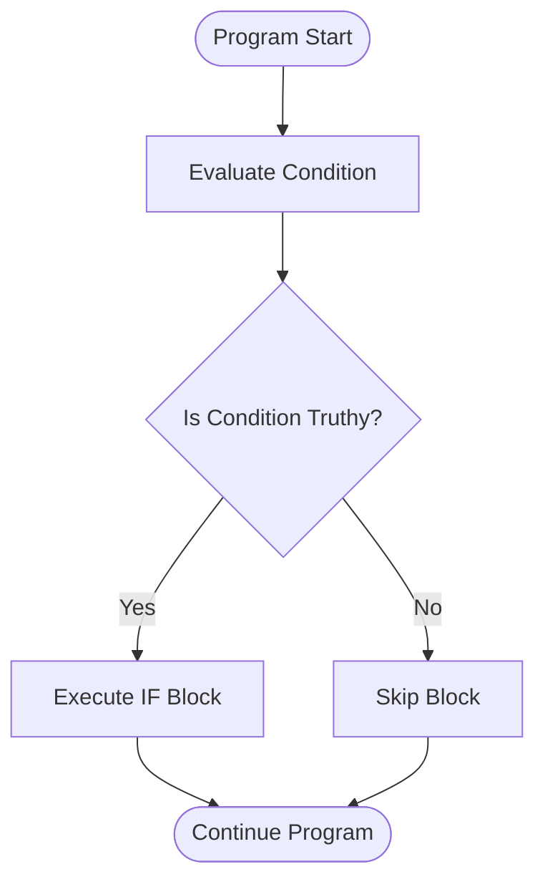
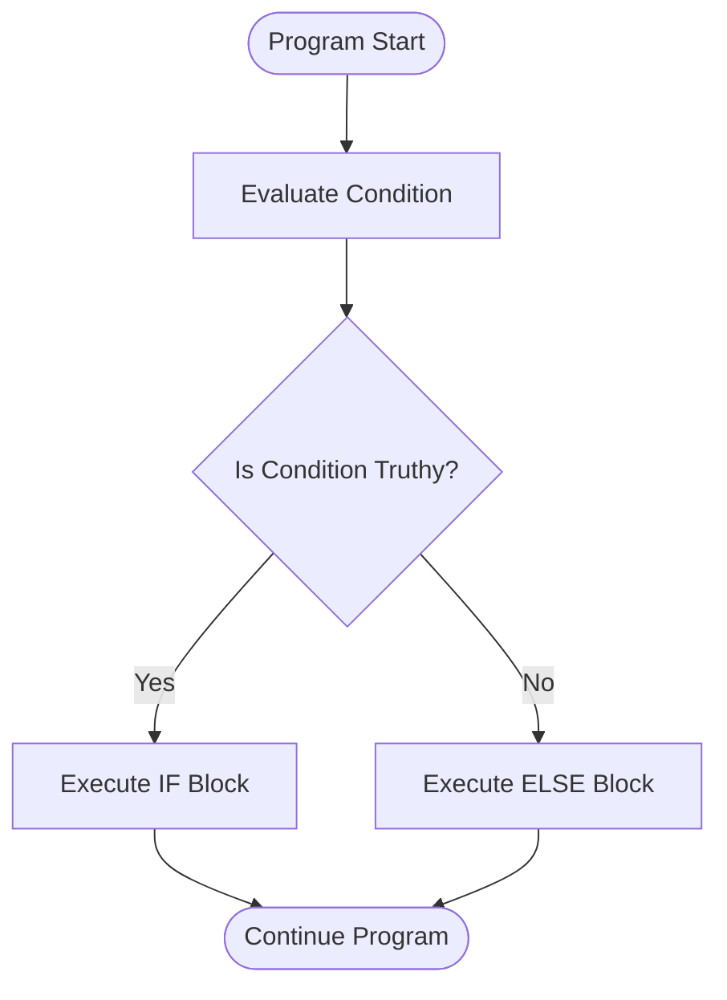
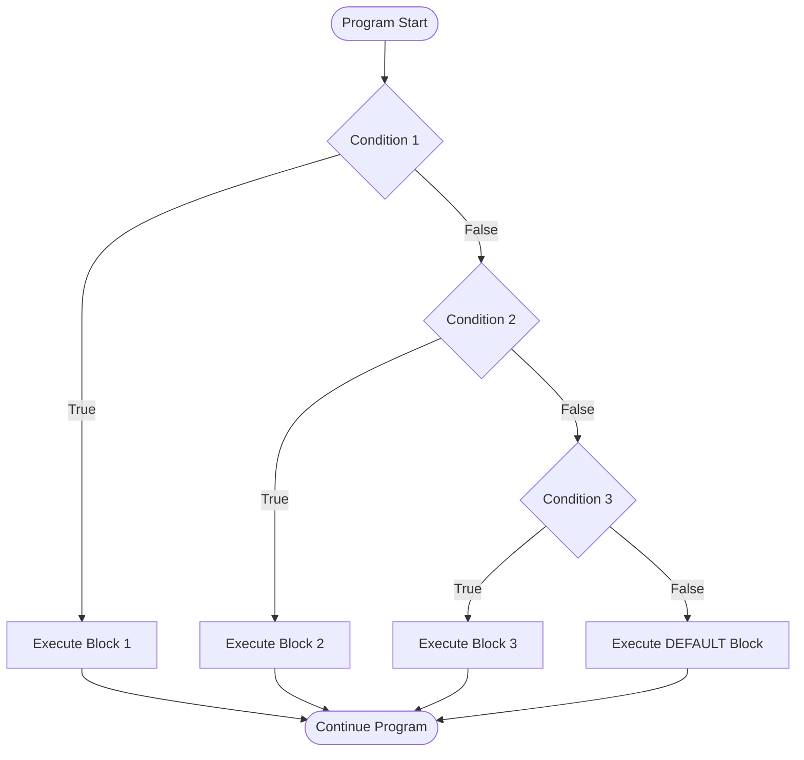
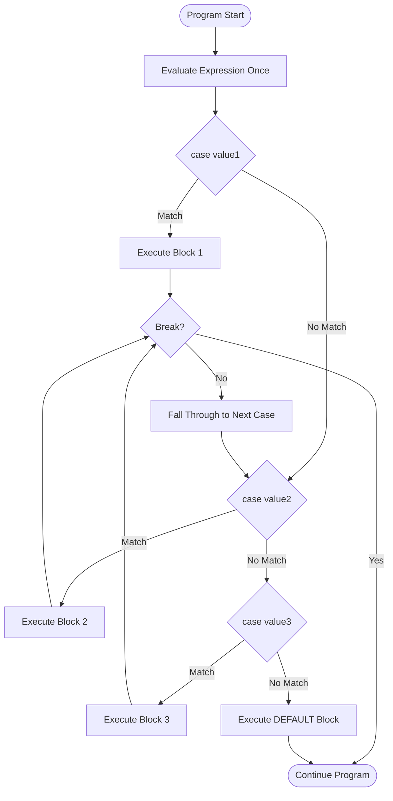
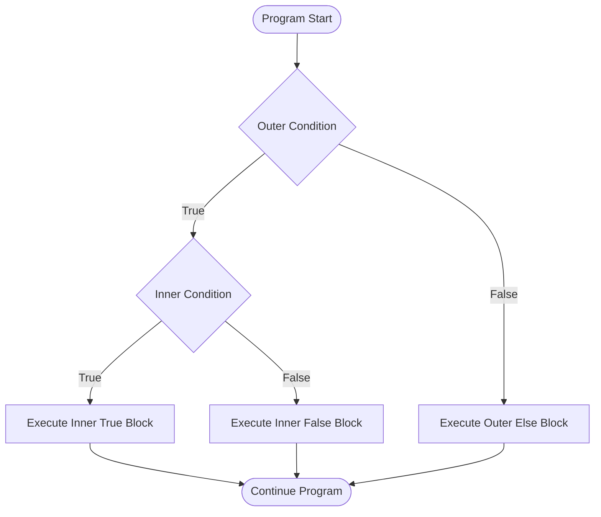
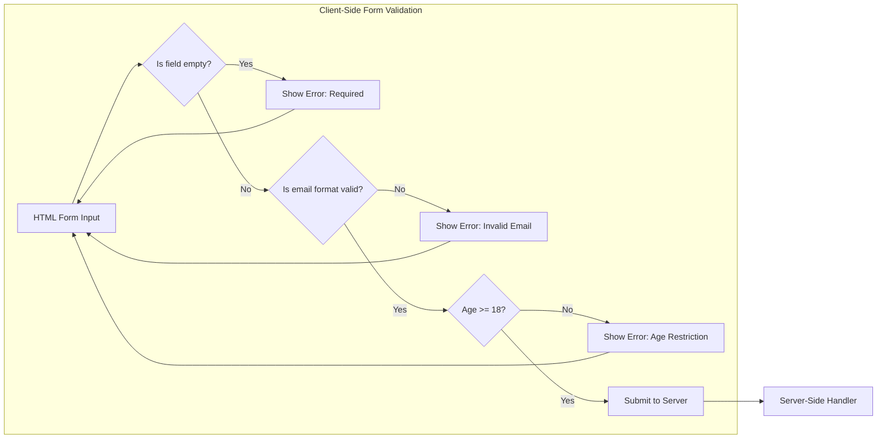

# Conditionals

<!-- SECTION_1_START -->
# Conditionals in JavaScript — Core Technical Definition & Intuitive Overview

## 1. Formal Academic Definition (KTU 2024 Syllabus Terminology)

> [!IMPORTANT]
> **Conditional Statements (Selection Constructs)** are the **decision-making control structures** of a scripting language that allow the program to evaluate one or more Boolean expressions and execute a specific block of code based on whether the expression evaluates to `true` or `false`. In JavaScript, conditionals form a critical pillar of **procedural control flow**, enabling the implementation of branching logic in client-side web applications.

In the KTU 2024 Scheme Web Programming syllabus (Module 2 — Scripting Language), conditionals are formally classified under **Selection Statements**, and they include:

1. The `if` statement
2. The `if...else` statement
3. The `else if` ladder
4. The **nested `if`** construct
5. The `switch...case` statement
6. The **ternary (conditional) operator** `?:`
7. The **short-circuit logical operators** `&&` and `||` (used as conditional expressions)

> [!NOTE]
> **Course Outcome Mapping (KTU 2024 Scheme):** This topic directly maps to **CO2** — *“Develop dynamic web pages using client-side scripting languages”* — at the **Apply** and **Analyze** cognitive levels of Revised Bloom’s Taxonomy.

---

## 2. Conceptual Analogy / Real-World Intuition

Imagine a **railway signal system** at a railway crossing. The signal pole has sensors that detect:

- **Is a train approaching?** → If **YES**, the gates **lower (red light ON)**.
- **Is the track clear?** → If **YES**, the gates **rise (green light ON)**.
- **Is it a foggy day AND the train is far?** → If both are true, sound a **slower alarm**.

This is exactly how JavaScript conditionals work:

| Railway Signal Concept | JavaScript Equivalent |
|---|---|
| Sensor reading | Boolean expression (e.g., `trainApproaching === true`) |
| Action of lowering gate | Code block executed when condition is `true` |
| Alternative action | Code block executed when condition is `false` (`else`) |
| Multiple sensors (rain + fog) | Logical operators `&&`, `||` |

The signal **does not execute every action unconditionally**; it **evaluates** the conditions first and **branches** the program’s flow accordingly.

---

## 3. Standard JavaScript Type Coercion Constants in Conditionals

> [!IMPORTANT]
> JavaScript uses **type coercion** in conditionals. The following constants are part of the **ECMAScript 2024 (ES14)** specification and are considered the **falsy values** of the language:
> 
> | Falsy Constant | Type | Value |
> |---|---|---|
> | `false` | Boolean | **falsy** |
> | `0` | Number | **falsy** |
> | `-0` | Number | **falsy** |
> | `0n` | BigInt | **falsy** |
> | `""` (empty string) | String | **falsy** |
> | `null` | Null | **falsy** |
> | `undefined` | Undefined | **falsy** |
> | `NaN` | Number | **falsy** |
> 
> **All other values are considered truthy**, including the non-empty string `"false"`, the empty array `[]`, and the empty object `{}`. This is a **very common interview and exam trap**.

---

## 4. Visualization Control Block (Truthy/Falsy Decision Tree)

> [!VISUALIZATION CONTROL]
> **Concept:** Truthy/Falsy value evaluation funnel in JavaScript conditionals.
> **GeoGebra / Desmos Input Equations (Logical Tree Mapping):**
> 
> * `value = x` (where x is a sample JavaScript value)
> * `f(x) = 1 if isTruthy(x) else 0`
> * `g(x) = x` (Step-down truthy check)
> 
> **Visual Description:** Plot a step function where the **y-axis** represents the **branch outcome (1 = execute branch, 0 = skip branch)** and the **x-axis** represents the **eight falsy values** plus representative truthy values. Students should observe a clean step-down pattern at each falsy value, with the `if` branch being entered for all truthy inputs.

---

## 5. Why Conditionals Matter in Web Programming

- **Form validation** — checking if an email field is empty before submission.
- **Authentication** — verifying if a user is logged in before showing restricted content.
- **Responsive UI** — rendering different layouts for mobile vs. desktop based on `window.innerWidth`.
- **Event-driven logic** — handling different user click events differently.
- **API state checking** — branching based on `fetch()` response status codes (200, 404, 500).

<!-- SECTION_1_END -->

<!-- SECTION_2_START -->
# Deep Theoretical Analysis & KTU High-Yield Formula Sheet

## 1. The `if` Statement — Single-Path Selection

### Structural Definition

The `if` statement evaluates a single Boolean expression. If the expression is **truthy**, the associated code block is executed; otherwise, it is **skipped** entirely.

### Operational Logic Steps

1. The expression inside the parentheses `()` is evaluated.
2. JavaScript implicitly converts the result to a Boolean using the **ToBoolean abstract operation** (per ECMAScript spec).
3. If the result is `true` (truthy), the block `{ ... }` is executed top-to-bottom.
4. If the result is `false` (falsy), control transfers to the statement immediately after the `if` block.

### Syntax Specification

```javascript
if (condition) {
    // Block executed ONLY when condition is truthy
    statement_1;
    statement_2;
}
```

> [!NOTE]
> **Note on Curly Braces:** If a block contains only **one statement**, the braces `{ }` are **optional** in JavaScript. However, KTU board examiners **strictly expect** the braces for code clarity and to avoid the **dangling else problem**.

---

## 2. The `if...else` Statement — Dual-Path Selection

### Structural Definition

Extends the `if` construct by defining an **alternative block** that executes when the condition evaluates to `false`.

### Syntax Specification

```javascript
if (condition) {
    // Branch A — executed when condition is truthy
} else {
    // Branch B — executed when condition is falsy
}
```

### Real-World Utility

In **form validation**, this is used to display either a **success message** or an **error message** based on the validity of the user input.

---

## 3. The `else if` Ladder — Multi-Way Selection

### Structural Definition

Used when there are **more than two mutually exclusive conditions**. The JavaScript engine evaluates the conditions **sequentially from top to bottom** and executes the **first block whose condition is truthy**. Once a block is entered, **all remaining `else if` and `else` branches are skipped**.

### Syntax Specification

```javascript
if (condition_1) {
    // Block 1
} else if (condition_2) {
    // Block 2
} else if (condition_3) {
    // Block 3
} else {
    // Default Block — executes only if ALL above conditions are falsy
}
```

### Execution Flow Logic

1. Evaluate `condition_1`. If truthy → execute Block 1, exit ladder.
2. If falsy, evaluate `condition_2`. If truthy → execute Block 2, exit ladder.
3. Continue sequentially until a truthy condition is found.
4. If all are falsy, execute the final `else` default block.

> [!WARNING]
> **KTU Examiner’s Pitfall:** Order of conditions in an `else if` ladder matters. Place the **most specific** condition first. For example, when checking age groups, check `age >= 60` before `age >= 18`, otherwise senior citizen logic will never be reached.

---

## 4. Nested `if` Statements — Hierarchical Selection

### Structural Definition

An `if` statement placed inside another `if` (or `else`) block. Used when the **decision depends on multiple sequential levels** of evaluation.

### Syntax Specification

```javascript
if (outer_condition) {
    if (inner_condition) {
        // Both outer AND inner must be truthy
    } else {
        // Outer is truthy, inner is falsy
    }
} else {
    // Outer is falsy — inner is not evaluated
}
```

> [!NOTE]
> **Maximum Nesting Depth (KTU Convention):** Industry standard is **maximum 3 levels** of nesting. Beyond that, code becomes unreadable and should be refactored using **guard clauses** or **switch statements**.

---

## 5. The `switch` Statement — Multi-Branch Discrete Selection

### Structural Definition

The `switch` statement evaluates an **expression once**, then matches its value against multiple `case` labels using **strict equality (`===`)**. It is best suited for **discrete value matching** rather than range checking.

### Syntax Specification

```javascript
switch (expression) {
    case value_1:
        // statements
        break;
    case value_2:
        // statements
        break;
    case value_3:
        // statements
        break;
    default:
        // executed if no case matches
}
```

### Critical Components Explained

| Component | Purpose | Mandatory? |
|---|---|---|
| `expression` | The value being tested (evaluated once) | Yes |
| `case value:` | Discrete value to compare against using `===` | At least one |
| `break;` | Exits the switch block; prevents **fall-through** | Recommended |
| `default:` | Fallback when no case matches | Optional but best practice |

> [!WARNING]
> **The Fall-Through Trap:** If `break` is omitted, execution **continues into the next case** regardless of whether it matches. This is a **famous KTU exam question** and a frequent source of mark deduction. However, intentional fall-through is **legally allowed** in JavaScript and is sometimes used to allow multiple cases to share code.

---

## 6. The Ternary Operator `?:` — Inline Conditional Expression

### Structural Definition

A **compact alternative** to the `if...else` statement that returns one of two values based on a condition. It is an **expression** (produces a value), not a **statement**.

### Syntax Specification

```javascript
let result = condition ? value_if_true : value_if_false;
```

### Nested Ternary (Use with Caution)

```javascript
let grade = (score >= 90) ? 'A' :
            (score >= 80) ? 'B' :
            (score >= 70) ? 'C' : 'F';
```

> [!IMPORTANT]
> **KTU Rule of Thumb:** Use ternary only for **simple, single-line decisions**. Avoid nesting more than 2 levels deep. For complex logic, use `if...else`.

---

## 7. KTU High-Yield Formula Sheet / Cheat Sheet

| Construct | Syntax Skeleton | Best Use Case | Evaluation Style |
|---|---|---|---|
| `if` | `if (cond) { ... }` | Single path, no alternative | Top-down, single check |
| `if...else` | `if (cond) { ... } else { ... }` | Binary decisions | Top-down, single check |
| `else if` ladder | `if (c1) {} else if (c2) {} ... else {}` | Multiple range checks | Top-down, sequential |
| Nested `if` | `if (c1) { if (c2) { ... } }` | Hierarchical logic | Inner only if outer is truthy |
| `switch` | `switch (expr) { case x: ... break; }` | Discrete value matching | Single evaluation, strict `===` |
| Ternary `?:` | `let x = cond ? a : b;` | Inline assignment | Expression-based, returns value |
| `&&` short-circuit | `cond && expr` | Execute `expr` only if `cond` is truthy | Logical AND gate |
| `\|\|` short-circuit | `cond \|\| expr` | Default value pattern | Logical OR gate |
| `??` nullish coalescing | `x ?? defaultVal` | Default only for `null` or `undefined` | ES2020+ feature |

> [!NOTE]
> **Key Comparison Operators Used in Conditionals:** `==` (loose), `===` (strict), `!=`, `!==`, `>`, `<`, `>=`, `<=`.
> 
> **Key Logical Operators:** `&&` (logical AND), `||` (logical OR), `!` (logical NOT).

<!-- SECTION_2_END -->

<!-- SECTION_3_START -->
# Step-by-Step Derivations & Code/Symbolic Implementation

## 1. Detailed Algorithmic Implementation — `if...else if...else` Ladder

### Problem Statement
A web-based **student grading system** must classify a student’s score into letter grades based on the KTU 2024 Scheme grading policy:
- Score $\geq 90$ → `'A+'`
- Score $\geq 80$ and $< 90$ → `'A'`
- Score $\geq 70$ and $< 80$ → `'B+'`
- Score $\geq 60$ and $< 70$ → `'B'`
- Score $\geq 50$ and $< 60$ → `'C'`
- Score $< 50$ → `'F'`

### Exhaustive Python-Mapped Pseudocode (for clarity) → JavaScript Translation

**Step 1 — Variable Declaration and Input Assumption**

```javascript
// Assume the score is fetched from an HTML input field via DOM API
let score = 73;
```

**Step 2 — Grade Variable Initialization**

```javascript
let grade;
```

**Step 3 — Conditional Evaluation Ladder (Top-Down)**

```javascript
if (score >= 90) {
    grade = 'A+';
} else if (score >= 80) {
    grade = 'A';
} else if (score >= 70) {
    grade = 'B+';
} else if (score >= 60) {
    grade = 'B';
} else if (score >= 50) {
    grade = 'C';
} else {
    grade = 'F';
}

console.log("Score:", score, "Grade:", grade);
```

### Step-by-Step Trace for `score = 73`

| Step | Condition Evaluated | Result | Action |
|---|---|---|---|
| 1 | `73 >= 90` | `false` | Skip first block |
| 2 | `73 >= 80` | `false` | Skip second block |
| 3 | `73 >= 70` | **`true`** | Assign `grade = 'B+'`, exit ladder |
| 4–6 | — | Not evaluated | — |

**Final Output:**

```
Score: 73 Grade: B+
```

---

## 2. Exhaustive `switch` Statement Implementation — Day of Week

### Problem Statement
Given a number (1–7), output the corresponding day of the week. If the input is out of range, output `"Invalid Day"`.

### Implementation

```javascript
let dayNumber = 4;
let dayName;

switch (dayNumber) {
    case 1:
        dayName = 'Sunday';
        break;
    case 2:
        dayName = 'Monday';
        break;
    case 3:
        dayName = 'Tuesday';
        break;
    case 4:
        dayName = 'Wednesday';
        break;
    case 5:
        dayName = 'Thursday';
        break;
    case 6:
        dayName = 'Friday';
        break;
    case 7:
        dayName = 'Saturday';
        break;
    default:
        dayName = 'Invalid Day';
}

console.log("Day:", dayName);
```

### Trace for `dayNumber = 4`

- The expression `dayNumber` is evaluated once → value is `4`.
- Strict equality `4 === 1` → `false` → skip.
- ... continues ...
- `4 === 4` → **`true`** → assign `dayName = 'Wednesday'`, then `break` exits the switch.
- `console.log` prints `Day: Wednesday`.

---

## 3. Demonstrating the Fall-Through Phenomenon

### Problem Statement
Show what happens when `break` statements are intentionally omitted.

### Implementation

```javascript
let color = 'red';

switch (color) {
    case 'red':
        console.log('Color is red');
        // NOTE: break is intentionally missing
    case 'green':
        console.log('Color is green');
        break;
    case 'blue':
        console.log('Color is blue');
        break;
    default:
        console.log('Unknown color');
}
```

### Step-by-Step Trace

| Step | Case Check | Match? | Action |
|---|---|---|---|
| 1 | `'red' === 'red'` | **`true`** | Print `"Color is red"`, **no break**, fall through |
| 2 | `'green'` (fall-through) | — | Print `"Color is green"`, **break** executes |
| 3 | `'blue'` | not reached | — |

**Final Output:**

```
Color is red
Color is green
```

> [!WARNING]
> **KTU Examiner’s Pitfall:** This is one of the **most-asked questions** on conditionals. You must explicitly state the concept of **fall-through** in your answer, and explain whether it is desirable or not.

---

## 4. Ternary Operator — Multi-State Compact Logic

### Implementation

```javascript
let userAge = 25;
let accessLevel = (userAge >= 18) ? 'Adult' : 'Minor';
console.log(accessLevel);
```

### Step-by-Step Trace

- Evaluate `userAge >= 18` → `25 >= 18` → **`true`**.
- Return `'Adult'`.
- Assign `accessLevel = 'Adult'`.

### Practical Production Use Case

```javascript
// Used heavily in JSX (React) for inline conditional rendering
let buttonText = isLoggedIn ? 'Logout' : 'Login';
```

---

## 5. Short-Circuit Logical Operators as Conditional Constructs

### The `&&` Operator as a Guard

```javascript
let isAuthenticated = true;
isAuthenticated && console.log('Welcome back, user!');
```

**Trace:** Since `isAuthenticated` is truthy, the right operand `console.log(...)` is evaluated and executed.

### The `||` Operator for Default Values

```javascript
let userInput = '';
let displayName = userInput || 'Guest User';
console.log(displayName);
```

**Trace:** Empty string `''` is falsy → `||` returns the second operand `'Guest User'`.

### The `??` Nullish Coalescing Operator (ES2020+)

```javascript
let theme = userSelectedTheme ?? 'default-light';
```

**Trace:** Only triggers the default when the left side is `null` or `undefined` (not for `0`, `''`, or `false`).

> [!NOTE]
> **Critical Distinction:** `||` treats `0`, `''`, and `false` as triggers for the default. `??` only treats `null` and `undefined` as triggers. This is a **favorite KTU question** for spotting conceptual clarity.

---

## 6. Complete Type-Safe Function with Multiple Conditional Constructs

```javascript
/**
 * Determines the shipping cost based on order total and customer type.
 * @param {number} orderTotal - The total order amount in INR.
 * @param {boolean} isPremiumMember - Whether the customer is a premium member.
 * @returns {string} A formatted shipping message.
 */
function calculateShipping(orderTotal, isPremiumMember) {
    if (typeof orderTotal !== 'number' || Number.isNaN(orderTotal)) {
        return 'Error: Invalid order total.';
    }

    let shippingCost;
    let deliveryType;

    if (isPremiumMember) {
        shippingCost = 0;
        deliveryType = 'Premium Free Express';
    } else if (orderTotal >= 1000) {
        shippingCost = 0;
        deliveryType = 'Free Standard';
    } else if (orderTotal >= 500) {
        shippingCost = 50;
        deliveryType = 'Discounted Standard';
    } else {
        shippingCost = 100;
        deliveryType = 'Standard Paid';
    }

    return `Delivery: ${deliveryType}, Cost: INR ${shippingCost}`;
}

console.log(calculateShipping(750, false));
console.log(calculateShipping(1500, false));
console.log(calculateShipping(500, true));
```

### Trace Table

| `orderTotal` | `isPremiumMember` | Branch Entered | Output |
|---|---|---|---|
| `750` | `false` | `else if (orderTotal >= 500)` | `Delivery: Discounted Standard, Cost: INR 50` |
| `1500` | `false` | `else if (orderTotal >= 1000)` | `Delivery: Free Standard, Cost: INR 0` |
| `500` | `true` | First `if` (premium check) | `Delivery: Premium Free Express, Cost: INR 0` |

---

## 7. Mathematical-Style Truth Table Derivation for `&&`, `||`, `!`

Let $A$ and $B$ be Boolean operands.

$$
A \land B \equiv \begin{cases} \text{true} & \text{if } A = \text{true and } B = \text{true} \\ \text{false} & \text{otherwise} \end{cases}
$$

$$
A \lor B \equiv \begin{cases} \text{true} & \text{if } A = \text{true or } B = \text{true} \\ \text{false} & \text{if } A = \text{false and } B = \text{false} \end{cases}
$$

$$
\neg A \equiv \begin{cases} \text{true} & \text{if } A = \text{false} \\ \text{false} & \text{if } A = \text{true} \end{cases}
$$

### Compound Condition Example

Evaluate: `(score >= 50) && (attendance >= 75)`

| `score` | `attendance` | `score >= 50` | `attendance >= 75` | `&&` Result |
|---|---|---|---|---|
| 60 | 80 | true | true | **true** |
| 40 | 80 | false | true | **false** |
| 60 | 70 | true | false | **false** |
| 40 | 70 | false | false | **false** |

> [!IMPORTANT]
> **Short-Circuit Evaluation Rule:** In `A && B`, if `A` is `false`, `B` is **never evaluated**. In `A || B`, if `A` is `true`, `B` is **never evaluated**. This has performance and safety implications (e.g., avoiding null reference errors).

<!-- SECTION_3_END -->

<!-- SECTION_4_START -->
# Structural Diagrams & Schematics

## 1. `if` Statement Control Flow



> **Reading the diagram:** A single decision diamond. If true → block runs. If false → block is bypassed.

---

## 2. `if...else` Statement Control Flow



> **Reading the diagram:** A binary fork. **Exactly one** of the two blocks will execute — never both, never neither.

---

## 3. `else if` Ladder Control Flow



> **Reading the diagram:** Sequential decision chain. The first matching condition wins; remaining conditions are skipped.

---

## 4. `switch` Statement Control Flow



> **Reading the diagram:** Notice the **fall-through feedback loop** when `break` is missing — this is the critical control-flow anomaly of `switch`.

---

## 5. Nested `if` Hierarchy



---

## 6. Architecture Topology: Conditionals in a Web Form Validation Pipeline



> **Reading the diagram:** This is a real-world **multi-stage validation pipeline** where each diamond represents a conditional check. The form is submitted only when **all** conditions pass — a classic use of nested or chained conditionals in production web apps.

---

## 7. Sequential Processing Topology Matrix — Choosing the Right Conditional

| Decision Type | Recommended Construct | Reason |
|---|---|---|
| Simple binary choice | `if...else` or Ternary `?:` | Readable, concise |
| Multiple range checks (e.g., grades, age) | `else if` ladder | Sequential evaluation, clear flow |
| Multiple discrete value matches (e.g., days, months) | `switch...case` | Single evaluation, performance |
| Hierarchical, dependent decisions | Nested `if` | Encapsulates inner logic |
| Inline conditional rendering (React) | Ternary or `&&` | JSX-compatible expressions |
| Default value for variable | `\|\|` or `??` | Concise initialization |

<!-- SECTION_4_END -->

<!-- SECTION_5_START -->
# KTU 2024 Scheme Examination Question Bank & Topic Recap

---

## 📘 Part A Questions (3 Marks Each)

### Question 1 (Short Answer — Remember Level)

**[KTU University Exam — July 2024]**
*Mapped to:* **CO2**, **RBT: Remember**

**Q: List any four JavaScript falsy values and explain the concept of truthy/falsy coercion with an example.**

**Model Answer (3 Marks):**

> [!NOTE]
> **Valuation Key:**
> - Listing 4 falsy values → **2 Marks**
> - Correct explanation with example → **1 Mark**

The eight JavaScript falsy values defined by the **ECMAScript 2024** specification are: `false`, `0`, `-0`, `0n` (BigInt zero), `""` (empty string), `null`, `undefined`, and `NaN`.

**Example:**

```javascript
if (0) {
    console.log('This will NOT print, because 0 is falsy');
} else {
    console.log('This will print');
}
```

JavaScript implicitly converts the value `0` to Boolean `false` using the **ToBoolean abstract operation**, so the `else` branch is executed. Every value not in the falsy list is considered **truthy**, including the non-empty string `"false"`, the empty array `[]`, and the empty object `{}`.

---

### Question 2 (Short Answer — Understand Level)

**[KTU University Exam — Dec 2023]**
*Mapped to:* **CO2**, **RBT: Understand**

**Q: Differentiate between `if...else if` ladder and `switch` statement in JavaScript. Mention one scenario where `switch` is preferred.**

**Model Answer (3 Marks):**

| Feature | `if...else if` Ladder | `switch` Statement |
|---|---|---|
| Evaluation | Each condition is evaluated sequentially | Expression is evaluated **once** |
| Comparison | Uses any relational/logical operator | Uses **strict equality (`===`)** |
| Best For | Range comparisons (e.g., `score >= 90`) | Discrete value matching (e.g., `day === 'Mon'`) |
| Readability | Becomes verbose with many branches | Cleaner for many discrete cases |

**Scenario where `switch` is preferred:** Mapping a numeric day code (1–7) to weekday names. Each value is discrete and the `switch` provides a more readable, tabular structure.

> [!WARNING]
> **Common Pitfall:** Students often claim `switch` is always faster. This is **not strictly true** in modern JS engines. The preference is based on **readability and intent**, not raw speed.

---

## 📕 Part B Questions (14 Marks Each) — Module Internal Choice

### Question A (14 Marks)

**[KTU University Exam — Dec 2024 — Module 2]**
*Mapped to:* **CO2**, **RBT: Apply + Analyze**

**Q: (a)** Write a JavaScript program using **`if...else if...else`** to classify a person’s BMI (Body Mass Index) into the following categories and display an appropriate health message. BMI is calculated as: $\text{BMI} = \frac{\text{weight (kg)}}{(\text{height (m)})^2}$

| BMI Range | Category | Message |
|---|---|---|
| BMI < 18.5 | Underweight | "You are underweight. Please consult a nutritionist." |
| 18.5 ≤ BMI < 25 | Normal | "You have a normal weight. Keep it up!" |
| 25 ≤ BMI < 30 | Overweight | "You are overweight. Consider regular exercise." |
| BMI ≥ 30 | Obese | "You are obese. Please consult a doctor." |

**[(7 Marks) — RBT: Apply]**

### Step-by-Step Model Solution:

**Step 1: Variable initialization** [1 Mark]

```javascript
let weight = 70;   // in kilograms
let height = 1.75; // in meters
let bmi, category, message;
```

**Step 2: BMI Calculation** [1 Mark]

```javascript
bmi = weight / (height * height);
console.log("Your BMI is:", bmi.toFixed(2));
```

**Step 3: `if...else if` ladder** [4 Marks]

```javascript
if (bmi < 18.5) {
    category = 'Underweight';
    message = 'You are underweight. Please consult a nutritionist.';
} else if (bmi >= 18.5 && bmi < 25) {
    category = 'Normal';
    message = 'You have a normal weight. Keep it up!';
} else if (bmi >= 25 && bmi < 30) {
    category = 'Overweight';
    message = 'You are overweight. Consider regular exercise.';
} else {
    category = 'Obese';
    message = 'You are obese. Please consult a doctor.';
}
```

**Step 4: Output** [1 Mark]

```javascript
console.log("Category:", category);
console.log("Message:", message);
```

**For `weight = 70` and `height = 1.75`:**
$\text{BMI} = \frac{70}{(1.75)^2} = \frac{70}{3.0625} \approx 22.86$ → **Normal** category.

---

**(b)** Convert the above program into an equivalent **ternary operator chain** and a **`switch` statement** (using BMI ranges rounded to the nearest integer). Explain why the `switch` version is **not ideal** for range-based conditions. **[7 Marks — RBT: Analyze]**

### Step-by-Step Model Solution:

**Ternary Version:** [3 Marks]

```javascript
let message = (bmi < 18.5)
    ? 'You are underweight. Please consult a nutritionist.'
    : (bmi < 25)
        ? 'You have a normal weight. Keep it up!'
        : (bmi < 30)
            ? 'You are overweight. Consider regular exercise.'
            : 'You are obese. Please consult a doctor.';

console.log(message);
```

**Switch Version (rounded BMI = 23):** [3 Marks]

```javascript
let bmiRounded = Math.round(bmi); // = 23

switch (bmiRounded) {
    case 18:
    case 19:
        message = 'You are underweight.';
        break;
    case 20:
    case 21:
    case 22:
    case 23:
    case 24:
        message = 'You have a normal weight.';
        break;
    case 25:
    case 26:
    case 27:
    case 28:
    case 29:
        message = 'You are overweight.';
        break;
    default:
        message = 'You are obese or out of range.';
}
```

**Explanation (1 Mark):**
The `switch` version is **not ideal** for range-based conditions because it requires **exhaustively listing every integer value** in the range. This makes the code verbose, error-prone, and difficult to maintain. The `if...else if` ladder is naturally suited to range checks, while `switch` shines when matching **discrete, individual values** (e.g., day names, menu choices).

---

### Question B (14 Marks) — Alternative Choice

**[KTU University Exam — July 2024 — Module 2]**
*Mapped to:* **CO2**, **RBT: Apply + Analyze**

**Q: (a)** Write a JavaScript program using a **`switch` statement** to build a simple calculator that takes two numbers and an operator (`+`, `-`, `*`, `/`, `%`) as input and prints the result. Handle the **division by zero** case using a nested `if`. **[7 Marks — RBT: Apply]**

### Step-by-Step Model Solution:

**Step 1: Variable declaration** [1 Mark]

```javascript
let num1 = 20;
let num2 = 0;
let operator = '/';
let result;
```

**Step 2: Switch statement with nested if for divide-by-zero** [5 Marks]

```javascript
switch (operator) {
    case '+':
        result = num1 + num2;
        console.log("Result:", result);
        break;
    case '-':
        result = num1 - num2;
        console.log("Result:", result);
        break;
    case '*':
        result = num1 * num2;
        console.log("Result:", result);
        break;
    case '/':
        if (num2 === 0) {
            console.log("Error: Division by zero is undefined.");
        } else {
            result = num1 / num2;
            console.log("Result:", result);
        }
        break;
    case '%':
        if (num2 === 0) {
            console.log("Error: Modulo by zero is undefined.");
        } else {
            result = num1 % num2;
            console.log("Result:", result);
        }
        break;
    default:
        console.log("Error: Invalid operator. Use +, -, *, /, or %.");
}
```

**Step 3: Output for `num1 = 20`, `num2 = 0`, `operator = '/'`** [1 Mark]

```
Error: Division by zero is undefined.
```

---

**(b)** Explain **fall-through** in a `switch` statement with a working code example. Show what output is produced when `break` is intentionally omitted for a matched case. **[7 Marks — RBT: Analyze]**

### Step-by-Step Model Solution:

**Definition (2 Marks):**
**Fall-through** is the phenomenon in a JavaScript `switch` statement where, after a matching `case` is executed, control **continues to execute the subsequent cases sequentially** until a `break` statement is encountered or the switch block ends.

**Code Example (4 Marks):**

```javascript
let grade = 'B';

switch (grade) {
    case 'A':
        console.log('Excellent');
    case 'B':
        console.log('Good');
    case 'C':
        console.log('Average');
    case 'D':
        console.log('Below Average');
        break;
    default:
        console.log('Fail');
}
```

**Trace and Output (1 Mark):**

| Step | Case | Matched? | Action |
|---|---|---|---|
| 1 | `'A'` | No | Skip |
| 2 | `'B'` | **Yes** | Print `"Good"`, no `break`, fall through |
| 3 | `'C'` | (fall-through) | Print `"Average"`, no `break`, fall through |
| 4 | `'D'` | (fall-through) | Print `"Below Average"`, `break` encountered, exit |
| 5 | `default` | Not reached | — |

**Output:**
```
Good
Average
Below Average
```

> [!WARNING]
> **KTU Examiner’s Warning:** Many students forget to write the **trace table**. To get full marks on fall-through questions, you must **always show the trace** indicating which case matched and which ones were reached via fall-through.

---

## 🚨 KTU Examiner’s Valuation Warning / Pitfall Callout

> [!WARNING]
> **Top 5 Mark-Deduction Zones in Conditional Questions:**
> 
> 1. **Forgetting `break` in `switch`** — Causes unintended fall-through. Always include `break` unless intentionally grouping cases.
> 2. **Using `=` instead of `===` in conditions** — `=` is assignment, not comparison. The condition `if (x = 5)` always assigns 5 and is **always truthy**.
> 3. **Confusing `||` and `??`** — `||` triggers on `0`, `''`, `false`; `??` triggers only on `null`/`undefined`. Use `??` for safer defaults.
> 4. **Wrong ordering in `else if` ladder** — Always place the **most restrictive** condition first (e.g., `>= 90` before `>= 60`).
> 5. **Missing curly braces** in multi-statement blocks — KTU examiners deduct marks for ambiguous code, even if the logic is correct.

---

## ✅ Topic Recap & Important Things to Remember

- **Conditionals** are **selection control structures** that branch program execution based on Boolean evaluation.
- The six primary conditional constructs in JavaScript are: **`if`**, **`if...else`**, **`else if` ladder**, **nested `if`**, **`switch...case`**, and the **ternary operator `?:`**.
- JavaScript uses **truthy/falsy coercion** — the 8 falsy values are: `false`, `0`, `-0`, `0n`, `""`, `null`, `undefined`, `NaN`. All others are truthy.
- The **`switch` statement** uses **strict equality (`===`)** for case matching and evaluates the expression **only once**.
- **Fall-through** occurs when `break` is missing in a `case` — execution continues into subsequent cases.
- The **ternary operator** is an **expression** (returns a value), not a statement; ideal for inline conditional assignments.
- **Short-circuit operators** `&&` and `||` can replace simple conditionals; `??` (ES2020+) is preferred for default values when `0` and `''` are valid.
- The **dangling else problem** is avoided in JavaScript because `else` automatically binds to the nearest unmatched `if` — but using **curly braces `{}` is best practice**.
- **KTU exam focus areas:** fall-through trace, ternary equivalence, truthy/falsy coercion, `||` vs `??` distinction, range vs. discrete condition selection.
- **Real-world applications** include form validation, authentication gating, responsive UI logic, API state checking, and event-driven programming.

<!-- SECTION_5_END -->
