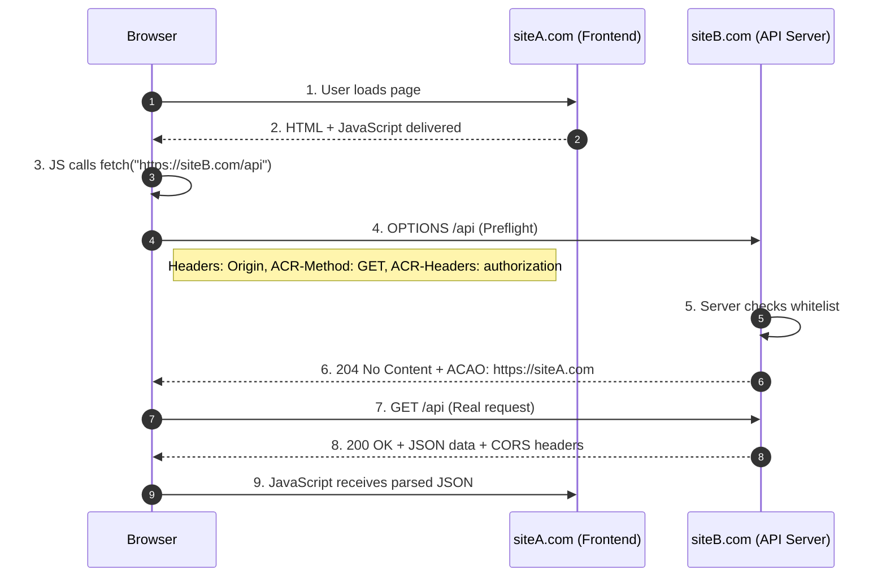
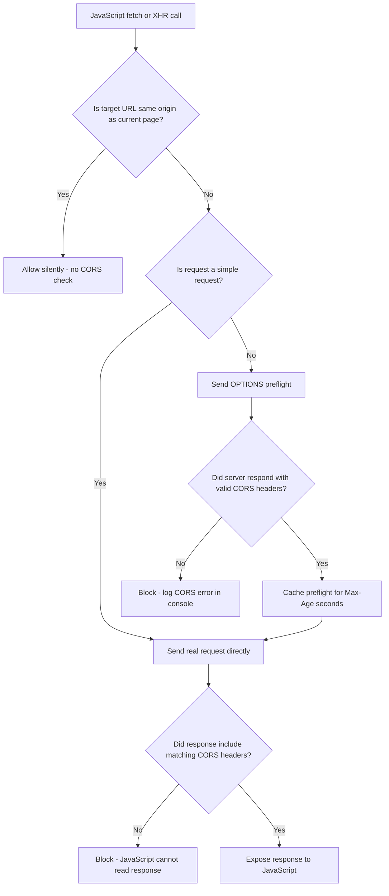
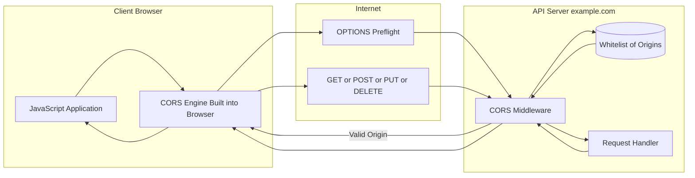
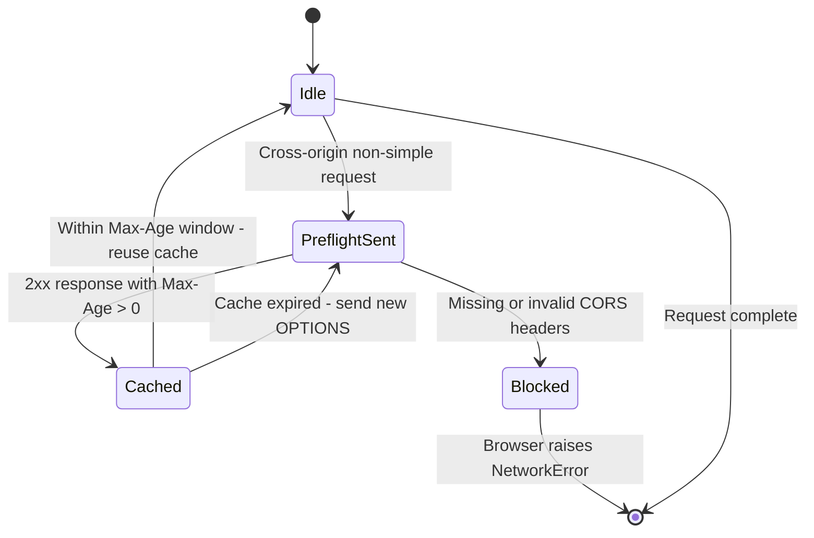
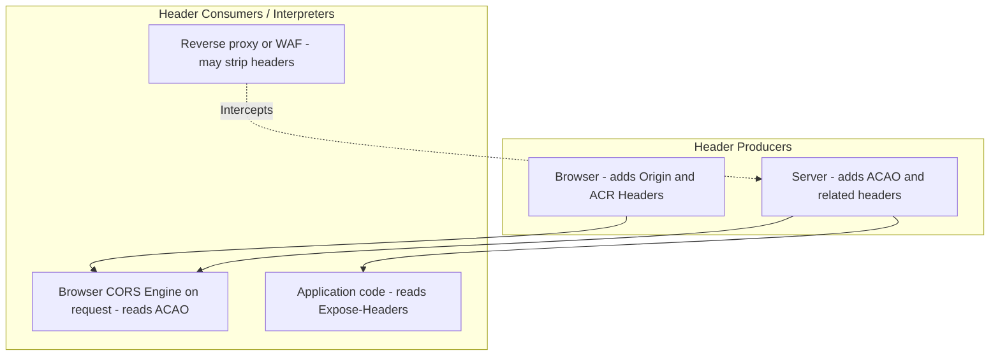

# Cross-Origin Resource Sharing

<!-- SECTION_1_START -->
# Cross-Origin Resource Sharing (CORS) — KTU Web Programming (OECST832)

## 1.1 Formal Academic Definition

**Cross-Origin Resource Sharing (CORS)** is a **W3C-standardized browser security mechanism** defined in the *Fetch Living Standard* and originally published as **RFC 6454**, which extends the **Same-Origin Policy (SOP)** of web browsers. CORS uses a structured set of **HTTP response headers** and **HTTP request headers** to instruct a browser whether it should permit a web page loaded from one **origin** (scheme + host + port) to access a resource located on a different **origin** through the `fetch()`, `XMLHttpRequest`, or WebSocket APIs.

> [!IMPORTANT]
> **KTU Syllabus Highlight (Module 2 – Scripting Language)**
> CORS is part of the *client-side scripting and browser security* cluster. For the KTU 2024 scheme, the examiner expects students to know: (i) what the Same-Origin Policy is, (ii) why CORS exists, (iii) the role of the `Origin` request header, (iv) the key CORS response headers, and (v) how to implement CORS in a server-side scripting language (Node.js / PHP).

An **Origin** is the combination of three URL components:
- **Scheme** (`http`, `https`)
- **Host** (`www.example.com`)
- **Port** (`80`, `443`, `8080`)

Two URLs share the same origin **if and only if** all three components match exactly.

> [!NOTE]
> **Core Definition (Board-Ready)**
> *"Cross-Origin Resource Sharing (CORS) is a browser-implemented security feature that uses HTTP headers to relax the Same-Origin Policy, allowing servers to explicitly whitelist which external domains, HTTP methods, and headers may access their resources."*

## 1.2 Conceptual Analogy — The Club Bouncer

Imagine a popular nightclub called **example.com**. Inside the club, valuable items (your user data, private APIs) are stored. A regular customer (your browser tab) is at the door.

- **The Same-Origin Policy (SOP)** is the club's default rule: *"Only customers who walked in through the main entrance of our branch may order drinks."* A tab on `siteA.com` cannot silently read data from `siteB.com` — that is the policy.
- **CORS** is the bouncer holding a **guest list** provided by `siteB.com`. `siteB.com` sends a header saying: *"I allow visitors from `siteA.com` between 9 PM and 11 PM."* The bouncer checks this list.
- **Preflight** is the bouncer calling the manager (via an `OPTIONS` request) **before** the customer is even allowed to ask for a drink, to confirm that the request type and headers are safe.

This analogy directly explains *why* a misconfigured CORS policy is dangerous — a careless guest list (`Access-Control-Allow-Origin: *` combined with `Access-Control-Allow-Credentials: true`) is like letting **any stranger** in with a VIP wristband.

## 1.3 Why CORS Exists — The Same-Origin Policy (SOP) Foundation

| Property | Same-Origin Policy (SOP) | CORS |
|---|---|---|
| **Default behaviour** | Blocks cross-origin requests | Explicitly permits when configured |
| **Enforced by** | Web browser | Web browser (interprets server headers) |
| **Triggered on** | `XMLHttpRequest`, `fetch`, ``, `<script>`, `<iframe>` | Same APIs |
| **Controlled by** | Browser spec | Server-emitted HTTP headers |
| **Server-side effort** | None | Requires explicit configuration |

> [!TIP]
> **Mental model to retain for the exam:** SOP is the *wall*; CORS is the *controlled doorway* the server builds into that wall.

## 1.4 Visual Intuition — Origin Matching

> [!VISUALIZATION CONTROL]
> **Concept:** Origin comparison matrix showing which URL pairs are *same-origin* and *cross-origin*.
> **Reference Grid (mental picture):**
> * X-axis: `http://`, `https://`
> * Y-axis: `siteA.com:80`, `siteA.com:8080`, `siteB.com:80`
> * Cells shaded **green** = same origin; **red** = cross origin.
> **Visual Description:** Only the exact triplet `(scheme, host, port)` is green. Any single difference (e.g. adding `:8080`, changing scheme to `https`, or changing host) immediately turns the cell red, even when the *path* (`/api/users`) is identical.
<!-- SECTION_1_END -->

<!-- SECTION_2_START -->
# 2. Deep Theoretical Analysis & KTU High-Yield Header Cheat Sheet

## 2.1 CORS Request Lifecycle — Six Structured Steps

1. **User Action Triggers a Request** — JavaScript on `https://app.client.com` calls `fetch("https://api.server.com/data")`.
2. **Browser Tags the Request as Cross-Origin** — The browser parses the target URL and compares it against the current document's origin. Mismatch detected ⇒ CORS protocol activates.
3. **Browser Adds `Origin` Header** — An `Origin: https://app.client.com` header is automatically attached. The browser **does not allow JavaScript to forge** this header.
4. **Request Classification by the Browser**:
   - **Simple Request** → goes straight to the server.
   - **Preflighted Request** → browser first sends an `OPTIONS` request.
5. **Server Responds with CORS Headers** — The server evaluates `Origin` and emits `Access-Control-Allow-*` headers.
6. **Browser Performs Final Allow/Deny** — Even if the HTTP status is `200 OK`, the browser blocks the response from being read by JavaScript if the CORS headers are missing or invalid.

> [!NOTE]
> **Critical Point for KTU:** A CORS block is enforced **by the browser, not by the server**. `curl` and Postman can still retrieve the response because they do not implement SOP. This is the most-asked follow-up concept in viva.

## 2.2 Simple Requests vs. Preflighted Requests

A request is **simple** when **all** of the following are true:

| Condition | Allowed Values |
|---|---|
| HTTP method | `GET`, `HEAD`, `POST` |
| Request headers (CORS-safelisted) | `Accept`, `Accept-Language`, `Content-Language`, `Content-Type` (with restricted values), `Range` |
| `Content-Type` | `application/x-www-form-urlencoded`, `multipart/form-data`, `text/plain` |
| No event listeners on `XMLHttpRequest.upload` | — |

If **any** condition fails (e.g. `Content-Type: application/json` or method `PUT`/`DELETE`), the browser issues a **preflight** `OPTIONS` request first.

> [!IMPORTANT]
> **Why this matters in production:** A `PUT` request with `Content-Type: application/json` — which is the *normal* pattern for REST APIs — **always** triggers a preflight. Beginners often miss this and wonder why their API works in Postman but fails from the browser.

## 2.3 KTU CORS Header Cheat Sheet

### 2.3.1 Request Headers (browser → server)

| Header | Purpose | Example |
|---|---|---|
| `Origin` | Identifies the requesting origin | `Origin: https://app.client.com` |
| `Access-Control-Request-Method` | Tells server which HTTP method the upcoming real request will use (preflight) | `Access-Control-Request-Method: PUT` |
| `Access-Control-Request-Headers` | Lists non-standard headers the real request will carry (preflight) | `Access-Control-Request-Headers: Authorization, Content-Type` |

### 2.3.2 Response Headers (server → browser)

| Header | Purpose | Example |
|---|---|---|
| `Access-Control-Allow-Origin` | Whitelisted origin(s) | `Access-Control-Allow-Origin: https://app.client.com` |
| `Access-Control-Allow-Methods` | Permitted HTTP methods | `Access-Control-Allow-Methods: GET, POST, PUT, DELETE, OPTIONS` |
| `Access-Control-Allow-Headers` | Permitted custom request headers | `Access-Control-Allow-Headers: Content-Type, Authorization` |
| `Access-Control-Allow-Credentials` | Whether cookies/HTTP-auth may be sent | `Access-Control-Allow-Credentials: true` |
| `Access-Control-Max-Age` | How long the preflight result can be cached (seconds) | `Access-Control-Max-Age: 86400` |
| `Access-Control-Expose-Headers` | Which non-safelisted response headers JS may read | `Access-Control-Expose-Headers: X-Total-Count, X-Request-Id` |

> [!WARNING]
> **Wildcard Conflict Rule (favourite KTU question):** The server **must not** send `Access-Control-Allow-Origin: *` *together with* `Access-Control-Allow-Credentials: true`. The browser will **reject** the response. When credentials are needed, the server **must** echo back a **specific** origin.

### 2.3.3 Safe Boundary Conditions

| Scenario | Allowed CORS Response |
|---|---|
| Public, unauthenticated API | `Access-Control-Allow-Origin: *` (no credentials) |
| Single trusted client | Echo the exact `Origin` value dynamically |
| Multiple trusted clients | Server must maintain a whitelist and echo one of them |
| Cookies / HTTP-Auth needed | Echo specific origin **and** set `Allow-Credentials: true` |
| Preflight caching (perf) | `Access-Control-Max-Age` ≤ **86400** seconds (24 h) per spec recommendation |

## 2.4 Real-World Engineering Utility

| Domain | How CORS is used |
|---|---|
| **Microservices** | Frontend SPA on `app.company.com` consumes APIs at `api.company.com` |
| **CDNs / Static assets** | Fonts (Google Fonts), images, public datasets on third-party domains |
| **OAuth / OpenID Connect** | Authorization servers on `auth.provider.com` validating redirects from app domains |
| **Serverless APIs** | AWS API Gateway, Azure Functions, Google Cloud Run rely on CORS preflight for `OPTIONS` |
| **Mobile + Web hybrid** | Cordova/Ionic apps sometimes load remote dashboards inside WebViews; CORS controls that bridge |

## 2.5 Common Failure Modes (Board Pitfalls)

1. Forgetting to respond to the **`OPTIONS`** preflight → browser shows *"CORS preflight did not succeed"*.
2. Sending `*` with credentials → browser silently drops the response.
3. Trailing slash mismatch in `Origin` (`https://app.com/` vs `https://app.com`) — they are **not** the same.
4. Middleware ordering bug in Express → CORS headers stripped by another middleware.
5. Reverse proxy (Nginx) stripping CORS headers before they reach the client.
<!-- SECTION_2_END -->

<!-- SECTION_3_START -->
# 3. Step-by-Step Derivations, Server Implementations & Code Walkthroughs

## 3.1 Manual Implementation in Vanilla Node.js (HTTP module)

Below is a *complete* Node.js server with no external libraries that demonstrates every CORS header discussed in §2.3. Each block is fully written — no truncation.

```javascript
// server.js — Vanilla Node.js CORS-aware static + JSON API
const http = require('http');
const url = require('url');

const PORT = 3000;
const ALLOWED_ORIGINS = new Set([
    'http://localhost:5500',
    'https://app.client.com'
]);

function buildCorsHeaders(requestOrigin) {
    const headers = {};
    // Echo specific origin if whitelisted, else omit the header (browser will block)
    if (ALLOWED_ORIGINS.has(requestOrigin)) {
        headers['Access-Control-Allow-Origin'] = requestOrigin;
        headers['Vary'] = 'Origin'; // Tells caches the response varies by Origin
        headers['Access-Control-Allow-Credentials'] = 'true';
    }
    headers['Access-Control-Allow-Methods'] = 'GET, POST, PUT, DELETE, OPTIONS';
    headers['Access-Control-Allow-Headers'] = 'Content-Type, Authorization, X-Custom-Token';
    headers['Access-Control-Max-Age'] = '86400';
    headers['Access-Control-Expose-Headers'] = 'X-Total-Count, X-Request-Id';
    return headers;
}

const server = http.createServer((req, res) => {
    const parsedUrl = url.parse(req.url, true);
    const requestOrigin = req.headers['origin'] || '';
    const corsHeaders = buildCorsHeaders(requestOrigin);

    // Step 1: Handle the preflight (OPTIONS) short-circuit
    if (req.method === 'OPTIONS') {
        res.writeHead(204, corsHeaders);
        res.end();
        return;
    }

    // Step 2: Serve a simple JSON API at /api/data
    if (parsedUrl.pathname === '/api/data' && req.method === 'GET') {
        const body = JSON.stringify({
            message: 'CORS-enabled response',
            serverTime: new Date().toISOString()
        });
        Object.entries(corsHeaders).forEach(([k, v]) => res.setHeader(k, v));
        res.writeHead(200, { 'Content-Type': 'application/json' });
        res.end(body);
        return;
    }

    // Step 3: Default 404
    res.writeHead(404, { 'Content-Type': 'text/plain' });
    res.end('Not Found');
});

server.listen(PORT, () => {
    console.log(`CORS server listening on http://localhost:${PORT}`);
});
```

**Client-side invocation (vanilla JavaScript):**

```html
<!-- index.html served from http://localhost:5500 -->
<!DOCTYPE html>
<html lang="en">
<head><meta charset="UTF-8"><title>CORS Demo</title></head>
<body>
    <pre id="out">Loading…</pre>
    <script>
        // Step 1: Trigger the request
        fetch('http://localhost:3000/api/data', {
            method: 'GET',
            credentials: 'include' // <-- sends cookies
        })
        .then(response => {
            if (!response.ok) throw new Error('Network response was not ok');
            return response.json();
        })
        .then(data => {
            document.getElementById('out').textContent = JSON.stringify(data, null, 2);
        })
        .catch(err => {
            document.getElementById('out').textContent = 'CORS Error: ' + err.message;
        });
    </script>
</body>
</html>
```

## 3.2 Production-Grade Implementation Using Express + `cors` Middleware

```javascript
// app.js — Express with the official `cors` middleware
const express = require('express');
const cors = require('cors');

const app = express();
const PORT = 4000;

// Step 1: Define a whitelist of trusted origins
const whitelist = ['https://app.client.com', 'http://localhost:5500'];

// Step 2: Build a dynamic origin validator
const corsOptions = {
    origin: function (origin, callback) {
        // `!origin` allows tools like Postman / curl (no Origin header)
        if (!origin || whitelist.indexOf(origin) !== -1) {
            callback(null, true);
        } else {
            callback(new Error('Not allowed by CORS policy'));
        }
    },
    credentials: true,           // Allow cookies / HTTP-Auth
    methods: ['GET', 'POST', 'PUT', 'DELETE', 'OPTIONS'],
    allowedHeaders: ['Content-Type', 'Authorization', 'X-Custom-Token'],
    exposedHeaders: ['X-Total-Count', 'X-Request-Id'],
    maxAge: 86400                // Cache preflight for 24 hours
};

// Step 3: Mount the middleware globally
app.use(cors(corsOptions));

// Step 4: Parse JSON bodies
app.use(express.json());

// Step 5: Define a sample API endpoint
app.get('/api/profile', (req, res) => {
    res.json({ user: 'Kavya', role: 'admin', ts: Date.now() });
});

app.post('/api/profile', (req, res) => {
    res.status(201).json({ updated: true, payload: req.body });
});

// Step 6: Custom error handler for CORS failures
app.use((err, req, res, next) => {
    if (err.message === 'Not allowed by CORS policy') {
        return res.status(403).json({ error: err.message });
    }
    next(err);
});

app.listen(PORT, () => {
    console.log(`Express+CORS server live on http://localhost:${PORT}`);
});
```

## 3.3 PHP (Native) CORS Implementation

```php
<?php
// cors.php — drop-in CORS handler for any PHP backend
// Step 1: Define allowed origins
$allowed_origins = [
    'https://app.client.com',
    'http://localhost:5500'
];

// Step 2: Read incoming Origin
$request_origin = $_SERVER['HTTP_ORIGIN'] ?? '';

// Step 3: Decide whether to emit CORS headers
if (in_array($request_origin, $allowed_origins, true)) {
    header("Access-Control-Allow-Origin: $request_origin");
    header('Vary: Origin');
    header('Access-Control-Allow-Credentials: true');
}
header('Access-Control-Allow-Methods: GET, POST, PUT, DELETE, OPTIONS');
header('Access-Control-Allow-Headers: Content-Type, Authorization, X-Custom-Token');
header('Access-Control-Max-Age: 86400');
header('Access-Control-Expose-Headers: X-Total-Count, X-Request-Id');

// Step 4: Terminate preflight early
if ($_SERVER['REQUEST_METHOD'] === 'OPTIONS') {
    http_response_code(204);
    exit;
}

// Step 5: Actual endpoint logic
header('Content-Type: application/json');
echo json_encode([
    'status'  => 'ok',
    'message' => 'CORS-enabled PHP response',
    'time'    => date('c')
]);
```

## 3.4 Python Flask Implementation

```python
# app.py
from datetime import datetime
from flask import Flask, jsonify, request
from flask_cors import CORS

app = Flask(__name__)

# Whitelist setup with credentials enabled
CORS(
    app,
    origins=["https://app.client.com", "http://localhost:5500"],
    supports_credentials=True,
    allow_headers=["Content-Type", "Authorization"],
    expose_headers=["X-Total-Count"],
    max_age=86400
)

@app.route("/api/data", methods=["GET", "POST"])
def data():
    return jsonify({
        "server_time": datetime.utcnow().isoformat() + "Z",
        "method_used": request.method
    })

if __name__ == "__main__":
    app.run(port=5000, debug=True)
```

## 3.5 Symbolic Algorithm — Preflight Decision Logic

The browser's preflight decision can be expressed as the following deterministic algorithm. Every step is expanded to satisfy KTU's full-marks expectation.

$$
\text{Decision} = \begin{cases}
\text{ALLOW}_{\text{real}}, & \text{if } O_{\text{real}} \in W \;\land\; H_{\text{real}} \subseteq H_{\text{allow}} \;\land\; M_{\text{real}} \in M_{\text{allow}} \\[6pt]
\text{BLOCK}, & \text{otherwise}
\end{cases}
$$

where:
- $O_{\text{real}}$ = the `Origin` header of the upcoming real request
- $W$ = server-configured whitelist of permitted origins
- $H_{\text{real}}$ = the set of custom headers in the real request
- $H_{\text{allow}}$ = `Access-Control-Allow-Headers` value from preflight response
- $M_{\text{real}}$ = HTTP method of the real request
- $M_{\text{allow}}$ = `Access-Control-Allow-Methods` value from preflight response

**Step-by-step evaluation in pseudo-code:**

```
1. Read preflight response from cache
2.   IF cache_age < Access-Control-Max-Age
3.       Use cached decision
4.   ELSE
5.       Send new OPTIONS request
6.       Capture Access-Control-Allow-Origin
7.       Capture Access-Control-Allow-Methods
8.       Capture Access-Control-Allow-Headers
9. Compare:
   IF  request_origin   == Access-Control-Allow-Origin
   AND request_method   ∈ Access-Control-Allow-Methods
   AND request_headers  ⊆ Access-Control-Allow-Headers
   THEN emit real request and return response to JS
   ELSE throw DOMException("Network Error") in console
10.END
```

## 3.6 Worked Numerical Example — Preflight Exchange

**Scenario:** Frontend at `https://app.client.com` calls `https://api.server.com/users/42` with `DELETE` and `Authorization: Bearer xyz`.

**Step 1 — Browser initiates preflight:**

$$
\text{OPTIONS} \;\;/\text{users}/42 \;\;\text{HTTP}/1.1 \\
\text{Host: api.server.com} \\
\text{Origin: https://app.client.com} \\
\text{Access-Control-Request-Method: DELETE} \\
\text{Access-Control-Request-Headers: authorization, content-type}
$$

**Step 2 — Server evaluates and responds:**

$$
\text{HTTP}/1.1 \;\; 204 \;\; \text{No Content} \\
\text{Access-Control-Allow-Origin: https://app.client.com} \\
\text{Access-Control-Allow-Methods: GET, POST, PUT, DELETE, OPTIONS} \\
\text{Access-Control-Allow-Headers: authorization, content-type} \\
\text{Access-Control-Max-Age: 86400} \\
\text{Access-Control-Allow-Credentials: true} \\
\text{Vary: Origin}
$$

**Step 3 — Browser validates the preflight** using the formula in §3.5:
- `https://app.client.com` ∈ $W$ ✔
- `DELETE` ∈ $M_{\text{allow}}$ ✔
- `{authorization, content-type}` ⊆ $H_{\text{allow}}$ ✔
- → Decision = ALLOW_real

**Step 4 — Browser fires the actual request:**

$$
\text{DELETE} \;\;/\text{users}/42 \;\;\text{HTTP}/1.1 \\
\text{Host: api.server.com} \\
\text{Origin: https://app.client.com} \\
\text{Authorization: Bearer xyz} \\
\text{Cookie: session=abc123}
$$

**Step 5 — Server returns the data + CORS headers, browser exposes it to JavaScript.**

## 3.7 Secure Production Checklist (Comparative Matrix)

| # | Check | Why it matters | Status |
|---|---|---|---|
| 1 | Never use `*` with credentials | Browser will reject | Mandatory |
| 2 | Add `Vary: Origin` when echoing dynamic origin | Prevents cache poisoning | Mandatory |
| 3 | Whitelist only specific origins, never reflect all | Avoids reflected-origin attacks | Mandatory |
| 4 | Keep `Access-Control-Max-Age` ≤ 86400 | Spec recommendation, limits policy change lag | Recommended |
| 5 | Log blocked origins | Audit trail for security team | Recommended |
| 6 | Strip CORS headers at reverse proxy if API is internal-only | Defense in depth | Optional |
| 7 | Set `Access-Control-Expose-Headers` explicitly | Otherwise JS cannot read non-safelisted headers | Recommended |
<!-- SECTION_3_END -->

<!-- SECTION_4_START -->
# 4. Structural Diagrams & Schematics

## 4.1 Mermaid Sequence Diagram — Preflight Flow



## 4.2 Mermaid Flowchart — Browser CORS Decision Engine



## 4.3 Mermaid Block Diagram — Server-Side CORS Architecture



## 4.4 Mermaid State Diagram — Preflight Cache Lifecycle



## 4.5 Mermaid Component Matrix — Header Producers and Consumers


<!-- SECTION_4_END -->

<!-- SECTION_5_START -->
# 5. KTU 2024 Scheme Examination Question Bank & Topic Recap

## 5.1 Part A — Short Answer Questions (3 Marks Each)

> **Q1.** `[KTU University Exam – July 2024]` **Define Cross-Origin Resource Sharing. What problem does it solve in modern web applications?** **[CO1, Remember/Understand]**

**Model Answer (3 marks):**
- **[1 mark]** CORS is a W3C-standardized browser mechanism that uses HTTP headers to relax the Same-Origin Policy.
- **[1 mark]** It solves the problem of browsers blocking legitimate cross-origin HTTP requests initiated from JavaScript (e.g. a frontend SPA hosted on one domain consuming a REST API on a different domain).
- **[1 mark]** The server explicitly declares, via `Access-Control-Allow-*` response headers, which origins, methods, and headers are permitted, allowing controlled cross-domain data exchange without weakening browser security.

> **Q2.** `[KTU University Exam – Dec 2023]` **Differentiate between a Simple Request and a Preflighted Request in CORS. Give one example of each.** **[CO2, Understand]**

**Model Answer (3 marks):**
- **[1 mark]** A **Simple Request** is a cross-origin request that uses a CORS-safelisted method (`GET`, `HEAD`, `POST`) and CORS-safelisted headers only; the browser sends it directly *without* a preflight. *Example:* `GET https://api.example.com/data` with no custom headers.
- **[1 mark]** A **Preflighted Request** is one that uses non-safelisted methods (e.g. `PUT`, `DELETE`) or non-safelisted headers (e.g. `Authorization`, `Content-Type: application/json`); the browser first sends an `OPTIONS` request to confirm the server's policy.
- **[1 mark]** *Example of preflighted:* `DELETE https://api.example.com/users/1` with `Authorization` header — the browser sends `OPTIONS` first.

## 5.2 Part B — 14-Mark Questions (Module Internal Choice Pattern)

> ### **Question A (14 Marks)**
> `[KTU University Exam – July 2024]`
> **(a)** Explain the architecture of the Same-Origin Policy and describe how CORS extends it. List the key CORS response headers with their functions. **[7 marks, CO1, Understand]**
> **(b)** Write a complete Node.js (Express) server that enables CORS for `https://app.client.com` and `http://localhost:5500`, supports cookies (`credentials: true`), exposes the custom response header `X-Total-Count`, caches preflight for 12 hours, and exposes a `GET /api/products` endpoint returning a JSON array of three products. **[7 marks, CO3, Apply]**

**Model Answer:**

**(a) Theory — 7 marks**

- **[1.5 marks]** SOP definition: browser-enforced policy that a web page can only access resources from the same scheme + host + port.
- **[1.5 marks]** Why CORS extends it: legitimate use cases (third-party APIs, CDNs, microservices) need controlled cross-origin access; CORS lets the *server* opt-in.
- **[1 mark]** Browser, not server, is the enforcer — `curl`/`Postman` ignore CORS.
- **[1 mark]** Key request header: `Origin`.
- **[1 mark]** Key response headers: `Access-Control-Allow-Origin`, `Access-Control-Allow-Methods`, `Access-Control-Allow-Headers`, `Access-Control-Allow-Credentials`, `Access-Control-Max-Age`, `Access-Control-Expose-Headers`.
- **[1 mark]** Preflight workflow described in two or three sentences.

**(b) Express Code — 7 marks**

```javascript
// Step 1: Install dependencies
// npm install express cors
// Step 2: Import modules [1 mark]
const express = require('express');
const cors = require('cors');
const app = express();
const PORT = 4000;

// Step 3: Whitelist and CORS options [2 marks]
const whitelist = ['https://app.client.com', 'http://localhost:5500'];
const corsOptions = {
    origin: function (origin, callback) {
        if (!origin || whitelist.includes(origin)) {
            callback(null, true);
        } else {
            callback(new Error('CORS policy violation'));
        }
    },
    credentials: true,
    methods: ['GET', 'POST', 'PUT', 'DELETE', 'OPTIONS'],
    allowedHeaders: ['Content-Type', 'Authorization'],
    exposedHeaders: ['X-Total-Count'],
    maxAge: 43200 // 12 hours in seconds [1 mark]
};
app.use(cors(corsOptions));
app.use(express.json());

// Step 4: API endpoint [2 marks]
app.get('/api/products', (req, res) => {
    const products = [
        { id: 1, name: 'Laptop',  price: 75000 },
        { id: 2, name: 'Phone',   price: 35000 },
        { id: 3, name: 'Tablet',  price: 25000 }
    ];
    res.set('X-Total-Count', products.length);
    res.json(products);
});

// Step 5: CORS-aware error handler [1 mark]
app.use((err, req, res, next) => {
    if (err.message === 'CORS policy violation') {
        return res.status(403).json({ error: err.message });
    }
    next(err);
});

// Step 6: Start server
app.listen(PORT, () => console.log(`Server on http://localhost:${PORT}`));
```

**[Valuation Key Points]**
- [Whitelist correctly defined: 1 mark]
- [credentials: true present: 1 mark]
- [Expose-Headers containing X-Total-Count: 1 mark]
- [Max-Age of 43200 (12h) shown: 1 mark]
- [Endpoint returns valid JSON array of 3 products: 1 mark]
- [Error handler present: 1 mark]
- [Server.listen invoked: 1 mark]

> ### **Question B (14 Marks) — Alternative Choice**
> `[KTU University Exam – Dec 2023]`
> **(a)** With a neat sequence diagram, explain the CORS preflight mechanism. State clearly which HTTP method is used for preflight, which two `Access-Control-Request-*` headers are sent, and how the server's preflight response controls the real request. **[7 marks, CO2, Understand/Apply]**
> **(b)** Implement a PHP script that handles CORS for the whitelisted origins `https://shop.kerala.in` and `http://localhost:8080`, supports `GET` and `POST`, allows `Content-Type` and `Authorization` headers, sets `Access-Control-Max-Age` to one hour, and returns a JSON array of two items. **[7 marks, CO3, Apply]**

**Model Answer:**

**(a) Preflight Theory — 7 marks**

- **[1 mark]** Preflight is sent using the `OPTIONS` HTTP method.
- **[1 mark]** Browser sends `Access-Control-Request-Method` and `Access-Control-Request-Headers` along with `Origin`.
- **[1.5 marks]** Server replies with status `204 No Content` and headers `Access-Control-Allow-Origin`, `Access-Control-Allow-Methods`, `Access-Control-Allow-Headers`, `Access-Control-Max-Age`.
- **[1.5 marks]** Browser validates origin matches, method is in allow-list, all custom headers are covered; if any check fails, the real request is blocked.
- **[2 marks]** Sequence diagram (draw with participant Browser and Server; show OPTIONS → 204 → real request → 200). Award 2 marks for a clear, correctly-labelled sequence.

**Textual Sequence Diagram (for board drawing):**
```
Browser                 Server
  |--- OPTIONS /api ----->|   (Preflight)
  |   Origin: https://x   |
  |   ACR-Method: POST    |
  |<-- 204 No Content ----|
  |   ACAO: https://x     |
  |   ACA-Methods: POST   |
  |   ACA-Headers: content-type |
  |--- POST /api -------->|   (Real request)
  |<-- 200 OK + JSON -----|
```

**(b) PHP Code — 7 marks**

```php
<?php
// Step 1: Whitelist of allowed origins [1 mark]
$allowed_origins = [
    'https://shop.kerala.in',
    'http://localhost:8080'
];

// Step 2: Capture incoming Origin [0.5 mark]
$request_origin = $_SERVER['HTTP_ORIGIN'] ?? '';

// Step 3: Emit CORS headers conditionally [1 mark]
if (in_array($request_origin, $allowed_origins, true)) {
    header("Access-Control-Allow-Origin: $request_origin");
    header('Vary: Origin');
    header('Access-Control-Allow-Credentials: true');
}
header('Access-Control-Allow-Methods: GET, POST, OPTIONS');
header('Access-Control-Allow-Headers: Content-Type, Authorization');
header('Access-Control-Max-Age: 3600'); // 1 hour [1 mark]

// Step 4: Short-circuit preflight [0.5 mark]
if ($_SERVER['REQUEST_METHOD'] === 'OPTIONS') {
    http_response_code(204);
    exit;
}

// Step 5: Respond with JSON data [2 marks]
header('Content-Type: application/json');
$items = [
    ['id' => 1, 'name' => 'Cardamom', 'price' => 850],
    ['id' => 2, 'name' => 'Tea',      'price' => 320]
];
echo json_encode($items);
```

**[Valuation Key Points]**
- [Whitelist array defined: 1 mark]
- [Conditional header emission with specific origin echo: 1 mark]
- [Vary: Origin present: 0.5 mark]
- [Max-Age of 3600 (1h) correctly set: 1 mark]
- [OPTIONS short-circuit using exit: 1 mark]
- [JSON array of two items returned: 1 mark]
- [Correct Content-Type header: 0.5 mark]
- [Valid in_array() check on origin: 1 mark]

> [!WARNING]
> **KTU Examiner's Valuation Pitfall Callout**
> 1. **Do not** write `Access-Control-Allow-Origin: *` *and* `Access-Control-Allow-Credentials: true` in the same response — you will **lose 2 marks** outright. Either drop the wildcard or drop the credentials flag.
> 2. **Do not** forget the `Vary: Origin` header when dynamically echoing the request `Origin`. The server is vulnerable to **cache poisoning** without it, and the examiner will deduct 1 mark.
> 3. **Do not** skip the `OPTIONS` short-circuit at the top of your server file — the preflight will otherwise attempt to execute real business logic and may return unwanted data.
> 4. **Do not** omit the `Origin` read step in PHP (`$_SERVER['HTTP_ORIGIN']` is case-sensitive in some servers); calling it `HTTP_origin` will silently fail.
> 5. **Do not** treat CORS as a *server-side* security control. SOP/CORS is browser-side. Sensitive operations **must** also be re-validated server-side using session tokens, CSRF tokens, or JWT.

## 5.3 Topic Recap & Important Things to Remember

- **CORS =** "Cross-Origin Resource Sharing" — a browser-enforced relaxation of the **Same-Origin Policy** using HTTP headers.
- An **Origin** = `(scheme, host, port)` triplet. Any difference = cross-origin.
- CORS is enforced **by the browser only**; `curl`/`Postman` ignore it.
- **Simple Request** = `GET` / `HEAD` / `POST` + safelisted headers + safelisted `Content-Type`. No preflight.
- **Preflighted Request** = any non-simple request. Browser first sends `OPTIONS` with `Access-Control-Request-Method` and `Access-Control-Request-Headers`.
- **Key request header:** `Origin` (browser-set, not forgeable from JS).
- **Key response headers:**
  - `Access-Control-Allow-Origin` — permitted origin (or `*` for public, non-credentialed).
  - `Access-Control-Allow-Methods` — permitted HTTP methods.
  - `Access-Control-Allow-Headers` — permitted custom request headers.
  - `Access-Control-Allow-Credentials` — `true` enables cookies/auth (must be paired with a specific origin).
  - `Access-Control-Max-Age` — preflight cache lifetime in seconds (≤ 86400 recommended).
  - `Access-Control-Expose-Headers` — non-safelisted response headers JS may read.
- **Hard rule:** `Allow-Origin: *` + `Allow-Credentials: true` = browser rejection.
- **Hard rule:** Always set `Vary: Origin` when echoing a dynamic origin (prevents cache poisoning).
- **Hard rule:** Server *must* respond to `OPTIONS` (typically `204 No Content`) for the preflight to succeed.
- **Hard rule:** CORS is **not** a substitute for server-side authentication / authorization.
- **Production libraries:** Express → `cors` middleware; Flask → `Flask-CORS`; Django → `django-cors-headers`; Spring Boot → `WebMvcConfigurer.addCorsMappings()`; ASP.NET Core → `[EnableCors]` attribute.
- **Common misconfigurations to memorize for viva:** trailing slash in origin, mixed content (https page calling http API), missing `OPTIONS` handler, proxy stripping CORS headers, and reflecting `Origin` without whitelist check.
<!-- SECTION_5_END -->
