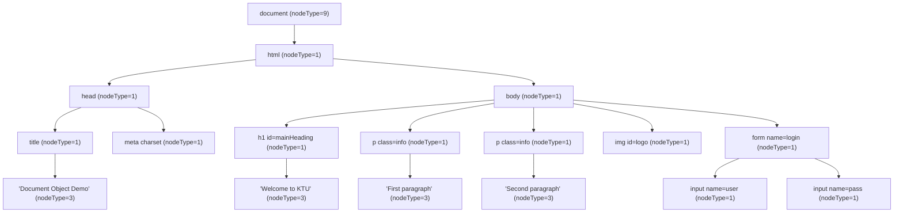
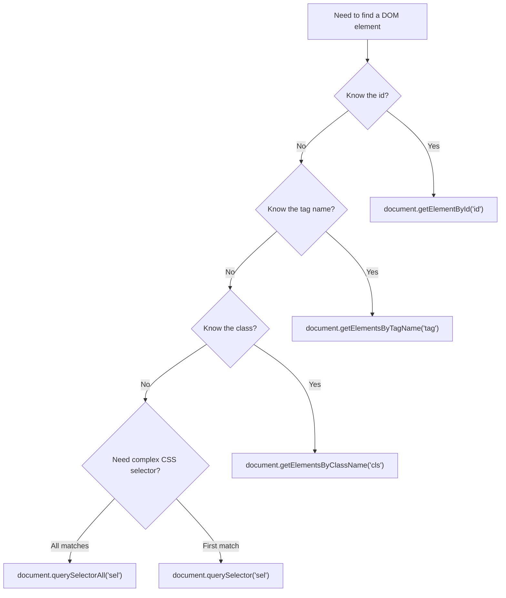
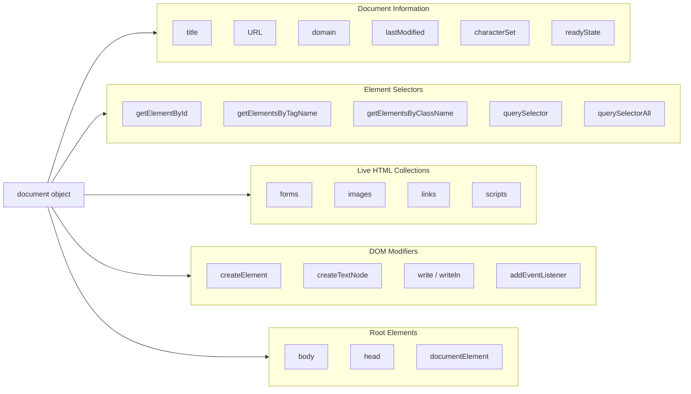
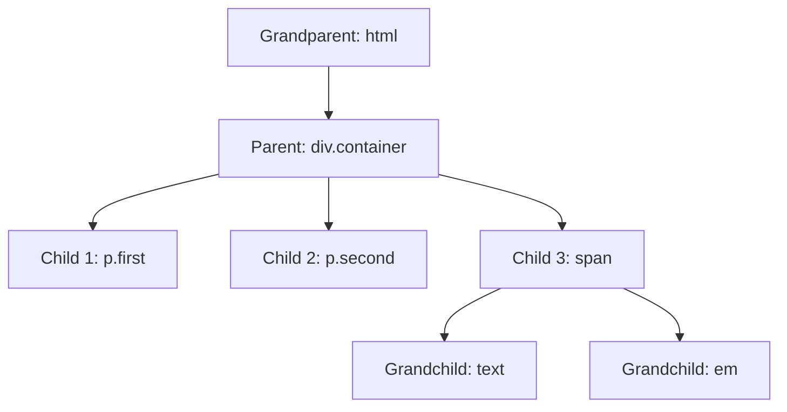
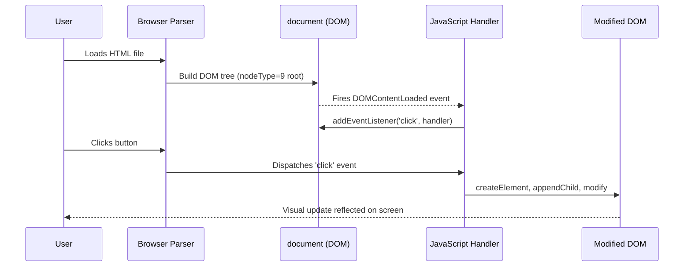
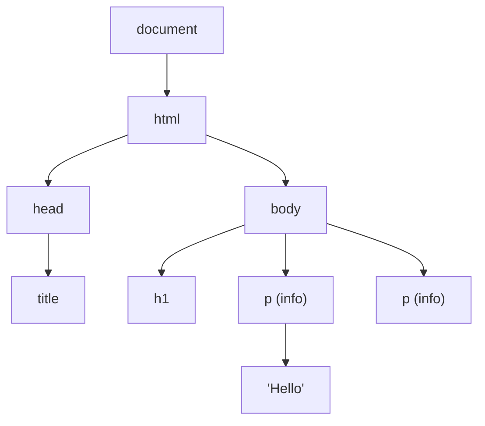

# Document Object

<!-- SECTION_1_START -->
# The Document Object in JavaScript

> [!IMPORTANT]
> **KTU 2024 Scheme | Course: OECST832 – Web Programming | Module 2 (Scripting Language)**
> The **Document Object** is the *root gateway* through which JavaScript accesses, reads, and manipulates every single element of an HTML page. It is the single most important non-window object in client-side scripting.

---

## 1.1 Formal Definition (KTU Syllabus Terminology)

The **Document Object** is a built-in, top-level JavaScript object that represents the entire HTML (or XML) page currently loaded in the browser. It is a property of the global `window` object and acts as the *entry point* into the **Document Object Model (DOM)** — a W3C-standard, tree-structured, platform- and language-neutral interface that treats the document as a logical hierarchy of **nodes** (elements, attributes, text, comments).

Formally, according to the **W3C DOM Level 3 specification**:

> *"The Document object provides the primary interface to the document's content, exposing methods and properties to navigate, query, and modify the document tree."*

For KTU evaluation purposes, memorize this exact phrasing:

> The **Document Object Model (DOM)** is a **W3C standard application programming interface (API)** for valid **HTML** and well-formed **XML** documents. It defines the **logical structure** of documents and the way a document is accessed and manipulated programmatically.

---

## 1.2 Conceptual Analogy — The "HTML Family Tree" 🌳

Imagine an HTML page as a **giant family photograph album**:

- The **`<html>` tag** is the *cover page* of the album.
- **`<head>`** and **`<body>`** are the two main chapters.
- Every `<div>`, `<p>`, `<span>`, `` is a *family member* nested inside chapters.
- The **Document Object** is the **librarian** 🧑‍🏫 — the only person authorized to find, add, edit, or remove any photo (element) in the album.

When you open a webpage, the browser quietly builds a **tree of "node" objects** in memory. The `document` object is the **handle** (or "remote control") that JavaScript uses to talk to that in-memory tree. Without the Document object, JavaScript would be blind to the page content.

> [!NOTE]
> **Quick Visualization — DOM Tree of a Simple Page**
>
> ```text
> document
> └── html
>     ├── head
>     │   ├── title
>     │   └── meta
>     └── body
>         ├── h1
>         ├── p
>         └── div
>             └── img
> ```

Every branch is a **node**; the `document` sits at the very top (it is itself a special node of type `Document`).

---

## 1.3 Why the Document Object Exists (The "Why")

Before the DOM, web pages were *static slabs of text*. The Document Object was introduced (DOM Level 1, **1998**) to solve three engineering problems:

1. **Dynamic Content** — change page text/structure *after* it has loaded, without a server round-trip.
2. **Cross-Browser Consistency** — one standard API (`document.*`) works in Chrome, Firefox, Edge, Safari.
3. **Programmatic Access** — allow scripting languages (JavaScript, JScript, VBScript) to treat a document as a structured, traversable object graph.

> [!TIP]
> **High-Yield Board Fact:** The DOM is **NOT** part of the JavaScript language itself. It is a **separate W3C standard** that JavaScript merely *implements*. The same DOM is also accessible from languages like Python (via `xml.dom`) and PHP.

---

## 1.4 Key Constants & Standard Metrics

| Property / Metric | Value / Definition | KTU Significance |
|---|---|---|
| **Node Types (`nodeType`)** | `1 = ELEMENT_NODE`, `3 = TEXT_NODE`, `8 = COMMENT_NODE`, `9 = DOCUMENT_NODE`, `10 = DOCUMENT_TYPE_NODE` | Frequently asked in 3-mark questions |
| **W3C DOM Levels** | **Level 1 (1998)**, Level 2 (2000), **Level 3 (2004)**, **Level 4 (Living Standard)** | Core theory topic |
| **`document` typeof** | `"object"` (instance of `HTMLDocument`) | Conceptual |
| **First standardized in** | **DOM Level 1 — October 1998** | Board favourite |

> [!VISUALIZATION CONTROL]
> **Concept:** DOM Node-Type Wheel
> **Input Equations / Nodes:**
> * Center: $document$ (type 9)
> * Element nodes: type $= 1$
> * Text nodes: type $= 3$
> * Comment nodes: type $= 8$
> **Visual Description:** Imagine a pie chart where the document object (9) is the center hub, branching outward to element nodes (1) which themselves contain text nodes (3) and are sometimes preceded/followed by comment nodes (8). Each node reports its identity via the `nodeType` property.

---
<!-- SECTION_1_END -->

<!-- SECTION_2_START -->
# Deep Theoretical Analysis & KTU High-Yield Formula Sheet

## 2.1 The DOM Node Tree — Hierarchical Structure

A web document is parsed by the browser into a **node tree** where every component (element, attribute, text, comment, even whitespace in some cases) becomes a node. The Document object is the **root** (`nodeType === 9`).

**Node Relationships (KTU high-yield):**

| Relationship | Meaning | Example |
|---|---|---|
| **Parent** | The immediate enclosing node | `<body>` is parent of `<p>` |
| **Child** | A direct sub-node | `<p>` is child of `<body>` |
| **Sibling** | Nodes sharing the same parent | Two `<li>` inside same `<ul>` |
| **Ancestor** | Any node up the chain | `<html>` is ancestor of `<p>` |
| **Descendant** | Any node down the chain | `<span>` is descendant of `<div>` |

---

## 2.2 Document Object — Major Properties

The `document` object exposes dozens of properties. The KTU syllabus emphasizes the following "legacy collections" plus modern properties.

### 2.2.1 Document Information Properties

| Property | Return Type | Description | Example Output |
|---|---|---|---|
| `document.title` | String | Title of current document (from `<title>`) | `"KTU Web Programming"` |
| `document.URL` | String | Full URL of the document | `"https://ktu.edu/page.html"` |
| `document.domain` | String | Domain name of the server | `"ktu.edu"` |
| `document.referrer` | String | URL of the linking document | `"https://google.com"` |
| `document.lastModified` | String | Date document was last modified | `"01/15/2025 10:30:00"` |
| `document.cookie` | String | Semicolon-separated cookies | `"user=admin"` |
| `document.doctype` | DocumentType | Reference to the `<!DOCTYPE>` | `<!DOCTYPE html>` |
| `document.characterSet` | String | Document's character encoding | `"UTF-8"` |
| `document.readyState` | String | Loading status of the document | `"loading" / "interactive" / "complete"` |

### 2.2.2 Legacy Collection Properties (Direct HTMLCollection Access)

| Property | Returns | Indexes |
|---|---|---|
| `document.forms` | `HTMLCollection` of `<form>` elements | `document.forms[0]`, `document.forms["login"]` |
| `document.images` | `HTMLCollection` of `` elements | `document.images[0]` |
| `document.links` | `HTMLCollection` of `<a href>` + `<area>` | `document.links[0]` |
| `document.anchors` | `HTMLCollection` of `<a name>` (deprecated) | `document.anchors[0]` |
| `document.scripts` | `HTMLCollection` of `<script>` elements | `document.scripts[0]` |
| `document.embeds` | `HTMLCollection` of `<embed>` | `document.embeds[0]` |

> [!IMPORTANT]
> **`HTMLCollection` vs `NodeList` (Board Favourite Distinction):**
> * `HTMLCollection` is **live** — auto-updates when DOM changes. It is returned by `getElementsByTagName`, `getElementsByClassName`, and legacy `document.forms/images/links`.
> * `NodeList` is **mostly static** (static for `querySelectorAll`, live for `childNodes`). It is returned by `querySelectorAll`, `childNodes`, etc.
> * Only `NodeList` has a built-in `.forEach()` method. `HTMLCollection` does NOT — you must convert it via `Array.from()` first.

### 2.2.3 Document Body / Root Element Properties

| Property | Returns |
|---|---|
| `document.body` | The `<body>` element node |
| `document.head` | The `<head>` element node (HTML5) |
| `document.documentElement` | The root element (always `<html>`) |
| `document.activeElement` | Currently focused element |
| `document.forms.length` | Count of forms |

---

## 2.3 Document Object — Major Methods (The "Selector Toolkit")

### 2.3.1 Element Selection Methods

| Method | Returns | Selector Syntax | KTU Note |
|---|---|---|---|
| `getElementById(id)` | Single `Element` (or `null`) | Plain ID string — no `#` | **Fastest**; ID must be unique |
| `getElementsByTagName(tag)` | Live `HTMLCollection` | Plain tag — no `< >` | Case-insensitive in HTML |
| `getElementsByClassName(cls)` | Live `HTMLCollection` | Plain class — no `.` | Multiple classes: space-separated |
| `getElementsByName(name)` | Live `NodeList` | The `name` attribute | Mainly for forms |
| `querySelector(sel)` | First matching `Element` | **Full CSS selector** (`#id`, `.class`, `div p > a`) | Modern preferred |
| `querySelectorAll(sel)` | Static `NodeList` | Full CSS selector | Modern preferred |

### 2.3.2 Content Writing Methods

| Method | Behaviour | Use Case |
|---|---|---|
| `document.write(text)` | Writes directly to document stream | ⚠️ Avoid after page load — replaces document |
| `document.writeln(text)` | Same as `write` but adds `\n` | Debugging only |

### 2.3.3 Element Creation & Tree Manipulation

| Method | Purpose |
|---|---|
| `createElement(tagName)` | Creates a new (unattached) element node |
| `createTextNode(text)` | Creates a text node |
| `createComment(text)` | Creates a comment node |
| `createDocumentFragment()` | Lightweight off-DOM container for batch insertions |

### 2.3.4 Event & Lifecycle Methods

| Method | Purpose |
|---|---|
| `addEventListener(event, handler)` | Register a handler for an event |
| `removeEventListener(event, handler)` | Detach a previously registered handler |
| `getElementById().dispatchEvent(evt)` | Manually trigger an event |

---

## 2.4 KTU Formula Sheet (Cheat-Sheet Table)

> Use this single table for rapid revision before the exam. It maps every property/method to its **return type** and **side-effect** — exactly the kind of detail KTU examiners love to test.

| Symbol | Name | Returns | Side Effect |
|---|---|---|---|
| `$D$` | `document` | Root `HTMLDocument` object | None |
| `D.title` | Title | `String` | None (read) / sets title (write) |
| `D.URL` | URL | `String` | Read-only |
| `D.cookie` | Cookie | `String` | Read/write |
| `D.getElementById(id)$ | First element with that id | `Element \mid null$ | None |
| `D.getElementsByTagName(t)$ | Elements with tag | `HTMLCollection$ | None |
| `D.getElementsByClassName(c)$ | Elements with class | `HTMLCollection$ | None |
| `D.querySelectorAll(s)$ | All matching CSS | `NodeList$ | None |
| `D.forms[i]$ | i-th form | `HTMLFormElement$ | None |
| `D.images[i]$ | i-th image | `HTMLImageElement$ | None |
| `D.links[i]$ | i-th hyperlink | `HTMLAnchorElement$ | None |
| `D.write(s)$ | Writes to stream | `undefined$ | **Mutates document** |
| `D.writeln(s)$ | Write + newline | `undefined$ | **Mutates document** |
| `D.createElement(t)$ | New element | `Element$ | None (detached) |
| `D.createTextNode(s)$ | New text node | `Text$ | None (detached) |
| `D.body$ | `<body>` element | `HTMLElement$ | None |
| `D.head$ | `<head>` element | `HTMLElement$ | None |
| `D.documentElement$ | `<html>` root | `HTMLElement$ | None |
| `D.readyState$ | Load status | `String$ | None |

---

## 2.5 Real-World Engineering Utility

The Document Object is the **engine of every modern interactive web application**:

1. **Single-Page Applications (SPAs)** — React, Vue, Angular all operate by *creating and replacing DOM nodes* via the Document Object API. Under the hood, every React render is a chain of `document.createElement` + property assignments.
2. **Form Validation** — `document.forms[0].elements["email"]` lets scripts read user input before submission, enabling real-time feedback.
3. **Dynamic Content Loading** — News sites, social media feeds, and dashboards inject new `<article>` / `<div>` nodes into the DOM without a full page reload (AJAX + `appendChild`).
4. **Browser Extensions** — Chrome and Firefox extensions use `document` to read and modify the structure of web pages the user visits.
5. **Automated Testing Tools** — Selenium, Cypress, and Puppeteer all interact with web pages *exclusively* through the Document Object API.
6. **Accessibility & SEO** — Search engines and screen readers parse the DOM tree to extract meaning; understanding Document Object properties (e.g., `document.title`, semantic tags) is foundational for both.

> [!TIP]
> **Production Insight:** When working with large documents, prefer `document.getElementById` (uses a hash map internally — **O(1)** lookup) over `querySelector` (must parse selector — **O(n)**). In frameworks, this is why React uses **virtual DOM diffing** instead of querying the live document repeatedly.

---
<!-- SECTION_2_END -->

<!-- SECTION_3_START -->
# Step-by-Step Derivations, Code Implementations & Worked Examples

## 3.1 Foundational HTML Skeleton (Used by All Examples)

```html
<!DOCTYPE html>
<html lang="en">
<head>
    <meta charset="UTF-8">
    <title>Document Object Demo</title>
    <script>
        // All JavaScript examples below assume the DOM is fully loaded.
        // We use the window.onload event to guarantee that.
    </script>
</head>
<body>
    <h1 id="mainHeading">Welcome to KTU Web Programming</h1>
    <p class="info">This is the first paragraph.</p>
    <p class="info">This is the second paragraph.</p>
    
    <a href="https://ktu.edu.in">KTU Official Site</a>
    <a href="https://google.com">Google</a>

    <form name="login" id="loginForm">
        Username: <input type="text" name="user" id="username"><br>
        Password: <input type="password" name="pass" id="password"><br>
        <input type="submit" value="Login">
    </form>
</body>
</html>
```

---

## 3.2 Program 1 — Reading `document` Properties

```html
<script>
    window.onload = function () {
        // 1. Document-level metadata
        console.log("Title       :", document.title);
        console.log("URL         :", document.URL);
        console.log("Domain      :", document.domain);
        console.log("Last Mod    :", document.lastModified);
        console.log("Charset     :", document.characterSet);
        console.log("Ready State :", document.readyState);
        console.log("Doctype     :", document.doctype);
        console.log("Body        :", document.body.nodeName);    // "BODY"
        console.log("Head        :", document.head.nodeName);    // "HEAD"
        console.log("Root        :", document.documentElement.nodeName); // "HTML"
    };
</script>
```

**Step-by-step log output (mental derivation):**

1. Browser parses `<title>Document Object Demo</title>` → `document.title` returns the string `"Document Object Demo"`.
2. The full URL loaded into the address bar is captured → `document.URL` returns the entire string.
3. The `lastModified` HTTP header (or file system timestamp) is read → date string returned.
4. `characterSet` is determined from the `<meta charset="UTF-8">` tag → returns `"UTF-8"`.
5. `readyState` is queried; because `window.onload` fired, the value is `"complete"`.
6. `doctype` returns the `DocumentType` node representing `<!DOCTYPE html>`.
7. `body`, `head`, `documentElement` each return their respective `HTMLElement` reference, confirmed via `nodeName`.

---

## 3.3 Program 2 — Selecting Elements (All Five Methods)

```html
<script>
    window.onload = function () {

        // 2.1 getElementById — fastest, returns ONE element or null
        const heading = document.getElementById("mainHeading");
        console.log("By ID          :", heading.textContent);

        // 2.2 getElementsByTagName — live HTMLCollection of all <p>
        const paragraphs = document.getElementsByTagName("p");
        console.log("By Tag Count   :", paragraphs.length); // 2
        for (let i = 0; i < paragraphs.length; i++) {
            console.log("Paragraph " + i + ":", paragraphs[i].textContent);
        }

        // 2.3 getElementsByClassName — live HTMLCollection
        const infos = document.getElementsByClassName("info");
        console.log("By Class Count :", infos.length); // 2

        // 2.4 querySelector — first match using full CSS selector
        const firstPara = document.querySelector("p.info");
        console.log("Query First    :", firstPara.textContent);

        // 2.5 querySelectorAll — static NodeList
        const allImages = document.querySelectorAll("img");
        console.log("Query All Imgs :", allImages.length);
    };
</script>
```

**Derived trace (every line explained):**

| Line | Internal Action | Result |
|---|---|---|
| `getElementById("mainHeading")` | Hash-map lookup on `id` attribute | Returns `<h1>` element |
| `getElementsByTagName("p")` | Tree scan, returns live collection | `HTMLCollection` of 2 items |
| `getElementsByClassName("info")` | Tree scan, filters by class | `HTMLCollection` of 2 items |
| `querySelector("p.info")` | CSS parser matches first | `<p class="info">…</p>` |
| `querySelectorAll("img")` | CSS parser matches all | Static `NodeList` of 1 item |

---

## 3.4 Program 3 — Modifying the DOM (Setter Operations)

```html
<script>
    window.onload = function () {
        // 3.1 Change text content
        const heading = document.getElementById("mainHeading");
        heading.textContent = "Hello KTU B.Tech Students!";

        // 3.2 Change HTML content (CAUTION: XSS risk in production)
        heading.innerHTML = "<em>Welcome</em> to Module 2";

        // 3.3 Modify attributes
        const logo = document.getElementById("logo");
        logo.setAttribute("src", "newlogo.png");
        logo.setAttribute("alt", "Updated Logo");

        // 3.4 Modify inline styles
        heading.style.color = "#003366";
        heading.style.fontSize = "2em";
        heading.style.backgroundColor = "#f0f0f0";

        // 3.5 Toggle CSS classes (preferred over inline styles)
        heading.classList.add("highlight");
        heading.classList.remove("old-style");
        if (heading.classList.contains("highlight")) {
            console.log("Highlight class is active.");
        }
    };
</script>
```

**Derivation — Why `textContent` is safer than `innerHTML`:**

$$\text{innerHTML}: \text{String} \xrightarrow{\text{parser}} \text{DOM Nodes}$$

$$\text{textContent}: \text{String} \xrightarrow{\text{raw insert}} \text{Text Node}$$

Because `innerHTML` triggers the HTML parser, malicious input `<script>alert(1)</script>` will be **executed** (XSS vulnerability). `textContent` only sets raw text — no parsing — so it is **immune to XSS**. KTU answer-key rule: *“Prefer `textContent` whenever only text is needed.”*

---

## 3.5 Program 4 — Creating & Inserting New Elements

```html
<script>
    window.onload = function () {

        // 4.1 Create a new <li> element
        const newItem = document.createElement("li");
        const textNode = document.createTextNode("Item created via DOM");

        // 4.2 Attach the text node to the <li>
        newItem.appendChild(textNode);

        // 4.3 Find an existing <ul> to attach the <li> to
        const list = document.getElementById("myList"); // assume <ul id="myList"> exists
        list.appendChild(newItem);

        // 4.4 Insert before an existing element
        const reference = document.getElementById("existingItem");
        list.insertBefore(newItem, reference);

        // 4.5 Remove an element
        const oldItem = document.getElementById("toDelete");
        oldItem.parentNode.removeChild(oldItem);

        // 4.6 Replace an element
        const newHeading = document.createElement("h2");
        newHeading.textContent = "This replaced the old heading";
        const oldHeading = document.getElementById("oldHeading");
        oldHeading.parentNode.replaceChild(newHeading, oldHeading);
    };
</script>
```

**Step-by-step derivation of `appendChild` semantics:**

1. `createElement("li")` → allocates a new `HTMLLIElement` node in memory (not yet attached to any parent).
2. `createTextNode("…")` → allocates a new `Text` node containing the literal string.
3. `newItem.appendChild(textNode)` → makes the `Text` node a child of the `<li>`; returns the appended node.
4. `list.appendChild(newItem)` → places the `<li>` as the **last** child of `<ul>`.

Mathematically, after step 4 the tree becomes:

$$\text{list} \rightarrow \text{child}_1, \text{child}_2, \dots, \text{newItem} \rightarrow \text{"Item created via DOM"}$$

---

## 3.6 Program 5 — Form Handling Using `document.forms`

```html
<script>
    function validateForm() {
        // Access the form via the legacy document.forms collection
        const form = document.forms["login"];            // by name attribute
        // OR: const form = document.getElementById("loginForm");

        // Access individual inputs
        const username = form.elements["user"];          // by name
        const password = form.elements["pass"];          // by name

        // 5.1 Empty-field check
        if (username.value === "") {
            alert("Username is required.");
            username.focus();
            return false;
        }

        // 5.2 Length check
        if (password.value.length < 6) {
            alert("Password must be at least 6 characters.");
            password.focus();
            return false;
        }

        // 5.3 Pattern check
        const emailPattern = /^[a-zA-Z0-9._%+-]+@[a-zA-Z0-9.-]+\.[a-zA-Z]{2,}$/;
        if (!emailPattern.test(username.value)) {
            alert("Please enter a valid email address.");
            return false;
        }

        return true; // form may be submitted
    }
</script>

<form name="login" id="loginForm" onsubmit="return validateForm()">
    Email:    <input type="text"     name="user" id="username"><br>
    Password: <input type="password" name="pass" id="password"><br>
    <input type="submit" value="Login">
</form>
```

**Derivation of the email regex check:**

$$\text{username.value} = s \quad \Longrightarrow \quad s \in L(\text{regex})$$

Where the regex language is:

$$L = \{\, w \in \Sigma^{*} \mid w = \text{local} \,@\, \text{domain} \,.\, \text{TLD}, \ \vert \text{local} \vert \geq 1, \ \vert \text{TLD} \vert \geq 2 \,\}$$

If `emailPattern.test(s)` returns `false`, validation fails. The `return false` from `validateForm` cancels the form submission (because the `onsubmit` attribute's return value is checked by the browser).

---

## 3.7 Program 6 — Modern Event Binding with `addEventListener`

```html
<script>
    document.addEventListener("DOMContentLoaded", function () {

        const button = document.getElementById("myButton");

        // 6.1 Attach a click handler
        button.addEventListener("click", function (event) {
            console.log("Button clicked at", event.clientX, event.clientY);
            event.preventDefault(); // stops default action (e.g., form submit, link nav)
        });

        // 6.2 Attach a keyboard handler to the document
        document.addEventListener("keydown", function (event) {
            if (event.key === "Escape") {
                console.log("Escape key pressed — closing dialogs.");
            }
        });

        // 6.3 Detach handler using a named function reference
        function handler() { console.log("Handled."); }
        button.addEventListener("click", handler);
        // Later, to remove:
        // button.removeEventListener("click", handler);
    });
</script>
```

**Derivation — `DOMContentLoaded` vs `window.onload`:**

| Event | Fires When | Use Case |
|---|---|---|
| `DOMContentLoaded` | HTML parsed, DOM built, **stylesheets/images may still be loading** | Faster, ideal for binding events |
| `window.onload` | **Everything** (images, iframes, CSS) fully loaded | Use when you need image dimensions |

For exam answers, write:

> `$DOMContentLoaded \implies$ DOM tree ready; $window.onload \implies$ All sub-resources ready.$

---

## 3.8 Program 7 — `document.write` vs DOM Methods (Pitfall Demonstration)

```html
<script>
    // CASE A — Called BEFORE page load completes: appends to document
    document.write("<p>This was written during parsing.</p>");
</script>

<p>Existing paragraph.</p>

<script>
    // CASE B — Called AFTER page load: WIPES the document
    window.onload = function () {
        document.write("<p>This replaces the ENTIRE page!</p>");
    };
</script>
```

**Derivation of the destructive behaviour:**

The `document.write` method writes directly to the document's *open output stream*. If the stream is already closed (i.e., parsing finished and `onload` fired), the browser automatically calls `document.open()`, which **clears all existing content** before writing the new string. Therefore, *never* call `document.write` from event handlers in production.

---

## 3.9 Program 8 — Complete Realistic Demo (Putting It All Together)

```html
<!DOCTYPE html>
<html lang="en">
<head>
    <meta charset="UTF-8">
    <title>Document Object — Complete Demo</title>
    <style>
        .highlight { background: #fff3a0; padding: 4px; }
        .dark      { background: #222;    color: #fff; }
    </style>
</head>
<body>
    <h1 id="title">Student List</h1>
    <ul id="studentList">
        <li>Anand</li>
        <li>Beena</li>
        <li>Chitra</li>
    </ul>

    <input type="text" id="newName" placeholder="Enter student name">
    <button id="addBtn">Add Student</button>
    <button id="themeBtn">Toggle Dark Mode</button>

    <script>
        // 1. Wait for DOM ready
        document.addEventListener("DOMContentLoaded", function () {

            const list    = document.getElementById("studentList");
            const input   = document.getElementById("newName");
            const addBtn  = document.getElementById("addBtn");
            const theme   = document.getElementById("themeBtn");
            const title   = document.getElementById("title");

            // 2. Add student
            addBtn.addEventListener("click", function () {
                const name = input.value.trim();
                if (name === "") {
                    alert("Please enter a name.");
                    return;
                }
                const li  = document.createElement("li");
                const txt = document.createTextNode(name);
                li.appendChild(txt);
                list.appendChild(li);
                input.value = "";      // clear input
                title.classList.add("highlight");
            });

            // 3. Toggle dark mode
            theme.addEventListener("click", function () {
                document.body.classList.toggle("dark");
            });

            // 4. Display document info in console
            console.log("Loaded:", document.title, "|", document.URL);
        });
    </script>
</body>
</html>
```

**Step-by-step walkthrough of the "Add Student" feature:**

1. User types `"Devika"` and clicks **Add Student**.
2. Click event fires on `addBtn`; handler reads `input.value` → `"Devika"`.
3. Trim removes whitespace; empty check passes.
4. `createElement("li")` builds a new (detached) list-item node.
5. `createTextNode("Devika")` builds a text node with the name.
6. `li.appendChild(txt)` attaches the text to the `<li>`.
7. `list.appendChild(li)` mounts the `<li>` as the last child of `<ul id="studentList">`.
8. `input.value = ""` clears the textbox.
9. `title.classList.add("highlight")` adds the highlight class for visual feedback.

Final DOM state in the `<ul>`:

$$\{\texttt{Anand}, \texttt{Beena}, \texttt{Chitra}, \texttt{Devika}\}$$

---
<!-- SECTION_3_END -->

<!-- SECTION_4_START -->
# Structural Diagrams & Schematics

## 4.1 The DOM Tree — Complete Hierarchy



---

## 4.2 Document Object — Selector Method Decision Flow



---

## 4.3 Document Object Property/Method Map (Block Architecture)



---

## 4.4 Node Relationship Schematic



**Reading the diagram (board-style answer):**

- `html` is the **ancestor** of every other node in the document.
- `div.container` is the **parent** of `p.first`, `p.second`, and `span`.
- `p.first` and `p.second` are **siblings** (share the same parent).
- `text` and `em` are **descendants** of `div.container`.
- `em` is a **child** of `span`.

---

## 4.5 Event Lifecycle Diagram



---
<!-- SECTION_4_END -->

<!-- SECTION_5_START -->
# KTU 2024 Scheme Examination Question Bank & Topic Recap

---

## 📘 PART A — Short Answer Questions (3 Marks Each)

### **Q1. [KTU University Exam – July 2024]** Define the Document Object in JavaScript. List any four of its important properties.

**Course Outcome:** CO1 | **RBT Level:** Remember | **Marks:** 3

**Model Answer (board key):**

The **Document Object** is a built-in, top-level JavaScript object (and a property of the `window` object) that represents the entire HTML document currently loaded in the browser. It serves as the *entry point* into the **Document Object Model (DOM)** — a W3C-standard, tree-structured API that allows JavaScript to access, traverse, and modify every element, attribute, and text node of the page.

**[2 marks for definition]**

Four important properties of the `document` object:

| # | Property | Returns |
|---|---|---|
| 1 | `document.title` | The text inside the `<title>` tag |
| 2 | `document.URL` | The full URL of the loaded document |
| 3 | `document.lastModified` | Date and time of last modification |
| 4 | `document.forms` | A live `HTMLCollection` of all `<form>` elements |

**[1 mark for the list of four properties]**

---

### **Q2. [KTU University Exam – Dec 2023]** Differentiate between `getElementById()`, `getElementsByClassName()`, and `querySelectorAll()`. *(3 Marks)*

**Course Outcome:** CO2 | **RBT Level:** Understand | **Marks:** 3

**Model Answer (board key — comparison table):**

| Feature | `getElementById(id)` | `getElementsByClassName(cls)` | `querySelectorAll(sel)` |
|---|---|---|---|
| **Selector Input** | Plain id string (no `#`) | Plain class string (no `.`) | Full **CSS selector** |
| **Returns** | A single `Element` (or `null`) | Live `HTMLCollection` | Static `NodeList` |
| **Match Count** | Only the **first** element with that id | **All** elements with that class | All elements matching the CSS selector |
| **Performance** | **Fastest** (O(1) hash lookup) | Tree scan — O(n) | Slower (parses CSS) |
| **Use When** | Unique element needed | Need all elements of one class | Need compound CSS queries |

**[3 marks — 1 mark for each method’s distinguishing feature]**

> [!WARNING]
> **Examiner's Pitfall:** Students often forget to mention that `getElementById` accepts the **id without the `#` symbol**. Writing `document.getElementById("#mainHeading")` will return `null` and the script will crash on the next line. **Lose 1 mark** if this is not correctly conveyed.

---

## 📕 PART B — Long Answer Questions (14 Marks — Internal Choice)

> **KTU Pattern Reminder:** Each Part B question carries 14 marks and offers a choice between two questions (Q1 OR Q2, Q3 OR Q4 …). The chosen question is split into sub-parts (a) for 7 marks and (b) for 7 marks. Cognitive levels escalate from *Understand/Apply* in (a) to *Apply/Analyse* in (b).

---

### **Question A (14 Marks) — [KTU University Exam – July 2024]**

#### (a) Explain the W3C DOM levels and the node types defined by the DOM specification. *(7 Marks)*

**Course Outcome:** CO1, CO2 | **RBT Level:** Understand | **Marks:** 7

**Model Answer (with valuation key):**

**W3C DOM Levels [4 marks]:**

The W3C (World Wide Web Consortium) introduced the Document Object Model as a **standard, language-independent API** for HTML and XML documents. It has been released in several levels:

- **DOM Level 1 (October 1998):** Defined the core tree structure (`Node`, `Element`, `Document`) and basic navigation (`parentNode`, `childNodes`, `firstChild`). Foundation of modern scripting. **[1 mark]**
- **DOM Level 2 (November 2000):** Added the **Event Model** (`addEventListener`), **CSS manipulation** (`element.style`), **Range** (text selection), and **Traversal** APIs. **[1 mark]**
- **DOM Level 3 (April 2004):** Introduced **XPath**, **document validation against schemas**, **keyboard events**, and improved namespace handling. **[1 mark]**
- **DOM Level 4 (Living Standard, 2015 → present):** Modern, continuously updated spec. Adds **mutation observers**, **custom elements**, `Element.classList`, and `ParentNode.children` (HTML-only). The current reference is the **WHATWG "DOM Living Standard"**. **[1 mark]**

**Node Types (`node.nodeType`) [3 marks]:**

Every node in the DOM tree has a numeric `nodeType` property:

| `nodeType` | Constant | Meaning |
|---|---|---|
| `1` | `ELEMENT_NODE` | An HTML element (e.g., `<p>`, `<div>`) **[1 mark]** |
| `3` | `TEXT_NODE` | Literal text inside an element **[0.5 mark]** |
| `8` | `COMMENT_NODE` | An HTML comment `<!-- … -->` **[0.5 mark]** |
| `9` | `DOCUMENT_NODE` | The root `document` object itself **[0.5 mark]** |
| `10` | `DOCUMENT_TYPE_NODE` | The `<!DOCTYPE>` declaration **[0.5 mark]** |

> [!WARNING]
> **Examiner's Pitfall — DOM Levels:** Students frequently write *"DOM Level 1 was released in 2000"* — **wrong**. Level 1 = 1998, Level 2 = 2000, Level 3 = 2004. **Deduct 1 mark** for incorrect year. Also, students forget that **DOM Level 0** is an informal name for the **Netscape-era** DOM (with `document.images`, `document.forms`) — it was *never* an official W3C spec. Mentioning this earns a bonus half-mark.

---

#### (b) Write a JavaScript program that uses the Document Object to: *(7 Marks)*
1. *Display the current page title, URL, and last-modified date in the console.*
2. *Find all `<p>` elements with class "info" and change their text colour to blue.*
3. *On clicking a button, append a new `<li>` element containing the text entered in an input box to an existing `<ul>` list.*

**Course Outcome:** CO3, CO4 | **RBT Level:** Apply | **Marks:** 7

**Model Answer (Complete Code):**

```html
<!DOCTYPE html>
<html>
<head><title>Document Object Demo</title></head>
<body>
    <h1 id="title">DOM Demo</h1>
    <p class="info">Paragraph One</p>
    <p class="info">Paragraph Two</p>
    <p>This paragraph has no class.</p>

    <input type="text" id="newItem" placeholder="Enter list item">
    <button id="addBtn">Add to List</button>
    <ul id="myList">
        <li>Existing item 1</li>
        <li>Existing item 2</li>
    </ul>

    <script>
        // ---- (1) Document info ---- [2 marks]
        window.onload = function () {
            console.log("Title      :", document.title);
            console.log("URL        :", document.URL);
            console.log("Last Mod   :", document.lastModified);

            // ---- (2) Change color of all .info paragraphs ---- [2 marks]
            const infoParas = document.getElementsByClassName("info");
            for (let i = 0; i < infoParas.length; i++) {
                infoParas[i].style.color = "blue";
                infoParas[i].style.fontWeight = "bold";
            }

            // ---- (3) Add new <li> on button click ---- [3 marks]
            const addBtn = document.getElementById("addBtn");
            const input  = document.getElementById("newItem");
            const list   = document.getElementById("myList");

            addBtn.addEventListener("click", function () {
                const text = input.value.trim();
                if (text === "") {
                    alert("Please enter some text.");
                    return;
                }
                const li  = document.createElement("li");      // [0.5 mark]
                const txt = document.createTextNode(text);     // [0.5 mark]
                li.appendChild(txt);                           // [0.5 mark]
                list.appendChild(li);                          // [0.5 mark]
                input.value = "";                              // [0.5 mark]
                console.log("Added:", text);                   // [0.5 mark]
            });
        };
    </script>
</body>
</html>
```

**Valuation Key (incremental marks):**

- **Part (1):** `[Using document.title, document.URL, document.lastModified: 1 Mark]` `[Correct console.log statements: 1 Mark]`
- **Part (2):** `[Selecting .info class correctly: 1 Mark]` `[Looping and applying style.color: 1 Mark]`
- **Part (3):** `[createElement + createTextNode: 1 Mark]` `[appendChild wiring: 1 Mark]` `[addEventListener on button: 1 Mark]`

> [!WARNING]
> **Examiner's Pitfall — Live vs Static Collection:** A common student error is writing `const paras = document.getElementsByClassName("info"); paras.style.color = "blue";`. This throws `Cannot set property 'color' of undefined` because `paras` is an `HTMLCollection`, not a single element. You **must loop** through it. **Deduct 2 marks** for missing loop.

---

### **Question B (14 Marks) — [KTU University Exam – Dec 2023]**

#### (a) With a neat diagram, explain the DOM tree structure. Describe any five node-relationship terms. *(7 Marks)*

**Course Outcome:** CO1, CO2 | **RBT Level:** Understand | **Marks:** 7

**Model Answer (with diagram and key):**

**The DOM Tree [3 marks]:**

The DOM represents an HTML document as a **hierarchical tree of nodes**, with the `document` object at the very top (root, `nodeType = 9`). The browser parses the HTML source, creates an in-memory tree, and exposes it to JavaScript via the `document` object.



**Five Node Relationship Terms [4 marks — 0.8 each]:**

1. **Parent Node** — The immediate enclosing node. Example: `<body>` is the parent of `<p>`.
2. **Child Node** — A direct descendant. Example: `<p>` is a child of `<body>`.
3. **Sibling Node** — Nodes sharing the same parent. Example: Two `<p>` elements in the same `<body>` are siblings.
4. **Ancestor Node** — Any node up the chain (parent, grandparent, …). Example: `<html>` is an ancestor of `<p>`.
5. **Descendant Node** — Any node down the chain (child, grandchild, …). Example: A `<span>` inside a `<div>` inside `<body>` is a descendant of `<body>`.

> [!WARNING]
> **Examiner's Pitfall:** Students sometimes confuse "sibling" with "neighbour". Two elements are siblings **only if they share the same direct parent node**. Just being adjacent in source code is **not sufficient**. **Deduct 1 mark** for this distinction error.

---

#### (b) Write a JavaScript program that: *(7 Marks)*
1. *Validates a registration form with fields: name (required, min 3 chars), email (valid format), and password (min 6 chars).*
2. *On successful validation, displays a confirmation message by replacing the form’s content using DOM manipulation (do NOT use `document.write`).*

**Course Outcome:** CO3, CO4 | **RBT Level:** Apply | **Marks:** 7

**Model Answer:**

```html
<!DOCTYPE html>
<html>
<head><title>Registration Form</title>
<style>
    .error { color: red; font-size: 0.9em; }
    .ok    { color: green; font-size: 1.2em; padding: 20px; background: #e0ffe0; }
</style>
</head>
<body>

<form id="regForm" onsubmit="return validate()">
    <label>Name:</label>
    <input type="text" id="name"><span id="errName" class="error"></span><br><br>

    <label>Email:</label>
    <input type="text" id="email"><span id="errEmail" class="error"></span><br><br>

    <label>Password:</label>
    <input type="password" id="password"><span id="errPass" class="error"></span><br><br>

    <input type="submit" value="Register">
</form>

<div id="result"></div>

<script>
    function validate() {
        // Clear previous errors
        document.getElementById("errName").textContent  = "";
        document.getElementById("errEmail").textContent = "";
        document.getElementById("errPass").textContent  = "";

        const name = document.getElementById("name").value.trim();        // [0.5 mark]
        const mail = document.getElementById("email").value.trim();       // [0.5 mark]
        const pwd  = document.getElementById("password").value;           // [0.5 mark]

        let valid = true;

        // (i) Name validation [1 mark]
        if (name.length < 3) {
            document.getElementById("errName").textContent =
                "Name must be at least 3 characters.";
            valid = false;
        }

        // (ii) Email validation [1.5 marks]
        const emailRe = /^[a-zA-Z0-9._%+-]+@[a-zA-Z0-9.-]+\.[a-zA-Z]{2,}$/;
        if (!emailRe.test(mail)) {
            document.getElementById("errEmail").textContent =
                "Please enter a valid email.";
            valid = false;
        }

        // (iii) Password validation [1 mark]
        if (pwd.length < 6) {
            document.getElementById("errPass").textContent =
                "Password must be at least 6 characters.";
            valid = false;
        }

        if (valid) {
            // Replace form with confirmation [2 marks]
            const form  = document.getElementById("regForm");
            const para  = document.createElement("p");            // [0.5]
            para.className = "ok";
            para.textContent =
                "Welcome, " + name + "! Registration successful."; // [0.5]
            form.parentNode.replaceChild(para, form);             // [1]
        }

        return false; // prevents actual form submission
    }
</script>
</body>
</html>
```

**Valuation Key:**

- **Field access & trim:** `[0.5 × 3 fields = 1.5 marks]`
- **Name length validation:** `[1 mark]`
- **Email regex & test:** `[1.5 marks]`
- **Password length validation:** `[1 mark]`
- **Confirmation message via `createElement` + `replaceChild` (no `document.write`):** `[2 marks]`

> [!WARNING]
> **Examiner's Pitfall — Using `document.write`:** A frequent shortcut is `document.write("Welcome " + name);` inside the success branch. The question *explicitly forbids* `document.write`. **Deduct the full 2 marks** for the confirmation step if `document.write` is used. Also, students often forget to `return false` from `validate()` and the form actually submits to the server — the page reloads, erasing the confirmation message. **Deduct 0.5 mark** for missing `return false`.

---

## ✅ Topic Recap & Important Things to Remember

> [!TIP]
> Use this checklist as your **final 5-minute revision** before the exam. Every bullet is a potential question.

### 🔹 Core Definition
- The **Document Object** is the root `HTMLDocument` node (of the `window` object) that exposes the entire parsed HTML page to JavaScript.
- The **DOM** is a **W3C standard API** for HTML/XML, language-neutral, organized as a **tree of nodes**.
- The DOM is **not** part of JavaScript — JavaScript merely *implements* the DOM.

### 🔹 DOM Levels
- **Level 1 (1998)** — core tree + navigation
- **Level 2 (2000)** — events, CSS, ranges
- **Level 3 (2004)** — XPath, validation
- **Level 4 (Living Standard)** — modern additions (classList, mutation observers, custom elements)

### 🔹 Node Types (`node.nodeType`)
- `1` → Element, `3` → Text, `8` → Comment, `9` → Document, `10` → DocumentType
- **Most-frequently-asked:** "What is the `nodeType` of the document object?" → **Answer: 9**

### 🔹 Selector Methods — Quick Recall
| Method | Return Type | Selector Style |
|---|---|---|
| `getElementById` | `Element` or `null` | plain id |
| `getElementsByTagName` | `HTMLCollection` (live) | plain tag |
| `getElementsByClassName` | `HTMLCollection` (live) | plain class |
| `getElementsByName` | `NodeList` (live) | `name` attr |
| `querySelector` | First `Element` | full CSS |
| `querySelectorAll` | `NodeList` (static) | full CSS |

### 🔹 Legacy Collections
- `document.forms`, `document.images`, `document.links`, `document.scripts`, `document.anchors` — all return **live** `HTMLCollection`s.
- `HTMLCollection` is **not an array**; use `Array.from(coll)` to use `map`/`filter`/`forEach`.

### 🔹 Property Highlights
- `document.title` — set/get `<title>` text
- `document.URL` — read-only full URL
- `document.cookie` — semi-colon separated `name=value` pairs (read/write)
- `document.lastModified` — string timestamp
- `document.readyState` — `"loading"` → `"interactive"` → `"complete"`
- `document.body`, `document.head`, `document.documentElement`

### 🔹 DOM Manipulation Essentials
- **Create:** `createElement(tag)`, `createTextNode(text)`, `createDocumentFragment()`
- **Attach:** `parent.appendChild(child)`, `parent.insertBefore(newNode, refNode)`
- **Remove:** `node.parentNode.removeChild(node)`
- **Replace:** `parent.replaceChild(newNode, oldNode)`
- **Modify content:** `textContent` (safe, raw text) vs `innerHTML` (parses HTML — XSS risk)
- **Modify attributes:** `getAttribute(name)`, `setAttribute(name, value)`, `removeAttribute(name)`
- **Modify style:** `element.style.property = value` (camelCase) **OR** `element.classList.add/remove/toggle/contains(class)`

### 🔹 Forms via Document
- Access form: `document.forms[0]` or `document.forms["formName"]` or `document.getElementById("formId")`
- Access field: `form.elements["fieldName"]` or `form.fieldName`
- Validate: check `field.value`, use regex `re.test(value)`, return `false` from `onsubmit` to cancel

### 🔹 Events
- `DOMContentLoaded` — fires when DOM is built (faster than `onload`)
- `window.onload` — fires after all resources (images, CSS) load
- `addEventListener(type, handler, useCapture)` — modern, allows multiple handlers
- `removeEventListener(type, handlerRef)` — requires **named** function reference

### 🔹 Critical Pitfalls (Memorize!)
- ⚠️ `document.write` called **after** page load **wipes** the entire document.
- ⚠️ `getElementById` takes id **without** `#`.
- ⚠️ `getElementsByClassName` returns a **collection** — must loop, cannot set properties on the collection itself.
- ⚠️ `textContent` is **safer** than `innerHTML` (XSS protection).
- ⚠️ `HTMLCollection` is **live**; `NodeList` from `querySelectorAll` is **static**.

### 🔹 Mermaid / Diagram Drawing Tips for Theory
- Always draw the `document` node at the **top** of any DOM tree.
- Label every node with its `nodeName` (e.g., `p`, `div`, `body`).
- Use **solid lines** for parent-child and **dashed lines** (if needed) for sibling references.

---
<!-- SECTION_5_END -->
