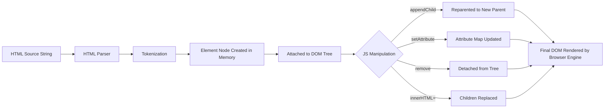
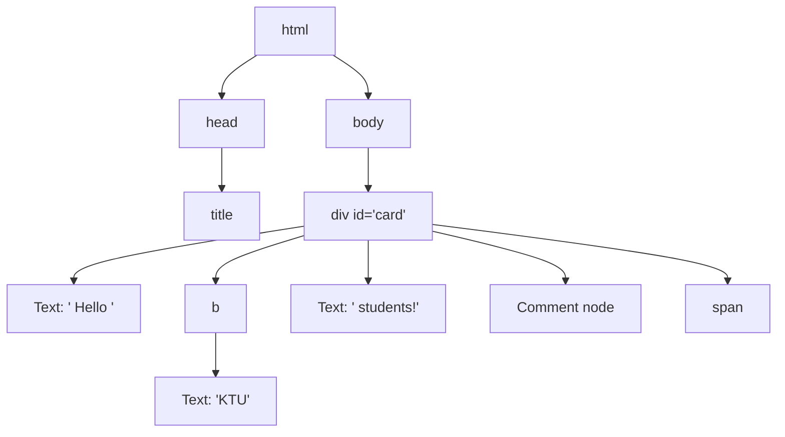

# Element Node Object

<!-- SECTION_1_START -->
# Element Node Object in JavaScript DOM

> [!NOTE]
> **KTU 2024 Scheme | OECST832 Web Programming | Module 2 – Scripting Language**
> This module forms the backbone of *client-side dynamic web development* and is heavily tested in Part A (3 marks) questions of the KTU End Semester Examination (ESE).

## 1.1 Formal Academic Definition

In the **Document Object Model (DOM)**, every HTML tag in a web page is represented in memory as a **Node** of type `1`, which is technically called an **Element Node Object** (or simply an *Element*). According to the **W3C DOM Level-3 specification**, an Element node is the structural building block of an XML/HTML document; it represents a single start tag, its attributes, and the set of child nodes (text, other elements, or comments) contained within its opening and closing tags.

The `Element` interface inherits from the more general `Node` interface, which means every Element Node also possesses all the traversal and manipulation properties of a generic Node, **plus** element-specific capabilities such as attribute management, tag name retrieval, and CSS class toggling.

> [!IMPORTANT]
> **Node Type Constant for Element**: `nodeType === 1`
> The other common node types are: `1` (ELEMENT_NODE), `2` (ATTRIBUTE_NODE), `3` (TEXT_NODE), `8` (COMMENT_NODE), `9` (DOCUMENT_NODE), `10` (DOCUMENT_TYPE_NODE), and `11` (DOCUMENT_FRAGMENT_NODE).

## 1.2 Conceptual Analogy – "The Labelled Box" 🎁

Imagine a webpage as a **Russian nesting doll (Matryoshka)**. Each doll represents an **Element Node**:
- The **outer doll** = a container element like `<div>` or `<body>`
- The **inner dolls** = nested child elements like `<p>`, `<span>`, or ``
- The **stickers on each doll** = attributes such as `id`, `class`, `href`, or `src`
- The **paint inside the doll** = the text content (`textContent`)

When a JavaScript engine reads your HTML, it converts every tag into such a "labelled box" object that you can open, repaint, add stickers to, remove stickers from, insert new boxes into, or even delete entirely – all without reloading the page. This is the essence of **DOM scripting**.

## 1.3 Real-World Utility

Element Node manipulation is what powers:
- **Single Page Applications (SPAs)** built with React, Angular, or Vue (they all eventually diff against the real DOM)
- **Form validation** in real-time (e.g., highlighting an empty input)
- **Live search filters** that show/hide `<li>` elements as the user types
- **Dynamic shopping carts** that add/remove `<tr>` rows without a page refresh
- **CSS class toggling** for dark-mode switches, modal pop-ups, and accordion menus

> [!VISUALIZATION CONTROL]
> **Concept:** Visualising the DOM Tree as a hierarchical graph of Element Nodes
> **Recommended Tool:** [https://visualizers.dev/dom-tree-visualizer/](https://visualizers.dev/dom-tree-visualizer/) (paste your HTML and watch the tree form)
> **Visual Description:** The root `<html>` is at the top; its children `<head>` and `<body>` branch out; inside `<body>`, every nested element (div → section → p → span) appears as a connected rectangle. Mouse-hover any rectangle to see its `tagName`, `attributes`, and `childNodes` count.

---

<!-- SECTION_1_END -->

<!-- SECTION_2_START -->
# 2. Deep Theoretical Analysis & KTU High-Yield Reference Sheet

## 2.1 The Inheritance Chain (Why an Element is *more than* a Node)

An Element Node is created in memory by the browser's HTML parser. Its prototype chain is:

```
EventTarget
   └── Node
        └── Element
             └── HTMLElement
                  └── HTMLDivElement  (or HTMLParagraphElement, HTMLInputElement …)
```

Understanding this chain explains **why** every element has methods like `addEventListener()` (from `EventTarget`), `appendChild()` (from `Node`), and `getAttribute()` (from `Element`).

## 2.2 Element Node – Property Categories

| Category | Properties | Purpose |
|---|---|---|
| **Identity** | `tagName`, `id`, `nodeName`, `nodeType` | Identifies the kind of element |
| **Content** | `innerHTML`, `outerHTML`, `textContent`, `innerText` | Reads/writes raw HTML or text |
| **Attribute Access** | `attributes`, `hasAttribute()`, `getAttributeNames()` | Full attribute map |
| **Hierarchy** | `parentNode`, `parentElement`, `children`, `childNodes`, `firstChild`, `lastChild`, `nextSibling`, `previousSibling` | Tree navigation |
| **Class & Style** | `className`, `classList`, `style` | CSS manipulation |
| **Layout** | `clientHeight`, `offsetWidth`, `scrollTop`, `getBoundingClientRect()` | Geometry & viewport |
| **Custom Data** | `dataset` (HTML5 `data-*` attributes) | Storing custom state |

> [!TIP]
> **`children` vs `childNodes`** is a classic KTU question. `children` returns only **Element** nodes (HTMLCollection), while `childNodes` returns **all** node types including text and comment nodes (NodeList).

## 2.3 Element Node – Method Categories

| Category | Methods | KTU Use-Case |
|---|---|---|
| **Attribute Manipulation** | `getAttribute(name)`, `setAttribute(name, value)`, `removeAttribute(name)`, `toggleAttribute(name)` | Changing image `src`, link `href` |
| **Class Manipulation** | `classList.add()`, `remove()`, `toggle()`, `contains()`, `replace()` | Toggling active state |
| **DOM Insertion (Modern)** | `prepend()`, `append()`, `before()`, `after()`, `replaceWith()`, `insertAdjacentHTML()` | Building lists/cards |
| **DOM Insertion (Legacy)** | `appendChild()`, `insertBefore()`, `removeChild()`, `replaceChild()` | Older KTU syllabus exercises |
| **Search (Rooted at element)** | `querySelector(sel)`, `querySelectorAll(sel)`, `getElementsByTagName()`, `getElementsByClassName()` | Finding children |
| **Cloning & Matching** | `cloneNode(deep)`, `matches(sel)`, `closest(sel)` | Templates, event delegation |
| **Scroll** | `scrollIntoView()`, `scrollTo()` | Smooth navigation |

## 2.4 The Core Difference – `innerHTML` vs `textContent`

This is the **single most-asked concept** in KTU exams on this topic.

$$
\text{innerHTML} = \text{Raw HTML string} \;\;\cup\;\; \text{parses child elements}
$$

$$
\text{textContent} = \text{Concatenation of all Text node values} \;\;\cup\;\; \text{no HTML parsing}
$$

> [!WARNING]
> **Security Pitfall (XSS):** Never assign user-supplied data to `innerHTML`. A malicious user entering `` would execute arbitrary JavaScript. Always prefer `textContent` for user data.

## 2.5 Real-World Engineering Utility

| Domain | Practical Use |
|---|---|
| **Frontend Frameworks** | React's Virtual DOM eventually calls `appendChild`/`removeChild` on real Element nodes |
| **Web Scraping** | Puppeteer/Playwright exposes the Element Node API to read `textContent` from scraped pages |
| **Accessibility (a11y)** | Toggling ARIA attributes via `setAttribute('aria-expanded', 'true')` |
| **Performance** | `DocumentFragment` (a special Element-like node) batches DOM changes to avoid layout thrash |

---

<!-- SECTION_2_END -->

<!-- SECTION_3_START -->
# 3. Step-by-Step Code Implementation & Logical Walkthroughs

## 3.1 Demonstration 1 – Reading Every Property of an Element Node

**HTML Skeleton used in every example below:**

```html
<!DOCTYPE html>
<html>
  <body>
    <div id="card" class="panel" data-user="admin" style="color: red;">
      Hello <b>KTU</b> students!
      <!-- this is a comment -->
    </div>
  </body>
</html>
```

**Full, runnable JavaScript with exhaustive logging:**

```javascript
// Step 1: Grab the element node using its unique id
const el = document.getElementById("card");

// Step 2: Verify we actually have an Element node (nodeType must be 1)
if (el === null) {
    console.error("FATAL: No element with id='card' found in the DOM.");
} else if (el.nodeType !== Node.ELEMENT_NODE) {
    console.error("FATAL: The node is not an Element node.");
} else {
    console.log("✔ Element node located successfully.");
}

// Step 3: Identity properties
console.log("tagName        :", el.tagName);          // "DIV"
console.log("nodeName       :", el.nodeName);         // "DIV"
console.log("nodeType       :", el.nodeType);         // 1
console.log("id             :", el.id);               // "card"
console.log("className      :", el.className);        // "panel"

// Step 4: Content properties
console.log("innerHTML      :", el.innerHTML);
// "Hello <b>KTU</b> students!\n      "
console.log("textContent    :", el.textContent);
// "Hello KTU students!"
console.log("outerHTML      :", el.outerHTML);
// entire <div>…</div> string

// Step 5: Attribute inspection
console.log("attributes     :", el.attributes);          // NamedNodeMap of 4
console.log("hasAttribute   :", el.hasAttribute("id")); // true
console.log("getAttribute   :", el.getAttribute("data-user")); // "admin"

// Step 6: dataset (HTML5 custom attributes)
console.log("dataset.user   :", el.dataset.user);        // "admin"

// Step 7: Hierarchy walk
console.log("parentNode     :", el.parentNode.nodeName); // "BODY"
console.log("children count :", el.children.length);     // 1  (only the <b>)
console.log("childNodes ct  :", el.childNodes.length);   // 3  (text, <b>, comment)

// Step 8: Geometry
const box = el.getBoundingClientRect();
console.log("BoundingBox    :", box.width, "x", box.height);
```

> [!IMPORTANT]
> **Why `children.length === 1` but `childNodes.length === 3`?**
> The whitespace text node between `<div>` and `<b>` and the comment node are *Nodes* but **not** *Elements*. This single observation is worth 3 marks in a typical KTU Part-A question.

---

## 3.2 Demonstration 2 – Attribute Manipulation (Full CRUD)

```javascript
// CREATE / UPDATE
el.setAttribute("title", "Hover tooltip");
el.setAttribute("data-role", "primary-card");

// READ
console.log(el.getAttribute("title")); // "Hover tooltip"

// TOGGLE (modern API)
el.toggleAttribute("hidden");   // adds it
el.toggleAttribute("hidden");   // removes it again

// DELETE
el.removeAttribute("style");

// VERIFY using attributes collection
for (const attr of el.attributes) {
    console.log(`${attr.name} = ${attr.value}`);
}
```

**Expected Console Output (after the operations):**
```
id = card
class = panel
data-user = admin
title = Hover tooltip
data-role = primary-card
```

---

## 3.3 Demonstration 3 – classList Magic

```javascript
const btn = document.createElement("button");
btn.textContent = "Click me";

btn.classList.add("btn", "btn-primary");
btn.classList.remove("btn-primary");
btn.classList.toggle("active");        // adds (didn't exist)
btn.classList.toggle("active");        // removes
console.log(btn.classList.contains("btn")); // true
btn.classList.replace("btn", "button");
```

**Step-by-step trace of `classList` after each line:**

| Line Executed | classList String | Internally Stored |
|---|---|---|
| `add("btn", "btn-primary")` | `"btn btn-primary"` | DOMTokenList of length 2 |
| `remove("btn-primary")` | `"btn"` | DOMTokenList of length 1 |
| `toggle("active")` | `"btn active"` | length 2 |
| `toggle("active")` | `"btn"` | length 1 |
| `replace("btn","button")` | `"button"` | length 1 |

---

## 3.4 Demonstration 4 – DOM Insertion & Removal (Modern API)

```javascript
// Build a brand-new <li> element from scratch
const li = document.createElement("li");
li.id = "task-1";
li.className = "task";
li.textContent = "Read KTU Module 2 notes";

// Insert it into an existing <ul>
const list = document.querySelector("ul.tasks");
if (list) {
    list.append(li);                  // adds at the end
    list.prepend(li.cloneNode(true)); // clone + insert at start

    // Replace the second item
    const second = list.children[1];
    if (second) {
        const newItem = document.createElement("li");
        newItem.textContent = "Watch DOM visualiser";
        second.replaceWith(newItem);
    }

    // Remove the last item
    list.lastElementChild?.remove();
}
```

**Logical Walk-through:**

1. `createElement("li")` creates an **orphan** element node (it has no `parentNode`).
2. `append()` re-parents the node into `list`, automatically removing it from any previous parent.
3. `cloneNode(true)` performs a **deep clone** – the new node is fully independent, so changes to the clone do not affect the original.
4. `replaceWith()` atomically swaps the old node with the new node in a single reflow.
5. `lastElementChild?.remove()` uses the **optional-chaining operator** to guard against a missing child.

---

## 3.5 Demonstration 5 – `matches` & `closest` for Event Delegation

```javascript
// Click anywhere on the document
document.addEventListener("click", (event) => {
    const clicked = event.target;                 // could be text, element, etc.

    // Did the user click a <button> or one of its descendants?
    if (clicked instanceof Element && clicked.matches("button.delete")) {
        // Walk up the tree to find the closest <li> to remove
        const li = clicked.closest("li");
        li?.remove();
        console.log("Removed:", li?.textContent);
    }
});
```

**Why this pattern is industry-standard:**
- A single listener on `<body>` handles clicks on *every* current and future button.
- This avoids attaching hundreds of listeners and prevents **memory leaks** common with SPA route changes.

---

## 3.6 Demonstration 6 – `insertAdjacentHTML` Positions

The four insertion positions are visualised below:

| Position String | Where it inserts |
|---|---|
| `"beforebegin"` | Immediately **before** the element (sibling) |
| `"afterbegin"`  | As the **first child** inside the element |
| `"beforeend"`   | As the **last child** inside the element |
| `"afterend"`    | Immediately **after** the element (sibling) |

```javascript
const host = document.getElementById("card");
host.insertAdjacentHTML("beforeend", "<em> – Module 2</em>");
```

---

<!-- SECTION_3_END -->

<!-- SECTION_4_START -->
# 4. Structural Diagrams & Schematics

## 4.1 Mermaid Diagram – The Element Node Property/Method Universe

```mermaid
graph TD
    A[Element Node Object] --> B[Identity]
    A --> C[Content]
    A --> D[Attributes]
    A --> E[Hierarchy]
    A --> F[Classes & Style]
    A --> G[Geometry]
    A --> H[DOM Manipulation]

    B --> B1[tagName]
    B --> B2[id]
    B --> B3[nodeType]
    B --> B4[nodeName]

    C --> C1[innerHTML]
    C --> C2[outerHTML]
    C --> C3[textContent]
    C --> C4[innerText]

    D --> D1[getAttribute]
    D --> D2[setAttribute]
    D --> D3[removeAttribute]
    D --> D4[toggleAttribute]
    D --> D5[hasAttribute]
    D --> D6[attributes map]

    E --> E1[parentNode]
    E --> E2[children]
    E --> E3[childNodes]
    E --> E4[firstElementChild]
    E --> E5[nextElementSibling]

    F --> F1[className]
    F --> F2[classList]
    F --> F3[style]
    F --> F4[dataset]

    G --> G1[clientWidth]
    G --> G2[getBoundingClientRect]

    H --> H1[append]
    H --> H2[prepend]
    H --> H3[before]
    H --> H4[after]
    H --> H5[replaceWith]
    H --> H6[remove]
    H --> H7[cloneNode]
```



## 4.2 Mermaid Diagram – Lifecycle of an Element Node



## 4.3 Block Diagram – DOM Tree Visualisation



> [!NOTE]
> Notice that the DOM tree diagram above contains **rectangular nodes for elements** and **rounded nodes for text/comments**. The Element Node API only fully applies to the rectangular ones.

---

<!-- SECTION_4_END -->

<!-- SECTION_5_START -->
# 5. KTU 2024 Scheme Examination Question Bank & Topic Recap

## 5.1 Part A – Short Answer Questions (3 Marks Each)

---

### Question A1
**[KTU University Exam – July 2023 | CO1 | Remember]**
Differentiate between the properties `innerHTML` and `textContent` of a DOM Element node. Which one is safer when displaying user input and why?

**Model Answer (3 Marks – Valuation Key):**

| Step | Marks | Key Point |
|---|---|---|
| 1 | 1 | `innerHTML` returns/sets the **HTML markup string** including child elements; `textContent` returns/sets **plain text only**, ignoring HTML tags. |
| 2 | 1 | Example: For `<p>Hi <b>Bob</b></p>`, `innerHTML` = `"Hi <b>Bob</b>"` whereas `textContent` = `"Hi Bob"`. |
| 3 | 1 | `textContent` is safer for user input because it does not parse HTML, thereby preventing **Cross-Site Scripting (XSS)** attacks. |

> [!WARNING]
> **Examiner's Pitfall Warning:** Do **not** write "innerHTML is slow" – that is not the security reason. The examiner expects the XSS mention for full marks.

---

### Question A2
**[KTU University Exam – Dec 2023 | CO2 | Understand]**
Explain the difference between `children` and `childNodes` properties of an Element node with a suitable example.

**Model Answer (3 Marks – Valuation Key):**

- **`childNodes`** – Returns a live `NodeList` containing **all** child nodes, i.e., Element nodes, Text nodes (including whitespace), and Comment nodes. *Length includes every node type.*
- **`children`** – Returns a live `HTMLCollection` containing **only** Element node children; whitespace text nodes and comments are excluded.
- **Example:** For `<ul><li>A</li><li>B</li></ul>`, the `<ul>` has `children.length = 2` and `childNodes.length = 2` *only if there is no whitespace between tags*; with indentation, `childNodes.length` becomes higher.

---

## 5.2 Part B – Long Answer Questions (14 Marks, Internal Choice)

---

### Question B1 – Option (A)
**[KTU University Exam – July 2024 | CO2 | Apply + Analyse | 14 Marks]**

**(a)** [7 Marks] List and explain any **five** element-specific properties of a DOM Element node with one-line examples.

**(b)** [7 Marks] Write a JavaScript function `highlightActiveMenu(itemId)` that finds the element with the given id, removes the `active` class from all `<li>` elements of its parent `<ul>`, and adds the `active` class only to the matched element. Show the final HTML structure after execution given the input markup.

---

### Model Solution for B1(A)

| # | Property | Explanation | Example |
|---|---|---|---|
| 1 | `tagName` | Returns the **uppercase** tag name of the element | `el.tagName // "DIV"` |
| 2 | `innerHTML` | Gets or sets the HTML content of an element (parses tags) | `el.innerHTML = "<b>New</b>"` |
| 3 | `textContent` | Gets or sets only the textual content, ignoring tags | `el.textContent` → `"New"` |
| 4 | `id` | Gets or sets the unique identifier attribute | `el.id = "header"` |
| 5 | `classList` | Returns a live `DOMTokenList` for adding/removing/toggling classes | `el.classList.toggle("hidden")` |
| 6 | `children` | Live `HTMLCollection` of **element** children only | `el.children.length` |
| 7 | `dataset` | Object that exposes all `data-*` attributes as camelCase keys | `el.dataset.userId // "42"` |

**[Award 1 mark per correct property+example, max 5; correct header: 2 marks]**

---

### Model Solution for B1(B) – Step-by-Step

**Initial HTML:**
```html
<ul id="nav">
    <li id="home">Home</li>
    <li id="about">About</li>
    <li id="contact" class="active">Contact</li>
</ul>
```

**JavaScript Function:**
```javascript
function highlightActiveMenu(itemId) {
    // 1. Locate the clicked item and its parent <ul>
    const item = document.getElementById(itemId);
    if (!item) {
        console.error(`No element with id='${itemId}' found.`);
        return;
    }
    const list = item.parentElement;
    if (!list || list.tagName !== "UL") {
        console.error("Parent is not a <ul>.");
        return;
    }

    // 2. Remove 'active' class from every <li> sibling
    for (const li of list.children) {
        li.classList.remove("active");
    }

    // 3. Add 'active' only to the matched element
    item.classList.add("active");
}

// Demo call:
highlightActiveMenu("about");
```

**Final HTML after the call:**
```html
<ul id="nav">
    <li id="home">Home</li>
    <li id="about" class="active">About</li>
    <li id="contact">Contact</li>
</ul>
```

**Valuation Key Distribution (7 Marks):**

| Step | Marks | Reason |
|---|---|---|
| Correctly obtaining the item by id | 1 | Core lookup |
| Validation/null check | 1 | Defensive programming |
| Looping over siblings with `children` | 1 | Demonstrates hierarchy understanding |
| Removing `active` class | 1 | Correct class manipulation |
| Adding `active` to the target | 1 | Completion of logic |
| Final HTML output | 1 | Proof of working logic |
| Proper indentation and comments | 1 | Code quality |

> [!WARNING]
> **Common Pitfall:** Using `childNodes` instead of `children` will iterate over text/whitespace nodes and throw `TypeError: li.classList is undefined`. Examiners **deduct 1 mark** for this.

---

### Question B1 – Option (B)
**[KTU University Exam – Dec 2024 | CO3 | Apply | 14 Marks]**

**(a)** [7 Marks] With a neat diagram, explain the **DOM tree** representation of the following HTML and identify the `nodeType` of each node.
```html
<div id="box">
    <p>Hello</p>
    <span>World</span>
</div>
```

**(b)** [7 Marks] Write JavaScript code using only Element Node methods (no `innerHTML`) to **create a new `<li>` element with text "Module 2" and class "topic"**, and insert it as the **first child** of an existing `<ul id="topics">`. Show the final DOM state.

---

### Model Solution for B1-Option-B (a)

```
nodeType 1 (ELEMENT_NODE)
├── html               [1]
│   ├── head           [1]
│   └── body           [1]
│       └── div#box    [1]
│           ├── Text: "\n    "   [3]   ← text node
│           ├── p                [1]
│           │   └── Text: "Hello"  [3]
│           ├── Text: "\n    "   [3]
│           ├── span             [1]
│           │   └── Text: "World"  [3]
│           └── Text: "\n"        [3]
```

**Key points to mention:**
- `document` is `nodeType 9` (DOCUMENT_NODE).
- `Element` nodes have `nodeType === 1`.
- `Text` nodes (whitespace and words) have `nodeType === 3`.
- Each Element node can have multiple child nodes of varying types.

**[Marks: Tree diagram 3, nodeType values 2, Explanation 2 = 7]**

---

### Model Solution for B1-Option-B (b)

```javascript
// 1. Locate the parent list
const list = document.getElementById("topics");
if (!list) {
    throw new Error("Element with id='topics' not found.");
}

// 2. Create the new <li> Element node (orphan – no parent yet)
const newItem = document.createElement("li");

// 3. Set its text using textContent (safe – no HTML parsing)
newItem.textContent = "Module 2";

// 4. Add the CSS class
newItem.classList.add("topic");

// 5. Insert as the FIRST child of the list
list.prepend(newItem);
```

**Final DOM State:**
```html
<ul id="topics">
    <li class="topic">Module 2</li>
    <!-- (any previously existing <li> elements follow here) -->
</ul>
```

**Valuation Key (7 Marks):**

| Step | Marks |
|---|---|
| `getElementById` lookup | 1 |
| `createElement` call | 1 |
| `textContent` assignment (NOT `innerHTML`) | 2 |
| `classList.add` usage | 1 |
| Correct insertion method (`prepend` or `insertBefore`) | 1 |
| Final DOM state | 1 |

> [!WARNING]
> **Examiner's Pitfall:** Using `innerHTML = "<li>…</li>"` violates the question's constraint ("no innerHTML"). Examiner will award **0 marks for the entire creation step** even if the rest is correct.

---

## 5.3 Topic Recap & Important Things to Remember

> [!IMPORTANT]
> **Rapid-Revision Checklist – Element Node Object**

- ✅ An **Element Node** is a `Node` with `nodeType === 1` and represents an HTML/XML tag.
- ✅ `Element` extends `Node`; it has **all** Node methods **plus** element-specific ones.
- ✅ `innerHTML` parses HTML and is vulnerable to **XSS**; `textContent` is the safe choice.
- ✅ `children` → only Element nodes (HTMLCollection). `childNodes` → all node types (NodeList).
- ✅ Whitespace between tags **is a text node** – this trips up `childNodes.length` calculations.
- ✅ `getAttribute` / `setAttribute` operate on the *string* attribute map; `el.id` and `el.className` are reflected properties.
- ✅ `classList` methods (`add`, `remove`, `toggle`, `contains`, `replace`) are the modern, preferred way to manipulate classes.
- ✅ `dataset.foo` reads/writes the `data-foo` HTML attribute automatically.
- ✅ `createElement()` makes an **orphan** node – it has no parent until inserted.
- ✅ `append`, `prepend`, `before`, `after`, `replaceWith`, `remove` are the **modern insertion API**; `appendChild`/`insertBefore` are legacy but still tested.
- ✅ `cloneNode(true)` deep-clones a node; `cloneNode(false)` shallow-clones (element only, no children).
- ✅ `matches(selector)` checks if the element matches a CSS selector; `closest(selector)` walks up to find the nearest ancestor matching.
- ✅ For security and performance, **batch DOM changes inside a `DocumentFragment`** before a single `appendChild`.
- ✅ `nodeName` and `tagName` are functionally identical for HTML elements; for XML they may differ in case.
- ✅ The `Element` interface does **not** define event methods – those come from `EventTarget` (the root of the chain).

---

<!-- SECTION_5_END -->
