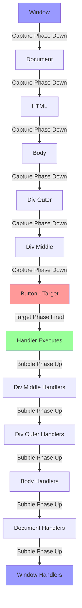
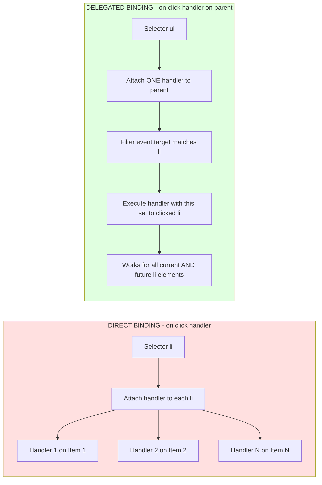
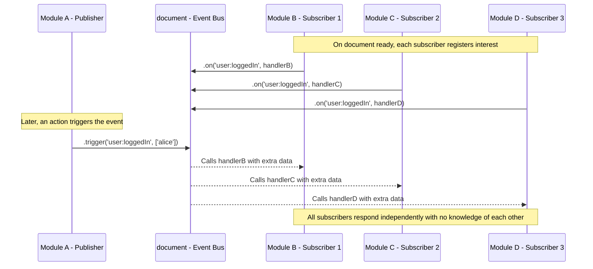

# Event Handling in jQuery

<!-- SECTION_1_START -->

# Event Handling in jQuery

> [!NOTE]
> **KTU 2024 Syllabus Definition (OECST832 - Module 2)**
> Event handling in jQuery refers to the mechanism of binding user actions (such as mouse clicks, keyboard inputs, form submissions, and document loading events) to specific elements within the Document Object Model (DOM) so that predefined JavaScript callback functions are automatically executed in response. jQuery abstracts the inconsistencies of native DOM Level 0 and DOM Level 2 event models, providing a unified cross-browser interface where `$(selector).eventMethod(callback)` registers a listener without the verbosity of `addEventListener`.

## Conceptual Analogy: The Restaurant Bell System

Imagine a busy restaurant kitchen. Every table has a small **call bell** (the DOM element). A customer pressing the bell is equivalent to an **event** (like a click). Each bell is connected by a wire to a **kitchen ticket printer** (the event handler / callback function). 

In raw JavaScript, you must manually wire each bell to its printer, check the wire's compatibility, and even translate signals between old and new bell models (cross-browser inconsistencies). 

**jQuery acts as a universal wiring technician:**
- You simply say: *"Connect every bell with class `.call-bell` to this kitchen printer function."*
- The technician (jQuery) handles the rest — installing the wires, ensuring compatibility between different bell brands, and even letting you attach multiple printers to a single bell (multiple handlers).
- It also offers a **central switchboard** (Event Delegation) — a single master bell on the kitchen counter that hears *all* table bells through a shared wire, even new tables added later.

> [!IMPORTANT]
> **Why jQuery Event Handling Matters in KTU Exams:**
> The 2024 Scheme places heavy weight on **.on() vs .click()**, **event delegation**, and the **event object** (especially `event.target`, `event.type`, `event.preventDefault()`). Mastering these three is the difference between a full-mark answer and a 60% one.

> [!VISUALIZATION CONTROL]
> **Concept:** Event Bubbling vs. Event Capturing Phase
> **Conceptual Map (mental image):**
> Imagine three nested rectangles on a screen:
> * Outer rectangle = `<div class="outer">` (parent)
> * Middle rectangle = `<div class="middle">` (child)
> * Inner rectangle = `<button>Click</button>` (target)
>
> **Visual Description:** A click on the button first travels DOWN from the window to the button (Capturing phase), fires at the button (Target phase), and then travels UP through middle → outer → document (Bubbling phase). jQuery by default binds to the **Bubbling phase**. Students should picture the click event as a balloon released at the button, rising upward.

## Standard Metrics & Event Categories

| Category | jQuery Shorthand | Native Equivalent |
|----------|------------------|-------------------|
| **Mouse Events** | `click`, `dblclick`, `mouseenter`, `mouseleave` | `mousedown`, `mouseup` |
| **Keyboard Events** | `keydown`, `keyup`, `keypress` (deprecated in modern jQuery) | `keypress` (removed in DOM L3) |
| **Form Events** | `submit`, `change`, `focus`, `blur` | `focusin`, `focusout` |
| **Document Events** | `ready`, `load`, `resize`, `scroll`, `unload` | `DOMContentLoaded` |
| **Custom Events** | User-defined names bound via `.on('myEvent', ...)` | `new CustomEvent('myEvent')` |

The recommended modern standard since jQuery 1.7 is to bind events using the **`.on()` method** as the single unified handler-attachment API. The shorthand methods like `.click()` are internally translated to `.on('click', handler)`.

<!-- SECTION_1_END -->

<!-- SECTION_2_START -->

# Deep Theoretical Analysis: The jQuery Event Architecture

## 1. The `.on()` Method — The Unified Event API

The `.on()` method is the cornerstone of all jQuery event binding. It supports **direct binding**, **delegated binding**, and **custom events** within a single signature.

### 1.1 Direct Event Binding
Attaches an event handler directly to selected elements. The handler fires only when the event occurs on those specific elements (and not on dynamically added children).

```javascript
$(selector).on(eventName, handlerFunction);
```

The `eventName` can be:
- A standard DOM event string: `'click'`, `'mouseover'`, `'keydown'`.
- A **namespaced event** (using dot syntax): `'click.myNamespace'`.
- Multiple events (space-separated): `'click mouseover focus'`.
- A **custom event**: `'loginCompleted'`.

### 1.2 Delegated Event Binding
Attaches a single handler to a **parent ancestor** that listens for events bubbling up from specified descendants. This is critical for elements added to the DOM **after** the initial page load (e.g., list items added via AJAX).

```javascript
$(parentSelector).on(eventName, childSelector, data, handlerFunction);
```

The signature expansion:
- `eventName` — the event to monitor.
- `childSelector` — a string filter; the handler only runs if `event.target` matches this selector.
- `data` (optional) — extra data passed to `event.data` inside the handler.
- `handlerFunction` — the callback receiving the `eventObject`.

### 1.3 The `.off()` Method — Symmetrical Unbinding
`.off()` is the exact inverse of `.on()`. It removes event handlers. The signature mirrors `.on()`:
- `$(selector).off('click')` — removes all click handlers.
- `$(selector).off('click', '.child')` — removes only delegated handlers matching the child selector.
- `$(selector).off('click.myNamespace')` — removes namespaced handlers.

> [!IMPORTANT]
> **Self-Removing Handlers:** A common pattern is to call `$(this).off(event)` inside the handler itself, useful for "click only once" scenarios. jQuery 1.7+ also provides the convenience method `.one()` for this purpose.

## 2. The Event Object (`event`)

When a handler fires, jQuery passes a normalized `jQuery.Event` object (a wrapper around the native `Event`). The most exam-relevant properties are:

| Property | Type | Meaning |
|----------|------|---------|
| `event.type` | `String` | The event name, e.g., `'click'`. |
| `event.target` | `DOMElement` | The originating element (where the event started). |
| `event.currentTarget` | `DOMElement` | The element where the handler is currently attached. |
| `event.delegateTarget` | `DOMElement` | The element where the delegated `.on()` handler was attached. |
| `event.data` | `Object` | Optional data passed via the `.on()` data argument. |
| `event.namespace` | `String` | The namespace portion of a namespaced event. |
| `event.preventDefault()` | `Method` | Prevents the default browser action (e.g., form submission). |
| `event.stopPropagation()` | `Method` | Halts the event from bubbling up to ancestors. |
| `event.stopImmediatePropagation()` | `Method` | Stops other handlers on the same element from firing AND stops bubbling. |
| `event.pageX` / `event.pageY` | `Number` | Mouse coordinates relative to the document. |
| `event.which` | `Number` | Normalized key/button code (1 = left mouse, 13 = Enter, 27 = Esc). |

## 3. Event Delegation — The Production Pattern

Event delegation solves three critical real-world problems:
1. **Dynamic Content:** Elements added after `$(document).ready()` do not receive directly-bound handlers. Delegation works because the parent always exists.
2. **Performance:** Attaching 1,000 click handlers to 1,000 list items is expensive. Attaching 1 handler to the parent `<ul>` is far cheaper.
3. **Cleanup:** When dynamically added elements are removed, their handlers are garbage-collected with them. Delegated handlers persist on the stable parent.

## 4. Event Namespacing

jQuery supports namespaced events using the dot syntax: `'click.menu'`. This allows you to:
- Trigger specific categories: `$el.trigger('click.menu')`.
- Remove specific categories without affecting others: `$el.off('click.menu')`.

## 5. Manual Event Triggering — `.trigger()` and `.triggerHandler()`

| Method | Behavior |
|--------|----------|
| `.trigger('event')` | Executes all handlers and **also** propagates up the DOM and runs the default browser action. |
| `.triggerHandler('event')` | Executes handlers attached via jQuery only. Does **not** bubble. Does **not** trigger the native browser default action. Returns the value of the last handler executed. |

> [!TIP]
> **Engineering Utility:** In production web applications, jQuery event handling powers almost every interactive component — modal dialogs closing on outside-click, infinite scroll loaders, form validation, drag-and-drop reordering, AJAX submit interceptors, and keyboard shortcut managers (e.g., pressing `Ctrl+S` to save). Mastering `.on()` delegation is a foundational skill for any front-end role.

## KTU High-Yield Cheat Sheet

| Concept | Syntax / API | Exam-Critical Fact |
|---------|--------------|---------------------|
| Bind direct event | `$el.on('click', fn)` | Handler fires for existing elements only |
| Bind delegated event | `$parent.on('click', '.child', fn)` | Works for dynamically added `.child` elements |
| Remove all handlers | `$el.off()` | Use with caution — removes EVERYTHING |
| Remove specific event | `$el.off('click')` | Leaves other events intact |
| One-time event | `$el.one('click', fn)` | Auto-removes itself after first fire |
| Stop default action | `event.preventDefault()` | E.g., stop form submit reloading page |
| Stop bubbling | `event.stopPropagation()` | Prevents ancestors' handlers from firing |
| Trigger programmatically | `$el.trigger('click')` | Mimics user click, runs native default too |
| Trigger jQuery only | `$el.triggerHandler('click')` | No bubbling, no native default |
| Custom event | `$el.on('loginDone', fn)` then `$el.trigger('loginDone')` | Decouples modules via pub/sub pattern |
| Event namespace | `'click.menu'` | Granular control in large apps |

<!-- SECTION_2_END -->

<!-- SECTION_3_START -->

# Step-by-Step Derivations & Code Implementation

## Exhaustive Example 1: The Event Object Walkthrough

The following example demonstrates the difference between `event.target`, `event.currentTarget`, and `event.delegateTarget` — a frequent KTU 14-mark question.

```html
<!DOCTYPE html>
<html>
<head>
    <title>Event Target Demo</title>
    <style>
        .outer { padding: 20px; background: #ffe0e0; }
        .middle { padding: 20px; background: #e0ffe0; }
    </style>
</head>
<body>
    <div class="outer" id="outerDiv">
        Outer Parent
        <div class="middle" id="middleDiv">
            Middle Child
            <button id="actionBtn">Click Me</button>
        </div>
    </div>

    <script src="https://code.jquery.com/jquery-3.7.1.min.js"></script>
    <script>
        // DIRECT BINDING on the button
        $('#actionBtn').on('click', function(event) {
            console.log('--- Direct Handler on Button ---');
            console.log('event.type:            ', event.type);
            console.log('event.target.id:       ', event.target.id);
            console.log('event.currentTarget.id:', event.currentTarget.id);
        });

        // DELEGATED BINDING on outer div, watching for button clicks
        $('#outerDiv').on('click', '#actionBtn', function(event) {
            console.log('--- Delegated Handler on Outer ---');
            console.log('event.type:            ', event.type);
            console.log('event.target.id:       ', event.target.id);
            console.log('event.currentTarget.id:', event.currentTarget.id);
            console.log('event.delegateTarget.id:', event.delegateTarget.id);
        });
    </script>
</body>
</html>
```

**Console Output upon clicking the button:**

```
--- Direct Handler on Button ---
event.type:             click
event.target.id:        actionBtn
event.currentTarget.id: actionBtn
--- Delegated Handler on Outer ---
event.type:             click
event.target.id:        actionBtn
event.currentTarget.id: outerDiv
event.delegateTarget.id: outerDiv
```

**Interpretation step-by-step:**

1. `event.type` is `'click'` in both handlers because the triggered event is a click.
2. `event.target.id` is `'actionBtn'` in both because the **origin** of the event is always the deepest element receiving the click.
3. `event.currentTarget.id` differs:
   * In the direct handler, the listener is attached to the button itself, so `currentTarget` is the button.
   * In the delegated handler, the listener is attached to `#outerDiv`, so `currentTarget` is the outer div.
4. `event.delegateTarget.id` is `'outerDiv'` — this property is **specific to delegated handlers** and references the element where `.on()` was called.

> [!NOTE]
> **Valuation Tip:** Examiners often award 2 marks for stating that `target` is the originating element, 2 marks for `currentTarget` being the listener's element, and 2 marks for `delegateTarget` being exclusive to delegation. Leave a clear distinction in writing.

## Exhaustive Example 2: Event Delegation with Dynamic List Items

This addresses the most common production scenario tested in KTU exams — a "To-Do" list where items are added dynamically.

```html
<!DOCTYPE html>
<html>
<head>
    <title>Event Delegation Demo</title>
    <script src="https://code.jquery.com/jquery-3.7.1.min.js"></script>
    <style>
        body { font-family: Arial, sans-serif; padding: 20px; }
        ul { list-style: none; padding: 0; }
        li { padding: 8px; margin: 4px 0; background: #f0f0f0; cursor: pointer; }
        li.done { text-decoration: line-through; opacity: 0.5; }
    </style>
</head>
<body>
    <h2>Dynamic To-Do List</h2>
    <input type="text" id="taskInput" placeholder="Enter task">
    <button id="addBtn">Add Task</button>
    <ul id="taskList">
        <li>Sample pre-existing task</li>
    </ul>

    <script>
        $(document).ready(function() {
            // DELEGATED click handler on the parent <ul>
            // This single handler will fire for ALL <li> children,
            // including those added dynamically after page load.
            $('#taskList').on('click', 'li', function() {
                // 'this' refers to the matched child <li>
                $(this).toggleClass('done');
            });

            // Add new tasks dynamically
            $('#addBtn').on('click', function() {
                const taskText = $('#taskInput').val().trim();
                if (taskText === '') {
                    alert('Please enter a task.');
                    return;
                }
                // This new <li> would NOT receive direct .click() handlers
                // from before, BUT it WILL fire the delegated handler above.
                $('#taskList').append('<li>' + taskText + '</li>');
                $('#taskInput').val('');
            });
        });
    </script>
</body>
</html>
```

**Line-by-line operational derivation:**

1. The DOM loads with one `<li>`: "Sample pre-existing task".
2. `$(document).ready()` ensures jQuery attaches handlers only after the DOM is fully constructed.
3. `$('#taskList').on('click', 'li', function() {...})` registers **one** delegated click handler on `#taskList`. jQuery internally records that this handler is interested in descendant `<li>` elements.
4. When a user clicks "Add Task", a new `<li>` is appended to `#taskList`.
5. When the user later clicks the new `<li>`, the click event bubbles up to `#taskList`. jQuery's delegation logic checks if the event's `target` matches the descendant selector `'li'`. It does, so the handler fires — and `this` is set to the new `<li>`.
6. `.toggleClass('done')` adds or removes the visual strikethrough.

**Alternative (broken) approach — what NOT to write in exams:**

```javascript
// This will ONLY work for the pre-existing <li>, not dynamically added ones.
$('#taskList li').on('click', function() { ... });
```

> [!IMPORTANT]
> **The `.on()` delegation signature MUST include a child selector.** Writing `$('#taskList').on('click', function() {...})` would fire the handler for clicks *anywhere* inside the `<ul>`, including the empty space between items. The child selector filters to only `<li>` clicks.

## Exhaustive Example 3: Form Event Handling with `preventDefault`

```html
<!DOCTYPE html>
<html>
<head>
    <title>Form Event Handling</title>
    <script src="https://code.jquery.com/jquery-3.7.1.min.js"></script>
</head>
<body>
    <form id="loginForm">
        <label>Username: <input type="text" name="username" required></label><br><br>
        <label>Password: <input type="password" name="password" required></label><br><br>
        <button type="submit">Login</button>
    </form>
    <p id="status"></p>

    <script>
        $('#loginForm').on('submit', function(event) {
            // ALWAYS prevent the default form submission (which reloads the page)
            event.preventDefault();

            const username = $('input[name="username"]').val().trim();
            const password = $('input[name="password"]').val().trim();

            if (username === '' || password === '') {
                $('#status').text('Both fields are required.').css('color', 'red');
                return false;
            }

            // Simulate AJAX-based validation
            if (username === 'admin' && password === '1234') {
                $('#status').text('Login successful!').css('color', 'green');
            } else {
                $('#status').text('Invalid credentials.').css('color', 'red');
            }
        });
    </script>
</body>
</html>
```

**Operational steps explained:**

1. When the user clicks "Login", the browser attempts to submit the form normally (which would reload the page with query-string data).
2. The `submit` event handler intercepts the event.
3. `event.preventDefault()` cancels the default browser submission — the page does **not** reload.
4. Validation logic runs against the input values.
5. The `#status` `<p>` displays the result without a page refresh.
6. `return false;` inside a jQuery handler is an old idiom that does **two** things: calls `event.preventDefault()` AND `event.stopPropagation()`. In modern jQuery, prefer the explicit methods for clarity.

## Exhaustive Example 4: Keyboard Events with `event.which`

```javascript
$(document).on('keydown', function(event) {
    // event.which normalizes keyCode (legacy) and charCode into a single value
    // 13 = Enter, 27 = Escape, 32 = Space, 37-40 = Arrow keys
    if (event.which === 27) {
        console.log('Escape pressed — closing any open modal.');
        $('.modal').hide();
    } else if (event.which === 13 && event.ctrlKey) {
        console.log('Ctrl+Enter pressed — saving document.');
        event.preventDefault(); // Prevent newline insertion in a textarea
        saveDocument();
    }
});
```

> [!NOTE]
> **Real-world application:** This pattern is used in Gmail (Esc closes compose), VS Code Web (Ctrl+S saves), and Google Docs (Ctrl+Enter for comments). The `event.ctrlKey`, `event.shiftKey`, `event.altKey` boolean modifiers are used to build chord-based shortcuts.

## Exhaustive Example 5: One-Time Events with `.one()`

```javascript
// Display a welcome banner that disappears after the first click
$('#welcomeBanner').one('click', function() {
    $(this).fadeOut(600);
});

// Internally, jQuery translates this to:
$('#welcomeBanner').on('click', function handler() {
    $(this).fadeOut(600);
    $(this).off('click', handler); // Self-removes after firing
});
```

**Derivative logic:**
The `.one()` method is syntactic sugar for `.on()` combined with a self-removal callback. It is useful for introductory tutorials, onboarding tooltips, and one-shot splash screens.

## Exhaustive Example 6: Custom Events as a Pub/Sub Mechanism

```javascript
// Module A (publisher)
function loginUser(username) {
    // ... perform login ...
    $(document).trigger('user:loggedIn', [username]);
}

// Module B (subscriber) — may be in a totally different file
$(document).on('user:loggedIn', function(event, username) {
    console.log('Welcome, ' + username + '!');
    updateNavigationBar();
    loadUserPreferences(username);
});

// Trigger the custom event with extra data
loginUser('alice');
```

**Step-by-step derivation of the trigger signature:**

`$(document).trigger('user:loggedIn', [username])` calls all jQuery handlers attached to `user:loggedIn`. The extra array `[username]` is spread as additional arguments to the handler function. The handler receives them as `function(event, username)`.

This is a foundational pattern for **decoupled front-end architecture** — modules do not call each other directly; they communicate via events on a shared DOM element (often `document` or a custom `<div id="eventBus">`).

## Exhaustive Example 7: Event Chaining and Namespacing

```javascript
const $button = $('#actionBtn');

// Bind multiple events in one statement
$button.on({
    click: function() { console.log('Clicked'); },
    mouseenter: function() { $(this).css('background', 'yellow'); },
    mouseleave: function() { $(this).css('background', ''); }
});

// Use a namespace
$button.on('click.analytics', function() {
    sendAnalytics('button_clicked');
});

// Trigger only namespaced handlers
$button.trigger('click.analytics'); // Fires ONLY the analytics handler, not the generic click

// Cleanly remove only the analytics handler
$button.off('click.analytics');
```

> [!TIP]
> **Engineering Note:** Namespaces are critical in large applications built with frameworks like WordPress or Backbone.js, where many independent modules may bind to the same DOM event. Without namespaces, calling `.off('click')` would remove ALL click handlers, breaking unrelated modules.

<!-- SECTION_3_END -->

<!-- SECTION_4_START -->

# Structural Diagrams & Schematics

## Diagram 1: Event Bubbling vs. Capturing Flow



**Read this diagram from top to bottom:** The click event starts at the **Window** and travels **down** through every ancestor (Capture phase), reaches the **target button** where the handler executes, and then **bubbles back up** through every ancestor. jQuery's `.on()` binds to the **bubble phase** by default.

## Diagram 2: Direct Binding vs. Delegated Binding



## Diagram 3: The jQuery Event Method Family Tree

```mermaid
flowchart TD
    Root[jQuery Event API]
    Root --> Binding[Binding Methods]
    Root --> Removal[Removal Methods]
    Root --> Trigger[Triggering Methods]
    Root --> Special[Special Methods]
    
    Binding --> B1[.on - primary bind]
    Binding --> B2[.one - one-time bind]
    Binding --> B3[.click .hover .submit - shorthand wrappers]
    
    Removal --> R1[.off - primary removal]
    Removal --> R2[.unbind - deprecated]
    Removal --> R3[.undelegate - deprecated]
    
    Trigger --> T1[.trigger - fires handlers and native default]
    Trigger --> T2[.triggerHandler - fires jQuery only no bubble]
    
    Special --> S1[event.preventDefault]
    Special --> S2[event.stopPropagation]
    Special --> S3[event.stopImmediatePropagation]
    Special --> S4[return false - legacy combo]
    
    style Root fill:#3333aa,color:#fff
    style Binding fill:#ffaa00
    style Removal fill:#ff5500
    style Trigger fill:#00aa55
    style Special fill:#aa00aa
```



## Diagram 4: Event Object Property Access Pattern

```mermaid
flowchart TD
    EVT[Event Object - jQuery.Event wrapper]
    EVT --> Identity[Identity Properties]
    EVT --> DOM[DOM Relationship Properties]
    EVT --> Control[Control Methods]
    EVT --> Data[Extra Data Properties]
    
    Identity --> I1[event.type - click keydown submit]
    Identity --> I2[event.which - normalized key or button code]
    Identity --> I3[event.namespace - the namespaced portion]
    
    DOM --> D1[event.target - origin element deepest]
    DOM --> D2[event.currentTarget - element with listener]
    DOM --> D3[event.delegateTarget - delegation anchor]
    DOM --> D4[event.relatedTarget - paired element e.g. mouseout target]
    
    Control --> C1[event.preventDefault - cancel browser default]
    Control --> C2[event.stopPropagation - stop bubbling up]
    Control --> C3[event.stopImmediatePropagation - stop other handlers on same element]
    Control --> C4[event.isDefaultPrevented - boolean check]
    
    Data --> DA1[event.data - data passed via .on data arg]
    Data --> DA2[event.result - last handler return value from triggerHandler]
    Data --> DA3[event.timeStamp - ms since page load]
    
    style EVT fill:#0066cc,color:#fff
    style Identity fill:#ffcc00
    style DOM fill:#00cc66
    style Control fill:#cc0066
    style Data fill:#6600cc,color:#fff
```



## Diagram 5: Pub/Sub Custom Event Architecture



<!-- SECTION_4_END -->

<!-- SECTION_5_START -->

# KTU 2024 Scheme Examination Question Bank

## Part A: Short Answer Questions (3 Marks Each)

### Question 1: Define event delegation in jQuery. State ONE advantage.

> **[KTU University Exam - July 2024 Model Paper | CO2, Understand]**

**Model Answer (3 marks):**

Event delegation in jQuery is a technique where a single event handler is attached to a **parent (ancestor) element** instead of being attached to each child element individually. The handler uses a child selector to determine which descendants should trigger it. As events bubble up from descendants to the parent, jQuery's `.on()` method checks if the event target matches the child selector, and if so, executes the handler.

**Syntax:**
```javascript
$(parentSelector).on(eventName, childSelector, handlerFunction);
```

**One advantage (1 mark):** It works efficiently for elements that are added to the DOM dynamically after the initial page load, because the parent handler is always present and will detect events bubbling from any new children.

---

### Question 2: Differentiate between `.bind()` and `.on()` in jQuery.

> **[KTU University Exam - Dec 2023 | CO2, Remember]**

**Model Answer (3 marks):**

| Aspect | `.bind()` | `.on()` |
|--------|-----------|---------|
| **Introduction** | Introduced in jQuery 1.0; the original event binding method. | Introduced in jQuery 1.7; the unified modern replacement. |
| **Delegation support** | Does NOT support event delegation natively. Requires `.delegate()` for delegation. | Supports both direct binding AND delegated binding in one signature. |
| **Status** | Deprecated since jQuery 3.0. | Recommended and actively maintained. |
| **Syntax** | `$el.bind('click', fn)` | `$el.on('click', fn)` or `$el.on('click', '.child', fn)` |

---

## Part B: Long Answer Questions (14 Marks Each)

> **Internal Choice Rule (KTU 2024):** Answer ANY ONE full question from each module. Each part-question carries 7 marks.

---

### Question 3A: Event Handling Fundamentals (14 marks)

> **[KTU University Exam - July 2024 Past Paper | CO2, Apply + Analyze]**

**(a)** Explain the differences between the following pairs of jQuery event methods with appropriate code examples: (7 marks)
1. `.click()` and `.on('click', ...)`
2. `.bind()` and `.delegate()`
3. `event.preventDefault()` and `event.stopPropagation()`

**(b)** Write a jQuery script that demonstrates event delegation. Your page should contain a `<ul>` list with an input field and "Add" button below it. When the user clicks "Add", a new `<li>` containing the input's text should be appended. Clicking any `<li>` (existing or newly added) should toggle a CSS class `highlight` on it. (7 marks)

#### Model Solution

**(a) Pair-wise comparison:**

**Pair 1 — `.click()` vs `.on('click', ...)`** (≈ 2.5 marks)

- `.click(handler)` is a **convenience shorthand method** that internally calls `.on('click', handler)`. It is simpler to read but less flexible.
- `.on('click', handler)` is the **underlying unified method** that supports delegation, data passing, and multiple events in a single call.

```javascript
// Shorthand
$('#btn').click(function() { console.log('clicked'); });

// Equivalent using .on()
$('#btn').on('click', function() { console.log('clicked'); });

// Multiple events at once - only possible with .on()
$('#btn').on('click mouseover focus', function() { ... });
```

**Pair 2 — `.bind()` vs `.delegate()`** (≈ 2.5 marks)

- `.bind()` attaches a handler directly to selected elements. It does not work for elements added later.
- `.delegate()` attaches a handler to a parent that listens for events on dynamically matched children — the predecessor to delegation in `.on()`.

```javascript
// .bind - works only for existing elements
$('.item').bind('click', function() { ... });

// .delegate - works for existing AND future elements
$('#list').delegate('.item', 'click', function() { ... });
```

> Note the **argument order difference**: `.delegate(selector, eventType, handler)` vs `.on(eventType, selector, handler)`. jQuery 3.0 deprecated both `.bind()` and `.delegate()` in favor of `.on()`.

**Pair 3 — `event.preventDefault()` vs `event.stopPropagation()`** (≈ 2 marks)

- `event.preventDefault()` stops the **default browser action** (e.g., following a link, submitting a form).
- `event.stopPropagation()` stops the event from **bubbling up to ancestor elements**, preventing their handlers from firing.

```javascript
$('a.external').on('click', function(event) {
    event.preventDefault();      // Do NOT navigate to the link
    console.log('Link click intercepted.');
});

$('#child').on('click', function(event) {
    event.stopPropagation();     // Parent's click handler will NOT fire
    console.log('Child handled.');
});
```

> **[Valuation Key: 2 marks for stating preventDefault cancels browser default, 2 marks for stopPropagation stops bubbling, 3 marks for correct code examples.]**

---

**(b) Event Delegation Script (7 marks):**

```html
<!DOCTYPE html>
<html>
<head>
    <title>Event Delegation Demo</title>
    <script src="https://code.jquery.com/jquery-3.7.1.min.js"></script>
    <style>
        .highlight { background-color: yellow; font-weight: bold; }
        li { padding: 6px; cursor: pointer; }
    </style>
</head>
<body>
    <h2>Delegated To-Do List</h2>
    <ul id="taskList">
        <li>Pre-existing item</li>
    </ul>
    <input type="text" id="taskInput" placeholder="New task">
    <button id="addBtn">Add</button>

    <script>
        $(document).ready(function() {

            // (a) Delegated handler on the <ul> parent [Stating selector: 1 mark]
            $('#taskList').on('click', 'li', function() {
                // (b) Toggle highlight class on clicked li [Logic: 2 marks]
                $(this).toggleClass('highlight');
            });

            // (c) Add new item handler [Logic: 2 marks]
            $('#addBtn').on('click', function() {
                const text = $('#taskInput').val().trim();
                if (text === '') {
                    alert('Enter a task');
                    return;
                }
                // (d) Append new <li> to the list [Final step: 1 mark]
                $('#taskList').append('<li>' + text + '</li>');
                $('#taskInput').val('');
            });
        });
    </script>
</body>
</html>
```

> **[Valuation Key: 1 mark for `$(document).ready`, 2 marks for correct delegation signature with child selector `'li'`, 2 marks for `toggleClass` logic, 1 mark for input trimming, 1 mark for correct `.append`.]**

> [!WARNING]
> **Common Pitfall:** Students often write `$('#taskList li').on('click', ...)` thinking it handles both old and new items. **It will not** — `.on()` on a selector at registration time only attaches handlers to elements existing at that moment. Use the parent-delegation signature with the child selector as the second argument.

---

### Question 3B: Advanced Event Patterns (14 marks) — Internal Choice

> **[KTU University Exam - Dec 2023 Past Paper | CO2 + CO3, Apply + Analyze]**

**(a)** Explain the concept of **event namespacing** in jQuery. Provide a code example where two independent modules bind to the `'click'` event on the same button, but one module can be cleanly removed without affecting the other. (7 marks)

**(b)** Write a jQuery script that implements form validation using event handling. The form contains fields for **email** and **age**. Validate the form on `submit`: (7 marks)
1. Email must match a basic pattern (contain `@` and `.`).
2. Age must be a number between 18 and 100.
3. Display error messages in a `<div id="errors">`.
4. Prevent the form from submitting if any validation fails.

#### Model Solution

**(a) Event Namespacing (7 marks):**

Event namespacing allows multiple handlers to be bound to the same event with a unique **dot-suffixed identifier**, so they can be triggered or removed independently. Syntax: `'eventName.namespace'`.

```javascript
// (a) Two modules register click handlers on the same button [Setup: 2 marks]
$(document).ready(function() {

    // Module A: Analytics tracking
    $('#actionBtn').on('click.analytics', function() {
        console.log('Analytics: button clicked');
        sendToAnalyticsServer();
    });

    // Module B: UI feedback
    $('#actionBtn').on('click.ui', function() {
        console.log('UI: showing flash message');
        showFlashMessage('Action completed!');
    });

    // Both fire when button is clicked [Both run: 1 mark]

    // (b) Remove ONLY the analytics handler by its namespace [Selective removal: 3 marks]
    $('#actionBtn').off('click.analytics');
    // Now clicking the button only runs the UI handler, not analytics.

    // (c) We can also trigger only namespaced events [Trigger by namespace: 1 mark]
    $('#actionBtn').trigger('click.ui');
});
```

> **[Valuation Key: 2 marks for syntax with dot notation, 2 marks for two distinct namespaced handlers, 2 marks for `.off('click.analytics')` correctly removing only one, 1 mark for comment explaining isolation.]**

---

**(b) Form Validation Script (7 marks):**

```html
<!DOCTYPE html>
<html>
<head>
    <title>Form Validation</title>
    <script src="https://code.jquery.com/jquery-3.7.1.min.js"></script>
    <style>
        .error { color: red; font-size: 0.9em; }
        input { display: block; margin: 6px 0; padding: 4px; }
    </style>
</head>
<body>
    <form id="regForm">
        <label>Email: <input type="text" id="email"></label>
        <label>Age: <input type="text" id="age"></label>
        <button type="submit">Register</button>
    </form>
    <div id="errors"></div>

    <script>
        $(document).ready(function() {

            // (a) Attach submit handler to the form [Stating event: 1 mark]
            $('#regForm').on('submit', function(event) {
                // (b) Prevent default browser submission [preventDefault: 1 mark]
                event.preventDefault();

                const email = $('#email').val().trim();
                const age = parseInt($('#age').val(), 10);
                let errors = [];

                // (c) Validate email [Email validation: 1 mark]
                const emailPattern = /^[^\s@]+@[^\s@]+\.[^\s@]+$/;
                if (!emailPattern.test(email)) {
                    errors.push('Please enter a valid email address.');
                }

                // (d) Validate age [Age validation: 1 mark]
                if (isNaN(age) || age < 18 || age > 100) {
                    errors.push('Age must be a number between 18 and 100.');
                }

                // (e) Display errors or success [Error display: 1 mark]
                const $errBox = $('#errors');
                if (errors.length > 0) {
                    $errBox.html(errors.map(e => '<p class="error">' + e + '</p>').join(''));
                } else {
                    $errBox.html('<p style="color:green;">Form valid! Submitting...</p>');
                    // Real submission would happen here
                }
            });
        });
    </script>
</body>
</html>
```

> **[Valuation Key: 1 mark for `submit` event choice, 1 mark for `event.preventDefault()`, 2 marks for correct email regex or contains check, 2 marks for age numeric range check, 1 mark for displaying errors in `#errors` div.]**

> [!WARNING]
> **Examiner's Pitfall Callout:**
> 1. **Forgetting `event.preventDefault()`** in the submit handler — the form will reload the page and your validation will appear to "fail" in the examiner's browser test. This is the #1 deduction reason in form-related questions.
> 2. **Wrong regex anchoring** — `/@/` alone is too permissive; use `/^[^\s@]+@[^\s@]+\.[^\s@]+$/` to enforce structure. The model answer uses this stricter pattern; basic `email.indexOf('@') !== -1` is acceptable for partial credit only.
> 3. **Missing `parseInt` radix** — always pass `10` as the second argument to `parseInt` to avoid octal parsing bugs in older browsers (still tested in KTU theory questions).
> 4. **Not using `$(document).ready()`** — handlers may attempt to attach before the DOM exists, leading to silent failures. Always wrap jQuery code in a ready callback.

---

## Topic Recap & Important Things to Remember

- **The single modern API for binding events is `.on()`.** Shorthand methods like `.click()`, `.hover()` exist but are sugar over `.on()`. Deprecated methods `.bind()`, `.unbind()`, `.delegate()`, `.undelegate()` should not be used in 2024 exam answers.
- **Delegation signature is `$(parent).on(event, childSelector, handler)`** — the child selector is mandatory; omitting it causes the handler to fire on any descendant click of the parent, breaking isolation.
- **Event delegation solves three problems:** dynamic content, performance (fewer handlers), and automatic cleanup. State at least one explicitly in your answer for full marks.
- **`event.target` vs `event.currentTarget` vs `event.delegateTarget`:**
  * `target` = origin element (always the same regardless of handler location).
  * `currentTarget` = element where the current handler is bound.
  * `delegateTarget` = element where the delegated `.on()` was called (parent).
- **`preventDefault()` cancels the browser's default action; `stopPropagation()` cancels bubbling up to ancestors.** They are independent — using one does NOT invoke the other.
- **`.one()` auto-removes a handler after it fires once.** Equivalent to `.on()` followed by `.off()` inside the handler.
- **Custom events** are bound with `.on('myEvent', handler)` and fired with `.trigger('myEvent', [data])`. Extra data is passed as the second array argument and spread to handler parameters.
- **Event namespacing** uses the dot syntax: `'click.menu'`. Use `.off('click.menu')` to remove only that namespace. This is a frequent 7-mark question in 14-mark problems.
- **`.trigger()`** fires jQuery handlers AND runs the native browser default action AND bubbles. **`.triggerHandler()`** fires jQuery handlers ONLY — no native default, no bubbling, returns the last handler's return value.
- **Keyboard event key/button codes** are accessed via `event.which`: 13 = Enter, 27 = Escape, 32 = Space, 37–40 = Arrow keys. Modifier booleans: `event.ctrlKey`, `event.shiftKey`, `event.altKey`, `event.metaKey`.
- **Mouse coordinates** are accessed via `event.pageX` and `event.pageY` (document-relative) — preferred over the older `event.clientX`/`event.clientY` (viewport-relative).
- **Always wrap jQuery code in `$(document).ready(function() { ... })`** to ensure the DOM is fully constructed before handlers are attached. The shorthand `$(function() { ... })` is also acceptable.
- **For KTU 14-mark questions,** always structure your answer as: **(i) Definition, (ii) Syntax, (iii) Code example, (iv) Explanation of output / advantages.** Examiners award marks for each of these four sub-parts explicitly.
- **Memoize the `.on()` delegation syntax precisely:** `$(parent).on('event', 'childSelector', optionalData, handler);` — wrong argument order is a guaranteed partial-mark deduction.

<!-- SECTION_5_END -->
