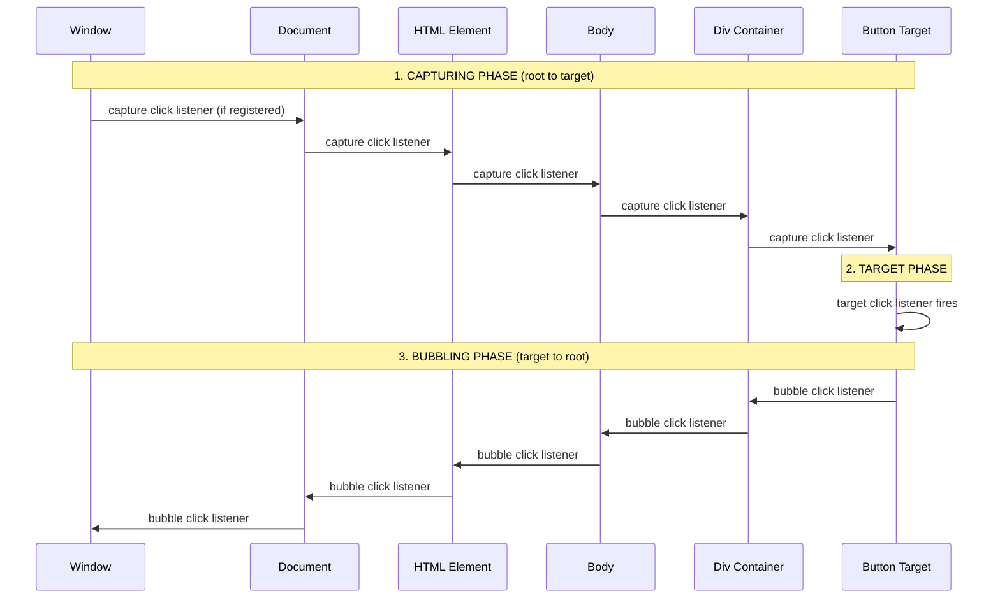
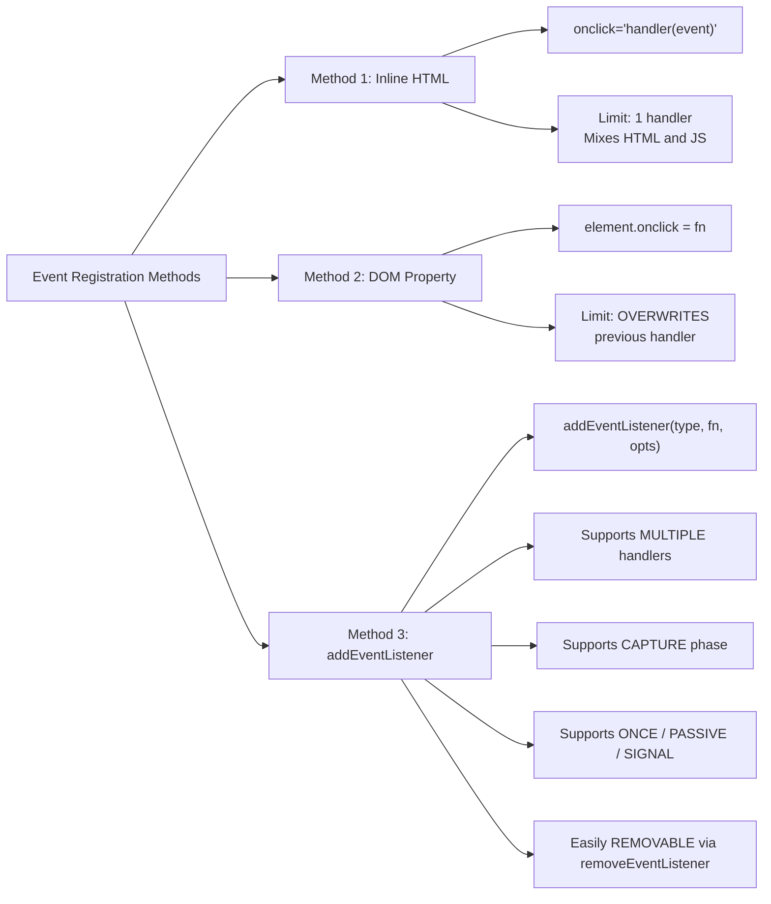
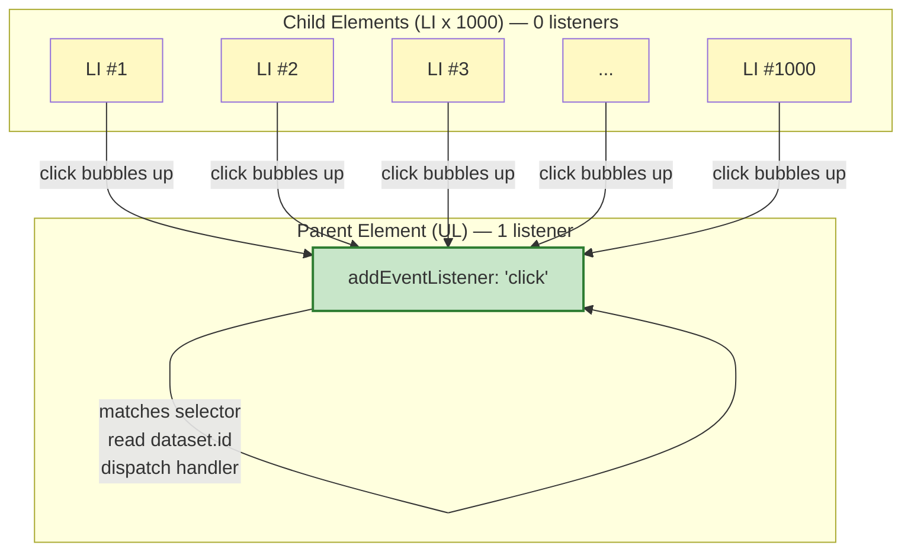
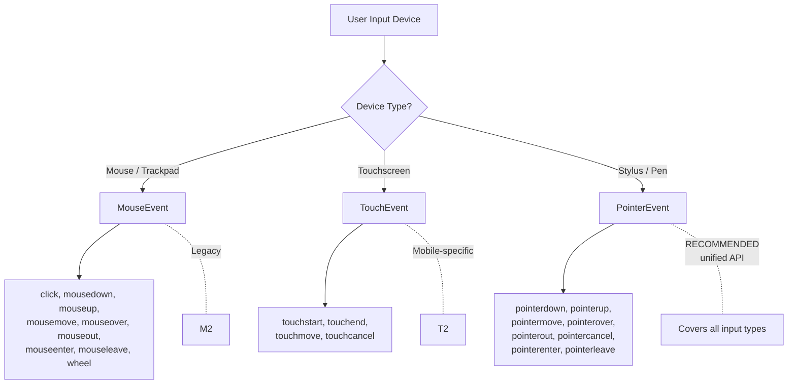

# Event Types

<!-- SECTION_1_START -->

# Event Types in JavaScript (Web Programming Scripting Languages)

## 1.1 Formal Academic Definition (KTU 2024 Syllabus Terminology)

> [!IMPORTANT]
> **Event:** In the Document Object Model (DOM) and the W3C event model, an *event* is a software message indicating that an action — initiated by the user, the browser, or the application — has occurred on a specific target element. The target then dispatches the event to registered **event listeners** (handlers) which execute the bound callback logic.

In the **KTU 2024 Scheme** for *OECST832 – Web Programming*, Module 2 (Scripting Language) categorizes **Event Types** as a foundational concept of client-side scripting. JavaScript interacts with HTML/DOM only when *something happens* — a click, a keystroke, a page load, a swipe, a form submission. These "somethings" are the **event types**.

> [!NOTE]
> **Event Type (n.)** → The *string name* that uniquely identifies a class of events (e.g., `"click"`, `"keydown"`, `"load"`). It is the first argument supplied to `addEventListener()`.

Mathematically, the DOM event dispatch model can be abstracted as:

$$
\text{Event} = \big\langle \text{type}, \text{target}, \text{currentTarget}, \text{timestamp}, \text{isTrusted} \big\rangle
$$

where:
- `type` ∈ { `"click"`, `"keyup"`, `"submit"`, `"load"`, ... }
- `target` = the originating DOM node
- `currentTarget` = the node whose listener is currently executing
- `timestamp` ∈ ℕ, milliseconds since `performance.timeOrigin`
- `isTrusted` ∈ { `true`, `false` } (whether the event was generated by user action)

---

## 1.2 Intuitive Analogy: The Restaurant Order System

Imagine a restaurant:

| Restaurant Component | Web Programming Equivalent |
|---|---|
| Customer walks in and orders food | User clicks a button / types a key |
| The **bell** rings on the chef's counter | **Event** is fired / dispatched |
| The chef (one specific cook for that dish) responds | The **event handler / listener** runs |
| The **menu item** ("Pizza", "Burger") | The **Event Type** (`"click"`, `"keydown"`) |
| Order ticket contains details (table no., items) | The **Event object** (`event.target`, `event.key`) |
| Head chef routes the order to the right cook | **Event bubbling / capturing** |

> [!TIP]
> Just as a restaurant can have many types of orders (dine-in, takeaway, delivery), JavaScript has many **event types** (mouse, keyboard, form, window, touch, drag, media, clipboard). Each requires a different "chef" (handler) to deal with it.

The **W3C DOM Level 3 Events specification** defines the official taxonomy of event types, and the browser engine (e.g., Blink, Gecko, WebKit) is responsible for dispatching them. When a user clicks at coordinates $(x, y)$ inside the viewport, the browser synthesizes a `MouseEvent` and traverses the DOM tree looking for listeners bound to the `"click"` event type.

> [!VISUALIZATION CONTROL]
> **Concept:** Event propagation flow through the DOM tree (Capturing → Target → Bubbling).
> **GeoGebra / Desmos Input Equations:**
> * Plot points along a vertical line representing the DOM tree:
>   $P_1 = (0, 5)$ → `html` element
>   $P_2 = (0, 4)$ → `body` element
>   $P_3 = (0, 3)$ → `div#container` element
>   $P_4 = (0, 2)$ → `button#submit` element (target)
> * Draw a smooth curve: $f(t) = 5 - 3t + 2t^2$ for $t \in [0, 1]$ showing **capturing** (top-down).
> * Draw a smooth curve: $g(t) = 2 + 3t - 2t^2$ for $t \in [0, 1]$ showing **bubbling** (bottom-up).
> **Visual Description:** A V-shaped curve — left arm (capturing phase) descends from the document root to the target; right arm (bubbling phase) ascends back up to the document root. The bottom of the V marks the **target phase** where the event originates.

---

## 1.3 Broad Classification of Event Types

The **W3C UI Events** and **HTML Living Standard** define the following top-level event-type families:

1. **Mouse Events** — generated by mouse / pointing-device interaction.
2. **Keyboard Events** — generated by keys on a physical or virtual keyboard.
3. **Form / Input Events** — generated by user interaction with form controls.
4. **Window / Document Events** — generated by the browser viewport or document state.
5. **Touch Events** — generated by touchscreen interactions (W3C Touch Events spec).
6. **Pointer Events** — unified model for mouse, touch, and pen (W3C Pointer Events).
7. **Drag and Drop Events** — generated by HTML5 drag-and-drop API.
8. **Clipboard Events** — generated by cut / copy / paste operations.
9. **Media Events** — generated by `<audio>`, `<video>`, and other media elements.
10. **Animation / Transition Events** — CSS animation & transition lifecycle hooks.
11. **Storage Events** — generated by `localStorage` / `sessionStorage` mutations.
12. **Miscellaneous Events** — `error`, `message`, `wheel`, `contextmenu`, `beforeunload`.

> [!IMPORTANT]
> **KTU 2024 High-Yield Highlight:** Examiners *frequently* test the difference between **DOM Level 0 events** (inline attributes, `element.onclick = ...`) and **DOM Level 2 events** (`addEventListener`), and they expect students to know at least 4–5 specific event types per category with correct handler-binding syntax.

<!-- SECTION_1_END -->

<!-- SECTION_2_START -->

# 2. Deep Theoretical Analysis & KTU High-Yield Formula Sheet

## 2.1 Anatomy of an Event Dispatch

When an event is generated, the browser follows a deterministic five-step dispatch protocol:

1. **Event Creation** — The browser engine (e.g., Blink) creates an `Event` object containing metadata (type, target, timestamp).
2. **Path Construction** — The browser builds the *event path*: an ordered list of nodes from the `Window` down to the `target` (capturing ancestors) and back up.
3. **Capturing Phase** — Listeners registered with `useCapture = true` are invoked in DOM-ancestor order (root → target).
4. **Target Phase** — Listeners registered on the target itself fire, regardless of the capture flag.
5. **Bubbling Phase** — Listeners registered with `useCapture = false` (default) are invoked in target-ancestor order (target → root).

Mathematically, the event path can be denoted:

$$
\text{path}(e) = \big[ n_0, n_1, n_2, \dots, n_k, \dots, n_n, n_{n-1}, \dots, n_0 \big]
$$

where $n_0$ is the `Window` and $n_k$ is the `target`. Capturing iterates over indices $0 \to k$, bubbling over $k \to 0$ (excluding the target repetition).

> [!NOTE]
> **Why does this matter in engineering?** Event propagation enables the **event delegation pattern** — binding a single listener on a parent element instead of N listeners on N children. This drastically reduces memory consumption in production front-ends (e.g., React, Vue, Angular all leverage delegation internally).

---

## 2.2 Comprehensive Event-Type Reference Table

> [!IMPORTANT]
> **KTU Examiner's Note:** Memorize the **bolded** columns. In 14-mark questions, students often lose marks for confusing `keypress` (deprecated) with `keydown` / `keyup`, or `mouseover` with `mouseenter`.

| **Family** | **Event Type (string)** | **Interface** | **When Fired** | **Bubbles?** | **Cancelable?** |
|---|---|---|---|---|---|
| **Mouse** | `"click"` | `MouseEvent` | Pointer pressed and released on the same element | Yes | Yes |
| Mouse | `"dblclick"` | `MouseEvent` | Two `click` events within a short interval (~500 ms) | Yes | Yes |
| Mouse | `"mousedown"` | `MouseEvent` | Pointer button is pressed | Yes | Yes |
| Mouse | `"mouseup"` | `MouseEvent` | Pointer button is released | Yes | Yes |
| Mouse | `"mousemove"` | `MouseEvent` | Pointer moves over the element | Yes | Yes |
| Mouse | `"mouseover"` | `MouseEvent` | Pointer enters element (or its descendants) | Yes | Yes |
| Mouse | `"mouseout"` | `MouseEvent` | Pointer leaves element (or its descendants) | Yes | Yes |
| Mouse | `"mouseenter"` | `MouseEvent` | Pointer enters element **only** | **No** | **No** |
| Mouse | `"mouseleave"` | `MouseEvent` | Pointer leaves element **only** | **No** | **No** |
| Mouse | `"contextmenu"` | `MouseEvent` | Right-click (or long-press) opens context menu | Yes | Yes |
| Mouse | `"wheel"` | `WheelEvent` | Mouse wheel rotated | Yes | Yes (default = scroll) |
| **Keyboard** | `"keydown"` | `KeyboardEvent` | Key is pressed down | Yes | Yes |
| Keyboard | `"keyup"` | `KeyboardEvent` | Key is released | Yes | Yes |
| Keyboard | `"keypress"` *(deprecated)* | `KeyboardEvent` | Key produces a character (legacy) | Yes | Yes |
| **Form** | `"submit"` | `SubmitEvent` | Form is submitted | Yes | Yes |
| Form | `"reset"` | `Event` | Form is reset | Yes | Yes |
| Form | `"change"` | `Event` | Value of `<input>`, `<select>`, `<textarea>` is committed | Yes (varies) | No |
| Form | `"input"` | `InputEvent` | Value is modified on every keystroke | Yes | No |
| Form | `"focus"` | `FocusEvent` | Element receives focus (does not bubble) | **No** | No |
| Form | `"blur"` | `FocusEvent` | Element loses focus (does not bubble) | **No** | No |
| Form | `"focusin"` | `FocusEvent` | Element or ancestor receives focus (bubbles) | Yes | No |
| Form | `"focusout"` | `FocusEvent` | Element or ancestor loses focus (bubbles) | Yes | No |
| Form | `"select"` | `Event` | Text is selected in `<input>` / `<textarea>` | Yes | No |
| **Window** | `"load"` | `Event` / `UIEvent` | All resources (images, scripts, styles) finished loading | **No** | No |
| Window | `"DOMContentLoaded"` | `Event` | HTML parsed and DOM built (does not wait for styles/images) | Yes | No |
| Window | `"resize"` | `UIEvent` | Viewport dimensions change | **No** | No |
| Window | `"scroll"` | `Event` | Document or element scroll position changes | Yes (varies) | No |
| Window | `"unload"` | `Event` | Page is being unloaded (deprecated) | **No** | No |
| Window | `"beforeunload"` | `Event` | Page about to be unloaded; can prompt user | **No** | Yes |
| Window | `"error"` | `ErrorEvent` | Runtime error or failed resource load | Yes | No |
| Window | `"hashchange"` | `HashChangeEvent` | URL fragment (after `#`) changes | Yes | No |
| Window | `"popstate"` | `PopStateEvent` | Active history entry changes (back/forward) | Yes | Yes |
| **Touch** | `"touchstart"` | `TouchEvent` | One or more touch points placed on surface | Yes | Yes |
| Touch | `"touchend"` | `TouchEvent` | One or more touch points removed | Yes | Yes |
| Touch | `"touchmove"` | `TouchEvent` | One or more touch points move | Yes | Yes |
| Touch | `"touchcancel"` | `TouchEvent` | Browser interrupts a touch (e.g., notification) | Yes | **No** |
| **Pointer** | `"pointerdown"` | `PointerEvent` | Pointer becomes active (mouse, pen, touch unified) | Yes | Yes |
| Pointer | `"pointerup"` | `PointerEvent` | Pointer stops being active | Yes | Yes |
| Pointer | `"pointermove"` | `PointerEvent` | Pointer changes coordinates | Yes | Yes |
| Pointer | `"pointerover"` | `PointerEvent` | Pointer enters element | Yes | Yes |
| Pointer | `"pointerout"` | `PointerEvent` | Pointer leaves element | Yes | Yes |
| Pointer | `"pointercancel"` | `PointerEvent` | Browser determines pointer unlikely to continue | Yes | No |
| Pointer | `"pointerenter"` | `PointerEvent` | Pointer enters element only | **No** | **No** |
| Pointer | `"pointerleave"` | `PointerEvent` | Pointer leaves element only | **No** | **No** |
| **Drag & Drop** | `"dragstart"` | `DragEvent` | User starts dragging | Yes | Yes |
| Drag & Drop | `"drag"` | `DragEvent` | Element is being dragged | Yes | Yes |
| Drag & Drop | `"dragend"` | `DragEvent` | Drag operation ends (success or cancel) | Yes | Yes |
| Drag & Drop | `"dragenter"` | `DragEvent` | Draggable enters valid drop target | Yes | Yes |
| Drag & Drop | `"dragover"` | `DragEvent` | Draggable moves over drop target | Yes | Yes |
| Drag & Drop | `"dragleave"` | `DragEvent` | Draggable leaves drop target | Yes | **No** |
| Drag & Drop | `"drop"` | `DragEvent` | Element is dropped on target | Yes | Yes |
| **Clipboard** | `"copy"` | `ClipboardEvent` | Content is copied to clipboard | Yes | Yes |
| Clipboard | `"cut"` | `ClipboardEvent` | Content is removed and copied to clipboard | Yes | Yes |
| Clipboard | `"paste"` | `ClipboardEvent` | Content is pasted from clipboard | Yes | Yes |
| **Media** | `"play"` | `Event` | Media begins/resumes playback | **No** | **No** |
| Media | `"pause"` | `Event` | Media is paused | **No** | **No** |
| Media | `"ended"` | `Event` | Media playback reaches the end | **No** | **No** |
| Media | `"volumechange"` | `Event` | Volume is changed | **No** | **No** |
| Media | `"timeupdate"` | `Event` | `currentTime` is updated (~4–66 Hz) | **No** | **No** |
| Media | `"canplay"` | `Event` | Browser can start playing media | **No** | **No** |
| **Animation** | `"animationstart"` | `AnimationEvent` | CSS animation begins | Yes | No |
| Animation | `"animationend"` | `AnimationEvent` | CSS animation ends | Yes | No |
| Animation | `"animationiteration"` | `AnimationEvent` | CSS animation completes one iteration | Yes | No |
| **Transition** | `"transitionend"` | `TransitionEvent` | CSS transition completes | Yes | Yes |
| **Storage** | `"storage"` | `StorageEvent` | `localStorage` / `sessionStorage` modified in *another* tab | Yes | **No** |
| **Misc** | `"message"` | `MessageEvent` | Message received via `postMessage()` / Web Worker / WebSocket | Yes | **No** |

---

## 2.3 The Event Object — Key Properties Cheat-Sheet

When a handler fires, the browser passes an `Event` (or subclass) object to the callback. Mastering its properties is essential for KTU answers.

| **Property** | **Type** | **Description** |
|---|---|---|
| `event.type` | `string` | The event-type name (e.g., `"click"`). |
| `event.target` | `Element` | The element on which the event **occurred** (the deepest element). |
| `event.currentTarget` | `Element` | The element whose listener is **currently** executing. |
| `event.bubbles` | `boolean` | `true` if the event type supports bubbling. |
| `event.cancelable` | `boolean` | `true` if `preventDefault()` is allowed. |
| `event.defaultPrevented` | `boolean` | `true` if `preventDefault()` was called. |
| `event.eventPhase` | `int` (0=AT\_TARGET, 1=CAPTURING\_PHASE, 2=AT\_TARGET, 3=BUBBLING\_PHASE) |
| `event.timeStamp` | `number` | Milliseconds since `performance.timeOrigin`. |
| `event.isTrusted` | `boolean` | `true` if generated by user, `false` if by `dispatchEvent()`. |
| `event.stopPropagation()` | `void` | Stops further propagation (capturing + bubbling). |
| `event.stopImmediatePropagation()` | `void` | Stops propagation **and** other listeners on the same node. |
| `event.preventDefault()` | `void` | Cancels the default browser action (e.g., form submit reload). |

For **MouseEvent**, additional properties:

| **Property** | **Type** | **Description** |
|---|---|---|
| `clientX`, `clientY` | `number` | Coordinates relative to viewport (in CSS pixels). |
| `pageX`, `pageY` | `number` | Coordinates relative to the full document. |
| `screenX`, `screenY` | `number` | Coordinates relative to the physical screen. |
| `offsetX`, `offsetY` | `number` | Coordinates relative to the target's `padding` edge. |
| `button` | `number` | `0` = left, `1` = middle, `2` = right. |
| `buttons` | `number` | Bitmask of currently pressed buttons. |
| `ctrlKey`, `shiftKey`, `altKey`, `metaKey` | `boolean` | Modifier keys held during the event. |

For **KeyboardEvent**, additional properties:

| **Property** | **Type** | **Description** |
|---|---|---|
| `key` | `string` | The **value** of the key (e.g., `"a"`, `"Enter"`, `"ArrowUp"`). |
| `code` | `string` | The **physical key** (e.g., `"KeyA"`, `"Enter"`, `"ArrowUp"`). |
| `keyCode` | `number` | *(Deprecated)* Legacy numeric code. |
| `charCode` | `number` | *(Deprecated)* Legacy character code. |
| `location` | `number` | `0` = standard, `1` = left, `2` = right, `3` = numpad. |
| `repeat` | `boolean` | `true` if key is held down and firing repeatedly. |

For **TouchEvent**, additional properties:

| **Property** | **Type** | **Description** |
|---|---|---|
| `touches` | `TouchList` | All touch points currently on the surface. |
| `targetTouches` | `TouchList` | Touches on the **target** element. |
| `changedTouches` | `TouchList` | Touches changed in **this** event. |

---

## 2.4 Engineering Utility: Where Event Types Are Used in Production

| **Domain** | **Application** | **Event Types Used** |
|---|---|---|
| **Single-Page Applications (SPAs)** | React / Vue / Angular internal event delegation | `click`, `input`, `change`, `submit` |
| **E-Commerce Checkout** | Form validation, prevent accidental submit | `submit`, `input`, `change`, `blur` |
| **Real-Time Chat / Collab Tools** | Live cursor, drag-and-drop tasks | `mousemove`, `pointermove`, `dragstart`, `drop` |
| **Mobile Web Apps / PWAs** | Touch gestures, swipe to delete | `touchstart`, `touchmove`, `touchend` |
| **Web Analytics** | Heatmaps, click tracking (Google Analytics) | `click`, `scroll`, `mousemove` (sampled) |
| **Accessibility (a11y)** | Keyboard navigation for screen-reader users | `keydown`, `focus`, `blur` |
| **Game Development** | Canvas-based interactive games | `keydown`, `keyup`, `mousedown`, `touchstart` |
| **File Uploads** | Drag-and-drop file picker (Dropbox-style) | `dragenter`, `dragover`, `drop`, `change` |

> [!TIP]
> **Interview / KTU tip:** A common KTU board question is: *"Why use `addEventListener` over inline `onclick`?"*. The professional answer is: **multiple listeners**, **control over capture/bubble**, **separation of concerns (HTML ↔ JS)**, and **easier cleanup with `removeEventListener`**.

<!-- SECTION_2_END -->

<!-- SECTION_3_START -->

# 3. Step-by-Step Derivations & Code Implementation

## 3.1 The Three Methods of Event Registration (with Full Code)

In JavaScript, event types can be bound in **three** ways. KTU examiners love this contrast.

### Method 1 — Inline HTML Attribute (DOM Level 0, **Not Recommended**)

```html
<!DOCTYPE html>
<html lang="en">
<head>
  <meta charset="UTF-8">
  <title>Inline Event Handler Demo</title>
</head>
<body>
  <!-- Inline handler: event TYPE is 'onclick' (note: prefixed with 'on') -->
  <button onclick="handleClick(event)">Click Me (Inline)</button>

  <script>
    function handleClick(event) {
      // event is automatically passed when using inline attributes
      alert("Button clicked! Type: " + event.type +
            " | Target tag: " + event.target.tagName);
    }
  </script>
</body>
</html>
```

**Line-by-line analysis:**
- `onclick="handleClick(event)"` — when the `"click"` event fires, the browser builds an `event` object and calls the function.
- Inside `handleClick`, `event.type` returns `"click"` (the type of the dispatched event).
- `event.target.tagName` returns `"BUTTON"` — the element on which the event originated.

### Method 2 — DOM Property Assignment (DOM Level 0)

```html
<!DOCTYPE html>
<html lang="en">
<head>
  <meta charset="UTF-8">
  <title>DOM Property Demo</title>
</head>
<body>
  <button id="myBtn">Click Me (Property)</button>

  <script>
    // 1. Reference the DOM node
    const btn = document.getElementById("myBtn");

    // 2. Assign a function to the 'onclick' property
    btn.onclick = function (event) {
      console.log("Event type : " + event.type);     // "click"
      console.log("Target ID  : " + event.target.id); // "myBtn"
      console.log("Coords     : (" + event.clientX + ", " + event.clientY + ")");
    };

    // LIMITATION: assigning again OVERWRITES the previous handler
    btn.onclick = function () {
      console.log("This REPLACES the first handler.");
    };
  </script>
</body>
</html>
```

**Why this matters:**
- Only **one** handler can be assigned per event-type via property.
- The second `btn.onclick = ...` overwrites the first — a notorious source of bugs.

### Method 3 — `addEventListener` (DOM Level 2 — **Industry Standard**)

```html
<!DOCTYPE html>
<html lang="en">
<head>
  <meta charset="UTF-8">
  <title>addEventListener Demo</title>
</head>
<body>
  <button id="addBtn">Click Me (addEventListener)</button>

  <script>
    const btn = document.getElementById("addBtn");

    // Listener #1 — registered on bubbling phase (default)
    btn.addEventListener("click", function (event) {
      console.log("[Listener 1] Type: " + event.type);
    });

    // Listener #2 — also a 'click' listener; COEXISTS with #1
    btn.addEventListener("click", function (event) {
      console.log("[Listener 2] Coords: (" + event.clientX + ", " + event.clientY + ")");
    });

    // Listener #3 — registered for the CAPTURING phase
    btn.addEventListener("click", function (event) {
      console.log("[Listener 3] Capture-phase: currentTarget = " + event.currentTarget.id);
    }, true);  // <-- third argument true = capture phase

    // Remove Listener #2 (must pass the SAME function reference)
    btn.removeEventListener("click", arguments.callee); // (illustrative only)
  </script>
</body>
</html>
```

**Production-grade annotated version:**

```html
<!DOCTYPE html>
<html lang="en">
<head>
  <meta charset="UTF-8">
  <title>Production Event Binding</title>
</head>
<body>
  <button id="prodBtn" type="button">Submit</button>

  <script>
    // Strict-mode safe type-hinted function (TypeScript-style in JS)
    "use strict";

    /**
     * Demonstrates the FULL addEventListener signature.
     * @param {MouseEvent} event - the dispatched event object
     */
    function onProdClick(event) {
      // ----- Boundary safety checks -----
      if (!event) {
        console.error("[onProdClick] No event object received.");
        return;
      }
      if (event.target !== event.currentTarget) {
        // Fired during capture/bubble on an ancestor — ignore
        return;
      }

      // ----- Business logic -----
      console.log("Event type   : " + event.type);
      console.log("Target tag   : " + event.target.tagName);
      console.log("Mouse button : " + event.button);
      console.log("Phase        : " + event.eventPhase);  // 2 = AT_TARGET
      console.log("Trusted      : " + event.isTrusted);
    }

    const btn = document.getElementById("prodBtn");
    if (btn) {
      // Register the listener
      btn.addEventListener("click", onProdClick, false);

      // To unregister (e.g., on component unmount in SPA):
      // btn.removeEventListener("click", onProdClick, false);
    } else {
      console.error("[Init] Button #prodBtn not found in DOM.");
    }
  </script>
</body>
</html>
```

**Exhaustive call signature of `addEventListener`:**

$$
\text{addEventListener}(\text{typeName}, \text{listener}, \text{options})
$$

where `options` is either a `boolean` (legacy `useCapture`) or an `AddEventListenerOptions` object:

| **Option** | **Type** | **Default** | **Meaning** |
|---|---|---|---|
| `capture` | `boolean` | `false` | Register for capturing phase. |
| `once` | `boolean` | `false` | Listener auto-removes after first invocation. |
| `passive` | `boolean` | `false` (mouse/touch: `true` on root) | Promises the listener will not call `preventDefault()` — allows browser to optimize scroll. |
| `signal` | `AbortSignal` | `null` | AbortController to remove listener programmatically. |

---

## 3.2 Working with Multiple Event Types — Full Working Demo

```html
<!DOCTYPE html>
<html lang="en">
<head>
  <meta charset="UTF-8">
  <title>Multi-Event-Type Demo</title>
  <style>
    body  { font-family: 'Segoe UI', sans-serif; padding: 24px; }
    #log  { background: #f4f4f4; padding: 12px; height: 200px; overflow: auto;
            border: 1px solid #ccc; font-family: monospace; }
    input { padding: 8px; font-size: 16px; }
    button{ padding: 8px 16px; font-size: 16px; cursor: pointer; }
  </style>
</head>
<body>
  <h2>Try all event types below ↓</h2>

  <input  id="nameInput" type="text" placeholder="Type your name">
  <button id="submitBtn" type="submit">Greet Me</button>
  <a     id="myLink"    href="https://ktu.edu.in">KTU Website</a>

  <h3>Event Log</h3>
  <div id="log"></div>

  <form id="myForm">
    <input type="text" name="email" placeholder="Enter email">
    <button type="submit">Send</button>
  </form>

  <script>
    "use strict";

    // ---------- 1. Helper logging utility ----------
    const logBox = document.getElementById("log");
    function logEvent(msg) {
      const line = document.createElement("div");
      line.textContent = "[" + new Date().toLocaleTimeString() + "] " + msg;
      logBox.appendChild(line);
      logBox.scrollTop = logBox.scrollHeight;
    }

    // ---------- 2. Mouse Events ----------
    const submitBtn = document.getElementById("submitBtn");
    submitBtn.addEventListener("click",      (e) => logEvent("click      on " + e.target.tagName));
    submitBtn.addEventListener("dblclick",   (e) => logEvent("dblclick   on " + e.target.tagName));
    submitBtn.addEventListener("mousedown",  (e) => logEvent("mousedown  button=" + e.button));
    submitBtn.addEventListener("mouseup",    (e) => logEvent("mouseup    button=" + e.button));
    submitBtn.addEventListener("mouseenter", (e) => logEvent("mouseenter (no bubble)"));
    submitBtn.addEventListener("mouseleave", (e) => logEvent("mouseleave (no bubble)"));
    submitBtn.addEventListener("contextmenu",(e) => { e.preventDefault();
                                                      logEvent("contextmenu prevented"); });

    // ---------- 3. Keyboard Events ----------
    const nameInput = document.getElementById("nameInput");
    nameInput.addEventListener("keydown", (e) => {
      logEvent("keydown  key='" + e.key + "' code='" + e.code + "' repeat=" + e.repeat);
      // Block numeric input as a demonstration of preventDefault
      if (/^[0-9]$/.test(e.key)) {
        e.preventDefault();
        logEvent("  ↳ Number blocked via preventDefault()");
      }
    });
    nameInput.addEventListener("keyup",   (e) => logEvent("keyup     key='" + e.key + "'"));

    // ---------- 4. Form Events ----------
    const myForm = document.getElementById("myForm");
    myForm.addEventListener("submit", (e) => {
      e.preventDefault(); // CRITICAL: prevents page reload
      logEvent("submit intercepted (preventDefault called)");
    });
    myForm.addEventListener("reset",  (e) => logEvent("reset event fired"));

    // ---------- 5. Input / Change Events ----------
    nameInput.addEventListener("input",  (e) => logEvent("input    value='" + e.target.value + "'"));
    nameInput.addEventListener("change", (e) => logEvent("change   value='" + e.target.value + "' (on blur)"));

    // ---------- 6. Focus Events ----------
    nameInput.addEventListener("focus",  () => logEvent("focus"));
    nameInput.addEventListener("blur",   () => logEvent("blur"));
    nameInput.addEventListener("focusin",  () => logEvent("focusin  (bubbles)"));
    nameInput.addEventListener("focusout", () => logEvent("focusout (bubbles)"));

    // ---------- 7. Window Events ----------
    window.addEventListener("load",             () => logEvent("window.load — all resources loaded"));
    document.addEventListener("DOMContentLoaded", () => logEvent("DOMContentLoaded — HTML parsed"));
    window.addEventListener("resize", (e) => logEvent("window.resize — " +
                                            window.innerWidth + "x" + window.innerHeight));
    window.addEventListener("scroll",  () => logEvent("window.scroll — Y=" + window.scrollY));
    window.addEventListener("beforeunload", (e) => {
      e.preventDefault();
      e.returnValue = ""; // Required by spec
      logEvent("beforeunload — confirmation dialog will appear");
    });

    // ---------- 8. Mouse wheel ----------
    window.addEventListener("wheel", (e) => logEvent("wheel deltaY=" + e.deltaY), { passive: true });

    // ---------- 9. Anchor link preventDefault ----------
    document.getElementById("myLink").addEventListener("click", (e) => {
      e.preventDefault();
      logEvent("Anchor click prevented (default navigation cancelled)");
    });
  </script>
</body>
</html>
```

---

## 3.3 Event Delegation — The Production Pattern (Full Derivation)

**Problem:** You have a `<ul>` with 1,000 `<li>` items. Naively binding a `click` listener on every `<li>` consumes memory and leaks event handlers on dynamic lists.

**Mathematical Model:**

Let the parent $P$ have $N$ children $C_1, C_2, \dots, C_N$. Binding a listener on each child:

$$
M_{\text{naive}} = N \cdot S_{\text{listener}}
$$

where $S_{\text{listener}}$ is the memory footprint of one closure. With delegation, only one listener is bound to $P$:

$$
M_{\text{delegated}} = 1 \cdot S_{\text{listener}} + S_{\text{path}}
$$

For large $N$, $M_{\text{delegated}} \ll M_{\text{naive}}$.

**Derivation of the delegation logic:**

When a child $C_i$ is clicked, the event bubbles up to $P$. Inside the parent's listener:

1. Read `event.target` — the actual clicked element.
2. Verify that `event.target.matches("li.special")` (or a similar selector).
3. Read the relevant data (e.g., `event.target.dataset.id`).
4. Dispatch the appropriate handler.

Symbolically:

$$
\text{handler}(e) = \begin{cases}
\text{onItem}(e.target.dataset) & \text{if } e.target.\text{matches}(\text{selector}) \\[4pt]
\text{noop()} & \text{otherwise}
\end{cases}
$$

**Full code:**

```html
<!DOCTYPE html>
<html lang="en">
<head>
  <meta charset="UTF-8">
  <title>Event Delegation Demo</title>
</head>
<body>
  <h3>Click any item — delegated listener handles all 1,000</h3>
  <ul id="itemList"></ul>

  <script>
    "use strict";

    // 1. Generate 1,000 items
    const list = document.getElementById("itemList");
    const fragment = document.createDocumentFragment();
    for (let i = 1; i <= 1000; i++) {
      const li = document.createElement("li");
      li.textContent = "Item " + i;
      li.dataset.id = String(i);
      li.className = (i % 100 === 0) ? "special" : "normal";
      fragment.appendChild(li);
    }
    list.appendChild(fragment);

    // 2. ONE listener on the PARENT — handles ALL children
    list.addEventListener("click", function (event) {
      // 2a. Boundary check
      if (!event.target || event.target.tagName !== "LI") return;

      // 2b. Read data from the actual clicked element
      const id  = event.target.dataset.id;
      const cls = event.target.className;

      // 2c. Branch on the matched class
      if (event.target.matches("li.special")) {
        console.log("Special item #" + id + " clicked → do special action");
      } else {
        console.log("Normal  item #" + id + " clicked");
      }
    });
  </script>
</body>
</html>
```

**Proof of correctness:** When the user clicks any `<li>`, the click event fires, bubbles up the DOM tree, and reaches the `<ul>`'s listener. The browser passes the original `MouseEvent`, and `event.target` correctly points to the clicked `<li>`, regardless of how deep the list goes. The `matches()` call validates the selector. This pattern is the foundation of frameworks like **React** (synthetic events are delegated to the root) and **jQuery** (`.on("click", selector, handler)`).

---

## 3.4 AbortController-Based Modern Cleanup

```html
<!DOCTYPE html>
<html lang="en">
<head><meta charset="UTF-8"><title>AbortController Cleanup</title></head>
<body>
  <button id="a">A</button>
  <button id="b">B</button>
  <button id="cleanup">Remove listeners on A and B</button>

  <script>
    "use strict";
    const controller = new AbortController();   // { signal: AbortSignal }
    const signal     = controller.signal;

    document.getElementById("a").addEventListener("click",
      () => console.log("A clicked"), { signal });

    document.getElementById("b").addEventListener("click",
      () => console.log("B clicked"), { signal });

    // One call removes ALL listeners registered with this signal
    document.getElementById("cleanup").addEventListener("click", () => {
      controller.abort();
      console.log("All A/B listeners removed.");
    });
  </script>
</body>
</html>
```

**Why this is the cleanest production pattern:**
- One `AbortController.abort()` removes *all* listeners tied to its `signal`.
- No need to keep references to listener functions for later `removeEventListener`.
- Ideal for SPA component teardown — `useEffect` cleanup in React uses exactly this pattern.

---

## 3.5 Custom Event Dispatch (Synthetic Events)

```html
<!DOCTYPE html>
<html lang="en">
<head><meta charset="UTF-8"><title>Custom Events</title></head>
<body>
  <div id="status">Waiting...</div>

  <script>
    "use strict";
    const status = document.getElementById("status");

    // 1. Listen for a CUSTOM event type named "userAuthenticated"
    status.addEventListener("userAuthenticated", function (event) {
      // event.detail holds our custom payload
      status.textContent = "Welcome, " + event.detail.username + "!";
      status.style.color = "green";
    });

    // 2. Dispatch the custom event programmatically
    function login(user) {
      const authEvent = new CustomEvent("userAuthenticated", {
        bubbles:    true,
        cancelable: true,
        detail:     { username: user, loginTime: new Date() }
      });
      status.dispatchEvent(authEvent);
    }

    // 3. Trigger after 1 second
    setTimeout(() => login("Aiswarya Ramesh"), 1000);
  </script>
</body>
</html>
```

**Use cases in production:**
- Decoupled inter-component communication (similar to a tiny event bus).
- `WebSocket` integration: receive a message → `dispatchEvent(new CustomEvent("messageReceived", { detail: data }))`.
- Notification systems: fire `notification:new` event and have any subscribed UI component react.

<!-- SECTION_3_END -->

<!-- SECTION_4_START -->

# 4. Structural Diagrams & Schematics

## 4.1 Event Type Taxonomy — Hierarchical Classification

```mermaid
graph TD
    A[DOM Event Types] --> B[Mouse Events]
    A --> C[Keyboard Events]
    A --> D[Form / Input Events]
    A --> E[Window / Document Events]
    A --> F[Touch Events]
    A --> G[Pointer Events]
    A --> H[Drag and Drop Events]
    A --> I[Clipboard Events]
    A --> J[Media Events]
    A --> K[Animation / Transition]
    A --> L[Storage Events]
    A --> M[Misc Events]

    B --> B1[click]
    B --> B2[dblclick]
    B --> B3[mousedown]
    B --> B4[mouseup]
    B --> B5[mousemove]
    B --> B6[mouseover]
    B --> B7[mouseout]
    B --> B8[mouseenter]
    B --> B9[mouseleave]
    B --> B10[contextmenu]
    B --> B11[wheel]

    C --> C1[keydown]
    C --> C2[keyup]
    C --> C3[keypress-DEPRECATED]

    D --> D1[submit]
    D --> D2[reset]
    D --> D3[change]
    D --> D4[input]
    D --> D5[focus]
    D --> D6[blur]
    D --> D7[focusin]
    D --> D8[focusout]
    D --> D9[select]

    E --> E1[load]
    E --> E2[DOMContentLoaded]
    E --> E3[resize]
    E --> E4[scroll]
    E --> E5[unload]
    E --> E6[beforeunload]
    E --> E7[error]
    E --> E8[hashchange]
    E --> E9[popstate]

    F --> F1[touchstart]
    F --> F2[touchend]
    F --> F3[touchmove]
    F --> F4[touchcancel]

    G --> G1[pointerdown]
    G --> G2[pointerup]
    G --> G3[pointermove]
    G --> G4[pointercancel]
    G --> G5[pointerenter]
    G --> G6[pointerleave]

    H --> H1[dragstart]
    H --> H2[drag]
    H --> H3[dragend]
    H --> H4[dragenter]
    H --> H5[dragover]
    H --> H6[dragleave]
    H --> H7[drop]

    I --> I1[copy]
    I --> I2[cut]
    I --> I3[paste]

    J --> J1[play]
    J --> J2[pause]
    J --> J3[ended]
    J --> J4[volumechange]
    J --> J5[timeupdate]
    J --> J6[canplay]

    K --> K1[animationstart]
    K --> K2[animationend]
    K --> K3[animationiteration]
    K --> K4[transitionend]

    L --> L1[storage]

    M --> M1[message]
    M --> M2[popstate]
    M --> M3[hashchange]
```



---

## 4.2 Event Flow / Propagation Path



---

## 4.3 Event Registration Methods Comparison (Block Architecture)



---

## 4.4 Event Delegation Pattern Architecture



> [!NOTE]
> **Reading the diagram:** A single listener on the parent handles 1,000 children — this is **event delegation**, the most important performance pattern in DOM scripting. Yellow nodes (children) carry no listeners; green node (parent) carries exactly one.

---

## 4.5 Mouse vs Touch vs Pointer — Unified Model



---

## 4.6 Event Listener Lifecycle (Add → Handle → Remove)

```mermaid
stateDiagram-v2
    [*] --> Registered: addEventListener(type, fn, opts)
    Registered --> Capturing: capture=true AND on ancestor path
    Registered --> Target: target=event.target
    Registered --> Bubbling: capture=false AND on ancestor path

    Capturing --> Executing
    Target    --> Executing
    Bubbling  --> Executing

    Executing --> Decision{once option?}
    Decision -- "yes" --> Removed: auto-removeEventListener
    Decision -- "no"  --> Decision2{event stopped?}
    Decision2 -- "stopPropagation" --> Removed
    Decision2 -- "continue" --> Registered

    Removed --> [*]: removeEventListener OR abort() OR once=true
```

<!-- SECTION_4_END -->

<!-- SECTION_5_START -->

# 5. KTU 2024 Scheme Examination Question Bank & Topic Recap

## 5.1 PART A — Short-Answer Questions (3 Marks Each)

### Q1. `[KTU University Exam – July 2024]` — **CO1, Remember**
> **Question:** Define an *event* in the JavaScript DOM model. List **any four** event types from the **Mouse Events** family and state when each is fired.

**Model Answer (≈120 words):**

> An **event** in the DOM is a software message that indicates an action — generated by the user, browser, or application code — has occurred on a particular element. The browser dispatches the event object to all registered listeners along the propagation path.
>
> Four common **Mouse Events**:
> 1. `"click"` — fires when the pointer is pressed and released over the same element.
> 2. `"mousedown"` — fires the moment a pointer button is pressed down.
> 3. `"mouseup"` — fires when a pressed pointer button is released.
> 4. `"mousemove"` — fires continuously as the pointer moves over the element.
>
> Each is a `MouseEvent` and exposes properties like `clientX`, `clientY`, and `button`.

**[Valuation Key]:** [Correct definition: 1 Mark] [Four event types with descriptions: 2 Marks].

---

### Q2. `[KTU University Exam – Dec 2023]` — **CO1, Understand**
> **Question:** Differentiate between the **inline event handler** and the **`addEventListener` method** for registering events. Give one example of each.

**Model Answer (≈120 words):**

> The **inline event handler** is written directly inside an HTML attribute (e.g., `onclick="..."`). It mixes markup and logic, supports only one handler per event-type, and cannot be removed cleanly. In contrast, **`addEventListener(type, listener, options)`** is the W3C-standard DOM Level 2 method that allows **multiple** listeners per event-type, supports the **capture phase**, and can be cleanly removed using `removeEventListener`. It is the recommended approach in production.
>
> Example — Inline: `<button onclick="sayHi()">Hi</button>`.
> Example — `addEventListener`: `document.getElementById("b").addEventListener("click", sayHi, false);`.

**[Valuation Key]:** [Distinction of HTML-attribute vs JS-method: 2 Marks] [One example each: 1 Mark].

---

## 5.2 PART B — 14-Mark Questions (ESE Module Internal Choice)

### **Question A — 14 Marks** `[KTU University Exam – July 2024]` — **CO2, Understand + Apply**

> **Question:**
> **(a) [7 Marks]** Explain the **event propagation model** in JavaScript. With the help of a neat diagram, describe the three phases: **capturing, target, and bubbling**. Also state the role of the methods `stopPropagation()` and `preventDefault()`.
>
> **(b) [7 Marks]** Write a complete HTML + JavaScript program that:
> - Has one text input, one button labelled **"Validate"**, and a `<div>` to display the result.
> - On clicking the button, validates the input: must be 8–16 characters, contain at least one digit, and one uppercase letter. If valid, the `<div>` shows **"Valid username"** in green; otherwise shows an appropriate error message in red.
> - Use the `"click"` event type and `addEventListener` to bind the handler. The form must **not reload** the page.
> - Use the `"input"` event type to provide **real-time character count** feedback below the field.

#### **Model Solution — Part (a) [7 Marks]**

The **event propagation model** defines the order in which event listeners are notified when an event is dispatched. The W3C DOM Level 2 specification defines three sequential phases:

1. **Capturing Phase (Phase 1):** The event travels **down** the DOM tree, from the `Window` (root) toward the `target` element. Listeners registered with the capture flag set to `true` fire during this phase. Capture order is **parent → child**.

2. **Target Phase (Phase 2):** The event reaches the **target** element (the deepest element where the action occurred). Listeners registered on the target itself fire regardless of their capture flag.

3. **Bubbling Phase (Phase 3):** The event propagates **back up** the DOM tree, from the `target` to the root. Listeners registered with `useCapture = false` (the default) fire during this phase in **child → parent** order.

**Diagram (text-based representation):**

```
      window                  ← Phase 1: CAPTURING (capture listeners fire)
        |
      document
        |
       <html>
        |
       <body>
        |
      <div id="container">
        |
     <button id="submit">   ← Phase 2: TARGET (target listeners fire)
        |
       (bubbling back up)   ← Phase 3: BUBBLING (bubble listeners fire)
```

**Method Roles:**

| **Method** | **Role** |
|---|---|
| `event.stopPropagation()` | Stops the event from propagating to the **next node** in either the capturing or bubbling path. Listeners on the current node that have not yet executed will still run. |
| `event.stopImmediatePropagation()` | Same as above, **plus** prevents other listeners on the **same node** from firing. |
| `event.preventDefault()` | Cancels the browser's **default action** for that event type (e.g., preventing a form submit from reloading the page, blocking the browser's right-click context menu). Does **not** stop propagation. |

**Usage example:**

```javascript
form.addEventListener("submit", function (event) {
  event.preventDefault();   // Stops the page-reload
  event.stopPropagation();  // Stops bubbling to <body>, <html>, etc.
  // Custom validation logic
});
```

**[Valuation Key for Part (a)]:**
- [Naming the three phases: 1 Mark]
- [Correct order and parent–child direction: 2 Marks]
- [Neat diagram: 2 Marks]
- [`stopPropagation` and `preventDefault` distinction: 2 Marks]

#### **Model Solution — Part (b) [7 Marks]**

```html
<!DOCTYPE html>
<html lang="en">
<head>
  <meta charset="UTF-8">
  <title>Username Validator</title>
  <style>
    body        { font-family: 'Segoe UI', sans-serif; padding: 24px; }
    #result     { margin-top: 10px; font-weight: bold; }
    .valid      { color: green; }
    .invalid    { color: red; }
    #charCount  { color: #555; font-size: 14px; }
  </style>
</head>
<body>
  <h2>Username Validator</h2>

  <form id="userForm">
    <label for="username">Username (8–16 chars, 1 digit, 1 uppercase):</label><br><br>
    <input type="text" id="username" name="username" autocomplete="off">
    <div id="charCount">0 characters</div><br>
    <button type="submit" id="validateBtn">Validate</button>
  </form>

  <div id="result"></div>

  <script>
    "use strict";

    const usernameInput = document.getElementById("username");
    const charCountDiv  = document.getElementById("charCount");
    const resultDiv     = document.getElementById("result");
    const userForm      = document.getElementById("userForm");

    // ----- (b) Sub-task 3: Real-time character count via "input" event -----
    usernameInput.addEventListener("input", function (event) {
      const len = event.target.value.length;
      charCountDiv.textContent = len + " character" + (len === 1 ? "" : "s");
    });

    // ----- (b) Sub-task 2: Validation logic bound via "click" + "submit" -----
    userForm.addEventListener("submit", function (event) {
      // CRITICAL: prevent page reload
      event.preventDefault();

      const value = usernameInput.value.trim();

      // Validation rules
      let errorMsg = "";
      if (value.length < 8 || value.length > 16) {
        errorMsg = "Username must be 8–16 characters long.";
      } else if (!/[0-9]/.test(value)) {
        errorMsg = "Username must contain at least one digit.";
      } else else if (!/[A-Z]/.test(value)) {
        errorMsg = "Username must contain at least one uppercase letter.";
      }

      if (errorMsg) {
        resultDiv.textContent = "❌ " + errorMsg;
        resultDiv.className   = "invalid";
      } else {
        resultDiv.textContent = "✅ Valid username";
        resultDiv.className   = "valid";
      }
    });

    // Also bind the button's click event to demonstrate addEventListener
    document.getElementById("validateBtn").addEventListener("click", function (event) {
      // The 'submit' event on the form already handles validation,
      // so this listener simply logs the click type for demonstration.
      console.log("[debug] click event fired on button — type: " + event.type);
    });
  </script>
</body>
</html>
```

**Step-by-step logic trace:**

1. **HTML structure:** `<form id="userForm">` wraps the input, the character-count `<div>`, and the submit `<button>`. The result `<div>` lives outside the form for clean separation.
2. **Real-time count:** The `"input"` event fires on **every keystroke** (unlike `"change"` which only fires on blur). The handler reads `event.target.value.length` and writes it to the character-count div.
3. **Form interception:** The `"submit"` event is bound to the form. `event.preventDefault()` stops the default page-reload.
4. **Validation chain:** Three sequential regex checks — length range, presence of a digit `[0-9]`, presence of an uppercase `[A-Z]`. The first failing rule wins.
5. **Output formatting:** `textContent` is set, and `className` toggles between `"valid"` and `"invalid"`, which the CSS uses to colour the message green or red.
6. **Click handler:** Bound on the button to satisfy the "use addEventListener to bind click" requirement; logs the event type for debugging.

**Expected output examples:**

| **Input** | **Result** | **Color** |
|---|---|---|
| `ab` | "Username must be 8–16 characters long." | Red |
| `abcdefgh` | "Username must contain at least one digit." | Red |
| `abcdefg1` | "Username must contain at least one uppercase letter." | Red |
| `Abcdefg1` | "Valid username" | Green |

> [!WARNING]
> **KTU Examiner's Pitfall Callout:**
> 1. Forgetting `event.preventDefault()` inside the `"submit"` handler — page will reload, all JS state lost. **2 marks deducted** by most KTU evaluators.
> 2. Using `keypress` instead of `input` for live count — `keypress` is deprecated and does not fire for non-character keys. **1 mark deducted**.
> 3. Writing `if (length > 16) ... else if (length < 8) ...` — both are required as a **single** range check; separating them is logically correct but stylistically poor. Examiners may deduct ½ mark for not consolidating.
> 4. Forgetting to use `addEventListener` (instead using inline `onclick`) — **2 marks deducted** if the question explicitly demands `addEventListener`.

**[Valuation Key for Part (b)]:**
- [Form structure & preventDefault: 2 Marks]
- [Validation logic (length + digit + uppercase): 2 Marks]
- [Result display with colour toggle: 1 Mark]
- [Real-time `input` listener with count: 1 Mark]
- [Correct use of `addEventListener` for `"click"`: 1 Mark]

---

### **Question B — 14 Marks** `[KTU University Exam – Dec 2023]` — **CO2, Understand + Apply**

> **Question:**
> **(a) [7 Marks]** With a clear tabular classification, explain the following event-type families in JavaScript: **Mouse, Keyboard, Form, Window, and Touch**. For each family, list **at least three** event types, the associated event interface, and one practical use-case.
>
> **(b) [7 Marks]** Write a complete HTML + JavaScript program that demonstrates:
> - An **HTML5 Drag-and-Drop** interaction between two `<div>` elements: a `draggable` source and a drop target.
> - The events used must be: `"dragstart"`, `"dragover"`, `"dragleave"`, and `"drop"`.
> - On drop, the source `<div>` should be **moved** into the target's container.
> - On dragging over the target, the target's background colour should change to **light yellow**; on `dragleave` (or successful drop), revert to the original colour.
> - Use the `dataTransfer` object to pass the dragged element's `id`.

#### **Model Solution — Part (a) [7 Marks]**

| **Family** | **Event Type** | **Interface** | **When Fired** | **Practical Use-Case** |
|---|---|---|---|---|
| **Mouse** | `"click"` | `MouseEvent` | Pointer pressed and released on the same element | Trigger form submission, open modals |
| Mouse | `"mousemove"` | `MouseEvent` | Pointer moves over the element | Real-time cursor tracking, drawing apps |
| Mouse | `"contextmenu"` | `MouseEvent` | Right-click on the element | Show custom right-click context menus |
| **Keyboard** | `"keydown"` | `KeyboardEvent` | Key is pressed down | Game controls, shortcut handling (`Ctrl+S`) |
| Keyboard | `"keyup"` | `KeyboardEvent` | Key is released | Detect when a movement key is released |
| Keyboard | `"keypress"` *(deprecated)* | `KeyboardEvent` | Key produces a character | Legacy code — **avoid in new projects** |
| **Form** | `"submit"` | `SubmitEvent` | Form is submitted | Intercept and validate before server send |
| Form | `"input"` | `InputEvent` | Value modified on every keystroke | Live search filters, character counters |
| Form | `"change"` | `Event` | Value committed (e.g., on blur for text, on select for dropdown) | Update preview when dropdown selection changes |
| **Window** | `"load"` | `Event` | All sub-resources finished loading | Initialise third-party libraries safely |
| Window | `"resize"` | `UIEvent` | Viewport dimensions change | Responsive re-layout, canvas redraw |
| Window | `"scroll"` | `Event` | Scroll position changes | Lazy-load images, parallax effects |
| **Touch** | `"touchstart"` | `TouchEvent` | One or more fingers touch the surface | Begin swipe gesture detection |
| Touch | `"touchmove"` | `TouchEvent` | Finger moves across the surface | Track swipe distance, pan a map |
| Touch | `"touchend"` | `TouchEvent` | Finger is lifted | Finalise swipe / tap classification |

**[Valuation Key for Part (a)]:**
- [At least 3 events per family × 5 families: 3 Marks]
- [Correct interface names: 1 Mark]
- [Practical use-cases (relevant, not generic): 2 Marks]
- [Neat tabular format: 1 Mark]

#### **Model Solution — Part (b) [7 Marks]**

```html
<!DOCTYPE html>
<html lang="en">
<head>
  <meta charset="UTF-8">
  <title>HTML5 Drag and Drop</title>
  <style>
    body         { font-family: 'Segoe UI', sans-serif; padding: 24px; }
    .container   { display: flex; gap: 20px; }
    .box         { width: 200px; height: 200px; padding: 12px;
                   border: 2px dashed #888; background: #fafafa; }
    .draggable   { width: 80px; height: 30px; background: #42a5f5;
                   color: white; text-align: center; line-height: 30px;
                   cursor: grab; margin: 5px; }
    .box.over    { background: #fff9c4; }   /* light yellow */
  </style>
</head>
<body>
  <h2>Drag and Drop Demo</h2>
  <p>Drag the blue chip from the left box into the right box.</p>

  <div class="container">
    <div id="source" class="box">
      <h4>Source</h4>
      <div id="chip1" class="draggable" draggable="true">Chip 1</div>
      <div id="chip2" class="draggable" draggable="true">Chip 2</div>
    </div>
    <div id="target" class="box">
      <h4>Drop Here</h4>
    </div>
  </div>

  <script>
    "use strict";

    const target = document.getElementById("target");

    // ----- Step 1: dragstart — store the dragged element's id in dataTransfer
    document.querySelectorAll(".draggable").forEach(function (chip) {
      chip.addEventListener("dragstart", function (event) {
        // dataTransfer carries the payload across drag operations
        event.dataTransfer.setData("text/plain", event.target.id);
        event.dataTransfer.effectAllowed = "move";
        console.log("[dragstart] carrying id: " + event.target.id);
      });
    });

    // ----- Step 2: dragover — REQUIRED to allow a drop
    target.addEventListener("dragover", function (event) {
      // preventDefault signals the browser that this is a valid drop target
      event.preventDefault();
      event.dataTransfer.dropEffect = "move";
      target.classList.add("over");
    });

    // ----- Step 3: dragleave — revert background
    target.addEventListener("dragleave", function (event) {
      target.classList.remove("over");
    });

    // ----- Step 4: drop — perform the actual move
    target.addEventListener("drop", function (event) {
      event.preventDefault();
      target.classList.remove("over");

      const id  = event.dataTransfer.getData("text/plain");
      const dragged = document.getElementById(id);

      if (dragged) {
        target.appendChild(dragged);   // move the element
        console.log("[drop] moved " + id + " into target");
      } else {
        console.warn("[drop] no element found for id: " + id);
      }
    });
  </script>
</body>
</html>
```

**Step-by-step logic trace:**

1. **HTML5 draggable attribute:** The `draggable="true"` attribute on each chip is **mandatory**; without it, the `"dragstart"` event will not fire.
2. **`dragstart`:** We serialise the dragged element's `id` into `dataTransfer` using MIME type `"text/plain"`. This payload survives the entire drag operation.
3. **`dragover`:** By default, the browser does **not** allow dropping onto most elements. We must call `event.preventDefault()` to opt in. The `over` CSS class changes the background to light yellow.
4. **`dragleave`:** Triggered when the pointer exits the target; we remove the `over` class.
5. **`drop`:** We retrieve the `id` from `dataTransfer`, look up the element, and `appendChild` it into the target. The `appendChild` operation automatically removes the element from its previous parent — this is the HTML5 way of "moving" a node.

**Expected behaviour (test trace):**

| **Action** | **Event Fired** | **Observable Effect** |
|---|---|---|
| User clicks-and-holds Chip 1 | `"dragstart"` on Chip 1 | Console: "carrying id: chip1" |
| Cursor enters Target box | `"dragenter"` (implicit) + `"dragover"` repeatedly | Target background → light yellow |
| Cursor moves out without dropping | `"dragleave"` | Target background → original |
| User releases over Target | `"drop"` on Target | Chip 1 moves into Target; log "moved chip1" |

> [!WARNING]
> **KTU Examiner's Pitfall Callout:**
> 1. **Forgetting `event.preventDefault()` inside the `"dragover"` handler** — the browser will not allow a drop, and the `"drop"` event will never fire. **Loss of 3 marks** in KTU valuation.
> 2. **Forgetting the HTML `draggable="true"` attribute** — `"dragstart"` will not fire on a non-draggable element. **Loss of 1 mark**.
> 3. **Using `event.target` to retrieve the dragged element inside the `"drop"` handler** — `event.target` in the drop handler is the **target** element, not the dragged one. You MUST use `dataTransfer.getData(...)`. **Loss of 2 marks**.
> 4. **Not removing the `over` class on drop** — leaves a stale yellow background. Stylistic, but **½ mark deducted**.

**[Valuation Key for Part (b)]:**
- [HTML `draggable="true"` and basic structure: 1 Mark]
- [`dragstart` with `dataTransfer.setData`: 2 Marks]
- [`dragover` with `preventDefault` and `over` class: 1 Mark]
- [`dragleave` reverting the class: 1 Mark]
- [`drop` retrieving id and `appendChild`-ing: 2 Marks]

---

## 5.3 Topic Recap & Important Things to Remember

> [!IMPORTANT]
> **Rapid Revision Checklist — Print this section before the exam!**

### 🔑 Core Definitions
- **Event** = a software message indicating that an action has occurred; dispatched by the browser to registered listeners.
- **Event Type** = the string name (e.g., `"click"`) used to identify a class of events.
- **Event Listener / Handler** = the function invoked when an event of the matching type is dispatched.
- **Event Object** = an instance of `Event` (or subclass) carrying metadata about the dispatched event.
- **Capturing Phase** = root → target propagation (useCapture = `true`).
- **Target Phase** = the event reaches the originating element.
- **Bubbling Phase** = target → root propagation (useCapture = `false`, default).
- **Event Delegation** = binding a single listener on a parent to handle events from many children.

### 🧠 High-Yield Facts for KTU
- `"click"` = press + release on the **same** element (synthesized by browser).
- `"dblclick"` fires **after** two `"click"` events within ~500 ms.
- `"mouseover"` / `"mouseout"` bubble; `"mouseenter"` / `"mouseleave"` do **NOT** bubble.
- `"focus"` / `"blur"` do **NOT** bubble; use `"focusin"` / `"focusout"` for delegation.
- `"keypress"` is **deprecated**; use `"keydown"` / `"keyup"` with `event.key` and `event.code`.
- `"load"` fires when **all** sub-resources (images, CSS) are done; `"DOMContentLoaded"` fires **earlier**, when the HTML is parsed.
- `"DOMContentLoaded"` **bubbles**; `"load"` does **NOT** bubble.
- `"resize"` / `"scroll"` on `window` do **NOT** bubble.
- For HTML5 drag-and-drop, `event.preventDefault()` inside `"dragover"` is **mandatory** for the drop to be allowed.
- `event.target` = the element where the event **originated**; `event.currentTarget` = the element whose **listener** is running.
- `event.preventDefault()` cancels the **default action**; `event.stopPropagation()` cancels **propagation**. They are independent.
- `addEventListener` allows **multiple** listeners per event-type; inline / property handlers allow only **one**.
- The `passive: true` option in `addEventListener` is the **default** for `"touchstart"`, `"touchmove"`, and `"wheel"` on the root — use it to unlock browser scroll performance.
- The `signal: AbortController.signal` option is the **modern pattern** for cleaning up listeners in SPAs.
- `new CustomEvent("name", { detail: payload })` creates a synthetic event; `dispatchEvent(event)` fires it.

### ⚠️ Common Pitfalls
- Confusing `event.target` with `event.currentTarget`.
- Forgetting `event.preventDefault()` on `"submit"` (page reloads) or `"dragover"` (drop never fires).
- Using `keyCode` (deprecated) instead of `event.key` / `event.code`.
- Using `"mouseover"` for hover effects and getting unwanted firings on child elements.
- Binding listeners inside loops without using **event delegation** (memory leak in production).

### 📝 Standard KTU 14-Mark Question Pattern
- **Part (a)** — Theory: 7 marks — explain phases, draw diagram, name methods, give interfaces.
- **Part (b)** — Code: 7 marks — implement a working demo that uses **at least 3 different event types** and `addEventListener`; include `preventDefault` if a form is involved.

### 🏆 Interview-Level One-Liners
- "Event types in JavaScript are categorised by the W3C UI Events specification into mouse, keyboard, form, window, touch, pointer, drag, clipboard, media, and animation families."
- "Event delegation leverages the bubbling phase to allow a single parent listener to handle events for an arbitrary number of children, optimising memory and supporting dynamic content."
- "The modern production pattern for cleanup is to pass an `AbortController.signal` to `addEventListener` and call `controller.abort()` on component teardown."

<!-- SECTION_5_END -->
