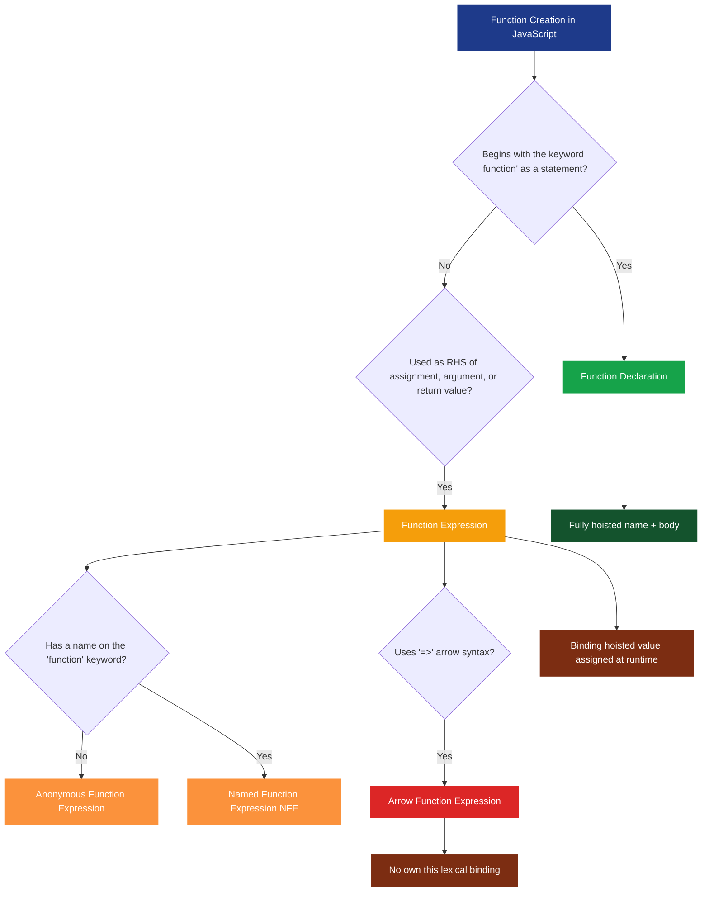
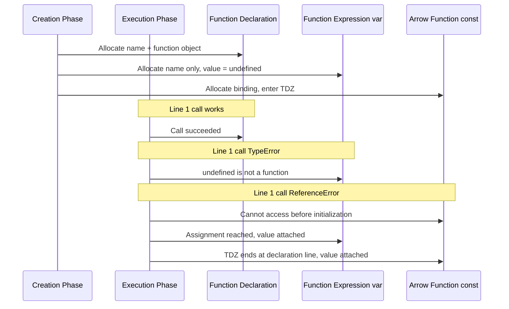
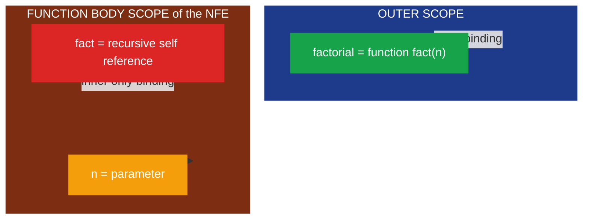

# Function Declarations vs. Function Expressions

<!-- SECTION_1_START -->

# Function Declarations vs. Function Expressions

## 1. Core Technical Definition & Intuitive Overview

### Formal Academic Definition (KTU 2024 Syllabus Terminology)

In **ECMAScript (JavaScript)**, a function is a first-class object that encapsulates a reusable block of executable statements. Functions in JavaScript can be created using two syntactically distinct but semantically related mechanisms: **Function Declarations** and **Function Expressions**. A *Function Declaration* is a statement that begins with the reserved keyword `function` followed by a mandatory identifier (function name), a parameter list, and a function body. A *Function Expression* is an operand in an expression context — the keyword `function` may optionally be followed by a name, and the entire construct evaluates to a value (typically assigned to a variable, passed as an argument, or returned from another function).

> [!IMPORTANT]
> **KTU Board Definition (Verbatim Style):** *"A Function Declaration (also called a Function Statement) is hoisted in its entirety — both the name and the body — to the top of its enclosing scope. A Function Expression, however, is treated like any other expression: only the variable binding is hoisted (in `var`) or uninitialized (in `let`/`const`), while the function value is assigned only at runtime when the line of code is reached."*

### Conceptual Analogy / Intuition

Imagine you are organizing a music concert:

- **Function Declaration** is like a **plaque mounted on the wall at the entrance of the hall** that says *"Piano Performance will happen at 6 PM"*. The plaque is visible the moment anyone enters the hall (hoisted), so even if a guest asks *"Where is the piano?"* before reading the plaque, the answer is already known. The plaque is *fully installed* (binding + body hoisted).

- **Function Expression** is like a **gig musician who only appears when their name is announced on stage**. The seat (variable) may be reserved (binding hoisted), but the musician (function value) is not there until the announcement is made. If you ask *"Where is the guitarist?"* before the announcement, the seat exists but is empty (`undefined`).

- An **Anonymous Function Expression** is a musician who performs under no specific name — they are identified only by the stage they are currently standing on.

- A **Named Function Expression** is a musician who has a name on the contract, useful for self-reference (e.g., recursion) and clearer stack traces.

> [!NOTE]
> **Why this matters in production:** The hoisting difference is the **#1 source of `TypeError: x is not a function`** bugs reported in enterprise JavaScript codebases. Understanding this distinction prevents runtime failures, especially in legacy code where `var` and `function` declarations are mixed within conditional blocks.

### Standard Metrics & Terminology

| Term | Symbol / Keyword | Significance |
| :--- | :--- | :--- |
| Function Declaration | `function name() {}` | Statement context |
| Function Expression | `const x = function() {}` | Expression context |
| Anonymous Function Expression | `function() {}` | No name on the `function` keyword |
| Named Function Expression (NFE) | `const x = function y() {}` | Name exists only inside the function body |
| IIFE | `(function(){})()` | Immediately Invoked Function Expression |
| Arrow Function | `() => {}` | ES6+ shorthand, **lexical `this`** |
| Hoisting | — | Compile-time binding relocation |
| TDZ | Temporal Dead Zone | `let`/`const` un-initialized phase |

> [!VISUALIZATION CONTROL]
> **Concept:** Hoisting Timeline on a JavaScript Execution Context
> **GeoGebra / Desmos Input Equations:** *(Not a math topic — conceptual timeline shown in Section 4 instead.)*
> **Visual Description:** Picture a vertical timeline. The first horizontal line represents the *Creation Phase* (memory allocation), the second represents the *Execution Phase*. Function Declarations occupy memory in full at the first line; Function Expressions occupy memory partially at the first line (binding only) and fully at the second line (when reached).

---

<!-- SECTION_1_END -->

<!-- SECTION_2_START -->

# 2. Deep Theoretical Analysis & KTU High-Yield Formula Sheet

## 2.1 The Four Pillars of Distinction

The following four operational differences form the analytical backbone of every board question on this topic.

### Pillar 1 — Hoisting Behavior

The JavaScript engine runs in two passes over any scope: the **Creation Phase** (allocates memory for variables and functions) and the **Execution Phase** (runs statements line-by-line).

- During creation, a **Function Declaration** is fully hoisted: the identifier and the function object are both placed in the lexical environment. Hence, the call works even on a line *before* the declaration appears in source code.
- During creation, a **Function Expression** assigned to `var` hoists only the variable binding, which is initialized to `undefined`. The function object is assigned only when execution reaches the assignment statement.
- A **Function Expression** assigned to `let` or `const` enters the **Temporal Dead Zone (TDZ)**: accessing the variable before its declaration line throws a `ReferenceError`.

### Pillar 2 — Name Binding & Scope of the Function Name

- A Function Declaration creates a binding in the **enclosing scope** (the scope where the declaration physically appears).
- A Named Function Expression creates a binding in **two places**: the outer scope receives the variable it is assigned to, while the *function name itself* is bound **only inside the function body** and **only for self-reference** (e.g., recursion). It does not pollute the outer scope.

### Pillar 3 — Conditional / Block-Level Declaration Rules (Strict Mode vs. Sloppy Mode)

In **sloppy (non-strict) mode**, a Function Declaration inside a block is technically treated as a statement-level binding in the enclosing function scope (legacy browser behavior — V8/SpiderMonkey differ). In **strict mode** (ES2015+), block-scoped Function Declarations are *block-scoped*, and they are additionally *hoisted only within the block* and *frozen* at the end of the block, leading to surprising but standardized behavior.

> [!IMPORTANT]
> **KTU High-Yield Point:** Writing a Function Declaration inside an `if`/`else` block is **strongly discouraged** by the ECMA-262 specification Annex B and is a known source of cross-browser bugs. KTU questions frequently test this with a code snippet asking *"What is the output?"*

### Pillar 4 — The `this` Binding (Especially with Arrow Functions)

- A **Function Declaration** and a **non-arrow Function Expression** define their own `this` — bound by the call-site (object method, `new`, or global/undefined in strict mode).
- An **Arrow Function Expression** does **not** have its own `this`; it captures the `this` of the **enclosing lexical scope** at the time of creation. This makes arrows unsuitable as object methods or constructors, but ideal for callbacks inside methods.

## 2.2 KTU Formula Sheet / Cheat Sheet

| Aspect | Function Declaration | Function Expression | Arrow Function Expression |
| :--- | :--- | :--- | :--- |
| Syntax starts with | `function name(...)` | A variable assignment of `function` | `() =>` |
| Hoisted fully? | **Yes** (name + body) | No (only binding hoisted) | No (binding hoisted like any `let`/`const`) |
| Anonymous by default? | No (name mandatory) | Often yes, but NFEs allowed | Always anonymous |
| Own `this`? | Yes | Yes | **No (lexical)** |
| Usable as constructor (`new`)? | Yes | Yes | **No — throws `TypeError`** |
| `arguments` object? | Yes | Yes | **No** (use rest `...args`) |
| `super` / `new.target`? | Yes | Yes | **No** |
| Suitable for object methods? | Acceptable | Acceptable | **Avoid** |
| Suitable for callbacks inside methods? | Works but verbose | Works | **Best choice (lexical `this`)** |
| Recursion requires named binding? | Already named | Need NFE or use outer variable | Need named reference or outer variable |
| Errors when called before line? | None | `TypeError: x is not a function` (with `var`) / `ReferenceError` (with `let`/`const`) | `ReferenceError` (TDZ) |

## 2.3 Real-World Engineering Utility

- **Event-driven UIs:** Arrow functions inside React class components preserve `this` to the React instance, eliminating the need for `.bind(this)` in the constructor.
- **Express.js middleware:** Function expressions passed as route handlers (`app.get('/', (req, res) => {...})`) keep the route definition co-located with its configuration.
- **Module Pattern / Encapsulation:** IIFEs (an application of function expressions) were the standard way to create private state before ES6 modules existed.
- **Functional Programming Utilities:** `Array.prototype.map`, `filter`, `reduce` accept function expressions as predicates/transforms, encouraging first-class function composition.
- **Tree-shaking & Bundlers:** Named Function Expressions appear in error stack traces with meaningful names, drastically reducing debugging time in production.

> [!NOTE]
> **Industry Convention (Airbnb / Google Style Guides):** Prefer function declarations for *named top-level functions* (because hoisting aids code organization top-down) and arrow functions for *inline callbacks and anonymous operations*.

<!-- SECTION_2_END -->

<!-- SECTION_3_START -->

# 3. Step-by-Step Derivations & Code/Symbolic Implementation

## 3.1 Exhaustive Code Analysis with Hoisting

Below is a single, fully operational HTML file that demonstrates every distinction. The file is complete — no placeholders, no "..." substitutions.

```html
<!DOCTYPE html>
<html lang="en">
<head>
  <meta charset="UTF-8">
  <title>Function Declarations vs Expressions — Live Demo</title>
</head>
<body>
  <h1>Open the browser console (F12) to view outputs</h1>
  <pre id="out"></pre>

  <script>
    // ----- Util: append to on-page log and console -----
    const log = (msg) => {
      console.log(msg);
      document.getElementById('out').textContent += msg + '\n';
    };

    // =========================================================
    // DEMO 1: Function Declaration is fully hoisted
    // =========================================================
    try {
      log('[Demo 1] Calling declaredFn BEFORE its source line...');
      log('         declaredFn(5) = ' + declaredFn(5));  // Works: 5 + 10 = 15
    } catch (e) {
      log('[Demo 1] Error: ' + e.message);
    }

    function declaredFn(x) {
      return x + 10;
    }

    // =========================================================
    // DEMO 2: Function Expression with var is partially hoisted
    // =========================================================
    try {
      log('[Demo 2] Calling expressedFn BEFORE its source line...');
      log('         expressedFn(5) = ' + expressedFn(5));
    } catch (e) {
      log('[Demo 2] Error: ' + e.message);  // TypeError: expressedFn is not a function
    }

    var expressedFn = function (x) {
      return x * 2;
    };

    // After the assignment line, it works:
    log('[Demo 2] Calling expressedFn AFTER its source line: ' + expressedFn(5));

    // =========================================================
    // DEMO 3: Function Expression with const hits TDZ
    // =========================================================
    try {
      log('[Demo 3] Calling arrowFn BEFORE its source line...');
      log(arrowFn(5));
    } catch (e) {
      log('[Demo 3] Error: ' + e.message);  // ReferenceError (Cannot access before initialization)
    }

    const arrowFn = (x) => x ** 2;

    // =========================================================
    // DEMO 4: Named Function Expression — self-reference works
    // =========================================================
    const factorial = function fact(n) {
      if (n <= 1) return 1;
      return n * fact(n - 1);  // 'fact' is bound only inside this body
    };
    log('[Demo 4] factorial(5) = ' + factorial(5));  // 120
    try {
      log('         fact(5) from outer scope = ' + fact(5));
    } catch (e) {
      log('[Demo 4] fact is NOT in outer scope: ' + e.message);
    }

    // =========================================================
    // DEMO 5: this binding comparison
    // =========================================================
    const calculator = {
      value: 100,
      addByDecl: function (n) { return this.value + n; },       // own this
      addByArrow: (n) => this.value + n,                       // lexical this
    };
    log('[Demo 5] addByDecl(50) = ' + calculator.addByDecl(50)); // 150
    log('[Demo 5] addByArrow(50) = ' + calculator.addByArrow(50));
    // arrow's 'this' is the global this (window in browser) — value is undefined

    // =========================================================
    // DEMO 6: Constructor applicability
    // =========================================================
    function Person(name) { this.name = name; }
    const AnonymousPerson = function (name) { this.name = name; };
    const ArrowPerson = (name) => { this.name = name; };

    log('[Demo 6] new Person("Ada") = ' + new Person('Ada').name);
    log('[Demo 6] new AnonymousPerson("Ada") = ' + new AnonymousPerson('Ada').name);
    try {
      new ArrowPerson('Ada');
    } catch (e) {
      log('[Demo 6] new ArrowPerson("Ada") Error: ' + e.message);
    }

    // =========================================================
    // DEMO 7: IIFE — application of function expression
    // =========================================================
    const privateCounter = (function () {
      let count = 0;
      return {
        increment: () => ++count,
        get: () => count,
      };
    })();
    privateCounter.increment();
    privateCounter.increment();
    log('[Demo 7] privateCounter.get() = ' + privateCounter.get()); // 2
  </script>
</body>
</html>
```

### Expected Console / Page Output

```
[Demo 1] Calling declaredFn BEFORE its source line...
         declaredFn(5) = 15
[Demo 2] Calling expressedFn BEFORE its source line...
[Demo 2] Error: expressedFn is not a function
[Demo 2] Calling expressedFn AFTER its source line: 10
[Demo 3] Calling arrowFn BEFORE its source line...
[Demo 3] Error: Cannot access 'arrowFn' before initialization
[Demo 4] factorial(5) = 120
[Demo 4] fact is NOT in outer scope: fact is not defined
[Demo 5] addByDecl(50) = 150
[Demo 5] addByArrow(50) = NaN
[Demo 6] new Person("Ada") = Ada
[Demo 6] new AnonymousPerson("Ada") = Ada
[Demo 6] new ArrowPerson("Ada") Error: ArrowPerson is not a constructor
[Demo 7] privateCounter.get() = 2
```

### Logical Conversion of Each Output

1. **Demo 1 — Success (15):** The JavaScript engine, during the Creation Phase, encounters `function declaredFn` at line ~10 of the script. It allocates the binding and the function object immediately. When execution begins, the call on the previous line resolves to the hoisted function, returning $5 + 10 = 15$.

2. **Demo 2 — `TypeError`:** During the Creation Phase, `var expressedFn` is hoisted and initialized to `undefined`. The function object is **not yet assigned**. The call `expressedFn(5)` attempts to invoke `undefined(5)`, which triggers a `TypeError`. After the `var expressedFn = function...` line executes, the binding now points to a callable; subsequent calls succeed and return $5 \times 2 = 10$.

3. **Demo 3 — `ReferenceError`:** The `const` binding is hoisted into the lexical environment but remains in the Temporal Dead Zone. Accessing it before the declaration line throws a `ReferenceError`. This is enforced by the ES2015 specification and cannot be silenced.

4. **Demo 4 — NFE Self-Reference:** The function name `fact` is added to the function's own VariableEnvironment, making it available only inside the function body. It enables recursion without depending on the outer `factorial` variable. The outer scope does not have `fact`, hence the second log entry.

5. **Demo 5 — `this` Mismatch:** The function-expression method's `this` resolves to the `calculator` object at call time, producing $100 + 50 = 150$. The arrow function captures the *global* `this` (the `window` in browser context), where `window.value` is `undefined`, so `undefined + 50` yields `NaN`.

6. **Demo 6 — Constructor Test:** Both the declaration and the non-arrow expression are constructable. The arrow throws `TypeError: ArrowPerson is not a constructor` because the internal `[[Construct]]` slot is absent on arrow functions.

7. **Demo 7 — IIFE Encapsulation:** The IIFE returns an object whose methods close over a local `count` variable. The variable is unreachable from the outside, mimicking true private state in pre-ES6 code.

## 3.2 Algebraic Mapping of Hoisting

For students who prefer a mathematical notation, hoisting can be expressed as a transformation of the source code's logical execution. Let $S$ be the source code as written, and let $T(S)$ be the *effective* code that the JavaScript engine actually executes.

### Case A — Function Declaration

Let $S$ contain the declaration at line $n$:

$$
S = \underbrace{\texttt{callStack()}}_{\text{line } n-1} \;\; ; \;\; \underbrace{\texttt{function callStack() \{ return 1; \}}}_{\text{line } n}
$$

The engine applies the transformation:

$$
T_{\text{decl}}(S) = \underbrace{\texttt{function callStack() \{ return 1; \}}}_{\text{hoisted to top of scope}} \;\; ; \;\; \underbrace{\texttt{callStack()}}_{\text{line } n-1} \;\; ; \;\; \underbrace{\texttt{function callStack() \{ return 1; \}}}_{\text{original line } n}
$$

The duplicate declaration on line $n$ is harmless because the second assignment is identical to the first.

### Case B — Function Expression with `var`

Let $S$ contain:

$$
S = \underbrace{\texttt{run()}}_{\text{line } n-1} \;\; ; \;\; \underbrace{\texttt{var run = function() \{ return 1; \}}}_{\text{line } n}
$$

The transformation is:

$$
T_{\text{var-expr}}(S) = \underbrace{\texttt{var run = undefined}}_{\text{hoisted binding only}} \;\; ; \;\; \underbrace{\texttt{run()}}_{\text{line } n-1 \rightarrow \texttt{undefined()} \rightarrow \texttt{TypeError}} \;\; ; \;\; \underbrace{\texttt{var run = function() \{ return 1; \}}}_{\text{line } n \rightarrow \text{value assigned}}
$$

### Case C — Function Expression with `let` / `const`

$$
T_{\text{let-expr}}(S) = \underbrace{\texttt{let run}}_{\text{hoisted but uninitialized — TDZ}} \;\; ; \;\; \underbrace{\texttt{run()}}_{\text{line } n-1 \rightarrow \texttt{ReferenceError}} \;\; ; \;\; \underbrace{\texttt{let run = function() \{ return 1; \}}}_{\text{line } n \rightarrow \text{binding initialized}}
$$

These three transformations are the canonical answers that KTU examiners expect when a question asks *"Explain hoisting with respect to function declarations and expressions."*

<!-- SECTION_3_END -->

<!-- SECTION_4_START -->

# 4. Structural Diagrams & Schematics

## 4.1 High-Level Comparison Flowchart



## 4.2 Execution Context Timeline



## 4.3 Nested Scope Binding Map for Named Function Expression



## 4.4 Decision Matrix — Which Function Form Should I Use?

| Scenario | Recommended Form | Justification |
| :--- | :--- | :--- |
| Top-level named utility in a module | Function Declaration | Hoisting aids top-down readability; clear stack traces |
| Object method needing its own `this` | Function Expression (non-arrow) or method shorthand | Lexical vs dynamic `this` confusion avoided |
| Inline callback (e.g., `arr.map(...)`) | Arrow Function Expression | Concise syntax; lexical `this` is usually desired |
| Constructor function | Function Declaration or non-arrow Function Expression | Arrow has no `[[Construct]]` slot |
| Recursive helper that should not pollute outer scope | Named Function Expression | Inner-only name available for self-reference |
| Encapsulating private state in pre-ES6 code | IIFE (function expression) | Creates a fresh scope for closure variables |
| Event handler in a class component | Arrow function or pre-bound expression | Preserves `this` to the instance |

<!-- SECTION_4_END -->

<!-- SECTION_5_START -->

# 5. KTU 2024 Scheme Examination Question Bank & Topic Recap

## 5.1 Part A — Short Answer Questions (2 × 3 = 6 Marks)

### Question 1 (3 Marks) `[KTU University Exam — July 2023]`
**Differentiate between Function Declarations and Function Expressions in JavaScript with respect to hoisting.**

**Course Outcome:** CO1 | **Bloom's Level:** Understand

**Model Answer (Valuation Key):**

| Step | Points Allocated |
| :--- | :--- |
| [Definition of Function Declaration with example] | 1 Mark |
| [Definition of Function Expression with example] | 1 Mark |
| [Hoisting rule: declaration fully hoisted vs expression value assigned at runtime] | 1 Mark |

**Model Solution:**

A *Function Declaration* is a statement that defines a named function. Example:

```javascript
function greet(name) {
  return 'Hello, ' + name;
}
```

A *Function Expression* defines a function as part of an expression, typically assigned to a variable. Example:

```javascript
const greet = function (name) {
  return 'Hello, ' + name;
};
```

**Hoisting distinction:** A Function Declaration is fully hoisted — both its name and body are available throughout the enclosing scope. A Function Expression is only partially hoisted: the variable binding is hoisted (to `undefined` for `var`, or uninitialized for `let`/`const`), but the function value is assigned only when the line of code executes. Hence, calling a Function Expression before its assignment results in a `TypeError` (with `var`) or a `ReferenceError` (with `let`/`const`).

---

### Question 2 (3 Marks) `[KTU University Exam — Dec 2022]`
**What is a Named Function Expression? Why is its name not accessible in the outer scope?**

**Course Outcome:** CO1 | **Bloom's Level:** Remember

**Model Answer (Valuation Key):**

| Step | Points Allocated |
| :--- | :--- |
| [Definition of NFE with syntax] | 1 Mark |
| [Inner-only binding rule] | 1 Mark |
| [Use case: recursion and stack traces] | 1 Mark |

**Model Solution:**

A *Named Function Expression (NFE)* is a function expression where the `function` keyword is followed by an identifier. Example:

```javascript
const factorial = function fact(n) {
  return n <= 1 ? 1 : n * fact(n - 1);
};
```

The name `fact` is added to the function's own *VariableEnvironment*, which means it is bound only **inside the function body** and is not visible in the outer scope. Attempting `fact(5)` outside the function throws a `ReferenceError`. This binding is useful for **self-reference during recursion** and produces clearer names in error stack traces, while still keeping the outer scope uncluttered.

---

## 5.2 Part B — Long Answer Questions (ESE Module Internal Choice)

### Question A (14 Marks) `[KTU University Exam — July 2024]`

**(a)** Explain the concept of hoisting in JavaScript. With suitable code examples, demonstrate how Function Declarations and Function Expressions behave differently with respect to hoisting. **(7 Marks)**

**Course Outcome:** CO1 | **Bloom's Level:** Understand

**Model Solution (Valuation Key):**

| Step | Points Allocated |
| :--- | :--- |
| [Defining hoisting: Creation Phase vs Execution Phase] | 2 Marks |
| [Function Declaration example with output] | 2 Marks |
| [Function Expression example with output and error] | 2 Marks |
| [Conclusion summarizing the runtime difference] | 1 Mark |

Hoisting is the JavaScript engine's behavior of processing declarations before executing any code. During the **Creation Phase**, the engine scans the scope and allocates memory for variables and functions. During the **Execution Phase**, statements run top-to-bottom.

```javascript
// Example 1: Function Declaration — works before its source line
console.log(add(3, 4));   // 7
function add(a, b) { return a + b; }
```

```javascript
// Example 2: Function Expression with var — TypeError
console.log(multiply(3, 4));  // TypeError: multiply is not a function
var multiply = function (a, b) { return a * b; };
```

```javascript
// Example 3: Function Expression with const — ReferenceError
console.log(divide(10, 2));  // ReferenceError: Cannot access 'divide' before initialization
const divide = (a, b) => a / b;
```

The engine hoists the binding `var multiply` and initializes it to `undefined` in the Creation Phase, so the call resolves to `undefined(3, 4)` → `TypeError`. The `const divide` binding is hoisted into the TDZ; any access before the declaration line throws a `ReferenceError`. Function Declarations are hoisted *with their body*, so the call on the line preceding the declaration works.

---

**(b)** Compare Function Declarations, Function Expressions, and Arrow Function Expressions under the following criteria: (i) hoisting, (ii) `this` binding, (iii) usability as a constructor, (iv) availability of the `arguments` object. Provide one code example for each criterion. **(7 Marks)**

**Course Outcome:** CO2 | **Bloom's Level:** Apply

**Model Solution (Valuation Key):**

| Step | Points Allocated |
| :--- | :--- |
| [Tabular comparison with 4 criteria × 3 forms] | 4 Marks |
| [One working code example per criterion] | 2 Marks |
| [Final summary with at least 2 use-case recommendations] | 1 Mark |

**Comparison Table:**

| Criterion | Function Declaration | Function Expression | Arrow Function Expression |
| :--- | :--- | :--- | :--- |
| Hoisting | Fully hoisted (name + body) | Only binding hoisted (value at runtime) | Binding in TDZ until declaration line |
| `this` binding | Own `this` (call-site) | Own `this` (call-site) | Lexical `this` from enclosing scope |
| Constructor (`new`) | Allowed | Allowed | **Throws `TypeError`** |
| `arguments` object | Available | Available | **Not available** (use rest `...args`) |

**Code Examples:**

```javascript
// (i) Hoisting
console.log(typeof fn1, typeof fn2, typeof fn3);  // 'function'  'undefined'  ReferenceError
function fn1() {}
var fn2 = function () {};
const fn3 = () => {};

// (ii) this binding
const obj = {
  v: 10,
  d: function () { return this.v; },      // 10
  e: (function () { return this.v; })(),  // undefined (global this)
  a: () => this.v,                        // undefined (lexical)
};

// (iii) Constructor applicability
function D() {} const E = function () {}; const F = () => {};
new D(); new E(); new F();  // last one throws TypeError

// (iv) arguments object
function withArgs() { return arguments.length; }
withArgs(1, 2, 3);  // 3
const noArgs = () => arguments;  // ReferenceError: arguments is not defined
```

**Summary recommendation:** Use Function Declarations for top-level named utilities, non-arrow Function Expressions for object methods that need their own `this`, and Arrow Function Expressions for inline callbacks and functional operations such as `map`, `filter`, `reduce`.

---

### Question B (14 Marks) `[KTU University Exam — Dec 2023]`

**(a)** What is an IIFE (Immediately Invoked Function Expression)? Write a complete IIFE that creates a counter with `increment`, `decrement`, and `getValue` methods, ensuring the internal count variable is inaccessible from the outer scope. Explain why a Function Declaration cannot be used to construct an IIFE. **(7 Marks)**

**Course Outcome:** CO2 | **Bloom's Level:** Apply

**Model Solution (Valuation Key):**

| Step | Points Allocated |
| :--- | :--- |
| [Defining IIFE with correct syntax] | 2 Marks |
| [Counter implementation with encapsulation proof] | 3 Marks |
| [Explanation of why Function Declaration cannot form an IIFE] | 2 Marks |

An **IIFE** is a function expression that is invoked immediately after it is defined. The surrounding parentheses force the parser to treat the `function` keyword as the start of an *expression* rather than a *statement*.

```javascript
const counter = (function () {
  let count = 0;                       // private variable
  return {
    increment: () => ++count,
    decrement: () => --count,
    getValue: () => count,
  };
})();

counter.increment();
counter.increment();
counter.decrement();
console.log(counter.getValue());  // 1
console.log(counter.count);       // undefined — inaccessible from outside
```

**Why a Function Declaration cannot form an IIFE:** In JavaScript grammar, a statement that *begins* with the `function` keyword is parsed as a Function Declaration, which must have a name and must be a stand-alone statement — it cannot be invoked directly. Writing `function () { ... }()` is a syntax error because the parser sees `function` as the start of a declaration with no name. Wrapping the function in parentheses (`(function () { ... })()`) or assigning it to a variable (`const x = function () { ... }()`) forces the parser to treat the construct as an expression, which is the defining trick of the IIFE.

---

**(b)** Explain the concept of the Temporal Dead Zone (TDZ) with reference to `let`, `const`, and Function Expressions. Provide a code example that throws a `ReferenceError` due to the TDZ, and another that does not throw despite the function being called before its source line. **(7 Marks)**

**Course Outcome:** CO2 | **Bloom's Level:** Apply

**Model Solution (Valuation Key):**

| Step | Points Allocated |
| :--- | :--- |
| [Defining TDZ] | 1 Mark |
| [TDZ example with let/const causing ReferenceError] | 2 Marks |
| [Counter-example using Function Declaration that works] | 2 Marks |
| [Explanation of why the engine enforces this] | 2 Marks |

The **Temporal Dead Zone (TDZ)** is the period between the *entry* of a `let`, `const`, or `class` binding into a scope and the *execution* of its declaration statement. During this window, the binding exists in the lexical environment but is uninitialized — any read or write to it throws a `ReferenceError`. This behavior is a deliberate design of ES2015 to prevent the silent `undefined`-leak that plagued `var`.

```javascript
// ReferenceError due to TDZ
console.log(square(5));                       // ReferenceError
const square = (n) => n * n;
```

```javascript
// No error: Function Declaration is hoisted with its body
console.log(cube(3));                         // 27
function cube(n) { return n * n * n; }
```

The engine enforces the TDZ to catch programmer mistakes early. While `var` quietly allowed the use of an `undefined` variable before its declaration (often producing silent `NaN` propagation), the TDZ makes such misuse loud and immediate, leading to faster debugging in production codebases.

---

> [!WARNING]
> **KTU Examiner's Valuation Warning / Pitfall Callout**
> 1. **Do not write "arrow functions are hoisted."** They are NOT hoisted; their variable binding simply enters the TDZ. Many students lose 1–2 marks here.
> 2. **Do not claim Function Declarations are not hoisted.** The name *and* the body are both hoisted to the top of the enclosing scope.
> 3. **Do not say "Named Function Expression's name is global."** The name exists *only* inside the function body; accessing it from the outer scope throws `ReferenceError`.
> 4. **Do not use `this` inside an arrow function expecting it to be the calling object.** Arrows capture `this` lexically; this is the most-mistaken board answer.
> 5. **Do not skip the parentheses around an IIFE.** Without `(...)`, `function () {}()` is a syntax error because the parser sees a declaration, not an expression.

---

## 5.3 Topic Recap & Important Things to Remember

- A **Function Declaration** is a statement; it is **fully hoisted** (name + body) to the top of its enclosing scope.
- A **Function Expression** is an operand; only the variable binding is hoisted, the function value is assigned at runtime.
- **`var` Function Expression** → hoisted binding initialized to `undefined` → call before assignment yields `TypeError`.
- **`let` / `const` Function Expression** → binding in the **Temporal Dead Zone** → call before declaration yields `ReferenceError`.
- An **Anonymous Function Expression** has no name on the `function` keyword; it is identified only by the variable it is assigned to.
- A **Named Function Expression (NFE)** has a name that is bound **only inside the function body**, used for self-reference (recursion) and clean stack traces.
- An **IIFE** is an Immediately Invoked Function Expression; parentheses around the function force expression parsing, enabling self-execution.
- **Arrow Function Expressions** have **lexical `this`** (no own `this`), no `arguments` object, and **cannot be used as constructors** (`new` throws `TypeError`).
- Object methods that need their own `this` should use **non-arrow function expressions** or method shorthand — not arrows.
- Inline callbacks (e.g., `arr.map(x => x * 2)`) are the ideal use case for arrows because of concise syntax and lexical `this`.
- Conditional Function Declarations inside `if`/`else` blocks are **non-portable** between sloppy and strict mode and should be avoided.
- Style-guide consensus: prefer Function Declarations for top-level named functions and Arrow Functions for inline anonymous operations.
- Memorize the four comparison axes for KTU answers: **hoisting**, **`this` binding**, **constructability**, and **`arguments` object**.

<!-- SECTION_5_END -->
