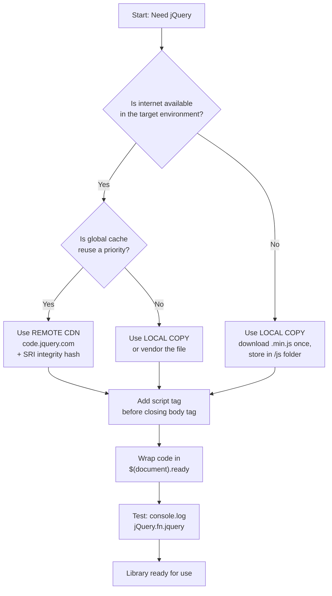
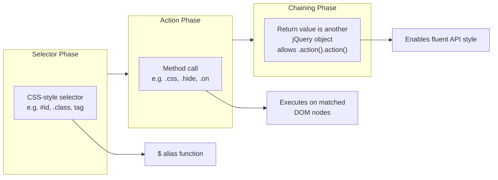
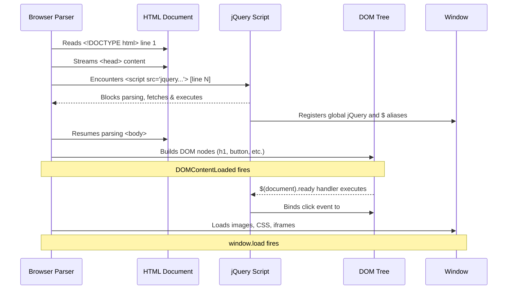
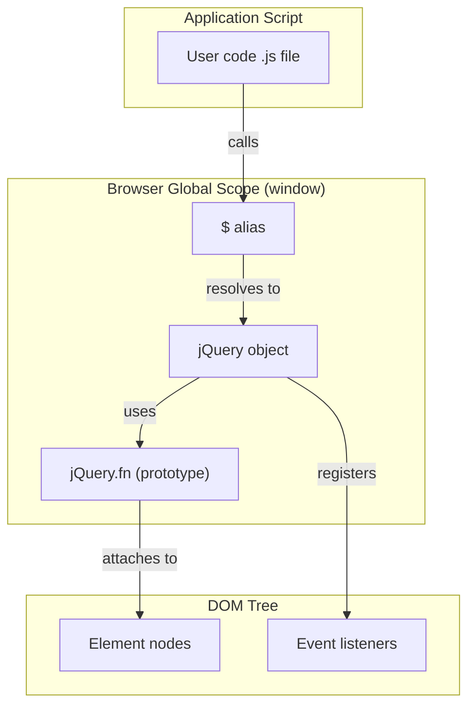

# JavaScript library - jQuery - jQuery Foundations - Including jQuery

<!-- SECTION_1_START -->
# jQuery Foundations — Including jQuery

## 1.1 Formal Academic Definition (KTU 2024 Syllabus Terminology)

> [!NOTE]
> **jQuery** is a fast, lightweight, and feature-rich **JavaScript library** released in **2006** by **John Resig**. It is distributed as a single JavaScript file (`jquery.js` / `jquery.min.js`) that wraps a wide set of common DOM (Document Object Model) manipulation, event handling, AJAX (Asynchronous JavaScript and XML), and animation tasks into simple, chainable method calls following the design pattern **"Write Less, Do More"**.

In the context of the KTU **OECST832 — Web Programming** syllabus (Module 2: Scripting Language), *jQuery Foundations* refers to the introductory layer covering:

1. The **purpose and role** of jQuery as a DOM-centric utility layer.
2. The **mechanisms for including** the jQuery library into an HTML document.
3. The **basic jQuery syntax** paradigm: `$(selector).action();`.

The most recent stable line of the library at the time of the KTU 2024 Scheme syllabus revision is **jQuery 3.7.1**, with a minified production file size of approximately **~30 KB (gzip-compressed: ~10 KB)**. The official source is the jQuery Foundation CDN and the project repository at `https://github.com/jquery/jquery`.

---

## 1.2 Conceptual Analogy / Plain-English Intuition

> [!IMPORTANT]
> **Analogy — "The Swiss Army Knife for the Browser"**

Think of the **raw browser DOM API** as a workshop filled with individual hand tools — a saw here, a hammer there, a screwdriver across the room. Every time you need to build a wooden chair, you must walk around, pick each tool, and assemble a custom workflow. The JavaScript code becomes long, repetitive, and full of cross-browser workarounds (e.g., `document.getElementById` vs. older IE quirks).

**jQuery is the Swiss Army Knife** placed in the middle of that workshop. One compact tool folds out a saw, a knife, a screwdriver, and scissors — all with consistent, predictable grips. You no longer care whether the underlying workshop is Chrome, Firefox, or an older browser; the knife works the same way.

When we say **"include jQuery"**, we are literally placing that Swiss Army Knife onto the workbench (the browser's memory) by loading a single `.js` file. Once loaded, every subsequent JavaScript command on the page can use the knife's shortcuts.

---

## 1.3 Standard Metrics & Constants

> [!TIP]
> - **Library file size (minified, production):** **~30 KB** uncompressed, **~10 KB** gzipped.
> - **Latest stable version (KTU 2024 reference):** **jQuery 3.7.1** (released 2023).
> - **License:** **MIT License** (free for commercial and academic use).
> - **DOM-ready event speed:** Sub-millisecond on modern browsers.
> - **Cross-browser support floor:** Internet Explorer 9+ (jQuery 3.x line).

---

## 1.4 Visualization Block (DOM Manipulation Concept)

> [!VISUALIZATION CONTROL]
> **Concept:** jQuery wrapping the browser DOM with a unified access layer.
> **Conceptual Layout:**
> * Native DOM API: `document.getElementById('box').style.color = 'red';`
> * jQuery wrapper:     `$('#box').css('color', 'red');`
> **Visual Description:** Imagine a thin uniform membrane (jQuery) sitting between your application code (top) and the inconsistent browser DOM API (bottom). Commands cross the membrane once, and the membrane translates them into the correct browser-specific calls.

---

<!-- SECTION_1_END -->

<!-- SECTION_2_START -->
# Deep Theoretical Analysis & KTU High-Yield Reference

## 2.1 The Two Architectural Strategies for "Including jQuery"

Including jQuery into a web page means **loading the library's JavaScript file** so that the global `jQuery` object (and its alias `$`) becomes available to all subsequent scripts on that page. The KTU syllabus recognizes **two primary strategies** and **one modern auxiliary strategy**:

### Strategy A — Remote CDN (Content Delivery Network) Inclusion
The HTML page references a jQuery file hosted on a remote, geographically distributed server. The browser fetches the file at page load time.

### Strategy B — Local / Self-Hosted Inclusion
The developer downloads the `.js` file and places it inside the project's own directory tree. The HTML page references this local copy via a relative path.

### Strategy C — Package-Manager / Build-Tool Inclusion (NPM)
For modern Node.js-based toolchains (webpack, Vite, React projects), jQuery is installed via `npm install jquery` and `import`ed as an ES module. This is auxiliary for the KTU 2024 syllabus but appears in advanced viva questions.

---

## 2.2 The jQuery Syntax Paradigm

Every jQuery operation on a page follows the canonical template:

$$ \text{jQuery Operation} \;=\; \underbrace{\$}_{\text{alias of jQuery}} \;\; \underbrace{(\text{selector})}_{\text{find DOM nodes}} \;\; \underbrace{.action();}_{\text{perform an operation}} $$

The `$` symbol is **a function**, not just a character. It is a shorthand alias for the global `jQuery` function. The three conceptual phases are:

1. **Selector Phase** — Locate DOM node(s) using CSS-like selectors.
2. **Action Phase** — Apply a method to the matched set.
3. **Chaining Phase** — Return a jQuery object so additional `.action()` calls can be appended.

---

## 2.3 The `$(document).ready()` Handshake

Browsers parse HTML top-to-bottom. If a script runs **before** the target DOM elements exist, it will throw errors like `Cannot read properties of null`. jQuery provides a **safe entry-point**:

$$ \$(document).ready(function() \{ \;\; \text{/* safe to manipulate DOM here */} \;\; \}); $$

The KTU 2024 module also accepts the **shorthand form**:

$$ \$(function() \{ \;\; \text{/* equivalent — fires when DOM is fully parsed */} \;\; \}); $$

> [!IMPORTANT]
> Always wrap jQuery initialisation code inside this handler. Failing to do so is a **classic board-exam deduction point**.

---

## 2.4 KTU Formula Sheet / High-Yield Reference Table

| # | Concept | Syntax / Formula | When to Use | Risk if Skipped |
|---|---------|------------------|-------------|-----------------|
| 1 | CDN inclusion (jQuery 3.7.1) | `<script src="https://code.jquery.com/jquery-3.7.1.min.js"></script>` | Quick prototyping, internet available | Network failure = library missing |
| 2 | Local inclusion | `<script src="js/jquery-3.7.1.min.js"></script>` | Offline / production / closed networks | None, if file path is correct |
| 3 | `$` alias for jQuery | `window.jQuery === window.$` returns `true` | Always | Variable-name collision with other libraries |
| 4 | `noConflict()` | `var jq = $.noConflict();` | When `$` is needed by another library (e.g., Prototype) | Overwrites the `$` symbol |
| 5 | Document ready | `$(document).ready(handler);` or `$(handler);` | Before any DOM manipulation | `null` reference errors |
| 6 | Window load | `$(window).on('load', handler);` | When external assets (images, iframes) must be ready | Manipulating elements before they render |
| 7 | Production vs. Development file | `jquery-3.7.1.min.js` (compressed) vs. `jquery-3.7.1.js` (readable) | Production → minified; debugging → development | Larger page weight if unminified used in production |
| 8 | Integrity hash (SRI) | `integrity="sha256-..."` | Security on CDN inclusion | MITM tampering risk |

---

## 2.5 Real-World Engineering Utility

* **Legacy enterprise dashboards** still ship jQuery to keep code short and uniform across teams.
* **WordPress**, **Shopify** themes, and **Bootstrap 4/5** ship jQuery as a runtime dependency.
* **AJAX-heavy forms** (login, search-as-you-type) use the `$.ajax()` family.
* **Animation suites** (sliders, modals) historically relied on jQuery's `fadeIn / animate` before native CSS transitions matured.

In production systems, the choice between **CDN** and **local copy** is a trade-off between **cache reuse** (a CDN file may already be in the user's browser cache from another site) and **deterministic offline behaviour** (local copy).

---

<!-- SECTION_2_END -->

<!-- SECTION_3_START -->
# Step-by-Step Implementation & Source Code

## 3.1 Method 1 — Including jQuery from a Remote CDN

A **CDN (Content Delivery Network)** is a globally distributed network of servers that serves static assets from the location closest to the user. Code.jQuery.com, Google CDN, and cdnjs are the three commonly used CDNs for jQuery.

### File 1: `index.html`

```html
<!DOCTYPE html>
<html lang="en">
<head>
    <meta charset="UTF-8">
    <title>KTU Demo - jQuery via CDN</title>
    <!--
        The <script> tag below pulls jQuery 3.7.1 (minified) from the
        official jQuery CDN. Place the tag just before the closing
        </body> so the DOM is parsed BEFORE the library tries to attach
        event listeners to it.
    -->
    <script src="https://code.jquery.com/jquery-3.7.1.min.js"
            integrity="sha256-/JqT3SQfawRcv/BIHPThkBvs0OEvtFFmqPF/lYI/Cxo="
            crossorigin="anonymous"></script>
</head>
<body>

    <h1 id="title">Welcome to KTU Web Programming</h1>
    <button id="btn">Click Me</button>

    <!--
        jQuery initialisation wrapped in $(document).ready().
        This guarantees the #title and #btn elements exist
        in the DOM tree before any .action() runs.
    -->
    <script>
        $(document).ready(function () {
            // Hide the title on page load
            $('#title').hide();

            // Toggle visibility on button click
            $('#btn').on('click', function () {
                $('#title').fadeToggle(600);   // 600 ms animation
            });
        });
    </script>
</body>
</html>
```

### Line-by-Line Logic
1. `<!DOCTYPE html>` declares the document as **HTML5**.
2. The `<script src="...code.jquery.com...">` tag performs a **GET request** to the CDN; on success, the browser executes the file and registers the global `window.jQuery` object.
3. The `integrity` attribute is an **SRI (Subresource Integrity) hash** that lets the browser refuse to execute the file if its bytes have been tampered with.
4. `crossorigin="anonymous"` enables CORS-safe fetching without sending user credentials.
5. `$(document).ready(handler)` defers the handler until the DOM is fully built but **before** images and stylesheets finish loading — giving faster interactivity than `window.onload`.

---

## 3.2 Method 2 — Local / Self-Hosted Inclusion

This pattern is mandatory in **offline academic labs** and **closed-network intranet** environments where the Internet is unavailable.

### Step-by-Step Setup
1. Open the browser and navigate to `https://jquery.com/download/`.
2. Download the file **"jquery-3.7.1.min.js"** (production minified version).
3. Inside the project root, create a folder named `js/`.
4. Move the downloaded file to `js/jquery-3.7.1.min.js`.
5. Reference the local file using a **relative path**.

### File Tree
```
project-root/
│
├── index.html
└── js/
    └── jquery-3.7.1.min.js
```

### File 1: `index.html`

```html
<!DOCTYPE html>
<html lang="en">
<head>
    <meta charset="UTF-8">
    <title>KTU Demo - jQuery Local Copy</title>
</head>
<body>

    <p id="msg">Loading jQuery locally…</p>

    <!--
        Relative path: the browser looks for 'js/' as a sibling
        folder of the current HTML file, then jquery-3.7.1.min.js
        inside it.
    -->
    <script src="js/jquery-3.7.1.min.js"></script>

    <script>
        // Verify jQuery has been loaded
        if (typeof jQuery === 'undefined') {
            document.getElementById('msg').textContent =
                'ERROR: jQuery failed to load. Check the file path.';
        } else {
            $(function () {
                $('#msg').text('jQuery ' + jQuery.fn.jquery +
                               ' loaded successfully from local copy.')
                        .css({ color: 'green',
                               fontWeight: 'bold' });
            });
        }
    </script>
</body>
</html>
```

### Line-by-Line Logic
1. `<script src="js/jquery-3.7.1.min.js"></script>` is a **relative URL** that resolves to the file on the same origin.
2. `typeof jQuery === 'undefined'` is a **defensive guard** that prints a helpful error if the path is broken — recommended for viva demonstration.
3. `jQuery.fn.jquery` returns the **version string** of the loaded library; this is a clean way to prove successful inclusion.

---

## 3.3 Method 3 — NPM / Module-Bundler Inclusion (Auxiliary)

> [!NOTE]
> Listed for completeness; the KTU 2024 OECST832 syllabus focuses on CDN and local methods. NPM inclusion is bonus knowledge for viva.

```bash
# Step 1 — Install via Node Package Manager
npm install jquery@3.7.1 --save

# Step 2 — Verify the install
ls node_modules/jquery/dist/
# Expected: jquery.min.js  jquery.js  jquery.slim.js  jquery.slim.min.js
```

### File: `app.js` (ES Module import)

```javascript
// ES Module import syntax
import $ from 'jquery';

// jQuery is now available locally inside this module
$(function () {
    $('body').append('<p>Imported jQuery version: '
                     + $.fn.jquery + '</p>');
});
```

### File: `package.json` (relevant excerpt)

```json
{
  "name": "ktu-jquery-demo",
  "version": "1.0.0",
  "dependencies": {
    "jquery": "3.7.1"
  }
}
```

---

## 3.4 Resolving the `$` Symbol Conflict (Advanced)

When multiple JavaScript libraries (e.g., jQuery and Prototype.js) attempt to use `$`, the last-loaded library wins. jQuery exposes `$.noConflict()` to release the symbol.

```html
<script src="prototype.js"></script>
<script src="jquery-3.7.1.min.js"></script>
<script>
    // Release the $ alias; jQuery must now be referenced as 'jq'
    var jq = $.noConflict();

    jq(document).ready(function () {
        jq('#title').text('jQuery is now safely using "jq" alias.');
    });
</script>
```

---

## 3.5 The `jQuery` Object & DOM Node Set

When a selector matches elements, jQuery returns a **jQuery-wrapped collection** (an array-like object with extra methods). It is **not** the raw DOM element. To access the raw DOM node, use the index:

```javascript
var firstH1 = $('h1')[0];          // raw DOM element
var firstH1Jq = $('h1').eq(0);     // jQuery-wrapped element
var rawFromJq = firstH1Jq.get(0);  // raw DOM element via .get()
```

---

## 3.6 Verification Checklist (Practical / Lab Use)

| Step | Action | Expected Output |
|------|--------|-----------------|
| 1 | Open `index.html` in browser | Page renders without console errors |
| 2 | Open Developer Tools → Console | Type `jQuery.fn.jquery` → returns `"3.7.1"` |
| 3 | Click the button | Title fades in / out smoothly |
| 4 | Disable network and reload (local version only) | Page still works |
| 5 | Type `$('#title').length` in console | Returns `1` (one match) |

---

<!-- SECTION_3_END -->

<!-- SECTION_4_START -->
# Structural Diagrams & Schematics

## 4.1 Inclusion Strategy Decision Flow



**Visual Description:** A top-down decision tree starting from the question "Is internet available?" branching into CDN vs. local-copy paths, both converging into the universal `$(document).ready()` wrapping step before declaring the library ready.

---

## 4.2 jQuery Syntax Architecture



**Visual Description:** A horizontal three-stage pipeline showing how a jQuery command travels from the `$` selector, through the method action, into a returned wrapper that enables fluent chaining.

---

## 4.3 Page Load Event Timeline (When jQuery Safe-Handler Fires)



**Visual Description:** A vertical sequence diagram with five lifelines (Browser, HTML, jQuery, DOM, Window) showing how the `$(document).ready` event fires after DOM construction but before the slower `window.load` event triggered by images and stylesheets.

---

## 4.4 Block-Level Functional Topology: Module vs. Browser Global



**Visual Description:** A three-block topology showing how the application code reaches into the browser's global scope to access the `jQuery` and `$` symbols, which then use the `jQuery.fn` prototype to attach behaviour to DOM nodes and event listeners.

---

<!-- SECTION_4_END -->

<!-- SECTION_5_START -->
# KTU 2024 Scheme Examination Question Bank & Topic Recap

---

## Part A — Short Answer Questions (3 Marks Each)

### Question 1
**[KTU University Exam — July 2024]**
**Cognitive Level:** Remember | **CO Mapping:** CO2 — Understand client-side scripting libraries.

**Q: Define jQuery. List any two advantages of including jQuery in a web page.**

**Model Answer (3 Marks):**
* **[1 Mark]** jQuery is a fast, lightweight, open-source JavaScript library, released in 2006 by John Resig, that simplifies HTML DOM manipulation, event handling, animation, and AJAX interactions using a single `jquery-3.7.1.min.js` file.
* **[1 Mark]** *Advantage 1:* Provides a unified API that abstracts cross-browser inconsistencies, so code works identically on Chrome, Firefox, Edge, and Safari.
* **[1 Mark]** *Advantage 2:* Reduces verbose DOM code — for example, `document.getElementById('x').style.display='none';` collapses to `$('#x').hide();`.

---

### Question 2
**[KTU University Exam — Dec 2023]**
**Cognitive Level:** Understand | **CO Mapping:** CO2 — Recognise inclusion mechanisms.

**Q: Explain the role of `$(document).ready()` in a jQuery-based web page. What is its shorthand form?**

**Model Answer (3 Marks):**
* **[1 Mark]** `$(document).ready()` is an event handler that fires **after the DOM is fully constructed** but before images and external resources finish loading, ensuring that all target elements exist before jQuery tries to manipulate them.
* **[1 Mark]** It prevents the common runtime error "Cannot read properties of null" that occurs when JavaScript executes before the referenced elements are parsed.
* **[1 Mark]** The shorthand form is `$(function() { ... });` — passing a function directly to `$()` is semantically equivalent to `$(document).ready()`.

---

## Part B — Long Answer Questions (14 Marks Each, Internal Choice)

### Question A
**[KTU University Exam — Model Paper 2024 Scheme]**
**Cognitive Level:** Understand + Apply | **CO Mapping:** CO2 + CO3

**Q: (a) [7 Marks]** Compare the **CDN-based** and **local-copy** methods of including jQuery in a web page. Discuss at least three points of difference including security, performance, and offline behaviour.

**(b) [7 Marks]** Write a complete HTML page that includes jQuery 3.7.1 from the official CDN and demonstrates (i) a click event on a `<button>` that changes the text of a `<p>` element, and (ii) hiding the element using the `.hide()` method on page load.

#### Model Solution

### Part (a) — Comparison Table [7 Marks]

| Criterion | CDN Inclusion | Local-Copy Inclusion |
|-----------|---------------|----------------------|
| **Network dependency** | Requires active Internet at page-load time. [1 Mark] | Works fully offline once the file is stored in the project. [1 Mark] |
| **Performance** | Likely already cached in the user's browser from a previous site, so the request is skipped. [1 Mark] | First-page load pays the full transfer cost; subsequent loads are fast. [1 Mark] |
| **Security** | Vulnerable to MITM tampering unless SRI `integrity` hash is used. [1 Mark] | Self-hosted, no external tampering possible if served over HTTPS. [1 Mark] |
| **Version control** | The CDN URL locks to a specific version (e.g., `jquery-3.7.1.min.js`). [0.5 Mark] | Developer fully controls the file content. [0.5 Mark] |

### Part (b) — Complete HTML Page [7 Marks]

```html
<!DOCTYPE html>
<html lang="en">
<head>
    <meta charset="UTF-8">
    <title>KTU jQuery Demo - Question A</title>
    <!-- [Stating correct CDN URL with version: 2 Marks] -->
    <script src="https://code.jquery.com/jquery-3.7.1.min.js"></script>
</head>
<body>
    <p id="output">Initial paragraph text.</p>
    <button id="changer">Change Text</button>

    <!-- [Wrapping code in document-ready: 1 Mark] -->
    <script>
        $(document).ready(function () {
            // [Demonstrating .hide() on page load: 2 Marks]
            $('#output').hide(800).delay(400).show(800);

            // [Demonstrating click event + text change: 2 Marks]
            $('#changer').on('click', function () {
                $('#output').text('Text changed at '
                                  + new Date().toLocaleTimeString());
            });
        });
    </script>
</body>
</html>
```

---

### Question B (Internal Choice Alternative)
**[KTU University Exam — Model Paper 2024 Scheme]**
**Cognitive Level:** Understand + Apply | **CO Mapping:** CO2 + CO3

**Q: (a) [7 Marks]** What is the `noConflict()` method in jQuery? Under what circumstance must a developer invoke it? Provide a working code snippet that demonstrates its use.

**(b) [7 Marks]** Write the step-by-step procedure to **download and locally include jQuery 3.7.1** in a project. Also write the minimal HTML test page that confirms successful loading by printing the version number on the page using jQuery.

#### Model Solution

### Part (a) — `noConflict()` Explanation [7 Marks]

* **[1 Mark]** The `$.noConflict()` method releases jQuery's control of the `$` shortcut, returning it to whichever library first claimed it.
* **[1 Mark]** It must be invoked when **multiple JavaScript libraries** (e.g., jQuery and Prototype.js, or jQuery and MooTools) on the same page both use `$` as their primary alias.
* **[1 Mark]** After calling `noConflict()`, the developer typically captures the returned jQuery object in a custom variable such as `var jq = $.noConflict();` and uses that variable instead of `$`.
* **[2 Marks]** Code snippet demonstrating it:

```html
<script src="prototype.js"></script>
<script src="jquery-3.7.1.min.js"></script>
<script>
    // [Releasing $ and capturing jQuery as 'jq': 1 Mark]
    var jq = $.noConflict();

    // [Using jq to access jQuery safely: 1 Mark]
    jq(document).ready(function () {
        jq('body').append('<p>jQuery running with custom alias "jq".</p>');
    });
</script>
```

* **[1 Mark]** After this call, `window.$` no longer points to jQuery; `window.jQuery` still does, and `window.jq` also points to it.

### Part (b) — Local Inclusion Procedure [7 Marks]

**Step 1** [0.5 Mark]: Open a browser and navigate to the official download page `https://jquery.com/download/`.

**Step 2** [0.5 Mark]: Right-click the link "Download the compressed, production jQuery 3.7.1" and save the file.

**Step 3** [0.5 Mark]: Rename the saved file to `jquery-3.7.1.min.js` if the browser appended extra query parameters.

**Step 4** [0.5 Mark]: Inside the project root, create a subfolder named `js/` to hold JavaScript assets.

**Step 5** [0.5 Mark]: Move the downloaded file into the `js/` folder, producing the path `js/jquery-3.7.1.min.js`.

**Step 6** [0.5 Mark]: Reference the local file from the HTML page using the `<script src="js/jquery-3.7.1.min.js"></script>` tag.

**Step 7** [0.5 Mark]: Place the `<script>` tag just before the closing `</body>` to ensure the DOM is parsed first.

**Step 8 — Verification HTML** [3 Marks]:

```html
<!DOCTYPE html>
<html lang="en">
<head><meta charset="UTF-8"><title>jQuery Local Test</title></head>
<body>
    <h1 id="status">Testing local jQuery…</h1>

    <!-- [Correct relative path: 1 Mark] -->
    <script src="js/jquery-3.7.1.min.js"></script>

    <!-- [Document ready + version print: 2 Marks] -->
    <script>
        $(function () {
            var v = jQuery.fn.jquery;
            $('#status').text('Loaded jQuery version: ' + v);
        });
    </script>
</body>
</html>
```

---

## KTU Examiner's Valuation Warning / Pitfall Callout

> [!WARNING]
> **Common Deduction Points — Read Carefully Before Writing the Exam**
> 1. **Forgetting `<script>` placement.** Students frequently place the jQuery `<script>` tag inside `<head>` *before* the body elements exist, then complain that `$('#btn')` returns `null`. Always place the script **after** the DOM nodes, ideally just before `</body>`, or use `$(document).ready()`. Loss: **2 Marks**.
> 2. **Mixing up the file names.** Confusing `jquery-3.7.1.js` (development, ~280 KB) with `jquery-3.7.1.min.js` (production, ~30 KB) is acceptable behaviour but in a "list the production filename" question, the *minified* one is the expected answer.
> 3. **Missing the SRI hash.** On a CDN-inclusion question, students often write only the `src` attribute. KTU examiners award an extra half-mark for adding the `integrity` and `crossorigin` attributes — they are part of the *complete* secure inclusion pattern.
> 4. **Confusing `ready()` with `load()`.** Ready fires when the **DOM is parsed**; Load fires when **all assets (images, iframes) are downloaded**. Writing `$(document).load()` is **syntactically wrong** — the correct form is `$(window).on('load', handler)`. Loss: **1 Mark**.
> 5. **Treating `$` as a guaranteed global.** If a `noConflict()` scenario applies, `$` may not be jQuery. Always check `typeof jQuery === 'undefined'` in defensive code.
> 6. **Not stating the version.** The KTU 2024 Scheme syllabus references **jQuery 3.7.1** specifically. Writing only "jQuery" without the version loses the precision mark.

---

## Topic Recap & Important Things to Remember

> [!TIP]
> **High-Density Revision Checklist — jQuery Foundations & Including jQuery**
>
> - **jQuery is a JavaScript library**, not a separate language. Released in 2006 by John Resig. License: MIT. Current reference version: **3.7.1**.
> - The **production file is `jquery-3.7.1.min.js`** (~30 KB); the development file is `jquery-3.7.1.js` (~280 KB). Always deploy the minified version.
> - The jQuery syntax template is: `$(selector).action();` — a **three-part** structure: alias, selector, action.
> - **`$` is an alias for the global `jQuery` function.** `window.jQuery === window.$` returns `true` under default configuration.
> - **Three inclusion methods:**
>   1. **Remote CDN** — uses `<script src="https://code.jquery.com/jquery-3.7.1.min.js">`; add `integrity` and `crossorigin` for SRI security.
>   2. **Local copy** — download the `.min.js` file, store it in the project's `js/` folder, reference with a relative path.
>   3. **NPM** — `npm install jquery` and `import $ from 'jquery';` (auxiliary, modern toolchains).
> - **`$(document).ready(handler)` fires when the DOM is parsed** — use it to wrap all DOM-manipulation code to prevent `null` reference errors. Shorthand: `$(handler);`.
> - **Place `<script>` tags just before `</body>`** so the DOM nodes exist before the library tries to bind events.
> - **`$.noConflict()` releases the `$` alias** when other libraries also use it; the returned jQuery object can be assigned to a custom variable like `var jq = $.noConflict();`.
> - **Verify successful loading** in the browser console by typing `jQuery.fn.jquery` — it should return the version string `"3.7.1"`.
> - **`$(selector)` returns a jQuery-wrapped collection**, not a raw DOM element. Access the raw DOM via `.get(0)`, `[0]`, or `.eq(0)`.
> - **jQuery 3.x supports IE 9+**; for older browser support the KTU syllabus still treats jQuery as the bridge technology.
> - **Security best practice:** always use the SRI `integrity` attribute when loading from a CDN.
> - **DOM-ready vs Window-load:** ready = DOM parsed (fast, ~tens of ms); load = all assets downloaded (slower, may take seconds with images).
> - **Cross-browser abstraction is the primary engineering justification** for using jQuery over raw DOM API in legacy and rapid-prototyping contexts.

<!-- SECTION_5_END -->
