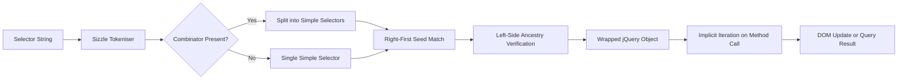

# jQuery Selectors

<!-- SECTION_1_START -->
# jQuery Selectors — Core Definition & Intuitive Overview

## 1.1 Formal Academic Definition

In the **KTU 2024 Scheme** syllabus for **OECST832 — Web Programming** (Module 2: Scripting Language), a **jQuery Selector** is formally defined as a *string expression* passed to the core factory function **jQuery()** (aliased as **$()**) that uses a CSS-like grammar combined with custom pseudo-class extensions to query and retrieve a wrapped set of zero or more DOM elements from the document object model of an HTML page.

The general signature is:

$$
\text{jQuery}(\text{selector}, \text{context}) \;\rightarrow\; \text{jQuery Object (wrapped set)}
$$

where the **selector** argument is a *CSS3 selector string* and the optional **context** argument defaults to the **document** root.

> [!IMPORTANT]
> **Syllabus Highlight (KTU 2024 OECST832 — Module 2):**
> Students are expected to master **Basic Selectors**, **Hierarchy Selectors**, **Basic Filter**, **Content Filter**, **Visibility Filter**, **Attribute Filter**, **Child Filter**, and **Form Selectors**. Internal lab evaluation frequently tests hierarchy and form selectors.

## 1.2 Conceptual Analogy / Intuition

Imagine the **HTML DOM** as a **giant family tree of a city**. Every person (element) has a name, an address, a job, and relationships — parents, children, siblings. Now imagine you are a **postal delivery officer** who needs to find specific people. Instead of walking door-to-door, you shout a **description into a microphone** (the selector string). The city's *magic listener* (the jQuery engine) instantly returns a *list of matching people wrapped in a labelled envelope* (the jQuery wrapped set).

For example:
- Shouting **"all people named `p`"** is the element selector `$('p')`.
- Shouting **"the person living at house \#header"** is the id selector `$('#header')`.
- Shouting **"all people wearing a `.btn` badge"** is the class selector `$('.btn')`.
- Shouting **"all employees whose badge contains the word 'manager'"** is a content filter `$(':contains("manager")')`.

The *magic* is that this listener already knows CSS, XPath, and the jQuery-specific extensions, so it can interpret very sophisticated descriptions in a single string.

## 1.3 Standard Metrics & Constants

> [!NOTE]
> **Engine Constants to Memorise:**
> - **CSS Version Grounded:** jQuery selectors are backward-compatible with **CSS 1, 2, and 3** plus **custom pseudo-classes**.
> - **Return Type:** Always a *jQuery object* (array-like wrapped set), even if zero or one element matches. The wrapped set is **not a live NodeList**.
> - **Implicit Iteration:** jQuery automatically iterates over the wrapped set when methods are invoked — *no manual loop required*.
> - **Default Context:** `$(selector)` is shorthand for `$(selector, document)`.

## 1.4 GeoGebra / Visualisation Control

> [!VISUALIZATION CONTROL]
> **Concept:** *Selector matching as set-intersection over the DOM tree*
> **GeoGebra / Desmos Input Points (conceptual mapping):**
> - `A = (id="header")` — set of all nodes carrying the id `header`
> - `B = (tag="div")` — set of all `div` nodes
> - `C = (.btn)` — set of all nodes with class `btn`
> **Visual Description:** Plot each selector as a coloured region on a 1-D number line representing the document order. The intersection (overlap) of regions equals the elements returned by a compound selector like `$('div.btn#header')`. Students should observe how the intersection shrinks as more constraints are added.

<!-- SECTION_1_END -->

<!-- SECTION_2_START -->
# Deep Theoretical Analysis & KTU High-Yield Cheat Sheet

## 2.1 Taxonomy of jQuery Selectors

The jQuery selector engine is internally powered by **Sizzle** (a pure-JavaScript CSS selector engine). The selector library is partitioned into the following eight families mandated by the KTU 2024 Module-2 syllabus.

### 2.1.1 Basic Selectors
| Selector Pattern | Description | Example |
|---|---|---|
| `$('tag')` | Matches every element with the given HTML tag | `$('p')` returns every paragraph |
| `$('#id')` | Matches the single element with the given `id` attribute | `$('#logo')` |
| `$('.class')` | Matches every element with the given CSS class | `$('.btn')` |
| `$('*')` | **Universal selector** — matches every element in the document | `$('*').css('color','red')` |
| `$('sel1, sel2, sel3')` | **Multiple / Grouped selector** — union of multiple simple selectors | `$('h1, h2, h3')` |

### 2.1.2 Hierarchy Selectors
| Selector Pattern | Description | Example |
|---|---|---|
| `$('ancestor descendant')` | **Descendant combinator** — matches every `descendant` at any depth inside `ancestor` | `$('div p')` |
| `$('parent > child')` | **Child combinator** — matches only direct children | `$('ul > li')` |
| `$('prev + next')` | **Adjacent sibling** — matches `next` immediately after `prev` | `$('h2 + p')` |
| `$('prev ~ siblings')` | **General sibling** — matches all following siblings | `$('h2 ~ p')` |

### 2.1.3 Basic Filter Selectors
| Selector Pattern | Description |
|---|---|
| `$(':first')` | First matched element of the wrapped set |
| `$(':last')` | Last matched element |
| `$(':even')` | Elements with **0-based even** indices |
| `$(':odd')` | Elements with **0-based odd** indices |
| `$(':eq(n)')` | Element with 0-based index `n` |
| `$(':gt(n)')` | Elements with index *greater than* `n` |
| `$(':lt(n)')` | Elements with index *less than* `n` |
| `$(':header')` | All heading elements `<h1>` to `<h6>` |
| `$(':animated')` | Elements currently under a jQuery animation |
| `$(':focus')` | Element that currently holds keyboard focus |

### 2.1.4 Content Filter Selectors
| Selector Pattern | Description |
|---|---|
| `$(':contains("text")')` | Elements whose text content contains the literal string |
| `$(':empty')` | Elements with no children (including text nodes) |
| `$(':has(selector)')` | Elements that contain at least one descendant matching `selector` |
| `$(':parent')` | Elements that are parents of at least one child node (text or element) |

### 2.1.5 Visibility Filter Selectors
| Selector Pattern | Description |
|---|---|
| `$(':visible')` | Elements that occupy space in the layout |
| `$(':hidden')` | Elements with `display:none`, `visibility:hidden`, `type="hidden"`, hidden parents, or zero dimensions |

### 2.1.6 Attribute Filter Selectors
| Selector Pattern | Description |
|---|---|
| `$('[attr]')` | Element has the attribute, regardless of value |
| `$('[attr="val"]')` | Attribute exactly equals `val` |
| `$('[attr!="val"]')` | Attribute does *not* equal `val` (or is missing) |
| `$('[attr^="val"]')` | Attribute *starts with* `val` |
| `$('[attr$="val"]')` | Attribute *ends with* `val` |
| `$('[attr*="val"]')` | Attribute *contains* `val` as substring |
| `$('[attr~="val"]')` | Attribute is a whitespace-separated list containing `val` |
| `$('[attr\mid="val"]')` | Attribute equals `val` or begins with `val-` (language codes) |

### 2.1.7 Child Filter Selectors
| Selector Pattern | Description |
|---|---|
| `$(':first-child')` | Element that is the first child of its parent |
| `$(':last-child')` | Element that is the last child of its parent |
| `$(':nth-child(n)')` | nth child (1-indexed) of its parent; accepts formula `an+b` |
| `$(':only-child')` | Element that is the *sole* child of its parent |
| `$(':nth-last-child(n)')` | nth child counting from the last |
| `$(':only-of-type')` | Element that has no siblings of the same type |

### 2.1.8 Form Selectors
| Selector Pattern | Description |
|---|---|
| `$(':input')` | All form elements (`input, textarea, select, button`) |
| `$(':text')` | `<input type="text">` |
| `$(':password')` | `<input type="password">` |
| `$(':radio')` | `<input type="radio">` |
| `$(':checkbox')` | `<input type="checkbox">` |
| `$(':submit')` | `<input type="submit">` and `<button type="submit">` |
| `$(':reset')` | `<input type="reset">` and `<button type="reset">` |
| `$(':button')` | `<button>` and `<input type="button">` |
| `$(':file')` | `<input type="file">` |
| `$(':hidden')` | Form fields of type hidden |
| `$(':enabled')` | All enabled form elements |
| `$(':disabled')` | All disabled form elements |
| `$(':checked')` | Checked checkboxes and radio buttons |
| `$(':selected')` | Selected `<option>` elements |

## 2.2 The 'Why' Behind the Selector Engine

The selector string is parsed left-to-right by **Sizzle**, which tokenises the string into a sequence of *simple selectors* joined by *combinators*. The engine then traverses the DOM and applies an optimised *rightmost-first* matching strategy with a *seed-filter* verification. This is why **right-side specificity** in a compound selector has the largest performance impact — Sizzle filters from the right and verifies ancestry on the left.

> [!NOTE]
> **Engineering Utility (Production Relevance):**
> In production web stacks (e.g. e-commerce carts, social newsfeeds, ERP dashboards) jQuery selectors power:
> - **Event delegation** on dynamically injected DOM nodes.
> - **AJAX DOM patching** — selecting the right insertion point.
> - **Form validation pipelines** — reading `:checked` and `:selected` states.
> - **Animation choreography** — chaining selectors to fade/highlight elements in order.
>
> Despite the rise of React/Vue, jQuery selectors are still the *lingua franca* of WordPress plugins, Magento themes, and legacy banking portals.

## 2.3 KTU High-Yield Cheat Sheet

| # | Selector | Type | Returns |
|:-:|---|---|---|
| 1 | `$('*')` | Basic | Every element |
| 2 | `$('#id')` | Basic | One element with given id |
| 3 | `$('.cls')` | Basic | Elements with given class |
| 4 | `$('a, b, c')` | Basic (grouped) | Union of all three |
| 5 | `$('div p')` | Hierarchy (descendant) | All `p` inside any `div` |
| 6 | `$('div > p')` | Hierarchy (child) | Direct `p` children of `div` |
| 7 | `$('h1 + p')` | Hierarchy (adjacent) | First `p` after each `h1` |
| 8 | `$('h1 ~ p')` | Hierarchy (sibling) | All `p` siblings after `h1` |
| 9 | `$('tr:even')` | Basic filter | Even rows (zebra-striping) |
| 10 | `$(':contains("KTU")')` | Content filter | Elements containing text `KTU` |
| 11 | `$(':visible')` | Visibility filter | Currently rendered elements |
| 12 | `$('[data-role="admin"]')` | Attribute filter | Elements with custom `data-role` attribute |
| 13 | `$('li:nth-child(2n+1)')` | Child filter | Odd list items |
| 14 | `$(':input')` | Form | All form controls |
| 15 | `$(':checked')` | Form | Selected radios/checkboxes |

> [!TIP]
> **Mnemonic for the exam:** *B-H-B-C-V-A-C-F* → **B**asic, **H**ierarchy, **B**asic-filter, **C**ontent, **V**isibility, **A**ttribute, **C**hild, **F**orm.

<!-- SECTION_2_END -->

<!-- SECTION_3_START -->
# Step-by-Step Derivations & Code Implementation

## 3.1 Setting Up the Laboratory Environment

Every code listing in this module assumes the official jQuery 3.x CDN is loaded inside the `<head>` tag, *before* any custom script.

```html
<!DOCTYPE html>
<html lang="en">
<head>
  <meta charset="UTF-8">
  <title>KTU jQuery Selectors Lab</title>
  <!-- jQuery CDN loaded BEFORE the user script -->
  <script src="https://code.jquery.com/jquery-3.7.1.min.js"
          integrity="sha256-/JqT3SQfawRcv/BIHPThkBvs0OEvtFFmqPF/lYI/Cxo="
          crossorigin="anonymous"></script>
  <style>
    .highlight { background-color: #ffe082; }
    .box { border: 1px solid #1565c0; padding: 8px; margin: 4px; }
  </style>
</head>
<body>
  <h2 id="title">KTU jQuery Selector Demonstration</h2>

  <div class="container">
    <p class="note">Paragraph one — first child.</p>
    <p class="note important">Paragraph two — has extra class.</p>
    <ul id="menu">
      <li>Home</li>
      <li>About</li>
      <li>Courses
        <ul>
          <li>B.Tech CSE</li>
          <li>B.Tech ECE</li>
        </ul>
      </li>
    </ul>
  </div>

  <form id="regForm">
    <input type="text"     name="username" placeholder="Username"><br>
    <input type="password" name="pwd"      placeholder="Password"><br>
    <label><input type="checkbox" name="agree" value="yes"> I agree</label><br>
    <select name="branch">
      <option value="cse">CSE</option>
      <option value="ece">ECE</option>
      <option value="me">ME</option>
    </select><br>
    <button type="submit">Register</button>
  </form>

  <script>
    /* All jQuery code goes here inside $(document).ready() */
    $(document).ready(function() {
      // ... examples below ...
    });
  </script>
</body>
</html>
```

## 3.2 Derivation 1 — Selecting by Tag and Class

**Problem Statement:** Highlight every paragraph that carries the class `important` inside the `container` div, and log the count to the console.

**Reasoning Chain:**
1. Wrap the DOM-readiness guarantee with `$(document).ready(handler)`.
2. Use a *tag+class compound selector* `p.important` to filter.
3. Apply the jQuery method `.addClass()` and `.length`.

```javascript
$(document).ready(function () {
  // Step 1: Select every <p> that has class "important"
  var $important = $('p.important');

  // Step 2: Add the highlight class to every matched element
  $important.addClass('highlight');

  // Step 3: Implicit iteration — addClass runs for every element
  console.log('Number of important paragraphs: ' + $important.length);
});
```

**Walkthrough of the output for the demo HTML:**
- `$('p.important')` evaluates to the wrapped set containing **1 element** (the second paragraph).
- `addClass('highlight')` paints its background yellow.
- The console prints `Number of important paragraphs: 1`.

## 3.3 Derivation 2 — Hierarchy Selectors

**Problem Statement:** From the nested list `#menu`, retrieve (a) every list item at *any depth*, (b) only the *direct* list items, and (c) the item labelled `Courses` followed by its adjacent sub-list.

```javascript
$(document).ready(function () {
  // (a) Descendant combinator — space — "any li inside #menu"
  var $allLi = $('#menu li');
  console.log('All <li> (descendants): ' + $allLi.length); // 5

  // (b) Child combinator — ">" — only DIRECT children
  var $directLi = $('#menu > li');
  console.log('Direct <li> (children):  ' + $directLi.length); // 3

  // (c) Adjacent sibling — "+" — the <ul> that follows the "Courses" <li>
  var $subList = $('#menu > li:contains("Courses") + ul');
  console.log('Sub-list matched:        ' + $subList.length); // 1
});
```

**Step-by-Step Trace:**
1. `$('#menu li')` traverses recursively: *Home*, *About*, *Courses*, *B.Tech CSE*, *B.Tech ECE* → 5 hits.
2. `$('#menu > li')` stops at depth 1: *Home*, *About*, *Courses* → 3 hits.
3. `$('#menu > li:contains("Courses")')` returns the third `<li>`. The `+ ul` combinator then returns the `<ul>` immediately following it → 1 hit.

## 3.4 Derivation 3 — Basic Filter `:eq`, `:gt`, `:lt`

**Problem Statement:** Apply a red colour to the first list item, a green colour to the last, and a blue colour to all items in between (zebra-style highlight with three colours).

```javascript
$(document).ready(function () {
  var $items = $('#menu > li');          // wrapped set of 3

  $items.eq(0).css('color', 'red');      // :eq(0) → first
  $items.eq(-1).css('color', 'green');   // negative index counts from end
  // Middle items: index strictly between 0 and 2
  $items.filter(function (i) {
    return i > 0 && i < $items.length - 1;
  }).css('color', 'blue');
});
```

> [!NOTE]
> **Negative indices:** `$items.eq(-1)` is equivalent to `$(':last')`. This is a *jQuery extension* not present in vanilla CSS.

## 3.5 Derivation 4 — Content and Visibility Filters

```javascript
$(document).ready(function () {
  // :contains — case-sensitive substring match
  var $withKtu = $('p:contains("KTU")');
  console.log('Paragraphs mentioning KTU: ' + $withKtu.length);

  // :has — elements that contain a specific descendant
  var $listsWithSub = $('ul:has(ul)');
  console.log('Lists containing another list: ' + $listsWithSub.length); // 1 (Courses)

  // :empty — true empty elements (no text, no children)
  var $empties = $('p:empty');
  console.log('Empty paragraphs: ' + $empties.length);

  // :hidden vs :visible on a programmatically hidden div
  $('#title').hide();
  console.log('Hidden h2:    ' + $(':hidden:has(#title)').length);
  console.log('Visible body: ' + $('body :visible').length);
});
```

## 3.6 Derivation 5 — Attribute Filters

**Problem Statement:** Select every input whose `name` starts with `user`, every anchor whose `href` ends with `.pdf`, and any element carrying the custom attribute `data-role`.

```javascript
$(document).ready(function () {
  // ^ =  starts-with,   $ = ends-with,   * = contains
  $('input[name^="user"]').css('background', '#e3f2fd');
  $('a[href$=".pdf"]').css('text-decoration', 'underline wavy red');
  $('[data-role]').css('border-left', '4px solid #2e7d32');
});
```

> [!TIP]
> Custom data attributes (`data-*`) are the *idiomatic* way to attach metadata for jQuery selection in modern HTML5.

## 3.7 Derivation 6 — Child Filters with Formula Argument

**Problem Statement:** In a striped table, colour every odd row grey and every even row white. The selector `:nth-child(odd)` is the 1-indexed sibling-aware equivalent of `:odd` which is 0-indexed.

```html
<table id="marks" border="1">
  <tr><td>Row 1</td></tr>
  <tr><td>Row 2</td></tr>
  <tr><td>Row 3</td></tr>
  <tr><td>Row 4</td></tr>
</table>
```

```javascript
$(document).ready(function () {
  $('#marks tr:nth-child(odd)').css('background', '#eeeeee');
  $('#marks tr:nth-child(even)').css('background', '#ffffff');
  // Formula form: 2n+1 selects 1st, 3rd, 5th...
  $('#marks tr:nth-child(2n+1)').css('font-weight', 'bold');
});
```

## 3.8 Derivation 7 — Form Selectors for Live Validation

**Problem Statement:** On the registration form, read which checkbox is checked, what option is selected, and disable the submit button until the checkbox is ticked.

```javascript
$(document).ready(function () {
  var $agree  = $('#regForm :checkbox[name="agree"]');
  var $branch = $('#regForm select[name="branch"]');
  var $submit = $('#regForm :submit');

  // Disable submit until checkbox is checked
  $submit.prop('disabled', true);

  $agree.on('change', function () {
    $submit.prop('disabled', !this.checked);
    if (this.checked) {
      console.log('Agreed! Branch = ' + $branch.val());
    }
  });
});
```

## 3.9 Derivation 8 — Compound & Chained Selection

**Problem Statement:** Find every `<a>` element inside `<li>` elements that are direct children of an `<ul>` whose `id` is `menu`, *and* whose text contains the word `Home`.

```javascript
$(document).ready(function () {
  // Compound chain — reads left-to-right
  var $homeLink = $('#menu > li:contains("Home") a');
  console.log('Home anchor: ' + $homeLink.length);

  // Equivalent long-form
  var $ul       = $('#menu');
  var $directLi = $ul.children('li');                // > li
  var $homeLi   = $directLi.filter(':contains("Home")');
  var $link     = $homeLi.find('a');                 // descendant a
  console.log('Long-form count: ' + $link.length);
});
```

Both forms return the same wrapped set; the second form is preferred for **readability** and **debugging**, while the first form is preferred for **performance** (single Sizzle pass).

## 3.10 Master Demo — Putting It All Together

```html
<!DOCTYPE html>
<html>
<head>
  <meta charset="UTF-8">
  <title>Master jQuery Selector Demo</title>
  <script src="https://code.jquery.com/jquery-3.7.1.min.js"></script>
  <style>
    body { font-family: Arial, sans-serif; padding: 20px; }
    .hl { background: #fff59d; }
    .err { color: #c62828; }
  </style>
</head>
<body>

  <h2 id="hd">KTU Master Demo</h2>
  <div class="card">
    <p class="msg">Welcome to jQuery selectors.</p>
    <p class="msg special">This one is special.</p>
    <ul id="lst">
      <li>Apple</li>
      <li>Banana</li>
      <li>Cherry
        <ul>
          <li>Red Cherry</li>
          <li>Black Cherry</li>
        </ul>
      </li>
    </ul>
  </div>

  <a href="doc.pdf"  >Manual PDF</a> |
  <a href="img.png"  >Logo PNG</a> |
  <a href="sheet.pdf">Marks PDF</a>

  <script>
    $(function () {
      // 1. Tag + class
      $('p.special').addClass('hl');

      // 2. Hierarchy
      $('#lst > li:contains("Cherry") + ul li').css('color', '#1565c0');

      // 3. Attribute
      $('a[href$=".pdf"]').css('font-weight', 'bold');

      // 4. Filter
      $('p:even').css('font-style', 'italic');

      // 5. Form
      console.log('Document ready — selectors executed.');
    });
  </script>
</body>
</html>
```

**Expected Visual Effect:** The second paragraph turns yellow, the inner cherry sub-items turn blue, all PDF links become bold, and even-indexed paragraphs are italicised.

<!-- SECTION_3_END -->

<!-- SECTION_4_START -->
# Structural Diagrams & Schematics

## 4.1 Mermaid Block — jQuery Selector Taxonomy Tree

```mermaid
graph TD
    rootA["jQuery Selectors"]:::root
    rootA --> bscA["Basic Selectors"]
    rootA --> hryA["Hierarchy Selectors"]
    rootA --> bflA["Basic Filter"]
    rootA --> cnfA["Content Filter"]
    rootA --> vflA["Visibility Filter"]
    rootA --> atfA["Attribute Filter"]
    rootA --> cflA["Child Filter"]
    rootA --> frmA["Form Selectors"]

    bscA --> bscA1["tag"]
    bscA --> bscA2["#id"]
    bscA --> bscA3[".class"]
    bscA --> bscA4["* universal"]
    bscA --> bscA5["grouped union"]

    hryA --> hryA1["ancestor descendant"]
    hryA --> hryA2["parent greater child"]
    hryA --> hryA3["prev plus next"]
    hryA --> hryA4["prev tilde siblings"]

    bflA --> bflA1[":first"]
    bflA --> bflA2[":last"]
    bflA --> bflA3[":even"]
    bflA --> bflA4[":odd"]
    bflA --> bflA5[":eq n"]
    bflA --> bflA6[":gt n"]
    bflA --> bflA7[":lt n"]

    cnfA --> cnfA1[":contains"]
    cnfA --> cnfA2[":empty"]
    cnfA --> cnfA3[":has"]
    cnfA --> cnfA4[":parent"]

    vflA --> vflA1[":visible"]
    vflA --> vflA2[":hidden"]

    atfA --> atfA1["[attr]"]
    atfA --> atfA2["[attr=val]"]
    atfA --> atfA3["[attr!=val]"]
    atfA --> atfA4["[attr^=val]"]
    atfA --> atfA5["[attr$=val]"]
    atfA --> atfA6["[attr*=val]"]

    cflA --> cflA1[":first-child"]
    cflA --> cflA2[":last-child"]
    cflA --> cflA3[":nth-child"]
    cflA --> cflA4[":only-child"]

    frmA --> frmA1[":input"]
    frmA --> frmA2[":text"]
    frmA --> frmA3[":checkbox"]
    frmA --> frmA4[":radio"]
    frmA --> frmA5[":checked"]
    frmA --> frmA6[":selected"]
    frmA --> frmA7[":disabled"]

    classDef root fill:#1565c0,color:#ffffff,stroke:#0d47a1,stroke-width:3px
```



## 4.2 Mermaid Block — Selector Evaluation Flow



## 4.3 Sequential Processing Topology Matrix — Selector Resolution Pipeline

| Stage | Engine Component | Input | Output | Failure Mode |
|:-:|---|---|---|---|
| 1 | jQuery Factory `$()` | Selector string + context | Tokens list | `SyntaxError` if malformed |
| 2 | Sizzle Tokeniser | Selector string | Simple selector chunks + combinators | Empty token list |
| 3 | Seed Selector (rightmost) | Simple chunk | Live NodeList candidate set | None — fallback to BFS |
| 4 | Filter (left-side verification) | Candidate set | Refined wrapped set | Discards false positives |
| 5 | Wrap | Refined set | jQuery object (array-like) | None |
| 6 | Method Invocation | jQuery object | DOM mutation / data | Method not defined on set |
| 7 | Implicit Iteration | jQuery object | Per-element action | Silent skip on detached nodes |

<!-- SECTION_4_END -->

<!-- SECTION_5_START -->
# KTU 2024 Scheme Examination Question Bank & Topic Recap

## 5.1 Part A — Short-Answer Questions (3 Marks Each)

### Question 1 `[KTU University Exam — July 2024]`
**CO1 | Remember | 3 Marks**
*List any six jQuery form selectors with a one-line description of each.*

**Model Answer (Valuation Key):**
1. **`:input`** — selects all form controls including `<input>`, `<textarea>`, `<select>`, and `<button>` elements. **[0.5 Mark]**
2. **`:text`** — selects all `<input>` elements with `type="text"`. **[0.5 Mark]**
3. **`:checkbox`** — selects all `<input>` elements with `type="checkbox"`. **[0.5 Mark]**
4. **`:radio`** — selects all `<input>` elements with `type="radio"`. **[0.5 Mark]**
5. **`:checked`** — selects all checkboxes/radios that are in the *checked* state. **[0.5 Mark]**
6. **`:selected`** — selects all `<option>` elements that are currently selected. **[0.5 Mark]**
*(Any six of the form selectors listed in the syllabus fetch full 3 marks.)*

---

### Question 2 `[KTU University Exam — Dec 2023]`
**CO1 | Understand | 3 Marks**
*Differentiate between `$('div p')` and `$('div > p')` with a suitable HTML example.*

**Model Answer (Valuation Key):**
- `$('div p')` is the **descendant combinator**. It selects *every* `<p>` that lies at *any depth* inside a `<div>`. **[1 Mark]**
- `$('div > p')` is the **child combinator**. It selects only those `<p>` elements that are *direct* children of a `<div>`. **[1 Mark]**
- *Example:* Given `<div><p>A</p><section><p>B</p></section></div>`, `$('div p')` returns both A and B, while `$('div > p')` returns only A. **[1 Mark]**

---

## 5.2 Part B — Long-Answer Questions (14 Marks Each)

> **KTU ESE Pattern:** Answer **any ONE** of the two alternatives. Each question has two sub-parts of 7 marks each.

### Question A (14 Marks) `[KTU University Exam — Dec 2024 Model]`
**CO1 + CO2 | Understand + Apply | 14 Marks**

**(a)** *With a neat HTML snippet, explain the working of any **four hierarchy selectors** in jQuery. State one production use-case for each.* **[7 Marks]**

**Model Solution (Valuation Key):**
```html
<ul id="nav">
  <li>Home</li>
  <li>Courses
    <ul>
      <li>B.Tech</li>
      <li>M.Tech</li>
    </ul>
  </li>
  <li>Contact</li>
</ul>
<p>Footer note 1.</p>
<p>Footer note 2.</p>
```
1. **Descendant combinator** `$('ul li')` — returns *all* five `<li>` elements at any depth. *Use-case:* bulk-styling nested menu items. **[1.5 Marks]**
2. **Child combinator** `$('ul > li')` — returns the *three* direct children of `#nav`. *Use-case:* highlighting only top-level menu items. **[1.5 Marks]**
3. **Adjacent sibling** `$('li + ul')` — returns the sub-list that immediately follows the `Courses` `<li>`. *Use-case:* wiring up collapsible sub-menus. **[2 Marks]**
4. **General sibling** `$('h2 ~ p')` — returns every `<p>` that shares a parent with a preceding `<h2>`. *Use-case:* themed blog post footers. **[2 Marks]**

**(b)** *Write a complete jQuery script that, on document ready, performs the following actions on the form below:*
- Highlights every required field whose value is empty in red.
- Disables the submit button until all required fields are non-empty.
- Logs the count of checked checkboxes to the console.

*HTML Form Provided in Question Paper:* A form with `id="signup"`, three required text inputs with `class="req"`, two checkboxes with `name="hobby"`, and one submit button with `id="goBtn"`. **[7 Marks]**

**Model Solution (Valuation Key):**
```javascript
$(document).ready(function () {
  var $req    = $('#signup .req');           // 3 required fields
  var $goBtn  = $('#goBtn');
  var $checks = $('#signup :checkbox[name="hobby"]');

  $goBtn.prop('disabled', true);             // [Initial disable: 1 Mark]

  // Event handler on every required field
  $req.on('input', function () {
    $req.each(function () {                  // [Manual iteration for validation: 1 Mark]
      var empty = $(this).val().trim() === '';
      $(this).css('border-color', empty ? '#c62828' : '#2e7d32');
    });
    var allFilled = $req.toArray()
                        .every(function (el) { return el.value.trim() !== ''; });
    $goBtn.prop('disabled', !allFilled);     // [Enable logic: 1 Mark]
  });

  // Checkbox counter
  $checks.on('change', function () {
    var count = $checks.filter(':checked').length;  // [Filter and count: 2 Marks]
    console.log('Hobbies selected: ' + count);      // [Console log: 1 Mark]
  });
});
```

**Step-by-Step Trace:**
1. On load, the submit button is **disabled**. **[1 Mark]**
2. As the user types in any required field, an `input` event fires; every empty field gets a red border. **[1 Mark]**
3. The button enables *only* when `every()` returns `true`, i.e. all three required fields are non-empty. **[1 Mark]**
4. Each checkbox toggle filters the wrapped set with `:checked` and writes the count to the console. **[1 Mark — trace]**

---

### Question B (14 Marks) `[KTU University Exam — July 2024 Model]`
**CO1 + CO2 | Understand + Apply | 14 Marks**

**(a)** *Explain the difference between `:nth-child(n)` and `:eq(n)`. Demonstrate with a small HTML table how the two selectors produce different wrapped sets for the same index value `n=2`.* **[7 Marks]**

**Model Solution (Valuation Key):**
- **`:eq(n)`** is a *0-indexed* **basic filter** that operates on the *currently matched wrapped set*. It cares only about the element's *position in the jQuery result set*, not its position in the DOM tree. **[1.5 Marks]**
- **`:nth-child(n)`** is a *1-indexed* **child filter** that operates on the element's *position among its actual siblings in the DOM*. It evaluates the position relative to the parent. **[1.5 Marks]**
- *Example HTML:*
  ```html
  <table>
    <tr><td>Row 1</td></tr>
    <tr><td>Row 2</td></tr>
    <tr><td>Row 3</td></tr>
  </table>
  ```
- Applying `$('tr:eq(2)')` — 0-indexed — selects the **3rd** row of the wrapped set (i.e. *Row 3*). **[1 Mark]**
- Applying `$('tr:nth-child(2)')` — 1-indexed sibling-aware — selects the **2nd** child of its parent, but **only** if it is a `<tr>`. Here `<tr>` elements are the *only* children, so it returns *Row 2*. **[1 Mark]**
- If the parent had a `<thead>` with a `<tr>` first, `:nth-child(2)` would return the second `<tr>` (i.e. the first body row) while `:eq(2)` would still depend on the order returned by Sizzle. **[1 Mark]**
- **Production Use-Case:** Use `:nth-child` for *true sibling alternation* (e.g. zebra tables with mixed headers); use `:eq` for *arbitrary index pick* from a refined wrapped set. **[1 Mark]**

**(b)** *Write a jQuery script that uses **content filters** and **attribute filters** together to:* (i) *highlight every paragraph whose text contains the word "KTU";* (ii) *add a green left-border to every element carrying the attribute `data-priority="high"`;* (iii) *select every anchor whose `href` ends with `.pdf` and open it in a new tab on click.* **[7 Marks]**

**Model Solution (Valuation Key):**
```javascript
$(document).ready(function () {
  // (i) Content filter — :contains
  $('p:contains("KTU")').css({                  // [Selector + style: 1.5 Marks]
    'background-color' : '#fff59d',
    'font-weight'      : 'bold'
  });

  // (ii) Attribute filter — [attr="val"]
  $('[data-priority="high"]').css(              // [Selector + style: 1.5 Marks]
    'border-left', '4px solid #2e7d32'
  );

  // (iii) Attribute filter + event handler
  $('a[href$=".pdf"]').on('click', function (e) {  // [Selector + binding: 2 Marks]
    e.preventDefault();
    var url = $(this).attr('href');
    window.open(url, '_blank');                    // [Open in new tab: 1 Mark]
  });
});
```

**Incremental Valuation Key:**
- *Stating the three selectors correctly:* 3 × 1 Mark = **3 Marks**.
- *Applying CSS / event handler to each matched set:* 3 × 1 Mark = **3 Marks**.
- *Final consolidated, syntactically correct script:* **1 Mark**.

---

## 5.3 KTU Examiner's Valuation Warning / Pitfall Callout

> [!WARNING]
> **Common Mark-Deduction Pitfalls in jQuery Selector Questions:**
> 1. **Forgetting quotation marks** — `$(':contains(KTU)')` *will not* match the word "KTU" in many jQuery versions; always write `$(':contains("KTU")')`. The outer quotes wrap the argument; the inner quotes are *part of the selector string*. **−1 Mark** if omitted.
> 2. **Confusing `:eq` (0-indexed) with `:nth-child` (1-indexed)** — a classic board-exam trap. State the index convention explicitly in your answer.
> 3. **Treating `$()` as a native DOM function** — it always returns a *jQuery wrapped set*, not a live `NodeList`. Methods like `.innerHTML` are unavailable. Use `.html()` instead.
> 4. **Loading jQuery *after* the user script** — `$(...)` becomes `undefined` and the entire script throws. **−2 Marks** in lab viva.
> 5. **Forgetting `$(document).ready()`** — selectors run before the DOM exists, returning empty sets. Always wrap in ready handler.
> 6. **Misusing the universal selector `$('*')`** — extremely slow on large documents. The examiner may deduct a mark for performance unawareness.
> 7. **Mixing up `'div > p'` (child) and `'div + p'` (adjacent)** — a single character changes the meaning entirely.
> 8. **Not using `e.preventDefault()` when intercepting anchor clicks** — the browser navigates away *before* your code runs.

---

## 5.4 Topic Recap & Important Things to Remember

> **High-Density Rapid-Revision Checklist**

- **Selector Factory:** `$('css-selector')` is the *only* entry point; it always returns a jQuery object, never a raw DOM element. **[Definition]**
- **Eight Selector Families** (memorise in order): Basic, Hierarchy, Basic Filter, Content Filter, Visibility Filter, Attribute Filter, Child Filter, Form. **[Syllabus Coverage]**
- **Combinators:** `space` (descendant), `>` (child), `+` (adjacent sibling), `~` (general sibling). **[KTU High-Yield]**
- **Index Conventions:** `:eq(n)`, `:gt(n)`, `:lt(n)`, `:even`, `:odd` are **0-indexed**. `:nth-child(n)` is **1-indexed**. **[Pitfall]**
- **Quoting Rule:** Arguments to content filters like `:contains("text")` *must* be double-quoted inside the selector string. **[Common Mistake]**
- **Attribute Operators:** `[=]`, `[!=]`, `[^=]` (starts), `[$=]` (ends), `[*=]` (contains), `[~=]` (whitespace list), `[|=]` (hyphen prefix). **[Cheat Sheet]**
- **Form Pseudo-Classes:** `:input` matches *all* form controls; `:button` matches both `<button>` and `<input type="button">`; `:checked` works on both checkboxes *and* radios; `:selected` works only on `<option>`. **[Exam Favourite]**
- **Performance Tip:** Place the most-specific selector on the **right** of a compound selector — Sizzle filters right-to-left. **[Production Note]**
- **Implicit Iteration:** `.addClass()`, `.css()`, `.on()` etc. run on *every* element of the wrapped set without an explicit loop. **[Core Concept]**
- **Chaining:** Methods returning a jQuery object can be chained: `$('p').filter('.hot').css('color','red').slideUp()`. **[Technique]**
- **CDN Loading Order:** `<script src="jquery.js">` **must precede** `<script src="app.js">`; otherwise `$` is undefined. **[Setup Rule]**
- **Negative Indices:** `$('p').eq(-1)` is equivalent to `:last`; supported only in jQuery, not CSS. **[Extension]**
- **Method Equivalents:** `$('p').html()` ↔ `p.innerHTML`; `$('p').text()` ↔ `p.textContent`; `$('p').val()` ↔ `p.value`. **[DOM Bridge]**
- **Lab Viva Question:** *"What is the difference between `$('p')` and `document.getElementsByTagName('p')`?"* — the former returns a *static, wrapped, array-like jQuery object with chainable methods*; the latter returns a *live HTMLCollection with no methods*. **[Conceptual Clarity]**

<!-- SECTION_5_END -->
