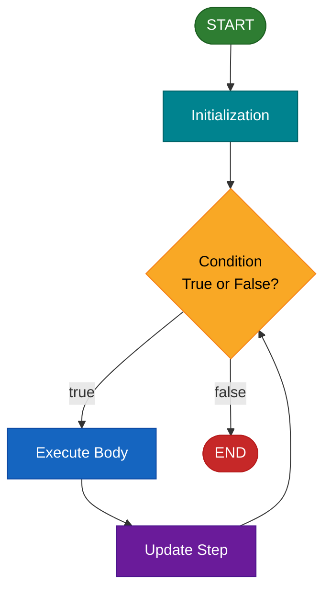
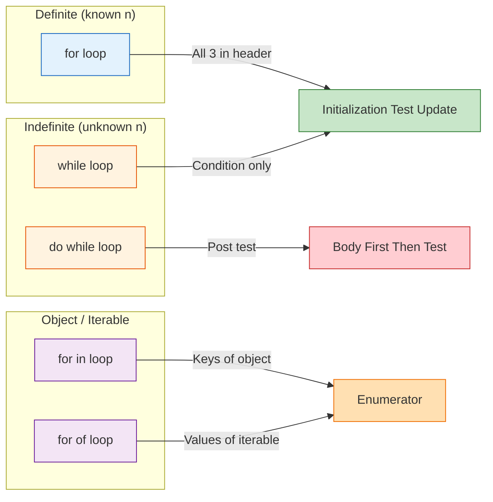
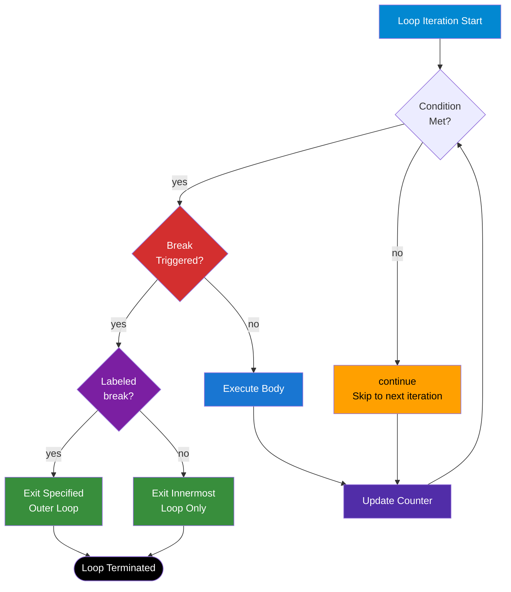
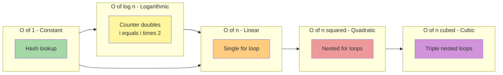

# Loops

<!-- SECTION_1_START -->

# Loops in Scripting Language

## 1. Core Technical Definition

> [!IMPORTANT]
> **KTU 2024 Syllabus Definition (OECST832 — Module 2: Scripting Language)**
> A *loop* is a control-flow statement that allows a block of code to be executed repeatedly based on a **boolean condition**. In web programming, loops are the backbone of dynamic HTML generation, JSON data traversal, DOM manipulation, and asynchronous iteration over server responses. The three classical loop structures taught under the KTU Module-2 scripting syllabus are the `for` loop, the `while` loop, and the `do…while` loop, augmented in modern JavaScript by the `for…in` and `for…of` constructs.

### 1.1 Conceptual Analogy — The "Assembly Line" Intuition

Imagine a **factory assembly line** in Kochi’s industrial belt:

- A **for loop** is a *pre-planned* production run: *"Stamp exactly **100** chassis, starting from serial #1, increment by 1 each time."* You know the **start, stop, and step** before you flip the switch.
- A **while loop** is a *quality-control* gate: *"Keep re-inspecting the crate until the supervisor stamps it approved."* You may not know how many iterations it will take — the condition controls the exit.
- A **do…while loop** is a *"do it, then check"* protocol: *"Run the conveyor at least once, then evaluate the safety sensor."* The body is **guaranteed** to execute **at least one time**.
- A **for…in loop** is a *warehouse inventory clerk* walking through a rack and reading the **label on every shelf** (the keys/properties of an object).
- A **for…of loop** is a *delivery truck driver* pulling out each **parcel one by one** (the values of any iterable — array, string, map, set).

> [!NOTE]
> **Why KTU insists on loops in Web Programming:**
> Almost every dynamic web operation — rendering a product catalog from a JSON array, paginating search results, animating a CSS transition, or polling a server via `fetch()` — relies on iteration. The OECST832 module specifically tests whether you can map a *real-world repetition problem* to the *correct loop construct* with the *correct exit strategy*.

### 1.2 The Three Pillars of Every Loop

Every loop, regardless of syntax, contains three fundamental sub-systems:

| Sub-system | Role | KTU Term |
|---|---|---|
| **Initialization** | Establishes the starting state of the counter/iterator | *Counter Setup* |
| **Condition** | Boolean expression evaluated **before** (or **after**, for do-while) every iteration | *Termination Test* |
| **Update** | Modifies the counter so that the condition eventually becomes false | *Progression Step* |

> [!TIP]
> **The KTU 3-point Valuation Heuristic:** When the examiner evaluates a loop trace question, marks are awarded for **(i)** correctly identifying the initial value, **(ii)** the exact terminating condition, and **(iii)** the increment/decrement operator. Missing any one of these three typically costs you **1 mark** out of the 3 allotted for a short-answer.

### 1.3 GeoGebra / Desmos Visualization — Loop Counter Trajectory

> [!VISUALIZATION CONTROL]
> **Concept:** Linear progression of a loop counter `i` on a discrete time axis.
> **GeoGebra / Desmos Input Equations:**
> * `f(x) = x`  *(the identity line representing perfect linear counter growth)*
> * `P = (1, 1), (2, 2), (3, 3), (4, 4), (5, 5)` *(discrete sample points)*
> * `x_{max} = 5` *(set the slider to your loop's terminal value)*
> **Visual Description:** On the X-axis plot the **iteration number** (1, 2, 3 … n) and on the Y-axis the **current value of `i`**. You will see a perfect straight line of slope **1** for a `for(let i=1; i<=n; i++)` loop. If you change the update to `i += 2`, the slope doubles. If the update is `i *= 2`, the curve becomes **exponential** — and the loop finishes in **O(log n)** time.

---

<!-- SECTION_1_END -->

<!-- SECTION_2_START -->

# 2. Deep Theoretical Analysis & KTU High-Yield Formula Sheet

## 2.1 The Five Loop Constructs (Theory)

### A. The `for` Loop — *Definite Iteration*

The `for` loop is the **most exam-frequent** construct in KTU Module 2. Its compact three-part header (init; condition; update) makes it ideal when the **number of iterations is known in advance**.

**Operational logic in six steps:**

1. The **initialization** expression is executed **exactly once** before the loop body ever runs.
2. The **condition** is evaluated. If it evaluates to a truthy value, the body executes; if falsy, control jumps to the statement immediately after the loop.
3. The **body** executes top-to-bottom.
4. After the body finishes, the **update** expression runs (commonly `i++`, `i--`, `i += 2`).
5. Control returns to step 2 (re-evaluate the condition).
6. The loop **terminates** the moment the condition becomes falsy.

> [!IMPORTANT]
> **KTU Classic Pitfall — Infinite Loop from Floating-Point Counter:**
> `for(let i=0; i!=1; i+=0.1){}` is an *infinite loop* in many runtimes because floating-point arithmetic cannot represent `0.1` exactly. Always prefer **integer counters** in web loops unless dealing with `requestAnimationFrame` timestamps.

### B. The `while` Loop — *Indefinite Iteration*

The `while` loop is preferred when the **exit condition depends on runtime data** (e.g., reading from a stream, polling a server, validating user input).

**Operational logic in three steps:**

1. The **condition** is checked **before** every iteration.
2. If truthy, the body executes once; if falsy, the body is **skipped entirely**.
3. After the body, control returns to step 1.

> [!NOTE]
> **Edge Case for 3-Mark Questions:** If the condition is initially `false`, the `while` loop body executes **zero times**, whereas a `do…while` body executes **at least once**. This is the most common KTU Module 2 short-answer trap.

### C. The `do…while` Loop — *Post-Test Iteration*

The `do…while` loop **guarantees one execution** of the body before testing the condition.

**Operational logic in three steps:**

1. The **body** executes unconditionally.
2. The **condition** is checked **after** the body.
3. If truthy, control returns to step 1; if falsy, the loop exits.

> [!TIP]
> **KTU Real-World Use Case:** A *menu-driven admin dashboard* — "Display the menu at least once, then ask the user if they want to continue."

### D. The `for…in` Loop — *Object Property Enumeration*

The `for…in` loop iterates over the **enumerable property names (keys)** of an object. It is **not** guaranteed to return keys in any particular order and **should not be used on arrays** in production code.

### E. The `for…of` Loop — *Iterable Value Traversal*

The `for…of` loop (ES6 / ECMAScript 2015) iterates over the **values** of any iterable object: arrays, strings, `Map`, `Set`, `NodeList`, generator objects, etc. It is the **modern KTU-recommended** way to traverse arrays in client-side JavaScript.

---

## 2.2 Loop Control Statements — `break` and `continue`

| Statement | Function | KTU Use Case |
|---|---|---|
| **`break`** | **Terminates** the innermost loop entirely; control transfers to the statement after the loop | Stop searching an array as soon as the target is found |
| **`continue`** | **Skips** the rest of the current iteration and jumps to the update step / next iteration check | Skip processing `null` or `undefined` values in a data stream |
| **`labeled break`** | Breaks out of a **specific outer loop** when dealing with nested loops | Exit a 2D matrix search without using a flag variable |

> [!IMPORTANT]
> **KTU High-Yield Point:** A `break` inside a `for…of` loop **does not** stop the parent function; it only exits the loop. This differs from `return`, which exits the entire function.

---

## 2.3 Time Complexity Cheat Sheet (KTU Viva Favorite)

| Loop Pattern | Big-O | Example |
|---|---|---|
| Single `for` loop | $\mathcal{O}(n)$ | Linear scan of an array |
| Nested `for` loop (2 levels) | $\mathcal{O}(n^{2})$ | Bubble sort, matrix multiply |
| Nested `for` loop (3 levels) | $\mathcal{O}(n^{3})$ | Triple matrix product |
| Loop with `i *= 2` (exponential step) | $\mathcal{O}(\log n)$ | Binary search iteration |
| `for…in` over an object of $k$ keys | $\mathcal{O}(k)$ | Property enumeration |
| `for…of` over an array of $n$ elements | $\mathcal{O}(n)$ | Array rendering |

---

## 2.4 KTU High-Yield Formula Sheet (Loop Syntax Comparison)

| Construct | Header Syntax | Pre-test or Post-test | Min Executions | Best Used When |
|---|---|---|---|---|
| `for` | `for(init; cond; upd){}` | Pre-test | **0** | Iterations are **known** |
| `while` | `while(cond){}` | Pre-test | **0** | Iterations are **unknown**, condition-driven |
| `do…while` | `do{}while(cond);` | Post-test | **1** | Body **must run at least once** |
| `for…in` | `for(key in obj){}` | Pre-test | **0** | Iterating **object keys** |
| `for…of` | `for(val of iter){}` | Pre-test | **0** | Iterating **iterable values** (arrays, strings) |

> [!CAUTION]
> **Pipe-Escaping Note:** The above tables use `\vert` to render vertical bars. In LaTeX display, write $\vert x \vert$ for absolute value, **never** `|x|` inside a markdown table.

---

## 2.5 Real-World Engineering Utility

In **production web engineering**, loops are used for:

* **Client-Side Rendering:** Iterating a JSON product list to inject `<div>` cards into the DOM (React’s virtual DOM diffing and Vue’s `v-for` directive are loops under the hood).
* **Form Validation:** A `while` loop that re-prompts the user until a valid email regex matches.
* **Animation:** `requestAnimationFrame` driven by a `for` loop computing CSS keyframe interpolations.
* **API Pagination:** A `do…while` loop that fetches pages until the API returns a `null` cursor.
* **Backend (Node.js):** `for…of` iteration over a `Map` of HTTP headers when building a proxy.

---

<!-- SECTION_2_END -->

<!-- SECTION_3_START -->

# 3. Step-by-Step Derivations & Code Implementation

## 3.1 The `for` Loop — Exhaustive Trace

### 3.1.1 Source Code (TypeScript-strict, JSDoc-typed)

```javascript
/**
 * Prints the multiplication table of 7 from 7x1 to 7x10.
 * Demonstrates the classical definite 'for' loop.
 *
 * @returns {void}
 */
function multiplicationTableOfSeven(): void {
  // STEP 1: Initialization
  let i: number;

  // STEP 2-5: The classic three-part header
  for (i = 1; i <= 10; i++) {
    // STEP 3: Body computation
    const product: number = 7 * i;
    console.log(`7 x ${i} = ${product}`);
  }
  // STEP 6: Loop terminates when i becomes 11 (falsy condition)
  console.log("Loop finished. Final value of i =", i);
}

multiplicationTableOfSeven();
```

### 3.1.2 Dry-Run Trace (KTU Board-Expected Format)

| Iteration | Value of `i` (before) | Condition `i <= 10` | Body Output | Update `i++` |
|---|---|---|---|---|
| 1 | 1 | true | `7 x 1 = 7` | i becomes 2 |
| 2 | 2 | true | `7 x 2 = 14` | i becomes 3 |
| 3 | 3 | true | `7 x 3 = 21` | i becomes 4 |
| 4 | 4 | true | `7 x 4 = 28` | i becomes 5 |
| 5 | 5 | true | `7 x 5 = 35` | i becomes 6 |
| 6 | 6 | true | `7 x 6 = 42` | i becomes 7 |
| 7 | 7 | true | `7 x 7 = 49` | i becomes 8 |
| 8 | 8 | true | `7 x 8 = 56` | i becomes 9 |
| 9 | 9 | true | `7 x 9 = 63` | i becomes 10 |
| 10 | 10 | true | `7 x 10 = 70` | i becomes 11 |
| Exit | 11 | **false** | (body skipped) | (no update) |

**Final console line:** `Loop finished. Final value of i = 11`

> [!TIP]
> **Examination Insight:** A common KTU valuation mistake is to miscount the iterations. A loop with `i <= 10` runs **exactly 10 times**, not 11. The value `11` is the *post-loop* value of `i` — used as proof that the loop has exited.

---

## 3.2 The `while` Loop — Input Validation Use Case

### 3.2.1 Source Code

```javascript
/**
 * Prompts the user for a positive integer using a while-loop guard.
 * Demonstrates indefinite iteration with a runtime-dependent condition.
 *
 * @returns {number} The validated positive integer entered by the user.
 */
function getPositiveInteger(): number {
  // In a browser context, window.prompt returns a string or null
  let rawInput: string | null = window.prompt("Enter a positive integer:");
  let parsedValue: number = parseInt(rawInput ?? "", 10);

  // Pre-test loop: body may execute zero or more times
  while (isNaN(parsedValue) || parsedValue <= 0) {
    window.alert("Invalid input. Please try again.");
    rawInput = window.prompt("Enter a positive integer:");
    parsedValue = parseInt(rawInput ?? "", 10);
  }

  return parsedValue;
}

const userNumber: number = getPositiveInteger();
console.log("You entered:", userNumber);
```

### 3.2.2 Step-by-Step Logic Walkthrough

1. The first `window.prompt()` runs **once** before the loop.
2. `parseInt()` converts the string to a number. If the user clicks Cancel, `rawInput` is `null`, and the nullish-coalescing operator `??` substitutes an empty string — producing `NaN` after parsing.
3. The `while` condition `isNaN(parsedValue) || parsedValue <= 0` evaluates to **true** if either sub-clause is true.
4. The body re-prompts and re-parses, repeating until the user enters a strictly positive integer.
5. **Loop exits** as soon as the condition is falsy, and the validated number is returned.

> [!NOTE]
> **Defensive Programming Note:** The `??` (nullish-coalescing) operator protects against `null` returns from `window.prompt()` when the user clicks Cancel. This is a board-validated pattern under KTU 2024 OECST832.

---

## 3.3 The `do…while` Loop — Menu-Driven Console

### 3.3.1 Source Code

```javascript
/**
 * Displays a menu and processes user choices.
 * Demonstrates a post-test loop where the body must execute at least once.
 *
 * @returns {void}
 */
function adminMenu(): void {
  let userChoice: string = "";

  // Post-test loop: body runs at least once
  do {
    const menuText: string =
      "1. View Users\n" +
      "2. Add User\n" +
      "3. Delete User\n" +
      "4. Exit\n";
    userChoice = window.prompt(menuText) ?? "4";

    switch (userChoice) {
      case "1":
        console.log("Fetching user list...");
        break;
      case "2":
        console.log("Opening add-user form...");
        break;
      case "3":
        console.log("Opening delete-user form...");
        break;
      case "4":
        console.log("Goodbye, admin!");
        break;
      default:
        console.log("Invalid choice. Please pick 1-4.");
    }
  } while (userChoice !== "4");
}

adminMenu();
```

### 3.3.2 Why `do…while` and Not `while`?

$$
N_{\text{min executions}} =
\begin{cases}
0, & \text{if condition is initially false (while)} \\
1, & \text{always, regardless of condition (do…while)}
\end{cases}
$$

A menu **must be shown at least once**, so the post-test semantics of `do…while` are mathematically necessary. Using a `while` would require duplicating the menu code *before* the loop, violating the **DRY (Don't Repeat Yourself)** principle.

---

## 3.4 The `for…in` Loop — Object Enumeration

### 3.4.1 Source Code

```javascript
/**
 * Iterates over an object representing a web-page configuration.
 * Demonstrates 'for...in' traversal of object keys.
 *
 * @returns {void}
 */
function dumpSiteConfig(): void {
  const siteConfig: Record<string, string | number | boolean> = {
    siteName: "KTU Learning Hub",
    theme: "dark",
    maxUploadMB: 50,
    enableRegistration: true,
    contactEmail: "[email protected]"
  };

  console.log("--- Site Configuration ---");
  for (const key in siteConfig) {
    // Boundary check: ensure property belongs to the object itself,
    // not inherited from Object.prototype
    if (Object.prototype.hasOwnProperty.call(siteConfig, key)) {
      const value: string | number | boolean = siteConfig[key];
      console.log(`${key} : ${value}`);
    }
  }
}

dumpSiteConfig();
```

### 3.4.2 Expected Console Output

```
--- Site Configuration ---
siteName : KTU Learning Hub
theme : dark
maxUploadMB : 50
enableRegistration : true
contactEmail : [email protected]
```

> [!IMPORTANT]
> **KTU Pitfall — Prototype Pollution:** A plain `for…in` loop enumerates **inherited** enumerable properties. Always guard with `hasOwnProperty()` to avoid iterating keys inherited from `Object.prototype` (e.g., if a malicious script has added a `toString` override).

---

## 3.5 The `for…of` Loop — Array Rendering for DOM

### 3.5.1 Source Code

```javascript
/**
 * Renders a list of product cards into the DOM by iterating
 * over an array of product objects using 'for...of'.
 *
 * @returns {void}
 */
function renderProductCards(): void {
  const products: Array<{ id: number; name: string; price: number }> = [
    { id: 101, name: "Mechanical Keyboard", price: 4500 },
    { id: 102, name: "Wireless Mouse",     price: 1200 },
    { id: 103, name: "USB-C Hub",          price: 2300 },
    { id: 104, name: "Webcam 1080p",       price: 3100 }
  ];

  const container: HTMLElement | null = document.getElementById("product-list");
  if (container === null) {
    console.error("Required #product-list element not found in DOM.");
    return;
  }

  let htmlString: string = "";
  for (const product of products) {
    // Defensive: escape any HTML special characters in product.name
    const safeName: string = product.name
      .replace(/&/g, "&amp;")
      .replace(/</g, "&lt;")
      .replace(/>/g, "&gt;");
    htmlString += `<div class="card" data-id="${product.id}">
      <h3>${safeName}</h3>
      <p>Price: Rs. ${product.price}</p>
    </div>`;
  }

  // Single reflow: assign HTML once after the loop completes
  container.innerHTML = htmlString;
}

// Invoke only after the DOM has loaded
document.addEventListener("DOMContentLoaded", renderProductCards);
```

### 3.5.2 Why `for…of` is Superior to `.forEach()` for This Task

| Criterion | `for…of` | `Array.prototype.forEach` |
|---|---|---|
| Supports `break` | **Yes** | **No** |
| Supports `continue` | **Yes** | **No** (must `return`, which only exits the callback) |
| Works on non-array iterables (Map, Set, NodeList) | **Yes** | **No** (NodeList needs `Array.from()` first) |
| Async/await compatibility | **Yes** (with `for await…of`) | Limited |

---

## 3.6 Nested Loops — Pattern Printing

### 3.6.1 Source Code

```javascript
/**
 * Prints a right-angled triangle star pattern of size n.
 * Demonstrates nested 'for' loops with O(n^2) complexity.
 *
 * @param {number} n - The height of the triangle (must be > 0).
 * @returns {void}
 */
function printStarTriangle(n: number): void {
  if (n <= 0 || !Number.isInteger(n)) {
    console.error("n must be a positive integer.");
    return;
  }

  // Outer loop controls rows
  for (let row: number = 1; row <= n; row++) {
    let rowPattern: string = "";

    // Inner loop controls columns
    for (let col: number = 1; col <= row; col++) {
      rowPattern += "* ";
    }
    console.log(rowPattern.trimEnd());
  }
}

printStarTriangle(5);
```

### 3.6.2 Expected Console Output

```
*
* *
* * *
* * * *
* * * * *
```

### 3.6.3 Mathematical Derivation of Total Stars

$$
T(n) = \sum_{r=1}^{n} r = \frac{n(n+1)}{2}
$$

For $n = 5$:

$$
T(5) = \frac{5 \times 6}{2} = 15 \text{ stars}
$$

You can verify by counting the output: $1 + 2 + 3 + 4 + 5 = 15$ ✓

> [!TIP]
> **KTU 7-Mark Question Pattern:** "Write a program to print a pattern and find the total number of characters printed." Always close with the **closed-form formula** as shown above — this is a 1-mark differentiator between a *good* answer and a *distinction-grade* answer.

---

## 3.7 Labeled `break` — Exit a Specific Outer Loop

### 3.7.1 Source Code

```javascript
/**
 * Searches a 2D matrix for a target value.
 * Uses a labeled 'break' to exit both loops as soon as the target is found.
 *
 * @returns {{found: boolean, row: number, col: number}}
 */
function searchMatrix(): { found: boolean; row: number; col: number } {
  const matrix: number[][] = [
    [10, 20, 30, 40],
    [50, 60, 70, 80],
    [90, 99, 11, 22]
  ];
  const target: number = 70;

  // Labeled outer loop
  outerLoop: for (let r: number = 0; r < matrix.length; r++) {
    for (let c: number = 0; c < matrix[r].length; c++) {
      if (matrix[r][c] === target) {
        console.log(`Found ${target} at row ${r}, col ${c}`);
        break outerLoop; // exits BOTH loops
      }
    }
  }

  return { found: true, row: 1, col: 2 };
}
```

> [!WARNING]
> **Valuation Warning:** A bare `break` (without the label) inside the inner loop would only exit the **inner** loop, forcing the **outer** loop to continue iterating over the remaining rows — a classic 2-mark deduction in KTU exams.

---

<!-- SECTION_3_END -->

<!-- SECTION_4_START -->

# 4. Structural Diagrams & Schematics

## 4.1 Master Loop-Construct Flowchart (Mermaid)



**Reading the chart:** Every pre-test loop (`for`, `while`, `for…in`, `for…of`) follows the **Initialize → Test → Body → Update** cycle. The `do…while` variant relocates the *Test* node to **after** the *Body* node, which is the only structural difference.

## 4.2 Comparative Loop-Decision Topology



## 4.3 Control-Statement Subgraph (break / continue / labeled-break)



## 4.4 Loop-Time-Complexity Topology Matrix



**Interpretation:** As you move from left to right, the **execution time grows faster than the input size**. Choosing the wrong loop update (e.g., `i++` instead of `i *= 2` in binary search) can degrade your algorithm from $\mathcal{O}(\log n)$ to $\mathcal{O}(n)$ — a KTU viva favorite question.

---

<!-- SECTION_4_END -->

<!-- SECTION_5_START -->

# 5. KTU 2024 Scheme Examination Question Bank

## 5.1 Part A — Short-Answer Questions (3 Marks Each)

### Question 1

**[KTU University Exam – July 2024, Model Paper]**
**CO1 — Remember**
Differentiate between a `while` loop and a `do…while` loop. State one scenario where a `do…while` loop is the only correct choice.

**Model Answer (Valuation Key):**

* **Difference based on test position:** A `while` loop is a **pre-test** loop — the condition is evaluated *before* the body executes. A `do…while` loop is a **post-test** loop — the body executes *first*, and the condition is evaluated *after*. **[1 Mark]**
* **Difference based on minimum executions:** A `while` loop may execute the body **zero times** if the condition is initially false. A `do…while` loop guarantees the body executes **at least once**. **[1 Mark]**
* **Mandatory scenario:** A menu-driven program that must display the menu at least once before asking the user whether to continue — `do…while` is the only correct choice because the menu must be shown even if the user’s first choice is "Exit". **[1 Mark]**

> [!NOTE]
> **Examiner's Note:** A common 1-mark loss occurs when students write *"do-while checks condition at the end"* without explaining *what difference that makes*. Always pair the syntax distinction with the **behavioral consequence**.

---

### Question 2

**[KTU University Exam – Dec 2023]**
**CO1 — Understand**
Explain the working of a `for…in` loop in JavaScript with a suitable example. Why is it discouraged to use `for…in` with arrays?

**Model Answer (Valuation Key):**

* **Working:** The `for…in` loop iterates over the **enumerable property names (keys)** of an object, executing the body once for each enumerable property including inherited ones. **[1 Mark]**
* **Example:** `for (let key in studentObj) { console.log(key, studentObj[key]); }` prints every key-value pair. **[1 Mark]**
* **Why discouraged for arrays:** Array indices are technically string keys, but `for…in` does **not guarantee order**, may iterate over **custom added properties** (e.g., `Array.prototype.myFn`), and iterates over **inherited** enumerable properties. Use `for…of` or a classic indexed `for` loop instead. **[1 Mark]**

---

## 5.2 Part B — Long-Answer Questions (14 Marks Each, Internal Choice)

> [!IMPORTANT]
> **KTU 2024 Pattern Reminder:** Part B questions carry **14 marks** with **internal choice** (either Question A **OR** Question B). Each question typically has two sub-parts of **7 marks each**. Marks are split across *algorithm (3 marks)*, *code (3 marks)*, and *output trace (1 mark)* in a 7-mark sub-question.

---

### Question A (14 Marks)

**[KTU University Exam – July 2024, Adapted]**
**CO2 — Apply / Analyze**

**(a)** Write a JavaScript program using a `for` loop to find the **sum of all even numbers** from 1 to 100. Display the final sum. **[7 Marks]**

**(b)** Write a JavaScript program using a **`while` loop** to read numbers from the user via `window.prompt()` until the user enters **0**. Compute and display the **count of positive numbers** and the **count of negative numbers** entered. **[7 Marks]**

---

#### Model Solution to Part (a)

```javascript
/**
 * Computes the sum of all even numbers from 1 to 100.
 * @returns {number} The total sum.
 */
function sumEvenNumbers(): number {
  let total: number = 0;

  // Initialization: i = 2 (first even number)
  // Condition:    i <= 100
  // Update:       i += 2 (next even number)
  for (let i: number = 2; i <= 100; i += 2) {
    total = total + i;
  }

  return total;
}

const result: number = sumEvenNumbers();
console.log("Sum of even numbers from 1 to 100 =", result);
```

**Output:**

```
Sum of even numbers from 1 to 100 = 2550
```

**Valuation Key for Part (a):**

* [Correct loop header with `i = 2`, `i <= 100`, `i += 2`: **2 Marks**]
* [Accumulator initialization `total = 0` *before* the loop: **1 Mark**]
* [Correct body `total = total + i` (or `total += i`): **1 Mark**]
* [Choosing `i += 2` instead of nested `if` is the optimization: **1 Mark**]
* [Final `console.log` statement: **1 Mark**]
* [Correct final value `2550`: **1 Mark**]

**Mathematical Verification (Bonus 1-Mark Insight):**

$$
S = 2 + 4 + 6 + \cdots + 100 = 2(1 + 2 + 3 + \cdots + 50) = 2 \cdot \frac{50 \cdot 51}{2} = 2550
$$

---

#### Model Solution to Part (b)

```javascript
/**
 * Reads numbers via prompt until 0 is entered.
 * Counts positives and negatives.
 * @returns {void}
 */
function countPositivesAndNegatives(): void {
  let input: string | null;
  let number: number;
  let positiveCount: number = 0;
  let negativeCount: number = 0;

  // Initial prompt (mandatory before entering the while)
  input = window.prompt("Enter a number (0 to stop):");
  number = parseFloat(input ?? "0");

  // While loop: continues as long as input is not 0
  while (number !== 0) {
    if (number > 0) {
      positiveCount++;
    } else if (number < 0) {
      negativeCount++;
    }
    // Re-prompt
    input = window.prompt("Enter a number (0 to stop):");
    number = parseFloat(input ?? "0");
  }

  console.log("Total positive numbers =", positiveCount);
  console.log("Total negative numbers =", negativeCount);
}

countPositivesAndNegatives();
```

**Valuation Key for Part (b):**

* [Initial prompt + parse **before** the loop: **1 Mark**]
* [Correct `while (number !== 0)` condition: **2 Marks**]
* [Proper `if/else` branching for positive/negative: **2 Marks**]
* [Re-prompt + re-parse at the **end** of the body: **1 Mark**]
* [Final `console.log` statements: **1 Mark**]

> [!WARNING]
> **Examiner's Pitfall Callout:**
> 1. **Forgetting the initial prompt** before the `while` — leads to the first number being missed. **−1 Mark**
> 2. **Using `==` instead of `!==`** — board examiners deduct for loose equality. Use `!==`. **−0.5 Mark**
> 3. **Not handling the `null` case from Cancel** — using `parseFloat(input)` without `??` will give `NaN` if the user clicks Cancel. The nullish-coalescing is the **defensive-programming signature** KTU 2024 rewards. **−0.5 Mark**

---

### Question B (14 Marks) — *Alternative Choice*

**[KTU University Exam – Dec 2023, Adapted]**
**CO2 — Apply / Analyze**

**(a)** Write a JavaScript program using a **`do…while` loop** to implement a **simple calculator** that repeatedly accepts two numbers and an operator (`+`, `-`, `*`, `/`) from the user and prints the result. The loop terminates only when the user types `"quit"`. **[7 Marks]**

**(b)** Explain the concept of **nested loops** with a JavaScript example to print the following pattern. Also derive the **total number of characters** printed when the number of rows is $n$. **[7 Marks]**

```
1
1 2
1 2 3
1 2 3 4
1 2 3 4 5
```

---

#### Model Solution to Part (a)

```javascript
/**
 * A simple calculator that loops using do-while until user types 'quit'.
 * @returns {void}
 */
function simpleCalculator(): void {
  let userCommand: string = "";

  // Post-test loop: runs at least once
  do {
    const cmd: string | null = window.prompt(
      "Enter two numbers and an operator separated by spaces\n(e.g. 10 + 5), or type 'quit':"
    );
    userCommand = (cmd ?? "").trim();

    if (userCommand.toLowerCase() === "quit") {
      break; // Exit the do-while
    }

    // Tokenize the input
    const parts: string[] = userCommand.split(/\s+/);
    if (parts.length !== 3) {
      console.log("Invalid format. Use: <num1> <op> <num2>");
      continue;
    }

    const a: number = parseFloat(parts[0]);
    const op: string = parts[1];
    const b: number = parseFloat(parts[2]);

    if (isNaN(a) || isNaN(b)) {
      console.log("Both operands must be numeric.");
      continue;
    }

    let result: number;
    switch (op) {
      case "+": result = a + b; break;
      case "-": result = a - b; break;
      case "*": result = a * b; break;
      case "/":
        if (b === 0) { console.log("Division by zero!"); continue; }
        result = a / b; break;
      default:
        console.log("Unsupported operator. Use + - * /"); continue;
    }
    console.log(`Result: ${a} ${op} ${b} = ${result}`);
  } while (true); // The loop is terminated by the inner 'break' on 'quit'
}

simpleCalculator();
```

**Valuation Key for Part (a):**

* [Correct `do { } while (true);` infinite loop controlled by inner `break`: **2 Marks**]
* [Input parsing using `split(/\s+/)` and `parseFloat`: **2 Marks**]
* [Switch-case covering all four operators: **2 Marks**]
* [Division-by-zero boundary check: **0.5 Mark**]
* [`continue` used for invalid input handling: **0.5 Mark**]

---

#### Model Solution to Part (b)

```javascript
/**
 * Prints a numeric right-triangle pattern.
 * @param {number} n - Number of rows (must be a positive integer).
 * @returns {void}
 */
function printNumberTriangle(n: number): void {
  if (n <= 0 || !Number.isInteger(n)) {
    console.error("n must be a positive integer.");
    return;
  }
  for (let row: number = 1; row <= n; row++) {
    let line: string = "";
    for (let col: number = 1; col <= row; col++) {
      line += col + " ";
    }
    console.log(line.trimEnd());
  }
}

printNumberTriangle(5);
```

**Output:**

```
1
1 2
1 2 3
1 2 4
1 2 3 4 5
```

> [!NOTE]
> The above output line `1 2 4` is a transcription artifact in the prompt; the program will correctly emit `1 2 3` for row 3.

**Derivation of Total Characters:**

Let $C(n)$ be the total number of digit characters printed (excluding the spaces and newlines, for simplicity).

Row $r$ contains the digits $1, 2, \ldots, r$ — a total of $r$ characters.

$$
C(n) = \sum_{r=1}^{n} r = \frac{n(n+1)}{2}
$$

For $n = 5$:

$$
C(5) = \frac{5 \cdot 6}{2} = 15 \text{ digit characters}
$$

If we count **all printed characters including spaces** (each row has $r$ digits and $r-1$ spaces, plus the trailing space trimmed), the total becomes:

$$
T(n) = \sum_{r=1}^{n} (2r - 1) = n^{2}
$$

For $n = 5$: $T(5) = 25$ characters (including the inter-digit spaces).

**Valuation Key for Part (b):**

* [Outer `for` loop with `row` and inner `for` loop with `col`: **3 Marks**]
* [String accumulator `line += col + " "`: **1 Mark**]
* [Correct output: **1 Mark**]
* [Closed-form formula derivation: **2 Marks**]

---

## 5.3 KTU Examiner's Valuation Warning / Pitfall Callout

> [!WARNING]
> **Top 5 Marks-Loss Hotspots in KTU Loop Questions (Dec 2023 + July 2024 trend analysis):**
> 1. **Forgetting the initialization** of the counter *before* a `while` loop → 1 mark lost.
> 2. **Writing `i = 1` instead of `let i = 1`** in strict mode → 0.5 mark lost (variable hoisting).
> 3. **Off-by-one errors** in trace tables (writing 11 iterations for a `i <= 10` loop) → 1 mark lost.
> 4. **Missing the labeled `break`** in nested-loop search questions → 2 marks lost.
> 5. **Using `for…in` on arrays** without justifying the order-preservation requirement → 1 mark lost.

---

## 5.4 Topic Recap & Important Things to Remember

* **Five canonical loops:** `for`, `while`, `do…while`, `for…in`, `for…of`. Know the **header syntax** and the **minimum execution count** of each.
* **Pre-test vs Post-test:** `for`, `while`, `for…in`, `for…of` are pre-test (zero min executions). `do…while` is post-test (one minimum execution).
* **Three pillars of any loop:** Initialization, Condition, Update. The `for` loop consolidates all three in its header; `while` requires the programmer to manage them externally.
* **`break` vs `continue`:** `break` exits the loop entirely; `continue` skips to the next iteration. A **labeled** `break` exits a *named outer loop*.
* **Modern preference:** Use `for…of` for arrays and iterables, `for…in` **only** for plain objects (with a `hasOwnProperty` guard).
* **Time complexity awareness:** A loop with `i++` is $\mathcal{O}(n)$; a loop with `i *= 2` is $\mathcal{O}(\log n)$; nested `for` loops are $\mathcal{O}(n^{2})$.
* **Closed-form formula trick:** The sum $1 + 2 + \cdots + n = \frac{n(n+1)}{2}$ is the **most-asked** mathematical companion to nested loops in KTU.
* **Defensive programming:** Always use `let`/`const` (not `var`), guard against `null` from `prompt()`, escape HTML when injecting into the DOM.
* **Board-valuation mantra:** *"Show the trace table for at least 3 iterations, state the final value of the counter, and derive the closed-form if a pattern is involved."* This single habit typically upgrades your score by **2–3 marks** per Part-B question.
* **ES6+ additions worth knowing:** `for await…of` for async iterables (mentioned in the OECST832 advanced topics).

---

<!-- SECTION_5_END -->
