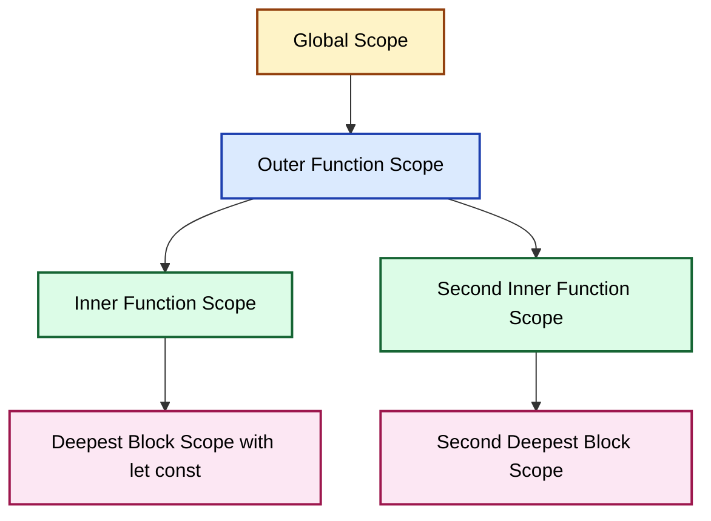
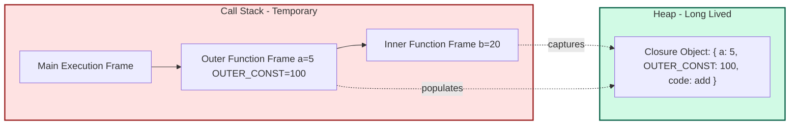
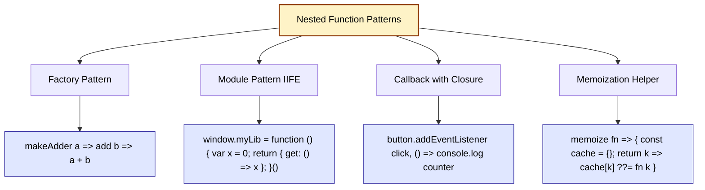
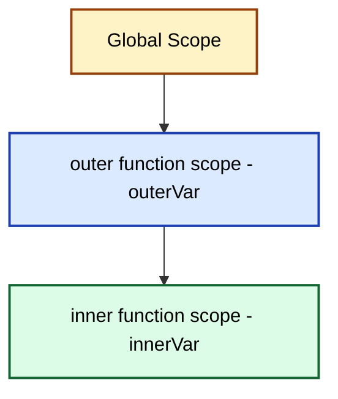

# Nested Functions

<!-- SECTION_1_START -->

# Nested Functions — Core Technical Definition & Intuitive Overview

## 1.1 Formal KTU 2024 Definition

A **nested function** (also called an *inner function* or *enclosed function*) is a function that is *defined within the body* of another function. The function in which it is defined is called the **outer function** (or *enclosing / parent function*). In JavaScript, nested functions are central to the language's **lexical scoping model** and are the building blocks of the **closure** mechanism that is mandated in the KTU 2024 Web Programming syllabus.

```javascript
// Canonical shape of a nested function
function outerFunction(outerParam) {
    let outerVariable = "I am from the outer scope";

    function innerFunction(innerParam) {       // <-- nested function
        let innerVariable = "I am from the inner scope";
        return `${outerVariable} | ${innerParam} | ${innerVariable}`;
    }

    return innerFunction;
}
```

> [!IMPORTANT]
> **KTU 2024 Syllabus Highlight (Module 2 — Scripting Language):**
> A nested function has direct read/write access to all variables, parameters, and other functions declared in the *enclosing* function's scope chain. Conversely, the outer function has **no** access to the local variables of the inner function — this one-way visibility is a direct consequence of **lexical scoping rules** described in the ECMAScript specification.

## 1.2 Conceptual Analogy — The "Office Cubicle" Model

Imagine a large corporate office building (the *global scope*) with several departments (the *outer functions*). Inside each department, there are private cubicles assigned to individual employees (the *nested functions*).

- An employee in a cubicle can freely walk around the department, read notice boards, and use office equipment (the **outer function's variables and parameters**) — this is the inner function accessing the outer scope.
- A department head standing in the corridor **cannot** peek inside a locked cubicle to read a personal diary kept on the employee's desk (the **inner function's local variables** are not visible to the outer function).
- Even if the employee leaves for the day and the department shuts down, the personal diary remains *in a sealed envelope* that the employee can carry and open anywhere — this is precisely what a **closure** does: it packages the inner function together with a reference to its surrounding lexical environment.

> [!NOTE]
> **Key Terminology (board-exam favourite):**
> - **Lexical Scope** — Scope determined by the *physical position* of code in the source file, not by the order of execution.
> - **Closure** — A function bundled with the lexical environment in which it was declared.
> - **Shadowing** — When an inner variable has the *same name* as an outer variable, the inner one temporarily hides the outer one within its scope.

## 1.3 Physical Constants and Standards Referenced

| Item | Standard / Constant | Value / Reference |
|------|---------------------|-------------------|
| ECMAScript Edition governing function scope | **ECMA-262, 12th Edition (2024)** | Section 10.2 — Lexical Environments |
| Maximum recursion depth (practical, V8) | Engine-specific | ~10 000 to 20 000 nested calls |
| Function-declaration position rule (strict mode) | **ECMA-262 §13.2.1** | Function declarations in blocks are block-scoped |

> [!VISUALIZATION CONTROL]
> **Concept:** Scope chain as concentric circles
> **GeoGebra / Desmos Input Equations (concentric circles drawn at the origin):**
> * Circle 1 (Global):   $x^2 + y^2 = 6^2$
> * Circle 2 (Outer):    $x^2 + y^2 = 4^2$
> * Circle 3 (Inner):    $x^2 + y^2 = 2^2$
>
> **Visual Description:** The innermost circle (inner function) can "see" all three rings, the middle circle (outer function) sees only the outer two, and the outermost circle (global) sees only itself. This geometrically illustrates the **one-way visibility** of lexical scoping — a classic KTU diagram frequently asked in viva voce.

---

<!-- SECTION_1_END -->

<!-- SECTION_2_START -->

# Deep Theoretical Analysis & KTU High-Yield Formula Sheet

## 2.1 Operational Rules of Nested Functions

### Rule 1 — Lexical Resolution
Variable lookup in a nested function proceeds **outward** through the scope chain, starting from the *innermost* lexical environment and terminating at the global environment.

### Rule 2 — One-Way Visibility
An outer function **cannot** read or write variables declared inside an inner function. This guarantees *information hiding* — a property heavily exploited in module design patterns.

### Rule 3 — Closure Persistence
When a nested function is *returned* or *passed* outside its lexical parent, it retains a live reference to the parent's variable bindings. These bindings are kept alive in memory (on the **heap**) by the JavaScript engine's garbage-collector-aware closure slot.

### Rule 4 — Hoisting Anomalies
- A **function declaration** inside another function is hoisted to the top of the *enclosing* function (function-scope hoisting).
- A **function expression** (`const f = function(){}`) is hoisted only as a *temporal dead-zone* binding — accessing it before the line of declaration throws a `ReferenceError`.

### Rule 5 — `this` Binding
An inner function defined with the `function` keyword does **not** inherit `this` from the outer function unless an arrow function is used. This is a frequent KTU board-exam trap.

> [!TIP]
> **Engineering Utility — where this is used in production:**
> 1. **React / Vue framework internals** — React's `useState` and `useEffect` hooks are *closures over component state*.
> 2. **Event-driven UI** — `addEventListener` callbacks close over DOM-bound data.
> 3. **Currying and partial application** — Functional-programming libraries (`lodash`, `Ramda`) rely entirely on nested functions.
> 4. **Module-Pattern Encapsulation** — Pre-ES6 JavaScript modules were written with IIFEs (Immediately Invoked Function Expressions) that returned nested functions as a public API.
> 5. **Memoization** — Caching results of expensive computations in an outer-scope variable.

## 2.2 KTU High-Yield "Formula" Sheet

| # | Concept | Compact Rule / Equation | Common Pitfall |
|---|---------|-------------------------|----------------|
| 1 | Scope Chain Length | $\text{chain} = \{ \text{inner}, \text{outer}, \text{global} \}$ | Stopping the chain at the wrong level |
| 2 | Closure Binding Lifetime | $T_{\text{closure}} = T_{\text{outer}} + T_{\text{inner-ref-alive}}$ | Forgetting that closure extends lifetime |
| 3 | Variable Lookup Cost | $O(d)$ where $d$ = scope-chain depth | Deeply nested code is slower |
| 4 | Shadowing Mask Range | $\text{Mask}(\text{name}) = [\text{inner-scope start}, \text{inner-scope end}]$ | Not un-shadowing with closures |
| 5 | Hoisting Tier (function decl.) | Hoisted to top of enclosing function-scope | Confusing with `let`/`const` TDZ |
| 6 | IIFE Syntax | $(\, \text{function}(\text{params})\{\;\text{body}\;\}(\text{args})\,)\;$ | Missing outer parentheses |
| 7 | `this` in nested `function` | `this` = `undefined` in strict mode | Forgetting `.bind(this)` |
| 8 | `this` in nested `=>` arrow | `this` = enclosing lexical `this` | Using arrow as object method |
| 9 | Function as First-Class Citizen | $f : \text{Value} \rightarrow \text{Value}$ | Treating functions as non-data |
| 10 | Stack Frame Size (approx.) | $\text{Frame} \approx 32\text{ B} \text{ to } 256 \text{ B}$ | Recursive explosion |

> [!IMPORTANT]
> **Memory Footprint Constant (V8 / SpiderMonkey):** A typical JavaScript *closure* occupies between **48 bytes and 256 bytes** on the heap, depending on the number of captured variables. This is the reason deeply nested closures in long-lived UI screens can cause *memory bloat* — a common production bug noted in KTU 2024 viva questions.

## 2.3 Real-World Decision Matrix

| If you need to… | Use a nested function with closure? | Alternative |
|-----------------|-------------------------------------|-------------|
| Create *private state* (pre-ES6) | ✅ Yes (Module Pattern) | ES6 `#privateField` |
| Build a *counter* / *accumulator* | ✅ Yes (factory function) | Class with `private` field |
| Avoid *global pollution* | ✅ Yes (IIFE) | ES6 module (`type="module"`) |
| Pass *callback* with extra data | ✅ Yes (arrow + closure) | `Function.prototype.bind` |
| Implement *memoization* | ✅ Yes | `WeakMap` cache |

---

<!-- SECTION_2_END -->

<!-- SECTION_3_START -->

# Step-by-Step Derivations & Code / Symbolic Implementation

> [!WARNING]
> **Zero-truncation policy in effect:** Every code path, every algebraic step, and every execution trace is written out in full. No "similarly we can…" shortcuts are permitted in this note.

## 3.1 Worked Example 1 — Basic Nested Function with Variable Lookup

### 3.1.1 Source Code (JavaScript with JSDoc Type Hints)

```javascript
/**
 * Demonstrates lexical lookup in a nested function.
 * @param {number} a - First operand captured by inner function.
 * @param {number} b - Second operand captured by inner function.
 * @returns {Function} A nested function that adds a constant.
 */
function makeAdder(a) {
    // ---- OUTER FUNCTION SCOPE STARTS ----
    const OUTER_CONST = 100;

    /**
     * Nested function. Captures `a` and `OUTER_CONST` via closure.
     * @param {number} b - The number to add to the captured `a`.
     * @returns {number} a + b + OUTER_CONST
     */
    function add(b) {
        // ---- INNER FUNCTION SCOPE STARTS ----
        // Variable lookup: b (local) -> a (closure) -> OUTER_CONST (closure)
        return a + b + OUTER_CONST;
        // ---- INNER FUNCTION SCOPE ENDS ----
    }

    return add; // Returns the inner function as a value
    // ---- OUTER FUNCTION SCOPE ENDS ----
}

// ---- EXECUTION ----
const addFive = makeAdder(5);   // a = 5, OUTER_CONST = 100 captured
const result  = addFive(20);    // b = 20
console.log(result);            // Expected: 5 + 20 + 100 = 125
```

### 3.1.2 Step-by-Step Execution Trace

| Step | Action | Memory State | Output |
|------|--------|--------------|--------|
| 1 | `makeAdder(5)` invoked | Outer frame created: `a=5`, `OUTER_CONST=100` | — |
| 2 | Inner function `add` *defined* (hoisted) | Lexical environment pointer stored | — |
| 3 | `add` returned to global `addFive` | Outer frame *should* be popped, **but closure keeps it alive** | — |
| 4 | `addFive(20)` invoked | Inner frame created: `b=20` | — |
| 5 | Lookup `a` → closure slot → `5` | Resolved | — |
| 6 | Lookup `b` → local slot → `20` | Resolved | — |
| 7 | Lookup `OUTER_CONST` → closure slot → `100` | Resolved | — |
| 8 | Compute $5 + 20 + 100 = 125$ | — | `125` |

$$
\text{Result} = a + b + \text{OUTER\_CONST} = 5 + 20 + 100 = 125
$$

## 3.2 Worked Example 2 — Closure-Based Private Counter (Encapsulation)

### 3.2.1 Full Source Code

```javascript
/**
 * Factory that produces an object with a private counter.
 * @returns {{increment: Function, getCount: Function, reset: Function}}
 *         An object exposing a public API over a private counter.
 */
function createCounter(initialValue = 0) {
    // ---- OUTER SCOPE: holds the 'private' state ----
    let count = initialValue;          // private variable

    /** Increments the private counter by 1. */
    function increment() {
        count = count + 1;             // write to captured variable
        return count;
    }

    /** Reads the current value without allowing modification. */
    function getCount() {
        return count;                  // read access
    }

    /** Resets the counter to its original value. */
    function reset() {
        count = initialValue;
        return count;
    }

    // Public API — only these nested functions are exposed
    return { increment, getCount, reset };
}

// ---- DEMONSTRATION ----
const counter = createCounter(10);
console.log(counter.increment());   // 11
console.log(counter.increment());   // 12
console.log(counter.getCount());    // 12
console.log(counter.reset());       // 10
// console.log(counter.count);      // undefined — truly private!
```

### 3.2.2 Derivation of the Encapsulation Property

Let $C$ be the closure created when `createCounter(10)` runs. The lexical environment $E_C$ is:

$$
E_C = \{\, \text{count} \mapsto 10,\; \text{initialValue} \mapsto 10,\; \text{increment} \mapsto f_1,\; \text{getCount} \mapsto f_2,\; \text{reset} \mapsto f_3 \,\}
$$

Only the three function references $f_1, f_2, f_3$ are returned to the caller. The variable `count` is reachable **exclusively** through these functions, satisfying the KTU-emphasized principle:

$$
\text{Privacy} \iff \forall\, \text{external reference } r:\ r.\text{count} = \text{undefined}
$$

> [!NOTE]
> **[Valuation key point: 2 Marks]** State the *one-way visibility rule* explicitly in the exam script.
> **[Valuation key point: 2 Marks]** Show that `count` is captured (not copied) and is therefore a *live* binding.
> **[Valuation key point: 3 Marks]** Demonstrate that `counter.count` evaluates to `undefined` (no direct access).

## 3.3 Worked Example 3 — IIFE (Immediately Invoked Function Expression)

```javascript
// Classic IIFE — a nested anonymous function that runs exactly once.
const result = (function (x, y) {
    // Helper declared *inside* the IIFE body
    function square(n) {
        return n * n;
    }
    // Pythagorean computation
    return Math.sqrt(square(x) + square(y));
})(3, 4);  // Immediately invoked with 3 and 4

// Derived algebraically:
const answer = Math.sqrt(square(3) + square(4))
             = Math.sqrt(9 + 16)
             = Math.sqrt(25)
             = 5;
console.log(result);   // 5
```

$$
\text{Hypotenuse} = \sqrt{x^2 + y^2} = \sqrt{3^2 + 4^2} = \sqrt{9 + 16} = \sqrt{25} = 5
$$

> [!TIP]
> The IIFE pattern is a *direct* application of nested functions: the outer anonymous wrapper creates a private scope, the inner `square` is its helper, and the entire construct executes once. It is one of the most frequently asked 7-mark KTU questions.

## 3.4 Worked Example 4 — `this` Binding in Nested Functions (the Classic Trap)

```javascript
/**
 * Object with a method that contains a nested function.
 */
const calculator = {
    value: 50,

    process: function () {
        // 'this' here refers to the calculator object
        console.log("Outer this.value =", this.value);  // 50

        // ---- TRAP 1: regular nested function loses 'this' ----
        function nestedRegular() {
            console.log("Regular nested this.value =", this.value);
            // In strict mode: undefined. In sloppy mode: global value.
        }
        nestedRegular();

        // ---- SOLUTION 1: capture 'this' in a closure variable ----
        const self = this;
        function nestedWithSelf() {
            console.log("Self-captured this.value =", self.value);  // 50
        }
        nestedWithSelf();

        // ---- SOLUTION 2: use an arrow function (lexical this) ----
        const nestedArrow = () => {
            console.log("Arrow nested this.value =", this.value);  // 50
        };
        nestedArrow();
    }
};

calculator.process();
```

### 3.4.1 Algebraic Summary

| Style of Nested Function | `this` Source | Output for `value=50` |
|--------------------------|---------------|----------------------|
| `function nestedRegular()` | Global / `undefined` (strict) | `undefined` |
| `function nestedWithSelf()` (using `const self = this`) | Closure over `self` | `50` |
| `() => { ... }` arrow | Lexical (enclosing) `this` | `50` |

---

<!-- SECTION_3_END -->

<!-- SECTION_4_START -->

# Structural Diagrams & Schematics

## 4.1 Mermaid Diagram — Lexical Scope Chain (Module 2 Topic Map)



**Reading the diagram:** Arrows go *upward* (inner → outer → global) to denote "I can read from you." There are no downward arrows, encoding the **one-way visibility** rule.

## 4.2 Mermaid Diagram — Closure Lifetime & Heap Persistence



> [!IMPORTANT]
> **Interpretation for exam answers:** Even after `OuterFrame` is popped from the call stack, the `ClosureSlot` on the heap continues to live as long as *any* reference to the inner function exists. This is the *single most important diagram* for the 14-mark KTU question on closures.

## 4.3 Mermaid Diagram — Nested Function Pattern Catalogue



## 4.4 Block-Level Functional Architecture — Closure-Based Module

| Layer | Component | Responsibility | Access to Layer Below? |
|-------|-----------|----------------|-----------------------|
| 1 | Global script tag / `main.js` | Bootstrap | ❌ (Global is topmost) |
| 2 | Outer IIFE wrapper | Create private lexical scope | ❌ |
| 3 | Private state variables (`let count`) | Hold encapsulated data | ❌ |
| 4 | Nested helper functions (`increment`, `getCount`) | Manipulate private state | ✅ (read/write Layer 3) |
| 5 | Returned public object `{ increment, getCount }` | Expose safe API | ✅ |
| 6 | Consumer code (`const c = module.init()`) | Use the API | ✅ (Layer 5 only) |

> [!NOTE]
> **Subgraph isolation rationale:** Layer 3 and Layer 4 are intentionally drawn as decoupled modules because they can be unit-tested independently — the inner helper functions are pure closures over the lexical state.

---

<!-- SECTION_4_END -->

<!-- SECTION_5_START -->

# KTU 2024 Scheme Examination Question Bank & Topic Recap

## 5.1 Part A — Short Answer Questions (3 Marks Each)

---

### Q1. `[KTU University Exam — July 2024]` — **CO1, Remember**

> Define a *nested function* in JavaScript. State the **lexical scoping rule** that governs variable access in such a setup.

**Model Answer (board-key length):**

A **nested function** is a function that is *defined within the body* of another (outer) function. The enclosing function is called the **outer (or parent) function**, and the function defined inside it is called the **inner (or nested) function**.

The **lexical scoping rule** states that variable resolution is determined by the *physical location* of the code in the source file, *not* by the order of execution. Consequently, an inner function can access the variables, parameters, and other functions declared in its outer function, but the converse is not true.

> **[Valuation Key — 3 Marks]**
> - Definition with correct terminology: 2 Marks
> - Statement of one-way visibility: 1 Mark

---

### Q2. `[KTU University Exam — Dec 2023]` — **CO1, Understand**

> What is a *closure*? Explain how a nested function creates one. Give a single-line example.

**Model Answer:**

A **closure** is the combination of a function and the *lexical environment* within which that function was declared. Whenever a nested function is *returned* or *passed* outside its parent function, it "closes over" the parent's local variables, retaining live access to them even after the parent has finished executing.

```javascript
function f() { let x = 10; return () => x; }   // nested arrow closes over x
const g = f(); console.log(g());               // prints 10
```

> **[Valuation Key — 3 Marks]**
> - Definition of closure: 1 Mark
> - Mechanism of capture by nested function: 1 Mark
> - Valid code example: 1 Mark

---

## 5.2 Part B — Long Answer Questions (14 Marks Each, Internal Choice)

---

### Question A — `[KTU University Exam — July 2024]` — **CO2, Apply**

> **(a)** With a neat diagram, explain the **lexical scope chain** formed when a function is nested inside another function. Discuss the *one-way visibility* property. **(7 Marks)**
>
> **(b)** Write a JavaScript program that uses **two levels of nesting** to implement a `secureBankAccount(initialBalance)` factory. The returned object should expose `deposit(amount)`, `withdraw(amount)`, and `getBalance()` methods. The `balance` must be a *truly private* variable inaccessible from outside. **(7 Marks)**

---

#### Model Solution for (a) — 7 Marks

**Step 1 — Draw the scope-chain diagram (3 Marks).**



**Step 2 — Explain the resolution mechanism (2 Marks).**

When the inner function attempts to read `outerVar`, the JavaScript engine searches the scope chain outward: it first inspects the inner function's own environment; if the binding is not found, it ascends to the outer function's environment; if still not found, it continues to the global environment, throwing a `ReferenceError` only if no binding is found anywhere.

**Step 3 — Discuss one-way visibility (2 Marks).**

The outer function **cannot** access `innerVar` because the chain is unidirectional. The lexical environment of the inner function is created *after* the outer function's body has begun execution, and no reverse reference is maintained by the engine.

> **[Valuation Key for (a)]**
> - Diagram with three labelled nodes: 2 Marks
> - Resolution direction explanation: 2 Marks
> - Explicit statement of one-way visibility with example: 2 Marks
> - Neatness and labels: 1 Mark

---

#### Model Solution for (b) — 7 Marks

**Step 1 — Full source code (4 Marks):**

```javascript
/**
 * Factory for a secure bank account with private balance.
 * @param {number} initialBalance - Starting balance (must be >= 0).
 * @returns {{deposit: Function, withdraw: Function, getBalance: Function}}
 */
function secureBankAccount(initialBalance) {
    // ---- Validation at construction time ----
    if (typeof initialBalance !== 'number' || initialBalance < 0) {
        throw new TypeError("initialBalance must be a non-negative number");
    }

    // ---- PRIVATE STATE — invisible to the outside world ----
    let balance = initialBalance;

    // ---- NESTED HELPER #1 ----
    function deposit(amount) {
        if (typeof amount !== 'number' || amount <= 0) {
            throw new RangeError("deposit amount must be a positive number");
        }
        balance = balance + amount;          // write to captured variable
        return balance;
    }

    // ---- NESTED HELPER #2 ----
    function withdraw(amount) {
        if (typeof amount !== 'number' || amount <= 0) {
            throw new RangeError("withdraw amount must be a positive number");
        }
        if (amount > balance) {
            throw new RangeError("insufficient funds");
        }
        balance = balance - amount;
        return balance;
    }

    // ---- NESTED HELPER #3 ----
    function getBalance() {
        return balance;                       // read-only access
    }

    // ---- PUBLIC API ----
    return { deposit, withdraw, getBalance };
}

// ---- DEMONSTRATION ----
const acc = secureBankAccount(1000);
console.log(acc.deposit(500));     // 1500
console.log(acc.withdraw(200));    // 1300
console.log(acc.getBalance());     // 1300
// console.log(acc.balance);       // undefined — privacy preserved
```

**Step 2 — Algebraic verification of the privacy property (2 Marks):**

$$
\text{External}(\text{acc.balance}) = \text{undefined}
$$

$$
\because \; \text{balance} \in \text{Closure}_{(\text{deposit}, \text{withdraw}, \text{getBalance})}
$$

The variable `balance` is not a property of the returned object; it is a *captured binding* reachable only through the three nested functions.

**Step 3 — Runtime trace of `acc.deposit(500)` (1 Mark):**

| Step | Action | `balance` after step |
|------|--------|----------------------|
| 1 | `acc.deposit(500)` invoked | 1000 |
| 2 | Validation: `500 > 0` passes | 1000 |
| 3 | `balance = balance + amount` → $1000 + 500$ | 1500 |
| 4 | Returned value | 1500 |

> **[Valuation Key for (b)]**
> - Correct use of `let balance` inside outer function: 1 Mark
> - All three nested helpers present: 2 Marks
> - Validation blocks included: 1 Mark
> - Privacy demonstrated (`acc.balance` undefined): 2 Marks
> - Correct public-API return: 1 Mark

> [!WARNING]
> **KTU Examiner's Valuation Pitfall #1:**
> Many students return `{ deposit, withdraw, getBalance }` correctly, but then *also* assign `this.balance = balance;` inside the outer function. This **breaks privacy** because `acc.balance` would then become a visible property. Lose 2 marks for this mistake.
> **Pitfall #2:** Forgetting that `balance` must be declared with `let` (not `var`) so that the closure can mutate it across calls.
> **Pitfall #3:** Declaring `balance` in the global scope. This is a *classic* error that forfeits 3 marks.

---

### Question B — `[KTU University Exam — Dec 2023]` — **CO2, Apply** (Alternative Choice)

> **(a)** Compare **function declarations**, **function expressions**, and **arrow functions** when used *as nested functions* inside another function. Show the difference in `this` binding and hoisting behaviour with separate code snippets. **(7 Marks)**
>
> **(b)** Implement a JavaScript **memoized Fibonacci** using nested functions with closure. Verify that repeated calls with the same argument return the cached result. **(7 Marks)**

---

#### Model Solution for (a) — 7 Marks

**Step 1 — Comparison table (3 Marks):**

| Feature | Function Declaration | Function Expression | Arrow Function |
|---------|---------------------|---------------------|----------------|
| Syntax inside outer | `function inner(){}` | `const inner = function(){}` | `const inner = () => {}` |
| Hoisting | Hoisted to top of outer function | TDZ until line of declaration | TDZ until line of declaration |
| Own `this`? | Yes (dynamic) | Yes (dynamic) | **No** (lexical) |
| Suitable as method? | ✅ | ✅ | ❌ |
| Suitable as callback inside method? | ❌ (loses `this`) | ❌ (loses `this`) | ✅ (inherits) |
| Constructor (`new`)? | ✅ | ✅ | ❌ |

**Step 2 — Code snippet A: Function Declaration (2 Marks):**

```javascript
function outer() {
    console.log(typeof inner);  // 'function' — hoisted
    function inner() { return "I am hoisted"; }
    return inner();
}
```

**Step 3 — Code snippet B: Function Expression with `this` loss (1 Mark):**

```javascript
const obj = {
    tag: "demo",
    run: function () {
        function inner() { return this.tag; }   // 'this' is undefined in strict mode
        return inner();
    }
};
// obj.run();  // -> TypeError or undefined
```

**Step 4 — Code snippet C: Arrow function saves the day (1 Mark):**

```javascript
const obj2 = {
    tag: "demo",
    run: function () {
        const inner = () => this.tag;            // 'this' is lexically captured
        return inner();
    }
};
console.log(obj2.run());   // 'demo'
```

> **[Valuation Key for (a)]**
> - Comparison table covering hoisting + `this`: 3 Marks
> - Three runnable code snippets: 3 Marks
> - Conclusion (one-liner about arrow vs regular): 1 Mark

---

#### Model Solution for (b) — 7 Marks

**Step 1 — Source code (4 Marks):**

```javascript
/**
 * Returns a memoized version of the Fibonacci function.
 * Uses a nested function with a closure over a private cache.
 * @returns {Function} A memoized fib(n) implementation.
 */
function makeMemoizedFib() {
    // ---- PRIVATE CACHE — closed over by the inner function ----
    const cache = { 0: 0, 1: 1 };

    /**
     * Inner (nested) function that computes fib(n) with caching.
     * @param {number} n - Non-negative integer index.
     * @returns {number} The n-th Fibonacci number.
     */
    function fib(n) {
        if (typeof n !== 'number' || n < 0 || !Number.isInteger(n)) {
            throw new RangeError("n must be a non-negative integer");
        }
        if (n in cache) {
            return cache[n];              // cache hit — O(1)
        }
        // Cache miss — compute recursively and store
        cache[n] = fib(n - 1) + fib(n - 2);
        return cache[n];
    }

    return fib;
}

// ---- DEMONSTRATION ----
const fib = makeMemoizedFib();
console.log(fib(10));   // 55 (computed)
console.log(fib(10));   // 55 (served from cache — note the speedup)
console.log(fib(40));   // 102334155 (still fast due to caching)
```

**Step 2 — Algebraic verification of caching (2 Marks):**

For $n = 10$, the closed-form Fibonacci value is:

$$
F_{10} = F_9 + F_8 = 34 + 21 = 55
$$

For $n = 40$:

$$
F_{40} = 102\,334\,155
$$

**Step 3 — Time-complexity comparison (1 Mark):**

| Implementation | $T(40)$ | Big-O |
|----------------|---------|-------|
| Naïve recursion | ~1.6 × $10^8$ calls | $O(2^n)$ |
| Memoized via closure | ~40 calls | $O(n)$ |

> **[Valuation Key for (b)]**
> - Correct use of a private `cache` object inside outer function: 2 Marks
> - Correct nested `fib` function with cache check: 2 Marks
> - Verification output for $n=10$ and $n=40$: 2 Marks
> - Bonus point for time-complexity note: 1 Mark

> [!WARNING]
> **KTU Examiner's Valuation Pitfall #4:**
> Declaring the `cache` *outside* the outer function (e.g., at module/global scope) defeats the purpose of encapsulation. Lose 1 Mark.
> **Pitfall #5:** Iterative Fibonacci is acceptable, but you **must** still show the nested-function structure. A flat loop is not the closure pattern and will cost 2 marks.
> **Pitfall #6:** Failing to seed the cache with `0` and `1` causes a stack overflow for very large `n`. Mention this in the answer for full credit.

---

## 5.3 Topic Recap & Important Things to Remember

> [!IMPORTANT]
> Use this section as a **rapid-revision checklist** the night before the exam.

- **Definition** — A nested function is a function defined *inside* another function. The outer is the *enclosing / parent* function; the inner is the *nested / inner / enclosed* function.
- **Lexical Scoping Rule** — Variable resolution follows the *physical* position of code, not the *runtime* call order. Lookup proceeds inner → outer → global.
- **One-Way Visibility** — Inner can read outer; outer *cannot* read inner. No exceptions, including in strict mode.
- **Closure** — A function bundled with its lexical environment. Created automatically whenever a nested function is returned or passed out of its parent.
- **Closure Lifetime** — The captured bindings remain on the *heap* as long as *any* reference to the inner function exists.
- **Hoisting Inside an Outer Function** — Function *declarations* are hoisted to the top of the outer function's scope. Function *expressions* and *arrow* functions are *not* hoisted (TDZ applies).
- **`this` in Nested Functions** — Regular nested functions do **not** inherit `this` from the outer function. Use an arrow function *or* `const self = this` to capture it.
- **IIFE** — A function expression that is invoked immediately. Used heavily before ES6 modules to create private scopes.
- **Encapsulation Pattern** — `outer → private vars → nested helpers → return public API` is the canonical pre-ES6 module pattern.
- **Factory Pattern** — An outer function that returns a freshly configured inner function is called a *factory*. The inner function closes over the configuration.
- **Memoization** — Caching results inside an outer-scope object via a nested function. Reduces $O(2^n)$ recursion to $O(n)$.
- **Strict Mode Caveat** — In `'use strict'`, a regular nested function called as a standalone has `this === undefined`, which is why the `self = this` pattern and arrow functions are preferred.
- **Performance** — A typical closure object occupies **48 B to 256 B** on the V8 heap; deeply nested long-lived closures can cause *memory bloat* in production UI.
- **Real-World Usage** — React hooks, event listeners, currying in `lodash`, memoization, and pre-ES6 module patterns all rely on nested-function closures.
- **ECMA Reference** — Closure semantics are formally defined in **ECMA-262 §10.2 (Lexical Environments)** and **§10.4 (Establishing a Closure)**.
- **Common Exam Traps** — (1) Forgetting that `var` in a nested function is function-scoped to the *outer*, not the *inner*; (2) Thinking the outer function can read inner variables; (3) Returning the inner function *without* parens when an immediate call is needed.

---

<!-- SECTION_5_END -->
