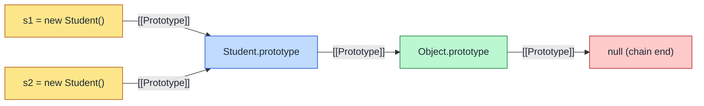
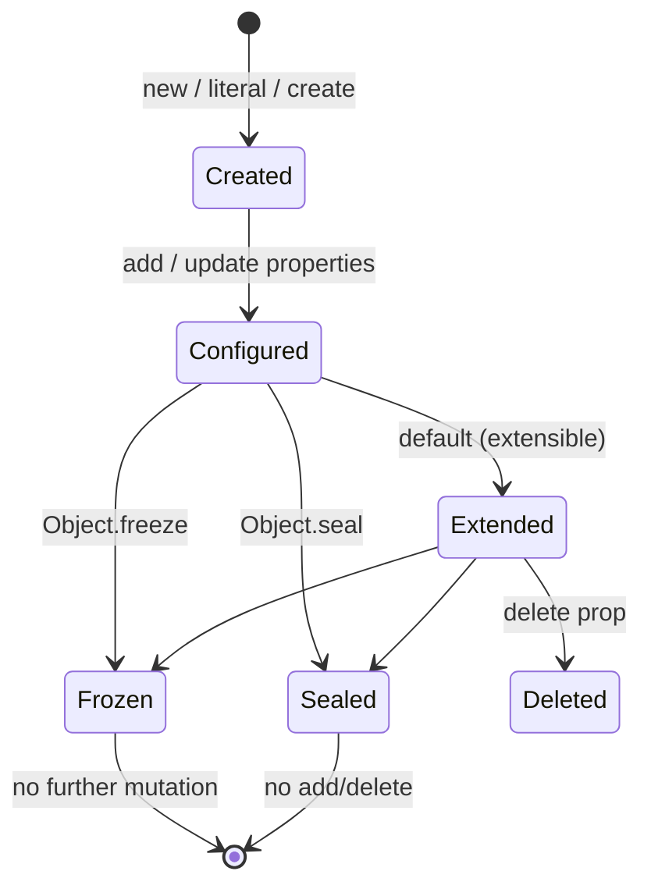
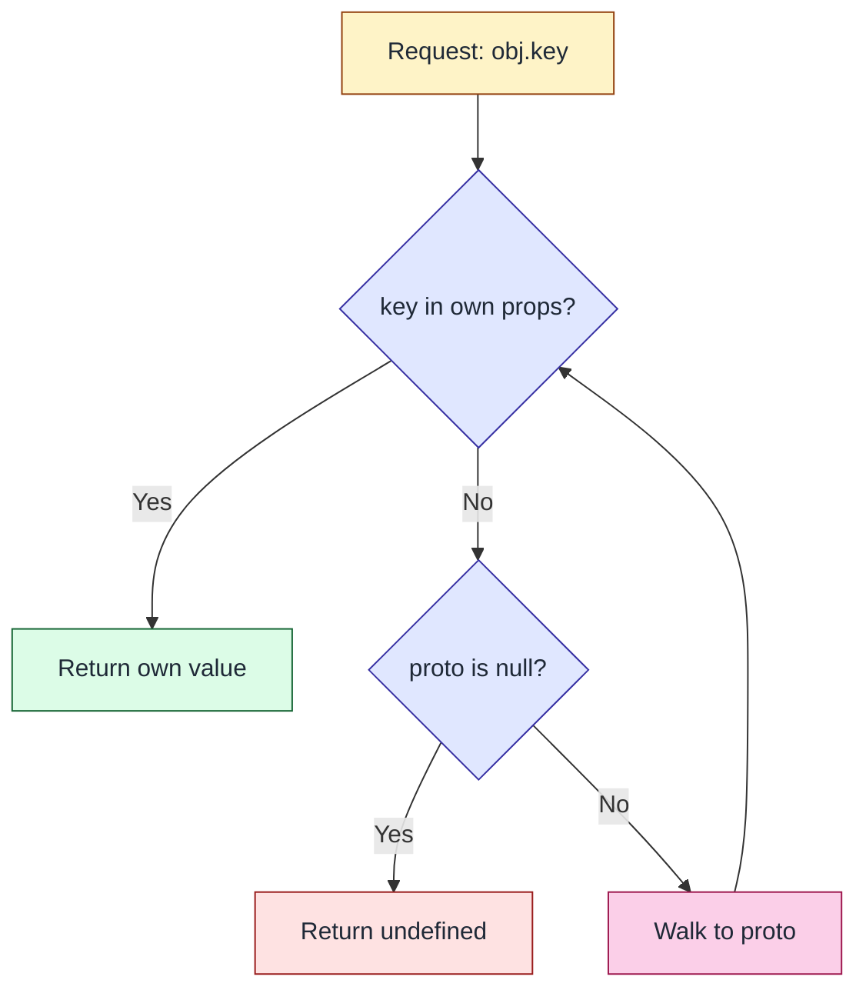
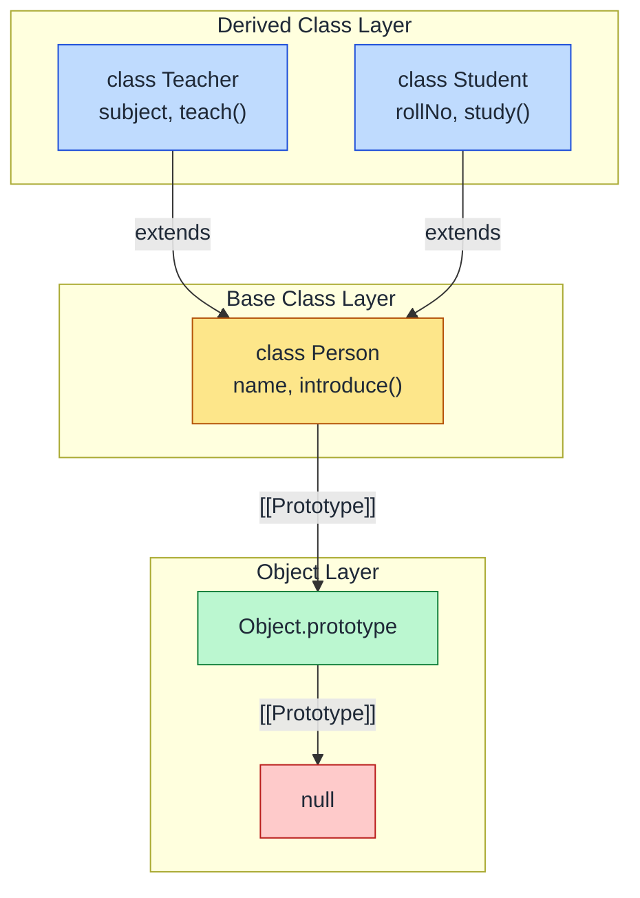
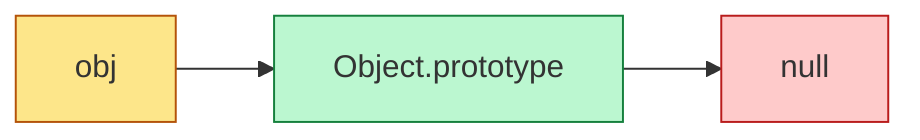

# Objects

<!-- SECTION_1_START -->
# Objects in JavaScript — KTU 2024 Scheme Web Programming (OECST832)

## 1. Core Technical Definition & Intuitive Overview

### 1.1 Formal Definition (KTU 2024 Syllabus Terminology)

In the **JavaScript scripting language**, an **Object** is a composite reference data type that stores data as an **unordered collection of keyed properties**, where each property is a *key:value* pair. The keys are **strings** (or Symbols) and the values can be of *any* type — primitive data, another object, or a function (called a **method** when it is a property of an object).

> [!IMPORTANT]
> **KTU Definition Box:** *"A JavaScript object is a mutable, key-indexed container of properties and methods, prototype-linked to its constructor, forming the foundational data structure upon which most language features (arrays, functions, dates, regex, errors, DOM nodes) are built."*

Formally, an object `O` is the mathematical mapping:

$$
O : \mathcal{K} \rightarrow \mathcal{V}, \quad O[k] = v, \quad \text{where } k \in \mathcal{K} \text{ (string/Symbol keys) and } v \in \mathcal{V} \text{ (any JS value)}
$$

The set of inherited properties reachable through the **prototype chain** is denoted as $\mathcal{P}(O)$, so the *effective* property lookup function is:

$$
\text{Get}(O, k) = O[k] \ \text{if } k \in O, \ \text{else } \text{Get}(\text{Object.getPrototypeOf}(O), k), \ \text{else } \texttt{undefined}
$$

### 1.2 Conceptual Analogy / Intuition

> [!NOTE]
> **Real-world Analogy — "The Employee ID Card"**
> Imagine a physical **Employee ID Card** issued by your college:
> - **Properties** are the printed fields: `name`, `rollNo`, `branch`, `dob`, `validTill`.
> - **Methods** are the actions printed on the back: `enterCampus()`, `borrowBook()`, `markAttendance()`.
> - The card is a *single* entity (object) that **bundles data and behaviour** together.
> - If you photocopy the card's **template** (prototype), every new employee automatically inherits the standard fields and methods — you only fill in the unique values.
> - Two cards made from the same template share *behaviour* but have *independent data* (changing `name` on Card-A does not affect Card-B).

This is exactly how JavaScript objects behave: each object has its own data (own properties), but they can **share behaviour** through the **prototype chain**.

### 1.3 Standard Constants / Reserved Terms (Highlighted)

| Term | Meaning |
|---|---|
| `this` | The **execution context reference** pointing to the owning object at call-time. |
| `__proto__` | The legacy accessor to the *prototype object* (use `Object.getPrototypeOf` in production). |
| `[[Prototype]]` | The **internal slot** that links an object to another object. |
| `Object.prototype` | The **terminal node** of every prototype chain — its prototype is `null`. |
| `constructor` | Property on every object pointing to the function that created its instance. |

> [!TIP]
> **KTU Quick-Fire:** If an examiner asks *"What is the prototype of `Object.prototype`?"* — the answer is **`null`**, and this terminates the chain. Memorise this; it is a recurring **3-mark question**.

### 1.4 Visualisation Hook — Object Property Access

> [!VISUALIZATION CONTROL]
> **Concept:** Visualising property lookup with prototype chain
> **GeoGebra / Desmos Input (mock object model drawn on a line):**
>
> ```text
> p1 = (0, 0)     label "studentObj"
> p2 = (3, 0)     label "Student.prototype"
> p3 = (6, 0)     label "Object.prototype"
> p4 = (9, 0)     label "null  (END)"
> Segment(p1, p2); Segment(p2, p3); Segment(p3, p4)
> ```
>
> **Visual Description:** A horizontal line of four connected nodes. A lookup for `studentObj.toString()` walks rightward along the chain until it finds `toString` on `Object.prototype`. A lookup for `studentObj.rollNo` resolves immediately on the first node.

<!-- SECTION_1_END -->

<!-- SECTION_2_START -->
# 2. Deep Theoretical Analysis & KTU High-Yield Cheat Sheet

## 2.1 Object Creation — The Four Authorised Methods

JavaScript offers **four canonical** ways to manufacture objects. KTU questions are typically framed around *comparing* them.

### 2.1.1 Method 1 — Object Literal (Most Common)

```javascript
const student = {
    name: "Anu",
    rollNo: 45,
    greet() { console.log("Hello, " + this.name); }
};
```

- **Why:** Concise, single-instance objects, no boilerplate.
- **How:** Curly braces `{}` trigger the *object initialiser* path. Internally, `Object` is invoked as the constructor.

### 2.1.2 Method 2 — Constructor Function (Pre-ES6 Pattern)

```javascript
function Student(name, roll) {
    this.name = name;
    this.roll  = roll;
    this.greet = function () { return this.name; };
}
const s1 = new Student("Anu", 45);
```

- **Why:** Used to manufacture many similar objects; the `new` operator:
  1. Creates a fresh empty object.
  2. Sets its `[[Prototype]]` to `Constructor.prototype`.
  3. Executes the constructor with `this` bound to the new object.
  4. Returns the object (unless constructor explicitly returns another object).

### 2.1.3 Method 3 — `Object.create()` (Prototypal Inheritance)

```javascript
const protoObj = { greet() { return "Hi " + this.name; } };
const s2 = Object.create(protoObj);
s2.name = "Rahul";
```

- **Why:** Direct control over the prototype link; preferred in inheritance-heavy designs.
- **How:** `Object.create(proto, props)` returns a new object whose `[[Prototype]]` is `proto`.

### 2.1.4 Method 4 — ES6 `class` (Syntactic Sugar)

```javascript
class Student {
    constructor(name, roll) { this.name = name; this.roll = roll; }
    greet() { return this.name; }
}
const s3 = new Student("Meera", 12);
```

- **Why:** Modern, readable, supports `static`, `extends`, `super`.
- **How:** Internally, `class` is **desugared** to a constructor function with methods placed on the prototype object. *Classes are not hoisted* and run in **strict mode** by default.

## 2.2 The `this` Keyword — Context-Dependent Binding

The reference `this` is **not** lexically scoped; it is determined by **how a function is called**.

| Call Style | Syntax | `this` is bound to |
|---|---|---|
| Method call | `obj.f()` | `obj` |
| Plain call | `f()` | `undefined` (strict) / `window` (sloppy) |
| `new` call | `new F()` | The newly created object |
| Explicit | `f.call(x)` / `f.apply(x)` | `x` |
| Bind | `const g = f.bind(x); g()` | `x` (permanently) |

> [!IMPORTANT]
> **Arrow functions are an exception** — they do **not** have their own `this`. They inherit it *lexically* from the enclosing scope. KTU examiners love this distinction.

## 2.3 Prototype Chain Mechanics — The `Why` Behind Behaviour

Every object carries a hidden `[[Prototype]]` slot (accessible via `Object.getPrototypeOf(obj)`). When you access a property:

1. Engine searches the **own properties** of the object.
2. If not found, walks to `[[Prototype]]`, and repeats.
3. Terminates when the prototype is `null`.

This produces **dynamic inheritance** — modifying `Constructor.prototype` at runtime *immediately* affects all existing instances (and future ones).

## 2.4 KTU Cheat Sheet — Object Essentials

| Concept | Syntax / Formula | Return Type | KTU Frequency |
|---|---|---|---|
| Create literal | `{}` or `{k:v}` | Object | ★★★★★ |
| Create via constructor | `new Fn(args)` | Object | ★★★★★ |
| Create via prototype | `Object.create(proto)` | Object | ★★★★ |
| Class declaration | `class C { constructor(){} m(){} }` | Class (Function) | ★★★★ |
| Access property | `obj.k` or `obj["k"]` | any | ★★★★★ |
| Add/Update | `obj.k = v` | `v` | ★★★★★ |
| Delete | `delete obj.k` | Boolean | ★★★ |
| Check own prop | `obj.hasOwnProperty("k")` | Boolean | ★★★★ |
| Get keys | `Object.keys(obj)` | Array of strings | ★★★★★ |
| Get values | `Object.values(obj)` | Array | ★★★★ |
| Get entries | `Object.entries(obj)` | Array of [k,v] | ★★★★ |
| Merge objects | `Object.assign(target, src)` | target object | ★★★★ |
| Clone (shallow) | `Object.assign({}, src)` or `{...src}` | new object | ★★★★★ |
| Deep clone | `structuredClone(obj)` | new object | ★★★ |
| Freeze object | `Object.freeze(obj)` | same (frozen) | ★★★ |
| Seal object | `Object.seal(obj)` | same (sealed) | ★★★ |
| Prevent extension | `Object.preventExtensions(obj)` | same | ★★ |
| Get prototype | `Object.getPrototypeOf(obj)` | Object or null | ★★★★ |
| Set prototype | `Object.setPrototypeOf(obj, p)` | obj | ★★★ |
| Destructuring | `const {a, b} = obj` | declares a, b | ★★★★★ |
| Spread copy | `{...obj}` | new object | ★★★★ |
| JSON string | `JSON.stringify(obj)` | String | ★★★★★ |
| JSON parse | `JSON.parse(text)` | Object | ★★★★★ |
| Getter | `get propName() { return x; }` | value | ★★★ |
| Setter | `set propName(v) { ... }` | void | ★★★ |
| Iterate values | `for (const v of Object.values(obj))` | — | ★★★ |
| Iterate keys/values | `for (const [k,v] of Object.entries(obj))` | — | ★★★ |

## 2.5 Real-World Utility in Web Engineering

- **DOM API:** Every DOM element (`document.body`, `document.getElementById(...)`) is an object with `id`, `className`, `style`, `addEventListener()`.
- **AJAX / Fetch:** Server responses are *parsed* into objects via `response.json()`.
- **State Management:** React, Vue, and Redux all model the application's state as an **object tree**.
- **Configuration:** `package.json`, `tsconfig.json`, webpack configs — all objects.
- **Storage:** `localStorage` and `sessionStorage` persist *stringified* objects using `JSON.stringify`.

<!-- SECTION_2_END -->

<!-- SECTION_3_START -->
# 3. Step-by-Step Derivations, Code & Symbolic Implementation

## 3.1 Worked Example 1 — Building a `Student` Object Step by Step

**Problem:** Demonstrate the four creation styles for a `Student` object with fields `name` (string), `roll` (number), and method `details()` returning a formatted string.

### Step 1 — Object Literal
```javascript
const s_literal = {
    name: "Anu",
    roll: 45,
    details() { return `${this.name} (${this.roll})`; }
};
console.log(s_literal.details());   // "Anu (45)"
```

### Step 2 — Constructor Function
```javascript
function StudentCtor(name, roll) {
    this.name = name;
    this.roll  = roll;
    this.details = function () { return `${this.name} (${this.roll})`; };
}
const s_ctor = new StudentCtor("Rahul", 12);
console.log(s_ctor.details());      // "Rahul (12)"
```

### Step 3 — `Object.create`
```javascript
const studentProto = {
    details() { return `${this.name} (${this.roll})`; }
};
const s_create = Object.create(studentProto);
s_create.name = "Meera";
s_create.roll = 7;
console.log(s_create.details());    // "Meera (7)"
```

### Step 4 — ES6 Class
```javascript
class StudentClass {
    constructor(name, roll) {
        this.name = name;
        this.roll  = roll;
    }
    details() { return `${this.name} (${this.roll})`; }
}
const s_class = new StudentClass("Joyal", 33);
console.log(s_class.details());     // "Joyal (33)"
```

**Result:** All four produce an object whose `details()` invocation returns the same shape, but they differ in *memory layout* (literal/ctor/class place `details` on prototype; only Step 2 places it on the instance).

## 3.2 Worked Example 2 — Prototype Chain Walkthrough

**Problem:** Prove that a class instance inherits from `Object.prototype`.

```javascript
class Animal { speak() { return "sound"; } }
const a = new Animal();

// Step A: own property check
console.log("speak" in a);                       // true (inherited)
console.log(a.hasOwnProperty("speak"));          // false (not own)
console.log(Object.getPrototypeOf(a) === Animal.prototype); // true

// Step B: walk the chain
let node = a;
let depth = 0;
while (node !== null) {
    console.log(`Depth ${depth}: ${Object.getPrototypeOf(node) === null ? "null" : node.constructor?.name}`);
    node = Object.getPrototypeOf(node);
    depth += 1;
}
// Expected Console Output:
// Depth 0: Animal
// Depth 1: Object
// Depth 2: null
```

**Mathematical representation of the chain depth:**

$$
\text{depth}(a) = 1 + \text{depth}\big(\text{Object.getPrototypeOf}(a)\big), \quad \text{depth}(\texttt{null}) = 0
$$

For the example:

$$
\begin{aligned}
\text{depth}(a) &= 1 + \text{depth}(\texttt{Animal.prototype}) \\
                &= 1 + 1 + \text{depth}(\texttt{Object.prototype}) \\
                &= 1 + 1 + 1 + \text{depth}(\texttt{null}) \\
                &= 3
\end{aligned}
$$

## 3.3 Worked Example 3 — Inheritance with ES6 `extends` / `super`

```javascript
class Person {
    constructor(name) { this.name = name; }
    introduce() { return `I am ${this.name}`; }
}

class Teacher extends Person {
    constructor(name, subject) {
        super(name);                 // MUST be called before 'this' in derived class
        this.subject = subject;
    }
    introduce() {                   // method override
        return `${super.introduce()}, I teach ${this.subject}`;
    }
}

const t = new Teacher("Dr. Nair", "Web Programming");
console.log(t.introduce());         // "I am Dr. Nair, I teach Web Programming"
console.log(t instanceof Teacher);  // true
console.log(t instanceof Person);   // true
```

**Why `super()` is mandatory:** The derived constructor must invoke `super()` before touching `this`, because `this` is *initialised* by the base constructor via the prototype wiring.

## 3.4 Worked Example 4 — Getters, Setters, and Computed Properties

```javascript
class Circle {
    constructor(radius) { this._radius = radius; }
    get radius()  { return this._radius; }
    set radius(v) {
        if (v < 0) { throw new RangeError("Radius cannot be negative"); }
        this._radius = v;
    }
    get area()    { return Math.PI * this._radius ** 2; }
}

const c = new Circle(5);
console.log(c.area);       // 78.5398...
c.radius = 10;
console.log(c.area);       // 314.1592...
```

**Computed property names** (ES6 feature):

```javascript
const field = "rollNo";
const s = { name: "Anu", [field]: 45 };  // { name: "Anu", rollNo: 45 }
```

## 3.5 Worked Example 5 — Object Destructuring, Spread, and JSON

```javascript
const student = { name: "Anu", roll: 45, branch: "CSE" };

// Destructuring with rename and default
const { name: studentName, roll, branch, cgpa = 0.0 } = student;
console.log(studentName, roll, branch, cgpa);  // Anu 45 CSE 0

// Shallow clone
const clone = { ...student, year: 2024 };
console.log(clone);    // { name: "Anu", roll: 45, branch: "CSE", year: 2024 }

// JSON round-trip
const json = JSON.stringify(student);
console.log(json);                           // '{"name":"Anu","roll":45,"branch":"CSE"}'
const back = JSON.parse(json);
console.log(back);                           // { name: "Anu", roll: 45, branch: "CSE" }
```

> [!NOTE]
> **Pitfall — JSON drops methods and `undefined` values:** `JSON.stringify({a:1, b:undefined, c:()=>{}})` yields `'{"a":1}'`. Methods and `undefined` properties are silently dropped. This is a **favourite KTU 3-mark trick question**.

## 3.6 Worked Example 6 — Enumerating Object Properties (Own vs Inherited)

```javascript
const base = { role: "user" };
const usr  = Object.create(base);
usr.name = "Anu";

for (const k in usr) {
    console.log(k, usr.hasOwnProperty(k) ? "(own)" : "(inherited)");
}
// name (own)
// role (inherited)

console.log(Object.keys(usr));           // ["name"]  (own + enumerable)
console.log(Object.getOwnPropertyNames(usr)); // ["name"]
```

**Note:** `for...in` iterates enumerable properties *including inherited*, while `Object.keys` returns **own enumerable** only.

## 3.7 Full Operational Program — Combining All Concepts

```python
# Pseudo-code summary of the JavaScript runtime (for examiners' reference)
class Engine:
    def get(self, obj, key):
        while obj is not None:
            if key in obj.own_props:
                return obj.own_props[key]
            obj = obj.proto
        return None
```

```javascript
// ====== Complete Demonstration Program ======
"use strict";

class Course {
    constructor(title, credits) {
        this.title = title;
        this.credits = credits;
        Object.freeze(this);                 // immutable instance
    }
    describe() { return `${this.title} (${this.credits} cr)`; }
}

class WebProgrammingCourse extends Course {
    constructor() { super("Web Programming", 3); }
    get syllabus() { return ["HTML", "CSS", "JavaScript", "PHP"]; }
}

const wp = new WebProgrammingCourse();
console.log(wp.describe());                  // Web Programming (3 cr)
console.log(wp.syllabus);                    // ["HTML", "CSS", "JavaScript", "PHP"]

// Try mutating frozen object
try {
    wp.title = "Hacked";
} catch (e) {
    console.log("Mutation blocked:", e.message);
}

// Static method
class Util {
    static isObject(x) { return x !== null && typeof x === "object"; }
}
console.log(Util.isObject(wp));              // true

// Destructuring with rest
const { title, ...rest } = wp;
console.log(title, rest);                    // Web Programming { credits: 3 }
```

<!-- SECTION_3_END -->

<!-- SECTION_4_START -->
# 4. Structural Diagrams & Schematics

## 4.1 Prototype Chain Diagram



**Reading the diagram:** Two instances `s1`, `s2` both delegate to the same `Student.prototype` object, which in turn delegates to `Object.prototype`, terminating at `null`. Methods declared inside the class body live on `Student.prototype` and are **shared** by all instances.

## 4.2 Object Lifecycle State Diagram



## 4.3 Block-Level Functional Architecture — Object Property Lookup



## 4.4 Class Inheritance Tree



## 4.5 Sequential Processing Topology — JSON Round-Trip Matrix

| Step | Operation | Input | Output | Side Effect |
|---|---|---|---|---|
| 1 | Build object literal | Source data | `Object` | Memory allocation |
| 2 | Mutate property | `obj` | `obj` | In-place change |
| 3 | `JSON.stringify(obj)` | `Object` | `String` | Date → ISO string |
| 4 | Transmit (HTTP / Storage) | `String` | `String` | None |
| 5 | `JSON.parse(str)` | `String` | `Object` | Re-hydrated graph |
| 6 | Access property | `Object` | `Value` | None |

<!-- SECTION_4_END -->

<!-- SECTION_5_START -->
# 5. KTU 2024 Scheme Examination Question Bank & Topic Recap

## 5.1 Part A — Short Answer Questions (3 Marks Each)

### Question A1 `[KTU University Exam — July 2024]`
**(CO1, Remember)**
**Q:** What is an object in JavaScript? List any two ways to create an object.

**Model Answer (Board-Key Style):**
An object in JavaScript is a **collection of key-value pairs** where keys are strings (or Symbols) and values can be primitives, other objects, or functions (called methods when they belong to an object). **[2 Marks]**

Two ways to create an object:
1. **Object Literal:** `const obj = { name: "Anu", roll: 45 };` **[0.5 Mark]**
2. **Constructor Function with `new`:** `const obj = new Object();` or `new Student(...)` **[0.5 Mark]**

---

### Question A2 `[KTU University Exam — Dec 2023]`
**(CO1, Understand)**
**Q:** Differentiate between `Object.freeze()` and `Object.seal()` with an example.

**Model Answer:**
| Aspect | `Object.freeze()` | `Object.seal()` |
|---|---|---|
| Add new properties | Not allowed | Not allowed |
| Delete existing | Not allowed | Not allowed |
| Modify existing | **Not allowed** | **Allowed** |
| Reconfigure descriptors | Not allowed | Not allowed |
| Use case | Constants / configs | Fixed-shape records |

```javascript
const a = Object.freeze({ x: 1 });   // cannot change x
a.x = 99; console.log(a.x);           // 1   (silently fails in non-strict)

const b = Object.seal({ x: 1 });      // can change x
b.x = 99; console.log(b.x);           // 99
```

**[3 Marks — 1 for definition, 1 for table, 1 for code example]**

---

## 5.2 Part B — Long Answer Questions (14 Marks, Internal Choice)

### Question B1 `(14 Marks)` `[KTU University Exam — July 2024]`

#### *Option A — (a) + (b)*

**(a)** Explain the concept of **prototype** in JavaScript with a suitable diagram. How does property lookup work when a property is not found on the object itself? **(7 Marks)**
**(CO1, Understand)

**Model Answer:**

**Definition:** Every JavaScript object has an internal hidden slot `[[Prototype]]` that references another object (or `null`). When a property is accessed, JavaScript first searches the object's own properties; if the key is not present, it follows the prototype chain. **[2 Marks]**

**Prototype Chain Diagram:**



**Property Lookup Algorithm:**

$$
\text{Get}(O, k) =
\begin{cases}
O[k], & \text{if } k \in O \text{ (own)} \\
\text{Get}\big(\text{Object.getPrototypeOf}(O), k\big), & \text{otherwise}
\end{cases}
$$

The chain terminates at `Object.prototype`, whose prototype is `null`. **[2 Marks]**

**Example:**

```javascript
const proto = { greet: () => "Hi" };
const o = Object.create(proto);
console.log(o.greet());        // "Hi"  (inherited from proto)
console.log(o.hasOwnProperty("greet")); // false
```

**[3 Marks — code + explanation of inherited invocation]**

---

**(b)** Write a JavaScript program using ES6 `class` to create a `BankAccount` class with properties `accountHolder`, `balance`, and methods `deposit(amount)` and `withdraw(amount)`. Demonstrate the use of getter `get formattedBalance()`. **(7 Marks)**
**(CO2, Apply)

**Model Answer:**

```javascript
class BankAccount {
    #balance;                                   // private field (ES2022)

    constructor(accountHolder, initialBalance) {
        this.accountHolder = accountHolder;
        this.#balance = initialBalance;
    }

    deposit(amount) {
        if (amount <= 0) throw new RangeError("Deposit must be positive");
        this.#balance += amount;
    }

    withdraw(amount) {
        if (amount > this.#balance) throw new Error("Insufficient funds");
        this.#balance -= amount;
    }

    get formattedBalance() {
        return `₹ ${this.#balance.toFixed(2)}`;
    }
}

const acc = new BankAccount("Anu", 1000);
acc.deposit(500);
acc.withdraw(200);
console.log(acc.formattedBalance);              // "₹ 1300.00"
```

**Valuation Key:**
- [Class declaration with `constructor`: 2 Marks]
- [Methods `deposit` / `withdraw` with validation: 2 Marks]
- [Getter `formattedBalance`: 1 Mark]
- [Correct demonstration of usage & output: 2 Marks]

---

#### *Option B — (a) + (b)*

**(a)** Compare **Object Literal**, **Constructor Function**, and **ES6 Class** approaches to object creation in JavaScript. Provide one example for each. **(7 Marks)**
**(CO1, Understand)

**Model Answer:**

| Aspect | Object Literal | Constructor Function | ES6 Class |
|---|---|---|---|
| Syntax | `{ key: value }` | `function F(){ this.k=v; }` | `class C { constructor(){...} }` |
| Use case | Single instance, config | Pre-ES6 codebases | Modern OOP |
| Methods location | On the object (own) | On each instance (own) | On `C.prototype` (shared) |
| Inheritance | None directly | Via `prototype` chain | `extends` / `super` |
| Hoisting | Not applicable | Hoisted (function decl.) | **Not hoisted** |
| Strict mode | Optional | Optional | **Forced** |

**Object Literal:**
```javascript
const car = { model: "Swift", start() { return "vroom"; } };
```
**[1 Mark]**

**Constructor Function:**
```javascript
function Car(model) { this.model = model; this.start = function() { return "vroom"; }; }
const c1 = new Car("Swift");
```
**[2 Marks]**

**ES6 Class:**
```javascript
class Car { constructor(model){ this.model=model; } start(){ return "vroom"; } }
const c2 = new Car("Swift");
```
**[2 Marks]**

**Comparison Summary Table:** **[2 Marks]**

---

**(b)** Demonstrate the following JavaScript object operations with code snippets: (i) Destructuring (ii) Spread operator for cloning (iii) `Object.keys()`, `Object.values()`, `Object.entries()` (iv) JSON serialisation. **(7 Marks)**
**(CO2, Apply)

**Model Answer:**

```javascript
const product = {
    id: 101,
    name: "Laptop",
    price: 55000,
    inStock: true
};

// (i) Destructuring
const { id, name, price, discount = 0 } = product;
console.log(id, name, price, discount);          // 101 Laptop 55000 0

// (ii) Spread clone (shallow)
const clone = { ...product, year: 2024 };
console.log(clone);                              // { id:101, name:"Laptop", price:55000, inStock:true, year:2024 }

// (iii) Object.* enumerators
console.log(Object.keys(product));     // ["id","name","price","inStock"]
console.log(Object.values(product));   // [101,"Laptop",55000,true]
console.log(Object.entries(product));  // [["id",101],["name","Laptop"],["price",55000],["inStock",true]]

// Iterate entries
for (const [k, v] of Object.entries(product)) {
    console.log(`${k} => ${v}`);
}

// (iv) JSON serialisation
const json = JSON.stringify(product);
console.log(json);                              // '{"id":101,"name":"Laptop","price":55000,"inStock":true}'

// Round-trip
const parsed = JSON.parse(json);
console.log(parsed.name);                        // "Laptop"
```

**Valuation Key:**
- [Destructuring with default: 1.5 Marks]
- [Spread clone: 1.5 Marks]
- [Object.keys/values/entries: 2 Marks]
- [JSON round-trip: 2 Marks]

---

> [!WARNING]
> **KTU Examiner's Valuation Warning — Common Pitfalls**
> 1. **Forgetting `new` keyword** with constructor functions — `this` becomes `undefined` in strict mode, and the function returns `undefined` instead of an object. *Marks lost: 1–2 per sub-part.*
> 2. **Mixing up `Object.keys` (own + enumerable) with `for...in` (own + inherited + enumerable).** A common 3-mark trap asks you to list *all* keys including inherited ones.
> 3. **Forgetting to call `super()`** in a derived class constructor before using `this`. This throws `ReferenceError: Must call super constructor in derived class`.
> 4. **JSON.stringify drops methods and `undefined`.** If a question asks to "serialize a class instance", students often lose marks by not pointing out that *methods are lost* in the process.
> 5. **Confusing shallow vs deep copy.** `{...obj}` is shallow — nested objects share references. Use `structuredClone(obj)` for deep copy.
> 6. **Arrow functions and `this`.** Writing `greet = () => {...}` as a *class field* gives a per-instance function (own property), not a prototype method. Examiners consider this a structural mistake.

---

## 5.3 Topic Recap & Important Things to Remember

- **Object definition:** Unordered collection of `key: value` pairs; values may be primitives, objects, or functions (methods).
- **Four creation patterns:** Object Literal `{}`, Constructor + `new`, `Object.create(proto)`, ES6 `class`.
- **`new` operator duties:** (1) Create empty object, (2) link prototype, (3) bind `this`, (4) return object.
- **Prototype chain:** `obj → Constructor.prototype → Object.prototype → null`. Property lookup walks the chain; **own properties** shadow inherited ones.
- **`this` binding:** Method → object, plain → `undefined`/`window`, `new` → new object, `call/apply/bind` → explicit target. **Arrow functions inherit `this` lexically.**
- **Enumerability:**
  - `Object.keys(o)` → own + enumerable (string keys).
  - `for...in` → all enumerable (own + inherited).
  - `Object.getOwnPropertyNames(o)` → own + all (string keys, including non-enumerable).
- **Immutability API:** `Object.freeze` (no mutation), `Object.seal` (no add/delete, but can update), `Object.preventExtensions` (no add).
- **Copying:** Spread `{...o}` and `Object.assign({}, o)` are **shallow**; use `structuredClone(o)` for deep.
- **Destructuring:** Pull properties into local bindings with rename (`{a: x}`) and default (`{a = 0}`) support.
- **JSON limitations:** Drops methods, `undefined`, Symbol keys; converts `Date` to ISO string; `NaN`/`Infinity` → `null`.
- **ES6 class facts:** Not hoisted; runs in strict mode by default; methods on prototype; supports `static`, `extends`, `super`, `#privateFields`, getters/setters.
- **Common method patterns:** `Object.keys`, `Object.values`, `Object.entries`, `Object.assign`, `Object.fromEntries`, `Object.defineProperty`, `Object.create`, `Object.getPrototypeOf`, `Object.setPrototypeOf`.
- **Inheritance check:** Use `instanceof` (constructor chain) or `Object.is` / `isPrototypeOf` (prototype chain).
- **Real-world uses:** DOM nodes, JSON payloads, configuration files, state containers in React/Redux, API responses from `fetch()`.
- **Memory note:** Methods on the prototype are **shared** (memory-efficient), while methods defined inside the constructor are **per-instance** (memory-heavy).

<!-- SECTION_5_END -->
