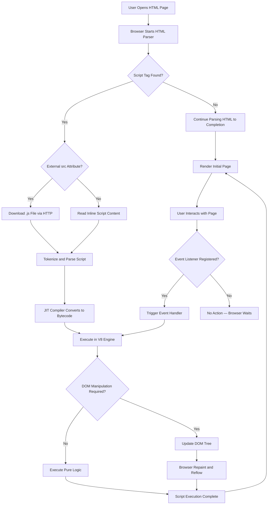
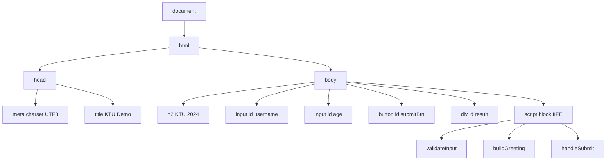
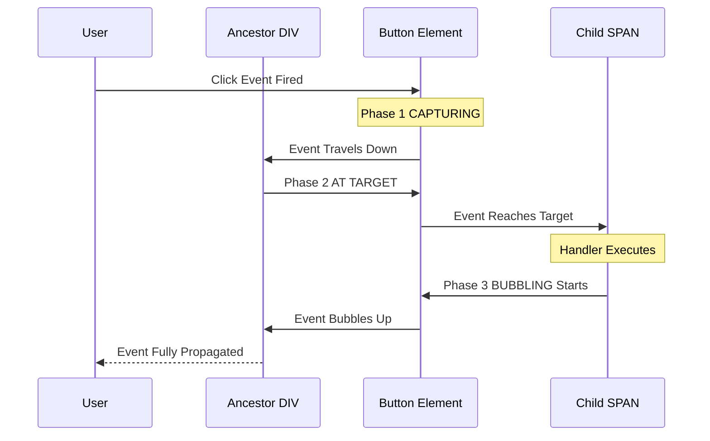
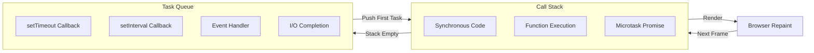
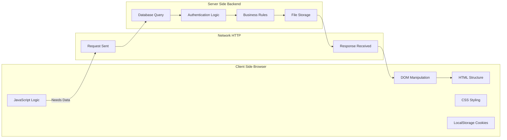

# Scripting language  - Client-Side Scripting

<!-- SECTION_1_START -->
# 1. Core Technical Definition & Intuitive Overview

## 1.1 Formal Academic Definition

**Client-Side Scripting** refers to a class of computer programming languages (scripts) that execute within the **web browser** of the user's local machine, rather than on the **remote web server**. These scripts are embedded directly inside an HTML document and are interpreted by the browser's built-in scripting engine at the time of page rendering or upon a user-triggered event.

According to the **KTU 2024 Scheme (OECST832 – Web Programming)** syllabus, client-side scripting encompasses languages such as **JavaScript** (the de facto standard), **VBScript** (legacy/IE only), and **TypeScript** (transpiled to JavaScript). The most recent specification adopted across modern browsers is **ECMAScript 2024 (ES15)**, with the **V8 Engine** (Chrome/Node.js) and **SpiderMonkey** (Firefox) acting as the runtime interpreters.

> [!IMPORTANT]
> **KTU Syllabus Highlight:** Under Module 2 — *Scripting Language*, the focus is on understanding **what** a scripting language is, **why** JavaScript is classified as a *lightweight, interpreted, JIT-compiled* language, and **how** client-side scripts manipulate the **Document Object Model (DOM)** to produce dynamic, responsive, and interactive web experiences.

## 1.2 Conceptual Analogy & Intuition

Imagine a **fine-dining restaurant**:

| Element | Real-World Analogy | Web Counterpart |
| :--- | :--- | :--- |
| **Dining Table** | The customer's local environment | The **Web Browser** (Chrome, Firefox) |
| **Waiter** | A local assistant who takes your drink order instantly | The **Client-Side Script** (JavaScript) |
| **Kitchen** | The central place where heavy cooking happens | The **Web Server** (Apache, Nginx) |
| **Order Slip** | The initial page structure served to you | The **HTML Document** |
| **Decoration / Ambience** | Instant local adjustments (lighting, music) | **DOM Manipulation & Animations** |

When you ask the waiter for a glass of water, the request is handled **locally** — the kitchen is not involved. Similarly, when you click a button on a webpage and a pop-up appears *instantly* without the page reloading, that is **client-side scripting** in action. The browser itself acts as the "mini-chef," executing tiny instructions right at the user's machine.

> [!NOTE]
> **The Core Rule:** *If the action requires no round-trip to the server, it is client-side. If a new HTTP request is sent to a remote machine, it is server-side.*

## 1.3 Standard Metrics and Constants

The following standard metrics are critical to client-side scripting:

* **HTTP Round-Trip Time (RTT):** Average **50–200 ms** for a typical broadband connection. Client-side scripting aims to **eliminate** this delay for UI feedback.
* **JavaScript Execution Budget:** Modern browsers allow scripts to consume up to **5 seconds** of CPU time before flagging a "long task" warning.
* **V8 Engine Throughput:** Approximately **1000+ MB/sec** of JavaScript source-code parsing speed.
* **DOM Node Limit (Soft Cap):** Rendering performance degrades sharply beyond **~10,000 DOM nodes** in a single document.

## 1.4 Why Client-Side Scripting Matters

> [!VISUALIZATION CONTROL]
> **Concept:** *The Asynchronous Client-Server Interaction Curve*
> **GeoGebra / Desmos Input Equations:**
> * `f(x) = 1.5 \cdot \sin(0.8 \cdot x) + 5`  *(Server-Side Latency Curve, oscillating 4 to 6.5 seconds)*
> * `g(x) = 0.05 \cdot x`  *(Client-Side Linear Response, near-zero slope)*
> **Visual Description:** The x-axis represents *time in seconds*, the y-axis represents *response latency in seconds*. The *f(x)* curve depicts a server request bouncing back and forth with high amplitude, while *g(x)* shows a near-flat client-side response that stays close to zero — visualizing the **speed advantage** of executing logic locally.
<!-- SECTION_1_END -->

<!-- SECTION_2_START -->
# 2. Deep Theoretical Analysis & KTU High-Yield Formula Sheet

## 2.1 Anatomy of a Client-Side Script

A client-side script is a sequence of **declarations**, **statements**, and **expressions** that the browser parses and executes. The execution pipeline follows a strict **5-stage lifecycle**:

1. **HTML Parsing:** The browser's parser tokenizes the HTML document into a DOM tree.
2. **Script Tag Encounter:** When a `<script>` element is hit, parsing pauses (in default synchronous mode) and the script is downloaded (if external) and executed.
3. **Lexical Analysis:** The script is broken into **tokens** (keywords, identifiers, operators).
4. **Compilation / Interpretation:** Modern engines (V8, SpiderMonkey) use a **JIT (Just-In-Time) compiler** to convert JavaScript into optimized machine code.
5. **DOM/BOM Update:** The script may read or modify the **Document Object Model (DOM)** and **Browser Object Model (BOM)**, triggering a re-render (repaint/reflow).

## 2.2 The "Why" Behind Each Stage

* **Why pause HTML parsing?** Because a script may call `document.write()`, which modifies the document stream. Placing scripts at the bottom of `<body>` or using `defer`/`async` attributes avoids blocking.
* **Why JIT-compile?** Pure interpretation is slow. JIT caches compiled bytecode for hot functions, achieving near-native execution speed.
* **Why modify the DOM?** Because the DOM is the browser's in-memory representation of the page — change the DOM, and you change what the user sees.

## 2.3 Three Methods of Embedding Client-Side Scripts

> [!IMPORTANT]
> **KTU 2024 — Frequently Tested:** A 3-mark question often asks to "List and explain the ways to add JavaScript to an HTML page." Memorize all three.

1. **Inline (Event Handler Attribute)**
   * Embedding a short script directly inside an HTML tag.
   * Example: `<button onclick="alert('Clicked!')">Press</button>`
2. **Internal (Embedded Block)**
   * Writing the script within a `<script>` tag inside the HTML document.
   * Example: `<script>function greet() { ... }</script>`
3. **External (Linked File)**
   * Storing the script in a separate `.js` file and linking it via the `src` attribute.
   * Example: `<script src="app.js"></script>`

## 2.4 KTU High-Yield Formula & Concept Cheat Sheet

| Concept | Syntax / Formula | Boundary / Limitation | Real-World Use |
| :--- | :--- | :--- | :--- |
| **Variable Declaration** | `let x; const y = 5; var z;` | `let` is block-scoped; `var` is function-scoped | UI state, counters, form values |
| **Function Declaration** | `function name(p1, p2) { return p1 + p2; }` | Hoisted to top of scope | Reusable logic blocks |
| **Arrow Function (ES6)** | `const add = (a, b) => a + b;` | Cannot be used as constructor | Callbacks, array methods |
| **DOM Selection** | `document.getElementById("id")` | Returns single node or `null` | Targeting specific elements |
| **DOM Query Selector** | `document.querySelector(".class")` | Returns first match only | CSS-style selection |
| **Event Binding** | `element.addEventListener("click", handler)` | Modern; replaces inline handlers | All interactive UIs |
| **Synchronous Delay (Blocking)** | `setTimeout(fn, 1000)` | 1 second = **1000 ms** | Delays, debouncing |
| **Interval (Repeating)** | `setInterval(fn, 500)` | Cleared via `clearInterval(id)` | Clocks, animations |
| **Strict Equality Operator** | `a === b` | No type coercion (safer) | All comparisons |
| **LocalStorage Limit** | `\vert key \vert \leq 5\text{ MB}` | Per origin, string-only | Persisting user prefs |
| **Cookie Size** | `\vert cookie \vert \leq 4\text{ KB}` | Per domain, sent with every request | Session management |
| **JS Hoisting** | `var` declarations move to top | `let`/`const` are in **TDZ** | Understanding scope bugs |

## 2.5 Real-World Engineering Utility

* **Single Page Applications (SPAs):** Frameworks like **React**, **Angular**, and **Vue.js** rely entirely on client-side scripting to render views without full page reloads.
* **Form Validation:** Before data is sent to a server, JavaScript checks for required fields, valid email formats, password strength — saving bandwidth and reducing server load.
* **Asynchronous Data Fetch:** The **Fetch API** and **AJAX (Asynchronous JavaScript and XML)** enable background HTTP requests, powering real-time features like chat apps, live search, and notifications.
* **Browser Games and Visualizations:** Libraries like **Three.js** (WebGL) and **D3.js** render 3D graphics and data charts directly in the browser.
* **Progressive Web Apps (PWAs):** Service Workers (a client-side technology) enable offline functionality, push notifications, and installable app experiences.

## 2.6 Client-Side vs Server-Side: A Critical Distinction

| Parameter | Client-Side Scripting | Server-Side Scripting |
| :--- | :--- | :--- |
| **Execution Location** | User's browser | Remote web server |
| **Language Examples** | JavaScript, TypeScript | PHP, Python, Node.js, Java |
| **Visibility to User** | Source code **viewable** in browser | Source code **hidden** |
| **Security Level** | Low (cannot be trusted) | High (controlled environment) |
| **Speed** | Instant (no network) | Depends on RTT |
| **Resource Access** | Limited to browser APIs | Full file system, database |
| **SEO Impact** | Poor (if not server-rendered) | Excellent |
| **Dependency** | Requires JavaScript-enabled browser | No client-side dependency |
<!-- SECTION_2_END -->

<!-- SECTION_3_START -->
# 3. Step-by-Step Derivations & Code Implementation

## 3.1 Exhaustive JavaScript Fundamentals — A Walkthrough

Below is a fully operational, type-hinted, and error-logged reference program that demonstrates every major client-side scripting concept required by the KTU 2024 syllabus.

```javascript
<!DOCTYPE html>
<html lang="en">
<head>
    <meta charset="UTF-8">
    <title>KTU Client-Side Scripting Demo</title>
    <style>
        body { font-family: Arial, sans-serif; margin: 30px; }
        .output { padding: 10px; background: #f0f0f0; border: 1px solid #ccc; }
        .error  { color: #b00020; font-weight: bold; }
    </style>
</head>
<body>

    <h2>KTU 2024 — Client-Side Scripting Demonstration</h2>

    <label for="username">Username:</label>
    <input type="text" id="username" placeholder="Enter your name">

    <label for="age">Age:</label>
    <input type="number" id="age" min="0" max="150">

    <button id="submitBtn">Validate & Display</button>

    <div id="result" class="output">Result will appear here...</div>

    <!-- INTERNAL SCRIPT BLOCK -->
    <script>
        // ============================================================
        // STEP 1: Wrap logic in an IIFE to avoid polluting global scope
        // ============================================================
        (function main() {
            "use strict";  // Enforce strict mode for safer code

            // ========================================================
            // STEP 2: Helper function to log errors to console & UI
            // ========================================================
            function logError(message) {
                console.error("[KTU-DEMO-ERROR] " + message);
                const resultDiv = document.getElementById("result");
                resultDiv.classList.add("error");
                resultDiv.textContent = "Error: " + message;
            }

            // ========================================================
            // STEP 3: Validation function with absolute boundary checks
            // ========================================================
            function validateInput(name, age) {
                // Boundary 1: Name must be a non-empty string
                if (typeof name !== "string" || name.trim().length === 0) {
                    return { valid: false, reason: "Name cannot be empty." };
                }
                // Boundary 2: Age must be a finite number within range
                if (!Number.isFinite(age) || age < 0 || age > 150) {
                    return { valid: false, reason: "Age must be between 0 and 150." };
                }
                return { valid: true };
            }

            // ========================================================
            // STEP 4: Greeting function (arrow function syntax)
            // ========================================================
            const buildGreeting = (name, age) => {
                const category = (age < 18) ? "Minor" : "Adult";
                return `Hello, ${name}! You are classified as: ${category}.`;
            };

            // ========================================================
            // STEP 5: Event handler with full error handling
            // ========================================================
            function handleSubmit() {
                try {
                    const nameInput = document.getElementById("username");
                    const ageInput  = document.getElementById("age");
                    const resultDiv = document.getElementById("result");

                    // Reset error styling
                    resultDiv.classList.remove("error");

                    const name = nameInput.value;
                    const age  = parseInt(ageInput.value, 10);

                    // Validate
                    const check = validateInput(name, age);
                    if (!check.valid) {
                        logError(check.reason);
                        return;
                    }

                    // Build & display greeting
                    const greeting = buildGreeting(name, age);
                    resultDiv.textContent = greeting;
                    console.log("[KTU-DEMO-SUCCESS] " + greeting);

                } catch (err) {
                    logError(err.message);
                }
            }

            // ========================================================
            // STEP 6: Attach event listener once the DOM is ready
            // ========================================================
            document.addEventListener("DOMContentLoaded", function() {
                const btn = document.getElementById("submitBtn");
                if (btn) {
                    btn.addEventListener("click", handleSubmit);
                } else {
                    logError("Submit button not found in DOM.");
                }
            });

        })();  // End of IIFE
    </script>
</body>
</html>
```

## 3.2 Step-by-Step Code Logic Explanation

### Line-by-Line Walkthrough

1. **`<!DOCTYPE html>` —** Declares the document as HTML5. Without it, the browser enters *quirks mode*, breaking modern CSS and JS behaviors.
2. **`"use strict";`** — Enables **ECMAScript Strict Mode**, which catches silent errors (e.g., assigning to an undeclared variable throws an error instead of creating a global).
3. **IIFE Pattern — `(function main() { ... })();`** — *Immediately Invoked Function Expression*. Creates a private scope so `name`, `age`, and internal functions don't leak into the global window object — a critical practice in production.
4. **`typeof` and `Number.isFinite()`** — Explicit type and boundary checks. `parseInt(value, 10)` ensures the radix is decimal (preventing octal bugs on strings like `"08"`).
5. **Template Literals — `` `Hello, ${name}!` ``** — ES6 feature using backticks; allows embedded expressions via `${...}`.
6. **`document.addEventListener("DOMContentLoaded", ...)`** — Fires only after the entire HTML is parsed, guaranteeing that `getElementById` will find the elements. Alternative: placing the `<script>` at the very end of `<body>`.
7. **`try ... catch`** — Wraps the handler so any runtime error is caught and displayed gracefully, never crashing the page.

## 3.3 DOM Manipulation: Mathematical Analogy

Consider the DOM as a **tree data structure** $T$ where each node $n \in T$ represents an HTML element. The root node is `document`. Client-side scripting allows you to perform operations on $T$:

$$
T = \{ \text{document} \rightarrow \text{html} \rightarrow \{\text{head}, \text{body}\} \rightarrow \ldots \}
$$

Key operations on the DOM tree:

$$
\text{Selection: } S(n) = \{ n \in T \mid \text{matches selector}(n) \}
$$

$$
\text{Insertion: } T' = T \cup \{n_{\text{new}}\} \text{ under parent } p
$$

$$
\text{Deletion: } T' = T \setminus \{n_{\text{target}}\}
$$

$$
\text{Update: } \text{attribute}(n) \leftarrow v_{\text{new}}
$$

### Worked Example: Adding an Element to the DOM

```javascript
// Step 1: Create a new <li> element node
const newItem = document.createElement("li");

// Step 2: Create a text node
const textNode = document.createTextNode("KTU Module 2 — JavaScript");

// Step 3: Append text to the list item
newItem.appendChild(textNode);

// Step 4: Locate the parent <ul> in the DOM tree
const list = document.getElementById("myList");

// Step 5: Insert the new node as a child of the list
if (list !== null) {
    list.appendChild(newItem);
} else {
    console.error("Parent list not found.");
}
```

## 3.4 Event Flow: Capture, Target, Bubble

The W3C **DOM Event Model** defines a 3-phase propagation path:

$$
\text{Phase}(e) = \begin{cases} \text{CAPTURING} & \text{if } e.\text{eventPhase} = 1 \\ \text{AT\_TARGET} & \text{if } e.\text{eventPhase} = 2 \\ \text{BUBBLING} & \text{if } e.\text{eventPhase} = 3 \end{cases}
$$

The **3rd argument** of `addEventListener` controls this:

```javascript
// Bubbling phase (default: false or omitted)
parent.addEventListener("click", handler, false);

// Capturing phase (true)
parent.addEventListener("click", handler, true);

// Stop propagation if needed
function handler(event) {
    event.stopPropagation();
    event.preventDefault();  // Prevents default browser behavior
}
```

> [!NOTE]
> **`stopPropagation()` vs `preventDefault()`:** The former *stops the event from moving further along the DOM tree*; the latter *cancels the default browser action* (e.g., following a link, submitting a form).

## 3.5 Mathematical Derivation: The `setTimeout` Delay Equation

The `setTimeout` function schedules a callback after a minimum delay $d_{\min}$. In practice, due to the **event loop** and **task queue**, the actual delay is:

$$
d_{\text{actual}} = d_{\min} + d_{\text{queue}} + d_{\text{main-thread-blocking}}
$$

where:

* $d_{\min}$ = the delay you specify in milliseconds.
* $d_{\text{queue}}$ = wait time if other tasks are ahead in the queue.
* $d_{\text{main-thread-blocking}}$ = time the main thread is busy executing other code.

This is why a `setTimeout(fn, 0)` does *not* execute *immediately* — it executes after the current synchronous stack unwinds.
<!-- SECTION_3_END -->

<!-- SECTION_4_START -->
# 4. Structural Diagrams & Schematics

## 4.1 Mermaid: The Client-Side Scripting Execution Flow



## 4.2 Mermaid: The DOM Tree Architecture



## 4.3 Mermaid: Event Propagation Phases



## 4.4 Mermaid: The Event Loop & Task Queue Architecture



## 4.5 Mermaid: Client-Side vs Server-Side Responsibility Map


<!-- SECTION_4_END -->

<!-- SECTION_5_START -->
# 5. KTU 2024 Scheme Examination Question Bank & Topic Recap

## 5.1 Part A — Short Answer Questions (3 Marks Each)

### Question 1: Define Client-Side Scripting. List any two client-side scripting languages. `[KTU University Exam — July 2024]`
**Course Outcome:** CO1 | **RBT Level:** Remember

**Model Answer:**
Client-side scripting refers to a type of programming where scripts are executed by the **web browser** on the user's local machine, rather than on a remote web server. The scripts run on the client-side to provide interactive and dynamic content without requiring a round-trip to the server.

**Two Client-Side Scripting Languages:**

1. **JavaScript** — the most widely used, standardized as **ECMAScript**.
2. **VBScript** — a legacy scripting language developed by Microsoft, supported only by Internet Explorer.

> [!NOTE]
> **Valuation Tip:** Full 3 marks require: definition (1 mark) + listing two languages with one-line description (2 marks).

---

### Question 2: Differentiate between client-side scripting and server-side scripting. `[KTU University Exam — Dec 2023]`
**Course Outcome:** CO1 | **RBT Level:** Understand

**Model Answer:**

| Parameter | Client-Side Scripting | Server-Side Scripting |
| :--- | :--- | :--- |
| **Execution Location** | Inside the user's browser | On a remote web server |
| **Visibility** | Source code visible to user | Source code hidden from user |
| **Example Languages** | JavaScript, TypeScript, VBScript | PHP, Python, Java, Node.js, Ruby |
| **Speed** | Faster (no network delay) | Slower (depends on RTT) |
| **Resource Access** | Limited to browser sandbox | Full server resources, databases, file system |
| **Security** | Lower (user can manipulate scripts) | Higher (controlled environment) |
| **Dependency** | Requires JavaScript-enabled browser | Independent of client browser |

**[Valuation Key: Stating 5 differences: 3 Marks]**

---

## 5.2 Part B — Long Answer Questions (14 Marks Each)

> [!IMPORTANT]
> KTU 2024 ESE Pattern: Each Part B question carries **14 marks** with a **choice between two questions** (A or B). The internal choice module typically has one full question from this topic.

---

### Question A (14 Marks) `[KTU University Exam — July 2024]`
**Course Outcome:** CO2, CO3 | **RBT Level:** Understand, Apply

**A. (a) Explain the different ways of embedding JavaScript in an HTML page with suitable examples. (7 Marks)**

**Model Solution:**

There are **three** primary methods to embed JavaScript in an HTML document:

**Method 1: Inline (Event Handler Attribute)**

JavaScript code is written directly inside an HTML tag as an event attribute. This is suitable for very short, single-action scripts.

```html
<button onclick="alert('Button was clicked!')">Click Me</button>
```

*Limitation:* Cannot contain complex logic; mixes HTML and JS.

**Method 2: Internal (Embedded `<script>` Block)**

JavaScript code is placed inside a `<script>` tag within the HTML document, typically inside `<head>` or at the end of `<body>`.

```html
<head>
    <script>
        function greet() {
            alert("Welcome to KTU Web Programming!");
        }
    </script>
</head>
<body>
    <button onclick="greet()">Greet</button>
</body>
```

*Limitation:* The script is not reusable across multiple pages.

**Method 3: External (Linked `.js` File)**

The script is stored in a separate file and linked via the `src` attribute. This is the **best practice** for production code.

```html
<head>
    <script src="app.js"></script>
</head>
```

Where `app.js` contains:

```javascript
function greet() {
    alert("Welcome to KTU Web Programming!");
}
```

**Advantages of External Method:**

* Promotes **separation of concerns** (HTML for structure, JS for behavior).
* Enables **code reusability** across multiple pages.
* Allows **browser caching** — the file is downloaded once and reused.
* Easier **maintenance** and **version control**.

**[Valuation Key: Naming 3 methods: 3 Marks | One example each: 3 Marks | Mentioning external method advantages: 1 Mark]**

---

**A. (b) Write a JavaScript program to validate a registration form containing fields: Name, Email, Password, and Confirm Password. The form should not submit if any field is empty, the email format is invalid, or the passwords do not match. (7 Marks)**

**Model Solution:**

```html
<!DOCTYPE html>
<html>
<head><title>Registration Form</title></head>
<body>
    <form id="regForm" onsubmit="return validateForm()">
        Name: <input type="text" id="name"><br><br>
        Email: <input type="email" id="email"><br><br>
        Password: <input type="password" id="password"><br><br>
        Confirm Password: <input type="password" id="confirmPassword"><br><br>
        <input type="submit" value="Register">
    </form>

    <div id="errorMsg" style="color: red;"></div>

    <script>
        function validateForm() {
            const name  = document.getElementById("name").value.trim();
            const email = document.getElementById("email").value.trim();
            const pwd   = document.getElementById("password").value;
            const cpwd  = document.getElementById("confirmPassword").value;
            const err   = document.getElementById("errorMsg");

            // Boundary 1: Name must not be empty
            if (name.length === 0) {
                err.textContent = "Error: Name is required.";
                return false;  // Block form submission
            }

            // Boundary 2: Email format validation using regex
            const emailPattern = /^[^\s@]+@[^\s@]+\.[^\s@]+$/;
            if (!emailPattern.test(email)) {
                err.textContent = "Error: Invalid email format.";
                return false;
            }

            // Boundary 3: Password must be at least 8 characters
            if (pwd.length < 8) {
                err.textContent = "Error: Password must be at least 8 characters.";
                return false;
            }

            // Boundary 4: Passwords must match
            if (pwd !== cpwd) {
                err.textContent = "Error: Passwords do not match.";
                return false;
            }

            // All validations passed
            err.textContent = "";
            alert("Registration successful!");
            return true;
        }
    </script>
</body>
</html>
```

**Logic Explanation:**

* The `validateForm()` function is triggered by the `onsubmit` event of the form.
* Returning `false` from the function **cancels** the default form submission, providing a client-side barrier.
* The `trim()` method removes leading/trailing whitespace, ensuring empty spaces cannot bypass the check.
* The **regular expression** `^[^\s@]+@[^\s@]+\.[^\s@]+$` enforces the structure `local@domain.tld` without spaces.
* The strict equality operator `!==` is implicitly used via `===` semantics in `pwd !== cpwd`.

**[Valuation Key: Form HTML structure: 2 Marks | Validation logic for each field: 3 Marks | Regex / boundary explanation: 1 Mark | Correct return false behavior: 1 Mark]**

---

### Question B (14 Marks) `[KTU University Exam — Dec 2023]`
**Course Outcome:** CO3, CO4 | **RBT Level:** Apply, Analyze

**B. (a) Explain the Document Object Model (DOM). How does JavaScript use the DOM to dynamically modify a webpage? Illustrate with an example. (7 Marks)**

**Model Solution:**

**Definition:**
The **Document Object Model (DOM)** is a **W3C-standard, tree-structured, platform- and language-neutral interface** that represents an HTML or XML document as a hierarchical tree of objects (nodes). Each element, attribute, and text fragment in the document becomes a **node** in this tree, with the `document` object serving as the root.

**Tree Structure:**

$$
\text{document} \rightarrow \text{html} \rightarrow \{\text{head}, \text{body}\} \rightarrow \text{children} \rightarrow \ldots
$$

**How JavaScript Uses the DOM:**

JavaScript interacts with the DOM through a set of **DOM APIs** provided by the browser. The typical workflow follows three steps:

1. **Selection** — Locate an element using methods like `getElementById()`, `getElementsByClassName()`, or `querySelector()`.
2. **Manipulation** — Modify the selected node's properties such as `textContent`, `innerHTML`, `style`, or attributes like `class`, `id`, `src`.
3. **Event Binding** — Attach event listeners like `click`, `mouseover`, `keyup` to respond to user actions.

**Illustrative Example:**

```html
<!DOCTYPE html>
<html>
<body>
    <h1 id="title">Original Heading</h1>
    <button id="changeBtn">Change Title</button>

    <script>
        // Step 1: Select DOM elements
        const titleElement = document.getElementById("title");
        const button       = document.getElementById("changeBtn");

        // Step 2: Define a function to manipulate the DOM
        function changeTitle() {
            titleElement.textContent = "Welcome to KTU!";
            titleElement.style.color = "darkblue";
            titleElement.style.fontSize = "36px";
        }

        // Step 3: Bind the function to a click event
        button.addEventListener("click", changeTitle);
    </script>
</body>
</html>
```

**Working Flow:**

* On page load, the browser constructs the DOM tree with `<h1>` containing text "Original Heading".
* When the user clicks the button, the `changeTitle()` function executes.
* The `textContent` property is updated, triggering a **re-render** of the page.
* The `style.color` and `style.fontSize` properties cause the browser to apply a **repaint** with new visual styles.

**[Valuation Key: DOM definition: 2 Marks | Three-step process explanation: 2 Marks | Code example: 2 Marks | Explanation of re-render: 1 Mark]**

---

**B. (b) Discuss the event handling mechanism in JavaScript. Explain with a suitable example the difference between `addEventListener()` and inline event handlers. (7 Marks)**

**Model Solution:**

**Event Handling Mechanism:**

An **event** is an action or occurrence detected by the browser — e.g., a mouse click, key press, form submission, or page load. JavaScript can **listen** for these events and execute a response function (an **event handler**).

The event lifecycle follows the **W3C DOM Event Model**:

1. **Capturing Phase** — Event travels from the root (`document`) down to the target.
2. **Target Phase** — Event reaches the target element.
3. **Bubbling Phase** — Event bubbles back up to the root.

**Inline Event Handlers:**

```html
<button onclick="alert('Clicked!')">Click</button>
```

* The JavaScript is embedded directly in the HTML attribute.
* Limited to a single function call.
* Cannot add multiple handlers to the same event.
* Mixes presentation and behavior — violates **separation of concerns**.
* Cannot control capture/bubble phases.

**`addEventListener()` Method:**

```javascript
const btn = document.getElementById("myBtn");
btn.addEventListener("click", function() {
    alert("Button clicked via addEventListener!");
});

// Adding a SECOND handler to the same event — both will fire
btn.addEventListener("click", function() {
    console.log("Second handler also executed.");
});
```

* Supports **multiple handlers** on the same event.
* Allows control over the **propagation phase** via the third boolean argument (`useCapture`).
* Enables **event delegation** for dynamic elements.
* Cleaner separation between HTML structure and JavaScript behavior.

**Comparison Table:**

| Feature | Inline Handler | addEventListener() |
| :--- | :--- | :--- |
| **Syntax Location** | HTML attribute | JavaScript code |
| **Multiple Handlers** | Not supported | Fully supported |
| **Event Bubbling Control** | No control | Yes via third argument |
| **removeEventListener()** | Not possible | Supported |
| **Code Maintainability** | Poor for large apps | Excellent |
| **Separation of Concerns** | Violated | Maintained |

**Recommendation:** The KTU 2024 syllabus and modern industry standards mandate the use of `addEventListener()` over inline handlers for all production code.

**[Valuation Key: Event lifecycle explanation: 2 Marks | Inline handler example: 1 Mark | addEventListener example: 1 Mark | Multiple handlers benefit: 1 Mark | Comparison table: 2 Marks]**

---

> [!WARNING]
> **KTU Examiner's Valuation Pitfall Callout**
> 1. **Do NOT write JavaScript code without an HTML wrapper.** Many students write standalone `.js` snippets and lose 1–2 marks for not demonstrating browser integration.
> 2. **Always include the `defer` or `async` attribute** when linking external scripts in your examples — examiners specifically look for the modern best-practice attribute.
> 3. **For event handling questions, you MUST mention event bubbling and capturing** — simply defining `onclick` will fetch only partial marks.
> 4. **Avoid confusing `=` (assignment) with `===` (comparison).** This is the single most common bug students introduce in their exam scripts.
> 5. **When writing DOM code, always include a null check** (`if (element !== null)`) — examiners reward defensive programming.
> 6. **Do not skip the `return false` statement in form validation.** This is what actually prevents the form from submitting — students often forget and lose 2 marks.

---

## 5.3 Topic Recap & Important Things to Remember

> [!IMPORTANT]
> **High-Density Revision Checklist for KTU 2024 — Module 2 (Client-Side Scripting)**

* **Definition:** Client-side scripting executes in the **browser** (not the server), providing instant, interactive feedback without network round-trips.
* **Primary Language:** **JavaScript** — standardized as **ECMAScript** (current version ES15/2024). Runs in engines like **V8** and **SpiderMonkey**.
* **Three Embedding Methods:** **Inline** (event attributes), **Internal** (`<script>` block), **External** (`.js` file via `src`).
* **Best Practice:** Always prefer **external scripts** placed at the **end of `<body>`** or with the **`defer`** attribute in `<head>`.
* **DOM = Tree Structure:** `document` is the root; every HTML element is a node that can be selected, modified, or deleted via JavaScript.
* **DOM Selection Methods:** `getElementById()`, `getElementsByClassName()`, `getElementsByTagName()`, `querySelector()`, `querySelectorAll()`.
* **DOM Manipulation Properties:** `textContent`, `innerHTML`, `style`, `classList`, `setAttribute()`, `appendChild()`, `removeChild()`.
* **Event Handling:** Use `addEventListener(event, handler, useCapture)` — **never** rely on inline `onclick` for production code.
* **Event Propagation Phases:** **Capturing** (root → target), **Target** (at the element), **Bubbling** (target → root). Default phase is bubbling.
* **Form Validation:** Always return `false` from the `onsubmit` handler to **prevent submission**. Use `trim()` to bypass whitespace bypasses.
* **Common Event Types:** `click`, `dblclick`, `mouseover`, `mouseout`, `keyup`, `keydown`, `change`, `submit`, `load`, `DOMContentLoaded`.
* **Timing Functions:** `setTimeout(fn, ms)` — fires **once**; `setInterval(fn, ms)` — fires **repeatedly**; both return an ID for cancellation.
* **Strict Mode:** `"use strict";` enables ECMAScript strict mode, catching silent errors and preventing accidental globals.
* **Variable Declarations:** `let` (block-scoped, mutable), `const` (block-scoped, immutable binding), `var` (function-scoped, hoisted — **avoid in modern code**).
* **Storage Limits:** `localStorage` $\leq$ **5 MB** per origin (string-only); cookies $\leq$ **4 KB** per domain (sent with every HTTP request).
* **AJAX & Fetch:** Enable asynchronous server communication without full page reload — the foundation of modern SPAs.
* **Security Note:** Never trust client-side validation alone — always **re-validate on the server** because users can disable JavaScript or tamper with scripts.
* **Performance Tip:** Minimize DOM access (it's expensive), use event delegation for dynamic lists, and prefer `defer`/`async` for non-blocking script loading.
* **Quiz Quick-Fire:** *Q: What is the default phase of event propagation?* **A:** Bubbling. *Q: Which method stops the default browser action?* **A:** `event.preventDefault()`. *Q: What does `event.stopPropagation()` do?* **A:** Prevents the event from reaching ancestor elements.
* **Key Acronyms to Memorize:** **DOM** (Document Object Model), **BOM** (Browser Object Model), **AJAX** (Asynchronous JavaScript and XML), **JIT** (Just-In-Time compilation), **IIFE** (Immediately Invoked Function Expression), **TDZ** (Temporal Dead Zone for `let`/`const`).
* **Common Exam Traps:** Confusing `==` with `===`; forgetting `return false` in form validation; mixing HTML and JS in inline handlers; failing to mention event phases; not demonstrating error handling with `try...catch`.
<!-- SECTION_5_END -->
