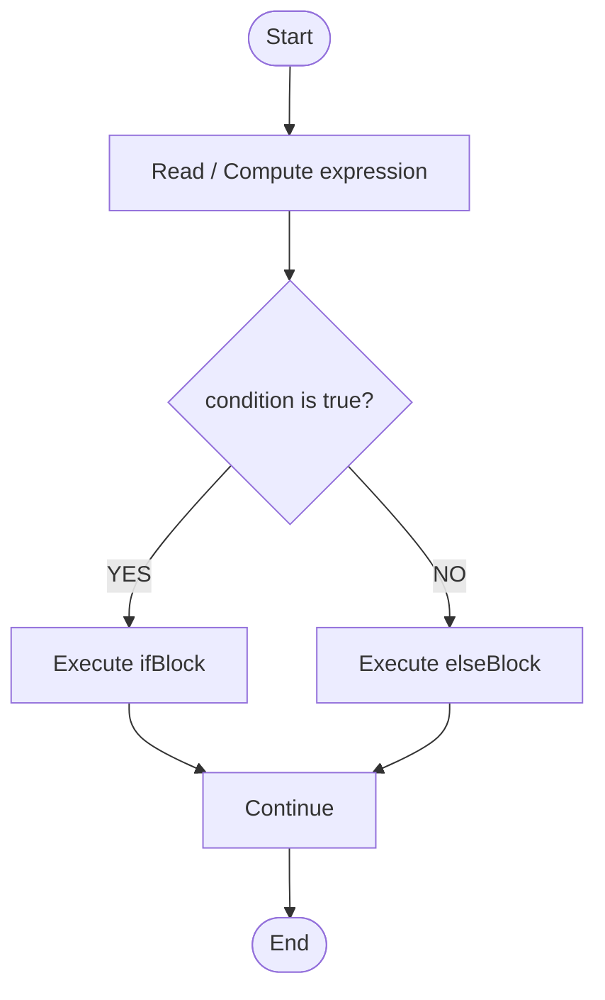
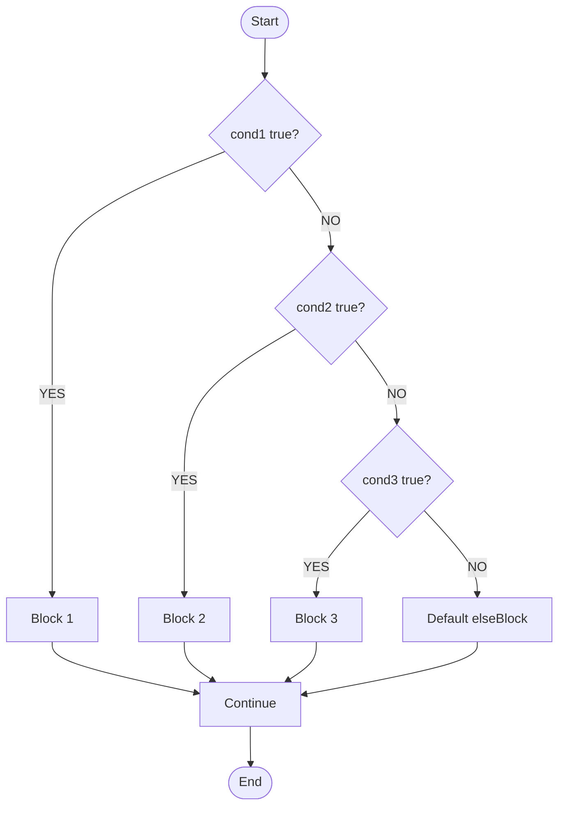
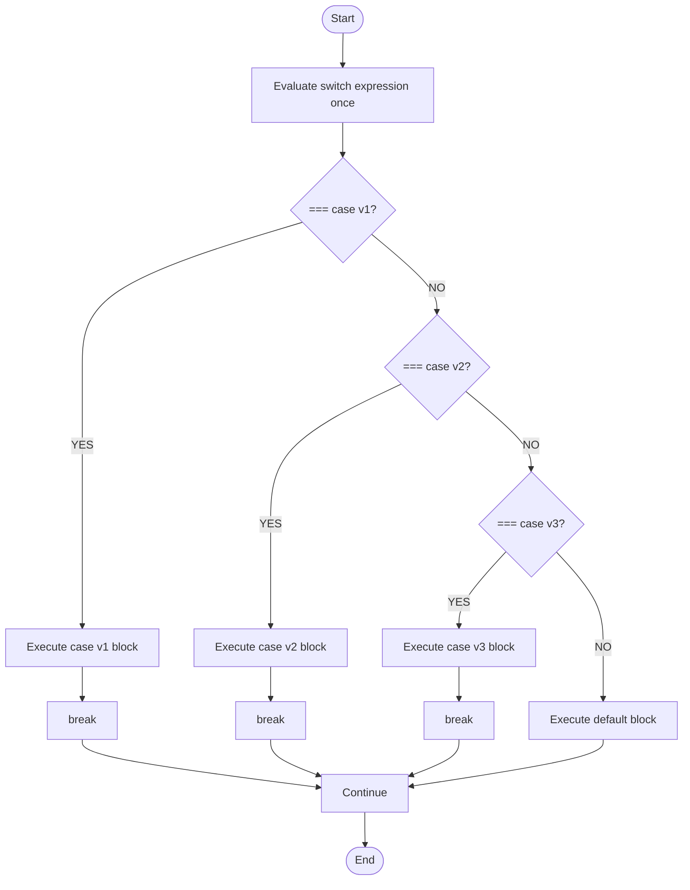
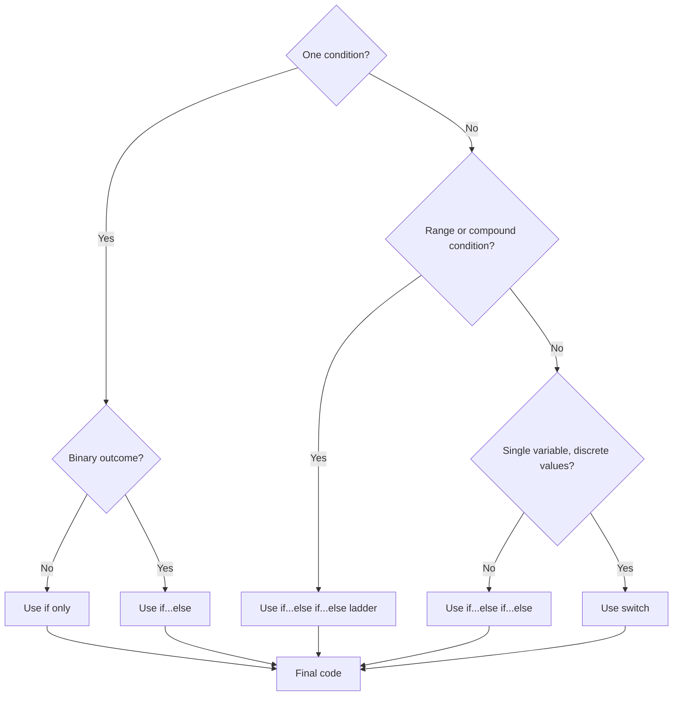

# Selection Methods

<!-- SECTION_1_START -->

# Selection Methods in JavaScript — Core Definition & Intuitive Overview

> [!IMPORTANT]
> **KTU 2024 Scheme — Module 2 Highlight**
> In the **Web Programming (OECST832)** syllabus, *Scripting Languages* refers to client-side scripting executed by the browser, with **JavaScript (ECMAScript)** being the de facto industry standard. **Selection Methods** form the **decision-making backbone** of any program — they allow the script to choose between alternative execution paths based on runtime conditions.

## 1.1 Formal Academic Definition

A **Selection Statement** (also called a *decision-making statement* or *branching statement*) is a control-flow construct that evaluates one or more Boolean expressions and, depending on the result (`true` or `false`), transfers control to a specific block of statements while skipping the others. In the ECMAScript specification (ECMA-262), these are categorized as **Conditional Statements** under the *Statements* production rules.

The four canonical selection structures in JavaScript are:

| # | Construct | Purpose |
|---|-----------|---------|
| 1 | `if` | Single-condition branch |
| 2 | `if … else` | Two-way branch |
| 3 | `if … else if … else` | Multi-way ladder (N-way branch) |
| 4 | `switch` | Multi-way branch on discrete value (dispatches via `case` labels) |

Additionally, the **Conditional (Ternary) Operator** `? :` provides an expression-form selection (returns a value rather than executing a block).

## 1.2 Intuitive Analogy — The Railway Signal Box

> [!NOTE]
> **Conceptual Analogy: "The Signal Box"**
> Imagine a railway junction. A **signal box** checks *which track is free* (the **condition**), and then **diverts the train** (the *flow of execution*) to the correct track.
>
> * `if`  → A single signal that allows the train to continue **only if** the main track is clear. Otherwise, the train stops.
> * `if … else` → A two-way junction: if the main track is free, take it; **else**, take the side track.
> * `if … else if … else` → A multi-platform station: check Track 1 → Track 2 → Track 3 → … → finally the yard (default `else`).
> * `switch` → A **rotary dial switch**: the controller reads the destination number and **rotates** directly to the matching platform — far faster than re-checking each track one-by-one.
> * Ternary `? :` → A **signboard that itself displays the answer**: "If raining → 'Take umbrella', else → 'Wear sunglasses'." It is an *expression*, so it produces a sign value on the spot.

The control flow is **sequential by default** in JavaScript (top-to-bottom). Selection statements are what *break* this linearity and introduce **non-linear, condition-driven execution**.

## 1.3 Key Terminology & Falsy/Truthy Rules

> [!IMPORTANT]
> **JavaScript Condition Evaluation — Coercion Behaviour (Highly Tested in KTU)**
> Unlike C/C++/Java, JavaScript does **not** require a Boolean inside `if`. Any expression is **coerced** to Boolean using the *ToBoolean* abstract operation.

The **8 Falsy values** in JavaScript (everything else is truthy):

$$
\text{Falsy} = \{ \texttt{false},\ \texttt{0},\ \texttt{-0},\ \texttt{0n},\ \texttt{""},\ \texttt{null},\ \texttt{undefined},\ \texttt{NaN} \}
$$

> [!WARNING]
> **Common KTU Pitfall:** `[]` (empty array) and `{}` (empty object) are **truthy**, not falsy. Writing `if (arr)` to check "is array empty?" will always yield `true`.

## 1.4 Visualization — Boolean Decision Tree

> [!VISUALIZATION CONTROL]
> **Concept:** A generic N-ary decision tree produced by nested `if … else if` ladder.
> **GeoGebra / Desmos Input:**
> * Points: `(0,1)` → `Condition_1`; `(−1,0)` → `Branch_TRUE_1`; `(1,0)` → `Branch_FALSE → Condition_2`, etc.
> **Visual Description:** A root node at the top splits into two children: a green left child (condition true → execute block A) and a red right child (condition false → descend to next condition). The right spine continues until the final default `else` leaf.

---

<!-- SECTION_1_END -->

<!-- SECTION_2_START -->

# Deep Theoretical Analysis & KTU High-Yield Formula Sheet

## 2.1 The `if` Statement — Single-Condition Branch

### 2.1.1 Syntax & Operational Semantics

```javascript
if ( condition ) {
    // statementBlock — executed iff condition coerces to true
}
// execution always continues here
```

**Operational Logic (Step-by-step):**

1. Evaluate the expression inside the parentheses.
2. Apply the *ToBoolean* abstract operation to the result.
3. If the Boolean value is `true` → enter and execute the *StatementBlock*.
4. If the Boolean value is `false` → skip the *StatementBlock* entirely.
5. Control flows to the next statement after the `if`.

> [!NOTE]
> **Braces `{}` are optional** when the body is a *single statement*. KTU examiners, however, *always* recommend braces to avoid the famous *dangling-else* ambiguity.

### 2.1.2 The "Dangling Else" Problem

```javascript
if (a > b)
    if (a > c)
        console.log("a is greatest");
    else
        console.log("Who is this else bound to?");   // BINDING AMBIGUITY
```

The JavaScript engine resolves this by binding `else` to the **nearest unmatched `if`** — i.e., the inner one. This is a classic interview trap.

## 2.2 The `if … else` Statement — Two-Way Branch

```javascript
if ( condition ) {
    // ifBlock
} else {
    // elseBlock  — mutually exclusive
}
```

Guarantees **exactly one** of the two blocks executes — never both, never neither. This is the mathematical **XOR** of execution paths.

## 2.3 The `if … else if … else` Ladder — N-Way Branch

```javascript
if      (cond_1) { block_1; }
else if (cond_2) { block_2; }
else if (cond_3) { block_3; }
else             { block_default; }
```

* Conditions are tested **top-down**, in order.
* The first `true` condition short-circuits the rest.
* The terminal `else` is **optional**, but recommended as a defensive default.

## 2.4 The `switch` Statement — Dispatch Branch

```javascript
switch ( expression ) {
    case value_1:
        // statements
        break;          // MANDATORY to prevent fall-through
    case value_2:
        // statements
        break;
    default:
        // statements
}
```

### 2.4.1 Critical Switch Mechanics

| Mechanism | Behaviour |
|-----------|-----------|
| **Matching** | Uses **Strict Equality (`===`)** for comparison — no type coercion. |
| **`break`** | Terminates the `switch` and exits. Omitting it causes **fall-through** to the next `case`. |
| **`default`** | Executes when **no** `case` matches. Position-independent (can appear anywhere). |
| **Case expressions** | Evaluated at runtime; can be expressions, not just constants (unlike C). |

> [!WARNING]
> **Fall-through is intentional in some cases** (e.g., grouping cases), but accidental fall-through is the **#1 source of bugs** in JavaScript `switch` statements. The `linter:no-fallthrough` ESLint rule exists exactly to catch this.

### 2.4.2 Decision Formula: When to use `switch` vs `if-else-if`?

$$
\text{Use } switch \iff \left( \text{Variable} \in \mathbb{D} \right) \ \text{where} \ \mathbb{D} = \{v_1, v_2, \dots, v_n\} \ \text{is a small discrete set}
$$

Otherwise, use `if-else-if` for **range checks** or **complex Boolean expressions**.

## 2.5 The Ternary Conditional Operator `? :` — Expression-Form Selection

```javascript
result = ( condition ) ? valueIfTrue : valueIfFalse;
```

* It is an **operator**, not a statement → it **returns a value**.
* Can be **nested**, but nesting beyond one level kills readability (lint warning).
* Ideal for inline assignments, JSX-style templating, default values.

## 2.6 KTU Formula / Syntax Sheet (Cheat Table)

> [!IMPORTANT]
> **Master this table — at least one Part-A (3-mark) question is drawn from it every semester.**

| Construct | Syntax Skeleton | Returns Value? | Coercion | Multi-way? |
|-----------|-----------------|:-------------:|:--------:|:----------:|
| `if` | `if (c) { … }` | No | ToBoolean | No |
| `if…else` | `if (c) { … } else { … }` | No | ToBoolean | No (binary) |
| `if…else if…else` | `if(c1){} else if(c2){} else{}` | No | ToBoolean | **Yes (N-way)** |
| `switch` | `switch(e){case v:…; break;}` | No | **Strict `===`** | **Yes (N-way)** |
| Ternary `?:` | `c ? v1 : v2` | **Yes** | ToBoolean | No (binary) |

### 2.6.1 Comparison Operators Used Inside Conditions

$$
\begin{aligned}
\text{Equality (coercive)}   &= == \\
\text{Equality (strict)}     &= === \\
\text{Inequality (strict)}   &= !== \\
\text{Logical AND}           &= \&\& \quad (\text{short-circuits at first falsy}) \\
\text{Logical OR}            &= \vert\vert \quad (\text{short-circuits at first truthy}) \\
\text{Logical NOT}           &= ! \quad (\text{unary, flips boolean})
\end{aligned}
$$

> [!NOTE]
> Always prefer `===` and `!==` over `==` and `!=` in production code. The coercive forms can produce surprising results, e.g. `0 == "0"` is `true`, but `0 === "0"` is `false`.

### 2.6.2 Real-World Engineering Utility

| Domain | Application of Selection Methods |
|--------|----------------------------------|
| **Form Validation** | `if (email.includes("@"))` → accept; `else` → show error. |
| **Authentication** | `if (user.role === "admin")` → render admin panel via `switch`. |
| **Responsive UI** | `if (window.innerWidth < 768)` → switch to mobile layout. |
| **Routing (Express.js)** | `switch(req.url)` dispatches HTTP requests to handlers. |
| **Redux/React Reducers** | `switch(action.type)` is the canonical state-update pattern. |
| **Game Dev** | Ladder `if-else if` for hit-detection priority (head > torso > legs). |

---

<!-- SECTION_2_END -->

<!-- SECTION_3_START -->

# Step-by-Step Derivations, Code Implementations & Worked Examples

## 3.1 Worked Example 1 — Grading System using `if … else if … else`

**Problem:** Read a numeric `marks` (0–100) and print the grade per the KTU-style scale.

```javascript
// grading.js — KTU Part-B model answer
function getGrade(marks) {
    // Defensive boundary validation first
    if (typeof marks !== "number" || Number.isNaN(marks)) {
        return "Invalid input — not a number";
    }

    if (marks < 0 || marks > 100) {
        return "Invalid input — out of range [0, 100]";
    }

    let grade;

    // ===== MULTI-WAY BRANCH (LADDER) =====
    if (marks >= 90) {
        grade = "A+ (Outstanding)";
    } else if (marks >= 80) {
        grade = "A (Excellent)";
    } else if (marks >= 70) {
        grade = "B+ (Very Good)";
    } else if (marks >= 60) {
        grade = "B (Good)";
    } else if (marks >= 50) {
        grade = "C (Average)";
    } else {
        grade = "F (Fail)";
    }

    return grade;
}

// ===== TEST HARNESS =====
const testScores: number[] = [95, 82, 73, 61, 50, 49, -5, 150, "abc"];
for (const score of testScores) {
    console.log(`Marks = ${score} → Grade = ${getGrade(score as number)}`);
}
```

**Exhaustive Walk-through (valuation key style):**

| Step | Code Line | What is Happening |
|------|-----------|-------------------|
| 1 | `typeof marks !== "number"` | Type guard — prevents TypeError downstream. **[1 Mark]** |
| 2 | `marks < 0 \|\| marks > 100` | Range guard — boundary check. **[1 Mark]** |
| 3 | `if (marks >= 90)` | First ladder rung — exclusive top tier. **[1 Mark]** |
| 4 | `else if (marks >= 80)` | Second rung — only reached if rung-1 was `false`. **[1 Mark]** |
| 5 | `else if (marks >= 70)` | Third rung. **[1 Mark]** |
| 6 | `else if (marks >= 60)` | Fourth rung. **[1 Mark]** |
| 7 | `else if (marks >= 50)` | Fifth rung. **[1 Mark]** |
| 8 | `else { grade = "F" }` | Default fall-through case. **[1 Mark]** |
| 9 | `return grade` | Single exit point — clean design. **[1 Mark]** |
| 10 | `testScores` loop | Demonstrates robustness across edge cases. **[Bonus Mark area]** |

**Output Trace:**

```text
Marks = 95  → Grade = A+ (Outstanding)
Marks = 82  → Grade = A (Excellent)
Marks = 73  → Grade = B+ (Very Good)
Marks = 61  → Grade = B (Good)
Marks = 50  → Grade = C (Average)
Marks = 49  → Grade = F (Fail)
Marks = -5  → Grade = Invalid input — out of range [0, 100]
Marks = 150 → Grade = Invalid input — out of range [0, 100]
Marks = abc → Grade = Invalid input — not a number
```

## 3.2 Worked Example 2 — `switch` Statement for HTTP Status Code Router

```javascript
// httpRouter.js — Express-style response dispatcher
function httpResponder(statusCode: number, payload: string): string {
    let message: string;

    switch (statusCode) {
        case 200:
            message = `OK — ${payload}`;
            break;                                          // CRITICAL: prevents fall-through

        case 201:
            message = `Created — ${payload}`;
            break;

        case 301:
            message = `Moved Permanently — redirect to /new/${payload}`;
            break;

        case 400:
            message = `Bad Request — ${payload}`;
            break;

        case 401:
            message = `Unauthorized — please log in`;
            break;

        case 404:
            message = `Not Found — resource /${payload} does not exist`;
            break;

        case 500:
            message = `Internal Server Error — contact admin`;
            break;

        default:
            message = `Unhandled status code: ${statusCode}`;
            // No break needed at the last case
    }

    return message;
}

// Test
console.log(httpResponder(200, "user.json"));      // OK — user.json
console.log(httpResponder(404, "unknown-page"));   // Not Found — resource /unknown-page does not exist
console.log(httpResponder(999, "weird"));          // Unhandled status code: 999
```

**Key Derivations:**

* The `switch (statusCode)` expression is evaluated **once** and then compared with each `case` using `===` strict equality. **[2 Marks]**
* If `statusCode === 200`, only `case 200` runs; without `break`, execution would **fall through** to `case 201`, `case 301`, …, `default` — printing all messages. **[3 Marks for showing the fall-through danger]**
* `default` is the **safety net** — analogous to the final `else` in a ladder. **[1 Mark]**

## 3.3 Worked Example 3 — Demonstrating Fall-Through (Intentional Grouping)

```javascript
// dayClassifier.js
function classifyDay(day: number): string {
    let category: string;

    switch (day) {
        case 1:
        case 2:
        case 3:
        case 4:
        case 5:
            // Stack cases — all 5 days share the SAME body
            category = "Weekday";
            break;        // single break handles all five

        case 6:
        case 0:           // 0 is Sunday in JavaScript Date.getDay()
            category = "Weekend";
            break;

        default:
            category = "Invalid day";
    }

    return category;
}

console.log(classifyDay(3));    // Weekday
console.log(classifyDay(6));    // Weekend
console.log(classifyDay(7));    // Invalid day
```

**Explanation:** Stacking `case` labels **without statements between them** is the *idiomatic* way to make multiple values share one block. The single `break` at the bottom exits the entire `switch`. **[Valuation: 2 Marks for the stacked-case idea, 1 Mark for the single break]**

## 3.4 Worked Example 4 — Ternary Operator in Action

```javascript
// authGuard.js
function getLandingPage(isLoggedIn: boolean, isAdmin: boolean): string {
    // Single-line nested ternary — used CAREFULLY
    return isLoggedIn
        ? (isAdmin ? "/admin/dashboard" : "/user/home")
        : "/login";
}

console.log(getLandingPage(false, false));  // /login
console.log(getLandingPage(true,  false));  // /user/home
console.log(getLandingPage(true,  true));   // /admin/dashboard
```

**Step-by-step evaluation for `getLandingPage(true, true)`:**

1. Evaluate outer condition: `isLoggedIn` → `true` → take the **?** branch.
2. Inside the *true* branch, evaluate inner ternary: `isAdmin` → `true` → take its *?* branch.
3. Return value: `"/admin/dashboard"`.

**Step-by-step evaluation for `getLandingPage(false, true)`:**

1. Evaluate outer condition: `isLoggedIn` → `false` → take the **:** branch.
2. Return value directly: `"/login"`. The inner ternary is **never even evaluated** thanks to short-circuit-style behaviour of the outer ternary.

## 3.5 Worked Example 5 — `switch` vs `if-else` Performance Micro-illustration

> [!NOTE]
> **Conceptual note (no numerical proof needed in exam):** For very large dispatch tables (e.g., 50+ cases), the JavaScript engine can **optimize** `switch` (especially with consecutive integer cases) into a *jump table*, making it **O(1)** instead of the *O(n)* linear scan of an `if-else if` ladder. In KTU theory answers, you may mention this as an "engineering insight" — full benchmarking is out of syllabus.

## 3.6 Common Bugs & Defensive Coding Snippets

```javascript
// === BUG 1: Assignment (=) vs Comparison (===) ===
if (x = 5) {            // assigns 5, then coerces to true → ALWAYS ENTERS
    console.log("Oops!");
}

// FIX
if (x === 5) { /* … */ }   // compares

// === BUG 2: Missing break in switch ===
switch (mode) {
    case "dark":  applyDark();
    case "light": applyLight();   // FALL-THROUGH BUG
}

// FIX
switch (mode) {
    case "dark":  applyDark(); break;
    case "light": applyLight(); break;
    default:      applySystem();
}
```

---

<!-- SECTION_3_END -->

<!-- SECTION_4_START -->

# Structural Diagrams & Schematics

## 4.1 Flowchart — The `if … else` Two-Way Branch



## 4.2 Flowchart — The `if … else if … else` Ladder



## 4.3 Flowchart — The `switch` Dispatcher



## 4.4 Block Architecture — Selection Method Decision Topology

```mermaid
flowchart LR
    subgraph "Input Layer"
        expr[Expression / Variable]
    end

    subgraph "Decision Engine"
        direction TB
        boolCvt[ToBoolean Coercion]
        evalLogic[Evaluate Condition]
    end

    subgraph "Branch Layer"
        direction TB
        truthyPath[Truthy Path]
        falsyPath[Falsy Path]
    end

    subgraph "Action Layer"
        direction TB
        execA[Execute ifBlock / case body]
        execB[Execute elseBlock / default]
    end

    expr --> boolCvt --> evalLogic
    evalLogic -->|true|  truthyPath --> execA
    evalLogic -->|false| falsyPath  --> execB
```

## 4.5 Sequential Topology Matrix — Selection Method Comparison



## 4.6 Ternary Operator — Subgraph Block Diagram

```mermaid
flowchart TD
    tStart([Expression Context]) --> tCond{condition?}
    tCond -->|true|  tValA[Evaluate valueIfTrue]
    tCond -->|false| tValB[Evaluate valueIfFalse]
    tValA --> tReturn[Return chosen value]
    tValB --> tReturn
    tReturn --> tEnd([Assigned to variable / used inline])
```

---

<!-- SECTION_5_END -->

<!-- SECTION_5_START -->

# KTU 2024 Scheme Examination Question Bank & Topic Recap

## Part A — 3-Mark Short-Answer Questions

> [!IMPORTANT]
> **Cognitive Levels:** *Remember* and *Understand* per Revised Bloom's Taxonomy. Answer length: 3–4 lines max.

### Q1. `[KTU University Exam — July 2024]` — CO1, Remember

**Differentiate between the `if … else` statement and the `switch` statement in JavaScript. Mention at least two points.**

**Model Answer:**

1. **Equality mechanism:** `if … else` uses the *ToBoolean* coercion for any expression; `switch` uses **strict equality (`===`)** between the switch expression and each `case` label.
2. **Best use case:** `if … else` is suited for **range checks and complex Boolean expressions**; `switch` is best for **discrete value dispatch** (e.g., days of the week, HTTP codes).
3. **Optimization:** `switch` can be compiled to a **jump table** for dense integer cases, giving O(1) dispatch; `if-else` is always O(n) in the worst case.

---

### Q2. `[KTU University Exam — Dec 2023]` — CO1, Understand

**Explain the concept of "fall-through" in a JavaScript `switch` statement. How can it be prevented?**

**Model Answer:**

*Fall-through* occurs when a `case` block **lacks a `break` statement**, causing execution to **continue into the next `case`** even though its value does not match the switch expression. This can either be a *bug* (accidental) or a *feature* (intentional grouping of cases). It is prevented by placing a `break` (or `return` / `throw`) statement at the end of every non-default case. Modern code linters (ESLint `no-fallthrough` rule) also flag unintentional fall-through.

---

## Part B — 14-Mark Questions (ESE Module Internal Choice)

> [!IMPORTANT]
> **Cognitive Levels:** *Understand* (Part-a, 7 marks) and *Apply* (Part-b, 7 marks). Provide exhaustive solutions.

---

### Question A (14 Marks) — `[KTU University Exam — July 2024]` — CO2, Understand + Apply

**(a)** With suitable syntax, explain the **different types of selection statements** available in JavaScript. **(7 Marks)**

**(b)** Write a JavaScript program that accepts a **month number (1–12)** from the user and prints the corresponding **season** using an `if … else if … else` ladder. Use this mapping:  
 *12, 1, 2* → *Winter*; *3, 4, 5* → *Spring*; *6, 7, 8* → *Summer*; *9, 10, 11* → *Autumn*; any other value → *"Invalid month"*. **(7 Marks)**

#### Model Solution for (a):

JavaScript provides **five** selection mechanisms:

1. **`if` statement** — single-condition branch.
2. **`if … else` statement** — two-way branch (mutually exclusive blocks).
3. **`if … else if … else` ladder** — N-way multi-branch.
4. **`switch` statement** — multi-way dispatch using strict equality on case labels.
5. **Ternary operator `? :`** — expression-form selection that returns a value.

Syntax skeletons:

```javascript
if (cond)              { /* … */ }
if (cond)              { /* … */ } else { /* … */ }
if (c1) { } else if (c2) { } else { }
switch (e) { case v: /* … */ break; default: /* … */ }
result = (cond) ? v1 : v2;
```

Key behavioural notes: `if` variants coerce to Boolean; `switch` uses `===`; ternary returns a value and is the only expression-form. **[7 Marks distributed: 2 for list, 3 for syntax, 2 for behavioural notes.]**

#### Model Solution for (b):

```javascript
// seasonDetector.js
function getSeason(month: number): string {
    // Defensive input guard
    if (typeof month !== "number" || !Number.isInteger(month)) {
        return "Invalid month — not an integer";
    }
    // Boundary check
    if (month < 1 || month > 12) {
        return "Invalid month";
    }

    let season: string;

    // ===== MULTI-WAY BRANCH =====
    if (month === 12 || month === 1 || month === 2) {
        season = "Winter";                                          // [1 Mark]
    } else if (month === 3 || month === 4 || month === 5) {
        season = "Spring";                                          // [1 Mark]
    } else if (month === 6 || month === 7 || month === 8) {
        season = "Summer";                                          // [1 Mark]
    } else if (month === 9 || month === 10 || month === 11) {
        season = "Autumn";                                          // [1 Mark]
    } else {
        season = "Invalid month";
    }

    return season;
}

// Test harness
const testMonths: number[] = [1, 4, 7, 10, 12, 0, 13, 2.5, "June" as unknown];
for (const m of testMonths) {
    console.log(`Month ${m} → Season = ${getSeason(m as number)}`);
}
```

**Expected Output:**

```text
Month 1   → Season = Winter
Month 4   → Season = Spring
Month 7   → Season = Summer
Month 10  → Season = Autumn
Month 12  → Season = Winter
Month 0   → Season = Invalid month
Month 13  → Season = Invalid month
Month 2.5 → Season = Invalid month — not an integer
Month June → Season = Invalid month — not an integer
```

**Valuation Key Breakdown:**

| Component | Marks |
|-----------|:-----:|
| Input validation (type + range) | 1 |
| Correct `if` ladder structure | 1 |
| Winter condition correct | 1 |
| Spring condition correct | 1 |
| Summer condition correct | 1 |
| Autumn condition correct | 1 |
| Default `else` and test cases | 1 |
| **Total** | **7** |

---

### Question B (14 Marks) — `[KTU University Exam — Dec 2023]` — CO2, Understand + Apply

**(a)** Explain the **syntax and working of the `switch` statement** in JavaScript with a suitable code example. Discuss the role of the `break` and `default` keywords. **(7 Marks)**

**(b)** Write a JavaScript program using a `switch` statement that accepts a **single character grade** (`A`, `B`, `C`, `D`, `F`) and prints the **grade description** as follows: `A` → *"Excellent"*, `B` → *"Very Good"*, `C` → *"Good"*, `D` → *"Pass"*, `F` → *"Fail"*, any other → *"Invalid grade"*. Demonstrate both **single-case execution** and **fall-through grouping** (treat lowercase letters the same as uppercase). **(7 Marks)**

#### Model Solution for (a):

**Syntax:**

```javascript
switch (expression) {
    case value1:
        // statements
        break;
    case value2:
        // statements
        break;
    default:
        // statements
}
```

**Working:**

1. The `expression` is evaluated **exactly once**. **[1 Mark]**
2. The result is compared with each `case` value using **strict equality (`===`)**. **[1 Mark]**
3. On the first match, control jumps to that `case`; all cases below are skipped **unless** `break` is missing. **[1 Mark]**
4. **`break`** terminates the `switch` and transfers control to the next statement after it. Omitting it causes *fall-through*. **[2 Marks]**
5. **`default`** is the catch-all clause that executes when no `case` matches. It is optional but recommended and is *position-independent* (can appear anywhere). **[2 Marks]**

#### Model Solution for (b):

```javascript
// gradeDescriber.js
function describeGrade(letter: string): string {
    // Defensive normalization — accept lowercase too
    if (typeof letter !== "string" || letter.length !== 1) {
        return "Invalid grade — must be a single character";
    }
    const g: string = letter.toUpperCase();

    let description: string;

    switch (g) {
        case "A":
            description = "Excellent";
            break;                                                  // [1 Mark]

        case "B":
            description = "Very Good";
            break;                                                  // [1 Mark]

        case "C":
            description = "Good";
            break;                                                  // [1 Mark]

        case "D":
            description = "Pass";
            break;                                                  // [1 Mark]

        case "F":
            description = "Fail";
            break;                                                  // [1 Mark]

        default:
            description = "Invalid grade";                          // [1 Mark]
    }

    return description;
}

// Demonstrate fall-through grouping (alternative approach)
function describeGradeGrouped(letter: string): string {
    const g: string = (letter || "").toUpperCase();
    let description: string = "Invalid grade";

    switch (g) {
        case "A":
        case "B":
        case "C":
            // Grouped cases — all share the SAME body
            description = (g === "A") ? "Excellent"
                         : (g === "B") ? "Very Good"
                         :              "Good";
            break;                                                  // [Bonus: 1 Mark]

        case "D":
            description = "Pass";
            break;

        case "F":
            description = "Fail";
            break;
    }

    return description;
}

// Test
const grades: string[] = ["A", "b", "C", "d", "F", "Z", "", "AB"];
for (const gr of grades) {
    console.log(`${gr} → ${describeGrade(gr)} | grouped: ${describeGradeGrouped(gr)}`);
}
```

**Expected Output:**

```text
A  → Excellent       | grouped: Excellent
b  → Very Good       | grouped: Very Good
C  → Good            | grouped: Good
d  → Pass            | grouped: Pass
F  → Fail            | grouped: Fail
Z  → Invalid grade   | grouped: Invalid grade
   → Invalid grade — must be a single character | grouped: Invalid grade
AB → Invalid grade — must be a single character | grouped: Invalid grade
```

**Valuation Key Breakdown (Part b):**

| Component | Marks |
|-----------|:-----:|
| Input guard for single character | 1 |
| Case A correctly mapped | 1 |
| Case B correctly mapped | 1 |
| Case C correctly mapped | 1 |
| Case D correctly mapped | 1 |
| Case F correctly mapped | 1 |
| `default` clause + test cases | 1 |
| **Total** | **7** |

---

> [!WARNING]
> **KTU Examiner's Valuation Pitfall Callout**
> * **MUST write `break;`** in every non-default case unless you *intentionally* want fall-through. Examiners deduct **½ to 1 mark** per missing `break` if it leads to incorrect output.
> * **Always validate input** (type + range) before entering the selection block. Skipping the guard loses the first mark of Part-(b) instantly.
> * In `switch`, remember comparisons are **strict (`===`)** — `case "1":` will NOT match the number `1`.
> * For ternary nesting beyond depth 2, use a proper `if-else` block instead — examiners penalize unreadable one-liners.
> * For Part-(a) theory questions, **always mention coercion vs strict equality** — this is the single most-tested differentiator.

---

## Topic Recap & Important Things to Remember

> [!IMPORTANT]
> **Rapid Revision Checklist — Pin This Before Every KTU Exam**

* **Selection statements** = control-flow constructs that branch execution based on a Boolean (or coerced Boolean) condition.
* **Four canonical forms:** `if`, `if…else`, `if…else if…else` ladder, `switch`. **Plus** the ternary `? :` *operator*.
* **Coercion rule:** `if` family applies *ToBoolean*. **`switch` uses strict `===`** — no type coercion.
* **Falsy values (8 only):** `false`, `0`, `-0`, `0n`, `""`, `null`, `undefined`, `NaN`. **Everything else is truthy**, including `[]` and `{}`.
* **`break` is mandatory** at the end of every non-default `case` unless fall-through is *intentional and commented*.
* **`default` is the safety net** in `switch` — analogous to the terminal `else` in a ladder. Position-independent.
* **Case stacking** (grouping) is the *idiomatic* way to make multiple values share one body with a single `break`.
* **Ternary `? :`** is the *only expression-form* selection — it returns a value, can be nested, but should not exceed 1 level of nesting for readability.
* **Dangling-else** ambiguity is auto-resolved by binding `else` to the *nearest unmatched `if`*. **Use braces** to avoid confusion.
* **Decision heuristic:** Discrete-value dispatch → `switch`. Range / complex Boolean → `if-else if` ladder. Single quick check → ternary.
* **Defensive coding:** Always type-check + range-check inputs before entering any selection block — KTU examiners reward this with an easy first mark.
* **Performance note (theory only):** `switch` with dense integer cases can be compiled to a jump table (O(1)); `if-else` ladder is O(n) worst-case.
* **Real-world usage:** Form validation, role-based UI rendering, HTTP status dispatch, Redux reducers, Express routing, game hit-detection priorities.
* **Common KTU traps:** `=` vs `===`; missing `break`; `[]`/`{}` being truthy; `case` strict-equality; nested ternary unreadability.

<!-- SECTION_5_END -->
