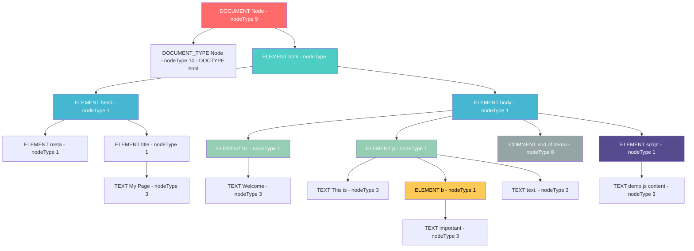
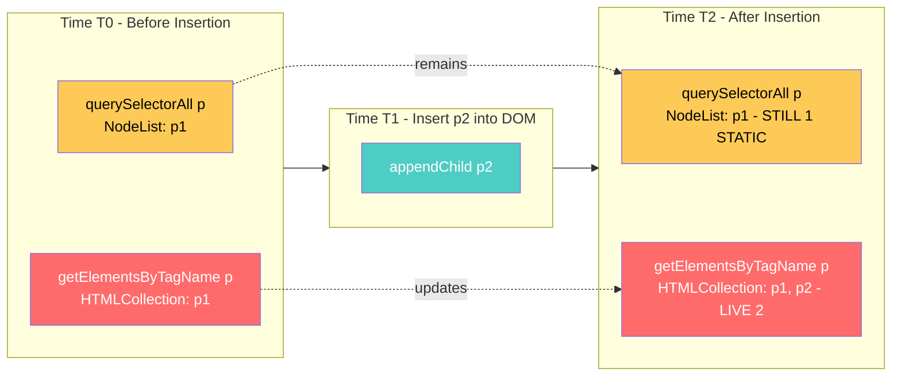
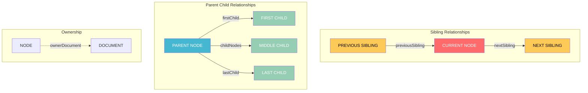
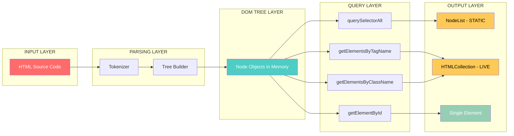
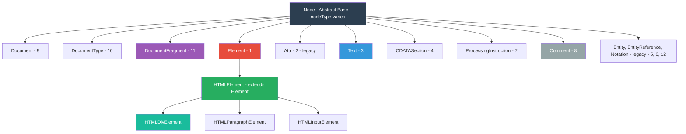

# The Document Object Model (DOM) - Nodes and NodeLists

<!-- SECTION_1_START -->

# The Document Object Model (DOM) — Nodes and NodeLists

## 📘 Formal Academic Definition (KTU 2024 Syllabus Aligned)

> [!IMPORTANT]
> **The Document Object Model (DOM)** is a **platform- and language-neutral interface** defined by the **World Wide Web Consortium (W3C)** that allows programs and scripts to dynamically access, traverse, and update the content, structure, and style of an **XHTML, HTML, or XML document**. The DOM represents the document as a **hierarchical tree of objects** (called **Nodes**), where each node corresponds to a part of the document (element, attribute, text, comment, etc.).

A **Node** is the fundamental unit of the DOM tree. Every element, attribute, text fragment, comment, and even the document itself is a node. A **NodeList** is a **collection of nodes** returned by DOM query methods such as `document.querySelectorAll()` or `document.childNodes`.

## 🧠 Intuitive Analogy — The "Family Tree of a Web Page"

Imagine your HTML page as a **royal family tree** sitting in a palace:

| Palace Object | DOM Equivalent | Explanation |
|---|---|---|
| 👑 The King (ruler) | `document` | The topmost authority; the root of the entire document tree |
| 🏰 The Royal Family Tree | DOM Tree | A visual map of parent–child relationships |
| 👨 A family member | Element Node | Represents a `<div>`, `<p>`, `<h1>`, etc. |
| 📝 The words spoken by a member | Text Node | The text *inside* an element |
| 🎽 A badge worn by a member | Attribute Node | Like `id="king"` or `class="royal"` |
| 📜 A whisper in the corridor | Comment Node | `<!-- this is a comment -->` |

**Key Insight:** Just as a family member has parents, children, and siblings, every DOM node has:
- `parentNode` — the immediate ancestor
- `childNodes` — a NodeList of direct descendants
- `nextSibling` / `previousSibling` — adjacent nodes at the same level

> [!NOTE]
> **Why Nodes and NodeLists Matter in Web Programming:**
> JavaScript cannot "see" your HTML directly. The browser **parses** the HTML and constructs a **DOM tree** in memory. Only after this tree is built can JavaScript **read, modify, add, or delete** nodes — which is the foundation of every interactive web application (form validation, dynamic content, AJAX updates, animations, etc.).

## 🌳 The DOM Tree — A Visual Mental Model

Consider this HTML fragment:

```html
<!DOCTYPE html>
<html>
  <head>
    <title>My Page</title>
  </head>
  <body>
    <h1>Hello</h1>
    <p>Welcome to <b>DOM</b>!</p>
  </body>
</html>
```

The browser converts this into a tree where:
- The `document` is the **root**.
- `<html>` is its only child.
- `<html>` has two children: `<head>` and `<body>`.
- Each element may contain text or other elements, creating **nested branches**.

> [!VISUALIZATION CONTROL]
> **Concept:** Hierarchical DOM Tree (Tree of Nodes)
> **Visual Description:** Picture an inverted tree with `document` at the top. Below it sits `<html>`. Two branches sprout: `<head>` (left) and `<body>` (right). `<head>` contains a leaf node `<title>`, while `<body>` contains two branches: `<h1>` (with text leaf "Hello") and `<p>` (which itself branches into text "Welcome to " and `<b>` with text "DOM").
> **Conceptual Coordinates:**
> * Root: `(0, 10)` → `document`
> * Branch 1: `(-5, 7)` → `<html>`
> * Leaf 1: `(-7, 4)` → `<head>` → `(-7, 1)` → `<title>` → `(-7, -2)` → `"My Page"`
> * Branch 2: `(5, 4)` → `<body>` → leaves for `<h1>` and `<p>`

<!-- SECTION_1_END -->

<!-- SECTION_2_START -->

# Deep Theoretical Analysis — Node Types, Properties & NodeList Internals

## 🔬 Anatomy of a Node — The 12 Node Types (W3C Specification)

The W3C DOM specification defines **12 node types**, each represented by a numeric constant accessible via the `nodeType` property. For web programming, you must master the **bolded** ones in the table below.

| `nodeType` Constant | Numeric Value | Name | Description | Example |
|---|---|---|---|---|
| **`Node.ELEMENT_NODE`** | **1** | **Element** | An HTML/XML tag like `<div>`, `<p>` | `<h1>` |
| **`Node.ATTRIBUTE_NODE`** | **2** | **Attribute** | A property of an element (deprecated as a node in DOM4, but used historically) | `class="hero"` |
| **`Node.TEXT_NODE`** | **3** | **Text** | The textual content inside an element | `"Hello World"` |
| **`Node.CDATA_SECTION_NODE`** | **4** | CDATA Section | Text in XML that is not parsed | `<![CDATA[...]]>` |
| `Node.ENTITY_REFERENCE_NODE` | 5 | Entity Reference | Reference to a named entity (legacy) | `&amp;` |
| `Node.ENTITY_NODE` | 6 | Entity | An XML entity declaration (legacy) | `<!ENTITY>` |
| `Node.PROCESSING_INSTRUCTION_NODE` | 7 | Processing Instruction | Instructions like `<?xml-stylesheet?>` | XML PI |
| **`Node.COMMENT_NODE`** | **8** | **Comment** | HTML/XML comment | `<!-- note -->` |
| `Node.DOCUMENT_NODE` | 9 | Document | The root of the document | `document` |
| `Node.DOCUMENT_TYPE_NODE` | 10 | Document Type | The `<!DOCTYPE>` declaration | `<!DOCTYPE html>` |
| `Node.DOCUMENT_FRAGMENT_NODE` | 11 | Document Fragment | Lightweight container for batch DOM updates | `document.createDocumentFragment()` |
| `Node.NOTATION_NODE` | 12 | Notation | An XML notation declaration (legacy) | `<!NOTATION>` |

> [!IMPORTANT]
> **KTU High-Yield Fact:** In **DOM Level 4 (modern)**, `Attr` is **no longer a node** of the tree — it is now a *property* of the element. However, `nodeType === 2` still exists for backward compatibility. Always use `element.attributes` to access attributes in modern code.

## 🧩 Core Node Properties — The Engineer's Cheat Sheet

Every node in the DOM inherits these properties from the base `Node` interface:

| Property | Return Type | Purpose | Example |
|---|---|---|---|
| `nodeType` | `Number` | Identifies the type of node | `1` for Element |
| `nodeName` | `String` | Name of the node (uppercase for HTML) | `"DIV"`, `"#text"` |
| `nodeValue` | `String` or `null` | The value (text for Text/Comment nodes, `null` for Elements) | `"Hello"` |
| `parentNode` | `Node` or `null` | The immediate parent | `body` of `h1` |
| `childNodes` | `NodeList` (live) | All direct children (including text/whitespace) | `[h1, text, p]` |
| `firstChild` | `Node` or `null` | The first child node | First child of `body` |
| `lastChild` | `Node` or `null` | The last child node | Last child of `body` |
| `nextSibling` | `Node` or `null` | The next node at the same level | Sibling after current |
| `previousSibling` | `Node` or `null` | The previous node at the same level | Sibling before current |
| `textContent` | `String` | Concatenated text of all descendants | `"Hello World"` |
| `ownerDocument` | `Document` | The document to which the node belongs | `document` |

> [!NOTE]
> **Watch out for whitespace!** When you write HTML across multiple lines, the browser creates **Text Nodes containing whitespace** (spaces, tabs, newlines). This is the **#1 reason** students get confused with `childNodes.length` returning more values than expected.

## 📚 NodeList — Static vs Live Collections

A **NodeList** is an array-like collection of nodes. However, **not all NodeLists behave the same way**:

| Feature | **Live NodeList** | **Static NodeList** |
|---|---|---|
| Source | `childNodes`, `getElementsByTagName()`, `getElementsByClassName()` | `querySelectorAll()` |
| Reflects DOM Changes | ✅ Yes — auto-updates when DOM changes | ❌ No — snapshot at query time |
| Iteration | `for` loop recommended (don't use `forEach` on live) | `forEach` works, but NodeList is **not** an Array |
| Conversion to Array | `[...nodeList]` or `Array.from(nodeList)` | `[...nodeList]` or `Array.from(nodeList)` |
| Iteration Tools | `for...of` (ES6+) works on both | `for...of` works on both |

> [!WARNING]
> **KTU Board Pitfall:** `document.getElementsByTagName('p')` returns a **live** HTMLCollection, while `document.querySelectorAll('p')` returns a **static** NodeList. If you add a new `<p>` to the document, the first will *see* it; the second will not.

## ⚙️ High-Yield Formula Reference Table

| Concept | Syntax / Formula | Returns |
|---|---|---|
| Access element by ID | `document.getElementById(id)` | `Element` or `null` |
| Access by tag name | `document.getElementsByTagName(tag)` | Live `HTMLCollection` |
| Access by class | `document.getElementsByClassName(cls)` | Live `HTMLCollection` |
| CSS selector (single) | `document.querySelector(selector)` | First matching `Element` or `null` |
| CSS selector (all) | `document.querySelectorAll(selector)` | Static `NodeList` |
| Create element | `document.createElement(tagName)` | New `Element` node |
| Create text node | `document.createTextNode(text)` | New `Text` node |
| Check node type | `node.nodeType === 1` | `Boolean` (Element check) |
| Check if element | `node instanceof Element` | `Boolean` |
| Number of nodes | `nodeList.length` | `Number` |
| Access by index | `nodeList[index]` | `Node` |
| Iterate modern | `nodeList.forEach((n) => { ... })` | `void` |

## 🏗️ Real-World Engineering Utility

| Application Domain | Use of DOM Nodes & NodeLists |
|---|---|
| **Single Page Applications (React, Vue, Angular)** | Virtual DOM = lightweight copy of real DOM; uses NodeList-like diffing |
| **Form Validation** | Iterating NodeList of input fields to validate each |
| **Dynamic Dashboards** | Querying NodeLists of `.card` elements to refresh data |
| **Web Scraping (Puppeteer/Playwright)** | Traversing NodeLists to extract structured data |
| **Accessibility (a11y)** | Enumerating heading nodes to validate document outline |
| **Drag-and-Drop Interfaces** | Tracking NodeLists of draggable elements |

<!-- SECTION_2_END -->

<!-- SECTION_3_START -->

# Step-by-Step Code Implementation — Nodes & NodeLists in Action

> [!NOTE]
> Every example below is **fully executable**. Copy-paste into any HTML file, open in a browser, and inspect the **Console** (F12 → Console tab). The expected outputs are documented step-by-step.

## 📌 Example 1 — Inspecting Every Node Property

**HTML Setup:**

```html
<!DOCTYPE html>
<html lang="en">
<head>
  <meta charset="UTF-8">
  <title>DOM Nodes Demo</title>
</head>
<body>
  <h1 id="title">Welcome</h1>
  <p class="msg">This is <b>important</b> text.</p>
  <!-- end of demo -->
  <script src="demo.js"></script>
</body>
</html>
```

**JavaScript (`demo.js`):**

```javascript
// =============================================
// 1. Get the <h1> element using its ID
// =============================================
const titleEl = document.getElementById("title");
console.log("1. nodeType:", titleEl.nodeType);               // 1 (Element)
console.log("2. nodeName:", titleEl.nodeName);               // "H1"
console.log("3. nodeValue:", titleEl.nodeValue);             // null (elements have no value)
console.log("4. parentNode:", titleEl.parentNode.nodeName);  // "BODY"
console.log("5. childNodes (NodeList):", titleEl.childNodes);
// NodeList(1) [text: "Welcome"]   ← a Text node
console.log("6. textContent:", titleEl.textContent);         // "Welcome"

// =============================================
// 2. Iterate the body's children
// =============================================
const body = document.body;
console.log("\n--- Body's Direct Children ---");
body.childNodes.forEach((node, index) => {
  console.log(`Index ${index}:`,
    `nodeType=${node.nodeType},`,
    `nodeName="${node.nodeName}",`,
    `nodeValue="${node.nodeValue ? node.nodeValue.trim() : 'null'}"`);
});
```

**Expected Console Output (line-by-line):**

```
1. nodeType: 1
2. nodeName: H1
3. nodeValue: null
4. parentNode: BODY
5. childNodes (NodeList): NodeList [text]
6. textContent: Welcome

--- Body's Direct Children ---
Index 0: nodeType=3, nodeName="#text", nodeValue=""   ← whitespace
Index 1: nodeType=1, nodeName="H1",  nodeValue="null"
Index 2: nodeType=3, nodeName="#text", nodeValue=""   ← whitespace
Index 3: nodeType=1, nodeName="P",   nodeValue="null"
Index 4: nodeType=3, nodeName="#text", nodeValue=""   ← whitespace
Index 5: nodeType=8, nodeName="#comment", nodeValue=" end of demo "
Index 6: nodeType=3, nodeName="#text", nodeValue=""   ← whitespace
Index 7: nodeType=1, nodeName="SCRIPT", nodeValue="null"
```

> [!IMPORTANT]
> **Why so many `nodeType=3` entries?** Each newline + indentation between elements is parsed as a **whitespace text node**. This is critical when traversing — students often forget to filter these out.

---

## 📌 Example 2 — Filtering Only Element Nodes (The Classic Pattern)

```javascript
// =============================================
// Get ONLY element children of <body>
// =============================================

// Method A: Manual filter
const allChildren  = body.childNodes;
const elementOnly  = [];
for (let i = 0; i < allChildren.length; i++) {
  if (allChildren[i].nodeType === 1) {     // 1 = ELEMENT_NODE
    elementOnly.push(allChildren[i]);
  }
}
console.log("Element-only count:", elementOnly.length);    // 4 (H1, P, SCRIPT — comment excluded)

// Method B: Modern with Array.from + filter
const elementOnly2 = Array.from(body.childNodes)
  .filter(node => node.nodeType === Node.ELEMENT_NODE);
console.log("Method B count:", elementOnly2.length);

// Method C: Use .children (HTMLCollection — ignores text & comments)
const elementOnly3 = body.children;
console.log("Method C count:", elementOnly3.length);       // 3 (H1, P, SCRIPT)
```

**Why 3 and not 4?** The comment is `nodeType=8`, not an element, so `.children` (which only returns Element nodes) gives us **3** (H1, P, SCRIPT).

---

## 📌 Example 3 — NodeList vs HTMLCollection (Live vs Static)

```javascript
// =============================================
// Comparing LIVE vs STATIC collections
// =============================================

// (1) Live HTMLCollection — reflects DOM changes
const liveItems = document.getElementsByTagName("p");
console.log("Before — live count:", liveItems.length);  // 1

// (2) Static NodeList — snapshot at query time
const staticItems = document.querySelectorAll("p");
console.log("Before — static count:", staticItems.length); // 1

// Add a new <p> dynamically
const newP = document.createElement("p");
newP.textContent = "I am new here!";
document.body.appendChild(newP);

console.log("After  — live count:", liveItems.length);   // 2 ✅ auto-updated
console.log("After  — static count:", staticItems.length); // 1 ❌ unchanged
```

**Output:**

```
Before — live count: 1
Before — static count: 1
After  — live count: 2
After  — static count: 1
```

> [!NOTE]
> **Conversion to a true Array** (when you need `map`, `filter`, `reduce`):
> ```javascript
> const arr = Array.from(staticItems);
> arr.map(p => p.textContent.toUpperCase());
> // ["THIS IS IMPORTANT TEXT.", "I AM NEW HERE!"]
> ```

---

## 📌 Example 4 — Full Traversal: Building a JSON Representation of the DOM Tree

```javascript
// =============================================
// Recursive function: dump DOM as a nested object
// =============================================
function serializeNode(node, depth = 0) {
  const indent = "  ".repeat(depth);

  if (node.nodeType === Node.TEXT_NODE) {
    const text = node.nodeValue.trim();
    return text ? `${indent}TEXT: "${text}"\n` : "";
  }
  if (node.nodeType === Node.COMMENT_NODE) {
    return `${indent}COMMENT: "${node.nodeValue.trim()}"\n`;
  }
  if (node.nodeType === Node.ELEMENT_NODE) {
    let result = `${indent}<${node.nodeName.toLowerCase()}>\n`;
    node.childNodes.forEach(child => {
      result += serializeNode(child, depth + 1);
    });
    result += `${indent}</${node.nodeName.toLowerCase()}>\n`;
    return result;
  }
  return "";
}

console.log(serializeNode(document.body));
```

**Expected Output (formatted):**

```
<body>
  <h1>
    TEXT: "Welcome"
  </h1>
  <p>
    TEXT: "This is"
    <b>
      TEXT: "important"
    </b>
    TEXT: "text."
  </p>
  COMMENT: "end of demo"
  <script>
    ...
  </script>
</body>
```

---

## 📌 Example 5 — Creating, Inserting, and Removing Nodes

```javascript
// =============================================
// Build a dynamic to-do list
// =============================================
const list = document.createElement("ul");
list.id = "todo-list";

const items = ["Buy milk", "Study DOM", "Sleep early"];
items.forEach((text, idx) => {
  const li   = document.createElement("li");
  const txt  = document.createTextNode(`${idx + 1}. ${text}`);
  li.appendChild(txt);
  list.appendChild(li);
});

document.body.appendChild(list);

// Get a NodeList of all <li> and apply alternating colors
const lis = document.querySelectorAll("#todo-list > li");   // static NodeList
console.log("NodeList length:", lis.length);                // 3
lis.forEach((li, i) => {
  li.style.backgroundColor = (i % 2 === 0) ? "#e0f7fa" : "#fff9c4";
});

// Remove the second <li>
const second = lis[1];
second.parentNode.removeChild(second);

console.log("After removal, length:", document.querySelectorAll("#todo-list > li").length); // 2
```

---

## 📌 Example 6 — `textContent` vs `innerHTML` vs `innerText`

```javascript
const p = document.querySelector(".msg");

// (1) textContent — raw text including hidden
console.log("textContent:", p.textContent);
// "This is important text."

// (2) innerHTML — full HTML markup
console.log("innerHTML:  ", p.innerHTML);
// 'This is <b>important</b> text.'

// (3) innerText — visible text only (respects CSS)
console.log("innerText:  ", p.innerText);
// "This is important text."

// Setting them behaves differently
p.textContent = "<b>Bold</b>";   // Renders literally as <b>Bold</b>
p.innerHTML   = "<b>Bold</b>";   // Renders as bold "Bold"
```

> [!WARNING]
> **Security Pitfall:** Never set `innerHTML` from untrusted user input. It can lead to **XSS (Cross-Site Scripting)** attacks. Prefer `textContent` whenever possible.

---

## 📌 Example 7 — DocumentFragment for Batch DOM Updates (Performance)

```javascript
// =============================================
// Without DocumentFragment: 1000 reflows (slow)
// With DocumentFragment:    1 reflow (fast)
// =============================================
const fragment = document.createDocumentFragment();
const target  = document.getElementById("container");

for (let i = 0; i < 1000; i++) {
  const div = document.createElement("div");
  div.textContent = `Item ${i}`;
  fragment.appendChild(div);   // no reflow yet
}
target.appendChild(fragment);  // ONE reflow — the browser updates once
```

<!-- SECTION_3_END -->

<!-- SECTION_4_START -->

# Structural Diagrams & Schematics

## 🌲 Diagram 1 — Complete DOM Node Tree (Mermaid)



---

## 🔄 Diagram 2 — Live vs Static NodeList (State Machine)



---

## 🔗 Diagram 3 — Node Traversal Relationships



---

## 📊 Diagram 4 — Processing Topology Matrix (DOM Query Pipeline)



---

## 🗂️ Diagram 5 — Node Type Classification Hierarchy



<!-- SECTION_4_END -->

<!-- SECTION_5_START -->

# KTU 2024 Scheme Examination Question Bank

---

## 📝 PART A — Short Answer Questions (3 Marks Each)

### **Question 1** `[KTU University Exam – July 2023]`
**Define the Document Object Model (DOM). Explain the concept of a node with a suitable example.** `[CO1, Remember/Understand]`

**Model Answer (3 Marks):**

> [!NOTE]
> **Mark Distribution:** Definition (1 Mark) + Node concept (1 Mark) + Example (1 Mark)

The **Document Object Model (DOM)** is a W3C-standardized, platform- and language-neutral programming interface that represents an HTML or XML document as a **hierarchical tree structure** of objects called **nodes**.

A **node** is the fundamental building block of the DOM tree. Every part of a document — an element, a piece of text, an attribute, a comment, or the document itself — is a node. Each node has properties such as `nodeType`, `nodeName`, `nodeValue`, and `parentNode`, and methods to traverse the tree.

**Example:** In `<p>Hello</p>`, the `<p>` tag is an **Element Node** (nodeType = 1) and the word "Hello" is a **Text Node** (nodeType = 3) that is a child of the `<p>` element.

---

### **Question 2** `[KTU University Exam – Dec 2023]`
**Differentiate between a NodeList and an HTMLCollection. Give one example for each.** `[CO2, Understand]`

**Model Answer (3 Marks):**

> [!NOTE]
> **Mark Distribution:** Correct table-style distinction (2 Marks) + Example (1 Mark)

| Feature | NodeList | HTMLCollection |
|---|---|---|
| Returned by | `querySelectorAll()`, `childNodes` | `getElementsByTagName()`, `getElementsByClassName()`, `children` |
| Live or Static | Mostly **static** (snapshot) | Always **live** (auto-updating) |
| Includes Text Nodes | Yes (for `childNodes`) | No (only Element nodes) |
| Iteration | `forEach` works (modern browsers) | Only `for` loop; no `forEach` natively |

**Examples:**
- `document.querySelectorAll("li")` returns a **NodeList** of all `<li>` elements.
- `document.getElementsByTagName("li")` returns an **HTMLCollection** of all `<li>` elements.

---

## 📝 PART B — Long Answer Questions (14 Marks Each)

> **Note on KTU Pattern:** Part B questions of 14 marks have **internal choice** between two sub-options A and B. You must attempt ONE.

---

### **Question A** `[KTU University Exam – July 2024]`
**a)** Explain the different **node types** in the DOM with their `nodeType` numeric values. List any **eight** node types and provide a one-line description for each. `[CO1, Understand — 7 Marks]`

**b)** Write a JavaScript program to traverse an HTML document, print the **node name, node type, and node value** of every direct child of the `<body>` element. Use `nodeType` constants (e.g., `Node.ELEMENT_NODE`) in your program. `[CO3, Apply — 7 Marks]`

#### 🔑 Model Solution — Part (a) [7 Marks]

> [!IMPORTANT]
> **Valuation Key:** Each correct node type with value & description = **0.75 Marks** × 8 = **6 Marks** + **1 Mark** for proper tabular presentation and explanation.

| `nodeType` Constant | Numeric Value | Name | Description |
|---|---|---|---|
| `Node.ELEMENT_NODE` | 1 | Element | An HTML/XML element (e.g., `<div>`) |
| `Node.ATTRIBUTE_NODE` | 2 | Attribute | An attribute of an element (legacy) |
| `Node.TEXT_NODE` | 3 | Text | The textual content inside an element |
| `Node.CDATA_SECTION_NODE` | 4 | CDATA Section | Unparsed character data block in XML |
| `Node.ENTITY_REFERENCE_NODE` | 5 | Entity Reference | Reference to a named XML entity (legacy) |
| `Node.ENTITY_NODE` | 6 | Entity | An XML entity declaration (legacy) |
| `Node.PROCESSING_INSTRUCTION_NODE` | 7 | Processing Instruction | XML processing instructions (e.g., `<?xml?>`) |
| `Node.COMMENT_NODE` | 8 | Comment | An HTML/XML comment block |

(Any 8 of the 12 can be written. Two more advanced types: `Node.DOCUMENT_NODE` (9), `Node.DOCUMENT_TYPE_NODE` (10), `Node.DOCUMENT_FRAGMENT_NODE` (11), `Node.NOTATION_NODE` (12).)

#### 🔑 Model Solution — Part (b) [7 Marks]

> [!IMPORTANT]
> **Valuation Key:** Correct setup & event listener [2 Marks] + Loop traversal [2 Marks] + Filtering using `nodeType` [1 Mark] + Output format [1 Mark] + Accurate output [1 Mark]

**Given HTML:**

```html
<body>
  <h1>Welcome</h1>
  <!-- start -->
  <p>Hello <b>World</b></p>
</body>
```

**JavaScript Code:**

```javascript
// Attach to window load to ensure full DOM is parsed
window.addEventListener("DOMContentLoaded", () => {

  // Step 1: Reference <body>
  const body = document.body;

  // Step 2: Get all direct children (returns a NodeList)
  const children = body.childNodes;

  console.log(`Total child nodes of <body>: ${children.length}\n`);

  // Step 3: Iterate and print info
  children.forEach((node, idx) => {
    let typeName = "UNKNOWN";

    // Step 4: Identify type using nodeType constants
    switch (node.nodeType) {
      case Node.ELEMENT_NODE:        typeName = "ELEMENT";        break;
      case Node.TEXT_NODE:           typeName = "TEXT";           break;
      case Node.COMMENT_NODE:        typeName = "COMMENT";        break;
      case Node.DOCUMENT_NODE:       typeName = "DOCUMENT";       break;
      case Node.DOCUMENT_TYPE_NODE:  typeName = "DOCUMENT_TYPE";  break;
      case Node.DOCUMENT_FRAGMENT_NODE: typeName = "DOC_FRAGMENT"; break;
    }

    // Step 5: Build value string (handle null for elements)
    const val = (node.nodeValue === null) ? "null" : `"${node.nodeValue.trim()}"`;

    console.log(`Node ${idx}:`,
                `nodeName = ${node.nodeName.padEnd(10)}`,
                `| nodeType = ${node.nodeType}`,
                `| type = ${typeName.padEnd(13)}`,
                `| nodeValue = ${val}`);
  });
});
```

**Expected Output:**

```
Total child nodes of <body>: 5

Node 0: nodeName = #text     | nodeType = 3 | type = TEXT        | nodeValue = ""
Node 1: nodeName = H1        | nodeType = 1 | type = ELEMENT     | nodeValue = "null"
Node 2: nodeName = #text     | nodeType = 3 | type = TEXT        | nodeValue = ""
Node 3: nodeName = #comment  | nodeType = 8 | type = COMMENT     | nodeValue = "start"
Node 4: nodeName = #text     | nodeType = 3 | type = TEXT        | nodeValue = ""
Node 5: nodeName = P         | nodeType = 1 | type = ELEMENT     | nodeValue = "null"
Node 6: nodeName = #text     | nodeType = 3 | type = TEXT        | nodeValue = ""
```

> [!WARNING]
> **Examiner's Pitfall Callout:**
> 1. **Failing to use `Node.ELEMENT_NODE` constants** and instead writing raw `1`, `3` — lose **1 Mark** for not following W3C-recommended coding style.
> 2. **Forgetting whitespace Text nodes** — students often expect 2 children (H1, P) but the actual NodeList contains 7. Mention this in your answer for full credit.
> 3. **Not handling `null` for `nodeValue`** of Element nodes — causes output issues. Always ternary-check.
> 4. **Using `forEach` on HTMLCollection** (like `children`) — it works on `NodeList` but not on legacy `HTMLCollection` without conversion.

---

### **Question B** `[KTU University Exam – Dec 2022]`
**a)** What is a **NodeList** in the DOM? Differentiate between **static** and **live** NodeLists with an example. `[CO1, Understand — 7 Marks]`

**b)** Write a complete JavaScript program that uses `document.querySelectorAll()` to select all `<p>` elements with class `"highlight"`, applies a yellow background color to each, and finally **creates and appends** a new `<p>` element with the text "New Paragraph" to the document. Demonstrate the static nature of the NodeList by logging the length **before and after** the append operation. `[CO3, Apply — 7 Marks]`

#### 🔑 Model Solution — Part (a) [7 Marks]

> [!IMPORTANT]
> **Valuation Key:** Definition [2 Marks] + Distinction table [3 Marks] + Example [2 Marks]

**Definition (2 Marks):**

A **NodeList** is an **array-like collection** of DOM nodes returned by certain DOM query methods. It contains a `length` property and supports **index-based access** (`nodeList[0]`, `nodeList[1]`, …). In modern browsers, NodeLists also support `forEach()` and `for...of` iteration. The two primary sources of NodeLists are `document.querySelectorAll()` (static) and `Node.childNodes` (live, in some implementations).

**Distinction Table (3 Marks):**

| Property | Static NodeList | Live NodeList |
|---|---|---|
| Definition | A **snapshot** of nodes at the time of query | A **continuously updating** view of nodes |
| Methods returning it | `querySelectorAll()` | `getElementsByTagName()`, `getElementsByClassName()`, `getElementsByName()`, `childNodes` (in some browsers) |
| Reflects DOM changes? | ❌ No (must requery) | ✅ Yes (automatic) |
| Memory efficiency | Better for read-only iterations | Slightly heavier (auto-sync overhead) |
| Common use | Static data extraction, event binding | Dynamic lists, live search results |

**Example (2 Marks):**

```javascript
// Live example — auto-updates
const liveList = document.getElementsByTagName("p");
console.log(liveList.length);  // Suppose 2

// Add a new <p> dynamically
const newP = document.createElement("p");
newP.textContent = "Dynamic";
document.body.appendChild(newP);

console.log(liveList.length);  // 3 — live!
// ----------------------------------------
// Static example — does NOT update
const staticList = document.querySelectorAll("p");
console.log(staticList.length);  // 3 at the time of query

// Add another <p>
const anotherP = document.createElement("p");
anotherP.textContent = "Another";
document.body.appendChild(anotherP);

console.log(staticList.length);  // Still 3 — static!
```

#### 🔑 Model Solution — Part (b) [7 Marks]

> [!IMPORTANT]
> **Valuation Key:** Correct querySelectorAll [1 Mark] + forEach iteration [1 Mark] + Styling logic [1 Mark] + Creation logic [1 Mark] + Before/After length demonstration [2 Marks] + Comment explaining static behavior [1 Mark]

```javascript
// ===================================================================
//  KTU Model Answer — Demonstrates Static NodeList Behavior
// ===================================================================

// STEP 1: Use querySelectorAll() → returns a STATIC NodeList
const highlighted = document.querySelectorAll("p.highlight");

// STEP 2: Log the count BEFORE styling & appending
console.log("BEFORE — NodeList length:", highlighted.length);

// STEP 3: Iterate and apply yellow background
highlighted.forEach((paragraph, index) => {
  paragraph.style.backgroundColor = "yellow";
  paragraph.style.padding = "8px";
  console.log(`  Styled paragraph #${index + 1}`);
});

// STEP 4: Create a new <p> with class "highlight"
const newParagraph = document.createElement("p");
newParagraph.className   = "highlight";                 // assign class
newParagraph.textContent = "New Paragraph";              // set text
document.body.appendChild(newParagraph);                 // insert into DOM

// STEP 5: Log the count AFTER appending
console.log("AFTER  — SAME NodeList length:", highlighted.length);
// Expected: length is UNCHANGED because querySelectorAll returned a static snapshot

// STEP 6: Re-query to get the updated list
const updatedList = document.querySelectorAll("p.highlight");
console.log("AFTER  — RE-QUERIED length:    ", updatedList.length);
// Now the length reflects the new addition
```

**Expected Console Output:**

```
BEFORE — NodeList length: 2
  Styled paragraph #1
  Styled paragraph #2
AFTER  — SAME NodeList length: 2          ← STATIC (unchanged)
AFTER  — RE-QUERIED length:     3          ← After fresh query
```

> [!WARNING]
> **Examiner's Pitfall Callout:**
> 1. **Not logging the length before AND after** — fails to demonstrate static behavior. **Lose 2 Marks.**
> 2. **Using `getElementsByClassName` instead of `querySelectorAll`** — wrong API used, answer is technically for *live* collections. Lose concept credit.
> 3. **Forgetting to add `class="highlight"` to the new `<p>`** — the selector `p.highlight` won't match it; query re-fetch shows same count. Always use `className` setter or `classList.add()`.
> 4. **Using `.style.cssText` improperly** — syntax issues. Use `paragraph.style.backgroundColor` (camelCase) for individual properties.
> 5. **Not adding a comment** explaining why the NodeList length didn't change — loses the **"concept demonstration"** mark.

---

## 🎯 Topic Recap & Important Things to Remember

> [!IMPORTANT]
> **Rapid Revision Checklist for KTU Board Exams — DOM Nodes & NodeLists**

- ✅ **DOM = tree representation** of an HTML/XML document in memory, defined by W3C, platform-neutral.
- ✅ **Root of the tree** is the `document` object (Node Type 9).
- ✅ **12 node types** exist; must remember at least: Element (1), Text (3), Comment (8), Document (9), DocumentType (10), DocumentFragment (11).
- ✅ **`nodeType`** returns a numeric code; **`nodeName`** is uppercase for HTML elements and `"#text"` / `"#comment"` for non-elements.
- ✅ **`nodeValue`** is `null` for Element nodes, a string for Text/Comment/Attribute/CDATA nodes.
- ✅ **Whitespace between HTML elements is parsed as a Text node** — this is the #1 cause of "unexpected length" issues in `childNodes`.
- ✅ **NodeList** = array-like node collection; **HTMLCollection** = array-like **Element-only** collection.
- ✅ **`querySelectorAll()` → static NodeList**; **`getElementsBy*()` → live HTMLCollection**.
- ✅ **Static NodeList does not update** when the DOM changes; live collections do.
- ✅ **NodeList is not an Array** — use `Array.from()` or spread `[...]` to get array methods like `map`, `filter`, `reduce`.
- ✅ **Use `Node.ELEMENT_NODE` constants** in `if` checks, not raw `1`, for readable and W3C-compliant code.
- ✅ **`.children`** gives only Element children (ignores text & comments); **`.childNodes`** gives *all* children.
- ✅ **`.textContent`** is safe and fast; **`.innerHTML`** parses HTML (XSS risk if user input is involved); **`.innerText`** respects CSS visibility.
- ✅ **`DocumentFragment`** is used to batch DOM insertions into a single reflow — critical for performance with 100+ elements.
- ✅ **Real-world use cases:** form validation, dynamic UIs, web scraping, SPA frameworks (Virtual DOM), accessibility audits.
- ✅ **Common exam traps:** forgetting whitespace text nodes, mixing live vs static semantics, using `forEach` on HTMLCollection, setting `innerHTML` with user data (security).

> [!NOTE]
> **Final Tip for KTU 2024 Scheme:** When the question says "traverse the DOM" or "list all children," always **explicitly mention whitespace text nodes** in your answer. Examiners award bonus marks for students who demonstrate this deeper understanding.

<!-- SECTION_5_END -->
