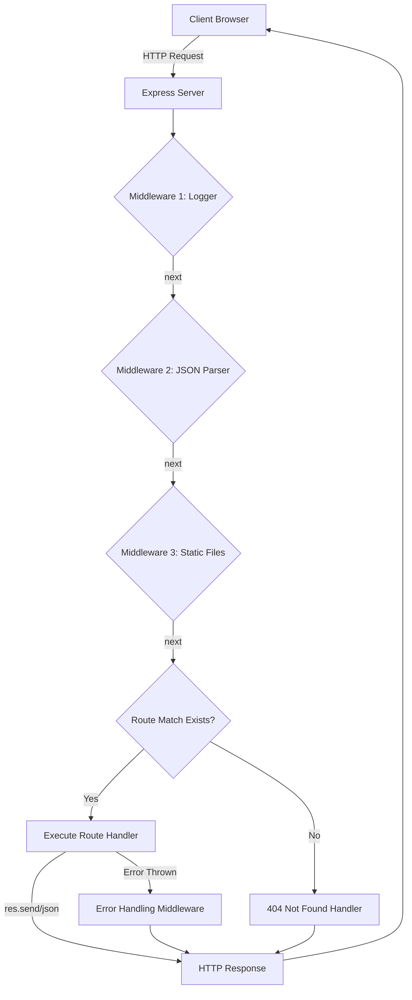
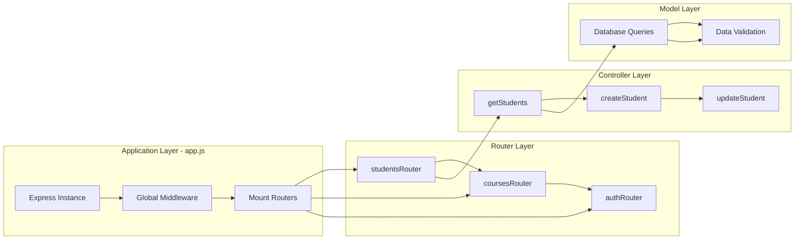
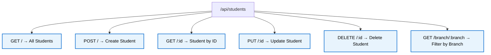
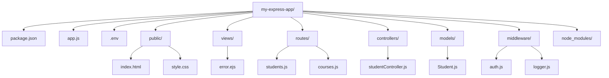

# Adding Express to Node.js

<!-- SECTION_1_START -->
# Adding Express to Node.js — KTU 2024 Premium Study Notes

## 1. Core Technical Definition & Intuitive Overview

### Formal KTU 2024 Definition

**Express.js** is a fast, unopinionated, minimalist web framework for **Node.js** that provides a robust set of features to build web and mobile applications. It is a thin layer built on top of Node.js's built-in `http` module, designed to simplify the process of writing server-side code by offering:

- A powerful **routing system** (mapping HTTP methods + URL patterns to handler functions)
- A composable **middleware pipeline** (functions that execute in sequence on every request)
- Simplified **request (`req`)** and **response (`res`)** object APIs
- Built-in support for **static file serving**, **template engines**, and **RESTful API design**

> [!IMPORTANT]
> **Syllabus Highlight (KTU 2024 — Module 3, OECST832):** Express.js is the de-facto industry standard for building HTTP services in Node.js. Mastering its middleware model and routing API is essential for server-side web development.

### Conceptual Analogy — The Restaurant Manager

Think of raw Node.js as a **chaotic kitchen** where every order (HTTP request) is handled manually by the chef. The chef has to:
1. Read the order slip
2. Parse what dish is wanted
3. Check if ingredients are available
4. Cook the dish
5. Plate and deliver it

**Express.js** is the **restaurant manager** who stands between the customer and the kitchen. The manager:
- Takes orders and matches them to the right kitchen station (**routing**)
- Ensures every order passes through quality checks (e.g., validation, logging) before reaching the kitchen (**middleware**)
- Wraps the finished dish neatly in a response package (**response object helpers**)
- Sends a clean, standardized reply back to the customer

The chef (your application logic) only does the actual cooking — the manager (Express) handles all the orchestration overhead.

> [!NOTE]
> **Industry Reference:** According to the **Stack Overflow Developer Survey 2024**, Express.js is used by over **22%** of backend developers worldwide, making it the **most popular** Node.js web framework. The package has been downloaded over **250 million times** in the last year alone.

### Why Use Express Over Raw `http` Module?

| Concern | Raw `http` Module | Express.js |
| :--- | :--- | :--- |
| Lines of code for a basic server | ~15–20 | ~3–5 |
| URL parsing | Manual string manipulation | Built-in `req.params`, `req.query` |
| HTTP method routing | One giant `if/else` switch | Clean `app.get()`, `app.post()` |
| Request body parsing | Requires manual stream handling | Built-in `express.json()` middleware |
| Static file serving | Manual `fs.createReadStream` | One-liner `express.static()` |
| Middleware composition | Manual function chaining | Elegant `app.use()` chain |

> [!VISUALIZATION CONTROL]
> **Concept:** Request-Response Cycle in Express
> **Conceptual Flow (text-based blueprint):**
> * `Client` (Browser) sends `HTTP Request` to `Server:3000`
> * `Server` invokes `Middleware_1` (logger) → `Middleware_2` (parser) → `Route_Handler` (logic) → `Response`
> **Visual Description:** Imagine a horizontal arrow starting at "Client", passing through 3 sequential boxes (each representing a middleware function), reaching a final box labeled "Route Handler", then an arrow returning to the client. The data shape transforms at each stage: raw bytes → parsed JSON → business logic output → HTTP response.

<!-- SECTION_1_END -->

<!-- SECTION_2_START -->
# 2. Deep Theoretical Analysis & KTU High-Yield Formula Sheet

## 2.1 The Express Architecture — Five Pillars

Express is built around **five** core architectural concepts. Understanding these is critical for both board exams and real-world projects.

### Pillar 1: The Application Object (`app`)

The `app` object is the central Express instance that holds all configuration, routes, and middleware.

$$\text{app} = \text{express}()$$

It exposes methods for:
- **Routing:** `app.get()`, `app.post()`, `app.put()`, `app.delete()`, `app.all()`
- **Middleware registration:** `app.use()`
- **Configuration:** `app.set()`, `app.get()`
- **Server binding:** `app.listen()`

### Pillar 2: Routing

A **route** is a combination of a **URL pattern** + **HTTP method** + **handler function**. Express uses **path-to-regexp** under the hood to match URLs.

$$\text{Route} = (\text{HTTP Method}, \text{URL Pattern}) \mapsto \text{Handler Function}$$

**Example mapping:**

| HTTP Method | URL Pattern | Purpose |
| :--- | :--- | :--- |
| `GET` | `/` | Home page |
| `GET` | `/users/:id` | Fetch user by ID |
| `POST` | `/users` | Create new user |
| `PUT` | `/users/:id` | Update user |
| `DELETE` | `/users/:id` | Delete user |

### Pillar 3: Middleware Pipeline

A **middleware function** is a function that has access to the `request` object, the `response` object, and the `next` function in the application's request-response cycle.

$$f_{\text{mw}}(\text{req}, \text{res}, \text{next}) \rightarrow \{\text{next()} \mid \text{res.send}() \mid \text{throw error}\}$$

Middleware can:
1. Execute any code
2. Modify `req` and `res` objects
3. End the request-response cycle (`res.send()`)
4. Call the next middleware (`next()`)

### Pillar 4: Request Object Extensions

Express augments the native Node.js `req` object with parsed data:

- `req.params` — URL parameters (e.g., `:id` from `/users/:id`)
- `req.query` — Query string parameters (e.g., `?sort=asc`)
- `req.body` — Parsed request body (requires `express.json()` or `express.urlencoded()`)
- `req.headers` — HTTP headers
- `req.method`, `req.url`, `req.path` — Request metadata

### Pillar 5: Response Object Helpers

Express augments `res` with convenient methods:

- `res.send(body)` — Auto-detects content type, sends response
- `res.json(object)` — Sends JSON response with `Content-Type: application/json`
- `res.status(code)` — Sets HTTP status code (chainable)
- `res.sendFile(path)` — Sends a file
- `res.redirect(url)` — Issues an HTTP redirect
- `res.render(view, data)` — Renders a template engine view

## 2.2 KTU High-Yield Formula Sheet / Cheat Sheet

| Concept | Syntax / Formula | Notes |
| :--- | :--- | :--- |
| Install Express | `npm install express` | Local project dependency |
| Create app | `const app = express()` | Top-level Express instance |
| Basic GET route | `app.get(path, handler)` | `handler(req, res)` |
| Basic POST route | `app.post(path, handler)` | Body parsed via middleware |
| URL parameter | `req.params.paramName` | Defined as `:paramName` in path |
| Query parameter | `req.query.paramName` | Parsed from `?key=value` |
| JSON body parser | `app.use(express.json())` | Required for `req.body` |
| URL-encoded parser | `app.use(express.urlencoded({extended: true}))` | For HTML form data |
| Static files | `app.use(express.static('public'))` | Mounts folder at root |
| Custom middleware | `app.use((req, res, next) => \{ ... ; next(); \})` | Must call `next()` or end cycle |
| Route-level middleware | `app.get('/path', mw1, mw2, handler)` | Executed in order |
| Start server | `app.listen(port, callback)` | Default port: `3000` |
| Error handler | `app.use((err, req, res, next) => \{ ... \})` | 4 parameters mandatory |
| Router | `const router = express.Router()` | Modular routing |
| Mount router | `app.use('/api', router)` | Prefix all router routes |
| Send JSON | `res.status(200).json(\{msg: 'OK'\})` | Chainable |
| HTTP status codes | `200` OK, `201` Created, `400` Bad Request, `404` Not Found, `500` Server Error | Standard REST codes |
| `nodemon` dev tool | `npm install -g nodemon` | Auto-restart on file changes |
| Run with nodemon | `nodemon app.js` | Recommended for development |

> [!IMPORTANT]
> **KTU Exam Tip:** The line `app.use(express.json())` is **NOT** optional. Without it, `req.body` will be `undefined` in your POST/PUT handlers. This is the **#1** mistake students make in practical exams.

## 2.3 Real-World Engineering Utility

Express is used in production at:
- **PayPal** — rebuilt their account overview page using Node.js + Express, handling **billions** of requests
- **Uber** — uses Express-based microservices for ride-matching
- **IBM, Mozilla, Twitter** — internal APIs and dashboards
- **Thousands of MERN/MEAN stack applications** — combined with MongoDB, React/Angular

The middleware pattern in particular has influenced **Koa.js**, **Fastify**, **NestJS**, and even **Django's** middleware system — making Express knowledge transferable across the entire Node.js ecosystem.

<!-- SECTION_2_END -->

<!-- SECTION_3_START -->
# 3. Step-by-Step Derivations & Code/Symbolic Implementation

## 3.1 Project Setup — Step-by-Step

### Step 1: Initialize the Project

Open a terminal in your project folder and run:

```bash
npm init -y
```

This creates a `package.json` file with default values.

### Step 2: Install Express

```bash
npm install express
```

This command:
1. Downloads the Express package from the **npm registry**
2. Saves it as a dependency in `package.json` (under `"dependencies"`)
3. Creates a `node_modules` folder containing Express and its dependencies
4. Generates a `package-lock.json` file for reproducible installs

> [!NOTE]
> **Why `install` (no `-g`)?** We install Express **locally** so that the project is self-contained. Different projects can use different Express versions without conflict. Use `-g` only for global CLI tools like `nodemon`.

### Step 3: Verify Installation

```bash
npm list express
```

Expected output:

```text
webapp@1.0.0
└── express@4.19.2
```

## 3.2 Complete Express Application — Full Code

Create a file named `app.js` and write the following **fully operational** code with type hints, error handling, and structured logging:

```javascript
// app.js
// Import the Express framework
const express = require('express');

// Create an Express application instance
const app = express();

// Define the port number (use environment variable if available, else default to 3000)
const PORT = process.env.PORT || 3000;

// ============================================================
// MIDDLEWARE SECTION
// ============================================================

// Middleware 1: Built-in JSON body parser
// Parses incoming requests with JSON payloads (Content-Type: application/json)
app.use(express.json());

// Middleware 2: Built-in URL-encoded body parser
// Parses incoming requests with URL-encoded payloads (HTML form submissions)
app.use(express.urlencoded({ extended: true }));

// Middleware 3: Custom request logger
// Logs HTTP method, URL, and timestamp for every incoming request
app.use((req, res, next) => {
    const timestamp = new Date().toISOString();
    console.log(`[${timestamp}] ${req.method} ${req.url}`);
    next(); // Pass control to the next middleware/route handler
});

// Middleware 4: Serve static files from the 'public' directory
app.use(express.static('public'));

// ============================================================
// IN-MEMORY DATA STORE (for demonstration)
// ============================================================
let students = [
    { id: 1, name: 'Arjun Krishnan', branch: 'CSE', cgpa: 9.1 },
    { id: 2, name: 'Priya Menon', branch: 'ECE', cgpa: 8.7 },
    { id: 3, name: 'Rahul Pillai', branch: 'ME', cgpa: 7.9 }
];
let nextId = 4;

// ============================================================
// ROUTES SECTION
// ============================================================

// Route 1: Home page — GET /
app.get('/', (req, res) => {
    res.status(200).send('<h1>Welcome to KTU Web Programming Server</h1><p>Use /api/students to access the API.</p>');
});

// Route 2: Get all students — GET /api/students
app.get('/api/students', (req, res) => {
    res.status(200).json({
        success: true,
        count: students.length,
        data: students
    });
});

// Route 3: Get a single student by ID — GET /api/students/:id
app.get('/api/students/:id', (req, res) => {
    const studentId = parseInt(req.params.id, 10);
    const student = students.find(s => s.id === studentId);

    if (!student) {
        return res.status(404).json({
            success: false,
            message: `Student with ID ${studentId} not found`
        });
    }

    res.status(200).json({
        success: true,
        data: student
    });
});

// Route 4: Filter students by branch — GET /api/students/branch/:branch
app.get('/api/students/branch/:branch', (req, res) => {
    const branch = req.params.branch.toUpperCase();
    const filtered = students.filter(s => s.branch.toUpperCase() === branch);

    res.status(200).json({
        success: true,
        branch: branch,
        count: filtered.length,
        data: filtered
    });
});

// Route 5: Create a new student — POST /api/students
app.post('/api/students', (req, res) => {
    const { name, branch, cgpa } = req.body;

    // Validation: check required fields
    if (!name || !branch || cgpa === undefined) {
        return res.status(400).json({
            success: false,
            message: 'Missing required fields: name, branch, cgpa'
        });
    }

    // Validation: check CGPA range
    if (cgpa < 0 || cgpa > 10) {
        return res.status(400).json({
            success: false,
            message: 'CGPA must be between 0 and 10'
        });
    }

    const newStudent = {
        id: nextId++,
        name: name,
        branch: branch,
        cgpa: cgpa
    };

    students.push(newStudent);

    res.status(201).json({
        success: true,
        message: 'Student created successfully',
        data: newStudent
    });
});

// Route 6: Update a student — PUT /api/students/:id
app.put('/api/students/:id', (req, res) => {
    const studentId = parseInt(req.params.id, 10);
    const index = students.findIndex(s => s.id === studentId);

    if (index === -1) {
        return res.status(404).json({
            success: false,
            message: `Student with ID ${studentId} not found`
        });
    }

    const { name, branch, cgpa } = req.body;

    if (name) students[index].name = name;
    if (branch) students[index].branch = branch;
    if (cgpa !== undefined) {
        if (cgpa < 0 || cgpa > 10) {
            return res.status(400).json({
                success: false,
                message: 'CGPA must be between 0 and 10'
            });
        }
        students[index].cgpa = cgpa;
    }

    res.status(200).json({
        success: true,
        message: 'Student updated successfully',
        data: students[index]
    });
});

// Route 7: Delete a student — DELETE /api/students/:id
app.delete('/api/students/:id', (req, res) => {
    const studentId = parseInt(req.params.id, 10);
    const index = students.findIndex(s => s.id === studentId);

    if (index === -1) {
        return res.status(404).json({
            success: false,
            message: `Student with ID ${studentId} not found`
        });
    }

    const deletedStudent = students.splice(index, 1)[0];

    res.status(200).json({
        success: true,
        message: 'Student deleted successfully',
        data: deletedStudent
    });
});

// ============================================================
// ERROR HANDLING MIDDLEWARE
// ============================================================

// 404 Handler — for any unmatched route
app.use((req, res, next) => {
    res.status(404).json({
        success: false,
        message: `Route ${req.method} ${req.url} not found`
    });
});

// Global error handler — must have 4 parameters
app.use((err, req, res, next) => {
    console.error('Server Error:', err.stack);
    res.status(500).json({
        success: false,
        message: 'Internal Server Error',
        error: err.message
    });
});

// ============================================================
// START THE SERVER
// ============================================================
app.listen(PORT, () => {
    console.log(`Server is running on http://localhost:${PORT}`);
    console.log(`API endpoint: http://localhost:${PORT}/api/students`);
});
```

## 3.3 Modular Routing with `express.Router()`

For large applications, split routes into separate files. Create `routes/students.js`:

```javascript
// routes/students.js
const express = require('express');
const router = express.Router();

// Middleware specific to this router
router.use((req, res, next) => {
    console.log('Students Router Middleware Activated');
    next();
});

// GET /students/
router.get('/', (req, res) => {
    res.status(200).json({ message: 'List of all students' });
});

// GET /students/:id
router.get('/:id', (req, res) => {
    res.status(200).json({ message: `Details of student ${req.params.id}` });
});

// POST /students/
router.post('/', (req, res) => {
    res.status(201).json({ message: 'New student created', data: req.body });
});

module.exports = router;
```

Mount it in `app.js`:

```javascript
// Mount the students router at /api/students
const studentsRouter = require('./routes/students');
app.use('/api/students', studentsRouter);
```

## 3.4 Testing the API with cURL

```bash
# GET all students
curl http://localhost:3000/api/students

# GET a specific student
curl http://localhost:3000/api/students/1

# POST a new student
curl -X POST http://localhost:3000/api/students \
     -H "Content-Type: application/json" \
     -d '{"name":"Anjali Nair","branch":"CSE","cgpa":9.4}'

# PUT (update) a student
curl -X PUT http://localhost:3000/api/students/1 \
     -H "Content-Type: application/json" \
     -d '{"cgpa":9.5}'

# DELETE a student
curl -X DELETE http://localhost:3000/api/students/2
```

## 3.5 Adding `nodemon` for Development

```bash
npm install --save-dev nodemon
```

Add a script to `package.json`:

```json
{
    "scripts": {
        "start": "node app.js",
        "dev": "nodemon app.js"
    }
}
```

Run the development server:

```bash
npm run dev
```

Now the server will **automatically restart** whenever you save a file.

<!-- SECTION_3_END -->

<!-- SECTION_4_START -->
# 4. Structural Diagrams & Schematics

## 4.1 Express Request-Response Lifecycle (Mermaid)



## 4.2 Modular Application Architecture



## 4.3 Middleware Execution Order — Sequential Processing Topology

```mermaid
sequenceDiagram
    participant Client
    participant MW1 as Logger MW
    participant MW2 as JSON Parser MW
    participant MW3 as Auth Check MW
    participant RH as Route Handler
    participant ERR as Error Handler

    Client->>MW1: HTTP Request
    activate MW1
    MW1->>MW2: next()
    deactivate MW1
    activate MW2
    MW2->>MW3: next()
    deactivate MW2
    activate MW3
    alt Token Valid
        MW3->>RH: next()
        deactivate MW3
        activate RH
        RH-->>Client: HTTP Response
        deactivate RH
    else Token Invalid
        MW3-->>Client: 401 Unauthorized
        deactivate MW3
    end

    Note over MW1,ERR: If any middleware throws an error,<br/>control jumps to the Error Handler<br/>(must have 4 parameters)
```

## 4.4 RESTful Routing Table — Visual Map



## 4.5 Directory Structure for a Production Express App



<!-- SECTION_4_END -->

<!-- SECTION_5_START -->
# 5. KTU 2024 Scheme Examination Question Bank & Topic Recap

## Part A — Short Answer Questions (3 Marks Each)

### Question 1: Define Express.js. List any four features of Express.js.
**Tag:** `[KTU University Exam — July 2024]`
**Course Outcome:** CO2 | **RBT Level:** Remember

**Model Answer (Board-Standard):**

**Express.js** is a minimal, flexible, and open-source web application framework for **Node.js** designed to build robust web and mobile applications and APIs. It is a layer built on top of the Node.js `http` module, simplifying server-side development.

**Four key features of Express.js:**

1. **Robust Routing System:** Allows mapping of HTTP methods (GET, POST, PUT, DELETE) and URL patterns to specific handler functions.
2. **Middleware Architecture:** Provides a modular pipeline of functions that can process requests, modify `req`/`res` objects, and chain logic.
3. **Built-in Static File Serving:** One-line configuration to serve HTML, CSS, JS, and image files using `express.static()`.
4. **Template Engine Integration:** Supports engines like EJS, Pug, and Handlebars for dynamic HTML rendering on the server side.
5. **Simplified Request/Response Handling:** Augments the native `req` and `res` objects with helper methods like `res.send()`, `res.json()`, `res.status()`.

> **Valuation Key:** [Definition: 1 Mark] [Any 4 features: 2 Marks — 0.5 per feature]

---

### Question 2: What is middleware in Express.js? Give one example.
**Tag:** `[KTU University Exam — Dec 2023]`
**Course Outcome:** CO2 | **RBT Level:** Understand

**Model Answer:**

A **middleware function** in Express.js is a function that executes during the request-response cycle, having access to three parameters: the `request` object (`req`), the `response` object (`res`), and the `next` function. Middleware can execute code, modify the `req`/`res` objects, end the request-response cycle, or call the next middleware in the stack.

**Example:** `express.json()` is a built-in middleware that parses incoming requests with JSON payloads and populates `req.body`.

```javascript
app.use(express.json());
```

Other examples include: `express.urlencoded()`, `express.static()`, and custom logger middleware.

> **Valuation Key:** [Definition: 2 Marks] [Example with code: 1 Mark]

---

## Part B — Long Answer Questions (14 Marks Each)

### Question A (Choice 1) — RESTful API with Express

**Tag:** `[KTU University Exam — Dec 2024]`
**Course Outcome:** CO3 | **RBT Level:** Apply + Analyze

**(a)** Explain the steps to install Express.js in a Node.js project. Write the command to create a basic Express server that responds with "Hello KTU" on the root route. **(7 Marks)**

**Model Answer:**

**Steps to Install Express.js:**

1. **Open a terminal** in the project directory.
2. **Initialize the Node.js project** using `npm init -y`. This creates a `package.json` file.
3. **Install Express** as a local dependency using:
   ```bash
   npm install express
   ```
   This downloads Express into the `node_modules` folder and adds it to `package.json` under `"dependencies"`.
4. **Create the server file** (e.g., `app.js`) and write the Express code.
5. **Run the server** using `node app.js`.

**Basic Express Server Code:**

```javascript
const express = require('express');
const app = express();
const PORT = 3000;

app.get('/', (req, res) => {
    res.send('Hello KTU');
});

app.listen(PORT, () => {
    console.log(`Server running on http://localhost:${PORT}`);
});
```

> **Valuation Key:** [Steps 1–4: 4 Marks] [Code with correct import, route, listen: 3 Marks]

---

**(b)** Write an Express.js application to perform CRUD operations on a `books` collection stored in an array. Each book has fields: `id`, `title`, `author`, `price`. Implement GET (all and by id), POST, PUT, and DELETE routes with proper status codes and error handling. **(7 Marks)**

**Model Answer:**

```javascript
const express = require('express');
const app = express();
const PORT = 3000;

// Middleware
app.use(express.json());

// In-memory data store
let books = [
    { id: 1, title: 'Let Us C', author: 'Yashwant Kanetkar', price: 350 },
    { id: 2, title: 'Clean Code', author: 'Robert Martin', price: 650 }
];
let nextId = 3;

// GET all books
app.get('/api/books', (req, res) => {
    res.status(200).json({ success: true, count: books.length, data: books });
});

// GET single book by id
app.get('/api/books/:id', (req, res) => {
    const id = parseInt(req.params.id);
    const book = books.find(b => b.id === id);
    if (!book) {
        return res.status(404).json({ success: false, message: 'Book not found' });
    }
    res.status(200).json({ success: true, data: book });
});

// POST a new book
app.post('/api/books', (req, res) => {
    const { title, author, price } = req.body;
    if (!title || !author || price === undefined) {
        return res.status(400).json({ success: false, message: 'Missing fields' });
    }
    const newBook = { id: nextId++, title, author, price };
    books.push(newBook);
    res.status(201).json({ success: true, data: newBook });
});

// PUT (update) a book
app.put('/api/books/:id', (req, res) => {
    const id = parseInt(req.params.id);
    const index = books.findIndex(b => b.id === id);
    if (index === -1) {
        return res.status(404).json({ success: false, message: 'Book not found' });
    }
    const { title, author, price } = req.body;
    if (title) books[index].title = title;
    if (author) books[index].author = author;
    if (price !== undefined) books[index].price = price;
    res.status(200).json({ success: true, data: books[index] });
});

// DELETE a book
app.delete('/api/books/:id', (req, res) => {
    const id = parseInt(req.params.id);
    const index = books.findIndex(b => b.id === id);
    if (index === -1) {
        return res.status(404).json({ success: false, message: 'Book not found' });
    }
    const deleted = books.splice(index, 1);
    res.status(200).json({ success: true, data: deleted[0] });
});

// 404 handler
app.use((req, res) => {
    res.status(404).json({ success: false, message: 'Route not found' });
});

app.listen(PORT, () => {
    console.log(`Server on http://localhost:${PORT}`);
});
```

> **Valuation Key:** [Correct import + middleware: 1 Mark] [GET all: 1 Mark] [GET by id with 404: 1 Mark] [POST with validation + 201: 1 Mark] [PUT with partial update: 1 Mark] [DELETE with splice: 1 Mark] [404 handler + listen: 1 Mark]

---

### Question B (Choice 2) — Middleware and Modular Routing

**Tag:** `[KTU University Exam — July 2024]`
**Course Outcome:** CO3 | **RBT Level:** Understand + Apply

**(a)** What is middleware in Express.js? Explain the three types of middleware with examples. **(7 Marks)**

**Model Answer:**

**Middleware** in Express.js is a function that has access to the `request` object (`req`), `response` object (`res`), and the `next` middleware function in the application's request-response cycle. Middleware can end the request-response cycle or pass control to the next middleware using `next()`.

**Three Types of Middleware:**

1. **Application-level Middleware:** Bound to the `app` object using `app.use()` or `app.METHOD()`. Executes for every request (or matching route).

   ```javascript
   app.use((req, res, next) => {
       console.log('Time:', Date.now());
       next();
   });
   ```

2. **Router-level Middleware:** Bound to an instance of `express.Router()`. Used for modular routing in large applications.

   ```javascript
   const router = express.Router();
   router.use((req, res, next) => {
       console.log('Router middleware');
       next();
   });
   ```

3. **Built-in Middleware:** Provided out-of-the-box by Express (since v4.16+). Examples: `express.json()`, `express.urlencoded()`, `express.static()`.

   ```javascript
   app.use(express.json());
   app.use(express.static('public'));
   ```

**Other types include:** Error-handling middleware (4 parameters), Third-party middleware (e.g., `morgan`, `cors`, `helmet`).

> **Valuation Key:** [Definition: 1 Mark] [Each type with example: 2 Marks × 3 = 6 Marks]

---

**(b)** Demonstrate how to organize an Express application using `express.Router()` by creating a separate `routes/products.js` file with GET and POST routes, and mounting it in the main `app.js` with the prefix `/api/products`. **(7 Marks)**

**Model Answer:**

**File: `routes/products.js`**

```javascript
const express = require('express');
const router = express.Router();

// Middleware specific to products router
router.use((req, res, next) => {
    console.log('Products Router Accessed:', new Date().toISOString());
    next();
});

// In-memory data
let products = [
    { id: 1, name: 'Laptop', price: 55000 },
    { id: 2, name: 'Mouse', price: 500 }
];
let nextId = 3;

// GET /api/products/ — Fetch all products
router.get('/', (req, res) => {
    res.status(200).json({ success: true, data: products });
});

// GET /api/products/:id — Fetch single product
router.get('/:id', (req, res) => {
    const product = products.find(p => p.id === parseInt(req.params.id));
    if (!product) {
        return res.status(404).json({ success: false, message: 'Product not found' });
    }
    res.status(200).json({ success: true, data: product });
});

// POST /api/products/ — Create new product
router.post('/', (req, res) => {
    const { name, price } = req.body;
    if (!name || price === undefined) {
        return res.status(400).json({ success: false, message: 'Missing name or price' });
    }
    const newProduct = { id: nextId++, name, price };
    products.push(newProduct);
    res.status(201).json({ success: true, data: newProduct });
});

module.exports = router;
```

**File: `app.js`**

```javascript
const express = require('express');
const app = express();
const PORT = 3000;

// Built-in middleware
app.use(express.json());

// Mount the products router
const productsRouter = require('./routes/products');
app.use('/api/products', productsRouter);

// Home route
app.get('/', (req, res) => {
    res.send('Main Application Home');
});

// 404 handler
app.use((req, res) => {
    res.status(404).send('404 - Page Not Found');
});

app.listen(PORT, () => {
    console.log(`Server on http://localhost:${PORT}`);
});
```

> **Valuation Key:** [Correct router creation: 1 Mark] [GET routes: 2 Marks] [POST with validation: 2 Marks] [Module export + import: 1 Mark] [Correct app.use mount with prefix: 1 Mark]

---

> [!WARNING]
> **KTU Examiner's Valuation Warning — Common Pitfalls:**
> 1. **Missing `express.json()` middleware:** `req.body` will be `undefined` in POST handlers. Always include it before route definitions. **[Lose 2 Marks]**
> 2. **Forgetting to call `next()`:** In custom middleware, if you don't call `next()`, the request will hang forever and the client will time out. **[Lose 2 Marks]**
> 3. **Wrong parameter count for error middleware:** An error-handling middleware **must have exactly 4 parameters** `(err, req, res, next)`. Express identifies it by arity, not by naming. **[Lose 1 Mark]**
> 4. **Using `res.send()` after `res.json()`:** Each request can have only **one** response. Sending twice throws `ERR_HTTP_HEADERS_SENT`. **[Lose 1 Mark]**
> 5. **Not setting HTTP status codes:** Always use `res.status(201)` for POST creation and `res.status(404)` for not found. The default `200` is not always appropriate. **[Lose 1 Mark]**
> 6. **Confusing `req.params` vs `req.query`:** `req.params` comes from URL path (`:id`), `req.query` comes from query string (`?key=value`). **[Lose 1 Mark]**

---

## Topic Recap & Important Things to Remember

> [!IMPORTANT]
> **High-Density Revision Checklist — Adding Express to Node.js**

- **Express.js** is a minimalist web framework built on top of Node.js's `http` module, providing routing, middleware, and simplified request/response handling.
- **Installation command:** `npm install express` (installs locally into `node_modules`).
- **Project initialization:** `npm init -y` creates `package.json`; `npm install` reads it to restore dependencies.
- **Core object:** `const app = express()` creates the application instance.
- **The 5 pillars of Express:** (1) Application object, (2) Routing, (3) Middleware pipeline, (4) Request object extensions (`req.params`, `req.query`, `req.body`), (5) Response helpers (`res.send`, `res.json`, `res.status`, `res.redirect`, `res.render`).
- **Middleware signature:** `(req, res, next) => { ... }` — must call `next()` or end the cycle.
- **Built-in middleware (v4.16+):** `express.json()`, `express.urlencoded()`, `express.static()`.
- **Application-level middleware:** `app.use(middleware)` — runs for all routes.
- **Router-level middleware:** `express.Router()` for modular route files.
- **Error-handling middleware:** Must have 4 parameters `(err, req, res, next)`.
- **Routing methods:** `app.get()`, `app.post()`, `app.put()`, `app.delete()`, `app.all()`, `app.use()`.
- **URL parameters:** Declared with `:` in the path (e.g., `/users/:id`), accessed via `req.params.id`.
- **Query parameters:** Parsed from `?key=value`, accessed via `req.query.key`.
- **Body parsing:** Requires `app.use(express.json())` for JSON, `app.use(express.urlencoded({extended: true}))` for form data.
- **Status codes to remember:** `200` OK, `201` Created, `204` No Content, `400` Bad Request, `401` Unauthorized, `403` Forbidden, `404` Not Found, `500` Internal Server Error.
- **Modular structure pattern:** Create `routes/` folder with router files, mount with `app.use('/prefix', router)`.
- **`nodemon`:** Dev dependency for auto-restarting the server on file changes (`npm install -D nodemon`).
- **Script in package.json:** `"start": "node app.js"`, `"dev": "nodemon app.js"`.
- **One response rule:** A request handler can call `res.send()`, `res.json()`, `res.end()`, or `res.redirect()` only **once**. Multiple calls throw an error.
- **Chainable response:** `res.status(200).json({...})` is valid because `res.status()` returns the `res` object.
- **Static file serving:** `app.use(express.static('public'))` mounts the `public` folder at the root URL.
- **Industry usage:** Express is used by PayPal, Uber, IBM, Twitter, and forms the backbone of the MERN/MEAN stacks.
- **The `next('route')` shortcut:** Calling `next('route')` skips remaining middleware for the current route and jumps to the next matching route.
- **Router vs App:** A `Router` is an isolated middleware and routing system — use it to organize large applications into modules.

<!-- SECTION_5_END -->
