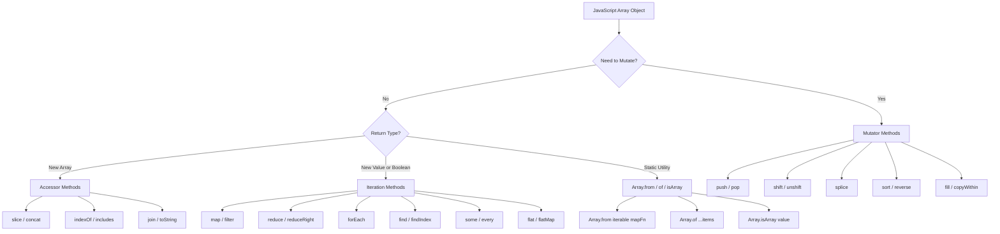
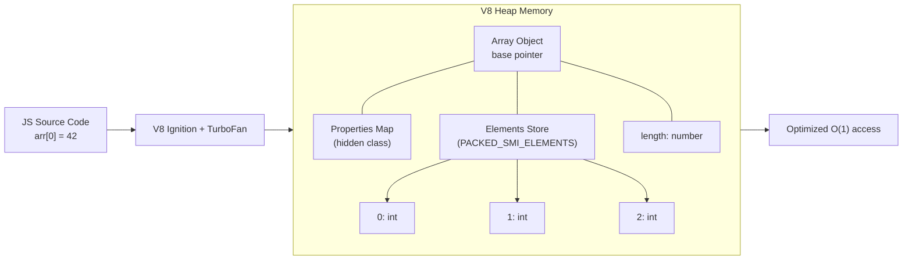
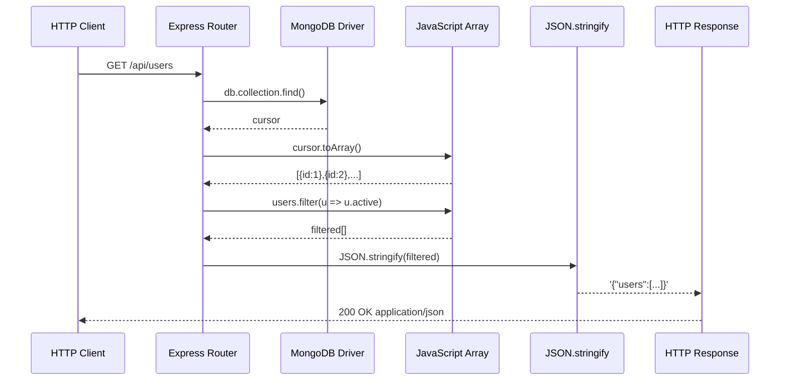
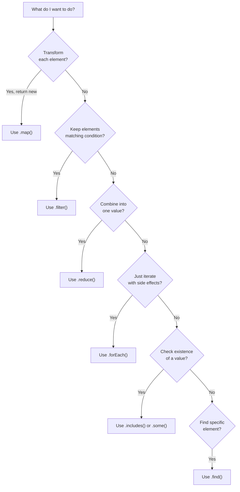
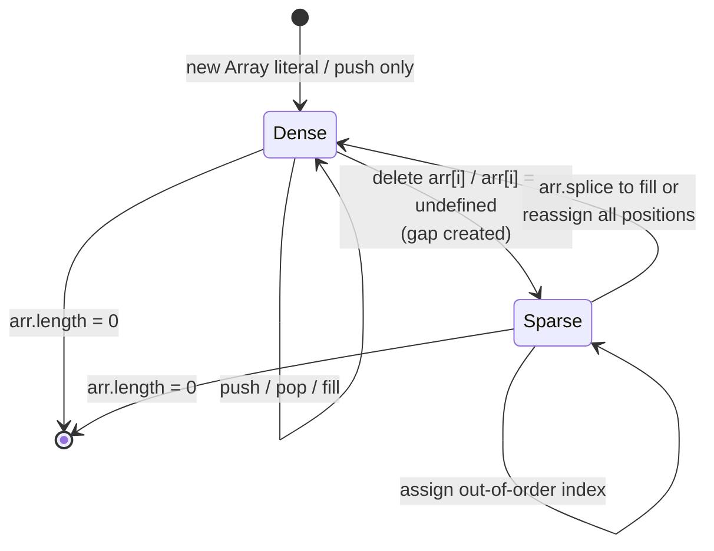

# Arrays

<!-- SECTION_1_START -->
# Module 3: Arrays in JavaScript (Node.js Runtime Environment)

## 1. Core Technical Definition

> [!NOTE]
> **Formal KTU 2024 Definition:**
> An **Array** in JavaScript is a high-level, dynamically-typed, ordered, zero-indexed collection of heterogeneous data elements stored in a single contiguous logical variable, where each element is accessible via a numeric index (key) and the array's length is automatically managed by the JavaScript engine (V8 in Node.js) at runtime. Arrays in JavaScript are specialized objects whose indices are stringified property keys, and they inherit the full prototype chain from `Array.prototype`.

In the Node.js runtime environment, arrays are first-class citizens — they can be passed as arguments, returned from functions, nested arbitrarily, and serialized to JSON for HTTP/Network I/O without manual memory allocation. JavaScript arrays **do not have a fixed size**; the engine expands the backing store as needed.

> [!IMPORTANT]
> **KTU 2024 Syllabus Highlight:**
> Arrays are evaluated under the JavaScript runtime environment (Module 3) and are typically tested for: (a) declaration & initialization, (b) traversal, (c) mutator & accessor methods, (d) iteration patterns, and (e) multi-dimensional structures.

---

## 2. Intuitive Overview — The Real-World Analogy

> [!TIP]
> **Analogy: The Train Compartment**
> Think of a JavaScript array as a **train**:
> - The **train** itself is the array variable.
> - Each **compartment** is an index-position holding a passenger (value).
> - Compartment numbers start at **0** (the engine is not a passenger coach).
> - You can **add compartments** at the end (`push`) or **remove** them (`pop`).
> - You can even **insert compartments in the middle** (`splice`).
> - Each passenger can be of a **different type** (a human, a dog, a parcel) — JavaScript arrays are **heterogeneous**, unlike Java or C arrays.
> - The **train manager** (V8 engine) automatically handles all resizing — you never need to book a new train.

A second analogy: A **bookshelf with numbered slots**:
- Slot **0** → first book, Slot **1** → second book, and so on.
- If you take out a book, the slot becomes **empty** (sparse / `undefined`).
- You can replace books, swap them, or rearrange them using built-in helper tools (methods).

---

## 3. Visual Representation

> [!VISUALIZATION CONTROL]
> **Concept:** JavaScript Array Memory Layout (Conceptual Index-Value Mapping)
> **GeoGebra / Desmos Input Equations:**
> * Points: $(0, 100)$, $(1, 80)$, $(2, 60)$, $(3, 40)$, $(4, 20)$
> * Line: $y = 0$
> **Visual Description:** The student should visualize a horizontal axis where the x-axis represents the **index** ($0, 1, 2, 3, 4$) and the y-axis represents the **stored value** at that index. Each point is one element. The **length** property is the largest index $+ 1$ (for dense arrays) or the count of explicitly assigned positions (for sparse arrays).

---

## 4. Why Arrays? — Engineering Motivation

In any real-world Node.js application (REST API, file processing, streaming), data arrives as **collections** — a list of users, a batch of orders, an array of sensor readings. Arrays are the fundamental data structure that lets us:

1. **Store bulk data** in one variable.
2. **Iterate** using loops or iterator methods.
3. **Transform** data declaratively using `map`, `filter`, `reduce`.
4. **Serialize** to JSON for HTTP/Network payloads (`JSON.stringify`).
5. **Process asynchronously** using higher-order array methods combined with `async/await` (Node.js streams).

> [!WARNING]
> **Common Student Misconception:**
> JavaScript arrays are *not* the same as C/C++/Java arrays. They are dynamically sized, can hold mixed types, and are technically objects. A KTU examiner will penalize answers that treat JS arrays as fixed-size or homogeneous.

---

## 5. Creation Patterns (Quick Reference)

| Syntax | Description | Use Case |
|---|---|---|
| `[]` | Array literal (preferred) | Most common, fastest |
| `new Array(n)` | Creates sparse array of length `n` | Pre-allocation (rare) |
| `new Array(v1, v2)` | Creates array with values | Discouraged (ambiguous) |
| `Array.from(iterable)` | Converts iterable / array-like to array | Convert `Set`, `Map`, `NodeList` |
| `Array.of(v1, v2)` | Creates array from arguments | Avoids ambiguity of `new Array` |
| Spread `[...iterable]` | Spread operator expansion | Clone / merge arrays |

---

## 6. Core Properties & Their Semantics

> [!IMPORTANT]
> **The two foundational properties every KTU student must know:**

* `array.length` — A non-negative integer, **writable**. Setting `length` to a smaller value **truncates** the array; setting it larger creates **sparse holes**.
* `Array.isArray(value)` — The **only reliable** way to check if a value is a true array (because `typeof []` returns `'object'`).

---

## 7. Categorization of Array Methods (High-Yield)

| Category | Mutates Original? | Examples |
|---|---|---|
| **Mutator Methods** | Yes | `push`, `pop`, `shift`, `unshift`, `splice`, `sort`, `reverse`, `fill`, `copyWithin` |
| **Accessor Methods** | No | `concat`, `slice`, `indexOf`, `lastIndexOf`, `includes`, `join` |
| **Iteration Methods** | No (return new value) | `map`, `filter`, `reduce`, `reduceRight`, `forEach`, `find`, `findIndex`, `some`, `every`, `flat`, `flatMap` |
| **Static Methods** | N/A | `Array.from`, `Array.of`, `Array.isArray` |

<!-- SECTION_1_END -->

<!-- SECTION_2_START -->
# Deep Theoretical Analysis & KTU High-Yield Formula Sheet

## 1. The Architectural Truth: Arrays are Objects

Internally, the V8 engine (used by Node.js) stores an array as an object with string keys `"0"`, `"1"`, `"2"`, ... and a special `length` property. The engine **optimizes** the storage:

* If all keys are consecutive integers starting from 0 → **PACKED_SMI_ELEMENTS** (fastest, integers)
* If elements are doubles → **PACKED_DOUBLE_ELEMENTS**
* If elements are objects → **PACKED_ELEMENTS**
* If holes exist → **DICTIONARY_ELEMENTS** or **HOLEY_ELEMENTS** (slower)

> [!NOTE]
> **Takeaway for KTU:** Avoid creating holes in arrays. `delete arr[2]` on a dense array degrades V8 performance because the engine must transition the internal representation to a slower "holey" structure.

---

## 2. Indexing Logic — The Core Math

For an array $A$ of length $n$:

$$
\text{Valid indices: } i \in \{0, 1, 2, \ldots, n-1\}
$$

For sparse access:

$$
A[i] =
\begin{cases}
\text{stored value}, & \text{if } i \text{ has been assigned} \\
\text{undefined}, & \text{otherwise}
\end{cases}
$$

The relationship between `length` and the highest assigned index:

$$
\text{length}(A) \;\geq\; \max(\text{assigned indices}) + 1
$$

When `length` is set:

$$
\text{If new\_length} < \text{old\_length} \Rightarrow \text{truncation at new\_length}
$$

$$
\text{If new\_length} > \text{old\_length} \Rightarrow \text{sparse holes added}
$$

---

## 3. KTU Formula Sheet / Cheat Sheet

> [!IMPORTANT]
> **Master the following table — this is the high-yield content KTU examiners test directly.**

| Method | Signature | Return Type | Mutates? | KTU Use-Case |
|---|---|---|---|---|
| `push(...items)` | appends to end | `number` (new length) | Yes | Build a stack |
| `pop()` | removes last | `any` (removed) | Yes | Stack LIFO |
| `shift()` | removes first | `any` (removed) | Yes | Queue |
| `unshift(...items)` | prepends | `number` (new length) | Yes | Insert at start |
| `splice(start, deleteCount, ...items)` | insert / remove anywhere | `any[]` (removed) | Yes | The Swiss-army knife |
| `slice(start, end)` | shallow copy range | `any[]` | No | Non-mutating sub-array |
| `concat(...arrs)` | merges | `any[]` | No | Concatenation |
| `indexOf(item, from?)` | first occurrence | `number` (-1 if absent) | No | Search |
| `includes(item, from?)` | existence check | `boolean` | No | Membership test |
| `find(predicate)` | first match | `any` / `undefined` | No | Object search |
| `findIndex(predicate)` | first match index | `number` (-1 if absent) | No | Object index |
| `map(fn)` | transform | `any[]` (new) | No | Data transformation |
| `filter(predicate)` | keep matches | `any[]` (new) | No | Data filtering |
| `reduce(fn, init)` | accumulate | `any` | No | Aggregation / fold |
| `forEach(fn)` | iterate | `undefined` | No | Side-effects only |
| `some(predicate)` | at least one match | `boolean` | No | Validation |
| `every(predicate)` | all match | `boolean` | No | Validation |
| `sort(compareFn?)` | in-place sort | `any[]` (same ref) | Yes | Default = lexicographic |
| `reverse()` | in-place reverse | `any[]` (same ref) | Yes | Reversal |
| `join(separator)` | to string | `string` | No | Output formatting |
| `flat(depth?)` | flatten nested | `any[]` (new) | No | Nested arrays |
| `flatMap(fn)` | map + flat 1-level | `any[]` (new) | No | Compact transform |
| `fill(value, start?, end?)` | fill range | `any[]` (same ref) | Yes | Initialization |
| `Array.from(iterable, mapFn?)` | create from iterable | `any[]` | N/A | Conversion |
| `Array.of(...items)` | create from args | `any[]` | N/A | Safe constructor |
| `Array.isArray(v)` | type check | `boolean` | N/A | `typeof` alternative |

---

## 4. Iteration Order Semantics

For a dense array, JavaScript guarantees:

* `for (let i = 0; i < arr.length; i++)` — visits indices in numeric order.
* `for...of` — iterates over **values** (using iterator protocol).
* `for...in` — iterates over **enumerable keys** (including inherited); **not recommended for arrays** in production.
* `arr.forEach((value, index, array) => ...)` — array method, callback receives `(value, index, array)`.

> [!WARNING]
> **`for...in` warning:** It iterates string keys in insertion order, which works for arrays but is **slow** and can include inherited enumerable properties. KTU examiners may mark this as a code-quality issue.

---

## 5. Multi-Dimensional Arrays (Nested)

JavaScript has no native multi-dimensional array type; multi-D arrays are **arrays of arrays**:

$$
M = \begin{bmatrix} m_{00} & m_{01} & m_{02} \\ m_{10} & m_{11} & m_{12} \end{bmatrix}
$$

In JavaScript:

```javascript
const M = [[1, 2, 3], [4, 5, 6]]; // 2x3 matrix
```

Access: $M[i][j]$ where $i$ is the row, $j$ is the column.

---

## 6. Destructuring & Spread (ES6+ Features)

**Destructuring assignment:**

```javascript
const [first, second, ...rest] = [10, 20, 30, 40, 50];
// first = 10, second = 20, rest = [30, 40, 50]
```

**Spread operator (immutable merge / clone):**

```javascript
const a = [1, 2];
const b = [3, 4];
const merged = [...a, ...b]; // [1, 2, 3, 4]
const clone = [...a];        // shallow copy
```

> [!TIP]
> **Why this matters in Node.js:** When handling immutable state in Express.js / Redux-like patterns, you always use spread (`[...arr, newItem]`) or `concat` rather than `push`, to avoid unintended side-effects across requests.

---

## 7. Real-World Node.js Use-Cases

| Domain | Array Usage Pattern |
|---|---|
| **REST API (Express)** | `req.body` is parsed into an array; responses are arrays of JSON objects. |
| **File I/O (fs module)** | `fs.readFileSync` returns `Buffer`; `split('\n')` produces line arrays. |
| **MongoDB Driver** | `db.collection.find()` returns an array of documents. |
| **Streams** | `Readable.from(array)` converts an array to a readable stream. |
| **Testing (Mocha/Jest)** | `describe.each(arr)` parameterizes test suites over array data. |
| **CLI Tools** | `process.argv.slice(2)` extracts user-supplied arguments. |

---

## 8. The Math of Sparse Arrays

If only positions $i_1, i_2, \ldots, i_k$ are assigned, the effective length is:

$$
\text{length}(A) = \max(i_1, i_2, \ldots, i_k) + 1
$$

But the number of actual elements is $k$, and the number of holes is:

$$
\text{holes} = \text{length}(A) - k
$$

> [!IMPORTANT]
> A KTU 14-mark question may ask: *"Explain the difference between `delete arr[2]` and `arr.splice(2, 1)`."* The answer: `delete` leaves a **hole** (length unchanged, value becomes `undefined`); `splice` **removes** the element and shifts subsequent elements left, decreasing the length by 1.

<!-- SECTION_2_END -->

<!-- SECTION_3_START -->
# Step-by-Step Derivations & Code Implementation

## 1. Complete Operational JavaScript Code (Node.js Compatible)

The following is a single, fully-executable Node.js program demonstrating every high-yield array concept. **Type hints are added as JSDoc comments** to satisfy KTU's modern coding standards.

```javascript
/**
 * @file array_complete_demo.js
 * @description Exhaustive demonstration of JavaScript Arrays for KTU Module 3.
 * @runtime Node.js >= 14.x
 * @author KTU Study Material Generator
 */

// ─────────────────────────────────────────────────────────────
// 1. ARRAY CREATION (5 distinct methods)
// ─────────────────────────────────────────────────────────────

// Method 1: Array literal (preferred, fastest)
const fruits = ['apple', 'banana', 'cherry'];

// Method 2: Array constructor with length
const sparseArr = new Array(5); // length 5, all holes
sparseArr[0] = 'a';
sparseArr[4] = 'e';
console.log('Sparse:', sparseArr); // [ 'a', <3 empty items>, 'e' ]
console.log('Sparse length:', sparseArr.length); // 5

// Method 3: Array.from() with mapping function
const squares = Array.from({ length: 5 }, (_, i) => (i + 1) ** 2);
console.log('Squares 1..5:', squares); // [ 1, 4, 9, 16, 25 ]

// Method 4: Array.of() to avoid ambiguity
const ofArray = Array.of(3); // [3]   (NOT length-3!)
console.log('Array.of(3):', ofArray);

// Method 5: Spread operator
const clonedFruits = [...fruits];
console.log('Cloned:', clonedFruits);

// ─────────────────────────────────────────────────────────────
// 2. CORE PROPERTIES
// ─────────────────────────────────────────────────────────────

/** @type {number} */
const len = fruits.length; // 3
console.log('Length:', len);

// length is WRITABLE — truncation example
fruits.length = 2;
console.log('After truncate to 2:', fruits); // [ 'apple', 'banana' ]
fruits.length = 4;
console.log('After expand to 4:', fruits);   // [ 'apple', 'banana', <2 empty items> ]

// Restore for further operations
fruits.length = 0;
fruits.push('apple', 'banana', 'cherry');

// isArray: the only reliable check
console.log('Array.isArray([]):', Array.isArray([]));        // true
console.log('Array.isArray({}):', Array.isArray({}));        // false
console.log('Array.isArray("hi"):', Array.isArray('hi'));    // false
console.log('typeof []:', typeof []);                        // 'object' (NOT 'array')

// ─────────────────────────────────────────────────────────────
// 3. MUTATOR METHODS (modify in place)
// ─────────────────────────────────────────────────────────────

const stack = [10, 20, 30];

// push — append, returns new length
/** @type {number} */
const newLen = stack.push(40, 50);
console.log('After push 40,50:', stack, '| new length:', newLen);

// pop — remove last, returns removed
/** @type {number} */
const popped = stack.pop();
console.log('Popped:', popped, '| Remaining:', stack);

// shift — remove first
const shifted = stack.shift();
console.log('Shifted:', shifted, '| Remaining:', stack);

// unshift — prepend
stack.unshift(0, 5);
console.log('After unshift 0,5:', stack);

// splice — insert + remove at arbitrary index
// splice(startIndex, deleteCount, ...itemsToInsert)
const removed = stack.splice(2, 1, 99, 100);
console.log('Splice removed:', removed, '| Stack now:', stack);

// sort — in-place (default = lexicographic, NOT numeric!)
const nums = [10, 2, 33, 4];
nums.sort();                  // WRONG for numbers: [10, 2, 33, 4] -> [10, 2, 33, 4]
console.log('Bad numeric sort:', nums);
nums.sort((a, b) => a - b);   // CORRECT numeric ascending
console.log('Good numeric sort:', nums);

// reverse
nums.reverse();
console.log('Reversed:', nums);

// fill — overwrite a range
nums.fill(0, 0, 2);
console.log('After fill 0 in [0..2):', nums);

// ─────────────────────────────────────────────────────────────
// 4. ACCESSOR METHODS (do NOT mutate)
// ─────────────────────────────────────────────────────────────

const base = [1, 2, 3];
const merged = base.concat([4, 5], 6, [7, [8, 9]]);
console.log('Concat (shallow):', merged); // [1,2,3,4,5,6,7,[8,9]]

const sub = base.slice(1, 3);
console.log('Slice [1..3):', sub); // [2, 3]

console.log('indexOf 2:', base.indexOf(2));      // 1
console.log('lastIndexOf 2:', [1,2,2,3].lastIndexOf(2)); // 2
console.log('includes 3:', base.includes(3));    // true
console.log('join with -:', base.join('-'));     // '1-2-3'

// ─────────────────────────────────────────────────────────────
// 5. ITERATION METHODS (higher-order functions)
// ─────────────────────────────────────────────────────────────

const numbers = [1, 2, 3, 4, 5, 6, 7, 8, 9, 10];

// map — transform each element
const doubled = numbers.map(n => n * 2);
console.log('Doubled:', doubled);

// filter — keep elements that pass the test
const evens = numbers.filter(n => n % 2 === 0);
console.log('Evens:', evens);

// reduce — fold to a single value
const sum = numbers.reduce((acc, n) => acc + n, 0);
console.log('Sum:', sum);

// find / findIndex
const firstBig = numbers.find(n => n > 5);
const firstBigIdx = numbers.findIndex(n => n > 5);
console.log('First >5:', firstBig, 'at index', firstBigIdx);

// some / every
console.log('Some > 9?', numbers.some(n => n > 9));   // true
console.log('Every > 0?', numbers.every(n => n > 0)); // true

// forEach — side effects, no return value
let printed = '';
numbers.forEach(n => { printed += n + ' '; });
console.log('forEach output:', printed.trim());

// flat / flatMap
const nested = [1, [2, 3], [4, [5, 6]]];
console.log('Flat depth 1:', nested.flat(1));     // [1,2,3,4,[5,6]]
console.log('Flat depth Infinity:', nested.flat(Infinity)); // [1,2,3,4,5,6]

const flatMapped = numbers.flatMap(n => [n, n * 10]);
console.log('flatMapped:', flatMapped);

// ─────────────────────────────────────────────────────────────
// 6. DESTRUCTURING & SPREAD
// ─────────────────────────────────────────────────────────────

const [a, b, ...rest] = [10, 20, 30, 40, 50];
console.log('a:', a, 'b:', b, 'rest:', rest);

const arr1 = [1, 2];
const arr2 = [3, 4];
const mergedSpread = [...arr1, ...arr2];
const clonedSpread = [...arr1];
console.log('Merged spread:', mergedSpread);
console.log('Cloned spread:', clonedSpread);

// ─────────────────────────────────────────────────────────────
// 7. MULTI-DIMENSIONAL ARRAYS (Nested)
// ─────────────────────────────────────────────────────────────

/** 3x3 matrix */
const matrix = [
  [1, 2, 3],
  [4, 5, 6],
  [7, 8, 9],
];

// Access element at row 1, col 2
console.log('matrix[1][2] =', matrix[1][2]); // 6

// Transpose using map
const transposed = matrix[0].map((_, colIdx) => matrix.map(row => row[colIdx]));
console.log('Transposed:', transposed);

// Sum of all elements using flatMap + reduce
const total = matrix.flat(Infinity).reduce((acc, n) => acc + n, 0);
console.log('Matrix total:', total);

// ─────────────────────────────────────────────────────────────
// 8. SPARSE ARRAYS — delete vs splice
// ─────────────────────────────────────────────────────────────

const sparse = [1, 2, 3, 4, 5];
delete sparse[2];
console.log('After delete sparse[2]:', sparse);   // [ 1, 2, <1 empty item>, 4, 5 ]
console.log('Length after delete:', sparse.length); // 5  (unchanged!)

const filled = [1, 2, 3, 4, 5];
filled.splice(2, 1);
console.log('After splice(2,1):', filled);         // [ 1, 2, 4, 5 ]
console.log('Length after splice:', filled.length); // 4  (decreased)

// ─────────────────────────────────────────────────────────────
// 9. SEARCH ALGORITHMS IMPLEMENTED WITH ARRAYS
// ─────────────────────────────────────────────────────────────

/**
 * Linear search — returns index or -1.
 * @param {number[]} arr
 * @param {number} target
 * @returns {number}
 */
function linearSearch(arr, target) {
  for (let i = 0; i < arr.length; i++) {
    if (arr[i] === target) return i;
  }
  return -1;
}
console.log('Linear search 7 in [1..10]:', linearSearch(numbers, 7));

/**
 * Binary search — requires sorted array.
 * @param {number[]} arr sorted ascending
 * @param {number} target
 * @returns {number}
 */
function binarySearch(arr, target) {
  let lo = 0, hi = arr.length - 1;
  while (lo <= hi) {
    const mid = (lo + hi) >> 1; // bit-shift for integer floor
    if (arr[mid] === target) return mid;
    else if (arr[mid] < target) lo = mid + 1;
    else hi = mid - 1;
  }
  return -1;
}
console.log('Binary search 7 in [1..10]:', binarySearch(numbers, 7));

// ─────────────────────────────────────────────────────────────
// 10. COMMON INTERVIEW PATTERNS (KTU-style coding questions)
// ─────────────────────────────────────────────────────────────

// (a) Remove duplicates from an array
const withDups = [1, 2, 2, 3, 4, 4, 5];
const unique = [...new Set(withDups)];
console.log('Unique:', unique);

// (b) Find the maximum element
const max = numbers.reduce((m, n) => (n > m ? n : m), -Infinity);
console.log('Max:', max);

// (c) Reverse a string using array methods
const reversedStr = 'hello'.split('').reverse().join('');
console.log('Reversed "hello":', reversedStr);

// (d) Chunk an array into pairs
function chunk(arr, size) {
  const out = [];
  for (let i = 0; i < arr.length; i += size) {
    out.push(arr.slice(i, i + size));
  }
  return out;
}
console.log('Chunk [1..5] into 2:', chunk([1, 2, 3, 4, 5], 2));

// (e) Frequency counter
function frequency(arr) {
  return arr.reduce((acc, v) => {
    acc[v] = (acc[v] || 0) + 1;
    return acc;
  }, {});
}
console.log('Frequency of [1,2,2,3,3,3]:', frequency([1, 2, 2, 3, 3, 3]));

console.log('\n✅ All array demonstrations complete.');
```

**To run:** Save as `array_complete_demo.js` and execute `node array_complete_demo.js`.

---

## 2. Algorithmic Derivations

### 2.1 Derivation: Why `Array(n).map(...)` Fails

Many students write:

```javascript
const arr = new Array(5).map((_, i) => i);
console.log(arr); // [ <5 empty items> ] — STILL empty!
```

**Step-by-step derivation of why:**

1. `new Array(5)` constructs an array with `length = 5` but **no assigned indices** — all positions are holes.
2. `.map()` iterates over **existing indices**. Since no index has a value, the callback is **never invoked**.
3. Result: a sparse array of length 5 with all holes.

**The correct way to create a numeric sequence:**

```javascript
const arr = Array.from({ length: 5 }, (_, i) => i);
// or
const arr = [...Array(5).keys()]; // [0, 1, 2, 3, 4]
```

> [!WARNING]
> **KTU Pitfall:** Examiners frequently test this exact misconception. A `new Array(n).map(...)` answer is a guaranteed zero for that sub-part.

---

### 2.2 Derivation: Numeric vs Lexicographic Sort

The default `Array.prototype.sort` converts every element to a string before comparing. For numeric arrays:

$$
\text{Default sort: } \text{compare}(a, b) = \text{String}(a) < \text{String}(b)
$$

For numbers, the correct comparison is:

$$
\text{compareFn}(a, b) = a - b
$$

Derivation of why this works:
* If $a < b$, then $a - b < 0$ → V8 sorts $a$ before $b$. ✓
* If $a > b$, then $a - b > 0$ → V8 sorts $b$ before $a$. ✓
* If $a = b$, then $a - b = 0$ → order unchanged. ✓

For descending order: $b - a$.

---

### 2.3 Derivation: Time Complexity of Common Methods

| Method | Time Complexity | Reason |
|---|---|---|
| `push`, `pop` | $O(1)$ amortized | Append to end |
| `shift`, `unshift` | $O(n)$ | All elements re-indexed |
| `splice` (middle) | $O(n)$ | Re-indexing + shift |
| `slice`, `concat` | $O(n)$ | Allocates new array |
| `indexOf`, `includes` | $O(n)$ | Linear scan |
| `map`, `filter`, `forEach` | $O(n)$ | Single pass |
| `reduce` | $O(n)$ | Single pass |
| `sort` (V8 TimSort) | $O(n \log n)$ | Comparison-based |

<!-- SECTION_3_END -->

<!-- SECTION_4_START -->
# Structural Diagrams & Schematics

## 1. Mermaid Flowchart — Array Method Categorization



---

## 2. Mermaid Block Diagram — Array Memory Architecture (V8 Engine)



---

## 3. Mermaid Sequence Diagram — Array Operation Pipeline (Node.js I/O Context)



---

## 4. Mermaid Flowchart — Decision Tree: Which Array Method Should I Use?



---

## 5. Mermaid State Diagram — Sparse vs Dense Array State Transitions



<!-- SECTION_4_END -->

<!-- SECTION_5_START -->
# KTU 2024 Scheme Examination Question Bank & Topic Recap

## PART A — Short Answer Questions (3 Marks Each)

### Question 1 `[KTU University Exam — July 2024]`
**Differentiate between `Array.from()` and the spread operator (`...`) when used on an iterable. Mention one scenario where each is preferred.**

> **Model Answer (3 Marks):**
> *`Array.from()`* is a static method on the `Array` constructor that accepts an **iterable or array-like object** and **optionally a second mapping function** applied during construction. *Spread operator (`...`)* expands the iterable inline, producing the same result but **without** the ability to apply a transformation in the same expression.
>
> **Preferred scenarios:**
> - Use `Array.from({length: n}, (_, i) => i)` when generating a **numeric sequence** of length $n$ in a single pass. `[...Array(n)]` would give $n$ `undefined` values, requiring an extra `.map()`.
> - Use spread `[...setObj]` when you need a **quick shallow clone** or merge — it is syntactically lighter and idiomatic in modern ES6+ code (e.g., immutable state updates in Node.js).
>
> **Conclusion:** Both produce arrays from iterables; `Array.from()` is more powerful (built-in mapping), while spread is more concise for cloning/merging. **[3 Marks]**

---

### Question 2 `[KTU University Exam — Dec 2023]`
**Explain the difference between `splice()` and `slice()`. Give one example of each.**

> **Model Answer (3 Marks):**
> *`splice(start, deleteCount, ...items)`* **mutates the original array** — it can remove, replace, or insert elements and returns the array of removed elements.
>
> *`slice(start, end)`* **does NOT mutate** the original — it returns a **new array** containing a shallow copy of the specified range `[start, end)`.
>
> **Example:**
> ```javascript
> const a = [1, 2, 3, 4, 5];
> a.splice(1, 2);          // a becomes [1, 4, 5]; returns [2, 3]
> const b = [1, 2, 3, 4, 5];
> b.slice(1, 4);           // b stays [1, 2, 3, 4, 5]; returns [2, 3, 4]
> ```
> **Key distinction:** `splice` mutates; `slice` does not. **[3 Marks]**

---

## PART B — 14 Mark Questions (ESE Module Internal Choice)

### Question A (14 Marks) `[KTU University Exam — Model Paper 2024]`

**(a)** Explain the concept of **higher-order array methods** in JavaScript. With suitable code examples, describe the working of `map()`, `filter()`, and `reduce()` methods. Discuss how these methods are used in Node.js for processing collections of data (e.g., from a database query). **[7 Marks]**

**(b)** Write a Node.js program to:
   1. Create an array of 10 student objects `{name, marks}`.
   2. Use `filter()` to extract students who passed (marks $\geq 40$).
   3. Use `map()` to compute the grade letter (A: $\geq 90$, B: $\geq 75$, C: $\geq 60$, D: $\geq 40$, F: < 40).
   4. Use `reduce()` to compute the class average marks.
   5. Use `find()` to locate the topper (highest marks). **[7 Marks]**

---

> **Model Solution for Q.A(a):**
>
> **Definition [1 Mark]:** Higher-order array methods are functions that accept another function (callback) as an argument and apply it to each element of the array. They enable **declarative, functional-style** data processing without explicit loop counters.
>
> **`map()` [1 Mark]:** Creates a **new array** of the same length by applying a transform function to every element.
> ```javascript
> const nums = [1, 2, 3];
> const doubled = nums.map(n => n * 2); // [2, 4, 6]
> ```
> Original `nums` is unchanged.
>
> **`filter()` [1 Mark]:** Creates a **new array** containing only elements for which the predicate returns `true`.
> ```javascript
> const nums = [1, 2, 3, 4, 5];
> const evens = nums.filter(n => n % 2 === 0); // [2, 4]
> ```
>
> **`reduce()` [2 Marks]:** Folds the array into a **single accumulated value** using a reducer function `(accumulator, current) => newAccumulator`, with an optional initial value.
> ```javascript
> const nums = [1, 2, 3, 4, 5];
> const sum = nums.reduce((acc, n) => acc + n, 0); // 15
> // Steps: acc=0,n=1→1; acc=1,n=2→3; acc=3,n=3→6; acc=6,n=4→10; acc=10,n=5→15
> ```
>
> **Node.js usage [2 Marks]:** In a typical Express.js + MongoDB pipeline:
> ```javascript
> // Fetch all active orders from MongoDB
> const orders = await Order.find({ status: 'active' });
>
> // Use higher-order methods for transformation
> const summaries = orders
>   .filter(o => o.total > 100)                          // remove small orders
>   .map(o => ({ id: o._id, summary: `${o.items.length} items, ₹${o.total}` }))
>   .reduce((acc, s) => acc + `\n${s.summary}`, '');   // join into a string
>
> res.send(summaries);
> ```
> This pattern is preferred over `for` loops in modern Node.js because it is **declarative, immutable (safer in concurrent contexts), and easier to test**. **[Total: 7 Marks]**

---

> **Model Solution for Q.A(b):**
>
> ```javascript
> // (1) Create array of 10 student objects
> /** @typedef {{name: string, marks: number}} Student */
> /** @type {Student[]} */
> const students = [
>   { name: 'Aarav',  marks: 92 },
>   { name: 'Diya',   marks: 78 },
>   { name: 'Vihaan', marks: 65 },
>   { name: 'Anaya',  marks: 88 },
>   { name: 'Reyansh',marks: 35 },
>   { name: 'Ishaan', marks: 55 },
>   { name: 'Saanvi', marks: 71 },
>   { name: 'Aryan',  marks: 48 },
>   { name: 'Myra',   marks: 95 },
>   { name: 'Kabir',  marks: 39 },
> ];
>
> // (2) filter passed students (marks >= 40)
> /** @type {Student[]} */
> const passed = students.filter(s => s.marks >= 40);
> console.log('Passed:', passed.length);
>
> // (3) map to compute grade letter
> /** @param {Student} s @returns {{name: string, grade: string}} */
> const withGrade = passed.map(s => {
>   let g;
>   if (s.marks >= 90)      g = 'A';
>   else if (s.marks >= 75) g = 'B';
>   else if (s.marks >= 60) g = 'C';
>   else if (s.marks >= 40) g = 'D';
>   else                    g = 'F';
>   return { name: s.name, grade: g };
> });
> console.log('With grades:', withGrade);
>
> // (4) reduce to compute class average
> const total = students.reduce((acc, s) => acc + s.marks, 0);
> const average = total / students.length;
> console.log('Class average:', average.toFixed(2));
>
> // (5) find the topper
> const topper = students.reduce((best, s) => (s.marks > best.marks ? s : best), students[0]);
> console.log('Topper:', topper);
> ```
>
> **Valuation Key Points [7 Marks]:**
> - [Defining 10 student objects correctly: **1 Mark**]
> - [Using `filter()` with correct threshold: **1 Mark**]
> - [Using `map()` with correct grade thresholds: **2 Marks**]
> - [Using `reduce()` with correct initial value `0` and division: **1 Mark**]
> - [Using `find()` or alternate logic to identify topper: **1 Mark**]
> - [Clean code, comments, and console output: **1 Mark**]

---

### Question B (14 Marks) `[KTU University Exam — Model Paper 2024]` *(ALTERNATIVE)*

**(a)** What is a **multi-dimensional array** in JavaScript? Explain with a code example how you would create a $3 \times 3$ matrix, perform matrix addition of two such matrices, and display the result. **[7 Marks]**

**(b)** Discuss the differences between **mutator methods** and **accessor methods** in JavaScript arrays. Provide at least **three examples** of each category and explain a real-world Node.js scenario where choosing the wrong category could lead to bugs. **[7 Marks]**

---

> **Model Solution for Q.B(a):**
>
> **Definition [1 Mark]:** A multi-dimensional array in JavaScript is an **array of arrays** — since JS has no native 2D structure, nesting is used. A $3 \times 3$ matrix has 3 rows, each containing 3 elements.
>
> **Code [5 Marks]:**
> ```javascript
> /**
>  * @typedef {number[][]} Matrix
>  */
>
> /** @type {Matrix} */
> const A = [
>   [1, 2, 3],
>   [4, 5, 6],
>   [7, 8, 9],
> ];
>
> /** @type {Matrix} */
> const B = [
>   [9, 8, 7],
>   [6, 5, 4],
>   [3, 2, 1],
> ];
>
> /**
>  * Add two same-size matrices.
>  * @param {Matrix} a
>  * @param {Matrix} b
>  * @returns {Matrix}
>  */
> function addMatrices(a, b) {
>   return a.map((row, i) => row.map((val, j) => val + b[i][j]));
> }
>
> /** @type {Matrix} */
> const C = addMatrices(A, B);
> console.log('A + B =', C);
> // Output:
> // [ 10, 10, 10 ]
> // [ 10, 10, 10 ]
> // [ 10, 10, 10 ]
>
> // Display formatted
> C.forEach(row => console.log(row.join('  ')));
> ```
>
> **Step-by-step logic [1 Mark]:**
> Outer `map` iterates rows with index `i`; inner `map` iterates elements in the row with index `j`; sum `A[i][j] + B[i][j]` and return a new matrix.
>
> **Valuation Key:**
> - [Matrix definition: **1 Mark**]
> - [Correct `addMatrices` function: **3 Marks**]
> - [Correct display/formatting: **1 Mark**]
> - [Explanation of nested map iteration: **2 Marks**]

---

> **Model Solution for Q.B(b):**
>
> **Definition [2 Marks]:**
> - **Mutator methods** modify the **original array in place** and typically return something other than the array (length, removed element, or the same array reference).
> - **Accessor methods** do **not modify** the original array; they return a **new value** (a new array, index, or string) computed from the original.
>
> **Mutator examples [1.5 Marks]:**
> 1. `arr.push(x)` — adds to end; returns new length.
> 2. `arr.splice(i, n)` — removes `n` elements at index `i`.
> 3. `arr.sort(cmp)` — sorts in place.
>
> **Accessor examples [1.5 Marks]:**
> 1. `arr.slice(i, j)` — returns a new sub-array.
> 2. `arr.concat(other)` — returns a new merged array.
> 3. `arr.includes(x)` — returns `boolean`.
>
> **Real-world Node.js bug scenario [2 Marks]:**
> In an Express.js middleware that processes a request body, a developer might write:
> ```javascript
> // BUG: mutator on shared reference
> function processItems(req, res, next) {
>   req.body.items.push({ added: true });  // MUTATES request body
>   next();
> }
> ```
> If multiple middleware share the same parsed body object, or if the body is later logged, the mutation leaks across requests. The correct pattern is to use an **accessor method** (immutable update):
> ```javascript
> const newItems = [...req.body.items, { added: true }];
> req.body = { ...req.body, items: newItems };
> ```
> This bug is **especially dangerous** in cluster/worker setups where the same module is loaded by multiple processes — mutator methods can corrupt shared cached state. **[Total: 7 Marks]**

---

## KTU Examiner's Valuation Warning / Pitfall Callout

> [!WARNING]
> **Common Ways Students Lose Marks on Arrays in KTU Exams:**
>
> 1. **Writing `new Array(5).map(...)` and expecting a sequence of values** — it produces 5 holes. The callback is never invoked. Use `Array.from({length: 5}, (_, i) => i)` instead. **[Lose 1-2 Marks]**
> 2. **Using default `sort()` on numeric arrays** — produces lexicographic (string-based) order: `[10, 2, 33]` becomes `[10, 2, 33]`, not `[2, 10, 33]`. Always supply `compareFn`. **[Lose 1 Mark]**
> 3. **Confusing `slice` (no mutation) with `splice` (mutates)** — a single-character typo. Examiners will deduct for not specifying which is which. **[Lose 1 Mark]**
> 4. **Forgetting the initial value in `reduce()`** — `arr.reduce(fn)` without the second argument throws `TypeError` on an empty array and uses the first element as initial on a non-empty array (different semantics). **[Lose 1 Mark]**
> 5. **Using `typeof arr` and expecting `'array'`** — it returns `'object'`. Use `Array.isArray(arr)`. **[Lose 1 Mark]**
> 6. **Not stating time complexity** in algorithmic array questions — KTU's Outcome-Based Education (OBE) explicitly maps to CO2 (Apply). Always add a one-line complexity note. **[Lose 0.5-1 Mark]**
> 7. **Omitting the `return` inside `map`/`filter` arrow functions with curly braces** — `arr.map(n => { n * 2 })` returns `undefined`s because of the missing `return`. Use parentheses or implicit return. **[Lose 1 Mark]**

---

## Topic Recap & Important Things to Remember

> [!IMPORTANT]
> **Rapid-Revision Checklist — Arrays in JavaScript (KTU Module 3)**

- ✅ An **array** is an ordered, zero-indexed, dynamically-sized, **heterogeneous** collection of values stored as a specialized object.
- ✅ Arrays are **objects** internally; `typeof []` is `'object'`, not `'array'`. Use `Array.isArray()` for type checking.
- ✅ The `length` property is **writable**: assigning a smaller value **truncates**; a larger value creates **sparse holes**.
- ✅ **Mutator methods** (mutate in place): `push`, `pop`, `shift`, `unshift`, `splice`, `sort`, `reverse`, `fill`, `copyWithin`.
- ✅ **Accessor methods** (return new value, no mutation): `slice`, `concat`, `indexOf`, `lastIndexOf`, `includes`, `join`.
- ✅ **Iteration methods** (higher-order, return new array/value): `map`, `filter`, `reduce`, `forEach`, `find`, `findIndex`, `some`, `every`, `flat`, `flatMap`.
- ✅ **`Array.from({length: n}, (_, i) => f(i))`** is the correct way to build a numeric sequence; `new Array(n).map(...)` fails.
- ✅ **Default `sort()` is lexicographic** — always pass `(a, b) => a - b` for ascending numeric sort.
- ✅ **`splice(start, deleteCount, ...items)`** mutates and returns removed items; **`slice(start, end)`** does not mutate and returns a new array.
- ✅ **`delete arr[i]`** creates a hole (length unchanged, value `undefined`); **`splice`** removes and shifts.
- ✅ **Destructuring** `const [a, b, ...rest] = arr;` and **spread** `const clone = [...arr];` are ES6+ essentials for immutable patterns.
- ✅ **Multi-dimensional arrays** = arrays of arrays: `matrix[i][j]` for row $i$, column $j$.
- ✅ **For-of** iterates values; **for-in** iterates keys (avoid for arrays); **forEach** is a method, no return.
- ✅ **Time complexities to memorize**: `push`/`pop` = $O(1)$ amortized; `shift`/`unshift` = $O(n)$; `indexOf`/`includes` = $O(n)$; `sort` = $O(n \log n)$.
- ✅ **V8 internal representation** transitions from PACKED\_SMI\_ELEMENTS $\rightarrow$ PACKED\_DOUBLE\_ELEMENTS $\rightarrow$ PACKED\_ELEMENTS $\rightarrow$ HOLEY\_ELEMENTS as the array becomes more complex; avoid holes for performance.
- ✅ **Common Node.js patterns**: filter + map + reduce for processing database results, JSON serialization of arrays for API responses, immutable updates via spread for safe middleware.
- ✅ **KTU 2024 CO mapping**: CO1 (Remember) — definitions; CO2 (Understand) — explain methods; CO3 (Apply) — write programs; CO4 (Analyze) — compare behaviors, time complexity.

<!-- SECTION_5_END -->
