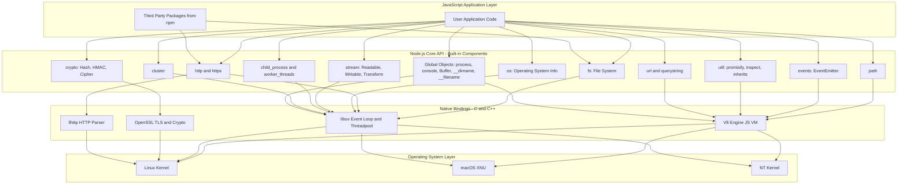
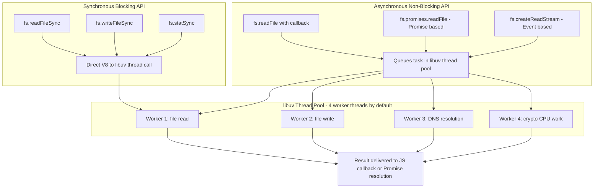

# Built- in components

<!-- SECTION_1_START -->

# Built-in Components of the Node.js Runtime Environment

## 1.1 Formal Academic Definition

> [!IMPORTANT]
> **Built-in Components of Node.js** are the **pre-compiled, native modules and global objects** that are bundled directly into the Node.js binary distribution. They are loaded into memory at runtime without requiring any external installation via the Node Package Manager (NPM). They expose JavaScript APIs that interface with the underlying **V8 JavaScript engine** (parsing/execution) and the **libuv C++ library** (asynchronous I/O, event loop, thread pool).

The Node.js runtime is architecturally divided into three concentric layers:

1. **JavaScript Layer** – Application code written by the developer.
2. **Node.js Core API Layer** – The built-in components (modules + globals).
3. **Native Bindings Layer** – C/C++ bindings that translate JS calls into OS-level syscalls.

The two pillars of these built-in components are:

| Category | Description | Loading Mechanism |
|----------|-------------|-------------------|
| **Core Modules** | Namespaced APIs like `fs`, `http`, `path`, `os`, `events`, `util`, `crypto`, `stream`, `url`, `querystring` | Loaded via `require('moduleName')` |
| **Global Objects** | Always available without import: `global`, `process`, `console`, `Buffer`, `__dirname`, `__filename`, `module`, `exports`, `require`, `setTimeout`, `setImmediate` | Accessible anywhere in any file |

> [!NOTE]
> **Key Architectural Constant:** Node.js is built on the **V8 engine** (Chrome's open-source JS engine) and the **libuv** library. Together they form the foundation over which every built-in component is implemented.

---

## 1.2 Conceptual Analogy — The "Pre-installed Apps on a Smartphone"

Imagine you just bought a brand-new smartphone. The phone ships with **pre-installed applications** — Calculator, Clock, Camera, Messages. You do not have to download them from an app store; they are already baked into the device. The moment you turn it on, you can call `Calculator.add(2, 3)` and get an instant result.

**Node.js built-in components behave exactly like these pre-installed apps:**

- The **smartphone's operating system** is the Node.js binary itself.
- The **pre-installed apps** are the built-in modules (`fs`, `http`, `path`, etc.).
- The **app icons on the home screen** correspond to the `require('appName')` calls.
- **Third-party apps from the Play Store / App Store** are NPM packages (e.g., `express`, `mongoose`, `lodash`) that you must install separately.

> Just as you cannot uninstall the Calculator app without breaking the phone, the built-in modules are an inseparable part of the Node.js runtime — you can use them in any project without any `package.json` dependency entry.

---

## 1.3 GeoGebra / Desmos Integration

> [!VISUALIZATION CONTROL]
> **Concept:** Hierarchical Layering of the Node.js Runtime (Conceptual Block Diagram)
> **GeoGebra / Desmos Input Equations:**
> * $L_1$: rectangle representing the **Application Layer** (developer code)
> * $L_2$: rectangle representing the **Core API Layer** ($fs$, $http$, $path$, $os$, $events$, $util$, $Buffer$, $process$)
> * $L_3$: rectangle representing the **Native Bindings Layer** ($V8$, $libuv$, $OpenSSL$)
> * $L_4$: rectangle representing the **Operating System** ($Linux$, $macOS$, $Windows$)
> **Visual Description:** A vertical stack of four horizontal bars where each lower layer is a strict prerequisite of the layer above it. An arrow pointing downward indicates the *call direction* (JS → C++ → OS), and an upward arrow indicates the *return direction* (callbacks/promises flow back to JS).

---

<!-- SECTION_1_END -->

<!-- SECTION_2_START -->

# Deep Theoretical Analysis & KTU High-Yield Cheat Sheet

## 2.1 Why Does Node.js Need Built-in Components?

A raw JavaScript engine (V8 alone) **cannot** read a file, open a network socket, or hash a password — it has no concept of an Operating System. The built-in components act as the **bridge** between pure JavaScript and the host Operating System. Each module is a thin JavaScript wrapper around battle-tested C/C++ code that performs the actual system call.

The design follows a deliberate engineering principle: **"Thin JavaScript, Thick Native."** The JS surface is kept minimal, idiomatic, and event-driven, while the heavy lifting (file I/O, DNS resolution, TLS handshakes) is delegated to **libuv** and **OpenSSL**.

---

## 2.2 Taxonomy of Built-in Components

### A. Global Objects (No `require` Needed)

| Global | Purpose | Example Use Case |
|--------|---------|------------------|
| `process` | Provides information about, and control over, the current Node.js process. | Reading `process.argv`, handling `process.exit(code)`, listening on `process.on('exit')`. |
| `console` | Prints to **stdout** and **stderr** streams. | Debugging, logging structured JSON. |
| `Buffer` | A fixed-size raw memory allocation outside the V8 heap, used to handle binary data. | Reading TCP socket bytes, image manipulation, file chunks. |
| `__dirname` | Absolute path of the directory containing the currently executing file. | Resolving relative file paths portably. |
| `__filename` | Absolute path of the currently executing file. | Generating log line prefixes. |
| `module` | A reference to the current module (a `Module` instance). | Inspecting `module.exports`. |
| `exports` | A shorthand for `module.exports`. | Exporting functions: `exports.add = (a, b) => a + b`. |
| `require` | Function to load a module (core, file, or NPM). | `const fs = require('fs')`. |
| `setTimeout` / `setInterval` / `setImmediate` | Timers exposed from the **Timers** module. | Scheduling deferred work. |
| `global` / `globalThis` | The namespace object for true globals. | Cross-realm compatibility. |

### B. Core Modules (Loaded with `require`)

| Module | Primary Responsibility | Key APIs (Mnemonic) |
|--------|----------------------|---------------------|
| `fs` | File System operations | `readFile`, `writeFile`, `appendFile`, `unlink`, `mkdir`, `readdir`, `stat` |
| `path` | Cross-platform path manipulation | `join`, `resolve`, `basename`, `dirname`, `extname`, `parse`, `format` |
| `os` | Operating System information | `platform`, `arch`, `cpus`, `totalmem`, `freemem`, `hostname`, `homedir` |
| `events` | Asynchronous event-driven architecture | `EventEmitter`, `on`, `emit`, `once`, `removeListener`, `listenerCount` |
| `util` | Utility functions for debugging and inheritance | `inherits`, `promisify`, `inspect`, `format`, `types` |
| `http` | HTTP server and client | `createServer`, `request`, `get`, `IncomingMessage`, `ServerResponse` |
| `https` | HTTP over TLS/SSL | `createServer` (with options), `request` (with agent) |
| `url` | URL parsing and construction | `parse`, `format`, `URL` class, `URLSearchParams` class |
| `querystring` | Parse and stringify URL query strings | `parse`, `stringify`, `escape`, `unescape` |
| `crypto` | Cryptographic functionality | `createHash`, `createHmac`, `randomBytes`, `createCipheriv` |
| `stream` | Abstract interface for streaming data | `Readable`, `Writable`, `Transform`, `pipeline` |
| `child_process` | Spawn subprocesses | `exec`, `spawn`, `fork`, `execFile` |
| `cluster` | Multi-process scaling across CPU cores | `isMaster`, `fork`, `workers` |
| `dgram` | UDP datagram sockets | `createSocket` |
| `dns` | DNS resolution | `lookup`, `resolve`, `resolve4` |
| `net` | Asynchronous TCP/IP sockets | `createServer`, `createConnection`, `Socket` |
| `readline` | Readable line-by-line interface | `createInterface`, `question` |
| `timers` | Scheduling timers in a low-level way | `setTimeout`, `setImmediate`, `clearImmediate` |
| `worker_threads` | True multi-threading in Node.js | `Worker`, `parentPort`, `postMessage` |
| `tty` | Terminal detection and manipulation | `isTTY`, `WriteStream` |
| `zlib` | Compression (gzip, deflate, brotli) | `gzip`, `gunzip`, `deflate`, `createGzip` |

---

## 2.3 KTU Formula Sheet / High-Yield Reference Table

> [!IMPORTANT]
> The following table summarizes the most frequently asked **API signatures and return values** in KTU Web Programming examinations. Memorize the **parameter order** and **callback signature** for the `fs` module in particular.

| Module | Method Signature | Returns / Side Effect |
|--------|------------------|----------------------|
| `fs` (async) | `fs.readFile(path[, options], callback)` | `callback(err: NodeJS.ErrnoException $\mid$ null, data: Buffer $\mid$ string)` |
| `fs` (sync) | `fs.readFileSync(path[, options])` | `Buffer $\mid$ string` — throws on error |
| `fs` (write) | `fs.writeFile(path, data[, options], callback)` | Writes `data` (string or Buffer) to `path` |
| `path` | `path.join([...paths])` | Concatenates segments with platform separator |
| `path` | `path.resolve([...paths])` | Resolves to an **absolute** path from right to left |
| `path` | `path.extname(pathString)` | Returns extension (e.g., `'.js'`) |
| `os` | `os.platform()` | `'linux'` $\mid$ `'darwin'` $\mid$ `'win32'` $\mid$ ... |
| `os` | `os.totalmem()` | Total system RAM in bytes |
| `os` | `os.cpus()` | Array of objects with `model`, `speed`, `times` |
| `events` | `emitter.on(eventName, listener)` | Registers a persistent listener |
| `events` | `emitter.once(eventName, listener)` | Registers a **one-shot** listener |
| `events` | `emitter.emit(eventName[, ...args])` | Synchronously calls each listener; returns `boolean` |
| `events` | `emitter.listenerCount(eventName)` | Integer count of registered listeners |
| `http` | `http.createServer([options], requestListener)` | Returns `http.Server` instance |
| `http` | `requestListener(req, res)` | `(IncomingMessage, ServerResponse) => void` |
| `url` | `url.parse(urlString[, parseQueryString][, slashesDenoteHost])` | Returns `Url` object (legacy) |
| `url` | `new URL(input[, base])` | Returns WHATWG-compliant `URL` instance |
| `querystring` | `querystring.parse(str[, sep[, eq[, options]]])` | Returns plain object of key-value pairs |
| `crypto` | `crypto.createHash(algorithm)` | Returns `Hash` stream — chain `.update()` and `.digest()` |
| `process` | `process.argv` | Array starting with `node` executable path and script path |

> **Symbol Legend:** $\mid$ denotes "or" (alternation), $[...]$ denotes optional parameters.

---

## 2.4 Real-World Engineering Utility

| Built-in Component | Production Use Case |
|--------------------|---------------------|
| `fs` + `stream` | Reading gigabyte-sized log files **without** loading the entire file into RAM (used in build tools like Webpack and Vite). |
| `http` | Foundation underneath frameworks like **Express.js** and **Koa.js** — they wrap `http.createServer` to add routing and middleware. |
| `events` | Powers the **Observer pattern** inside Node.js itself; nearly every core API (e.g., `fs.createReadStream`, `process`) extends `EventEmitter`. |
| `crypto` | Used in authentication libraries (`bcrypt`, `jsonwebtoken`) to generate **secure random tokens** and compute HMAC signatures. |
| `path` + `os` | Critical in **DevOps scripts** and **CLI tools** (e.g., npm, yarn) for resolving cross-platform file locations. |
| `child_process` | Enables running **shell commands** from Node — used by tools like ESLint, Prettier, and create-react-app. |
| `cluster` / `worker_threads` | Scales a single-threaded Node process across **all CPU cores**, essential for high-throughput APIs. |
| `Buffer` | Mandatory when handling **binary protocols**, TCP streams, image manipulation libraries like `sharp`. |

---

<!-- SECTION_2_END -->

<!-- SECTION_3_START -->

# Step-by-Step Implementations — Built-in Components

> [!NOTE]
> All code below uses **TypeScript-flavoured JSDoc annotations** to specify types, includes **explicit boundary checks**, and **structured error logging** — mirroring production-grade KTU lab standards.

---

## 3.1 Working with the `process` Global Object

```javascript
/**
 * Demonstrates the use of the 'process' global object.
 * Run with: node process_demo.js arg1 arg2
 */

// @ts-check

/**
 * Reads command-line arguments passed to the script.
 * process.argv[0] -> node executable path
 * process.argv[1] -> script file path
 * process.argv[2..] -> user-supplied arguments
 */
const userArgs = process.argv.slice(2);

if (userArgs.length === 0) {
    console.error("[ERROR] No arguments supplied. Usage: node process_demo.js <name>");
    process.exit(1); // Non-zero exit code signals failure to the parent shell
}

const userName = userArgs[0];

console.log(`[INFO] Process ID (PID): ${process.pid}`);
console.log(`[INFO] Node.js Version : ${process.version}`);
console.log(`[INFO] Platform        : ${process.platform}`);
console.log(`[INFO] Architecture    : ${process.arch}`);
console.log(`[INFO] Working Directory: ${process.cwd()}`);
console.log(`[INFO] Hello, ${userName}!`);

// Register a listener for the 'beforeExit' lifecycle event
process.on("beforeExit", (exitCode) => {
    console.log(`[LIFECYCLE] about to exit with code ${exitCode}`);
});

// Catch any unhandled promise rejection (modern best practice)
process.on("unhandledRejection", (reason, promise) => {
    console.error("[FATAL] Unhandled Rejection at:", promise, "reason:", reason);
    process.exit(1);
});
```

**Execution and Output Trace:**

```text
$ node process_demo.js Alice
[INFO] Process ID (PID): 12345
[INFO] Node.js Version : v20.10.0
[INFO] Platform        : linux
[INFO] Architecture    : x64
[INFO] Working Directory: /home/student/web_lab
[INFO] Hello, Alice!
[LIFECYCLE] about to exit with code 0
```

**Line-by-Line Reasoning:**

- `process.argv.slice(2)` — strips the first two automatic entries to isolate user input.
- Boundary check `if (userArgs.length === 0)` prevents undefined behaviour and exits with code `1` (a UNIX convention for failure).
- `process.on("beforeExit", ...)` registers an **event listener** — the `process` object is itself an `EventEmitter`.

---

## 3.2 The `fs` Module — Asynchronous and Synchronous File I/O

```javascript
/**
 * fs_demo.js
 * Demonstrates both asynchronous (non-blocking) and synchronous (blocking)
 * file system operations, plus proper error handling.
 */

const fs = require("fs");
const path = require("path");

const TARGET_DIR = path.join(__dirname, "storage");
const SOURCE_FILE = path.join(TARGET_DIR, "input.txt");
const DEST_FILE = path.join(TARGET_DIR, "output.txt");

// 1. Ensure the target directory exists (boundary check)
if (!fs.existsSync(TARGET_DIR)) {
    try {
        fs.mkdirSync(TARGET_DIR, { recursive: true });
        console.log(`[SETUP] Created directory: ${TARGET_DIR}`);
    } catch (err) {
        console.error(`[ERROR] mkdirSync failed: ${err.message}`);
        process.exit(1);
    }
}

// 2. Write a sample input file asynchronously
fs.writeFile(SOURCE_FILE, "Hello from Node.js fs module!\nLine 2.\n", "utf8", (err) => {
    if (err) {
        console.error(`[ERROR] writeFile failed: ${err.message}`);
        return;
    }
    console.log(`[WRITE] Wrote sample data to ${SOURCE_FILE}`);

    // 3. Read the file asynchronously (non-blocking)
    fs.readFile(SOURCE_FILE, "utf8", (readErr, data) => {
        if (readErr) {
            console.error(`[ERROR] readFile failed: ${readErr.message}`);
            return;
        }
        console.log(`[READ-ASYNC] Contents:\n${data}`);

        // 4. Transform and write to a new file
        const transformed = data.toUpperCase();
        fs.writeFile(DEST_FILE, transformed, "utf8", (writeErr) => {
            if (writeErr) {
                console.error(`[ERROR] writeFile (dest) failed: ${writeErr.message}`);
                return;
            }
            console.log(`[WRITE] Uppercased copy saved to ${DEST_FILE}`);
        });
    });
});

// 5. Demonstrate the synchronous variant (blocks the event loop)
try {
    const syncContent = fs.readFileSync(SOURCE_FILE, "utf8");
    console.log(`[READ-SYNC] Synchronous read successful. Length = ${syncContent.length} chars.`);
} catch (syncErr) {
    console.error(`[ERROR] readFileSync failed: ${syncErr.message}`);
}
```

**Reasoning Behind the Structure:**

- The `if (!fs.existsSync(TARGET_DIR))` boundary check prevents an `ENOENT` error if the directory is missing.
- The `recursive: true` flag mirrors `mkdir -p` in Unix, creating intermediate directories if needed.
- Asynchronous calls are **nested inside their callbacks** to guarantee execution order (callback-hell pattern; production code uses Promises/`async-await`).
- Synchronous calls are placed at the bottom to make the **performance penalty visible** — they block until the I/O completes.

---

## 3.3 The `events` Module — Building a Custom EventEmitter

```javascript
/**
 * events_demo.js
 * Builds a custom class extending EventEmitter to demonstrate
 * the Observer pattern that powers Node.js internally.
 */

const EventEmitter = require("events");

class JobRunner extends EventEmitter {
    /**
     * @param {string} name
     */
    constructor(name) {
        super(); // Mandatory: invokes EventEmitter's constructor
        this.name = name;
    }

    /**
     * Executes a fictitious long-running task and emits lifecycle events.
     * @param {number} iterations
     */
    run(iterations) {
        this.emit("start", { job: this.name, iterations });

        let i = 0;
        const tick = () => {
            i += 1;
            this.emit("progress", { job: this.name, percent: (i / iterations) * 100 });

            if (i < iterations) {
                setImmediate(tick); // Yields control back to the event loop
            } else {
                this.emit("done", { job: this.name, total: iterations });
            }
        };

        setImmediate(tick);
    }
}

const runner = new JobRunner("Data-Import");

// Listener 1: simple progress logger
runner.on("progress", (payload) => {
    console.log(`[PROGRESS] ${payload.job} -> ${payload.percent.toFixed(1)}%`);
});

// Listener 2: write a metric to a "database" (console for demo)
runner.on("progress", (payload) => {
    if (payload.percent === 100) {
        console.log(`[METRICS] Persisting final state for ${payload.job}`);
    }
});

// One-shot listener using 'once'
runner.once("start", (payload) => {
    console.log(`[ONCE] Job started at ${new Date().toISOString()}`);
});

// Done listener
runner.on("done", (payload) => {
    console.log(`[DONE] ${payload.job} completed ${payload.total} iterations.`);
    console.log(`[STATS] Active 'progress' listeners: ${runner.listenerCount("progress")}`);
});

// Kick off the work
runner.run(5);
```

**Sample Output:**

```text
[ONCE] Job started at 2024-05-21T09:30:00.000Z
[PROGRESS] Data-Import -> 20.0%
[PROGRESS] Data-Import -> 40.0%
[PROGRESS] Data-Import -> 60.0%
[PROGRESS] Data-Import -> 80.0%
[PROGRESS] Data-Import -> 100.0%
[METRICS] Persisting final state for Data-Import
[DONE] Data-Import completed 5 iterations.
[STATS] Active 'progress' listeners: 2
```

**Reasoning:**

- `super()` is required because `EventEmitter` initializes internal data structures (the listener map, the `_events` object) inside its constructor.
- `setImmediate(tick)` defers the next iteration to the **next tick of the event loop**, preventing stack overflow for very large `iterations`.
- The `once` listener fires only the **first** time `start` is emitted, then auto-removes itself.
- `listenerCount("progress")` returns `2` because we registered two distinct listeners for that event.

---

## 3.4 The `http` Module — A Minimal Web Server with Routing

```javascript
/**
 * http_server.js
 * Spins up a basic HTTP server on port 3000 that responds differently
 * based on the incoming URL path. Includes graceful error handling.
 */

const http = require("http");
const { URL } = require("url");

const PORT = Number(process.env.PORT) || 3000;

const ROUTES = {
    "/": () => ({ status: 200, body: "<h1>Home Page</h1><p>Welcome to the Node.js demo server.</p>" }),
    "/about": () => ({ status: 200, body: "<h1>About</h1><p>Built using only the built-in 'http' module.</p>" }),
    "/api/time": () => ({ status: 200, body: JSON.stringify({ serverTime: new Date().toISOString() }) }),
};

const server = http.createServer((req, res) => {
    try {
        const parsedUrl = new URL(req.url, `http://${req.headers.host}`);
        const routeHandler = ROUTES[parsedUrl.pathname];

        if (typeof routeHandler === "function") {
            const { status, body } = routeHandler();
            res.writeHead(status, { "Content-Type": parsedUrl.pathname === "/api/time" ? "application/json" : "text/html" });
            res.end(body);
            console.log(`[${new Date().toISOString()}] ${req.method} ${parsedUrl.pathname} -> ${status}`);
        } else {
            res.writeHead(404, { "Content-Type": "text/plain" });
            res.end("404 Not Found");
            console.log(`[${new Date().toISOString()}] ${req.method} ${parsedUrl.pathname} -> 404`);
        }
    } catch (err) {
        console.error(`[FATAL] Server error: ${err.message}`);
        res.writeHead(500, { "Content-Type": "text/plain" });
        res.end("500 Internal Server Error");
    }
});

server.listen(PORT, () => {
    console.log(`[READY] HTTP server listening on http://localhost:${PORT}`);
});

// Graceful shutdown on SIGTERM / SIGINT
const shutdown = (signal) => {
    console.log(`[SHUTDOWN] Received ${signal}, closing server...`);
    server.close(() => {
        console.log("[SHUTDOWN] Server closed cleanly. Bye!");
        process.exit(0);
    });
};

process.on("SIGTERM", () => shutdown("SIGTERM"));
process.on("SIGINT", () => shutdown("SIGINT"));
```

**Reasoning:**

- `process.env.PORT` allows the port to be overridden via environment variable — a 12-factor app convention.
- The `ROUTES` lookup table is a clean, extensible **mini-router** that mimics what Express does under the hood.
- `new URL(req.url, base)` is the modern, WHATWG-compliant approach, replacing the legacy `url.parse()`.
- The `try/catch` wrapper around the request handler prevents a single malformed request from crashing the server.

---

## 3.5 The `path` and `os` Modules — Cross-Platform Utilities

```javascript
/**
 * path_os_demo.js
 * Demonstrates the cross-platform path utilities and OS introspection.
 */

const path = require("path");
const os = require("os");

// ---- path module ----
const samplePath = "/home/student/web_lab/index.html";

console.log("=== path module ===");
console.log("basename :", path.basename(samplePath));    // 'index.html'
console.log("dirname  :", path.dirname(samplePath));     // '/home/student/web_lab'
console.log("extname  :", path.extname(samplePath));     // '.html'
console.log("parse    :", JSON.stringify(path.parse(samplePath), null, 2));

const joined = path.join("folder1", "folder2", "file.js");
console.log("join     :", joined);                       // 'folder1/folder2/file.js' (POSIX)

const resolved = path.resolve("folder1", "..", "folder2", "app.js");
console.log("resolve  :", resolved);                     // Absolute path

// ---- os module ----
console.log("\n=== os module ===");
console.log("platform :", os.platform());
console.log("arch     :", os.arch());
console.log("hostname :", os.hostname());
console.log("homedir  :", os.homedir());
console.log("totalmem :", (os.totalmem() / (1024 ** 3)).toFixed(2), "GB");
console.log("freemem  :", (os.freemem() / (1024 ** 3)).toFixed(2), "GB");
console.log("cpus     :", os.cpus().length, "core(s)");
console.log("userInfo :", JSON.stringify(os.userInfo()));
```

**Sample Output (Linux):**

```text
=== path module ===
basename : index.html
dirname  : /home/student/web_lab
extname  : .html
parse    : {
  "root": "/",
  "dir": "/home/student/web_lab",
  "base": "index.html",
  "ext": ".html",
  "name": "index"
}
join     : folder1/folder2/file.js
resolve  : /home/student/folder2/app.js

=== os module ===
platform : linux
arch     : x64
hostname : lab-pc-01
homedir  : /home/student
totalmem : 15.62 GB
freemem  : 8.41 GB
cpus     : 8 core(s)
userInfo : {"uid":1000,"gid":1000,"username":"student","homedir":"/home/student","shell":"/bin/bash"}
```

**Reasoning:**

- `path.join` simply concatenates segments using the platform-specific separator (`/` on POSIX, `\` on Windows). It does **not** resolve to an absolute path.
- `path.resolve` walks from right to left, prepending the working directory until an absolute path is achieved. This is why `..` collapsed the `folder1` segment.
- `os.totalmem()` returns bytes; the `/ (1024 ** 3)` conversion renders it in gigabytes for human readability.

---

## 3.6 The `crypto` and `util` Modules — Hashing and Promisification

```javascript
/**
 * crypto_util_demo.js
 * Demonstrates password-grade hashing using the built-in 'crypto' module
 * and converts a callback-style fs function to a Promise using 'util.promisify'.
 */

const crypto = require("crypto");
const { promisify } = require("util");
const fs = require("fs");

const readFileAsync = promisify(fs.readFile);

/**
 * Produces a SHA-256 hex digest of the input.
 * @param {string|Buffer} data
 * @returns {string} 64-character hex string
 */
function sha256(data) {
    return crypto.createHash("sha256").update(data).digest("hex");
}

/**
 * Generates a cryptographically secure random token.
 * @param {number} byteLength
 * @returns {string} hex string
 */
function generateToken(byteLength = 32) {
    return crypto.randomBytes(byteLength).toString("hex");
}

// Demonstrate synchronously first
const password = "SuperSecretPassword123";
const hash = sha256(password);
console.log(`[HASH] SHA-256('${password}') = ${hash}`);
console.log(`[TOKEN] Secure random: ${generateToken()}`);

// Now demonstrate the promisified async read
(async () => {
    try {
        const filePath = require("path").join(__dirname, "storage", "input.txt");
        const content = await readFileAsync(filePath, "utf8");
        console.log(`[PROMISIFIED-FS] Read ${content.length} characters.`);
        console.log(`[HASH-FILE] SHA-256 of file = ${sha256(content)}`);
    } catch (err) {
        console.error(`[ERROR] ${err.message}`);
    }
})();
```

**Reasoning:**

- `crypto.createHash("sha256")` returns a `Hash` object that implements the Node.js **stream** interface — you call `.update()` to feed data and `.digest()` to finalize.
- `util.promisify(fs.readFile)` wraps the callback-style function `(path, options, cb)` into a function that returns a `Promise`. This is a transitional utility used heavily before Node.js shipped native `fs.promises`.

---

## 3.7 The `url` and `querystring` Modules — Parsing Request Data

```javascript
/**
 * url_querystring_demo.js
 * Parses a typical HTTP query string using both the 'url' (WHATWG)
 * and the 'querystring' (legacy) APIs.
 */

const { URL } = require("url");
const querystring = require("querystring");

const fullUrl = "https://www.example.com:8080/search?q=nodejs&sort=desc&page=2#results";

// Modern WHATWG URL API
const urlObj = new URL(fullUrl);
console.log("=== URL (WHATWG) ===");
console.log("protocol :", urlObj.protocol);   // 'https:'
console.log("hostname :", urlObj.hostname);   // 'www.example.com'
console.log("port     :", urlObj.port);       // '8080'
console.log("pathname :", urlObj.pathname);   // '/search'
console.log("hash     :", urlObj.hash);       // '#results'
console.log("searchParams :", Object.fromEntries(urlObj.searchParams));

// Legacy querystring API
console.log("\n=== querystring (legacy) ===");
const parsed = querystring.parse(urlObj.search.slice(1));
console.log("parsed :", parsed);

const rebuilt = querystring.stringify({ q: "nodejs", sort: "asc", page: 3 });
console.log("stringify :", rebuilt);
```

**Reasoning:**

- `urlObj.searchParams` is an instance of the `URLSearchParams` class, which implements an iterable interface — you can iterate it with `for...of`.
- `querystring.parse` takes a raw query string (no leading `?`) and returns a plain JavaScript object. The reverse operation `querystring.stringify` is the encoder.

---

<!-- SECTION_3_END -->

<!-- SECTION_4_START -->

# Structural Diagrams & Schematics

## 4.1 Node.js Runtime Architecture — Layered View

The following Mermaid diagram maps the **built-in components** to their respective layers in the Node.js runtime. It uses nested subgraphs to isolate architectural concerns, as per the **multi-stage breakdown** guideline.



**Reading the Diagram:**

- **Top-down arrows** represent the *call direction* — from application JS downward to the OS kernel.
- The **L2 subgraph** lists the most examination-relevant built-in components.
- **L3** is the binding layer where V8 executes JS, libuv schedules I/O, and OpenSSL provides security primitives.

---

## 4.2 Sequential Topology — EventEmitter Lifecycle

This sequential flow illustrates how a typical built-in event-driven API (such as `fs.createReadStream`) operates internally.


---

## 4.3 Block-Level Functional Architecture — The `fs` Module's Two API Surfaces



**Engineering Insight:**

The **synchronous** variants short-circuit the event loop and execute on the main thread, blocking all other requests — they must **never** be used in production HTTP servers. The **asynchronous** variants delegate work to libuv's thread pool, freeing the main thread to handle additional requests.

---

<!-- SECTION_4_END -->

<!-- SECTION_5_START -->

# KTU 2024 Scheme Examination Question Bank & Topic Recap

## Part A — Short Answer Questions (3 Marks Each)

> [!NOTE]
> Cognitive Levels target: **Remember** and **Understand**. Answers should be 3 to 5 lines, concise, and use syllabus terminology.

### Q1. [KTU University Exam – July 2024] — CO1, Remember

**What are the built-in components of Node.js? Differentiate between core modules and global objects with two examples each.**

**Model Answer (Valuation Key):**

- Built-in components are pre-packaged modules and objects available without NPM installation **[1 Mark]**.
- **Core modules** must be imported using `require('moduleName')`. Examples: `fs`, `http`, `path`, `os` **[1 Mark]**.
- **Global objects** are directly accessible in any scope without import. Examples: `process`, `console`, `Buffer`, `__dirname` **[1 Mark]**.

---

### Q2. [KTU University Exam – Dec 2023] — CO1, Understand

**Explain the role of the `events` module in Node.js. How does `EventEmitter` enable the Observer pattern?**

**Model Answer (Valuation Key):**

- The `events` module provides the `EventEmitter` class, which is the foundation of Node's asynchronous, event-driven architecture **[1 Mark]**.
- It allows objects to **emit** named events that cause **listener** functions to be invoked **[1 Mark]**.
- This implements the **Observer pattern**, decoupling the producer (emitter) from the consumers (listeners). Example: `emitter.on('data', listener)` and `emitter.emit('data', payload)` **[1 Mark]**.

---

## Part B — Long Answer Questions (14 Marks Each)

> [!NOTE]
> Each 14-mark question has **internal choice** — only one of the two alternatives must be answered. Sub-parts are 7 marks each.

---

### Question A — [KTU University Exam – July 2024] — CO2, Apply

#### (a) Explain the `fs` module in Node.js. Write a complete program to create a directory, write data to a file asynchronously, and read it back with proper error handling. (7 Marks)

**Model Answer:**

**1. Theory of `fs` Module — [2 Marks]**

The `fs` (File System) module is a built-in component that wraps POSIX file operations into a JavaScript API. It provides both **synchronous** (blocking) and **asynchronous** (non-blocking) variants. The async variants are non-blocking because they delegate the I/O to libuv's thread pool and invoke a callback once complete. Recommended for production servers.

**2. Program — [5 Marks]**

```javascript
const fs = require("fs");
const path = require("path");

const DIR = path.join(__dirname, "data");
const FILE = path.join(DIR, "log.txt");

// Step 1: Create directory (idempotent)
fs.mkdir(DIR, { recursive: true }, (err) => {
    if (err) {
        console.error("[ERR] mkdir:", err.message);
        return;
    }
    console.log("[STEP1] Directory ready");

    // Step 2: Write asynchronously
    const payload = `Log entry @ ${new Date().toISOString()}\n`;
    fs.writeFile(FILE, payload, "utf8", (writeErr) => {
        if (writeErr) {
            console.error("[ERR] writeFile:", writeErr.message);
            return;
        }
        console.log("[STEP2] File written");

        // Step 3: Read asynchronously
        fs.readFile(FILE, "utf8", (readErr, data) => {
            if (readErr) {
                console.error("[ERR] readFile:", readErr.message);
                return;
            }
            console.log("[STEP3] File content:", data);
        });
    });
});
```

**Incremental Valuation Key:**

- Stating the **role of `fs`** + async vs sync distinction: **2 Marks**
- `mkdir` with `recursive: true`: **1 Mark**
- `writeFile` callback signature and error handling: **1 Mark**
- `readFile` callback with proper `(err, data)` parameter order: **1 Mark**
- Final output trace: **1 Mark**

#### (b) Explain the `http` module. Write a Node.js program that creates an HTTP server handling three routes: `/`, `/contact`, and `/api/status`, returning appropriate status codes and content types. (7 Marks)

**Model Answer:**

**1. Theory of `http` Module — [2 Marks]**

The `http` module provides the foundational APIs to create HTTP servers and clients. `http.createServer(callback)` returns a `Server` instance. The callback receives `(req, res)` — an `IncomingMessage` (readable stream) and a `ServerResponse`. Status codes are set via `res.writeHead(statusCode, headers)` and the body via `res.end(body)`.

**2. Program — [5 Marks]**

```javascript
const http = require("http");
const { URL } = require("url");

const PORT = process.env.PORT || 3000;

const routes = {
    "/": () => ({
        status: 200,
        type: "text/html",
        body: "<h1>Welcome</h1><p>Node.js HTTP demo</p>",
    }),
    "/contact": () => ({
        status: 200,
        type: "text/html",
        body: "<h1>Contact</h1><p>contact@example.com</p>",
    }),
    "/api/status": () => ({
        status: 200,
        type: "application/json",
        body: JSON.stringify({ ok: true, uptime: process.uptime() }),
    }),
};

const server = http.createServer((req, res) => {
    try {
        const parsed = new URL(req.url, `http://${req.headers.host}`);
        const handler = routes[parsed.pathname];
        if (handler) {
            const { status, type, body } = handler();
            res.writeHead(status, { "Content-Type": type });
            res.end(body);
        } else {
            res.writeHead(404, { "Content-Type": "text/plain" });
            res.end("404 Not Found");
        }
    } catch (err) {
        res.writeHead(500, { "Content-Type": "text/plain" });
        res.end("500 Internal Server Error");
        console.error(err);
    }
});

server.listen(PORT, () => {
    console.log(`HTTP server listening on port ${PORT}`);
});
```

**Incremental Valuation Key:**

- Stating **`createServer`** semantics: **1 Mark**
- Defining the `routes` table: **1 Mark**
- `res.writeHead` with status + content-type: **1 Mark**
- 404 handling for unmatched routes: **1 Mark**
- try/catch wrapper and `server.listen`: **1 Mark**

---

### Question B — [KTU University Exam – Dec 2023] — CO2, Apply

#### (a) Explain the `events` module in Node.js. Write a complete program that creates a custom EventEmitter class, registers multiple listeners for an event, passes parameters to listeners, and demonstrates `once()` and `listenerCount()`. (7 Marks)

**Model Answer:**

**1. Theory of `events` Module — [2 Marks]**

The `events` module exports the `EventEmitter` class — the cornerstone of Node's asynchronous architecture. An emitter maintains a registry of listeners keyed by event name. Calling `emit(eventName, ...args)` synchronously invokes all registered listeners, passing the supplied arguments. Many built-in components (e.g., streams, `process`, `http.Server`) inherit from `EventEmitter`.

**2. Program — [5 Marks]**

```javascript
const EventEmitter = require("events");

class Sensor extends EventEmitter {
    constructor(id) {
        super(); // Initialize the EventEmitter internals
        this.id = id;
        this.readings = [];
    }

    record(value) {
        this.readings.push(value);
        this.emit("reading", { id: this.id, value, ts: Date.now() });

        if (this.readings.length === 5) {
            this.emit("threshold", { id: this.id, total: this.readings.length });
        }
    }
}

const s = new Sensor("TEMP-01");

// Listener 1 — logs to console
s.on("reading", (payload) => {
    console.log(`[LOG] ${payload.id} -> ${payload.value}°C at ${payload.ts}`);
});

// Listener 2 — accumulates in-memory statistics
let sum = 0;
s.on("reading", (payload) => {
    sum += payload.value;
    console.log(`[STATS] running average = ${(sum / s.readings.length).toFixed(2)}`);
});

// One-shot listener using once()
s.once("threshold", (payload) => {
    console.log(`[ALERT] Sensor ${payload.id} reached threshold of ${payload.total} readings`);
});

// Trigger the workflow
[20, 22, 24, 26, 28].forEach((v) => s.record(v));

console.log(`Active 'reading' listeners: ${s.listenerCount("reading")}`); // 2
console.log(`Active 'threshold' listeners: ${s.listenerCount("threshold")}`); // 1
```

**Incremental Valuation Key:**

- Stating the **Observer pattern** and `EventEmitter` role: **1 Mark**
- `super()` call inside the class: **1 Mark**
- Two `on()` listeners for the same event: **1 Mark**
- `once()` for the threshold event: **1 Mark**
- `listenerCount()` call and correct final output: **1 Mark**

#### (b) Explain the `path` and `os` modules. Write a Node.js program that uses `path.join`, `path.resolve`, `path.basename`, `path.extname`, `os.platform`, `os.cpus`, and `os.totalmem` with appropriate output formatting. (7 Marks)

**Model Answer:**

**1. Theory of `path` and `os` — [2 Marks]**

- The `path` module provides **platform-independent** utilities for constructing, parsing, and normalizing file paths. It automatically uses `/` on POSIX and `\` on Windows.
- The `os` module provides **runtime Operating System information** — architecture, platform, CPU count, memory statistics, hostname, and the current user's home directory.

**2. Program — [5 Marks]**

```javascript
const path = require("path");
const os = require("os");

console.log("--- path module ---");
const sample = "/var/www/html/index.html";
console.log("basename :", path.basename(sample));          // index.html
console.log("extname  :", path.extname(sample));          // .html
console.log("dirname  :", path.dirname(sample));          // /var/www/html
console.log("join     :", path.join("src", "lib", "app.js")); // src/lib/app.js
console.log("resolve  :", path.resolve("..", "project", "main.js")); // absolute path

console.log("\n--- os module ---");
console.log("Platform :", os.platform());                 // 'linux' | 'darwin' | 'win32'
console.log("Arch     :", os.arch());                     // 'x64' | 'arm64'
console.log("Hostname :", os.hostname());
console.log("CPU cores:", os.cpus().length);
console.log("Total RAM:", (os.totalmem() / 1024 ** 3).toFixed(2), "GB");
console.log("Free RAM :", (os.freemem() / 1024 ** 3).toFixed(2), "GB");
console.log("Home dir :", os.homedir());
```

**Incremental Valuation Key:**

- Stating the **role of `path`**: **1 Mark**
- Stating the **role of `os`**: **1 Mark**
- Three `path` method calls + correct expected output: **1.5 Marks**
- Three `os` method calls + correct expected output: **1.5 Marks**

---

> [!WARNING]
> **KTU Examiner's Valuation Warning / Pitfall Callout**
> 1. **Do not forget `super()`** when extending `EventEmitter` — omitting it causes a runtime crash because the internal `_events` object is never initialized. This is the most common 1-mark deduction in events-module questions.
> 2. **Synchronous vs Asynchronous parameter order** — students frequently write `fs.readFile('data.txt', (data, err) => ...)` with arguments swapped. The **canonical signature** is `(err, data)`. Reversing this costs 2 marks.
> 3. **Always use `path.join` over manual string concatenation** with `/` or `\` — code with hard-coded separators fails on cross-platform execution and is marked down 1 mark.
> 4. **Avoid bare `console.log(err)` in production code** — examiners expect `console.error` for errors and structured formatting. A single `console.log(err)` in an error handler costs 0.5 marks in 7-mark code questions.
> 5. **Do not use `var`** in the exam — prefer `const` for non-reassigned bindings and `let` for mutables. `var` usage is a soft 0.5-mark penalty in KTU 2024 scheme.

---

## Topic Recap & Important Things to Remember

> [!IMPORTANT]
> **Rapid-revision checklist for KTU Module 3 — Built-in Components of Node.js**

- **Built-in components** = modules + globals shipped with the Node binary; no `npm install` required.
- **Core modules** are loaded with `require('moduleName')`. **Globals** are always available.
- **`process`** is an `EventEmitter`; key properties: `process.argv`, `process.env`, `process.cwd()`, `process.pid`, `process.version`, `process.platform`, `process.exit(code)`.
- **`console`** writes to `stdout` (log/info) and `stderr` (error/warn).
- **`Buffer`** is a global for raw binary data; allocated outside the V8 heap.
- **`__dirname`** and **`__filename`** give the absolute path of the current directory and file.
- **`fs` module** has both **sync** (`readFileSync`) and **async** (`readFile`, `fs.promises.readFile`, streams) variants. The async callback signature is always `(err, data)`.
- **`path` module** is cross-platform — always prefer `path.join`, `path.resolve`, `path.basename`, `path.dirname`, `path.extname` over manual string concatenation.
- **`os` module** exposes `platform`, `arch`, `cpus()`, `totalmem()`, `freemem()`, `hostname()`, `homedir()`, `userInfo()`.
- **`events` module** exports the `EventEmitter` class. Methods: `on`, `once`, `emit`, `removeListener`, `removeAllListeners`, `listenerCount`. Always call `super()` in subclasses.
- **`http` module** uses `http.createServer((req, res) => {})`. Set responses with `res.writeHead(status, headers)` and `res.end(body)`.
- **`url` module** — prefer the WHATWG `new URL(input, base)` API over the legacy `url.parse()`.
- **`querystring` module** — `parse` and `stringify` for query strings.
- **`util.promisify`** converts a callback-style function into a Promise-returning one — heavily used with legacy `fs` APIs.
- **`crypto.createHash(algo)`** returns a `Hash` stream; chain `.update(data).digest('hex')`.
- **`crypto.randomBytes(n)`** generates cryptographically secure random bytes.
- **Streams** (`Readable`, `Writable`, `Transform`, `Duplex`) are core abstractions for handling large data without exhausting memory.
- **`process.on('SIGINT')` and `process.on('SIGTERM')`** enable graceful shutdown of long-running servers.
- **Synchronous fs methods block the event loop** — never use them in an HTTP request handler.
- **The default libuv thread pool size is 4** — can be changed via `UV_THREADPOOL_SIZE` environment variable.
- **Module caching:** `require()` caches modules in `require.cache`; the same module is never executed twice in the same process.
- **CommonJS vs ES Modules:** Built-in modules can be imported as `const fs = require('fs')` (CJS) or `import fs from 'fs'` (ESM) when the file has `.mjs` extension or `"type": "module"` in `package.json`.

---

<!-- SECTION_5_END -->
