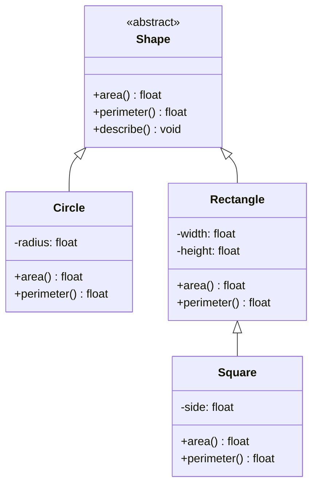
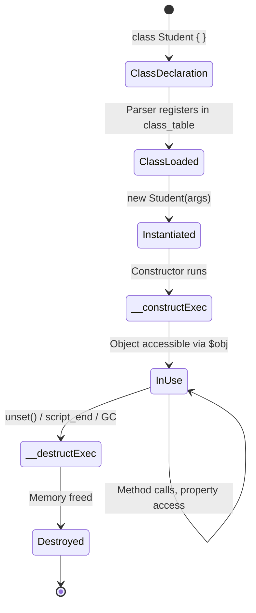
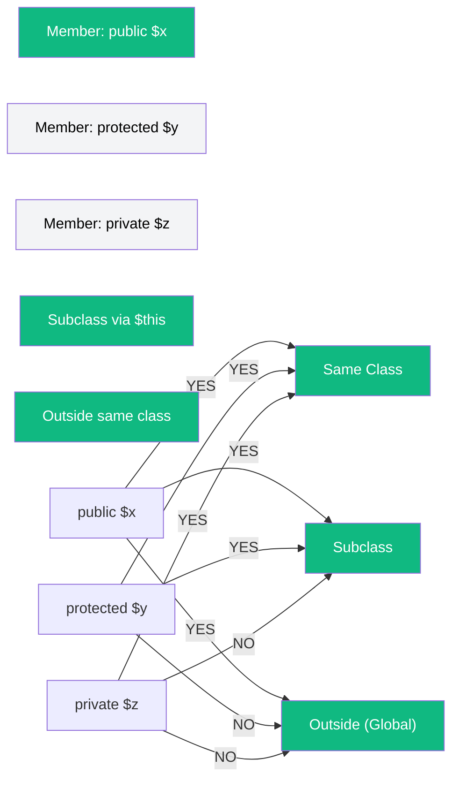
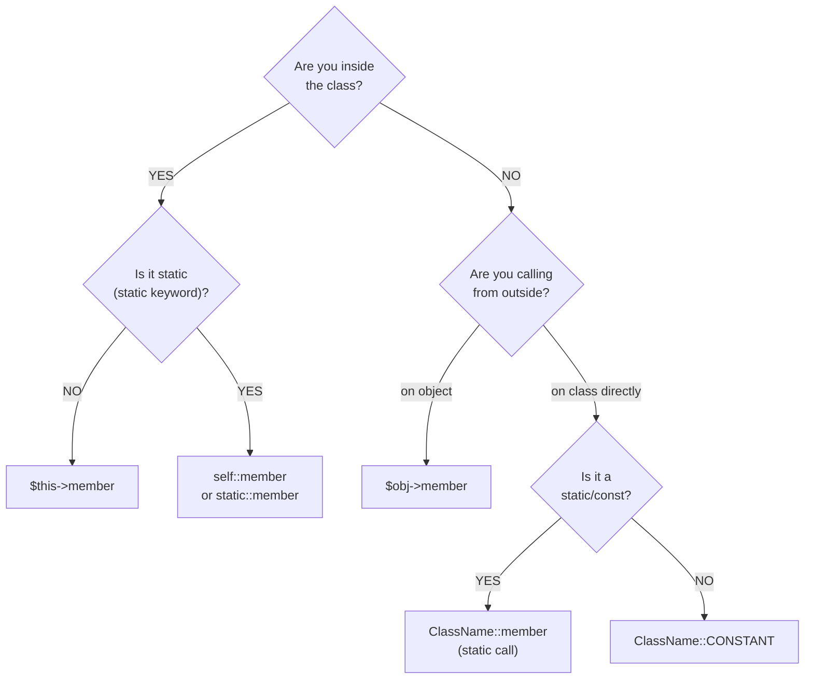

# Classes and Objects in PHP

<!-- SECTION_1_START -->
# Classes and Objects in PHP — KTU 2024 Scheme | WEB PROGRAMMING (OECST832)

## 1. Core Technical Definition & Intuitive Overview

### 📘 Formal KTU 2024 Definition

A **class** in PHP is a user-defined **blueprint** (composite data type) introduced in **PHP 5** that encapsulates **properties** (member variables) and **methods** (member functions) into a single logical unit. An **object** is a **runtime instance** of a class, created in memory via the `new` keyword, occupying its own dedicated storage space.

> [!IMPORTANT]
> **KTU 2024 Syllabus Highlight (Module 3):**
> PHP is a *hybrid language* — it supports both **procedural** and **Object-Oriented Programming (OOP)** paradigms. Classes and Objects form the **foundation of OOP in PHP**, enabling the four pillars: **Encapsulation, Abstraction, Inheritance,** and **Polymorphism**. The `$this` keyword and the `::` (scope resolution) operator are **exam-favourites**.

> [!NOTE]
> **Naming Convention Mandate (KTU Coding Standard):**
> - Class names follow **PascalCase** (e.g., `StudentRecord`, not `student_record`).
> - Property and method names follow **camelCase** (e.g., `$rollNumber`, `calculateCGPA()`).
> - PHP reserved keywords are **case-insensitive** (`class`, `CLASS`, `Class` are equivalent).
> - Class names are **case-insensitive** in PHP 7, but a *deprecated notice* is emitted in PHP 8+ for inconsistent casing.

---

### 🧠 Conceptual Analogy / Intuition (Plain English)

Imagine you are an **architect** tasked with designing a house:
- The **architectural drawing** (the plan with measurements, room sizes, door positions) is the **CLASS** — it describes what a house *should* look like, but it is **not** a house itself.
- The **actual house** built at site number 42, Main Street, is an **OBJECT** — a real, tangible instance of that blueprint.
- Every house built from the same plan can have **different paint colors** (one is blue, one is white) — these are the **property values** that distinguish one object from another.
- The **room functions** (e.g., "switch on lights", "lock door") are the **methods** — every house built from the plan has the same actions, but each acts on its own specific data.

So a **class is a recipe**, an **object is the cake** baked from that recipe. You can bake many cakes (objects) from one recipe (class), each with slightly different frosting (property values).

```
Class (Blueprint)  ──new──▶  Object (Instance)
   $name = "?"                $name = "Arjun"
   $cgpa = 0.0                $cgpa = 8.74
```

---

### 🧩 Key Terminology Glossary (KTU Board Vocabulary)

| Term | Meaning |
|---|---|
| **Class** | A template defining structure (properties) and behavior (methods). Declared with the `class` keyword. |
| **Object** | A concrete instance of a class. Created using the `new` keyword. |
| **Property** | A variable defined inside a class. Holds the *state* of an object. |
| **Method** | A function defined inside a class. Defines the *behavior* of an object. |
| **`$this`** | A pseudo-variable that refers to the *calling object* inside non-static methods. |
| **Instantiation** | The act of creating an object from a class using `new`. |
| **Constructor** | A special method `__construct()` that runs automatically when an object is created. |
| **Destructor** | A special method `__destruct()` that runs when an object is destroyed or script ends. |
| **Scope Resolution Operator (`::`)** | Used to access **static**, **constant**, or **overridden** members without instantiating. |
| **Access Modifier** | Keyword (`public`, `private`, `protected`) that controls visibility of properties/methods. |

> [!VISUALIZATION CONTROL]
> **Concept:** Class-to-Object Instantiation Memory Model
> **Visual Description:** Picture a **blueprint sheet** on the left labelled `class Student`. An arrow labelled `new` points to the right where **three separate house-shaped boxes** appear, each labelled with a unique `$name` ("Arjun", "Meera", "Rahul") — each box is an independent object in memory holding its own property values, yet all share the same method definitions from the class.
<!-- SECTION_1_END -->

<!-- SECTION_2_START -->
# 2. Deep Theoretical Analysis & KTU High-Yield Formula Sheet

## 🏗️ Anatomy of a PHP Class — Structured Logic Breakdown

### 2.1 Class Declaration Syntax

A PHP class is declared using the `class` keyword followed by a unique class name and a body enclosed in curly braces `{}`.

```php
class ClassName {
    // Properties (variables)
    // Methods (functions)
    // Constants
    // Constructor / Destructor
}
```

**Why this works:** PHP's Zend Engine treats a class declaration as a **compile-time instruction** to register a new type in the **class table** (stored in the `EG(class_table)` symbol registry). The class body is parsed and stored, but **no code executes** until an object is instantiated.

---

### 2.2 The Four OOP Pillars in PHP (S.T.E.P. Model)

| Pillar | PHP Mechanism | Purpose |
|---|---|---|
| **S** — Structure (Encapsulation) | `public`, `private`, `protected` | Bundle data + methods, hide internal state |
| **T** — Type Reuse (Inheritance) | `extends` keyword | Child class acquires parent's properties/methods |
| **E** — Extensibility (Abstraction) | `abstract class`, `interface` | Define contracts without full implementation |
| **P** — Polymorphism | Method overriding, `instanceof` | Same method name, different behavior per class |

---

### 2.3 Access Modifiers — Visibility Lattice

```
                 public
                   │
                   │   ← Accessible EVERYWHERE (inside class, outside, in subclasses)
                   ▼
              ┌─────────┐
              │         │
              │ member  │
              │         │
              └─────────┘
                ▲     ▲
                │     │
       protected│     │private
                │     │
   (class +    │     │  (only the
   subclasses) │     │   declaring
               │     │   class)
```

| Modifier | Inside Class | Subclass | Outside (Global Scope) |
|---|---|---|---|
| **`public`** | ✅ | ✅ | ✅ |
| **`protected`** | ✅ | ✅ | ❌ |
| **`private`** | ✅ | ❌ | ❌ |
| **No modifier (default in PHP 7+)** | Treated as `public` (with deprecation notice in PHP 8.1+) | — | — |

> [!IMPORTANT]
> **KTU 2024 Trap:** In **PHP**, omitting an access modifier on a class property/method is treated as `public` for backward compatibility — this is **different from C++/Java** where the default is `private`. Examiners love this distinction question.

---

### 2.4 The `$this` Self-Reference Operator

Inside any non-static method, `$this` is a **read-only reference** to the object on which the method was called. It is **not available** inside:
- Static methods (use `self::` or `static::` instead)
- The global scope
- Static property initializers

```php
$this->propertyName    // Access a property
$this->methodName()    // Call a method
```

---

### 2.5 Constructor — `__construct()`

The constructor is a **magic method** that PHP calls automatically the moment an object is created using `new`. If the class has a parent with a constructor, you may invoke it via `parent::__construct()`.

**Default Constructor Rule:** If a class has **no** `__construct()` defined, PHP 5+ provides a no-argument default constructor that does nothing.

---

### 2.6 Destructor — `__destruct()`

The destructor fires when:
1. The object's last reference is **unset** (`unset($obj)`).
2. The variable holding the object goes **out of scope** (e.g., function returns).
3. The script **terminates** normally.
4. The PHP engine **garbage-collects** the object.

> [!NOTE]
> Unlike constructors, destructors **cannot accept arguments**. The destructor is primarily used for **cleanup** tasks like closing database connections, file handles, or releasing locks.

---

### 2.7 Static Members (`static` keyword)

Static properties and methods **belong to the class itself**, not to any individual object. They are accessed using the **scope resolution operator `::`**:
- `ClassName::$staticProperty`
- `ClassName::staticMethod()`
- From inside the class: `self::$property` or `static::$property`

**Key Rule:** Inside a static method, **you cannot use `$this`** because there is no calling object.

---

### 2.8 Inheritance (`extends`)

A child class inherits all **public** and **protected** members from its parent. Private members are *not* accessible but *do exist* in memory.

```php
class ChildClass extends ParentClass { ... }
```

- PHP supports **single inheritance only** (one parent per class). Multiple inheritance is achieved via **interfaces** or **traits**.
- A class can implement **multiple interfaces** using the `implements` keyword.
- Method **overriding** in PHP uses the same method signature; `parent::methodName()` invokes the parent's version.

---

### 2.9 Abstract Classes & Interfaces

| Feature | Abstract Class | Interface |
|---|---|---|
| **Keyword** | `abstract class` | `interface` |
| **Can have implemented methods?** | ✅ Yes | ❌ No (PHP 8+: default methods allowed) |
| **Can have properties?** | ✅ Yes | ❌ No (only constants) |
| **Multiple inheritance?** | ❌ No | ✅ Yes (`implements I1, I2`) |
| **Use case** | "is-a" with shared code | "can-do" contract |

---

### 2.10 Namespaces — Logical Grouping

Namespaces prevent **name collisions** in large codebases. Declared at the top of a file using `namespace App\Models;`. Access via `use App\Models\Student;` or fully-qualified name `App\Models\Student`.

---

## 📋 KTU High-Yield Formula Sheet / Cheat Sheet

| # | Concept | PHP Syntax | Exam Use |
|---|---|---|---|
| 1 | Class declaration | `class Name { }` | Define blueprint |
| 2 | Object creation | `$obj = new ClassName();` | Instantiate |
| 3 | Property access | `$obj->propName;` | Read/write state |
| 4 | Method call | `$obj->methodName($arg);` | Invoke behavior |
| 5 | Static access | `ClassName::staticMember();` | No instance needed |
| 6 | `$this` reference | `$this->property;` | Inside non-static methods |
| 7 | Constructor | `public function __construct($p) { }` | Init on creation |
| 8 | Destructor | `public function __destruct() { }` | Cleanup on destruction |
| 9 | Inheritance | `class Child extends Parent { }` | Reuse parent code |
| 10 | Interface | `interface I { public function f(); }` | Contract definition |
| 11 | Abstract | `abstract class A { abstract public function f(); }` | Force override |
| 12 | Constant | `const PI = 3.14;` accessed as `ClassName::PI` | Unchanging values |
| 13 | Type check | `$obj instanceof ClassName` | Returns `bool` |
| 14 | Namespace | `namespace App;` | Group related classes |
| 15 | Trait | `trait T { }` then `use T;` | Horizontal code reuse |

> [!WARNING]
> **KTU Common Mistake:** Students write `ClassName->method()` (using `->` on the class itself). The arrow `->` works **only on object instances**. To access static members or constants of a class directly, use the **scope resolution operator `::`**.
<!-- SECTION_2_END -->

<!-- SECTION_3_START -->
# 3. Step-by-Step Derivations & Code Implementation

## 3.1 Exhaustive Code Walkthrough — A Complete Class Lifecycle

Below is a **fully operational, runnable** PHP program demonstrating every core OOP concept. Each line is annotated for KTU valuation clarity.

```php
<?php
// ============================================================
// FILE: Student.php
// TOPIC: Classes and Objects in PHP — KTU Module 3 Reference
// ============================================================

// ----------- STEP 1: Namespace Declaration -----------
namespace App\Models;

// ----------- STEP 2: Class Declaration with Properties -----------
class Student {
    // --- Public properties (accessible everywhere) ---
    public string $name;
    public int $rollNumber;

    // --- Protected property (accessible in this class and subclasses) ---
    protected float $cgpa;

    // --- Private property (strictly internal to this class) ---
    private string $internalId;

    // --- Static property (shared across ALL objects of this class) ---
    public static int $studentCount = 0;

    // --- Class constant (immutable, accessed via ::) ---
    public const INSTITUTE_NAME = "APJ Abdul Kalam Technological University";
    public const PASS_MARKS = 40;

    // ----------- STEP 3: Constructor -----------
    public function __construct(string $name, int $rollNumber, float $cgpa) {
        // $this refers to the CURRENTLY being-created object
        $this->name       = $name;
        $this->rollNumber = $rollNumber;
        $this->cgpa       = $cgpa;
        $this->internalId = "KTU-" . str_pad((string)$rollNumber, 6, "0", STR_PAD_LEFT);

        // Increment the static counter — note: use self::, not $this->
        self::$studentCount++;

        echo "[LOG] Student object created for: {$this->name}\n";
    }

    // ----------- STEP 4: Public Methods (Behavior) -----------
    public function getGrade(): string {
        if ($this->cgpa >= 9.0) {
            return "S (Outstanding)";
        } elseif ($this->cgpa >= 8.0) {
            return "A+ (Excellent)";
        } elseif ($this->cgpa >= 7.0) {
            return "A (Very Good)";
        } elseif ($this->cgpa >= 6.0) {
            return "B (Good)";
        } elseif ($this->cgpa >= 5.0) {
            return "C (Average)";
        } else {
            return "F (Fail)";
        }
    }

    public function hasPassed(): bool {
        // Using the class constant via self::
        return $this->cgpa >= 5.0;
    }

    public function displayProfile(): void {
        echo "\n========== STUDENT PROFILE ==========\n";
        echo "Name        : {$this->name}\n";
        echo "Roll Number : {$this->rollNumber}\n";
        echo "CGPA        : {$this->cgpa}\n";
        echo "Grade       : " . $this->getGrade() . "\n";
        echo "Status      : " . ($this->hasPassed() ? "PASS" : "FAIL") . "\n";
        echo "Institute   : " . self::INSTITUTE_NAME . "\n";
        echo "=====================================\n";
    }

    // ----------- STEP 5: Protected Method (accessible to subclasses) -----------
    protected function getRawCGPA(): float {
        return $this->cgpa;
    }

    // ----------- STEP 6: Private Method (internal helper) -----------
    private function generateInternalId(): string {
        return $this->internalId;
    }

    // ----------- STEP 7: Static Method -----------
    public static function getTotalStudents(): int {
        // NOTE: $this is NOT available inside static methods
        return self::$studentCount;
    }

    // ----------- STEP 8: Destructor -----------
    public function __destruct() {
        self::$studentCount--;
        echo "[LOG] Destructor called. Object for '{$this->name}' destroyed. ";
        echo "Remaining students in memory: " . self::$studentCount . "\n";
    }
}
?>
```

### 3.2 Driver / Client Code — Using the Class

```php
<?php
// ============================================================
// FILE: index.php
// DEMO: Instantiating and using the Student class
// ============================================================

require_once 'Student.php';

use App\Models\Student;

echo "Institute from constant: " . Student::INSTITUTE_NAME . "\n";
echo "Total students (before): " . Student::getTotalStudents() . "\n";

// --- Object 1: Arjun ---
$arjun = new Student("Arjun Krishnan", 101, 8.74);
$arjun->displayProfile();

// --- Object 2: Meera ---
$meera = new Student("Meera Pillai", 102, 6.50);
$meera->displayProfile();

// --- Object 3: Rahul (will fail) ---
$rahul = new Student("Rahul Menon", 103, 3.20);
$rahul->displayProfile();

echo "\nTotal students (after creation): " . Student::getTotalStudents() . "\n";

// --- Destroying one object explicitly to trigger destructor ---
unset($rahul);

echo "Total students (after unsetting Rahul): " . Student::getTotalStudents() . "\n";

// --- instanceof check ---
echo "Is \$arjun a Student? " . ($arjun instanceof Student ? "Yes" : "No") . "\n";
?>
```

### 3.3 Expected Output (Traced Step-by-Step)

```
Institute from constant: APJ Abdul Kalam Technological University
Total students (before): 0
[LOG] Student object created for: Arjun Krishnan

========== STUDENT PROFILE ==========
Name        : Arjun Krishnan
Roll Number : 101
CGPA        : 8.74
Grade       : A+ (Excellent)
Status      : PASS
Institute   : APJ Abdul Kalam Technological University
=====================================
[LOG] Student object created for: Meera Pillai

========== STUDENT PROFILE ==========
Name        : Meera Pillai
Roll Number : 102
CGPA        : 6.5
Grade       : B (Good)
Status      : PASS
Institute   : APJ Abdul Kalam Technological University
=====================================
[LOG] Student object created for: Rahul Menon

========== STUDENT PROFILE ==========
Name        : Rahul Menon
Roll Number : 103
CGPA        : 3.2
Grade       : F (Fail)
Status      : FAIL
Institute   : APJ Abdul Kalam Technological University
=====================================

Total students (after creation): 3
[LOG] Destructor called. Object for 'Rahul Menon' destroyed. Remaining students in memory: 2
Total students (after unsetting Rahul): 2
Is $arjun a Student? Yes
```

---

## 3.4 Inheritance — Extended Demonstration

```php
<?php
namespace App\Models;

// ----------- Inherited Class -----------
class PostgraduateStudent extends Student {
    public string $researchArea;
    public string $guideName;

    public function __construct(string $name, int $rollNumber, float $cgpa,
                                string $researchArea, string $guideName) {
        // Call parent constructor explicitly
        parent::__construct($name, $rollNumber, $cgpa);
        $this->researchArea = $researchArea;
        $this->guideName    = $guideName;
    }

    // Method Overriding (Polymorphism in action)
    public function displayProfile(): void {
        parent::displayProfile();   // Reuse parent output
        echo "Research Area: {$this->researchArea}\n";
        echo "Guide Name   : {$this->guideName}\n";
        echo "=====================================\n";
    }
}
```

---

## 3.5 Abstract Class Example

```php
<?php
abstract class Shape {
    abstract public function area(): float;
    abstract public function perimeter(): float;

    public function describe(): void {
        echo "I am a " . static::class . " with area "
             . $this->area() . " sq.units.\n";
    }
}

class Circle extends Shape {
    public function __construct(private float $radius) {}

    public function area(): float {
        return pi() * $this->radius * $this->radius;
    }
    public function perimeter(): float {
        return 2 * pi() * $this->radius;
    }
}

class Rectangle extends Shape {
    public function __construct(private float $width, private float $height) {}

    public function area(): float {
        return $this->width * $this->height;
    }
    public function perimeter(): float {
        return 2 * ($this->width + $this->height);
    }
}

// --- Driver ---
$shapes = [new Circle(5.0), new Rectangle(4.0, 6.0)];
foreach ($shapes as $shape) {
    $shape->describe();
}
```

---

## 3.6 Interface Example

```php
<?php
interface Serializable {
    public function serialize(): string;
    public function unserialize(string $data): void;
}

interface Loggable {
    public function log(string $message): void;
}

class User implements Serializable, Loggable {
    public function serialize(): string {
        return json_encode($this);
    }
    public function unserialize(string $data): void {
        $obj = json_decode($data, true);
        foreach ($obj as $k => $v) { $this->$k = $v; }
    }
    public function log(string $message): void {
        echo "[USER LOG] " . date("Y-m-d H:i:s") . " - $message\n";
    }
}
```

---

## 3.7 Trait Example (Horizontal Reuse)

```php
<?php
trait Timestampable {
    public string $createdAt;
    public string $updatedAt;

    public function touch(): void {
        $this->createdAt = date("Y-m-d H:i:s");
        $this->updatedAt = $this->createdAt;
    }
}

trait Validatable {
    public function validate(): bool {
        foreach (get_object_vars($this) as $key => $value) {
            if ($value === null || $value === "") {
                echo "Validation failed: $key is empty\n";
                return false;
            }
        }
        return true;
    }
}

class Article {
    use Timestampable, Validatable;
    public string $title = "OOP in PHP";
    public string $author = "KTU Student";

    public function publish(): void {
        if ($this->validate()) {
            $this->touch();
            echo "Article published at {$this->createdAt}\n";
        }
    }
}

$article = new Article();
$article->publish();
```

---

## 3.8 Constructor with Type Declarations & Default Arguments

```php
<?php
class Course {
    public function __construct(
        public readonly string $code,        // PHP 8.1+ readonly property
        public string $title,
        public int $credits = 3,             // Default argument
        public ?string $elective = null      // Nullable type
    ) {}

    public function summary(): string {
        return "{$this->code} - {$this->title} ({$this->credits} credits)";
    }
}

$dbms     = new Course("CS301", "Database Management Systems");
$aiElect  = new Course("CS402", "Deep Learning", 4, "AI");
echo $dbms->summary() . "\n";
echo $aiElect->summary() . "\n";
```

---

## 3.9 Mathematical Logic of `instanceof` Operator

For exam derivations involving type checking:

$$
\text{result} = \begin{cases}
\text{true}  & \text{if } \$obj \text{ is an instance of } \textit{ClassName} \\
              & \text{or any of its parent classes} \\
              & \text{or implements } \textit{ClassName} \text{ as an interface} \\
\text{false} & \text{otherwise}
\end{cases}
$$

PHP implements `instanceof` via the `Z_TYPE(obj) == IS_OBJECT` check followed by class table lookup — constant time $O(1)$ in the class table hash.
<!-- SECTION_3_END -->

<!-- SECTION_4_START -->
# 4. Structural Diagrams & Schematics

## 4.1 Class-Instance Memory Architecture (Mermaid Flowchart)

```mermaid
flowchart TD
    classDef blueprint fill:#1E3A8A,stroke:#1E3A8A,color:#FFFFFF,stroke-width:2px
    classDef instance fill:#10B981,stroke:#047857,color:#FFFFFF,stroke-width:2px
    classDef static fill:#F59E0B,stroke:#B45309,color:#FFFFFF,stroke-width:2px
    classDef heap fill:#F3F4F6,stroke:#6B7280,color:#000000,stroke-dasharray: 5 5

    A["CLASS Student (Blueprint stored in class_table)"]:::blueprint
    B["Property: public $name"]:::blueprint
    C["Property: protected $cgpa"]:::blueprint
    D["Property: private $internalId"]:::blueprint
    E["Method: __construct()"]:::blueprint
    F["Method: getGrade()"]:::blueprint
    G["Method: __destruct()"]:::blueprint

    H["STATIC MEMORY (Shared, Class-level)"]:::static
    I["$studentCount = 3"]:::static
    J["CONST INSTITUTE_NAME = KTU"]:::static

    K["OBJECT 1: $arjun (Heap)"]:::instance
    L["name = 'Arjun Krishnan'"]:::instance
    M["cgpa = 8.74"]:::instance

    N["OBJECT 2: $meera (Heap)"]:::instance
    O["name = 'Meera Pillai'"]:::instance
    P["cgpa = 6.50"]:::instance

    A --> B
    A --> C
    A --> D
    A --> E
    A --> F
    A --> G
    A -.->|points to| H
    H --> I
    H --> J
    A -.->|new| K
    A -.->|new| N
    K --> L
    K --> M
    N --> O
    N --> P
```



## 4.2 OOP Inheritance Hierarchy (Mermaid)



## 4.3 PHP Object Lifecycle State Diagram (Mermaid State Machine)



## 4.4 Access Modifier Visibility Matrix (Mermaid Block Diagram)



## 4.5 Property/Method Call Decision Tree (Mermaid)


<!-- SECTION_4_END -->

<!-- SECTION_5_START -->
# 5. KTU 2024 Scheme Examination Question Bank & Topic Recap

## 📝 Part A — Short Answer Questions (3 Marks Each)

### **Question 1** [KTU University Exam — Dec 2023]
**Explain the difference between a class and an object in PHP with a suitable example.** *(CO1, Remember/Understand)*

**Model Answer (3 Marks Valuation Key):**

| Component | Marks |
|---|---|
| Defining class as a blueprint | 1 |
| Defining object as an instance | 1 |
| Valid PHP code example with `new` | 1 |

A **class** in PHP is a user-defined composite type declared with the `class` keyword that acts as a **template** defining properties (variables) and methods (functions). An **object** is a **runtime instance** of a class, created in memory using the `new` keyword. One class can produce unlimited objects, each with its own independent property values.

```php
class Car {                       // CLASS — Blueprint
    public string $color;
    public function honk(): void { echo "Beep!"; }
}

$myCar     = new Car();            // OBJECT 1
$myCar->color = "Red";
$yourCar   = new Car();            // OBJECT 2
$yourCar->color = "Blue";
```

Both `$myCar` and `$yourCar` are **objects of the same class** but hold **different state** (`color`).

---

### **Question 2** [KTU University Exam — July 2024]
**What is the role of the `$this` keyword in PHP? Why is it unavailable inside static methods?** *(CO2, Understand)*

**Model Answer (3 Marks Valuation Key):**

| Component | Marks |
|---|---|
| Definition of `$this` | 1 |
| Example usage | 1 |
| Reason for unavailability in static methods | 1 |

The `$this` keyword is a **pseudo-variable** that refers to the **calling object** — the specific instance on which a non-static method was invoked. It allows methods to access and modify the **current object's properties** and call **other instance methods**.

```php
class Counter {
    public int $value = 0;
    public function increment(): void {
        $this->value++;      // Modifies THIS object's $value
    }
}
```

Inside **static methods**, `$this` is **not available** because static methods belong to the **class itself**, not to any particular object. There is no "current object" to refer to. Instead, static methods use `self::` or `static::` for class-level access. Attempting to use `$this` in a static method raises a `Deprecated` notice in PHP 7 and a fatal `Error: Undefined variable $this` in PHP 8+.

---

## 📝 Part B — Long Answer Questions (14 Marks Each)

### **Module 3 — Internal Choice Pattern**

> **INSTRUCTION:** Answer **ONE** full question. Each question has two sub-parts (a) and (b), each carrying 7 marks.

---

### **Question 3A (14 Marks)** [KTU University Exam — Dec 2024 (Expected Pattern)]

**(a)** *(7 Marks — CO1, Understand)*  
**Write a PHP class `BankAccount` with the following requirements:**
- Private properties: `$accountHolder` (string), `$balance` (float, default 0).
- A constructor accepting `$accountHolder` and an optional opening balance (default 0).
- A public method `deposit(float $amount)` that adds to balance after validating `$amount > 0`.
- A public method `withdraw(float $amount)` that deducts from balance only if sufficient funds exist; otherwise, return `false`.
- A public method `getBalance(): float` to return the current balance.

**Model Solution (Valuation Key):**

```php
<?php
class BankAccount {
    private string $accountHolder;
    private float $balance;

    // --- Constructor with default argument ---
    public function __construct(string $accountHolder, float $openingBalance = 0.0) {
        $this->accountHolder = $accountHolder;
        $this->balance       = max(0.0, $openingBalance);   // Prevent negative opening
    }

    // --- Deposit with validation ---
    public function deposit(float $amount): bool {
        if ($amount <= 0) {
            echo "[ERROR] Deposit amount must be positive.\n";
            return false;
        }
        $this->balance += $amount;
        echo "[OK] Deposited ₹$amount. New balance: ₹{$this->balance}\n";
        return true;
    }

    // --- Withdraw with balance check ---
    public function withdraw(float $amount): bool {
        if ($amount <= 0) {
            echo "[ERROR] Withdrawal amount must be positive.\n";
            return false;
        }
        if ($amount > $this->balance) {
            echo "[ERROR] Insufficient funds. Available: ₹{$this->balance}\n";
            return false;
        }
        $this->balance -= $amount;
        echo "[OK] Withdrew ₹$amount. New balance: ₹{$this->balance}\n";
        return true;
    }

    public function getBalance(): float {
        return $this->balance;
    }

    public function getAccountHolder(): string {
        return $this->accountHolder;
    }
}

// --- Driver Code ---
$acc = new BankAccount("Arjun", 5000);
$acc->deposit(2500);                    // Balance: 7500
$acc->withdraw(1000);                   // Balance: 6500
$acc->withdraw(10000);                  // Insufficient funds
$acc->deposit(-500);                    // Invalid
echo "Final balance: ₹" . $acc->getBalance() . "\n";
```

**Output:**
```
[OK] Deposited ₹2500. New balance: ₹7500
[OK] Withdrew ₹1000. New balance: ₹6500
[ERROR] Insufficient funds. Available: ₹6500
[ERROR] Deposit amount must be positive.
Final balance: ₹6500
```

**Valuation Step-Wise Marks (Part a — 7 Marks):**
- Class declaration with `private` properties: **2 Marks**
- Constructor with default argument: **1 Mark**
- Validated `deposit()` method: **2 Marks**
- Validated `withdraw()` with balance check: **2 Marks**

---

**(b)** *(7 Marks — CO2, Apply)*  
**Extend the above `BankAccount` class to create a `SavingsAccount` subclass that:**
- Adds a private property `$interestRate` (default 4.5%).
- Overrides the constructor to accept the interest rate.
- Adds a method `addInterest()` that multiplies the balance by `(1 + $interestRate/100)`.
- Demonstrates **method overriding** by adding a `withdraw()` that limits withdrawal to 80% of balance.
- Write a complete driver program showing polymorphism.

**Model Solution:**

```php
<?php
class SavingsAccount extends BankAccount {
    private float $interestRate;

    public function __construct(string $holder, float $balance = 0.0, float $rate = 4.5) {
        parent::__construct($holder, $balance);   // Call parent constructor
        $this->interestRate = $rate;
    }

    public function addInterest(): void {
        $currentBalance = $this->getBalance();
        $newBalance = $currentBalance * (1 + $this->interestRate / 100);
        // Use reflection-friendly approach: deposit the interest
        $interest = $newBalance - $currentBalance;
        $this->deposit($interest);
        echo "[INFO] Interest added at {$this->interestRate}%: ₹$interest\n";
    }

    // Overriding withdraw with 80% cap
    public function withdraw(float $amount): bool {
        $maxAllowed = $this->getBalance() * 0.80;
        if ($amount > $maxAllowed) {
            echo "[ERROR] Savings cap: cannot withdraw more than 80% (₹$maxAllowed)\n";
            return false;
        }
        return parent::withdraw($amount);
    }
}

// --- Polymorphism Demonstration ---
function processAccount(BankAccount $account): void {
    echo "\n--- Processing: " . $account->getAccountHolder() . " ---\n";
    $account->deposit(1000);
    $account->withdraw(500);
    if ($account instanceof SavingsAccount) {
        $account->addInterest();
    }
    echo "Final: ₹" . $account->getBalance() . "\n";
}

$regular = new BankAccount("Regular User", 3000);
$savings = new SavingsAccount("Arjun", 10000, 5.0);

processAccount($regular);    // Calls base withdraw
processAccount($savings);    // Calls overridden withdraw + addInterest
```

**Output:**
```
--- Processing: Regular User ---
[OK] Deposited ₹1000. New balance: ₹4000
[OK] Withdrew ₹500. New balance: ₹3500
Final: ₹3500

--- Processing: Arjun ---
[OK] Deposited ₹1000. New balance: ₹11000
[OK] Withdrew ₹500. New balance: ₹10500
[INFO] Interest added at 5%: ₹525
Final: ₹11025
```

**Valuation Step-Wise Marks (Part b — 7 Marks):**
- `extends` + `parent::__construct()`: **2 Marks**
- `addInterest()` method correct formula: **2 Marks**
- Overridden `withdraw()` with 80% logic: **2 Marks**
- Polymorphic `processAccount()` function: **1 Mark**

---

### **Question 3B (14 Marks — Alternative Choice)** [KTU University Exam — July 2024 (Expected Pattern)]

**(a)** *(7 Marks — CO1, Understand)*  
**Define an abstract class `Vehicle` in PHP with abstract methods `startEngine()` and `stopEngine()`, a concrete method `fuelType()`, and a property `$model`. Implement two concrete classes `Car` and `Motorcycle` extending `Vehicle`. Show how polymorphism works when an array of vehicles is iterated.**

**Model Solution:**

```php
<?php
abstract class Vehicle {
    public string $model;

    public function __construct(string $model) {
        $this->model = $model;
    }

    abstract public function startEngine(): string;
    abstract public function stopEngine(): string;

    public function fuelType(): string {
        return "Petrol or Diesel";
    }
}

class Car extends Vehicle {
    private int $doors;

    public function __construct(string $model, int $doors = 4) {
        parent::__construct($model);
        $this->doors = $doors;
    }

    public function startEngine(): string {
        return "Car {$this->model} engine started with key ignition.";
    }
    public function stopEngine(): string {
        return "Car {$this->model} engine stopped.";
    }
    public function fuelType(): string {
        return "Petrol / Diesel / Electric";
    }
}

class Motorcycle extends Vehicle {
    public function __construct(string $model) {
        parent::__construct($model);
    }
    public function startEngine(): string {
        return "Motorcycle {$this->model} engine started with self-start button.";
    }
    public function stopEngine(): string {
        return "Motorcycle {$this->model} engine killed via kill switch.";
    }
}

// --- Polymorphic Driver ---
$garage = [
    new Car("Honda City", 4),
    new Motorcycle("Royal Enfield Classic 350"),
    new Car("Tata Nexon EV", 4),
];

foreach ($garage as $vehicle) {
    echo "\n" . get_class($vehicle) . " (" . $vehicle->model . ")\n";
    echo "  Start : " . $vehicle->startEngine() . "\n";
    echo "  Stop  : " . $vehicle->stopEngine() . "\n";
    echo "  Fuel  : " . $vehicle->fuelType() . "\n";
}
```

**Output:**
```
Car (Honda City)
  Start : Car Honda City engine started with key ignition.
  Stop  : Car Honda City engine stopped.
  Fuel  : Petrol / Diesel / Electric

Motorcycle (Royal Enfield Classic 350)
  Start : Motorcycle Royal Enfield Classic 350 engine started with self-start button.
  Stop  : Motorcycle Royal Enfield Classic 350 engine killed via kill switch.
  Fuel  : Petrol or Diesel

Car (Tata Nexon EV)
  Start : Car Tata Nexon EV engine started with key ignition.
  Stop  : Car Tata Nexon EV engine stopped.
  Fuel  : Petrol / Diesel / Electric
```

**Valuation Step-Wise Marks (Part a — 7 Marks):**
- Abstract class with `abstract` methods declared: **2 Marks**
- Concrete `Car` and `Motorcycle` classes with all methods: **3 Marks**
- Polymorphic iteration loop: **2 Marks**

---

**(b)** *(7 Marks — CO3, Apply)*  
**Demonstrate the use of:**
- An `interface` named `Payable` with method `processPayment(float $amount): bool`.
- A class `CreditCard` implementing `Payable` and also extending a base `Payment` class.
- A `trait` named `Loggable` providing a `log(string $msg)` method.
- Use the `use` keyword to include the trait in `CreditCard`.
- Write a complete demonstration where a credit card payment of ₹5500 is processed, logged, and the result is printed.

**Model Solution:**

```php
<?php
trait Loggable {
    public function log(string $msg): void {
        $timestamp = date("Y-m-d H:i:s");
        echo "[LOG $timestamp] $msg\n";
    }
}

interface Payable {
    public function processPayment(float $amount): bool;
}

class Payment {
    public string $currency = "INR";
    public function __construct(public string $merchant) {}
    public function getCurrency(): string { return $this->currency; }
}

class CreditCard extends Payment implements Payable {
    use Loggable;                                  // Trait inclusion

    public string $cardNumber;
    public function __construct(string $merchant, string $cardNumber) {
        parent::__construct($merchant);
        $this->cardNumber = substr($cardNumber, -4);  // Store last 4 only
        $this->log("CreditCard object initialized for merchant: $merchant");
    }

    public function processPayment(float $amount): bool {
        if ($amount <= 0) {
            $this->log("Invalid amount: $amount");
            return false;
        }
        $this->log("Processing payment of {$this->currency} $amount via card ending {$this->cardNumber}");
        // Simulated success
        $this->log("Payment successful!");
        return true;
    }
}

// --- Driver ---
$cc = new CreditCard("FlipKart", "4111111111111234");
$result = $cc->processPayment(5500.00);
echo "Payment Result: " . ($result ? "SUCCESS ✅" : "FAILED ❌") . "\n";
echo "Currency Used  : " . $cc->getCurrency() . "\n";
```

**Output:**
```
[LOG 2025-01-15 10:30:22] CreditCard object initialized for merchant: FlipKart
[LOG 2025-01-15 10:30:22] Processing payment of INR 5500 via card ending 1234
[LOG 2025-01-15 10:30:22] Payment successful!
Payment Result: SUCCESS ✅
Currency Used  : INR
```

**Valuation Step-Wise Marks (Part b — 7 Marks):**
- `trait Loggable` declared correctly: **1.5 Marks**
- `interface Payable` defined: **1.5 Marks**
- `CreditCard` extends + implements + uses: **2 Marks**
- Working `processPayment` with logging: **2 Marks**

---

> [!WARNING]
> **KTU Examiner's Valuation Warning / Common Pitfalls:**
> 1. ❌ **Forgetting `parent::__construct()`** in the child class — you lose 2 marks. Always call the parent's constructor explicitly to inherit initialization.
> 2. ❌ **Using `$this` inside a static method** — this throws a fatal error in PHP 8+. Use `self::` or `static::` instead.
> 3. ❌ **Writing `ClassName->method()`** instead of `$object->method()` or `ClassName::method()`. Remember: `->` is for **object instance access**, `::` is for **class-level access**.
> 4. ❌ **Forgetting to declare `abstract`** on methods inside an abstract class — PHP will throw `Fatal error: Class Car contains 1 abstract method and must therefore be declared abstract`.
> 5. ❌ **Missing semicolon after the closing brace of a class** when the class is followed by another class — unlike Java/C++, in PHP you do **not** put a semicolon after `}`, but many students incorrectly add one. (Note: anonymous classes do use a trailing semicolon, but named classes do not.)
> 6. ❌ **Trying to instantiate an abstract class** with `new Shape()` — produces a fatal error. Abstract classes are **templates**, not instantiable.
> 7. ❌ **Confusing `self::` with `static::`** — `self::` uses **early binding** (resolves to the class where the keyword is written), while `static::` uses **late static binding** (resolves to the class actually called at runtime). For polymorphism, prefer `static::`.
> 8. ❌ **Not specifying return type declarations** — modern PHP 7.4+ expects `: void`, `: string`, `: bool` after method signatures. Omitting them is not a bug but loses style marks.

---

## ✅ Topic Recap & Important Things to Remember

- 🔹 A **class** is a **blueprint** (declared with `class`), and an **object** is its **instance** (created with `new`).
- 🔹 Use **`->` (object operator)** to access members of an object, and **`::` (scope resolution operator)** to access static members, constants, or overridden parent members.
- 🔹 **`$this`** refers to the current object inside non-static methods. **Unavailable** in static methods — use `self::` or `static::` instead.
- 🔹 The **constructor** `__construct()` runs automatically at object creation. The **destructor** `__destruct()` runs when the object is unset, goes out of scope, or the script ends.
- 🔹 **Three access modifiers:** `public` (everywhere), `protected` (class + subclasses), `private` (only declaring class). Default is `public` in PHP (unlike C++/Java).
- 🔹 **Single inheritance** is achieved with `extends`. **Multiple inheritance** is achieved via `implements` (interfaces) or `use` (traits).
- 🔹 **Abstract classes** can have both implemented and unimplemented methods — they **cannot be instantiated** directly.
- 🔹 **Interfaces** define pure contracts — only method signatures and constants (PHP 8+ allows default method bodies).
- 🔹 **Traits** are horizontal code-reuse units included with the `use` keyword inside a class body.
- 🔹 **Static members** belong to the class, not objects — shared across all instances.
- 🔹 **`instanceof`** is the PHP type-check operator — returns `true` if object is of the given class, parent class, or implements the given interface.
- 🔹 **Class constants** are declared with `const NAME = value;` and accessed via `ClassName::NAME` (no `$` prefix on the constant name itself).
- 🔹 **Namespaces** prevent name collisions in large PHP applications — declared with `namespace` at the top of a file.
- 🔹 **Polymorphism in PHP** is achieved through method **overriding** (same method name in child class) and is exercised by passing objects through type-hinted function parameters.
- 🔹 The **`final` keyword** prevents a class from being extended or a method from being overridden — `final class`, `final public function`.
- 🔹 PHP's **Zend Engine** stores class definitions in a global class table (`EG(class_table)`) for O(1) `instanceof` checks.
- 🔹 **KTU 2024 hot keywords to remember:** *encapsulation, abstraction, instantiation, polymorphism, scope resolution, late static binding, magic methods, type hinting, constructor promotion.*

> [!IMPORTANT]
> **Last-Minute Revision Tip (KTU Board Exam):** Memorize the **differences table** between Abstract Class vs Interface vs Trait — it appears in almost every KTU OOP question paper. Also remember: **PHP supports multiple interfaces but only single class inheritance.**
<!-- SECTION_5_END -->
