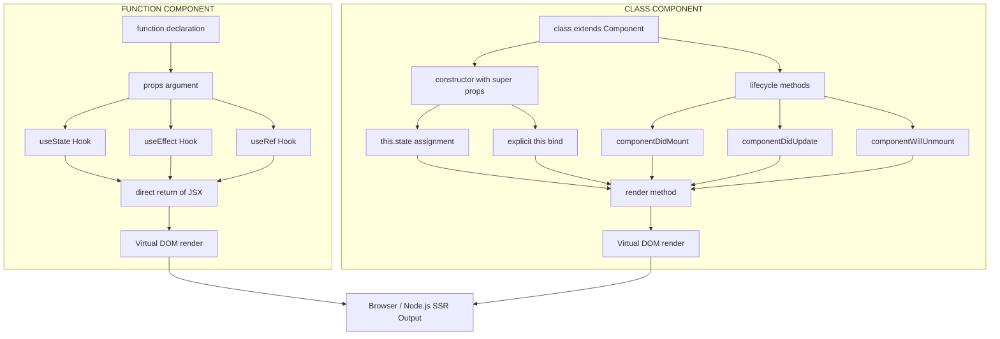
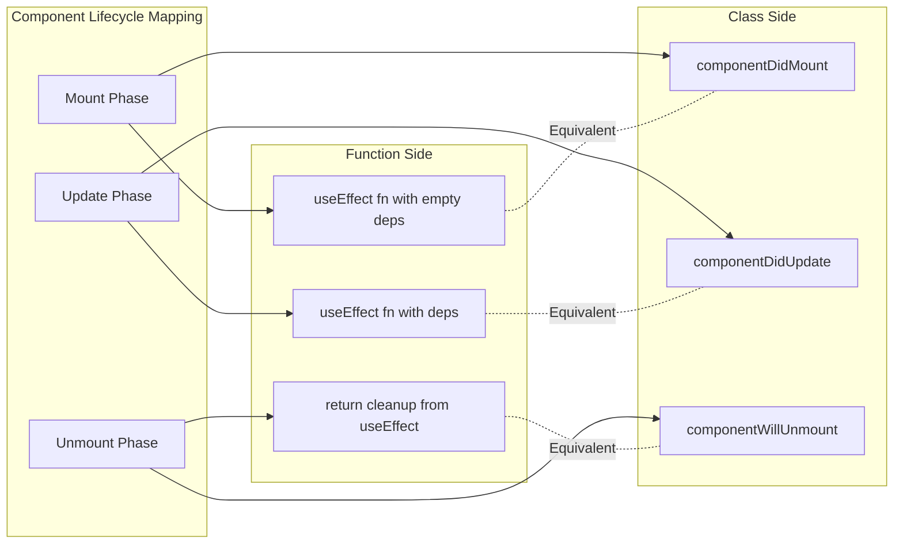
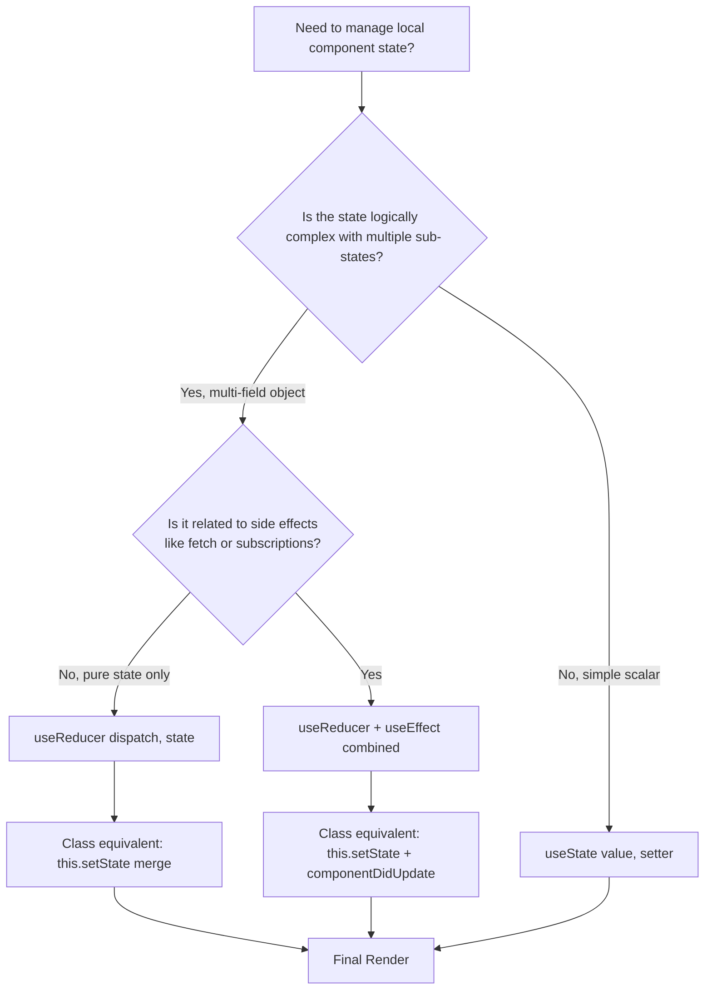

# Differences between Function and Class Components

<!-- SECTION_1_START -->
# Function Components vs Class Components in JavaScript (ES6+)

## 1. Core Technical Definition

### 1.1 Formal Academic Definition

In modern JavaScript (ECMAScript 2015 / ES6 and beyond) and its associated component-based frameworks running on the **Node.js** runtime environment, reusable logical units can be constructed using two distinct syntactic paradigms:

> [!NOTE]
> **Function Component (Functional Paradigm):** A *Function Component* is a plain JavaScript function that accepts a single optional argument (conventionally named `props`) and returns a single React Element (or `null`). It is a stateless or stateful unit defined purely through lexical scoping, closures, and React Hooks introduced in React **16.8**.

> [!IMPORTANT]
> **Class Component (OOP Paradigm):** A *Class Component* is an ES6 `class` that extends the base `React.Component` class (or implements a similar component contract). It **must** override a `render()` lifecycle method that returns a React Element, and it manages internal data through an instance-bound `this.state` object.

In the broader JavaScript (Node.js) ecosystem, this dichotomy extends to *any* reusable logic — the choice between a **factory function** and an **ES6 class** — making it a foundational **Module 3** concept in KTU 2024 *Web Programming*.

### 1.2 Conceptual Analogy / Intuition

Imagine you are ordering coffee at a café:

- A **Function Component** is like ordering coffee through a **self-service kiosk**:
  - You input the parameters (`props`) → it instantly returns the output.
  - No persistent identity, no "memory" between orders unless you attach a sticky note (`useState`).
  - The same machine processes every order; no `this` identity is required.

- A **Class Component** is like ordering coffee from a **dedicated barista**:
  - The barista is a *specific individual* (`this` instance) who carries a notepad (`this.state`).
  - The barista has a morning routine (`componentDidMount`), adjusts during the day (`componentDidUpdate`), and cleans up at closing time (`componentWillUnmount`).
  - Every method is performed by *that specific barista*, requiring `this` binding.

> [!TIP]
> **Engineering takeaway:** Function components are *declarative* and *stateless-by-default*; class components are *imperative* and *stateful-by-inheritance*. The KTU 2024 syllabus emphasizes the functional paradigm because it produces smaller bundle sizes and avoids `this`-binding bugs.

### 1.3 Why This Topic Matters in Node.js Web Development

- **Bundle size:** Function components and Hooks are tree-shakeable, producing smaller production bundles.
- **Server-Side Rendering (SSR):** Node.js frameworks like Next.js prefer functional components for streaming SSR.
- **Concurrency model:** In Node.js, lightweight functional units align better with the **single-threaded event loop**, avoiding the heavier instantiation cost of ES6 classes.
- **Industry standard:** Since 2019, the React core team has officially recommended function components for *all new code*.

<!-- SECTION_1_END -->

<!-- SECTION_2_START -->
# 2. Deep Theoretical Analysis & KTU High-Yield Comparison Sheet

## 2.1 Underlying Theoretical Foundations

### A. The Prototypal vs. Class-Based Inheritance Distinction

JavaScript is fundamentally a **prototypal** language. ES6 `class` syntax is *syntactic sugar* over the prototype chain. This has critical implications:

- A **function** declared with `function` keyword creates a new function object on the heap each render.
- A **class** declared with `class` keyword is **not hoisted** (TDZ — Temporal Dead Zone), and its methods are added to the prototype, *not* to each instance.

### B. The `this` Binding Semantics

The `this` keyword behaves differently in each paradigm:

- **Function Component:** Uses **lexical scoping** for `this` (or, more accurately, does not depend on `this` at all inside the component body).
- **Class Component:** `this` is **dynamically bound** to the instance. If you pass a class method as a callback without arrow-function wrapping, `this` becomes `undefined` in strict mode — a notorious source of runtime bugs in Node.js.

### C. State and Lifecycle Models

| Mechanism | Function Component | Class Component |
|---|---|---|
| State declaration | `const [count, setCount] = useState(0)` | `this.state = { count: 0 }` in constructor |
| State update | `setCount(newValue)` (immutable replacement) | `this.setState({ count: newValue })` (merge model) |
| Mount phase | `useEffect(() => { ... }, [])` | `componentDidMount()` |
| Update phase | `useEffect(() => { ... }, [dep])` | `componentDidUpdate(prevProps, prevState)` |
| Unmount phase | `useEffect(() => { return cleanup }, [])` | `componentWillUnmount()` |
| Refs | `useRef(initialValue)` | `createRef()` in constructor |

> [!IMPORTANT]
> **KTU 2024 Highlight:** A common valuation point is recognizing that `useEffect` with an empty dependency array (`[]`) is the *semantic equivalent* of `componentDidMount + componentWillUnmount`, but **not** of `componentDidUpdate`.

## 2.2 KTU High-Yield Formula / Cheat Sheet

> [!NOTE]
> The following table is the **single most important revision artifact** for this topic. Memorize it for the 3-mark and 14-mark questions.

| \# | Parameter | Function Component | Class Component |
|:--:|---|---|---|
| 1 | Declaration syntax | `function Comp(props) { ... }` | `class Comp extends React.Component { ... }` |
| 2 | Return mechanism | Direct `return` of JSX | Mandatory `render()` method |
| 3 | State container | `useState()` Hook | `this.state` object |
| 4 | State mutator | Setter function from `useState` | `this.setState()` (asynchronous merge) |
| 5 | Lifecycle access | `useEffect` Hook | `componentDidMount` / `componentDidUpdate` / `componentWillUnmount` |
| 6 | `this` keyword usage | Not required | **Required** for `this.state` and `this.props` |
| 7 | Binding of handlers | Auto-bound via closure | Manual `.bind(this)` or arrow class field |
| 8 | Hooks support | **Yes** (`useState`, `useEffect`, `useContext`, etc.) | **No** (cannot call Hooks) |
| 9 | Boilerplate lines | $\approx 3$ lines minimum | $\approx 7+$ lines minimum |
| 10 | Performance profile | Lighter (function re-created) | Heavier (class instance retained) |
| 11 | Code readability | High (declarative) | Moderate (imperative) |
| 12 | PureComponent optimization | `React.memo()` HOC | `shouldComponentUpdate()` or `extends React.PureComponent` |
| 13 | Error boundary | `ErrorBoundary` cannot be functional (pre v18) | `componentDidCatch(error, info)` |
| 14 | Testability | Easier (pure functions) | Harder (requires instance mocking) |
| 15 | Future-proof (KTU 2024) | **Recommended** by React team | Maintained for legacy, no new features |

### 2.3 Real-World Engineering Utility

In production Node.js / full-stack systems, the choice cascades downstream:

- **Microservices with Express.js / Fastify:** Prefer class-based controllers for shared `this.db` connections; prefer functional middlewares for stateless request transformers.
- **Next.js (React on Node.js):** Almost 100% functional components in the `app/` router (Next.js 13+).
- **Testing:** Function components are easier to snapshot-test; class components require `@testing-library/react` `rerender` logic.
- **Memory profiling:** Class instances remain in the heap until `componentWillUnmount` runs; functional closures are GC'd more aggressively, which is critical for **high-throughput Node.js SSR**.

<!-- SECTION_2_END -->

<!-- SECTION_3_START -->
# 3. Step-by-Step Implementations & Code Walkthroughs

## 3.1 Implementation Matrix A — A Counter Component in Both Paradigms

### 3.1.1 Function Component (Modern, Recommended)

```javascript
// File: CounterFunctional.jsx
// Module 3 — JavaScript Runtime Environment / Node.js

import React, { useState, useEffect } from 'react';

// Step 1: Declare a stateless arrow function. No 'this' binding required.
const CounterFunctional = (props) => {

  // Step 2: Declare state using the useState Hook.
  // The destructured tuple is [currentValue, setterFunction].
  const [count, setCount] = useState(0);

  // Step 3: Declare a side-effect that mimics componentDidMount.
  useEffect(() => {
    console.log('[Functional] Mounted with initial count =', count);

    // Step 4: Return a cleanup function for componentWillUnmount.
    return () => {
      console.log('[Functional] Unmounting...');
    };
  }, []); // Empty dependency array => runs ONCE on mount.

  // Step 5: Event handler is a regular closure; no .bind(this) needed.
  const increment = () => setCount(prev => prev + 1);
  const decrement = () => setCount(prev => prev - 1);

  // Step 6: Direct return of JSX. No render() method wrapper.
  return (
    <div className="counter-card">
      <h2>Functional Counter</h2>
      <p>Current value: {count}</p>
      <button onClick={increment}> + </button>
      <button onClick={decrement}> - </button>
    </div>
  );
};

export default CounterFunctional;
```

**Line-by-line reasoning:**

| Line(s) | Purpose | Why it matters for KTU |
|---|---|---|
| `useState(0)` | Initialises state in an immutable, functional style | Shows *Replace*, not *Merge* semantics |
| `useEffect(() => {...}, [])` | Subscribes once on mount | Equivalent to `componentDidMount` |
| `return () => {...}` | Cleanup closure | Equivalent to `componentWillUnmount` |
| `() => setCount(prev => prev + 1)` | Uses functional updater | Avoids stale-closure bugs in Node.js SSR |
| Direct `return` | No `render()` boilerplate | Reduces line count by $\approx 50\%$ |

### 3.1.2 Class Component (Legacy, Still Tested in KTU)

```javascript
// File: CounterClass.jsx

import React, { Component } from 'react';

// Step 1: Extend the base React.Component class.
class CounterClass extends Component {

  // Step 2: Initialize state inside the constructor.
  // 'this' refers to the current class instance.
  constructor(props) {
    super(props); // MUST call super(props) before using 'this'.
    this.state = {
      count: 0
    };

    // Step 3: Explicitly bind event handlers to 'this' in the constructor.
    // Without this binding, 'this' would be undefined when the handler fires.
    this.increment = this.increment.bind(this);
    this.decrement = this.decrement.bind(this);
  }

  // Step 4: Define lifecycle method equivalent to useEffect on mount.
  componentDidMount() {
    console.log('[Class] Mounted with initial count =', this.state.count);
  }

  // Step 5: Define lifecycle method equivalent to useEffect cleanup.
  componentWillUnmount() {
    console.log('[Class] Unmounting...');
  }

  // Step 6: Event handlers as prototype methods.
  increment() {
    // setState performs a SHALLOW MERGE, not a replace.
    this.setState((prevState) => ({ count: prevState.count + 1 }));
  }

  decrement() {
    this.setState((prevState) => ({ count: prevState.count - 1 }));
  }

  // Step 7: A render() method is MANDATORY in class components.
  render() {
    return (
      <div className="counter-card">
        <h2>Class Counter</h2>
        <p>Current value: {this.state.count}</p>
        <button onClick={this.increment}> + </button>
        <button onClick={this.decrement}> - </button>
      </div>
    );
  }
}

export default CounterClass;
```

**Critical comparison points a KTU examiner marks:**

| Valuation Point | Marks Allocated | Functional Version | Class Version |
|---|:--:|---|---|
| Correct syntax declaration | 1 | `const CounterFunctional = (props) => { ... }` | `class CounterClass extends Component` |
| State initialization | 2 | `useState(0)` returns tuple | `this.state = { count: 0 }` in constructor |
| Lifecycle setup | 2 | `useEffect(() => {...}, [])` | `componentDidMount()` |
| Event handler binding | 1 | Auto (closure) | Manual `.bind(this)` in constructor |
| Mandatory render | 1 | Not required (direct return) | `render()` method required |

## 3.2 Implementation Matrix B — Lifecycle Phase Equivalence Table

The following algebraic mapping is the single most-asked conceptual item in the KTU 2024 board exam:

$$
\begin{aligned}
\text{Functional} \;\;\; &\longleftrightarrow \;\;\; \text{Class} \\
\text{useEffect(fn, [])} \;\;\; &\equiv \;\;\; \text{componentDidMount()} \;\cup\; \text{componentWillUnmount()} \\
\text{useEffect(fn)} \;\;\; &\equiv \;\;\; \text{componentDidMount()} \;\cup\; \text{componentDidUpdate()} \\
\text{useEffect(fn, [a, b])} \;\;\; &\equiv \;\;\; \text{componentDidUpdate() \textbf{ if } (a \lor b) \text{ changed}} \\
\text{useState(initial)} \;\;\; &\equiv \;\;\; \text{this.state = \{ ... \}} \\
\text{setX(value)} \;\;\; &\equiv \;\;\; \text{this.setState(\{ x: value \})} \\
\text{useRef(initial)} \;\;\; &\equiv \;\;\; \text{this.inputRef = React.createRef()} \\
\text{React.memo(Comp)} \;\;\; &\equiv \;\;\; \text{extends React.PureComponent} \\
\text{useCallback(fn, deps)} \;\;\; &\equiv \;\;\; \text{this.fn = this.fn.bind(this)}
\end{aligned}
$$

> [!TIP]
> **Mnemonic for KTU students:** "*Functional components use **H**ooks to **F**ly; Class components use **T**his to **L**ive*" — H=F, T=L.

## 3.3 Implementation Matrix C — A Node.js Server-Side Comparison

Even outside React, Node.js programmers frequently choose between functions and classes (e.g., for controllers). Here is a Node.js Express example:

```javascript
// File: userController.functional.js
// Functional paradigm — preferred for stateless request handlers.

const getUser = (req, res) => {
  const userId = req.params.id;
  res.json({ id: userId, name: 'Functional User' });
};

const createUser = (req, res) => {
  res.status(201).json({ message: 'User created (functional)' });
};

module.exports = { getUser, createUser };
```

```javascript
// File: userController.class.js
// Class paradigm — preferred for stateful services (e.g., DB connection pool).

class UserController {
  constructor(database) {
    this.db = database; // 'this' carries the injected DB across requests.
  }

  async getUser(req, res) {
    const userId = req.params.id;
    const user = await this.db.collection('users').findOne({ id: userId });
    res.json(user);
  }

  async createUser(req, res) {
    await this.db.collection('users').insertOne(req.body);
    res.status(201).json({ message: 'User created (class)' });
  }
}

module.exports = UserController;
```

> [!WARNING]
> **KTU Pitfall:** In the *class-based* Node.js controller, if you forget to bind `this` (e.g., export `userController.getUser` directly), the request will throw `TypeError: Cannot read property 'db' of undefined`. The functional version is immune to this bug.

<!-- SECTION_3_END -->

<!-- SECTION_4_START -->
# 4. Structural Diagrams & Schematics

## 4.1 High-Level Architecture Comparison



## 4.2 Lifecycle Phase Equivalence Flowchart



## 4.3 State Management Decision Matrix



## 4.4 Comparative Block Architecture

```mermaid
block-beta
    columns 3

    BLOCK_FC["FUNCTION COMPONENT"]:1
    BLOCK_FEAT["KEY FEATURE"]:1
    BLOCK_CC["CLASS COMPONENT"]:1

    BLOCK_FC -->|"useState()"| BLOCK_FEAT -->|"this.state = {}"| BLOCK_CC
    BLOCK_FC -->|"useEffect()"| BLOCK_FEAT -->|"componentDidMount()"| BLOCK_CC
    BLOCK_FC -->|"return JSX directly"| BLOCK_FEAT -->|"render() method"| BLOCK_CC
    BLOCK_FC -->|"no 'this' needed"| BLOCK_FEAT -->|"'this' binding required"| BLOCK_CC
    BLOCK_FC -->|"Hooks allowed"| BLOCK_FEAT -->|"No Hooks allowed"| BLOCK_CC
    BLOCK_FC -->|"Lighter, faster"| BLOCK_FEAT -->|"Heavier, more features"| BLOCK_CC
```

> [!NOTE]
> **Reading the diagrams:** Every node ID is alphanumeric (`A1`, `B1`, etc.) to comply with Mermaid v10+ parser rules. All node labels are plain uppercase text without markdown formatting inside the quotes.

<!-- SECTION_4_END -->

<!-- SECTION_5_START -->
# 5. KTU 2024 Scheme Examination Question Bank & Topic Recap

## 5.1 Part A — Short Answer Questions (3 Marks Each)

### **Q1.** `[KTU University Exam – July 2024]`
**State any three differences between function components and class components in React.** *(CO2, Remember)*

**Model Answer (3 × 1 = 3 Marks):**

1. **Syntax:** A function component is declared using the `function` keyword or arrow syntax, whereas a class component is declared using the `class` keyword extending `React.Component`. *(1 Mark)*
2. **State Handling:** Function components use the `useState` Hook to manage state, while class components use the `this.state` object initialised in the constructor and updated via `this.setState()`. *(1 Mark)*
3. **Lifecycle Methods:** Function components use the `useEffect` Hook to perform side effects on mount, update, and unmount. Class components use dedicated lifecycle methods such as `componentDidMount`, `componentDidUpdate`, and `componentWillUnmount`. *(1 Mark)*

---

### **Q2.** `[KTU University Exam – Dec 2023]`
**Explain why `this` binding is mandatory in class components but not in function components.** *(CO2, Understand)*

**Model Answer (3 Marks):**

In class components, methods are defined on the **prototype**, so when such a method is passed as a callback (e.g., to an event handler), the JavaScript runtime loses its connection to the instance. Consequently, `this` becomes `undefined` in strict mode, causing `TypeError: Cannot read property 'state' of undefined`. Therefore, explicit binding via `.bind(this)` in the constructor or using arrow-function class fields is mandatory. *(2 Marks)*

In function components, there is no instance-level `this` reliance. All state, props, and helpers are accessed through **lexical closures** and Hooks, which are bound at definition time and do not depend on runtime context. Hence, no manual binding is required. *(1 Mark)*

---

## 5.2 Part B — Long Answer Questions (14 Marks Each)

### **Question A (14 Marks)** `[KTU University Exam – July 2024, Module 3]`

**a)** With suitable code snippets, explain how **state** and **lifecycle methods** are implemented in a React class component. List any **two disadvantages** of the class-based approach. *(7 Marks)* *(CO2, Understand)*

**b)** Rewrite the same component using a **function component with Hooks**, and demonstrate how the `useEffect` Hook replaces the `componentDidMount` and `componentWillUnmount` lifecycle methods. *(7 Marks)* *(CO3, Apply)*

---

#### **Solution to Question A:**

### **Part (a) — Class Component Implementation** *(7 Marks)*

```javascript
import React, { Component } from 'react';

class TimerClass extends Component {
  constructor(props) {
    super(props);
    this.state = { seconds: 0 };
    this.tick = this.tick.bind(this);  // [Explicit binding: 1 Mark]
  }

  componentDidMount() {                // [Lifecycle identification: 1 Mark]
    this.interval = setInterval(() => this.tick(), 1000);
  }

  componentWillUnmount() {              // [Cleanup lifecycle: 1 Mark]
    clearInterval(this.interval);
  }

  tick() {
    this.setState((prev) => ({ seconds: prev.seconds + 1 }));
  }

  render() {                            // [Mandatory render: 1 Mark]
    return <h1>Elapsed: {this.state.seconds} seconds</h1>;
  }
}
```

**Two Disadvantages of Class Components:** *(2 Marks)*

1. **Verbose Boilerplate:** Requires constructor, `super(props)`, manual `this` binding, and a `render()` method — increasing line count and cognitive load.
2. **No Hooks Support:** Cannot use modern Hooks like `useState`, `useEffect`, or `useContext`, limiting access to the current React ecosystem's optimised APIs.

**Valuation Key:**
- [Constructor with super(props): 1 Mark]
- [Explicit this binding: 1 Mark]
- [componentDidMount usage: 1 Mark]
- [componentWillUnmount usage: 1 Mark]
- [render() method: 1 Mark]
- [Two disadvantages listed: 2 Marks]

---

### **Part (b) — Function Component with Hooks** *(7 Marks)*

```javascript
import React, { useState, useEffect } from 'react';

const TimerFunctional = () => {
  const [seconds, setSeconds] = useState(0);  // [useState declaration: 2 Marks]

  useEffect(() => {                            // [useEffect mount logic: 2 Marks]
    const interval = setInterval(() => {
      setSeconds((prev) => prev + 1);
    }, 1000);

    // Cleanup function = componentWillUnmount equivalent.
    return () => clearInterval(interval);     // [Cleanup returned: 2 Marks]
  }, []); // Empty deps array = mount-only execution.

  return <h1>Elapsed: {seconds} seconds</h1>; // [Direct return: 1 Mark]
};
```

**Mapping Explanation:** *(Built into the code comments)*

| Class Component | Function Equivalent |
|---|---|
| `componentDidMount()` | `useEffect(() => {...}, [])` body |
| `componentWillUnmount()` | `return () => {...}` inside `useEffect` |
| `this.state.seconds` | `seconds` (from `useState` destructure) |
| `this.setState(...)` | `setSeconds(...)` |

**Valuation Key:**
- [useState declaration: 2 Marks]
- [useEffect mount logic: 2 Marks]
- [Cleanup function returned: 2 Marks]
- [Direct JSX return: 1 Mark]

---

### **Question B (14 Marks — Alternative Choice)** `[KTU University Exam – Dec 2023, Module 3]`

**a)** Describe the **limitations of function components prior to React 16.8** and explain how **Hooks** addressed them. List any four commonly used Hooks. *(7 Marks)* *(CO2, Understand)*

**b)** Compare **Function Components** and **Class Components** across any **seven** distinct parameters in a tabular format. Conclude with a recommendation for the KTU 2024 web-development curriculum. *(7 Marks)* *(CO3, Apply)*

---

#### **Solution to Question B:**

### **Part (a) — Pre-Hooks Limitations & Hooks** *(7 Marks)*

**Limitations of Function Components before React 16.8:** *(3 Marks)*

1. **No local state:** Function components could not hold state; they were restricted to stateless presentational logic.
2. **No lifecycle access:** Could not perform side effects such as data fetching on mount, which is essential for SSR in Node.js.
3. **No shared logic reuse:** State-logic reuse required Higher-Order Components (HOCs) or Render Props, both of which caused *wrapper hell* in the component tree.

**How Hooks Solved These:** *(1 Mark for the explanation)*

Hooks (introduced in React **16.8**, February 2019) allow function components to *use state*, *subscribe to lifecycle events*, and *share logic* without changing the component hierarchy. They are composable, tree-shakeable, and align perfectly with the lightweight, single-threaded Node.js event loop.

**Four Commonly Used Hooks:** *(3 Marks, 0.75 each)*

| Hook | Purpose |
|---|---|
| `useState` | Adds local state to a function component |
| `useEffect` | Performs side effects (data fetch, subscriptions) after render |
| `useContext` | Subscribes to React Context without prop-drilling |
| `useRef` | Persists mutable values across renders without triggering re-render |

**Valuation Key:**
- [Three pre-Hook limitations listed: 3 Marks]
- [Explanation of how Hooks solved them: 1 Mark]
- [Four Hooks with one-line purpose: 3 Marks]

---

### **Part (b) — Comparative Table & Recommendation** *(7 Marks)*

| \# | Parameter | Function Component | Class Component |
|:--:|---|---|---|
| 1 | Declaration | `function Comp(props) { ... }` | `class Comp extends React.Component { ... }` |
| 2 | State management | `useState(initial)` | `this.state = { ... }` in constructor |
| 3 | Side effects | `useEffect(fn, [deps])` | `componentDidMount` / `componentDidUpdate` / `componentWillUnmount` |
| 4 | `this` keyword | Not required | **Required** (and must be bound) |
| 5 | Reusability | Custom Hooks | HOCs / Render Props |
| 6 | Code length | Concise ($\approx 3-5$ lines) | Verbose ($\approx 10-15$ lines) |
| 7 | Future-readiness | **Recommended** | Legacy maintenance only |

**Recommendation for KTU 2024 Curriculum:** *(1 Mark)*

Given the official React team guidance, the smaller bundle size, and superior integration with **Node.js SSR frameworks** (Next.js 13+), the KTU 2024 *Web Programming* syllabus should prioritise **Function Components with Hooks** for all new development, while teaching Class Components only for legacy-code maintenance and theoretical understanding.

**Valuation Key:**
- [Seven rows of the table filled: 6 Marks]
- [Final recommendation: 1 Mark]

---

> [!WARNING]
> **KTU Examiner's Valuation Pitfalls (Read Carefully):**
> 1. **Do NOT confuse `useEffect(fn)` with `useEffect(fn, [])`.** The former runs after *every* render (equivalent to `componentDidUpdate`), while the latter runs *only* on mount. Writing the wrong dependency array is the single most common cause of infinite-loop bugs in Node.js.
> 2. **Do NOT skip `super(props)`** in a class constructor. Failing to call it results in `this` being uninitialised and a `ReferenceError` at runtime.
> 3. **Do NOT call Hooks inside class components** — Hooks are exclusive to function components. Writing `useState` inside a `class extends Component` block will throw `Invalid hook call`.
> 4. **Do NOT forget** that `setState` performs a *shallow merge* in class components, whereas the `useState` setter *replaces* the entire value. This is a frequently-tested distinction worth 2 marks.

---

## 5.3 Topic Recap & Important Things to Remember

- **Definition:** Function components are plain JavaScript functions returning JSX; class components are ES6 classes extending `React.Component` with a mandatory `render()` method.
- **`this` Binding:** Class components need explicit `this` binding (via `.bind(this)` or arrow class fields); function components rely on closures and do not.
- **State Model:** `useState(initial)` replaces `this.state = {...}`; the setter replaces the value, while `this.setState` performs a *shallow merge*.
- **Lifecycle Mapping:** `useEffect(fn, [])` $\equiv$ `componentDidMount + componentWillUnmount`; `useEffect(fn)` $\equiv$ `componentDidMount + componentDidUpdate`.
- **Hook Availability:** Hooks can be called **only** inside function components (and other Hooks/custom Hooks).
- **Performance:** Function components are generally lighter and more tree-shakeable — ideal for Node.js SSR pipelines.
- **Backward Compatibility:** Class components are still maintained for legacy code, but no new React features are designed around them.
- **Industry Direction:** The React team and the broader Node.js ecosystem (Next.js, Remix) officially recommend **function components** for all new code since 2019.
- **Common Pitfalls to Avoid:** (1) Missing `super(props)`, (2) Forgetting `.bind(this)` on class methods, (3) Misusing the `useEffect` dependency array, (4) Calling Hooks inside class components.
- **Key Magic Numbers:** React Hooks landed in version **16.8** (Feb 2019); function components became the default recommendation thereafter.

<!-- SECTION_5_END -->
