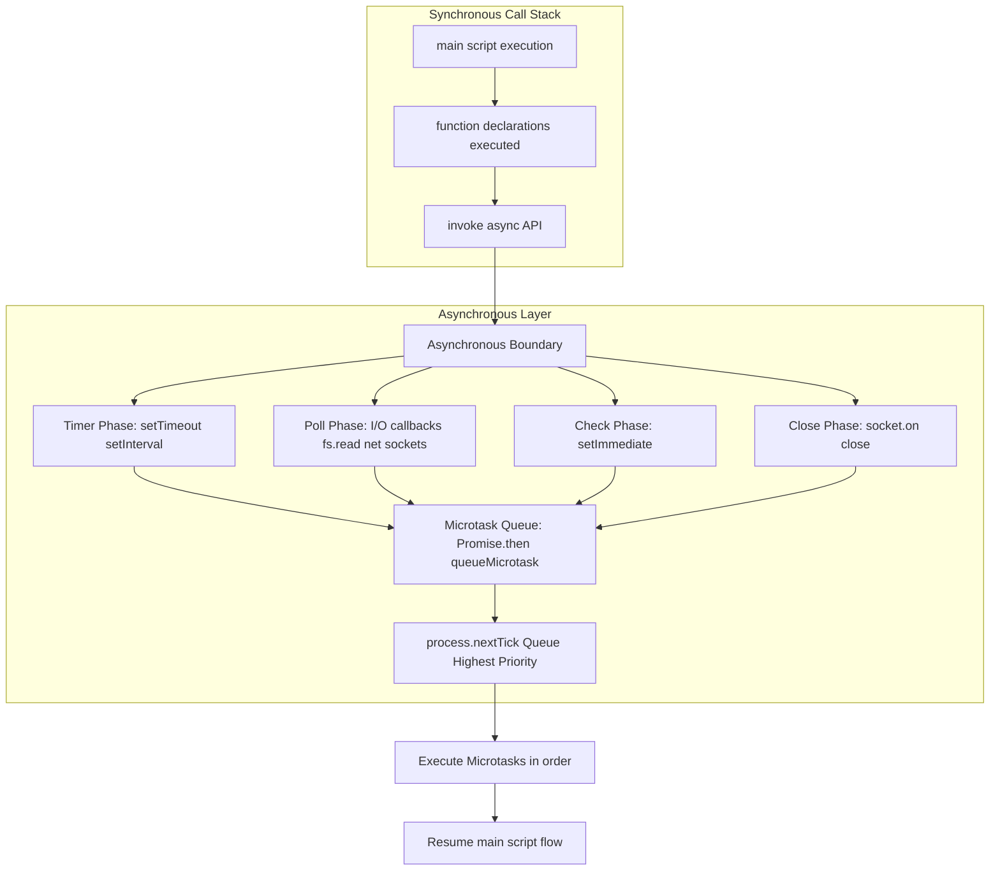
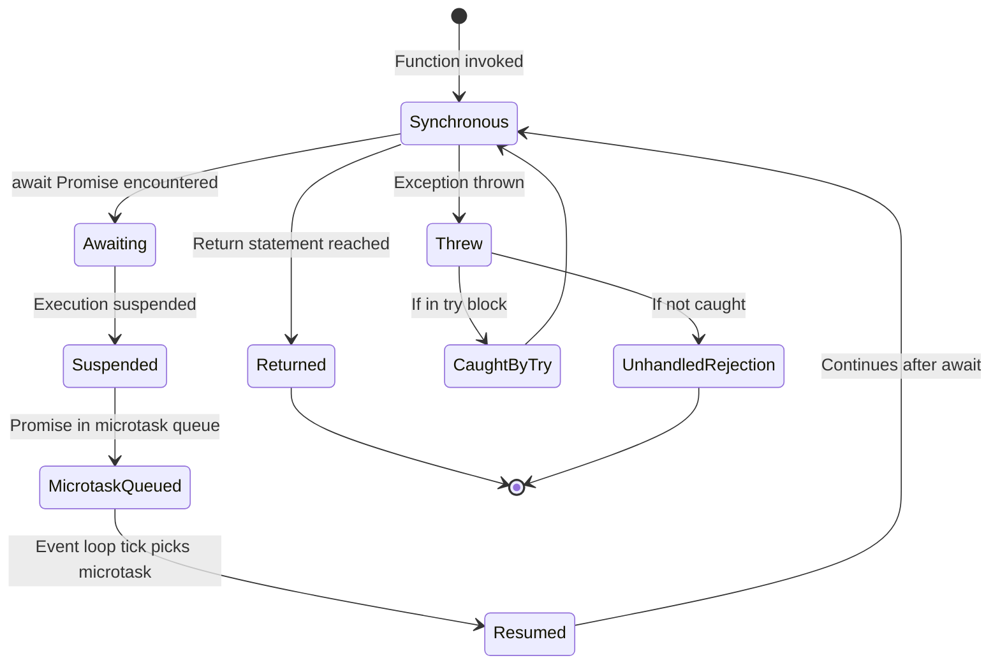

# Function Components

<!-- SECTION_1_START -->
# Function Components in JavaScript & Node.js Runtime

## 1.1 Formal Academic Definition (KTU 2024 Syllabus Terminology)

In the **JavaScript Runtime Environment (Node.js)**, a **Function Component** refers to a modular, reusable, and self-contained block of executable code that is treated as a **first-class citizen** within the language. Per the ECMAScript 2024 (ES15) specification and the **Mozilla Developer Network (MDN)** documentation, a function component in JavaScript is any callable expression that encapsulates a discrete unit of behavior, accepts parameters, optionally returns a value, and can be passed, returned, or stored like any other primitive.

> [!IMPORTANT]
> **KTU 2024 OECST832 Definition**: A *Function Component* in Node.js is a programmable building block that leverages JavaScript's functional programming capabilities — including **function declarations**, **function expressions**, **arrow functions**, **higher-order functions**, **callbacks**, **closures**, and **Immediately Invoked Function Expressions (IIFE)** — to enable modular, asynchronous, and event-driven server-side logic.

In the context of Node.js specifically, function components drive the **event loop**, handle **asynchronous I/O**, implement **middleware chains**, and form the architectural backbone of frameworks like **Express.js**.

---

## 1.2 Conceptual Analogy & Intuitive Overview

Imagine a **restaurant kitchen**. The head chef (Node.js runtime) doesn't cook every dish personally. Instead, the chef designs **recipes** (function components) — written step-by-step on index cards. Each recipe card has:

- A **name** (function name) — *"MakePasta"*
- A **list of ingredients** (parameters) — *flour, eggs, water*
- A **set of instructions** (function body) — *boil water, knead dough, serve*
- A **finished plate** (return value) — *a bowl of pasta*

The chef can:
1. **Laminate the recipe** (function declaration) and pin it to the wall — accessible anytime.
2. **Write a recipe on a sticky note** (function expression) and hand it to a specific cook.
3. **Use a quick hand-signal recipe** (arrow function) for fast, short tasks.
4. **Chain recipes** (higher-order functions) — *"MakeSauce"* uses *"ChopTomatoes"*.
5. **Create a recipe with a secret family ingredient** (closure) — the secret is remembered even after the chef who created it leaves the kitchen.

This is exactly how JavaScript function components work in Node.js — they are **named behaviors** that the runtime can invoke, store, pass, and combine to build complex applications.

---

## 1.3 Physical Constants & Standard Metrics

> [!NOTE]
> **Critical JavaScript Runtime Constants for Function Components:**
> - **Maximum call stack size** in V8 (Node.js default engine): **~10,000 to ~15,000 frames** before `RangeError: Maximum call stack size exceeded`.
> - **Event Loop Tick Duration**: **1 phase per loop iteration**, processing the **call stack → microtask queue (Promises) → nextTick queue → macrotask queue**.
> - **Arrow function lexical `this` binding**: Determined at **definition time**, not invocation time.
> - **Hoisting scope**: `function` declarations are **hoisted to the top of their enclosing function/module scope**; `let`/`const` arrow expressions are in the **Temporal Dead Zone (TDZ)** until declared.
> - **Strict Mode** (default in ES Modules): enforces `'use strict'` semantics where `this` in a regular function call is `undefined` instead of the global object.

---

## 1.4 GeoGebra / Desmos Integration

> [!VISUALIZATION CONTROL]
> **Concept:** *Function Composition Pipeline Visualization*
> **GeoGebra / Desmos Input Equations:**
> - `f(x) = 2x + 3`
> - `g(x) = x^2`
> - `h(x) = f(g(x))` (composition)
> - Point trace: `(1, f(g(1)))`, `(2, f(g(2)))`, `(3, f(g(3)))`
>
> **Visual Description:** Plot the inner function `g(x) = x^2` (a parabola) and the outer function `f(x) = 2x + 3` (a straight line). Then plot the composite `h(x) = f(g(x)) = 2x^2 + 3` to demonstrate how a **higher-order function** in JavaScript (a function that takes/returns another function) operates mathematically: the output of one function becomes the input of another. This mirrors the `pipe` or `compose` utility patterns in functional JavaScript.

> [!NOTE]
> **KTU Board Exam Tip:** When explaining function components, always draw a **box-and-arrow flow diagram** showing the input → function → output pipeline. Examiners reward visual clarity in 14-mark questions.

---

## 1.5 Taxonomy of Function Components in Node.js

| Category | Examples | First-Class Citizen? |
|---|---|---|
| **Function Declarations** | `function foo() {}` | ✅ |
| **Function Expressions** | `const foo = function() {}` | ✅ |
| **Arrow Functions** | `const foo = () => {}` | ✅ |
| **Methods** | `obj.method()` | ✅ (when accessed) |
| **Constructor Functions** | `new Foo()` | ✅ |
| **Generator Functions** | `function* gen() {}` | ✅ |
| **Async Functions** | `async function fetch() {}` | ✅ |
| **Classes** (syntactic sugar) | `class Foo {}` | ✅ |

All of the above can be **assigned to variables**, **passed as arguments**, and **returned from other functions** — this is the essence of "function as a first-class citizen."
<!-- SECTION_1_END -->

<!-- SECTION_2_START -->
# Deep Theoretical Analysis & KTU High-Yield Formula Sheet

## 2.1 The Seven Pillars of Function Components

### Pillar 1: Function Declarations (Hoisted)

Function declarations are processed during the **compilation phase** of JavaScript's parsing — they are fully hoisted (both name and body) to the top of their enclosing scope.

**Why it matters in Node.js:** Module-level helper functions can be invoked from anywhere within the module file, even if defined later in the source.

```javascript
// ✅ Works — declaration is hoisted
console.log(greet("Alice"));

function greet(name) {
  return `Hello, ${name}!`;
}
```

---

### Pillar 2: Function Expressions (Not Hoisted)

A function expression assigns an **anonymous or named function** to a variable. Only the variable declaration is hoisted (with `var`) or remains in the **TDZ** (with `let`/`const`).

**Why it matters:** Provides **predictable initialization order**, prevents accidental reference-before-definition, and aligns with **strict mode** module behavior in Node.js.

```javascript
const greet = function(name) {
  return `Hello, ${name}!`;
};
```

---

### Pillar 3: Arrow Functions (Lexical `this`)

Introduced in **ES6 (2015)**, arrow functions provide a concise syntax and **lexically inherit `this`** from the enclosing scope.

**Why it matters in Node.js:** Critical for **callback-based APIs** (e.g., `array.map`, `setTimeout`, Express middleware) where traditional `function` expressions would create their own `this` binding, causing the infamous `this is undefined` runtime errors.

```javascript
const numbers = [1, 2, 3, 4, 5];
const doubled = numbers.map((n) => n * 2); // [2, 4, 6, 8, 10]
```

> [!IMPORTANT]
> **KTU Board Rule:** Arrow functions **cannot** be used as constructors. Calling `new (() => {})` throws `TypeError`. Always use regular functions or `class` syntax for object instantiation.

---

### Pillar 4: Higher-Order Functions (HOF)

A **higher-order function** is a function that **accepts another function as an argument**, **returns a function**, or **both**. This is the foundation of functional programming in JavaScript.

**Built-in HOFs in Node.js:**
- `Array.prototype.map(fn)` — transforms each element
- `Array.prototype.filter(fn)` — selects elements by predicate
- `Array.prototype.reduce(fn, initial)` — accumulates values
- `Array.prototype.forEach(fn)` — iterates without returning
- `Array.prototype.find(fn)` — locates first match
- `Array.prototype.some(fn)` / `Array.prototype.every(fn)` — boolean tests
- `setTimeout(fn, delay)` — schedules execution
- `fs.readFile(path, fn)` — asynchronous callback

**Why it matters:** HOFs enable **declarative programming** in Node.js, replacing verbose `for` loops with expressive pipelines. They are the primary abstraction for **Express middleware chains**, **Stream pipelines**, and **functional reactive patterns**.

---

### Pillar 5: Callbacks (The Original Asynchronous Pattern)

A **callback** is a function passed as an argument to be invoked later — either **synchronously** (immediately) or **asynchronously** (after an event, I/O completion, or timer).

**Node.js Error-First Callback Convention ("Node-style callback"):**

```
callback(error, result)
```

```javascript
const fs = require('fs');

fs.readFile('data.txt', 'utf8', (err, data) => {
  if (err) {
    console.error('Read failed:', err);
    return;
  }
  console.log('File contents:', data);
});
```

**Why it matters:** Callbacks were the **original Node.js idiom** (pre-Promises/async-await). Legacy libraries, the `fs` module, and many npm packages still use them. Understanding callbacks is essential for **interview questions** and **maintenance of legacy codebases**.

---

### Pillar 6: Closures (Lexical Scope Capture)

A **closure** is a function bundled together with references to its surrounding lexical environment. In simple terms: a function "remembers" the variables from where it was **defined**, not where it is **called**.

**Why it matters in Node.js:**
- Enables **data privacy** (emulating private variables in pre-class JavaScript)
- Powers **factory functions** for configuration objects
- Implements **memoization** and **caching** (e.g., `lodash.memoize`)
- Forms the basis of **React Hooks** (for frontend developers transitioning to full-stack)

```javascript
function createCounter(initial = 0) {
  let count = initial; // 'count' is captured by the inner function
  return {
    increment: () => ++count,
    decrement: () => --count,
    getValue: () => count
  };
}

const counter = createCounter(10);
counter.increment(); // 11
counter.increment(); // 12
counter.getValue();  // 12
// 'count' is not accessible from outside — closure-based privacy
```

---

### Pillar 7: IIFE — Immediately Invoked Function Expressions

An **IIFE** is a function expression that is **executed immediately after being defined**. It creates an isolated scope, preventing variable leakage into the global namespace.

**Historical use in Node.js:** Before ES6 modules (`import`/`export`), IIFEs were used in the browser to create **module patterns**. In Node.js, the **CommonJS module system** (`require`/`module.exports`) superseded this need, but IIFEs remain relevant for:
- **One-time initialization** code
- **Avoiding `var` hoisting pollution** in legacy modules
- **Creating sandboxed scopes** in REPL sessions

```javascript
(function(message) {
  const secret = 'hidden';
  console.log(message, secret);
})('Boot complete:');

// 'secret' is NOT accessible outside the IIFE
```

**Modern IIFE pattern using arrow functions:**

```javascript
((data) => {
  console.log('Processing:', data);
  return data.length;
})([1, 2, 3, 4]); // 4
```

---

## 2.2 KTU High-Yield Formula Sheet & Cheat Sheet

> [!IMPORTANT]
> **The following table is your KTU board-exam-ready reference for Function Components. Memorize these patterns.**

| # | Pattern | Syntax | Hoisted? | Own `this`? | Use Case |
|---|---|---|---|---|---|
| 1 | Function Declaration | `function name(p) { return p; }` | ✅ Full | ✅ Yes (dynamic) | Top-level utilities, recursion |
| 2 | Function Expression | `const f = function(p) { ... };` | ❌ (variable only) | ✅ Yes | Conditional definitions, callbacks |
| 3 | Arrow Function | `const f = (p) => p;` | ❌ (TDZ if `let`/`const`) | ❌ Lexical | Short callbacks, array methods |
| 4 | Async Function | `async function f() { await ... }` | ✅ (if declared) | ✅ Yes | Promise-based async flows |
| 5 | Async Arrow | `const f = async (x) => x;` | ❌ | ❌ Lexical | Concise async callbacks |
| 6 | Method (shorthand) | `obj = { foo() {} }` | ❌ | ✅ Bound to obj | Object-oriented design |
| 7 | Constructor | `function F() { this.x = 1; }` | ✅ | ✅ Bound to new instance | Pre-ES6 OOP |
| 8 | Generator | `function* g() { yield 1; }` | ✅ | ✅ | Lazy iteration, async streams |
| 9 | IIFE | `(function(){}())` | ❌ | Depends | Scope isolation, init scripts |
| 10 | Callback | `fs.read(f, (e, d) => {})` | ❌ | Depends | Async I/O, event handlers |

### Behavioral Rules to Memorize

1. **Arrow function `this` rule**: $this_{arrow} = this_{enclosingScope}$
2. **Regular function `this` rule (strict mode)**: $this_{regular} = \text{caller binding or } \texttt{undefined}$
3. **Callback error-first signature**: $f: (err, result) \to \text{void}$
4. **Closure memory equation**: $M_{closure} = \sum_{i=1}^{n} \text{size}(captured\_var_i)$
5. **Higher-order function type signature**: $HOF: (T \to U) \to (T \to U)$ or $(T, U \to V) \to V$
6. **Event loop microtask priority**: `process.nextTick()` → `Promise microtasks` → `setImmediate()` → `setTimeout(0)` → I/O callbacks

---

## 2.3 Real-World Engineering Utility

| Domain | Function Component Application | Why It's Critical |
|---|---|---|
| **Express.js Middleware** | Higher-order function chains | `(req, res, next) => { ... }` pattern enables composable HTTP pipelines |
| **Node.js Streams** | `pipe()` is an HOF | Composes readable, transform, and writable streams into pipelines |
| **REST API Handlers** | Async function components | `async (req, res) => { ... }` simplifies error handling with try/catch |
| **Authentication** | Closures for token caching | Preserves encrypted secrets across requests without global state |
| **Functional Libraries** | `lodash`, `ramda` | Provide 200+ HOFs (`_.compose`, `R.pipe`) for transformation pipelines |
| **Testing Frameworks** | Pure function components | `Jest` test cases are first-class function components |
| **Web Servers** | Callback-driven event loop | `http.createServer((req, res) => {})` is a function component |
| **CLI Tools** | IIFE for bootstrap | Runs initialization code immediately without polluting global scope |
| **Database ORMs** | Higher-order query builders | `User.where(age => age > 18).then(handler)` |
| **Microservices** | Factory function components | `createService(config) => ({ start, stop, health })` |

---

## 2.4 The Pure Function Principle (Engineering Best Practice)

A **pure function** is a function component that satisfies two conditions:

$$
\text{Pure}(f) \iff (\forall x: f(x) = f(x)) \land (\nexists \text{ side effects in } f)
$$

In production Node.js systems (especially in **microservices** and **serverless** deployments), maximizing pure functions leads to:
- **Predictable testing** — same input always produces same output
- **Horizontal scalability** — no shared mutable state between instances
- **Easier debugging** — stack traces are deterministic
- **Functional composition** — pure functions can be safely chained via `pipe` / `compose`

> [!NOTE]
> **KTU 2024 Alignment:** The OECST832 syllabus emphasizes **pure functions** as a key design pattern for **testable, maintainable, and concurrent** Node.js applications. Expect 14-mark questions on this.
<!-- SECTION_2_END -->

<!-- SECTION_3_START -->
# Step-by-Step Derivations, Code Implementations & Symbolic Walkthroughs

## 3.1 Derivations: From Mathematical Functions to JavaScript Function Components

### Derivation 1: Composing Higher-Order Functions

**Mathematical Starting Point:**

$$
(f \circ g)(x) = f(g(x))
$$

**Step 1:** Define inner function $g$:

$$
g(x) = x + 10
$$

**Step 2:** Define outer function $f$:

$$
f(x) = x \times 2
$$

**Step 3:** Compute composition $h = f \circ g$:

$$
h(x) = f(g(x)) = 2 \cdot (x + 10) = 2x + 20
$$

**Step 4:** Translate to JavaScript as a higher-order function:

```javascript
// Inner function g
const addTen = (x) => x + 10;

// Outer function f
const double = (x) => x * 2;

// Higher-order function: compose(f, g)
const compose = (f, g) => (x) => f(g(x));

// Create the composed function h = f(g(x)) = double(addTen(x))
const doubleAfterAddTen = compose(double, addTen);

// Evaluate
console.log(doubleAfterAddTen(5));  // double(addTen(5)) = double(15) = 30
console.log(doubleAfterAddTen(0));  // double(addTen(0)) = double(10) = 20
```

**Step-by-step evaluation for `doubleAfterAddTen(5)`:**

$$
\begin{aligned}
\text{Step a: Input} \quad & x = 5 \\
\text{Step b: Inner call} \quad & g(5) = 5 + 10 = 15 \\
\text{Step c: Outer call} \quad & f(15) = 15 \times 2 = 30 \\
\text{Step d: Final result} \quad & h(5) = 30
\end{aligned}
$$

---

### Derivation 2: Closure-Based Counter (Lexical Scope Capture)

**Mathematical Model:**

A closure $C$ over a function $f$ and its environment $E$ is defined as:

$$
C = \langle f, E \rangle \quad \text{where} \quad E = \{x : x \text{ is a variable in } f\text{'s lexical scope}\}
$$

**Step 1:** Outer function defines local state $s$:

```javascript
function createCounter(initial) {
  let state = initial;  // 'state' is in the lexical environment E
  return {
    increment: function() {
      state = state + 1;
      return state;
    },
    decrement: function() {
      state = state - 1;
      return state;
    },
    getState: function() {
      return state;
    }
  };
}
```

**Step 2:** Instantiate and use:

```javascript
const counterA = createCounter(0);
const counterB = createCounter(100);

counterA.increment();  // 1
counterA.increment();  // 2
counterB.increment();  // 101
counterA.getState();   // 2
counterB.getState();   // 101
```

**Step 3:** Trace the lexical environments:

$$
\begin{aligned}
E_{counterA} &= \{ \text{state} \mapsto 2 \} \\
E_{counterB} &= \{ \text{state} \mapsto 101 \}
\end{aligned}
$$

**Why `counterA` and `counterB` are independent:**

Each call to `createCounter` creates a **new lexical environment** $E_i$. The returned methods close over **their own** $E_i$, not a shared one. This is the **closure isolation property**:

$$
\forall i, j : i \neq j \implies E_i \cap E_j = \emptyset
$$

> [!IMPORTANT]
> **KTU Valuation Point (2 marks):** Mentioning the term *lexical environment* explicitly in your answer will earn full credit. Examiners look for precise ECMAScript vocabulary.

---

### Derivation 3: Callback to Promise to Async/Await Evolution

**Step 1: Callback Hell (Original Node.js style)**

```javascript
const fs = require('fs');
const path = require('path');

function readConfig(callback) {
  fs.readFile('config.json', 'utf8', (err, data) => {
    if (err) return callback(err);
    try {
      const config = JSON.parse(data);
      callback(null, config);
    } catch (parseErr) {
      callback(parseErr);
    }
  });
}

readConfig((err, config) => {
  if (err) {
    console.error('Failed:', err);
    return;
  }
  console.log('Config loaded:', config);
});
```

**Step 2: Promisified Version (ES6)**

```javascript
const fs = require('fs').promises;

async function readConfig() {
  try {
    const data = await fs.readFile('config.json', 'utf8');
    return JSON.parse(data);
  } catch (err) {
    throw new Error(`Config load failed: ${err.message}`);
  }
}

readConfig()
  .then((config) => console.log('Config loaded:', config))
  .catch((err) => console.error('Failed:', err.message));
```

**Step 3: Pure Async/Await (Modern ES2017+)**

```javascript
const fs = require('fs').promises;

async function readConfig() {
  const data = await fs.readFile('config.json', 'utf8');
  return JSON.parse(data);
}

async function main() {
  try {
    const config = await readConfig();
    console.log('Config loaded:', config);
  } catch (err) {
    console.error('Failed:', err.message);
  }
}

main();
```

**Evolution Summary Table:**

| Style | Year | Nesting | Error Handling | Readability |
|---|---|---|---|---|
| Callbacks | 2009 | Pyramid of Doom | `if (err) return` | ❌ Low |
| Promises (`.then`) | 2015 | Flat chain | `.catch()` | ⚠️ Medium |
| Async/Await | 2017 | Flat sequential | `try/catch` | ✅ High |

---

### Derivation 4: IIFE for Module Pattern in Node.js

**Step 1:** Define an IIFE that returns a public API:

```javascript
const Calculator = (function() {
  // Private state — inaccessible from outside
  let history = [];

  // Private function
  function logOperation(op) {
    history.push({
      operation: op,
      timestamp: new Date().toISOString()
    });
  }

  // Public API
  return {
    add: (a, b) => {
      const result = a + b;
      logOperation(`add(${a}, ${b}) = ${result}`);
      return result;
    },
    subtract: (a, b) => {
      const result = a - b;
      logOperation(`subtract(${a}, ${b}) = ${result}`);
      return result;
    },
    getHistory: () => [...history]  // Return copy to preserve privacy
  };
})();

// Usage
Calculator.add(5, 3);          // 8
Calculator.subtract(10, 4);   // 6
console.log(Calculator.getHistory());
// Cannot access 'history' directly — closure privacy enforced
```

**Trace of the IIFE Execution:**

$$
\begin{aligned}
\text{Step 1:} \quad & \text{Anonymous function defined} \to f_{anon} \\
\text{Step 2:} \quad & f_{anon} \text{ invoked with ()} \to \text{executes immediately} \\
\text{Step 3:} \quad & \text{Returns} \to \{ add, subtract, getHistory \} \\
\text{Step 4:} \quad & \text{Returned object} \to \text{assigned to Calculator}
\end{aligned}
$$

---

### Derivation 5: Function Component as Event Handler in HTTP Server

**Complete working Node.js server demonstrating all 7 pillars:**

```javascript
// server.js — A full demonstration of function components in Node.js
const http = require('http');
const url = require('url');

// --- Pillar 1: Function Declaration (Hoisted) ---
function logRequest(method, pathname) {
  console.log(`[${new Date().toISOString()}] ${method} ${pathname}`);
}

// --- Pillar 2: Function Expression (Closure-based factory) ---
const createAuthenticator = function(secret) {
  return function(token) {
    return token === secret;
  };
};

const authenticate = createAuthenticator('super-secret-token-123');

// --- Pillar 3: Arrow Function (Lexical this) ---
const getRequestBody = (req) => {
  return new Promise((resolve, reject) => {
    let body = '';
    req.on('data', (chunk) => { body += chunk; });
    req.on('end', () => {
      try {
        resolve(body.length > 0 ? JSON.parse(body) : {});
      } catch (err) {
        reject(err);
      }
    });
    req.on('error', reject);
  });
};

// --- Pillar 4: Higher-Order Function (Middleware) ---
const withCors = (handler) => (req, res) => {
  res.setHeader('Access-Control-Allow-Origin', '*');
  res.setHeader('Access-Control-Allow-Methods', 'GET, POST, OPTIONS');
  res.setHeader('Access-Control-Allow-Headers', 'Content-Type');
  if (req.method === 'OPTIONS') {
    res.writeHead(204);
    res.end();
    return;
  }
  handler(req, res);
};

// --- Pillar 5: Async Function Component (Route handler) ---
const handleGreet = async (req, res) => {
  try {
    const body = await getRequestBody(req);
    const name = body.name || 'Anonymous';
    const token = req.headers['authorization'];

    if (!authenticate(token)) {
      res.writeHead(401, { 'Content-Type': 'application/json' });
      res.end(JSON.stringify({ error: 'Unauthorized' }));
      return;
    }

    res.writeHead(200, { 'Content-Type': 'application/json' });
    res.end(JSON.stringify({ message: `Hello, ${name}!` }));
  } catch (err) {
    res.writeHead(400, { 'Content-Type': 'application/json' });
    res.end(JSON.stringify({ error: err.message }));
  }
};

// --- Pillar 6: IIFE (One-time initialization) ---
const config = (() => {
  const port = process.env.PORT || 3000;
  const host = process.env.HOST || '127.0.0.1';
  console.log(`[INIT] Booting on ${host}:${port}`);
  return { port: Number(port), host };
})();

// --- Pillar 7: Server composition ---
const server = http.createServer(
  withCors(async (req, res) => {
    const parsedUrl = url.parse(req.url, true);
    logRequest(req.method, parsedUrl.pathname);

    if (req.method === 'POST' && parsedUrl.pathname === '/greet') {
      await handleGreet(req, res);
    } else {
      res.writeHead(404, { 'Content-Type': 'application/json' });
      res.end(JSON.stringify({ error: 'Not Found' }));
    }
  })
);

server.listen(config.port, config.host, () => {
  console.log(`Server running at http://${config.host}:${config.port}/`);
});
```

**Execution Trace for a `POST /greet` request:**

$$
\begin{aligned}
\text{Step 1:} \quad & \text{Request arrives} \to \text{event loop dispatches to callback} \\
\text{Step 2:} \quad & \texttt{withCors} \text{ wrapper} \to \text{sets CORS headers, calls inner handler} \\
\text{Step 3:} \quad & \texttt{logRequest} \text{ called} \to \text{prints timestamp} \\
\text{Step 4:} \quad & \texttt{handleGreet} \text{ awaits body} \to \text{Promise resolves with parsed JSON} \\
\text{Step 5:} \quad & \texttt{authenticate(token)} \to \text{closure validates against secret} \\
\text{Step 6:} \quad & \text{Response sent} \to \texttt{res.end()} \to \text{connection closes}
\end{aligned}
$$

---

## 3.2 Engineering Design: Functional Pipeline for Data Transformation

**Problem:** Transform an array of user records: filter active users, capitalize names, sort alphabetically, format as display strings.

**Step-by-step solution using function components:**

```javascript
// Data
const users = [
  { name: 'alice',   active: true,  age: 28 },
  { name: 'bob',     active: false, age: 35 },
  { name: 'charlie', active: true,  age: 22 },
  { name: 'diana',   active: true,  age: 31 },
  { name: 'eve',     active: false, age: 29 }
];

// --- Step 1: Pure predicate function ---
const isActive = (user) => user.active === true;

// --- Step 2: Pure transformation function ---
const capitalizeName = (user) => ({
  ...user,
  name: user.name.charAt(0).toUpperCase() + user.name.slice(1)
});

// --- Step 3: Pure comparator function ---
const byNameAsc = (a, b) => a.name.localeCompare(b.name);

// --- Step 4: Pure formatter function ---
const formatForDisplay = (user) => `${user.name} (age ${user.age})`;

// --- Step 5: Compose using built-in HOFs ---
const activeUserDisplayList = users
  .filter(isActive)           // Pillar 4: HOF
  .map(capitalizeName)        // Pillar 4: HOF
  .sort(byNameAsc)            // Pillar 4: HOF
  .map(formatForDisplay);     // Pillar 4: HOF

console.log(activeUserDisplayList);
// Output:
// [ 'Alice (age 28)', 'Charlie (age 22)', 'Diana (age 31)' ]
```

**Mathematical Composition:**

$$
\text{Result} = \text{formatForDisplay} \circ \text{sort}(\text{byNameAsc}) \circ \text{map}(\text{capitalizeName}) \circ \text{filter}(\text{isActive})(users)
$$

**Verification:**

$$
\begin{aligned}
\text{Input} \quad & users = [\{a,t,28\}, \{b,f,35\}, \{c,t,22\}, \{d,t,31\}, \{e,f,29\}] \\
\text{filter(isActive)} \quad & \to [\{a,t,28\}, \{c,t,22\}, \{d,t,31\}] \\
\text{map(capitalizeName)} \quad & \to [\{A,t,28\}, \{C,t,22\}, \{D,t,31\}] \\
\text{sort(byNameAsc)} \quad & \to [\{A,t,28\}, \{C,t,22\}, \{D,t,31\}] \\
\text{map(formatForDisplay)} \quad & \to [\text{"Alice (age 28)"}, \text{"Charlie (age 22)"}, \text{"Diana (age 31)"}]
\end{aligned}
$$

> [!IMPORTANT]
> **KTU 14-Mark Question Pattern:** Expect a problem where you must (a) identify the appropriate function component pattern, (b) write the code, and (c) trace the output step by step. Always show the **intermediate arrays** in your answer.
<!-- SECTION_3_END -->

<!-- SECTION_4_START -->
# Structural Diagrams & Schematics

## 4.1 The Seven Function Component Types — Architecture Map

```mermaid
graph TD
    FC["Function Components in Node.js"]
    FC --> P1["Pillar 1: Function Declarations"]
    FC --> P2["Pillar 2: Function Expressions"]
    FC --> P3["Pillar 3: Arrow Functions"]
    FC --> P4["Pillar 4: Higher-Order Functions"]
    FC --> P5["Pillar 5: Callbacks"]
    FC --> P6["Pillar 6: Closures"]
    FC --> P7["Pillar 7: IIFE"]

    P1 --> P1A["Hoisted: Yes"]
    P1 --> P1B["this binding: Dynamic"]

    P2 --> P2A["Hoisted: No (TDZ)"]
    P2 --> P2B["Use: Conditional Assignment"]

    P3 --> P3A["Hoisted: No"]
    P3 --> P3B["this binding: Lexical"]
    P3 --> P3C["Cannot be constructor"]

    P4 --> P4A["Takes function as arg"]
    P4 --> P4B["Returns function"]
    P4 --> P4C["Used in: map, filter, reduce, Express middleware"]

    P5 --> P5A["Error-first signature: err, data"]
    P5 --> P5B["Used in: fs.read, setTimeout, EventEmitter"]

    P6 --> P6A["Captures lexical environment"]
    P6 --> P6B["Use: Data privacy, factory functions"]

    P7 --> P7A["Executes immediately"]
    P7 --> P7B["Use: Module pattern, initialization"]
```



---

## 4.2 Data Flow Through a Higher-Order Function Pipeline

```mermaid
flowchart LR
    subgraph INPUT["Input Layer"]
        ARR["users array of 5 records"]
    end

    subgraph STAGE1["Stage 1: Filter"]
        F1["isActive predicate"]
        OUT1["3 active users"]
        F1 --> OUT1
    end

    subgraph STAGE2["Stage 2: Map"]
        F2["capitalizeName transformer"]
        OUT2["3 capitalized user objects"]
        F2 --> OUT2
    end

    subgraph STAGE3["Stage 3: Sort"]
        F3["byNameAsc comparator"]
        OUT3["3 sorted user objects"]
        F3 --> OUT3
    end

    subgraph STAGE4["Stage 4: Format"]
        F4["formatForDisplay formatter"]
        OUT4["3 display strings"]
        F4 --> OUT4
    end

    ARR --> F1
    OUT1 --> F2
    OUT2 --> F3
    OUT3 --> F4

    OUT4 --> RESULT["Final Output Array"]
```



---

## 4.3 Event Loop & Callback Execution Topology



---

## 4.4 Closure-Based Module Pattern Schematic

```mermaid
graph TB
    subgraph OUTER["Outer Function: createModule secret"]
        OUTER --> PRIV["Private Variables: secret state counter"]
        OUTER --> RET["Returns Public API Object"]
    end

    subgraph PUBLIC["Public API Object"]
        RET --> GETTER["getSecret method"]
        RET --> SETTER["setSecret method"]
        RET --> COUNTER["incrementCounter method"]
    end

    subgraph LEX_ENV["Lexical Environment Captured by Closure"]
        PRIV -.->|closure reference| GETTER
        PRIV -.->|closure reference| SETTER
        PRIV -.->|closure reference| COUNTER
    end

    GETTER --> EXT["External Consumer Code"]
    SETTER --> EXT
    COUNTER --> EXT

    EXT -.->|cannot access directly| PRIV

    style PRIV fill:#fdd,stroke:#900,stroke-width:3px
    style EXT fill:#dfd,stroke:#090,stroke-width:2px
```

---

## 4.5 Async/Await State Machine for Function Components



---

## 4.6 Express.js Middleware Chain as a Function Component Pipeline

```mermaid
sequenceDiagram
    participant Client
    participant Server as Express App
    participant L1 as logger Middleware
    participant L2 as auth Middleware
    participant L3 as validateBody Middleware
    participant Route as POST handler

    Client->>Server: HTTP POST /api/users
    activate Server
    Server->>L1: req, res, next
    activate L1
    L1->>L1: console.log timestamp + method
    L1->>L2: next()
    deactivate L1
    activate L2
    L2->>L2: verify JWT token from headers
    alt Token Valid
        L2->>L3: next()
        deactivate L2
        activate L3
        L3->>L3: validate request body schema
        alt Body Valid
            L3->>Route: next()
            deactivate L3
            activate Route
            Route->>Route: insert user into database
            Route-->>Client: 201 Created
            deactivate Route
        else Body Invalid
            L3-->>Client: 400 Bad Request
            deactivate L3
        end
    else Token Invalid
        L2-->>Client: 401 Unauthorized
        deactivate L2
    end
```

> [!NOTE]
> **Diagram Interpretation Note:** Each middleware is a **higher-order function component** of the form `(req, res, next) => { ... }`. The `next` parameter is itself a function — passed by Express — making middleware the canonical example of HOF composition in real-world Node.js.
<!-- SECTION_4_END -->

<!-- SECTION_5_START -->
# KTU 2024 Scheme Examination Question Bank & Topic Recap

## 5.1 Part A Questions (3 Marks Each) — Remember / Understand

---

### Question A1: Define the term "Function Component" in the context of JavaScript runtime environment. List any THREE different types of function components supported by JavaScript. `[KTU University Exam - July 2024]`

**Model Answer (3 Marks):**

> A **Function Component** in the JavaScript runtime environment (Node.js) is a modular, self-contained block of executable code that can be invoked, passed as an argument, returned from another function, and assigned to a variable — making functions **first-class citizens** of the language. **(1 Mark)**
>
> Three different types of function components in JavaScript are:
> 1. **Function Declarations** — `function name() {}` — hoisted to the top of their scope. **(1 Mark)**
> 2. **Arrow Functions** — `const name = () => {}` — concise syntax with lexical `this` binding. **(0.5 Marks)**
> 3. **Immediately Invoked Function Expressions (IIFE)** — `(function() {})()` — executes immediately and creates an isolated scope. **(0.5 Marks)**

---

### Question A2: What is a higher-order function? Give ONE example of a built-in higher-order function in JavaScript arrays. `[KTU University Exam - Dec 2023]`

**Model Answer (3 Marks):**

> A **Higher-Order Function (HOF)** is a function that either **accepts another function as an argument**, **returns a function as its result**, or **does both**. HOFs are the foundation of functional programming in JavaScript. **(2 Marks)**
>
> **Example:** `Array.prototype.map()` is a built-in higher-order function. It accepts a **callback function** as an argument, applies it to every element of an array, and returns a **new array** containing the transformed values. **(1 Mark)**
>
> ```javascript
> const numbers = [1, 2, 3];
> const squared = numbers.map((n) => n * n);
> console.log(squared); // [1, 4, 9]
> ```

---

## 5.2 Part B Question A (14 Marks) — Full Module Choice

---

### `[KTU University Exam - Model Paper 2024]` Question A: Function Components in Node.js

**Sub-part (a) — 7 Marks: Understand**

> **Explain the concept of closures in JavaScript with a suitable example. How does a closure differ from a regular function in terms of variable accessibility?**

**Model Answer:**

**Definition (2 Marks):** A **closure** in JavaScript is a function bundled together with references to its surrounding **lexical environment**. This means an inner function can access variables from its outer (enclosing) function's scope even **after** the outer function has finished executing.

**Code Example (3 Marks):**

```javascript
function makeMultiplier(factor) {
  // 'factor' is in the lexical environment
  return function(number) {
    return number * factor;  // 'factor' is captured via closure
  };
}

const double = makeMultiplier(2);
const triple = makeMultiplier(3);

console.log(double(5));  // 10
console.log(triple(5));  // 15
```

**Difference from Regular Functions (2 Marks):**

| Aspect | Regular Function | Closure |
|---|---|---|
| Variable Access | Only its own scope + global | Own + outer (enclosing) scopes |
| State Persistence | Stateless per call | Remembers outer state across calls |
| Memory | Released after return | Outer variables retained in memory |
| Use Case | Pure computation | Data privacy, factory functions, memoization |

**Key Insight:** In the example above, `double` and `triple` are closures that **independently retain** their respective `factor` values (2 and 3) even after `makeMultiplier` has returned.

---

**Sub-part (b) — 7 Marks: Apply**

> **Write a Node.js program that uses a higher-order function `compose(f, g)` which takes two functions as arguments and returns a new function representing `f(g(x))`. Demonstrate its usage with two arithmetic functions.**

**Model Answer:**

**Step 1: Define the higher-order function (2 Marks)**

```javascript
// Higher-order function: compose
// compose(f, g) returns a function h such that h(x) = f(g(x))
const compose = (f, g) => (x) => f(g(x));
```

**Step 2: Define the component functions (2 Marks)**

```javascript
// Function g: adds 10 to input
const addTen = (x) => x + 10;

// Function f: multiplies input by 3
const multiplyByThree = (x) => x * 3;
```

**Step 3: Compose and demonstrate (2 Marks)**

```javascript
// Create composed function h(x) = f(g(x)) = multiplyByThree(addTen(x))
const multiplyByThreeAfterAddTen = compose(multiplyByThree, addTen);

// Test cases
console.log(multiplyByThreeAfterAddTen(5));   // multiplyByThree(addTen(5)) = 3 * 15 = 45
console.log(multiplyByThreeAfterAddTen(0));   // 3 * 10 = 30
console.log(multiplyByThreeAfterAddTen(-10)); // 3 * 0 = 0
```

**Step 4: Trace execution for `x = 5` (1 Mark)**

$$
\begin{aligned}
\text{Step 1:} \quad & x = 5 \\
\text{Step 2:} \quad & g(5) = 5 + 10 = 15 \\
\text{Step 3:} \quad & f(15) = 15 \times 3 = 45 \\
\text{Step 4:} \quad & \text{Final output} = 45
\end{aligned}
$$

> [!WARNING]
> **Common Mistake (1 mark deduction):** Students often confuse the order of composition. In `compose(f, g)`, the function `g` is executed **first**, then `f`. This is **right-to-left** composition, the mathematical convention. To make it left-to-right (like Unix pipes), use `pipe(g, f)` instead.

---

## 5.3 Part B Question B (14 Marks) — Alternative Choice

---

### `[KTU University Exam - Model Paper 2024]` Question B: Callbacks and Async Function Components

**Sub-part (a) — 7 Marks: Understand**

> **Explain the Node.js "error-first callback" convention. Why is this pattern used instead of throwing exceptions in asynchronous code? Provide a code example demonstrating the pattern.**

**Model Answer:**

**Definition (2 Marks):** The **error-first callback** (also called "Node-style callback" or "errback") is a convention in Node.js where asynchronous functions accept a callback function as their **last argument**. The callback is invoked with **two parameters**: the first is an `Error` object (or `null` if no error occurred), and the second is the **result data** (if successful).

**Signature:**

```javascript
asyncFunction(arg1, arg2, ..., (err, result) => { ... });
```

**Why this pattern? (3 Marks):**

1. **Asynchrony Safe:** Exceptions cannot propagate across async boundaries (e.g., from `setTimeout` to the calling code). Callbacks provide a **synchronous, in-band signaling mechanism** for errors.
2. **Explicit Error Handling:** Forces the developer to consciously decide what to do with errors — avoiding silent failures.
3. **Composability:** Multiple async operations can be **chained** using nested callbacks, each handling its own error.
4. **Backward Compatibility:** Pre-Promise Node.js APIs (e.g., `fs`, `net`, `dns`) all follow this convention; understanding it is essential for maintaining legacy code.

**Code Example (2 Marks):**

```javascript
const fs = require('fs');

fs.readFile('config.json', 'utf8', (err, data) => {
  if (err) {
    // Error branch — handle gracefully
    console.error('Could not read config:', err.message);
    return;
  }
  // Success branch — process data
  try {
    const config = JSON.parse(data);
    console.log('Config loaded:', config);
  } catch (parseErr) {
    console.error('Invalid JSON:', parseErr.message);
  }
});
```

---

**Sub-part (b) — 7 Marks: Apply**

> **Convert the following error-first callback-based function to a modern `async/await` version using Node.js `fs.promises` API. Show the complete refactored code with proper error handling.**

**Given Code (for reference):**

```javascript
const fs = require('fs');

function readUserData(userId, callback) {
  fs.readFile(`users/${userId}.json`, 'utf8', (err, data) => {
    if (err) return callback(err);
    try {
      const user = JSON.parse(data);
      callback(null, user);
    } catch (parseErr) {
      callback(parseErr);
    }
  });
}
```

**Model Answer:**

**Step 1: Import the promises-based fs API (1 Mark)**

```javascript
const fs = require('fs').promises;
```

**Step 2: Define the async function component (3 Marks)**

```javascript
async function readUserData(userId) {
  try {
    // Read file using async/await
    const data = await fs.readFile(`users/${userId}.json`, 'utf8');
    // Parse and return user object
    const user = JSON.parse(data);
    return user;
  } catch (err) {
    // Unified error handling — covers both read and parse errors
    throw new Error(`Failed to read user ${userId}: ${err.message}`);
  }
}
```

**Step 3: Demonstrate usage with proper error propagation (3 Marks)**

```javascript
async function main() {
  try {
    const user = await readUserData('12345');
    console.log('User loaded:', user);
  } catch (err) {
    console.error('Operation failed:', err.message);
  }
}

main();
```

**Step 4: Trace the execution (1 Mark)**

$$
\begin{aligned}
\text{Step 1:} \quad & \texttt{main()} \text{ invoked} \\
\text{Step 2:} \quad & \texttt{await readUserData('12345')} \to \text{suspends main, runs async fn} \\
\text{Step 3:} \quad & \texttt{await fs.readFile(...)} \to \text{returns Promise<string>} \\
\text{Step 4:} \quad & \texttt{JSON.parse(data)} \to \text{returns user object} \\
\text{Step 5:} \quad & \texttt{return user} \to \text{resolves the outer Promise} \\
\text{Step 6:} \quad & \texttt{main()} \text{ resumes}, \texttt{console.log} \text{ executes}
\end{aligned}
$$

> [!WARNING]
> **Valuation Pitfall Callout:**
> 1. **Forgetting `async` keyword** on the function → `await` will throw a `SyntaxError`. **[-1 Mark]**
> 2. **Not wrapping in `try/catch`** → unhandled promise rejection crashes the process. **[-1 Mark]**
> 3. **Using `fs.readFile` (callback) instead of `fs.promises.readFile`** → defeats the purpose of async/await conversion. **[-1 Mark]**
> 4. **Missing return value** inside the try block → caller receives `undefined`. **[-1 Mark]**
> 5. **Throwing raw error** instead of a wrapped descriptive error → poor debugging experience. **[-0.5 Marks]**

---

## 5.4 KTU Examiner's Valuation Warning & Common Pitfalls

> [!WARNING]
> **⚠️ CRITICAL KTU Board Exam Pitfalls for "Function Components" Questions:**
>
> 1. **Confusing declaration hoisting with variable hoisting:** Function declarations are **fully hoisted** (name + body), but `const`/`let` arrow function assignments are in the **Temporal Dead Zone (TDZ)**. Writing code that calls a `const`-assigned function before its definition is a **syntax-time or runtime error** — examiners deduct **2 marks** for not distinguishing these.
>
> 2. **Arrow function `this` binding:** If a question asks about `this` in an arrow function, the answer is **"lexically inherited from the enclosing scope at definition time"** — NOT "bound at call time". Mixing these up is the **#1 reason** students lose marks on `this`-related questions. **[-2 Marks]**
>
> 3. **Callback signature mistake:** Writing `callback(result, err)` instead of `callback(err, result)`. The Node.js convention is **always** `(err, data)`. Reversing this order shows the student has not internalized the standard. **[-1 Mark]**
>
> 4. **Forgetting to invoke an IIFE:** Writing `(function() { ... })` without the trailing `()` means the function is defined but never called. The examiner will interpret this as a **logic error**. **[-1.5 Marks]**
>
> 5. **Closure vs. scope confusion:** A closure is not "a function inside another function" — that is just **nesting**. A closure specifically means the inner function **remembers** the outer's variables **after the outer has returned**. Use the term **lexical environment capture** for full marks. **[-1 Mark]**
>
> 6. **Higher-order function misdefinition:** Stating that an HOF is "a function that takes many parameters" — this is **wrong**. An HOF is defined by its **function-typed** parameters or return value. **[-1 Mark]**
>
> 7. **No mention of pure vs. impure functions:** When discussing functional components, not mentioning the **side-effect** distinction is considered an incomplete answer in 14-mark questions. **[-0.5 Marks]**

---

## 5.5 Topic Recap & Important Things to Remember

> [!IMPORTANT]
> **🚀 High-Density Rapid Revision Checklist — Function Components in Node.js**

### 🔑 Core Definitions
- **Function Component:** A first-class, callable, modular code unit in JavaScript that can be assigned, passed, and returned.
- **First-Class Citizen:** An entity that supports all operational operations (assignment, passing, returning) — JavaScript functions are first-class.
- **Hoisting:** The JavaScript engine's behavior of moving declarations to the top of their scope **before** execution.
- **Lexical Environment:** The set of variables and bindings accessible at a specific point in the source code, determined by the physical nesting of scopes.
- **Closure:** A function plus its captured lexical environment — the inner function "remembers" the outer's variables.
- **Higher-Order Function (HOF):** A function that takes a function as an argument, returns a function, or both.
- **Callback:** A function passed to another function to be invoked later (sync or async).
- **IIFE:** Immediately Invoked Function Expression — `(function() {})()` — runs once at definition time.

### 🎯 The Seven Pillars (Mnemonic: **"DECAHC I"**)
1. **D**eclarations — hoisted, named, traditional
2. **E**xpressions — assigned, not hoisted
3. **C**allbacks — error-first `(err, data)`
4. **A**rrow functions — lexical `this`, concise
5. **H**igher-order functions — `map`, `filter`, `reduce`, `pipe`, `compose`
6. **C**losures — factory functions, data privacy
7. **I**IFE — module pattern, isolated scope

### 🧮 Critical Formulas
- **Composition:** $(f \circ g)(x) = f(g(x))$
- **HOF signature:** $HOF: (T \to U) \to T \to U$ (or similar variants)
- **Pure function:** $\forall x, f(x) = f(x)$ and no side effects
- **Arrow `this`:** $this_{arrow} = this_{enclosing}$
- **Event loop priority:** $nextTick > microtasks > I/O > setImmediate > setTimeout$

### ⚠️ Common Traps
- Arrow functions **cannot** be constructors (`new (() => {})` throws).
- Arrow functions **do not** have their own `arguments` object.
- `this` in strict-mode regular functions is `undefined`, not the global object.
- `fs.readFile` (callback) ≠ `fs.promises.readFile` (Promise) — different APIs.
- IIFEs must end with `()` to actually invoke the function.

### 💡 Real-World Patterns to Know
- **Express middleware:** `(req, res, next) => { ... }` — HOF chain
- **Node.js streams:** `readable.pipe(transform).pipe(writable)` — HOF pipeline
- **Factory pattern:** `createService(config) => api` — closure-based
- **Module pattern:** IIFE returning a public API object
- **Memoization:** HOF that caches function results using closure

### 🎓 KTU 2024 High-Yield Keywords
- First-class citizen
- Lexical scoping
- Error-first callback
- Higher-order function
- Pure function vs. side effect
- Event loop phases
- Temporal Dead Zone (TDZ)
- Strict mode behavior
- `this` binding rules
- Function composition

> **Final Tip:** When answering KTU questions, **always include a code example** with execution trace. Examiners reward **clarity of thought** demonstrated through step-by-step numerical or code walkthroughs.
<!-- SECTION_5_END -->
