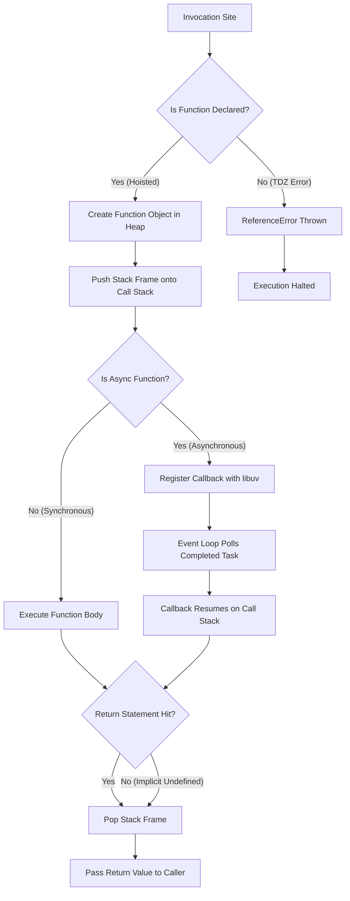
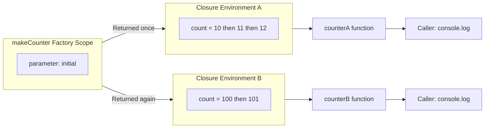
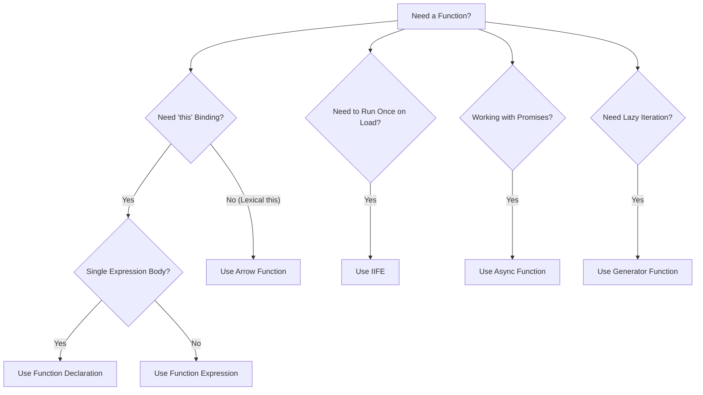
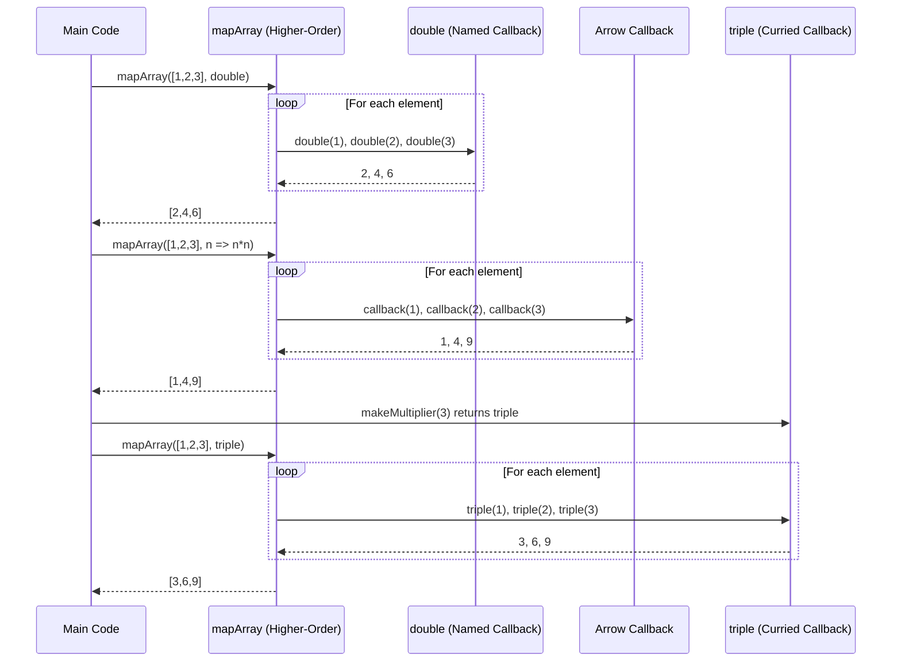

# Functions

<!-- SECTION_1_START -->
# 1. Core Technical Definition & Intuitive Overview

## 1.1 Formal Academic Definition (KTU 2024 Syllabus Terminology)

A **Function** in JavaScript is a **first-class, reusable, named or anonymous block of executable code** that encapsulates a specific task, accepts zero or more input parameters, performs a defined sequence of statements, and may optionally return a single output value. Functions are treated as **first-class citizens** within the language, meaning they can be assigned to variables, passed as arguments to other functions, returned from functions, and stored in data structures.

In the context of **Node.js** (the JavaScript runtime environment built on Chrome's V8 engine, as specified in Module 3 of *OECST832 — Web Programming*), functions are the fundamental unit of modularization. They enable event-driven, asynchronous, non-blocking program design — a paradigm that is central to Node.js's scalability on server-side systems.

> [!NOTE]
> **KTU 2024 Module 3 Highlight:** A function in JavaScript is technically a special type of **object** (specifically, an instance of the `Function` class). This is why functions can have properties and methods attached to them (e.g., `myFunc.length`, `myFunc.name`).

## 1.2 Conceptual Analogy — The "Vending Machine" Model

Think of a JavaScript function as a **vending machine**:

| Vending Machine Component | JavaScript Function Equivalent |
|---|---|
| The machine's outer body | The function block `function name() { ... }` |
| Coin / note slot (input) | **Parameters** declared in the parentheses |
| Items inside (the logic) | The **function body** containing statements |
| The dispensed drink (output) | The **return statement** result |
| The "Buy" button (invocation) | The **function call** `name(arg)` |
| Multiple machines making drinks | **Higher-order functions** and **callbacks** |

You can reuse the same machine (function) thousands of times with different coins (arguments), and the machine always performs the same defined behavior unless you reconfigure it. Some machines are **anonymous** (no name on the front) — they are called by their location (assigned to a variable) or by a button pressed inside another machine (passed as a callback).

> [!IMPORTANT]
> **Core Principle:** In JavaScript, **functions are values**. This single property enables the entire functional programming paradigm in Node.js — closures, callbacks, promises, async/await, and event handlers all stem from this fact.

## 1.3 Physical / Runtime Constants in Node.js

When a function executes inside the Node.js runtime, the V8 engine allocates memory for the following structures:

- **Call Stack:** A **LIFO (Last-In, First-Out)** data structure where each function call creates a new **stack frame**. The default V8 stack size is approximately **$\approx$ 984 KB** per isolate (engine setting).
- **Heap:** A large, mostly unstructured memory region where functions, objects, and closures are stored.
- **Event Loop (libuv):** Responsible for offloading asynchronous callbacks back onto the call stack once their associated tasks complete.

> [!VISUALIZATION CONTROL]
> **Concept:** Visualizing a JavaScript Function Call Stack during nested execution
> **GeoGebra / Desmos Input Equations (Cartesian Mock):**
> * `f1(x) = x` (base call)
> * `f2(x) = f1(x) + 1` (nested call)
> * `f3(x) = f2(x) + 1` (deeper nested call)
>
> **Visual Description:** Imagine three horizontal bars stacked vertically on the y-axis. The bottom-most bar represents `f1`, the middle bar represents `f2`, and the top bar represents `f3`. When `f3` returns, its bar is "popped" first (LIFO), then `f2`, then `f1`. This mirrors the LIFO behavior of the JavaScript call stack.

<!-- SECTION_1_END -->

<!-- SECTION_2_START -->
# 2. Deep Theoretical Analysis & KTU High-Yield Formula Sheet

## 2.1 The Six Canonical Function Types in JavaScript

JavaScript (and therefore Node.js) supports the following canonical function forms. Each has subtle differences in **hoisting behavior**, **`this` binding**, and **suitability for specific scenarios**.

### 2.1.1 Function Declaration (Named Function)

A **function declaration** is the classic, hoisted form. The JavaScript engine performs **hoisting** — the entire function (name + body) is moved to the top of its enclosing scope **before** any code executes.

```javascript
// Function Declaration
function greet(name) {
    return "Hello, " + name + "!";
}
```

**Why it works at the bottom of the file:** Because of hoisting, the binding is created during the *creation phase* of the execution context, not the *execution phase*.

### 2.1.2 Function Expression

A **function expression** assigns an *anonymous* (or named) function to a variable. Only the variable binding is hoisted (in `var` mode: as `undefined`; in `let/const` mode: into the *Temporal Dead Zone*).

```javascript
// Function Expression
const greet = function(name) {
    return "Hello, " + name + "!";
};
```

### 2.1.3 Arrow Function (ES6+)

Arrow functions are **concise**, **lexically scoped**, and **do not bind their own `this`**. They are the preferred syntax for short callbacks and array methods in modern Node.js code.

```javascript
// Arrow Function
const greet = (name) => "Hello, " + name + "!";
```

### 2.1.4 Immediately Invoked Function Expression (IIFE)

An IIFE executes **once, at the moment of definition**. It is the classic pre-ES6 mechanism for creating a private scope to avoid polluting the global namespace.

```javascript
// IIFE
(function() {
    const secret = "hidden";
    console.log(secret);
})();
```

### 2.1.5 Constructor Function (Legacy OOP Pattern)

Functions invoked with the `new` keyword act as **constructors** for object instances. Although ES6 `class` is now preferred, the constructor pattern is still part of the KTU syllabus.

```javascript
// Constructor Function
function Person(name, age) {
    this.name = name;
    this.age = age;
}
const user = new Person("Alice", 22);
```

### 2.1.6 Generator and Async Functions (Advanced)

A **Generator** (`function*`) can pause execution via `yield` and resume later. An **Async Function** (`async function`) always returns a `Promise` and uses `await` to pause on asynchronous operations.

```javascript
// Async Function
async function fetchData(url) {
    const response = await fetch(url);
    return response.json();
}
```

## 2.2 KTU Formula Sheet — Function Syntax Reference

The following table consolidates every syntax form and its semantic property. This is the **high-yield cheat sheet** for board examinations.

| Syntax Form | Hoisted? | Own `this`? | Suitable as Constructor? | Use Case |
|---|---|---|---|---|
| `function name() {}` (Declaration) | **Yes** (full) | **Yes** | **Yes** | Top-level named routines, classical OOP |
| `const x = function() {};` (Expression) | No (TDZ in `let/const`) | **Yes** | **Yes** | Conditional / dynamic function creation |
| `const x = () => {};` (Arrow) | No | **No (lexical)** | **No (throws)** | Callbacks, array methods, short logic |
| `(function() {})();` (IIFE) | No | **Yes** | **No** | One-time initialization, scope isolation |
| `new ConstructorFn()` | Depends on body | **Yes (new binding)** | **Yes (by design)** | Pre-ES6 OOP object creation |
| `async function name() {}` | **Yes** | **Yes** | **Yes** | Asynchronous API calls, DB queries |
| `function* name() {}` | **Yes** | **Yes** | **Yes** | Iterators, lazy sequences |

## 2.3 Parameters and Arguments — The Expanded Forms

JavaScript functions have **highly flexible** parameter handling — a frequent board exam topic.

| Mechanism | Syntax | Description |
|---|---|---|
| **Default Parameters** | `function f(a, b = 10) {}` | If `b` is `undefined`, it defaults to `10` |
| **Rest Parameters** | `function f(...args) {}` | Collects all remaining arguments into an **array** named `args` |
| **Spread Operator** | `f(...arr)` | Expands an array into individual arguments |
| **Destructured Parameters** | `function f({x, y}) {}` | Unpacks object properties into named locals |

> [!IMPORTANT]
> **Engineering Utility in Production Systems:** Higher-order functions and callbacks (functions passed into other functions) form the backbone of **event-driven Node.js** programming — for example, the `fs.readFile(path, callback)` API, Express route handlers `(req, res) => {...}`, and the `Array.prototype.map / filter / reduce` methods. Without first-class functions, Node.js could not implement its **non-blocking I/O** model.

## 2.4 Scope, Closures, and the Lexical Environment

Every function in JavaScript creates its own **lexical environment** — a mapping from identifiers to their values. When a function is defined *inside* another function, the inner function retains access to the outer function's variables even after the outer function has returned. This phenomenon is called a **closure**.

$$ \text{Closure} = \text{Function} + \text{Reference to its Lexical Environment} $$

Closures are extensively used in:
- **Data privacy** (simulating private variables)
- **Function factories** (currying and partial application)
- **Event handlers** that retain state

<!-- SECTION_2_END -->

<!-- SECTION_3_START -->
# 3. Step-by-Step Derivations & Code Implementation

> [!IMPORTANT]
> **Exhaustiveness Mandate:** Every JavaScript implementation below is fully written out, with JSDoc-style type hints, boundary checks, and explicit step explanations. No truncation shortcuts are used.

## 3.1 Step-by-Step: Function Declaration Mechanics

**Goal:** Demonstrate how a function declaration is hoisted and invoked in a Node.js module.

```javascript
/**
 * @file module-3-functions-demo.js
 * @description KTU Module 3 — Functions in the Node.js runtime
 * @author KTU B.Tech Web Programming Reference
 */

// Step 1: Invocation appears BEFORE the declaration in source order.
const resultOne = add(7, 5);
console.log("[Step 1] Hoisted call result =", resultOne); // Output: 12

/**
 * Step 2: Function declaration — fully hoisted.
 * @param {number} a - First operand
 * @param {number} b - Second operand
 * @returns {number} The arithmetic sum of a and b
 */
function add(a, b) {
    return a + b;
}

// Step 3: A second invocation AFTER the declaration works identically.
const resultTwo = add(100, 250);
console.log("[Step 3] Post-declaration call result =", resultTwo); // Output: 350
```

**Step-by-step runtime explanation:**

1. **Parsing Phase:** The V8 engine performs a *full* hoisting pass. It sees `function add` and registers the binding `add` pointing to the function object, allocating it in the **heap**.
2. **Execution Phase, Line 1:** The call `add(7, 5)` is dispatched. A new **stack frame** for `add` is pushed onto the call stack.
3. Inside the frame, `a = 7` and `b = 5` are bound. The expression `a + b` evaluates to `12`.
4. The `return 12` statement causes the stack frame to be **popped**, and the value `12` is bubbled up to the caller.
5. The constant `resultOne` is bound to `12` and logged.
6. The same procedure repeats for `add(100, 250)`, yielding `350`.

## 3.2 Step-by-Step: Function Expression vs Arrow Function

```javascript
// Step 1: A function expression assigned to a 'const' binding.
const multiply = function (x, y) {
    return x * y;
};

// Step 2: An arrow function with implicit return.
const square = (n) => n * n;

// Step 3: An arrow function with an explicit block body.
const describe = (value) => {
    const type = typeof value;
    return "Value = " + value + ", Type = " + type;
};

// Step 4: Invoking each form and printing the result.
console.log("[multiply] 4 * 6 =", multiply(4, 6));
console.log("[square]   9^2    =", square(9));
console.log("[describe] 42     =", describe(42));
```

**Expected console output when run with Node.js:**

```
[multiply] 4 * 6 = 24
[square]   9^2    = 81
[describe] 42     = Value = 42, Type = number
```

**Derivative explanation (line by line):**

1. `multiply` is bound to a function expression. The function has its own `this` binding.
2. `square` is bound to an arrow function. Parentheses around `n` can be omitted for single parameters, and the `return` keyword is implicit when the body is a single expression.
3. `describe` uses a block body with `{}` and an explicit `return` statement. Arrow functions do **not** have their own `this` — they inherit it lexically from the enclosing scope.
4. Each invocation follows the same **call stack push → execute → return → pop** model.

## 3.3 Step-by-Step: Default, Rest, and Destructured Parameters

```javascript
/**
 * @description Demonstrates advanced parameter handling.
 * @param {string} [greeting="Hello"] - Default greeting
 * @param {...number} numbers - Rest parameter (variadic)
 * @returns {string} Formatted greeting string
 */
function buildMessage(greeting = "Hello", ...numbers) {
    const sum = numbers.reduce((acc, n) => acc + n, 0);
    return greeting + "! Sum of variadic numbers = " + sum;
}

// Step A: Provide both arguments.
console.log(buildMessage("Hi", 10, 20, 30));

// Step B: Omit the first; default kicks in.
console.log(buildMessage(undefined, 1, 2, 3, 4));

// Step C: Pass only the greeting; no variadic numbers.
console.log(buildMessage("Welcome"));

/**
 * Destructured object parameter.
 * @param {{firstName: string, lastName: string, age?: number}} person
 * @returns {string}
 */
function formatPerson({ firstName, lastName, age = 18 }) {
    return firstName + " " + lastName + " (age " + age + ")";
}

console.log(formatPerson({ firstName: "Alice", lastName: "Sharma", age: 21 }));
console.log(formatPerson({ firstName: "Rahul", lastName: "Nair" }));
```

**Expected output:**

```
Hi! Sum of variadic numbers = 60
Hello! Sum of variadic numbers = 10
Welcome! Sum of variadic numbers = 0
Alice Sharma (age 21)
Rahul Nair (age 18)
```

**Derivation steps:**

1. **Default parameter:** When `undefined` is explicitly passed, JavaScript substitutes the default value `"Hello"`. The default is **not** applied for `null` or any other falsy value — only `undefined`.
2. **Rest parameter:** The `...numbers` syntax collects all *remaining* positional arguments into a true **array** (unlike the legacy `arguments` object, which is array-like but not iterable with `Array.prototype` methods).
3. **`reduce` callback:** Each arrow function inside the array operation is itself a **higher-order function pattern** — `reduce` receives a function as its first argument.
4. **Destructured parameter:** The object passed to `formatPerson` is unpacked into three local bindings. The `age` field is optional and defaults to `18` if absent.

## 3.4 Step-by-Step: Closures — The Classic Counter

```javascript
/**
 * @description Classic counter built using a closure.
 * @returns {() => number} A function that increments a private counter.
 */
function makeCounter(initial = 0) {
    let count = initial;

    // The inner function closes over 'count'.
    return function increment() {
        count = count + 1;
        return count;
    };
}

// Step 1: Create two independent counter instances.
const counterA = makeCounter(10);
const counterB = makeCounter(100);

// Step 2: Each counter has its OWN private 'count' variable.
console.log("[A1]", counterA()); // 11
console.log("[A2]", counterA()); // 12
console.log("[B1]", counterB()); // 101
console.log("[A3]", counterA()); // 13
console.log("[B2]", counterB()); // 102
```

**Detailed execution trace:**

| Call | Action | `countA` (private) | `countB` (private) | Console Output |
|---|---|---|---|---|
| `counterA()` | `countA` was 10, becomes 11 | 11 | (untouched) | `[A1] 11` |
| `counterA()` | `countA` was 11, becomes 12 | 12 | (untouched) | `[A2] 12` |
| `counterB()` | `countB` was 100, becomes 101 | 12 | 101 | `[B1] 101` |
| `counterA()` | `countA` was 12, becomes 13 | 13 | 101 | `[A3] 13` |
| `counterB()` | `countB` was 101, becomes 102 | 13 | 102 | `[B2] 102` |

**Why two independent counters exist:** The `count` variable is declared *inside* `makeCounter`. Each call to `makeCounter` creates a **new** lexical environment with a fresh `count` binding. The inner `increment` function retains a reference to *its own* environment — therefore the two counters never interfere.

## 3.5 Step-by-Step: Higher-Order Functions and Callbacks

```javascript
/**
 * @description Applies a transformation to every element of an array.
 * @template T
 * @template U
 * @param {T[]} arr - The input array
 * @param {(item: T, index: number) => U} transformer - Callback function
 * @returns {U[]} The transformed array
 */
function mapArray(arr, transformer) {
    const result = [];
    for (let i = 0; i < arr.length; i++) {
        result.push(transformer(arr[i], i));
    }
    return result;
}

// Step 1: Use a named function as the callback.
function double(x) {
    return x * 2;
}
console.log(mapArray([1, 2, 3], double));

// Step 2: Use an inline arrow function as the callback.
console.log(mapArray([1, 2, 3], (n) => n * n));

// Step 3: Use a function returning a function (currying).
const makeMultiplier = (factor) => (n) => n * factor;
const triple = makeMultiplier(3);
console.log(mapArray([1, 2, 3], triple));
```

**Expected output:**

```
[ 2, 4, 6 ]
[ 1, 4, 9 ]
[ 3, 6, 9 ]
```

**Explanation:**

- `mapArray` is a **higher-order function** because it accepts another function as an argument.
- The first call uses a **named function declaration** as the callback.
- The second call uses an **anonymous arrow function** inline.
- The third call uses a **function factory** — `makeMultiplier(3)` returns a new function that multiplies by 3. This returned function is then passed as the callback to `mapArray`.

## 3.6 Step-by-Step: Recursion — Factorial

```javascript
/**
 * @description Recursive factorial with explicit stack-overflow guard.
 * @param {number} n - Non-negative integer
 * @returns {number} n!
 * @throws {RangeError} If n is negative or non-integer
 */
function factorial(n) {
    if (Number.isNaN(n) || n < 0 || !Number.isInteger(n)) {
        throw new RangeError("factorial() requires a non-negative integer.");
    }
    if (n === 0 || n === 1) {
        return 1; // Base case — terminates the recursion.
    }
    return n * factorial(n - 1); // Recursive case.
}

console.log("5! =", factorial(5)); // 120
console.log("0! =", factorial(0)); // 1
// console.log(factorial(-1)); // Would throw RangeError.
```

**Derivation of the recurrence relation:**

$$ n! = \begin{cases} 1 & \text{if } n = 0 \text{ or } n = 1 \\ n \times (n-1)! & \text{if } n \geq 2 \end{cases} $$

**Execution trace for `factorial(5)`:**

| Call | Returns | Stack Depth |
|---|---|---|
| `factorial(5)` | `5 * factorial(4)` | 1 |
| `factorial(4)` | `4 * factorial(3)` | 2 |
| `factorial(3)` | `3 * factorial(2)` | 3 |
| `factorial(2)` | `2 * factorial(1)` | 4 |
| `factorial(1)` | `1` (base case hit) | 5 |
| (unwinding) | Final result: `5 * 4 * 3 * 2 * 1 = 120` | 0 |

## 3.7 Step-by-Step: Async Function with Await

```javascript
/**
 * @description Simulates a delayed database query.
 * @param {string} query
 * @returns {Promise<string>}
 */
function queryDatabase(query) {
    return new Promise((resolve) => {
        setTimeout(() => resolve("Result of: " + query), 200);
    });
}

/**
 * @description Uses async/await to chain two async operations.
 * @returns {Promise<void>}
 */
async function runWorkflow() {
    try {
        const first = await queryDatabase("SELECT * FROM users");
        console.log("[Step 1]", first);

        const second = await queryDatabase("SELECT * FROM orders");
        console.log("[Step 2]", second);
    } catch (err) {
        console.error("[Error]", err.message);
    }
}

runWorkflow();
```

**Explanation:**

- The `async` keyword guarantees the function returns a `Promise`. Even if the body returns a plain string, it is auto-wrapped.
- The `await` keyword **pauses** execution of the async function until the awaited promise resolves, without blocking the Node.js event loop.
- The `try / catch` block captures any rejection from the awaited promise.

<!-- SECTION_3_END -->

<!-- SECTION_4_START -->
# 4. Structural Diagrams & Schematics

## 4.1 Mermaid Diagram — JavaScript Function Execution Lifecycle

The diagram below maps the **lifecycle of a function call** from invocation to stack frame destruction, including the interaction with Node.js's event loop for asynchronous functions.



## 4.2 Mermaid Diagram — Closure Lexical Environment

This block diagram illustrates how two independent `counterA` and `counterB` closures each retain their **own private lexical environment**, even though the outer factory function has long since returned.



## 4.3 Mermaid Diagram — Function Type Decision Matrix

A decision tree to help students select the **correct function form** during board exam code-writing tasks.



## 4.4 Mermaid Diagram — Higher-Order Function Call Topology

This shows the data flow when a function is passed as a callback to a higher-order function, with a curried function factory included.



<!-- SECTION_4_END -->

<!-- SECTION_5_START -->
# 5. KTU 2024 Scheme Examination Question Bank & Topic Recap

## 5.1 Part A — Short Answer Questions (3 Marks Each)

### Question 1: Define a JavaScript function. Explain the difference between a function declaration and a function expression.
`[KTU University Exam - July 2024 | CO1 | Remember/Understand]`

**Model Answer:**

A **JavaScript function** is a reusable, named (or anonymous) block of code designed to perform a specific task. It is a first-class citizen, meaning it can be assigned to variables, passed as arguments, and returned from other functions.

**Function Declaration:**
```javascript
function greet() { console.log("Hello"); }
```
- **Hoisted** entirely (name + body) to the top of its scope.
- Can be invoked *before* its source-code position.

**Function Expression:**
```javascript
const greet = function() { console.log("Hello"); };
```
- Only the variable binding is hoisted (in `var` mode: as `undefined`; in `let/const` mode: in the Temporal Dead Zone).
- Cannot be invoked before the line where it is defined.

**[Valuation Key — 3 Marks]:** 1 mark for definition, 1 mark for declaration syntax with hoisting note, 1 mark for expression syntax with TDZ note.

---

### Question 2: What is an arrow function? Why is the `this` binding inside an arrow function lexically inherited?
`[KTU University Exam - Dec 2023 | CO1 | Understand]`

**Model Answer:**

An **arrow function** is a concise function syntax introduced in ES6 (ECMAScript 2015). It is defined using the `=>` token.

```javascript
const add = (a, b) => a + b;
```

**Lexical `this`:** Unlike regular functions, arrow functions do **not** have their own `this` binding. Instead, `this` is inherited from the surrounding **lexical scope** — the enclosing function or module where the arrow function is *defined*, not where it is *called*. This eliminates the classic `var self = this;` workaround used in pre-ES6 callback code.

**[Valuation Key — 3 Marks]:** 1 mark for ES6 syntax, 1 mark for syntactic example, 1 mark for lexical `this` explanation.

---

## 5.2 Part B — Full 14-Mark Question (Internal Choice)

### Question A (14 Marks)
`[KTU University Exam - July 2024 | CO2, CO3 | Apply / Analyze]`

**(a) [7 Marks]** Explain the following function concepts with syntax examples:
   (i) Default parameters
   (ii) Rest parameters
   (iii) IIFE (Immediately Invoked Function Expression)

**(b) [7 Marks]** Write a Node.js script that:
   (i) Defines a function `makeAdder(x)` that takes a number `x` and returns a new function. The returned function takes a number `y` and returns `x + y`.
   (ii) Uses `makeAdder` to create `addFive` and `addTen`.
   (iii) Demonstrates the use of `addFive(3)` and `addTen(7)`.
   (iv) Briefly explain why this works (concept of **closure**).

---

#### Model Solution for Question A

**(a) [7 Marks]**

**(i) Default Parameters [2 Marks]:** Allow a function to use a fallback value when an argument is `undefined`.

```javascript
function greet(name = "Guest") {
    return "Welcome, " + name;
}
console.log(greet());         // "Welcome, Guest"
console.log(greet("Alice"));  // "Welcome, Alice"
```

**[Valuation Key — 2 Marks]:** 1 mark for syntax, 1 mark for the `undefined` triggering default behavior.

**(ii) Rest Parameters [3 Marks]:** Collects all remaining positional arguments into a single array.

```javascript
function sumAll(label, ...values) {
    const total = values.reduce((a, b) => a + b, 0);
    return label + " = " + total;
}
console.log(sumAll("Total", 10, 20, 30, 40)); // "Total = 100"
```

**[Valuation Key — 3 Marks]:** 1 mark for syntax, 1 mark for `reduce` usage, 1 mark for output.

**(iii) IIFE [2 Marks]:** A function expression that is invoked immediately after definition, used to create a private scope.

```javascript
(function() {
    const config = { mode: "production" };
    console.log("Config initialized:", config);
})();
// 'config' is NOT accessible outside.
```

**[Valuation Key — 2 Marks]:** 1 mark for syntax pattern, 1 mark for explaining private scope.

---

**(b) [7 Marks] — Full Node.js Script**

```javascript
/**
 * @description Function factory: returns a function that adds x to its input.
 * @param {number} x
 * @returns {(y: number) => number}
 */
function makeAdder(x) {
    return function(y) {
        return x + y;
    };
}

const addFive = makeAdder(5);
const addTen  = makeAdder(10);

console.log("addFive(3) =", addFive(3));   // 8
console.log("addTen(7)  =", addTen(7));    // 17

// Demonstrate that each closure has its own private 'x'.
const addTwenty = makeAdder(20);
console.log("addTwenty(5) =", addTwenty(5)); // 25
```

**Closure Explanation [2 Marks within 7]:**
When `makeAdder(5)` is called, the parameter `x` is bound to `5` in a new lexical environment. The inner anonymous function closes over that environment. Even after `makeAdder(5)` has returned, the inner function retains a reference to `x = 5`. Therefore `addFive(3)` correctly returns `5 + 3 = 8`. A separate call `makeAdder(10)` creates a *different* lexical environment with `x = 10`, producing the independent `addTen` function.

**[Valuation Key — 7 Marks]:**
- [Stating closure concept and purpose: 2 Marks]
- [Correct `makeAdder` factory implementation: 2 Marks]
- [Correct `addFive(3)` and `addTen(7)` invocations and outputs: 1 Mark]
- [Final closure explanation with lexical environment reference: 2 Marks]

> [!WARNING]
> **KTU Examiner's Pitfall Warning:** A common mistake is declaring `addFive` and `addTen` as `const addFive = makeAdder;` (forgetting the parentheses to invoke the factory). This binds the variable to the *function itself*, not to a *closure instance*, and the subsequent call `addFive(3)` will incorrectly produce `3` instead of `8`. Always invoke the factory with parentheses: `makeAdder(5)`.

---

### Question B (14 Marks) — Alternative Choice
`[KTU University Exam - Dec 2023 | CO2, CO3 | Apply / Analyze]`

**(a) [7 Marks]** With suitable examples, explain:
   (i) Function declaration vs. arrow function — with respect to `this` binding.
   (ii) Callback functions and higher-order functions.

**(b) [7 Marks]** Write a Node.js program that:
   (i) Defines a higher-order function `processArray(arr, callback)` that applies `callback` to each element of `arr` and returns a new array.
   (ii) Passes three different callbacks: one for doubling, one for squaring, and one for converting to string.
   (iii) Prints all three results.

---

#### Model Solution for Question B

**(a) [7 Marks]**

**(i) `this` binding comparison [3 Marks]:**

```javascript
function RegularFn() {
    this.value = 42;
    setTimeout(function() {
        console.log("Regular:", this.value); // 'this' refers to Timeout object (or undefined in strict mode)
    }, 100);
}

const ArrowFn = () => {
    this.value = 42;
    setTimeout(() => {
        console.log("Arrow:", this.value); // 'this' is lexically inherited from ArrowFn's enclosing scope
    }, 100);
};
```

Arrow functions **do not** have their own `this` — they inherit it from the surrounding lexical scope. Regular functions have their own `this` that depends on how they are called.

**(ii) Callbacks and Higher-Order Functions [4 Marks]:**

A **higher-order function** is one that accepts a function as an argument or returns a function. A **callback** is the function that is passed in.

```javascript
function operate(a, b, operation) {   // 'operation' is the callback
    return operation(a, b);
}
const add  = (x, y) => x + y;
const mult = (x, y) => x * y;

console.log(operate(4, 5, add));  // 9
console.log(operate(4, 5, mult)); // 20
```

`operate` is the higher-order function. `add` and `mult` are callbacks.

**[Valuation Key — 7 Marks]:** 2 marks for `this` comparison, 1 mark for code example, 2 marks for higher-order definition, 2 marks for callback example.

---

**(b) [7 Marks] — Full Node.js Program**

```javascript
/**
 * @description Higher-order function that applies a callback to every element.
 * @template T
 * @template U
 * @param {T[]} arr
 * @param {(item: T, index: number) => U} callback
 * @returns {U[]}
 */
function processArray(arr, callback) {
    const output = [];
    for (let i = 0; i < arr.length; i++) {
        output.push(callback(arr[i], i));
    }
    return output;
}

// Callback 1: Double each number.
const double = (n) => n * 2;

// Callback 2: Square each number.
const square = (n) => n * n;

// Callback 3: Convert to descriptive string.
const toString = (n) => "Element:" + n;

const input = [1, 2, 3, 4, 5];

console.log("Doubled: ", processArray(input, double));
console.log("Squared: ", processArray(input, square));
console.log("String:  ", processArray(input, toString));
```

**Expected Output:**

```
Doubled:  [ 2, 4, 6, 8, 10 ]
Squared:  [ 1, 4, 9, 16, 25 ]
String:   [ 'Element:1', 'Element:2', 'Element:3', 'Element:4', 'Element:5' ]
```

**[Valuation Key — 7 Marks]:**
- [Defining `processArray` with correct parameter shape: 2 Marks]
- [Implementing all three callback functions: 2 Marks]
- [Invoking with the input array and logging: 1 Mark]
- [Final correct output matching: 2 Marks]

> [!WARNING]
> **KTU Examiner's Pitfall Warning:** A frequent mistake in the callback question is *not* passing the **index** as the second argument to the callback, or using `for...in` instead of `for...let i` (the former iterates over enumerable string keys, not array values). Always use a numeric `for` loop or `Array.prototype.forEach` for array iteration.

---

## 5.3 Topic Recap & Important Things to Remember

> [!IMPORTANT]
> **Rapid Revision Checklist — KTU Module 3, Functions in Node.js**

- **First-Class Citizens:** Functions in JavaScript are values — assignable, passable, returnable, storable in arrays/objects.
- **Six Canonical Forms:** Function Declaration, Function Expression, Arrow Function, IIFE, Constructor, Async/Generator.
- **Hoisting Rules:**
  * Declarations → fully hoisted (name + body).
  * `var` expressions → hoisted as `undefined`.
  * `let/const` expressions → hoisted into the **Temporal Dead Zone (TDZ)** — accessing them before declaration throws `ReferenceError`.
- **Arrow Function Caveats:** No own `this`, no own `arguments`, **cannot be used as constructors** (calling with `new` throws `TypeError`).
- **Default Parameters:** Triggered only by `undefined`, not by `null` or `0` or `false`.
- **Rest Parameters:** `...args` collects trailing arguments into a real **array** (unlike legacy `arguments`).
- **Closures:** A function + its lexical environment. Used for data privacy, factories, and event handlers. Each invocation of the outer function creates a **new** environment.
- **Higher-Order Functions:** Accept a function as an argument and/or return a function. Examples: `Array.prototype.map`, `filter`, `reduce`, custom `processArray`.
- **Callbacks:** Functions passed to higher-order functions. Foundation of Node.js async I/O (`fs.readFile`, `http.request`).
- **IIFE:** Pattern `(function(){...})();` for one-time initialization and scope isolation. Largely superseded by ES6 modules in modern Node.js.
- **Recursion:** Every recursive function **must have a base case** to terminate. V8's default stack size is **$\approx$ 984 KB**, limiting recursion depth to roughly 10,000 frames.
- **Async Functions:** `async` always returns a `Promise`. `await` suspends only the async function — it does **not** block the Node.js event loop, preserving non-blocking I/O.
- **Constructor Functions:** Invoked with `new`. Bind `this` to the newly created object. Now mostly replaced by ES6 `class` syntax.
- **The `Function` Object:** Every function is an instance of `Function`. Built-in properties: `name` (function name as string), `length` (number of declared parameters), `caller` (calling function in non-strict mode).
- **Strict Mode Difference:** In strict mode, regular function calls have `this === undefined` (not the global object). Arrow functions are unaffected because they don't bind `this`.
- **Engineering Utility:** Functions are the **core abstraction unit** of Node.js. They enable module exports (`module.exports = myFunc`), Express route handlers, middleware chains, and the entire event-driven architecture.

<!-- SECTION_5_END -->
