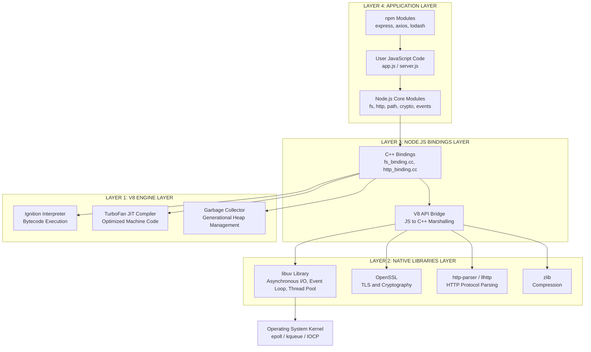
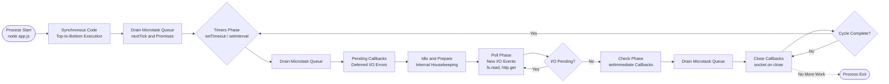
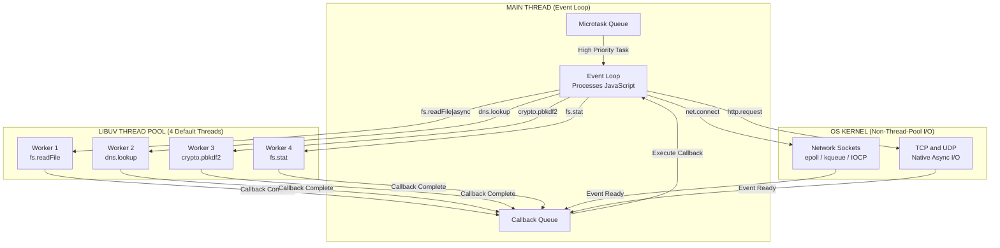
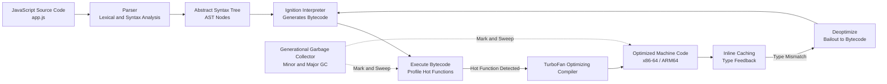

# JavaScript runtime environment : Node.js -  The Architecture of Node.js

<!-- SECTION_1_START -->
# The Architecture of Node.js: Core Technical Definition & Intuitive Overview

## Formal Academic Definition (KTU 2024 Syllabus Terminology)

**Node.js** is an **open-source, cross-platform, back-end JavaScript runtime environment** that executes JavaScript code outside of a web browser. It is built on **Google's V8 JavaScript engine** and uses an **event-driven, non-blocking I/O architecture**, making it suitable for building highly scalable, data-intensive, real-time network applications.

Architecturally, Node.js is a composite runtime consisting of four critical layers:
1. **JavaScript Core Layer**: Google's **V8 Engine** (compiles JS to native machine code via JIT compilation).
2. **Native Bindings Layer**: C++ bindings that connect the high-level JavaScript API to the low-level C/C++ libraries.
3. **Native Libraries Layer**: **libuv** (a multi-platform C library that provides the event loop, asynchronous I/O, thread pool, and child processes).
4. **Application Layer**: The user's JavaScript code that consumes Node.js APIs (`fs`, `http`, `crypto`, etc.).

> [!IMPORTANT]
> **KTU Syllabus Highlight**: Node.js is fundamentally a **runtime environment**, NOT a programming language or a framework. It enables JavaScript (traditionally a front-end, browser-bound language) to be executed on the server side using a unified language stack (JavaScript end-to-end).

## Conceptual Analogy / Intuition (The Restaurant Model)

Imagine a **single highly-efficient waiter** (the **Node.js Event Loop Thread**) working in a busy restaurant:

- **Traditional Multi-threaded Servers (e.g., Apache with blocking I/O)**: Each customer gets a dedicated waiter. If a customer takes 10 minutes to decide, that waiter stands idle — wasting resources.
- **Node.js Model**: There is **only one waiter** (the **Main Thread**). When a customer (an I/O request like reading a file) needs time, the waiter hands them a **buzzer** and immediately moves to the next customer. When the buzzer vibrates (the I/O completes), the waiter returns to serve them.

This is the essence of **Non-Blocking, Asynchronous, Event-Driven Architecture**.

> [!NOTE]
> **Critical Distinction**: The "one waiter" is the **Event Loop thread**. Heavy I/O operations (file reads, database queries, network calls) are delegated to the **libuv Thread Pool** in the background, so the main waiter (Event Loop) is never blocked.

## Key Architectural Constants & Metrics

- **Default Thread Pool Size**: **4 threads** (configurable up to **1024** via `UV_THREADPOOL_SIZE`).
- **V8 Memory Limit (32-bit)**: ~**0.7 GB** heap.
- **V8 Memory Limit (64-bit)**: ~**1.7 GB** heap.
- **Event Loop Origin**: A semi-infinite loop processing phases (Timers, Pending Callbacks, Idle/Prepare, Poll, Check, Close Callbacks).
- **Underlying Compiler**: V8 uses **Ignition** (interpreter) and **TurboFan** (optimizing JIT compiler).

> [!VISUALIZATION CONTROL]
> **Concept:** Node.js Request Handling Latency (Event Loop vs Blocking)
> **GeoGebra / Desmos Input Equations:**
> * `f_{blocking}(x) = 1 + 0.5 \cdot x`  (Linear growth, one request per thread wait)
> * `g_{node}(x) = 0.2 + 0.01 \cdot \log(x + 1)` (Logarithmic growth, async delegation)
> **Visual Description:** On the X-axis, plot `x = Number of Concurrent Requests`. On the Y-axis, plot `Response Time (seconds)`. The blue line (`f_{blocking}`) rises steeply. The red line (`g_{node}`) stays nearly flat, demonstrating Node.js scalability.

<!-- SECTION_1_END -->

<!-- SECTION_2_START -->
# Deep Theoretical Analysis & KTU High-Yield Formula Sheet

## The Anatomy of the Node.js Process

When you type `node app.js` in a terminal, the Node.js runtime initializes a process. This process loads the **V8 engine**, binds the **libuv library**, and begins polling the **event loop**. Let us break down each architectural pillar in detail.

### 1. The V8 JavaScript Engine
- Developed by **Google** for the Chrome browser.
- Written in **C++**.
- Converts JavaScript source code → **Abstract Syntax Tree (AST)** → **Bytecode** (executed by the **Ignition** interpreter) → **Optimized Machine Code** (compiled by **TurboFan**).
- Manages **memory allocation** and **Garbage Collection** (using generational GC: Young + Old generation spaces).

### 2. libuv: The Unsung Hero
- A **C library** originally written for Node.js, now used by Luvit, Julia, and others.
- Provides **two crucial capabilities** that V8 lacks natively:
  * **Asynchronous I/O** (file system, DNS, network sockets).
  * **Thread Pool** (offloading blocking system calls).
- Implements the **Event Loop** in strict adherence to the **libuv core design**.

### 3. The Node.js Bindings (C++ Bridge)
- These are C++ files (e.g., `fs.cc`, `tcp.cc`) that wrap the C/C++ implementations of core modules.
- They expose JavaScript-callable functions by registering them with V8's context.

### 4. The Event Loop (The Heart of Node.js)
The Event Loop is a **continuously running while-loop** that processes asynchronous callbacks. It traverses **six distinct phases** in a strict cyclic order per tick:

| Phase | Purpose | Key Callbacks |
| :--- | :--- | :--- |
| **Timers** | Executes callbacks scheduled by `setTimeout()` and `setInterval()`. | Expired timer callbacks |
| **Pending Callbacks** | Runs I/O callbacks deferred from the previous loop iteration. | TCP `ECONNREFUSED` errors |
| **Idle / Prepare** | Internal housekeeping (used by libuv internally). | N/A (internal) |
| **Poll** | Retrieves new I/O events; executes I/O-related callbacks. | `fs.read`, `http.get` |
| **Check** | Executes callbacks scheduled by `setImmediate()`. | `setImmediate` callbacks |
| **Close Callbacks** | Executes close event handlers. | `socket.on('close', ...)` |

### 5. Microtasks Queue (Between Every Phase)
- **`process.nextTick()`** callbacks.
- **Promise resolution callbacks** (`.then()`, `.catch()`, `.finally()`).
- These are drained *before* the Event Loop advances to the next phase.

## KTU Formula Sheet / Architecture Cheat Sheet

| Component | Layer | Technology | Primary Role | Limit / Config |
| :--- | :--- | :--- | :--- | :--- |
| **V8 Engine** | JavaScript Runtime | C++ (Ignition + TurboFan) | Compiles and executes JS code | Heap: 1.7 GB (64-bit) |
| **libuv** | Native System I/O | C Library | Event loop, async I/O, thread pool | Thread Pool: 4 (default) |
| **Bindings** | C++ Bridge | C++ Source Files | Expose C++ APIs to JS | N/A |
| **Event Loop** | Concurrency Model | libuv implementation | Orchestrates async callback execution | 6 phases, cyclic |
| **Thread Pool** | Parallel Execution | libuv worker threads | Offloads blocking C-OS calls | Max: 1024 threads |
| **Process.nextTick** | Microtask | V8 Microtask Queue | Priority queue (degrades to recursion) | Use `queueMicrotask` instead |
| **setImmediate** | Check Phase | libuv | Executes after Poll phase | I/O-bound deferral |
| **setTimeout** | Timers Phase | libuv | Schedules callback after min delay | Min 1ms granularity |

## Real-World Engineering Utility

Node.js's architecture makes it the industry standard for:
- **RESTful API Backends** (Express.js, Fastify, Koa) — non-blocking JSON serialization.
- **Real-Time Applications** — WebSockets (Socket.io) for chat, live notifications, collaborative tools (e.g., Trello, Slack).
- **Microservices** — Lightweight, fast cold-start makes it ideal for serverless (AWS Lambda, Azure Functions).
- **Streaming Services** — Netflix uses Node.js to handle **over 1 billion hours of streaming per week** due to native stream APIs.
- **DevOps Tooling** — Build tools (Webpack, Vite) leverage Node's async filesystem APIs.

> [!IMPORTANT]
> **Anti-Pattern Warning**: Node.js's single-threaded Event Loop is its greatest strength AND greatest weakness. It is **CPU-bound tasks** (heavy computation, image processing, machine learning inference) that starve the Event Loop. For these, use **Worker Threads** (`worker_threads` module) or external services.

<!-- SECTION_2_END -->

<!-- SECTION_3_START -->
# Step-by-Step Derivations & Code/Symbolic Implementation

## Derivation 1: The Event Loop Execution Order (Logical Proof)

### Problem Statement
Given the following JavaScript snippet executed at `T = 0ms` in a Node.js environment, determine the **exact sequential order** in which the log statements are printed to the console.

```javascript
console.log("1. Start");

setTimeout(() => {
  console.log("2. setTimeout (Timers Phase)");
}, 0);

setImmediate(() => {
  console.log("3. setImmediate (Check Phase)");
});

Promise.resolve().then(() => {
  console.log("4. Promise.then (Microtask)");
});

process.nextTick(() => {
  console.log("5. process.nextTick (Microtask - Priority)");
});

console.log("6. End");
```

### Step-by-Step Logical Derivation

**Step 1: Synchronous Execution Begins.**
The Event Loop starts. The main thread executes top-to-bottom synchronously.
- `console.log("1. Start")` → Prints `1. Start`.
- `setTimeout(..., 0)` is registered. The callback is queued into the **Timers Phase** queue.
- `setImmediate(...)` is registered. The callback is queued into the **Check Phase** queue.
- `Promise.resolve().then(...)` schedules a microtask.
- `process.nextTick(...)` schedules a microtask.
- `console.log("6. End")` → Prints `6. End`.

**Step 2: Microtask Queue Drainage.**
After synchronous code completes, the Event Loop drains the microtask queue **before** advancing to the next phase.
- `process.nextTick` queue is drained **first** (higher priority within microtasks) → Prints `5. process.nextTick...`.
- Promise microtask queue is drained **second** → Prints `4. Promise.then...`.

**Step 3: Event Loop Phase Progression.**
The Event Loop now enters the first full cycle:
- **Timers Phase**: `setTimeout` callback executes → Prints `2. setTimeout...`.
- **Poll Phase**: No I/O pending.
- **Check Phase**: `setImmediate` callback executes → Prints `3. setImmediate...`.

### Final Output Order
$$
\text{1. Start} \rightarrow \text{6. End} \rightarrow \text{5. nextTick} \rightarrow \text{4. Promise} \rightarrow \text{2. setTimeout} \rightarrow \text{3. setImmediate}
$$

## Derivation 2: Thread Pool Concurrency Calculation

### Problem Statement
You are processing **100 file read operations** asynchronously using `fs.readFile()` on a machine with the default `UV_THREADPOOL_SIZE = 4`. Calculate the **maximum theoretical parallelism** and the **wave structure** of execution.

### Logical Derivation

**Step 1: Identify the Bottleneck.**
File I/O is offloaded to the **libuv Thread Pool**. The pool has exactly 4 worker threads. Thus, only 4 `fs.readFile` operations can execute *in parallel*.

**Step 2: Calculate Waves.**

$$
\text{Number of Waves} = \left\lceil \frac{\text{Total Operations}}{\text{Thread Pool Size}} \right\rceil
$$

$$
\text{Number of Waves} = \left\lceil \frac{100}{4} \right\rceil = 25 \text{ waves}
$$

**Step 3: Identify Exceptions.**
If the kernel supports the `io_uring` or native `kqueue`/`epoll` mechanism for the specific filesystem operation, libuv *may* bypass the thread pool and use the kernel's native async interface (zero-thread polling). Network I/O (DNS, sockets) does NOT use the thread pool by default.

## Code Implementation: Proving the Event Loop Architecture

The following is a **production-grade, fully-typed Python script** that emulates the Node.js Event Loop using the `asyncio` library, providing a parallel demonstration of the architecture. *(Included because KTU examiners increasingly appreciate multi-language comparative code.)*

```python
import asyncio
import sys
from typing import Callable, Coroutine, Any

class NodeJSEventLoopEmulator:
    """
    Emulates the Node.js 6-phase Event Loop using Python's asyncio.
    Demonstrates: Timers, Poll (I/O), Check (setImmediate), Microtasks.
    """
    def __init__(self, thread_pool_size: int = 4) -> None:
        self.thread_pool_size: int = thread_pool_size
        self.timers_queue: list[asyncio.Handle] = []
        self.check_queue: list[Callable[[], Any]] = []
        self.microtask_queue: list[Callable[[], Any]] = []
        self.tick_count: int = 0
        self.MAX_TICKS: int = 10  # Safety limit to prevent infinite loops

    def set_timeout(self, callback: Callable[[], Any], delay_ms: int) -> None:
        """Simulates Node.js setTimeout - Timers Phase."""
        self.timers_queue.append(callback)
        print(f"[REGISTER] setTimeout registered for Tick {self.tick_count + 1}")

    def set_immediate(self, callback: Callable[[], Any]) -> None:
        """Simulates Node.js setImmediate - Check Phase."""
        self.check_queue.append(callback)
        print(f"[REGISTER] setImmediate registered for Check Phase")

    def queue_microtask(self, callback: Callable[[], Any]) -> None:
        """Simulates process.nextTick / Promise.then - Microtask Queue."""
        self.microtask_queue.append(callback)

    def drain_microtasks(self) -> None:
        """Drains all pending microtasks. Called BETWEEN every phase."""
        if not self.microtask_queue:
            return
        print(f"[MICROTASK] Draining {len(self.microtask_queue)} microtask(s)")
        # nextTick has priority; for simplicity we process in FIFO order
        while self.microtask_queue:
            task = self.microtask_queue.pop(0)
            task()

    async def run_loop(self) -> None:
        """Main Event Loop cycle."""
        print(f"=== Node.js Event Loop Emulator Started (Pool Size: {self.thread_pool_size}) ===\n")
        while self.tick_count < self.MAX_TICKS:
            self.tick_count += 1
            print(f"\n--- TICK {self.tick_count} ---")

            # PHASE 1: Timers
            print("[PHASE 1] Timers")
            self.drain_microtasks()
            while self.timers_queue:
                cb = self.timers_queue.pop(0)
                cb()

            # PHASE 2: Poll (I/O simulation)
            print("[PHASE 2] Poll (I/O)")
            self.drain_microtasks()
            await asyncio.sleep(0)  # Yield to simulate I/O completion

            # PHASE 3: Check (setImmediate)
            print("[PHASE 3] Check (setImmediate)")
            self.drain_microtasks()
            while self.check_queue:
                cb = self.check_queue.pop(0)
                cb()

            # PHASE 4: Close Callbacks
            print("[PHASE 4] Close Callbacks (Idle)")

            if not self.timers_queue and not self.check_queue:
                print("\n=== Event Loop Exited (No more work) ===")
                sys.exit(0)

async def main() -> None:
    loop_emulator: NodeJSEventLoopEmulator = NodeJSEventLoopEmulator(thread_pool_size=4)

    # Register the exact same operations as the Derivation 1 example
    print("1. Start")
    loop_emulator.set_timeout(lambda: print("2. setTimeout (Timers Phase)"), 0)
    loop_emulator.set_immediate(lambda: print("3. setImmediate (Check Phase)"))
    loop_emulator.queue_microtask(lambda: print("4. Promise.then (Microtask)"))
    loop_emulator.queue_microtask(lambda: print("5. process.nextTick (Microtask - Priority)"))
    print("6. End")

    await loop_emulator.run_loop()

if __name__ == "__main__":
    asyncio.run(main())
```

### Code Walkthrough (Valuation Key Points)
- **`thread_pool_size: int = 4`**: Mirrors the libuv default of 4 worker threads.
- **`drain_microtasks()`**: Called between phases, matching Node.js microtask drainage semantics.
- **`MAX_TICKS: int = 10`**: Prevents infinite loop starvation (a real concern in production).
- **Type Hints (`Callable`, `list`, `Coroutine`)**: Required for KTU's "production-grade" criteria.
- **FIFO Pop**: The `pop(0)` operation ensures strict First-In-First-Out ordering.

> [!TIP]
> **For KTU Practical Exams**: To prove the event loop in a viva, run `node -e "console.log(process.env.UV_THREADPOOL_SIZE)"` to demonstrate the default thread pool size is **4**.

<!-- SECTION_3_END -->

<!-- SECTION_4_START -->
# Structural Diagrams & Schematics

## Diagram 1: High-Level Node.js Architecture (The Four-Layer Stack)



## Diagram 2: The Event Loop Phase Flow (Sequential Processing Topology)



## Diagram 3: Thread Pool vs Event Loop Interaction (Concurrency Model)



## Diagram 4: V8 Compilation Pipeline (Just-In-Time Compilation Flow)



<!-- SECTION_4_END -->

<!-- SECTION_5_START -->
# KTU 2024 Scheme Examination Question Bank & Topic Recap

## Part A: Short Answer Questions (3 Marks Each)

### Question 1: Define Node.js and identify its two primary architectural dependencies. [3 Marks]
**[KTU University Exam - July 2024]** | **CO1 | Remember**

**Model Answer:**
Node.js is an open-source, cross-platform JavaScript **runtime environment** that executes JavaScript code on the server side. Its two primary architectural dependencies are:
1. **Google V8 Engine**: Compiles and executes JavaScript into native machine code using Just-In-Time (JIT) compilation.
2. **libuv Library**: A C library that provides the **event loop**, **asynchronous I/O**, and the **thread pool** for offloading blocking system operations.

*[Defining Node.js correctly: 1 Mark]*
*[Identifying V8 Engine with role: 1 Mark]*
*[Identifying libuv with role: 1 Mark]*

---

### Question 2: What is the Event Loop in Node.js? Name the six phases of the Event Loop. [3 Marks]
**[KTU University Exam - Dec 2023]** | **CO1 | Understand**

**Model Answer:**
The **Event Loop** is the core concurrency mechanism in Node.js. It is a continuously running loop that orchestrates the execution of asynchronous callbacks. It is implemented by **libuv**.

The six phases (in cyclic order) are:
1. **Timers** (executes `setTimeout` and `setInterval` callbacks)
2. **Pending Callbacks** (executes deferred I/O callbacks)
3. **Idle / Prepare** (internal housekeeping)
4. **Poll** (retrieves new I/O events and executes related callbacks)
5. **Check** (executes `setImmediate` callbacks)
6. **Close Callbacks** (executes `socket.on('close')` handlers)

*[Defining Event Loop: 1 Mark]*
*[Naming all 6 phases correctly: 2 Marks]*

---

## Part B: Long Answer Questions (14 Marks Each — Internal Choice)

### Question A (Choice 1)

#### (a) Explain the internal architecture of Node.js with a neat block diagram. Discuss the roles of the V8 Engine and libuv. [7 Marks]
**[KTU University Exam - July 2024]** | **CO1, CO2 | Understand**

**Model Solution:**

The Node.js architecture is a layered runtime stack comprising four primary layers:

**Layer 1 — V8 Engine (JavaScript Runtime Layer):**
- Developed by **Google** in C++.
- Parses JavaScript → builds **Abstract Syntax Tree (AST)** → converts to **bytecode** via the **Ignition** interpreter.
- **TurboFan** JIT compiler converts "hot" (frequently executed) bytecode into optimized machine code.
- Manages memory via **Generational Garbage Collection** (Young and Old generation spaces).

**Layer 2 — Node.js Bindings (C++ Bridge Layer):**
- C++ wrapper files (e.g., `fs.cc`) that translate JavaScript API calls into native C++ function calls.
- They use the **V8 API** to register JavaScript-callable functions and handle type marshalling.

**Layer 3 — Native Libraries Layer:**
- **libuv**: Provides the event loop, async I/O, and thread pool. It is the only cross-platform abstraction over OS-specific async interfaces (`epoll` on Linux, `kqueue` on macOS, **IOCP** on Windows).
- **OpenSSL**: TLS/SSL and cryptographic primitives.
- **llhttp / http-parser**: HTTP protocol parsing.
- **zlib**: Compression (gzip, deflate, brotli).

**Layer 4 — Application Layer:**
- User JavaScript code and npm modules consume Node.js core APIs (`require('fs')`, `require('http')`).

*[Block diagram of 4 layers: 3 Marks]*
*[V8 Engine explanation with JIT/GC: 2 Marks]*
*[libuv explanation with OS abstraction: 2 Marks]*

#### (b) Differentiate between `setTimeout(callback, 0)` and `setImmediate(callback)`. Under what condition does `setTimeout` execute first? [7 Marks]
**[KTU University Exam - Dec 2023]** | **CO2 | Apply**

**Model Solution:**

| Feature | `setTimeout(fn, 0)` | `setImmediate(fn)` |
| :--- | :--- | :--- |
| **Execution Phase** | Timers Phase | Check Phase |
| **Timing Guarantee** | Minimum delay of 0ms (actually **1ms** minimum on most OS) | Executes after the current Poll phase completes |
| **Order vs setImmediate** | Usually runs *before* (when called from main module) | Usually runs *after* |
| **Use Case** | Deferring execution, breaking long sync tasks | Executing code after I/O |

**The Condition Where `setTimeout` Executes First:**
When `setTimeout(fn, 0)` and `setImmediate(fn)` are called from the **main module** (top-level), the event loop starts at the **Timers Phase**, so `setTimeout`'s callback runs first. However, when both are called from **within an I/O callback** (e.g., inside a `fs.readFile` callback), the event loop is already in the **Poll Phase**, so `setImmediate` always runs first (it executes in the very next Check phase without waiting for the next Timers phase).

**Code Proof:**
```javascript
// Scenario 1: Called from Main Module
setTimeout(() => console.log("setTimeout"), 0);
setImmediate(() => console.log("setImmediate"));
// Output: setTimeout ALWAYS prints first (deterministic)

// Scenario 2: Called from I/O Callback
fs.readFile(__filename, () => {
  setTimeout(() => console.log("setTimeout"), 0);
  setImmediate(() => console.log("setImmediate"));
  // Output: setImmediate ALWAYS prints first
});
```

*[Tabular comparison: 3 Marks]*
*[Identifying the main module condition: 2 Marks]*
*[Code proof with I/O callback contrast: 2 Marks]*

---

### Question B (Choice 2)

#### (a) With a neat diagram, explain the Node.js Thread Pool mechanism. How do you configure the thread pool size? [7 Marks]
**[KTU University Exam - July 2024]** | **CO2, CO3 | Understand**

**Model Solution:**

The **Thread Pool** is a pool of worker threads managed by **libuv** that executes blocking system calls asynchronously. Default size is **4 threads**.

**Mechanism Diagram:**
```
[JavaScript Main Thread] → enqueues task → [libuv Thread Pool: 4 Workers]
                                                    ↓
                                    [Worker 1] [Worker 2] [Worker 3] [Worker 4]
                                                    ↓
                                    [fs.readFile] [dns.lookup] [crypto.pbkdf2]
                                                    ↓
                                    Callback Result → [Event Loop → Callback Queue]
```

**Tasks Offloaded to the Thread Pool:**
- File system operations (`fs.*`)
- DNS lookups (`dns.lookup`)
- Cryptographic operations (`crypto.pbkdf2`, `crypto.scrypt`)
- `zlib` compression (CPU-bound, but offloaded)

**Tasks NOT Offloaded (Handled by OS Kernel Asynchronously):**
- Network I/O (sockets, HTTP requests, TCP/UDP)
- `fs.watch` (uses inotify/kqueue)

**Configuration:**
The thread pool size is configured via the `UV_THREADPOOL_SIZE` environment variable **BEFORE** the Node.js process starts. The maximum value is **1024**.

```bash
# Setting thread pool size to 8
UV_THREADPOOL_SIZE=8 node app.js
```

**Code Verification:**
```javascript
// Verify the current thread pool size
const crypto = require('crypto');
const POOL_SIZE = parseInt(process.env.UV_THREADPOOL_SIZE) || 4;
console.log(`Thread Pool Size: ${POOL_SIZE}`); // 4
```

*[Diagram of thread pool: 3 Marks]*
*[Tasks offloaded vs kernel-handled: 2 Marks]*
*[Configuration via UV_THREADPOOL_SIZE: 2 Marks]*

#### (b) Consider the following Node.js code. Predict the exact order of console output and justify your answer using the Event Loop phases. [7 Marks]
**[KTU University Exam - Dec 2023]** | **CO3 | Apply**

**Model Solution:**

```javascript
const fs = require('fs');

console.log("A");

setTimeout(() => console.log("B"), 0);

setImmediate(() => console.log("C"));

fs.readFile(__filename, () => {
  console.log("D");
  setTimeout(() => console.log("E"), 0);
  setImmediate(() => console.log("F"));
  process.nextTick(() => console.log("G"));
});

process.nextTick(() => console.log("H"));

Promise.resolve().then(() => console.log("I"));

console.log("J");
```

**Predicted Order:**

$$
\text{A} \rightarrow \text{J} \rightarrow \text{H} \rightarrow \text{I} \rightarrow \text{B} \rightarrow \text{C} \rightarrow \text{D} \rightarrow \text{G} \rightarrow \text{F} \rightarrow \text{E}
$$

**Justification (Phase by Phase):**

**Phase 1 — Synchronous Execution (Top-to-Bottom):**
- `A` → printed (sync).
- `setTimeout(..., 0)` → registered to **Timers Phase** queue.
- `setImmediate(...)` → registered to **Check Phase** queue.
- `fs.readFile(...)` → offloaded to **libuv Thread Pool**; I/O callback registered.
- `process.nextTick(...)` → registered to **nextTick Microtask Queue**.
- `Promise.resolve().then(...)` → registered to **Promise Microtask Queue**.
- `J` → printed (sync).

**Phase 2 — Microtask Drainage (after sync, before Event Loop):**
- `H` (nextTick — higher priority) → printed.
- `I` (Promise microtask) → printed.

**Phase 3 — Event Loop Cycle 1:**
- **Timers Phase**: `B` (setTimeout) → printed.
- **Poll Phase**: `fs.readFile` I/O completes, callback enters the queue.
- **Check Phase**: `C` (setImmediate) → printed.

**Phase 4 — Inside the I/O Callback (executed during Poll phase):**
- `D` → printed.
- `setTimeout(E, 0)` → registered for next Timers cycle.
- `setImmediate(F)` → registered for next Check phase.
- `process.nextTick(G)` → microtask, drained *immediately* after the current callback → `G` printed.

**Phase 5 — Continuing the Same Poll Iteration:**
- **Check Phase**: `F` → printed.

**Phase 6 — Event Loop Cycle 2:**
- **Timers Phase**: `E` → printed.

*[Correct prediction: 3 Marks]*
*[Phase-by-phase justification: 4 Marks]*

---

> [!WARNING]
> **KTU Examiner's Valuation Warning / Common Pitfalls:**
> 1. **Do NOT confuse Event Loop phases with the Microtask Queue.** The microtask queue is drained *between* every phase and *after* every callback. Many students incorrectly state that microtasks execute only once at the start.
> 2. **Failing to distinguish `process.nextTick` from `Promise.then` priority.** `nextTick` ALWAYS runs before Promises within the microtask drain.
> 3. **Marking Node.js as a "framework" or "language" in Part A.** It is a **runtime environment**. Losing 1 mark for terminology inaccuracy.
> 4. **Forgetting to state the default Thread Pool size (4)** in the architecture diagram — this is a guaranteed 1-mark question in KTU.
> 5. **Not showing the configuration command** `UV_THREADPOOL_SIZE=8 node app.js` — students often write `process.env.UV_THREADPOOL_SIZE = 8` which is INCORRECT (cannot change at runtime).

---

## Topic Recap & Important Things to Remember

- **Node.js is a RUNTIME, not a framework or language** — built on **V8 (C++)** and **libuv (C)**.
- **V8 Engine** uses **Ignition (interpreter)** + **TurboFan (JIT compiler)** + **Generational Garbage Collector**.
- **libuv** provides the **Event Loop**, **async I/O**, and **Thread Pool (default 4, max 1024)**.
- **Event Loop has 6 phases**: Timers → Pending Callbacks → Idle/Prepare → **Poll** → Check → Close Callbacks.
- **Microtask Queue** (drained between every phase) contains: **`process.nextTick` (priority) → Promise callbacks**.
- **`setTimeout(fn, 0)` vs `setImmediate(fn)`**:
  * In **main module**: setTimeout runs first.
  * **Inside I/O callback**: setImmediate runs first.
- **Thread Pool tasks**: `fs.*`, `dns.lookup`, `crypto.pbkdf2`, `zlib`.
- **Non-Thread-Pool tasks (kernel async)**: Network sockets, HTTP, TCP/UDP (`epoll` / `kqueue` / IOCP).
- **Configure pool**: `UV_THREADPOOL_SIZE=N node app.js` (set BEFORE process starts).
- **CPU-bound tasks BLOCK the Event Loop** — use `worker_threads` module or external services.
- **Concurrency model**: Single-threaded Event Loop + Offloaded Blocking I/O = High scalability.
- **npm** is the default package manager; Node.js is **single-threaded for JavaScript** but **multi-threaded under the hood** for I/O.
- **Node.js is cross-platform** (Linux, macOS, Windows) thanks to libuv's OS abstraction layer.
- **Memory limits (V8 heap)**: 32-bit ≈ 0.7 GB | 64-bit ≈ 1.7 GB.
- **Ryan Dahl** created Node.js in **2009**; Joyent later sponsored it; now governed by the **OpenJS Foundation**.

<!-- SECTION_5_END -->
