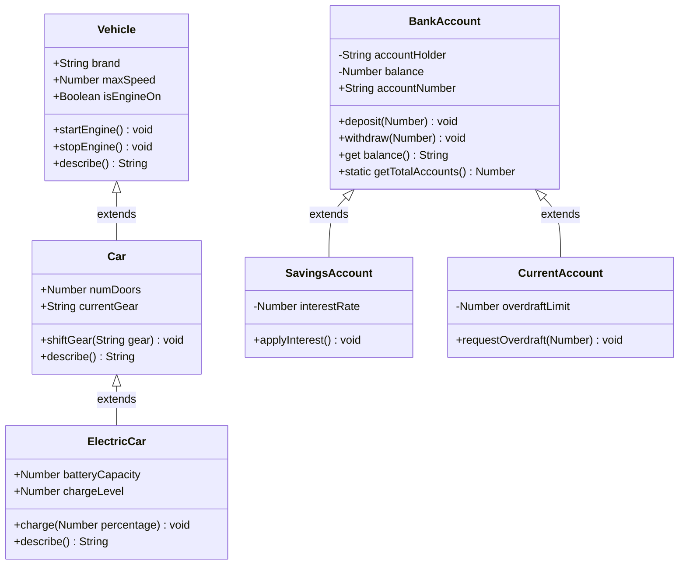
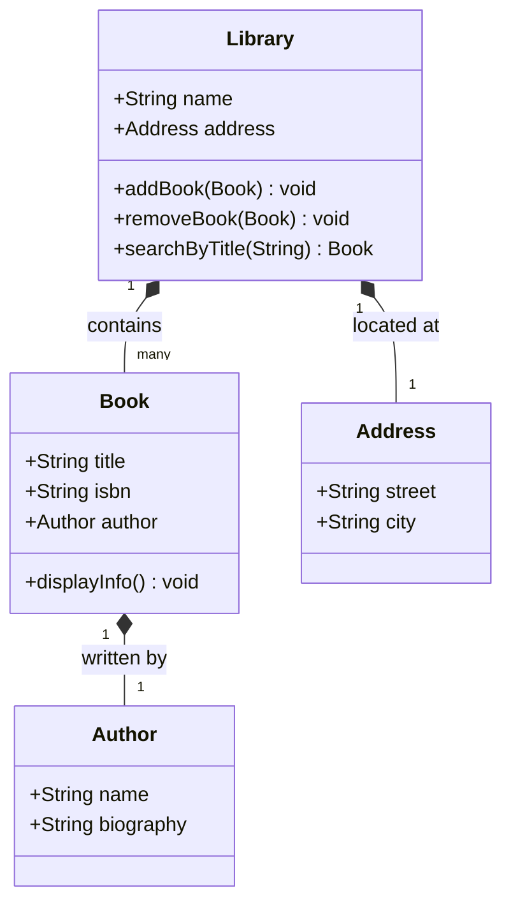
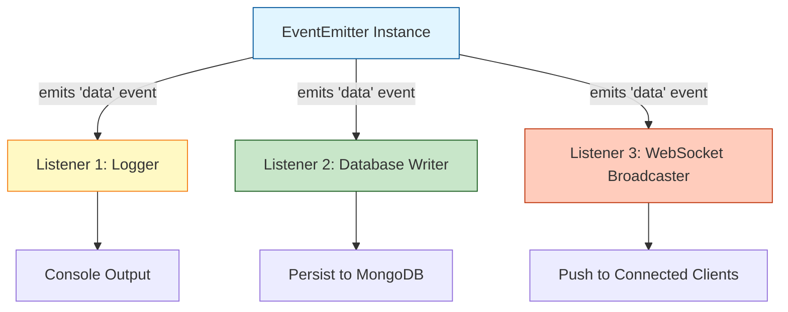
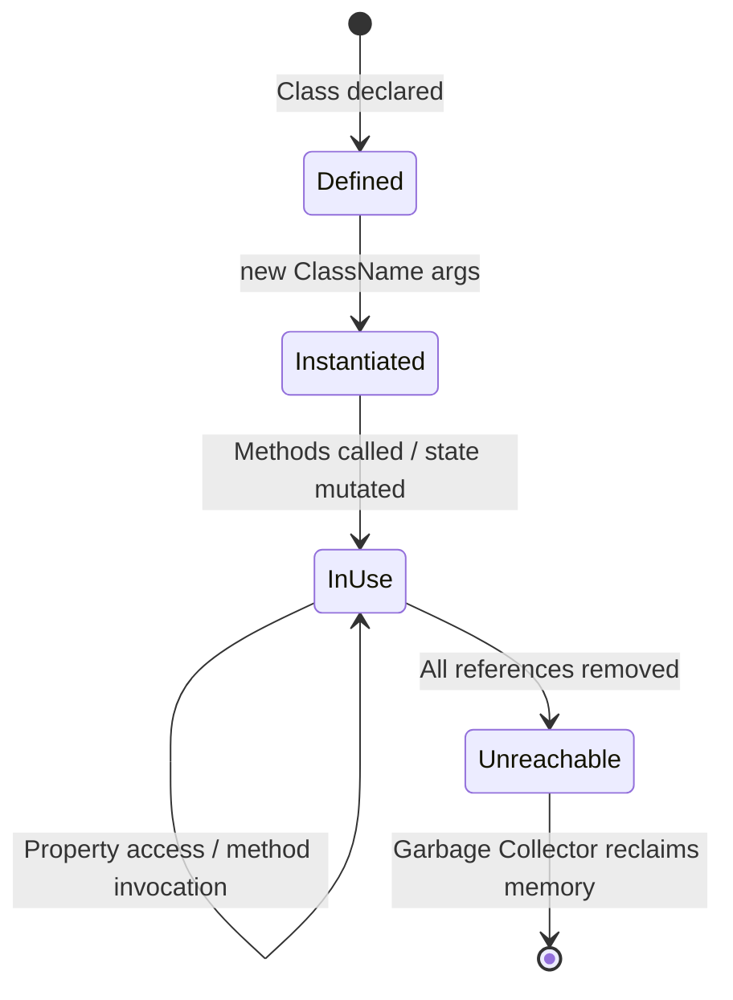
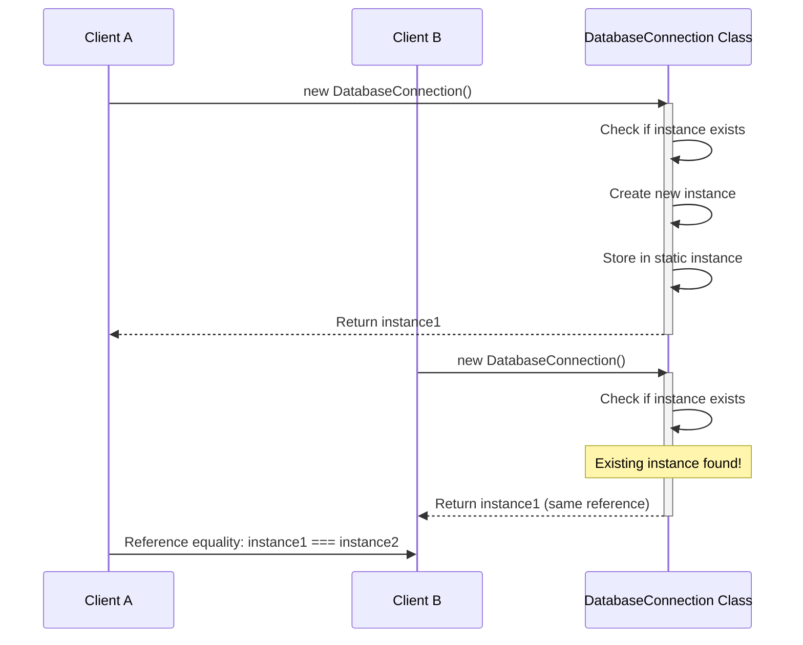
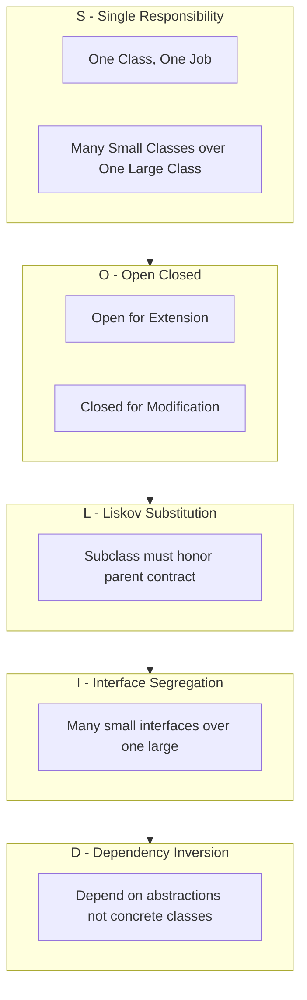

# Object-Oriented Design

<!-- SECTION_1_START -->
# Object-Oriented Design in Node.js

## 1.1 Core Technical Definition

> [!IMPORTANT]
> **Object-Oriented Design (OOD)** is a software design methodology that models a system as a collection of cooperating **objects**, where each object represents an instance of a **class** encapsulating both *state* (data/properties) and *behavior* (methods/functions). In the **Node.js** JavaScript runtime, OOD is realized through a hybrid paradigm: the **ES6 `class`** syntactic sugar layered on top of JavaScript's native **prototype-based inheritance** model.

In the context of **KTU 2024 Scheme – Web Programming (OECST832)**, Module 3 focuses on the **Node.js runtime environment**. Object-Oriented Design in this stack governs how scalable, modular, and maintainable server-side applications are architected using JavaScript/TypeScript.

## 1.2 The Four Pillars of OOD (as per KTU syllabus terminology)

| Pillar | Formal Definition |
|---|---|
| **Encapsulation** | Binding data and the methods that manipulate it into a single unit (object) while restricting direct external access to internal state. |
| **Abstraction** | Exposing only essential features of an object while hiding the complex implementation details. |
| **Inheritance** | Mechanism by which a child class acquires properties and methods of a parent class, promoting code reuse. |
| **Polymorphism** | Ability of objects of different classes to respond to the same method call in different ways (via method overriding/overloading). |

## 1.3 Intuitive Analogy

> [!NOTE]
> **Real-World Analogy: The "Restaurant Kitchen" Model**
>
> Imagine a Node.js application as a **professional restaurant**:
> - The **Class** is the **Recipe** (a blueprint) — it defines what ingredients (properties) are needed and what cooking steps (methods) must be followed.
> - The **Object** is the **Actual Dish** prepared from that recipe — a concrete, working instance.
> - **Encapsulation** is the **chef's kitchen** — outsiders see the finished plate, not the secret spice mix inside the pot.
> - **Inheritance** is the **"Parent Recipe"** — a generic *Dough Recipe* is the parent; *Pizza Dough* and *Bread Dough* inherit and specialize it.
> - **Polymorphism** is the **"Cut" verb** — a chef can *cut* vegetables, *cut* cake, or *cut* hair; the same call produces context-appropriate behavior.
> - **Abstraction** is the **Menu Card** — the customer only sees *"Grilled Chicken"* (interface), not the 12-step marination process.

## 1.4 Class-Based vs. Prototype-Based OOP

JavaScript is unique because it does **not** natively use class-based inheritance (like Java/C++). It uses **prototypal inheritance** — every object has a hidden link (`__proto__`) to another object called its **prototype**, from which it inherits methods and properties.

> [!IMPORTANT]
> **ES6 `class` keyword (introduced in 2015) is syntactic sugar** over JavaScript's underlying prototype chain. It does *not* introduce a new inheritance model — it merely provides a cleaner, class-like syntax over the existing prototypal mechanism. This is a frequently tested KTU concept.

## 1.5 Why OOD Matters in Node.js

Node.js applications are typically **non-blocking, event-driven, and modular**. OOD enables:

- **Maintainability** — Modular code is easier to debug and extend.
- **Reusability** — Through inheritance and composition.
- **Scalability** — Loose coupling allows independent deployment of modules.
- **Testability** — Encapsulated objects can be unit-tested in isolation.

The standard runtime constant relevant here is the **V8 JavaScript engine** (developed by Google, written in C++), which compiles JavaScript to machine code using just-in-time (JIT) compilation, executing OOP constructs at high performance.

---

<!-- SECTION_1_END -->

<!-- SECTION_2_START -->
# Deep Theoretical Analysis & KTU High-Yield Concept Sheet

## 2.1 The Object-Oriented Design Workflow

A structured OOD process in Node.js projects typically follows these phases:

1. **Requirement Analysis** — Identify nouns (objects) and verbs (methods) from the problem statement.
2. **Class Identification** — Define candidate classes with their responsibilities (CRC cards: **Class-Responsibility-Collaborator**).
3. **Relationship Modeling** — Establish *is-a* (inheritance) and *has-a* (composition/aggregation) relationships.
4. **UML Class Diagram Construction** — Visually represent the static structure.
5. **Implementation in JavaScript** — Translate design into ES6 classes or prototype-based objects.
6. **Refactoring with SOLID Principles** — Iteratively improve the design.

## 2.2 Relationships Between Classes

| Relationship | Keyword | UML Notation | JavaScript Realization |
|---|---|---|---|
| **Inheritance** | *is-a* | Hollow triangle arrow | `class Child extends Parent` |
| **Realization (Interface)** | *implements* | Dashed hollow triangle | Duck typing (no native `interface`) |
| **Composition** | *part-of* (strong lifecycle dependency) | Filled black diamond | Storing object reference as property |
| **Aggregation** | *has-a* (weak lifecycle dependency) | Hollow diamond | Storing reference; objects can exist independently |
| **Association** | *uses-a* | Plain line | Function parameters / method calls |
| **Dependency** | *depends-on* | Dashed arrow | Local variable / function parameter usage |

> [!NOTE]
> **Composition over Inheritance Principle** — KTU high-yield concept. Prefer *"has-a"* relationships over *"is-a"* when behavior is partially shared. Inheritance creates tight coupling; composition creates flexible, swappable components.

## 2.3 SOLID Principles (KTU Frequently Tested)

SOLID is the acronym coined by **Robert C. Martin (Uncle Bob)** for five object-oriented design principles:

- **S — Single Responsibility Principle (SRP)**: A class should have *one and only one reason to change*. Each class handles one functional concern.
- **O — Open/Closed Principle (OCP)**: Classes should be *open for extension* but *closed for modification*. Add new behavior via inheritance/composition, not by editing tested code.
- **L — Liskov Substitution Principle (LSP)**: Objects of a superclass shall be replaceable with objects of a subclass *without breaking* the application's correctness.
- **I — Interface Segregation Principle (ISP)**: Clients should not be forced to depend on methods they do not use. Prefer many small, specific interfaces over one large general-purpose one.
- **D — Dependency Inversion Principle (DIP)**: High-level modules should not depend on low-level modules. Both should depend on **abstractions** (interfaces/abstract classes).

## 2.4 Common Design Patterns Used in Node.js OOD

| Pattern | Category | Purpose in Node.js Context |
|---|---|---|
| **Singleton** | Creational | Ensures a class has only one instance (e.g., database connection pool). |
| **Factory** | Creational | Encapsulates object creation logic; useful for swappable implementations. |
| **Observer** | Behavioral | Event-driven architecture (Node.js `EventEmitter` is built on this). |
| **Module** | Structural | Encapsulates private state using closures (module-level scope). |
| **Strategy** | Behavioral | Selects algorithm behavior at runtime via composition. |
| **Decorator** | Structural | Adds behavior dynamically without modifying original class. |
| **Middleware** | Behavioral | Composable request-processing pipeline (Express.js core). |

## 2.5 KTU High-Yield Concept / Formula Cheat Sheet

> [!IMPORTANT]
> The following table is the **rapid-revision key** for KTU university exam answers. Memorize the column "KTU Definition".

| Concept | KTU Definition | JavaScript Keyword / Symbol | Real-World Node.js Use Case |
|---|---|---|---|
| **Class** | Blueprint for creating objects defining shared properties and methods. | `class ClassName { ... }` | `class UserService { ... }` |
| **Object** | Concrete instance of a class with unique state. | `new ClassName()` | `const u1 = new UserService()` |
| **Constructor** | Special method invoked at object creation to initialize state. | `constructor(params) { ... }` | Initializing database credentials. |
| **Property** | Variable attached to an object/class representing state. | `this.propName` (instance) / `static prop` (class) | `this.balance = 0` |
| **Method** | Function attached to a class representing behavior. | `methodName() { ... }` | `deposit(amount) { ... }` |
| **Inheritance** | Mechanism for code reuse through parent-child class hierarchy. | `extends` | `class AdminUser extends User` |
| **Method Overriding** | Subclass redefines a method inherited from parent. | Same method name in child class | Custom `toString()` in subclass. |
| **Encapsulation** | Hiding internal state behind a public interface. | `#privateField`, `WeakMap`, closures | Hiding password hash. |
| **Abstraction** | Hiding implementation, exposing only essential operations. | Abstract base classes (via convention) | `class Shape { area() { throw ... } }` |
| **Polymorphism** | Same interface, different underlying behavior. | Method overriding / duck typing | `req.pipe()` for streams/files. |
| **Static Member** | Belongs to the class itself, not instances. | `static method()` / `static field` | `Math.random()`, utility helpers. |
| **Getter/Setter** | Accessor methods that read/write properties via syntax. | `get prop()` / `set prop(value)` | Validated property access. |

## 2.6 Encapsulation Implementation Levels in JavaScript

JavaScript has *evolving* encapsulation support — a high-value KTU point:

1. **Convention-Based (Pre-ES6)**: Prefix with underscore `_privateField` (cosmetic only).
2. **Closure-Based**: Store private state in constructor scope (true privacy).
3. **ES6 Symbols**: Use `Symbol()` keys to create semi-private members.
4. **ES2022 Native Private Fields**: Use `#privateField` syntax (true language-level privacy).
5. **WeakMap-Based**: Store private state in a `WeakMap` keyed by instance.

## 2.7 UML Class Diagram — Reading Notation (KTU Practical Skill)

A UML class diagram box has three compartments:

```
+----------------------+
|        ClassName     |   ← Class name (bold, centered)
+----------------------+
|  - privateField: int |   ← Attributes (visibility name: type)
|  + publicMethod():void|   ← Methods (visibility name(): returnType)
+----------------------+
```

Visibility symbols: `+` public, `-` private, `#` protected, `~` package.

---

<!-- SECTION_2_END -->

<!-- SECTION_3_START -->
# Step-by-Step Derivations & Code Implementation

## 3.1 JavaScript Class — From Blueprint to Instance

```javascript
// === Class Definition: BankAccount (OOP Blueprint) ===
class BankAccount {
    // 1. Static (class-level) property — shared across all instances
    static bankName = "KTU Federal Bank";
    static accountCounter = 0;

    // 2. Private field (ES2022+) — true encapsulation with '#'
    #balance;
    #accountHolder;

    // 3. Constructor — initializes the new object's state
    constructor(accountHolder, initialBalance) {
        if (initialBalance < 0) {
            throw new Error("Initial balance cannot be negative.");
        }
        this.#accountHolder = accountHolder;
        this.#balance = initialBalance;
        BankAccount.accountCounter += 1;
        this.accountNumber = `KTU-${BankAccount.accountCounter.toString().padStart(6, '0')}`;
    }

    // 4. Public method — controlled access to private state
    deposit(amount) {
        if (amount <= 0) {
            console.log("Deposit amount must be positive.");
            return;
        }
        this.#balance += amount;
        console.log(`Deposited ₹${amount}. New balance: ₹${this.#balance}`);
    }

    withdraw(amount) {
        if (amount > this.#balance) {
            console.log("Insufficient funds.");
            return;
        }
        this.#balance -= amount;
        console.log(`Withdrew ₹${amount}. Remaining: ₹${this.#balance}`);
    }

    // 5. Getter — read-only access to balance
    get balance() {
        return `₹${this.#balance} (Account: ${this.accountNumber})`;
    }

    // 6. Static method — utility at class level
    static getTotalAccounts() {
        return BankAccount.accountCounter;
    }
}

// === Object Instantiation ===
const account1 = new BankAccount("Anand Krishnan", 5000);
const account2 = new BankAccount("Priya Menon", 10000);

account1.deposit(2000);   // Output: Deposited ₹2000. New balance: ₹7000
console.log(account1.balance); // Output: ₹7000 (Account: KTU-000001)
console.log(BankAccount.getTotalAccounts()); // Output: 2
// console.log(account1.#balance); // SyntaxError — true private field
```

**Exhaustive Explanation of Each Line:**

- `static bankName = "..."` — A *static field* lives on the **class object itself**, not on any instance. It is accessed via `BankAccount.bankName`, never `account1.bankName`.
- `#balance` — The `#` prefix creates a *truly private* field that is inaccessible from outside the class body, even via reflection on most engines.
- `constructor(...)` — Automatically called by the `new` operator. Validates inputs before mutating state (defensive programming).
- `BankAccount.accountCounter += 1` — Modifies the static (class-level) counter, demonstrating how static members track aggregate data across instances.
- `padStart(6, '0')` — String method that left-pads the counter to 6 digits, e.g., `1` becomes `000001`.
- `get balance()` — A *getter* defined with the `get` keyword. It allows read access to derived data while blocking direct assignment.
- `static getTotalAccounts()` — Invoked on the class, not on instances. Useful for factories or registry patterns.

---

## 3.2 Inheritance — `extends` and `super`

```javascript
// === Parent (Base) Class ===
class Vehicle {
    constructor(brand, maxSpeed) {
        this.brand = brand;
        this.maxSpeed = maxSpeed;
        this.isEngineOn = false;
    }

    startEngine() {
        this.isEngineOn = true;
        console.log(`${this.brand} engine started.`);
    }

    stopEngine() {
        this.isEngineOn = false;
        console.log(`${this.brand} engine stopped.`);
    }

    // Method intended to be overridden (polymorphic hook)
    describe() {
        return `${this.brand} with max speed ${this.maxSpeed} km/h`;
    }
}

// === Child Class: Car (inherits from Vehicle) ===
class Car extends Vehicle {
    constructor(brand, maxSpeed, numDoors) {
        super(brand, maxSpeed);          // MUST call super() before using 'this'
        this.numDoors = numDoors;
        this.currentGear = 'P';          // Park
    }

    shiftGear(gear) {
        const validGears = ['P', 'R', 'N', 'D'];
        if (!validGears.includes(gear)) {
            console.log(`Invalid gear: ${gear}`);
            return;
        }
        this.currentGear = gear;
        console.log(`Gear shifted to ${gear}.`);
    }

    // Method overriding — Polymorphism
    describe() {
        const base = super.describe();   // Call parent version
        return `${base}, ${this.numDoors}-door car currently in ${this.currentGear}`;
    }
}

// === Child Class: ElectricCar (multi-level inheritance) ===
class ElectricCar extends Car {
    constructor(brand, maxSpeed, numDoors, batteryCapacity) {
        super(brand, maxSpeed, numDoors);
        this.batteryCapacity = batteryCapacity;  // in kWh
        this.chargeLevel = 100;                  // percentage
    }

    charge(percentage) {
        this.chargeLevel = Math.min(100, this.chargeLevel + percentage);
        console.log(`Charged to ${this.chargeLevel}%.`);
    }

    // Polymorphic override — different behavior for electric vehicles
    describe() {
        return `${super.describe()} | Battery: ${this.batteryCapacity}kWh at ${this.chargeLevel}%`;
    }
}

// === Demonstration ===
const tesla = new ElectricCar("Tesla", 250, 4, 100);
tesla.startEngine();      // Inherited from Vehicle
tesla.shiftGear('D');     // Defined in Car
tesla.charge(10);         // Defined in ElectricCar
console.log(tesla.describe());
// Output:
// Tesla engine started.
// Gear shifted to D.
// Charged to 100% (capped).
// Tesla with max speed 250 km/h, 4-door car currently in D | Battery: 100kWh at 100%
```

**Exhaustive Explanation:**

- `class Car extends Vehicle` — Establishes an *is-a* relationship. `Car` inherits all non-private members of `Vehicle`.
- `super(brand, maxSpeed)` — Invokes the **parent constructor** with the given arguments. **Mandatory** before accessing `this` in a derived class constructor.
- `super.describe()` — Calls the **parent class's overridden method**, enabling extension of behavior rather than complete replacement.
- Multi-level inheritance (`ElectricCar → Car → Vehicle`) — Forms an inheritance chain. JavaScript supports this but discourages deep chains (prefer composition).
- The same `describe()` method produces *different outputs* depending on the actual object type — this is **runtime polymorphism**.

---

## 3.3 Polymorphism via Duck Typing

JavaScript does not require formal interface declarations. Polymorphism is achieved via **duck typing** — *"If it walks like a duck and quacks like a duck, it is a duck."*

```javascript
// === Polymorphic function accepting any "speakable" object ===
function makeItSpeak(entity) {
    console.log(entity.speak());   // Expects .speak() — no formal interface enforced
}

class Dog {
    speak() { return "Woof!"; }
}

class Human {
    speak() { return "Hello!"; }
}

class Parrot {
    speak() { return "Polly wants a cracker!"; }
}

makeItSpeak(new Dog());     // Output: Woof!
makeItSpeak(new Human());   // Output: Hello!
makeItSpeak(new Parrot());  // Output: Polly wants a cracker!
```

The function works with **any object** that implements a `speak()` method — formal inheritance is not required. This is JavaScript's structural typing model.

---

## 3.4 Encapsulation via Closures (Pre-ES2022 Pattern)

```javascript
// === Factory Function returning a "Class-like" object with true privacy ===
function createCounter(initialValue = 0) {
    let count = initialValue;        // Closed-over private variable

    return {
        increment() { count += 1; return count; },
        decrement() { count -= 1; return count; },
        getCount()  { return count; }
        // 'count' is not exposed — fully encapsulated
    };
}

const counter = createCounter(10);
console.log(counter.increment());  // 11
console.log(counter.increment());  // 12
console.log(counter.getCount());   // 12
// console.log(counter.count);     // undefined — true privacy via closure
```

**Exhaustive Explanation:**

- The `createCounter` function creates a **closure** over the local variable `count`.
- The returned object exposes *only* three methods; `count` is unreachable from outside.
- This is the *original* OOP pattern used in JavaScript before ES6 classes — it is **still preferred** by some for functional/OOP hybrid design.

---

## 3.5 Singleton Design Pattern in Node.js

```javascript
// === Singleton: Database Connection Manager ===
class DatabaseConnection {
    #connection;

    constructor() {
        if (DatabaseConnection.instance) {
            // Constructor called again — return existing instance
            return DatabaseConnection.instance;
        }
        this.#connection = this.#openConnection();
        DatabaseConnection.instance = this;
    }

    #openConnection() {
        console.log("Opening new database connection...");
        // Simulated connection object
        return { host: "localhost", port: 5432, status: "connected" };
    }

    query(sql) {
        return `Executing: ${sql} on ${this.#connection.host}:${this.#connection.port}`;
    }
}

const db1 = new DatabaseConnection();
const db2 = new DatabaseConnection();

console.log(db1 === db2);  // Output: true  (same instance)
console.log(db1.query("SELECT * FROM users"));
// Output: Executing: SELECT * FROM users on localhost:5432
```

**Exhaustive Explanation:**

- The first `new DatabaseConnection()` call creates the instance and stores it in the static `instance` property.
- Any subsequent call detects the existing instance and **returns it instead** — even though the `new` keyword is used.
- This guarantees a single shared resource (e.g., one database connection pool per process).

---

## 3.6 Factory Design Pattern in Node.js

```javascript
// === Factory: Creates different User types based on role ===
class AdminUser {
    constructor(name) { this.name = name; this.role = "admin"; }
    permissions() { return ["read", "write", "delete", "manage_users"]; }
}

class RegularUser {
    constructor(name) { this.name = name; this.role = "user"; }
    permissions() { return ["read", "write"]; }
}

class GuestUser {
    constructor(name) { this.name = name; this.role = "guest"; }
    permissions() { return ["read"]; }
}

// Factory function encapsulates object creation logic
function userFactory(name, role) {
    switch (role.toLowerCase()) {
        case "admin":  return new AdminUser(name);
        case "guest":  return new GuestUser(name);
        case "user":
        default:       return new RegularUser(name);
    }
}

const u = userFactory("Anand", "admin");
console.log(`${u.name} (${u.role}) can: ${u.permissions().join(", ")}`);
// Output: Anand (admin) can: read, write, delete, manage_users
```

**Exhaustive Explanation:**

- The factory function **decouples** the client code from the concrete class implementations.
- Adding a new user role requires modifying only the factory, not the consumers.
- This is a textbook application of the **Open/Closed Principle**.

---

## 3.7 SOLID — Single Responsibility Principle in Node.js

```javascript
// === BAD Design: One class doing too much (violates SRP) ===
class BadUser {
    constructor(name, email) {
        this.name = name;
        this.email = email;
    }
    save() { /* saves to database */ }
    sendEmail(msg) { /* sends email */ }
    generateReport() { /* generates PDF report */ }
}

// === GOOD Design: Each class has ONE responsibility ===
class User {
    constructor(name, email) {
        this.name = name;
        this.email = email;
    }
}

class UserRepository {
    save(user) { console.log(`Saving ${user.name} to DB.`); }
}

class EmailService {
    sendWelcome(user) { console.log(`Email sent to ${user.email}.`); }
}

class ReportGenerator {
    generate(user) { console.log(`Report generated for ${user.name}.`); }
}

const user = new User("Anand", "anand@ktu.ac.in");
new UserRepository().save(user);
new EmailService().sendWelcome(user);
new ReportGenerator().generate(user);
```

**Exhaustive Explanation:**

- The `User` class now *only* represents data (Single Responsibility).
- Persistence, communication, and reporting concerns are split into dedicated classes.
- This separation enables **independent testing** and **easier modification** of one concern without affecting the others.

---

## 3.8 Composition over Inheritance — Practical Example

```javascript
// === Building complex behavior through composition ===
const canFly   = (state) => ({ fly:   () => console.log(`${state.name} is flying.`) });
const canSwim  = (state) => ({ swim:  () => console.log(`${state.name} is swimming.`) });
const canQuack = (state) => ({ quack: () => console.log(`${state.name} says quack!`) });

// "Mixing in" capabilities — "has-a" relationship
function createDuck(name) {
    const state = { name };
    return Object.assign(state, canFly(state), canSwim(state), canQuack(state));
}

const donald = createDuck("Donald");
donald.fly();    // Donald is flying.
donald.swim();   // Donald is swimming.
donald.quack();  // Donald says quack!

// A non-flying duck variant — composition enables flexible variation
function createPenguin(name) {
    const state = { name };
    return Object.assign(state, canSwim(state));   // No canFly mixed in
}

const pingu = createPenguin("Pingu");
pingu.swim();    // Pingu is swimming.
// pingu.fly();   // TypeError: pingu.fly is not a function — flexibility demonstrated
```

**Exhaustive Explanation:**

- `Object.assign(state, canFly(state), canSwim(state), canQuack(state))` merges capability objects into the base state.
- The same components can be recombined to produce different objects (duck vs. penguin).
- This avoids the **rigid class hierarchies** of inheritance and is the *preferred* approach in modern JavaScript/TypeScript design.

---

## 3.9 Node.js Module Pattern — OOP-Style Encapsulation

```javascript
// === Node.js CommonJS Module — Exposing a Class via module.exports ===
// File: logger.js
class Logger {
    #logHistory = [];

    log(message) {
        const entry = `[${new Date().toISOString()}] ${message}`;
        console.log(entry);
        this.#logHistory.push(entry);
    }

    getHistory() {
        return [...this.#logHistory];   // Return a copy — preserve encapsulation
    }
}

module.exports = Logger;

// File: app.js
const Logger = require('./logger');
const logger = new Logger();
logger.log("Server started on port 3000.");
```

**Exhaustive Explanation:**

- The module file *only* exports the `Logger` class — not the internals.
- Consumers require the module and instantiate as needed.
- This combines **module-level encapsulation** (Node.js) with **class-level encapsulation** (JavaScript).

---

<!-- SECTION_3_END -->

<!-- SECTION_4_START -->
# Structural Diagrams & Schematics

## 4.1 Class Hierarchy — Inheritance Diagram



---

## 4.2 Composition Relationship — "Has-A" Model



**Reading the Diagram:**
- `*--` denotes **composition** (filled black diamond) — strong lifecycle dependency.
- `Library` *owns* `Book` objects; if the library is destroyed, its books are also logically removed.
- `Book` *owns* an `Author` reference, but authors can exist independently — illustrating aggregation in larger systems.

---

## 4.3 Design Pattern Flow — Observer Pattern (Node.js EventEmitter)



**Flow Description:**
- The `EventEmitter` (Subject) maintains a list of subscribers.
- On `emit('data', payload)`, all registered listeners are invoked **asynchronously** in registration order.
- This decouples the producer from consumers — foundational to Node.js's event-driven architecture.

---

## 4.4 Object Lifecycle — Creation to Garbage Collection



**Description:**
- A class is *defined* (parsed by V8) but consumes no heap memory for instances.
- `new` allocates an object on the **V8 heap** in the **New Space** (young generation).
- Long-lived objects are promoted to the **Old Space** during minor GC cycles.
- The **Orinoco / Minor Mark-Sweep / Major Mark-Compact** collectors reclaim unreachable objects.

---

## 4.5 OOD Process Flow — From Requirements to Implementation


---

## 4.6 Singleton Pattern — Sequence of Operations



---

## 4.7 SOLID Principles — Visual Summary Matrix



---

<!-- SECTION_4_END -->

<!-- SECTION_5_START -->
# KTU 2024 Scheme Examination Question Bank & Topic Recap

---

## PART A — 3 Mark Questions

### Question 1
> **[KTU University Exam — July 2024]**
> **Define Object-Oriented Design. List any four fundamental principles of OOD.**

**Model Answer (3 Marks):**

**Object-Oriented Design (OOD)** is a software design methodology that organizes a system as a collection of interacting **objects**, each combining *data* (attributes) and *behavior* (methods), and models real-world entities through abstract classes and their relationships.

The four fundamental principles of OOD are:

1. **Encapsulation** — Bundling data and methods within a class and restricting external access to internal state.
2. **Abstraction** — Hiding implementation details and exposing only essential functionality.
3. **Inheritance** — Allowing a class (child) to acquire properties and methods of another class (parent), promoting code reuse.
4. **Polymorphism** — Enabling the same interface or method call to invoke different behaviors depending on the underlying object type.

*[Stating formal definition: 1 Mark. Listing all four principles correctly with brief explanation: 2 Marks]*

---

### Question 2
> **[KTU University Exam — Dec 2023]**
> **Differentiate between class-based inheritance and prototypal inheritance in JavaScript.**

**Model Answer (3 Marks):**

| Aspect | Class-Based Inheritance | Prototypal Inheritance |
|---|---|---|
| **Model** | Objects are instantiated from class blueprints. | Objects inherit directly from other objects via the prototype chain. |
| **Syntax** | `class Child extends Parent { ... }` | `Object.create(parentObject)` or constructor function with `Child.prototype = new Parent()` |
| **Origin** | Traditional OOP languages (Java, C++). | Native to JavaScript since its inception (1995). |
| **ES6 Relation** | Modern syntax introduced as syntactic sugar. | The underlying mechanism that powers `class` syntax. |
| **Flexibility** | Hierarchical and rigid. | Dynamic — prototype can be modified at runtime. |

> [!NOTE]
> The `class` keyword in ES6 does **not** introduce true class-based inheritance; it is *syntactic sugar* over JavaScript's native prototype mechanism.

*[Stating the core difference: 1 Mark. Tabular comparison with at least 4 valid points: 2 Marks]*

---

## PART B — 14 Mark Questions (Module Internal Choice Pattern)

### Question A (14 Marks)
> **[KTU University Exam — July 2024 | Module 3 | CO3, Apply]**
> **(a)** Explain the concept of **Encapsulation** in Object-Oriented Design. Demonstrate with a JavaScript example how true data hiding can be achieved using **ES2022 private fields (`#`)**. *(7 Marks)*

> **(b)** Design and implement a JavaScript class hierarchy for an **Online Shopping System** with `Product` as the base class and `Electronics` and `Clothing` as derived classes. Demonstrate **polymorphism** by overriding a `getDiscountedPrice()` method in each derived class. *(7 Marks)*

---

### Model Solution to Question A

#### Part (a) — Encapsulation with Private Fields (7 Marks)

**Conceptual Explanation:**

> [!IMPORTANT]
> **Encapsulation** is the OOP principle of *binding data (attributes) and the methods that operate on that data into a single unit (object)*, while *restricting direct access* to some of the object's components. This is achieved through *access modifiers* (private, public, protected).

**Implementation Code:**

```javascript
class StudentRecord {
    // Private fields — inaccessible from outside the class
    #name;
    #rollNumber;
    #marks;

    constructor(name, rollNumber, marks) {
        this.#name = name;
        this.#rollNumber = rollNumber;
        this.setMarks(marks);    // Use setter for validation
    }

    // Public getter — controlled read access
    get name() { return this.#name; }
    get rollNumber() { return this.#rollNumber; }
    get marks() { return this.#marks; }

    // Public setter — validation enforced
    setMarks(newMarks) {
        if (newMarks < 0 || newMarks > 100) {
            throw new Error("Marks must be between 0 and 100.");
        }
        this.#marks = newMarks;
    }

    computeGrade() {
        if (this.#marks >= 90) return 'A+';
        if (this.#marks >= 80) return 'A';
        if (this.#marks >= 70) return 'B';
        if (this.#marks >= 60) return 'C';
        return 'F';
    }

    display() {
        return `Student: ${this.#name} (${this.#rollNumber}) | Marks: ${this.#marks} | Grade: ${this.computeGrade()}`;
    }
}

const s1 = new StudentRecord("Anand K", "KTU2024CS001", 87);
console.log(s1.display());
// Output: Student: Anand K (KTU2024CS001) | Marks: 87 | Grade: A
// console.log(s1.#marks);  // SyntaxError — true private field
s1.setMarks(95);
console.log(s1.marks);  // Output: 95
```

**Valuation Key Points:**

- [Defining encapsulation concept clearly: 2 Marks]
- [Declaring private fields using `#`: 1 Mark]
- [Implementing getter and setter with validation: 2 Marks]
- [Demonstrating that direct access to private fields throws error: 1 Mark]
- [Correct final output: 1 Mark]

---

#### Part (b) — Polymorphic Class Hierarchy (7 Marks)

```javascript
class Product {
    constructor(name, price) {
        this.name = name;
        this.price = price;
    }

    // Polymorphic hook — to be overridden
    getDiscountedPrice() {
        return this.price;    // No discount by default
    }

    display() {
        return `${this.name} | MRP: ₹${this.price} | Final: ₹${this.getDiscountedPrice()}`;
    }
}

class Electronics extends Product {
    constructor(name, price, warrantyYears) {
        super(name, price);
        this.warrantyYears = warrantyYears;
    }
    getDiscountedPrice() {
        return (this.price * 0.85).toFixed(2);  // 15% discount
    }
}

class Clothing extends Product {
    constructor(name, price, season) {
        super(name, price);
        this.season = season;
    }
    getDiscountedPrice() {
        return (this.price * 0.70).toFixed(2);  // 30% seasonal discount
    }
}

class Grocery extends Product {
    constructor(name, price) {
        super(name, price);
    }
    getDiscountedPrice() {
        return (this.price * 0.95).toFixed(2);  // 5% discount
    }
}

// === Polymorphic function — works with any Product subclass ===
function showFinalPrice(product) {
    console.log(product.display());
}

showFinalPrice(new Electronics("Smartphone", 30000, 2));
// Output: Smartphone | MRP: ₹30000 | Final: ₹25500.00

showFinalPrice(new Clothing("Winter Jacket", 5000, "Winter"));
// Output: Winter Jacket | MRP: ₹5000 | Final: ₹3500.00

showFinalPrice(new Grocery("Rice 5kg", 600));
// Output: Rice 5kg | MRP: ₹600 | Final: ₹570.00
```

**Valuation Key Points:**

- [Defining base class `Product` with constructor and polymorphic method: 2 Marks]
- [Implementing two derived classes with `extends` and `super()`: 2 Marks]
- [Correctly overriding `getDiscountedPrice()` in each derived class: 2 Marks]
- [Demonstrating runtime polymorphism via shared function: 1 Mark]

---

### Question B (14 Marks) — Alternative
> **[KTU University Exam — Dec 2023 | Module 3 | CO3, Apply]**
> **(a)** Explain the **SOLID** principles of Object-Oriented Design. Write short JavaScript snippets illustrating **Single Responsibility Principle (SRP)** and **Open/Closed Principle (OCP)**. *(7 Marks)*

> **(b)** Implement the **Singleton Design Pattern** in JavaScript for a Node.js application to ensure a single instance of a `Logger` class. Show how the pattern prevents multiple instances from being created. *(7 Marks)*

---

### Model Solution to Question B

#### Part (a) — SOLID Principles (7 Marks)

**Conceptual Explanation:**

> [!IMPORTANT]
> **SOLID** is an acronym for five object-oriented design principles introduced by **Robert C. Martin** to create more understandable, flexible, and maintainable software.

| Letter | Principle | Definition |
|---|---|---|
| **S** | Single Responsibility | A class should have one, and only one, reason to change. |
| **O** | Open/Closed | Classes open for extension but closed for modification. |
| **L** | Liskov Substitution | Subtypes must be substitutable for their base types. |
| **I** | Interface Segregation | Prefer many small interfaces over one general-purpose interface. |
| **D** | Dependency Inversion | Depend on abstractions, not concrete implementations. |

**SRP Snippet:**

```javascript
// SRP Violation: One class with three responsibilities
class BadOrder {
    calculateTotal() { /* ... */ }
    saveToDatabase() { /* ... */ }
    sendConfirmationEmail() { /* ... */ }
}

// SRP Compliance: Three classes, three responsibilities
class Order {
    constructor(items) { this.items = items; }
    calculateTotal() { return this.items.reduce((s, i) => s + i.price, 0); }
}

class OrderRepository {
    save(order) { console.log(`Order saved. Total: ${order.calculateTotal()}`); }
}

class EmailNotifier {
    sendConfirmation(order) { console.log(`Email sent for order total ${order.calculateTotal()}.`); }
}

const order = new Order([{ price: 100 }, { price: 200 }]);
new OrderRepository().save(order);
new EmailNotifier().sendConfirmation(order);
```

**OCP Snippet:**

```javascript
// OCP: Add new discount types without modifying existing code
class Discount {
    getDiscount(price) { return 0; }   // Default: no discount
}

class SeasonalDiscount extends Discount {
    getDiscount(price) { return price * 0.20; }
}

class LoyaltyDiscount extends Discount {
    getDiscount(price) { return price * 0.10; }
}

class PriceCalculator {
    calculate(price, discount) {
        return price - discount.getDiscount(price);
    }
}

const calc = new PriceCalculator();
console.log(calc.calculate(1000, new SeasonalDiscount()));  // 800
console.log(calc.calculate(1000, new LoyaltyDiscount()));    // 900
```

**Valuation Key Points:**

- [Listing all five SOLID principles with definitions: 3 Marks]
- [Correct SRP example with proper separation: 2 Marks]
- [Correct OCP example with extension through inheritance: 2 Marks]

---

#### Part (b) — Singleton Logger (7 Marks)

```javascript
class Logger {
    static #instance = null;
    #logFile;
    #logHistory = [];

    constructor(logFile = "app.log") {
        if (Logger.#instance) {
            return Logger.#instance;     // Return existing instance
        }
        this.#logFile = logFile;
        Logger.#instance = this;
        console.log(`[Logger initialized] Writing to ${this.#logFile}`);
    }

    log(level, message) {
        const entry = {
            timestamp: new Date().toISOString(),
            level,
            message
        };
        this.#logHistory.push(entry);
        console.log(`[${entry.timestamp}] [${level}] ${message}`);
    }

    getHistory() {
        return [...this.#logHistory];
    }
}

// === Test the Singleton Property ===
const loggerA = new Logger("server.log");
const loggerB = new Logger("another.log");   // Attempt to create second instance

console.log(loggerA === loggerB);  // Output: true (SAME instance)

loggerA.log("INFO", "Server started on port 3000.");
loggerB.log("WARN", "Memory usage at 80%.");

console.log(`Total log entries: ${loggerA.getHistory().length}`);
// Output: 2
```

**Valuation Key Points:**

- [Correct use of static private field for instance storage: 2 Marks]
- [Constructor returning existing instance on subsequent calls: 2 Marks]
- [Demonstrating singleton behavior with reference equality check: 2 Marks]
- [Showing logging functionality works across references: 1 Mark]

---

## KTU Examiner's Valuation Warning

> [!WARNING]
> **Common Pitfalls Where Students Lose Marks in OOD Questions:**
>
> 1. **Confusing ES6 `class` with true class-based OOP** — Examiners expect students to know that `class` is *syntactic sugar* over prototypes. Failing to mention this loses **2 Marks** in conceptual questions.
>
> 2. **Forgetting `super()` in derived class constructors** — JavaScript throws a `ReferenceError: Must call super constructor` if you attempt to use `this` before calling `super()`. Examiners deduct marks for not using `super()` correctly.
>
> 3. **Using `_underscore` as "private"** — A leading underscore is *purely conventional*; it does not enforce any privacy. Examiners expect awareness that true privacy requires either `#privateField` (ES2022+) or closure-based patterns.
>
> 4. **Skipping UML diagrams** — When asked to "design" a hierarchy, students must include at least a textual or Mermaid **UML class diagram**. A code-only answer loses 2–3 Marks.
>
> 5. **Defining a "static method" without the `static` keyword** — Examiners check for correct usage of `static` for class-level members versus instance-level members.
>
> 6. **Conflating "Polymorphism" with "Method Overloading"** — JavaScript does not natively support method overloading (multiple methods with same name, different parameters). True polymorphism in JS is achieved via *method overriding* and *duck typing*. Examiners penalize confusion here.
>
> 7. **Not using parameter type hints and validations in code snippets** — KTU expects defensive programming: validate constructor arguments, handle edge cases.

---

## Topic Recap & Important Things to Remember

> [!IMPORTANT]
> **Rapid-Revision Checklist — Module 3: Object-Oriented Design (Node.js)**

**Core Concepts**
- Object-Oriented Design (OOD) is a methodology that models systems as collections of cooperating objects, each bundling *state* (properties) and *behavior* (methods).
- The four pillars are **Encapsulation, Abstraction, Inheritance, Polymorphism**.
- JavaScript uses **prototypal inheritance** natively; the ES6 `class` keyword is **syntactic sugar** over the prototype chain.

**Class Mechanics in JavaScript**
- Class declarations use `class ClassName { ... }`.
- Constructors are defined via `constructor(params) { ... }`.
- Inheritance uses `class Child extends Parent { ... }`; the `super()` call in the constructor is **mandatory** before using `this`.
- Static members (methods/fields) belong to the class itself, accessed via `ClassName.member`, not `instance.member`.
- Method overriding (not overloading) is the JS-native way to achieve polymorphism.

**Encapsulation Levels**
- Convention: `_privateField` (cosmetic).
- Closure: True privacy via function-scope variables.
- Symbol: `Symbol("key")` for semi-private members.
- **ES2022 native**: `#privateField` for true language-level privacy.
- WeakMap: Stores private state outside the object.

**Inheritance vs. Composition**
- Inheritance models an **is-a** relationship (tight coupling).
- Composition models a **has-a** relationship (flexible, preferred for shared behavior).
- Use `Object.assign(state, capabilityA, capabilityB)` to mix in capabilities.

**Design Patterns (Node.js Context)**
- **Singleton**: Single shared instance (DB connection, logger).
- **Factory**: Encapsulates object creation (user role factory).
- **Observer**: Event-driven via `EventEmitter`.
- **Module**: Encapsulation via `module.exports` and closure scope.
- **Strategy**: Runtime algorithm selection via composition.
- **Middleware**: Composable request-processing pipeline (Express.js).

**SOLID Principles**
- **S** — Single Responsibility: One class, one reason to change.
- **O** — Open/Closed: Extend via inheritance/composition; do not modify tested code.
- **L** — Liskov Substitution: Subclass must honor parent contract.
- **I** — Interface Segregation: Many small interfaces over one large.
- **D** — Dependency Inversion: Depend on abstractions.

**UML Notation Quick Reference**
- `+` public, `-` private, `#` protected, `~` package.
- Hollow triangle arrow `▷` = inheritance.
- Filled black diamond `◆` = composition.
- Hollow diamond `◇` = aggregation.
- Dashed line = dependency/realization.

**Common Exam-Trigger Keywords**
- *"Demonstrate true data hiding"* → Use `#privateField` or closure pattern.
- *"Show runtime polymorphism"* → Use method overriding + shared function accepting parent type.
- *"Explain the difference between class-based and prototypal inheritance"* → Emphasize that ES6 `class` is *not* a new inheritance model.
- *"Implement a Singleton"* → Use static instance field + constructor guard.
- *"Apply SOLID principles"* → Refactor monolithic classes into single-responsibility classes.

**Runtime Reference**
- Node.js executes JavaScript on the **V8 engine** (Chrome's JS engine).
- OOP constructs are compiled to optimized machine code via **JIT (Just-In-Time) compilation**.
- Memory management is **automatic** via the **Garbage Collector** (Orinoco / Minor Mark-Sweep).

---

<!-- SECTION_5_END -->
