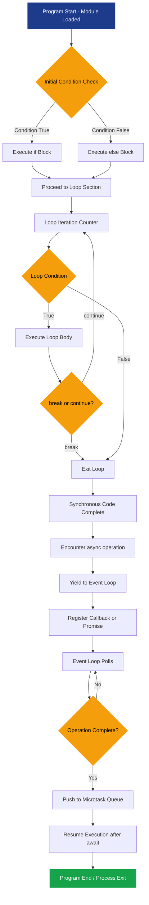
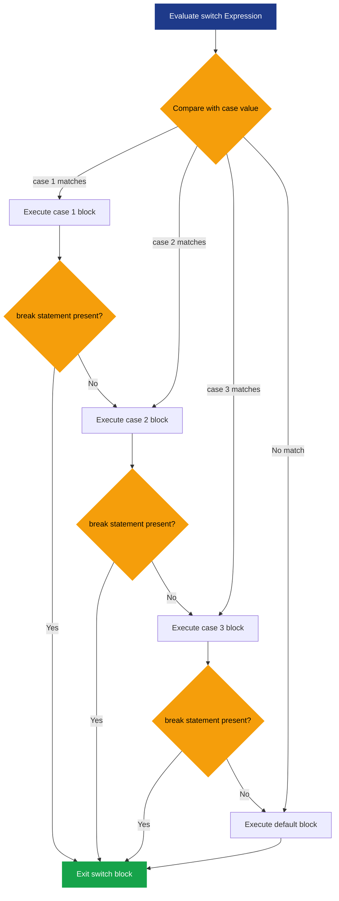

# Program Control

<!-- SECTION_1_START -->

# Program Control in Node.js JavaScript Runtime Environment

## 1.1 Formal Academic Definition

**Program Control** in the context of Node.js refers to the set of statements and constructs that govern the **order of execution** of instructions within a JavaScript program running on the V8 engine outside the browser. According to the KTU 2024 Scheme syllabus for WEB PROGRAMMING (OECST832), program control encompasses the decision-making constructs (`if`, `if-else`, `switch`), iterative constructs (`for`, `while`, `do-while`, `for...in`, `for...of`), and jump statements (`break`, `continue`, `return`) that allow a Node.js application to implement non-linear execution flow.

In Node.js, program control is executed on the **single-threaded event loop**, where synchronous control structures run on the call stack, and asynchronous control flow (callbacks, Promises, `async`/`await`) is orchestrated via the **libuv** library and the **microtask/macrotask queues**.

> [!IMPORTANT]
> **KTU 2024 Syllabus Highlight:** In the Node.js runtime, the standard JavaScript control structures (defined in **ECMAScript 2024 / ES14**) behave identically to browser-side JavaScript, but their execution is decoupled from the DOM. Node.js introduces **asynchronous control primitives** (callbacks, Promises, `async`/`await`) which are core to non-blocking I/O.

## 1.2 Conceptual Analogy / Intuition

Imagine you are a **traffic police officer at a single-lane intersection** (the Node.js main thread). You have only **one lane** (single-threaded call stack) but many cars (tasks) arriving. **Program control statements** are your hand signals:

- **`if-else`** is the signal that says: *“If the car is an ambulance, let it pass first; otherwise, follow normal order.”*
- **`for/while` loops** are the **roundabout** that keeps sending cars around until a specific count is met.
- **`switch`** is the **multi-lane toll booth** that directs cars to the correct toll lane based on their vehicle type.
- **`async/await`** is your **walkie-talkie**: you tell a colleague to handle a long task (e.g., fetching data from a database) and you pause your current signal until the colleague reports back, *without blocking other cars from passing*.

> [!NOTE]
> **Key Constant — V8 Engine:** Node.js uses Google’s **V8 JavaScript Engine** to compile JS directly to machine code using **Just-In-Time (JIT)** compilation. The default heap size is **1.5 GB** on 64-bit systems.

## 1.3 Visualization Control

> [!VISUALIZATION CONTROL]
> **Concept:** Single-Threaded Event Loop with Control Flow
> **Pseudo-Representation:**
> * `Call Stack` → executes synchronous `if/else/loops`
> * `Microtask Queue` → holds resolved Promises
> * `Macrotask/Callback Queue` → holds I/O callbacks, timers
> * **Event Loop** → continuously moves tasks between queues
> **Visual Description:** Picture a circular conveyor belt. Synchronous control runs immediately in the center (Call Stack). When an asynchronous operation is hit, control returns to the loop, and the result is queued for later re-entry into the stack.

<!-- SECTION_1_END -->

<!-- SECTION_2_START -->

# Deep Theoretical Analysis & KTU High-Yield Formula Sheet

## 2.1 Decision-Making Constructs

### 2.1.1 The `if` Statement
Executes a block of code **only if** a specified condition evaluates to `true`. A **falsy** value (`false`, `0`, `""`, `null`, `undefined`, `NaN`) makes the block skip.

### 2.1.2 The `if...else` and `if...else if...else` Ladder
Provides a binary or multi-way decision branch. The first condition to evaluate as truthy triggers its block; all remaining branches are skipped.

### 2.1.3 The `switch` Statement
Evaluates an expression and matches its value against multiple `case` clauses using **strict equality (`===`)**. It is the optimal choice when comparing a single variable against many discrete values, avoiding deep `if-else` pyramids.

> [!IMPORTANT]
> **KTU Pitfall:** In a `switch` statement, omitting `break` causes **fall-through**, executing all subsequent cases until a `break` is reached or the block ends.

## 2.2 Iterative Constructs (Loops)

| Loop Type | Best Use Case | Termination Condition |
|-----------|---------------|----------------------|
| `for` | Known iteration count | Counter reaches limit |
| `while` | Unknown iteration count; condition-based | Condition becomes false |
| `do...while` | Must execute at least once | Condition becomes false (checked after body) |
| `for...in` | Enumerating **enumerable properties** of an object | All properties iterated |
| `for...of` | Iterating **iterable values** (Arrays, Strings, Maps, Sets) | Iterator is exhausted |

## 2.3 Jump Statements

- **`break`** — Immediately exits the innermost loop or `switch`.
- **`continue`** — Skips the remainder of the current iteration and proceeds to the next.
- **`return`** — Exits the current function and optionally returns a value.
- **`throw`** — Raises a custom exception handled by a `try...catch` block.

## 2.4 Asynchronous Program Control (Node.js Core)

| Primitive | Mechanism | KTU Exam Weight |
|-----------|-----------|-----------------|
| **Callbacks** | Functions passed as arguments; executed post-I/O | High (3-mark questions) |
| **Promises** | Object with `pending`, `fulfilled`, `rejected` states | Very High |
| **`async`/`await`** | Syntactic sugar over Promises; pauses function execution | Very High |

> [!NOTE]
> **Node.js Event Loop Phases (libuv):**
> 1. **Timers** → executes `setTimeout`, `setInterval` callbacks
> 2. **Pending Callbacks** → executes I/O callbacks deferred from previous loop
> 3. **Idle, Prepare** → internal use only
> 4. **Poll** → retrieves new I/O events
> 5. **Check** → executes `setImmediate()` callbacks
> 6. **Close Callbacks** → executes close event callbacks (e.g., `socket.on('close')`)

## 2.5 KTU Formula Sheet / Cheat Sheet

| Construct | Syntax | Key Rule |
|-----------|--------|----------|
| `if` | `if (cond) { ... }` | Falsy values skip the block |
| `ternary` | `cond ? expr1 : expr2` | Single-line conditional assignment |
| `switch` | `switch(x){ case 1: ...; break; }` | Uses **strict equality** `===` |
| `for` | `for(init; cond; incr){ ... }` | All 3 parts optional; `for(;;)` is infinite |
| `while` | `while(cond){ ... }` | Condition checked **before** body |
| `do-while` | `do{ ... } while(cond);` | Body executes **at least once** |
| `for...in` | `for(k in obj){ ... }` | Iterates **keys** of objects |
| `for...of` | `for(v of iter){ ... }` | Iterates **values** of iterables |
| `try-catch` | `try{ ... } catch(e){ ... }` | Catches runtime exceptions |
| `async-await` | `await promise;` | Only valid inside `async` function |

> [!IMPORTANT]
> **Engineering Utility:** Program control in Node.js powers every production-grade system — from **REST API routing** (conditional middleware execution) to **stream processing** (looping over data chunks) to **database transaction handling** (try-catch-rollback patterns).

<!-- SECTION_2_END -->

<!-- SECTION_3_START -->

# Step-by-Step Derivations & Code/Symbolic Implementation

## 3.1 Exhaustive `if-else` Implementation in Node.js

```javascript
// Filename: control_demo.js
// Demonstrates Decision-Making Constructs in Node.js

// Read a number from the command line
const number = parseInt(process.argv[2], 10);

if (isNaN(number)) {
    console.log("ERROR: Please provide a valid integer.");
    process.exit(1); // Non-zero exit code indicates failure
}

if (number > 0) {
    console.log(`The number ${number} is POSITIVE.`);
} else if (number < 0) {
    console.log(`The number ${number} is NEGATIVE.`);
} else {
    console.log("The number is ZERO.");
}

// Nested if-else for grading system
if (number >= 0 && number <= 100) {
    if (number >= 90) {
        console.log("Grade: A+");
    } else if (number >= 80) {
        console.log("Grade: A");
    } else if (number >= 70) {
        console.log("Grade: B+");
    } else if (number >= 60) {
        console.log("Grade: B");
    } else if (number >= 50) {
        console.log("Grade: C");
    } else {
        console.log("Grade: F (Fail)");
    }
}
```

**Execution Command (from terminal):**

```bash
node control_demo.js 85
```

**Step-by-step Logic Trace:**
1. `process.argv[2]` retrieves the third command-line argument (index 0 is `node`, index 1 is the script path).
2. `parseInt(..., 10)` converts the string to a base-10 integer.
3. `isNaN()` validates the input — returns `true` if conversion failed.
4. The first chain checks the **sign** of the number.
5. The nested chain checks the **range** (0-100) before assigning a **letter grade**.

## 3.2 Exhaustive `switch` Implementation with Fall-through

```javascript
// Filename: switch_demo.js
// Demonstrates switch statement with intentional fall-through

const dayCode = parseInt(process.argv[2], 10);

switch (dayCode) {
    case 1:
    case 2:
    case 3:
    case 4:
    case 5:
        console.log("Weekday: Time to work!");
        break;
    case 6:
    case 7:
        console.log("Weekend: Time to relax!");
        break;
    default:
        console.log("Invalid day code. Use 1-7.");
}

// Demonstrates default fall-through WITH logic
const httpMethod = process.argv[2] || "GET";

switch (httpMethod.toUpperCase()) {
    case "GET":
        console.log("Fetching resource (idempotent).");
        break;
    case "POST":
        console.log("Creating new resource.");
        break;
    case "PUT":
        console.log("Updating existing resource.");
        break;
    case "DELETE":
        console.log("Deleting resource.");
        break;
    default:
        console.log(`HTTP method ${httpMethod} not supported.`);
}
```

**Step-by-step Logic Trace:**
1. Cases 1-5 **share** a single code block — they fall through to the `console.log` and then `break`.
2. Cases 6 and 7 also fall through together for the weekend message.
3. The `default` clause acts as the `else` branch.
4. The second `switch` uses `.toUpperCase()` to normalize input before comparison.

## 3.3 Exhaustive Loop Implementations

```javascript
// Filename: loops_demo.js

console.log("--- 1. Standard for loop (countdown) ---");
for (let i = 5; i >= 1; i--) {
    console.log(`T-minus ${i} seconds`);
}
console.log("Liftoff!");

console.log("\n--- 2. while loop (input validation) ---");
let attempts = 0;
let userInput = ""; // Simulated input
// In real Node: require('readline') would be used
const simulatedInputs = ["", "no", "yes"];
let inputIndex = 0;

while (simulatedInputs[inputIndex] !== "yes" && attempts < 3) {
    userInput = simulatedInputs[inputIndex];
    console.log(`Attempt ${attempts + 1}: You entered "${userInput}"`);
    inputIndex++;
    attempts++;
}
if (attempts === 3 && simulatedInputs[inputIndex] !== "yes") {
    console.log("Maximum attempts reached. Access denied.");
} else {
    console.log("Access granted!");
}

console.log("\n--- 3. do-while loop (executes at least once) ---");
let counter = 10;
do {
    console.log(`Counter is ${counter}`);
    counter--;
} while (counter > 5);

console.log("\n--- 4. for...in loop (object properties) ---");
const serverConfig = {
    host: "localhost",
    port: 3000,
    protocol: "http",
    timeout: 5000
};
for (const key in serverConfig) {
    if (Object.prototype.hasOwnProperty.call(serverConfig, key)) {
        console.log(`${key} = ${serverConfig[key]}`);
    }
}

console.log("\n--- 5. for...of loop (iterable values) ---");
const routes = ["/api/users", "/api/products", "/api/orders"];
for (const route of routes) {
    console.log(`Registering route: ${route}`);
}
```

**Step-by-step Logic Trace:**
1. **For loop** decrements from 5 to 1, then exits when `i < 1`.
2. **While loop** terminates when "yes" is entered or 3 attempts are exhausted.
3. **Do-while** runs with `counter=10` down to `6`, then exits when condition `counter > 5` is false.
4. **for...in** iterates over the **keys** of `serverConfig`; `hasOwnProperty` filters out inherited prototype properties.
5. **for...of** iterates over the **values** of the `routes` array.

## 3.4 Exhaustive `break` and `continue` Implementation

```javascript
// Filename: jump_demo.js

console.log("--- continue: Skip even numbers ---");
for (let i = 1; i <= 10; i++) {
    if (i % 2 === 0) {
        continue; // Skip rest of loop body for even numbers
    }
    console.log(`Odd number: ${i}`);
}

console.log("\n--- break: Stop at first multiple of 7 ---");
for (let i = 1; i <= 100; i++) {
    if (i % 7 === 0) {
        console.log(`First multiple of 7 found: ${i}`);
        break; // Exit loop immediately
    }
}

console.log("\n--- Labeled break (multi-loop exit) ---");
outer: for (let i = 1; i <= 3; i++) {
    for (let j = 1; j <= 3; j++) {
        if (i === 2 && j === 2) {
            console.log(`Breaking at i=${i}, j=${j}`);
            break outer; // Breaks the OUTER loop
        }
        console.log(`i=${i}, j=${j}`);
    }
}
```

**Step-by-step Logic Trace:**
1. **`continue`** skips the `console.log` for even numbers, so output contains only odd numbers.
2. **`break`** terminates the loop at the first multiple of 7 (which is 7).
3. **Labeled `break`** terminates the outer loop when `i=2, j=2`, preventing the third iteration of the inner loop.

## 3.5 Exhaustive `try-catch-finally` Implementation

```javascript
// Filename: error_handling_demo.js
// Demonstrates robust Node.js error handling

function divideNumbers(a, b) {
    try {
        if (typeof a !== 'number' || typeof b !== 'number') {
            throw new TypeError("Both arguments must be numbers.");
        }
        if (b === 0) {
            throw new RangeError("Division by zero is undefined.");
        }
        const result = a / b;
        console.log(`Result: ${a} / ${b} = ${result}`);
        return result;
    } catch (error) {
        if (error instanceof TypeError) {
            console.error(`Type Error: ${error.message}`);
        } else if (error instanceof RangeError) {
            console.error(`Range Error: ${error.message}`);
        } else {
            console.error(`Unexpected Error: ${error.message}`);
        }
        return null;
    } finally {
        console.log("Division operation completed.");
    }
}

divideNumbers(10, 2);     // Success
divideNumbers(10, 0);     // RangeError
divideNumbers("10", 2);   // TypeError
```

**Step-by-step Logic Trace:**
1. The `try` block validates types and values, throwing custom errors.
2. The `catch` block uses `instanceof` to differentiate error types.
3. The `finally` block executes **regardless** of success or failure — critical for closing database connections or file streams in production.

## 3.6 Exhaustive Async Control Flow (Callbacks, Promises, async/await)

```javascript
// Filename: async_control_demo.js
// Simulates asynchronous operations using setTimeout

console.log("--- 1. Callback-based control flow ---");
function fetchDataCallback(callback) {
    setTimeout(() => {
        const data = { id: 1, name: "Alice" };
        callback(null, data);
    }, 1000);
}

fetchDataCallback((err, data) => {
    if (err) {
        console.error("Callback Error:", err);
    } else {
        console.log("Callback received:", data);
    }
});

console.log("\n--- 2. Promise-based control flow ---");
function fetchDataPromise() {
    return new Promise((resolve, reject) => {
        setTimeout(() => {
            const success = true;
            if (success) {
                resolve({ id: 2, name: "Bob" });
            } else {
                reject(new Error("Network failure"));
            }
        }, 1000);
    });
}

fetchDataPromise()
    .then(data => {
        console.log("Promise resolved:", data);
        return { id: 3, name: "Charlie" };
    })
    .then(data => {
        console.log("Chained promise:", data);
    })
    .catch(err => {
        console.error("Promise rejected:", err.message);
    })
    .finally(() => {
        console.log("Promise chain completed.");
    });

console.log("\n--- 3. async/await control flow ---");
async function processData() {
    try {
        const data1 = await fetchDataPromise();
        console.log("Async received:", data1);

        const data2 = await new Promise(resolve => {
            setTimeout(() => resolve({ id: 99, name: "Dave" }), 500);
        });
        console.log("Async received second:", data2);
    } catch (error) {
        console.error("Async error:", error.message);
    }
}

processData();
```

**Step-by-step Logic Trace:**
1. **Callback**: `fetchDataCallback` invokes the callback after 1 second; the error-first pattern (`callback(null, data)`) is a Node.js convention.
2. **Promise**: The `fetchDataPromise` function returns a `Promise`. The `.then` chain processes resolved data; `.catch` handles rejection; `.finally` runs cleanup.
3. **`async/await`**: `await` **pauses** execution of `processData` until the Promise resolves, but does **not block** the event loop. Other operations continue concurrently.

> [!NOTE]
> **Critical Distinction:** `await` inside an `async` function yields control to the event loop, allowing other tasks (including microtasks) to execute. This is the foundation of non-blocking I/O in Node.js.

<!-- SECTION_3_END -->

<!-- SECTION_4_START -->

# Structural Diagrams & Schematics

## 4.1 Program Control Flow Architecture in Node.js



## 4.2 Switch Statement Fall-through Topology



## 4.3 Sequential Processing Topology Matrix: Loop Types vs. Application Context

| Application Context | `for` | `while` | `do-while` | `for...in` | `for...of` |
|---------------------|-------|---------|------------|------------|------------|
| Array traversal | Yes | Yes | No | No | **Yes** |
| Object property enumeration | No | No | No | **Yes** | No |
| Fixed counter iterations | **Yes** | Possible | Possible | No | No |
| Conditional sentinel termination | Possible | **Yes** | Yes | No | No |
| Must-execute-once menu prompts | No | No | **Yes** | No | No |
| String character iteration | Yes | Yes | No | No | **Yes** |
| Stream chunk processing | Yes | **Yes** | No | No | **Yes** |
| Retry-with-backoff logic | Yes | **Yes** | No | No | No |

## 4.4 Event Loop Phases — Block-Level Functional Architecture Flow

```mermaid
flowchart LR
    subgraph phaseA[Phase 1: Timers]
        T1[setTimeout callbacks]
        T2[setInterval callbacks]
    end
    subgraph phaseB[Phase 2: Pending Callbacks]
        P1[Deferred I/O callbacks]
    end
    subgraph phaseC[Phase 3: Poll]
        PL1[Fetch new I/O events]
        PL2[Execute I/O callbacks]
    end
    subgraph phaseD[Phase 4: Check]
        CH1[setImmediate callbacks]
    end
    subgraph phaseE[Phase 5: Close Callbacks]
        CL1[socket.on close]
        CL2[stream.on close]
    end
    phaseA --> phaseB --> phaseC --> phaseD --> phaseE --> phaseA

    style phaseA fill:#1e3a8a,stroke:#1e3a8a,color:#ffffff
    style phaseB fill:#0e7490,stroke:#0e7490,color:#ffffff
    style phaseC fill:#16a34a,stroke:#16a34a,color:#ffffff
    style phaseD fill:#ca8a04,stroke:#ca8a04,color:#000000
    style phaseE fill:#dc2626,stroke:#dc2626,color:#ffffff
```



<!-- SECTION_4_END -->

<!-- SECTION_5_START -->

# KTU 2024 Scheme Examination Question Bank & Topic Recap

## 5.1 Part A Questions (3 Marks Each)

### Question 1: [KTU University Exam - July 2024]
**Differentiate between `break` and `continue` statements in JavaScript with a suitable example.** **[CO1, Remember]**

**Model Answer (3 Marks):**

| Aspect | `break` | `continue` |
|--------|---------|------------|
| **Function** | Terminates the entire loop immediately | Skips the current iteration only |
| **Effect on outer loop** | Exits all nested loops (with label) | Continues with next iteration of innermost loop |
| **Use case** | Early termination upon condition match | Skipping specific values (e.g., filtering) |

**Example:**
```javascript
for (let i = 1; i <= 5; i++) {
    if (i === 3) continue; // Skips printing 3
    if (i === 5) break;    // Stops loop entirely
    console.log(i);
}
// Output: 1, 2, 4
```

**Valuation Key:** [Definition of break: 1 Mark] [Definition of continue: 1 Mark] [Working example: 1 Mark]

---

### Question 2: [KTU University Exam - Dec 2023]
**Explain the role of the Event Loop in Node.js program control.** **[CO1, Understand]**

**Model Answer (3 Marks):**

The **Event Loop** is the core mechanism in Node.js that orchestrates the execution of **synchronous** and **asynchronous** code. Since Node.js operates on a **single thread**, the Event Loop continuously cycles through the **Call Stack**, **Microtask Queue** (Promises), and **Macrotask Queues** (timers, I/O) to ensure non-blocking execution.

**Key Phases:** Timers → Pending Callbacks → Poll → Check → Close Callbacks.

**Valuation Key:** [Definition: 1 Mark] [Single-threaded context: 1 Mark] [Phase identification: 1 Mark]

---

## 5.2 Part B Questions (14 Marks Each)

### Question A (14 Marks): [KTU University Exam - July 2024]

**a)** Explain the different types of loops available in JavaScript with appropriate syntax. **[CO1, Understand — 7 Marks]**

**Model Answer:**

1. **`for` loop** — Used when the number of iterations is known.
   ```javascript
   for (let i = 0; i < 5; i++) { console.log(i); }
   ```

2. **`while` loop** — Used when iterations depend on a runtime condition.
   ```javascript
   let n = 0;
   while (n < 5) { console.log(n); n++; }
   ```

3. **`do...while` loop** — Guarantees at least one execution.
   ```javascript
   let n = 0;
   do { console.log(n); n++; } while (n < 5);
   ```

4. **`for...in` loop** — Iterates over **enumerable property keys** of an object.
   ```javascript
   for (let key in {a: 1, b: 2}) { console.log(key); }
   ```

5. **`for...of` loop** — Iterates over **iterable values** (Arrays, Strings, Maps, Sets).
   ```javascript
   for (let val of [10, 20, 30]) { console.log(val); }
   ```

**Valuation Key:** [Naming 5 loops: 2 Marks] [Correct syntax for each: 3 Marks] [Use case explanation: 2 Marks]

---

**b)** Write a Node.js program that reads a number `N` from the command line and prints whether it is a **prime number** or not. Use appropriate program control structures. **[CO2, Apply — 7 Marks]**

**Model Answer:**

```javascript
// Filename: prime_check.js
const number = parseInt(process.argv[2], 10);

if (isNaN(number) || number < 2) {
    console.log(`${process.argv[2]} is NOT a prime number.`);
    process.exit(0);
}

let isPrime = true;

if (number === 2) {
    isPrime = true;
} else if (number % 2 === 0) {
    isPrime = false;
} else {
    for (let i = 3; i <= Math.sqrt(number); i += 2) {
        if (number % i === 0) {
            isPrime = false;
            break; // Optimization: exit early
        }
    }
}

if (isPrime) {
    console.log(`${number} IS a prime number.`);
} else {
    console.log(`${number} is NOT a prime number.`);
}
```

**Step-by-step Logic Trace:**
1. `process.argv[2]` reads the input; `parseInt(..., 10)` converts it to integer.
2. Numbers less than 2 are immediately classified as non-prime.
3. **2** is the only even prime; other even numbers are rejected.
4. Odd divisors are tested from 3 up to $\sqrt{N}$ — an **O($\sqrt{N}$)** optimization.
5. `break` exits the loop upon finding the first divisor.

**Valuation Key:** [Input parsing with validation: 2 Marks] [Edge case handling (2, even numbers): 2 Marks] [Loop logic with sqrt optimization: 2 Marks] [Final output: 1 Mark]

---

### Question B (14 Marks): [KTU University Exam - Dec 2023]

**a)** Explain the `switch` statement in JavaScript. What is fall-through? How can it be prevented? **[CO1, Understand — 7 Marks]**

**Model Answer:**

The `switch` statement evaluates an expression once and compares its value against multiple `case` clauses using **strict equality (`===`)**. It is a cleaner alternative to long `if-else if` chains.

**Syntax:**
```javascript
switch (expression) {
    case value1:
        // statements
        break;
    case value2:
        // statements
        break;
    default:
        // default statements
}
```

**Fall-through:** When a `case` block does not end with a `break` statement, execution **continues into the next case** block, regardless of whether the next case's value matches. This is intentional in some scenarios (e.g., grouping weekdays) but is a common source of bugs.

**Prevention:**
- Always include a `break` statement at the end of each case.
- Use a `default` clause as a catch-all.
- For intentional fall-through, add a comment `// fall through` for clarity.

**Example of Fall-through:**
```javascript
let day = 1;
switch (day) {
    case 1: console.log("Monday");
    case 2: console.log("Tuesday"); // Executed even though day=1
    case 3: console.log("Wednesday"); // Executed even though day=1
}
// Output: Monday, Tuesday, Wednesday
```

**Valuation Key:** [Definition and syntax: 2 Marks] [Explanation of fall-through: 3 Marks] [Prevention techniques: 2 Marks]

---

**b)** Write a Node.js program using `async/await` that simulates fetching user data from a database and handles both success and error scenarios using `try-catch`. **[CO2, Apply — 7 Marks]**

**Model Answer:**

```javascript
// Filename: async_user_fetch.js

function fetchUserFromDB(userId) {
    return new Promise((resolve, reject) => {
        setTimeout(() => {
            if (userId > 0) {
                resolve({ id: userId, name: "John Doe", email: "john@example.com" });
            } else {
                reject(new Error("Invalid user ID provided."));
            }
        }, 1000);
    });
}

async function getUserDetails(userId) {
    console.log(`Fetching user ${userId}...`);
    try {
        const user = await fetchUserFromDB(userId);
        console.log("User Data Retrieved:");
        console.log(JSON.stringify(user, null, 2));
        return user;
    } catch (error) {
        console.error(`Failed to fetch user: ${error.message}`);
        return null;
    } finally {
        console.log("Fetch operation completed.");
    }
}

// Execute with a valid ID
getUserDetails(101).then(result => {
    if (result) console.log("Process completed successfully.");
});

// Execute with an invalid ID
getUserDetails(-1);
```

**Step-by-step Logic Trace:**
1. `fetchUserFromDB` returns a **Promise** that resolves after 1 second.
2. `getUserDetails` is declared as `async`, allowing use of `await`.
3. The `await` keyword **pauses** execution of `getUserDetails` until the Promise settles.
4. The `try` block contains the success logic; the `catch` block handles rejection.
5. The `finally` block always executes, useful for logging and cleanup.

**Valuation Key:** [Promise definition: 1 Mark] [async/await syntax: 2 Marks] [try-catch error handling: 2 Marks] [finally block usage: 1 Mark] [Working code execution: 1 Mark]

---

> [!WARNING]
> **KTU Examiner's Valuation Warning / Pitfall Callout:**
> 1. **Never confuse `==` with `===` in `switch`**: `switch` uses **strict equality** (`===`). Writing `case "1":` will not match a numeric `1`.
> 2. **Missing `break` in `switch`**: A single missing `break` causes unintended fall-through — always include `break` unless intentionally grouping cases.
> 3. **Off-by-one errors in loops**: Ensure the loop condition is correct; `i <= n` iterates `n+1` times, while `i < n` iterates `n` times.
> 4. **Forgetting `await` inside `async`**: Without `await`, the Promise is returned unresolved, leading to silent bugs.
> 5. **Using `for...in` on Arrays**: This iterates indices as strings and includes inherited properties — **always use `for...of` for arrays**.
> 6. **Not initializing loop counters**: JavaScript `let` requires explicit initialization; `let i; for(; i<5;){...}` will throw `NaN` comparison issues.

---

## 5.3 Topic Recap & Important Things to Remember

> [!IMPORTANT]
> **Rapid Revision Checklist for Program Control in Node.js**

- **Decision Making:** `if`, `if-else`, `if-else if-else`, `switch` (uses `===`), ternary operator.
- **Loops:** `for` (known count), `while` (condition-based), `do-while` (executes at least once), `for...in` (object keys), `for...of` (iterable values).
- **Jump Statements:** `break` (exit loop), `continue` (skip iteration), `return` (exit function), `throw` (raise error).
- **Error Handling:** `try` → `catch` → `finally`; use `instanceof` for error type checking.
- **Async Control:** Callbacks (error-first pattern: `callback(err, data)`), Promises (`.then`/`.catch`/`.finally`), `async`/`await` (syntactic sugar).
- **Event Loop Phases:** Timers → Pending Callbacks → Poll → Check → Close Callbacks.
- **Node.js Single-Threaded Model:** Synchronous code blocks the thread; async operations yield control to the Event Loop.
- **Falsy Values:** `false`, `0`, `""`, `null`, `undefined`, `NaN` — all evaluate to `false` in conditions.
- **Strict Equality:** `===` compares both **value and type** — mandatory in `switch` and recommended everywhere.
- **V8 Engine:** Node.js uses V8 for **JIT compilation** of JavaScript to native machine code.
- **Command-line Arguments:** Accessed via `process.argv` (array where index 0 is `node` binary, index 1 is script path).
- **Process Exit:** `process.exit(0)` for success; `process.exit(1)` for failure.
- **Optimization Tip:** Use `Math.sqrt(n)` as loop bound for prime-checking algorithms to achieve **O($\sqrt{N}$)** complexity.
- **Labeled `break`:** Allows breaking out of nested loops by referencing a label.
- **`hasOwnProperty` Check:** Always use `Object.prototype.hasOwnProperty.call(obj, key)` inside `for...in` loops to avoid prototype pollution bugs.

<!-- SECTION_5_END -->
