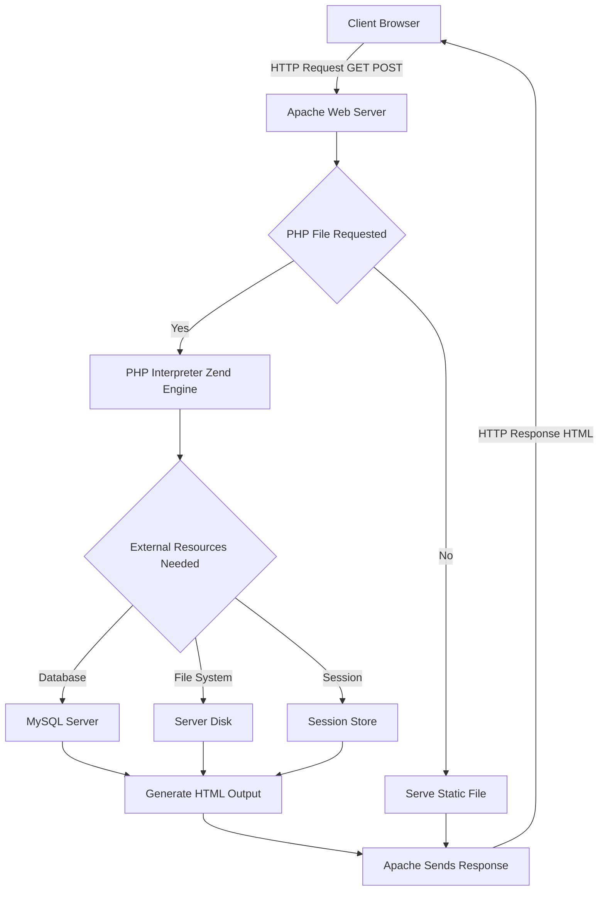
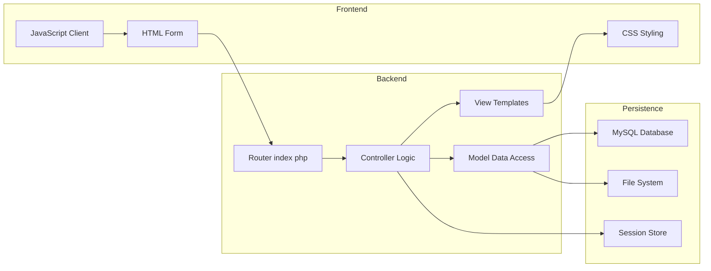
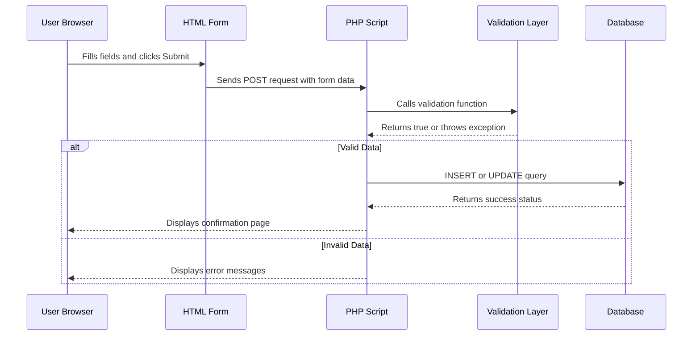

# Quick tour of PHP

<!-- SECTION_1_START -->
# Quick Tour of PHP — Core Definition & Intuitive Overview

## Formal Definition
**PHP (Hypertext Preprocessor)** is a widely-used, open-source, server-side scripting language designed primarily for web development. As per the KTU 2024 Scheme syllabus, PHP is executed on the web server, generating dynamic HTML content that is then sent to the client's browser. It is embedded within HTML markup and supports object-oriented, procedural, and functional programming paradigms.

> [!IMPORTANT]
> **KTU Syllabus Highlight (OECST832 — Module 3):** PHP is introduced as a complementary server-side scripting technology alongside Node.js. The focus is on syntax, control structures, functions, form handling, file I/O, sessions, and database connectivity using MySQL.

## Conceptual Analogy — The Restaurant Kitchen
Imagine a restaurant where the **dining hall is the client browser**, the **menu is the HTML page**, and the **kitchen is the PHP engine running on the server**.

- A customer (browser) places an order (HTTP request) for a specific dish (web page).
- The waiter (web server, e.g., Apache) carries the order to the kitchen (PHP interpreter).
- The chef (PHP script) prepares the dish from raw ingredients (database records, file contents, user inputs) and hands it back to the waiter.
- The waiter serves the final cooked dish (rendered HTML) to the customer.

The customer never sees the cooking process — only the finished plate. Similarly, users never see raw PHP code; they only receive the generated HTML output.

## Key Characteristics of PHP
- **Open Source:** Free to download, use, and modify.
- **Cross-Platform:** Runs on **Windows**, **Linux**, **macOS**, and most UNIX variants.
- **Server-Side Execution:** Code is processed on the server before being sent to the client.
- **Embedded in HTML:** PHP tags `<?php ... ?>` can be placed directly within HTML documents.
- **Database Integration:** Native support for **MySQL**, **PostgreSQL**, **SQLite**, **Oracle**, and more.
- **Loosely Typed:** Variables do not require explicit type declaration.
- **Interpreted:** No separate compilation step; the Zend Engine processes scripts line by line.

> [!NOTE]
> **Physical Constant / Standard:** The default file extension for PHP scripts is **`.php`**. The default port for the Apache web server is **80**, and MySQL runs on **3306**. PHP scripts are typically served via the **LAMP stack** (Linux, Apache, MySQL, PHP) or **WAMP** (Windows, Apache, MySQL, PHP).

## PHP File Anatomy
A minimal PHP file combines HTML markup with embedded PHP logic blocks. The PHP processor only executes code inside `<?php ... ?>` tags; everything else is passed through as raw HTML.

```php
<!DOCTYPE html>
<html>
<head><title>My First PHP Page</title></head>
<body>
    <h1><?php echo "Hello, World!"; ?></h1>
    <p>Current server time: <?php echo date("Y-m-d H:i:s"); ?></p>
</body>
</html>
```

> [!VISUALIZATION CONTROL]
> **Concept:** PHP Request-Response Cycle
> **GeoGebra / Desmos Input Equations:** Not applicable (flow-based concept)
> **Visual Description:** A horizontal timeline where the **client (browser)** sends an HTTP request to the **web server (Apache)**, which delegates parsing to the **PHP interpreter**, which optionally queries a **database (MySQL)**, and finally returns rendered HTML back to the client.

<!-- SECTION_1_END -->

<!-- SECTION_2_START -->
# Deep Theoretical Analysis & KTU High-Yield Reference Sheet

## PHP Syntax Building Blocks

### 1. PHP Tags
PHP code is enclosed within special tags. There are four variants, but only the first is universally recommended.

| Tag Style | Syntax | Recommendation |
|---|---|---|
| Canonical | `<?php ... ?>` | **Always use this** |
| Short Echo | `<?= expression ?>` | Allowed, equivalent to `<?php echo ... ?>` |
| Short | `<? ... ?>` | Requires `short_open_tag` enabled |
| Script | `<script language="php"> ... </script>` | Removed in PHP 7+ |

### 2. Comments
Three styles are supported for documentation and debugging.

- `//` — single-line comment
- `#` — alternative single-line comment
- `/* ... */` — multi-line block comment

### 3. Variables
All PHP variables begin with the `$` symbol, followed by the variable name. Names are case-sensitive and must start with a letter or underscore.

```php
$name = "Alice";
$_age = 21;
$PI = 3.14159;
```

### 4. Data Types
PHP supports **8 primitive data types** grouped into three families.

| Category | Types | Example |
|---|---|---|
| Scalar | `int`, `float`, `string`, `bool` | `$x = 42;` |
| Compound | `array`, `object` | `$arr = [1, 2, 3];` |
| Special | `null`, `resource` | `$conn = null;` |

### 5. String Concatenation
The dot operator (`.`) joins strings together, unlike JavaScript which uses `+`.

```php
$greeting = "Hello, " . $name . "!";
```

### 6. Control Structures
PHP provides the standard imperative constructs shared with C, Java, and JavaScript.

| Construct | Syntax Form |
|---|---|
| `if / elseif / else` | `if ($x > 0) { ... }` |
| `switch` | `switch ($day) { case 1: ... break; }` |
| `while` | `while ($i < 10) { $i++; }` |
| `do-while` | `do { ... } while ($cond);` |
| `for` | `for ($i = 0; $i < 10; $i++)` |
| `foreach` | `foreach ($arr as $val) { ... }` |

### 7. Functions
PHP has **built-in functions** (over 1000) and supports **user-defined functions**.

```php
function add(int $a, int $b): int {
    return $a + $b;
}
```

### 8. Superglobals
Pre-defined associative arrays accessible from any scope. They are the gateway between PHP and the external request environment.

| Superglobal | Purpose |
|---|---|
| `$_GET` | Collects form data sent via URL query string |
| `$_POST` | Collects form data sent via HTTP POST body |
| `$_REQUEST` | Merges `$_GET`, `$_POST`, and `$_COOKIE` |
| `$_SERVER` | Server and execution environment info |
| `$_SESSION` | Session variables stored on the server |
| `$_COOKIE` | Cookies sent by the browser |
| `$_FILES` | Uploaded file information |
| `$_ENV` | Environment variables |
| `$GLOBALS` | All global variables |

### 9. Form Handling Workflow
1. User fills an HTML form on the client.
2. Browser submits the form via GET or POST to a PHP script.
3. PHP accesses submitted data through `$_GET` or `$_POST` superglobals.
4. Script processes the data (validation, database write, etc.).
5. PHP sends back a response (HTML, redirect, JSON).

### 10. File Inclusion
PHP allows modular code reuse through four inclusion statements.

| Statement | Behavior on Failure |
|---|---|
| `include 'file.php';` | Generates warning; script continues |
| `require 'file.php';` | Generates fatal error; script halts |
| `include_once 'file.php';` | Includes only once; warning on fail |
| `require_once 'file.php';` | Includes only once; fatal error on fail |

## KTU Formula Sheet / Cheat Sheet

| Concept | Syntax / Token | Notes |
|---|---|---|
| Opening tag | `<?php` | Mandatory in modern PHP |
| Variable | `$identifier` | Case-sensitive |
| String concat | `.` | Not `+` like JavaScript |
| Equality (loose) | `==` | Type juggling occurs |
| Equality (strict) | `===` | **Preferred** — no type juggling |
| Not equal | `!=` or `<>` | Loose comparison |
| Strict not equal | `!==` | Type + value comparison |
| Null coalescing | `??` | `$val = $_GET['id'] ?? 0;` |
| Spaceship | `<=>` | Returns $-1, 0, or $1$ |
| Error suppression | `@` | Avoid in production |
| Heredoc | `<<<EOT ... EOT;` | Multi-line string |
| Array creation | `[]` or `array()` | PHP 5.4+ supports `[]` |
| Ternary | `cond ? a : b` | Compact conditional |

> [!IMPORTANT]
> **Why it matters in engineering:** PHP powers approximately **74%** of all websites with a known server-side language (as of 2024), including WordPress, Facebook (originally), Wikipedia, and Slack. Understanding server-side scripting is foundational for full-stack web development.

<!-- SECTION_2_END -->

<!-- SECTION_3_START -->
# Step-by-Step Derivations & Code Implementation

## Example 1 — Basic PHP Script with Variables and Output

```php
<?php
    // Variable declarations (loosely typed)
    $studentName = "Rahul Menon";
    $rollNo = 47;
    $cgpa = 8.76;
    $isPassed = true;

    // String interpolation works only with double quotes
    echo "<h2>Student Report Card</h2>";
    echo "<p>Name: $studentName</p>";
    echo "<p>Roll Number: {$rollNo}</p>";

    // printf for formatted output
    printf("<p>CGPA: %.2f</p>", $cgpa);

    // var_dump for debugging
    var_dump($isPassed);
?>
```

**Expected Output:**
```
Student Report Card
Name: Rahul Menon
Roll Number: 47
CGPA: 8.76
bool(true)
```

**Line-by-line logic:**
- `<?php` opens the PHP processing block.
- `$studentName`, `$rollNo`, `$cgpa`, `$isPassed` are auto-typed based on the assigned literal.
- Double-quoted strings perform **variable interpolation**; single-quoted strings do not.
- `printf("<p>CGPA: %.2f</p>", $cgpa);` formats `$cgpa` to **2 decimal places** using the format specifier `%.2f`.
- `var_dump($isPassed);` prints the data type and value — essential for debugging.

---

## Example 2 — Conditional Statements and Loops

```php
<?php
    $marks = [85, 42, 91, 67, 55, 73];

    $total = 0;
    $count = 0;

    // foreach loop to compute average
    foreach ($marks as $m) {
        $total += $m;
        $count++;
    }
    $average = $total / $count;

    echo "Total Marks: $total <br>";
    echo "Average Marks: $average <br>";

    // Grading using if-elseif-else
    if ($average >= 90) {
        $grade = "A+";
    } elseif ($average >= 80) {
        $grade = "A";
    } elseif ($average >= 70) {
        $grade = "B+";
    } elseif ($average >= 60) {
        $grade = "B";
    } elseif ($average >= 50) {
        $grade = "C";
    } else {
        $grade = "F (Fail)";
    }

    echo "Grade Awarded: $grade";
?>
```

**Expected Output:**
```
Total Marks: 413
Average Marks: 68.833333333333
Grade Awarded: B
```

**Logic Walkthrough:**
- The `foreach` iterates over each element of `$marks` without needing an index variable.
- The accumulator `$total` is initialized to **0** outside the loop to prevent `null` arithmetic errors.
- The if-elseif chain evaluates the **average** against descending thresholds; the first match wins.
- Division operator `/` returns a `float` in PHP 7+, which is why the average displays with decimals.

---

## Example 3 — User-Defined Functions with Type Declarations

```php
<?php
    // Function with type hints and return type declaration
    function calculateDiscount(float $price, int $percent): float {
        if ($percent < 0 || $percent > 100) {
            throw new InvalidArgumentException("Discount must be 0-100");
        }
        return $price * (1 - $percent / 100);
    }

    $originalPrice = 2500.00;
    $discountPercent = 15;

    try {
        $finalPrice = calculateDiscount($originalPrice, $discountPercent);
        printf("Final Price after %d%% discount: ₹%.2f", $discountPercent, $finalPrice);
    } catch (InvalidArgumentException $e) {
        echo "Error: " . $e->getMessage();
    }
?>
```

**Expected Output:**
```
Final Price after 15% discount: ₹2125.00
```

**Logic Walkthrough:**
- `float $price, int $percent` enforce strict type checks; mismatches throw a `TypeError`.
- `: float` declares the return type.
- The `throw` keyword raises a custom exception if the discount is out of range.
- The `try-catch` block captures the exception to prevent script termination.

---

## Example 4 — Form Handling with `$_POST`

**`form.html`**
```html
<!DOCTYPE html>
<html>
<head><title>Login Form</title></head>
<body>
    <form action="process.php" method="POST">
        <label>Username: <input type="text" name="username" required></label><br>
        <label>Password: <input type="password" name="password" required></label><br>
        <input type="submit" value="Login">
    </form>
</body>
</html>
```

**`process.php`**
```php
<?php
    if ($_SERVER["REQUEST_METHOD"] === "POST") {
        $username = htmlspecialchars(trim($_POST["username"]));
        $password = trim($_POST["password"]);

        // Basic validation
        if (empty($username) || empty($password)) {
            echo "Both fields are required.";
            exit;
        }

        // Simulated authentication
        if ($username === "admin" && $password === "1234") {
            echo "<h2>Welcome, $username!</h2>";
        } else {
            echo "<h3>Invalid credentials.</h3>";
        }
    } else {
        echo "Invalid request method.";
    }
?>
```

**Logic Walkthrough:**
- The HTML form sends data via POST to `process.php`.
- `$_SERVER["REQUEST_METHOD"]` checks whether the script was invoked via POST.
- `htmlspecialchars()` prevents **XSS (Cross-Site Scripting)** by escaping HTML entities.
- `trim()` removes leading and trailing whitespace.
- `exit` halts further script execution after an error message.
- Real-world applications would hash the password using `password_hash()` and verify with `password_verify()`.

---

## Example 5 — MySQL Database Connectivity using `mysqli`

```php
<?php
    $servername = "localhost";
    $dbUser = "root";
    $dbPass = "";
    $dbName = "ktu_students";

    // Step 1: Create connection
    $conn = new mysqli($servername, $dbUser, $dbPass, $dbName);

    // Step 2: Check connection
    if ($conn->connect_error) {
        die("Connection failed: " . $conn->connect_error);
    }

    // Step 3: Prepare and execute query
    $stmt = $conn->prepare("SELECT name, cgpa FROM students WHERE branch = ?");
    $branch = "CSE";
    $stmt->bind_param("s", $branch);
    $stmt->execute();
    $result = $stmt->get_result();

    // Step 4: Fetch and display
    echo "<table border='1'><tr><th>Name</th><th>CGPA</th></tr>";
    while ($row = $result->fetch_assoc()) {
        echo "<tr><td>" . htmlspecialchars($row["name"]) . "</td>";
        echo "<td>" . number_format($row["cgpa"], 2) . "</td></tr>";
    }
    echo "</table>";

    // Step 5: Close resources
    $stmt->close();
    $conn->close();
?>
```

**Logic Walkthrough:**
- `new mysqli(...)` creates a connection object using **procedural-OOP hybrid style**.
- `connect_error` is checked; `die()` terminates with a message on failure.
- `prepare()` uses a parameterized query — the `?` placeholder is bound via `bind_param("s", $branch)`.
- The `s` in `bind_param` specifies a **string** type; other types are `i` (int), `d` (double), `b` (blob).
- `get_result()` returns a `mysqli_result` object iterable via `fetch_assoc()`.
- Prepared statements prevent **SQL Injection**, the most common web vulnerability.

---

## Example 6 — Sessions and Cookies

```php
<?php
    // session_start() must be called before any output
    session_start();

    // Store data in session
    $_SESSION["user"] = "Alice";
    $_SESSION["login_time"] = time();

    // Set a cookie valid for 1 hour
    setcookie("preference", "dark_mode", time() + 3600, "/");

    echo "Session ID: " . session_id() . "<br>";
    echo "User: " . $_SESSION["user"] . "<br>";
    echo "Cookie 'preference' set successfully.";
?>
```

**Logic Walkthrough:**
- `session_start()` initializes a session and generates a unique session ID.
- `$_SESSION` is a server-side storage mechanism; data persists across page loads.
- `setcookie()` sends an HTTP header to the browser; the cookie lives for `3600` seconds.
- The `"/"` argument sets the cookie path to the entire domain.

---

## Example 7 — File Handling

```php
<?php
    $filename = "log.txt";
    $content = "Login attempt at " . date("Y-m-d H:i:s") . "\n";

    // Write to file (append mode)
    $file = fopen($filename, "a") or die("Unable to open file!");
    fwrite($file, $content);
    fclose($file);

    // Read file contents
    echo "<h3>Log File Contents:</h3>";
    echo "<pre>" . htmlspecialchars(file_get_contents($filename)) . "</pre>";
?>
```

**Logic Walkthrough:**
- `fopen($filename, "a")` opens the file in **append mode** — content is added at the end.
- `fwrite()` writes the string; it returns the number of bytes written.
- `file_get_contents()` reads the entire file into a string in a single call.
- `htmlspecialchars()` ensures newlines and special characters render correctly in the browser.

<!-- SECTION_3_END -->

<!-- SECTION_4_START -->
# Structural Diagrams & Schematics

## Mermaid Diagram 1 — PHP Request-Response Lifecycle



**Diagram Description:** This flowchart traces a single HTTP request from the browser through Apache, the PHP interpreter, optional external resources, and back to the client as rendered HTML.

---

## Mermaid Diagram 2 — PHP Modular Architecture



**Diagram Description:** A high-level **MVC-inspired architecture** showing how client-side forms interact with a router, which dispatches to controllers, models, and views, with persistence layers underneath.

---

## Mermaid Diagram 3 — Form Data Flow



**Diagram Description:** A sequence diagram showing the interaction between browser, form, PHP script, validation, and database during a typical form submission.

<!-- SECTION_4_END -->

<!-- SECTION_5_START -->
# KTU 2024 Scheme Examination Question Bank

## Part A — Short Answer Questions (3 Marks Each)

### Question 1
**[KTU University Exam — July 2024]** Explain the salient features of PHP. Why is it called a server-side scripting language? **(3 Marks)**
**Mapped CO:** CO3 | **RBT Level:** Remember

**Model Answer:**
PHP is an open-source, server-side scripting language embedded within HTML. Its salient features include cross-platform support, loose typing, extensive database integration (especially MySQL), and a rich built-in function library. It is called server-side because the PHP interpreter on the web server executes the script and generates HTML, which is then transmitted to the client browser. The client never receives the raw PHP source code, ensuring security and reducing client-side processing load.

> [!VALUATION KEY]
> [Listing 4 features: 2 Marks] [Explanation of server-side concept: 1 Mark]

---

### Question 2
**[KTU University Exam — Dec 2023]** List any five PHP superglobals and state their purpose. **(3 Marks)**
**Mapped CO:** CO3 | **RBT Level:** Remember

**Model Answer:**
The five PHP superglobals are:
1. `$_GET` — Collects form data sent via URL query parameters.
2. `$_POST` — Collects form data sent via the HTTP POST body.
3. `$_SESSION` — Stores user session data on the server across multiple page requests.
4. `$_COOKIE` — Accesses cookies sent by the browser.
5. `$_SERVER` — Provides information about the server environment, request headers, and execution context.

> [!VALUATION KEY]
> [Naming 5 superglobals: 2 Marks] [One-line purpose each: 1 Mark]

---

## Part B — Long Answer Questions (14 Marks Each, Internal Choice)

### Question 3A
**[KTU University Exam — July 2024]** **(a)** Explain the different data types supported by PHP with examples. Discuss the difference between `==` and `===` operators. **(7 Marks)**
**Mapped CO:** CO3 | **RBT Level:** Understand

**Model Answer:**
PHP supports 8 data types grouped into three categories:
- **Scalar types:** `int` (e.g., `$x = 42;`), `float` (e.g., `$price = 99.99;`), `string` (e.g., `$name = "KTU";`), `bool` (e.g., `$active = true;`).
- **Compound types:** `array` (e.g., `$marks = [80, 90, 75];`), `object` (e.g., instance of a class).
- **Special types:** `null` (uninitialized variable), `resource` (handle to external resources like database connections).

**Difference between `==` and `===`:**
The `==` operator performs **loose comparison** with type juggling. For example, `0 == "abc"` evaluates to `true` in older PHP versions because the string is coerced to `0`. The `===` operator performs **strict comparison** — both value and type must match. Thus, `0 === "0"` returns `false` because the types differ.

> [!VALUATION KEY]
> [Listing 8 data types with examples: 4 Marks] [Correct comparison of == and === with example: 3 Marks]

---

### Question 3B
**[KTU University Exam — Dec 2023]** **(b)** Write a PHP program to read two numbers from an HTML form using the POST method, compute their sum, difference, product, and quotient, and display the results. **(7 Marks)**
**Mapped CO:** CO3 | **RBT Level:** Apply

**Model Answer:**

**`form.html`**
```html
<form action="calculate.php" method="POST">
    Number 1: <input type="number" name="num1" step="any" required><br>
    Number 2: <input type="number" name="num2" step="any" required><br>
    <input type="submit" value="Calculate">
</form>
```

**`calculate.php`**
```php
<?php
    if ($_SERVER["REQUEST_METHOD"] === "POST") {
        $a = floatval($_POST["num1"]);
        $b = floatval($_POST["num2"]);

        $sum = $a + $b;
        $diff = $a - $b;
        $prod = $a * $b;
        $quot = ($b != 0) ? $a / $b : "Undefined (division by zero)";

        echo "<h3>Results:</h3>";
        echo "Sum: $sum <br>";
        echo "Difference: $diff <br>";
        echo "Product: $prod <br>";
        echo "Quotient: $quot";
    } else {
        echo "Please submit the form.";
    }
?>
```

> [!VALUATION KEY]
> [Form HTML with POST method: 2 Marks] [Reading values with $_POST and type conversion: 2 Marks] [Computing all 4 operations: 2 Marks] [Division by zero check: 1 Mark]

---

### Question 4A
**[KTU University Exam — July 2024]** **(a)** What is a PHP session? Write a PHP program to start a session, store the username, and display it on another page. **(7 Marks)**
**Mapped CO:** CO3 | **RBT Level:** Apply

**Model Answer:**
A **PHP session** is a server-side mechanism to store user information across multiple page requests. Each visitor is assigned a unique session ID stored as a cookie in the browser. Session data is stored on the server, making it more secure than cookies.

**`login.php`**
```php
<?php
    session_start();
    $_SESSION["username"] = "Rahul";
    $_SESSION["login_time"] = date("H:i:s");
    echo "Session started. <a href='dashboard.php'>Go to Dashboard</a>";
?>
```

**`dashboard.php`**
```php
<?php
    session_start();
    if (isset($_SESSION["username"])) {
        echo "<h2>Welcome, " . htmlspecialchars($_SESSION["username"]) . "!</h2>";
        echo "Logged in at: " . $_SESSION["login_time"];
    } else {
        echo "Please log in first.";
    }
?>
```

> [!VALUATION KEY]
> [Definition of session: 2 Marks] [session_start() and storing values: 2 Marks] [Reading from second page with isset check: 2 Marks] [Security with htmlspecialchars: 1 Mark]

---

### Question 4B
**[KTU University Exam — Dec 2023]** **(b)** Explain how PHP connects to a MySQL database. Write a PHP script to insert a new record into a `products` table with fields `id`, `name`, and `price`. **(7 Marks)**
**Mapped CO:** CO3 | **RBT Level:** Apply

**Model Answer:**
PHP connects to MySQL using the `mysqli` (MySQL Improved) extension or PDO. The `mysqli` extension offers both procedural and object-oriented interfaces.

**Connection and Insertion Script:**
```php
<?php
    $conn = new mysqli("localhost", "root", "", "shop");
    if ($conn->connect_error) {
        die("Connection failed: " . $conn->connect_error);
    }

    $stmt = $conn->prepare("INSERT INTO products (name, price) VALUES (?, ?)");
    $productName = "Wireless Mouse";
    $productPrice = 599.50;
    $stmt->bind_param("sd", $productName, $productPrice);

    if ($stmt->execute()) {
        echo "New product inserted with ID: " . $stmt->insert_id;
    } else {
        echo "Error: " . $stmt->error;
    }

    $stmt->close();
    $conn->close();
?>
```

> [!VALUATION KEY]
> [Explanation of mysqli extension: 2 Marks] [Connection establishment with error check: 2 Marks] [Prepared statement with bind_param: 2 Marks] [Success message using insert_id: 1 Mark]

> [!WARNING]
> **KTU Examiner's Pitfall Callout:**
> 1. Students often forget to check `connect_error` and call `die()`, losing 1 mark.
> 2. The `bind_param` type string must match column types — `s` for string, `d` for double, `i` for integer. Using `s` for a numeric column is a common mistake.
> 3. Always use **prepared statements** with parameterized queries; directly concatenating user input into SQL strings is a major security flaw.
> 4. Remember to call `close()` on both statement and connection to free resources.

---

## Topic Recap & Important Things to Remember

- **PHP** is a server-side, open-source scripting language embedded in HTML with file extension **`.php`**.
- The canonical opening tag is **`<?php`**; closing tag **`?>`** can be omitted in pure PHP files.
- All variables start with **`$`**, are **case-sensitive**, and are **loosely typed**.
- PHP has **8 data types**: `int`, `float`, `string`, `bool`, `array`, `object`, `null`, `resource`.
- String concatenation uses the **dot (`.`)** operator, not `+`.
- Use **`===` (strict equality)** instead of `==` to avoid type-juggling bugs.
- **Superglobals** (`$_GET`, `$_POST`, `$_SESSION`, `$_COOKIE`, `$_SERVER`, `$_FILES`, `$_REQUEST`, `$_ENV`, `$GLOBALS`) are always accessible in any scope.
- Control structures: `if/elseif/else`, `switch`, `while`, `do-while`, `for`, `foreach`.
- Functions support **type hints** for parameters and **return type declarations**.
- **Form handling:** Use `$_GET` for non-sensitive data, `$_POST` for sensitive or large data.
- **Security essentials:** `htmlspecialchars()` to prevent XSS, prepared statements to prevent SQL injection, `password_hash()` for password storage.
- **Sessions** store data on the server; requires `session_start()` and provides persistence across pages.
- **Cookies** store data on the client; set with `setcookie()` before any output.
- **File inclusion:** `include` (warning) vs `require` (fatal error); `*_once` variants prevent duplicate loading.
- **MySQL connectivity** uses the `mysqli` extension or PDO; always use prepared statements.
- The **LAMP/WAMP stack** is the standard deployment environment.
- PHP powers roughly **74%** of all websites with a known server-side language, making it one of the most commercially relevant web technologies in 2024.

<!-- SECTION_5_END -->
