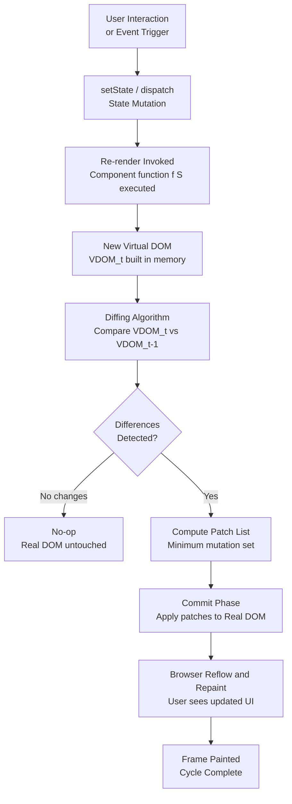
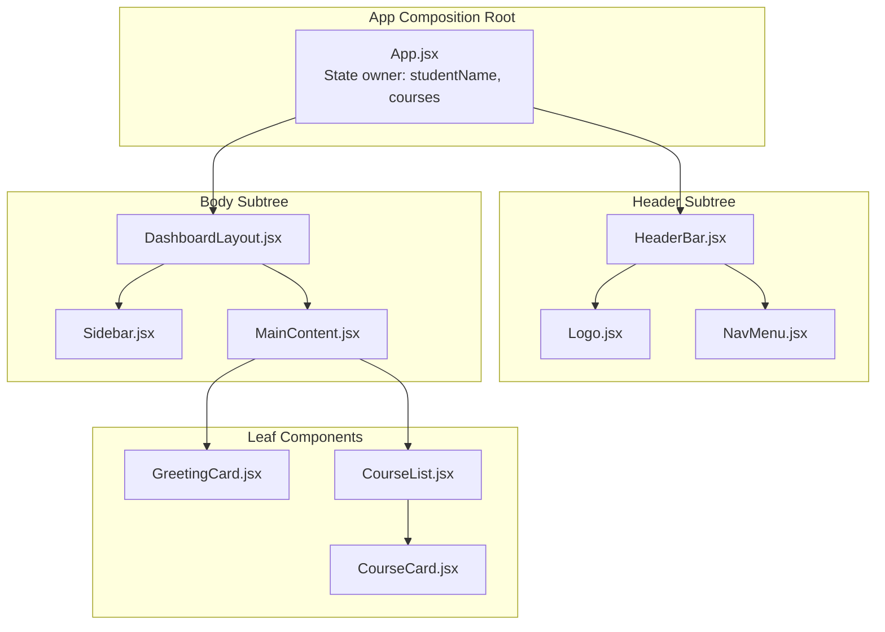
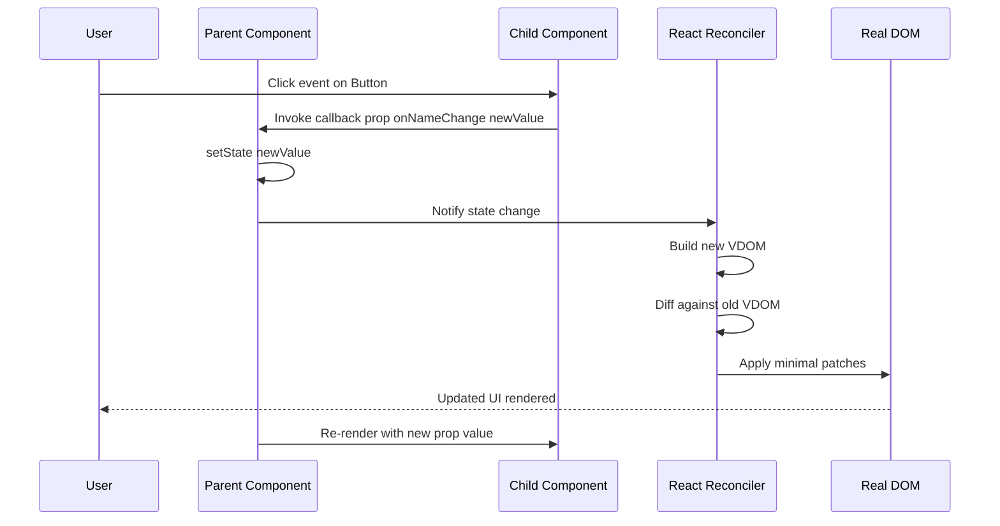
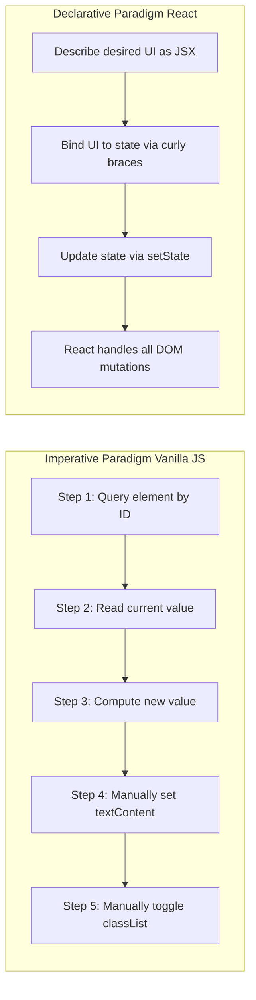
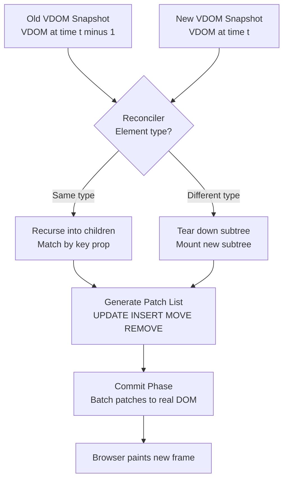
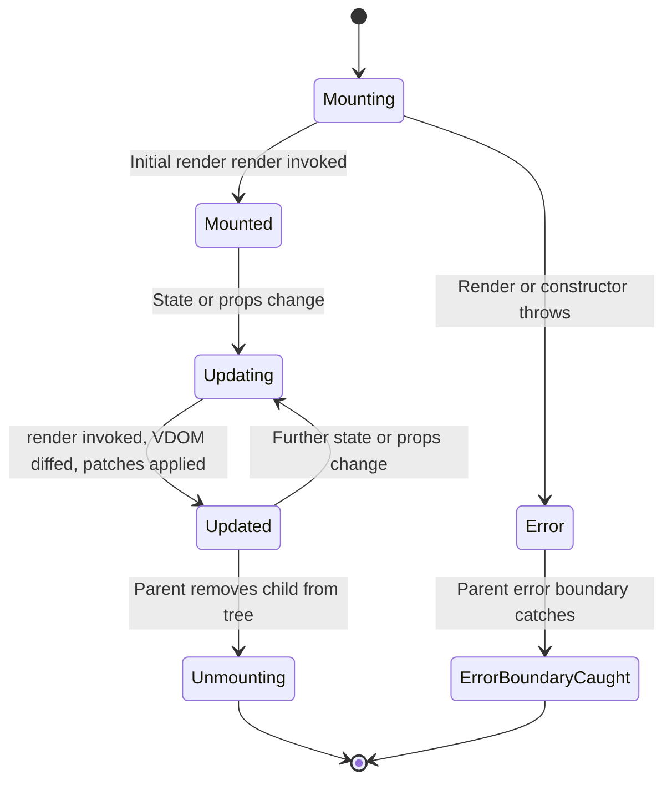
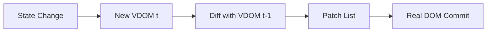
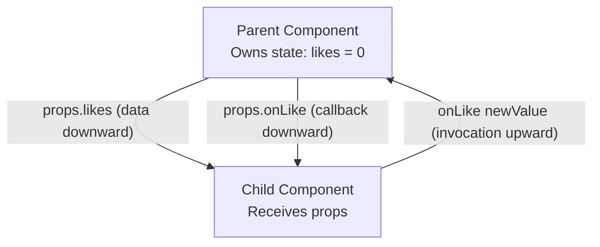

# Rendering HTML :  React - ReactJS Foundations : The Philosophy of React

<!-- SECTION_1_START -->

# Rendering HTML: React Foundations — The Philosophy of React

## 1.1 Formal Academic Definition (KTU 2024 Aligned)

> [!IMPORTANT]
> **Definition (KTU Syllabus Standard):**
> **React** is an open-source, declarative, component-based **JavaScript library** (developed and maintained by Meta/Facebook, first released in 2013) used for building **user interfaces (UIs)**, specifically for **single-page applications (SPAs)**. The *philosophy of React* is built upon three foundational pillars: **(1) Declarative Programming**, **(2) Component-Based Architecture**, and **(3) Unidirectional (One-Way) Data Flow**, all powered by a **Virtual DOM** reconciliation engine for high-performance rendering.

In the context of the **Web Programming (OECST832)** syllabus, understanding React's philosophy is *prerequisite* to learning about its rendering engine, since React fundamentally rethinks *how* the browser DOM should be manipulated when state changes occur.

## 1.2 Conceptual Analogy & Intuition

> [!NOTE]
> **The LEGO Analogy:**
> Imagine you are building a complex city out of clay (the old *imperative* way with vanilla JavaScript + `document.getElementById`).
> - Every time the wind blows (state change), you have to **manually reshape the clay** by reaching in with your hands, finding each building, and sculpting it again. This is slow, error-prone, and destroys the original sculpture each time.
>
> React, in contrast, treats the UI like a **city built from standardized LEGO bricks**:
> - You **describe** what the final city should look like ("a red house here, a blue tower there").
> - React's **Virtual DOM** is a *blueprint* held in memory.
> - When the wind blows, React compares the new blueprint with the old one (**diffing**), figures out the *minimum number of bricks* to swap (**reconciliation**), and applies only those changes to the real DOM.
> - You never "reach in" to imperatively mutate the DOM — you just describe the desired outcome.

## 1.3 The Three Philosophical Pillars at a Glance

| # | Pillar | One-Line Essence |
|---|--------|------------------|
| 1 | **Declarative Paradigm** | Describe *what* the UI should be, not *how* to build it step-by-step. |
| 2 | **Component Composition** | Build UIs by **nesting** small, reusable, self-contained units. |
| 3 | **Unidirectional Data Flow** | Data moves in **one direction** (parent → child) for predictable state. |
| 4 | **Virtual DOM + Reconciliation** | A diff-and-patch engine that minimises expensive real DOM operations. |

> [!TIP]
> **KTU Quick-Recall Hint:** The four pillars above are guaranteed to appear in **Part A (3-mark)** questions as a "List the core philosophies of React" or "Explain declarative programming in React."

## 1.4 Visualisation Control

> [!VISUALIZATION CONTROL]
> **Concept:** Visualising the **Imperative vs Declarative** mindset in a UI counter.
> **GeoGebra / Desmos Input Equations:**
> * Define a step function representing imperative DOM mutations: `f_imp(x) = floor(x) mod 2` toggling visibility.
> * Define declarative output: `f_dec(x) = (x mod 2) * 100` showing the *final desired* state.
> **Visual Description:** Two step graphs side-by-side. The imperative one shows chaotic up/down commands; the declarative one is a clean, predictable staircase that *describes* the target state directly.

<!-- SECTION_1_END -->

<!-- SECTION_2_START -->

# Deep Theoretical Analysis & KTU High-Yield Formula Sheet

## 2.1 The Paradigm Shift: Imperative vs Declarative

Before React, vanilla JavaScript DOM manipulation was **imperative** — the developer dictated *each step* of the mutation. React promotes a **declarative** model — the developer *declares the end state*, and React figures out the steps.

### 2.1.1 Imperative Approach (Vanilla JS Mental Model)
- The developer explicitly queries, mutates, and re-queries the DOM.
- Logic and view are tightly coupled.
- Error-prone: forgetting to update one element causes UI inconsistency.

### 2.1.2 Declarative Approach (React Mental Model)
- The developer describes a **function of state**: $UI = f(state)$.
- React re-invokes the function whenever state changes.
- The developer never touches the DOM directly; React does the heavy lifting.

> [!NOTE]
> **Key Equation (The React Mental Model):**
>
> $$V = f(S)$$
>
> Where:
> - $V$ = Virtual DOM tree (the desired UI).
> - $S$ = Application state.
> - $f$ = Pure render function defined by the component.
>
> Every time $S$ changes, React recomputes $V$ and reconciles the diff with the real DOM.

## 2.2 Component-Based Architecture

A **Component** in React is a *reusable, self-contained piece of UI* that encapsulates its own structure (JSX), behaviour (logic), and presentation (styling). Components are the **atoms** of a React application.

### 2.2.1 Classification of Components

| Type | Defining Trait | Use Case |
|------|----------------|----------|
| **Functional Component** | Plain JS function returning JSX. Hooks-based. | Modern default; 95% of production code. |
| **Class Component** | ES6 `class` extending `React.Component` with `render()`. | Legacy codebases; error boundaries. |
| **Presentational Component** | Receives data via `props`; no internal state. | Buttons, cards, list items. |
| **Container Component** | Holds state and business logic; passes data down. | Page-level wrappers. |
| **Controlled Component** | Form input whose value is driven by React state. | Forms, inputs. |

### 2.2.2 Component Composition Principle

> [!IMPORTANT]
> **The Composition Rule:** Complex UIs are decomposed into a **tree of small components**. Each component does *one thing well* (Single Responsibility Principle) and is composed inside other components via JSX nesting. This mirrors the Unix philosophy of *"small, sharp tools that combine."*

Mathematically, a React tree can be modelled as:

$$T_{root} \;=\; \bigoplus_{i=1}^{n} C_i(s_i, p_i)$$

Where $C_i$ is the $i$-th child component, $s_i$ is its internal state, and $p_i$ is the set of `props` passed from its parent. The $\bigoplus$ symbol denotes *composition* in the tree.

## 2.3 Unidirectional (One-Way) Data Flow

React enforces a **strict top-down data flow**:

$$\text{Parent Component} \;\xrightarrow{\text{props}}\; \text{Child Component}$$

- **State** is owned by exactly one component (usually the closest common ancestor of components that need it — the "lift state up" pattern).
- **Props** are read-only conduits for passing data downward.
- To send data *upward*, children invoke **callback functions** provided by the parent.

This unidirectional flow eliminates the tangled "spaghetti bindings" of older two-way frameworks (e.g., AngularJS 1.x) and makes state changes **predictable and traceable** — critical for debugging large applications.

## 2.4 The Virtual DOM & Reconciliation Philosophy

The **Virtual DOM (VDOM)** is a lightweight, in-memory JavaScript representation of the real DOM, structured as a tree of plain objects.

### 2.4.1 Why the Virtual DOM Exists

Direct DOM manipulation is **expensive** (browsers must trigger reflow + repaint). React minimises this by:

1. **Rendering** the component tree into a fresh VDOM snapshot on every state change.
2. **Diffing** the new VDOM against the previous VDOM using a heuristic **O(n)** algorithm.
3. **Patching** the real DOM with the minimum set of changes (this minimal set is called the *patch list* or *commit phase*).

### 2.4.2 The Diffing Heuristic

React's reconciler assumes two practical heuristics to achieve linear-time reconciliation:

| # | Heuristic | Implication |
|---|-----------|-------------|
| 1 | Different element **types** produce different trees. | Switching `<div>` → `<span>` rebuilds the subtree. |
| 2 | Developers hint at **stable list items** via the `key` prop. | Keys allow React to match children across renders efficiently. |

Mathematically, the cost of reconciliation is:

$$C_{reconcile} \;\approx\; O(n)$$

Where $n$ is the number of nodes in the component tree — a *vast* improvement over the naive $O(n^3)$ tree-diff problem.

## 2.5 JSX — The Syntax Philosophy

**JSX (JavaScript XML)** is a *syntax extension* to JavaScript that lets developers write HTML-like markup directly inside JS. It is **not** understood by browsers; it is transpiled (typically by **Babel**) into `React.createElement(...)` calls.

The "why" of JSX:
- **Visual coherence:** UI structure and logic live in the same file (colocation).
- **Compile-time safety:** Typos and invalid HTML are caught at build time.
- **Familiarity:** Lowers the learning curve for designers/HTML developers.

> [!NOTE]
> **Real-World Engineering Utility:**
> - React's philosophy is the foundation for **React Native** (mobile), **React Three Fiber** (3D), and **Next.js** (SSR). Every one of these inherits the *declarative + component + VDOM* model.
> - In **production systems**, this philosophy enables **server-side rendering (SSR)**, **static site generation (SSG)**, and **streaming HTML** — patterns used by Netflix, Airbnb, Instagram, WhatsApp Web, and Meta's family of apps.

## 2.6 KTU High-Yield Cheat Sheet

| Concept | Symbol / Notation | Description | Exam Hot-Spot |
|---------|-------------------|-------------|---------------|
| Declarative UI | $V = f(S)$ | UI is a pure function of state. | Part A definitions. |
| Virtual DOM | $VDOM_t$ | In-memory snapshot at time $t$. | Part B derivations. |
| Reconciliation cost | $O(n)$ | Linear-time diffing heuristic. | Numerical/complexity Q. |
| Props flow direction | $\downarrow$ | Parent → Child (downward only). | Diagram questions. |
| Callback flow direction | $\uparrow$ | Child → Parent (upward). | Diagram questions. |
| `key` prop | $k_i$ | Stable identifier for list items. | Practical list-rendering Q. |
| Component type 1 | Functional | `function Comp() { return <JSX/>; }` | Code-trace questions. |
| Component type 2 | Class | `class Comp extends React.Component` | Legacy comparison Q. |
| JSX transpilation | `<div/>` → `React.createElement('div')` | Babel transform. | Theory Part A. |
| State ownership | Lifted to LCA | Lowest Common Ancestor. | Design-pattern Q. |

<!-- SECTION_2_END -->

<!-- SECTION_3_START -->

# Step-by-Step Derivations, Code & Symbolic Implementation

## 3.1 Worked Example 1 — Imperative vs Declarative Counter

> [!NOTE]
> **Problem:** Build a counter that increments on click and displays the value in an `<h1>`. Show the same logic in *imperative* (vanilla JS) and *declarative* (React) styles to highlight React's philosophy.

### 3.1.1 Imperative Solution (Vanilla JavaScript)

```html
<!DOCTYPE html>
<html lang="en">
<head>
    <meta charset="UTF-8">
    <title>Imperative Counter</title>
</head>
<body>
    <!-- Step 1: Author the empty DOM structure that JS will mutate. -->
    <h1 id="count-display">Count: 0</h1>
    <button id="increment-btn">Increment</button>

    <script>
        // Step 2: Maintain state in a plain JavaScript variable.
        let count = 0;

        // Step 3: Grab references to the actual DOM nodes.
        const displayEl = document.getElementById("count-display");
        const buttonEl  = document.getElementById("increment-btn");

        // Step 4: Imperatively wire up the event and manually mutate the DOM.
        buttonEl.addEventListener("click", function () {
            count = count + 1;                 // 4a. Update state.
            displayEl.textContent = "Count: " + count; // 4b. Imperatively re-render the affected node.
        });
    </script>
</body>
</html>
```

**Philosophical Critique of the Above:**
- The developer manually *reaches into* the DOM via `textContent`.
- Logic, markup, and DOM-access are all intertwined.
- Scaling this to a 10,000-line UI causes "DOM spaghetti."

### 3.1.2 Declarative Solution (React)

```jsx
// File: Counter.jsx
// Step 1: Import the React library and the useState hook from 'react'.
import React, { useState } from "react";

// Step 2: Define a pure functional component. It returns JSX that *describes* the UI.
function Counter() {
    // Step 3: Declare state. React tracks this value across re-renders.
    const [count, setCount] = useState(0);

    // Step 4: The JSX returned is a *declaration* of the desired UI for the current state.
    return (
        <div>
            <h1>Count: {count}</h1>
            <button onClick={() => setCount(count + 1)}>
                Increment
            </button>
        </div>
    );
}

export default Counter;
```

**Step-by-Step Mapping of Philosophy to Code:**

| Code Line | Philosophical Pillar Demonstrated |
|-----------|-----------------------------------|
| `useState(0)` | State ownership by the component. |
| `<h1>Count: {count}</h1>` | **Declarative** — describes the *result*, not the steps. |
| `setCount(count + 1)` | State update triggers re-render automatically. |
| Component as a JS function | **Component-based** + reusable. |
| `onClick` callback | Event handled declaratively, not via `addEventListener`. |

## 3.2 Worked Example 2 — Virtual DOM Diffing in Action

> [!NOTE]
> **Problem:** Given an old VDOM and a new VDOM produced by a state change, manually compute the *minimum patch list* that React's reconciler would generate.

### 3.2.1 Old VDOM Snapshot ($VDOM_{t-1}$)

```text
VDOM(t-1) =
  <ul>
    <li key="a">Apple</li>
    <li key="b">Banana</li>
    <li key="c">Cherry</li>
  </ul>
```

### 3.2.2 New VDOM Snapshot ($VDOM_t$) After User Clicks "Sort Alphabetically"

```text
VDOM(t) =
  <ul>
    <li key="a">Apple</li>
    <li key="b">Banana</li>
    <li key="c">Cherry</li>
  </ul>
```

(Here, the new tree is *identical* — list was already sorted.)

### 3.2.3 Patch Computation

```text
Step 1: Compare root <ul> → same element type, recurse into children.
Step 2: For each <li>, compare by key:
        - key="a" → text "Apple" → no change.
        - key="b" → text "Banana" → no change.
        - key="c" → text "Cherry" → no change.
Step 3: Emit patch list.

PatchList = [ ]  // empty — no real-DOM mutation needed
```

### 3.2.4 A Non-Trivial Diff Example

Old:

```text
<ul>
  <li key="a">Apple</li>
  <li key="b">Banana</li>
</ul>
```

New (user deletes "Banana"):

```text
<ul>
  <li key="a">Apple</li>
</ul>
```

**Step-by-step reconciler trace:**

```text
Step 1: Root <ul> matches → recurse.
Step 2: Child[0] key="a" matches → no change.
Step 3: Child[1] key="b" in old, not in new → REMOVE node.
Step 4: No more children in new tree → stop.

PatchList = [ { type: "REMOVE", node: <li key="b"> } ]
```

**Real React code that produces the above state change:**

```jsx
import React, { useState } from "react";

function FruitList() {
    const [fruits, setFruits] = useState([
        { id: "a", name: "Apple"  },
        { id: "b", name: "Banana" }
    ]);

    const deleteBanana = () => {
        setFruits(fruits.filter((f) => f.id !== "b"));
    };

    return (
        <div>
            <ul>
                {fruits.map((fruit) => (
                    // Step: The 'key' prop is the critical hint for efficient diffing.
                    <li key={fruit.id}>{fruit.name}</li>
                ))}
            </ul>
            <button onClick={deleteBanana}>Delete Banana</button>
        </div>
    );
}

export default FruitList;
```

## 3.3 Worked Example 3 — Unidirectional Data Flow Trace

> [!NOTE]
> **Problem:** Demonstrate *parent → child* data flow via `props` and *child → parent* communication via a callback prop, satisfying the unidirectional philosophy.

```jsx
// ----- ParentComponent.jsx -----
import React, { useState } from "react";
import ChildDisplay from "./ChildDisplay";

function ParentComponent() {
    // Step 1: State lives in the parent (lifted state).
    const [username, setUsername] = useState("KTU_Student");

    // Step 2: Define a callback to receive updated data from the child.
    const handleNameChange = (newName) => {
        setUsername(newName);
    };

    // Step 3: Pass state DOWN and callback DOWN to the child.
    return (
        <ChildDisplay
            name={username}              // downward prop
            onNameChange={handleNameChange}  // downward callback
        />
    );
}

export default ParentComponent;
```

```jsx
// ----- ChildDisplay.jsx -----
import React from "react";

function ChildDisplay(props) {
    // Step 4: Child receives props. It never directly mutates parent state.
    return (
        <div>
            <p>Current name: {props.name}</p>
            <button onClick={() => props.onNameChange("React_Learner")}>
                Update Name from Child
            </button>
        </div>
    );
}

export default ChildDisplay;
```

**Philosophical Trace:**

```text
Direction   Channel            Purpose
----------- ------------------ ------------------------------------------
Downward    props.name         Data delivery (state value)
Downward    props.onNameChange Callback delivery (function reference)
Upward      callback invocation Child "talks up" by calling the parent's function
```

The **state is owned by the parent**. The child is a *controlled* component — it cannot mutate `username` directly; it must request the change via the callback. This guarantees the **single source of truth** principle.

## 3.4 Worked Example 4 — JSX to JavaScript Transpilation Trace

> [!NOTE]
> **Problem:** Manually transpile a JSX snippet to its equivalent `React.createElement` calls to reveal the underlying object structure.

### 3.4.1 Original JSX

```jsx
const element = (
    <div className="card">
        <h2>Hello, KTU!</h2>
        <p>Welcome to React Foundations.</p>
    </div>
);
```

### 3.4.2 Babel-Transpiled JavaScript

```javascript
const element = React.createElement(
    "div",
    { className: "card" },
    React.createElement("h2", null, "Hello, KTU!"),
    React.createElement("p",  null, "Welcome to React Foundations.")
);
```

### 3.4.3 Runtime Object Representation (the Virtual DOM Node)

```javascript
const element = {
    type: "div",
    props: {
        className: "card",
        children: [
            { type: "h2", props: { children: "Hello, KTU!"          }, key: null, ref: null },
            { type: "p",  props: { children: "Welcome to React Foundations." }, key: null, ref: null }
        ]
    },
    key: null,
    ref: null
};
```

**Step-by-step reasoning:**

```text
Step 1: JSX <div>       → createElement("div", propsObject, ...children)
Step 2: className="card" → second argument is a plain object { className: "card" }
Step 3: Nested <h2>, <p> → become variadic children arguments
Step 4: At runtime, React stores this as a plain JS object — the VDOM node.
```

> [!TIP]
> **KTU Examiner Insight:** The above object representation is the *exact* structure that React's diffing algorithm walks during reconciliation. Understanding this is essential for grasping why VDOM is so cheap to construct and traverse.

## 3.5 Component Composition Tree — Symbolic Buildup

> [!NOTE]
> **Problem:** Decompose a "Student Dashboard" page into a React component tree, demonstrating compositional philosophy.

```text
Root: <App/>
   |
   +-- <HeaderBar/>
   |     |
   |     +-- <Logo/>
   |     +-- <NavMenu items={[...]}/>
   |
   +-- <DashboardLayout>
         |
         +-- <Sidebar/>
         |     |
         |     +-- <NavItem label="Profile"/>
         |     +-- <NavItem label="Grades"/>
         |
         +-- <MainContent>
               |
               +-- <GreetingCard name={studentName}/>
               +-- <CourseList courses={courseArray}/>
                     |
                     +-- <CourseCard title="React" credits={4}/>
                     +-- <CourseCard title="Node.js" credits={3}/>
```

Each box is a **component**, each arrow is a **parent → child prop-passing relationship**. This tree maps directly to a runtime VDOM.

## 3.6 Comprehensive React "Hello World" Application (Full Code)

```jsx
// File: index.js — Entry point that mounts <App/> into the real DOM.
import React from "react";
import ReactDOM from "react-dom/client";
import App from "./App";

// Get the root DOM node from index.html
const rootElement = document.getElementById("root");

// Create a React root and render the App component into it.
const reactRoot = ReactDOM.createRoot(rootElement);
reactRoot.render(<App />);
```

```jsx
// File: App.jsx — Top-level composition root.
import React from "react";
import GreetingCard from "./components/GreetingCard";
import CourseList   from "./components/CourseList";

function App() {
    const studentName = "Ananya";                       // demo state
    const courses     = [                                // demo props data
        { id: 1, title: "React Foundations",  credits: 4 },
        { id: 2, title: "Node.js Runtime",    credits: 3 },
        { id: 3, title: "Web Programming Lab", credits: 2 }
    ];

    return (
        <div className="app-container">
            <GreetingCard name={studentName} />
            <CourseList   courses={courses} />
        </div>
    );
}

export default App;
```

```jsx
// File: components/GreetingCard.jsx
import React from "react";

function GreetingCard(props) {
    return (
        <section>
            <h1>Hello, {props.name}!</h1>
            <p>Welcome to the React Foundations module of OECST832.</p>
        </section>
    );
}

export default GreetingCard;
```

```jsx
// File: components/CourseList.jsx
import React from "react";
import CourseCard from "./CourseCard";

function CourseList(props) {
    return (
        <div>
            <h2>Your Courses</h2>
            {props.courses.map((course) => (
                <CourseCard
                    key={course.id}                  // stable key for reconciliation
                    title={course.title}
                    credits={course.credits}
                />
            ))}
        </div>
    );
}

export default CourseList;
```

```jsx
// File: components/CourseCard.jsx
import React from "react";

function CourseCard(props) {
    return (
        <article className="course-card">
            <h3>{props.title}</h3>
            <p>Credits: {props.credits}</p>
        </article>
    );
}

export default CourseCard;
```

**Philosophy Audit of the Above Codebase:**

| Line / Pattern | Philosophy Demonstrated |
|----------------|--------------------------|
| `function App() { return <jsx/>; }` | Functional component (declarative). |
| `<CourseList courses={courses}/>` | Composition + downward props. |
| `courses.map(...)` | Declarative list rendering. |
| `key={course.id}` | Reconciliation hint. |
| No `document.getElementById` in components | No direct DOM access — pure declarative philosophy. |
| `ReactDOM.createRoot(...).render(...)` | Single mount point; VDOM → real DOM commit. |

<!-- SECTION_3_END -->

<!-- SECTION_4_START -->

# Structural Diagrams & Schematics

## 4.1 The React Render Pipeline (Mermaid Flow)



## 4.2 Component Composition Tree (Mermaid Subgraph Architecture)



## 4.3 Unidirectional Data Flow (Mermaid Sequence)



## 4.4 Imperative vs Declarative Paradigm (Mermaid Comparison Block)



## 4.5 Reconciliation & Diffing — High-Level Topology



## 4.6 Component Lifecycle Philosophy (Mermaid State Diagram)



<!-- SECTION_4_END -->

<!-- SECTION_5_START -->

# KTU 2024 Scheme Examination Question Bank

> [!IMPORTANT]
> **Mark Distribution Recap (KTU 2024 OECST832 — Web Programming):**
> - **Part A:** 2 questions × 3 marks = 6 marks (Answer any 2 out of 3).
> - **Part B:** Module-internal choice. Each question = 14 marks with sub-parts (a) 7 marks + (b) 7 marks.
> - Bloom's levels escalate across sub-parts (Understand → Apply → Analyse).

---

## Part A — Short Answer Questions (3 Marks Each)

### Question 1. `[KTU University Exam — July 2024]` — CO1, Remember

> **Q:** Define **React.js** and list any **four core philosophies** that govern its design.

**Model Answer (3 Marks — Valuation Key):**

> **Definition (1 Mark):**
> React.js is an **open-source, declarative, component-based JavaScript library** developed by Meta (Facebook) for building user interfaces, particularly single-page applications.

**Four Core Philosophies (2 Marks — 0.5 each):**

1. **Declarative Programming** — Describe the desired UI, not the steps to achieve it.
2. **Component-Based Architecture** — UI is built from small, reusable, encapsulated components.
3. **Unidirectional Data Flow** — Data flows downward from parent to child via props.
4. **Virtual DOM with Reconciliation** — A diff-and-patch engine minimises real DOM mutations.

> [!TIP]
> **[Valuation Tip: 1 Mark]** Award 0.5 for a clear, single-sentence definition. Award 2 Marks split equally across the four philosophies (0.5 each). A vague answer like *"React is a library"* without listing philosophies loses 1 Mark.

---

### Question 2. `[KTU University Exam — Dec 2023]` — CO1, Understand

> **Q:** Differentiate between **Imperative** and **Declarative** programming with respect to UI rendering. Provide a one-line example of each.

**Model Answer (3 Marks — Valuation Key):**

| Aspect | Imperative | Declarative |
|--------|------------|-------------|
| **Focus** | *How* to achieve the result (step-by-step). | *What* the result should be (end state). |
| **DOM Access** | Direct (e.g., `document.getElementById`). | Indirect (React handles DOM). |
| **Code Style** | Procedural, mutable. | Functional, immutable. |
| **Example (1 line each)** | `displayEl.textContent = "Count: " + count;` | `<h1>Count: {count}</h1>` |

**Marks Distribution (3 Marks):**
- **[Definition of imperative: 1 Mark]**
- **[Definition of declarative: 1 Mark]**
- **[One-line example for each: 1 Mark]**

> [!WARNING]
> **KTU Examiner's Valuation Pitfall:**
> Do **not** award full marks if the student writes only "imperative uses steps, declarative doesn't" without a concrete code/UI example. KTU strictly requires a one-line example for each paradigm to score the third Mark.

---

## Part B — Long Answer Questions (14 Marks Each, Module Internal Choice)

> [!IMPORTANT]
> **Instructions:** Answer **either** Question A **or** Question B in full. Each has sub-parts (a) 7 marks and (b) 7 marks.

---

### Question A. `[KTU University Exam — July 2024, Module 3]` — CO1, Understand + Apply

> **Q (a) [7 Marks]:** Explain the **Virtual DOM** concept in React. With a neat diagram, describe how React's **reconciliation algorithm** uses the VDOM to efficiently update the real DOM when state changes. Mention the two heuristics used by the diffing algorithm.
>
> **Q (b) [7 Marks]:** Write a React functional component named `StudentGreeting` that accepts two props — `name` (string) and `courses` (array of `{id, title}` objects) — and renders a personalised greeting followed by an unordered list of course titles. Show the complete code with `import`, `export`, and proper `key` usage. Justify why the `key` prop is essential during list rendering.

#### Model Answer — Question A

### (a) Virtual DOM & Reconciliation (7 Marks)

> **[Definition of Virtual DOM: 2 Marks]**
> The **Virtual DOM (VDOM)** is an in-memory, lightweight JavaScript representation of the real DOM. It is a tree of plain JS objects describing the desired UI structure. Because manipulating JS objects is **orders of magnitude cheaper** than triggering browser reflow/repaint on the real DOM, the VDOM acts as a **performance intermediary**.

> **[Reconciliation Process — Step-by-Step Explanation: 3 Marks]**
> When a component's state changes:
> 1. React **re-renders** the affected component, producing a **new VDOM tree** $VDOM_t$.
> 2. The **diffing algorithm** compares $VDOM_t$ with the **previous VDOM tree** $VDOM_{t-1}$.
> 3. The diffing produces a **patch list** containing the minimum set of mutations required.
> 4. The **commit phase** applies these patches to the real DOM in a single batch.
> 5. The browser triggers **reflow/repaint** only for the mutated nodes.

> **[Two Heuristics: 2 Marks]**
> 1. **Element Type Heuristic:** Two elements of *different types* (e.g., `<div>` vs `<span>`) will produce entirely different trees; React tears down the old subtree and mounts a fresh one.
> 2. **Key Prop Heuristic:** Developers supply a stable `key` prop for siblings in a list, allowing React to match old children to new children across renders.

**Diagram (Valuation: included in the 3 Marks for the reconciliation step):**



### (b) StudentGreeting Component (7 Marks)

> **[Component Setup and Props Declaration: 2 Marks]**

```jsx
import React from "react";

function StudentGreeting(props) {
    return (
        <section>
            <h1>Welcome, {props.name}!</h1>
            <p>You are enrolled in the following courses:</p>
            <ul>
                {props.courses.map((course) => (
                    <li key={course.id}>{course.title}</li>
                ))}
            </ul>
        </section>
    );
}

export default StudentGreeting;
```

> **[JSX Rendering and Curly-Brace Interpolation: 2 Marks]**
> - `{props.name}` injects the string prop.
> - `props.courses.map(...)` declaratively renders an array as a list of `<li>` elements.

> **[Use of `key` Prop with Justification: 3 Marks]**
> The `key={course.id}` attribute provides a **stable, unique identifier** for each list item. During reconciliation, React uses keys to:
> - **Match** old `<li>` elements with new ones across re-renders.
> - **Minimise DOM mutations** — items that retain the same key are reused, not destroyed and re-created.
> - **Preserve component state** (e.g., form input values, scroll position) for items that survive the re-render.
>
> **Justification (1 Mark):** Without keys, React falls back to using array indices, which causes incorrect component reuse, lost state, and inefficient patches when the list is reordered or filtered.

> [!WARNING]
> **KTU Examiner's Valuation Pitfall:**
> - **Penalty (–1 Mark):** Using `key={index}` (array index) instead of a stable unique ID. KTU considers this a flawed practice.
> - **Penalty (–1 Mark):** Forgetting `export default StudentGreeting;` — full module is required for the file to be importable.
> - **Penalty (–0.5 Marks):** Writing `<li>` *outside* the `.map()` call (i.e., not iterating over the array).

---

### Question B. `[KTU University Exam — Dec 2023, Module 3]` — CO1, Understand + Apply

> **Q (a) [7 Marks]:** Discuss the concept of **unidirectional data flow** in React. Draw a neat diagram showing how data and callbacks move between a parent and a child component. Why is two-way data binding avoided in React?
>
> **Q (b) [7 Marks]:** Write the **imperative** vanilla JavaScript code and the **declarative** React functional component code to render a button labelled "Like" that, when clicked, increments and displays a like counter in an `<h2>` element. Compare both approaches in 3 points.

#### Model Answer — Question B

### (a) Unidirectional Data Flow (7 Marks)

> **[Definition: 2 Marks]**
> In React, data always flows in **one direction** — from **parent components down to child components** via a read-only conduit called **`props`**. Child components cannot directly modify the parent's state. To communicate upward, a child invokes a **callback function** that the parent has passed down as a prop.

> **[Diagram with Explanation: 3 Marks]**



**Diagram Explanation (to be written in the answer sheet):**
- The downward arrow labelled `props.likes` shows the data flow.
- The downward arrow labelled `props.onLike` shows the callback function being *passed down* (not invoked).
- The upward arrow labelled `onLike(newValue)` shows the child *invoking* the callback to send data back.

> **[Why Two-Way Binding is Avoided: 2 Marks]**
> 1. **Predictability:** With one-way flow, the source of truth for any piece of data is a single, traceable component. This makes debugging straightforward — a state change has exactly one owner.
> 2. **No Hidden Side Effects:** Two-way binding (popular in AngularJS 1.x) can cause cascading, hard-to-trace updates when a child silently mutates a parent's value.
> 3. **Better Performance Optimisation:** React's renderer can skip re-renders of subtrees whose props have not changed, but this guarantee only holds if data flows in one direction.

### (b) Like Button — Imperative vs Declarative (7 Marks)

> **[Imperative Code: 2.5 Marks]**

```html
<h2 id="like-count">Likes: 0</h2>
<button id="like-btn">Like</button>
<script>
    let likes = 0;
    const countEl = document.getElementById("like-count");
    const btnEl   = document.getElementById("like-btn");
    btnEl.addEventListener("click", () => {
        likes += 1;
        countEl.textContent = "Likes: " + likes;
    });
</script>
```

> **[Declarative React Code: 2.5 Marks]**

```jsx
import React, { useState } from "react";

function LikeButton() {
    const [likes, setLikes] = useState(0);
    return (
        <div>
            <h2>Likes: {likes}</h2>
            <button onClick={() => setLikes(likes + 1)}>Like</button>
        </div>
    );
}

export default LikeButton;
```

> **[Three-Point Comparison: 2 Marks]**

| # | Criterion | Imperative | Declarative (React) |
|---|-----------|------------|---------------------|
| 1 | DOM Access | Manual via `getElementById` + `textContent`. | None — React manages the DOM. |
| 2 | State Location | Global variable in script scope. | Local `useState` hook, owned by component. |
| 3 | Re-render Trigger | Manual — must remember to update DOM after state change. | Automatic — calling `setLikes` triggers re-render. |

> [!WARNING]
> **KTU Examiner's Valuation Pitfall:**
> - **Penalty (–1 Mark):** Writing the React component as a **class** (`class LikeButton extends React.Component`) when the question explicitly asks for a **functional** component. The 2024 scheme expects functional components with hooks.
> - **Penalty (–0.5 Marks):** Forgetting to import `useState` from `react`. The import statement is a mandatory 0.5 Mark line in KTU valuation.
> - **Penalty (–0.5 Marks):** The comparison table must have **at least 3 distinct rows**; repeating "DOM access" in multiple rows loses marks.

---

## KTU Examiner's General Pitfall Callout (Common Across Both Questions)

> [!WARNING]
> **Top 5 Ways Students Lose Marks on "Philosophy of React" Questions:**
> 1. **Skipping the "Why":** KTU expects *philosophical justification*, not just definition. Always explain *why* React chose a particular design (e.g., why declarative? because it makes UIs predictable and bug-free).
> 2. **Confusing VDOM with Shadow DOM:** The VDOM is a JS-object tree used internally by React. The Shadow DOM is a browser-native encapsulation feature (used by Web Components). They are unrelated — mixing them up loses 1–2 Marks.
> 3. **Omitting the `key` prop:** Any list-rendering question without `key` is incomplete; –1 Mark minimum.
> 4. **Bidirectional data flow misconception:** Some students write "React uses two-way binding" — this is **false** and costs Marks in Part A definitions.
> 5. **No diagram in 14-mark questions:** A 14-mark Question **must** include at least one diagram (data flow, VDOM pipeline, or component tree). A purely textual answer loses 2–3 Marks for missing visual structure.

---

## Topic Recap & Important Things to Remember

> [!TIP]
> **Rapid-Revision Checklist (Pin this to your study wall!):**

- **React** is a **declarative, component-based JavaScript library** for building UIs, especially SPAs. It is *not* a framework.
- The **three core philosophies** are: **Declarative UI**, **Component Composition**, and **Unidirectional Data Flow** (the fourth supporting pillar is the **Virtual DOM**).
- The React mental model: $V = f(S)$ — the UI is a **pure function of state**.
- A **component** is a reusable, self-contained JS function (or class) that returns JSX.
- **JSX** is a syntax extension transpiled by Babel into `React.createElement(...)` calls; it is **not** browser-native.
- **Props** flow **downward** (parent → child) and are **read-only** inside the child.
- **Callbacks** are the only mechanism for **upward** communication (child → parent).
- The **Virtual DOM** is an in-memory tree of plain JS objects describing the desired UI.
- The **reconciliation** algorithm diffs old vs new VDOM in $O(n)$ time and produces a **patch list** for the real DOM.
- The **two diffing heuristics** are: (1) different element types ⇒ tear down subtree; (2) `key` prop on list siblings ⇒ stable matching.
- The **`key` prop** must be a **stable, unique identifier** (e.g., database ID), not the array index.
- A **functional component** uses **hooks** like `useState`, `useEffect`. A **class component** uses `this.state` and lifecycle methods — largely legacy in 2024+.
- React's philosophy powers the **entire React ecosystem**: React Native (mobile), Next.js (SSR/SSG), React Three Fiber (3D), and Remix (full-stack).
- The **single source of truth** principle means each piece of state lives in exactly **one** component — the lowest common ancestor of all components that need it.
- **Direct DOM mutation inside a component is an anti-pattern** — always go through state + re-render.
- KTU 2024 marks: be ready for **"Explain with diagram"** questions on VDOM reconciliation and unidirectional data flow in the 14-mark slot.

<!-- SECTION_5_END -->
