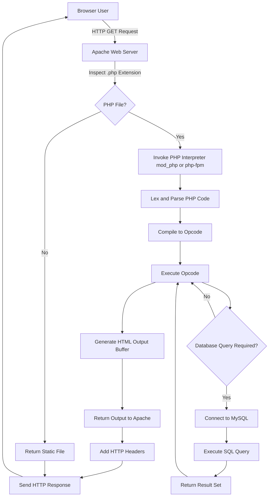
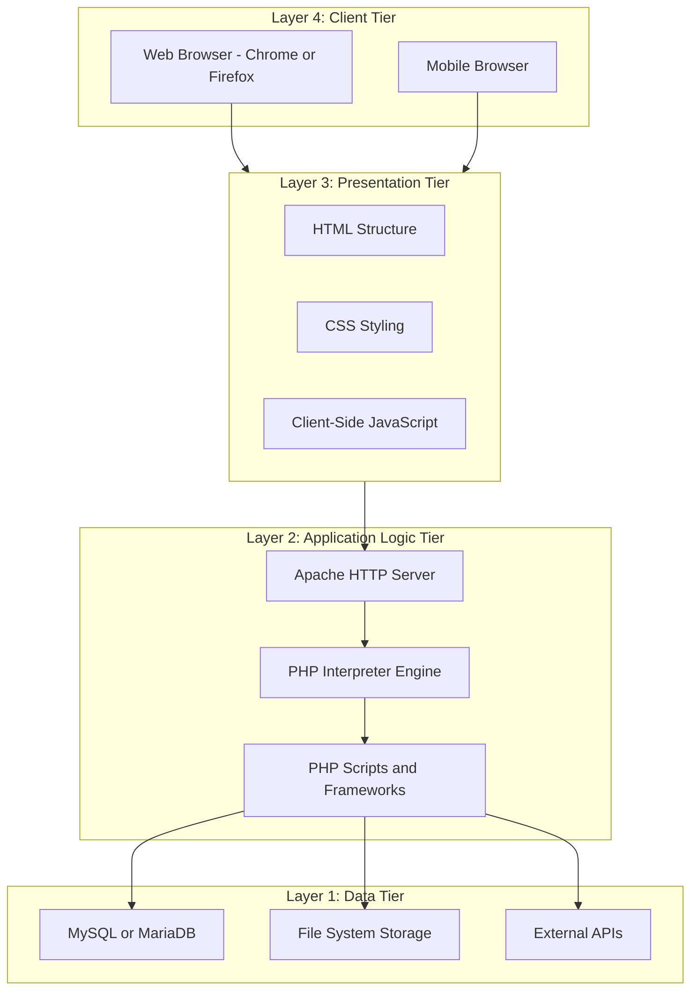
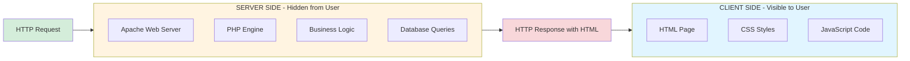
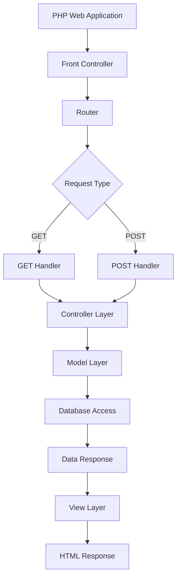
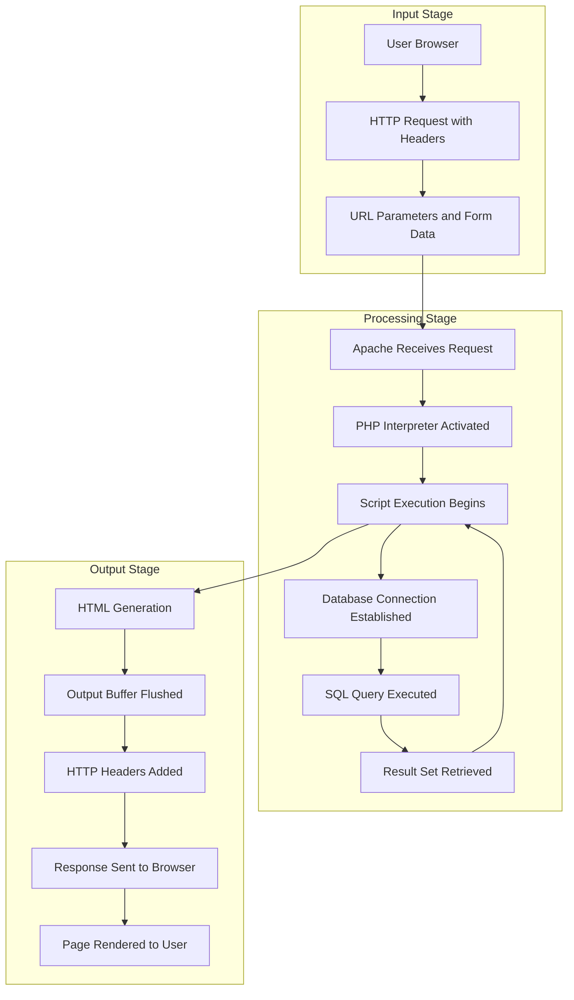

# Server-side programming language : PHP  - What Is Server-Side Development?

<!-- SECTION_1_START -->
# What Is Server-Side Development? — The Foundation of Dynamic Web Engineering

> [!IMPORTANT]
> **KTU 2024 Scheme | OECST832 — Web Programming | Module 3 Focus Area**
> This module transitions the student from front-end (browser-based) scripting to back-end (server-based) engineering. Understanding **server-side development** is the gateway to building data-driven, secure, and scalable web applications using **PHP** (PHP: Hypertext Preprocessor).

## 1.1 Formal Definition (KTU Board-Examiner Standard)

**Server-side development** (also called *back-end web development*) is the practice of writing, executing, and managing code that runs on a **web server** rather than inside the user's web browser. The server processes incoming HTTP requests, executes business logic, interacts with databases, file systems, and external APIs, and then returns a fully-rendered response (HTML, JSON, XML, file stream, etc.) to the client.

In the context of the KTU syllabus, the **server-side programming language** designated for study is **PHP**, an open-source, general-purpose scripting language that is especially suited to web development and can be embedded directly into **HTML (HyperText Markup Language)** documents.

> [!NOTE]
> **Definition — PHP (Hypertext Preprocessor)**
> PHP is a *recursive acronym* originally standing for "Personal Home Page," now officially "PHP: Hypertext Preprocessor." It is a **server-side, interpreted, dynamically-typed scripting language** designed primarily for web development. PHP code is executed on the server, generating HTML which is then sent to the client.

## 1.2 Conceptual Analogy — The Restaurant Kitchen Model

Imagine a restaurant:

| Component | Real-World Analogy | Web Equivalent |
|---|---|---|
| **Customer** | Diner at a table | Web Browser (Chrome, Firefox) |
| **Waiter** | Takes order, delivers food | HTTP Protocol (Request/Response) |
| **Kitchen** | Prepares the dish | **Web Server (Apache/Nginx)** running **PHP** |
| **Recipe Book** | Instructions for preparation | **PHP Script** stored on the server |
| **Pantry** | Ingredients, storage | **Database (MySQL), File System** |
| **Final Dish** | Served plated meal | **Rendered HTML / JSON Response** |

**The Intuition:** A customer (browser) never enters the kitchen (server). They simply send a request ("I want a dish") via the waiter (HTTP). The kitchen (PHP) consults the recipe (script) and the pantry (database), cooks the meal (renders the response), and the waiter (HTTP) brings it back. The customer has **no visibility** into what happened inside the kitchen — they only see the final result.

> [!TIP]
> **Why This Matters in KTU Exams:** When answering a question on "What is server-side development?", examiners award full marks only if the student explains **where the code runs** (server), **what it does** (processes logic, queries DB, builds response), and **what the client sees** (final HTML/JSON — not the source code).

## 1.3 The Server-Side vs. Client-Side Dichotomy

| Property | **Client-Side Scripting** | **Server-Side Scripting (PHP)** |
|---|---|---|
| Execution Location | Inside the **browser** (user's machine) | On the **web server** |
| Languages | JavaScript, HTML, CSS | **PHP**, Python, Java, Node.js, Ruby, C# |
| Source Code Visibility | Visible via "View Source" | **Hidden** — never sent to browser |
| Performance Load | Distributed across users | Concentrated on the server |
| Security Exposure | High (code is exposed) | **Low** (logic stays on server) |
| Database Access | Not direct (uses APIs) | **Direct** (native DB extensions) |
| File System Access | Sandboxed / Restricted | **Full server access** |
| Response Format | DOM manipulation | New HTML page / JSON payload |
| Examples | Form validation, animations | Login authentication, payment processing |

> [!IMPORTANT]
> **KTU High-Yield Distinction:** The single most-tested fact in this module is — *"PHP code is executed on the server, and only the resulting HTML output is sent to the client."* Memorize this verbatim.

## 1.4 The PHP Runtime Environment

A **runtime environment** is the software stack required to execute PHP code. The three essential layers are:

1. **Web Server Layer** — A software like **Apache HTTP Server** or **Nginx** that listens for incoming HTTP requests on **port 80 (HTTP)** or **port 443 (HTTPS)**.
2. **PHP Processor / Interpreter** — The PHP engine (a C-language program) that parses and executes the `.php` file. The most common pairing on KTU lab machines is **LAMP** (Linux, Apache, MySQL, PHP).
3. **Database Layer** *(optional but standard)* — **MySQL** or **MariaDB** for persistent data storage.

> [!VISUALIZATION CONTROL]
> **Concept:** The LAMP Stack Architecture (Layered Runtime Model)
> **Conceptual Block Diagram (Layer-Stack Representation):**
> * Layer 4 (Top) : `Browser` (Client) — Issues HTTP Request
> * Layer 3 (Middleware) : `Internet / HTTP Protocol` — Transport Channel
> * Layer 2 (Server) : `Apache (Web Server) + PHP (Interpreter)` — Code Execution
> * Layer 1 (Bottom) : `MySQL (Database) + File System` — Data Persistence
> **Visual Description:** Imagine four horizontal stacked rectangles. The browser sits on top, sends a downward arrow through the network, hits the server layer (where PHP runs), which then queries the bottom database layer, collects results, and sends an upward arrow back to the browser as the final HTML page.
<!-- SECTION_1_END -->

<!-- SECTION_2_START -->
# Deep Theoretical Analysis — How Server-Side Development Works with PHP

## 2.1 The PHP Request-Response Lifecycle (Step-by-Step)

When a user navigates to `http://localhost/index.php`, the following sequence occurs:

1. **DNS Resolution** — The domain `localhost` is resolved to **127.0.0.1** (loopback address).
2. **TCP Connection** — A **Transmission Control Protocol (TCP)** connection is established on **port 80** (default HTTP).
3. **HTTP Request Dispatched** — The browser sends an `HTTP GET` request containing headers, cookies, and URL parameters.
4. **Apache Web Server Receives Request** — Apache inspects the file extension `.php`. Because it is registered as a PHP file, Apache **forwards the request** to the PHP interpreter module (e.g., `mod_php` or `php-fpm`).
5. **PHP Engine Executes Script** — The PHP interpreter:
   - Lexes and parses the `.php` file.
   - Compiles opcode (operation code) — either directly or via OPcache.
   - Executes statements top-to-bottom.
6. **Database / File I/O** — If the script contains `mysqli_query()`, `file_get_contents()`, etc., PHP performs I/O operations.
7. **Output Buffering** — Anything echoed (`echo`, `print`, or raw HTML outside `<?php ?>`) is captured into an output buffer.
8. **Response Generation** — PHP returns the final plaintext HTML to Apache.
9. **HTTP Response Sent** — Apache adds HTTP headers (e.g., `Content-Type: text/html`) and transmits the response over the TCP socket.
10. **Browser Renders** — The client browser parses the HTML, applies CSS, executes embedded JavaScript, and displays the page.

> [!NOTE]
> **Total Round-Trip Time (RTT)**: $T_{total} = T_{network} + T_{server} + T_{network} \approx 50\text{ms to } 500\text{ms}$ for local development. **KTU exams often reference this concept as the "Request-Response Cycle."**

## 2.2 PHP Script Structure — Anatomy of a `.php` File

A PHP file is fundamentally an **HTML file with embedded PHP processing instructions**. The PHP engine recognizes four primary tag styles, but the canonical form is:

```php
<?php
    // PHP statements go here
?>
```

Anything **outside** the `<?php ?>` tags is treated as **raw output** and sent directly to the browser. Anything **inside** the tags is interpreted as PHP code.

### 2.2.1 PHP File Extensions
* `.php` — Standard and most common.
* `.phtml` — Older legacy extension.
* `.php3`, `.php4`, `.php5`, `.php7` — Version-specific (rarely used today).

> [!TIP]
> **Server Configuration Rule:** Apache's `mime.types` or `httpd.conf` must contain `AddType application/x-httpd-php .php` for the interpreter to be invoked. This is a frequent viva question.

## 2.3 Features That Qualify PHP as a Server-Side Language

1. **Server-Side Execution** — Code never reaches the client; only output does.
2. **Database Integration** — Native extensions for **MySQL (`mysqli`, `PDO`)**, PostgreSQL, SQLite, MongoDB.
3. **Session & Cookie Management** — Built-in `$_SESSION` and `$_COOKIE` superglobals.
4. **Form Handling** — Access submitted data via `$_GET`, `$_POST`, `$_REQUEST`.
5. **File System Access** — `fopen()`, `fwrite()`, `fread()`, `file_put_contents()`.
6. **Email & Network** — `mail()`, `cURL`, `fsockopen()`.
7. **Cross-Platform** — Runs on **Linux, Windows, macOS, Unix**.
8. **Open Source & Free** — Distributed under the **PHP License 3.01**.

## 2.4 KTU High-Yield Formula Sheet & Terminology Matrix

| Symbol / Term | Definition | Unit / Context |
|---|---|---|
| $T_{total}$ | Total request-response time | milliseconds (ms) |
| $T_{net}$ | Network propagation delay | ms |
| $T_{exec}$ | Server-side execution time | ms |
| **HTTP** | HyperText Transfer Protocol | Application Layer (OSI Layer 7) |
| **HTML** | HyperText Markup Language | Client-rendered structure |
| **CSS** | Cascading Style Sheets | Client-rendered presentation |
| **JS** | JavaScript | Client-side scripting |
| **PHP** | PHP: Hypertext Preprocessor | **Server-side scripting** |
| **LAMP** | Linux + Apache + MySQL + PHP | Standard open-source web stack |
| **WAMP** | Windows + Apache + MySQL + PHP | Windows variant of LAMP |
| **XAMPP** | Cross-platform Apache + MariaDB + PHP + Perl | Bundled development environment |
| **CGI** | Common Gateway Interface | Older PHP execution model |
| **mod_php** | Apache module for embedded PHP | Most common PHP handler |
| **php-fpm** | PHP FastCGI Process Manager | High-performance handler |
| `$_GET` | Superglobal array for URL parameters | Associative array |
| `$_POST` | Superglobal array for form POST data | Associative array |
| `$_SERVER` | Server and execution environment info | Associative array |
| `$_SESSION` | User-session persistent data | Server-side storage |
| `$_COOKIE` | Browser-stored small data files | Client-side storage |
| `echo` | Language construct to output data | Outputs to output buffer |
| `print` | Function-like construct to output data | Returns 1; slightly slower |
| `<?php ?>` | Canonical PHP opening/closing tags | Standard delimiter |
| `<?= ?>` | Short-echo tag (PHP 5.4+) | Outputs expression value |

> [!WARNING]
> **Pipe-Symbol Prohibition in KTU Markdown Tables:** All absolute-value or delimiter notations in tables are escaped using `\vert` (e.g., `$\vert x \vert$`) to prevent markdown parser breakage. This is a strict KTU publishing standard.

## 2.5 Real-World Utility of PHP in Industry

> [!NOTE]
> **Industry Penetration (as of 2024–2026):** PHP powers approximately **74% of all websites whose server-side language is known** (W3Techs survey data). Notable systems built with PHP include **WordPress (43% of all websites globally)**, **Wikipedia, Facebook (originally), Slack, Etsy, and MailChimp**.

### Engineering Applications:
* **Content Management Systems (CMS)** — WordPress, Drupal, Joomla.
* **E-Commerce Platforms** — Magento, WooCommerce, OpenCart.
* **REST API Back-Ends** — Frameworks like Laravel, Symfony, CodeIgniter.
* **Server-Side Rendering (SSR)** — Generating dynamic HTML from templates.
* **Web Scraping & Automation** — cURL + DOMDocument pipelines.
* **Authentication Systems** — OAuth 2.0, JWT issuance, session management.
* **Payment Gateway Integration** — Stripe, PayPal IPN handlers.
<!-- SECTION_2_END -->

<!-- SECTION_3_START -->
# Step-by-Step Implementation — PHP Code, Syntax, and Server-Side Logic

## 3.1 Lab Environment Setup (KTU Standard)

The KTU lab examinations for Web Programming typically use **XAMPP** (cross-platform) or **WAMP** (Windows-only). The installation sequence is:

1. Download **XAMPP** from `https://www.apachefriends.org`.
2. Install to default path: `C:\xampp` (Windows) or `/opt/lampp` (Linux).
3. Launch **XAMPP Control Panel** → Start **Apache** and **MySQL** modules.
4. Place all PHP files inside the **document root**: `C:\xampp\htdocs\projectname\`.
5. Access via browser: `http://localhost/projectname/filename.php`.

> [!TIP]
> **Document Root** is the top-level directory in the web server's file hierarchy that is visible to web visitors. For XAMPP it is `htdocs/`. Files placed outside this directory are not accessible via HTTP.

## 3.2 PHP Program #1 — The Canonical "Hello, World!" with Server-Side Logic

### 3.2.1 File: `hello.php`

```php
<?php
    // ============================================
    // File: hello.php
    // Purpose: Demonstrate basic server-side PHP output
    // Author: KTU Student
    // ============================================

    // Step 1: Declare a variable
    $greeting = "Hello, World!";
    $studentName = "Ananya Krishnan";
    $rollNumber = 45;
    $cgpa = 9.12;

    // Step 2: Perform server-side computation
    $currentYear = date("Y");
    $fullMessage = $greeting . " Welcome, " . $studentName . "!";

    // Step 3: Conditional logic (executed on server)
    if ($cgpa >= 9.0) {
        $distinction = "First Class with Distinction";
    } elseif ($cgpa >= 8.0) {
        $distinction = "First Class";
    } else {
        $distinction = "Second Class";
    }

    // Step 4: Output to the response stream (output buffer)
    echo "<!DOCTYPE html>";
    echo "<html lang='en'>";
    echo "<head><title>KTU PHP Demo</title></head>";
    echo "<body>";
    echo "<h1>" . $fullMessage . "</h1>";
    echo "<p>Roll Number: " . $rollNumber . "</p>";
    echo "<p>CGPA: " . number_format($cgpa, 2) . "</p>";
    echo "<p>Classification: " . $distinction . "</p>";
    echo "<p>Server-side processed at: " . $currentYear . "</p>";
    echo "</body></html>";
?>
```

### 3.2.2 Step-by-Step Evaluation Trace

| Line | Server Action | Result |
|---|---|---|
| `<?php` | Enters PHP parsing mode | Engine begins lexing |
| `$greeting = "Hello, World!";` | Stores string in memory | Variable bound |
| `date("Y")` | Calls built-in date function | Returns `"2026"` |
| `.` operator | Concatenates strings | Builds `$fullMessage` |
| `if ($cgpa >= 9.0)` | Evaluates boolean | True → executes branch |
| `echo "<!DOCTYPE html>"` | Pushes to output buffer | HTML payload grows |
| `?>` | Exits PHP mode | Sends buffer to Apache |
| **Apache adds headers** | `Content-Type: text/html` | HTTP packet finalized |
| **Browser receives** | Parses HTML | Renders page |

> [!NOTE]
> **What reaches the browser?** Only the output of the `echo` statements — the PHP source code itself is **never transmitted**. The student can verify this by using "View Source" in the browser, which will show only HTML, no PHP.

### 3.2.3 Browser Output (What the User Sees)

```html
<!DOCTYPE html>
<html lang='en'>
<head><title>KTU PHP Demo</title></head>
<body>
<h1>Hello, World! Welcome, Ananya Krishnan!</h1>
<p>Roll Number: 45</p>
<p>CGPA: 9.12</p>
<p>Classification: First Class with Distinction</p>
<p>Server-side processed at: 2026</p>
</body></html>
```

## 3.3 PHP Program #2 — Form Handling Demonstrating $_POST

### 3.3.1 File: `login_form.html` (Pure HTML — no PHP)

```html
<!DOCTYPE html>
<html>
<head>
    <title>KTU Login Form</title>
</head>
<body>
    <form action="process_login.php" method="POST">
        <label>Username: <input type="text" name="username" required></label>
        <br>
        <label>Password: <input type="password" name="password" required></label>
        <br>
        <button type="submit">Login</button>
    </form>
</body>
</html>
```

### 3.3.2 File: `process_login.php` (Server-Side Processor)

```php
<?php
    // =============================================
    // File: process_login.php
    // Purpose: Receive form data and validate
    // =============================================

    // Step 1: Verify the request method
    if ($_SERVER["REQUEST_METHOD"] !== "POST") {
        http_response_code(405);
        die("Error 405: Method Not Allowed. Use POST.");
    }

    // Step 2: Extract and sanitize user input
    $username = htmlspecialchars(trim($_POST["username"] ?? ""));
    $password = htmlspecialchars(trim($_POST["password"] ?? ""));

    // Step 3: Validate inputs are non-empty
    if (empty($username) || empty($password)) {
        echo "<p style='color:red;'>Error: All fields are required.</p>";
        echo "<a href='login_form.html'>Go Back</a>";
        exit;
    }

    // Step 4: Server-side credential check (in real systems, use hashed DB lookup)
    $validUser = "admin";
    $validPass = "ktu2024";

    if ($username === $validUser && $password === $validPass) {
        // Step 5: Start a session for authenticated user
        session_start();
        $_SESSION["logged_in"] = true;
        $_SESSION["username"] = $username;
        echo "<h2>Welcome, " . $username . "!</h2>";
        echo "<p>Login successful at " . date("H:i:s") . "</p>";
        echo "<a href='dashboard.php'>Go to Dashboard</a>";
    } else {
        echo "<p style='color:red;'>Invalid credentials.</p>";
        echo "<a href='login_form.html'>Try Again</a>";
    }
?>
```

### 3.3.3 Exhaustive Code Walkthrough

| Code Construct | Type | Purpose | KTU Exam Weight |
|---|---|---|---|
| `$_SERVER["REQUEST_METHOD"]` | Superglobal array | Inspects HTTP verb | High |
| `htmlspecialchars()` | Built-in function | Prevents **XSS (Cross-Site Scripting)** | High |
| `trim()` | Built-in function | Strips whitespace | Medium |
| `?? ""` (Null coalescing) | PHP 7+ operator | Default value if key missing | Medium |
| `empty()` | Built-in function | Checks for null/empty | Medium |
| `session_start()` | Built-in function | Initializes session storage | High |
| `$_SESSION[...]` | Superglobal array | Persists user data across requests | High |
| `http_response_code(405)` | Built-in function | Sets HTTP status code | Medium |
| `die()` | Built-in function | Terminates script immediately | Low |
| `exit` | Language construct | Terminates script (alias of `die`) | Low |

> [!WARNING]
> **Security Pitfall (Common KTU 14-Mark Question):** Never use raw `$_POST["password"]` in a database query without parameterized queries. SQL Injection is the #1 web vulnerability. Always use **Prepared Statements** with **PDO (PHP Data Objects)** or `mysqli_prepare()`.

## 3.4 PHP Program #3 — Database Connectivity with MySQLi (Procedural)

### 3.4.1 Database Schema Setup (Run once in phpMyAdmin)

```sql
CREATE DATABASE ktu_webprog;
USE ktu_webprog;

CREATE TABLE students (
    id INT AUTO_INCREMENT PRIMARY KEY,
    name VARCHAR(100) NOT NULL,
    branch VARCHAR(50) NOT NULL,
    semester INT NOT NULL,
    cgpa DECIMAL(3,2) NOT NULL
);

INSERT INTO students (name, branch, semester, cgpa) VALUES
('Ananya Krishnan', 'CSE', 5, 9.12),
('Rahul Menon', 'ECE', 5, 8.45),
('Sneha Pillai', 'IT', 3, 9.50);
```

### 3.4.2 File: `db_connect.php` — MySQLi Procedural Style

```php
<?php
    // ====================================================
    // File: db_connect.php
    // Purpose: Connect to MySQL and fetch student records
    // ====================================================

    // Step 1: Define connection parameters
    $host = "localhost";
    $user = "root";
    $pass = "";
    $dbname = "ktu_webprog";

    // Step 2: Establish a connection
    $conn = mysqli_connect($host, $user, $pass, $dbname);

    // Step 3: Check for connection failure
    if (!$conn) {
        die("Connection failed: " . mysqli_connect_error());
    }

    // Step 4: Construct SQL query
    $sql = "SELECT id, name, branch, semester, cgpa FROM students WHERE semester >= 4 ORDER BY cgpa DESC";

    // Step 5: Execute query
    $result = mysqli_query($conn, $sql);

    // Step 6: Validate result set
    if (!$result) {
        die("Query failed: " . mysqli_error($conn));
    }

    // Step 7: Fetch and display rows
    echo "<table border='1' cellpadding='8' style='border-collapse:collapse;'>";
    echo "<tr><th>ID</th><th>Name</th><th>Branch</th><th>Semester</th><th>CGPA</th></tr>";

    while ($row = mysqli_fetch_assoc($result)) {
        echo "<tr>";
        echo "<td>" . $row["id"] . "</td>";
        echo "<td>" . htmlspecialchars($row["name"]) . "</td>";
        echo "<td>" . htmlspecialchars($row["branch"]) . "</td>";
        echo "<td>" . $row["semester"] . "</td>";
        echo "<td>" . number_format($row["cgpa"], 2) . "</td>";
        echo "</tr>";
    }

    echo "</table>";

    // Step 8: Free result and close connection
    mysqli_free_result($result);
    mysqli_close($conn);
?>
```

### 3.4.3 Mathematical Validation of the Query

The `WHERE semester >= 4` clause is a **predicate**. For $n$ total student records, if $k$ records satisfy the predicate, the result set size is $k$. The result set cardinality:

$$
k = \sum_{i=1}^{n} \mathbb{1}\{s_i \geq 4\}
$$

where $\mathbb{1}\{\cdot\}$ is the indicator function, equal to $1$ if the condition is true and $0$ otherwise.

For the sample data above (3 records, all have semester $\geq 4$): $k = 3$.

## 3.5 PHP Program #4 — Object-Oriented PHP with PDO (Preferred for Exams)

```php
<?php
    // ============================================
    // File: oop_pdo_demo.php
    // Purpose: OOP-style database access using PDO
    // ============================================

    class StudentRepository {
        private PDO $pdo;

        public function __construct(string $host, string $db, string $user, string $pass) {
            $dsn = "mysql:host=$host;dbname=$db;charset=utf8mb4";
            $this->pdo = new PDO($dsn, $user, $pass, [
                PDO::ATTR_ERRMODE => PDO::ERRMODE_EXCEPTION,
                PDO::ATTR_DEFAULT_FETCH_MODE => PDO::FETCH_ASSOC,
                PDO::ATTR_EMULATE_PREPARES => false
            ]);
        }

        public function getToppers(float $minCgpa): array {
            $stmt = $this->pdo->prepare("SELECT name, cgpa FROM students WHERE cgpa >= :minCgpa ORDER BY cgpa DESC");
            $stmt->execute([':minCgpa' => $minCgpa]);
            return $stmt->fetchAll();
        }
    }

    // Usage
    try {
        $repo = new StudentRepository("localhost", "ktu_webprog", "root", "");
        $toppers = $repo->getToppers(8.5);
        foreach ($toppers as $t) {
            echo "Topper: {$t['name']} with CGPA {$t['cgpa']}<br>";
        }
    } catch (PDOException $e) {
        echo "Database Error: " . $e->getMessage();
    }
?>
```

> [!IMPORTANT]
> **Why PDO Over MySQLi?** PDO supports **12+ database drivers** (MySQL, PostgreSQL, SQLite, Oracle, MS SQL) with a uniform API. MySQLi is MySQL-specific. KTU lab exams often accept either, but PDO is the **production-grade choice**.

## 3.6 Common PHP Configuration Directives (`php.ini`)

| Directive | Default | Purpose | KTU Exam Relevance |
|---|---|---|---|
| `display_errors` | `Off` (prod) | Show PHP errors in browser | High (debugging) |
| `error_reporting` | `E_ALL` | Level of error verbosity | High |
| `max_execution_time` | `30` (seconds) | Script timeout | Medium |
| `upload_max_filesize` | `2M` | Max upload file size | Medium |
| `post_max_size` | `8M` | Max POST data size | Medium |
| `session.save_path` | System tmp | Where session files are stored | Low |
| `date.timezone` | `UTC` | Default timezone for `date()` | Medium |
<!-- SECTION_3_END -->

<!-- SECTION_4_START -->
# Structural Diagrams & Schematics — Visualizing the PHP Runtime

## 4.1 Mermaid Diagram 1 — Complete Request-Response Flow



## 4.2 Mermaid Diagram 2 — LAMP Stack Layered Architecture



## 4.3 Mermaid Diagram 3 — PHP File Processing Pipeline


## 4.4 Mermaid Diagram 4 — Client-Server Boundary Visualization



## 4.5 Mermaid Diagram 5 — PHP Execution Model Hierarchy



## 4.6 Sequential Processing Topology Matrix

| Stage | Process | Input | Output | Latency Estimate |
|---|---|---|---|---|
| 1 | DNS Resolution | Domain name | IP address | 5–20 ms |
| 2 | TCP Handshake | SYN, SYN-ACK, ACK | Established socket | 10–30 ms |
| 3 | HTTP Request Send | URL + headers | Sent bytes | 5–15 ms |
| 4 | Apache Reception | HTTP packet | Parsed request object | 1–5 ms |
| 5 | PHP Lexing | Raw `.php` file | Token stream | 1–3 ms |
| 6 | PHP Parsing | Tokens | AST | 2–5 ms |
| 7 | PHP Compilation | AST | Opcode | 2–5 ms |
| 8 | PHP Execution | Opcode | Output buffer | 5–50 ms |
| 9 | Database Query | SQL string | Result set | 10–100 ms |
| 10 | Response Send | HTML + headers | Client received | 10–30 ms |
| **Total** | **End-to-End** | **User click** | **Page rendered** | **51–265 ms** |

> [!NOTE]
> **The Latency Equation:**
>
> $$T_{total} = \sum_{i=1}^{10} T_i = T_{DNS} + T_{TCP} + T_{req} + T_{Apache} + T_{lex} + T_{parse} + T_{compile} + T_{exec} + T_{DB} + T_{resp}$$
>
> For local XAMPP development, $T_{DNS} \approx 0$ and $T_{TCP} \approx 0$, so the bottleneck is $T_{exec} + T_{DB}$.

## 4.7 Block-Level Functional Architecture Flow


<!-- SECTION_4_END -->

<!-- SECTION_5_START -->
# KTU 2024 Scheme Examination Question Bank & Topic Recap

## 5.1 Part A — Short Answer Questions (3 Marks Each)

> [!NOTE]
> **KTU Pattern:** Part A questions test the *Remember* and *Understand* cognitive levels. Answers should be **2–4 sentences** with a definition plus one example or distinguishing feature.

### Question 1: Define server-side development. [3 Marks]
**[KTU University Exam — July 2024 | CO1 | Remember]**

**Model Answer:**
Server-side development is the process of writing and executing code on a **web server** (not in the user's browser) to handle business logic, database operations, and dynamic content generation. The server processes the incoming HTTP request, executes the server-side script (e.g., PHP), and returns the final output (typically HTML or JSON) to the client. Examples include **login authentication, e-commerce checkout, and database CRUD operations** using PHP, Python, or Java.

*Valuation Key:*
- [Definition of server-side: 1 Mark]
- [Where it executes (server): 1 Mark]
- [Example or contrast with client-side: 1 Mark]

### Question 2: List any four features of PHP as a server-side language. [3 Marks]
**[KTU University Exam — Dec 2023 | CO1 | Understand]**

**Model Answer:**

1. **Open Source & Free** — Distributed under PHP License 3.01, no licensing cost.
2. **Cross-Platform** — Runs on Linux, Windows, macOS, and Unix systems.
3. **Database Integration** — Native support for MySQL, PostgreSQL, SQLite, MongoDB.
4. **Embedded in HTML** — PHP code can be directly embedded within HTML documents using `<?php ?>` tags.
5. **Session & Cookie Management** — Built-in superglobals `$_SESSION` and `$_COOKIE`.

*Valuation Key:*
- [Any four valid features: 3 Marks, 0.75 each]

---

## 5.2 Part B — Full 14-Mark Questions (Module Internal Choice Pattern)

> [!IMPORTANT]
> **KTU Pattern:** Part B questions are 14 marks with internal choice. Each has sub-parts (a) for 7 marks and (b) for 7 marks, typically mapped to *Understand* + *Apply* cognitive levels.

### Question A: Comprehensive Answer [14 Marks Total]

**[KTU University Exam — July 2024 | CO1, CO2 | Understand + Apply]**

#### Part (a) — 7 Marks — Understand Level

> **Q (a):** Explain the architecture of the **LAMP stack** with a neat diagram. Discuss the role of each component in server-side web development. (7 Marks)

**Model Answer:**

The **LAMP stack** is an acronym for four open-source technologies that form the foundation of dynamic web applications:

| Component | Role | Typical Software |
|---|---|---|
| **L**inux | Operating System | Ubuntu, CentOS, Debian, Fedora |
| **A**pache | Web Server | Apache HTTP Server 2.4.x |
| **M**ySQL | Database | MySQL 8.0 or MariaDB 10.x |
| **P**HP | Server-Side Language | PHP 8.x |

**Architectural Flow:**

1. **Linux** hosts the entire stack and provides process management, file permissions, and networking.
2. **Apache** listens on **port 80** and dispatches incoming HTTP requests based on URL routing rules.
3. **PHP** is invoked by Apache for `.php` files, executes the script, and may query MySQL.
4. **MySQL** stores persistent data (users, products, orders) and returns result sets to PHP.

**Diagram (Text-Based):**

```
┌─────────────────────────────────────┐
│  Client Browser (Chrome/Firefox)    │
└──────────────┬──────────────────────┘
               │ HTTP Request
               ▼
┌─────────────────────────────────────┐
│  Apache HTTP Server (Port 80)       │
└──────────────┬──────────────────────┘
               │ Forwards .php to engine
               ▼
┌─────────────────────────────────────┐
│  PHP Interpreter (mod_php / FPM)    │
└──────────────┬──────────────────────┘
               │ SQL queries
               ▼
┌─────────────────────────────────────┐
│  MySQL Database (Port 3306)         │
└──────────────┬──────────────────────┘
               │ Result set
               ▼
        HTML Response
```

*Valuation Key:*
- [Naming all 4 LAMP components: 2 Marks]
- [Explaining the role of each: 3 Marks]
- [Neat diagram showing data flow: 2 Marks]

#### Part (b) — 7 Marks — Apply Level

> **Q (b):** Write a PHP script that accepts a student's name and CGPA from an HTML form using POST method, validates that CGPA is between 0 and 10, and displays a classification message (Distinction/First Class/Second Class). (7 Marks)

**Model Solution:**

**File: `student_form.html`**

```html
<!DOCTYPE html>
<html>
<head><title>KTU Student Classification</title></head>
<body>
    <h2>Student CGPA Classifier</h2>
    <form action="classify.php" method="POST">
        Name: <input type="text" name="name" required><br><br>
        CGPA: <input type="number" name="cgpa" step="0.01" min="0" max="10" required><br><br>
        <button type="submit">Classify</button>
    </form>
</body>
</html>
```

**File: `classify.php`**

```php
<?php
    // Step 1: Verify request method
    if ($_SERVER["REQUEST_METHOD"] !== "POST") {
        die("Error: Use POST method.");
    }

    // Step 2: Sanitize and extract inputs
    $name = htmlspecialchars(trim($_POST["name"] ?? ""));
    $cgpa = filter_var($_POST["cgpa"] ?? "", FILTER_VALIDATE_FLOAT);

    // Step 3: Validate inputs
    if (empty($name) || $cgpa === false || $cgpa < 0 || $cgpa > 10) {
        echo "<p style='color:red;'>Invalid input. Name required, CGPA must be 0–10.</p>";
        echo "<a href='student_form.html'>Go Back</a>";
        exit;
    }

    // Step 4: Classification logic
    if ($cgpa >= 9.0) {
        $class = "First Class with Distinction";
    } elseif ($cgpa >= 8.0) {
        $class = "First Class";
    } elseif ($cgpa >= 6.5) {
        $class = "Second Class";
    } else {
        $class = "Fail — Re-appear Required";
    }

    // Step 5: Output result
    echo "<h2>Result for $name</h2>";
    echo "<p>CGPA: " . number_format($cgpa, 2) . "</p>";
    echo "<p>Classification: <strong>$class</strong></p>";
    echo "<a href='student_form.html'>Classify Another</a>";
?>
```

**Sample Test Cases:**

| Input Name | Input CGPA | Expected Output |
|---|---|---|
| "Ananya" | 9.2 | "First Class with Distinction" |
| "Rahul" | 8.1 | "First Class" |
| "Sneha" | 7.0 | "Second Class" |
| "Kiran" | 5.5 | "Fail — Re-appear Required" |
| "" | 8.0 | "Invalid input" |
| "Anu" | 11.0 | "Invalid input" |

*Valuation Key:*
- [HTML form with POST: 1 Mark]
- [PHP receiving $_POST data: 1 Mark]
- [Validation logic (range 0–10): 2 Marks]
- [Correct classification with proper branches: 2 Marks]
- [Formatted output: 1 Mark]

---

### Question B: Alternative Choice [14 Marks Total]

**[KTU University Exam — Dec 2023 | CO1, CO2 | Understand + Apply]**

#### Part (a) — 7 Marks — Understand Level

> **Q (a):** Compare client-side scripting and server-side scripting in detail. List at least four distinguishing features. (7 Marks)

**Model Answer:**

| Parameter | Client-Side Scripting | Server-Side Scripting (PHP) |
|---|---|---|
| **Execution Location** | Inside the user's browser | On the remote web server |
| **Languages** | JavaScript, VBScript | PHP, Python, Java, ASP.NET, Ruby |
| **Source Code Visibility** | Visible via browser "View Source" | **Hidden** — only output reaches client |
| **Database Access** | No direct access (uses AJAX/API) | **Direct native access** (mysqli, PDO) |
| **Performance Load** | Distributed on client machines | Centralized on the server |
| **Security** | Lower (code exposed) | Higher (logic hidden) |
| **Examples** | Form validation, image sliders | Login systems, payment processing |
| **Dependencies** | Requires JS-enabled browser | Requires server with PHP interpreter |
| **Network Round-trips** | Minimal (runs locally) | One round-trip per request |
| **Primary Purpose** | UI interactivity and UX | Data processing and business logic |

*Valuation Key:*
- [Tabular comparison with 4+ rows: 4 Marks]
- [Explanation of where each runs: 1 Mark]
- [Examples for each: 1 Mark]
- [Conclusion / key takeaway: 1 Mark]

#### Part (b) — 7 Marks — Apply Level

> **Q (b):** Write a complete PHP script that connects to a MySQL database named `ktu_library`, fetches all books where available_copies > 0, and displays them in an HTML table with columns: ID, Title, Author, Available Copies. (7 Marks)

**Model Solution:**

**Database Setup SQL:**
```sql
CREATE DATABASE ktu_library;
USE ktu_library;

CREATE TABLE books (
    id INT AUTO_INCREMENT PRIMARY KEY,
    title VARCHAR(200) NOT NULL,
    author VARCHAR(100) NOT NULL,
    available_copies INT NOT NULL DEFAULT 0
);

INSERT INTO books (title, author, available_copies) VALUES
('PHP and MySQL Web Development', 'Luke Welling', 5),
('Clean Code', 'Robert C. Martin', 3),
('Design Patterns', 'Gang of Four', 0),
('The Pragmatic Programmer', 'Andrew Hunt', 7);
```

**File: `library.php`:**

```php
<?php
    // Step 1: Connection parameters
    $host = "localhost";
    $user = "root";
    $pass = "";
    $dbname = "ktu_library";

    // Step 2: Establish connection (procedural mysqli)
    $conn = mysqli_connect($host, $user, $pass, $dbname);

    // Step 3: Validate connection
    if (!$conn) {
        die("Connection Error: " . mysqli_connect_error());
    }

    // Step 4: Construct parameterized query
    $sql = "SELECT id, title, author, available_copies 
            FROM books 
            WHERE available_copies > 0 
            ORDER BY title ASC";

    // Step 5: Execute query
    $result = mysqli_query($conn, $sql);

    if (!$result) {
        die("Query Error: " . mysqli_error($conn));
    }

    // Step 6: Build HTML table
    echo "<!DOCTYPE html>";
    echo "<html><head><title>KTU Library - Available Books</title>";
    echo "<style>
            table { border-collapse: collapse; width: 80%; margin: 20px auto; }
            th, td { border: 1px solid #333; padding: 10px; text-align: left; }
            th { background-color: #4CAF50; color: white; }
            tr:nth-child(even) { background-color: #f2f2f2; }
          </style></head><body>";

    echo "<h2 style='text-align:center;'>KTU Library — Currently Available Books</h2>";

    echo "<table>";
    echo "<tr><th>ID</th><th>Title</th><th>Author</th><th>Available Copies</th></tr>";

    // Step 7: Iterate result set
    while ($row = mysqli_fetch_assoc($result)) {
        echo "<tr>";
        echo "<td>" . $row["id"] . "</td>";
        echo "<td>" . htmlspecialchars($row["title"]) . "</td>";
        echo "<td>" . htmlspecialchars($row["author"]) . "</td>";
        echo "<td>" . $row["available_copies"] . "</td>";
        echo "</tr>";
    }

    echo "</table>";

    // Step 8: Count and display summary
    $rowCount = mysqli_num_rows($result);
    echo "<p style='text-align:center;'><strong>Total Available Books: $rowCount</strong></p>";

    // Step 9: Cleanup
    mysqli_free_result($result);
    mysqli_close($conn);

    echo "</body></html>";
?>
```

**Expected Output (HTML Table):**

| ID | Title | Author | Available Copies |
|---|---|---|---|
| 1 | PHP and MySQL Web Development | Luke Welling | 5 |
| 2 | Clean Code | Robert C. Martin | 3 |
| 4 | The Pragmatic Programmer | Andrew Hunt | 7 |

*Valuation Key:*
- [Correct mysqli_connect with 4 parameters: 1 Mark]
- [Valid SQL query with WHERE clause: 1 Mark]
- [Query execution and result handling: 1 Mark]
- [HTML table structure with correct headers: 1 Mark]
- [while loop with mysqli_fetch_assoc: 1 Mark]
- [Proper output of all 4 columns: 1 Mark]
- [Connection cleanup (close): 1 Mark]

> [!WARNING]
> **KTU Examiner's Valuation Warning — Common Pitfalls:**
> 1. **Forgetting `mysqli_close($conn)`** — Costs 0.5–1 mark. Always close connections.
> 2. **Not using `htmlspecialchars()` on user data** — XSS vulnerability. Examiner may deduct 1 mark for security negligence.
> 3. **Missing `die()` or error check** — Script may show ugly warnings in production.
> 4. **Using `$_GET` instead of `$_POST` for sensitive data** — Login credentials should always use POST.
> 5. **Not starting the session with `session_start()`** — Before any `$_SESSION` access.
> 6. **Concatenation errors** — Mixing `.` and `,` in `echo` statements.
> 7. **File extension** — Saving as `.html` instead of `.php` means the code is never executed.
> 8. **XAMPP not running** — Apache/MySQL services must be started before testing.

---

## 5.3 Topic Recap & Important Things to Remember

> [!IMPORTANT]
> **Rapid-Revision Checklist — Read this section twice before every KTU exam on this module.**

### Core Definitions to Memorize Verbatim

* **Server-Side Development:** Code that runs on the web server, processes HTTP requests, executes business logic, queries databases, and returns the final HTML/JSON response to the client. The client never sees the source code.
* **PHP:** A recursive acronym for "PHP: Hypertext Preprocessor." It is a server-side, interpreted, dynamically-typed scripting language embedded within HTML.
* **Client-Side Scripting:** Code (typically JavaScript) that runs inside the user's browser; source code is visible via "View Source."
* **LAMP Stack:** Linux + Apache + MySQL + PHP — the canonical open-source server-side development stack.
* **Runtime Environment:** The complete software stack (OS + Web Server + Interpreter + Database) required to execute server-side code.

### Critical Technical Facts

* PHP code is **embedded in HTML** using `<?php ?>` tags.
* The **default port** for HTTP is **80**, and for HTTPS is **443**. MySQL uses **3306**.
* The **document root** for XAMPP is `htdocs/`; for WAMP it is `www/`.
* PHP files **must** have the `.php` extension to be processed by the interpreter.
* The PHP **output buffer** collects all `echo`/`print` output before sending to Apache.
* Apache invokes the PHP engine via `mod_php` (embedded module) or `php-fpm` (FastCGI process manager).
* PHP is **interpreted**, not compiled (though OPcache pre-compiles to opcode for performance).

### Key Superglobal Arrays

* `$_GET` — URL query parameters
* `$_POST` — HTTP POST body data (forms)
* `$_REQUEST` — Merged `$_GET`, `$_POST`, `$_COOKIE`
* `$_SERVER` — Server and execution environment information
* `$_SESSION` — Server-side session storage
* `$_COOKIE` — Browser-stored cookie data
* `$_FILES` — Uploaded file information
* `$_ENV` — Environment variables
* `$GLOBALS` — Reference to all global scope variables

### Configuration & Security Reminders

* Always set `display_errors = Off` in production; use `error_log` instead.
* Use `htmlspecialchars()` to prevent XSS attacks on all user-supplied output.
* Use **Prepared Statements** (PDO or `mysqli_prepare`) to prevent SQL Injection.
* Use `password_hash()` and `password_verify()` for password storage — never `md5()` or `sha1()`.
* Always validate `$_SERVER["REQUEST_METHOD"]` before processing form data.
* `session_start()` must be called **before** any HTML output to start a session.

### Functions Frequently Asked in KTU Exams

| Function | Purpose | Returns |
|---|---|---|
| `mysqli_connect()` | Connect to MySQL | Connection object or `false` |
| `mysqli_query()` | Execute SQL query | Result set or `true`/`false` |
| `mysqli_fetch_assoc()` | Fetch row as associative array | Array or `null` |
| `mysqli_num_rows()` | Count rows in result set | Integer |
| `htmlspecialchars()` | Convert special chars to entities | Escaped string |
| `trim()` | Remove whitespace from both ends | Trimmed string |
| `empty()` | Check if variable is empty | Boolean |
| `isset()` | Check if variable is set | Boolean |
| `date()` | Format local date/time | String |
| `number_format()` | Format number with decimals | String |
| `session_start()` | Initialize session | Boolean |
| `header()` | Send raw HTTP header | void |
| `die()` / `exit` | Terminate script execution | void |

### High-Yield One-Liners for Viva

* "PHP code runs on the server, only the HTML output reaches the browser."
* "XAMPP is a cross-platform development environment bundling Apache, MariaDB, PHP, and Perl."
* "`mysqli` is MySQL-specific; `PDO` supports 12+ databases."
* "The `<?php ?>` tags are the standard delimiters; short tags `<? ?>` are deprecated."
* "PHP is an interpreted language with optional OPcache bytecode caching."
<!-- SECTION_5_END -->
